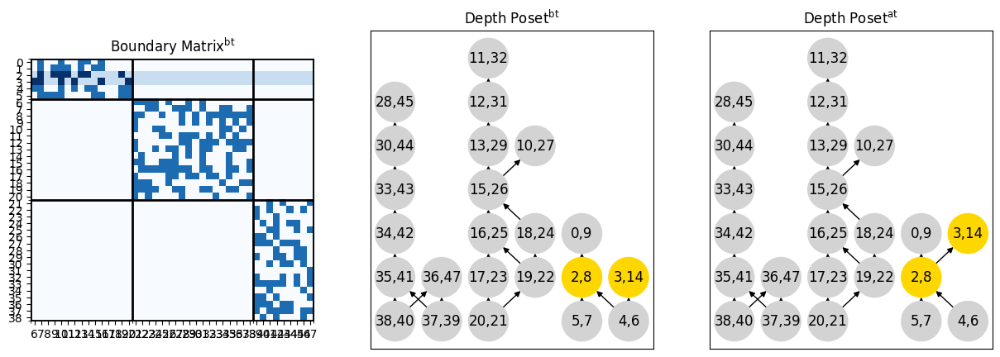
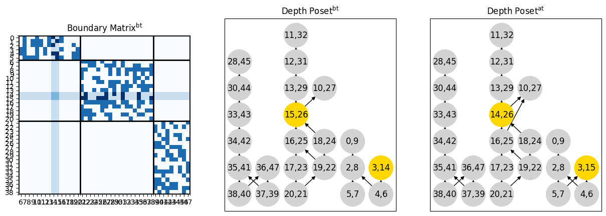
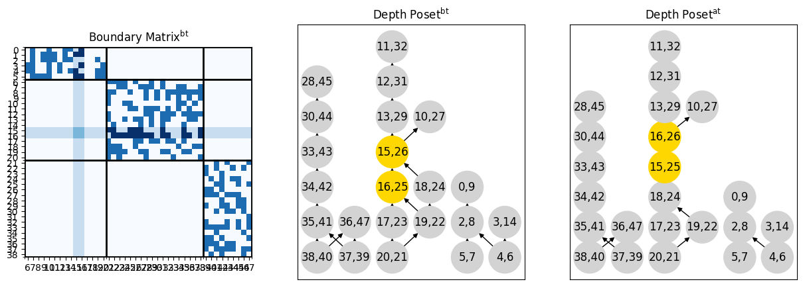
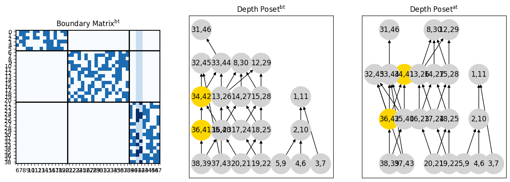
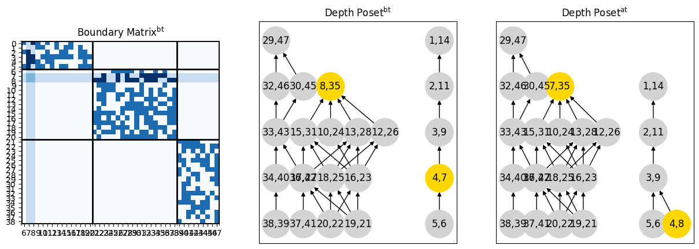
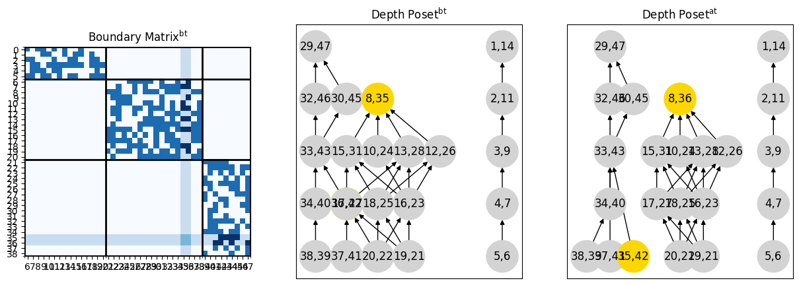

# Random Abstract Complex
For the given vectors $n = (n_0, n_1, ..., n_d)$ and $\beta = (\beta_0, \beta_1, ..., \beta_d)$, where $n$ is the generated complex numbers of cells of given dimension and $\beta$ is Betti numbers, we can find the vector of ranks $r = (r_1, r_2, ..., r_d)$ satysfyng the system

$$
A\cdot r = n - \beta
$$

where

$$
A = 
\begin{pmatrix}
    1 & 0 & 0 & \cdots & 0 & 0 \\
    1 & 1 & 0 & \cdots & 0 & 0 \\
    0 & 1 & 1 & \cdots & 0 & 0 \\
    \cdots & \cdots & \cdots & \cdots & \cdots & \cdots \\
    0 & 0 & 0 & \cdots & 1 & 1 \\
    0 & 0 & 0 & \cdots & 0 & 1 \\
\end{pmatrix} \in \{0, 1\}^{n-1\times n}
$$

To construct the boundary matrix of the abstract Lefschetz complex we aim to generate $d-1$ matrices $\Delta_1, \Delta_2, ..., \Delta_d$, such that $`\Delta_k \in \mathbb{F}_2^{n_k\times n_{k-1}}`$ has rank $r_k$ and $`\Delta_k\times\Delta_{k-1} = 0`$.

Let $\Delta_0$ be the only matrix from $`\mathbb{F}_2^{n_0\times 0}`$. Then for each $k$ we can generate the $\Delta_k$ from $\Delta_{k-1}$: Let $K_k$ be the basis of $\ker\Delta_k$, and $A_k, B_k$ be the uniformly distributed matrices over $`\mathbb{F}_2`$ sizes $`(\dim\ker\Delta_{k-1}, r_k)`$ and $(r_k, n_k - r_k)$, and ranks $`\min(\dim\ker\Delta_{k-1}, r_k)`$ and $`\min(r_k, n_k - r_k)$`. 

Then we compute

$$
\Delta_k' = (K_{k-1}\cdot A_k, K_{k-1}\cdot A_k\cdot B_k)
$$

and define $\Delta_k$ from $\Delta_k'$ by random column permutation.

# Data 
We have 25 complexes.

|    |   Dimension |   Cells | $n$-vector       | Betti-vector   |   Nodes in Depth Poset |   Complexes |
|---:|------------:|--------:|:-----------------|:---------------|-----------------------:|------------:|
|  0 |           3 |      48 | $(6, 15, 18, 9)$ | $(1, 0, 0, 1)$ |                     23 |           5 |
|  1 |           3 |      48 | $(6, 15, 18, 9)$ | $(1, 0, 1, 2)$ |                     22 |           5 |
|  2 |           3 |      48 | $(6, 15, 18, 9)$ | $(1, 1, 1, 1)$ |                     22 |           5 |
|  3 |           3 |      48 | $(6, 15, 18, 9)$ | $(1, 1, 2, 2)$ |                     21 |           5 |
|  4 |           3 |      48 | $(6, 15, 18, 9)$ | $(1, 2, 2, 1)$ |                     21 |           5 |

# Transpositions
In this data we got 917 by transposing consecutive pairs. The distribution of the transposition types is given in the table:

| transposition_type   |   no switch (nested) |   no switch (not nested) |   switch backward |   switch forward |
|:---------------------|---------------------:|-------------------------:|------------------:|-----------------:|
| birth-birth          |                  125 |                      149 |                71 |               66 |
| birth-death          |                    0 |                       61 |                 0 |               37 |
| death-death          |                  131 |                      139 |                80 |               58 |

# Equations
We checked 44 equations. And we can see the distribution of transposiions, satysfying these equations in the tables:

## Birth-Birth Transpositions
| Name      | Formula                                                                                                                                   | Transposition Type   | Switch Type            | Correct   |
|:----------|:------------------------------------------------------------------------------------------------------------------------------------------|:---------------------|:-----------------------|:----------|
| Eq08      | $\text{Succ}_1^\text{at}(a, y) = \text{Succ}_1^\text{bt}(x, y) \oplus \{(x, b)\} \oplus \text{Succ}_1^\text{bt}(a, b)$                    | birth-birth          | switch forward         | 100%      |
| Eq09      | $\text{Succ}_1^\text{at}(x, b) = \text{Succ}_1^\text{bt}(a, b)$                                                                           | birth-birth          | switch forward         | 100%      |
| Eq10      | $\text{Pred}_1^\text{at}(a, y) = \text{Pred}_1^\text{bt}(x, y)$                                                                           | birth-birth          | switch forward         | 100%      |
| Eq11      | $\text{Pred}_1^\text{at}(x, b) = \text{Pred}_1^\text{bt}(a, b) \oplus \{(a, y)\}$                                                         | birth-birth          | switch forward         | 100%      |
| Eq12      | $\text{Succ}_2^\text{at}(a, y) = \text{Succ}_2^\text{bt}(x, y) \oplus \{(x, b), (a, b)\}$                                                 | birth-birth          | switch forward         | 100%      |
| Eq13      | $\text{Succ}_2^\text{at}(x, b) = \text{Succ}_2^\text{bt}(a, b)$                                                                           | birth-birth          | switch forward         | 45%       |
| Eq14      | $\text{Pred}_2^\text{at}(a, y) = [\text{Pred}_2^\text{bt}(a, b) \cap \mathcal{L}]$                                                        | birth-birth          | switch forward         | 100%      |
| Eq15      | $\text{Pred}_2^\text{at}(x, b) = \text{Pred}_2^\text{bt}(x, y) \oplus \{(a, y)\} \oplus [\text{Pred}_2^\text{bt}(a, b) \cap \mathcal{M}]$ | birth-birth          | switch forward         | 100%      |
| Eq16      | $\text{Succ}_1^\text{at}(x, y) = \text{Succ}_1^\text{bt}(x, y) \oplus \{(a, b)\} \oplus \text{Succ}_1^\text{bt}(a, b)$                    | birth-birth          | no switch (nested)     | 48%       |
| Eq17      | $\text{Pred}_1^\text{at}(a, b) = \text{Pred}_1^\text{bt}(a, b) \oplus \{(x, y)\}$                                                         | birth-birth          | no switch (nested)     | 48%       |
| Eq26      | $\text{Pred}_2^\text{bt}(a, b) = \text{Pred}_2^\text{at}(a, y) \oplus \{(x, y)\} \oplus [\text{Pred}_2^\text{at}(x, b) \cap \mathcal{M}]$ | birth-birth          | switch backward        | 100%      |
| Eq27      | $\text{Pred}_2^\text{bt}(x, y) = [\text{Pred}_2^\text{at}(x, b) \cap \mathcal{L}]$                                                        | birth-birth          | switch backward        | 100%      |
| EqPred1ab | $\text{Pred}_1^\text{at}(a, b) = \text{Pred}_1^\text{bt}(a, b)$                                                                           | birth-birth          | no switch (not nested) | 100%      |
| EqPred1xy | $\text{Pred}_1^\text{at}(x, y) = \text{Pred}_1^\text{bt}(x, y)$                                                                           | birth-birth          | no switch (not nested) | 100%      |
| EqPred2ab | $\text{Pred}_2^\text{at}(a, b) = \text{Pred}_2^\text{bt}(a, b)$                                                                           | birth-birth          | no switch (not nested) | 100%      |
| EqPred2xy | $\text{Pred}_2^\text{at}(x, y) = \text{Pred}_2^\text{bt}(x, y)$                                                                           | birth-birth          | no switch (not nested) | 100%      |
| EqSucc1ab | $\text{Succ}_1^\text{at}(a, b) = \text{Succ}_1^\text{bt}(a, b)$                                                                           | birth-birth          | no switch (not nested) | 100%      |
| EqSucc1xy | $\text{Succ}_1^\text{at}(x, y) = \text{Succ}_1^\text{bt}(x, y)$                                                                           | birth-birth          | no switch (not nested) | 100%      |
| EqSucc2ab | $\text{Succ}_2^\text{at}(a, b) = \text{Succ}_2^\text{bt}(a, b)$                                                                           | birth-birth          | no switch (not nested) | 100%      |
| EqSucc2xy | $\text{Succ}_2^\text{at}(x, y) = \text{Succ}_2^\text{bt}(x, y)$                                                                           | birth-birth          | no switch (not nested) | 100%      |

## Death-Death Transpositions
| Name      | Formula                                                                                                                                   | Transposition Type   | Switch Type            | Correct   |
|:----------|:------------------------------------------------------------------------------------------------------------------------------------------|:---------------------|:-----------------------|:----------|
| Eq28      | $\text{Succ}_1^\text{at}(x, b) = \text{Succ}_1^\text{bt}(x, y) \oplus \{(a, y), (a, b)\}$                                                 | death-death          | switch forward         | 100%      |
| Eq29      | $\text{Succ}_1^\text{at}(a, y) = \text{Succ}_1^\text{bt}(a, b)$                                                                           | death-death          | switch forward         | 40%       |
| Eq30      | $\text{Pred}_1^\text{at}(x, b) = [\text{Pred}_1^\text{bt}(a, b) \cap \mathcal{B}]$                                                        | death-death          | switch forward         | 100%      |
| Eq31      | $\text{Pred}_1^\text{at}(a, y) = \text{Pred}_1^\text{bt}(x, y) \oplus \{(x, b)\} \oplus[\text{Pred}_1^\text{bt}(a, b) \cap \mathcal{N}]$  | death-death          | switch forward         | 100%      |
| Eq32      | $\text{Succ}_2^\text{at}(x, b) = \text{Succ}_2^\text{bt}(x, y) \oplus \{(a, y)\} \oplus \text{Succ}_2^\text{bt}(a, b)$                    | death-death          | switch forward         | 100%      |
| Eq33      | $\text{Succ}_2^\text{at}(a, y) = \text{Succ}_2^\text{bt}(a, b)$                                                                           | death-death          | switch forward         | 100%      |
| Eq34      | $\text{Pred}_2^\text{at}(x, b) = \text{Pred}_2^\text{bt}(x, y)$                                                                           | death-death          | switch forward         | 100%      |
| Eq35      | $\text{Pred}_2^\text{at}(a, y) = \text{Pred}_2^\text{bt}(a, b) \oplus \{(x, b)\}$                                                         | death-death          | switch forward         | 100%      |
| Eq36      | $\text{Succ}_2^\text{at}(x, y) = \text{Succ}_2^\text{bt}(x, y) \oplus \{(a, b)\} \oplus \text{Succ}_2^\text{bt}(a, b)$                    | death-death          | no switch (nested)     | 50%       |
| Eq37      | $\text{Pred}_2^\text{at}(a, b) = \text{Pred}_2^\text{bt}(a, b) \oplus \{(x, y)\}$                                                         | death-death          | no switch (nested)     | 50%       |
| Eq46      | $\text{Pred}_1^\text{bt}(a, b) = \text{Pred}_1^\text{at}(x, b) \oplus \{(x, y)\} \oplus [\text{Pred}_1^\text{at}(a, y) \cap \mathcal{N}]$ | death-death          | switch backward        | 100%      |
| Eq47      | $\text{Pred}_1^\text{bt}(x, y) = [\text{Pred}_1^\text{at}(a, y) \cap \mathcal{B}]$                                                        | death-death          | switch backward        | 100%      |
| EqPred1ab | $\text{Pred}_1^\text{at}(a, b) = \text{Pred}_1^\text{bt}(a, b)$                                                                           | death-death          | no switch (not nested) | 100%      |
| EqPred1xy | $\text{Pred}_1^\text{at}(x, y) = \text{Pred}_1^\text{bt}(x, y)$                                                                           | death-death          | no switch (not nested) | 100%      |
| EqPred2ab | $\text{Pred}_2^\text{at}(a, b) = \text{Pred}_2^\text{bt}(a, b)$                                                                           | death-death          | no switch (not nested) | 100%      |
| EqPred2xy | $\text{Pred}_2^\text{at}(x, y) = \text{Pred}_2^\text{bt}(x, y)$                                                                           | death-death          | no switch (not nested) | 100%      |
| EqSucc1ab | $\text{Succ}_1^\text{at}(a, b) = \text{Succ}_1^\text{bt}(a, b)$                                                                           | death-death          | no switch (not nested) | 100%      |
| EqSucc1xy | $\text{Succ}_1^\text{at}(x, y) = \text{Succ}_1^\text{bt}(x, y)$                                                                           | death-death          | no switch (not nested) | 100%      |
| EqSucc2ab | $\text{Succ}_2^\text{at}(a, b) = \text{Succ}_2^\text{bt}(a, b)$                                                                           | death-death          | no switch (not nested) | 100%      |
| EqSucc2xy | $\text{Succ}_2^\text{at}(x, y) = \text{Succ}_2^\text{bt}(x, y)$                                                                           | death-death          | no switch (not nested) | 100%      |

## Birth-Death Transpositions
| Name      | Formula                                                                              | Transposition Type   | Switch Type            | Correct   |
|:----------|:-------------------------------------------------------------------------------------|:---------------------|:-----------------------|:----------|
| Eq48      | $\text{Succ}_1^\text{at}(a, x) = \text{Succ}_1^\text{bt}(a, b)$                      | birth-death          | switch forward         | 100%      |
| Eq49      | $\text{Succ}_1^\text{at}(b, y) = \text{Succ}_1^\text{bt}(x, y)$                      | birth-death          | switch forward         | 100%      |
| Eq50      | $\text{Pred}_1^\text{at}(a, x) = \{(s, t)\in \text{BD}:\; U_1^\text{bt}[t, x] = 1\}$ | birth-death          | switch forward         | 19%       |
| Eq50a     | $\text{Pred}_1^\text{at}(a, x) = A_1^\text{bt} \cap B_1^\text{bt}$                   | birth-death          | switch forward         | 19%       |
| Eq50b     | $\text{Pred}_1^\text{at}(a, x) = A_1^\text{bt} \cap B_1^\text{at}$                   | birth-death          | switch forward         | 100%      |
| Eq51      | $\text{Pred}_1^\text{at}(b, y) = \text{Pred}_1^\text{bt}(x, y)$                      | birth-death          | switch forward         | 100%      |
| Eq52      | $\text{Succ}_2^\text{at}(a, x) = \text{Succ}_2^\text{bt}(a, b)$                      | birth-death          | switch forward         | 100%      |
| Eq53      | $\text{Succ}_2^\text{at}(b, y) = \text{Succ}_2^\text{bt}(x, y)$                      | birth-death          | switch forward         | 100%      |
| Eq54      | $\text{Pred}_2^\text{at}(a, x) = \text{Pred}_2^\text{bt}(a, b)$                      | birth-death          | switch forward         | 100%      |
| Eq55      | $\text{Pred}_2^\text{at}(b, y) = \{(s, t)\in \text{BD}:\; U_2^\text{bt}[b, s] = 1\}$ | birth-death          | switch forward         | 3%        |
| Eq55a     | $\text{Pred}_2^\text{at}(b, y) = A_2^\text{bt} \cap B_2^\text{bt}$                   | birth-death          | switch forward         | 3%        |
| Eq55b     | $\text{Pred}_2^\text{at}(b, y) = A_2^\text{bt} \cap B_2^\text{at}$                   | birth-death          | switch forward         | 100%      |
| EqPred1ab | $\text{Pred}_1^\text{at}(a, b) = \text{Pred}_1^\text{bt}(a, b)$                      | birth-death          | no switch (not nested) | 100%      |
| EqPred1xy | $\text{Pred}_1^\text{at}(x, y) = \text{Pred}_1^\text{bt}(x, y)$                      | birth-death          | no switch (not nested) | 100%      |
| EqPred2ab | $\text{Pred}_2^\text{at}(a, b) = \text{Pred}_2^\text{bt}(a, b)$                      | birth-death          | no switch (not nested) | 100%      |
| EqPred2xy | $\text{Pred}_2^\text{at}(x, y) = \text{Pred}_2^\text{bt}(x, y)$                      | birth-death          | no switch (not nested) | 100%      |
| EqSucc1ab | $\text{Succ}_1^\text{at}(a, b) = \text{Succ}_1^\text{bt}(a, b)$                      | birth-death          | no switch (not nested) | 100%      |
| EqSucc1xy | $\text{Succ}_1^\text{at}(x, y) = \text{Succ}_1^\text{bt}(x, y)$                      | birth-death          | no switch (not nested) | 100%      |
| EqSucc2ab | $\text{Succ}_2^\text{at}(a, b) = \text{Succ}_2^\text{bt}(a, b)$                      | birth-death          | no switch (not nested) | 100%      |
| EqSucc2xy | $\text{Succ}_2^\text{at}(x, y) = \text{Succ}_2^\text{bt}(x, y)$                      | birth-death          | no switch (not nested) | 100%      |

# Incorrect Equations
We have 239 transpositions, such that some equations are incorrect.
We will list some examples.

## Transposition <2, 3> in complex 0
Here is a __birth-birth__ __no switch__ transposition <2, 3>.

$$
a = 2, \; b = 8, \; x = 3, \; y = 14
$$

### Birth Death Pairs
|                          |                                                                                                                                                                                                                                   |
|:-------------------------|:----------------------------------------------------------------------------------------------------------------------------------------------------------------------------------------------------------------------------------|
| Before the transposition | $\{(4, 6), (5, 7), (12, 31), (2, 8), (37, 39), (28, 45), (10, 27), (11, 32), (13, 29), (15, 26), (16, 25), (35, 41), (38, 40), (17, 23), (34, 42), (30, 44), (18, 24), (33, 43), (20, 21), (3, 14), (0, 9), (19, 22), (36, 47)\}$ |
| After the transposition  | $\{(4, 6), (5, 7), (12, 31), (2, 8), (37, 39), (28, 45), (10, 27), (11, 32), (13, 29), (15, 26), (16, 25), (35, 41), (38, 40), (17, 23), (34, 42), (30, 44), (18, 24), (33, 43), (20, 21), (3, 14), (0, 9), (19, 22), (36, 47)\}$ |

### Relations
|                          | Algorithm 1                                                                                                                                                                                                                                                                                                                                                                                                                                                  | Algorithm 2                                                                                                                                                                                                                                                                                                                                                                                                                                                                  |
|:-------------------------|:-------------------------------------------------------------------------------------------------------------------------------------------------------------------------------------------------------------------------------------------------------------------------------------------------------------------------------------------------------------------------------------------------------------------------------------------------------------|:-----------------------------------------------------------------------------------------------------------------------------------------------------------------------------------------------------------------------------------------------------------------------------------------------------------------------------------------------------------------------------------------------------------------------------------------------------------------------------|
| Before the transposition | $\{(24, 27), (41, 43), (43, 46), (25, 32), (44, 45), (26, 27), (31, 32), (29, 32), (39, 42), (22, 32), (24, 26), (41, 42), (6, 8), (6, 14), (42, 44), (24, 32), (26, 29), (43, 45), (29, 31), (39, 41), (39, 44), (23, 27), (22, 31), (39, 47), (40, 46), (7, 9), (41, 44), (25, 27), (42, 43), (24, 31), (42, 46), (21, 23), (26, 31), (44, 46), (22, 27), (23, 26), (40, 42), (22, 24), (39, 46), (23, 29), (39, 43), (23, 32), (6, 9), (7, 8)\}$          | $\{(35, 30), (4, 3), (3, 1), (20, 17), (38, 35), (5, 1), (17, 12), (34, 28), (17, 15), (19, 18), (19, 15), (37, 33), (37, 36), (15, 11), (16, 10), (18, 10), (20, 13), (18, 13), (20, 10), (5, 0), (20, 19), (34, 30), (34, 33), (2, 1), (37, 35), (15, 13), (33, 28), (16, 15), (18, 15), (20, 12), (20, 18), (12, 11), (35, 34), (20, 15), (5, 2), (38, 33), (38, 36), (17, 10), (17, 16), (15, 12), (17, 13), (2, 0), (19, 16), (13, 12), (30, 28), (33, 30), (16, 11)\}$ |
| After the transposition  | $\{(24, 27), (41, 43), (43, 46), (25, 32), (44, 45), (26, 27), (31, 32), (29, 32), (39, 42), (22, 32), (24, 26), (41, 42), (6, 8), (6, 14), (42, 44), (24, 32), (26, 29), (43, 45), (29, 31), (39, 41), (39, 44), (23, 27), (22, 31), (39, 47), (8, 14), (40, 46), (7, 9), (41, 44), (25, 27), (42, 43), (24, 31), (42, 46), (21, 23), (26, 31), (44, 46), (22, 27), (23, 26), (40, 42), (22, 24), (39, 46), (23, 29), (39, 43), (23, 32), (6, 9), (7, 8)\}$ | $\{(35, 30), (4, 3), (3, 1), (20, 17), (38, 35), (5, 1), (33, 30), (17, 12), (34, 28), (17, 15), (19, 18), (37, 33), (19, 15), (37, 36), (15, 11), (16, 10), (18, 10), (20, 13), (18, 13), (20, 10), (5, 0), (20, 19), (34, 30), (34, 33), (2, 1), (37, 35), (15, 13), (33, 28), (16, 15), (18, 15), (20, 12), (20, 18), (12, 11), (35, 34), (20, 15), (5, 2), (38, 33), (38, 36), (17, 10), (17, 16), (17, 13), (2, 0), (19, 16), (13, 12), (30, 28), (15, 12), (16, 11)\}$ |

### Successors and Predecessers
|                 | $\text{Set}^\text{bt}(2, 8)$                         | $\text{Set}^\text{bt}(3, 14)$                 | $\text{Set}^\text{at}(2, 8)$                         | $\text{Set}^\text{at}(3, 14)$                         |
|:----------------|:-----------------------------------------------------|:----------------------------------------------|:-----------------------------------------------------|:------------------------------------------------------|
| $\text{Succ}_1$ | $\text{Succ}_1^\text{bt}(2, 8) = \emptyset$          | $\text{Succ}_1^\text{bt}(3, 14) = \emptyset$  | $\text{Succ}_1^\text{at}(2, 8) = \{(3, 14)\}$        | $\text{Succ}_1^\text{at}(3, 14) = \emptyset$          |
| $\text{Pred}_1$ | $\text{Pred}_1^\text{bt}(2, 8) = \{(4, 6), (5, 7)\}$ | $\text{Pred}_1^\text{bt}(3, 14) = \{(4, 6)\}$ | $\text{Pred}_1^\text{at}(2, 8) = \{(4, 6), (5, 7)\}$ | $\text{Pred}_1^\text{at}(3, 14) = \{(4, 6), (2, 8)\}$ |
| $\text{Succ}_2$ | $\text{Succ}_2^\text{bt}(2, 8) = \{(0, 9)\}$         | $\text{Succ}_2^\text{bt}(3, 14) = \emptyset$  | $\text{Succ}_2^\text{at}(2, 8) = \{(0, 9)\}$         | $\text{Succ}_2^\text{at}(3, 14) = \emptyset$          |
| $\text{Pred}_2$ | $\text{Pred}_2^\text{bt}(2, 8) = \{(5, 7)\}$         | $\text{Pred}_2^\text{bt}(3, 14) = \{(4, 6)\}$ | $\text{Pred}_2^\text{at}(2, 8) = \{(5, 7)\}$         | $\text{Pred}_2^\text{at}(3, 14) = \{(4, 6)\}$         |

### Temp Sets
|                                                               | Before the Transposition             | After the Transposition              |
|:--------------------------------------------------------------|:-------------------------------------|:-------------------------------------|
| $\mathcal{L} = \{(s, t)\in \text{BD}:\; f(t) < f(y)\}$        | $\{(4, 6), (0, 9), (5, 7), (2, 8)\}$ | $\{(4, 6), (0, 9), (5, 7), (2, 8)\}$ |
| $\mathcal{M} = \{(s, t)\in \text{BD}:\; f(y) < f(t) < f(b)\}$ | $\emptyset$                          | $\emptyset$                          |

### Equations
There are 2 equations are wrong.

| eq   | left (formula)                  | left (paramatrized)              | left (value)         | right (formula)                                                                        | right (paramatrized)                                                                    | right (value)                 | correct   |
|:-----|:--------------------------------|:---------------------------------|:---------------------|:---------------------------------------------------------------------------------------|:----------------------------------------------------------------------------------------|:------------------------------|:----------|
| Eq16 | $\text{Succ}_1^\text{at}(x, y)$ | $\text{Succ}_1^\text{at}(3, 14)$ | $\emptyset$          | $\text{Succ}_1^\text{bt}(x, y) \oplus \{(a, b)\} \oplus \text{Succ}_1^\text{bt}(a, b)$ | $\text{Succ}_1^\text{bt}(3, 14) \oplus \{(2, 8)\} \oplus \text{Succ}_1^\text{bt}(2, 8)$ | $\{(2, 8)\}$                  | ✘         |
| Eq17 | $\text{Pred}_1^\text{at}(a, b)$ | $\text{Pred}_1^\text{at}(2, 8)$  | $\{(4, 6), (5, 7)\}$ | $\text{Pred}_1^\text{bt}(a, b) \oplus \{(x, y)\}$                                      | $\text{Pred}_1^\text{bt}(2, 8) \oplus \{(3, 14)\}$                                      | $\{(4, 6), (5, 7), (3, 14)\}$ | ✘         |

## Transposition <6, 7> in complex 0
Here is a __death-death__ __no switch__ transposition <6, 7>.

$$
a = 5, \; b = 7, \; x = 4, \; y = 6
$$

### Birth Death Pairs
|                          |                                                                                                                                                                                                                                   |
|:-------------------------|:----------------------------------------------------------------------------------------------------------------------------------------------------------------------------------------------------------------------------------|
| Before the transposition | $\{(4, 6), (5, 7), (12, 31), (2, 8), (37, 39), (28, 45), (10, 27), (11, 32), (13, 29), (15, 26), (16, 25), (35, 41), (38, 40), (17, 23), (34, 42), (30, 44), (18, 24), (33, 43), (20, 21), (3, 14), (0, 9), (19, 22), (36, 47)\}$ |
| After the transposition  | $\{(4, 6), (5, 7), (12, 31), (2, 8), (37, 39), (28, 45), (10, 27), (11, 32), (13, 29), (15, 26), (16, 25), (35, 41), (38, 40), (17, 23), (34, 42), (30, 44), (18, 24), (33, 43), (20, 21), (3, 14), (0, 9), (19, 22), (36, 47)\}$ |

### Relations
|                          | Algorithm 1                                                                                                                                                                                                                                                                                                                                                                                                                                         | Algorithm 2                                                                                                                                                                                                                                                                                                                                                                                                                                                                                  |
|:-------------------------|:----------------------------------------------------------------------------------------------------------------------------------------------------------------------------------------------------------------------------------------------------------------------------------------------------------------------------------------------------------------------------------------------------------------------------------------------------|:---------------------------------------------------------------------------------------------------------------------------------------------------------------------------------------------------------------------------------------------------------------------------------------------------------------------------------------------------------------------------------------------------------------------------------------------------------------------------------------------|
| Before the transposition | $\{(24, 27), (41, 43), (43, 46), (25, 32), (44, 45), (26, 27), (31, 32), (29, 32), (39, 42), (22, 32), (24, 26), (41, 42), (6, 8), (6, 14), (42, 44), (24, 32), (26, 29), (43, 45), (29, 31), (39, 41), (39, 44), (23, 27), (22, 31), (39, 47), (40, 46), (7, 9), (41, 44), (25, 27), (42, 43), (24, 31), (42, 46), (21, 23), (26, 31), (44, 46), (22, 27), (23, 26), (40, 42), (22, 24), (39, 46), (23, 29), (39, 43), (23, 32), (6, 9), (7, 8)\}$ | $\{(35, 30), (4, 3), (3, 1), (20, 17), (38, 35), (5, 1), (17, 12), (34, 28), (17, 15), (19, 18), (19, 15), (37, 33), (37, 36), (15, 11), (16, 10), (18, 10), (20, 13), (18, 13), (20, 10), (5, 0), (20, 19), (34, 30), (34, 33), (2, 1), (37, 35), (15, 13), (33, 28), (16, 15), (18, 15), (20, 12), (20, 18), (12, 11), (35, 34), (20, 15), (5, 2), (38, 33), (38, 36), (17, 10), (17, 16), (15, 12), (17, 13), (2, 0), (19, 16), (13, 12), (30, 28), (33, 30), (16, 11)\}$                 |
| After the transposition  | $\{(24, 27), (41, 43), (43, 46), (25, 32), (44, 45), (26, 27), (31, 32), (29, 32), (39, 42), (22, 32), (24, 26), (41, 42), (6, 8), (6, 14), (42, 44), (24, 32), (26, 29), (43, 45), (29, 31), (39, 41), (39, 44), (23, 27), (22, 31), (39, 47), (40, 46), (7, 9), (41, 44), (25, 27), (42, 43), (24, 31), (42, 46), (21, 23), (26, 31), (44, 46), (22, 27), (23, 26), (40, 42), (22, 24), (39, 46), (23, 29), (39, 43), (23, 32), (6, 9), (7, 8)\}$ | $\{(35, 30), (4, 3), (3, 1), (20, 17), (5, 4), (38, 35), (5, 1), (33, 30), (17, 12), (34, 28), (17, 15), (19, 18), (37, 33), (19, 15), (37, 36), (15, 11), (16, 10), (18, 10), (20, 13), (18, 13), (20, 10), (5, 0), (20, 19), (5, 3), (34, 30), (34, 33), (2, 1), (37, 35), (15, 13), (33, 28), (16, 15), (18, 15), (20, 12), (20, 18), (12, 11), (35, 34), (20, 15), (5, 2), (38, 33), (38, 36), (17, 10), (17, 16), (17, 13), (2, 0), (19, 16), (13, 12), (30, 28), (15, 12), (16, 11)\}$ |

### Successors and Predecessers
|                 | $\text{Set}^\text{bt}(5, 7)$                         | $\text{Set}^\text{bt}(4, 6)$                                  | $\text{Set}^\text{at}(5, 7)$                                          | $\text{Set}^\text{at}(4, 6)$                                  |
|:----------------|:-----------------------------------------------------|:--------------------------------------------------------------|:----------------------------------------------------------------------|:--------------------------------------------------------------|
| $\text{Succ}_1$ | $\text{Succ}_1^\text{bt}(5, 7) = \{(0, 9), (2, 8)\}$ | $\text{Succ}_1^\text{bt}(4, 6) = \{(3, 14), (0, 9), (2, 8)\}$ | $\text{Succ}_1^\text{at}(5, 7) = \{(0, 9), (2, 8)\}$                  | $\text{Succ}_1^\text{at}(4, 6) = \{(3, 14), (0, 9), (2, 8)\}$ |
| $\text{Pred}_1$ | $\text{Pred}_1^\text{bt}(5, 7) = \emptyset$          | $\text{Pred}_1^\text{bt}(4, 6) = \emptyset$                   | $\text{Pred}_1^\text{at}(5, 7) = \emptyset$                           | $\text{Pred}_1^\text{at}(4, 6) = \emptyset$                   |
| $\text{Succ}_2$ | $\text{Succ}_2^\text{bt}(5, 7) = \{(0, 9), (2, 8)\}$ | $\text{Succ}_2^\text{bt}(4, 6) = \{(3, 14)\}$                 | $\text{Succ}_2^\text{at}(5, 7) = \{(3, 14), (4, 6), (0, 9), (2, 8)\}$ | $\text{Succ}_2^\text{at}(4, 6) = \{(3, 14)\}$                 |
| $\text{Pred}_2$ | $\text{Pred}_2^\text{bt}(5, 7) = \emptyset$          | $\text{Pred}_2^\text{bt}(4, 6) = \emptyset$                   | $\text{Pred}_2^\text{at}(5, 7) = \emptyset$                           | $\text{Pred}_2^\text{at}(4, 6) = \{(5, 7)\}$                  |

### Temp Sets
|                                                               | Before the Transposition                                                                                                                                                                         | After the Transposition                                                                                                                                                                          |
|:--------------------------------------------------------------|:-------------------------------------------------------------------------------------------------------------------------------------------------------------------------------------------------|:-------------------------------------------------------------------------------------------------------------------------------------------------------------------------------------------------|
| $\mathcal{B} = \{(s, t)\in \text{BD}:\; f(s) > f(x)\}$        | $\{(5, 7), (12, 31), (37, 39), (10, 27), (28, 45), (11, 32), (13, 29), (15, 26), (16, 25), (35, 41), (38, 40), (17, 23), (34, 42), (30, 44), (33, 43), (18, 24), (20, 21), (19, 22), (36, 47)\}$ | $\{(5, 7), (12, 31), (37, 39), (10, 27), (28, 45), (11, 32), (13, 29), (15, 26), (16, 25), (35, 41), (38, 40), (17, 23), (34, 42), (30, 44), (33, 43), (18, 24), (20, 21), (19, 22), (36, 47)\}$ |
| $\mathcal{N} = \{(s, t)\in \text{BD}:\; f(x) > f(s) > f(a)\}$ | $\emptyset$                                                                                                                                                                                      | $\emptyset$                                                                                                                                                                                      |

### Equations
There are 2 equations are wrong.

| eq   | left (formula)                  | left (paramatrized)             | left (value)   | right (formula)                                                                        | right (paramatrized)                                                                   | right (value)                         | correct   |
|:-----|:--------------------------------|:--------------------------------|:---------------|:---------------------------------------------------------------------------------------|:---------------------------------------------------------------------------------------|:--------------------------------------|:----------|
| Eq36 | $\text{Succ}_2^\text{at}(x, y)$ | $\text{Succ}_2^\text{at}(4, 6)$ | $\{(3, 14)\}$  | $\text{Succ}_2^\text{bt}(x, y) \oplus \{(a, b)\} \oplus \text{Succ}_2^\text{bt}(a, b)$ | $\text{Succ}_2^\text{bt}(4, 6) \oplus \{(5, 7)\} \oplus \text{Succ}_2^\text{bt}(5, 7)$ | $\{(3, 14), (0, 9), (5, 7), (2, 8)\}$ | ✘         |
| Eq37 | $\text{Pred}_2^\text{at}(a, b)$ | $\text{Pred}_2^\text{at}(5, 7)$ | $\emptyset$    | $\text{Pred}_2^\text{bt}(a, b) \oplus \{(x, y)\}$                                      | $\text{Pred}_2^\text{bt}(5, 7) \oplus \{(4, 6)\}$                                      | $\{(4, 6)\}$                          | ✘         |

## Transposition <14, 15> in complex 0
Here is a __birth-death__ __switch forward__ transposition <14, 15>.

$$
a = 3, \; b = 14, \; x = 15, \; y = 26
$$

### Birth Death Pairs
|                          |                                                                                                                                                                                                                                   |
|:-------------------------|:----------------------------------------------------------------------------------------------------------------------------------------------------------------------------------------------------------------------------------|
| Before the transposition | $\{(4, 6), (5, 7), (12, 31), (2, 8), (37, 39), (28, 45), (10, 27), (11, 32), (13, 29), (15, 26), (16, 25), (35, 41), (38, 40), (17, 23), (34, 42), (30, 44), (18, 24), (33, 43), (20, 21), (3, 14), (0, 9), (19, 22), (36, 47)\}$ |
| After the transposition  | $\{(4, 6), (5, 7), (12, 31), (2, 8), (37, 39), (28, 45), (10, 27), (11, 32), (13, 29), (16, 25), (35, 41), (38, 40), (3, 15), (17, 23), (34, 42), (30, 44), (18, 24), (33, 43), (20, 21), (14, 26), (0, 9), (19, 22), (36, 47)\}$ |

### Relations
|                          | Algorithm 1                                                                                                                                                                                                                                                                                                                                                                                                                                         | Algorithm 2                                                                                                                                                                                                                                                                                                                                                                                                                                                                  |
|:-------------------------|:----------------------------------------------------------------------------------------------------------------------------------------------------------------------------------------------------------------------------------------------------------------------------------------------------------------------------------------------------------------------------------------------------------------------------------------------------|:-----------------------------------------------------------------------------------------------------------------------------------------------------------------------------------------------------------------------------------------------------------------------------------------------------------------------------------------------------------------------------------------------------------------------------------------------------------------------------|
| Before the transposition | $\{(24, 27), (41, 43), (43, 46), (25, 32), (44, 45), (26, 27), (31, 32), (29, 32), (39, 42), (22, 32), (24, 26), (41, 42), (6, 8), (6, 14), (42, 44), (24, 32), (26, 29), (43, 45), (29, 31), (39, 41), (39, 44), (23, 27), (22, 31), (39, 47), (40, 46), (7, 9), (41, 44), (25, 27), (42, 43), (24, 31), (42, 46), (21, 23), (26, 31), (44, 46), (22, 27), (23, 26), (40, 42), (22, 24), (39, 46), (23, 29), (39, 43), (23, 32), (6, 9), (7, 8)\}$ | $\{(35, 30), (4, 3), (3, 1), (20, 17), (38, 35), (5, 1), (17, 12), (34, 28), (17, 15), (19, 18), (19, 15), (37, 33), (37, 36), (15, 11), (16, 10), (18, 10), (20, 13), (18, 13), (20, 10), (5, 0), (20, 19), (34, 30), (34, 33), (2, 1), (37, 35), (15, 13), (33, 28), (16, 15), (18, 15), (20, 12), (20, 18), (12, 11), (35, 34), (20, 15), (5, 2), (38, 33), (38, 36), (17, 10), (17, 16), (15, 12), (17, 13), (2, 0), (19, 16), (13, 12), (30, 28), (33, 30), (16, 11)\}$ |
| After the transposition  | $\{(24, 27), (41, 43), (43, 46), (25, 32), (44, 45), (26, 27), (31, 32), (29, 32), (39, 42), (22, 32), (24, 26), (41, 42), (6, 8), (42, 44), (24, 32), (26, 29), (43, 45), (29, 31), (39, 41), (39, 44), (23, 27), (22, 31), (39, 47), (40, 46), (7, 9), (41, 44), (25, 27), (42, 43), (24, 31), (7, 15), (42, 46), (21, 23), (26, 31), (44, 46), (22, 27), (23, 26), (40, 42), (22, 24), (39, 46), (23, 29), (39, 43), (23, 32), (6, 9), (7, 8)\}$ | $\{(35, 30), (4, 3), (3, 1), (20, 17), (38, 35), (5, 1), (14, 13), (17, 12), (34, 28), (19, 18), (37, 33), (37, 36), (16, 10), (18, 10), (20, 13), (18, 13), (20, 10), (5, 0), (20, 19), (14, 12), (34, 30), (19, 14), (34, 33), (2, 1), (37, 35), (33, 28), (20, 12), (20, 18), (12, 11), (35, 34), (38, 33), (14, 11), (5, 2), (38, 36), (17, 10), (17, 16), (17, 13), (2, 0), (19, 16), (13, 12), (30, 28), (33, 30), (16, 11), (18, 14)\}$                               |

### Successors and Predecessers
|                 | $\text{Set}^\text{bt}(3, 14)$                 | $\text{Set}^\text{bt}(15, 26)$                                                           | $\text{Set}^\text{at}(3, 15)$                 | $\text{Set}^\text{at}(14, 26)$                                       |
|:----------------|:----------------------------------------------|:-----------------------------------------------------------------------------------------|:----------------------------------------------|:---------------------------------------------------------------------|
| $\text{Succ}_1$ | $\text{Succ}_1^\text{bt}(3, 14) = \emptyset$  | $\text{Succ}_1^\text{bt}(15, 26) = \{(10, 27), (13, 29), (12, 31)\}$                     | $\text{Succ}_1^\text{at}(3, 15) = \emptyset$  | $\text{Succ}_1^\text{at}(14, 26) = \{(10, 27), (13, 29), (12, 31)\}$ |
| $\text{Pred}_1$ | $\text{Pred}_1^\text{bt}(3, 14) = \{(4, 6)\}$ | $\text{Pred}_1^\text{bt}(15, 26) = \{(17, 23), (18, 24)\}$                               | $\text{Pred}_1^\text{at}(3, 15) = \{(5, 7)\}$ | $\text{Pred}_1^\text{at}(14, 26) = \{(17, 23), (18, 24)\}$           |
| $\text{Succ}_2$ | $\text{Succ}_2^\text{bt}(3, 14) = \emptyset$  | $\text{Succ}_2^\text{bt}(15, 26) = \{(13, 29), (11, 32), (12, 31)\}$                     | $\text{Succ}_2^\text{at}(3, 15) = \emptyset$  | $\text{Succ}_2^\text{at}(14, 26) = \{(13, 29), (11, 32), (12, 31)\}$ |
| $\text{Pred}_2$ | $\text{Pred}_2^\text{bt}(3, 14) = \{(4, 6)\}$ | $\text{Pred}_2^\text{bt}(15, 26) = \{(17, 23), (16, 25), (19, 22), (18, 24), (20, 21)\}$ | $\text{Pred}_2^\text{at}(3, 15) = \{(4, 6)\}$ | $\text{Pred}_2^\text{at}(14, 26) = \{(19, 22), (18, 24)\}$           |

### Temp Sets
|                                                              | Before the Transposition                               | After the Transposition                                |
|:-------------------------------------------------------------|:-------------------------------------------------------|:-------------------------------------------------------|
| $A_1 = \{(s, t)\in \text{BD}:\; f(a) < f(s) < f(t) < f(x)\}$ | $\{(4, 6), (5, 7)\}$                                   | $\{(4, 6), (5, 7)\}$                                   |
| $B_1 = \{(s, t)\in \text{BD}:\; U_1[t, x] = 1\}$             | $\emptyset$                                            | $\{(5, 7)\}$                                           |
| $A_2 = \{(s, t)\in \text{BD}:\; f(b) < f(s) < f(t) < f(y)\}$ | $\{(17, 23), (16, 25), (19, 22), (18, 24), (20, 21)\}$ | $\{(17, 23), (16, 25), (19, 22), (18, 24), (20, 21)\}$ |
| $B_2 = \{(s, t)\in \text{BD}:\; U_2[b, s] = 1\}$             | $\emptyset$                                            | $\{(19, 22), (18, 24)\}$                               |

### Equations
There are 4 equations are wrong.

| eq    | left (formula)                  | left (paramatrized)               | left (value)                       | right (formula)                                      | right (paramatrized)                                  | right (value)                      | correct   |
|:------|:--------------------------------|:----------------------------------|:-----------------------------------|:-----------------------------------------------------|:------------------------------------------------------|:-----------------------------------|:----------|
| Eq48  | $\text{Succ}_1^\text{at}(a, x)$ | $\text{Succ}_1^\text{at}(3, 15)$  | $\emptyset$                        | $\text{Succ}_1^\text{bt}(a, b)$                      | $\text{Succ}_1^\text{bt}(3, 14)$                      | $\emptyset$                        | ✔         |
| Eq49  | $\text{Succ}_1^\text{at}(b, y)$ | $\text{Succ}_1^\text{at}(14, 26)$ | $\{(10, 27), (13, 29), (12, 31)\}$ | $\text{Succ}_1^\text{bt}(x, y)$                      | $\text{Succ}_1^\text{bt}(15, 26)$                     | $\{(10, 27), (13, 29), (12, 31)\}$ | ✔         |
| Eq50  | $\text{Pred}_1^\text{at}(a, x)$ | $\text{Pred}_1^\text{at}(3, 15)$  | $\{(5, 7)\}$                       | $\{(s, t)\in \text{BD}:\; U_1^\text{bt}[t, x] = 1\}$ | $\{(s, t)\in \text{BD}:\; U_1^\text{bt}[t, 15] = 1\}$ | $\emptyset$                        | ✘         |
| Eq50a | $\text{Pred}_1^\text{at}(a, x)$ | $\text{Pred}_1^\text{at}(3, 15)$  | $\{(5, 7)\}$                       | $A_1^\text{bt} \cap B_1^\text{bt}$                   | $A_1^\text{bt} \cap B_1^\text{bt}$                    | $\emptyset$                        | ✘         |
| Eq50b | $\text{Pred}_1^\text{at}(a, x)$ | $\text{Pred}_1^\text{at}(3, 15)$  | $\{(5, 7)\}$                       | $A_1^\text{bt} \cap B_1^\text{at}$                   | $A_1^\text{bt} \cap B_1^\text{at}$                    | $\{(5, 7)\}$                       | ✔         |
| Eq51  | $\text{Pred}_1^\text{at}(b, y)$ | $\text{Pred}_1^\text{at}(14, 26)$ | $\{(17, 23), (18, 24)\}$           | $\text{Pred}_1^\text{bt}(x, y)$                      | $\text{Pred}_1^\text{bt}(15, 26)$                     | $\{(17, 23), (18, 24)\}$           | ✔         |
| Eq52  | $\text{Succ}_2^\text{at}(a, x)$ | $\text{Succ}_2^\text{at}(3, 15)$  | $\emptyset$                        | $\text{Succ}_2^\text{bt}(a, b)$                      | $\text{Succ}_2^\text{bt}(3, 14)$                      | $\emptyset$                        | ✔         |
| Eq53  | $\text{Succ}_2^\text{at}(b, y)$ | $\text{Succ}_2^\text{at}(14, 26)$ | $\{(13, 29), (11, 32), (12, 31)\}$ | $\text{Succ}_2^\text{bt}(x, y)$                      | $\text{Succ}_2^\text{bt}(15, 26)$                     | $\{(13, 29), (11, 32), (12, 31)\}$ | ✔         |
| Eq54  | $\text{Pred}_2^\text{at}(a, x)$ | $\text{Pred}_2^\text{at}(3, 15)$  | $\{(4, 6)\}$                       | $\text{Pred}_2^\text{bt}(a, b)$                      | $\text{Pred}_2^\text{bt}(3, 14)$                      | $\{(4, 6)\}$                       | ✔         |
| Eq55  | $\text{Pred}_2^\text{at}(b, y)$ | $\text{Pred}_2^\text{at}(14, 26)$ | $\{(19, 22), (18, 24)\}$           | $\{(s, t)\in \text{BD}:\; U_2^\text{bt}[b, s] = 1\}$ | $\{(s, t)\in \text{BD}:\; U_2^\text{bt}[14, s] = 1\}$ | $\emptyset$                        | ✘         |
| Eq55a | $\text{Pred}_2^\text{at}(b, y)$ | $\text{Pred}_2^\text{at}(14, 26)$ | $\{(19, 22), (18, 24)\}$           | $A_2^\text{bt} \cap B_2^\text{bt}$                   | $A_2^\text{bt} \cap B_2^\text{bt}$                    | $\emptyset$                        | ✘         |
| Eq55b | $\text{Pred}_2^\text{at}(b, y)$ | $\text{Pred}_2^\text{at}(14, 26)$ | $\{(19, 22), (18, 24)\}$           | $A_2^\text{bt} \cap B_2^\text{at}$                   | $A_2^\text{bt} \cap B_2^\text{at}$                    | $\{(18, 24), (19, 22)\}$           | ✔         |

## Transposition <15, 16> in complex 0
Here is a __birth-birth__ __switch forward__ transposition <15, 16>.

$$
a = 15, \; b = 26, \; x = 16, \; y = 25
$$

### Birth Death Pairs
|                          |                                                                                                                                                                                                                                   |
|:-------------------------|:----------------------------------------------------------------------------------------------------------------------------------------------------------------------------------------------------------------------------------|
| Before the transposition | $\{(4, 6), (5, 7), (12, 31), (2, 8), (37, 39), (28, 45), (10, 27), (11, 32), (13, 29), (15, 26), (16, 25), (35, 41), (38, 40), (17, 23), (34, 42), (30, 44), (18, 24), (33, 43), (20, 21), (3, 14), (0, 9), (19, 22), (36, 47)\}$ |
| After the transposition  | $\{(16, 26), (4, 6), (5, 7), (12, 31), (2, 8), (37, 39), (28, 45), (10, 27), (11, 32), (13, 29), (35, 41), (38, 40), (17, 23), (34, 42), (30, 44), (15, 25), (18, 24), (33, 43), (20, 21), (3, 14), (0, 9), (19, 22), (36, 47)\}$ |

### Relations
|                          | Algorithm 1                                                                                                                                                                                                                                                                                                                                                                                                                                                             | Algorithm 2                                                                                                                                                                                                                                                                                                                                                                                                                                                                  |
|:-------------------------|:------------------------------------------------------------------------------------------------------------------------------------------------------------------------------------------------------------------------------------------------------------------------------------------------------------------------------------------------------------------------------------------------------------------------------------------------------------------------|:-----------------------------------------------------------------------------------------------------------------------------------------------------------------------------------------------------------------------------------------------------------------------------------------------------------------------------------------------------------------------------------------------------------------------------------------------------------------------------|
| Before the transposition | $\{(24, 27), (41, 43), (43, 46), (25, 32), (44, 45), (26, 27), (31, 32), (29, 32), (39, 42), (22, 32), (24, 26), (41, 42), (6, 8), (6, 14), (42, 44), (24, 32), (26, 29), (43, 45), (29, 31), (39, 41), (39, 44), (23, 27), (22, 31), (39, 47), (40, 46), (7, 9), (41, 44), (25, 27), (42, 43), (24, 31), (42, 46), (21, 23), (26, 31), (44, 46), (22, 27), (23, 26), (40, 42), (22, 24), (39, 46), (23, 29), (39, 43), (23, 32), (6, 9), (7, 8)\}$                     | $\{(35, 30), (4, 3), (3, 1), (20, 17), (38, 35), (5, 1), (17, 12), (34, 28), (17, 15), (19, 18), (19, 15), (37, 33), (37, 36), (15, 11), (16, 10), (18, 10), (20, 13), (18, 13), (20, 10), (5, 0), (20, 19), (34, 30), (34, 33), (2, 1), (37, 35), (15, 13), (33, 28), (16, 15), (18, 15), (20, 12), (20, 18), (12, 11), (35, 34), (20, 15), (5, 2), (38, 33), (38, 36), (17, 10), (17, 16), (15, 12), (17, 13), (2, 0), (19, 16), (13, 12), (30, 28), (33, 30), (16, 11)\}$ |
| After the transposition  | $\{(25, 29), (24, 27), (41, 43), (43, 46), (25, 32), (44, 45), (26, 27), (31, 32), (29, 32), (39, 42), (22, 32), (24, 26), (41, 42), (6, 8), (25, 31), (6, 14), (42, 44), (24, 32), (26, 29), (43, 45), (29, 31), (39, 41), (39, 44), (23, 27), (22, 31), (39, 47), (40, 46), (7, 9), (41, 44), (42, 43), (24, 31), (42, 46), (21, 23), (26, 31), (44, 46), (22, 27), (23, 26), (40, 42), (22, 24), (39, 46), (23, 29), (39, 43), (23, 32), (7, 8), (6, 9), (25, 26)\}$ | $\{(35, 30), (4, 3), (3, 1), (20, 17), (38, 35), (5, 1), (17, 12), (34, 28), (17, 15), (19, 18), (37, 33), (19, 15), (37, 36), (15, 11), (16, 10), (16, 13), (18, 10), (20, 13), (18, 13), (20, 10), (5, 0), (20, 19), (34, 30), (34, 33), (2, 1), (37, 35), (16, 12), (15, 10), (33, 28), (15, 16), (18, 15), (20, 12), (20, 18), (12, 11), (35, 34), (20, 15), (38, 33), (5, 2), (38, 36), (17, 10), (17, 16), (17, 13), (2, 0), (19, 16), (13, 12), (30, 28), (33, 30)\}$ |

### Successors and Predecessers
|                 | $\text{Set}^\text{bt}(15, 26)$                                                           | $\text{Set}^\text{bt}(16, 25)$                                       | $\text{Set}^\text{at}(15, 25)$                                                 | $\text{Set}^\text{at}(16, 26)$                                       |
|:----------------|:-----------------------------------------------------------------------------------------|:---------------------------------------------------------------------|:-------------------------------------------------------------------------------|:---------------------------------------------------------------------|
| $\text{Succ}_1$ | $\text{Succ}_1^\text{bt}(15, 26) = \{(10, 27), (13, 29), (12, 31)\}$                     | $\text{Succ}_1^\text{bt}(16, 25) = \{(10, 27), (11, 32)\}$           | $\text{Succ}_1^\text{at}(15, 25) = \{(13, 29), (16, 26), (11, 32), (12, 31)\}$ | $\text{Succ}_1^\text{at}(16, 26) = \{(10, 27), (13, 29), (12, 31)\}$ |
| $\text{Pred}_1$ | $\text{Pred}_1^\text{bt}(15, 26) = \{(17, 23), (18, 24)\}$                               | $\text{Pred}_1^\text{bt}(16, 25) = \emptyset$                        | $\text{Pred}_1^\text{at}(15, 25) = \emptyset$                                  | $\text{Pred}_1^\text{at}(16, 26) = \{(17, 23), (18, 24), (15, 25)\}$ |
| $\text{Succ}_2$ | $\text{Succ}_2^\text{bt}(15, 26) = \{(13, 29), (11, 32), (12, 31)\}$                     | $\text{Succ}_2^\text{bt}(16, 25) = \{(10, 27), (11, 32), (15, 26)\}$ | $\text{Succ}_2^\text{at}(15, 25) = \{(10, 27), (16, 26), (11, 32)\}$           | $\text{Succ}_2^\text{at}(16, 26) = \{(10, 27), (13, 29), (12, 31)\}$ |
| $\text{Pred}_2$ | $\text{Pred}_2^\text{bt}(15, 26) = \{(17, 23), (16, 25), (19, 22), (18, 24), (20, 21)\}$ | $\text{Pred}_2^\text{bt}(16, 25) = \{(17, 23), (19, 22)\}$           | $\text{Pred}_2^\text{at}(15, 25) = \{(19, 22), (17, 23), (18, 24), (20, 21)\}$ | $\text{Pred}_2^\text{at}(16, 26) = \{(17, 23), (19, 22), (15, 25)\}$ |

### Temp Sets
|                                                               | Before the Transposition                                                              | After the Transposition                                                               |
|:--------------------------------------------------------------|:--------------------------------------------------------------------------------------|:--------------------------------------------------------------------------------------|
| $\mathcal{L} = \{(s, t)\in \text{BD}:\; f(t) < f(y)\}$        | $\{(17, 23), (3, 14), (4, 6), (0, 9), (5, 7), (20, 21), (19, 22), (18, 24), (2, 8)\}$ | $\{(17, 23), (3, 14), (4, 6), (0, 9), (5, 7), (20, 21), (19, 22), (18, 24), (2, 8)\}$ |
| $\mathcal{M} = \{(s, t)\in \text{BD}:\; f(y) < f(t) < f(b)\}$ | $\emptyset$                                                                           | $\emptyset$                                                                           |

### Equations
There are 1 equations are wrong.

| eq   | left (formula)                  | left (paramatrized)               | left (value)                                 | right (formula)                                                                                           | right (paramatrized)                                                                                            | right (value)                                | correct   |
|:-----|:--------------------------------|:----------------------------------|:---------------------------------------------|:----------------------------------------------------------------------------------------------------------|:----------------------------------------------------------------------------------------------------------------|:---------------------------------------------|:----------|
| Eq08 | $\text{Succ}_1^\text{at}(a, y)$ | $\text{Succ}_1^\text{at}(15, 25)$ | $\{(13, 29), (16, 26), (11, 32), (12, 31)\}$ | $\text{Succ}_1^\text{bt}(x, y) \oplus \{(x, b)\} \oplus \text{Succ}_1^\text{bt}(a, b)$                    | $\text{Succ}_1^\text{bt}(16, 25) \oplus \{(16, 26)\} \oplus \text{Succ}_1^\text{bt}(15, 26)$                    | $\{(16, 26), (11, 32), (12, 31), (13, 29)\}$ | ✔         |
| Eq09 | $\text{Succ}_1^\text{at}(x, b)$ | $\text{Succ}_1^\text{at}(16, 26)$ | $\{(10, 27), (13, 29), (12, 31)\}$           | $\text{Succ}_1^\text{bt}(a, b)$                                                                           | $\text{Succ}_1^\text{bt}(15, 26)$                                                                               | $\{(10, 27), (13, 29), (12, 31)\}$           | ✔         |
| Eq10 | $\text{Pred}_1^\text{at}(a, y)$ | $\text{Pred}_1^\text{at}(15, 25)$ | $\emptyset$                                  | $\text{Pred}_1^\text{bt}(x, y)$                                                                           | $\text{Pred}_1^\text{bt}(16, 25)$                                                                               | $\emptyset$                                  | ✔         |
| Eq11 | $\text{Pred}_1^\text{at}(x, b)$ | $\text{Pred}_1^\text{at}(16, 26)$ | $\{(17, 23), (18, 24), (15, 25)\}$           | $\text{Pred}_1^\text{bt}(a, b) \oplus \{(a, y)\}$                                                         | $\text{Pred}_1^\text{bt}(15, 26) \oplus \{(15, 25)\}$                                                           | $\{(17, 23), (18, 24), (15, 25)\}$           | ✔         |
| Eq12 | $\text{Succ}_2^\text{at}(a, y)$ | $\text{Succ}_2^\text{at}(15, 25)$ | $\{(10, 27), (16, 26), (11, 32)\}$           | $\text{Succ}_2^\text{bt}(x, y) \oplus \{(x, b), (a, b)\}$                                                 | $\text{Succ}_2^\text{bt}(16, 25) \oplus \{(16, 26), (15, 26)\}$                                                 | $\{(10, 27), (16, 26), (11, 32)\}$           | ✔         |
| Eq13 | $\text{Succ}_2^\text{at}(x, b)$ | $\text{Succ}_2^\text{at}(16, 26)$ | $\{(10, 27), (13, 29), (12, 31)\}$           | $\text{Succ}_2^\text{bt}(a, b)$                                                                           | $\text{Succ}_2^\text{bt}(15, 26)$                                                                               | $\{(13, 29), (11, 32), (12, 31)\}$           | ✘         |
| Eq14 | $\text{Pred}_2^\text{at}(a, y)$ | $\text{Pred}_2^\text{at}(15, 25)$ | $\{(19, 22), (17, 23), (18, 24), (20, 21)\}$ | $[\text{Pred}_2^\text{bt}(a, b) \cap \mathcal{L}]$                                                        | $[\text{Pred}_2^\text{bt}(15, 26) \cap \mathcal{L}]$                                                            | $\{(19, 22), (17, 23), (18, 24), (20, 21)\}$ | ✔         |
| Eq15 | $\text{Pred}_2^\text{at}(x, b)$ | $\text{Pred}_2^\text{at}(16, 26)$ | $\{(17, 23), (19, 22), (15, 25)\}$           | $\text{Pred}_2^\text{bt}(x, y) \oplus \{(a, y)\} \oplus [\text{Pred}_2^\text{bt}(a, b) \cap \mathcal{M}]$ | $\text{Pred}_2^\text{bt}(16, 25) \oplus \{(15, 25)\} \oplus [\text{Pred}_2^\text{bt}(15, 26) \cap \mathcal{M}]$ | $\{(17, 23), (19, 22), (15, 25)\}$           | ✔         |

## Transposition <41, 42> in complex 1
Here is a __death-death__ __switch forward__ transposition <41, 42>.

$$
a = 34, \; b = 42, \; x = 36, \; y = 41
$$

### Birth Death Pairs
|                          |                                                                                                                                                                                                                                   |
|:-------------------------|:----------------------------------------------------------------------------------------------------------------------------------------------------------------------------------------------------------------------------------|
| Before the transposition | $\{(3, 7), (4, 6), (17, 24), (8, 30), (13, 26), (33, 44), (32, 45), (18, 25), (5, 9), (14, 27), (34, 42), (1, 11), (31, 46), (2, 10), (15, 28), (35, 40), (20, 21), (38, 39), (12, 29), (19, 22), (37, 43), (36, 41), (16, 23)\}$ |
| After the transposition  | $\{(3, 7), (4, 6), (17, 24), (8, 30), (13, 26), (33, 44), (32, 45), (18, 25), (5, 9), (14, 27), (1, 11), (31, 46), (2, 10), (36, 42), (15, 28), (35, 40), (20, 21), (38, 39), (12, 29), (34, 41), (19, 22), (37, 43), (16, 23)\}$ |

### Relations
|                          | Algorithm 1                                                                                                                                                                                                                                                                                                                                                                                                                   | Algorithm 2                                                                                                                                                                                                                                                                                                                                                                               |
|:-------------------------|:------------------------------------------------------------------------------------------------------------------------------------------------------------------------------------------------------------------------------------------------------------------------------------------------------------------------------------------------------------------------------------------------------------------------------|:------------------------------------------------------------------------------------------------------------------------------------------------------------------------------------------------------------------------------------------------------------------------------------------------------------------------------------------------------------------------------------------|
| Before the transposition | $\{(24, 30), (25, 29), (42, 45), (26, 30), (43, 46), (41, 46), (21, 28), (21, 25), (39, 42), (40, 47), (28, 30), (25, 28), (41, 42), (41, 45), (42, 44), (44, 47), (43, 45), (26, 29), (22, 25), (22, 28), (39, 44), (23, 27), (9, 10), (39, 47), (10, 11), (27, 30), (24, 28), (41, 44), (25, 27), (41, 47), (43, 44), (42, 46), (21, 23), (43, 47), (21, 26), (23, 26), (40, 42), (39, 40), (39, 46), (22, 24), (45, 47)\}$ | $\{(3, 1), (38, 35), (17, 12), (17, 15), (37, 33), (19, 15), (36, 31), (13, 8), (15, 8), (16, 13), (35, 32), (20, 13), (4, 2), (3, 0), (20, 16), (38, 31), (5, 0), (17, 8), (19, 14), (36, 33), (37, 32), (16, 12), (18, 12), (33, 31), (18, 15), (20, 12), (20, 18), (38, 33), (5, 2), (14, 8), (38, 36), (17, 13), (2, 0), (36, 32), (37, 31), (15, 12), (18, 8), (18, 14)\}$           |
| After the transposition  | $\{(24, 30), (25, 29), (42, 45), (26, 30), (43, 46), (21, 28), (21, 25), (40, 44), (39, 42), (40, 41), (28, 30), (25, 28), (42, 41), (42, 47), (42, 44), (44, 47), (43, 45), (26, 29), (22, 25), (22, 28), (39, 44), (23, 27), (9, 10), (39, 47), (10, 11), (40, 46), (27, 30), (24, 28), (25, 27), (41, 47), (43, 44), (42, 46), (21, 23), (43, 47), (21, 26), (23, 26), (22, 24), (39, 40), (39, 46), (40, 45), (45, 47)\}$ | $\{(3, 1), (38, 35), (17, 12), (17, 15), (19, 15), (37, 33), (36, 31), (13, 8), (36, 34), (15, 8), (16, 13), (35, 32), (20, 13), (4, 2), (3, 0), (20, 16), (38, 31), (5, 0), (17, 8), (19, 14), (36, 33), (37, 32), (16, 12), (18, 12), (33, 31), (18, 15), (20, 12), (20, 18), (38, 33), (5, 2), (14, 8), (38, 36), (17, 13), (2, 0), (36, 32), (37, 31), (15, 12), (18, 8), (18, 14)\}$ |

### Successors and Predecessers
|                 | $\text{Set}^\text{bt}(34, 42)$                                       | $\text{Set}^\text{bt}(36, 41)$                                                 | $\text{Set}^\text{at}(36, 42)$                                                 | $\text{Set}^\text{at}(34, 41)$                             |
|:----------------|:---------------------------------------------------------------------|:-------------------------------------------------------------------------------|:-------------------------------------------------------------------------------|:-----------------------------------------------------------|
| $\text{Succ}_1$ | $\text{Succ}_1^\text{bt}(34, 42) = \{(31, 46), (32, 45), (33, 44)\}$ | $\text{Succ}_1^\text{bt}(36, 41) = \{(31, 46), (32, 45), (34, 42), (33, 44)\}$ | $\text{Succ}_1^\text{at}(36, 42) = \{(31, 46), (32, 45), (34, 41), (33, 44)\}$ | $\text{Succ}_1^\text{at}(34, 41) = \emptyset$              |
| $\text{Pred}_1$ | $\text{Pred}_1^\text{bt}(34, 42) = \{(36, 41), (38, 39), (35, 40)\}$ | $\text{Pred}_1^\text{bt}(36, 41) = \emptyset$                                  | $\text{Pred}_1^\text{at}(36, 42) = \{(38, 39)\}$                               | $\text{Pred}_1^\text{at}(34, 41) = \{(36, 42), (35, 40)\}$ |
| $\text{Succ}_2$ | $\text{Succ}_2^\text{bt}(34, 42) = \emptyset$                        | $\text{Succ}_2^\text{bt}(36, 41) = \{(31, 46), (32, 45), (33, 44)\}$           | $\text{Succ}_2^\text{at}(36, 42) = \{(31, 46), (32, 45), (34, 41), (33, 44)\}$ | $\text{Succ}_2^\text{at}(34, 41) = \emptyset$              |
| $\text{Pred}_2$ | $\text{Pred}_2^\text{bt}(34, 42) = \emptyset$                        | $\text{Pred}_2^\text{bt}(36, 41) = \{(38, 39)\}$                               | $\text{Pred}_2^\text{at}(36, 42) = \{(38, 39)\}$                               | $\text{Pred}_2^\text{at}(34, 41) = \{(36, 42)\}$           |

### Temp Sets
|                                                               | Before the Transposition   | After the Transposition   |
|:--------------------------------------------------------------|:---------------------------|:--------------------------|
| $\mathcal{B} = \{(s, t)\in \text{BD}:\; f(s) > f(x)\}$        | $\{(37, 43), (38, 39)\}$   | $\{(37, 43), (38, 39)\}$  |
| $\mathcal{N} = \{(s, t)\in \text{BD}:\; f(x) > f(s) > f(a)\}$ | $\{(35, 40)\}$             | $\{(35, 40)\}$            |

### Equations
There are 1 equations are wrong.

| eq   | left (formula)                  | left (paramatrized)               | left (value)                                 | right (formula)                                                                                          | right (paramatrized)                                                                                           | right (value)                                | correct   |
|:-----|:--------------------------------|:----------------------------------|:---------------------------------------------|:---------------------------------------------------------------------------------------------------------|:---------------------------------------------------------------------------------------------------------------|:---------------------------------------------|:----------|
| Eq28 | $\text{Succ}_1^\text{at}(x, b)$ | $\text{Succ}_1^\text{at}(36, 42)$ | $\{(31, 46), (32, 45), (34, 41), (33, 44)\}$ | $\text{Succ}_1^\text{bt}(x, y) \oplus \{(a, y), (a, b)\}$                                                | $\text{Succ}_1^\text{bt}(36, 41) \oplus \{(34, 41), (34, 42)\}$                                                | $\{(31, 46), (32, 45), (34, 41), (33, 44)\}$ | ✔         |
| Eq29 | $\text{Succ}_1^\text{at}(a, y)$ | $\text{Succ}_1^\text{at}(34, 41)$ | $\emptyset$                                  | $\text{Succ}_1^\text{bt}(a, b)$                                                                          | $\text{Succ}_1^\text{bt}(34, 42)$                                                                              | $\{(31, 46), (32, 45), (33, 44)\}$           | ✘         |
| Eq30 | $\text{Pred}_1^\text{at}(x, b)$ | $\text{Pred}_1^\text{at}(36, 42)$ | $\{(38, 39)\}$                               | $[\text{Pred}_1^\text{bt}(a, b) \cap \mathcal{B}]$                                                       | $[\text{Pred}_1^\text{bt}(34, 42) \cap \mathcal{B}]$                                                           | $\{(38, 39)\}$                               | ✔         |
| Eq31 | $\text{Pred}_1^\text{at}(a, y)$ | $\text{Pred}_1^\text{at}(34, 41)$ | $\{(36, 42), (35, 40)\}$                     | $\text{Pred}_1^\text{bt}(x, y) \oplus \{(x, b)\} \oplus[\text{Pred}_1^\text{bt}(a, b) \cap \mathcal{N}]$ | $\text{Pred}_1^\text{bt}(36, 41) \oplus \{(36, 42)\} \oplus[\text{Pred}_1^\text{bt}(34, 42) \cap \mathcal{N}]$ | $\{(36, 42), (35, 40)\}$                     | ✔         |
| Eq32 | $\text{Succ}_2^\text{at}(x, b)$ | $\text{Succ}_2^\text{at}(36, 42)$ | $\{(31, 46), (32, 45), (34, 41), (33, 44)\}$ | $\text{Succ}_2^\text{bt}(x, y) \oplus \{(a, y)\} \oplus \text{Succ}_2^\text{bt}(a, b)$                   | $\text{Succ}_2^\text{bt}(36, 41) \oplus \{(34, 41)\} \oplus \text{Succ}_2^\text{bt}(34, 42)$                   | $\{(31, 46), (32, 45), (34, 41), (33, 44)\}$ | ✔         |
| Eq33 | $\text{Succ}_2^\text{at}(a, y)$ | $\text{Succ}_2^\text{at}(34, 41)$ | $\emptyset$                                  | $\text{Succ}_2^\text{bt}(a, b)$                                                                          | $\text{Succ}_2^\text{bt}(34, 42)$                                                                              | $\emptyset$                                  | ✔         |
| Eq34 | $\text{Pred}_2^\text{at}(x, b)$ | $\text{Pred}_2^\text{at}(36, 42)$ | $\{(38, 39)\}$                               | $\text{Pred}_2^\text{bt}(x, y)$                                                                          | $\text{Pred}_2^\text{bt}(36, 41)$                                                                              | $\{(38, 39)\}$                               | ✔         |
| Eq35 | $\text{Pred}_2^\text{at}(a, y)$ | $\text{Pred}_2^\text{at}(34, 41)$ | $\{(36, 42)\}$                               | $\text{Pred}_2^\text{bt}(a, b) \oplus \{(x, b)\}$                                                        | $\text{Pred}_2^\text{bt}(34, 42) \oplus \{(36, 42)\}$                                                          | $\{(36, 42)\}$                               | ✔         |

## Transposition <7, 8> in complex 3
Here is a __birth-death__ __switch forward__ transposition <7, 8>.

$$
a = 4, \; b = 7, \; x = 8, \; y = 35
$$

### Birth Death Pairs
|                          |                                                                                                                                                                                                                                   |
|:-------------------------|:----------------------------------------------------------------------------------------------------------------------------------------------------------------------------------------------------------------------------------|
| Before the transposition | $\{(32, 46), (29, 47), (19, 21), (34, 40), (2, 11), (17, 27), (10, 24), (30, 45), (3, 9), (5, 6), (18, 25), (20, 22), (36, 42), (1, 14), (37, 41), (8, 35), (13, 28), (33, 43), (15, 31), (4, 7), (38, 39), (12, 26), (16, 23)\}$ |
| After the transposition  | $\{(32, 46), (7, 35), (29, 47), (19, 21), (34, 40), (2, 11), (17, 27), (10, 24), (30, 45), (3, 9), (5, 6), (18, 25), (4, 8), (20, 22), (36, 42), (1, 14), (37, 41), (13, 28), (33, 43), (15, 31), (38, 39), (12, 26), (16, 23)\}$ |

### Relations
|                          | Algorithm 1                                                                                                                                                                                                                                                                                                                                                                   | Algorithm 2                                                                                                                                                                                                                                                                                                                                                                                     |
|:-------------------------|:------------------------------------------------------------------------------------------------------------------------------------------------------------------------------------------------------------------------------------------------------------------------------------------------------------------------------------------------------------------------------|:------------------------------------------------------------------------------------------------------------------------------------------------------------------------------------------------------------------------------------------------------------------------------------------------------------------------------------------------------------------------------------------------|
| Before the transposition | $\{(42, 45), (25, 35), (41, 43), (21, 25), (21, 31), (40, 44), (31, 35), (23, 31), (9, 14), (11, 14), (27, 28), (6, 14), (25, 31), (41, 45), (24, 35), (42, 44), (43, 45), (26, 35), (21, 24), (46, 47), (21, 27), (22, 28), (39, 44), (22, 31), (39, 47), (7, 9), (6, 7), (42, 43), (41, 47), (43, 44), (21, 23), (22, 27), (40, 45), (23, 35), (7, 11), (6, 9), (25, 26)\}$ | $\{(4, 0), (20, 8), (4, 3), (3, 1), (20, 17), (17, 15), (19, 15), (37, 36), (13, 8), (16, 10), (16, 13), (18, 13), (33, 32), (3, 0), (20, 16), (5, 0), (38, 34), (17, 8), (34, 30), (19, 8), (34, 33), (36, 30), (37, 29), (19, 17), (10, 8), (36, 33), (16, 12), (30, 29), (18, 12), (32, 29), (20, 12), (20, 18), (3, 2), (12, 8), (20, 15), (5, 2), (19, 16), (34, 32), (33, 30), (18, 8)\}$ |
| After the transposition  | $\{(25, 35), (41, 43), (42, 45), (21, 25), (21, 31), (40, 44), (31, 35), (8, 9), (23, 31), (9, 14), (11, 14), (27, 28), (6, 14), (25, 31), (41, 45), (24, 35), (42, 44), (43, 45), (26, 35), (21, 24), (46, 47), (21, 27), (22, 28), (39, 44), (8, 11), (22, 31), (39, 47), (42, 43), (41, 47), (43, 44), (21, 23), (22, 27), (40, 45), (23, 35), (6, 9), (25, 26)\}$         | $\{(4, 0), (12, 7), (4, 3), (3, 1), (20, 17), (17, 15), (19, 15), (37, 36), (16, 7), (16, 10), (18, 7), (16, 13), (18, 13), (33, 32), (3, 0), (20, 16), (5, 0), (38, 34), (34, 30), (34, 33), (36, 30), (37, 29), (19, 17), (13, 7), (36, 33), (16, 12), (30, 29), (18, 12), (32, 29), (20, 12), (20, 18), (3, 2), (20, 15), (5, 2), (17, 7), (19, 16), (34, 32), (33, 30)\}$                   |

### Successors and Predecessers
|                 | $\text{Set}^\text{bt}(4, 7)$                          | $\text{Set}^\text{bt}(8, 35)$                                                                               | $\text{Set}^\text{at}(4, 8)$                          | $\text{Set}^\text{at}(7, 35)$                                                           |
|:----------------|:------------------------------------------------------|:------------------------------------------------------------------------------------------------------------|:------------------------------------------------------|:----------------------------------------------------------------------------------------|
| $\text{Succ}_1$ | $\text{Succ}_1^\text{bt}(4, 7) = \{(3, 9), (2, 11)\}$ | $\text{Succ}_1^\text{bt}(8, 35) = \emptyset$                                                                | $\text{Succ}_1^\text{at}(4, 8) = \{(3, 9), (2, 11)\}$ | $\text{Succ}_1^\text{at}(7, 35) = \emptyset$                                            |
| $\text{Pred}_1$ | $\text{Pred}_1^\text{bt}(4, 7) = \{(5, 6)\}$          | $\text{Pred}_1^\text{bt}(8, 35) = \{(10, 24), (12, 26), (18, 25), (15, 31), (16, 23)\}$                     | $\text{Pred}_1^\text{at}(4, 8) = \emptyset$           | $\text{Pred}_1^\text{at}(7, 35) = \{(10, 24), (12, 26), (18, 25), (15, 31), (16, 23)\}$ |
| $\text{Succ}_2$ | $\text{Succ}_2^\text{bt}(4, 7) = \{(3, 9)\}$          | $\text{Succ}_2^\text{bt}(8, 35) = \emptyset$                                                                | $\text{Succ}_2^\text{at}(4, 8) = \{(3, 9)\}$          | $\text{Succ}_2^\text{at}(7, 35) = \emptyset$                                            |
| $\text{Pred}_2$ | $\text{Pred}_2^\text{bt}(4, 7) = \emptyset$           | $\text{Pred}_2^\text{bt}(8, 35) = \{(10, 24), (12, 26), (13, 28), (18, 25), (20, 22), (19, 21), (17, 27)\}$ | $\text{Pred}_2^\text{at}(4, 8) = \emptyset$           | $\text{Pred}_2^\text{at}(7, 35) = \{(17, 27), (12, 26), (13, 28), (18, 25), (16, 23)\}$ |

### Temp Sets
|                                                              | Before the Transposition                                                                       | After the Transposition                                                                        |
|:-------------------------------------------------------------|:-----------------------------------------------------------------------------------------------|:-----------------------------------------------------------------------------------------------|
| $A_1 = \{(s, t)\in \text{BD}:\; f(a) < f(s) < f(t) < f(x)\}$ | $\{(5, 6)\}$                                                                                   | $\{(5, 6)\}$                                                                                   |
| $B_1 = \{(s, t)\in \text{BD}:\; U_1[t, x] = 1\}$             | $\emptyset$                                                                                    | $\emptyset$                                                                                    |
| $A_2 = \{(s, t)\in \text{BD}:\; f(b) < f(s) < f(t) < f(y)\}$ | $\{(10, 24), (12, 26), (16, 23), (13, 28), (18, 25), (20, 22), (19, 21), (15, 31), (17, 27)\}$ | $\{(10, 24), (12, 26), (16, 23), (13, 28), (18, 25), (20, 22), (19, 21), (15, 31), (17, 27)\}$ |
| $B_2 = \{(s, t)\in \text{BD}:\; U_2[b, s] = 1\}$             | $\emptyset$                                                                                    | $\{(17, 27), (12, 26), (13, 28), (18, 25), (16, 23)\}$                                         |

### Equations
There are 2 equations are wrong.

| eq    | left (formula)                  | left (paramatrized)              | left (value)                                           | right (formula)                                      | right (paramatrized)                                 | right (value)                                          | correct   |
|:------|:--------------------------------|:---------------------------------|:-------------------------------------------------------|:-----------------------------------------------------|:-----------------------------------------------------|:-------------------------------------------------------|:----------|
| Eq48  | $\text{Succ}_1^\text{at}(a, x)$ | $\text{Succ}_1^\text{at}(4, 8)$  | $\{(3, 9), (2, 11)\}$                                  | $\text{Succ}_1^\text{bt}(a, b)$                      | $\text{Succ}_1^\text{bt}(4, 7)$                      | $\{(3, 9), (2, 11)\}$                                  | ✔         |
| Eq49  | $\text{Succ}_1^\text{at}(b, y)$ | $\text{Succ}_1^\text{at}(7, 35)$ | $\emptyset$                                            | $\text{Succ}_1^\text{bt}(x, y)$                      | $\text{Succ}_1^\text{bt}(8, 35)$                     | $\emptyset$                                            | ✔         |
| Eq50  | $\text{Pred}_1^\text{at}(a, x)$ | $\text{Pred}_1^\text{at}(4, 8)$  | $\emptyset$                                            | $\{(s, t)\in \text{BD}:\; U_1^\text{bt}[t, x] = 1\}$ | $\{(s, t)\in \text{BD}:\; U_1^\text{bt}[t, 8] = 1\}$ | $\emptyset$                                            | ✔         |
| Eq50a | $\text{Pred}_1^\text{at}(a, x)$ | $\text{Pred}_1^\text{at}(4, 8)$  | $\emptyset$                                            | $A_1^\text{bt} \cap B_1^\text{bt}$                   | $A_1^\text{bt} \cap B_1^\text{bt}$                   | $\emptyset$                                            | ✔         |
| Eq50b | $\text{Pred}_1^\text{at}(a, x)$ | $\text{Pred}_1^\text{at}(4, 8)$  | $\emptyset$                                            | $A_1^\text{bt} \cap B_1^\text{at}$                   | $A_1^\text{bt} \cap B_1^\text{at}$                   | $\emptyset$                                            | ✔         |
| Eq51  | $\text{Pred}_1^\text{at}(b, y)$ | $\text{Pred}_1^\text{at}(7, 35)$ | $\{(10, 24), (12, 26), (18, 25), (15, 31), (16, 23)\}$ | $\text{Pred}_1^\text{bt}(x, y)$                      | $\text{Pred}_1^\text{bt}(8, 35)$                     | $\{(10, 24), (12, 26), (18, 25), (15, 31), (16, 23)\}$ | ✔         |
| Eq52  | $\text{Succ}_2^\text{at}(a, x)$ | $\text{Succ}_2^\text{at}(4, 8)$  | $\{(3, 9)\}$                                           | $\text{Succ}_2^\text{bt}(a, b)$                      | $\text{Succ}_2^\text{bt}(4, 7)$                      | $\{(3, 9)\}$                                           | ✔         |
| Eq53  | $\text{Succ}_2^\text{at}(b, y)$ | $\text{Succ}_2^\text{at}(7, 35)$ | $\emptyset$                                            | $\text{Succ}_2^\text{bt}(x, y)$                      | $\text{Succ}_2^\text{bt}(8, 35)$                     | $\emptyset$                                            | ✔         |
| Eq54  | $\text{Pred}_2^\text{at}(a, x)$ | $\text{Pred}_2^\text{at}(4, 8)$  | $\emptyset$                                            | $\text{Pred}_2^\text{bt}(a, b)$                      | $\text{Pred}_2^\text{bt}(4, 7)$                      | $\emptyset$                                            | ✔         |
| Eq55  | $\text{Pred}_2^\text{at}(b, y)$ | $\text{Pred}_2^\text{at}(7, 35)$ | $\{(17, 27), (12, 26), (13, 28), (18, 25), (16, 23)\}$ | $\{(s, t)\in \text{BD}:\; U_2^\text{bt}[b, s] = 1\}$ | $\{(s, t)\in \text{BD}:\; U_2^\text{bt}[7, s] = 1\}$ | $\emptyset$                                            | ✘         |
| Eq55a | $\text{Pred}_2^\text{at}(b, y)$ | $\text{Pred}_2^\text{at}(7, 35)$ | $\{(17, 27), (12, 26), (13, 28), (18, 25), (16, 23)\}$ | $A_2^\text{bt} \cap B_2^\text{bt}$                   | $A_2^\text{bt} \cap B_2^\text{bt}$                   | $\emptyset$                                            | ✘         |
| Eq55b | $\text{Pred}_2^\text{at}(b, y)$ | $\text{Pred}_2^\text{at}(7, 35)$ | $\{(17, 27), (12, 26), (13, 28), (18, 25), (16, 23)\}$ | $A_2^\text{bt} \cap B_2^\text{at}$                   | $A_2^\text{bt} \cap B_2^\text{at}$                   | $\{(17, 27), (12, 26), (13, 28), (18, 25), (16, 23)\}$ | ✔         |

## Transposition <35, 36> in complex 3
Here is a __birth-death__ __switch forward__ transposition <35, 36>.

$$
a = 8, \; b = 35, \; x = 36, \; y = 42
$$

### Birth Death Pairs
|                          |                                                                                                                                                                                                                                   |
|:-------------------------|:----------------------------------------------------------------------------------------------------------------------------------------------------------------------------------------------------------------------------------|
| Before the transposition | $\{(32, 46), (29, 47), (19, 21), (34, 40), (2, 11), (17, 27), (10, 24), (30, 45), (3, 9), (5, 6), (18, 25), (20, 22), (36, 42), (1, 14), (37, 41), (8, 35), (13, 28), (33, 43), (15, 31), (4, 7), (38, 39), (12, 26), (16, 23)\}$ |
| After the transposition  | $\{(32, 46), (35, 42), (29, 47), (19, 21), (34, 40), (2, 11), (17, 27), (10, 24), (8, 36), (30, 45), (3, 9), (5, 6), (18, 25), (20, 22), (1, 14), (37, 41), (13, 28), (33, 43), (15, 31), (4, 7), (38, 39), (12, 26), (16, 23)\}$ |

### Relations
|                          | Algorithm 1                                                                                                                                                                                                                                                                                                                                                                             | Algorithm 2                                                                                                                                                                                                                                                                                                                                                                                     |
|:-------------------------|:----------------------------------------------------------------------------------------------------------------------------------------------------------------------------------------------------------------------------------------------------------------------------------------------------------------------------------------------------------------------------------------|:------------------------------------------------------------------------------------------------------------------------------------------------------------------------------------------------------------------------------------------------------------------------------------------------------------------------------------------------------------------------------------------------|
| Before the transposition | $\{(42, 45), (25, 35), (41, 43), (21, 25), (21, 31), (40, 44), (31, 35), (23, 31), (9, 14), (11, 14), (27, 28), (6, 14), (25, 31), (41, 45), (24, 35), (42, 44), (43, 45), (26, 35), (21, 24), (46, 47), (21, 27), (22, 28), (39, 44), (22, 31), (39, 47), (7, 9), (6, 7), (42, 43), (41, 47), (43, 44), (21, 23), (22, 27), (40, 45), (23, 35), (7, 11), (6, 9), (25, 26)\}$           | $\{(4, 0), (20, 8), (4, 3), (3, 1), (20, 17), (17, 15), (19, 15), (37, 36), (13, 8), (16, 10), (16, 13), (18, 13), (33, 32), (3, 0), (20, 16), (5, 0), (38, 34), (17, 8), (34, 30), (19, 8), (34, 33), (36, 30), (37, 29), (19, 17), (10, 8), (36, 33), (16, 12), (30, 29), (18, 12), (32, 29), (20, 12), (20, 18), (3, 2), (12, 8), (20, 15), (5, 2), (19, 16), (34, 32), (33, 30), (18, 8)\}$ |
| After the transposition  | $\{(42, 45), (41, 43), (26, 36), (21, 25), (21, 31), (40, 44), (23, 31), (9, 14), (11, 14), (27, 28), (28, 36), (6, 14), (25, 31), (41, 45), (42, 44), (43, 45), (21, 24), (46, 47), (21, 27), (22, 28), (39, 44), (21, 36), (22, 31), (39, 47), (7, 9), (6, 7), (27, 36), (42, 43), (41, 47), (43, 44), (25, 36), (21, 23), (22, 27), (31, 36), (40, 45), (7, 11), (6, 9), (25, 26)\}$ | $\{(35, 30), (4, 0), (20, 8), (35, 33), (4, 3), (3, 1), (20, 17), (17, 15), (19, 15), (13, 8), (16, 10), (16, 13), (18, 13), (33, 32), (3, 0), (20, 16), (5, 0), (38, 34), (17, 8), (34, 30), (19, 8), (34, 33), (37, 29), (19, 17), (10, 8), (16, 12), (30, 29), (18, 12), (32, 29), (20, 12), (20, 18), (3, 2), (12, 8), (20, 15), (5, 2), (19, 16), (34, 32), (33, 30), (18, 8)\}$           |

### Successors and Predecessers
|                 | $\text{Set}^\text{bt}(8, 35)$                                                                               | $\text{Set}^\text{bt}(36, 42)$                             | $\text{Set}^\text{at}(8, 36)$                                                                               | $\text{Set}^\text{at}(35, 42)$                             |
|:----------------|:------------------------------------------------------------------------------------------------------------|:-----------------------------------------------------------|:------------------------------------------------------------------------------------------------------------|:-----------------------------------------------------------|
| $\text{Succ}_1$ | $\text{Succ}_1^\text{bt}(8, 35) = \emptyset$                                                                | $\text{Succ}_1^\text{bt}(36, 42) = \{(33, 43), (30, 45)\}$ | $\text{Succ}_1^\text{at}(8, 36) = \emptyset$                                                                | $\text{Succ}_1^\text{at}(35, 42) = \{(33, 43), (30, 45)\}$ |
| $\text{Pred}_1$ | $\text{Pred}_1^\text{bt}(8, 35) = \{(10, 24), (12, 26), (18, 25), (15, 31), (16, 23)\}$                     | $\text{Pred}_1^\text{bt}(36, 42) = \emptyset$              | $\text{Pred}_1^\text{at}(8, 36) = \{(12, 26), (13, 28), (18, 25), (19, 21), (15, 31), (17, 27)\}$           | $\text{Pred}_1^\text{at}(35, 42) = \emptyset$              |
| $\text{Succ}_2$ | $\text{Succ}_2^\text{bt}(8, 35) = \emptyset$                                                                | $\text{Succ}_2^\text{bt}(36, 42) = \{(33, 43), (30, 45)\}$ | $\text{Succ}_2^\text{at}(8, 36) = \emptyset$                                                                | $\text{Succ}_2^\text{at}(35, 42) = \{(33, 43), (30, 45)\}$ |
| $\text{Pred}_2$ | $\text{Pred}_2^\text{bt}(8, 35) = \{(10, 24), (12, 26), (13, 28), (18, 25), (20, 22), (19, 21), (17, 27)\}$ | $\text{Pred}_2^\text{bt}(36, 42) = \{(37, 41)\}$           | $\text{Pred}_2^\text{at}(8, 36) = \{(10, 24), (12, 26), (13, 28), (18, 25), (20, 22), (19, 21), (17, 27)\}$ | $\text{Pred}_2^\text{at}(35, 42) = \emptyset$              |

### Temp Sets
|                                                              | Before the Transposition                                                                       | After the Transposition                                                                        |
|:-------------------------------------------------------------|:-----------------------------------------------------------------------------------------------|:-----------------------------------------------------------------------------------------------|
| $A_1 = \{(s, t)\in \text{BD}:\; f(a) < f(s) < f(t) < f(x)\}$ | $\{(10, 24), (12, 26), (16, 23), (13, 28), (18, 25), (20, 22), (19, 21), (15, 31), (17, 27)\}$ | $\{(10, 24), (12, 26), (16, 23), (13, 28), (18, 25), (20, 22), (19, 21), (15, 31), (17, 27)\}$ |
| $B_1 = \{(s, t)\in \text{BD}:\; U_1[t, x] = 1\}$             | $\emptyset$                                                                                    | $\{(12, 26), (13, 28), (18, 25), (19, 21), (15, 31), (17, 27)\}$                               |
| $A_2 = \{(s, t)\in \text{BD}:\; f(b) < f(s) < f(t) < f(y)\}$ | $\{(38, 39), (37, 41)\}$                                                                       | $\{(38, 39), (37, 41)\}$                                                                       |
| $B_2 = \{(s, t)\in \text{BD}:\; U_2[b, s] = 1\}$             | $\emptyset$                                                                                    | $\emptyset$                                                                                    |

### Equations
There are 2 equations are wrong.

| eq    | left (formula)                  | left (paramatrized)               | left (value)                                                               | right (formula)                                      | right (paramatrized)                                  | right (value)                                                              | correct   |
|:------|:--------------------------------|:----------------------------------|:---------------------------------------------------------------------------|:-----------------------------------------------------|:------------------------------------------------------|:---------------------------------------------------------------------------|:----------|
| Eq48  | $\text{Succ}_1^\text{at}(a, x)$ | $\text{Succ}_1^\text{at}(8, 36)$  | $\emptyset$                                                                | $\text{Succ}_1^\text{bt}(a, b)$                      | $\text{Succ}_1^\text{bt}(8, 35)$                      | $\emptyset$                                                                | ✔         |
| Eq49  | $\text{Succ}_1^\text{at}(b, y)$ | $\text{Succ}_1^\text{at}(35, 42)$ | $\{(33, 43), (30, 45)\}$                                                   | $\text{Succ}_1^\text{bt}(x, y)$                      | $\text{Succ}_1^\text{bt}(36, 42)$                     | $\{(33, 43), (30, 45)\}$                                                   | ✔         |
| Eq50  | $\text{Pred}_1^\text{at}(a, x)$ | $\text{Pred}_1^\text{at}(8, 36)$  | $\{(12, 26), (13, 28), (18, 25), (19, 21), (15, 31), (17, 27)\}$           | $\{(s, t)\in \text{BD}:\; U_1^\text{bt}[t, x] = 1\}$ | $\{(s, t)\in \text{BD}:\; U_1^\text{bt}[t, 36] = 1\}$ | $\emptyset$                                                                | ✘         |
| Eq50a | $\text{Pred}_1^\text{at}(a, x)$ | $\text{Pred}_1^\text{at}(8, 36)$  | $\{(12, 26), (13, 28), (18, 25), (19, 21), (15, 31), (17, 27)\}$           | $A_1^\text{bt} \cap B_1^\text{bt}$                   | $A_1^\text{bt} \cap B_1^\text{bt}$                    | $\emptyset$                                                                | ✘         |
| Eq50b | $\text{Pred}_1^\text{at}(a, x)$ | $\text{Pred}_1^\text{at}(8, 36)$  | $\{(12, 26), (13, 28), (18, 25), (19, 21), (15, 31), (17, 27)\}$           | $A_1^\text{bt} \cap B_1^\text{at}$                   | $A_1^\text{bt} \cap B_1^\text{at}$                    | $\{(12, 26), (13, 28), (18, 25), (19, 21), (15, 31), (17, 27)\}$           | ✔         |
| Eq51  | $\text{Pred}_1^\text{at}(b, y)$ | $\text{Pred}_1^\text{at}(35, 42)$ | $\emptyset$                                                                | $\text{Pred}_1^\text{bt}(x, y)$                      | $\text{Pred}_1^\text{bt}(36, 42)$                     | $\emptyset$                                                                | ✔         |
| Eq52  | $\text{Succ}_2^\text{at}(a, x)$ | $\text{Succ}_2^\text{at}(8, 36)$  | $\emptyset$                                                                | $\text{Succ}_2^\text{bt}(a, b)$                      | $\text{Succ}_2^\text{bt}(8, 35)$                      | $\emptyset$                                                                | ✔         |
| Eq53  | $\text{Succ}_2^\text{at}(b, y)$ | $\text{Succ}_2^\text{at}(35, 42)$ | $\{(33, 43), (30, 45)\}$                                                   | $\text{Succ}_2^\text{bt}(x, y)$                      | $\text{Succ}_2^\text{bt}(36, 42)$                     | $\{(33, 43), (30, 45)\}$                                                   | ✔         |
| Eq54  | $\text{Pred}_2^\text{at}(a, x)$ | $\text{Pred}_2^\text{at}(8, 36)$  | $\{(10, 24), (12, 26), (13, 28), (18, 25), (20, 22), (19, 21), (17, 27)\}$ | $\text{Pred}_2^\text{bt}(a, b)$                      | $\text{Pred}_2^\text{bt}(8, 35)$                      | $\{(10, 24), (12, 26), (13, 28), (18, 25), (20, 22), (19, 21), (17, 27)\}$ | ✔         |
| Eq55  | $\text{Pred}_2^\text{at}(b, y)$ | $\text{Pred}_2^\text{at}(35, 42)$ | $\emptyset$                                                                | $\{(s, t)\in \text{BD}:\; U_2^\text{bt}[b, s] = 1\}$ | $\{(s, t)\in \text{BD}:\; U_2^\text{bt}[35, s] = 1\}$ | $\emptyset$                                                                | ✔         |
| Eq55a | $\text{Pred}_2^\text{at}(b, y)$ | $\text{Pred}_2^\text{at}(35, 42)$ | $\emptyset$                                                                | $A_2^\text{bt} \cap B_2^\text{bt}$                   | $A_2^\text{bt} \cap B_2^\text{bt}$                    | $\emptyset$                                                                | ✔         |
| Eq55b | $\text{Pred}_2^\text{at}(b, y)$ | $\text{Pred}_2^\text{at}(35, 42)$ | $\emptyset$                                                                | $A_2^\text{bt} \cap B_2^\text{at}$                   | $A_2^\text{bt} \cap B_2^\text{at}$                    | $\emptyset$                                                                | ✔         |