# Random Abstract Complex
For the given vectors $n = (n_0, n_1, ..., n_d)$ and $\beta = (\beta_0, \beta_1, ..., \beta_d)$, where $n$ is the generated complex numbers of cells of given dimension and $\beta$ is Betti numbers, we can find the vector of ranks $r = (r_1, r_2, ..., r_d)$ satysfyng the system
$$
A\cdot r = n - \beta
$$
where
$$
A = 
\begin{pmatrix}
    1 & 0 & 0 & \cdots & 0 & 0 \\
    1 & 1 & 0 & \cdots & 0 & 0 \\
    0 & 1 & 1 & \cdots & 0 & 0 \\
    \cdots & \cdots & \cdots & \cdots & \cdots & \cdots \\
    0 & 0 & 0 & \cdots & 1 & 1 \\
    0 & 0 & 0 & \cdots & 0 & 1 \\
\end{pmatrix} \in \{0, 1\}^{n-1\times n}
$$

To construct the boundary matrix of the abstract Lefschetz complex we aim to generate $d-1$ matrices $\Delta_1, \Delta_2, ..., \Delta_d$, such that $\Delta_k \in \mathbb{F}_2^{n_k\times n_{k-1}}$ has rank $r_k$ and $\Delta_k\times\Delta_{k-1} = 0$.

Let $\Delta_0$ be the only matrix from $\mathbb{F}_2^{n_0\times 0}$. Then for each $k$ we can generate the $\Delta_k$ from $\Delta_{k-1}$: Let $K_k$ be the basis of $\ker\Delta_k$, and $A_k, B_k$ be the uniformly distributed matrices over $\mathbb{F}_2$ sizes $(\dim\ker\Delta_{k-1}, r_k)$ and $(r_k, n_k - r_k)$, and ranks $\min(\dim\ker\Delta_{k-1}, r_k)$ and $\min(r_k, n_k - r_k)$. 

Then we compute
$$
\Delta_k' = (K_{k-1}\cdot A_k, K_{k-1}\cdot A_k\cdot B_k)
$$
and define $\Delta_k$ from $\Delta_k'$ by random column permutation.

# Data 
We have 25 complexes.

|    |   Dimension |   Cells | $n$-vector       | Betti-vector   |   Nodes in Depth Poset |   Complexes |
|---:|------------:|--------:|:-----------------|:---------------|-----------------------:|------------:|
|  0 |           3 |      48 | $(6, 15, 18, 9)$ | $(1, 0, 0, 1)$ |                     23 |           5 |
|  1 |           3 |      48 | $(6, 15, 18, 9)$ | $(1, 0, 1, 2)$ |                     22 |           5 |
|  2 |           3 |      48 | $(6, 15, 18, 9)$ | $(1, 1, 1, 1)$ |                     22 |           5 |
|  3 |           3 |      48 | $(6, 15, 18, 9)$ | $(1, 1, 2, 2)$ |                     21 |           5 |
|  4 |           3 |      48 | $(6, 15, 18, 9)$ | $(1, 2, 2, 1)$ |                     21 |           5 |

# Transpositions
In this data we got 917 by transposing consecutive pairs. The distribution of the transposition types is given in the table:

| transposition_type   |   no switch (nested) |   no switch (not nested) |   switch backward |   switch forward |
|:---------------------|---------------------:|-------------------------:|------------------:|-----------------:|
| birth-birth          |                  125 |                      149 |                71 |               66 |
| birth-death          |                    0 |                       61 |                 0 |               37 |
| death-death          |                  131 |                      139 |                80 |               58 |

# Equations
We checked 44 equations. And we can see the distribution of transposiions, satysfying these equations in the tables:

## Birth-Birth Transpositions
| Name      | Formula                                                                                                                                   | Transposition Type   | Switch Type            | Correct   |
|:----------|:------------------------------------------------------------------------------------------------------------------------------------------|:---------------------|:-----------------------|:----------|
| Eq08      | $\text{Succ}_1^\text{at}(a, y) = \text{Succ}_1^\text{bt}(x, y) \oplus \{(x, b)\} \oplus \text{Succ}_1^\text{bt}(a, b)$                    | birth-birth          | switch forward         | 100%      |
| Eq09      | $\text{Succ}_1^\text{at}(x, b) = \text{Succ}_1^\text{bt}(a, b)$                                                                           | birth-birth          | switch forward         | 100%      |
| Eq10      | $\text{Pred}_1^\text{at}(a, y) = \text{Pred}_1^\text{bt}(x, y)$                                                                           | birth-birth          | switch forward         | 100%      |
| Eq11      | $\text{Pred}_1^\text{at}(x, b) = \text{Pred}_1^\text{bt}(a, b) \oplus \{(a, y)\}$                                                         | birth-birth          | switch forward         | 100%      |
| Eq12      | $\text{Succ}_2^\text{at}(a, y) = \text{Succ}_2^\text{bt}(x, y) \oplus \{(x, b), (a, b)\}$                                                 | birth-birth          | switch forward         | 100%      |
| Eq13      | $\text{Succ}_2^\text{at}(x, b) = \text{Succ}_2^\text{bt}(a, b)$                                                                           | birth-birth          | switch forward         | 45%       |
| Eq14      | $\text{Pred}_2^\text{at}(a, y) = [\text{Pred}_2^\text{bt}(a, b) \cap \mathcal{L}]$                                                        | birth-birth          | switch forward         | 100%      |
| Eq15      | $\text{Pred}_2^\text{at}(x, b) = \text{Pred}_2^\text{bt}(x, y) \oplus \{(a, y)\} \oplus [\text{Pred}_2^\text{bt}(a, b) \cap \mathcal{M}]$ | birth-birth          | switch forward         | 100%      |
| Eq16      | $\text{Succ}_1^\text{at}(x, y) = \text{Succ}_1^\text{bt}(x, y) \oplus \{(a, b)\} \oplus \text{Succ}_1^\text{bt}(a, b)$                    | birth-birth          | no switch (nested)     | 48%       |
| Eq17      | $\text{Pred}_1^\text{at}(a, b) = \text{Pred}_1^\text{bt}(a, b) \oplus \{(x, y)\}$                                                         | birth-birth          | no switch (nested)     | 48%       |
| Eq26      | $\text{Pred}_2^\text{bt}(a, b) = \text{Pred}_2^\text{at}(a, y) \oplus \{(x, y)\} \oplus [\text{Pred}_2^\text{at}(x, b) \cap \mathcal{M}]$ | birth-birth          | switch backward        | 100%      |
| Eq27      | $\text{Pred}_2^\text{bt}(x, y) = [\text{Pred}_2^\text{at}(x, b) \cap \mathcal{L}]$                                                        | birth-birth          | switch backward        | 100%      |
| EqPred1ab | $\text{Pred}_1^\text{at}(a, b) = \text{Pred}_1^\text{bt}(a, b)$                                                                           | birth-birth          | no switch (not nested) | 100%      |
| EqPred1xy | $\text{Pred}_1^\text{at}(x, y) = \text{Pred}_1^\text{bt}(x, y)$                                                                           | birth-birth          | no switch (not nested) | 100%      |
| EqPred2ab | $\text{Pred}_2^\text{at}(a, b) = \text{Pred}_2^\text{bt}(a, b)$                                                                           | birth-birth          | no switch (not nested) | 100%      |
| EqPred2xy | $\text{Pred}_2^\text{at}(x, y) = \text{Pred}_2^\text{bt}(x, y)$                                                                           | birth-birth          | no switch (not nested) | 100%      |
| EqSucc1ab | $\text{Succ}_1^\text{at}(a, b) = \text{Succ}_1^\text{bt}(a, b)$                                                                           | birth-birth          | no switch (not nested) | 100%      |
| EqSucc1xy | $\text{Succ}_1^\text{at}(x, y) = \text{Succ}_1^\text{bt}(x, y)$                                                                           | birth-birth          | no switch (not nested) | 100%      |
| EqSucc2ab | $\text{Succ}_2^\text{at}(a, b) = \text{Succ}_2^\text{bt}(a, b)$                                                                           | birth-birth          | no switch (not nested) | 100%      |
| EqSucc2xy | $\text{Succ}_2^\text{at}(x, y) = \text{Succ}_2^\text{bt}(x, y)$                                                                           | birth-birth          | no switch (not nested) | 100%      |

## Death-Death Transpositions
| Name      | Formula                                                                                                                                   | Transposition Type   | Switch Type            | Correct   |
|:----------|:------------------------------------------------------------------------------------------------------------------------------------------|:---------------------|:-----------------------|:----------|
| Eq28      | $\text{Succ}_1^\text{at}(x, b) = \text{Succ}_1^\text{bt}(x, y) \oplus \{(a, y), (a, b)\}$                                                 | death-death          | switch forward         | 100%      |
| Eq29      | $\text{Succ}_1^\text{at}(a, y) = \text{Succ}_1^\text{bt}(a, b)$                                                                           | death-death          | switch forward         | 40%       |
| Eq30      | $\text{Pred}_1^\text{at}(x, b) = [\text{Pred}_1^\text{bt}(a, b) \cap \mathcal{B}]$                                                        | death-death          | switch forward         | 100%      |
| Eq31      | $\text{Pred}_1^\text{at}(a, y) = \text{Pred}_1^\text{bt}(x, y) \oplus \{(x, b)\} \oplus[\text{Pred}_1^\text{bt}(a, b) \cap \mathcal{N}]$  | death-death          | switch forward         | 100%      |
| Eq32      | $\text{Succ}_2^\text{at}(x, b) = \text{Succ}_2^\text{bt}(x, y) \oplus \{(a, y)\} \oplus \text{Succ}_2^\text{bt}(a, b)$                    | death-death          | switch forward         | 100%      |
| Eq33      | $\text{Succ}_2^\text{at}(a, y) = \text{Succ}_2^\text{bt}(a, b)$                                                                           | death-death          | switch forward         | 100%      |
| Eq34      | $\text{Pred}_2^\text{at}(x, b) = \text{Pred}_2^\text{bt}(x, y)$                                                                           | death-death          | switch forward         | 100%      |
| Eq35      | $\text{Pred}_2^\text{at}(a, y) = \text{Pred}_2^\text{bt}(a, b) \oplus \{(x, b)\}$                                                         | death-death          | switch forward         | 100%      |
| Eq36      | $\text{Succ}_2^\text{at}(x, y) = \text{Succ}_2^\text{bt}(x, y) \oplus \{(a, b)\} \oplus \text{Succ}_2^\text{bt}(a, b)$                    | death-death          | no switch (nested)     | 50%       |
| Eq37      | $\text{Pred}_2^\text{at}(a, b) = \text{Pred}_2^\text{bt}(a, b) \oplus \{(x, y)\}$                                                         | death-death          | no switch (nested)     | 50%       |
| Eq46      | $\text{Pred}_1^\text{bt}(a, b) = \text{Pred}_1^\text{at}(x, b) \oplus \{(x, y)\} \oplus [\text{Pred}_1^\text{at}(a, y) \cap \mathcal{N}]$ | death-death          | switch backward        | 100%      |
| Eq47      | $\text{Pred}_1^\text{bt}(x, y) = [\text{Pred}_1^\text{at}(a, y) \cap \mathcal{B}]$                                                        | death-death          | switch backward        | 100%      |
| EqPred1ab | $\text{Pred}_1^\text{at}(a, b) = \text{Pred}_1^\text{bt}(a, b)$                                                                           | death-death          | no switch (not nested) | 100%      |
| EqPred1xy | $\text{Pred}_1^\text{at}(x, y) = \text{Pred}_1^\text{bt}(x, y)$                                                                           | death-death          | no switch (not nested) | 100%      |
| EqPred2ab | $\text{Pred}_2^\text{at}(a, b) = \text{Pred}_2^\text{bt}(a, b)$                                                                           | death-death          | no switch (not nested) | 100%      |
| EqPred2xy | $\text{Pred}_2^\text{at}(x, y) = \text{Pred}_2^\text{bt}(x, y)$                                                                           | death-death          | no switch (not nested) | 100%      |
| EqSucc1ab | $\text{Succ}_1^\text{at}(a, b) = \text{Succ}_1^\text{bt}(a, b)$                                                                           | death-death          | no switch (not nested) | 100%      |
| EqSucc1xy | $\text{Succ}_1^\text{at}(x, y) = \text{Succ}_1^\text{bt}(x, y)$                                                                           | death-death          | no switch (not nested) | 100%      |
| EqSucc2ab | $\text{Succ}_2^\text{at}(a, b) = \text{Succ}_2^\text{bt}(a, b)$                                                                           | death-death          | no switch (not nested) | 100%      |
| EqSucc2xy | $\text{Succ}_2^\text{at}(x, y) = \text{Succ}_2^\text{bt}(x, y)$                                                                           | death-death          | no switch (not nested) | 100%      |

## Birth-Death Transpositions
| Name      | Formula                                                                              | Transposition Type   | Switch Type            | Correct   |
|:----------|:-------------------------------------------------------------------------------------|:---------------------|:-----------------------|:----------|
| Eq48      | $\text{Succ}_1^\text{at}(a, x) = \text{Succ}_1^\text{bt}(a, b)$                      | birth-death          | switch forward         | 100%      |
| Eq49      | $\text{Succ}_1^\text{at}(b, y) = \text{Succ}_1^\text{bt}(x, y)$                      | birth-death          | switch forward         | 100%      |
| Eq50      | $\text{Pred}_1^\text{at}(a, x) = \{(s, t)\in \text{BD}:\; U_1^\text{bt}[t, x] = 1\}$ | birth-death          | switch forward         | 19%       |
| Eq50a     | $\text{Pred}_1^\text{at}(a, x) = A_1^\text{bt} \cap B_1^\text{bt}$                   | birth-death          | switch forward         | 19%       |
| Eq50b     | $\text{Pred}_1^\text{at}(a, x) = A_1^\text{bt} \cap B_1^\text{at}$                   | birth-death          | switch forward         | 100%      |
| Eq51      | $\text{Pred}_1^\text{at}(b, y) = \text{Pred}_1^\text{bt}(x, y)$                      | birth-death          | switch forward         | 100%      |
| Eq52      | $\text{Succ}_2^\text{at}(a, x) = \text{Succ}_2^\text{bt}(a, b)$                      | birth-death          | switch forward         | 100%      |
| Eq53      | $\text{Succ}_2^\text{at}(b, y) = \text{Succ}_2^\text{bt}(x, y)$                      | birth-death          | switch forward         | 100%      |
| Eq54      | $\text{Pred}_2^\text{at}(a, x) = \text{Pred}_2^\text{bt}(a, b)$                      | birth-death          | switch forward         | 100%      |
| Eq55      | $\text{Pred}_2^\text{at}(b, y) = \{(s, t)\in \text{BD}:\; U_2^\text{bt}[b, s] = 1\}$ | birth-death          | switch forward         | 3%        |
| Eq55a     | $\text{Pred}_2^\text{at}(b, y) = A_2^\text{bt} \cap B_2^\text{bt}$                   | birth-death          | switch forward         | 3%        |
| Eq55b     | $\text{Pred}_2^\text{at}(b, y) = A_2^\text{bt} \cap B_2^\text{at}$                   | birth-death          | switch forward         | 100%      |
| EqPred1ab | $\text{Pred}_1^\text{at}(a, b) = \text{Pred}_1^\text{bt}(a, b)$                      | birth-death          | no switch (not nested) | 100%      |
| EqPred1xy | $\text{Pred}_1^\text{at}(x, y) = \text{Pred}_1^\text{bt}(x, y)$                      | birth-death          | no switch (not nested) | 100%      |
| EqPred2ab | $\text{Pred}_2^\text{at}(a, b) = \text{Pred}_2^\text{bt}(a, b)$                      | birth-death          | no switch (not nested) | 100%      |
| EqPred2xy | $\text{Pred}_2^\text{at}(x, y) = \text{Pred}_2^\text{bt}(x, y)$                      | birth-death          | no switch (not nested) | 100%      |
| EqSucc1ab | $\text{Succ}_1^\text{at}(a, b) = \text{Succ}_1^\text{bt}(a, b)$                      | birth-death          | no switch (not nested) | 100%      |
| EqSucc1xy | $\text{Succ}_1^\text{at}(x, y) = \text{Succ}_1^\text{bt}(x, y)$                      | birth-death          | no switch (not nested) | 100%      |
| EqSucc2ab | $\text{Succ}_2^\text{at}(a, b) = \text{Succ}_2^\text{bt}(a, b)$                      | birth-death          | no switch (not nested) | 100%      |
| EqSucc2xy | $\text{Succ}_2^\text{at}(x, y) = \text{Succ}_2^\text{bt}(x, y)$                      | birth-death          | no switch (not nested) | 100%      |

# Incorrect Equations
We have 239 transpositions, such that some equations are incorrect.

## Transposition <2, 3> in complex 0
Here is a __birth-birth__ __no switch__ transposition <2, 3>.

$$
a = 2, \; b = 8, \; x = 3, \; y = 14
$$

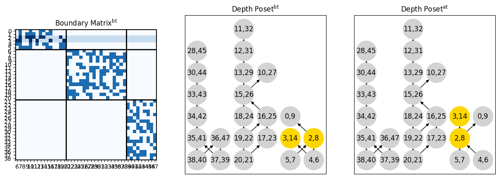

### Birth Death Pairs
|                          |                                                                                                                                                                                                                                   |
|:-------------------------|:----------------------------------------------------------------------------------------------------------------------------------------------------------------------------------------------------------------------------------|
| Before the transposition | $\{(4, 6), (5, 7), (12, 31), (2, 8), (37, 39), (28, 45), (10, 27), (11, 32), (13, 29), (15, 26), (16, 25), (35, 41), (38, 40), (17, 23), (34, 42), (30, 44), (18, 24), (33, 43), (20, 21), (3, 14), (0, 9), (19, 22), (36, 47)\}$ |
| After the transposition  | $\{(4, 6), (5, 7), (12, 31), (2, 8), (37, 39), (28, 45), (10, 27), (11, 32), (13, 29), (15, 26), (16, 25), (35, 41), (38, 40), (17, 23), (34, 42), (30, 44), (18, 24), (33, 43), (20, 21), (3, 14), (0, 9), (19, 22), (36, 47)\}$ |

### Relations
|                          | Algorithm 1                                                                                                                                                                                                                                                                                                                                                                                                                                                  | Algorithm 2                                                                                                                                                                                                                                                                                                                                                                                                                                                                  |
|:-------------------------|:-------------------------------------------------------------------------------------------------------------------------------------------------------------------------------------------------------------------------------------------------------------------------------------------------------------------------------------------------------------------------------------------------------------------------------------------------------------|:-----------------------------------------------------------------------------------------------------------------------------------------------------------------------------------------------------------------------------------------------------------------------------------------------------------------------------------------------------------------------------------------------------------------------------------------------------------------------------|
| Before the transposition | $\{(24, 27), (41, 43), (43, 46), (25, 32), (44, 45), (26, 27), (31, 32), (29, 32), (39, 42), (22, 32), (24, 26), (41, 42), (6, 8), (6, 14), (42, 44), (24, 32), (26, 29), (43, 45), (29, 31), (39, 41), (39, 44), (23, 27), (22, 31), (39, 47), (40, 46), (7, 9), (41, 44), (25, 27), (42, 43), (24, 31), (42, 46), (21, 23), (26, 31), (44, 46), (22, 27), (23, 26), (40, 42), (22, 24), (39, 46), (23, 29), (39, 43), (23, 32), (6, 9), (7, 8)\}$          | $\{(35, 30), (4, 3), (3, 1), (20, 17), (38, 35), (5, 1), (17, 12), (34, 28), (17, 15), (19, 18), (19, 15), (37, 33), (37, 36), (15, 11), (16, 10), (18, 10), (20, 13), (18, 13), (20, 10), (5, 0), (20, 19), (34, 30), (34, 33), (2, 1), (37, 35), (15, 13), (33, 28), (16, 15), (18, 15), (20, 12), (20, 18), (12, 11), (35, 34), (20, 15), (5, 2), (38, 33), (38, 36), (17, 10), (17, 16), (15, 12), (17, 13), (2, 0), (19, 16), (13, 12), (30, 28), (33, 30), (16, 11)\}$ |
| After the transposition  | $\{(24, 27), (41, 43), (43, 46), (25, 32), (44, 45), (26, 27), (31, 32), (29, 32), (39, 42), (22, 32), (24, 26), (41, 42), (6, 8), (6, 14), (42, 44), (24, 32), (26, 29), (43, 45), (29, 31), (39, 41), (39, 44), (23, 27), (22, 31), (39, 47), (8, 14), (40, 46), (7, 9), (41, 44), (25, 27), (42, 43), (24, 31), (42, 46), (21, 23), (26, 31), (44, 46), (22, 27), (23, 26), (40, 42), (22, 24), (39, 46), (23, 29), (39, 43), (23, 32), (6, 9), (7, 8)\}$ | $\{(35, 30), (4, 3), (3, 1), (20, 17), (38, 35), (5, 1), (33, 30), (17, 12), (34, 28), (17, 15), (19, 18), (37, 33), (19, 15), (37, 36), (15, 11), (16, 10), (18, 10), (20, 13), (18, 13), (20, 10), (5, 0), (20, 19), (34, 30), (34, 33), (2, 1), (37, 35), (15, 13), (33, 28), (16, 15), (18, 15), (20, 12), (20, 18), (12, 11), (35, 34), (20, 15), (5, 2), (38, 33), (38, 36), (17, 10), (17, 16), (17, 13), (2, 0), (19, 16), (13, 12), (30, 28), (15, 12), (16, 11)\}$ |

### Successors and Predecessers
No such node in the Depth Poset

### Temp Sets
|                                                               | Before the Transposition             | After the Transposition              |
|:--------------------------------------------------------------|:-------------------------------------|:-------------------------------------|
| $\mathcal{L} = \{(s, t)\in \text{BD}:\; f(t) < f(y)\}$        | $\{(4, 6), (0, 9), (5, 7), (2, 8)\}$ | $\{(4, 6), (0, 9), (5, 7), (2, 8)\}$ |
| $\mathcal{M} = \{(s, t)\in \text{BD}:\; f(y) < f(t) < f(b)\}$ | $\emptyset$                          | $\emptyset$                          |

### Equations
There are 2 equations are wrong.

| eq   | left (formula)                  | left (paramatrized)              | left (value)         | right (formula)                                                                        | right (paramatrized)                                                                    | right (value)                 | correct   |
|:-----|:--------------------------------|:---------------------------------|:---------------------|:---------------------------------------------------------------------------------------|:----------------------------------------------------------------------------------------|:------------------------------|:----------|
| Eq16 | $\text{Succ}_1^\text{at}(x, y)$ | $\text{Succ}_1^\text{at}(3, 14)$ | $\emptyset$          | $\text{Succ}_1^\text{bt}(x, y) \oplus \{(a, b)\} \oplus \text{Succ}_1^\text{bt}(a, b)$ | $\text{Succ}_1^\text{bt}(3, 14) \oplus \{(2, 8)\} \oplus \text{Succ}_1^\text{bt}(2, 8)$ | $\{(2, 8)\}$                  | ✘         |
| Eq17 | $\text{Pred}_1^\text{at}(a, b)$ | $\text{Pred}_1^\text{at}(2, 8)$  | $\{(4, 6), (5, 7)\}$ | $\text{Pred}_1^\text{bt}(a, b) \oplus \{(x, y)\}$                                      | $\text{Pred}_1^\text{bt}(2, 8) \oplus \{(3, 14)\}$                                      | $\{(4, 6), (5, 7), (3, 14)\}$ | ✘         |

## Transposition <4, 5> in complex 0
Here is a __birth-birth__ __no switch__ transposition <4, 5>.

$$
a = 4, \; b = 6, \; x = 5, \; y = 7
$$

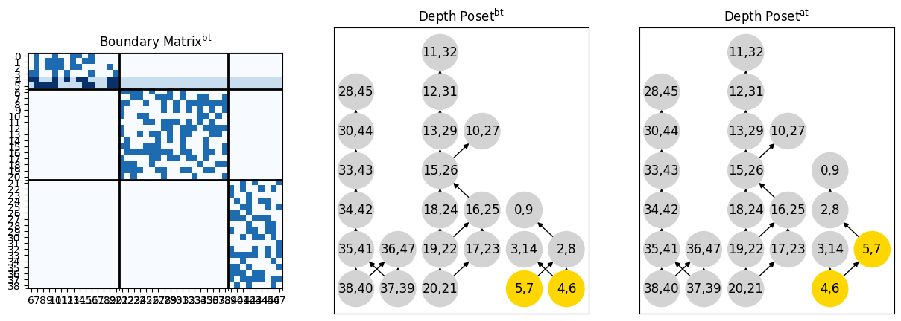

### Birth Death Pairs
|                          |                                                                                                                                                                                                                                   |
|:-------------------------|:----------------------------------------------------------------------------------------------------------------------------------------------------------------------------------------------------------------------------------|
| Before the transposition | $\{(4, 6), (5, 7), (12, 31), (2, 8), (37, 39), (28, 45), (10, 27), (11, 32), (13, 29), (15, 26), (16, 25), (35, 41), (38, 40), (17, 23), (34, 42), (30, 44), (18, 24), (33, 43), (20, 21), (3, 14), (0, 9), (19, 22), (36, 47)\}$ |
| After the transposition  | $\{(4, 6), (5, 7), (12, 31), (2, 8), (37, 39), (28, 45), (10, 27), (11, 32), (13, 29), (15, 26), (16, 25), (35, 41), (38, 40), (17, 23), (34, 42), (30, 44), (18, 24), (33, 43), (20, 21), (3, 14), (0, 9), (19, 22), (36, 47)\}$ |

### Relations
|                          | Algorithm 1                                                                                                                                                                                                                                                                                                                                                                                                                                         | Algorithm 2                                                                                                                                                                                                                                                                                                                                                                                                                                                                  |
|:-------------------------|:----------------------------------------------------------------------------------------------------------------------------------------------------------------------------------------------------------------------------------------------------------------------------------------------------------------------------------------------------------------------------------------------------------------------------------------------------|:-----------------------------------------------------------------------------------------------------------------------------------------------------------------------------------------------------------------------------------------------------------------------------------------------------------------------------------------------------------------------------------------------------------------------------------------------------------------------------|
| Before the transposition | $\{(24, 27), (41, 43), (43, 46), (25, 32), (44, 45), (26, 27), (31, 32), (29, 32), (39, 42), (22, 32), (24, 26), (41, 42), (6, 8), (6, 14), (42, 44), (24, 32), (26, 29), (43, 45), (29, 31), (39, 41), (39, 44), (23, 27), (22, 31), (39, 47), (40, 46), (7, 9), (41, 44), (25, 27), (42, 43), (24, 31), (42, 46), (21, 23), (26, 31), (44, 46), (22, 27), (23, 26), (40, 42), (22, 24), (39, 46), (23, 29), (39, 43), (23, 32), (6, 9), (7, 8)\}$ | $\{(35, 30), (4, 3), (3, 1), (20, 17), (38, 35), (5, 1), (17, 12), (34, 28), (17, 15), (19, 18), (19, 15), (37, 33), (37, 36), (15, 11), (16, 10), (18, 10), (20, 13), (18, 13), (20, 10), (5, 0), (20, 19), (34, 30), (34, 33), (2, 1), (37, 35), (15, 13), (33, 28), (16, 15), (18, 15), (20, 12), (20, 18), (12, 11), (35, 34), (20, 15), (5, 2), (38, 33), (38, 36), (17, 10), (17, 16), (15, 12), (17, 13), (2, 0), (19, 16), (13, 12), (30, 28), (33, 30), (16, 11)\}$ |
| After the transposition  | $\{(24, 27), (41, 43), (43, 46), (25, 32), (44, 45), (26, 27), (31, 32), (29, 32), (39, 42), (22, 32), (24, 26), (41, 42), (6, 14), (42, 44), (24, 32), (26, 29), (43, 45), (29, 31), (39, 41), (39, 44), (23, 27), (22, 31), (39, 47), (40, 46), (7, 9), (6, 7), (41, 44), (25, 27), (42, 43), (24, 31), (42, 46), (21, 23), (26, 31), (44, 46), (22, 27), (23, 26), (40, 42), (22, 24), (39, 46), (23, 29), (39, 43), (23, 32), (7, 8)\}$         | $\{(35, 30), (4, 3), (3, 1), (20, 17), (38, 35), (5, 1), (33, 30), (17, 12), (34, 28), (17, 15), (19, 18), (37, 33), (19, 15), (37, 36), (15, 11), (16, 10), (18, 10), (20, 13), (18, 13), (20, 10), (5, 0), (20, 19), (34, 30), (34, 33), (2, 1), (37, 35), (15, 13), (33, 28), (16, 15), (18, 15), (20, 12), (20, 18), (12, 11), (35, 34), (20, 15), (5, 2), (38, 33), (38, 36), (17, 10), (17, 16), (17, 13), (2, 0), (19, 16), (13, 12), (30, 28), (15, 12), (16, 11)\}$ |

### Successors and Predecessers
No such node in the Depth Poset

### Temp Sets
|                                                               | Before the Transposition   | After the Transposition   |
|:--------------------------------------------------------------|:---------------------------|:--------------------------|
| $\mathcal{L} = \{(s, t)\in \text{BD}:\; f(t) < f(y)\}$        | $\{(4, 6)\}$               | $\{(4, 6)\}$              |
| $\mathcal{M} = \{(s, t)\in \text{BD}:\; f(y) < f(t) < f(b)\}$ | $\emptyset$                | $\emptyset$               |

### Equations
There are 2 equations are wrong.

| eq   | left (formula)                  | left (paramatrized)             | left (value)         | right (formula)                                                                        | right (paramatrized)                                                                   | right (value)         | correct   |
|:-----|:--------------------------------|:--------------------------------|:---------------------|:---------------------------------------------------------------------------------------|:---------------------------------------------------------------------------------------|:----------------------|:----------|
| Eq16 | $\text{Succ}_1^\text{at}(x, y)$ | $\text{Succ}_1^\text{at}(5, 7)$ | $\{(0, 9), (2, 8)\}$ | $\text{Succ}_1^\text{bt}(x, y) \oplus \{(a, b)\} \oplus \text{Succ}_1^\text{bt}(a, b)$ | $\text{Succ}_1^\text{bt}(5, 7) \oplus \{(4, 6)\} \oplus \text{Succ}_1^\text{bt}(4, 6)$ | $\{(4, 6), (3, 14)\}$ | ✘         |
| Eq17 | $\text{Pred}_1^\text{at}(a, b)$ | $\text{Pred}_1^\text{at}(4, 6)$ | $\emptyset$          | $\text{Pred}_1^\text{bt}(a, b) \oplus \{(x, y)\}$                                      | $\text{Pred}_1^\text{bt}(4, 6) \oplus \{(5, 7)\}$                                      | $\{(5, 7)\}$          | ✘         |

## Transposition <6, 7> in complex 0
Here is a __death-death__ __no switch__ transposition <6, 7>.

$$
a = 5, \; b = 7, \; x = 4, \; y = 6
$$

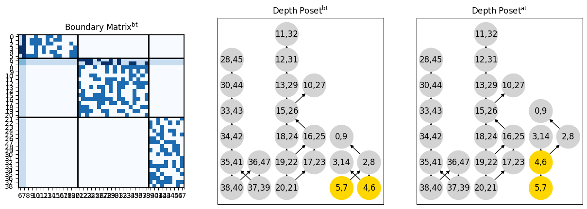

### Birth Death Pairs
|                          |                                                                                                                                                                                                                                   |
|:-------------------------|:----------------------------------------------------------------------------------------------------------------------------------------------------------------------------------------------------------------------------------|
| Before the transposition | $\{(4, 6), (5, 7), (12, 31), (2, 8), (37, 39), (28, 45), (10, 27), (11, 32), (13, 29), (15, 26), (16, 25), (35, 41), (38, 40), (17, 23), (34, 42), (30, 44), (18, 24), (33, 43), (20, 21), (3, 14), (0, 9), (19, 22), (36, 47)\}$ |
| After the transposition  | $\{(4, 6), (5, 7), (12, 31), (2, 8), (37, 39), (28, 45), (10, 27), (11, 32), (13, 29), (15, 26), (16, 25), (35, 41), (38, 40), (17, 23), (34, 42), (30, 44), (18, 24), (33, 43), (20, 21), (3, 14), (0, 9), (19, 22), (36, 47)\}$ |

### Relations
|                          | Algorithm 1                                                                                                                                                                                                                                                                                                                                                                                                                                         | Algorithm 2                                                                                                                                                                                                                                                                                                                                                                                                                                                                                  |
|:-------------------------|:----------------------------------------------------------------------------------------------------------------------------------------------------------------------------------------------------------------------------------------------------------------------------------------------------------------------------------------------------------------------------------------------------------------------------------------------------|:---------------------------------------------------------------------------------------------------------------------------------------------------------------------------------------------------------------------------------------------------------------------------------------------------------------------------------------------------------------------------------------------------------------------------------------------------------------------------------------------|
| Before the transposition | $\{(24, 27), (41, 43), (43, 46), (25, 32), (44, 45), (26, 27), (31, 32), (29, 32), (39, 42), (22, 32), (24, 26), (41, 42), (6, 8), (6, 14), (42, 44), (24, 32), (26, 29), (43, 45), (29, 31), (39, 41), (39, 44), (23, 27), (22, 31), (39, 47), (40, 46), (7, 9), (41, 44), (25, 27), (42, 43), (24, 31), (42, 46), (21, 23), (26, 31), (44, 46), (22, 27), (23, 26), (40, 42), (22, 24), (39, 46), (23, 29), (39, 43), (23, 32), (6, 9), (7, 8)\}$ | $\{(35, 30), (4, 3), (3, 1), (20, 17), (38, 35), (5, 1), (17, 12), (34, 28), (17, 15), (19, 18), (19, 15), (37, 33), (37, 36), (15, 11), (16, 10), (18, 10), (20, 13), (18, 13), (20, 10), (5, 0), (20, 19), (34, 30), (34, 33), (2, 1), (37, 35), (15, 13), (33, 28), (16, 15), (18, 15), (20, 12), (20, 18), (12, 11), (35, 34), (20, 15), (5, 2), (38, 33), (38, 36), (17, 10), (17, 16), (15, 12), (17, 13), (2, 0), (19, 16), (13, 12), (30, 28), (33, 30), (16, 11)\}$                 |
| After the transposition  | $\{(24, 27), (41, 43), (43, 46), (25, 32), (44, 45), (26, 27), (31, 32), (29, 32), (39, 42), (22, 32), (24, 26), (41, 42), (6, 8), (6, 14), (42, 44), (24, 32), (26, 29), (43, 45), (29, 31), (39, 41), (39, 44), (23, 27), (22, 31), (39, 47), (40, 46), (7, 9), (41, 44), (25, 27), (42, 43), (24, 31), (42, 46), (21, 23), (26, 31), (44, 46), (22, 27), (23, 26), (40, 42), (22, 24), (39, 46), (23, 29), (39, 43), (23, 32), (6, 9), (7, 8)\}$ | $\{(35, 30), (4, 3), (3, 1), (20, 17), (5, 4), (38, 35), (5, 1), (33, 30), (17, 12), (34, 28), (17, 15), (19, 18), (37, 33), (19, 15), (37, 36), (15, 11), (16, 10), (18, 10), (20, 13), (18, 13), (20, 10), (5, 0), (20, 19), (5, 3), (34, 30), (34, 33), (2, 1), (37, 35), (15, 13), (33, 28), (16, 15), (18, 15), (20, 12), (20, 18), (12, 11), (35, 34), (20, 15), (5, 2), (38, 33), (38, 36), (17, 10), (17, 16), (17, 13), (2, 0), (19, 16), (13, 12), (30, 28), (15, 12), (16, 11)\}$ |

### Successors and Predecessers
No such node in the Depth Poset

### Temp Sets
|                                                               | Before the Transposition                                                                                                                                                                         | After the Transposition                                                                                                                                                                          |
|:--------------------------------------------------------------|:-------------------------------------------------------------------------------------------------------------------------------------------------------------------------------------------------|:-------------------------------------------------------------------------------------------------------------------------------------------------------------------------------------------------|
| $\mathcal{B} = \{(s, t)\in \text{BD}:\; f(s) > f(x)\}$        | $\{(5, 7), (12, 31), (37, 39), (10, 27), (28, 45), (11, 32), (13, 29), (15, 26), (16, 25), (35, 41), (38, 40), (17, 23), (34, 42), (30, 44), (33, 43), (18, 24), (20, 21), (19, 22), (36, 47)\}$ | $\{(5, 7), (12, 31), (37, 39), (10, 27), (28, 45), (11, 32), (13, 29), (15, 26), (16, 25), (35, 41), (38, 40), (17, 23), (34, 42), (30, 44), (33, 43), (18, 24), (20, 21), (19, 22), (36, 47)\}$ |
| $\mathcal{N} = \{(s, t)\in \text{BD}:\; f(x) > f(s) > f(a)\}$ | $\emptyset$                                                                                                                                                                                      | $\emptyset$                                                                                                                                                                                      |

### Equations
There are 2 equations are wrong.

| eq   | left (formula)                  | left (paramatrized)             | left (value)   | right (formula)                                                                        | right (paramatrized)                                                                   | right (value)                         | correct   |
|:-----|:--------------------------------|:--------------------------------|:---------------|:---------------------------------------------------------------------------------------|:---------------------------------------------------------------------------------------|:--------------------------------------|:----------|
| Eq36 | $\text{Succ}_2^\text{at}(x, y)$ | $\text{Succ}_2^\text{at}(4, 6)$ | $\{(3, 14)\}$  | $\text{Succ}_2^\text{bt}(x, y) \oplus \{(a, b)\} \oplus \text{Succ}_2^\text{bt}(a, b)$ | $\text{Succ}_2^\text{bt}(4, 6) \oplus \{(5, 7)\} \oplus \text{Succ}_2^\text{bt}(5, 7)$ | $\{(3, 14), (0, 9), (5, 7), (2, 8)\}$ | ✘         |
| Eq37 | $\text{Pred}_2^\text{at}(a, b)$ | $\text{Pred}_2^\text{at}(5, 7)$ | $\emptyset$    | $\text{Pred}_2^\text{bt}(a, b) \oplus \{(x, y)\}$                                      | $\text{Pred}_2^\text{bt}(5, 7) \oplus \{(4, 6)\}$                                      | $\{(4, 6)\}$                          | ✘         |

## Transposition <14, 15> in complex 0
Here is a __birth-death__ __switch forward__ transposition <14, 15>.

$$
a = 3, \; b = 14, \; x = 15, \; y = 26
$$

### Birth Death Pairs
|                          |                                                                                                                                                                                                                                   |
|:-------------------------|:----------------------------------------------------------------------------------------------------------------------------------------------------------------------------------------------------------------------------------|
| Before the transposition | $\{(4, 6), (5, 7), (12, 31), (2, 8), (37, 39), (28, 45), (10, 27), (11, 32), (13, 29), (15, 26), (16, 25), (35, 41), (38, 40), (17, 23), (34, 42), (30, 44), (18, 24), (33, 43), (20, 21), (3, 14), (0, 9), (19, 22), (36, 47)\}$ |
| After the transposition  | $\{(4, 6), (5, 7), (12, 31), (2, 8), (37, 39), (28, 45), (10, 27), (11, 32), (13, 29), (16, 25), (35, 41), (38, 40), (3, 15), (17, 23), (34, 42), (30, 44), (18, 24), (33, 43), (20, 21), (14, 26), (0, 9), (19, 22), (36, 47)\}$ |

### Relations
|                          | Algorithm 1                                                                                                                                                                                                                                                                                                                                                                                                                                         | Algorithm 2                                                                                                                                                                                                                                                                                                                                                                                                                                                                  |
|:-------------------------|:----------------------------------------------------------------------------------------------------------------------------------------------------------------------------------------------------------------------------------------------------------------------------------------------------------------------------------------------------------------------------------------------------------------------------------------------------|:-----------------------------------------------------------------------------------------------------------------------------------------------------------------------------------------------------------------------------------------------------------------------------------------------------------------------------------------------------------------------------------------------------------------------------------------------------------------------------|
| Before the transposition | $\{(24, 27), (41, 43), (43, 46), (25, 32), (44, 45), (26, 27), (31, 32), (29, 32), (39, 42), (22, 32), (24, 26), (41, 42), (6, 8), (6, 14), (42, 44), (24, 32), (26, 29), (43, 45), (29, 31), (39, 41), (39, 44), (23, 27), (22, 31), (39, 47), (40, 46), (7, 9), (41, 44), (25, 27), (42, 43), (24, 31), (42, 46), (21, 23), (26, 31), (44, 46), (22, 27), (23, 26), (40, 42), (22, 24), (39, 46), (23, 29), (39, 43), (23, 32), (6, 9), (7, 8)\}$ | $\{(35, 30), (4, 3), (3, 1), (20, 17), (38, 35), (5, 1), (17, 12), (34, 28), (17, 15), (19, 18), (19, 15), (37, 33), (37, 36), (15, 11), (16, 10), (18, 10), (20, 13), (18, 13), (20, 10), (5, 0), (20, 19), (34, 30), (34, 33), (2, 1), (37, 35), (15, 13), (33, 28), (16, 15), (18, 15), (20, 12), (20, 18), (12, 11), (35, 34), (20, 15), (5, 2), (38, 33), (38, 36), (17, 10), (17, 16), (15, 12), (17, 13), (2, 0), (19, 16), (13, 12), (30, 28), (33, 30), (16, 11)\}$ |
| After the transposition  | $\{(24, 27), (41, 43), (43, 46), (25, 32), (44, 45), (26, 27), (31, 32), (29, 32), (39, 42), (22, 32), (24, 26), (41, 42), (6, 8), (42, 44), (24, 32), (26, 29), (43, 45), (29, 31), (39, 41), (39, 44), (23, 27), (22, 31), (39, 47), (40, 46), (7, 9), (41, 44), (25, 27), (42, 43), (24, 31), (7, 15), (42, 46), (21, 23), (26, 31), (44, 46), (22, 27), (23, 26), (40, 42), (22, 24), (39, 46), (23, 29), (39, 43), (23, 32), (6, 9), (7, 8)\}$ | $\{(35, 30), (4, 3), (3, 1), (20, 17), (38, 35), (5, 1), (14, 13), (17, 12), (34, 28), (19, 18), (37, 33), (37, 36), (16, 10), (18, 10), (20, 13), (18, 13), (20, 10), (5, 0), (20, 19), (14, 12), (34, 30), (19, 14), (34, 33), (2, 1), (37, 35), (33, 28), (20, 12), (20, 18), (12, 11), (35, 34), (38, 33), (14, 11), (5, 2), (38, 36), (17, 10), (17, 16), (17, 13), (2, 0), (19, 16), (13, 12), (30, 28), (33, 30), (16, 11), (18, 14)\}$                               |

### Successors and Predecessers
|                 | $\text{Set}^\text{bt}(3, 14)$                 | $\text{Set}^\text{bt}(15, 26)$                                                           | $\text{Set}^\text{at}(3, 15)$                 | $\text{Set}^\text{at}(14, 26)$                                       |
|:----------------|:----------------------------------------------|:-----------------------------------------------------------------------------------------|:----------------------------------------------|:---------------------------------------------------------------------|
| $\text{Succ}_1$ | $\text{Succ}_1^\text{bt}(3, 14) = \emptyset$  | $\text{Succ}_1^\text{bt}(15, 26) = \{(10, 27), (13, 29), (12, 31)\}$                     | $\text{Succ}_1^\text{at}(3, 15) = \emptyset$  | $\text{Succ}_1^\text{at}(14, 26) = \{(10, 27), (13, 29), (12, 31)\}$ |
| $\text{Pred}_1$ | $\text{Pred}_1^\text{bt}(3, 14) = \{(4, 6)\}$ | $\text{Pred}_1^\text{bt}(15, 26) = \{(17, 23), (18, 24)\}$                               | $\text{Pred}_1^\text{at}(3, 15) = \{(5, 7)\}$ | $\text{Pred}_1^\text{at}(14, 26) = \{(17, 23), (18, 24)\}$           |
| $\text{Succ}_2$ | $\text{Succ}_2^\text{bt}(3, 14) = \emptyset$  | $\text{Succ}_2^\text{bt}(15, 26) = \{(13, 29), (11, 32), (12, 31)\}$                     | $\text{Succ}_2^\text{at}(3, 15) = \emptyset$  | $\text{Succ}_2^\text{at}(14, 26) = \{(13, 29), (11, 32), (12, 31)\}$ |
| $\text{Pred}_2$ | $\text{Pred}_2^\text{bt}(3, 14) = \{(4, 6)\}$ | $\text{Pred}_2^\text{bt}(15, 26) = \{(17, 23), (16, 25), (19, 22), (18, 24), (20, 21)\}$ | $\text{Pred}_2^\text{at}(3, 15) = \{(4, 6)\}$ | $\text{Pred}_2^\text{at}(14, 26) = \{(19, 22), (18, 24)\}$           |

### Temp Sets
|                                                              | Before the Transposition                               | After the Transposition                                |
|:-------------------------------------------------------------|:-------------------------------------------------------|:-------------------------------------------------------|
| $A_1 = \{(s, t)\in \text{BD}:\; f(a) < f(s) < f(t) < f(x)\}$ | $\{(4, 6), (5, 7)\}$                                   | $\{(4, 6), (5, 7)\}$                                   |
| $B_1 = \{(s, t)\in \text{BD}:\; U_1[t, x] = 1\}$             | $\emptyset$                                            | $\{(5, 7)\}$                                           |
| $A_2 = \{(s, t)\in \text{BD}:\; f(b) < f(s) < f(t) < f(y)\}$ | $\{(17, 23), (16, 25), (19, 22), (18, 24), (20, 21)\}$ | $\{(17, 23), (16, 25), (19, 22), (18, 24), (20, 21)\}$ |
| $B_2 = \{(s, t)\in \text{BD}:\; U_2[b, s] = 1\}$             | $\emptyset$                                            | $\{(19, 22), (18, 24)\}$                               |

### Equations
There are 4 equations are wrong.

| eq    | left (formula)                  | left (paramatrized)               | left (value)                       | right (formula)                                      | right (paramatrized)                                  | right (value)                      | correct   |
|:------|:--------------------------------|:----------------------------------|:-----------------------------------|:-----------------------------------------------------|:------------------------------------------------------|:-----------------------------------|:----------|
| Eq48  | $\text{Succ}_1^\text{at}(a, x)$ | $\text{Succ}_1^\text{at}(3, 15)$  | $\emptyset$                        | $\text{Succ}_1^\text{bt}(a, b)$                      | $\text{Succ}_1^\text{bt}(3, 14)$                      | $\emptyset$                        | ✔         |
| Eq49  | $\text{Succ}_1^\text{at}(b, y)$ | $\text{Succ}_1^\text{at}(14, 26)$ | $\{(10, 27), (13, 29), (12, 31)\}$ | $\text{Succ}_1^\text{bt}(x, y)$                      | $\text{Succ}_1^\text{bt}(15, 26)$                     | $\{(10, 27), (13, 29), (12, 31)\}$ | ✔         |
| Eq50  | $\text{Pred}_1^\text{at}(a, x)$ | $\text{Pred}_1^\text{at}(3, 15)$  | $\{(5, 7)\}$                       | $\{(s, t)\in \text{BD}:\; U_1^\text{bt}[t, x] = 1\}$ | $\{(s, t)\in \text{BD}:\; U_1^\text{bt}[t, 15] = 1\}$ | $\emptyset$                        | ✘         |
| Eq50a | $\text{Pred}_1^\text{at}(a, x)$ | $\text{Pred}_1^\text{at}(3, 15)$  | $\{(5, 7)\}$                       | $A_1^\text{bt} \cap B_1^\text{bt}$                   | $A_1^\text{bt} \cap B_1^\text{bt}$                    | $\emptyset$                        | ✘         |
| Eq50b | $\text{Pred}_1^\text{at}(a, x)$ | $\text{Pred}_1^\text{at}(3, 15)$  | $\{(5, 7)\}$                       | $A_1^\text{bt} \cap B_1^\text{at}$                   | $A_1^\text{bt} \cap B_1^\text{at}$                    | $\{(5, 7)\}$                       | ✔         |
| Eq51  | $\text{Pred}_1^\text{at}(b, y)$ | $\text{Pred}_1^\text{at}(14, 26)$ | $\{(17, 23), (18, 24)\}$           | $\text{Pred}_1^\text{bt}(x, y)$                      | $\text{Pred}_1^\text{bt}(15, 26)$                     | $\{(17, 23), (18, 24)\}$           | ✔         |
| Eq52  | $\text{Succ}_2^\text{at}(a, x)$ | $\text{Succ}_2^\text{at}(3, 15)$  | $\emptyset$                        | $\text{Succ}_2^\text{bt}(a, b)$                      | $\text{Succ}_2^\text{bt}(3, 14)$                      | $\emptyset$                        | ✔         |
| Eq53  | $\text{Succ}_2^\text{at}(b, y)$ | $\text{Succ}_2^\text{at}(14, 26)$ | $\{(13, 29), (11, 32), (12, 31)\}$ | $\text{Succ}_2^\text{bt}(x, y)$                      | $\text{Succ}_2^\text{bt}(15, 26)$                     | $\{(13, 29), (11, 32), (12, 31)\}$ | ✔         |
| Eq54  | $\text{Pred}_2^\text{at}(a, x)$ | $\text{Pred}_2^\text{at}(3, 15)$  | $\{(4, 6)\}$                       | $\text{Pred}_2^\text{bt}(a, b)$                      | $\text{Pred}_2^\text{bt}(3, 14)$                      | $\{(4, 6)\}$                       | ✔         |
| Eq55  | $\text{Pred}_2^\text{at}(b, y)$ | $\text{Pred}_2^\text{at}(14, 26)$ | $\{(19, 22), (18, 24)\}$           | $\{(s, t)\in \text{BD}:\; U_2^\text{bt}[b, s] = 1\}$ | $\{(s, t)\in \text{BD}:\; U_2^\text{bt}[14, s] = 1\}$ | $\emptyset$                        | ✘         |
| Eq55a | $\text{Pred}_2^\text{at}(b, y)$ | $\text{Pred}_2^\text{at}(14, 26)$ | $\{(19, 22), (18, 24)\}$           | $A_2^\text{bt} \cap B_2^\text{bt}$                   | $A_2^\text{bt} \cap B_2^\text{bt}$                    | $\emptyset$                        | ✘         |
| Eq55b | $\text{Pred}_2^\text{at}(b, y)$ | $\text{Pred}_2^\text{at}(14, 26)$ | $\{(19, 22), (18, 24)\}$           | $A_2^\text{bt} \cap B_2^\text{at}$                   | $A_2^\text{bt} \cap B_2^\text{at}$                    | $\{(18, 24), (19, 22)\}$           | ✔         |

## Transposition <15, 16> in complex 0
Here is a __birth-birth__ __switch forward__ transposition <15, 16>.

$$
a = 15, \; b = 26, \; x = 16, \; y = 25
$$

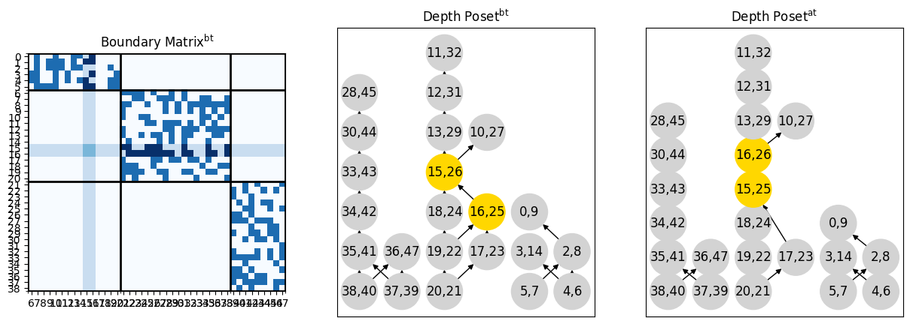

### Birth Death Pairs
|                          |                                                                                                                                                                                                                                   |
|:-------------------------|:----------------------------------------------------------------------------------------------------------------------------------------------------------------------------------------------------------------------------------|
| Before the transposition | $\{(4, 6), (5, 7), (12, 31), (2, 8), (37, 39), (28, 45), (10, 27), (11, 32), (13, 29), (15, 26), (16, 25), (35, 41), (38, 40), (17, 23), (34, 42), (30, 44), (18, 24), (33, 43), (20, 21), (3, 14), (0, 9), (19, 22), (36, 47)\}$ |
| After the transposition  | $\{(16, 26), (4, 6), (5, 7), (12, 31), (2, 8), (37, 39), (28, 45), (10, 27), (11, 32), (13, 29), (35, 41), (38, 40), (17, 23), (34, 42), (30, 44), (15, 25), (18, 24), (33, 43), (20, 21), (3, 14), (0, 9), (19, 22), (36, 47)\}$ |

### Relations
|                          | Algorithm 1                                                                                                                                                                                                                                                                                                                                                                                                                                                             | Algorithm 2                                                                                                                                                                                                                                                                                                                                                                                                                                                                  |
|:-------------------------|:------------------------------------------------------------------------------------------------------------------------------------------------------------------------------------------------------------------------------------------------------------------------------------------------------------------------------------------------------------------------------------------------------------------------------------------------------------------------|:-----------------------------------------------------------------------------------------------------------------------------------------------------------------------------------------------------------------------------------------------------------------------------------------------------------------------------------------------------------------------------------------------------------------------------------------------------------------------------|
| Before the transposition | $\{(24, 27), (41, 43), (43, 46), (25, 32), (44, 45), (26, 27), (31, 32), (29, 32), (39, 42), (22, 32), (24, 26), (41, 42), (6, 8), (6, 14), (42, 44), (24, 32), (26, 29), (43, 45), (29, 31), (39, 41), (39, 44), (23, 27), (22, 31), (39, 47), (40, 46), (7, 9), (41, 44), (25, 27), (42, 43), (24, 31), (42, 46), (21, 23), (26, 31), (44, 46), (22, 27), (23, 26), (40, 42), (22, 24), (39, 46), (23, 29), (39, 43), (23, 32), (6, 9), (7, 8)\}$                     | $\{(35, 30), (4, 3), (3, 1), (20, 17), (38, 35), (5, 1), (17, 12), (34, 28), (17, 15), (19, 18), (19, 15), (37, 33), (37, 36), (15, 11), (16, 10), (18, 10), (20, 13), (18, 13), (20, 10), (5, 0), (20, 19), (34, 30), (34, 33), (2, 1), (37, 35), (15, 13), (33, 28), (16, 15), (18, 15), (20, 12), (20, 18), (12, 11), (35, 34), (20, 15), (5, 2), (38, 33), (38, 36), (17, 10), (17, 16), (15, 12), (17, 13), (2, 0), (19, 16), (13, 12), (30, 28), (33, 30), (16, 11)\}$ |
| After the transposition  | $\{(25, 29), (24, 27), (41, 43), (43, 46), (25, 32), (44, 45), (26, 27), (31, 32), (29, 32), (39, 42), (22, 32), (24, 26), (41, 42), (6, 8), (25, 31), (6, 14), (42, 44), (24, 32), (26, 29), (43, 45), (29, 31), (39, 41), (39, 44), (23, 27), (22, 31), (39, 47), (40, 46), (7, 9), (41, 44), (42, 43), (24, 31), (42, 46), (21, 23), (26, 31), (44, 46), (22, 27), (23, 26), (40, 42), (22, 24), (39, 46), (23, 29), (39, 43), (23, 32), (7, 8), (6, 9), (25, 26)\}$ | $\{(35, 30), (4, 3), (3, 1), (20, 17), (38, 35), (5, 1), (17, 12), (34, 28), (17, 15), (19, 18), (37, 33), (19, 15), (37, 36), (15, 11), (16, 10), (16, 13), (18, 10), (20, 13), (18, 13), (20, 10), (5, 0), (20, 19), (34, 30), (34, 33), (2, 1), (37, 35), (16, 12), (15, 10), (33, 28), (15, 16), (18, 15), (20, 12), (20, 18), (12, 11), (35, 34), (20, 15), (38, 33), (5, 2), (38, 36), (17, 10), (17, 16), (17, 13), (2, 0), (19, 16), (13, 12), (30, 28), (33, 30)\}$ |

### Successors and Predecessers
|                 | $\text{Set}^\text{bt}(15, 26)$                                                           | $\text{Set}^\text{bt}(16, 25)$                                       | $\text{Set}^\text{at}(15, 25)$                                                 | $\text{Set}^\text{at}(16, 26)$                                       |
|:----------------|:-----------------------------------------------------------------------------------------|:---------------------------------------------------------------------|:-------------------------------------------------------------------------------|:---------------------------------------------------------------------|
| $\text{Succ}_1$ | $\text{Succ}_1^\text{bt}(15, 26) = \{(10, 27), (13, 29), (12, 31)\}$                     | $\text{Succ}_1^\text{bt}(16, 25) = \{(10, 27), (11, 32)\}$           | $\text{Succ}_1^\text{at}(15, 25) = \{(13, 29), (16, 26), (11, 32), (12, 31)\}$ | $\text{Succ}_1^\text{at}(16, 26) = \{(10, 27), (13, 29), (12, 31)\}$ |
| $\text{Pred}_1$ | $\text{Pred}_1^\text{bt}(15, 26) = \{(17, 23), (18, 24)\}$                               | $\text{Pred}_1^\text{bt}(16, 25) = \emptyset$                        | $\text{Pred}_1^\text{at}(15, 25) = \emptyset$                                  | $\text{Pred}_1^\text{at}(16, 26) = \{(17, 23), (18, 24), (15, 25)\}$ |
| $\text{Succ}_2$ | $\text{Succ}_2^\text{bt}(15, 26) = \{(13, 29), (11, 32), (12, 31)\}$                     | $\text{Succ}_2^\text{bt}(16, 25) = \{(10, 27), (11, 32), (15, 26)\}$ | $\text{Succ}_2^\text{at}(15, 25) = \{(10, 27), (16, 26), (11, 32)\}$           | $\text{Succ}_2^\text{at}(16, 26) = \{(10, 27), (13, 29), (12, 31)\}$ |
| $\text{Pred}_2$ | $\text{Pred}_2^\text{bt}(15, 26) = \{(17, 23), (16, 25), (19, 22), (18, 24), (20, 21)\}$ | $\text{Pred}_2^\text{bt}(16, 25) = \{(17, 23), (19, 22)\}$           | $\text{Pred}_2^\text{at}(15, 25) = \{(19, 22), (17, 23), (18, 24), (20, 21)\}$ | $\text{Pred}_2^\text{at}(16, 26) = \{(17, 23), (19, 22), (15, 25)\}$ |

### Temp Sets
|                                                               | Before the Transposition                                                              | After the Transposition                                                               |
|:--------------------------------------------------------------|:--------------------------------------------------------------------------------------|:--------------------------------------------------------------------------------------|
| $\mathcal{L} = \{(s, t)\in \text{BD}:\; f(t) < f(y)\}$        | $\{(17, 23), (3, 14), (4, 6), (0, 9), (5, 7), (20, 21), (19, 22), (18, 24), (2, 8)\}$ | $\{(17, 23), (3, 14), (4, 6), (0, 9), (5, 7), (20, 21), (19, 22), (18, 24), (2, 8)\}$ |
| $\mathcal{M} = \{(s, t)\in \text{BD}:\; f(y) < f(t) < f(b)\}$ | $\emptyset$                                                                           | $\emptyset$                                                                           |

### Equations
There are 1 equations are wrong.

| eq   | left (formula)                  | left (paramatrized)               | left (value)                                 | right (formula)                                                                                           | right (paramatrized)                                                                                            | right (value)                                | correct   |
|:-----|:--------------------------------|:----------------------------------|:---------------------------------------------|:----------------------------------------------------------------------------------------------------------|:----------------------------------------------------------------------------------------------------------------|:---------------------------------------------|:----------|
| Eq08 | $\text{Succ}_1^\text{at}(a, y)$ | $\text{Succ}_1^\text{at}(15, 25)$ | $\{(13, 29), (16, 26), (11, 32), (12, 31)\}$ | $\text{Succ}_1^\text{bt}(x, y) \oplus \{(x, b)\} \oplus \text{Succ}_1^\text{bt}(a, b)$                    | $\text{Succ}_1^\text{bt}(16, 25) \oplus \{(16, 26)\} \oplus \text{Succ}_1^\text{bt}(15, 26)$                    | $\{(16, 26), (11, 32), (12, 31), (13, 29)\}$ | ✔         |
| Eq09 | $\text{Succ}_1^\text{at}(x, b)$ | $\text{Succ}_1^\text{at}(16, 26)$ | $\{(10, 27), (13, 29), (12, 31)\}$           | $\text{Succ}_1^\text{bt}(a, b)$                                                                           | $\text{Succ}_1^\text{bt}(15, 26)$                                                                               | $\{(10, 27), (13, 29), (12, 31)\}$           | ✔         |
| Eq10 | $\text{Pred}_1^\text{at}(a, y)$ | $\text{Pred}_1^\text{at}(15, 25)$ | $\emptyset$                                  | $\text{Pred}_1^\text{bt}(x, y)$                                                                           | $\text{Pred}_1^\text{bt}(16, 25)$                                                                               | $\emptyset$                                  | ✔         |
| Eq11 | $\text{Pred}_1^\text{at}(x, b)$ | $\text{Pred}_1^\text{at}(16, 26)$ | $\{(17, 23), (18, 24), (15, 25)\}$           | $\text{Pred}_1^\text{bt}(a, b) \oplus \{(a, y)\}$                                                         | $\text{Pred}_1^\text{bt}(15, 26) \oplus \{(15, 25)\}$                                                           | $\{(17, 23), (18, 24), (15, 25)\}$           | ✔         |
| Eq12 | $\text{Succ}_2^\text{at}(a, y)$ | $\text{Succ}_2^\text{at}(15, 25)$ | $\{(10, 27), (16, 26), (11, 32)\}$           | $\text{Succ}_2^\text{bt}(x, y) \oplus \{(x, b), (a, b)\}$                                                 | $\text{Succ}_2^\text{bt}(16, 25) \oplus \{(16, 26), (15, 26)\}$                                                 | $\{(10, 27), (16, 26), (11, 32)\}$           | ✔         |
| Eq13 | $\text{Succ}_2^\text{at}(x, b)$ | $\text{Succ}_2^\text{at}(16, 26)$ | $\{(10, 27), (13, 29), (12, 31)\}$           | $\text{Succ}_2^\text{bt}(a, b)$                                                                           | $\text{Succ}_2^\text{bt}(15, 26)$                                                                               | $\{(13, 29), (11, 32), (12, 31)\}$           | ✘         |
| Eq14 | $\text{Pred}_2^\text{at}(a, y)$ | $\text{Pred}_2^\text{at}(15, 25)$ | $\{(19, 22), (17, 23), (18, 24), (20, 21)\}$ | $[\text{Pred}_2^\text{bt}(a, b) \cap \mathcal{L}]$                                                        | $[\text{Pred}_2^\text{bt}(15, 26) \cap \mathcal{L}]$                                                            | $\{(19, 22), (17, 23), (18, 24), (20, 21)\}$ | ✔         |
| Eq15 | $\text{Pred}_2^\text{at}(x, b)$ | $\text{Pred}_2^\text{at}(16, 26)$ | $\{(17, 23), (19, 22), (15, 25)\}$           | $\text{Pred}_2^\text{bt}(x, y) \oplus \{(a, y)\} \oplus [\text{Pred}_2^\text{bt}(a, b) \cap \mathcal{M}]$ | $\text{Pred}_2^\text{bt}(16, 25) \oplus \{(15, 25)\} \oplus [\text{Pred}_2^\text{bt}(15, 26) \cap \mathcal{M}]$ | $\{(17, 23), (19, 22), (15, 25)\}$           | ✔         |

## Transposition <16, 17> in complex 0
Here is a __birth-birth__ __switch forward__ transposition <16, 17>.

$$
a = 16, \; b = 25, \; x = 17, \; y = 23
$$

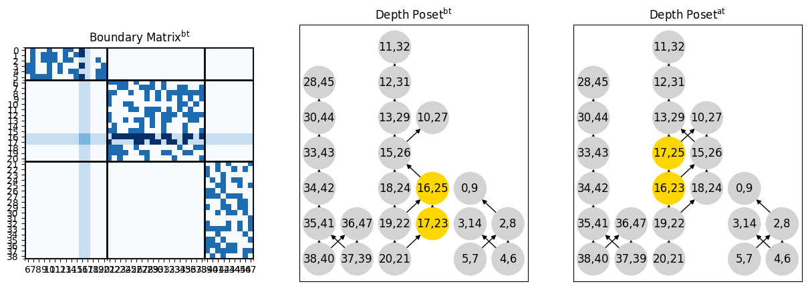

### Birth Death Pairs
|                          |                                                                                                                                                                                                                                   |
|:-------------------------|:----------------------------------------------------------------------------------------------------------------------------------------------------------------------------------------------------------------------------------|
| Before the transposition | $\{(4, 6), (5, 7), (12, 31), (2, 8), (37, 39), (28, 45), (10, 27), (11, 32), (13, 29), (15, 26), (16, 25), (35, 41), (38, 40), (17, 23), (34, 42), (30, 44), (18, 24), (33, 43), (20, 21), (3, 14), (0, 9), (19, 22), (36, 47)\}$ |
| After the transposition  | $\{(4, 6), (5, 7), (12, 31), (2, 8), (37, 39), (28, 45), (10, 27), (11, 32), (13, 29), (15, 26), (35, 41), (38, 40), (34, 42), (30, 44), (18, 24), (33, 43), (20, 21), (3, 14), (0, 9), (17, 25), (19, 22), (36, 47), (16, 23)\}$ |

### Relations
|                          | Algorithm 1                                                                                                                                                                                                                                                                                                                                                                                                                                         | Algorithm 2                                                                                                                                                                                                                                                                                                                                                                                                                                                                  |
|:-------------------------|:----------------------------------------------------------------------------------------------------------------------------------------------------------------------------------------------------------------------------------------------------------------------------------------------------------------------------------------------------------------------------------------------------------------------------------------------------|:-----------------------------------------------------------------------------------------------------------------------------------------------------------------------------------------------------------------------------------------------------------------------------------------------------------------------------------------------------------------------------------------------------------------------------------------------------------------------------|
| Before the transposition | $\{(24, 27), (41, 43), (43, 46), (25, 32), (44, 45), (26, 27), (31, 32), (29, 32), (39, 42), (22, 32), (24, 26), (41, 42), (6, 8), (6, 14), (42, 44), (24, 32), (26, 29), (43, 45), (29, 31), (39, 41), (39, 44), (23, 27), (22, 31), (39, 47), (40, 46), (7, 9), (41, 44), (25, 27), (42, 43), (24, 31), (42, 46), (21, 23), (26, 31), (44, 46), (22, 27), (23, 26), (40, 42), (22, 24), (39, 46), (23, 29), (39, 43), (23, 32), (6, 9), (7, 8)\}$ | $\{(35, 30), (4, 3), (3, 1), (20, 17), (38, 35), (5, 1), (17, 12), (34, 28), (17, 15), (19, 18), (19, 15), (37, 33), (37, 36), (15, 11), (16, 10), (18, 10), (20, 13), (18, 13), (20, 10), (5, 0), (20, 19), (34, 30), (34, 33), (2, 1), (37, 35), (15, 13), (33, 28), (16, 15), (18, 15), (20, 12), (20, 18), (12, 11), (35, 34), (20, 15), (5, 2), (38, 33), (38, 36), (17, 10), (17, 16), (15, 12), (17, 13), (2, 0), (19, 16), (13, 12), (30, 28), (33, 30), (16, 11)\}$ |
| After the transposition  | $\{(24, 27), (41, 43), (43, 46), (25, 32), (44, 45), (26, 27), (31, 32), (29, 32), (39, 42), (22, 32), (23, 25), (24, 26), (41, 42), (6, 8), (6, 14), (42, 44), (24, 32), (26, 29), (43, 45), (29, 31), (39, 41), (39, 44), (22, 31), (39, 47), (40, 46), (7, 9), (41, 44), (25, 27), (42, 43), (24, 31), (42, 46), (21, 23), (26, 31), (44, 46), (22, 27), (23, 26), (40, 42), (22, 24), (39, 46), (23, 29), (39, 43), (6, 9), (7, 8)\}$           | $\{(35, 30), (4, 3), (3, 1), (38, 35), (20, 17), (5, 1), (33, 30), (17, 12), (34, 28), (19, 18), (37, 33), (19, 15), (37, 36), (15, 11), (16, 10), (16, 13), (18, 10), (20, 13), (18, 13), (20, 10), (5, 0), (20, 19), (17, 11), (34, 30), (34, 33), (2, 1), (37, 35), (15, 13), (16, 12), (33, 28), (16, 15), (18, 15), (20, 12), (20, 18), (12, 11), (35, 34), (20, 15), (5, 2), (38, 33), (38, 36), (17, 13), (2, 0), (19, 16), (13, 12), (30, 28), (15, 12), (16, 17)\}$ |

### Successors and Predecessers
|                 | $\text{Set}^\text{bt}(16, 25)$                                       | $\text{Set}^\text{bt}(17, 23)$                                                           | $\text{Set}^\text{at}(16, 23)$                                                           | $\text{Set}^\text{at}(17, 25)$                                       |
|:----------------|:---------------------------------------------------------------------|:-----------------------------------------------------------------------------------------|:-----------------------------------------------------------------------------------------|:---------------------------------------------------------------------|
| $\text{Succ}_1$ | $\text{Succ}_1^\text{bt}(16, 25) = \{(10, 27), (11, 32)\}$           | $\text{Succ}_1^\text{bt}(17, 23) = \{(10, 27), (11, 32), (13, 29), (15, 26)\}$           | $\text{Succ}_1^\text{at}(16, 23) = \{(17, 25), (13, 29), (15, 26)\}$                     | $\text{Succ}_1^\text{at}(17, 25) = \{(10, 27), (11, 32)\}$           |
| $\text{Pred}_1$ | $\text{Pred}_1^\text{bt}(16, 25) = \emptyset$                        | $\text{Pred}_1^\text{bt}(17, 23) = \{(20, 21)\}$                                         | $\text{Pred}_1^\text{at}(16, 23) = \{(20, 21)\}$                                         | $\text{Pred}_1^\text{at}(17, 25) = \{(16, 23)\}$                     |
| $\text{Succ}_2$ | $\text{Succ}_2^\text{bt}(16, 25) = \{(10, 27), (11, 32), (15, 26)\}$ | $\text{Succ}_2^\text{bt}(17, 23) = \{(10, 27), (13, 29), (15, 26), (16, 25), (12, 31)\}$ | $\text{Succ}_2^\text{at}(16, 23) = \{(10, 27), (13, 29), (15, 26), (17, 25), (12, 31)\}$ | $\text{Succ}_2^\text{at}(17, 25) = \{(13, 29), (11, 32), (12, 31)\}$ |
| $\text{Pred}_2$ | $\text{Pred}_2^\text{bt}(16, 25) = \{(17, 23), (19, 22)\}$           | $\text{Pred}_2^\text{bt}(17, 23) = \{(20, 21)\}$                                         | $\text{Pred}_2^\text{at}(16, 23) = \{(19, 22)\}$                                         | $\text{Pred}_2^\text{at}(17, 25) = \{(20, 21), (16, 23)\}$           |

### Temp Sets
|                                                               | Before the Transposition                                          | After the Transposition                                           |
|:--------------------------------------------------------------|:------------------------------------------------------------------|:------------------------------------------------------------------|
| $\mathcal{L} = \{(s, t)\in \text{BD}:\; f(t) < f(y)\}$        | $\{(3, 14), (4, 6), (0, 9), (5, 7), (20, 21), (19, 22), (2, 8)\}$ | $\{(3, 14), (4, 6), (0, 9), (5, 7), (20, 21), (19, 22), (2, 8)\}$ |
| $\mathcal{M} = \{(s, t)\in \text{BD}:\; f(y) < f(t) < f(b)\}$ | $\{(18, 24)\}$                                                    | $\{(18, 24)\}$                                                    |

### Equations
There are 1 equations are wrong.

| eq   | left (formula)                  | left (paramatrized)               | left (value)                                           | right (formula)                                                                                           | right (paramatrized)                                                                                            | right (value)                                          | correct   |
|:-----|:--------------------------------|:----------------------------------|:-------------------------------------------------------|:----------------------------------------------------------------------------------------------------------|:----------------------------------------------------------------------------------------------------------------|:-------------------------------------------------------|:----------|
| Eq08 | $\text{Succ}_1^\text{at}(a, y)$ | $\text{Succ}_1^\text{at}(16, 23)$ | $\{(17, 25), (13, 29), (15, 26)\}$                     | $\text{Succ}_1^\text{bt}(x, y) \oplus \{(x, b)\} \oplus \text{Succ}_1^\text{bt}(a, b)$                    | $\text{Succ}_1^\text{bt}(17, 23) \oplus \{(17, 25)\} \oplus \text{Succ}_1^\text{bt}(16, 25)$                    | $\{(17, 25), (13, 29), (15, 26)\}$                     | ✔         |
| Eq09 | $\text{Succ}_1^\text{at}(x, b)$ | $\text{Succ}_1^\text{at}(17, 25)$ | $\{(10, 27), (11, 32)\}$                               | $\text{Succ}_1^\text{bt}(a, b)$                                                                           | $\text{Succ}_1^\text{bt}(16, 25)$                                                                               | $\{(10, 27), (11, 32)\}$                               | ✔         |
| Eq10 | $\text{Pred}_1^\text{at}(a, y)$ | $\text{Pred}_1^\text{at}(16, 23)$ | $\{(20, 21)\}$                                         | $\text{Pred}_1^\text{bt}(x, y)$                                                                           | $\text{Pred}_1^\text{bt}(17, 23)$                                                                               | $\{(20, 21)\}$                                         | ✔         |
| Eq11 | $\text{Pred}_1^\text{at}(x, b)$ | $\text{Pred}_1^\text{at}(17, 25)$ | $\{(16, 23)\}$                                         | $\text{Pred}_1^\text{bt}(a, b) \oplus \{(a, y)\}$                                                         | $\text{Pred}_1^\text{bt}(16, 25) \oplus \{(16, 23)\}$                                                           | $\{(16, 23)\}$                                         | ✔         |
| Eq12 | $\text{Succ}_2^\text{at}(a, y)$ | $\text{Succ}_2^\text{at}(16, 23)$ | $\{(10, 27), (13, 29), (15, 26), (17, 25), (12, 31)\}$ | $\text{Succ}_2^\text{bt}(x, y) \oplus \{(x, b), (a, b)\}$                                                 | $\text{Succ}_2^\text{bt}(17, 23) \oplus \{(17, 25), (16, 25)\}$                                                 | $\{(10, 27), (13, 29), (15, 26), (17, 25), (12, 31)\}$ | ✔         |
| Eq13 | $\text{Succ}_2^\text{at}(x, b)$ | $\text{Succ}_2^\text{at}(17, 25)$ | $\{(13, 29), (11, 32), (12, 31)\}$                     | $\text{Succ}_2^\text{bt}(a, b)$                                                                           | $\text{Succ}_2^\text{bt}(16, 25)$                                                                               | $\{(10, 27), (11, 32), (15, 26)\}$                     | ✘         |
| Eq14 | $\text{Pred}_2^\text{at}(a, y)$ | $\text{Pred}_2^\text{at}(16, 23)$ | $\{(19, 22)\}$                                         | $[\text{Pred}_2^\text{bt}(a, b) \cap \mathcal{L}]$                                                        | $[\text{Pred}_2^\text{bt}(16, 25) \cap \mathcal{L}]$                                                            | $\{(19, 22)\}$                                         | ✔         |
| Eq15 | $\text{Pred}_2^\text{at}(x, b)$ | $\text{Pred}_2^\text{at}(17, 25)$ | $\{(20, 21), (16, 23)\}$                               | $\text{Pred}_2^\text{bt}(x, y) \oplus \{(a, y)\} \oplus [\text{Pred}_2^\text{bt}(a, b) \cap \mathcal{M}]$ | $\text{Pred}_2^\text{bt}(17, 23) \oplus \{(16, 23)\} \oplus [\text{Pred}_2^\text{bt}(16, 25) \cap \mathcal{M}]$ | $\{(20, 21), (16, 23)\}$                               | ✔         |

## Transposition <19, 20> in complex 0
Here is a __birth-birth__ __switch forward__ transposition <19, 20>.

$$
a = 19, \; b = 22, \; x = 20, \; y = 21
$$

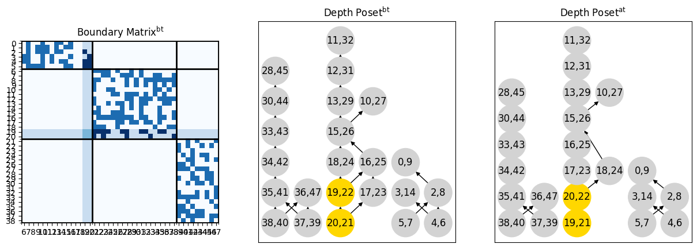

### Birth Death Pairs
|                          |                                                                                                                                                                                                                                   |
|:-------------------------|:----------------------------------------------------------------------------------------------------------------------------------------------------------------------------------------------------------------------------------|
| Before the transposition | $\{(4, 6), (5, 7), (12, 31), (2, 8), (37, 39), (28, 45), (10, 27), (11, 32), (13, 29), (15, 26), (16, 25), (35, 41), (38, 40), (17, 23), (34, 42), (30, 44), (18, 24), (33, 43), (20, 21), (3, 14), (0, 9), (19, 22), (36, 47)\}$ |
| After the transposition  | $\{(4, 6), (5, 7), (12, 31), (19, 21), (2, 8), (37, 39), (28, 45), (10, 27), (11, 32), (13, 29), (15, 26), (16, 25), (35, 41), (20, 22), (38, 40), (17, 23), (34, 42), (30, 44), (18, 24), (33, 43), (3, 14), (0, 9), (36, 47)\}$ |

### Relations
|                          | Algorithm 1                                                                                                                                                                                                                                                                                                                                                                                                                                                                                           | Algorithm 2                                                                                                                                                                                                                                                                                                                                                                                                                                                                                      |
|:-------------------------|:------------------------------------------------------------------------------------------------------------------------------------------------------------------------------------------------------------------------------------------------------------------------------------------------------------------------------------------------------------------------------------------------------------------------------------------------------------------------------------------------------|:-------------------------------------------------------------------------------------------------------------------------------------------------------------------------------------------------------------------------------------------------------------------------------------------------------------------------------------------------------------------------------------------------------------------------------------------------------------------------------------------------|
| Before the transposition | $\{(24, 27), (41, 43), (43, 46), (25, 32), (44, 45), (26, 27), (31, 32), (29, 32), (39, 42), (22, 32), (24, 26), (41, 42), (6, 8), (6, 14), (42, 44), (24, 32), (26, 29), (43, 45), (29, 31), (39, 41), (39, 44), (23, 27), (22, 31), (39, 47), (40, 46), (7, 9), (41, 44), (25, 27), (42, 43), (24, 31), (42, 46), (21, 23), (26, 31), (44, 46), (22, 27), (23, 26), (40, 42), (22, 24), (39, 46), (23, 29), (39, 43), (23, 32), (6, 9), (7, 8)\}$                                                   | $\{(35, 30), (4, 3), (3, 1), (20, 17), (38, 35), (5, 1), (17, 12), (34, 28), (17, 15), (19, 18), (19, 15), (37, 33), (37, 36), (15, 11), (16, 10), (18, 10), (20, 13), (18, 13), (20, 10), (5, 0), (20, 19), (34, 30), (34, 33), (2, 1), (37, 35), (15, 13), (33, 28), (16, 15), (18, 15), (20, 12), (20, 18), (12, 11), (35, 34), (20, 15), (5, 2), (38, 33), (38, 36), (17, 10), (17, 16), (15, 12), (17, 13), (2, 0), (19, 16), (13, 12), (30, 28), (33, 30), (16, 11)\}$                     |
| After the transposition  | $\{(24, 27), (41, 43), (43, 46), (25, 32), (44, 45), (26, 27), (21, 22), (31, 32), (21, 31), (29, 32), (39, 42), (22, 32), (24, 26), (41, 42), (6, 8), (6, 14), (42, 44), (24, 32), (26, 29), (43, 45), (21, 24), (29, 31), (39, 41), (21, 27), (39, 44), (23, 27), (22, 31), (39, 47), (40, 46), (7, 9), (41, 44), (25, 27), (42, 43), (24, 31), (42, 46), (21, 23), (26, 31), (44, 46), (22, 27), (23, 26), (40, 42), (22, 24), (39, 46), (21, 32), (23, 29), (39, 43), (23, 32), (6, 9), (7, 8)\}$ | $\{(35, 30), (4, 3), (3, 1), (38, 35), (20, 17), (5, 1), (33, 30), (17, 12), (34, 28), (17, 15), (19, 12), (19, 18), (37, 33), (19, 15), (37, 36), (15, 11), (16, 10), (18, 10), (20, 13), (18, 13), (20, 10), (20, 16), (5, 0), (34, 30), (34, 33), (2, 1), (19, 17), (37, 35), (19, 20), (15, 13), (33, 28), (16, 15), (18, 15), (20, 12), (12, 11), (35, 34), (38, 33), (5, 2), (38, 36), (17, 10), (17, 16), (17, 13), (19, 10), (2, 0), (19, 13), (13, 12), (30, 28), (15, 12), (16, 11)\}$ |

### Successors and Predecessers
|                 | $\text{Set}^\text{bt}(19, 22)$                                                 | $\text{Set}^\text{bt}(20, 21)$                                                                               | $\text{Set}^\text{at}(19, 21)$                                                                               | $\text{Set}^\text{at}(20, 22)$                                                           |
|:----------------|:-------------------------------------------------------------------------------|:-------------------------------------------------------------------------------------------------------------|:-------------------------------------------------------------------------------------------------------------|:-----------------------------------------------------------------------------------------|
| $\text{Succ}_1$ | $\text{Succ}_1^\text{bt}(19, 22) = \{(10, 27), (11, 32), (18, 24), (12, 31)\}$ | $\text{Succ}_1^\text{bt}(20, 21) = \{(17, 23)\}$                                                             | $\text{Succ}_1^\text{at}(19, 21) = \{(17, 23), (10, 27), (11, 32), (12, 31), (20, 22), (18, 24)\}$           | $\text{Succ}_1^\text{at}(20, 22) = \{(10, 27), (11, 32), (18, 24), (12, 31)\}$           |
| $\text{Pred}_1$ | $\text{Pred}_1^\text{bt}(19, 22) = \emptyset$                                  | $\text{Pred}_1^\text{bt}(20, 21) = \emptyset$                                                                | $\text{Pred}_1^\text{at}(19, 21) = \emptyset$                                                                | $\text{Pred}_1^\text{at}(20, 22) = \{(19, 21)\}$                                         |
| $\text{Succ}_2$ | $\text{Succ}_2^\text{bt}(19, 22) = \{(16, 25), (18, 24), (15, 26)\}$           | $\text{Succ}_2^\text{bt}(20, 21) = \{(17, 23), (10, 27), (13, 29), (15, 26), (19, 22), (12, 31), (18, 24)\}$ | $\text{Succ}_2^\text{at}(19, 21) = \{(17, 23), (10, 27), (13, 29), (15, 26), (12, 31), (20, 22), (18, 24)\}$ | $\text{Succ}_2^\text{at}(20, 22) = \{(17, 23), (10, 27), (13, 29), (16, 25), (12, 31)\}$ |
| $\text{Pred}_2$ | $\text{Pred}_2^\text{bt}(19, 22) = \{(20, 21)\}$                               | $\text{Pred}_2^\text{bt}(20, 21) = \emptyset$                                                                | $\text{Pred}_2^\text{at}(19, 21) = \emptyset$                                                                | $\text{Pred}_2^\text{at}(20, 22) = \{(19, 21)\}$                                         |

### Temp Sets
|                                                               | Before the Transposition                      | After the Transposition                       |
|:--------------------------------------------------------------|:----------------------------------------------|:----------------------------------------------|
| $\mathcal{L} = \{(s, t)\in \text{BD}:\; f(t) < f(y)\}$        | $\{(3, 14), (4, 6), (0, 9), (5, 7), (2, 8)\}$ | $\{(3, 14), (4, 6), (0, 9), (5, 7), (2, 8)\}$ |
| $\mathcal{M} = \{(s, t)\in \text{BD}:\; f(y) < f(t) < f(b)\}$ | $\emptyset$                                   | $\emptyset$                                   |

### Equations
There are 1 equations are wrong.

| eq   | left (formula)                  | left (paramatrized)               | left (value)                                                               | right (formula)                                                                                           | right (paramatrized)                                                                                            | right (value)                                                              | correct   |
|:-----|:--------------------------------|:----------------------------------|:---------------------------------------------------------------------------|:----------------------------------------------------------------------------------------------------------|:----------------------------------------------------------------------------------------------------------------|:---------------------------------------------------------------------------|:----------|
| Eq08 | $\text{Succ}_1^\text{at}(a, y)$ | $\text{Succ}_1^\text{at}(19, 21)$ | $\{(17, 23), (10, 27), (11, 32), (12, 31), (20, 22), (18, 24)\}$           | $\text{Succ}_1^\text{bt}(x, y) \oplus \{(x, b)\} \oplus \text{Succ}_1^\text{bt}(a, b)$                    | $\text{Succ}_1^\text{bt}(20, 21) \oplus \{(20, 22)\} \oplus \text{Succ}_1^\text{bt}(19, 22)$                    | $\{(17, 23), (10, 27), (11, 32), (12, 31), (20, 22), (18, 24)\}$           | ✔         |
| Eq09 | $\text{Succ}_1^\text{at}(x, b)$ | $\text{Succ}_1^\text{at}(20, 22)$ | $\{(10, 27), (11, 32), (18, 24), (12, 31)\}$                               | $\text{Succ}_1^\text{bt}(a, b)$                                                                           | $\text{Succ}_1^\text{bt}(19, 22)$                                                                               | $\{(10, 27), (11, 32), (18, 24), (12, 31)\}$                               | ✔         |
| Eq10 | $\text{Pred}_1^\text{at}(a, y)$ | $\text{Pred}_1^\text{at}(19, 21)$ | $\emptyset$                                                                | $\text{Pred}_1^\text{bt}(x, y)$                                                                           | $\text{Pred}_1^\text{bt}(20, 21)$                                                                               | $\emptyset$                                                                | ✔         |
| Eq11 | $\text{Pred}_1^\text{at}(x, b)$ | $\text{Pred}_1^\text{at}(20, 22)$ | $\{(19, 21)\}$                                                             | $\text{Pred}_1^\text{bt}(a, b) \oplus \{(a, y)\}$                                                         | $\text{Pred}_1^\text{bt}(19, 22) \oplus \{(19, 21)\}$                                                           | $\{(19, 21)\}$                                                             | ✔         |
| Eq12 | $\text{Succ}_2^\text{at}(a, y)$ | $\text{Succ}_2^\text{at}(19, 21)$ | $\{(17, 23), (10, 27), (13, 29), (15, 26), (12, 31), (20, 22), (18, 24)\}$ | $\text{Succ}_2^\text{bt}(x, y) \oplus \{(x, b), (a, b)\}$                                                 | $\text{Succ}_2^\text{bt}(20, 21) \oplus \{(20, 22), (19, 22)\}$                                                 | $\{(17, 23), (10, 27), (13, 29), (15, 26), (12, 31), (20, 22), (18, 24)\}$ | ✔         |
| Eq13 | $\text{Succ}_2^\text{at}(x, b)$ | $\text{Succ}_2^\text{at}(20, 22)$ | $\{(17, 23), (10, 27), (13, 29), (16, 25), (12, 31)\}$                     | $\text{Succ}_2^\text{bt}(a, b)$                                                                           | $\text{Succ}_2^\text{bt}(19, 22)$                                                                               | $\{(16, 25), (18, 24), (15, 26)\}$                                         | ✘         |
| Eq14 | $\text{Pred}_2^\text{at}(a, y)$ | $\text{Pred}_2^\text{at}(19, 21)$ | $\emptyset$                                                                | $[\text{Pred}_2^\text{bt}(a, b) \cap \mathcal{L}]$                                                        | $[\text{Pred}_2^\text{bt}(19, 22) \cap \mathcal{L}]$                                                            | $\emptyset$                                                                | ✔         |
| Eq15 | $\text{Pred}_2^\text{at}(x, b)$ | $\text{Pred}_2^\text{at}(20, 22)$ | $\{(19, 21)\}$                                                             | $\text{Pred}_2^\text{bt}(x, y) \oplus \{(a, y)\} \oplus [\text{Pred}_2^\text{bt}(a, b) \cap \mathcal{M}]$ | $\text{Pred}_2^\text{bt}(20, 21) \oplus \{(19, 21)\} \oplus [\text{Pred}_2^\text{bt}(19, 22) \cap \mathcal{M}]$ | $\{(19, 21)\}$                                                             | ✔         |

## Transposition <27, 28> in complex 0
Here is a __birth-death__ __switch forward__ transposition <27, 28>.

$$
a = 10, \; b = 27, \; x = 28, \; y = 45
$$

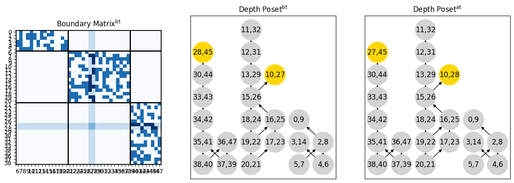

### Birth Death Pairs
|                          |                                                                                                                                                                                                                                   |
|:-------------------------|:----------------------------------------------------------------------------------------------------------------------------------------------------------------------------------------------------------------------------------|
| Before the transposition | $\{(4, 6), (5, 7), (12, 31), (2, 8), (37, 39), (28, 45), (10, 27), (11, 32), (13, 29), (15, 26), (16, 25), (35, 41), (38, 40), (17, 23), (34, 42), (30, 44), (18, 24), (33, 43), (20, 21), (3, 14), (0, 9), (19, 22), (36, 47)\}$ |
| After the transposition  | $\{(4, 6), (5, 7), (12, 31), (2, 8), (37, 39), (11, 32), (13, 29), (15, 26), (36, 47), (16, 25), (35, 41), (38, 40), (17, 23), (34, 42), (30, 44), (27, 45), (18, 24), (33, 43), (20, 21), (3, 14), (0, 9), (19, 22), (10, 28)\}$ |

### Relations
|                          | Algorithm 1                                                                                                                                                                                                                                                                                                                                                                                                                                         | Algorithm 2                                                                                                                                                                                                                                                                                                                                                                                                                                                                  |
|:-------------------------|:----------------------------------------------------------------------------------------------------------------------------------------------------------------------------------------------------------------------------------------------------------------------------------------------------------------------------------------------------------------------------------------------------------------------------------------------------|:-----------------------------------------------------------------------------------------------------------------------------------------------------------------------------------------------------------------------------------------------------------------------------------------------------------------------------------------------------------------------------------------------------------------------------------------------------------------------------|
| Before the transposition | $\{(24, 27), (41, 43), (43, 46), (25, 32), (44, 45), (26, 27), (31, 32), (29, 32), (39, 42), (22, 32), (24, 26), (41, 42), (6, 8), (6, 14), (42, 44), (24, 32), (26, 29), (43, 45), (29, 31), (39, 41), (39, 44), (23, 27), (22, 31), (39, 47), (40, 46), (7, 9), (41, 44), (25, 27), (42, 43), (24, 31), (42, 46), (21, 23), (26, 31), (44, 46), (22, 27), (23, 26), (40, 42), (22, 24), (39, 46), (23, 29), (39, 43), (23, 32), (6, 9), (7, 8)\}$ | $\{(35, 30), (4, 3), (3, 1), (20, 17), (38, 35), (5, 1), (17, 12), (34, 28), (17, 15), (19, 18), (19, 15), (37, 33), (37, 36), (15, 11), (16, 10), (18, 10), (20, 13), (18, 13), (20, 10), (5, 0), (20, 19), (34, 30), (34, 33), (2, 1), (37, 35), (15, 13), (33, 28), (16, 15), (18, 15), (20, 12), (20, 18), (12, 11), (35, 34), (20, 15), (5, 2), (38, 33), (38, 36), (17, 10), (17, 16), (15, 12), (17, 13), (2, 0), (19, 16), (13, 12), (30, 28), (33, 30), (16, 11)\}$ |
| After the transposition  | $\{(41, 43), (43, 46), (25, 32), (44, 45), (21, 28), (31, 32), (29, 32), (23, 28), (39, 42), (22, 32), (24, 26), (41, 42), (6, 8), (6, 14), (42, 44), (24, 32), (26, 29), (43, 45), (29, 31), (39, 41), (39, 44), (22, 31), (39, 47), (40, 46), (7, 9), (24, 28), (41, 44), (42, 43), (24, 31), (26, 28), (42, 46), (21, 23), (26, 31), (44, 46), (23, 26), (40, 42), (22, 24), (39, 46), (23, 29), (39, 43), (23, 32), (6, 9), (7, 8)\}$           | $\{(35, 30), (4, 3), (3, 1), (20, 17), (38, 35), (5, 1), (33, 30), (17, 12), (17, 15), (19, 18), (37, 27), (37, 33), (19, 15), (37, 36), (15, 11), (16, 10), (18, 10), (20, 13), (18, 13), (20, 10), (5, 0), (20, 19), (34, 30), (34, 33), (2, 1), (37, 35), (15, 13), (16, 15), (18, 15), (20, 12), (20, 18), (12, 11), (38, 27), (35, 34), (20, 15), (5, 2), (38, 33), (38, 36), (17, 10), (17, 16), (17, 13), (2, 0), (19, 16), (13, 12), (15, 12), (16, 11)\}$           |

### Successors and Predecessers
|                 | $\text{Set}^\text{bt}(10, 27)$                                                           | $\text{Set}^\text{bt}(28, 45)$                                       | $\text{Set}^\text{at}(10, 28)$                                                 | $\text{Set}^\text{at}(27, 45)$                             |
|:----------------|:-----------------------------------------------------------------------------------------|:---------------------------------------------------------------------|:-------------------------------------------------------------------------------|:-----------------------------------------------------------|
| $\text{Succ}_1$ | $\text{Succ}_1^\text{bt}(10, 27) = \emptyset$                                            | $\text{Succ}_1^\text{bt}(28, 45) = \emptyset$                        | $\text{Succ}_1^\text{at}(10, 28) = \emptyset$                                  | $\text{Succ}_1^\text{at}(27, 45) = \emptyset$              |
| $\text{Pred}_1$ | $\text{Pred}_1^\text{bt}(10, 27) = \{(17, 23), (15, 26), (16, 25), (19, 22), (18, 24)\}$ | $\text{Pred}_1^\text{bt}(28, 45) = \{(33, 43), (30, 44)\}$           | $\text{Pred}_1^\text{at}(10, 28) = \{(17, 23), (18, 24), (20, 21), (15, 26)\}$ | $\text{Pred}_1^\text{at}(27, 45) = \{(33, 43), (30, 44)\}$ |
| $\text{Succ}_2$ | $\text{Succ}_2^\text{bt}(10, 27) = \emptyset$                                            | $\text{Succ}_2^\text{bt}(28, 45) = \emptyset$                        | $\text{Succ}_2^\text{at}(10, 28) = \emptyset$                                  | $\text{Succ}_2^\text{at}(27, 45) = \emptyset$              |
| $\text{Pred}_2$ | $\text{Pred}_2^\text{bt}(10, 27) = \{(16, 25), (17, 23), (18, 24), (20, 21)\}$           | $\text{Pred}_2^\text{bt}(28, 45) = \{(33, 43), (30, 44), (34, 42)\}$ | $\text{Pred}_2^\text{at}(10, 28) = \{(16, 25), (17, 23), (18, 24), (20, 21)\}$ | $\text{Pred}_2^\text{at}(27, 45) = \{(38, 40), (37, 39)\}$ |

### Temp Sets
|                                                              | Before the Transposition                                         | After the Transposition                                          |
|:-------------------------------------------------------------|:-----------------------------------------------------------------|:-----------------------------------------------------------------|
| $A_1 = \{(s, t)\in \text{BD}:\; f(a) < f(s) < f(t) < f(x)\}$ | $\{(17, 23), (15, 26), (16, 25), (19, 22), (18, 24), (20, 21)\}$ | $\{(17, 23), (15, 26), (16, 25), (19, 22), (18, 24), (20, 21)\}$ |
| $B_1 = \{(s, t)\in \text{BD}:\; U_1[t, x] = 1\}$             | $\emptyset$                                                      | $\{(17, 23), (18, 24), (20, 21), (15, 26)\}$                     |
| $A_2 = \{(s, t)\in \text{BD}:\; f(b) < f(s) < f(t) < f(y)\}$ | $\{(37, 39), (34, 42), (30, 44), (35, 41), (38, 40), (33, 43)\}$ | $\{(37, 39), (34, 42), (30, 44), (35, 41), (38, 40), (33, 43)\}$ |
| $B_2 = \{(s, t)\in \text{BD}:\; U_2[b, s] = 1\}$             | $\emptyset$                                                      | $\{(38, 40), (37, 39)\}$                                         |

### Equations
There are 4 equations are wrong.

| eq    | left (formula)                  | left (paramatrized)               | left (value)                                 | right (formula)                                      | right (paramatrized)                                  | right (value)                                | correct   |
|:------|:--------------------------------|:----------------------------------|:---------------------------------------------|:-----------------------------------------------------|:------------------------------------------------------|:---------------------------------------------|:----------|
| Eq48  | $\text{Succ}_1^\text{at}(a, x)$ | $\text{Succ}_1^\text{at}(10, 28)$ | $\emptyset$                                  | $\text{Succ}_1^\text{bt}(a, b)$                      | $\text{Succ}_1^\text{bt}(10, 27)$                     | $\emptyset$                                  | ✔         |
| Eq49  | $\text{Succ}_1^\text{at}(b, y)$ | $\text{Succ}_1^\text{at}(27, 45)$ | $\emptyset$                                  | $\text{Succ}_1^\text{bt}(x, y)$                      | $\text{Succ}_1^\text{bt}(28, 45)$                     | $\emptyset$                                  | ✔         |
| Eq50  | $\text{Pred}_1^\text{at}(a, x)$ | $\text{Pred}_1^\text{at}(10, 28)$ | $\{(17, 23), (18, 24), (20, 21), (15, 26)\}$ | $\{(s, t)\in \text{BD}:\; U_1^\text{bt}[t, x] = 1\}$ | $\{(s, t)\in \text{BD}:\; U_1^\text{bt}[t, 28] = 1\}$ | $\emptyset$                                  | ✘         |
| Eq50a | $\text{Pred}_1^\text{at}(a, x)$ | $\text{Pred}_1^\text{at}(10, 28)$ | $\{(17, 23), (18, 24), (20, 21), (15, 26)\}$ | $A_1^\text{bt} \cap B_1^\text{bt}$                   | $A_1^\text{bt} \cap B_1^\text{bt}$                    | $\emptyset$                                  | ✘         |
| Eq50b | $\text{Pred}_1^\text{at}(a, x)$ | $\text{Pred}_1^\text{at}(10, 28)$ | $\{(17, 23), (18, 24), (20, 21), (15, 26)\}$ | $A_1^\text{bt} \cap B_1^\text{at}$                   | $A_1^\text{bt} \cap B_1^\text{at}$                    | $\{(15, 26), (17, 23), (18, 24), (20, 21)\}$ | ✔         |
| Eq51  | $\text{Pred}_1^\text{at}(b, y)$ | $\text{Pred}_1^\text{at}(27, 45)$ | $\{(33, 43), (30, 44)\}$                     | $\text{Pred}_1^\text{bt}(x, y)$                      | $\text{Pred}_1^\text{bt}(28, 45)$                     | $\{(33, 43), (30, 44)\}$                     | ✔         |
| Eq52  | $\text{Succ}_2^\text{at}(a, x)$ | $\text{Succ}_2^\text{at}(10, 28)$ | $\emptyset$                                  | $\text{Succ}_2^\text{bt}(a, b)$                      | $\text{Succ}_2^\text{bt}(10, 27)$                     | $\emptyset$                                  | ✔         |
| Eq53  | $\text{Succ}_2^\text{at}(b, y)$ | $\text{Succ}_2^\text{at}(27, 45)$ | $\emptyset$                                  | $\text{Succ}_2^\text{bt}(x, y)$                      | $\text{Succ}_2^\text{bt}(28, 45)$                     | $\emptyset$                                  | ✔         |
| Eq54  | $\text{Pred}_2^\text{at}(a, x)$ | $\text{Pred}_2^\text{at}(10, 28)$ | $\{(16, 25), (17, 23), (18, 24), (20, 21)\}$ | $\text{Pred}_2^\text{bt}(a, b)$                      | $\text{Pred}_2^\text{bt}(10, 27)$                     | $\{(16, 25), (17, 23), (18, 24), (20, 21)\}$ | ✔         |
| Eq55  | $\text{Pred}_2^\text{at}(b, y)$ | $\text{Pred}_2^\text{at}(27, 45)$ | $\{(38, 40), (37, 39)\}$                     | $\{(s, t)\in \text{BD}:\; U_2^\text{bt}[b, s] = 1\}$ | $\{(s, t)\in \text{BD}:\; U_2^\text{bt}[27, s] = 1\}$ | $\emptyset$                                  | ✘         |
| Eq55a | $\text{Pred}_2^\text{at}(b, y)$ | $\text{Pred}_2^\text{at}(27, 45)$ | $\{(38, 40), (37, 39)\}$                     | $A_2^\text{bt} \cap B_2^\text{bt}$                   | $A_2^\text{bt} \cap B_2^\text{bt}$                    | $\emptyset$                                  | ✘         |
| Eq55b | $\text{Pred}_2^\text{at}(b, y)$ | $\text{Pred}_2^\text{at}(27, 45)$ | $\{(38, 40), (37, 39)\}$                     | $A_2^\text{bt} \cap B_2^\text{at}$                   | $A_2^\text{bt} \cap B_2^\text{at}$                    | $\{(38, 40), (37, 39)\}$                     | ✔         |

## Transposition <29, 30> in complex 0
Here is a __birth-death__ __switch forward__ transposition <29, 30>.

$$
a = 13, \; b = 29, \; x = 30, \; y = 44
$$

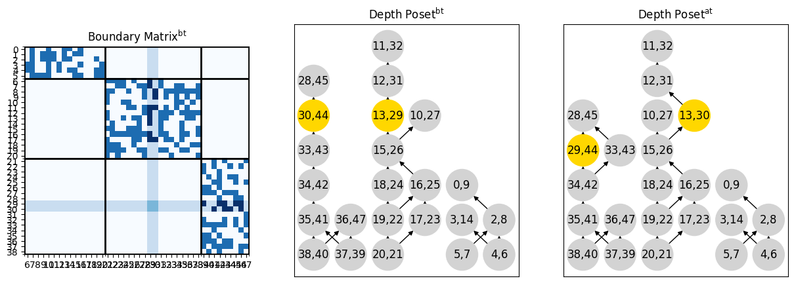

### Birth Death Pairs
|                          |                                                                                                                                                                                                                                   |
|:-------------------------|:----------------------------------------------------------------------------------------------------------------------------------------------------------------------------------------------------------------------------------|
| Before the transposition | $\{(4, 6), (5, 7), (12, 31), (2, 8), (37, 39), (28, 45), (10, 27), (11, 32), (13, 29), (15, 26), (16, 25), (35, 41), (38, 40), (17, 23), (34, 42), (30, 44), (18, 24), (33, 43), (20, 21), (3, 14), (0, 9), (19, 22), (36, 47)\}$ |
| After the transposition  | $\{(13, 30), (4, 6), (5, 7), (29, 44), (12, 31), (2, 8), (37, 39), (28, 45), (10, 27), (11, 32), (15, 26), (16, 25), (35, 41), (38, 40), (17, 23), (34, 42), (18, 24), (33, 43), (20, 21), (3, 14), (0, 9), (19, 22), (36, 47)\}$ |

### Relations
|                          | Algorithm 1                                                                                                                                                                                                                                                                                                                                                                                                                                         | Algorithm 2                                                                                                                                                                                                                                                                                                                                                                                                                                                                  |
|:-------------------------|:----------------------------------------------------------------------------------------------------------------------------------------------------------------------------------------------------------------------------------------------------------------------------------------------------------------------------------------------------------------------------------------------------------------------------------------------------|:-----------------------------------------------------------------------------------------------------------------------------------------------------------------------------------------------------------------------------------------------------------------------------------------------------------------------------------------------------------------------------------------------------------------------------------------------------------------------------|
| Before the transposition | $\{(24, 27), (41, 43), (43, 46), (25, 32), (44, 45), (26, 27), (31, 32), (29, 32), (39, 42), (22, 32), (24, 26), (41, 42), (6, 8), (6, 14), (42, 44), (24, 32), (26, 29), (43, 45), (29, 31), (39, 41), (39, 44), (23, 27), (22, 31), (39, 47), (40, 46), (7, 9), (41, 44), (25, 27), (42, 43), (24, 31), (42, 46), (21, 23), (26, 31), (44, 46), (22, 27), (23, 26), (40, 42), (22, 24), (39, 46), (23, 29), (39, 43), (23, 32), (6, 9), (7, 8)\}$ | $\{(35, 30), (4, 3), (3, 1), (20, 17), (38, 35), (5, 1), (17, 12), (34, 28), (17, 15), (19, 18), (19, 15), (37, 33), (37, 36), (15, 11), (16, 10), (18, 10), (20, 13), (18, 13), (20, 10), (5, 0), (20, 19), (34, 30), (34, 33), (2, 1), (37, 35), (15, 13), (33, 28), (16, 15), (18, 15), (20, 12), (20, 18), (12, 11), (35, 34), (20, 15), (5, 2), (38, 33), (38, 36), (17, 10), (17, 16), (15, 12), (17, 13), (2, 0), (19, 16), (13, 12), (30, 28), (33, 30), (16, 11)\}$ |
| After the transposition  | $\{(24, 27), (41, 43), (43, 46), (25, 32), (44, 45), (26, 27), (31, 32), (39, 42), (22, 32), (24, 26), (41, 42), (6, 8), (6, 14), (42, 44), (24, 32), (43, 45), (39, 41), (23, 30), (39, 44), (23, 27), (22, 31), (39, 47), (40, 46), (30, 32), (7, 9), (41, 44), (25, 27), (42, 43), (24, 31), (25, 30), (42, 46), (21, 23), (26, 31), (44, 46), (22, 27), (23, 26), (40, 42), (22, 24), (39, 46), (39, 43), (23, 32), (30, 31), (6, 9), (7, 8)\}$ | $\{(4, 3), (3, 1), (20, 17), (38, 35), (5, 1), (17, 12), (34, 28), (17, 15), (19, 18), (19, 15), (37, 33), (37, 36), (15, 11), (16, 10), (18, 10), (20, 13), (18, 13), (35, 29), (20, 10), (5, 0), (20, 19), (29, 28), (34, 33), (37, 29), (2, 1), (37, 35), (15, 13), (33, 28), (16, 15), (18, 15), (20, 12), (20, 18), (12, 11), (35, 34), (20, 15), (5, 2), (38, 33), (38, 36), (17, 10), (17, 16), (17, 13), (34, 29), (2, 0), (19, 16), (13, 12), (15, 12), (16, 11)\}$ |

### Successors and Predecessers
|                 | $\text{Set}^\text{bt}(13, 29)$                                                 | $\text{Set}^\text{bt}(30, 44)$                                       | $\text{Set}^\text{at}(13, 30)$                                                 | $\text{Set}^\text{at}(29, 44)$                                       |
|:----------------|:-------------------------------------------------------------------------------|:---------------------------------------------------------------------|:-------------------------------------------------------------------------------|:---------------------------------------------------------------------|
| $\text{Succ}_1$ | $\text{Succ}_1^\text{bt}(13, 29) = \{(11, 32), (12, 31)\}$                     | $\text{Succ}_1^\text{bt}(30, 44) = \{(28, 45)\}$                     | $\text{Succ}_1^\text{at}(13, 30) = \{(11, 32), (12, 31)\}$                     | $\text{Succ}_1^\text{at}(29, 44) = \{(28, 45)\}$                     |
| $\text{Pred}_1$ | $\text{Pred}_1^\text{bt}(13, 29) = \{(17, 23), (15, 26)\}$                     | $\text{Pred}_1^\text{bt}(30, 44) = \{(37, 39), (35, 41), (34, 42)\}$ | $\text{Pred}_1^\text{at}(13, 30) = \{(16, 25), (17, 23)\}$                     | $\text{Pred}_1^\text{at}(29, 44) = \{(37, 39), (35, 41), (34, 42)\}$ |
| $\text{Succ}_2$ | $\text{Succ}_2^\text{bt}(13, 29) = \{(12, 31)\}$                               | $\text{Succ}_2^\text{bt}(30, 44) = \{(28, 45)\}$                     | $\text{Succ}_2^\text{at}(13, 30) = \{(12, 31)\}$                               | $\text{Succ}_2^\text{at}(29, 44) = \{(28, 45)\}$                     |
| $\text{Pred}_2$ | $\text{Pred}_2^\text{bt}(13, 29) = \{(17, 23), (18, 24), (20, 21), (15, 26)\}$ | $\text{Pred}_2^\text{bt}(30, 44) = \{(35, 41), (33, 43), (34, 42)\}$ | $\text{Pred}_2^\text{at}(13, 30) = \{(17, 23), (18, 24), (20, 21), (15, 26)\}$ | $\text{Pred}_2^\text{at}(29, 44) = \{(37, 39), (35, 41), (34, 42)\}$ |

### Temp Sets
|                                                              | Before the Transposition                                         | After the Transposition                                          |
|:-------------------------------------------------------------|:-----------------------------------------------------------------|:-----------------------------------------------------------------|
| $A_1 = \{(s, t)\in \text{BD}:\; f(a) < f(s) < f(t) < f(x)\}$ | $\{(17, 23), (15, 26), (16, 25), (19, 22), (18, 24), (20, 21)\}$ | $\{(17, 23), (15, 26), (16, 25), (19, 22), (18, 24), (20, 21)\}$ |
| $B_1 = \{(s, t)\in \text{BD}:\; U_1[t, x] = 1\}$             | $\emptyset$                                                      | $\{(16, 25), (17, 23)\}$                                         |
| $A_2 = \{(s, t)\in \text{BD}:\; f(b) < f(s) < f(t) < f(y)\}$ | $\{(37, 39), (34, 42), (35, 41), (38, 40), (33, 43)\}$           | $\{(37, 39), (34, 42), (35, 41), (38, 40), (33, 43)\}$           |
| $B_2 = \{(s, t)\in \text{BD}:\; U_2[b, s] = 1\}$             | $\emptyset$                                                      | $\{(37, 39), (35, 41), (34, 42)\}$                               |

### Equations
There are 4 equations are wrong.

| eq    | left (formula)                  | left (paramatrized)               | left (value)                                 | right (formula)                                      | right (paramatrized)                                  | right (value)                                | correct   |
|:------|:--------------------------------|:----------------------------------|:---------------------------------------------|:-----------------------------------------------------|:------------------------------------------------------|:---------------------------------------------|:----------|
| Eq48  | $\text{Succ}_1^\text{at}(a, x)$ | $\text{Succ}_1^\text{at}(13, 30)$ | $\{(11, 32), (12, 31)\}$                     | $\text{Succ}_1^\text{bt}(a, b)$                      | $\text{Succ}_1^\text{bt}(13, 29)$                     | $\{(11, 32), (12, 31)\}$                     | ✔         |
| Eq49  | $\text{Succ}_1^\text{at}(b, y)$ | $\text{Succ}_1^\text{at}(29, 44)$ | $\{(28, 45)\}$                               | $\text{Succ}_1^\text{bt}(x, y)$                      | $\text{Succ}_1^\text{bt}(30, 44)$                     | $\{(28, 45)\}$                               | ✔         |
| Eq50  | $\text{Pred}_1^\text{at}(a, x)$ | $\text{Pred}_1^\text{at}(13, 30)$ | $\{(16, 25), (17, 23)\}$                     | $\{(s, t)\in \text{BD}:\; U_1^\text{bt}[t, x] = 1\}$ | $\{(s, t)\in \text{BD}:\; U_1^\text{bt}[t, 30] = 1\}$ | $\emptyset$                                  | ✘         |
| Eq50a | $\text{Pred}_1^\text{at}(a, x)$ | $\text{Pred}_1^\text{at}(13, 30)$ | $\{(16, 25), (17, 23)\}$                     | $A_1^\text{bt} \cap B_1^\text{bt}$                   | $A_1^\text{bt} \cap B_1^\text{bt}$                    | $\emptyset$                                  | ✘         |
| Eq50b | $\text{Pred}_1^\text{at}(a, x)$ | $\text{Pred}_1^\text{at}(13, 30)$ | $\{(16, 25), (17, 23)\}$                     | $A_1^\text{bt} \cap B_1^\text{at}$                   | $A_1^\text{bt} \cap B_1^\text{at}$                    | $\{(16, 25), (17, 23)\}$                     | ✔         |
| Eq51  | $\text{Pred}_1^\text{at}(b, y)$ | $\text{Pred}_1^\text{at}(29, 44)$ | $\{(37, 39), (35, 41), (34, 42)\}$           | $\text{Pred}_1^\text{bt}(x, y)$                      | $\text{Pred}_1^\text{bt}(30, 44)$                     | $\{(37, 39), (35, 41), (34, 42)\}$           | ✔         |
| Eq52  | $\text{Succ}_2^\text{at}(a, x)$ | $\text{Succ}_2^\text{at}(13, 30)$ | $\{(12, 31)\}$                               | $\text{Succ}_2^\text{bt}(a, b)$                      | $\text{Succ}_2^\text{bt}(13, 29)$                     | $\{(12, 31)\}$                               | ✔         |
| Eq53  | $\text{Succ}_2^\text{at}(b, y)$ | $\text{Succ}_2^\text{at}(29, 44)$ | $\{(28, 45)\}$                               | $\text{Succ}_2^\text{bt}(x, y)$                      | $\text{Succ}_2^\text{bt}(30, 44)$                     | $\{(28, 45)\}$                               | ✔         |
| Eq54  | $\text{Pred}_2^\text{at}(a, x)$ | $\text{Pred}_2^\text{at}(13, 30)$ | $\{(17, 23), (18, 24), (20, 21), (15, 26)\}$ | $\text{Pred}_2^\text{bt}(a, b)$                      | $\text{Pred}_2^\text{bt}(13, 29)$                     | $\{(17, 23), (18, 24), (20, 21), (15, 26)\}$ | ✔         |
| Eq55  | $\text{Pred}_2^\text{at}(b, y)$ | $\text{Pred}_2^\text{at}(29, 44)$ | $\{(37, 39), (35, 41), (34, 42)\}$           | $\{(s, t)\in \text{BD}:\; U_2^\text{bt}[b, s] = 1\}$ | $\{(s, t)\in \text{BD}:\; U_2^\text{bt}[29, s] = 1\}$ | $\emptyset$                                  | ✘         |
| Eq55a | $\text{Pred}_2^\text{at}(b, y)$ | $\text{Pred}_2^\text{at}(29, 44)$ | $\{(37, 39), (35, 41), (34, 42)\}$           | $A_2^\text{bt} \cap B_2^\text{bt}$                   | $A_2^\text{bt} \cap B_2^\text{bt}$                    | $\emptyset$                                  | ✘         |
| Eq55b | $\text{Pred}_2^\text{at}(b, y)$ | $\text{Pred}_2^\text{at}(29, 44)$ | $\{(37, 39), (35, 41), (34, 42)\}$           | $A_2^\text{bt} \cap B_2^\text{at}$                   | $A_2^\text{bt} \cap B_2^\text{at}$                    | $\{(34, 42), (37, 39), (35, 41)\}$           | ✔         |

## Transposition <32, 33> in complex 0
Here is a __birth-death__ __switch forward__ transposition <32, 33>.

$$
a = 11, \; b = 32, \; x = 33, \; y = 43
$$

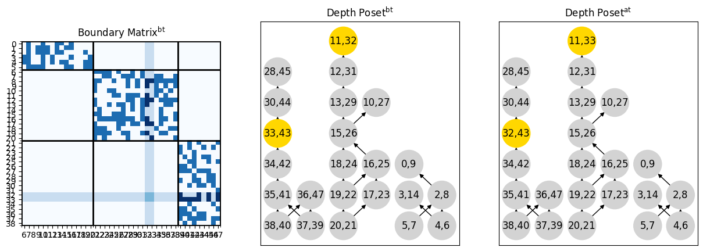

### Birth Death Pairs
|                          |                                                                                                                                                                                                                                   |
|:-------------------------|:----------------------------------------------------------------------------------------------------------------------------------------------------------------------------------------------------------------------------------|
| Before the transposition | $\{(4, 6), (5, 7), (12, 31), (2, 8), (37, 39), (28, 45), (10, 27), (11, 32), (13, 29), (15, 26), (16, 25), (35, 41), (38, 40), (17, 23), (34, 42), (30, 44), (18, 24), (33, 43), (20, 21), (3, 14), (0, 9), (19, 22), (36, 47)\}$ |
| After the transposition  | $\{(32, 43), (4, 6), (5, 7), (12, 31), (2, 8), (37, 39), (28, 45), (10, 27), (13, 29), (15, 26), (16, 25), (35, 41), (38, 40), (17, 23), (34, 42), (30, 44), (18, 24), (20, 21), (3, 14), (0, 9), (19, 22), (36, 47), (11, 33)\}$ |

### Relations
|                          | Algorithm 1                                                                                                                                                                                                                                                                                                                                                                                                                                         | Algorithm 2                                                                                                                                                                                                                                                                                                                                                                                                                                                                  |
|:-------------------------|:----------------------------------------------------------------------------------------------------------------------------------------------------------------------------------------------------------------------------------------------------------------------------------------------------------------------------------------------------------------------------------------------------------------------------------------------------|:-----------------------------------------------------------------------------------------------------------------------------------------------------------------------------------------------------------------------------------------------------------------------------------------------------------------------------------------------------------------------------------------------------------------------------------------------------------------------------|
| Before the transposition | $\{(24, 27), (41, 43), (43, 46), (25, 32), (44, 45), (26, 27), (31, 32), (29, 32), (39, 42), (22, 32), (24, 26), (41, 42), (6, 8), (6, 14), (42, 44), (24, 32), (26, 29), (43, 45), (29, 31), (39, 41), (39, 44), (23, 27), (22, 31), (39, 47), (40, 46), (7, 9), (41, 44), (25, 27), (42, 43), (24, 31), (42, 46), (21, 23), (26, 31), (44, 46), (22, 27), (23, 26), (40, 42), (22, 24), (39, 46), (23, 29), (39, 43), (23, 32), (6, 9), (7, 8)\}$ | $\{(35, 30), (4, 3), (3, 1), (20, 17), (38, 35), (5, 1), (17, 12), (34, 28), (17, 15), (19, 18), (19, 15), (37, 33), (37, 36), (15, 11), (16, 10), (18, 10), (20, 13), (18, 13), (20, 10), (5, 0), (20, 19), (34, 30), (34, 33), (2, 1), (37, 35), (15, 13), (33, 28), (16, 15), (18, 15), (20, 12), (20, 18), (12, 11), (35, 34), (20, 15), (5, 2), (38, 33), (38, 36), (17, 10), (17, 16), (15, 12), (17, 13), (2, 0), (19, 16), (13, 12), (30, 28), (33, 30), (16, 11)\}$ |
| After the transposition  | $\{(24, 27), (41, 43), (43, 46), (44, 45), (26, 27), (26, 33), (39, 42), (24, 26), (41, 42), (6, 8), (6, 14), (42, 44), (26, 29), (43, 45), (29, 31), (39, 41), (21, 33), (39, 44), (23, 27), (22, 31), (39, 47), (40, 46), (7, 9), (41, 44), (25, 27), (25, 33), (42, 43), (24, 31), (42, 46), (21, 23), (26, 31), (44, 46), (22, 27), (23, 26), (31, 33), (40, 42), (22, 24), (39, 46), (23, 29), (22, 33), (39, 43), (6, 9), (7, 8)\}$           | $\{(35, 30), (4, 3), (3, 1), (20, 17), (38, 35), (5, 1), (17, 12), (34, 28), (17, 15), (19, 18), (19, 15), (37, 36), (15, 11), (16, 10), (32, 30), (18, 10), (35, 32), (20, 13), (18, 13), (20, 10), (5, 0), (20, 19), (34, 30), (2, 1), (37, 35), (37, 32), (15, 13), (16, 15), (18, 15), (20, 12), (20, 18), (12, 11), (35, 34), (20, 15), (5, 2), (38, 36), (17, 10), (17, 16), (17, 13), (2, 0), (19, 16), (13, 12), (30, 28), (15, 12), (32, 28), (16, 11)\}$           |

### Successors and Predecessers
|                 | $\text{Set}^\text{bt}(11, 32)$                                                                     | $\text{Set}^\text{bt}(33, 43)$                                       | $\text{Set}^\text{at}(11, 33)$                                                           | $\text{Set}^\text{at}(32, 43)$                                       |
|:----------------|:---------------------------------------------------------------------------------------------------|:---------------------------------------------------------------------|:-----------------------------------------------------------------------------------------|:---------------------------------------------------------------------|
| $\text{Succ}_1$ | $\text{Succ}_1^\text{bt}(11, 32) = \emptyset$                                                      | $\text{Succ}_1^\text{bt}(33, 43) = \{(28, 45)\}$                     | $\text{Succ}_1^\text{at}(11, 33) = \emptyset$                                            | $\text{Succ}_1^\text{at}(32, 43) = \{(28, 45)\}$                     |
| $\text{Pred}_1$ | $\text{Pred}_1^\text{bt}(11, 32) = \{(17, 23), (13, 29), (16, 25), (19, 22), (12, 31), (18, 24)\}$ | $\text{Pred}_1^\text{bt}(33, 43) = \{(37, 39), (35, 41), (34, 42)\}$ | $\text{Pred}_1^\text{at}(11, 33) = \{(15, 26), (16, 25), (19, 22), (12, 31), (20, 21)\}$ | $\text{Pred}_1^\text{at}(32, 43) = \{(37, 39), (35, 41), (34, 42)\}$ |
| $\text{Succ}_2$ | $\text{Succ}_2^\text{bt}(11, 32) = \emptyset$                                                      | $\text{Succ}_2^\text{bt}(33, 43) = \{(28, 45), (30, 44)\}$           | $\text{Succ}_2^\text{at}(11, 33) = \emptyset$                                            | $\text{Succ}_2^\text{at}(32, 43) = \{(28, 45), (30, 44)\}$           |
| $\text{Pred}_2$ | $\text{Pred}_2^\text{bt}(11, 32) = \{(16, 25), (12, 31), (15, 26)\}$                               | $\text{Pred}_2^\text{bt}(33, 43) = \{(38, 40), (37, 39), (34, 42)\}$ | $\text{Pred}_2^\text{at}(11, 33) = \{(16, 25), (12, 31), (15, 26)\}$                     | $\text{Pred}_2^\text{at}(32, 43) = \{(37, 39), (35, 41)\}$           |

### Temp Sets
|                                                              | Before the Transposition                                                             | After the Transposition                                                              |
|:-------------------------------------------------------------|:-------------------------------------------------------------------------------------|:-------------------------------------------------------------------------------------|
| $A_1 = \{(s, t)\in \text{BD}:\; f(a) < f(s) < f(t) < f(x)\}$ | $\{(17, 23), (13, 29), (15, 26), (16, 25), (19, 22), (12, 31), (18, 24), (20, 21)\}$ | $\{(17, 23), (13, 29), (15, 26), (16, 25), (19, 22), (12, 31), (18, 24), (20, 21)\}$ |
| $B_1 = \{(s, t)\in \text{BD}:\; U_1[t, x] = 1\}$             | $\emptyset$                                                                          | $\{(15, 26), (16, 25), (19, 22), (12, 31), (20, 21)\}$                               |
| $A_2 = \{(s, t)\in \text{BD}:\; f(b) < f(s) < f(t) < f(y)\}$ | $\{(38, 40), (37, 39), (35, 41), (34, 42)\}$                                         | $\{(38, 40), (37, 39), (35, 41), (34, 42)\}$                                         |
| $B_2 = \{(s, t)\in \text{BD}:\; U_2[b, s] = 1\}$             | $\emptyset$                                                                          | $\{(37, 39), (35, 41)\}$                                                             |

### Equations
There are 4 equations are wrong.

| eq    | left (formula)                  | left (paramatrized)               | left (value)                                           | right (formula)                                      | right (paramatrized)                                  | right (value)                                          | correct   |
|:------|:--------------------------------|:----------------------------------|:-------------------------------------------------------|:-----------------------------------------------------|:------------------------------------------------------|:-------------------------------------------------------|:----------|
| Eq48  | $\text{Succ}_1^\text{at}(a, x)$ | $\text{Succ}_1^\text{at}(11, 33)$ | $\emptyset$                                            | $\text{Succ}_1^\text{bt}(a, b)$                      | $\text{Succ}_1^\text{bt}(11, 32)$                     | $\emptyset$                                            | ✔         |
| Eq49  | $\text{Succ}_1^\text{at}(b, y)$ | $\text{Succ}_1^\text{at}(32, 43)$ | $\{(28, 45)\}$                                         | $\text{Succ}_1^\text{bt}(x, y)$                      | $\text{Succ}_1^\text{bt}(33, 43)$                     | $\{(28, 45)\}$                                         | ✔         |
| Eq50  | $\text{Pred}_1^\text{at}(a, x)$ | $\text{Pred}_1^\text{at}(11, 33)$ | $\{(15, 26), (16, 25), (19, 22), (12, 31), (20, 21)\}$ | $\{(s, t)\in \text{BD}:\; U_1^\text{bt}[t, x] = 1\}$ | $\{(s, t)\in \text{BD}:\; U_1^\text{bt}[t, 33] = 1\}$ | $\emptyset$                                            | ✘         |
| Eq50a | $\text{Pred}_1^\text{at}(a, x)$ | $\text{Pred}_1^\text{at}(11, 33)$ | $\{(15, 26), (16, 25), (19, 22), (12, 31), (20, 21)\}$ | $A_1^\text{bt} \cap B_1^\text{bt}$                   | $A_1^\text{bt} \cap B_1^\text{bt}$                    | $\emptyset$                                            | ✘         |
| Eq50b | $\text{Pred}_1^\text{at}(a, x)$ | $\text{Pred}_1^\text{at}(11, 33)$ | $\{(15, 26), (16, 25), (19, 22), (12, 31), (20, 21)\}$ | $A_1^\text{bt} \cap B_1^\text{at}$                   | $A_1^\text{bt} \cap B_1^\text{at}$                    | $\{(15, 26), (16, 25), (19, 22), (12, 31), (20, 21)\}$ | ✔         |
| Eq51  | $\text{Pred}_1^\text{at}(b, y)$ | $\text{Pred}_1^\text{at}(32, 43)$ | $\{(37, 39), (35, 41), (34, 42)\}$                     | $\text{Pred}_1^\text{bt}(x, y)$                      | $\text{Pred}_1^\text{bt}(33, 43)$                     | $\{(37, 39), (35, 41), (34, 42)\}$                     | ✔         |
| Eq52  | $\text{Succ}_2^\text{at}(a, x)$ | $\text{Succ}_2^\text{at}(11, 33)$ | $\emptyset$                                            | $\text{Succ}_2^\text{bt}(a, b)$                      | $\text{Succ}_2^\text{bt}(11, 32)$                     | $\emptyset$                                            | ✔         |
| Eq53  | $\text{Succ}_2^\text{at}(b, y)$ | $\text{Succ}_2^\text{at}(32, 43)$ | $\{(28, 45), (30, 44)\}$                               | $\text{Succ}_2^\text{bt}(x, y)$                      | $\text{Succ}_2^\text{bt}(33, 43)$                     | $\{(28, 45), (30, 44)\}$                               | ✔         |
| Eq54  | $\text{Pred}_2^\text{at}(a, x)$ | $\text{Pred}_2^\text{at}(11, 33)$ | $\{(16, 25), (12, 31), (15, 26)\}$                     | $\text{Pred}_2^\text{bt}(a, b)$                      | $\text{Pred}_2^\text{bt}(11, 32)$                     | $\{(16, 25), (12, 31), (15, 26)\}$                     | ✔         |
| Eq55  | $\text{Pred}_2^\text{at}(b, y)$ | $\text{Pred}_2^\text{at}(32, 43)$ | $\{(37, 39), (35, 41)\}$                               | $\{(s, t)\in \text{BD}:\; U_2^\text{bt}[b, s] = 1\}$ | $\{(s, t)\in \text{BD}:\; U_2^\text{bt}[32, s] = 1\}$ | $\emptyset$                                            | ✘         |
| Eq55a | $\text{Pred}_2^\text{at}(b, y)$ | $\text{Pred}_2^\text{at}(32, 43)$ | $\{(37, 39), (35, 41)\}$                               | $A_2^\text{bt} \cap B_2^\text{bt}$                   | $A_2^\text{bt} \cap B_2^\text{bt}$                    | $\emptyset$                                            | ✘         |
| Eq55b | $\text{Pred}_2^\text{at}(b, y)$ | $\text{Pred}_2^\text{at}(32, 43)$ | $\{(37, 39), (35, 41)\}$                               | $A_2^\text{bt} \cap B_2^\text{at}$                   | $A_2^\text{bt} \cap B_2^\text{at}$                    | $\{(37, 39), (35, 41)\}$                               | ✔         |

## Transposition <7, 8> in complex 1
Here is a __birth-death__ __switch forward__ transposition <7, 8>.

$$
a = 3, \; b = 7, \; x = 8, \; y = 30
$$

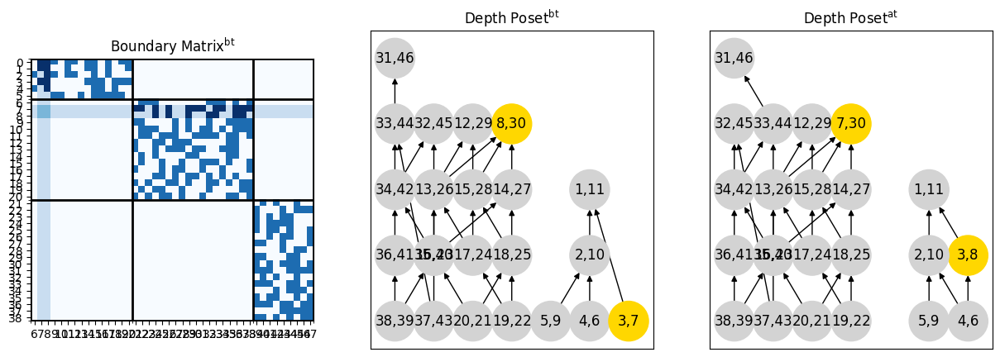

### Birth Death Pairs
|                          |                                                                                                                                                                                                                                   |
|:-------------------------|:----------------------------------------------------------------------------------------------------------------------------------------------------------------------------------------------------------------------------------|
| Before the transposition | $\{(3, 7), (4, 6), (17, 24), (8, 30), (13, 26), (33, 44), (32, 45), (18, 25), (5, 9), (14, 27), (34, 42), (1, 11), (31, 46), (2, 10), (15, 28), (35, 40), (20, 21), (38, 39), (12, 29), (19, 22), (37, 43), (36, 41), (16, 23)\}$ |
| After the transposition  | $\{(4, 6), (17, 24), (13, 26), (33, 44), (32, 45), (18, 25), (5, 9), (14, 27), (34, 42), (1, 11), (31, 46), (2, 10), (15, 28), (7, 30), (35, 40), (20, 21), (3, 8), (38, 39), (12, 29), (19, 22), (37, 43), (36, 41), (16, 23)\}$ |

### Relations
|                          | Algorithm 1                                                                                                                                                                                                                                                                                                                                                                                                                           | Algorithm 2                                                                                                                                                                                                                                                                                                                                                                     |
|:-------------------------|:--------------------------------------------------------------------------------------------------------------------------------------------------------------------------------------------------------------------------------------------------------------------------------------------------------------------------------------------------------------------------------------------------------------------------------------|:--------------------------------------------------------------------------------------------------------------------------------------------------------------------------------------------------------------------------------------------------------------------------------------------------------------------------------------------------------------------------------|
| Before the transposition | $\{(24, 30), (25, 29), (42, 45), (26, 30), (43, 46), (41, 46), (21, 28), (21, 25), (39, 42), (40, 47), (28, 30), (25, 28), (41, 42), (41, 45), (42, 44), (44, 47), (43, 45), (26, 29), (22, 25), (22, 28), (39, 44), (23, 27), (9, 10), (39, 47), (10, 11), (27, 30), (24, 28), (41, 44), (25, 27), (41, 47), (43, 44), (42, 46), (21, 23), (43, 47), (21, 26), (23, 26), (40, 42), (39, 40), (39, 46), (22, 24), (45, 47)\}$         | $\{(3, 1), (38, 35), (17, 12), (17, 15), (37, 33), (19, 15), (36, 31), (13, 8), (15, 8), (16, 13), (35, 32), (20, 13), (4, 2), (3, 0), (20, 16), (38, 31), (5, 0), (17, 8), (19, 14), (36, 33), (37, 32), (16, 12), (18, 12), (33, 31), (18, 15), (20, 12), (20, 18), (38, 33), (5, 2), (14, 8), (38, 36), (17, 13), (2, 0), (36, 32), (37, 31), (15, 12), (18, 8), (18, 14)\}$ |
| After the transposition  | $\{(24, 30), (25, 29), (42, 45), (26, 30), (43, 46), (41, 46), (21, 28), (21, 25), (39, 42), (40, 47), (28, 30), (25, 28), (6, 8), (41, 42), (41, 45), (42, 44), (44, 47), (43, 45), (26, 29), (22, 25), (22, 28), (39, 44), (23, 27), (9, 10), (39, 47), (10, 11), (27, 30), (24, 28), (41, 44), (25, 27), (41, 47), (43, 44), (42, 46), (21, 23), (43, 47), (21, 26), (23, 26), (40, 42), (39, 40), (39, 46), (22, 24), (45, 47)\}$ | $\{(3, 1), (38, 35), (17, 12), (17, 15), (19, 15), (37, 33), (36, 31), (16, 7), (16, 13), (20, 7), (35, 32), (20, 13), (4, 2), (3, 0), (20, 16), (38, 31), (5, 0), (19, 14), (13, 7), (36, 33), (37, 32), (16, 12), (18, 12), (33, 31), (18, 15), (20, 12), (20, 18), (38, 33), (5, 2), (38, 36), (19, 7), (17, 13), (2, 0), (36, 32), (37, 31), (15, 12), (18, 14)\}$          |

### Successors and Predecessers
|                 | $\text{Set}^\text{bt}(3, 7)$                  | $\text{Set}^\text{bt}(8, 30)$                                                           | $\text{Set}^\text{at}(3, 8)$                  | $\text{Set}^\text{at}(7, 30)$                                                 |
|:----------------|:----------------------------------------------|:----------------------------------------------------------------------------------------|:----------------------------------------------|:------------------------------------------------------------------------------|
| $\text{Succ}_1$ | $\text{Succ}_1^\text{bt}(3, 7) = \emptyset$   | $\text{Succ}_1^\text{bt}(8, 30) = \emptyset$                                            | $\text{Succ}_1^\text{at}(3, 8) = \emptyset$   | $\text{Succ}_1^\text{at}(7, 30) = \emptyset$                                  |
| $\text{Pred}_1$ | $\text{Pred}_1^\text{bt}(3, 7) = \emptyset$   | $\text{Pred}_1^\text{bt}(8, 30) = \{(15, 28), (17, 24), (13, 26), (14, 27)\}$           | $\text{Pred}_1^\text{at}(3, 8) = \{(4, 6)\}$  | $\text{Pred}_1^\text{at}(7, 30) = \{(15, 28), (17, 24), (13, 26), (14, 27)\}$ |
| $\text{Succ}_2$ | $\text{Succ}_2^\text{bt}(3, 7) = \{(1, 11)\}$ | $\text{Succ}_2^\text{bt}(8, 30) = \emptyset$                                            | $\text{Succ}_2^\text{at}(3, 8) = \{(1, 11)\}$ | $\text{Succ}_2^\text{at}(7, 30) = \emptyset$                                  |
| $\text{Pred}_2$ | $\text{Pred}_2^\text{bt}(3, 7) = \emptyset$   | $\text{Pred}_2^\text{bt}(8, 30) = \{(14, 27), (13, 26), (18, 25), (15, 28), (17, 24)\}$ | $\text{Pred}_2^\text{at}(3, 8) = \emptyset$   | $\text{Pred}_2^\text{at}(7, 30) = \{(13, 26), (19, 22), (20, 21), (16, 23)\}$ |

### Temp Sets
|                                                              | Before the Transposition                                                                       | After the Transposition                                                                        |
|:-------------------------------------------------------------|:-----------------------------------------------------------------------------------------------|:-----------------------------------------------------------------------------------------------|
| $A_1 = \{(s, t)\in \text{BD}:\; f(a) < f(s) < f(t) < f(x)\}$ | $\{(4, 6)\}$                                                                                   | $\{(4, 6)\}$                                                                                   |
| $B_1 = \{(s, t)\in \text{BD}:\; U_1[t, x] = 1\}$             | $\emptyset$                                                                                    | $\{(4, 6)\}$                                                                                   |
| $A_2 = \{(s, t)\in \text{BD}:\; f(b) < f(s) < f(t) < f(y)\}$ | $\{(14, 27), (13, 26), (12, 29), (16, 23), (19, 22), (18, 25), (15, 28), (17, 24), (20, 21)\}$ | $\{(14, 27), (13, 26), (12, 29), (16, 23), (19, 22), (18, 25), (15, 28), (17, 24), (20, 21)\}$ |
| $B_2 = \{(s, t)\in \text{BD}:\; U_2[b, s] = 1\}$             | $\emptyset$                                                                                    | $\{(13, 26), (19, 22), (20, 21), (16, 23)\}$                                                   |

### Equations
There are 4 equations are wrong.

| eq    | left (formula)                  | left (paramatrized)              | left (value)                                 | right (formula)                                      | right (paramatrized)                                 | right (value)                                | correct   |
|:------|:--------------------------------|:---------------------------------|:---------------------------------------------|:-----------------------------------------------------|:-----------------------------------------------------|:---------------------------------------------|:----------|
| Eq48  | $\text{Succ}_1^\text{at}(a, x)$ | $\text{Succ}_1^\text{at}(3, 8)$  | $\emptyset$                                  | $\text{Succ}_1^\text{bt}(a, b)$                      | $\text{Succ}_1^\text{bt}(3, 7)$                      | $\emptyset$                                  | ✔         |
| Eq49  | $\text{Succ}_1^\text{at}(b, y)$ | $\text{Succ}_1^\text{at}(7, 30)$ | $\emptyset$                                  | $\text{Succ}_1^\text{bt}(x, y)$                      | $\text{Succ}_1^\text{bt}(8, 30)$                     | $\emptyset$                                  | ✔         |
| Eq50  | $\text{Pred}_1^\text{at}(a, x)$ | $\text{Pred}_1^\text{at}(3, 8)$  | $\{(4, 6)\}$                                 | $\{(s, t)\in \text{BD}:\; U_1^\text{bt}[t, x] = 1\}$ | $\{(s, t)\in \text{BD}:\; U_1^\text{bt}[t, 8] = 1\}$ | $\emptyset$                                  | ✘         |
| Eq50a | $\text{Pred}_1^\text{at}(a, x)$ | $\text{Pred}_1^\text{at}(3, 8)$  | $\{(4, 6)\}$                                 | $A_1^\text{bt} \cap B_1^\text{bt}$                   | $A_1^\text{bt} \cap B_1^\text{bt}$                   | $\emptyset$                                  | ✘         |
| Eq50b | $\text{Pred}_1^\text{at}(a, x)$ | $\text{Pred}_1^\text{at}(3, 8)$  | $\{(4, 6)\}$                                 | $A_1^\text{bt} \cap B_1^\text{at}$                   | $A_1^\text{bt} \cap B_1^\text{at}$                   | $\{(4, 6)\}$                                 | ✔         |
| Eq51  | $\text{Pred}_1^\text{at}(b, y)$ | $\text{Pred}_1^\text{at}(7, 30)$ | $\{(15, 28), (17, 24), (13, 26), (14, 27)\}$ | $\text{Pred}_1^\text{bt}(x, y)$                      | $\text{Pred}_1^\text{bt}(8, 30)$                     | $\{(15, 28), (17, 24), (13, 26), (14, 27)\}$ | ✔         |
| Eq52  | $\text{Succ}_2^\text{at}(a, x)$ | $\text{Succ}_2^\text{at}(3, 8)$  | $\{(1, 11)\}$                                | $\text{Succ}_2^\text{bt}(a, b)$                      | $\text{Succ}_2^\text{bt}(3, 7)$                      | $\{(1, 11)\}$                                | ✔         |
| Eq53  | $\text{Succ}_2^\text{at}(b, y)$ | $\text{Succ}_2^\text{at}(7, 30)$ | $\emptyset$                                  | $\text{Succ}_2^\text{bt}(x, y)$                      | $\text{Succ}_2^\text{bt}(8, 30)$                     | $\emptyset$                                  | ✔         |
| Eq54  | $\text{Pred}_2^\text{at}(a, x)$ | $\text{Pred}_2^\text{at}(3, 8)$  | $\emptyset$                                  | $\text{Pred}_2^\text{bt}(a, b)$                      | $\text{Pred}_2^\text{bt}(3, 7)$                      | $\emptyset$                                  | ✔         |
| Eq55  | $\text{Pred}_2^\text{at}(b, y)$ | $\text{Pred}_2^\text{at}(7, 30)$ | $\{(13, 26), (19, 22), (20, 21), (16, 23)\}$ | $\{(s, t)\in \text{BD}:\; U_2^\text{bt}[b, s] = 1\}$ | $\{(s, t)\in \text{BD}:\; U_2^\text{bt}[7, s] = 1\}$ | $\emptyset$                                  | ✘         |
| Eq55a | $\text{Pred}_2^\text{at}(b, y)$ | $\text{Pred}_2^\text{at}(7, 30)$ | $\{(13, 26), (19, 22), (20, 21), (16, 23)\}$ | $A_2^\text{bt} \cap B_2^\text{bt}$                   | $A_2^\text{bt} \cap B_2^\text{bt}$                   | $\emptyset$                                  | ✘         |
| Eq55b | $\text{Pred}_2^\text{at}(b, y)$ | $\text{Pred}_2^\text{at}(7, 30)$ | $\{(13, 26), (19, 22), (20, 21), (16, 23)\}$ | $A_2^\text{bt} \cap B_2^\text{at}$                   | $A_2^\text{bt} \cap B_2^\text{at}$                   | $\{(13, 26), (16, 23), (19, 22), (20, 21)\}$ | ✔         |

## Transposition <13, 14> in complex 1
Here is a __birth-birth__ __no switch__ transposition <13, 14>.

$$
a = 13, \; b = 26, \; x = 14, \; y = 27
$$

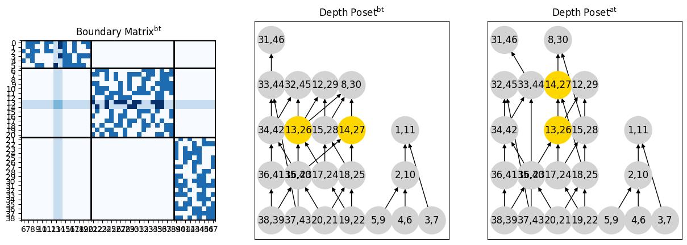

### Birth Death Pairs
|                          |                                                                                                                                                                                                                                   |
|:-------------------------|:----------------------------------------------------------------------------------------------------------------------------------------------------------------------------------------------------------------------------------|
| Before the transposition | $\{(3, 7), (4, 6), (17, 24), (8, 30), (13, 26), (33, 44), (32, 45), (18, 25), (5, 9), (14, 27), (34, 42), (1, 11), (31, 46), (2, 10), (15, 28), (35, 40), (20, 21), (38, 39), (12, 29), (19, 22), (37, 43), (36, 41), (16, 23)\}$ |
| After the transposition  | $\{(3, 7), (4, 6), (17, 24), (8, 30), (13, 26), (33, 44), (32, 45), (18, 25), (5, 9), (14, 27), (34, 42), (1, 11), (31, 46), (2, 10), (15, 28), (35, 40), (20, 21), (38, 39), (12, 29), (19, 22), (37, 43), (36, 41), (16, 23)\}$ |

### Relations
|                          | Algorithm 1                                                                                                                                                                                                                                                                                                                                                                                                                   | Algorithm 2                                                                                                                                                                                                                                                                                                                                                                     |
|:-------------------------|:------------------------------------------------------------------------------------------------------------------------------------------------------------------------------------------------------------------------------------------------------------------------------------------------------------------------------------------------------------------------------------------------------------------------------|:--------------------------------------------------------------------------------------------------------------------------------------------------------------------------------------------------------------------------------------------------------------------------------------------------------------------------------------------------------------------------------|
| Before the transposition | $\{(24, 30), (25, 29), (42, 45), (26, 30), (43, 46), (41, 46), (21, 28), (21, 25), (39, 42), (40, 47), (28, 30), (25, 28), (41, 42), (41, 45), (42, 44), (44, 47), (43, 45), (26, 29), (22, 25), (22, 28), (39, 44), (23, 27), (9, 10), (39, 47), (10, 11), (27, 30), (24, 28), (41, 44), (25, 27), (41, 47), (43, 44), (42, 46), (21, 23), (43, 47), (21, 26), (23, 26), (40, 42), (39, 40), (39, 46), (22, 24), (45, 47)\}$ | $\{(3, 1), (38, 35), (17, 12), (17, 15), (37, 33), (19, 15), (36, 31), (13, 8), (15, 8), (16, 13), (35, 32), (20, 13), (4, 2), (3, 0), (20, 16), (38, 31), (5, 0), (17, 8), (19, 14), (36, 33), (37, 32), (16, 12), (18, 12), (33, 31), (18, 15), (20, 12), (20, 18), (38, 33), (5, 2), (14, 8), (38, 36), (17, 13), (2, 0), (36, 32), (37, 31), (15, 12), (18, 8), (18, 14)\}$ |
| After the transposition  | $\{(24, 30), (25, 29), (42, 45), (43, 46), (41, 46), (26, 27), (21, 28), (21, 25), (39, 42), (40, 47), (28, 30), (25, 28), (41, 42), (41, 45), (42, 44), (44, 47), (43, 45), (26, 29), (22, 25), (22, 28), (39, 44), (23, 27), (9, 10), (39, 47), (10, 11), (27, 30), (24, 28), (41, 44), (25, 27), (41, 47), (43, 44), (42, 46), (21, 23), (43, 47), (21, 26), (23, 26), (40, 42), (39, 40), (39, 46), (22, 24), (45, 47)\}$ | $\{(3, 1), (38, 35), (17, 12), (17, 15), (19, 15), (37, 33), (36, 31), (13, 8), (15, 8), (16, 13), (35, 32), (20, 13), (4, 2), (3, 0), (20, 16), (38, 31), (5, 0), (17, 8), (19, 14), (36, 33), (37, 32), (16, 12), (18, 12), (33, 31), (18, 15), (20, 12), (20, 18), (38, 33), (5, 2), (14, 8), (38, 36), (17, 13), (2, 0), (36, 32), (37, 31), (15, 12), (18, 8), (18, 14)\}$ |

### Successors and Predecessers
No such node in the Depth Poset

### Temp Sets
|                                                               | Before the Transposition                                                                                   | After the Transposition                                                                                    |
|:--------------------------------------------------------------|:-----------------------------------------------------------------------------------------------------------|:-----------------------------------------------------------------------------------------------------------|
| $\mathcal{L} = \{(s, t)\in \text{BD}:\; f(t) < f(y)\}$        | $\{(1, 11), (3, 7), (13, 26), (4, 6), (2, 10), (16, 23), (19, 22), (18, 25), (5, 9), (17, 24), (20, 21)\}$ | $\{(1, 11), (3, 7), (13, 26), (4, 6), (2, 10), (16, 23), (19, 22), (18, 25), (5, 9), (17, 24), (20, 21)\}$ |
| $\mathcal{M} = \{(s, t)\in \text{BD}:\; f(y) < f(t) < f(b)\}$ | $\emptyset$                                                                                                | $\emptyset$                                                                                                |

### Equations
There are 2 equations are wrong.

| eq   | left (formula)                  | left (paramatrized)               | left (value)             | right (formula)                                                                        | right (paramatrized)                                                                         | right (value)                      | correct   |
|:-----|:--------------------------------|:----------------------------------|:-------------------------|:---------------------------------------------------------------------------------------|:---------------------------------------------------------------------------------------------|:-----------------------------------|:----------|
| Eq16 | $\text{Succ}_1^\text{at}(x, y)$ | $\text{Succ}_1^\text{at}(14, 27)$ | $\{(8, 30)\}$            | $\text{Succ}_1^\text{bt}(x, y) \oplus \{(a, b)\} \oplus \text{Succ}_1^\text{bt}(a, b)$ | $\text{Succ}_1^\text{bt}(14, 27) \oplus \{(13, 26)\} \oplus \text{Succ}_1^\text{bt}(13, 26)$ | $\{(13, 26), (12, 29)\}$           | ✘         |
| Eq17 | $\text{Pred}_1^\text{at}(a, b)$ | $\text{Pred}_1^\text{at}(13, 26)$ | $\{(20, 21), (16, 23)\}$ | $\text{Pred}_1^\text{bt}(a, b) \oplus \{(x, y)\}$                                      | $\text{Pred}_1^\text{bt}(13, 26) \oplus \{(14, 27)\}$                                        | $\{(16, 23), (14, 27), (20, 21)\}$ | ✘         |

## Transposition <17, 18> in complex 1
Here is a __birth-birth__ __no switch__ transposition <17, 18>.

$$
a = 17, \; b = 24, \; x = 18, \; y = 25
$$

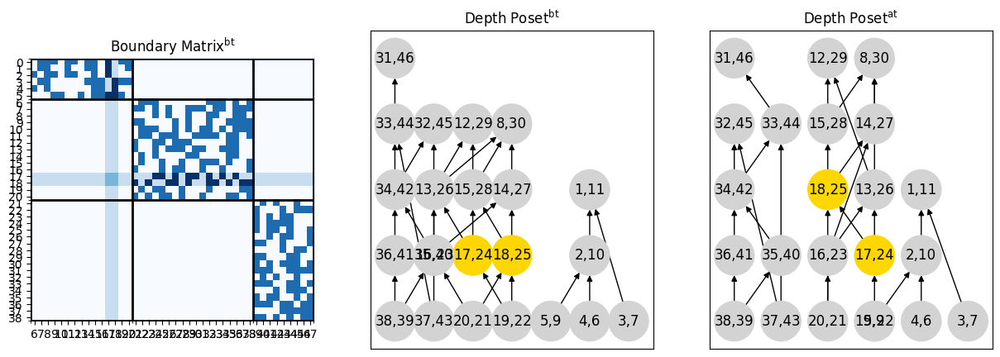

### Birth Death Pairs
|                          |                                                                                                                                                                                                                                   |
|:-------------------------|:----------------------------------------------------------------------------------------------------------------------------------------------------------------------------------------------------------------------------------|
| Before the transposition | $\{(3, 7), (4, 6), (17, 24), (8, 30), (13, 26), (33, 44), (32, 45), (18, 25), (5, 9), (14, 27), (34, 42), (1, 11), (31, 46), (2, 10), (15, 28), (35, 40), (20, 21), (38, 39), (12, 29), (19, 22), (37, 43), (36, 41), (16, 23)\}$ |
| After the transposition  | $\{(3, 7), (4, 6), (17, 24), (8, 30), (13, 26), (33, 44), (32, 45), (18, 25), (5, 9), (14, 27), (34, 42), (1, 11), (31, 46), (2, 10), (15, 28), (35, 40), (20, 21), (38, 39), (12, 29), (19, 22), (37, 43), (36, 41), (16, 23)\}$ |

### Relations
|                          | Algorithm 1                                                                                                                                                                                                                                                                                                                                                                                                                                       | Algorithm 2                                                                                                                                                                                                                                                                                                                                                                     |
|:-------------------------|:--------------------------------------------------------------------------------------------------------------------------------------------------------------------------------------------------------------------------------------------------------------------------------------------------------------------------------------------------------------------------------------------------------------------------------------------------|:--------------------------------------------------------------------------------------------------------------------------------------------------------------------------------------------------------------------------------------------------------------------------------------------------------------------------------------------------------------------------------|
| Before the transposition | $\{(24, 30), (25, 29), (42, 45), (26, 30), (43, 46), (41, 46), (21, 28), (21, 25), (39, 42), (40, 47), (28, 30), (25, 28), (41, 42), (41, 45), (42, 44), (44, 47), (43, 45), (26, 29), (22, 25), (22, 28), (39, 44), (23, 27), (9, 10), (39, 47), (10, 11), (27, 30), (24, 28), (41, 44), (25, 27), (41, 47), (43, 44), (42, 46), (21, 23), (43, 47), (21, 26), (23, 26), (40, 42), (39, 40), (39, 46), (22, 24), (45, 47)\}$                     | $\{(3, 1), (38, 35), (17, 12), (17, 15), (37, 33), (19, 15), (36, 31), (13, 8), (15, 8), (16, 13), (35, 32), (20, 13), (4, 2), (3, 0), (20, 16), (38, 31), (5, 0), (17, 8), (19, 14), (36, 33), (37, 32), (16, 12), (18, 12), (33, 31), (18, 15), (20, 12), (20, 18), (38, 33), (5, 2), (14, 8), (38, 36), (17, 13), (2, 0), (36, 32), (37, 31), (15, 12), (18, 8), (18, 14)\}$ |
| After the transposition  | $\{(24, 30), (25, 29), (42, 45), (24, 27), (26, 30), (43, 46), (41, 46), (21, 28), (21, 25), (39, 42), (40, 47), (28, 30), (25, 28), (41, 42), (24, 29), (41, 45), (42, 44), (44, 47), (43, 45), (26, 29), (22, 25), (22, 28), (39, 44), (23, 27), (9, 10), (39, 47), (10, 11), (27, 30), (24, 25), (41, 44), (25, 27), (41, 47), (43, 44), (42, 46), (21, 23), (43, 47), (21, 26), (23, 26), (40, 42), (39, 40), (39, 46), (22, 24), (45, 47)\}$ | $\{(3, 1), (38, 35), (17, 12), (17, 15), (19, 15), (37, 33), (36, 31), (13, 8), (15, 8), (16, 13), (35, 32), (20, 13), (4, 2), (3, 0), (20, 16), (38, 31), (5, 0), (17, 8), (19, 14), (36, 33), (37, 32), (16, 12), (18, 12), (33, 31), (18, 15), (20, 12), (20, 18), (38, 33), (5, 2), (14, 8), (38, 36), (17, 13), (2, 0), (36, 32), (37, 31), (15, 12), (18, 8), (18, 14)\}$ |

### Successors and Predecessers
No such node in the Depth Poset

### Temp Sets
|                                                               | Before the Transposition                                                               | After the Transposition                                                                |
|:--------------------------------------------------------------|:---------------------------------------------------------------------------------------|:---------------------------------------------------------------------------------------|
| $\mathcal{L} = \{(s, t)\in \text{BD}:\; f(t) < f(y)\}$        | $\{(1, 11), (3, 7), (2, 10), (4, 6), (16, 23), (19, 22), (5, 9), (17, 24), (20, 21)\}$ | $\{(1, 11), (3, 7), (2, 10), (4, 6), (16, 23), (19, 22), (5, 9), (17, 24), (20, 21)\}$ |
| $\mathcal{M} = \{(s, t)\in \text{BD}:\; f(y) < f(t) < f(b)\}$ | $\emptyset$                                                                            | $\emptyset$                                                                            |

### Equations
There are 2 equations are wrong.

| eq   | left (formula)                  | left (paramatrized)               | left (value)                       | right (formula)                                                                        | right (paramatrized)                                                                         | right (value)                               | correct   |
|:-----|:--------------------------------|:----------------------------------|:-----------------------------------|:---------------------------------------------------------------------------------------|:---------------------------------------------------------------------------------------------|:--------------------------------------------|:----------|
| Eq16 | $\text{Succ}_1^\text{at}(x, y)$ | $\text{Succ}_1^\text{at}(18, 25)$ | $\{(15, 28), (12, 29), (14, 27)\}$ | $\text{Succ}_1^\text{bt}(x, y) \oplus \{(a, b)\} \oplus \text{Succ}_1^\text{bt}(a, b)$ | $\text{Succ}_1^\text{bt}(18, 25) \oplus \{(17, 24)\} \oplus \text{Succ}_1^\text{bt}(17, 24)$ | $\{(8, 30), (12, 29), (17, 24), (14, 27)\}$ | ✘         |
| Eq17 | $\text{Pred}_1^\text{at}(a, b)$ | $\text{Pred}_1^\text{at}(17, 24)$ | $\{(19, 22)\}$                     | $\text{Pred}_1^\text{bt}(a, b) \oplus \{(x, y)\}$                                      | $\text{Pred}_1^\text{bt}(17, 24) \oplus \{(18, 25)\}$                                        | $\{(19, 22), (18, 25)\}$                    | ✘         |

## Transposition <24, 25> in complex 1
Here is a __death-death__ __no switch__ transposition <24, 25>.

$$
a = 18, \; b = 25, \; x = 17, \; y = 24
$$

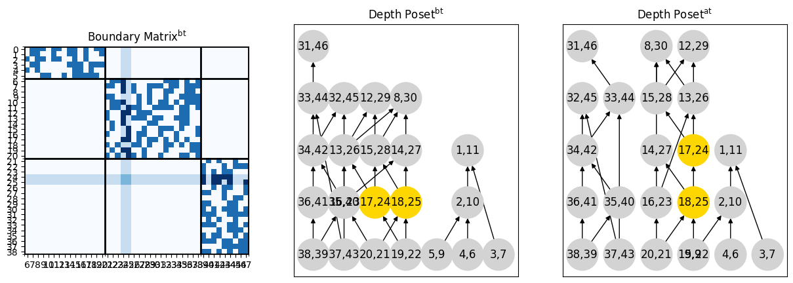

### Birth Death Pairs
|                          |                                                                                                                                                                                                                                   |
|:-------------------------|:----------------------------------------------------------------------------------------------------------------------------------------------------------------------------------------------------------------------------------|
| Before the transposition | $\{(3, 7), (4, 6), (17, 24), (8, 30), (13, 26), (33, 44), (32, 45), (18, 25), (5, 9), (14, 27), (34, 42), (1, 11), (31, 46), (2, 10), (15, 28), (35, 40), (20, 21), (38, 39), (12, 29), (19, 22), (37, 43), (36, 41), (16, 23)\}$ |
| After the transposition  | $\{(3, 7), (4, 6), (17, 24), (8, 30), (13, 26), (33, 44), (32, 45), (18, 25), (5, 9), (14, 27), (34, 42), (1, 11), (31, 46), (2, 10), (15, 28), (35, 40), (20, 21), (38, 39), (12, 29), (19, 22), (37, 43), (36, 41), (16, 23)\}$ |

### Relations
|                          | Algorithm 1                                                                                                                                                                                                                                                                                                                                                                                                                   | Algorithm 2                                                                                                                                                                                                                                                                                                                                                                     |
|:-------------------------|:------------------------------------------------------------------------------------------------------------------------------------------------------------------------------------------------------------------------------------------------------------------------------------------------------------------------------------------------------------------------------------------------------------------------------|:--------------------------------------------------------------------------------------------------------------------------------------------------------------------------------------------------------------------------------------------------------------------------------------------------------------------------------------------------------------------------------|
| Before the transposition | $\{(24, 30), (25, 29), (42, 45), (26, 30), (43, 46), (41, 46), (21, 28), (21, 25), (39, 42), (40, 47), (28, 30), (25, 28), (41, 42), (41, 45), (42, 44), (44, 47), (43, 45), (26, 29), (22, 25), (22, 28), (39, 44), (23, 27), (9, 10), (39, 47), (10, 11), (27, 30), (24, 28), (41, 44), (25, 27), (41, 47), (43, 44), (42, 46), (21, 23), (43, 47), (21, 26), (23, 26), (40, 42), (39, 40), (39, 46), (22, 24), (45, 47)\}$ | $\{(3, 1), (38, 35), (17, 12), (17, 15), (37, 33), (19, 15), (36, 31), (13, 8), (15, 8), (16, 13), (35, 32), (20, 13), (4, 2), (3, 0), (20, 16), (38, 31), (5, 0), (17, 8), (19, 14), (36, 33), (37, 32), (16, 12), (18, 12), (33, 31), (18, 15), (20, 12), (20, 18), (38, 33), (5, 2), (14, 8), (38, 36), (17, 13), (2, 0), (36, 32), (37, 31), (15, 12), (18, 8), (18, 14)\}$ |
| After the transposition  | $\{(24, 30), (25, 29), (42, 45), (26, 30), (43, 46), (41, 46), (21, 28), (21, 25), (39, 42), (40, 47), (28, 30), (25, 28), (41, 42), (41, 45), (42, 44), (44, 47), (43, 45), (26, 29), (22, 25), (22, 28), (39, 44), (23, 27), (9, 10), (39, 47), (10, 11), (27, 30), (24, 28), (41, 44), (25, 27), (41, 47), (43, 44), (42, 46), (21, 23), (43, 47), (21, 26), (23, 26), (22, 24), (40, 42), (39, 40), (39, 46), (45, 47)\}$ | $\{(18, 17), (3, 1), (38, 35), (17, 12), (17, 15), (19, 15), (37, 33), (36, 31), (13, 8), (15, 8), (16, 13), (35, 32), (20, 13), (18, 13), (4, 2), (3, 0), (20, 16), (38, 31), (5, 0), (17, 8), (19, 14), (36, 33), (37, 32), (16, 12), (33, 31), (20, 12), (20, 18), (38, 33), (5, 2), (14, 8), (38, 36), (17, 13), (2, 0), (36, 32), (37, 31), (15, 12), (18, 14)\}$          |

### Successors and Predecessers
No such node in the Depth Poset

### Temp Sets
|                                                               | Before the Transposition                                                                                           | After the Transposition                                                                                            |
|:--------------------------------------------------------------|:-------------------------------------------------------------------------------------------------------------------|:-------------------------------------------------------------------------------------------------------------------|
| $\mathcal{B} = \{(s, t)\in \text{BD}:\; f(s) > f(x)\}$        | $\{(38, 39), (34, 42), (31, 46), (33, 44), (32, 45), (19, 22), (18, 25), (37, 43), (36, 41), (35, 40), (20, 21)\}$ | $\{(38, 39), (34, 42), (31, 46), (33, 44), (32, 45), (19, 22), (18, 25), (37, 43), (36, 41), (35, 40), (20, 21)\}$ |
| $\mathcal{N} = \{(s, t)\in \text{BD}:\; f(x) > f(s) > f(a)\}$ | $\emptyset$                                                                                                        | $\emptyset$                                                                                                        |

### Equations
There are 2 equations are wrong.

| eq   | left (formula)                  | left (paramatrized)               | left (value)                                | right (formula)                                                                        | right (paramatrized)                                                                         | right (value)                      | correct   |
|:-----|:--------------------------------|:----------------------------------|:--------------------------------------------|:---------------------------------------------------------------------------------------|:---------------------------------------------------------------------------------------------|:-----------------------------------|:----------|
| Eq36 | $\text{Succ}_2^\text{at}(x, y)$ | $\text{Succ}_2^\text{at}(17, 24)$ | $\{(8, 30), (15, 28), (12, 29), (13, 26)\}$ | $\text{Succ}_2^\text{bt}(x, y) \oplus \{(a, b)\} \oplus \text{Succ}_2^\text{bt}(a, b)$ | $\text{Succ}_2^\text{bt}(17, 24) \oplus \{(18, 25)\} \oplus \text{Succ}_2^\text{bt}(18, 25)$ | $\{(13, 26), (14, 27), (18, 25)\}$ | ✘         |
| Eq37 | $\text{Pred}_2^\text{at}(a, b)$ | $\text{Pred}_2^\text{at}(18, 25)$ | $\{(20, 21)\}$                              | $\text{Pred}_2^\text{bt}(a, b) \oplus \{(x, y)\}$                                      | $\text{Pred}_2^\text{bt}(18, 25) \oplus \{(17, 24)\}$                                        | $\{(17, 24), (20, 21)\}$           | ✘         |

## Transposition <26, 27> in complex 1
Here is a __death-death__ __no switch__ transposition <26, 27>.

$$
a = 14, \; b = 27, \; x = 13, \; y = 26
$$

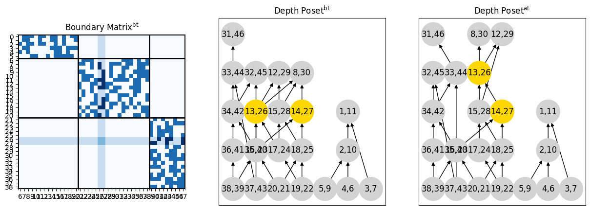

### Birth Death Pairs
|                          |                                                                                                                                                                                                                                   |
|:-------------------------|:----------------------------------------------------------------------------------------------------------------------------------------------------------------------------------------------------------------------------------|
| Before the transposition | $\{(3, 7), (4, 6), (17, 24), (8, 30), (13, 26), (33, 44), (32, 45), (18, 25), (5, 9), (14, 27), (34, 42), (1, 11), (31, 46), (2, 10), (15, 28), (35, 40), (20, 21), (38, 39), (12, 29), (19, 22), (37, 43), (36, 41), (16, 23)\}$ |
| After the transposition  | $\{(3, 7), (4, 6), (17, 24), (8, 30), (13, 26), (33, 44), (32, 45), (18, 25), (5, 9), (14, 27), (34, 42), (1, 11), (31, 46), (2, 10), (15, 28), (35, 40), (20, 21), (38, 39), (12, 29), (19, 22), (37, 43), (36, 41), (16, 23)\}$ |

### Relations
|                          | Algorithm 1                                                                                                                                                                                                                                                                                                                                                                                                                   | Algorithm 2                                                                                                                                                                                                                                                                                                                                                                      |
|:-------------------------|:------------------------------------------------------------------------------------------------------------------------------------------------------------------------------------------------------------------------------------------------------------------------------------------------------------------------------------------------------------------------------------------------------------------------------|:---------------------------------------------------------------------------------------------------------------------------------------------------------------------------------------------------------------------------------------------------------------------------------------------------------------------------------------------------------------------------------|
| Before the transposition | $\{(24, 30), (25, 29), (42, 45), (26, 30), (43, 46), (41, 46), (21, 28), (21, 25), (39, 42), (40, 47), (28, 30), (25, 28), (41, 42), (41, 45), (42, 44), (44, 47), (43, 45), (26, 29), (22, 25), (22, 28), (39, 44), (23, 27), (9, 10), (39, 47), (10, 11), (27, 30), (24, 28), (41, 44), (25, 27), (41, 47), (43, 44), (42, 46), (21, 23), (43, 47), (21, 26), (23, 26), (40, 42), (39, 40), (39, 46), (22, 24), (45, 47)\}$ | $\{(3, 1), (38, 35), (17, 12), (17, 15), (37, 33), (19, 15), (36, 31), (13, 8), (15, 8), (16, 13), (35, 32), (20, 13), (4, 2), (3, 0), (20, 16), (38, 31), (5, 0), (17, 8), (19, 14), (36, 33), (37, 32), (16, 12), (18, 12), (33, 31), (18, 15), (20, 12), (20, 18), (38, 33), (5, 2), (14, 8), (38, 36), (17, 13), (2, 0), (36, 32), (37, 31), (15, 12), (18, 8), (18, 14)\}$  |
| After the transposition  | $\{(24, 30), (25, 29), (42, 45), (26, 30), (43, 46), (41, 46), (21, 28), (21, 25), (39, 42), (40, 47), (28, 30), (25, 28), (41, 42), (41, 45), (42, 44), (44, 47), (43, 45), (26, 29), (22, 25), (22, 28), (39, 44), (9, 10), (23, 27), (39, 47), (10, 11), (27, 30), (24, 28), (41, 44), (25, 27), (41, 47), (43, 44), (42, 46), (21, 23), (43, 47), (21, 26), (23, 26), (40, 42), (39, 40), (39, 46), (22, 24), (45, 47)\}$ | $\{(3, 1), (38, 35), (14, 13), (17, 12), (17, 15), (19, 15), (37, 33), (36, 31), (13, 8), (15, 8), (16, 13), (35, 32), (20, 13), (4, 2), (3, 0), (20, 16), (38, 31), (5, 0), (17, 8), (19, 14), (36, 33), (37, 32), (16, 12), (18, 12), (33, 31), (18, 15), (20, 12), (20, 18), (38, 33), (5, 2), (38, 36), (17, 13), (2, 0), (36, 32), (37, 31), (15, 12), (18, 8), (18, 14)\}$ |

### Successors and Predecessers
No such node in the Depth Poset

### Temp Sets
|                                                               | Before the Transposition                                                                                                                                   | After the Transposition                                                                                                                                    |
|:--------------------------------------------------------------|:-----------------------------------------------------------------------------------------------------------------------------------------------------------|:-----------------------------------------------------------------------------------------------------------------------------------------------------------|
| $\mathcal{B} = \{(s, t)\in \text{BD}:\; f(s) > f(x)\}$        | $\{(14, 27), (38, 39), (34, 42), (36, 41), (31, 46), (33, 44), (20, 21), (32, 45), (19, 22), (18, 25), (37, 43), (15, 28), (17, 24), (35, 40), (16, 23)\}$ | $\{(14, 27), (38, 39), (34, 42), (36, 41), (31, 46), (33, 44), (20, 21), (32, 45), (19, 22), (18, 25), (37, 43), (15, 28), (17, 24), (35, 40), (16, 23)\}$ |
| $\mathcal{N} = \{(s, t)\in \text{BD}:\; f(x) > f(s) > f(a)\}$ | $\emptyset$                                                                                                                                                | $\emptyset$                                                                                                                                                |

### Equations
There are 2 equations are wrong.

| eq   | left (formula)                  | left (paramatrized)               | left (value)             | right (formula)                                                                        | right (paramatrized)                                                                         | right (value)                      | correct   |
|:-----|:--------------------------------|:----------------------------------|:-------------------------|:---------------------------------------------------------------------------------------|:---------------------------------------------------------------------------------------------|:-----------------------------------|:----------|
| Eq36 | $\text{Succ}_2^\text{at}(x, y)$ | $\text{Succ}_2^\text{at}(13, 26)$ | $\{(8, 30)\}$            | $\text{Succ}_2^\text{bt}(x, y) \oplus \{(a, b)\} \oplus \text{Succ}_2^\text{bt}(a, b)$ | $\text{Succ}_2^\text{bt}(13, 26) \oplus \{(14, 27)\} \oplus \text{Succ}_2^\text{bt}(14, 27)$ | $\{(14, 27)\}$                     | ✘         |
| Eq37 | $\text{Pred}_2^\text{at}(a, b)$ | $\text{Pred}_2^\text{at}(14, 27)$ | $\{(19, 22), (18, 25)\}$ | $\text{Pred}_2^\text{bt}(a, b) \oplus \{(x, y)\}$                                      | $\text{Pred}_2^\text{bt}(14, 27) \oplus \{(13, 26)\}$                                        | $\{(13, 26), (19, 22), (18, 25)\}$ | ✘         |

## Transposition <35, 36> in complex 1
Here is a __birth-birth__ __no switch__ transposition <35, 36>.

$$
a = 35, \; b = 40, \; x = 36, \; y = 41
$$

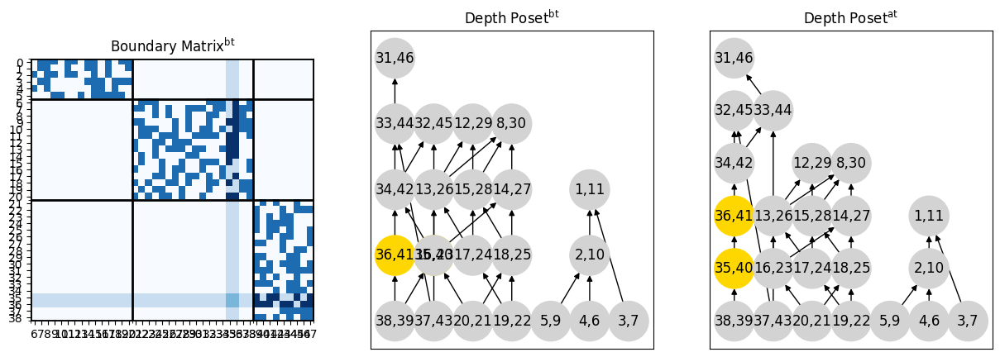

### Birth Death Pairs
|                          |                                                                                                                                                                                                                                   |
|:-------------------------|:----------------------------------------------------------------------------------------------------------------------------------------------------------------------------------------------------------------------------------|
| Before the transposition | $\{(3, 7), (4, 6), (17, 24), (8, 30), (13, 26), (33, 44), (32, 45), (18, 25), (5, 9), (14, 27), (34, 42), (1, 11), (31, 46), (2, 10), (15, 28), (35, 40), (20, 21), (38, 39), (12, 29), (19, 22), (37, 43), (36, 41), (16, 23)\}$ |
| After the transposition  | $\{(3, 7), (4, 6), (17, 24), (8, 30), (13, 26), (33, 44), (32, 45), (18, 25), (5, 9), (14, 27), (34, 42), (1, 11), (31, 46), (2, 10), (15, 28), (35, 40), (20, 21), (38, 39), (12, 29), (19, 22), (37, 43), (36, 41), (16, 23)\}$ |

### Relations
|                          | Algorithm 1                                                                                                                                                                                                                                                                                                                                                                                                                                       | Algorithm 2                                                                                                                                                                                                                                                                                                                                                                     |
|:-------------------------|:--------------------------------------------------------------------------------------------------------------------------------------------------------------------------------------------------------------------------------------------------------------------------------------------------------------------------------------------------------------------------------------------------------------------------------------------------|:--------------------------------------------------------------------------------------------------------------------------------------------------------------------------------------------------------------------------------------------------------------------------------------------------------------------------------------------------------------------------------|
| Before the transposition | $\{(24, 30), (25, 29), (42, 45), (26, 30), (43, 46), (41, 46), (21, 28), (21, 25), (39, 42), (40, 47), (28, 30), (25, 28), (41, 42), (41, 45), (42, 44), (44, 47), (43, 45), (26, 29), (22, 25), (22, 28), (39, 44), (23, 27), (9, 10), (39, 47), (10, 11), (27, 30), (24, 28), (41, 44), (25, 27), (41, 47), (43, 44), (42, 46), (21, 23), (43, 47), (21, 26), (23, 26), (40, 42), (39, 40), (39, 46), (22, 24), (45, 47)\}$                     | $\{(3, 1), (38, 35), (17, 12), (17, 15), (37, 33), (19, 15), (36, 31), (13, 8), (15, 8), (16, 13), (35, 32), (20, 13), (4, 2), (3, 0), (20, 16), (38, 31), (5, 0), (17, 8), (19, 14), (36, 33), (37, 32), (16, 12), (18, 12), (33, 31), (18, 15), (20, 12), (20, 18), (38, 33), (5, 2), (14, 8), (38, 36), (17, 13), (2, 0), (36, 32), (37, 31), (15, 12), (18, 8), (18, 14)\}$ |
| After the transposition  | $\{(24, 30), (25, 29), (42, 45), (26, 30), (43, 46), (41, 46), (21, 28), (21, 25), (40, 44), (39, 42), (40, 41), (28, 30), (25, 28), (41, 42), (41, 45), (42, 44), (44, 47), (43, 45), (26, 29), (22, 25), (22, 28), (39, 44), (23, 27), (9, 10), (39, 47), (10, 11), (40, 46), (27, 30), (24, 28), (41, 44), (25, 27), (41, 47), (43, 44), (42, 46), (21, 23), (43, 47), (21, 26), (23, 26), (22, 24), (39, 40), (39, 46), (40, 45), (45, 47)\}$ | $\{(3, 1), (38, 35), (17, 12), (17, 15), (19, 15), (37, 33), (36, 31), (13, 8), (15, 8), (16, 13), (35, 32), (20, 13), (4, 2), (3, 0), (20, 16), (38, 31), (5, 0), (17, 8), (19, 14), (36, 33), (37, 32), (16, 12), (18, 12), (33, 31), (18, 15), (20, 12), (20, 18), (38, 33), (5, 2), (38, 36), (14, 8), (17, 13), (2, 0), (36, 32), (37, 31), (15, 12), (18, 8), (18, 14)\}$ |

### Successors and Predecessers
No such node in the Depth Poset

### Temp Sets
|                                                               | Before the Transposition                                                                                                                                              | After the Transposition                                                                                                                                               |
|:--------------------------------------------------------------|:----------------------------------------------------------------------------------------------------------------------------------------------------------------------|:----------------------------------------------------------------------------------------------------------------------------------------------------------------------|
| $\mathcal{L} = \{(s, t)\in \text{BD}:\; f(t) < f(y)\}$        | $\{(8, 30), (14, 27), (38, 39), (1, 11), (3, 7), (13, 26), (12, 29), (4, 6), (2, 10), (20, 21), (19, 22), (18, 25), (5, 9), (15, 28), (17, 24), (35, 40), (16, 23)\}$ | $\{(8, 30), (14, 27), (38, 39), (1, 11), (3, 7), (13, 26), (12, 29), (4, 6), (2, 10), (20, 21), (19, 22), (18, 25), (5, 9), (15, 28), (17, 24), (35, 40), (16, 23)\}$ |
| $\mathcal{M} = \{(s, t)\in \text{BD}:\; f(y) < f(t) < f(b)\}$ | $\emptyset$                                                                                                                                                           | $\emptyset$                                                                                                                                                           |

### Equations
There are 2 equations are wrong.

| eq   | left (formula)                  | left (paramatrized)               | left (value)                                 | right (formula)                                                                        | right (paramatrized)                                                                         | right (value)                                | correct   |
|:-----|:--------------------------------|:----------------------------------|:---------------------------------------------|:---------------------------------------------------------------------------------------|:---------------------------------------------------------------------------------------------|:---------------------------------------------|:----------|
| Eq16 | $\text{Succ}_1^\text{at}(x, y)$ | $\text{Succ}_1^\text{at}(36, 41)$ | $\{(31, 46), (32, 45), (34, 42), (33, 44)\}$ | $\text{Succ}_1^\text{bt}(x, y) \oplus \{(a, b)\} \oplus \text{Succ}_1^\text{bt}(a, b)$ | $\text{Succ}_1^\text{bt}(36, 41) \oplus \{(35, 40)\} \oplus \text{Succ}_1^\text{bt}(35, 40)$ | $\{(31, 46), (32, 45), (35, 40), (33, 44)\}$ | ✘         |
| Eq17 | $\text{Pred}_1^\text{at}(a, b)$ | $\text{Pred}_1^\text{at}(35, 40)$ | $\{(38, 39)\}$                               | $\text{Pred}_1^\text{bt}(a, b) \oplus \{(x, y)\}$                                      | $\text{Pred}_1^\text{bt}(35, 40) \oplus \{(36, 41)\}$                                        | $\{(36, 41), (38, 39)\}$                     | ✘         |

## Transposition <36, 37> in complex 1
Here is a __birth-birth__ __no switch__ transposition <36, 37>.

$$
a = 36, \; b = 41, \; x = 37, \; y = 43
$$

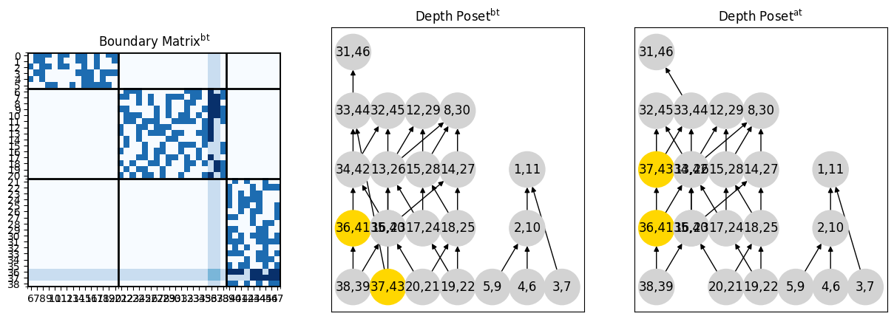

### Birth Death Pairs
|                          |                                                                                                                                                                                                                                   |
|:-------------------------|:----------------------------------------------------------------------------------------------------------------------------------------------------------------------------------------------------------------------------------|
| Before the transposition | $\{(3, 7), (4, 6), (17, 24), (8, 30), (13, 26), (33, 44), (32, 45), (18, 25), (5, 9), (14, 27), (34, 42), (1, 11), (31, 46), (2, 10), (15, 28), (35, 40), (20, 21), (38, 39), (12, 29), (19, 22), (37, 43), (36, 41), (16, 23)\}$ |
| After the transposition  | $\{(3, 7), (4, 6), (17, 24), (8, 30), (13, 26), (33, 44), (32, 45), (18, 25), (5, 9), (14, 27), (34, 42), (1, 11), (31, 46), (2, 10), (15, 28), (35, 40), (20, 21), (38, 39), (12, 29), (19, 22), (37, 43), (36, 41), (16, 23)\}$ |

### Relations
|                          | Algorithm 1                                                                                                                                                                                                                                                                                                                                                                                                                   | Algorithm 2                                                                                                                                                                                                                                                                                                                                                                     |
|:-------------------------|:------------------------------------------------------------------------------------------------------------------------------------------------------------------------------------------------------------------------------------------------------------------------------------------------------------------------------------------------------------------------------------------------------------------------------|:--------------------------------------------------------------------------------------------------------------------------------------------------------------------------------------------------------------------------------------------------------------------------------------------------------------------------------------------------------------------------------|
| Before the transposition | $\{(24, 30), (25, 29), (42, 45), (26, 30), (43, 46), (41, 46), (21, 28), (21, 25), (39, 42), (40, 47), (28, 30), (25, 28), (41, 42), (41, 45), (42, 44), (44, 47), (43, 45), (26, 29), (22, 25), (22, 28), (39, 44), (23, 27), (9, 10), (39, 47), (10, 11), (27, 30), (24, 28), (41, 44), (25, 27), (41, 47), (43, 44), (42, 46), (21, 23), (43, 47), (21, 26), (23, 26), (40, 42), (39, 40), (39, 46), (22, 24), (45, 47)\}$ | $\{(3, 1), (38, 35), (17, 12), (17, 15), (37, 33), (19, 15), (36, 31), (13, 8), (15, 8), (16, 13), (35, 32), (20, 13), (4, 2), (3, 0), (20, 16), (38, 31), (5, 0), (17, 8), (19, 14), (36, 33), (37, 32), (16, 12), (18, 12), (33, 31), (18, 15), (20, 12), (20, 18), (38, 33), (5, 2), (14, 8), (38, 36), (17, 13), (2, 0), (36, 32), (37, 31), (15, 12), (18, 8), (18, 14)\}$ |
| After the transposition  | $\{(24, 30), (25, 29), (42, 45), (41, 43), (26, 30), (43, 46), (21, 28), (21, 25), (39, 42), (40, 47), (28, 30), (25, 28), (41, 42), (42, 44), (44, 47), (43, 45), (26, 29), (22, 25), (22, 28), (39, 44), (23, 27), (9, 10), (39, 47), (10, 11), (27, 30), (24, 28), (25, 27), (43, 44), (42, 46), (21, 23), (43, 47), (21, 26), (23, 26), (40, 42), (39, 40), (39, 46), (22, 24), (45, 47)\}$                               | $\{(3, 1), (38, 35), (17, 12), (17, 15), (19, 15), (37, 33), (36, 31), (13, 8), (15, 8), (16, 13), (35, 32), (20, 13), (4, 2), (3, 0), (20, 16), (38, 31), (5, 0), (17, 8), (19, 14), (36, 33), (37, 32), (16, 12), (18, 12), (33, 31), (18, 15), (20, 12), (20, 18), (38, 33), (5, 2), (38, 36), (14, 8), (17, 13), (2, 0), (36, 32), (37, 31), (15, 12), (18, 8), (18, 14)\}$ |

### Successors and Predecessers
No such node in the Depth Poset

### Temp Sets
|                                                               | Before the Transposition                                                                                                                                                                  | After the Transposition                                                                                                                                                                   |
|:--------------------------------------------------------------|:------------------------------------------------------------------------------------------------------------------------------------------------------------------------------------------|:------------------------------------------------------------------------------------------------------------------------------------------------------------------------------------------|
| $\mathcal{L} = \{(s, t)\in \text{BD}:\; f(t) < f(y)\}$        | $\{(3, 7), (4, 6), (17, 24), (8, 30), (13, 26), (18, 25), (5, 9), (14, 27), (34, 42), (1, 11), (2, 10), (15, 28), (35, 40), (20, 21), (38, 39), (12, 29), (19, 22), (36, 41), (16, 23)\}$ | $\{(3, 7), (4, 6), (17, 24), (8, 30), (13, 26), (18, 25), (5, 9), (14, 27), (34, 42), (1, 11), (2, 10), (15, 28), (35, 40), (20, 21), (38, 39), (12, 29), (19, 22), (36, 41), (16, 23)\}$ |
| $\mathcal{M} = \{(s, t)\in \text{BD}:\; f(y) < f(t) < f(b)\}$ | $\emptyset$                                                                                                                                                                               | $\emptyset$                                                                                                                                                                               |

### Equations
There are 2 equations are wrong.

| eq   | left (formula)                  | left (paramatrized)               | left (value)                       | right (formula)                                                                        | right (paramatrized)                                                                         | right (value)            | correct   |
|:-----|:--------------------------------|:----------------------------------|:-----------------------------------|:---------------------------------------------------------------------------------------|:---------------------------------------------------------------------------------------------|:-------------------------|:----------|
| Eq16 | $\text{Succ}_1^\text{at}(x, y)$ | $\text{Succ}_1^\text{at}(37, 43)$ | $\{(31, 46), (32, 45), (33, 44)\}$ | $\text{Succ}_1^\text{bt}(x, y) \oplus \{(a, b)\} \oplus \text{Succ}_1^\text{bt}(a, b)$ | $\text{Succ}_1^\text{bt}(37, 43) \oplus \{(36, 41)\} \oplus \text{Succ}_1^\text{bt}(36, 41)$ | $\{(36, 41), (34, 42)\}$ | ✘         |
| Eq17 | $\text{Pred}_1^\text{at}(a, b)$ | $\text{Pred}_1^\text{at}(36, 41)$ | $\emptyset$                        | $\text{Pred}_1^\text{bt}(a, b) \oplus \{(x, y)\}$                                      | $\text{Pred}_1^\text{bt}(36, 41) \oplus \{(37, 43)\}$                                        | $\{(37, 43)\}$           | ✘         |

## Transposition <40, 41> in complex 1
Here is a __death-death__ __no switch__ transposition <40, 41>.

$$
a = 36, \; b = 41, \; x = 35, \; y = 40
$$

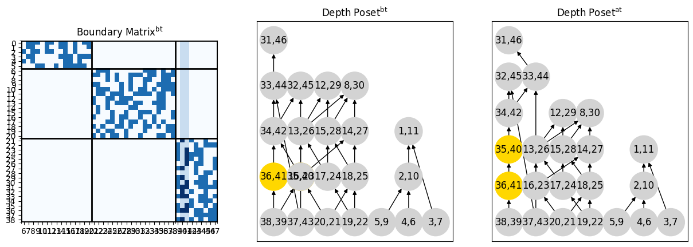

### Birth Death Pairs
|                          |                                                                                                                                                                                                                                   |
|:-------------------------|:----------------------------------------------------------------------------------------------------------------------------------------------------------------------------------------------------------------------------------|
| Before the transposition | $\{(3, 7), (4, 6), (17, 24), (8, 30), (13, 26), (33, 44), (32, 45), (18, 25), (5, 9), (14, 27), (34, 42), (1, 11), (31, 46), (2, 10), (15, 28), (35, 40), (20, 21), (38, 39), (12, 29), (19, 22), (37, 43), (36, 41), (16, 23)\}$ |
| After the transposition  | $\{(3, 7), (4, 6), (17, 24), (8, 30), (13, 26), (33, 44), (32, 45), (18, 25), (5, 9), (14, 27), (34, 42), (1, 11), (31, 46), (2, 10), (15, 28), (35, 40), (20, 21), (38, 39), (12, 29), (19, 22), (37, 43), (36, 41), (16, 23)\}$ |

### Relations
|                          | Algorithm 1                                                                                                                                                                                                                                                                                                                                                                                                                   | Algorithm 2                                                                                                                                                                                                                                                                                                                                                                     |
|:-------------------------|:------------------------------------------------------------------------------------------------------------------------------------------------------------------------------------------------------------------------------------------------------------------------------------------------------------------------------------------------------------------------------------------------------------------------------|:--------------------------------------------------------------------------------------------------------------------------------------------------------------------------------------------------------------------------------------------------------------------------------------------------------------------------------------------------------------------------------|
| Before the transposition | $\{(24, 30), (25, 29), (42, 45), (26, 30), (43, 46), (41, 46), (21, 28), (21, 25), (39, 42), (40, 47), (28, 30), (25, 28), (41, 42), (41, 45), (42, 44), (44, 47), (43, 45), (26, 29), (22, 25), (22, 28), (39, 44), (23, 27), (9, 10), (39, 47), (10, 11), (27, 30), (24, 28), (41, 44), (25, 27), (41, 47), (43, 44), (42, 46), (21, 23), (43, 47), (21, 26), (23, 26), (40, 42), (39, 40), (39, 46), (22, 24), (45, 47)\}$ | $\{(3, 1), (38, 35), (17, 12), (17, 15), (37, 33), (19, 15), (36, 31), (13, 8), (15, 8), (16, 13), (35, 32), (20, 13), (4, 2), (3, 0), (20, 16), (38, 31), (5, 0), (17, 8), (19, 14), (36, 33), (37, 32), (16, 12), (18, 12), (33, 31), (18, 15), (20, 12), (20, 18), (38, 33), (5, 2), (14, 8), (38, 36), (17, 13), (2, 0), (36, 32), (37, 31), (15, 12), (18, 8), (18, 14)\}$ |
| After the transposition  | $\{(24, 30), (25, 29), (42, 45), (26, 30), (43, 46), (41, 46), (21, 28), (21, 25), (39, 42), (40, 47), (28, 30), (25, 28), (41, 42), (41, 45), (42, 44), (44, 47), (43, 45), (26, 29), (22, 25), (22, 28), (39, 44), (23, 27), (9, 10), (39, 47), (10, 11), (27, 30), (24, 28), (41, 44), (25, 27), (41, 47), (43, 44), (42, 46), (21, 23), (43, 47), (21, 26), (23, 26), (40, 42), (39, 40), (22, 24), (39, 46), (45, 47)\}$ | $\{(3, 1), (38, 35), (17, 12), (17, 15), (19, 15), (37, 33), (36, 31), (13, 8), (15, 8), (16, 13), (35, 32), (20, 13), (4, 2), (3, 0), (20, 16), (38, 31), (5, 0), (17, 8), (19, 14), (36, 33), (37, 32), (16, 12), (18, 12), (33, 31), (18, 15), (20, 12), (20, 18), (38, 33), (5, 2), (14, 8), (38, 36), (17, 13), (2, 0), (37, 31), (36, 35), (15, 12), (18, 8), (18, 14)\}$ |

### Successors and Predecessers
No such node in the Depth Poset

### Temp Sets
|                                                               | Before the Transposition           | After the Transposition            |
|:--------------------------------------------------------------|:-----------------------------------|:-----------------------------------|
| $\mathcal{B} = \{(s, t)\in \text{BD}:\; f(s) > f(x)\}$        | $\{(37, 43), (36, 41), (38, 39)\}$ | $\{(37, 43), (36, 41), (38, 39)\}$ |
| $\mathcal{N} = \{(s, t)\in \text{BD}:\; f(x) > f(s) > f(a)\}$ | $\emptyset$                        | $\emptyset$                        |

### Equations
There are 2 equations are wrong.

| eq   | left (formula)                  | left (paramatrized)               | left (value)   | right (formula)                                                                        | right (paramatrized)                                                                         | right (value)                      | correct   |
|:-----|:--------------------------------|:----------------------------------|:---------------|:---------------------------------------------------------------------------------------|:---------------------------------------------------------------------------------------------|:-----------------------------------|:----------|
| Eq36 | $\text{Succ}_2^\text{at}(x, y)$ | $\text{Succ}_2^\text{at}(35, 40)$ | $\{(32, 45)\}$ | $\text{Succ}_2^\text{bt}(x, y) \oplus \{(a, b)\} \oplus \text{Succ}_2^\text{bt}(a, b)$ | $\text{Succ}_2^\text{bt}(35, 40) \oplus \{(36, 41)\} \oplus \text{Succ}_2^\text{bt}(36, 41)$ | $\{(31, 46), (36, 41), (33, 44)\}$ | ✘         |
| Eq37 | $\text{Pred}_2^\text{at}(a, b)$ | $\text{Pred}_2^\text{at}(36, 41)$ | $\{(38, 39)\}$ | $\text{Pred}_2^\text{bt}(a, b) \oplus \{(x, y)\}$                                      | $\text{Pred}_2^\text{bt}(36, 41) \oplus \{(35, 40)\}$                                        | $\{(35, 40), (38, 39)\}$           | ✘         |

## Transposition <41, 42> in complex 1
Here is a __death-death__ __switch forward__ transposition <41, 42>.

$$
a = 34, \; b = 42, \; x = 36, \; y = 41
$$

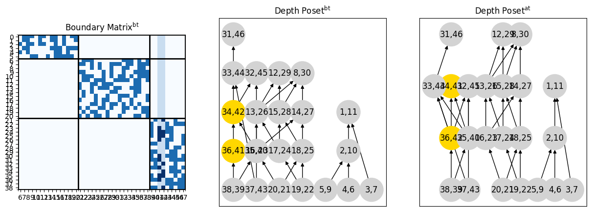

### Birth Death Pairs
|                          |                                                                                                                                                                                                                                   |
|:-------------------------|:----------------------------------------------------------------------------------------------------------------------------------------------------------------------------------------------------------------------------------|
| Before the transposition | $\{(3, 7), (4, 6), (17, 24), (8, 30), (13, 26), (33, 44), (32, 45), (18, 25), (5, 9), (14, 27), (34, 42), (1, 11), (31, 46), (2, 10), (15, 28), (35, 40), (20, 21), (38, 39), (12, 29), (19, 22), (37, 43), (36, 41), (16, 23)\}$ |
| After the transposition  | $\{(3, 7), (4, 6), (17, 24), (8, 30), (13, 26), (33, 44), (32, 45), (18, 25), (5, 9), (14, 27), (1, 11), (31, 46), (2, 10), (36, 42), (15, 28), (35, 40), (20, 21), (38, 39), (12, 29), (34, 41), (19, 22), (37, 43), (16, 23)\}$ |

### Relations
|                          | Algorithm 1                                                                                                                                                                                                                                                                                                                                                                                                                   | Algorithm 2                                                                                                                                                                                                                                                                                                                                                                               |
|:-------------------------|:------------------------------------------------------------------------------------------------------------------------------------------------------------------------------------------------------------------------------------------------------------------------------------------------------------------------------------------------------------------------------------------------------------------------------|:------------------------------------------------------------------------------------------------------------------------------------------------------------------------------------------------------------------------------------------------------------------------------------------------------------------------------------------------------------------------------------------|
| Before the transposition | $\{(24, 30), (25, 29), (42, 45), (26, 30), (43, 46), (41, 46), (21, 28), (21, 25), (39, 42), (40, 47), (28, 30), (25, 28), (41, 42), (41, 45), (42, 44), (44, 47), (43, 45), (26, 29), (22, 25), (22, 28), (39, 44), (23, 27), (9, 10), (39, 47), (10, 11), (27, 30), (24, 28), (41, 44), (25, 27), (41, 47), (43, 44), (42, 46), (21, 23), (43, 47), (21, 26), (23, 26), (40, 42), (39, 40), (39, 46), (22, 24), (45, 47)\}$ | $\{(3, 1), (38, 35), (17, 12), (17, 15), (37, 33), (19, 15), (36, 31), (13, 8), (15, 8), (16, 13), (35, 32), (20, 13), (4, 2), (3, 0), (20, 16), (38, 31), (5, 0), (17, 8), (19, 14), (36, 33), (37, 32), (16, 12), (18, 12), (33, 31), (18, 15), (20, 12), (20, 18), (38, 33), (5, 2), (14, 8), (38, 36), (17, 13), (2, 0), (36, 32), (37, 31), (15, 12), (18, 8), (18, 14)\}$           |
| After the transposition  | $\{(24, 30), (25, 29), (42, 45), (26, 30), (43, 46), (21, 28), (21, 25), (40, 44), (39, 42), (40, 41), (28, 30), (25, 28), (42, 41), (42, 47), (42, 44), (44, 47), (43, 45), (26, 29), (22, 25), (22, 28), (39, 44), (23, 27), (9, 10), (39, 47), (10, 11), (40, 46), (27, 30), (24, 28), (25, 27), (41, 47), (43, 44), (42, 46), (21, 23), (43, 47), (21, 26), (23, 26), (22, 24), (39, 40), (39, 46), (40, 45), (45, 47)\}$ | $\{(3, 1), (38, 35), (17, 12), (17, 15), (19, 15), (37, 33), (36, 31), (13, 8), (36, 34), (15, 8), (16, 13), (35, 32), (20, 13), (4, 2), (3, 0), (20, 16), (38, 31), (5, 0), (17, 8), (19, 14), (36, 33), (37, 32), (16, 12), (18, 12), (33, 31), (18, 15), (20, 12), (20, 18), (38, 33), (5, 2), (14, 8), (38, 36), (17, 13), (2, 0), (36, 32), (37, 31), (15, 12), (18, 8), (18, 14)\}$ |

### Successors and Predecessers
|                 | $\text{Set}^\text{bt}(34, 42)$                                       | $\text{Set}^\text{bt}(36, 41)$                                                 | $\text{Set}^\text{at}(36, 42)$                                                 | $\text{Set}^\text{at}(34, 41)$                             |
|:----------------|:---------------------------------------------------------------------|:-------------------------------------------------------------------------------|:-------------------------------------------------------------------------------|:-----------------------------------------------------------|
| $\text{Succ}_1$ | $\text{Succ}_1^\text{bt}(34, 42) = \{(31, 46), (32, 45), (33, 44)\}$ | $\text{Succ}_1^\text{bt}(36, 41) = \{(31, 46), (32, 45), (34, 42), (33, 44)\}$ | $\text{Succ}_1^\text{at}(36, 42) = \{(31, 46), (32, 45), (34, 41), (33, 44)\}$ | $\text{Succ}_1^\text{at}(34, 41) = \emptyset$              |
| $\text{Pred}_1$ | $\text{Pred}_1^\text{bt}(34, 42) = \{(36, 41), (38, 39), (35, 40)\}$ | $\text{Pred}_1^\text{bt}(36, 41) = \emptyset$                                  | $\text{Pred}_1^\text{at}(36, 42) = \{(38, 39)\}$                               | $\text{Pred}_1^\text{at}(34, 41) = \{(36, 42), (35, 40)\}$ |
| $\text{Succ}_2$ | $\text{Succ}_2^\text{bt}(34, 42) = \emptyset$                        | $\text{Succ}_2^\text{bt}(36, 41) = \{(31, 46), (32, 45), (33, 44)\}$           | $\text{Succ}_2^\text{at}(36, 42) = \{(31, 46), (32, 45), (34, 41), (33, 44)\}$ | $\text{Succ}_2^\text{at}(34, 41) = \emptyset$              |
| $\text{Pred}_2$ | $\text{Pred}_2^\text{bt}(34, 42) = \emptyset$                        | $\text{Pred}_2^\text{bt}(36, 41) = \{(38, 39)\}$                               | $\text{Pred}_2^\text{at}(36, 42) = \{(38, 39)\}$                               | $\text{Pred}_2^\text{at}(34, 41) = \{(36, 42)\}$           |

### Temp Sets
|                                                               | Before the Transposition   | After the Transposition   |
|:--------------------------------------------------------------|:---------------------------|:--------------------------|
| $\mathcal{B} = \{(s, t)\in \text{BD}:\; f(s) > f(x)\}$        | $\{(37, 43), (38, 39)\}$   | $\{(37, 43), (38, 39)\}$  |
| $\mathcal{N} = \{(s, t)\in \text{BD}:\; f(x) > f(s) > f(a)\}$ | $\{(35, 40)\}$             | $\{(35, 40)\}$            |

### Equations
There are 1 equations are wrong.

| eq   | left (formula)                  | left (paramatrized)               | left (value)                                 | right (formula)                                                                                          | right (paramatrized)                                                                                           | right (value)                                | correct   |
|:-----|:--------------------------------|:----------------------------------|:---------------------------------------------|:---------------------------------------------------------------------------------------------------------|:---------------------------------------------------------------------------------------------------------------|:---------------------------------------------|:----------|
| Eq28 | $\text{Succ}_1^\text{at}(x, b)$ | $\text{Succ}_1^\text{at}(36, 42)$ | $\{(31, 46), (32, 45), (34, 41), (33, 44)\}$ | $\text{Succ}_1^\text{bt}(x, y) \oplus \{(a, y), (a, b)\}$                                                | $\text{Succ}_1^\text{bt}(36, 41) \oplus \{(34, 41), (34, 42)\}$                                                | $\{(31, 46), (32, 45), (34, 41), (33, 44)\}$ | ✔         |
| Eq29 | $\text{Succ}_1^\text{at}(a, y)$ | $\text{Succ}_1^\text{at}(34, 41)$ | $\emptyset$                                  | $\text{Succ}_1^\text{bt}(a, b)$                                                                          | $\text{Succ}_1^\text{bt}(34, 42)$                                                                              | $\{(31, 46), (32, 45), (33, 44)\}$           | ✘         |
| Eq30 | $\text{Pred}_1^\text{at}(x, b)$ | $\text{Pred}_1^\text{at}(36, 42)$ | $\{(38, 39)\}$                               | $[\text{Pred}_1^\text{bt}(a, b) \cap \mathcal{B}]$                                                       | $[\text{Pred}_1^\text{bt}(34, 42) \cap \mathcal{B}]$                                                           | $\{(38, 39)\}$                               | ✔         |
| Eq31 | $\text{Pred}_1^\text{at}(a, y)$ | $\text{Pred}_1^\text{at}(34, 41)$ | $\{(36, 42), (35, 40)\}$                     | $\text{Pred}_1^\text{bt}(x, y) \oplus \{(x, b)\} \oplus[\text{Pred}_1^\text{bt}(a, b) \cap \mathcal{N}]$ | $\text{Pred}_1^\text{bt}(36, 41) \oplus \{(36, 42)\} \oplus[\text{Pred}_1^\text{bt}(34, 42) \cap \mathcal{N}]$ | $\{(36, 42), (35, 40)\}$                     | ✔         |
| Eq32 | $\text{Succ}_2^\text{at}(x, b)$ | $\text{Succ}_2^\text{at}(36, 42)$ | $\{(31, 46), (32, 45), (34, 41), (33, 44)\}$ | $\text{Succ}_2^\text{bt}(x, y) \oplus \{(a, y)\} \oplus \text{Succ}_2^\text{bt}(a, b)$                   | $\text{Succ}_2^\text{bt}(36, 41) \oplus \{(34, 41)\} \oplus \text{Succ}_2^\text{bt}(34, 42)$                   | $\{(31, 46), (32, 45), (34, 41), (33, 44)\}$ | ✔         |
| Eq33 | $\text{Succ}_2^\text{at}(a, y)$ | $\text{Succ}_2^\text{at}(34, 41)$ | $\emptyset$                                  | $\text{Succ}_2^\text{bt}(a, b)$                                                                          | $\text{Succ}_2^\text{bt}(34, 42)$                                                                              | $\emptyset$                                  | ✔         |
| Eq34 | $\text{Pred}_2^\text{at}(x, b)$ | $\text{Pred}_2^\text{at}(36, 42)$ | $\{(38, 39)\}$                               | $\text{Pred}_2^\text{bt}(x, y)$                                                                          | $\text{Pred}_2^\text{bt}(36, 41)$                                                                              | $\{(38, 39)\}$                               | ✔         |
| Eq35 | $\text{Pred}_2^\text{at}(a, y)$ | $\text{Pred}_2^\text{at}(34, 41)$ | $\{(36, 42)\}$                               | $\text{Pred}_2^\text{bt}(a, b) \oplus \{(x, b)\}$                                                        | $\text{Pred}_2^\text{bt}(34, 42) \oplus \{(36, 42)\}$                                                          | $\{(36, 42)\}$                               | ✔         |

## Transposition <3, 4> in complex 2
Here is a __birth-birth__ __no switch__ transposition <3, 4>.

$$
a = 3, \; b = 6, \; x = 4, \; y = 7
$$

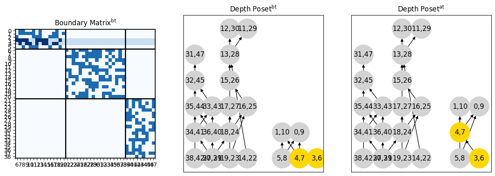

### Birth Death Pairs
|                          |                                                                                                                                                                                                                                   |
|:-------------------------|:----------------------------------------------------------------------------------------------------------------------------------------------------------------------------------------------------------------------------------|
| Before the transposition | $\{(14, 22), (31, 47), (17, 27), (36, 40), (37, 39), (11, 29), (15, 26), (16, 25), (35, 44), (32, 45), (3, 6), (12, 30), (19, 23), (13, 28), (18, 24), (33, 43), (20, 21), (4, 7), (38, 42), (5, 8), (0, 9), (34, 41), (1, 10)\}$ |
| After the transposition  | $\{(14, 22), (31, 47), (17, 27), (36, 40), (37, 39), (11, 29), (15, 26), (16, 25), (35, 44), (32, 45), (3, 6), (12, 30), (19, 23), (13, 28), (18, 24), (33, 43), (20, 21), (4, 7), (38, 42), (5, 8), (0, 9), (34, 41), (1, 10)\}$ |

### Relations
|                          | Algorithm 1                                                                                                                                                                                                                                                                                                                                                                             | Algorithm 2                                                                                                                                                                                                                                                                                                                                                                                            |
|:-------------------------|:----------------------------------------------------------------------------------------------------------------------------------------------------------------------------------------------------------------------------------------------------------------------------------------------------------------------------------------------------------------------------------------|:-------------------------------------------------------------------------------------------------------------------------------------------------------------------------------------------------------------------------------------------------------------------------------------------------------------------------------------------------------------------------------------------------------|
| Before the transposition | $\{(25, 29), (26, 30), (43, 46), (21, 25), (23, 25), (40, 47), (27, 28), (25, 28), (24, 26), (7, 10), (42, 44), (43, 45), (21, 24), (39, 41), (21, 27), (22, 28), (39, 44), (23, 27), (39, 47), (40, 46), (27, 30), (28, 29), (7, 9), (24, 25), (41, 47), (25, 30), (21, 26), (21, 29), (23, 26), (39, 40), (39, 46), (22, 30), (8, 10), (39, 43), (25, 26)\}$                          | $\{(32, 31), (18, 17), (4, 0), (20, 17), (38, 35), (38, 32), (5, 1), (14, 13), (34, 31), (19, 12), (13, 11), (37, 36), (16, 13), (35, 32), (18, 13), (4, 2), (38, 31), (5, 0), (14, 12), (17, 11), (34, 33), (37, 35), (36, 33), (15, 13), (16, 12), (16, 15), (35, 31), (20, 12), (3, 2), (20, 18), (4, 1), (20, 15), (5, 2), (17, 13), (19, 16), (19, 13), (36, 35), (13, 12), (15, 12), (16, 11)\}$ |
| After the transposition  | $\{(25, 29), (26, 30), (43, 46), (21, 25), (23, 25), (40, 47), (27, 28), (25, 28), (24, 26), (7, 10), (42, 44), (43, 45), (21, 24), (21, 27), (39, 41), (22, 28), (39, 44), (23, 27), (39, 47), (40, 46), (27, 30), (28, 29), (7, 9), (24, 25), (6, 7), (6, 10), (41, 47), (25, 30), (21, 26), (21, 29), (23, 26), (39, 40), (39, 46), (22, 30), (8, 10), (39, 43), (6, 9), (25, 26)\}$ | $\{(32, 31), (18, 17), (4, 0), (20, 17), (38, 35), (38, 32), (5, 1), (14, 13), (19, 12), (34, 31), (13, 11), (37, 36), (16, 13), (35, 32), (18, 13), (4, 2), (38, 31), (5, 0), (14, 12), (17, 11), (34, 33), (37, 35), (36, 33), (15, 13), (16, 12), (16, 15), (35, 31), (3, 2), (20, 12), (4, 1), (20, 18), (20, 15), (5, 2), (17, 13), (19, 16), (19, 13), (36, 35), (13, 12), (15, 12), (16, 11)\}$ |

### Successors and Predecessers
No such node in the Depth Poset

### Temp Sets
|                                                               | Before the Transposition   | After the Transposition   |
|:--------------------------------------------------------------|:---------------------------|:--------------------------|
| $\mathcal{L} = \{(s, t)\in \text{BD}:\; f(t) < f(y)\}$        | $\{(3, 6)\}$               | $\{(3, 6)\}$              |
| $\mathcal{M} = \{(s, t)\in \text{BD}:\; f(y) < f(t) < f(b)\}$ | $\emptyset$                | $\emptyset$               |

### Equations
There are 2 equations are wrong.

| eq   | left (formula)                  | left (paramatrized)             | left (value)          | right (formula)                                                                        | right (paramatrized)                                                                   | right (value)                 | correct   |
|:-----|:--------------------------------|:--------------------------------|:----------------------|:---------------------------------------------------------------------------------------|:---------------------------------------------------------------------------------------|:------------------------------|:----------|
| Eq16 | $\text{Succ}_1^\text{at}(x, y)$ | $\text{Succ}_1^\text{at}(4, 7)$ | $\{(0, 9), (1, 10)\}$ | $\text{Succ}_1^\text{bt}(x, y) \oplus \{(a, b)\} \oplus \text{Succ}_1^\text{bt}(a, b)$ | $\text{Succ}_1^\text{bt}(4, 7) \oplus \{(3, 6)\} \oplus \text{Succ}_1^\text{bt}(3, 6)$ | $\{(0, 9), (1, 10), (3, 6)\}$ | ✘         |
| Eq17 | $\text{Pred}_1^\text{at}(a, b)$ | $\text{Pred}_1^\text{at}(3, 6)$ | $\emptyset$           | $\text{Pred}_1^\text{bt}(a, b) \oplus \{(x, y)\}$                                      | $\text{Pred}_1^\text{bt}(3, 6) \oplus \{(4, 7)\}$                                      | $\{(4, 7)\}$                  | ✘         |

## Transposition <6, 7> in complex 2
Here is a __death-death__ __no switch__ transposition <6, 7>.

$$
a = 4, \; b = 7, \; x = 3, \; y = 6
$$

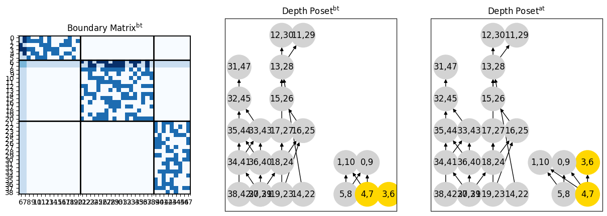

### Birth Death Pairs
|                          |                                                                                                                                                                                                                                   |
|:-------------------------|:----------------------------------------------------------------------------------------------------------------------------------------------------------------------------------------------------------------------------------|
| Before the transposition | $\{(14, 22), (31, 47), (17, 27), (36, 40), (37, 39), (11, 29), (15, 26), (16, 25), (35, 44), (32, 45), (3, 6), (12, 30), (19, 23), (13, 28), (18, 24), (33, 43), (20, 21), (4, 7), (38, 42), (5, 8), (0, 9), (34, 41), (1, 10)\}$ |
| After the transposition  | $\{(14, 22), (31, 47), (17, 27), (36, 40), (37, 39), (11, 29), (15, 26), (16, 25), (35, 44), (32, 45), (3, 6), (12, 30), (19, 23), (13, 28), (18, 24), (33, 43), (20, 21), (4, 7), (38, 42), (5, 8), (0, 9), (34, 41), (1, 10)\}$ |

### Relations
|                          | Algorithm 1                                                                                                                                                                                                                                                                                                                                                    | Algorithm 2                                                                                                                                                                                                                                                                                                                                                                                            |
|:-------------------------|:---------------------------------------------------------------------------------------------------------------------------------------------------------------------------------------------------------------------------------------------------------------------------------------------------------------------------------------------------------------|:-------------------------------------------------------------------------------------------------------------------------------------------------------------------------------------------------------------------------------------------------------------------------------------------------------------------------------------------------------------------------------------------------------|
| Before the transposition | $\{(25, 29), (26, 30), (43, 46), (21, 25), (23, 25), (40, 47), (27, 28), (25, 28), (24, 26), (7, 10), (42, 44), (43, 45), (21, 24), (39, 41), (21, 27), (22, 28), (39, 44), (23, 27), (39, 47), (40, 46), (27, 30), (28, 29), (7, 9), (24, 25), (41, 47), (25, 30), (21, 26), (21, 29), (23, 26), (39, 40), (39, 46), (22, 30), (8, 10), (39, 43), (25, 26)\}$ | $\{(32, 31), (18, 17), (4, 0), (20, 17), (38, 35), (38, 32), (5, 1), (14, 13), (34, 31), (19, 12), (13, 11), (37, 36), (16, 13), (35, 32), (18, 13), (4, 2), (38, 31), (5, 0), (14, 12), (17, 11), (34, 33), (37, 35), (36, 33), (15, 13), (16, 12), (16, 15), (35, 31), (20, 12), (3, 2), (20, 18), (4, 1), (20, 15), (5, 2), (17, 13), (19, 16), (19, 13), (36, 35), (13, 12), (15, 12), (16, 11)\}$ |
| After the transposition  | $\{(25, 29), (26, 30), (43, 46), (21, 25), (23, 25), (40, 47), (27, 28), (25, 28), (24, 26), (7, 10), (42, 44), (43, 45), (21, 24), (21, 27), (39, 41), (22, 28), (39, 44), (23, 27), (39, 47), (40, 46), (27, 30), (28, 29), (7, 9), (24, 25), (41, 47), (25, 30), (21, 26), (21, 29), (23, 26), (39, 40), (39, 46), (22, 30), (8, 10), (39, 43), (25, 26)\}$ | $\{(32, 31), (4, 0), (18, 17), (4, 3), (20, 17), (38, 35), (38, 32), (5, 1), (14, 13), (19, 12), (34, 31), (13, 11), (37, 36), (16, 13), (35, 32), (18, 13), (38, 31), (5, 0), (14, 12), (17, 11), (34, 33), (37, 35), (36, 33), (15, 13), (16, 12), (16, 15), (35, 31), (20, 12), (3, 2), (20, 18), (4, 1), (20, 15), (5, 2), (17, 13), (19, 16), (19, 13), (36, 35), (13, 12), (15, 12), (16, 11)\}$ |

### Successors and Predecessers
No such node in the Depth Poset

### Temp Sets
|                                                               | Before the Transposition                                                                                                                                                                                 | After the Transposition                                                                                                                                                                                  |
|:--------------------------------------------------------------|:---------------------------------------------------------------------------------------------------------------------------------------------------------------------------------------------------------|:---------------------------------------------------------------------------------------------------------------------------------------------------------------------------------------------------------|
| $\mathcal{B} = \{(s, t)\in \text{BD}:\; f(s) > f(x)\}$        | $\{(14, 22), (31, 47), (17, 27), (36, 40), (37, 39), (11, 29), (15, 26), (16, 25), (35, 44), (32, 45), (12, 30), (19, 23), (13, 28), (18, 24), (33, 43), (20, 21), (4, 7), (38, 42), (5, 8), (34, 41)\}$ | $\{(14, 22), (31, 47), (17, 27), (36, 40), (37, 39), (11, 29), (15, 26), (16, 25), (35, 44), (32, 45), (12, 30), (19, 23), (13, 28), (18, 24), (33, 43), (20, 21), (4, 7), (38, 42), (5, 8), (34, 41)\}$ |
| $\mathcal{N} = \{(s, t)\in \text{BD}:\; f(x) > f(s) > f(a)\}$ | $\emptyset$                                                                                                                                                                                              | $\emptyset$                                                                                                                                                                                              |

### Equations
There are 2 equations are wrong.

| eq   | left (formula)                  | left (paramatrized)             | left (value)   | right (formula)                                                                        | right (paramatrized)                                                                   | right (value)                 | correct   |
|:-----|:--------------------------------|:--------------------------------|:---------------|:---------------------------------------------------------------------------------------|:---------------------------------------------------------------------------------------|:------------------------------|:----------|
| Eq36 | $\text{Succ}_2^\text{at}(x, y)$ | $\text{Succ}_2^\text{at}(3, 6)$ | $\emptyset$    | $\text{Succ}_2^\text{bt}(x, y) \oplus \{(a, b)\} \oplus \text{Succ}_2^\text{bt}(a, b)$ | $\text{Succ}_2^\text{bt}(3, 6) \oplus \{(4, 7)\} \oplus \text{Succ}_2^\text{bt}(4, 7)$ | $\{(0, 9), (4, 7), (1, 10)\}$ | ✘         |
| Eq37 | $\text{Pred}_2^\text{at}(a, b)$ | $\text{Pred}_2^\text{at}(4, 7)$ | $\emptyset$    | $\text{Pred}_2^\text{bt}(a, b) \oplus \{(x, y)\}$                                      | $\text{Pred}_2^\text{bt}(4, 7) \oplus \{(3, 6)\}$                                      | $\{(3, 6)\}$                  | ✘         |

## Transposition <11, 12> in complex 2
Here is a __birth-birth__ __no switch__ transposition <11, 12>.

$$
a = 11, \; b = 29, \; x = 12, \; y = 30
$$

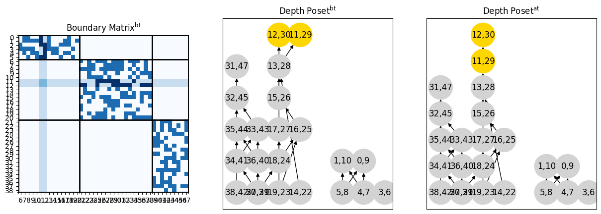

### Birth Death Pairs
|                          |                                                                                                                                                                                                                                   |
|:-------------------------|:----------------------------------------------------------------------------------------------------------------------------------------------------------------------------------------------------------------------------------|
| Before the transposition | $\{(14, 22), (31, 47), (17, 27), (36, 40), (37, 39), (11, 29), (15, 26), (16, 25), (35, 44), (32, 45), (3, 6), (12, 30), (19, 23), (13, 28), (18, 24), (33, 43), (20, 21), (4, 7), (38, 42), (5, 8), (0, 9), (34, 41), (1, 10)\}$ |
| After the transposition  | $\{(14, 22), (31, 47), (17, 27), (36, 40), (37, 39), (11, 29), (15, 26), (16, 25), (35, 44), (32, 45), (3, 6), (12, 30), (19, 23), (13, 28), (18, 24), (33, 43), (20, 21), (4, 7), (38, 42), (5, 8), (0, 9), (34, 41), (1, 10)\}$ |

### Relations
|                          | Algorithm 1                                                                                                                                                                                                                                                                                                                                                              | Algorithm 2                                                                                                                                                                                                                                                                                                                                                                                            |
|:-------------------------|:-------------------------------------------------------------------------------------------------------------------------------------------------------------------------------------------------------------------------------------------------------------------------------------------------------------------------------------------------------------------------|:-------------------------------------------------------------------------------------------------------------------------------------------------------------------------------------------------------------------------------------------------------------------------------------------------------------------------------------------------------------------------------------------------------|
| Before the transposition | $\{(25, 29), (26, 30), (43, 46), (21, 25), (23, 25), (40, 47), (27, 28), (25, 28), (24, 26), (7, 10), (42, 44), (43, 45), (21, 24), (39, 41), (21, 27), (22, 28), (39, 44), (23, 27), (39, 47), (40, 46), (27, 30), (28, 29), (7, 9), (24, 25), (41, 47), (25, 30), (21, 26), (21, 29), (23, 26), (39, 40), (39, 46), (22, 30), (8, 10), (39, 43), (25, 26)\}$           | $\{(32, 31), (18, 17), (4, 0), (20, 17), (38, 35), (38, 32), (5, 1), (14, 13), (34, 31), (19, 12), (13, 11), (37, 36), (16, 13), (35, 32), (18, 13), (4, 2), (38, 31), (5, 0), (14, 12), (17, 11), (34, 33), (37, 35), (36, 33), (15, 13), (16, 12), (16, 15), (35, 31), (20, 12), (3, 2), (20, 18), (4, 1), (20, 15), (5, 2), (17, 13), (19, 16), (19, 13), (36, 35), (13, 12), (15, 12), (16, 11)\}$ |
| After the transposition  | $\{(25, 29), (26, 30), (43, 46), (21, 25), (23, 25), (40, 47), (27, 28), (25, 28), (24, 26), (7, 10), (42, 44), (43, 45), (21, 24), (21, 27), (39, 41), (22, 28), (39, 44), (23, 27), (39, 47), (40, 46), (27, 30), (28, 29), (7, 9), (24, 25), (41, 47), (25, 30), (29, 30), (21, 26), (21, 29), (23, 26), (39, 40), (39, 46), (22, 30), (8, 10), (39, 43), (25, 26)\}$ | $\{(32, 31), (18, 17), (4, 0), (20, 17), (38, 35), (38, 32), (5, 1), (14, 13), (34, 31), (19, 12), (13, 11), (37, 36), (16, 13), (35, 32), (18, 13), (4, 2), (38, 31), (5, 0), (14, 12), (17, 11), (34, 33), (37, 35), (36, 33), (15, 13), (16, 12), (16, 15), (35, 31), (20, 12), (3, 2), (20, 18), (4, 1), (20, 15), (5, 2), (17, 13), (19, 16), (19, 13), (36, 35), (13, 12), (15, 12), (16, 11)\}$ |

### Successors and Predecessers
No such node in the Depth Poset

### Temp Sets
|                                                               | Before the Transposition                                                                                                                | After the Transposition                                                                                                                 |
|:--------------------------------------------------------------|:----------------------------------------------------------------------------------------------------------------------------------------|:----------------------------------------------------------------------------------------------------------------------------------------|
| $\mathcal{L} = \{(s, t)\in \text{BD}:\; f(t) < f(y)\}$        | $\{(17, 27), (5, 8), (11, 29), (19, 23), (0, 9), (15, 26), (18, 24), (16, 25), (13, 28), (14, 22), (3, 6), (1, 10), (4, 7), (20, 21)\}$ | $\{(17, 27), (5, 8), (11, 29), (19, 23), (0, 9), (15, 26), (18, 24), (16, 25), (13, 28), (14, 22), (3, 6), (1, 10), (4, 7), (20, 21)\}$ |
| $\mathcal{M} = \{(s, t)\in \text{BD}:\; f(y) < f(t) < f(b)\}$ | $\emptyset$                                                                                                                             | $\emptyset$                                                                                                                             |

### Equations
There are 2 equations are wrong.

| eq   | left (formula)                  | left (paramatrized)               | left (value)                       | right (formula)                                                                        | right (paramatrized)                                                                         | right (value)                                | correct   |
|:-----|:--------------------------------|:----------------------------------|:-----------------------------------|:---------------------------------------------------------------------------------------|:---------------------------------------------------------------------------------------------|:---------------------------------------------|:----------|
| Eq16 | $\text{Succ}_1^\text{at}(x, y)$ | $\text{Succ}_1^\text{at}(12, 30)$ | $\emptyset$                        | $\text{Succ}_1^\text{bt}(x, y) \oplus \{(a, b)\} \oplus \text{Succ}_1^\text{bt}(a, b)$ | $\text{Succ}_1^\text{bt}(12, 30) \oplus \{(11, 29)\} \oplus \text{Succ}_1^\text{bt}(11, 29)$ | $\{(11, 29)\}$                               | ✘         |
| Eq17 | $\text{Pred}_1^\text{at}(a, b)$ | $\text{Pred}_1^\text{at}(11, 29)$ | $\{(16, 25), (13, 28), (20, 21)\}$ | $\text{Pred}_1^\text{bt}(a, b) \oplus \{(x, y)\}$                                      | $\text{Pred}_1^\text{bt}(11, 29) \oplus \{(12, 30)\}$                                        | $\{(16, 25), (12, 30), (13, 28), (20, 21)\}$ | ✘         |

## Transposition <17, 18> in complex 2
Here is a __birth-birth__ __switch forward__ transposition <17, 18>.

$$
a = 17, \; b = 27, \; x = 18, \; y = 24
$$

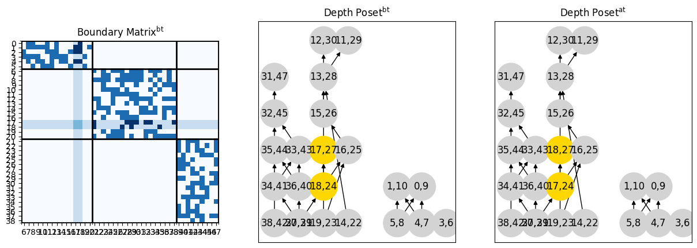

### Birth Death Pairs
|                          |                                                                                                                                                                                                                                   |
|:-------------------------|:----------------------------------------------------------------------------------------------------------------------------------------------------------------------------------------------------------------------------------|
| Before the transposition | $\{(14, 22), (31, 47), (17, 27), (36, 40), (37, 39), (11, 29), (15, 26), (16, 25), (35, 44), (32, 45), (3, 6), (12, 30), (19, 23), (13, 28), (18, 24), (33, 43), (20, 21), (4, 7), (38, 42), (5, 8), (0, 9), (34, 41), (1, 10)\}$ |
| After the transposition  | $\{(14, 22), (17, 24), (31, 47), (36, 40), (37, 39), (11, 29), (15, 26), (16, 25), (35, 44), (32, 45), (3, 6), (12, 30), (19, 23), (13, 28), (33, 43), (4, 7), (20, 21), (18, 27), (38, 42), (5, 8), (0, 9), (34, 41), (1, 10)\}$ |

### Relations
|                          | Algorithm 1                                                                                                                                                                                                                                                                                                                                                                                  | Algorithm 2                                                                                                                                                                                                                                                                                                                                                                                            |
|:-------------------------|:---------------------------------------------------------------------------------------------------------------------------------------------------------------------------------------------------------------------------------------------------------------------------------------------------------------------------------------------------------------------------------------------|:-------------------------------------------------------------------------------------------------------------------------------------------------------------------------------------------------------------------------------------------------------------------------------------------------------------------------------------------------------------------------------------------------------|
| Before the transposition | $\{(25, 29), (26, 30), (43, 46), (21, 25), (23, 25), (40, 47), (27, 28), (25, 28), (24, 26), (7, 10), (42, 44), (43, 45), (21, 24), (39, 41), (21, 27), (22, 28), (39, 44), (23, 27), (39, 47), (40, 46), (27, 30), (28, 29), (7, 9), (24, 25), (41, 47), (25, 30), (21, 26), (21, 29), (23, 26), (39, 40), (39, 46), (22, 30), (8, 10), (39, 43), (25, 26)\}$                               | $\{(32, 31), (18, 17), (4, 0), (20, 17), (38, 35), (38, 32), (5, 1), (14, 13), (34, 31), (19, 12), (13, 11), (37, 36), (16, 13), (35, 32), (18, 13), (4, 2), (38, 31), (5, 0), (14, 12), (17, 11), (34, 33), (37, 35), (36, 33), (15, 13), (16, 12), (16, 15), (35, 31), (20, 12), (3, 2), (20, 18), (4, 1), (20, 15), (5, 2), (17, 13), (19, 16), (19, 13), (36, 35), (13, 12), (15, 12), (16, 11)\}$ |
| After the transposition  | $\{(24, 30), (25, 29), (24, 27), (26, 30), (43, 46), (21, 25), (23, 25), (40, 47), (27, 28), (25, 28), (24, 26), (7, 10), (42, 44), (43, 45), (21, 24), (21, 27), (39, 41), (22, 28), (39, 44), (23, 27), (39, 47), (40, 46), (27, 30), (28, 29), (7, 9), (24, 25), (24, 28), (41, 47), (25, 30), (21, 26), (21, 29), (23, 26), (39, 40), (39, 46), (22, 30), (8, 10), (39, 43), (25, 26)\}$ | $\{(32, 31), (4, 0), (38, 35), (20, 17), (38, 32), (5, 1), (14, 13), (19, 12), (34, 31), (17, 18), (13, 11), (37, 36), (16, 13), (35, 32), (4, 2), (38, 31), (5, 0), (14, 12), (34, 33), (37, 35), (36, 33), (15, 13), (16, 12), (16, 15), (35, 31), (20, 12), (20, 18), (3, 2), (4, 1), (20, 15), (5, 2), (15, 12), (17, 13), (19, 16), (19, 13), (36, 35), (13, 12), (18, 11), (16, 11)\}$           |

### Successors and Predecessers
|                 | $\text{Set}^\text{bt}(17, 27)$                             | $\text{Set}^\text{bt}(18, 24)$                             | $\text{Set}^\text{at}(17, 24)$                                                           | $\text{Set}^\text{at}(18, 27)$                                       |
|:----------------|:-----------------------------------------------------------|:-----------------------------------------------------------|:-----------------------------------------------------------------------------------------|:---------------------------------------------------------------------|
| $\text{Succ}_1$ | $\text{Succ}_1^\text{bt}(17, 27) = \{(13, 28), (12, 30)\}$ | $\text{Succ}_1^\text{bt}(18, 24) = \{(16, 25), (15, 26)\}$ | $\text{Succ}_1^\text{at}(17, 24) = \{(18, 27), (15, 26), (16, 25), (13, 28), (12, 30)\}$ | $\text{Succ}_1^\text{at}(18, 27) = \{(13, 28), (12, 30)\}$           |
| $\text{Pred}_1$ | $\text{Pred}_1^\text{bt}(17, 27) = \{(20, 21), (19, 23)\}$ | $\text{Pred}_1^\text{bt}(18, 24) = \{(20, 21)\}$           | $\text{Pred}_1^\text{at}(17, 24) = \{(20, 21)\}$                                         | $\text{Pred}_1^\text{at}(18, 27) = \{(20, 21), (17, 24), (19, 23)\}$ |
| $\text{Succ}_2$ | $\text{Succ}_2^\text{bt}(17, 27) = \{(11, 29), (13, 28)\}$ | $\text{Succ}_2^\text{bt}(18, 24) = \{(13, 28), (17, 27)\}$ | $\text{Succ}_2^\text{at}(17, 24) = \{(18, 27), (13, 28)\}$                               | $\text{Succ}_2^\text{at}(18, 27) = \{(11, 29)\}$                     |
| $\text{Pred}_2$ | $\text{Pred}_2^\text{bt}(17, 27) = \{(18, 24), (20, 21)\}$ | $\text{Pred}_2^\text{bt}(18, 24) = \{(20, 21)\}$           | $\text{Pred}_2^\text{at}(17, 24) = \{(20, 21)\}$                                         | $\text{Pred}_2^\text{at}(18, 27) = \{(17, 24), (20, 21)\}$           |

### Temp Sets
|                                                               | Before the Transposition                                                    | After the Transposition                                                     |
|:--------------------------------------------------------------|:----------------------------------------------------------------------------|:----------------------------------------------------------------------------|
| $\mathcal{L} = \{(s, t)\in \text{BD}:\; f(t) < f(y)\}$        | $\{(5, 8), (19, 23), (0, 9), (14, 22), (3, 6), (1, 10), (4, 7), (20, 21)\}$ | $\{(5, 8), (19, 23), (0, 9), (14, 22), (3, 6), (1, 10), (4, 7), (20, 21)\}$ |
| $\mathcal{M} = \{(s, t)\in \text{BD}:\; f(y) < f(t) < f(b)\}$ | $\{(16, 25), (15, 26)\}$                                                    | $\{(16, 25), (15, 26)\}$                                                    |

### Equations
There are 1 equations are wrong.

| eq   | left (formula)                  | left (paramatrized)               | left (value)                                           | right (formula)                                                                                           | right (paramatrized)                                                                                            | right (value)                                          | correct   |
|:-----|:--------------------------------|:----------------------------------|:-------------------------------------------------------|:----------------------------------------------------------------------------------------------------------|:----------------------------------------------------------------------------------------------------------------|:-------------------------------------------------------|:----------|
| Eq08 | $\text{Succ}_1^\text{at}(a, y)$ | $\text{Succ}_1^\text{at}(17, 24)$ | $\{(18, 27), (15, 26), (16, 25), (13, 28), (12, 30)\}$ | $\text{Succ}_1^\text{bt}(x, y) \oplus \{(x, b)\} \oplus \text{Succ}_1^\text{bt}(a, b)$                    | $\text{Succ}_1^\text{bt}(18, 24) \oplus \{(18, 27)\} \oplus \text{Succ}_1^\text{bt}(17, 27)$                    | $\{(18, 27), (15, 26), (16, 25), (13, 28), (12, 30)\}$ | ✔         |
| Eq09 | $\text{Succ}_1^\text{at}(x, b)$ | $\text{Succ}_1^\text{at}(18, 27)$ | $\{(13, 28), (12, 30)\}$                               | $\text{Succ}_1^\text{bt}(a, b)$                                                                           | $\text{Succ}_1^\text{bt}(17, 27)$                                                                               | $\{(13, 28), (12, 30)\}$                               | ✔         |
| Eq10 | $\text{Pred}_1^\text{at}(a, y)$ | $\text{Pred}_1^\text{at}(17, 24)$ | $\{(20, 21)\}$                                         | $\text{Pred}_1^\text{bt}(x, y)$                                                                           | $\text{Pred}_1^\text{bt}(18, 24)$                                                                               | $\{(20, 21)\}$                                         | ✔         |
| Eq11 | $\text{Pred}_1^\text{at}(x, b)$ | $\text{Pred}_1^\text{at}(18, 27)$ | $\{(20, 21), (17, 24), (19, 23)\}$                     | $\text{Pred}_1^\text{bt}(a, b) \oplus \{(a, y)\}$                                                         | $\text{Pred}_1^\text{bt}(17, 27) \oplus \{(17, 24)\}$                                                           | $\{(19, 23), (17, 24), (20, 21)\}$                     | ✔         |
| Eq12 | $\text{Succ}_2^\text{at}(a, y)$ | $\text{Succ}_2^\text{at}(17, 24)$ | $\{(18, 27), (13, 28)\}$                               | $\text{Succ}_2^\text{bt}(x, y) \oplus \{(x, b), (a, b)\}$                                                 | $\text{Succ}_2^\text{bt}(18, 24) \oplus \{(18, 27), (17, 27)\}$                                                 | $\{(18, 27), (13, 28)\}$                               | ✔         |
| Eq13 | $\text{Succ}_2^\text{at}(x, b)$ | $\text{Succ}_2^\text{at}(18, 27)$ | $\{(11, 29)\}$                                         | $\text{Succ}_2^\text{bt}(a, b)$                                                                           | $\text{Succ}_2^\text{bt}(17, 27)$                                                                               | $\{(11, 29), (13, 28)\}$                               | ✘         |
| Eq14 | $\text{Pred}_2^\text{at}(a, y)$ | $\text{Pred}_2^\text{at}(17, 24)$ | $\{(20, 21)\}$                                         | $[\text{Pred}_2^\text{bt}(a, b) \cap \mathcal{L}]$                                                        | $[\text{Pred}_2^\text{bt}(17, 27) \cap \mathcal{L}]$                                                            | $\{(20, 21)\}$                                         | ✔         |
| Eq15 | $\text{Pred}_2^\text{at}(x, b)$ | $\text{Pred}_2^\text{at}(18, 27)$ | $\{(17, 24), (20, 21)\}$                               | $\text{Pred}_2^\text{bt}(x, y) \oplus \{(a, y)\} \oplus [\text{Pred}_2^\text{bt}(a, b) \cap \mathcal{M}]$ | $\text{Pred}_2^\text{bt}(18, 24) \oplus \{(17, 24)\} \oplus [\text{Pred}_2^\text{bt}(17, 27) \cap \mathcal{M}]$ | $\{(17, 24), (20, 21)\}$                               | ✔         |

## Transposition <22, 23> in complex 2
Here is a __death-death__ __no switch__ transposition <22, 23>.

$$
a = 19, \; b = 23, \; x = 14, \; y = 22
$$

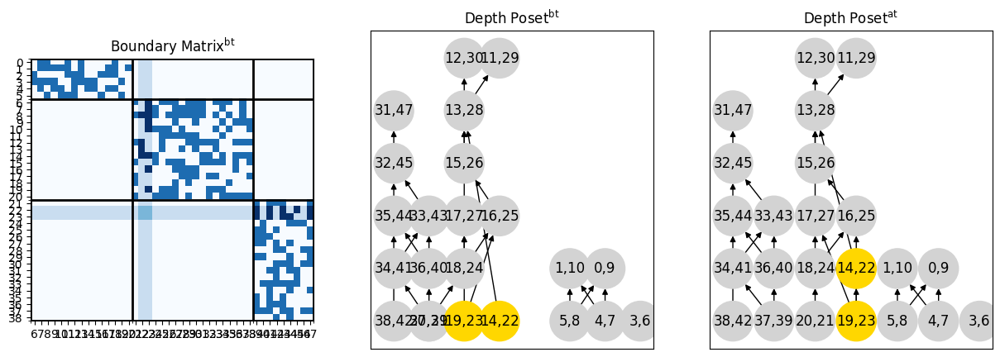

### Birth Death Pairs
|                          |                                                                                                                                                                                                                                   |
|:-------------------------|:----------------------------------------------------------------------------------------------------------------------------------------------------------------------------------------------------------------------------------|
| Before the transposition | $\{(14, 22), (31, 47), (17, 27), (36, 40), (37, 39), (11, 29), (15, 26), (16, 25), (35, 44), (32, 45), (3, 6), (12, 30), (19, 23), (13, 28), (18, 24), (33, 43), (20, 21), (4, 7), (38, 42), (5, 8), (0, 9), (34, 41), (1, 10)\}$ |
| After the transposition  | $\{(14, 22), (31, 47), (17, 27), (36, 40), (37, 39), (11, 29), (15, 26), (16, 25), (35, 44), (32, 45), (3, 6), (12, 30), (19, 23), (13, 28), (18, 24), (33, 43), (20, 21), (4, 7), (38, 42), (5, 8), (0, 9), (34, 41), (1, 10)\}$ |

### Relations
|                          | Algorithm 1                                                                                                                                                                                                                                                                                                                                                    | Algorithm 2                                                                                                                                                                                                                                                                                                                                                                                            |
|:-------------------------|:---------------------------------------------------------------------------------------------------------------------------------------------------------------------------------------------------------------------------------------------------------------------------------------------------------------------------------------------------------------|:-------------------------------------------------------------------------------------------------------------------------------------------------------------------------------------------------------------------------------------------------------------------------------------------------------------------------------------------------------------------------------------------------------|
| Before the transposition | $\{(25, 29), (26, 30), (43, 46), (21, 25), (23, 25), (40, 47), (27, 28), (25, 28), (24, 26), (7, 10), (42, 44), (43, 45), (21, 24), (39, 41), (21, 27), (22, 28), (39, 44), (23, 27), (39, 47), (40, 46), (27, 30), (28, 29), (7, 9), (24, 25), (41, 47), (25, 30), (21, 26), (21, 29), (23, 26), (39, 40), (39, 46), (22, 30), (8, 10), (39, 43), (25, 26)\}$ | $\{(32, 31), (18, 17), (4, 0), (20, 17), (38, 35), (38, 32), (5, 1), (14, 13), (34, 31), (19, 12), (13, 11), (37, 36), (16, 13), (35, 32), (18, 13), (4, 2), (38, 31), (5, 0), (14, 12), (17, 11), (34, 33), (37, 35), (36, 33), (15, 13), (16, 12), (16, 15), (35, 31), (20, 12), (3, 2), (20, 18), (4, 1), (20, 15), (5, 2), (17, 13), (19, 16), (19, 13), (36, 35), (13, 12), (15, 12), (16, 11)\}$ |
| After the transposition  | $\{(25, 29), (26, 30), (43, 46), (21, 25), (23, 25), (40, 47), (27, 28), (25, 28), (24, 26), (7, 10), (42, 44), (43, 45), (21, 24), (21, 27), (39, 41), (22, 28), (39, 44), (23, 27), (39, 47), (40, 46), (27, 30), (28, 29), (7, 9), (24, 25), (41, 47), (25, 30), (21, 26), (21, 29), (23, 26), (22, 30), (39, 40), (39, 46), (8, 10), (39, 43), (25, 26)\}$ | $\{(32, 31), (4, 0), (18, 17), (20, 17), (38, 35), (38, 32), (5, 1), (14, 13), (34, 31), (13, 11), (37, 36), (16, 13), (35, 32), (18, 13), (4, 2), (38, 31), (5, 0), (14, 12), (17, 11), (19, 14), (34, 33), (37, 35), (36, 33), (15, 13), (16, 12), (16, 15), (35, 31), (20, 12), (3, 2), (20, 18), (4, 1), (20, 15), (5, 2), (17, 13), (19, 16), (36, 35), (13, 12), (15, 12), (16, 11)\}$           |

### Successors and Predecessers
No such node in the Depth Poset

### Temp Sets
|                                                               | Before the Transposition                                                                                                                         | After the Transposition                                                                                                                          |
|:--------------------------------------------------------------|:-------------------------------------------------------------------------------------------------------------------------------------------------|:-------------------------------------------------------------------------------------------------------------------------------------------------|
| $\mathcal{B} = \{(s, t)\in \text{BD}:\; f(s) > f(x)\}$        | $\{(36, 40), (37, 39), (38, 42), (19, 23), (15, 26), (33, 43), (16, 25), (20, 21), (35, 44), (34, 41), (32, 45), (31, 47), (18, 24), (17, 27)\}$ | $\{(36, 40), (37, 39), (38, 42), (19, 23), (15, 26), (33, 43), (16, 25), (20, 21), (35, 44), (34, 41), (32, 45), (31, 47), (18, 24), (17, 27)\}$ |
| $\mathcal{N} = \{(s, t)\in \text{BD}:\; f(x) > f(s) > f(a)\}$ | $\emptyset$                                                                                                                                      | $\emptyset$                                                                                                                                      |

### Equations
There are 2 equations are wrong.

| eq   | left (formula)                  | left (paramatrized)               | left (value)             | right (formula)                                                                        | right (paramatrized)                                                                         | right (value)            | correct   |
|:-----|:--------------------------------|:----------------------------------|:-------------------------|:---------------------------------------------------------------------------------------|:---------------------------------------------------------------------------------------------|:-------------------------|:----------|
| Eq36 | $\text{Succ}_2^\text{at}(x, y)$ | $\text{Succ}_2^\text{at}(14, 22)$ | $\{(13, 28), (12, 30)\}$ | $\text{Succ}_2^\text{bt}(x, y) \oplus \{(a, b)\} \oplus \text{Succ}_2^\text{bt}(a, b)$ | $\text{Succ}_2^\text{bt}(14, 22) \oplus \{(19, 23)\} \oplus \text{Succ}_2^\text{bt}(19, 23)$ | $\{(16, 25), (19, 23)\}$ | ✘         |
| Eq37 | $\text{Pred}_2^\text{at}(a, b)$ | $\text{Pred}_2^\text{at}(19, 23)$ | $\emptyset$              | $\text{Pred}_2^\text{bt}(a, b) \oplus \{(x, y)\}$                                      | $\text{Pred}_2^\text{bt}(19, 23) \oplus \{(14, 22)\}$                                        | $\{(14, 22)\}$           | ✘         |

## Transposition <24, 25> in complex 2
Here is a __death-death__ __switch forward__ transposition <24, 25>.

$$
a = 16, \; b = 25, \; x = 18, \; y = 24
$$

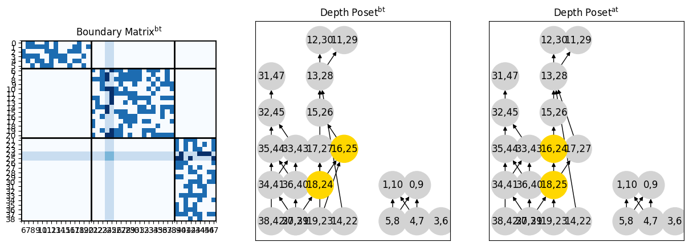

### Birth Death Pairs
|                          |                                                                                                                                                                                                                                   |
|:-------------------------|:----------------------------------------------------------------------------------------------------------------------------------------------------------------------------------------------------------------------------------|
| Before the transposition | $\{(14, 22), (31, 47), (17, 27), (36, 40), (37, 39), (11, 29), (15, 26), (16, 25), (35, 44), (32, 45), (3, 6), (12, 30), (19, 23), (13, 28), (18, 24), (33, 43), (20, 21), (4, 7), (38, 42), (5, 8), (0, 9), (34, 41), (1, 10)\}$ |
| After the transposition  | $\{(14, 22), (31, 47), (17, 27), (36, 40), (37, 39), (11, 29), (15, 26), (35, 44), (32, 45), (18, 25), (3, 6), (12, 30), (19, 23), (13, 28), (16, 24), (33, 43), (4, 7), (20, 21), (38, 42), (5, 8), (0, 9), (34, 41), (1, 10)\}$ |

### Relations
|                          | Algorithm 1                                                                                                                                                                                                                                                                                                                                                    | Algorithm 2                                                                                                                                                                                                                                                                                                                                                                                                                          |
|:-------------------------|:---------------------------------------------------------------------------------------------------------------------------------------------------------------------------------------------------------------------------------------------------------------------------------------------------------------------------------------------------------------|:-------------------------------------------------------------------------------------------------------------------------------------------------------------------------------------------------------------------------------------------------------------------------------------------------------------------------------------------------------------------------------------------------------------------------------------|
| Before the transposition | $\{(25, 29), (26, 30), (43, 46), (21, 25), (23, 25), (40, 47), (27, 28), (25, 28), (24, 26), (7, 10), (42, 44), (43, 45), (21, 24), (39, 41), (21, 27), (22, 28), (39, 44), (23, 27), (39, 47), (40, 46), (27, 30), (28, 29), (7, 9), (24, 25), (41, 47), (25, 30), (21, 26), (21, 29), (23, 26), (39, 40), (39, 46), (22, 30), (8, 10), (39, 43), (25, 26)\}$ | $\{(32, 31), (18, 17), (4, 0), (20, 17), (38, 35), (38, 32), (5, 1), (14, 13), (34, 31), (19, 12), (13, 11), (37, 36), (16, 13), (35, 32), (18, 13), (4, 2), (38, 31), (5, 0), (14, 12), (17, 11), (34, 33), (37, 35), (36, 33), (15, 13), (16, 12), (16, 15), (35, 31), (20, 12), (3, 2), (20, 18), (4, 1), (20, 15), (5, 2), (17, 13), (19, 16), (19, 13), (36, 35), (13, 12), (15, 12), (16, 11)\}$                               |
| After the transposition  | $\{(24, 30), (26, 30), (43, 46), (21, 25), (23, 25), (40, 47), (27, 28), (7, 10), (24, 29), (42, 44), (43, 45), (21, 24), (21, 27), (39, 41), (22, 28), (39, 44), (23, 27), (39, 47), (40, 46), (27, 30), (28, 29), (7, 9), (25, 24), (24, 28), (41, 47), (21, 26), (21, 29), (23, 26), (39, 40), (39, 46), (22, 30), (8, 10), (39, 43), (25, 26)\}$           | $\{(32, 31), (4, 0), (18, 17), (20, 17), (38, 35), (38, 32), (5, 1), (14, 13), (19, 12), (34, 31), (13, 11), (37, 36), (16, 13), (18, 16), (35, 32), (4, 2), (38, 31), (5, 0), (14, 12), (17, 11), (34, 33), (37, 35), (36, 33), (15, 13), (16, 12), (16, 15), (18, 12), (18, 15), (35, 31), (20, 12), (3, 2), (20, 18), (4, 1), (20, 15), (5, 2), (15, 12), (17, 13), (19, 16), (19, 13), (36, 35), (13, 12), (18, 11), (16, 11)\}$ |

### Successors and Predecessers
|                 | $\text{Set}^\text{bt}(16, 25)$                                                 | $\text{Set}^\text{bt}(18, 24)$                             | $\text{Set}^\text{at}(18, 25)$                                                           | $\text{Set}^\text{at}(16, 24)$                                                 |
|:----------------|:-------------------------------------------------------------------------------|:-----------------------------------------------------------|:-----------------------------------------------------------------------------------------|:-------------------------------------------------------------------------------|
| $\text{Succ}_1$ | $\text{Succ}_1^\text{bt}(16, 25) = \{(11, 29), (13, 28), (12, 30), (15, 26)\}$ | $\text{Succ}_1^\text{bt}(18, 24) = \{(16, 25), (15, 26)\}$ | $\text{Succ}_1^\text{at}(18, 25) = \{(16, 24), (15, 26)\}$                               | $\text{Succ}_1^\text{at}(16, 24) = \{(11, 29), (13, 28), (12, 30)\}$           |
| $\text{Pred}_1$ | $\text{Pred}_1^\text{bt}(16, 25) = \{(20, 21), (18, 24), (19, 23)\}$           | $\text{Pred}_1^\text{bt}(18, 24) = \{(20, 21)\}$           | $\text{Pred}_1^\text{at}(18, 25) = \{(20, 21), (19, 23)\}$                               | $\text{Pred}_1^\text{at}(16, 24) = \{(18, 25), (20, 21)\}$                     |
| $\text{Succ}_2$ | $\text{Succ}_2^\text{bt}(16, 25) = \{(11, 29), (13, 28), (12, 30), (15, 26)\}$ | $\text{Succ}_2^\text{bt}(18, 24) = \{(13, 28), (17, 27)\}$ | $\text{Succ}_2^\text{at}(18, 25) = \{(11, 29), (15, 26), (16, 24), (12, 30), (17, 27)\}$ | $\text{Succ}_2^\text{at}(16, 24) = \{(11, 29), (13, 28), (12, 30), (15, 26)\}$ |
| $\text{Pred}_2$ | $\text{Pred}_2^\text{bt}(16, 25) = \{(19, 23)\}$                               | $\text{Pred}_2^\text{bt}(18, 24) = \{(20, 21)\}$           | $\text{Pred}_2^\text{at}(18, 25) = \{(20, 21)\}$                                         | $\text{Pred}_2^\text{at}(16, 24) = \{(18, 25), (19, 23)\}$                     |

### Temp Sets
|                                                               | Before the Transposition                                                                                 | After the Transposition                                                                                  |
|:--------------------------------------------------------------|:---------------------------------------------------------------------------------------------------------|:---------------------------------------------------------------------------------------------------------|
| $\mathcal{B} = \{(s, t)\in \text{BD}:\; f(s) > f(x)\}$        | $\{(36, 40), (37, 39), (38, 42), (19, 23), (35, 44), (34, 41), (32, 45), (31, 47), (33, 43), (20, 21)\}$ | $\{(36, 40), (37, 39), (38, 42), (19, 23), (35, 44), (34, 41), (32, 45), (31, 47), (33, 43), (20, 21)\}$ |
| $\mathcal{N} = \{(s, t)\in \text{BD}:\; f(x) > f(s) > f(a)\}$ | $\{(17, 27)\}$                                                                                           | $\{(17, 27)\}$                                                                                           |

### Equations
There are 1 equations are wrong.

| eq   | left (formula)                  | left (paramatrized)               | left (value)                                           | right (formula)                                                                                          | right (paramatrized)                                                                                           | right (value)                                          | correct   |
|:-----|:--------------------------------|:----------------------------------|:-------------------------------------------------------|:---------------------------------------------------------------------------------------------------------|:---------------------------------------------------------------------------------------------------------------|:-------------------------------------------------------|:----------|
| Eq28 | $\text{Succ}_1^\text{at}(x, b)$ | $\text{Succ}_1^\text{at}(18, 25)$ | $\{(16, 24), (15, 26)\}$                               | $\text{Succ}_1^\text{bt}(x, y) \oplus \{(a, y), (a, b)\}$                                                | $\text{Succ}_1^\text{bt}(18, 24) \oplus \{(16, 24), (16, 25)\}$                                                | $\{(16, 24), (15, 26)\}$                               | ✔         |
| Eq29 | $\text{Succ}_1^\text{at}(a, y)$ | $\text{Succ}_1^\text{at}(16, 24)$ | $\{(11, 29), (13, 28), (12, 30)\}$                     | $\text{Succ}_1^\text{bt}(a, b)$                                                                          | $\text{Succ}_1^\text{bt}(16, 25)$                                                                              | $\{(11, 29), (13, 28), (12, 30), (15, 26)\}$           | ✘         |
| Eq30 | $\text{Pred}_1^\text{at}(x, b)$ | $\text{Pred}_1^\text{at}(18, 25)$ | $\{(20, 21), (19, 23)\}$                               | $[\text{Pred}_1^\text{bt}(a, b) \cap \mathcal{B}]$                                                       | $[\text{Pred}_1^\text{bt}(16, 25) \cap \mathcal{B}]$                                                           | $\{(19, 23), (20, 21)\}$                               | ✔         |
| Eq31 | $\text{Pred}_1^\text{at}(a, y)$ | $\text{Pred}_1^\text{at}(16, 24)$ | $\{(18, 25), (20, 21)\}$                               | $\text{Pred}_1^\text{bt}(x, y) \oplus \{(x, b)\} \oplus[\text{Pred}_1^\text{bt}(a, b) \cap \mathcal{N}]$ | $\text{Pred}_1^\text{bt}(18, 24) \oplus \{(18, 25)\} \oplus[\text{Pred}_1^\text{bt}(16, 25) \cap \mathcal{N}]$ | $\{(18, 25), (20, 21)\}$                               | ✔         |
| Eq32 | $\text{Succ}_2^\text{at}(x, b)$ | $\text{Succ}_2^\text{at}(18, 25)$ | $\{(11, 29), (15, 26), (16, 24), (12, 30), (17, 27)\}$ | $\text{Succ}_2^\text{bt}(x, y) \oplus \{(a, y)\} \oplus \text{Succ}_2^\text{bt}(a, b)$                   | $\text{Succ}_2^\text{bt}(18, 24) \oplus \{(16, 24)\} \oplus \text{Succ}_2^\text{bt}(16, 25)$                   | $\{(11, 29), (15, 26), (16, 24), (12, 30), (17, 27)\}$ | ✔         |
| Eq33 | $\text{Succ}_2^\text{at}(a, y)$ | $\text{Succ}_2^\text{at}(16, 24)$ | $\{(11, 29), (13, 28), (12, 30), (15, 26)\}$           | $\text{Succ}_2^\text{bt}(a, b)$                                                                          | $\text{Succ}_2^\text{bt}(16, 25)$                                                                              | $\{(11, 29), (13, 28), (12, 30), (15, 26)\}$           | ✔         |
| Eq34 | $\text{Pred}_2^\text{at}(x, b)$ | $\text{Pred}_2^\text{at}(18, 25)$ | $\{(20, 21)\}$                                         | $\text{Pred}_2^\text{bt}(x, y)$                                                                          | $\text{Pred}_2^\text{bt}(18, 24)$                                                                              | $\{(20, 21)\}$                                         | ✔         |
| Eq35 | $\text{Pred}_2^\text{at}(a, y)$ | $\text{Pred}_2^\text{at}(16, 24)$ | $\{(18, 25), (19, 23)\}$                               | $\text{Pred}_2^\text{bt}(a, b) \oplus \{(x, b)\}$                                                        | $\text{Pred}_2^\text{bt}(16, 25) \oplus \{(18, 25)\}$                                                          | $\{(18, 25), (19, 23)\}$                               | ✔         |

## Transposition <29, 30> in complex 2
Here is a __death-death__ __no switch__ transposition <29, 30>.

$$
a = 12, \; b = 30, \; x = 11, \; y = 29
$$

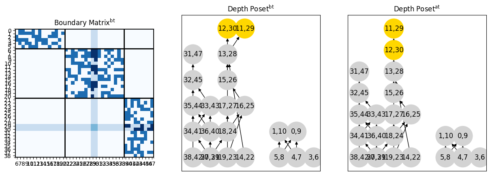

### Birth Death Pairs
|                          |                                                                                                                                                                                                                                   |
|:-------------------------|:----------------------------------------------------------------------------------------------------------------------------------------------------------------------------------------------------------------------------------|
| Before the transposition | $\{(14, 22), (31, 47), (17, 27), (36, 40), (37, 39), (11, 29), (15, 26), (16, 25), (35, 44), (32, 45), (3, 6), (12, 30), (19, 23), (13, 28), (18, 24), (33, 43), (20, 21), (4, 7), (38, 42), (5, 8), (0, 9), (34, 41), (1, 10)\}$ |
| After the transposition  | $\{(14, 22), (31, 47), (17, 27), (36, 40), (37, 39), (11, 29), (15, 26), (16, 25), (35, 44), (32, 45), (3, 6), (12, 30), (19, 23), (13, 28), (18, 24), (33, 43), (20, 21), (4, 7), (38, 42), (5, 8), (0, 9), (34, 41), (1, 10)\}$ |

### Relations
|                          | Algorithm 1                                                                                                                                                                                                                                                                                                                                                    | Algorithm 2                                                                                                                                                                                                                                                                                                                                                                                                      |
|:-------------------------|:---------------------------------------------------------------------------------------------------------------------------------------------------------------------------------------------------------------------------------------------------------------------------------------------------------------------------------------------------------------|:-----------------------------------------------------------------------------------------------------------------------------------------------------------------------------------------------------------------------------------------------------------------------------------------------------------------------------------------------------------------------------------------------------------------|
| Before the transposition | $\{(25, 29), (26, 30), (43, 46), (21, 25), (23, 25), (40, 47), (27, 28), (25, 28), (24, 26), (7, 10), (42, 44), (43, 45), (21, 24), (39, 41), (21, 27), (22, 28), (39, 44), (23, 27), (39, 47), (40, 46), (27, 30), (28, 29), (7, 9), (24, 25), (41, 47), (25, 30), (21, 26), (21, 29), (23, 26), (39, 40), (39, 46), (22, 30), (8, 10), (39, 43), (25, 26)\}$ | $\{(32, 31), (18, 17), (4, 0), (20, 17), (38, 35), (38, 32), (5, 1), (14, 13), (34, 31), (19, 12), (13, 11), (37, 36), (16, 13), (35, 32), (18, 13), (4, 2), (38, 31), (5, 0), (14, 12), (17, 11), (34, 33), (37, 35), (36, 33), (15, 13), (16, 12), (16, 15), (35, 31), (20, 12), (3, 2), (20, 18), (4, 1), (20, 15), (5, 2), (17, 13), (19, 16), (19, 13), (36, 35), (13, 12), (15, 12), (16, 11)\}$           |
| After the transposition  | $\{(25, 29), (26, 30), (43, 46), (21, 25), (23, 25), (40, 47), (27, 28), (25, 28), (24, 26), (7, 10), (42, 44), (43, 45), (21, 24), (21, 27), (39, 41), (22, 28), (39, 44), (23, 27), (39, 47), (40, 46), (27, 30), (28, 29), (7, 9), (24, 25), (41, 47), (25, 30), (21, 26), (21, 29), (23, 26), (22, 30), (39, 40), (39, 46), (8, 10), (39, 43), (25, 26)\}$ | $\{(32, 31), (4, 0), (18, 17), (20, 17), (38, 35), (38, 32), (5, 1), (14, 13), (19, 12), (34, 31), (13, 11), (37, 36), (16, 13), (35, 32), (18, 13), (4, 2), (38, 31), (5, 0), (14, 12), (17, 11), (34, 33), (37, 35), (36, 33), (15, 13), (16, 12), (16, 15), (35, 31), (20, 12), (3, 2), (20, 18), (4, 1), (20, 15), (5, 2), (12, 11), (17, 13), (19, 16), (19, 13), (36, 35), (13, 12), (15, 12), (16, 11)\}$ |

### Successors and Predecessers
No such node in the Depth Poset

### Temp Sets
|                                                               | Before the Transposition                                                                                                                                                       | After the Transposition                                                                                                                                                        |
|:--------------------------------------------------------------|:-------------------------------------------------------------------------------------------------------------------------------------------------------------------------------|:-------------------------------------------------------------------------------------------------------------------------------------------------------------------------------|
| $\mathcal{B} = \{(s, t)\in \text{BD}:\; f(s) > f(x)\}$        | $\{(36, 40), (37, 39), (38, 42), (19, 23), (15, 26), (18, 24), (16, 25), (33, 43), (20, 21), (35, 44), (34, 41), (32, 45), (14, 22), (13, 28), (31, 47), (12, 30), (17, 27)\}$ | $\{(36, 40), (37, 39), (38, 42), (19, 23), (15, 26), (18, 24), (16, 25), (33, 43), (20, 21), (35, 44), (34, 41), (32, 45), (14, 22), (13, 28), (31, 47), (12, 30), (17, 27)\}$ |
| $\mathcal{N} = \{(s, t)\in \text{BD}:\; f(x) > f(s) > f(a)\}$ | $\emptyset$                                                                                                                                                                    | $\emptyset$                                                                                                                                                                    |

### Equations
There are 2 equations are wrong.

| eq   | left (formula)                  | left (paramatrized)               | left (value)                                                     | right (formula)                                                                        | right (paramatrized)                                                                         | right (value)                                                              | correct   |
|:-----|:--------------------------------|:----------------------------------|:-----------------------------------------------------------------|:---------------------------------------------------------------------------------------|:---------------------------------------------------------------------------------------------|:---------------------------------------------------------------------------|:----------|
| Eq36 | $\text{Succ}_2^\text{at}(x, y)$ | $\text{Succ}_2^\text{at}(11, 29)$ | $\emptyset$                                                      | $\text{Succ}_2^\text{bt}(x, y) \oplus \{(a, b)\} \oplus \text{Succ}_2^\text{bt}(a, b)$ | $\text{Succ}_2^\text{bt}(11, 29) \oplus \{(12, 30)\} \oplus \text{Succ}_2^\text{bt}(12, 30)$ | $\{(12, 30)\}$                                                             | ✘         |
| Eq37 | $\text{Pred}_2^\text{at}(a, b)$ | $\text{Pred}_2^\text{at}(12, 30)$ | $\{(19, 23), (15, 26), (16, 25), (13, 28), (14, 22), (20, 21)\}$ | $\text{Pred}_2^\text{bt}(a, b) \oplus \{(x, y)\}$                                      | $\text{Pred}_2^\text{bt}(12, 30) \oplus \{(11, 29)\}$                                        | $\{(19, 23), (11, 29), (15, 26), (16, 25), (13, 28), (14, 22), (20, 21)\}$ | ✘         |

## Transposition <30, 31> in complex 2
Here is a __birth-death__ __switch forward__ transposition <30, 31>.

$$
a = 12, \; b = 30, \; x = 31, \; y = 47
$$

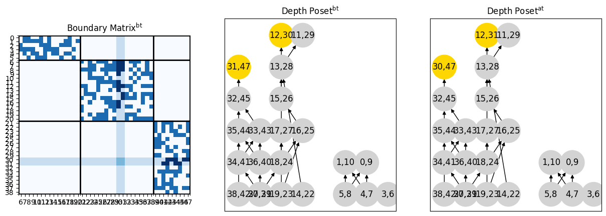

### Birth Death Pairs
|                          |                                                                                                                                                                                                                                   |
|:-------------------------|:----------------------------------------------------------------------------------------------------------------------------------------------------------------------------------------------------------------------------------|
| Before the transposition | $\{(14, 22), (31, 47), (17, 27), (36, 40), (37, 39), (11, 29), (15, 26), (16, 25), (35, 44), (32, 45), (3, 6), (12, 30), (19, 23), (13, 28), (18, 24), (33, 43), (20, 21), (4, 7), (38, 42), (5, 8), (0, 9), (34, 41), (1, 10)\}$ |
| After the transposition  | $\{(14, 22), (12, 31), (17, 27), (36, 40), (37, 39), (11, 29), (15, 26), (16, 25), (35, 44), (32, 45), (3, 6), (19, 23), (13, 28), (30, 47), (18, 24), (33, 43), (20, 21), (4, 7), (38, 42), (5, 8), (0, 9), (34, 41), (1, 10)\}$ |

### Relations
|                          | Algorithm 1                                                                                                                                                                                                                                                                                                                                                    | Algorithm 2                                                                                                                                                                                                                                                                                                                                                                                            |
|:-------------------------|:---------------------------------------------------------------------------------------------------------------------------------------------------------------------------------------------------------------------------------------------------------------------------------------------------------------------------------------------------------------|:-------------------------------------------------------------------------------------------------------------------------------------------------------------------------------------------------------------------------------------------------------------------------------------------------------------------------------------------------------------------------------------------------------|
| Before the transposition | $\{(25, 29), (26, 30), (43, 46), (21, 25), (23, 25), (40, 47), (27, 28), (25, 28), (24, 26), (7, 10), (42, 44), (43, 45), (21, 24), (39, 41), (21, 27), (22, 28), (39, 44), (23, 27), (39, 47), (40, 46), (27, 30), (28, 29), (7, 9), (24, 25), (41, 47), (25, 30), (21, 26), (21, 29), (23, 26), (39, 40), (39, 46), (22, 30), (8, 10), (39, 43), (25, 26)\}$ | $\{(32, 31), (18, 17), (4, 0), (20, 17), (38, 35), (38, 32), (5, 1), (14, 13), (34, 31), (19, 12), (13, 11), (37, 36), (16, 13), (35, 32), (18, 13), (4, 2), (38, 31), (5, 0), (14, 12), (17, 11), (34, 33), (37, 35), (36, 33), (15, 13), (16, 12), (16, 15), (35, 31), (20, 12), (3, 2), (20, 18), (4, 1), (20, 15), (5, 2), (17, 13), (19, 16), (19, 13), (36, 35), (13, 12), (15, 12), (16, 11)\}$ |
| After the transposition  | $\{(25, 29), (43, 46), (21, 25), (23, 25), (40, 47), (27, 28), (25, 28), (24, 26), (7, 10), (42, 44), (43, 45), (21, 24), (21, 27), (39, 41), (22, 28), (39, 44), (23, 27), (22, 31), (39, 47), (40, 46), (28, 29), (7, 9), (24, 25), (41, 47), (26, 31), (21, 26), (21, 29), (23, 26), (39, 40), (39, 46), (8, 10), (39, 43), (25, 26)\}$                     | $\{(35, 30), (4, 0), (18, 17), (20, 17), (38, 35), (38, 32), (5, 1), (14, 13), (19, 12), (13, 11), (37, 36), (32, 30), (16, 13), (35, 32), (18, 13), (4, 2), (5, 0), (14, 12), (17, 11), (34, 33), (37, 35), (36, 33), (15, 13), (16, 12), (16, 15), (38, 30), (20, 12), (3, 2), (20, 18), (4, 1), (20, 15), (5, 2), (15, 12), (17, 13), (19, 16), (19, 13), (36, 35), (13, 12), (33, 30), (16, 11)\}$ |

### Successors and Predecessers
|                 | $\text{Set}^\text{bt}(12, 30)$                                                                     | $\text{Set}^\text{bt}(31, 47)$                                                 | $\text{Set}^\text{at}(12, 31)$                                                                     | $\text{Set}^\text{at}(30, 47)$                                                 |
|:----------------|:---------------------------------------------------------------------------------------------------|:-------------------------------------------------------------------------------|:---------------------------------------------------------------------------------------------------|:-------------------------------------------------------------------------------|
| $\text{Succ}_1$ | $\text{Succ}_1^\text{bt}(12, 30) = \emptyset$                                                      | $\text{Succ}_1^\text{bt}(31, 47) = \emptyset$                                  | $\text{Succ}_1^\text{at}(12, 31) = \emptyset$                                                      | $\text{Succ}_1^\text{at}(30, 47) = \emptyset$                                  |
| $\text{Pred}_1$ | $\text{Pred}_1^\text{bt}(12, 30) = \{(16, 25), (17, 27), (14, 22), (15, 26)\}$                     | $\text{Pred}_1^\text{bt}(31, 47) = \{(36, 40), (37, 39), (34, 41)\}$           | $\text{Pred}_1^\text{at}(12, 31) = \{(14, 22), (15, 26)\}$                                         | $\text{Pred}_1^\text{at}(30, 47) = \{(36, 40), (37, 39), (34, 41)\}$           |
| $\text{Succ}_2$ | $\text{Succ}_2^\text{bt}(12, 30) = \emptyset$                                                      | $\text{Succ}_2^\text{bt}(31, 47) = \emptyset$                                  | $\text{Succ}_2^\text{at}(12, 31) = \emptyset$                                                      | $\text{Succ}_2^\text{at}(30, 47) = \emptyset$                                  |
| $\text{Pred}_2$ | $\text{Pred}_2^\text{bt}(12, 30) = \{(19, 23), (15, 26), (16, 25), (13, 28), (14, 22), (20, 21)\}$ | $\text{Pred}_2^\text{bt}(31, 47) = \{(38, 42), (35, 44), (34, 41), (32, 45)\}$ | $\text{Pred}_2^\text{at}(12, 31) = \{(19, 23), (15, 26), (16, 25), (13, 28), (14, 22), (20, 21)\}$ | $\text{Pred}_2^\text{at}(30, 47) = \{(38, 42), (35, 44), (33, 43), (32, 45)\}$ |

### Temp Sets
|                                                              | Before the Transposition                                                             | After the Transposition                                                              |
|:-------------------------------------------------------------|:-------------------------------------------------------------------------------------|:-------------------------------------------------------------------------------------|
| $A_1 = \{(s, t)\in \text{BD}:\; f(a) < f(s) < f(t) < f(x)\}$ | $\{(17, 27), (19, 23), (15, 26), (16, 25), (13, 28), (14, 22), (18, 24), (20, 21)\}$ | $\{(17, 27), (19, 23), (15, 26), (16, 25), (13, 28), (14, 22), (18, 24), (20, 21)\}$ |
| $B_1 = \{(s, t)\in \text{BD}:\; U_1[t, x] = 1\}$             | $\emptyset$                                                                          | $\{(14, 22), (15, 26)\}$                                                             |
| $A_2 = \{(s, t)\in \text{BD}:\; f(b) < f(s) < f(t) < f(y)\}$ | $\{(36, 40), (37, 39), (38, 42), (35, 44), (34, 41), (32, 45), (33, 43)\}$           | $\{(36, 40), (37, 39), (38, 42), (35, 44), (34, 41), (32, 45), (33, 43)\}$           |
| $B_2 = \{(s, t)\in \text{BD}:\; U_2[b, s] = 1\}$             | $\emptyset$                                                                          | $\{(38, 42), (35, 44), (33, 43), (32, 45)\}$                                         |

### Equations
There are 4 equations are wrong.

| eq    | left (formula)                  | left (paramatrized)               | left (value)                                                     | right (formula)                                      | right (paramatrized)                                  | right (value)                                                    | correct   |
|:------|:--------------------------------|:----------------------------------|:-----------------------------------------------------------------|:-----------------------------------------------------|:------------------------------------------------------|:-----------------------------------------------------------------|:----------|
| Eq48  | $\text{Succ}_1^\text{at}(a, x)$ | $\text{Succ}_1^\text{at}(12, 31)$ | $\emptyset$                                                      | $\text{Succ}_1^\text{bt}(a, b)$                      | $\text{Succ}_1^\text{bt}(12, 30)$                     | $\emptyset$                                                      | ✔         |
| Eq49  | $\text{Succ}_1^\text{at}(b, y)$ | $\text{Succ}_1^\text{at}(30, 47)$ | $\emptyset$                                                      | $\text{Succ}_1^\text{bt}(x, y)$                      | $\text{Succ}_1^\text{bt}(31, 47)$                     | $\emptyset$                                                      | ✔         |
| Eq50  | $\text{Pred}_1^\text{at}(a, x)$ | $\text{Pred}_1^\text{at}(12, 31)$ | $\{(14, 22), (15, 26)\}$                                         | $\{(s, t)\in \text{BD}:\; U_1^\text{bt}[t, x] = 1\}$ | $\{(s, t)\in \text{BD}:\; U_1^\text{bt}[t, 31] = 1\}$ | $\emptyset$                                                      | ✘         |
| Eq50a | $\text{Pred}_1^\text{at}(a, x)$ | $\text{Pred}_1^\text{at}(12, 31)$ | $\{(14, 22), (15, 26)\}$                                         | $A_1^\text{bt} \cap B_1^\text{bt}$                   | $A_1^\text{bt} \cap B_1^\text{bt}$                    | $\emptyset$                                                      | ✘         |
| Eq50b | $\text{Pred}_1^\text{at}(a, x)$ | $\text{Pred}_1^\text{at}(12, 31)$ | $\{(14, 22), (15, 26)\}$                                         | $A_1^\text{bt} \cap B_1^\text{at}$                   | $A_1^\text{bt} \cap B_1^\text{at}$                    | $\{(14, 22), (15, 26)\}$                                         | ✔         |
| Eq51  | $\text{Pred}_1^\text{at}(b, y)$ | $\text{Pred}_1^\text{at}(30, 47)$ | $\{(36, 40), (37, 39), (34, 41)\}$                               | $\text{Pred}_1^\text{bt}(x, y)$                      | $\text{Pred}_1^\text{bt}(31, 47)$                     | $\{(36, 40), (37, 39), (34, 41)\}$                               | ✔         |
| Eq52  | $\text{Succ}_2^\text{at}(a, x)$ | $\text{Succ}_2^\text{at}(12, 31)$ | $\emptyset$                                                      | $\text{Succ}_2^\text{bt}(a, b)$                      | $\text{Succ}_2^\text{bt}(12, 30)$                     | $\emptyset$                                                      | ✔         |
| Eq53  | $\text{Succ}_2^\text{at}(b, y)$ | $\text{Succ}_2^\text{at}(30, 47)$ | $\emptyset$                                                      | $\text{Succ}_2^\text{bt}(x, y)$                      | $\text{Succ}_2^\text{bt}(31, 47)$                     | $\emptyset$                                                      | ✔         |
| Eq54  | $\text{Pred}_2^\text{at}(a, x)$ | $\text{Pred}_2^\text{at}(12, 31)$ | $\{(19, 23), (15, 26), (16, 25), (13, 28), (14, 22), (20, 21)\}$ | $\text{Pred}_2^\text{bt}(a, b)$                      | $\text{Pred}_2^\text{bt}(12, 30)$                     | $\{(19, 23), (15, 26), (16, 25), (13, 28), (14, 22), (20, 21)\}$ | ✔         |
| Eq55  | $\text{Pred}_2^\text{at}(b, y)$ | $\text{Pred}_2^\text{at}(30, 47)$ | $\{(38, 42), (35, 44), (33, 43), (32, 45)\}$                     | $\{(s, t)\in \text{BD}:\; U_2^\text{bt}[b, s] = 1\}$ | $\{(s, t)\in \text{BD}:\; U_2^\text{bt}[30, s] = 1\}$ | $\emptyset$                                                      | ✘         |
| Eq55a | $\text{Pred}_2^\text{at}(b, y)$ | $\text{Pred}_2^\text{at}(30, 47)$ | $\{(38, 42), (35, 44), (33, 43), (32, 45)\}$                     | $A_2^\text{bt} \cap B_2^\text{bt}$                   | $A_2^\text{bt} \cap B_2^\text{bt}$                    | $\emptyset$                                                      | ✘         |
| Eq55b | $\text{Pred}_2^\text{at}(b, y)$ | $\text{Pred}_2^\text{at}(30, 47)$ | $\{(38, 42), (35, 44), (33, 43), (32, 45)\}$                     | $A_2^\text{bt} \cap B_2^\text{at}$                   | $A_2^\text{bt} \cap B_2^\text{at}$                    | $\{(38, 42), (35, 44), (33, 43), (32, 45)\}$                     | ✔         |

## Transposition <33, 34> in complex 2
Here is a __birth-birth__ __switch forward__ transposition <33, 34>.

$$
a = 33, \; b = 43, \; x = 34, \; y = 41
$$

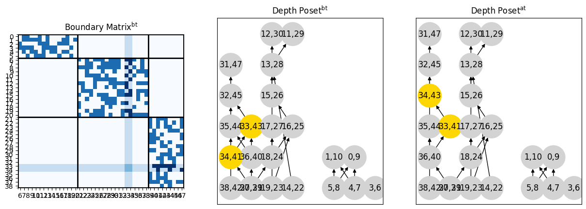

### Birth Death Pairs
|                          |                                                                                                                                                                                                                                   |
|:-------------------------|:----------------------------------------------------------------------------------------------------------------------------------------------------------------------------------------------------------------------------------|
| Before the transposition | $\{(14, 22), (31, 47), (17, 27), (36, 40), (37, 39), (11, 29), (15, 26), (16, 25), (35, 44), (32, 45), (3, 6), (12, 30), (19, 23), (13, 28), (18, 24), (33, 43), (20, 21), (4, 7), (38, 42), (5, 8), (0, 9), (34, 41), (1, 10)\}$ |
| After the transposition  | $\{(14, 22), (31, 47), (17, 27), (34, 43), (36, 40), (37, 39), (11, 29), (15, 26), (16, 25), (33, 41), (35, 44), (32, 45), (3, 6), (12, 30), (19, 23), (13, 28), (18, 24), (4, 7), (20, 21), (38, 42), (5, 8), (0, 9), (1, 10)\}$ |

### Relations
|                          | Algorithm 1                                                                                                                                                                                                                                                                                                                                                                                  | Algorithm 2                                                                                                                                                                                                                                                                                                                                                                                                      |
|:-------------------------|:---------------------------------------------------------------------------------------------------------------------------------------------------------------------------------------------------------------------------------------------------------------------------------------------------------------------------------------------------------------------------------------------|:-----------------------------------------------------------------------------------------------------------------------------------------------------------------------------------------------------------------------------------------------------------------------------------------------------------------------------------------------------------------------------------------------------------------|
| Before the transposition | $\{(25, 29), (26, 30), (43, 46), (21, 25), (23, 25), (40, 47), (27, 28), (25, 28), (24, 26), (7, 10), (42, 44), (43, 45), (21, 24), (39, 41), (21, 27), (22, 28), (39, 44), (23, 27), (39, 47), (40, 46), (27, 30), (28, 29), (7, 9), (24, 25), (41, 47), (25, 30), (21, 26), (21, 29), (23, 26), (39, 40), (39, 46), (22, 30), (8, 10), (39, 43), (25, 26)\}$                               | $\{(32, 31), (18, 17), (4, 0), (20, 17), (38, 35), (38, 32), (5, 1), (14, 13), (34, 31), (19, 12), (13, 11), (37, 36), (16, 13), (35, 32), (18, 13), (4, 2), (38, 31), (5, 0), (14, 12), (17, 11), (34, 33), (37, 35), (36, 33), (15, 13), (16, 12), (16, 15), (35, 31), (20, 12), (3, 2), (20, 18), (4, 1), (20, 15), (5, 2), (17, 13), (19, 16), (19, 13), (36, 35), (13, 12), (15, 12), (16, 11)\}$           |
| After the transposition  | $\{(25, 29), (41, 43), (26, 30), (43, 46), (41, 46), (21, 25), (23, 25), (40, 47), (27, 28), (25, 28), (24, 26), (7, 10), (41, 45), (42, 44), (43, 45), (21, 24), (21, 27), (39, 41), (22, 28), (39, 44), (23, 27), (39, 47), (40, 46), (27, 30), (28, 29), (7, 9), (24, 25), (41, 47), (25, 30), (21, 26), (21, 29), (23, 26), (39, 40), (39, 46), (22, 30), (8, 10), (39, 43), (25, 26)\}$ | $\{(32, 31), (4, 0), (18, 17), (20, 17), (38, 35), (38, 32), (5, 1), (14, 13), (19, 12), (34, 31), (13, 11), (37, 36), (16, 13), (35, 32), (18, 13), (4, 2), (38, 31), (5, 0), (14, 12), (17, 11), (37, 35), (36, 33), (15, 13), (16, 12), (16, 15), (33, 31), (33, 34), (35, 31), (20, 12), (3, 2), (20, 18), (4, 1), (20, 15), (5, 2), (17, 13), (19, 16), (19, 13), (36, 35), (13, 12), (15, 12), (16, 11)\}$ |

### Successors and Predecessers
|                 | $\text{Set}^\text{bt}(33, 43)$                             | $\text{Set}^\text{bt}(34, 41)$                             | $\text{Set}^\text{at}(33, 41)$                                       | $\text{Set}^\text{at}(34, 43)$                             |
|:----------------|:-----------------------------------------------------------|:-----------------------------------------------------------|:---------------------------------------------------------------------|:-----------------------------------------------------------|
| $\text{Succ}_1$ | $\text{Succ}_1^\text{bt}(33, 43) = \{(32, 45)\}$           | $\text{Succ}_1^\text{bt}(34, 41) = \{(31, 47)\}$           | $\text{Succ}_1^\text{at}(33, 41) = \{(34, 43), (32, 45), (31, 47)\}$ | $\text{Succ}_1^\text{at}(34, 43) = \{(32, 45)\}$           |
| $\text{Pred}_1$ | $\text{Pred}_1^\text{bt}(33, 43) = \{(37, 39)\}$           | $\text{Pred}_1^\text{bt}(34, 41) = \{(37, 39)\}$           | $\text{Pred}_1^\text{at}(33, 41) = \{(37, 39)\}$                     | $\text{Pred}_1^\text{at}(34, 43) = \{(33, 41), (37, 39)\}$ |
| $\text{Succ}_2$ | $\text{Succ}_2^\text{bt}(33, 43) = \emptyset$              | $\text{Succ}_2^\text{bt}(34, 41) = \{(31, 47), (33, 43)\}$ | $\text{Succ}_2^\text{at}(33, 41) = \{(34, 43), (31, 47)\}$           | $\text{Succ}_2^\text{at}(34, 43) = \{(31, 47)\}$           |
| $\text{Pred}_2$ | $\text{Pred}_2^\text{bt}(33, 43) = \{(36, 40), (34, 41)\}$ | $\text{Pred}_2^\text{bt}(34, 41) = \emptyset$              | $\text{Pred}_2^\text{at}(33, 41) = \{(36, 40)\}$                     | $\text{Pred}_2^\text{at}(34, 43) = \{(33, 41)\}$           |

### Temp Sets
|                                                               | Before the Transposition                                                                                                                                              | After the Transposition                                                                                                                                               |
|:--------------------------------------------------------------|:----------------------------------------------------------------------------------------------------------------------------------------------------------------------|:----------------------------------------------------------------------------------------------------------------------------------------------------------------------|
| $\mathcal{L} = \{(s, t)\in \text{BD}:\; f(t) < f(y)\}$        | $\{(36, 40), (37, 39), (19, 23), (11, 29), (5, 8), (0, 9), (15, 26), (4, 7), (16, 25), (18, 24), (20, 21), (13, 28), (14, 22), (3, 6), (1, 10), (12, 30), (17, 27)\}$ | $\{(36, 40), (37, 39), (19, 23), (11, 29), (5, 8), (0, 9), (15, 26), (4, 7), (16, 25), (18, 24), (20, 21), (13, 28), (14, 22), (3, 6), (1, 10), (12, 30), (17, 27)\}$ |
| $\mathcal{M} = \{(s, t)\in \text{BD}:\; f(y) < f(t) < f(b)\}$ | $\{(38, 42)\}$                                                                                                                                                        | $\{(38, 42)\}$                                                                                                                                                        |

### Equations
There are 1 equations are wrong.

| eq   | left (formula)                  | left (paramatrized)               | left (value)                       | right (formula)                                                                                           | right (paramatrized)                                                                                            | right (value)                      | correct   |
|:-----|:--------------------------------|:----------------------------------|:-----------------------------------|:----------------------------------------------------------------------------------------------------------|:----------------------------------------------------------------------------------------------------------------|:-----------------------------------|:----------|
| Eq08 | $\text{Succ}_1^\text{at}(a, y)$ | $\text{Succ}_1^\text{at}(33, 41)$ | $\{(34, 43), (32, 45), (31, 47)\}$ | $\text{Succ}_1^\text{bt}(x, y) \oplus \{(x, b)\} \oplus \text{Succ}_1^\text{bt}(a, b)$                    | $\text{Succ}_1^\text{bt}(34, 41) \oplus \{(34, 43)\} \oplus \text{Succ}_1^\text{bt}(33, 43)$                    | $\{(34, 43), (32, 45), (31, 47)\}$ | ✔         |
| Eq09 | $\text{Succ}_1^\text{at}(x, b)$ | $\text{Succ}_1^\text{at}(34, 43)$ | $\{(32, 45)\}$                     | $\text{Succ}_1^\text{bt}(a, b)$                                                                           | $\text{Succ}_1^\text{bt}(33, 43)$                                                                               | $\{(32, 45)\}$                     | ✔         |
| Eq10 | $\text{Pred}_1^\text{at}(a, y)$ | $\text{Pred}_1^\text{at}(33, 41)$ | $\{(37, 39)\}$                     | $\text{Pred}_1^\text{bt}(x, y)$                                                                           | $\text{Pred}_1^\text{bt}(34, 41)$                                                                               | $\{(37, 39)\}$                     | ✔         |
| Eq11 | $\text{Pred}_1^\text{at}(x, b)$ | $\text{Pred}_1^\text{at}(34, 43)$ | $\{(33, 41), (37, 39)\}$           | $\text{Pred}_1^\text{bt}(a, b) \oplus \{(a, y)\}$                                                         | $\text{Pred}_1^\text{bt}(33, 43) \oplus \{(33, 41)\}$                                                           | $\{(33, 41), (37, 39)\}$           | ✔         |
| Eq12 | $\text{Succ}_2^\text{at}(a, y)$ | $\text{Succ}_2^\text{at}(33, 41)$ | $\{(34, 43), (31, 47)\}$           | $\text{Succ}_2^\text{bt}(x, y) \oplus \{(x, b), (a, b)\}$                                                 | $\text{Succ}_2^\text{bt}(34, 41) \oplus \{(34, 43), (33, 43)\}$                                                 | $\{(34, 43), (31, 47)\}$           | ✔         |
| Eq13 | $\text{Succ}_2^\text{at}(x, b)$ | $\text{Succ}_2^\text{at}(34, 43)$ | $\{(31, 47)\}$                     | $\text{Succ}_2^\text{bt}(a, b)$                                                                           | $\text{Succ}_2^\text{bt}(33, 43)$                                                                               | $\emptyset$                        | ✘         |
| Eq14 | $\text{Pred}_2^\text{at}(a, y)$ | $\text{Pred}_2^\text{at}(33, 41)$ | $\{(36, 40)\}$                     | $[\text{Pred}_2^\text{bt}(a, b) \cap \mathcal{L}]$                                                        | $[\text{Pred}_2^\text{bt}(33, 43) \cap \mathcal{L}]$                                                            | $\{(36, 40)\}$                     | ✔         |
| Eq15 | $\text{Pred}_2^\text{at}(x, b)$ | $\text{Pred}_2^\text{at}(34, 43)$ | $\{(33, 41)\}$                     | $\text{Pred}_2^\text{bt}(x, y) \oplus \{(a, y)\} \oplus [\text{Pred}_2^\text{bt}(a, b) \cap \mathcal{M}]$ | $\text{Pred}_2^\text{bt}(34, 41) \oplus \{(33, 41)\} \oplus [\text{Pred}_2^\text{bt}(33, 43) \cap \mathcal{M}]$ | $\{(33, 41)\}$                     | ✔         |

## Transposition <34, 35> in complex 2
Here is a __birth-birth__ __no switch__ transposition <34, 35>.

$$
a = 34, \; b = 41, \; x = 35, \; y = 44
$$

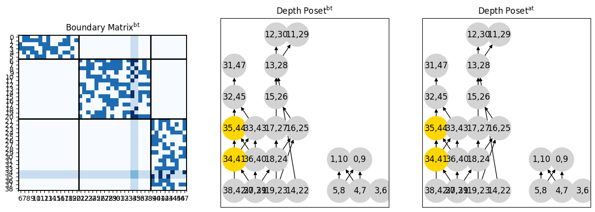

### Birth Death Pairs
|                          |                                                                                                                                                                                                                                   |
|:-------------------------|:----------------------------------------------------------------------------------------------------------------------------------------------------------------------------------------------------------------------------------|
| Before the transposition | $\{(14, 22), (31, 47), (17, 27), (36, 40), (37, 39), (11, 29), (15, 26), (16, 25), (35, 44), (32, 45), (3, 6), (12, 30), (19, 23), (13, 28), (18, 24), (33, 43), (20, 21), (4, 7), (38, 42), (5, 8), (0, 9), (34, 41), (1, 10)\}$ |
| After the transposition  | $\{(14, 22), (31, 47), (17, 27), (36, 40), (37, 39), (11, 29), (15, 26), (16, 25), (35, 44), (32, 45), (3, 6), (12, 30), (19, 23), (13, 28), (18, 24), (33, 43), (20, 21), (4, 7), (38, 42), (5, 8), (0, 9), (34, 41), (1, 10)\}$ |

### Relations
|                          | Algorithm 1                                                                                                                                                                                                                                                                                                                                                              | Algorithm 2                                                                                                                                                                                                                                                                                                                                                                                            |
|:-------------------------|:-------------------------------------------------------------------------------------------------------------------------------------------------------------------------------------------------------------------------------------------------------------------------------------------------------------------------------------------------------------------------|:-------------------------------------------------------------------------------------------------------------------------------------------------------------------------------------------------------------------------------------------------------------------------------------------------------------------------------------------------------------------------------------------------------|
| Before the transposition | $\{(25, 29), (26, 30), (43, 46), (21, 25), (23, 25), (40, 47), (27, 28), (25, 28), (24, 26), (7, 10), (42, 44), (43, 45), (21, 24), (39, 41), (21, 27), (22, 28), (39, 44), (23, 27), (39, 47), (40, 46), (27, 30), (28, 29), (7, 9), (24, 25), (41, 47), (25, 30), (21, 26), (21, 29), (23, 26), (39, 40), (39, 46), (22, 30), (8, 10), (39, 43), (25, 26)\}$           | $\{(32, 31), (18, 17), (4, 0), (20, 17), (38, 35), (38, 32), (5, 1), (14, 13), (34, 31), (19, 12), (13, 11), (37, 36), (16, 13), (35, 32), (18, 13), (4, 2), (38, 31), (5, 0), (14, 12), (17, 11), (34, 33), (37, 35), (36, 33), (15, 13), (16, 12), (16, 15), (35, 31), (20, 12), (3, 2), (20, 18), (4, 1), (20, 15), (5, 2), (17, 13), (19, 16), (19, 13), (36, 35), (13, 12), (15, 12), (16, 11)\}$ |
| After the transposition  | $\{(25, 29), (26, 30), (43, 46), (21, 25), (23, 25), (40, 47), (27, 28), (25, 28), (24, 26), (7, 10), (42, 44), (43, 45), (21, 24), (21, 27), (39, 41), (22, 28), (39, 44), (23, 27), (39, 47), (40, 46), (27, 30), (28, 29), (7, 9), (24, 25), (41, 44), (41, 47), (25, 30), (21, 26), (21, 29), (23, 26), (39, 40), (39, 46), (22, 30), (8, 10), (39, 43), (25, 26)\}$ | $\{(32, 31), (4, 0), (18, 17), (20, 17), (38, 35), (38, 32), (5, 1), (14, 13), (19, 12), (34, 31), (13, 11), (37, 36), (16, 13), (35, 32), (18, 13), (4, 2), (38, 31), (5, 0), (14, 12), (17, 11), (34, 33), (37, 35), (36, 33), (15, 13), (16, 12), (16, 15), (35, 31), (20, 12), (3, 2), (20, 18), (4, 1), (20, 15), (5, 2), (17, 13), (19, 16), (19, 13), (36, 35), (13, 12), (15, 12), (16, 11)\}$ |

### Successors and Predecessers
No such node in the Depth Poset

### Temp Sets
|                                                               | Before the Transposition                                                                                                                                                                            | After the Transposition                                                                                                                                                                             |
|:--------------------------------------------------------------|:----------------------------------------------------------------------------------------------------------------------------------------------------------------------------------------------------|:----------------------------------------------------------------------------------------------------------------------------------------------------------------------------------------------------|
| $\mathcal{L} = \{(s, t)\in \text{BD}:\; f(t) < f(y)\}$        | $\{(14, 22), (17, 27), (36, 40), (37, 39), (11, 29), (15, 26), (16, 25), (3, 6), (12, 30), (19, 23), (13, 28), (18, 24), (4, 7), (33, 43), (20, 21), (38, 42), (5, 8), (0, 9), (34, 41), (1, 10)\}$ | $\{(14, 22), (17, 27), (36, 40), (37, 39), (11, 29), (15, 26), (16, 25), (3, 6), (12, 30), (19, 23), (13, 28), (18, 24), (4, 7), (33, 43), (20, 21), (38, 42), (5, 8), (0, 9), (34, 41), (1, 10)\}$ |
| $\mathcal{M} = \{(s, t)\in \text{BD}:\; f(y) < f(t) < f(b)\}$ | $\emptyset$                                                                                                                                                                                         | $\emptyset$                                                                                                                                                                                         |

### Equations
There are 2 equations are wrong.

| eq   | left (formula)                  | left (paramatrized)               | left (value)   | right (formula)                                                                        | right (paramatrized)                                                                         | right (value)            | correct   |
|:-----|:--------------------------------|:----------------------------------|:---------------|:---------------------------------------------------------------------------------------|:---------------------------------------------------------------------------------------------|:-------------------------|:----------|
| Eq16 | $\text{Succ}_1^\text{at}(x, y)$ | $\text{Succ}_1^\text{at}(35, 44)$ | $\emptyset$    | $\text{Succ}_1^\text{bt}(x, y) \oplus \{(a, b)\} \oplus \text{Succ}_1^\text{bt}(a, b)$ | $\text{Succ}_1^\text{bt}(35, 44) \oplus \{(34, 41)\} \oplus \text{Succ}_1^\text{bt}(34, 41)$ | $\{(31, 47), (34, 41)\}$ | ✘         |
| Eq17 | $\text{Pred}_1^\text{at}(a, b)$ | $\text{Pred}_1^\text{at}(34, 41)$ | $\{(37, 39)\}$ | $\text{Pred}_1^\text{bt}(a, b) \oplus \{(x, y)\}$                                      | $\text{Pred}_1^\text{bt}(34, 41) \oplus \{(35, 44)\}$                                        | $\{(37, 39), (35, 44)\}$ | ✘         |

## Transposition <43, 44> in complex 2
Here is a __death-death__ __no switch__ transposition <43, 44>.

$$
a = 35, \; b = 44, \; x = 33, \; y = 43
$$

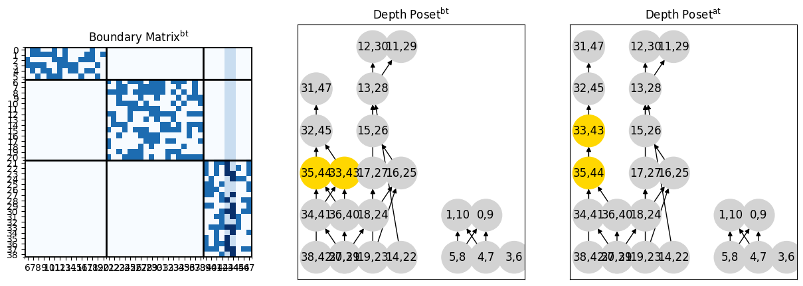

### Birth Death Pairs
|                          |                                                                                                                                                                                                                                   |
|:-------------------------|:----------------------------------------------------------------------------------------------------------------------------------------------------------------------------------------------------------------------------------|
| Before the transposition | $\{(14, 22), (31, 47), (17, 27), (36, 40), (37, 39), (11, 29), (15, 26), (16, 25), (35, 44), (32, 45), (3, 6), (12, 30), (19, 23), (13, 28), (18, 24), (33, 43), (20, 21), (4, 7), (38, 42), (5, 8), (0, 9), (34, 41), (1, 10)\}$ |
| After the transposition  | $\{(14, 22), (31, 47), (17, 27), (36, 40), (37, 39), (11, 29), (15, 26), (16, 25), (35, 44), (32, 45), (3, 6), (12, 30), (19, 23), (13, 28), (18, 24), (33, 43), (20, 21), (4, 7), (38, 42), (5, 8), (0, 9), (34, 41), (1, 10)\}$ |

### Relations
|                          | Algorithm 1                                                                                                                                                                                                                                                                                                                                                    | Algorithm 2                                                                                                                                                                                                                                                                                                                                                                                                      |
|:-------------------------|:---------------------------------------------------------------------------------------------------------------------------------------------------------------------------------------------------------------------------------------------------------------------------------------------------------------------------------------------------------------|:-----------------------------------------------------------------------------------------------------------------------------------------------------------------------------------------------------------------------------------------------------------------------------------------------------------------------------------------------------------------------------------------------------------------|
| Before the transposition | $\{(25, 29), (26, 30), (43, 46), (21, 25), (23, 25), (40, 47), (27, 28), (25, 28), (24, 26), (7, 10), (42, 44), (43, 45), (21, 24), (39, 41), (21, 27), (22, 28), (39, 44), (23, 27), (39, 47), (40, 46), (27, 30), (28, 29), (7, 9), (24, 25), (41, 47), (25, 30), (21, 26), (21, 29), (23, 26), (39, 40), (39, 46), (22, 30), (8, 10), (39, 43), (25, 26)\}$ | $\{(32, 31), (18, 17), (4, 0), (20, 17), (38, 35), (38, 32), (5, 1), (14, 13), (34, 31), (19, 12), (13, 11), (37, 36), (16, 13), (35, 32), (18, 13), (4, 2), (38, 31), (5, 0), (14, 12), (17, 11), (34, 33), (37, 35), (36, 33), (15, 13), (16, 12), (16, 15), (35, 31), (20, 12), (3, 2), (20, 18), (4, 1), (20, 15), (5, 2), (17, 13), (19, 16), (19, 13), (36, 35), (13, 12), (15, 12), (16, 11)\}$           |
| After the transposition  | $\{(25, 29), (26, 30), (43, 46), (21, 25), (23, 25), (40, 47), (27, 28), (25, 28), (24, 26), (7, 10), (42, 44), (43, 45), (21, 24), (21, 27), (39, 41), (22, 28), (39, 44), (23, 27), (39, 47), (40, 46), (27, 30), (28, 29), (7, 9), (24, 25), (41, 47), (25, 30), (21, 26), (21, 29), (23, 26), (39, 40), (39, 46), (22, 30), (8, 10), (39, 43), (25, 26)\}$ | $\{(32, 31), (4, 0), (18, 17), (35, 33), (20, 17), (38, 35), (38, 32), (5, 1), (14, 13), (19, 12), (34, 31), (13, 11), (37, 36), (16, 13), (35, 32), (18, 13), (4, 2), (38, 31), (5, 0), (14, 12), (17, 11), (34, 33), (37, 35), (36, 33), (15, 13), (16, 12), (16, 15), (35, 31), (20, 12), (3, 2), (20, 18), (4, 1), (20, 15), (5, 2), (17, 13), (19, 16), (19, 13), (36, 35), (13, 12), (15, 12), (16, 11)\}$ |

### Successors and Predecessers
No such node in the Depth Poset

### Temp Sets
|                                                               | Before the Transposition                               | After the Transposition                                |
|:--------------------------------------------------------------|:-------------------------------------------------------|:-------------------------------------------------------|
| $\mathcal{B} = \{(s, t)\in \text{BD}:\; f(s) > f(x)\}$        | $\{(36, 40), (37, 39), (38, 42), (35, 44), (34, 41)\}$ | $\{(36, 40), (37, 39), (38, 42), (35, 44), (34, 41)\}$ |
| $\mathcal{N} = \{(s, t)\in \text{BD}:\; f(x) > f(s) > f(a)\}$ | $\emptyset$                                            | $\emptyset$                                            |

### Equations
There are 2 equations are wrong.

| eq   | left (formula)                  | left (paramatrized)               | left (value)                       | right (formula)                                                                        | right (paramatrized)                                                                         | right (value)                                | correct   |
|:-----|:--------------------------------|:----------------------------------|:-----------------------------------|:---------------------------------------------------------------------------------------|:---------------------------------------------------------------------------------------------|:---------------------------------------------|:----------|
| Eq36 | $\text{Succ}_2^\text{at}(x, y)$ | $\text{Succ}_2^\text{at}(33, 43)$ | $\emptyset$                        | $\text{Succ}_2^\text{bt}(x, y) \oplus \{(a, b)\} \oplus \text{Succ}_2^\text{bt}(a, b)$ | $\text{Succ}_2^\text{bt}(33, 43) \oplus \{(35, 44)\} \oplus \text{Succ}_2^\text{bt}(35, 44)$ | $\{(32, 45), (31, 47), (35, 44)\}$           | ✘         |
| Eq37 | $\text{Pred}_2^\text{at}(a, b)$ | $\text{Pred}_2^\text{at}(35, 44)$ | $\{(36, 40), (37, 39), (38, 42)\}$ | $\text{Pred}_2^\text{bt}(a, b) \oplus \{(x, y)\}$                                      | $\text{Pred}_2^\text{bt}(35, 44) \oplus \{(33, 43)\}$                                        | $\{(36, 40), (37, 39), (33, 43), (38, 42)\}$ | ✘         |

## Transposition <2, 3> in complex 3
Here is a __birth-birth__ __switch forward__ transposition <2, 3>.

$$
a = 2, \; b = 11, \; x = 3, \; y = 9
$$

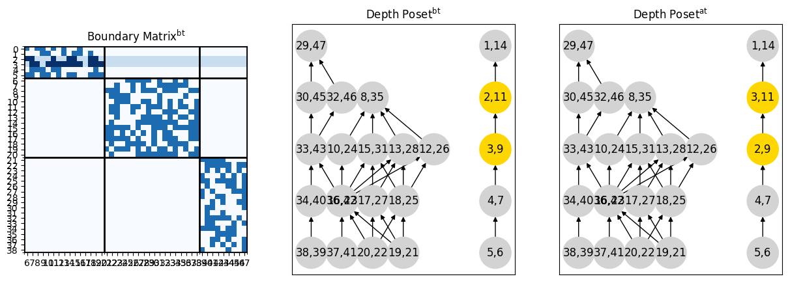

### Birth Death Pairs
|                          |                                                                                                                                                                                                                                   |
|:-------------------------|:----------------------------------------------------------------------------------------------------------------------------------------------------------------------------------------------------------------------------------|
| Before the transposition | $\{(32, 46), (29, 47), (19, 21), (34, 40), (2, 11), (17, 27), (10, 24), (30, 45), (3, 9), (5, 6), (18, 25), (20, 22), (36, 42), (1, 14), (37, 41), (8, 35), (13, 28), (33, 43), (15, 31), (4, 7), (38, 39), (12, 26), (16, 23)\}$ |
| After the transposition  | $\{(32, 46), (29, 47), (19, 21), (34, 40), (17, 27), (10, 24), (30, 45), (5, 6), (18, 25), (20, 22), (36, 42), (1, 14), (37, 41), (8, 35), (13, 28), (33, 43), (15, 31), (4, 7), (3, 11), (38, 39), (12, 26), (2, 9), (16, 23)\}$ |

### Relations
|                          | Algorithm 1                                                                                                                                                                                                                                                                                                                                                                   | Algorithm 2                                                                                                                                                                                                                                                                                                                                                                                                     |
|:-------------------------|:------------------------------------------------------------------------------------------------------------------------------------------------------------------------------------------------------------------------------------------------------------------------------------------------------------------------------------------------------------------------------|:----------------------------------------------------------------------------------------------------------------------------------------------------------------------------------------------------------------------------------------------------------------------------------------------------------------------------------------------------------------------------------------------------------------|
| Before the transposition | $\{(42, 45), (25, 35), (41, 43), (21, 25), (21, 31), (40, 44), (31, 35), (23, 31), (9, 14), (11, 14), (27, 28), (6, 14), (25, 31), (41, 45), (24, 35), (42, 44), (43, 45), (26, 35), (21, 24), (46, 47), (21, 27), (22, 28), (39, 44), (22, 31), (39, 47), (7, 9), (6, 7), (42, 43), (41, 47), (43, 44), (21, 23), (22, 27), (40, 45), (23, 35), (7, 11), (6, 9), (25, 26)\}$ | $\{(4, 0), (20, 8), (4, 3), (3, 1), (20, 17), (17, 15), (19, 15), (37, 36), (13, 8), (16, 10), (16, 13), (18, 13), (33, 32), (3, 0), (20, 16), (5, 0), (38, 34), (17, 8), (34, 30), (19, 8), (34, 33), (36, 30), (37, 29), (19, 17), (10, 8), (36, 33), (16, 12), (30, 29), (18, 12), (32, 29), (20, 12), (20, 18), (3, 2), (12, 8), (20, 15), (5, 2), (19, 16), (34, 32), (33, 30), (18, 8)\}$                 |
| After the transposition  | $\{(25, 35), (41, 43), (42, 45), (21, 25), (21, 31), (40, 44), (31, 35), (23, 31), (9, 11), (11, 14), (27, 28), (6, 14), (25, 31), (41, 45), (24, 35), (42, 44), (43, 45), (26, 35), (21, 24), (46, 47), (21, 27), (22, 28), (39, 44), (22, 31), (39, 47), (7, 9), (6, 7), (42, 43), (41, 47), (43, 44), (21, 23), (22, 27), (40, 45), (23, 35), (7, 11), (6, 9), (25, 26)\}$ | $\{(4, 0), (20, 8), (4, 3), (3, 1), (20, 17), (17, 15), (19, 15), (37, 36), (13, 8), (16, 10), (16, 13), (18, 13), (33, 32), (3, 0), (20, 16), (5, 0), (38, 34), (17, 8), (34, 30), (19, 8), (34, 33), (36, 30), (2, 1), (19, 17), (10, 8), (37, 29), (36, 33), (16, 12), (30, 29), (18, 12), (32, 29), (20, 12), (20, 18), (12, 8), (20, 15), (5, 2), (2, 0), (19, 16), (2, 3), (34, 32), (33, 30), (18, 8)\}$ |

### Successors and Predecessers
|                 | $\text{Set}^\text{bt}(2, 11)$                         | $\text{Set}^\text{bt}(3, 9)$                           | $\text{Set}^\text{at}(2, 9)$                           | $\text{Set}^\text{at}(3, 11)$                         |
|:----------------|:------------------------------------------------------|:-------------------------------------------------------|:-------------------------------------------------------|:------------------------------------------------------|
| $\text{Succ}_1$ | $\text{Succ}_1^\text{bt}(2, 11) = \{(1, 14)\}$        | $\text{Succ}_1^\text{bt}(3, 9) = \{(1, 14)\}$          | $\text{Succ}_1^\text{at}(2, 9) = \{(3, 11)\}$          | $\text{Succ}_1^\text{at}(3, 11) = \{(1, 14)\}$        |
| $\text{Pred}_1$ | $\text{Pred}_1^\text{bt}(2, 11) = \{(4, 7)\}$         | $\text{Pred}_1^\text{bt}(3, 9) = \{(5, 6), (4, 7)\}$   | $\text{Pred}_1^\text{at}(2, 9) = \{(5, 6), (4, 7)\}$   | $\text{Pred}_1^\text{at}(3, 11) = \{(2, 9), (4, 7)\}$ |
| $\text{Succ}_2$ | $\text{Succ}_2^\text{bt}(2, 11) = \emptyset$          | $\text{Succ}_2^\text{bt}(3, 9) = \{(1, 14), (2, 11)\}$ | $\text{Succ}_2^\text{at}(2, 9) = \{(1, 14), (3, 11)\}$ | $\text{Succ}_2^\text{at}(3, 11) = \{(1, 14)\}$        |
| $\text{Pred}_2$ | $\text{Pred}_2^\text{bt}(2, 11) = \{(3, 9), (5, 6)\}$ | $\text{Pred}_2^\text{bt}(3, 9) = \{(4, 7)\}$           | $\text{Pred}_2^\text{at}(2, 9) = \{(5, 6)\}$           | $\text{Pred}_2^\text{at}(3, 11) = \{(2, 9), (4, 7)\}$ |

### Temp Sets
|                                                               | Before the Transposition   | After the Transposition   |
|:--------------------------------------------------------------|:---------------------------|:--------------------------|
| $\mathcal{L} = \{(s, t)\in \text{BD}:\; f(t) < f(y)\}$        | $\{(5, 6), (4, 7)\}$       | $\{(5, 6), (4, 7)\}$      |
| $\mathcal{M} = \{(s, t)\in \text{BD}:\; f(y) < f(t) < f(b)\}$ | $\emptyset$                | $\emptyset$               |

### Equations
There are 1 equations are wrong.

| eq   | left (formula)                  | left (paramatrized)              | left (value)           | right (formula)                                                                                           | right (paramatrized)                                                                                       | right (value)          | correct   |
|:-----|:--------------------------------|:---------------------------------|:-----------------------|:----------------------------------------------------------------------------------------------------------|:-----------------------------------------------------------------------------------------------------------|:-----------------------|:----------|
| Eq08 | $\text{Succ}_1^\text{at}(a, y)$ | $\text{Succ}_1^\text{at}(2, 9)$  | $\{(3, 11)\}$          | $\text{Succ}_1^\text{bt}(x, y) \oplus \{(x, b)\} \oplus \text{Succ}_1^\text{bt}(a, b)$                    | $\text{Succ}_1^\text{bt}(3, 9) \oplus \{(3, 11)\} \oplus \text{Succ}_1^\text{bt}(2, 11)$                   | $\{(3, 11)\}$          | ✔         |
| Eq09 | $\text{Succ}_1^\text{at}(x, b)$ | $\text{Succ}_1^\text{at}(3, 11)$ | $\{(1, 14)\}$          | $\text{Succ}_1^\text{bt}(a, b)$                                                                           | $\text{Succ}_1^\text{bt}(2, 11)$                                                                           | $\{(1, 14)\}$          | ✔         |
| Eq10 | $\text{Pred}_1^\text{at}(a, y)$ | $\text{Pred}_1^\text{at}(2, 9)$  | $\{(5, 6), (4, 7)\}$   | $\text{Pred}_1^\text{bt}(x, y)$                                                                           | $\text{Pred}_1^\text{bt}(3, 9)$                                                                            | $\{(5, 6), (4, 7)\}$   | ✔         |
| Eq11 | $\text{Pred}_1^\text{at}(x, b)$ | $\text{Pred}_1^\text{at}(3, 11)$ | $\{(2, 9), (4, 7)\}$   | $\text{Pred}_1^\text{bt}(a, b) \oplus \{(a, y)\}$                                                         | $\text{Pred}_1^\text{bt}(2, 11) \oplus \{(2, 9)\}$                                                         | $\{(2, 9), (4, 7)\}$   | ✔         |
| Eq12 | $\text{Succ}_2^\text{at}(a, y)$ | $\text{Succ}_2^\text{at}(2, 9)$  | $\{(1, 14), (3, 11)\}$ | $\text{Succ}_2^\text{bt}(x, y) \oplus \{(x, b), (a, b)\}$                                                 | $\text{Succ}_2^\text{bt}(3, 9) \oplus \{(3, 11), (2, 11)\}$                                                | $\{(1, 14), (3, 11)\}$ | ✔         |
| Eq13 | $\text{Succ}_2^\text{at}(x, b)$ | $\text{Succ}_2^\text{at}(3, 11)$ | $\{(1, 14)\}$          | $\text{Succ}_2^\text{bt}(a, b)$                                                                           | $\text{Succ}_2^\text{bt}(2, 11)$                                                                           | $\emptyset$            | ✘         |
| Eq14 | $\text{Pred}_2^\text{at}(a, y)$ | $\text{Pred}_2^\text{at}(2, 9)$  | $\{(5, 6)\}$           | $[\text{Pred}_2^\text{bt}(a, b) \cap \mathcal{L}]$                                                        | $[\text{Pred}_2^\text{bt}(2, 11) \cap \mathcal{L}]$                                                        | $\{(5, 6)\}$           | ✔         |
| Eq15 | $\text{Pred}_2^\text{at}(x, b)$ | $\text{Pred}_2^\text{at}(3, 11)$ | $\{(2, 9), (4, 7)\}$   | $\text{Pred}_2^\text{bt}(x, y) \oplus \{(a, y)\} \oplus [\text{Pred}_2^\text{bt}(a, b) \cap \mathcal{M}]$ | $\text{Pred}_2^\text{bt}(3, 9) \oplus \{(2, 9)\} \oplus [\text{Pred}_2^\text{bt}(2, 11) \cap \mathcal{M}]$ | $\{(2, 9), (4, 7)\}$   | ✔         |

## Transposition <6, 7> in complex 3
Here is a __death-death__ __switch forward__ transposition <6, 7>.

$$
a = 4, \; b = 7, \; x = 5, \; y = 6
$$

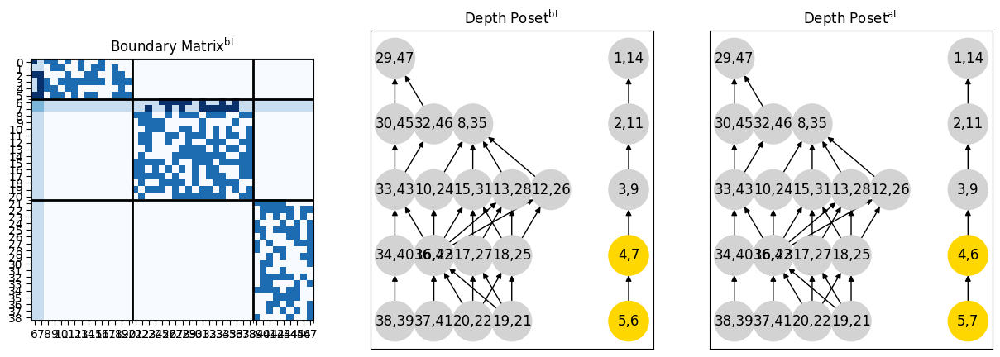

### Birth Death Pairs
|                          |                                                                                                                                                                                                                                   |
|:-------------------------|:----------------------------------------------------------------------------------------------------------------------------------------------------------------------------------------------------------------------------------|
| Before the transposition | $\{(32, 46), (29, 47), (19, 21), (34, 40), (2, 11), (17, 27), (10, 24), (30, 45), (3, 9), (5, 6), (18, 25), (20, 22), (36, 42), (1, 14), (37, 41), (8, 35), (13, 28), (33, 43), (15, 31), (4, 7), (38, 39), (12, 26), (16, 23)\}$ |
| After the transposition  | $\{(32, 46), (4, 6), (5, 7), (29, 47), (19, 21), (34, 40), (2, 11), (17, 27), (10, 24), (30, 45), (3, 9), (18, 25), (20, 22), (36, 42), (1, 14), (37, 41), (8, 35), (13, 28), (33, 43), (15, 31), (38, 39), (12, 26), (16, 23)\}$ |

### Relations
|                          | Algorithm 1                                                                                                                                                                                                                                                                                                                                                                    | Algorithm 2                                                                                                                                                                                                                                                                                                                                                                                             |
|:-------------------------|:-------------------------------------------------------------------------------------------------------------------------------------------------------------------------------------------------------------------------------------------------------------------------------------------------------------------------------------------------------------------------------|:--------------------------------------------------------------------------------------------------------------------------------------------------------------------------------------------------------------------------------------------------------------------------------------------------------------------------------------------------------------------------------------------------------|
| Before the transposition | $\{(42, 45), (25, 35), (41, 43), (21, 25), (21, 31), (40, 44), (31, 35), (23, 31), (9, 14), (11, 14), (27, 28), (6, 14), (25, 31), (41, 45), (24, 35), (42, 44), (43, 45), (26, 35), (21, 24), (46, 47), (21, 27), (22, 28), (39, 44), (22, 31), (39, 47), (7, 9), (6, 7), (42, 43), (41, 47), (43, 44), (21, 23), (22, 27), (40, 45), (23, 35), (7, 11), (6, 9), (25, 26)\}$  | $\{(4, 0), (20, 8), (4, 3), (3, 1), (20, 17), (17, 15), (19, 15), (37, 36), (13, 8), (16, 10), (16, 13), (18, 13), (33, 32), (3, 0), (20, 16), (5, 0), (38, 34), (17, 8), (34, 30), (19, 8), (34, 33), (36, 30), (37, 29), (19, 17), (10, 8), (36, 33), (16, 12), (30, 29), (18, 12), (32, 29), (20, 12), (20, 18), (3, 2), (12, 8), (20, 15), (5, 2), (19, 16), (34, 32), (33, 30), (18, 8)\}$         |
| After the transposition  | $\{(25, 35), (41, 43), (42, 45), (21, 25), (21, 31), (40, 44), (31, 35), (23, 31), (9, 14), (11, 14), (27, 28), (6, 11), (6, 14), (25, 31), (41, 45), (24, 35), (42, 44), (43, 45), (26, 35), (21, 24), (46, 47), (21, 27), (22, 28), (39, 44), (22, 31), (39, 47), (7, 9), (7, 6), (42, 43), (41, 47), (43, 44), (21, 23), (22, 27), (40, 45), (23, 35), (25, 26), (7, 14)\}$ | $\{(4, 0), (20, 8), (4, 3), (3, 1), (20, 17), (5, 4), (17, 15), (19, 15), (37, 36), (13, 8), (16, 10), (16, 13), (18, 13), (33, 32), (3, 0), (20, 16), (38, 34), (5, 3), (17, 8), (34, 30), (19, 8), (34, 33), (36, 30), (37, 29), (19, 17), (10, 8), (36, 33), (16, 12), (30, 29), (18, 12), (32, 29), (20, 12), (20, 18), (3, 2), (12, 8), (20, 15), (5, 2), (19, 16), (34, 32), (33, 30), (18, 8)\}$ |

### Successors and Predecessers
|                 | $\text{Set}^\text{bt}(4, 7)$                          | $\text{Set}^\text{bt}(5, 6)$                                  | $\text{Set}^\text{at}(5, 7)$                                  | $\text{Set}^\text{at}(4, 6)$                           |
|:----------------|:------------------------------------------------------|:--------------------------------------------------------------|:--------------------------------------------------------------|:-------------------------------------------------------|
| $\text{Succ}_1$ | $\text{Succ}_1^\text{bt}(4, 7) = \{(3, 9), (2, 11)\}$ | $\text{Succ}_1^\text{bt}(5, 6) = \{(1, 14), (4, 7), (3, 9)\}$ | $\text{Succ}_1^\text{at}(5, 7) = \{(4, 6), (1, 14), (3, 9)\}$ | $\text{Succ}_1^\text{at}(4, 6) = \{(1, 14), (2, 11)\}$ |
| $\text{Pred}_1$ | $\text{Pred}_1^\text{bt}(4, 7) = \{(5, 6)\}$          | $\text{Pred}_1^\text{bt}(5, 6) = \emptyset$                   | $\text{Pred}_1^\text{at}(5, 7) = \emptyset$                   | $\text{Pred}_1^\text{at}(4, 6) = \{(5, 7)\}$           |
| $\text{Succ}_2$ | $\text{Succ}_2^\text{bt}(4, 7) = \{(3, 9)\}$          | $\text{Succ}_2^\text{bt}(5, 6) = \{(2, 11)\}$                 | $\text{Succ}_2^\text{at}(5, 7) = \{(4, 6), (3, 9), (2, 11)\}$ | $\text{Succ}_2^\text{at}(4, 6) = \{(3, 9)\}$           |
| $\text{Pred}_2$ | $\text{Pred}_2^\text{bt}(4, 7) = \emptyset$           | $\text{Pred}_2^\text{bt}(5, 6) = \emptyset$                   | $\text{Pred}_2^\text{at}(5, 7) = \emptyset$                   | $\text{Pred}_2^\text{at}(4, 6) = \{(5, 7)\}$           |

### Temp Sets
|                                                               | Before the Transposition                                                                                                                                                                | After the Transposition                                                                                                                                                                 |
|:--------------------------------------------------------------|:----------------------------------------------------------------------------------------------------------------------------------------------------------------------------------------|:----------------------------------------------------------------------------------------------------------------------------------------------------------------------------------------|
| $\mathcal{B} = \{(s, t)\in \text{BD}:\; f(s) > f(x)\}$        | $\{(17, 27), (10, 24), (38, 39), (12, 26), (32, 46), (34, 40), (36, 42), (37, 41), (30, 45), (8, 35), (13, 28), (18, 25), (29, 47), (20, 22), (19, 21), (33, 43), (15, 31), (16, 23)\}$ | $\{(17, 27), (10, 24), (38, 39), (12, 26), (32, 46), (34, 40), (36, 42), (37, 41), (30, 45), (8, 35), (13, 28), (18, 25), (29, 47), (20, 22), (19, 21), (33, 43), (15, 31), (16, 23)\}$ |
| $\mathcal{N} = \{(s, t)\in \text{BD}:\; f(x) > f(s) > f(a)\}$ | $\emptyset$                                                                                                                                                                             | $\emptyset$                                                                                                                                                                             |

### Equations
There are 1 equations are wrong.

| eq   | left (formula)                  | left (paramatrized)             | left (value)                  | right (formula)                                                                                          | right (paramatrized)                                                                                     | right (value)                 | correct   |
|:-----|:--------------------------------|:--------------------------------|:------------------------------|:---------------------------------------------------------------------------------------------------------|:---------------------------------------------------------------------------------------------------------|:------------------------------|:----------|
| Eq28 | $\text{Succ}_1^\text{at}(x, b)$ | $\text{Succ}_1^\text{at}(5, 7)$ | $\{(4, 6), (1, 14), (3, 9)\}$ | $\text{Succ}_1^\text{bt}(x, y) \oplus \{(a, y), (a, b)\}$                                                | $\text{Succ}_1^\text{bt}(5, 6) \oplus \{(4, 6), (4, 7)\}$                                                | $\{(4, 6), (1, 14), (3, 9)\}$ | ✔         |
| Eq29 | $\text{Succ}_1^\text{at}(a, y)$ | $\text{Succ}_1^\text{at}(4, 6)$ | $\{(1, 14), (2, 11)\}$        | $\text{Succ}_1^\text{bt}(a, b)$                                                                          | $\text{Succ}_1^\text{bt}(4, 7)$                                                                          | $\{(3, 9), (2, 11)\}$         | ✘         |
| Eq30 | $\text{Pred}_1^\text{at}(x, b)$ | $\text{Pred}_1^\text{at}(5, 7)$ | $\emptyset$                   | $[\text{Pred}_1^\text{bt}(a, b) \cap \mathcal{B}]$                                                       | $[\text{Pred}_1^\text{bt}(4, 7) \cap \mathcal{B}]$                                                       | $\emptyset$                   | ✔         |
| Eq31 | $\text{Pred}_1^\text{at}(a, y)$ | $\text{Pred}_1^\text{at}(4, 6)$ | $\{(5, 7)\}$                  | $\text{Pred}_1^\text{bt}(x, y) \oplus \{(x, b)\} \oplus[\text{Pred}_1^\text{bt}(a, b) \cap \mathcal{N}]$ | $\text{Pred}_1^\text{bt}(5, 6) \oplus \{(5, 7)\} \oplus[\text{Pred}_1^\text{bt}(4, 7) \cap \mathcal{N}]$ | $\{(5, 7)\}$                  | ✔         |
| Eq32 | $\text{Succ}_2^\text{at}(x, b)$ | $\text{Succ}_2^\text{at}(5, 7)$ | $\{(4, 6), (3, 9), (2, 11)\}$ | $\text{Succ}_2^\text{bt}(x, y) \oplus \{(a, y)\} \oplus \text{Succ}_2^\text{bt}(a, b)$                   | $\text{Succ}_2^\text{bt}(5, 6) \oplus \{(4, 6)\} \oplus \text{Succ}_2^\text{bt}(4, 7)$                   | $\{(4, 6), (3, 9), (2, 11)\}$ | ✔         |
| Eq33 | $\text{Succ}_2^\text{at}(a, y)$ | $\text{Succ}_2^\text{at}(4, 6)$ | $\{(3, 9)\}$                  | $\text{Succ}_2^\text{bt}(a, b)$                                                                          | $\text{Succ}_2^\text{bt}(4, 7)$                                                                          | $\{(3, 9)\}$                  | ✔         |
| Eq34 | $\text{Pred}_2^\text{at}(x, b)$ | $\text{Pred}_2^\text{at}(5, 7)$ | $\emptyset$                   | $\text{Pred}_2^\text{bt}(x, y)$                                                                          | $\text{Pred}_2^\text{bt}(5, 6)$                                                                          | $\emptyset$                   | ✔         |
| Eq35 | $\text{Pred}_2^\text{at}(a, y)$ | $\text{Pred}_2^\text{at}(4, 6)$ | $\{(5, 7)\}$                  | $\text{Pred}_2^\text{bt}(a, b) \oplus \{(x, b)\}$                                                        | $\text{Pred}_2^\text{bt}(4, 7) \oplus \{(5, 7)\}$                                                        | $\{(5, 7)\}$                  | ✔         |

## Transposition <7, 8> in complex 3
Here is a __birth-death__ __switch forward__ transposition <7, 8>.

$$
a = 4, \; b = 7, \; x = 8, \; y = 35
$$

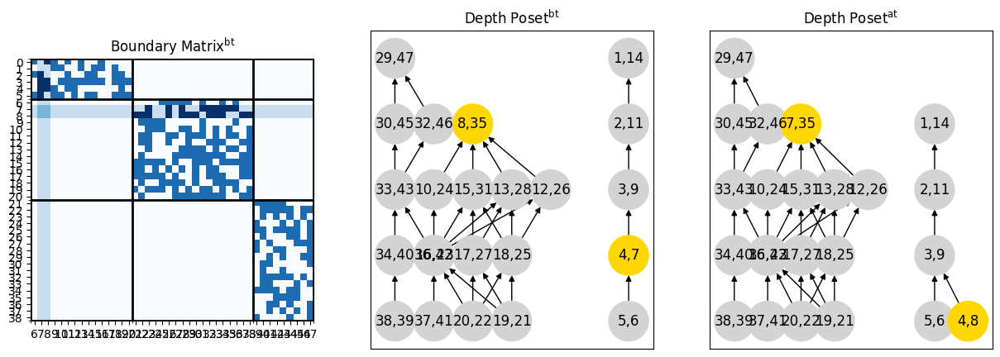

### Birth Death Pairs
|                          |                                                                                                                                                                                                                                   |
|:-------------------------|:----------------------------------------------------------------------------------------------------------------------------------------------------------------------------------------------------------------------------------|
| Before the transposition | $\{(32, 46), (29, 47), (19, 21), (34, 40), (2, 11), (17, 27), (10, 24), (30, 45), (3, 9), (5, 6), (18, 25), (20, 22), (36, 42), (1, 14), (37, 41), (8, 35), (13, 28), (33, 43), (15, 31), (4, 7), (38, 39), (12, 26), (16, 23)\}$ |
| After the transposition  | $\{(32, 46), (7, 35), (29, 47), (19, 21), (34, 40), (2, 11), (17, 27), (10, 24), (30, 45), (3, 9), (5, 6), (18, 25), (4, 8), (20, 22), (36, 42), (1, 14), (37, 41), (13, 28), (33, 43), (15, 31), (38, 39), (12, 26), (16, 23)\}$ |

### Relations
|                          | Algorithm 1                                                                                                                                                                                                                                                                                                                                                                   | Algorithm 2                                                                                                                                                                                                                                                                                                                                                                                     |
|:-------------------------|:------------------------------------------------------------------------------------------------------------------------------------------------------------------------------------------------------------------------------------------------------------------------------------------------------------------------------------------------------------------------------|:------------------------------------------------------------------------------------------------------------------------------------------------------------------------------------------------------------------------------------------------------------------------------------------------------------------------------------------------------------------------------------------------|
| Before the transposition | $\{(42, 45), (25, 35), (41, 43), (21, 25), (21, 31), (40, 44), (31, 35), (23, 31), (9, 14), (11, 14), (27, 28), (6, 14), (25, 31), (41, 45), (24, 35), (42, 44), (43, 45), (26, 35), (21, 24), (46, 47), (21, 27), (22, 28), (39, 44), (22, 31), (39, 47), (7, 9), (6, 7), (42, 43), (41, 47), (43, 44), (21, 23), (22, 27), (40, 45), (23, 35), (7, 11), (6, 9), (25, 26)\}$ | $\{(4, 0), (20, 8), (4, 3), (3, 1), (20, 17), (17, 15), (19, 15), (37, 36), (13, 8), (16, 10), (16, 13), (18, 13), (33, 32), (3, 0), (20, 16), (5, 0), (38, 34), (17, 8), (34, 30), (19, 8), (34, 33), (36, 30), (37, 29), (19, 17), (10, 8), (36, 33), (16, 12), (30, 29), (18, 12), (32, 29), (20, 12), (20, 18), (3, 2), (12, 8), (20, 15), (5, 2), (19, 16), (34, 32), (33, 30), (18, 8)\}$ |
| After the transposition  | $\{(25, 35), (41, 43), (42, 45), (21, 25), (21, 31), (40, 44), (31, 35), (8, 9), (23, 31), (9, 14), (11, 14), (27, 28), (6, 14), (25, 31), (41, 45), (24, 35), (42, 44), (43, 45), (26, 35), (21, 24), (46, 47), (21, 27), (22, 28), (39, 44), (8, 11), (22, 31), (39, 47), (42, 43), (41, 47), (43, 44), (21, 23), (22, 27), (40, 45), (23, 35), (6, 9), (25, 26)\}$         | $\{(4, 0), (12, 7), (4, 3), (3, 1), (20, 17), (17, 15), (19, 15), (37, 36), (16, 7), (16, 10), (18, 7), (16, 13), (18, 13), (33, 32), (3, 0), (20, 16), (5, 0), (38, 34), (34, 30), (34, 33), (36, 30), (37, 29), (19, 17), (13, 7), (36, 33), (16, 12), (30, 29), (18, 12), (32, 29), (20, 12), (20, 18), (3, 2), (20, 15), (5, 2), (17, 7), (19, 16), (34, 32), (33, 30)\}$                   |

### Successors and Predecessers
|                 | $\text{Set}^\text{bt}(4, 7)$                          | $\text{Set}^\text{bt}(8, 35)$                                                                               | $\text{Set}^\text{at}(4, 8)$                          | $\text{Set}^\text{at}(7, 35)$                                                           |
|:----------------|:------------------------------------------------------|:------------------------------------------------------------------------------------------------------------|:------------------------------------------------------|:----------------------------------------------------------------------------------------|
| $\text{Succ}_1$ | $\text{Succ}_1^\text{bt}(4, 7) = \{(3, 9), (2, 11)\}$ | $\text{Succ}_1^\text{bt}(8, 35) = \emptyset$                                                                | $\text{Succ}_1^\text{at}(4, 8) = \{(3, 9), (2, 11)\}$ | $\text{Succ}_1^\text{at}(7, 35) = \emptyset$                                            |
| $\text{Pred}_1$ | $\text{Pred}_1^\text{bt}(4, 7) = \{(5, 6)\}$          | $\text{Pred}_1^\text{bt}(8, 35) = \{(10, 24), (12, 26), (18, 25), (15, 31), (16, 23)\}$                     | $\text{Pred}_1^\text{at}(4, 8) = \emptyset$           | $\text{Pred}_1^\text{at}(7, 35) = \{(10, 24), (12, 26), (18, 25), (15, 31), (16, 23)\}$ |
| $\text{Succ}_2$ | $\text{Succ}_2^\text{bt}(4, 7) = \{(3, 9)\}$          | $\text{Succ}_2^\text{bt}(8, 35) = \emptyset$                                                                | $\text{Succ}_2^\text{at}(4, 8) = \{(3, 9)\}$          | $\text{Succ}_2^\text{at}(7, 35) = \emptyset$                                            |
| $\text{Pred}_2$ | $\text{Pred}_2^\text{bt}(4, 7) = \emptyset$           | $\text{Pred}_2^\text{bt}(8, 35) = \{(10, 24), (12, 26), (13, 28), (18, 25), (20, 22), (19, 21), (17, 27)\}$ | $\text{Pred}_2^\text{at}(4, 8) = \emptyset$           | $\text{Pred}_2^\text{at}(7, 35) = \{(17, 27), (12, 26), (13, 28), (18, 25), (16, 23)\}$ |

### Temp Sets
|                                                              | Before the Transposition                                                                       | After the Transposition                                                                        |
|:-------------------------------------------------------------|:-----------------------------------------------------------------------------------------------|:-----------------------------------------------------------------------------------------------|
| $A_1 = \{(s, t)\in \text{BD}:\; f(a) < f(s) < f(t) < f(x)\}$ | $\{(5, 6)\}$                                                                                   | $\{(5, 6)\}$                                                                                   |
| $B_1 = \{(s, t)\in \text{BD}:\; U_1[t, x] = 1\}$             | $\emptyset$                                                                                    | $\emptyset$                                                                                    |
| $A_2 = \{(s, t)\in \text{BD}:\; f(b) < f(s) < f(t) < f(y)\}$ | $\{(10, 24), (12, 26), (16, 23), (13, 28), (18, 25), (20, 22), (19, 21), (15, 31), (17, 27)\}$ | $\{(10, 24), (12, 26), (16, 23), (13, 28), (18, 25), (20, 22), (19, 21), (15, 31), (17, 27)\}$ |
| $B_2 = \{(s, t)\in \text{BD}:\; U_2[b, s] = 1\}$             | $\emptyset$                                                                                    | $\{(17, 27), (12, 26), (13, 28), (18, 25), (16, 23)\}$                                         |

### Equations
There are 2 equations are wrong.

| eq    | left (formula)                  | left (paramatrized)              | left (value)                                           | right (formula)                                      | right (paramatrized)                                 | right (value)                                          | correct   |
|:------|:--------------------------------|:---------------------------------|:-------------------------------------------------------|:-----------------------------------------------------|:-----------------------------------------------------|:-------------------------------------------------------|:----------|
| Eq48  | $\text{Succ}_1^\text{at}(a, x)$ | $\text{Succ}_1^\text{at}(4, 8)$  | $\{(3, 9), (2, 11)\}$                                  | $\text{Succ}_1^\text{bt}(a, b)$                      | $\text{Succ}_1^\text{bt}(4, 7)$                      | $\{(3, 9), (2, 11)\}$                                  | ✔         |
| Eq49  | $\text{Succ}_1^\text{at}(b, y)$ | $\text{Succ}_1^\text{at}(7, 35)$ | $\emptyset$                                            | $\text{Succ}_1^\text{bt}(x, y)$                      | $\text{Succ}_1^\text{bt}(8, 35)$                     | $\emptyset$                                            | ✔         |
| Eq50  | $\text{Pred}_1^\text{at}(a, x)$ | $\text{Pred}_1^\text{at}(4, 8)$  | $\emptyset$                                            | $\{(s, t)\in \text{BD}:\; U_1^\text{bt}[t, x] = 1\}$ | $\{(s, t)\in \text{BD}:\; U_1^\text{bt}[t, 8] = 1\}$ | $\emptyset$                                            | ✔         |
| Eq50a | $\text{Pred}_1^\text{at}(a, x)$ | $\text{Pred}_1^\text{at}(4, 8)$  | $\emptyset$                                            | $A_1^\text{bt} \cap B_1^\text{bt}$                   | $A_1^\text{bt} \cap B_1^\text{bt}$                   | $\emptyset$                                            | ✔         |
| Eq50b | $\text{Pred}_1^\text{at}(a, x)$ | $\text{Pred}_1^\text{at}(4, 8)$  | $\emptyset$                                            | $A_1^\text{bt} \cap B_1^\text{at}$                   | $A_1^\text{bt} \cap B_1^\text{at}$                   | $\emptyset$                                            | ✔         |
| Eq51  | $\text{Pred}_1^\text{at}(b, y)$ | $\text{Pred}_1^\text{at}(7, 35)$ | $\{(10, 24), (12, 26), (18, 25), (15, 31), (16, 23)\}$ | $\text{Pred}_1^\text{bt}(x, y)$                      | $\text{Pred}_1^\text{bt}(8, 35)$                     | $\{(10, 24), (12, 26), (18, 25), (15, 31), (16, 23)\}$ | ✔         |
| Eq52  | $\text{Succ}_2^\text{at}(a, x)$ | $\text{Succ}_2^\text{at}(4, 8)$  | $\{(3, 9)\}$                                           | $\text{Succ}_2^\text{bt}(a, b)$                      | $\text{Succ}_2^\text{bt}(4, 7)$                      | $\{(3, 9)\}$                                           | ✔         |
| Eq53  | $\text{Succ}_2^\text{at}(b, y)$ | $\text{Succ}_2^\text{at}(7, 35)$ | $\emptyset$                                            | $\text{Succ}_2^\text{bt}(x, y)$                      | $\text{Succ}_2^\text{bt}(8, 35)$                     | $\emptyset$                                            | ✔         |
| Eq54  | $\text{Pred}_2^\text{at}(a, x)$ | $\text{Pred}_2^\text{at}(4, 8)$  | $\emptyset$                                            | $\text{Pred}_2^\text{bt}(a, b)$                      | $\text{Pred}_2^\text{bt}(4, 7)$                      | $\emptyset$                                            | ✔         |
| Eq55  | $\text{Pred}_2^\text{at}(b, y)$ | $\text{Pred}_2^\text{at}(7, 35)$ | $\{(17, 27), (12, 26), (13, 28), (18, 25), (16, 23)\}$ | $\{(s, t)\in \text{BD}:\; U_2^\text{bt}[b, s] = 1\}$ | $\{(s, t)\in \text{BD}:\; U_2^\text{bt}[7, s] = 1\}$ | $\emptyset$                                            | ✘         |
| Eq55a | $\text{Pred}_2^\text{at}(b, y)$ | $\text{Pred}_2^\text{at}(7, 35)$ | $\{(17, 27), (12, 26), (13, 28), (18, 25), (16, 23)\}$ | $A_2^\text{bt} \cap B_2^\text{bt}$                   | $A_2^\text{bt} \cap B_2^\text{bt}$                   | $\emptyset$                                            | ✘         |
| Eq55b | $\text{Pred}_2^\text{at}(b, y)$ | $\text{Pred}_2^\text{at}(7, 35)$ | $\{(17, 27), (12, 26), (13, 28), (18, 25), (16, 23)\}$ | $A_2^\text{bt} \cap B_2^\text{at}$                   | $A_2^\text{bt} \cap B_2^\text{at}$                   | $\{(17, 27), (12, 26), (13, 28), (18, 25), (16, 23)\}$ | ✔         |

## Transposition <9, 10> in complex 3
Here is a __birth-death__ __switch forward__ transposition <9, 10>.

$$
a = 3, \; b = 9, \; x = 10, \; y = 24
$$

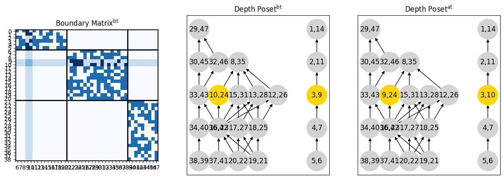

### Birth Death Pairs
|                          |                                                                                                                                                                                                                                   |
|:-------------------------|:----------------------------------------------------------------------------------------------------------------------------------------------------------------------------------------------------------------------------------|
| Before the transposition | $\{(32, 46), (29, 47), (19, 21), (34, 40), (2, 11), (17, 27), (10, 24), (30, 45), (3, 9), (5, 6), (18, 25), (20, 22), (36, 42), (1, 14), (37, 41), (8, 35), (13, 28), (33, 43), (15, 31), (4, 7), (38, 39), (12, 26), (16, 23)\}$ |
| After the transposition  | $\{(32, 46), (3, 10), (29, 47), (19, 21), (34, 40), (2, 11), (17, 27), (30, 45), (5, 6), (18, 25), (20, 22), (36, 42), (1, 14), (37, 41), (8, 35), (13, 28), (33, 43), (15, 31), (4, 7), (38, 39), (12, 26), (9, 24), (16, 23)\}$ |

### Relations
|                          | Algorithm 1                                                                                                                                                                                                                                                                                                                                                                   | Algorithm 2                                                                                                                                                                                                                                                                                                                                                                                     |
|:-------------------------|:------------------------------------------------------------------------------------------------------------------------------------------------------------------------------------------------------------------------------------------------------------------------------------------------------------------------------------------------------------------------------|:------------------------------------------------------------------------------------------------------------------------------------------------------------------------------------------------------------------------------------------------------------------------------------------------------------------------------------------------------------------------------------------------|
| Before the transposition | $\{(42, 45), (25, 35), (41, 43), (21, 25), (21, 31), (40, 44), (31, 35), (23, 31), (9, 14), (11, 14), (27, 28), (6, 14), (25, 31), (41, 45), (24, 35), (42, 44), (43, 45), (26, 35), (21, 24), (46, 47), (21, 27), (22, 28), (39, 44), (22, 31), (39, 47), (7, 9), (6, 7), (42, 43), (41, 47), (43, 44), (21, 23), (22, 27), (40, 45), (23, 35), (7, 11), (6, 9), (25, 26)\}$ | $\{(4, 0), (20, 8), (4, 3), (3, 1), (20, 17), (17, 15), (19, 15), (37, 36), (13, 8), (16, 10), (16, 13), (18, 13), (33, 32), (3, 0), (20, 16), (5, 0), (38, 34), (17, 8), (34, 30), (19, 8), (34, 33), (36, 30), (37, 29), (19, 17), (10, 8), (36, 33), (16, 12), (30, 29), (18, 12), (32, 29), (20, 12), (20, 18), (3, 2), (12, 8), (20, 15), (5, 2), (19, 16), (34, 32), (33, 30), (18, 8)\}$ |
| After the transposition  | $\{(25, 35), (41, 43), (42, 45), (21, 25), (21, 31), (40, 44), (31, 35), (23, 31), (11, 14), (27, 28), (6, 14), (25, 31), (41, 45), (24, 35), (42, 44), (43, 45), (26, 35), (21, 24), (46, 47), (21, 27), (22, 28), (39, 44), (22, 31), (39, 47), (10, 14), (6, 7), (6, 10), (42, 43), (41, 47), (43, 44), (21, 23), (22, 27), (40, 45), (23, 35), (7, 11), (25, 26)\}$       | $\{(4, 0), (20, 8), (4, 3), (3, 1), (20, 17), (9, 8), (17, 15), (19, 15), (37, 36), (15, 8), (16, 13), (18, 13), (33, 32), (3, 0), (20, 16), (5, 0), (38, 34), (34, 30), (19, 8), (34, 33), (36, 30), (37, 29), (19, 17), (36, 33), (16, 9), (16, 12), (30, 29), (18, 12), (32, 29), (20, 9), (20, 12), (20, 18), (3, 2), (12, 8), (20, 15), (5, 2), (19, 16), (34, 32), (33, 30), (18, 8)\}$   |

### Successors and Predecessers
|                 | $\text{Set}^\text{bt}(3, 9)$                           | $\text{Set}^\text{bt}(10, 24)$                   | $\text{Set}^\text{at}(3, 10)$                           | $\text{Set}^\text{at}(9, 24)$                             |
|:----------------|:-------------------------------------------------------|:-------------------------------------------------|:--------------------------------------------------------|:----------------------------------------------------------|
| $\text{Succ}_1$ | $\text{Succ}_1^\text{bt}(3, 9) = \{(1, 14)\}$          | $\text{Succ}_1^\text{bt}(10, 24) = \{(8, 35)\}$  | $\text{Succ}_1^\text{at}(3, 10) = \{(1, 14)\}$          | $\text{Succ}_1^\text{at}(9, 24) = \{(8, 35)\}$            |
| $\text{Pred}_1$ | $\text{Pred}_1^\text{bt}(3, 9) = \{(5, 6), (4, 7)\}$   | $\text{Pred}_1^\text{bt}(10, 24) = \{(19, 21)\}$ | $\text{Pred}_1^\text{at}(3, 10) = \{(5, 6)\}$           | $\text{Pred}_1^\text{at}(9, 24) = \{(19, 21)\}$           |
| $\text{Succ}_2$ | $\text{Succ}_2^\text{bt}(3, 9) = \{(1, 14), (2, 11)\}$ | $\text{Succ}_2^\text{bt}(10, 24) = \{(8, 35)\}$  | $\text{Succ}_2^\text{at}(3, 10) = \{(1, 14), (2, 11)\}$ | $\text{Succ}_2^\text{at}(9, 24) = \{(8, 35)\}$            |
| $\text{Pred}_2$ | $\text{Pred}_2^\text{bt}(3, 9) = \{(4, 7)\}$           | $\text{Pred}_2^\text{bt}(10, 24) = \{(16, 23)\}$ | $\text{Pred}_2^\text{at}(3, 10) = \{(4, 7)\}$           | $\text{Pred}_2^\text{at}(9, 24) = \{(20, 22), (16, 23)\}$ |

### Temp Sets
|                                                              | Before the Transposition           | After the Transposition            |
|:-------------------------------------------------------------|:-----------------------------------|:-----------------------------------|
| $A_1 = \{(s, t)\in \text{BD}:\; f(a) < f(s) < f(t) < f(x)\}$ | $\{(5, 6), (4, 7)\}$               | $\{(5, 6), (4, 7)\}$               |
| $B_1 = \{(s, t)\in \text{BD}:\; U_1[t, x] = 1\}$             | $\emptyset$                        | $\{(5, 6)\}$                       |
| $A_2 = \{(s, t)\in \text{BD}:\; f(b) < f(s) < f(t) < f(y)\}$ | $\{(20, 22), (19, 21), (16, 23)\}$ | $\{(20, 22), (19, 21), (16, 23)\}$ |
| $B_2 = \{(s, t)\in \text{BD}:\; U_2[b, s] = 1\}$             | $\emptyset$                        | $\{(20, 22), (16, 23)\}$           |

### Equations
There are 4 equations are wrong.

| eq    | left (formula)                  | left (paramatrized)              | left (value)             | right (formula)                                      | right (paramatrized)                                  | right (value)            | correct   |
|:------|:--------------------------------|:---------------------------------|:-------------------------|:-----------------------------------------------------|:------------------------------------------------------|:-------------------------|:----------|
| Eq48  | $\text{Succ}_1^\text{at}(a, x)$ | $\text{Succ}_1^\text{at}(3, 10)$ | $\{(1, 14)\}$            | $\text{Succ}_1^\text{bt}(a, b)$                      | $\text{Succ}_1^\text{bt}(3, 9)$                       | $\{(1, 14)\}$            | ✔         |
| Eq49  | $\text{Succ}_1^\text{at}(b, y)$ | $\text{Succ}_1^\text{at}(9, 24)$ | $\{(8, 35)\}$            | $\text{Succ}_1^\text{bt}(x, y)$                      | $\text{Succ}_1^\text{bt}(10, 24)$                     | $\{(8, 35)\}$            | ✔         |
| Eq50  | $\text{Pred}_1^\text{at}(a, x)$ | $\text{Pred}_1^\text{at}(3, 10)$ | $\{(5, 6)\}$             | $\{(s, t)\in \text{BD}:\; U_1^\text{bt}[t, x] = 1\}$ | $\{(s, t)\in \text{BD}:\; U_1^\text{bt}[t, 10] = 1\}$ | $\emptyset$              | ✘         |
| Eq50a | $\text{Pred}_1^\text{at}(a, x)$ | $\text{Pred}_1^\text{at}(3, 10)$ | $\{(5, 6)\}$             | $A_1^\text{bt} \cap B_1^\text{bt}$                   | $A_1^\text{bt} \cap B_1^\text{bt}$                    | $\emptyset$              | ✘         |
| Eq50b | $\text{Pred}_1^\text{at}(a, x)$ | $\text{Pred}_1^\text{at}(3, 10)$ | $\{(5, 6)\}$             | $A_1^\text{bt} \cap B_1^\text{at}$                   | $A_1^\text{bt} \cap B_1^\text{at}$                    | $\{(5, 6)\}$             | ✔         |
| Eq51  | $\text{Pred}_1^\text{at}(b, y)$ | $\text{Pred}_1^\text{at}(9, 24)$ | $\{(19, 21)\}$           | $\text{Pred}_1^\text{bt}(x, y)$                      | $\text{Pred}_1^\text{bt}(10, 24)$                     | $\{(19, 21)\}$           | ✔         |
| Eq52  | $\text{Succ}_2^\text{at}(a, x)$ | $\text{Succ}_2^\text{at}(3, 10)$ | $\{(1, 14), (2, 11)\}$   | $\text{Succ}_2^\text{bt}(a, b)$                      | $\text{Succ}_2^\text{bt}(3, 9)$                       | $\{(1, 14), (2, 11)\}$   | ✔         |
| Eq53  | $\text{Succ}_2^\text{at}(b, y)$ | $\text{Succ}_2^\text{at}(9, 24)$ | $\{(8, 35)\}$            | $\text{Succ}_2^\text{bt}(x, y)$                      | $\text{Succ}_2^\text{bt}(10, 24)$                     | $\{(8, 35)\}$            | ✔         |
| Eq54  | $\text{Pred}_2^\text{at}(a, x)$ | $\text{Pred}_2^\text{at}(3, 10)$ | $\{(4, 7)\}$             | $\text{Pred}_2^\text{bt}(a, b)$                      | $\text{Pred}_2^\text{bt}(3, 9)$                       | $\{(4, 7)\}$             | ✔         |
| Eq55  | $\text{Pred}_2^\text{at}(b, y)$ | $\text{Pred}_2^\text{at}(9, 24)$ | $\{(20, 22), (16, 23)\}$ | $\{(s, t)\in \text{BD}:\; U_2^\text{bt}[b, s] = 1\}$ | $\{(s, t)\in \text{BD}:\; U_2^\text{bt}[9, s] = 1\}$  | $\emptyset$              | ✘         |
| Eq55a | $\text{Pred}_2^\text{at}(b, y)$ | $\text{Pred}_2^\text{at}(9, 24)$ | $\{(20, 22), (16, 23)\}$ | $A_2^\text{bt} \cap B_2^\text{bt}$                   | $A_2^\text{bt} \cap B_2^\text{bt}$                    | $\emptyset$              | ✘         |
| Eq55b | $\text{Pred}_2^\text{at}(b, y)$ | $\text{Pred}_2^\text{at}(9, 24)$ | $\{(20, 22), (16, 23)\}$ | $A_2^\text{bt} \cap B_2^\text{at}$                   | $A_2^\text{bt} \cap B_2^\text{at}$                    | $\{(20, 22), (16, 23)\}$ | ✔         |

## Transposition <11, 12> in complex 3
Here is a __birth-death__ __switch forward__ transposition <11, 12>.

$$
a = 2, \; b = 11, \; x = 12, \; y = 26
$$

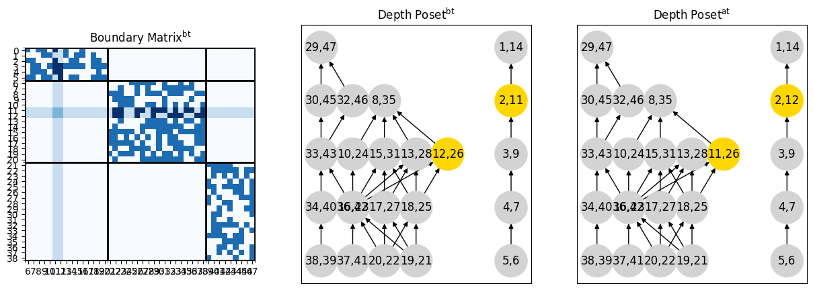

### Birth Death Pairs
|                          |                                                                                                                                                                                                                                   |
|:-------------------------|:----------------------------------------------------------------------------------------------------------------------------------------------------------------------------------------------------------------------------------|
| Before the transposition | $\{(32, 46), (29, 47), (19, 21), (34, 40), (2, 11), (17, 27), (10, 24), (30, 45), (3, 9), (5, 6), (18, 25), (20, 22), (36, 42), (1, 14), (37, 41), (8, 35), (13, 28), (33, 43), (15, 31), (4, 7), (38, 39), (12, 26), (16, 23)\}$ |
| After the transposition  | $\{(32, 46), (29, 47), (19, 21), (34, 40), (17, 27), (11, 26), (10, 24), (30, 45), (3, 9), (5, 6), (18, 25), (20, 22), (36, 42), (1, 14), (37, 41), (8, 35), (13, 28), (33, 43), (15, 31), (4, 7), (38, 39), (2, 12), (16, 23)\}$ |

### Relations
|                          | Algorithm 1                                                                                                                                                                                                                                                                                                                                                                            | Algorithm 2                                                                                                                                                                                                                                                                                                                                                                                     |
|:-------------------------|:---------------------------------------------------------------------------------------------------------------------------------------------------------------------------------------------------------------------------------------------------------------------------------------------------------------------------------------------------------------------------------------|:------------------------------------------------------------------------------------------------------------------------------------------------------------------------------------------------------------------------------------------------------------------------------------------------------------------------------------------------------------------------------------------------|
| Before the transposition | $\{(42, 45), (25, 35), (41, 43), (21, 25), (21, 31), (40, 44), (31, 35), (23, 31), (9, 14), (11, 14), (27, 28), (6, 14), (25, 31), (41, 45), (24, 35), (42, 44), (43, 45), (26, 35), (21, 24), (46, 47), (21, 27), (22, 28), (39, 44), (22, 31), (39, 47), (7, 9), (6, 7), (42, 43), (41, 47), (43, 44), (21, 23), (22, 27), (40, 45), (23, 35), (7, 11), (6, 9), (25, 26)\}$          | $\{(4, 0), (20, 8), (4, 3), (3, 1), (20, 17), (17, 15), (19, 15), (37, 36), (13, 8), (16, 10), (16, 13), (18, 13), (33, 32), (3, 0), (20, 16), (5, 0), (38, 34), (17, 8), (34, 30), (19, 8), (34, 33), (36, 30), (37, 29), (19, 17), (10, 8), (36, 33), (16, 12), (30, 29), (18, 12), (32, 29), (20, 12), (20, 18), (3, 2), (12, 8), (20, 15), (5, 2), (19, 16), (34, 32), (33, 30), (18, 8)\}$ |
| After the transposition  | $\{(6, 12), (25, 35), (41, 43), (42, 45), (21, 25), (21, 31), (40, 44), (31, 35), (23, 31), (9, 14), (27, 28), (6, 14), (25, 31), (41, 45), (24, 35), (42, 44), (43, 45), (26, 35), (21, 24), (46, 47), (21, 27), (22, 28), (39, 44), (22, 31), (39, 47), (7, 9), (6, 7), (7, 12), (42, 43), (41, 47), (43, 44), (12, 14), (21, 23), (22, 27), (40, 45), (23, 35), (6, 9), (25, 26)\}$ | $\{(20, 11), (4, 0), (20, 8), (4, 3), (3, 1), (20, 17), (33, 30), (17, 15), (11, 8), (19, 15), (37, 36), (16, 10), (15, 8), (16, 13), (18, 13), (33, 32), (3, 0), (20, 16), (5, 0), (38, 34), (34, 30), (19, 8), (34, 33), (36, 30), (37, 29), (19, 17), (10, 8), (36, 33), (30, 29), (32, 29), (3, 2), (20, 18), (20, 15), (5, 2), (19, 16), (34, 32), (18, 11), (16, 11), (18, 8)\}$          |

### Successors and Predecessers
|                 | $\text{Set}^\text{bt}(2, 11)$                         | $\text{Set}^\text{bt}(12, 26)$                                       | $\text{Set}^\text{at}(2, 12)$                         | $\text{Set}^\text{at}(11, 26)$                                       |
|:----------------|:------------------------------------------------------|:---------------------------------------------------------------------|:------------------------------------------------------|:---------------------------------------------------------------------|
| $\text{Succ}_1$ | $\text{Succ}_1^\text{bt}(2, 11) = \{(1, 14)\}$        | $\text{Succ}_1^\text{bt}(12, 26) = \{(8, 35)\}$                      | $\text{Succ}_1^\text{at}(2, 12) = \{(1, 14)\}$        | $\text{Succ}_1^\text{at}(11, 26) = \{(8, 35)\}$                      |
| $\text{Pred}_1$ | $\text{Pred}_1^\text{bt}(2, 11) = \{(4, 7)\}$         | $\text{Pred}_1^\text{bt}(12, 26) = \{(18, 25)\}$                     | $\text{Pred}_1^\text{at}(2, 12) = \{(5, 6), (4, 7)\}$ | $\text{Pred}_1^\text{at}(11, 26) = \{(18, 25)\}$                     |
| $\text{Succ}_2$ | $\text{Succ}_2^\text{bt}(2, 11) = \emptyset$          | $\text{Succ}_2^\text{bt}(12, 26) = \{(8, 35)\}$                      | $\text{Succ}_2^\text{at}(2, 12) = \emptyset$          | $\text{Succ}_2^\text{at}(11, 26) = \{(8, 35)\}$                      |
| $\text{Pred}_2$ | $\text{Pred}_2^\text{bt}(2, 11) = \{(3, 9), (5, 6)\}$ | $\text{Pred}_2^\text{bt}(12, 26) = \{(20, 22), (18, 25), (16, 23)\}$ | $\text{Pred}_2^\text{at}(2, 12) = \{(3, 9), (5, 6)\}$ | $\text{Pred}_2^\text{at}(11, 26) = \{(20, 22), (18, 25), (16, 23)\}$ |

### Temp Sets
|                                                              | Before the Transposition                     | After the Transposition                      |
|:-------------------------------------------------------------|:---------------------------------------------|:---------------------------------------------|
| $A_1 = \{(s, t)\in \text{BD}:\; f(a) < f(s) < f(t) < f(x)\}$ | $\{(5, 6), (3, 9), (4, 7)\}$                 | $\{(5, 6), (3, 9), (4, 7)\}$                 |
| $B_1 = \{(s, t)\in \text{BD}:\; U_1[t, x] = 1\}$             | $\emptyset$                                  | $\{(5, 6), (4, 7)\}$                         |
| $A_2 = \{(s, t)\in \text{BD}:\; f(b) < f(s) < f(t) < f(y)\}$ | $\{(20, 22), (19, 21), (18, 25), (16, 23)\}$ | $\{(20, 22), (19, 21), (18, 25), (16, 23)\}$ |
| $B_2 = \{(s, t)\in \text{BD}:\; U_2[b, s] = 1\}$             | $\emptyset$                                  | $\{(20, 22), (18, 25), (16, 23)\}$           |

### Equations
There are 4 equations are wrong.

| eq    | left (formula)                  | left (paramatrized)               | left (value)                       | right (formula)                                      | right (paramatrized)                                  | right (value)                      | correct   |
|:------|:--------------------------------|:----------------------------------|:-----------------------------------|:-----------------------------------------------------|:------------------------------------------------------|:-----------------------------------|:----------|
| Eq48  | $\text{Succ}_1^\text{at}(a, x)$ | $\text{Succ}_1^\text{at}(2, 12)$  | $\{(1, 14)\}$                      | $\text{Succ}_1^\text{bt}(a, b)$                      | $\text{Succ}_1^\text{bt}(2, 11)$                      | $\{(1, 14)\}$                      | ✔         |
| Eq49  | $\text{Succ}_1^\text{at}(b, y)$ | $\text{Succ}_1^\text{at}(11, 26)$ | $\{(8, 35)\}$                      | $\text{Succ}_1^\text{bt}(x, y)$                      | $\text{Succ}_1^\text{bt}(12, 26)$                     | $\{(8, 35)\}$                      | ✔         |
| Eq50  | $\text{Pred}_1^\text{at}(a, x)$ | $\text{Pred}_1^\text{at}(2, 12)$  | $\{(5, 6), (4, 7)\}$               | $\{(s, t)\in \text{BD}:\; U_1^\text{bt}[t, x] = 1\}$ | $\{(s, t)\in \text{BD}:\; U_1^\text{bt}[t, 12] = 1\}$ | $\emptyset$                        | ✘         |
| Eq50a | $\text{Pred}_1^\text{at}(a, x)$ | $\text{Pred}_1^\text{at}(2, 12)$  | $\{(5, 6), (4, 7)\}$               | $A_1^\text{bt} \cap B_1^\text{bt}$                   | $A_1^\text{bt} \cap B_1^\text{bt}$                    | $\emptyset$                        | ✘         |
| Eq50b | $\text{Pred}_1^\text{at}(a, x)$ | $\text{Pred}_1^\text{at}(2, 12)$  | $\{(5, 6), (4, 7)\}$               | $A_1^\text{bt} \cap B_1^\text{at}$                   | $A_1^\text{bt} \cap B_1^\text{at}$                    | $\{(4, 7), (5, 6)\}$               | ✔         |
| Eq51  | $\text{Pred}_1^\text{at}(b, y)$ | $\text{Pred}_1^\text{at}(11, 26)$ | $\{(18, 25)\}$                     | $\text{Pred}_1^\text{bt}(x, y)$                      | $\text{Pred}_1^\text{bt}(12, 26)$                     | $\{(18, 25)\}$                     | ✔         |
| Eq52  | $\text{Succ}_2^\text{at}(a, x)$ | $\text{Succ}_2^\text{at}(2, 12)$  | $\emptyset$                        | $\text{Succ}_2^\text{bt}(a, b)$                      | $\text{Succ}_2^\text{bt}(2, 11)$                      | $\emptyset$                        | ✔         |
| Eq53  | $\text{Succ}_2^\text{at}(b, y)$ | $\text{Succ}_2^\text{at}(11, 26)$ | $\{(8, 35)\}$                      | $\text{Succ}_2^\text{bt}(x, y)$                      | $\text{Succ}_2^\text{bt}(12, 26)$                     | $\{(8, 35)\}$                      | ✔         |
| Eq54  | $\text{Pred}_2^\text{at}(a, x)$ | $\text{Pred}_2^\text{at}(2, 12)$  | $\{(3, 9), (5, 6)\}$               | $\text{Pred}_2^\text{bt}(a, b)$                      | $\text{Pred}_2^\text{bt}(2, 11)$                      | $\{(3, 9), (5, 6)\}$               | ✔         |
| Eq55  | $\text{Pred}_2^\text{at}(b, y)$ | $\text{Pred}_2^\text{at}(11, 26)$ | $\{(20, 22), (18, 25), (16, 23)\}$ | $\{(s, t)\in \text{BD}:\; U_2^\text{bt}[b, s] = 1\}$ | $\{(s, t)\in \text{BD}:\; U_2^\text{bt}[11, s] = 1\}$ | $\emptyset$                        | ✘         |
| Eq55a | $\text{Pred}_2^\text{at}(b, y)$ | $\text{Pred}_2^\text{at}(11, 26)$ | $\{(20, 22), (18, 25), (16, 23)\}$ | $A_2^\text{bt} \cap B_2^\text{bt}$                   | $A_2^\text{bt} \cap B_2^\text{bt}$                    | $\emptyset$                        | ✘         |
| Eq55b | $\text{Pred}_2^\text{at}(b, y)$ | $\text{Pred}_2^\text{at}(11, 26)$ | $\{(20, 22), (18, 25), (16, 23)\}$ | $A_2^\text{bt} \cap B_2^\text{at}$                   | $A_2^\text{bt} \cap B_2^\text{at}$                    | $\{(20, 22), (18, 25), (16, 23)\}$ | ✔         |

## Transposition <26, 27> in complex 3
Here is a __death-death__ __no switch__ transposition <26, 27>.

$$
a = 17, \; b = 27, \; x = 12, \; y = 26
$$

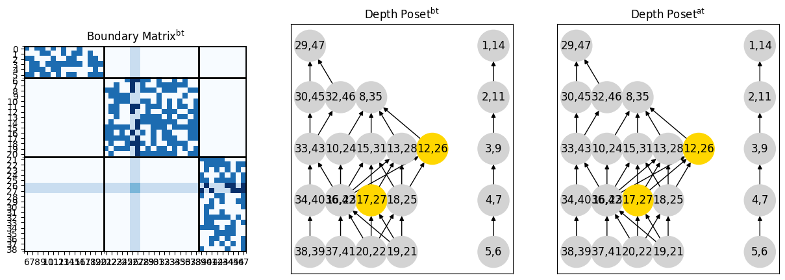

### Birth Death Pairs
|                          |                                                                                                                                                                                                                                   |
|:-------------------------|:----------------------------------------------------------------------------------------------------------------------------------------------------------------------------------------------------------------------------------|
| Before the transposition | $\{(32, 46), (29, 47), (19, 21), (34, 40), (2, 11), (17, 27), (10, 24), (30, 45), (3, 9), (5, 6), (18, 25), (20, 22), (36, 42), (1, 14), (37, 41), (8, 35), (13, 28), (33, 43), (15, 31), (4, 7), (38, 39), (12, 26), (16, 23)\}$ |
| After the transposition  | $\{(32, 46), (29, 47), (19, 21), (34, 40), (2, 11), (17, 27), (10, 24), (30, 45), (3, 9), (5, 6), (18, 25), (20, 22), (36, 42), (1, 14), (37, 41), (8, 35), (13, 28), (33, 43), (15, 31), (4, 7), (38, 39), (12, 26), (16, 23)\}$ |

### Relations
|                          | Algorithm 1                                                                                                                                                                                                                                                                                                                                                                   | Algorithm 2                                                                                                                                                                                                                                                                                                                                                                                      |
|:-------------------------|:------------------------------------------------------------------------------------------------------------------------------------------------------------------------------------------------------------------------------------------------------------------------------------------------------------------------------------------------------------------------------|:-------------------------------------------------------------------------------------------------------------------------------------------------------------------------------------------------------------------------------------------------------------------------------------------------------------------------------------------------------------------------------------------------|
| Before the transposition | $\{(42, 45), (25, 35), (41, 43), (21, 25), (21, 31), (40, 44), (31, 35), (23, 31), (9, 14), (11, 14), (27, 28), (6, 14), (25, 31), (41, 45), (24, 35), (42, 44), (43, 45), (26, 35), (21, 24), (46, 47), (21, 27), (22, 28), (39, 44), (22, 31), (39, 47), (7, 9), (6, 7), (42, 43), (41, 47), (43, 44), (21, 23), (22, 27), (40, 45), (23, 35), (7, 11), (6, 9), (25, 26)\}$ | $\{(4, 0), (20, 8), (4, 3), (3, 1), (20, 17), (17, 15), (19, 15), (37, 36), (13, 8), (16, 10), (16, 13), (18, 13), (33, 32), (3, 0), (20, 16), (5, 0), (38, 34), (17, 8), (34, 30), (19, 8), (34, 33), (36, 30), (37, 29), (19, 17), (10, 8), (36, 33), (16, 12), (30, 29), (18, 12), (32, 29), (20, 12), (20, 18), (3, 2), (12, 8), (20, 15), (5, 2), (19, 16), (34, 32), (33, 30), (18, 8)\}$  |
| After the transposition  | $\{(25, 35), (41, 43), (42, 45), (21, 25), (21, 31), (40, 44), (31, 35), (23, 31), (9, 14), (11, 14), (27, 28), (6, 14), (25, 31), (41, 45), (24, 35), (42, 44), (43, 45), (26, 35), (21, 24), (46, 47), (21, 27), (22, 28), (39, 44), (22, 31), (39, 47), (7, 9), (6, 7), (42, 43), (41, 47), (43, 44), (21, 23), (22, 27), (40, 45), (23, 35), (7, 11), (6, 9), (25, 26)\}$ | $\{(4, 0), (20, 8), (4, 3), (3, 1), (20, 17), (17, 12), (17, 15), (19, 15), (37, 36), (13, 8), (16, 10), (16, 13), (18, 13), (33, 32), (3, 0), (20, 16), (5, 0), (38, 34), (34, 30), (19, 8), (34, 33), (36, 30), (37, 29), (19, 17), (10, 8), (36, 33), (16, 12), (30, 29), (18, 12), (32, 29), (20, 12), (20, 18), (3, 2), (12, 8), (20, 15), (5, 2), (19, 16), (34, 32), (33, 30), (18, 8)\}$ |

### Successors and Predecessers
No such node in the Depth Poset

### Temp Sets
|                                                               | Before the Transposition                                                                                                                                   | After the Transposition                                                                                                                                    |
|:--------------------------------------------------------------|:-----------------------------------------------------------------------------------------------------------------------------------------------------------|:-----------------------------------------------------------------------------------------------------------------------------------------------------------|
| $\mathcal{B} = \{(s, t)\in \text{BD}:\; f(s) > f(x)\}$        | $\{(17, 27), (38, 39), (32, 46), (34, 40), (36, 42), (37, 41), (30, 45), (13, 28), (18, 25), (29, 47), (20, 22), (19, 21), (33, 43), (15, 31), (16, 23)\}$ | $\{(17, 27), (38, 39), (32, 46), (34, 40), (36, 42), (37, 41), (30, 45), (13, 28), (18, 25), (29, 47), (20, 22), (19, 21), (33, 43), (15, 31), (16, 23)\}$ |
| $\mathcal{N} = \{(s, t)\in \text{BD}:\; f(x) > f(s) > f(a)\}$ | $\emptyset$                                                                                                                                                | $\emptyset$                                                                                                                                                |

### Equations
There are 2 equations are wrong.

| eq   | left (formula)                  | left (paramatrized)               | left (value)             | right (formula)                                                                        | right (paramatrized)                                                                         | right (value)                      | correct   |
|:-----|:--------------------------------|:----------------------------------|:-------------------------|:---------------------------------------------------------------------------------------|:---------------------------------------------------------------------------------------------|:-----------------------------------|:----------|
| Eq36 | $\text{Succ}_2^\text{at}(x, y)$ | $\text{Succ}_2^\text{at}(12, 26)$ | $\{(8, 35)\}$            | $\text{Succ}_2^\text{bt}(x, y) \oplus \{(a, b)\} \oplus \text{Succ}_2^\text{bt}(a, b)$ | $\text{Succ}_2^\text{bt}(12, 26) \oplus \{(17, 27)\} \oplus \text{Succ}_2^\text{bt}(17, 27)$ | $\{(15, 31), (17, 27)\}$           | ✘         |
| Eq37 | $\text{Pred}_2^\text{at}(a, b)$ | $\text{Pred}_2^\text{at}(17, 27)$ | $\{(20, 22), (19, 21)\}$ | $\text{Pred}_2^\text{bt}(a, b) \oplus \{(x, y)\}$                                      | $\text{Pred}_2^\text{bt}(17, 27) \oplus \{(12, 26)\}$                                        | $\{(20, 22), (19, 21), (12, 26)\}$ | ✘         |

## Transposition <32, 33> in complex 3
Here is a __birth-birth__ __switch forward__ transposition <32, 33>.

$$
a = 32, \; b = 46, \; x = 33, \; y = 43
$$

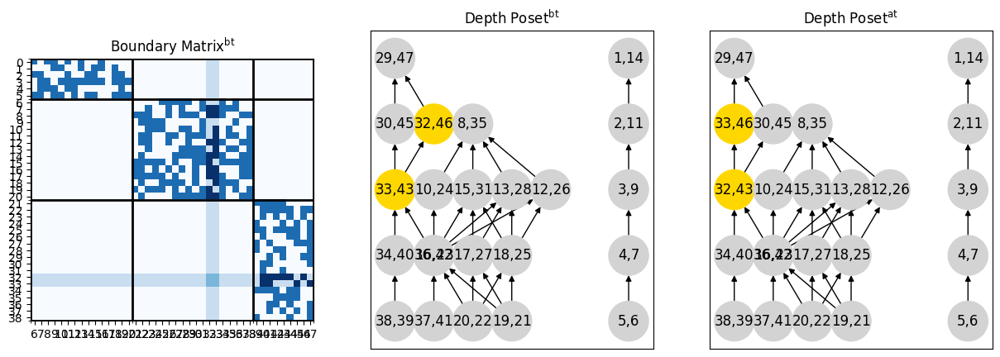

### Birth Death Pairs
|                          |                                                                                                                                                                                                                                   |
|:-------------------------|:----------------------------------------------------------------------------------------------------------------------------------------------------------------------------------------------------------------------------------|
| Before the transposition | $\{(32, 46), (29, 47), (19, 21), (34, 40), (2, 11), (17, 27), (10, 24), (30, 45), (3, 9), (5, 6), (18, 25), (20, 22), (36, 42), (1, 14), (37, 41), (8, 35), (13, 28), (33, 43), (15, 31), (4, 7), (38, 39), (12, 26), (16, 23)\}$ |
| After the transposition  | $\{(32, 43), (29, 47), (19, 21), (34, 40), (2, 11), (17, 27), (10, 24), (30, 45), (3, 9), (5, 6), (18, 25), (20, 22), (36, 42), (1, 14), (37, 41), (8, 35), (13, 28), (4, 7), (15, 31), (33, 46), (38, 39), (12, 26), (16, 23)\}$ |

### Relations
|                          | Algorithm 1                                                                                                                                                                                                                                                                                                                                                                                       | Algorithm 2                                                                                                                                                                                                                                                                                                                                                                                     |
|:-------------------------|:--------------------------------------------------------------------------------------------------------------------------------------------------------------------------------------------------------------------------------------------------------------------------------------------------------------------------------------------------------------------------------------------------|:------------------------------------------------------------------------------------------------------------------------------------------------------------------------------------------------------------------------------------------------------------------------------------------------------------------------------------------------------------------------------------------------|
| Before the transposition | $\{(42, 45), (25, 35), (41, 43), (21, 25), (21, 31), (40, 44), (31, 35), (23, 31), (9, 14), (11, 14), (27, 28), (6, 14), (25, 31), (41, 45), (24, 35), (42, 44), (43, 45), (26, 35), (21, 24), (46, 47), (21, 27), (22, 28), (39, 44), (22, 31), (39, 47), (7, 9), (6, 7), (42, 43), (41, 47), (43, 44), (21, 23), (22, 27), (40, 45), (23, 35), (7, 11), (6, 9), (25, 26)\}$                     | $\{(4, 0), (20, 8), (4, 3), (3, 1), (20, 17), (17, 15), (19, 15), (37, 36), (13, 8), (16, 10), (16, 13), (18, 13), (33, 32), (3, 0), (20, 16), (5, 0), (38, 34), (17, 8), (34, 30), (19, 8), (34, 33), (36, 30), (37, 29), (19, 17), (10, 8), (36, 33), (16, 12), (30, 29), (18, 12), (32, 29), (20, 12), (20, 18), (3, 2), (12, 8), (20, 15), (5, 2), (19, 16), (34, 32), (33, 30), (18, 8)\}$ |
| After the transposition  | $\{(25, 35), (41, 43), (42, 45), (43, 46), (21, 25), (21, 31), (40, 44), (31, 35), (23, 31), (9, 14), (11, 14), (27, 28), (6, 14), (25, 31), (41, 45), (24, 35), (42, 44), (43, 45), (26, 35), (21, 24), (46, 47), (21, 27), (22, 28), (39, 44), (22, 31), (39, 47), (7, 9), (6, 7), (42, 43), (41, 47), (43, 44), (21, 23), (43, 47), (22, 27), (40, 45), (23, 35), (7, 11), (6, 9), (25, 26)\}$ | $\{(4, 0), (20, 8), (4, 3), (3, 1), (20, 17), (17, 15), (19, 15), (37, 36), (13, 8), (16, 10), (32, 30), (16, 13), (32, 33), (18, 13), (3, 0), (20, 16), (5, 0), (38, 34), (17, 8), (34, 30), (19, 8), (34, 33), (36, 30), (37, 29), (19, 17), (10, 8), (36, 33), (16, 12), (30, 29), (18, 12), (20, 12), (20, 18), (3, 2), (12, 8), (20, 15), (5, 2), (19, 16), (34, 32), (18, 8)\}$           |

### Successors and Predecessers
|                 | $\text{Set}^\text{bt}(32, 46)$                             | $\text{Set}^\text{bt}(33, 43)$                             | $\text{Set}^\text{at}(32, 43)$                                       | $\text{Set}^\text{at}(33, 46)$                                       |
|:----------------|:-----------------------------------------------------------|:-----------------------------------------------------------|:---------------------------------------------------------------------|:---------------------------------------------------------------------|
| $\text{Succ}_1$ | $\text{Succ}_1^\text{bt}(32, 46) = \{(29, 47)\}$           | $\text{Succ}_1^\text{bt}(33, 43) = \{(30, 45)\}$           | $\text{Succ}_1^\text{at}(32, 43) = \{(33, 46), (30, 45), (29, 47)\}$ | $\text{Succ}_1^\text{at}(33, 46) = \{(29, 47)\}$                     |
| $\text{Pred}_1$ | $\text{Pred}_1^\text{bt}(32, 46) = \emptyset$              | $\text{Pred}_1^\text{bt}(33, 43) = \{(36, 42), (37, 41)\}$ | $\text{Pred}_1^\text{at}(32, 43) = \{(36, 42), (37, 41)\}$           | $\text{Pred}_1^\text{at}(33, 46) = \{(32, 43)\}$                     |
| $\text{Succ}_2$ | $\text{Succ}_2^\text{bt}(32, 46) = \{(29, 47)\}$           | $\text{Succ}_2^\text{bt}(33, 43) = \{(30, 45), (32, 46)\}$ | $\text{Succ}_2^\text{at}(32, 43) = \{(33, 46), (30, 45)\}$           | $\text{Succ}_2^\text{at}(33, 46) = \emptyset$                        |
| $\text{Pred}_2$ | $\text{Pred}_2^\text{bt}(32, 46) = \{(34, 40), (33, 43)\}$ | $\text{Pred}_2^\text{bt}(33, 43) = \{(34, 40), (36, 42)\}$ | $\text{Pred}_2^\text{at}(32, 43) = \{(34, 40)\}$                     | $\text{Pred}_2^\text{at}(33, 46) = \{(32, 43), (34, 40), (36, 42)\}$ |

### Temp Sets
|                                                               | Before the Transposition                                                                                                                                                                  | After the Transposition                                                                                                                                                                   |
|:--------------------------------------------------------------|:------------------------------------------------------------------------------------------------------------------------------------------------------------------------------------------|:------------------------------------------------------------------------------------------------------------------------------------------------------------------------------------------|
| $\mathcal{L} = \{(s, t)\in \text{BD}:\; f(t) < f(y)\}$        | $\{(19, 21), (34, 40), (2, 11), (17, 27), (10, 24), (3, 9), (5, 6), (18, 25), (20, 22), (36, 42), (1, 14), (37, 41), (8, 35), (13, 28), (4, 7), (15, 31), (38, 39), (12, 26), (16, 23)\}$ | $\{(19, 21), (34, 40), (2, 11), (17, 27), (10, 24), (3, 9), (5, 6), (18, 25), (20, 22), (36, 42), (1, 14), (37, 41), (8, 35), (13, 28), (4, 7), (15, 31), (38, 39), (12, 26), (16, 23)\}$ |
| $\mathcal{M} = \{(s, t)\in \text{BD}:\; f(y) < f(t) < f(b)\}$ | $\{(30, 45)\}$                                                                                                                                                                            | $\{(30, 45)\}$                                                                                                                                                                            |

### Equations
There are 1 equations are wrong.

| eq   | left (formula)                  | left (paramatrized)               | left (value)                       | right (formula)                                                                                           | right (paramatrized)                                                                                            | right (value)                      | correct   |
|:-----|:--------------------------------|:----------------------------------|:-----------------------------------|:----------------------------------------------------------------------------------------------------------|:----------------------------------------------------------------------------------------------------------------|:-----------------------------------|:----------|
| Eq08 | $\text{Succ}_1^\text{at}(a, y)$ | $\text{Succ}_1^\text{at}(32, 43)$ | $\{(33, 46), (30, 45), (29, 47)\}$ | $\text{Succ}_1^\text{bt}(x, y) \oplus \{(x, b)\} \oplus \text{Succ}_1^\text{bt}(a, b)$                    | $\text{Succ}_1^\text{bt}(33, 43) \oplus \{(33, 46)\} \oplus \text{Succ}_1^\text{bt}(32, 46)$                    | $\{(33, 46), (30, 45), (29, 47)\}$ | ✔         |
| Eq09 | $\text{Succ}_1^\text{at}(x, b)$ | $\text{Succ}_1^\text{at}(33, 46)$ | $\{(29, 47)\}$                     | $\text{Succ}_1^\text{bt}(a, b)$                                                                           | $\text{Succ}_1^\text{bt}(32, 46)$                                                                               | $\{(29, 47)\}$                     | ✔         |
| Eq10 | $\text{Pred}_1^\text{at}(a, y)$ | $\text{Pred}_1^\text{at}(32, 43)$ | $\{(36, 42), (37, 41)\}$           | $\text{Pred}_1^\text{bt}(x, y)$                                                                           | $\text{Pred}_1^\text{bt}(33, 43)$                                                                               | $\{(36, 42), (37, 41)\}$           | ✔         |
| Eq11 | $\text{Pred}_1^\text{at}(x, b)$ | $\text{Pred}_1^\text{at}(33, 46)$ | $\{(32, 43)\}$                     | $\text{Pred}_1^\text{bt}(a, b) \oplus \{(a, y)\}$                                                         | $\text{Pred}_1^\text{bt}(32, 46) \oplus \{(32, 43)\}$                                                           | $\{(32, 43)\}$                     | ✔         |
| Eq12 | $\text{Succ}_2^\text{at}(a, y)$ | $\text{Succ}_2^\text{at}(32, 43)$ | $\{(33, 46), (30, 45)\}$           | $\text{Succ}_2^\text{bt}(x, y) \oplus \{(x, b), (a, b)\}$                                                 | $\text{Succ}_2^\text{bt}(33, 43) \oplus \{(33, 46), (32, 46)\}$                                                 | $\{(33, 46), (30, 45)\}$           | ✔         |
| Eq13 | $\text{Succ}_2^\text{at}(x, b)$ | $\text{Succ}_2^\text{at}(33, 46)$ | $\emptyset$                        | $\text{Succ}_2^\text{bt}(a, b)$                                                                           | $\text{Succ}_2^\text{bt}(32, 46)$                                                                               | $\{(29, 47)\}$                     | ✘         |
| Eq14 | $\text{Pred}_2^\text{at}(a, y)$ | $\text{Pred}_2^\text{at}(32, 43)$ | $\{(34, 40)\}$                     | $[\text{Pred}_2^\text{bt}(a, b) \cap \mathcal{L}]$                                                        | $[\text{Pred}_2^\text{bt}(32, 46) \cap \mathcal{L}]$                                                            | $\{(34, 40)\}$                     | ✔         |
| Eq15 | $\text{Pred}_2^\text{at}(x, b)$ | $\text{Pred}_2^\text{at}(33, 46)$ | $\{(32, 43), (34, 40), (36, 42)\}$ | $\text{Pred}_2^\text{bt}(x, y) \oplus \{(a, y)\} \oplus [\text{Pred}_2^\text{bt}(a, b) \cap \mathcal{M}]$ | $\text{Pred}_2^\text{bt}(33, 43) \oplus \{(32, 43)\} \oplus [\text{Pred}_2^\text{bt}(32, 46) \cap \mathcal{M}]$ | $\{(32, 43), (34, 40), (36, 42)\}$ | ✔         |

## Transposition <33, 34> in complex 3
Here is a __birth-birth__ __switch forward__ transposition <33, 34>.

$$
a = 33, \; b = 43, \; x = 34, \; y = 40
$$

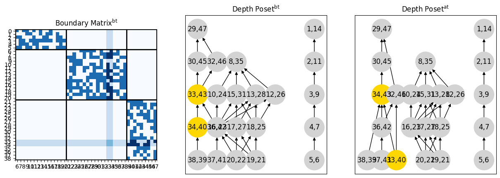

### Birth Death Pairs
|                          |                                                                                                                                                                                                                                   |
|:-------------------------|:----------------------------------------------------------------------------------------------------------------------------------------------------------------------------------------------------------------------------------|
| Before the transposition | $\{(32, 46), (29, 47), (19, 21), (34, 40), (2, 11), (17, 27), (10, 24), (30, 45), (3, 9), (5, 6), (18, 25), (20, 22), (36, 42), (1, 14), (37, 41), (8, 35), (13, 28), (33, 43), (15, 31), (4, 7), (38, 39), (12, 26), (16, 23)\}$ |
| After the transposition  | $\{(32, 46), (29, 47), (19, 21), (2, 11), (17, 27), (34, 43), (10, 24), (30, 45), (3, 9), (5, 6), (18, 25), (20, 22), (36, 42), (1, 14), (37, 41), (8, 35), (13, 28), (33, 40), (4, 7), (15, 31), (38, 39), (12, 26), (16, 23)\}$ |

### Relations
|                          | Algorithm 1                                                                                                                                                                                                                                                                                                                                                                   | Algorithm 2                                                                                                                                                                                                                                                                                                                                                                                     |
|:-------------------------|:------------------------------------------------------------------------------------------------------------------------------------------------------------------------------------------------------------------------------------------------------------------------------------------------------------------------------------------------------------------------------|:------------------------------------------------------------------------------------------------------------------------------------------------------------------------------------------------------------------------------------------------------------------------------------------------------------------------------------------------------------------------------------------------|
| Before the transposition | $\{(42, 45), (25, 35), (41, 43), (21, 25), (21, 31), (40, 44), (31, 35), (23, 31), (9, 14), (11, 14), (27, 28), (6, 14), (25, 31), (41, 45), (24, 35), (42, 44), (43, 45), (26, 35), (21, 24), (46, 47), (21, 27), (22, 28), (39, 44), (22, 31), (39, 47), (7, 9), (6, 7), (42, 43), (41, 47), (43, 44), (21, 23), (22, 27), (40, 45), (23, 35), (7, 11), (6, 9), (25, 26)\}$ | $\{(4, 0), (20, 8), (4, 3), (3, 1), (20, 17), (17, 15), (19, 15), (37, 36), (13, 8), (16, 10), (16, 13), (18, 13), (33, 32), (3, 0), (20, 16), (5, 0), (38, 34), (17, 8), (34, 30), (19, 8), (34, 33), (36, 30), (37, 29), (19, 17), (10, 8), (36, 33), (16, 12), (30, 29), (18, 12), (32, 29), (20, 12), (20, 18), (3, 2), (12, 8), (20, 15), (5, 2), (19, 16), (34, 32), (33, 30), (18, 8)\}$ |
| After the transposition  | $\{(25, 35), (41, 43), (42, 45), (21, 25), (21, 31), (31, 35), (23, 31), (9, 14), (11, 14), (27, 28), (6, 14), (25, 31), (41, 45), (24, 35), (42, 44), (43, 45), (26, 35), (21, 24), (46, 47), (21, 27), (22, 28), (39, 44), (40, 43), (22, 31), (39, 47), (7, 9), (6, 7), (42, 43), (41, 47), (43, 44), (21, 23), (22, 27), (23, 35), (7, 11), (6, 9), (25, 26)\}$           | $\{(4, 0), (20, 8), (4, 3), (3, 1), (20, 17), (17, 15), (19, 15), (37, 36), (13, 8), (36, 34), (16, 10), (16, 13), (18, 13), (33, 32), (3, 0), (20, 16), (5, 0), (38, 34), (17, 8), (19, 8), (37, 29), (19, 17), (10, 8), (16, 12), (30, 29), (18, 12), (32, 29), (33, 34), (20, 12), (20, 18), (3, 2), (12, 8), (20, 15), (5, 2), (19, 16), (36, 32), (33, 30), (18, 8)\}$                     |

### Successors and Predecessers
|                 | $\text{Set}^\text{bt}(33, 43)$                             | $\text{Set}^\text{bt}(34, 40)$                                       | $\text{Set}^\text{at}(33, 40)$                                       | $\text{Set}^\text{at}(34, 43)$                                       |
|:----------------|:-----------------------------------------------------------|:---------------------------------------------------------------------|:---------------------------------------------------------------------|:---------------------------------------------------------------------|
| $\text{Succ}_1$ | $\text{Succ}_1^\text{bt}(33, 43) = \{(30, 45)\}$           | $\text{Succ}_1^\text{bt}(34, 40) = \{(30, 45)\}$                     | $\text{Succ}_1^\text{at}(33, 40) = \{(34, 43)\}$                     | $\text{Succ}_1^\text{at}(34, 43) = \{(30, 45)\}$                     |
| $\text{Pred}_1$ | $\text{Pred}_1^\text{bt}(33, 43) = \{(36, 42), (37, 41)\}$ | $\text{Pred}_1^\text{bt}(34, 40) = \emptyset$                        | $\text{Pred}_1^\text{at}(33, 40) = \emptyset$                        | $\text{Pred}_1^\text{at}(34, 43) = \{(33, 40), (36, 42), (37, 41)\}$ |
| $\text{Succ}_2$ | $\text{Succ}_2^\text{bt}(33, 43) = \{(30, 45), (32, 46)\}$ | $\text{Succ}_2^\text{bt}(34, 40) = \{(33, 43), (30, 45), (32, 46)\}$ | $\text{Succ}_2^\text{at}(33, 40) = \{(34, 43), (30, 45), (32, 46)\}$ | $\text{Succ}_2^\text{at}(34, 43) = \emptyset$                        |
| $\text{Pred}_2$ | $\text{Pred}_2^\text{bt}(33, 43) = \{(34, 40), (36, 42)\}$ | $\text{Pred}_2^\text{bt}(34, 40) = \{(38, 39)\}$                     | $\text{Pred}_2^\text{at}(33, 40) = \emptyset$                        | $\text{Pred}_2^\text{at}(34, 43) = \{(33, 40), (36, 42), (38, 39)\}$ |

### Temp Sets
|                                                               | Before the Transposition                                                                                                                                    | After the Transposition                                                                                                                                     |
|:--------------------------------------------------------------|:------------------------------------------------------------------------------------------------------------------------------------------------------------|:------------------------------------------------------------------------------------------------------------------------------------------------------------|
| $\mathcal{L} = \{(s, t)\in \text{BD}:\; f(t) < f(y)\}$        | $\{(17, 27), (10, 24), (38, 39), (12, 26), (19, 21), (1, 14), (8, 35), (3, 9), (13, 28), (18, 25), (5, 6), (20, 22), (2, 11), (4, 7), (15, 31), (16, 23)\}$ | $\{(17, 27), (10, 24), (38, 39), (12, 26), (19, 21), (1, 14), (8, 35), (3, 9), (13, 28), (18, 25), (5, 6), (20, 22), (2, 11), (4, 7), (15, 31), (16, 23)\}$ |
| $\mathcal{M} = \{(s, t)\in \text{BD}:\; f(y) < f(t) < f(b)\}$ | $\{(36, 42), (37, 41)\}$                                                                                                                                    | $\{(36, 42), (37, 41)\}$                                                                                                                                    |

### Equations
There are 1 equations are wrong.

| eq   | left (formula)                  | left (paramatrized)               | left (value)                       | right (formula)                                                                                           | right (paramatrized)                                                                                            | right (value)                      | correct   |
|:-----|:--------------------------------|:----------------------------------|:-----------------------------------|:----------------------------------------------------------------------------------------------------------|:----------------------------------------------------------------------------------------------------------------|:-----------------------------------|:----------|
| Eq08 | $\text{Succ}_1^\text{at}(a, y)$ | $\text{Succ}_1^\text{at}(33, 40)$ | $\{(34, 43)\}$                     | $\text{Succ}_1^\text{bt}(x, y) \oplus \{(x, b)\} \oplus \text{Succ}_1^\text{bt}(a, b)$                    | $\text{Succ}_1^\text{bt}(34, 40) \oplus \{(34, 43)\} \oplus \text{Succ}_1^\text{bt}(33, 43)$                    | $\{(34, 43)\}$                     | ✔         |
| Eq09 | $\text{Succ}_1^\text{at}(x, b)$ | $\text{Succ}_1^\text{at}(34, 43)$ | $\{(30, 45)\}$                     | $\text{Succ}_1^\text{bt}(a, b)$                                                                           | $\text{Succ}_1^\text{bt}(33, 43)$                                                                               | $\{(30, 45)\}$                     | ✔         |
| Eq10 | $\text{Pred}_1^\text{at}(a, y)$ | $\text{Pred}_1^\text{at}(33, 40)$ | $\emptyset$                        | $\text{Pred}_1^\text{bt}(x, y)$                                                                           | $\text{Pred}_1^\text{bt}(34, 40)$                                                                               | $\emptyset$                        | ✔         |
| Eq11 | $\text{Pred}_1^\text{at}(x, b)$ | $\text{Pred}_1^\text{at}(34, 43)$ | $\{(33, 40), (36, 42), (37, 41)\}$ | $\text{Pred}_1^\text{bt}(a, b) \oplus \{(a, y)\}$                                                         | $\text{Pred}_1^\text{bt}(33, 43) \oplus \{(33, 40)\}$                                                           | $\{(33, 40), (36, 42), (37, 41)\}$ | ✔         |
| Eq12 | $\text{Succ}_2^\text{at}(a, y)$ | $\text{Succ}_2^\text{at}(33, 40)$ | $\{(34, 43), (30, 45), (32, 46)\}$ | $\text{Succ}_2^\text{bt}(x, y) \oplus \{(x, b), (a, b)\}$                                                 | $\text{Succ}_2^\text{bt}(34, 40) \oplus \{(34, 43), (33, 43)\}$                                                 | $\{(34, 43), (30, 45), (32, 46)\}$ | ✔         |
| Eq13 | $\text{Succ}_2^\text{at}(x, b)$ | $\text{Succ}_2^\text{at}(34, 43)$ | $\emptyset$                        | $\text{Succ}_2^\text{bt}(a, b)$                                                                           | $\text{Succ}_2^\text{bt}(33, 43)$                                                                               | $\{(30, 45), (32, 46)\}$           | ✘         |
| Eq14 | $\text{Pred}_2^\text{at}(a, y)$ | $\text{Pred}_2^\text{at}(33, 40)$ | $\emptyset$                        | $[\text{Pred}_2^\text{bt}(a, b) \cap \mathcal{L}]$                                                        | $[\text{Pred}_2^\text{bt}(33, 43) \cap \mathcal{L}]$                                                            | $\emptyset$                        | ✔         |
| Eq15 | $\text{Pred}_2^\text{at}(x, b)$ | $\text{Pred}_2^\text{at}(34, 43)$ | $\{(33, 40), (36, 42), (38, 39)\}$ | $\text{Pred}_2^\text{bt}(x, y) \oplus \{(a, y)\} \oplus [\text{Pred}_2^\text{bt}(a, b) \cap \mathcal{M}]$ | $\text{Pred}_2^\text{bt}(34, 40) \oplus \{(33, 40)\} \oplus [\text{Pred}_2^\text{bt}(33, 43) \cap \mathcal{M}]$ | $\{(33, 40), (36, 42), (38, 39)\}$ | ✔         |

## Transposition <35, 36> in complex 3
Here is a __birth-death__ __switch forward__ transposition <35, 36>.

$$
a = 8, \; b = 35, \; x = 36, \; y = 42
$$

### Birth Death Pairs
|                          |                                                                                                                                                                                                                                   |
|:-------------------------|:----------------------------------------------------------------------------------------------------------------------------------------------------------------------------------------------------------------------------------|
| Before the transposition | $\{(32, 46), (29, 47), (19, 21), (34, 40), (2, 11), (17, 27), (10, 24), (30, 45), (3, 9), (5, 6), (18, 25), (20, 22), (36, 42), (1, 14), (37, 41), (8, 35), (13, 28), (33, 43), (15, 31), (4, 7), (38, 39), (12, 26), (16, 23)\}$ |
| After the transposition  | $\{(32, 46), (35, 42), (29, 47), (19, 21), (34, 40), (2, 11), (17, 27), (10, 24), (8, 36), (30, 45), (3, 9), (5, 6), (18, 25), (20, 22), (1, 14), (37, 41), (13, 28), (33, 43), (15, 31), (4, 7), (38, 39), (12, 26), (16, 23)\}$ |

### Relations
|                          | Algorithm 1                                                                                                                                                                                                                                                                                                                                                                             | Algorithm 2                                                                                                                                                                                                                                                                                                                                                                                     |
|:-------------------------|:----------------------------------------------------------------------------------------------------------------------------------------------------------------------------------------------------------------------------------------------------------------------------------------------------------------------------------------------------------------------------------------|:------------------------------------------------------------------------------------------------------------------------------------------------------------------------------------------------------------------------------------------------------------------------------------------------------------------------------------------------------------------------------------------------|
| Before the transposition | $\{(42, 45), (25, 35), (41, 43), (21, 25), (21, 31), (40, 44), (31, 35), (23, 31), (9, 14), (11, 14), (27, 28), (6, 14), (25, 31), (41, 45), (24, 35), (42, 44), (43, 45), (26, 35), (21, 24), (46, 47), (21, 27), (22, 28), (39, 44), (22, 31), (39, 47), (7, 9), (6, 7), (42, 43), (41, 47), (43, 44), (21, 23), (22, 27), (40, 45), (23, 35), (7, 11), (6, 9), (25, 26)\}$           | $\{(4, 0), (20, 8), (4, 3), (3, 1), (20, 17), (17, 15), (19, 15), (37, 36), (13, 8), (16, 10), (16, 13), (18, 13), (33, 32), (3, 0), (20, 16), (5, 0), (38, 34), (17, 8), (34, 30), (19, 8), (34, 33), (36, 30), (37, 29), (19, 17), (10, 8), (36, 33), (16, 12), (30, 29), (18, 12), (32, 29), (20, 12), (20, 18), (3, 2), (12, 8), (20, 15), (5, 2), (19, 16), (34, 32), (33, 30), (18, 8)\}$ |
| After the transposition  | $\{(42, 45), (41, 43), (26, 36), (21, 25), (21, 31), (40, 44), (23, 31), (9, 14), (11, 14), (27, 28), (28, 36), (6, 14), (25, 31), (41, 45), (42, 44), (43, 45), (21, 24), (46, 47), (21, 27), (22, 28), (39, 44), (21, 36), (22, 31), (39, 47), (7, 9), (6, 7), (27, 36), (42, 43), (41, 47), (43, 44), (25, 36), (21, 23), (22, 27), (31, 36), (40, 45), (7, 11), (6, 9), (25, 26)\}$ | $\{(35, 30), (4, 0), (20, 8), (35, 33), (4, 3), (3, 1), (20, 17), (17, 15), (19, 15), (13, 8), (16, 10), (16, 13), (18, 13), (33, 32), (3, 0), (20, 16), (5, 0), (38, 34), (17, 8), (34, 30), (19, 8), (34, 33), (37, 29), (19, 17), (10, 8), (16, 12), (30, 29), (18, 12), (32, 29), (20, 12), (20, 18), (3, 2), (12, 8), (20, 15), (5, 2), (19, 16), (34, 32), (33, 30), (18, 8)\}$           |

### Successors and Predecessers
|                 | $\text{Set}^\text{bt}(8, 35)$                                                                               | $\text{Set}^\text{bt}(36, 42)$                             | $\text{Set}^\text{at}(8, 36)$                                                                               | $\text{Set}^\text{at}(35, 42)$                             |
|:----------------|:------------------------------------------------------------------------------------------------------------|:-----------------------------------------------------------|:------------------------------------------------------------------------------------------------------------|:-----------------------------------------------------------|
| $\text{Succ}_1$ | $\text{Succ}_1^\text{bt}(8, 35) = \emptyset$                                                                | $\text{Succ}_1^\text{bt}(36, 42) = \{(33, 43), (30, 45)\}$ | $\text{Succ}_1^\text{at}(8, 36) = \emptyset$                                                                | $\text{Succ}_1^\text{at}(35, 42) = \{(33, 43), (30, 45)\}$ |
| $\text{Pred}_1$ | $\text{Pred}_1^\text{bt}(8, 35) = \{(10, 24), (12, 26), (18, 25), (15, 31), (16, 23)\}$                     | $\text{Pred}_1^\text{bt}(36, 42) = \emptyset$              | $\text{Pred}_1^\text{at}(8, 36) = \{(12, 26), (13, 28), (18, 25), (19, 21), (15, 31), (17, 27)\}$           | $\text{Pred}_1^\text{at}(35, 42) = \emptyset$              |
| $\text{Succ}_2$ | $\text{Succ}_2^\text{bt}(8, 35) = \emptyset$                                                                | $\text{Succ}_2^\text{bt}(36, 42) = \{(33, 43), (30, 45)\}$ | $\text{Succ}_2^\text{at}(8, 36) = \emptyset$                                                                | $\text{Succ}_2^\text{at}(35, 42) = \{(33, 43), (30, 45)\}$ |
| $\text{Pred}_2$ | $\text{Pred}_2^\text{bt}(8, 35) = \{(10, 24), (12, 26), (13, 28), (18, 25), (20, 22), (19, 21), (17, 27)\}$ | $\text{Pred}_2^\text{bt}(36, 42) = \{(37, 41)\}$           | $\text{Pred}_2^\text{at}(8, 36) = \{(10, 24), (12, 26), (13, 28), (18, 25), (20, 22), (19, 21), (17, 27)\}$ | $\text{Pred}_2^\text{at}(35, 42) = \emptyset$              |

### Temp Sets
|                                                              | Before the Transposition                                                                       | After the Transposition                                                                        |
|:-------------------------------------------------------------|:-----------------------------------------------------------------------------------------------|:-----------------------------------------------------------------------------------------------|
| $A_1 = \{(s, t)\in \text{BD}:\; f(a) < f(s) < f(t) < f(x)\}$ | $\{(10, 24), (12, 26), (16, 23), (13, 28), (18, 25), (20, 22), (19, 21), (15, 31), (17, 27)\}$ | $\{(10, 24), (12, 26), (16, 23), (13, 28), (18, 25), (20, 22), (19, 21), (15, 31), (17, 27)\}$ |
| $B_1 = \{(s, t)\in \text{BD}:\; U_1[t, x] = 1\}$             | $\emptyset$                                                                                    | $\{(12, 26), (13, 28), (18, 25), (19, 21), (15, 31), (17, 27)\}$                               |
| $A_2 = \{(s, t)\in \text{BD}:\; f(b) < f(s) < f(t) < f(y)\}$ | $\{(38, 39), (37, 41)\}$                                                                       | $\{(38, 39), (37, 41)\}$                                                                       |
| $B_2 = \{(s, t)\in \text{BD}:\; U_2[b, s] = 1\}$             | $\emptyset$                                                                                    | $\emptyset$                                                                                    |

### Equations
There are 2 equations are wrong.

| eq    | left (formula)                  | left (paramatrized)               | left (value)                                                               | right (formula)                                      | right (paramatrized)                                  | right (value)                                                              | correct   |
|:------|:--------------------------------|:----------------------------------|:---------------------------------------------------------------------------|:-----------------------------------------------------|:------------------------------------------------------|:---------------------------------------------------------------------------|:----------|
| Eq48  | $\text{Succ}_1^\text{at}(a, x)$ | $\text{Succ}_1^\text{at}(8, 36)$  | $\emptyset$                                                                | $\text{Succ}_1^\text{bt}(a, b)$                      | $\text{Succ}_1^\text{bt}(8, 35)$                      | $\emptyset$                                                                | ✔         |
| Eq49  | $\text{Succ}_1^\text{at}(b, y)$ | $\text{Succ}_1^\text{at}(35, 42)$ | $\{(33, 43), (30, 45)\}$                                                   | $\text{Succ}_1^\text{bt}(x, y)$                      | $\text{Succ}_1^\text{bt}(36, 42)$                     | $\{(33, 43), (30, 45)\}$                                                   | ✔         |
| Eq50  | $\text{Pred}_1^\text{at}(a, x)$ | $\text{Pred}_1^\text{at}(8, 36)$  | $\{(12, 26), (13, 28), (18, 25), (19, 21), (15, 31), (17, 27)\}$           | $\{(s, t)\in \text{BD}:\; U_1^\text{bt}[t, x] = 1\}$ | $\{(s, t)\in \text{BD}:\; U_1^\text{bt}[t, 36] = 1\}$ | $\emptyset$                                                                | ✘         |
| Eq50a | $\text{Pred}_1^\text{at}(a, x)$ | $\text{Pred}_1^\text{at}(8, 36)$  | $\{(12, 26), (13, 28), (18, 25), (19, 21), (15, 31), (17, 27)\}$           | $A_1^\text{bt} \cap B_1^\text{bt}$                   | $A_1^\text{bt} \cap B_1^\text{bt}$                    | $\emptyset$                                                                | ✘         |
| Eq50b | $\text{Pred}_1^\text{at}(a, x)$ | $\text{Pred}_1^\text{at}(8, 36)$  | $\{(12, 26), (13, 28), (18, 25), (19, 21), (15, 31), (17, 27)\}$           | $A_1^\text{bt} \cap B_1^\text{at}$                   | $A_1^\text{bt} \cap B_1^\text{at}$                    | $\{(12, 26), (13, 28), (18, 25), (19, 21), (15, 31), (17, 27)\}$           | ✔         |
| Eq51  | $\text{Pred}_1^\text{at}(b, y)$ | $\text{Pred}_1^\text{at}(35, 42)$ | $\emptyset$                                                                | $\text{Pred}_1^\text{bt}(x, y)$                      | $\text{Pred}_1^\text{bt}(36, 42)$                     | $\emptyset$                                                                | ✔         |
| Eq52  | $\text{Succ}_2^\text{at}(a, x)$ | $\text{Succ}_2^\text{at}(8, 36)$  | $\emptyset$                                                                | $\text{Succ}_2^\text{bt}(a, b)$                      | $\text{Succ}_2^\text{bt}(8, 35)$                      | $\emptyset$                                                                | ✔         |
| Eq53  | $\text{Succ}_2^\text{at}(b, y)$ | $\text{Succ}_2^\text{at}(35, 42)$ | $\{(33, 43), (30, 45)\}$                                                   | $\text{Succ}_2^\text{bt}(x, y)$                      | $\text{Succ}_2^\text{bt}(36, 42)$                     | $\{(33, 43), (30, 45)\}$                                                   | ✔         |
| Eq54  | $\text{Pred}_2^\text{at}(a, x)$ | $\text{Pred}_2^\text{at}(8, 36)$  | $\{(10, 24), (12, 26), (13, 28), (18, 25), (20, 22), (19, 21), (17, 27)\}$ | $\text{Pred}_2^\text{bt}(a, b)$                      | $\text{Pred}_2^\text{bt}(8, 35)$                      | $\{(10, 24), (12, 26), (13, 28), (18, 25), (20, 22), (19, 21), (17, 27)\}$ | ✔         |
| Eq55  | $\text{Pred}_2^\text{at}(b, y)$ | $\text{Pred}_2^\text{at}(35, 42)$ | $\emptyset$                                                                | $\{(s, t)\in \text{BD}:\; U_2^\text{bt}[b, s] = 1\}$ | $\{(s, t)\in \text{BD}:\; U_2^\text{bt}[35, s] = 1\}$ | $\emptyset$                                                                | ✔         |
| Eq55a | $\text{Pred}_2^\text{at}(b, y)$ | $\text{Pred}_2^\text{at}(35, 42)$ | $\emptyset$                                                                | $A_2^\text{bt} \cap B_2^\text{bt}$                   | $A_2^\text{bt} \cap B_2^\text{bt}$                    | $\emptyset$                                                                | ✔         |
| Eq55b | $\text{Pred}_2^\text{at}(b, y)$ | $\text{Pred}_2^\text{at}(35, 42)$ | $\emptyset$                                                                | $A_2^\text{bt} \cap B_2^\text{at}$                   | $A_2^\text{bt} \cap B_2^\text{at}$                    | $\emptyset$                                                                | ✔         |

## Transposition <36, 37> in complex 3
Here is a __birth-birth__ __switch forward__ transposition <36, 37>.

$$
a = 36, \; b = 42, \; x = 37, \; y = 41
$$

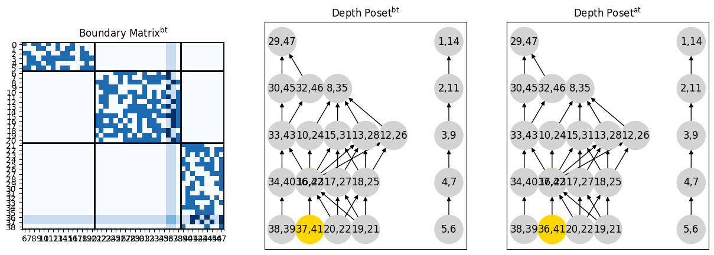

### Birth Death Pairs
|                          |                                                                                                                                                                                                                                   |
|:-------------------------|:----------------------------------------------------------------------------------------------------------------------------------------------------------------------------------------------------------------------------------|
| Before the transposition | $\{(32, 46), (29, 47), (19, 21), (34, 40), (2, 11), (17, 27), (10, 24), (30, 45), (3, 9), (5, 6), (18, 25), (20, 22), (36, 42), (1, 14), (37, 41), (8, 35), (13, 28), (33, 43), (15, 31), (4, 7), (38, 39), (12, 26), (16, 23)\}$ |
| After the transposition  | $\{(32, 46), (29, 47), (19, 21), (34, 40), (2, 11), (17, 27), (37, 42), (10, 24), (30, 45), (3, 9), (5, 6), (18, 25), (20, 22), (1, 14), (8, 35), (13, 28), (33, 43), (15, 31), (4, 7), (38, 39), (12, 26), (36, 41), (16, 23)\}$ |

### Relations
|                          | Algorithm 1                                                                                                                                                                                                                                                                                                                                                                   | Algorithm 2                                                                                                                                                                                                                                                                                                                                                                                               |
|:-------------------------|:------------------------------------------------------------------------------------------------------------------------------------------------------------------------------------------------------------------------------------------------------------------------------------------------------------------------------------------------------------------------------|:----------------------------------------------------------------------------------------------------------------------------------------------------------------------------------------------------------------------------------------------------------------------------------------------------------------------------------------------------------------------------------------------------------|
| Before the transposition | $\{(42, 45), (25, 35), (41, 43), (21, 25), (21, 31), (40, 44), (31, 35), (23, 31), (9, 14), (11, 14), (27, 28), (6, 14), (25, 31), (41, 45), (24, 35), (42, 44), (43, 45), (26, 35), (21, 24), (46, 47), (21, 27), (22, 28), (39, 44), (22, 31), (39, 47), (7, 9), (6, 7), (42, 43), (41, 47), (43, 44), (21, 23), (22, 27), (40, 45), (23, 35), (7, 11), (6, 9), (25, 26)\}$ | $\{(4, 0), (20, 8), (4, 3), (3, 1), (20, 17), (17, 15), (19, 15), (37, 36), (13, 8), (16, 10), (16, 13), (18, 13), (33, 32), (3, 0), (20, 16), (5, 0), (38, 34), (17, 8), (34, 30), (19, 8), (34, 33), (36, 30), (37, 29), (19, 17), (10, 8), (36, 33), (16, 12), (30, 29), (18, 12), (32, 29), (20, 12), (20, 18), (3, 2), (12, 8), (20, 15), (5, 2), (19, 16), (34, 32), (33, 30), (18, 8)\}$           |
| After the transposition  | $\{(25, 35), (42, 45), (21, 25), (21, 31), (40, 44), (31, 35), (23, 31), (9, 14), (11, 14), (27, 28), (41, 42), (6, 14), (25, 31), (24, 35), (42, 44), (43, 45), (26, 35), (21, 24), (46, 47), (21, 27), (22, 28), (39, 44), (22, 31), (39, 47), (7, 9), (6, 7), (41, 44), (42, 43), (41, 47), (43, 44), (21, 23), (22, 27), (40, 45), (23, 35), (7, 11), (6, 9), (25, 26)\}$ | $\{(4, 0), (20, 8), (4, 3), (3, 1), (20, 17), (17, 15), (37, 30), (19, 15), (37, 33), (36, 37), (13, 8), (16, 10), (16, 13), (18, 13), (33, 32), (3, 0), (20, 16), (5, 0), (38, 34), (17, 8), (34, 30), (19, 8), (34, 33), (37, 29), (19, 17), (10, 8), (16, 12), (30, 29), (18, 12), (32, 29), (20, 12), (20, 18), (3, 2), (12, 8), (20, 15), (5, 2), (19, 16), (34, 32), (36, 29), (33, 30), (18, 8)\}$ |

### Successors and Predecessers
|                 | $\text{Set}^\text{bt}(36, 42)$                             | $\text{Set}^\text{bt}(37, 41)$                                       | $\text{Set}^\text{at}(36, 41)$                             | $\text{Set}^\text{at}(37, 42)$                                       |
|:----------------|:-----------------------------------------------------------|:---------------------------------------------------------------------|:-----------------------------------------------------------|:---------------------------------------------------------------------|
| $\text{Succ}_1$ | $\text{Succ}_1^\text{bt}(36, 42) = \{(33, 43), (30, 45)\}$ | $\text{Succ}_1^\text{bt}(37, 41) = \{(33, 43), (30, 45), (29, 47)\}$ | $\text{Succ}_1^\text{at}(36, 41) = \{(37, 42), (29, 47)\}$ | $\text{Succ}_1^\text{at}(37, 42) = \{(33, 43), (30, 45)\}$           |
| $\text{Pred}_1$ | $\text{Pred}_1^\text{bt}(36, 42) = \emptyset$              | $\text{Pred}_1^\text{bt}(37, 41) = \emptyset$                        | $\text{Pred}_1^\text{at}(36, 41) = \emptyset$              | $\text{Pred}_1^\text{at}(37, 42) = \{(36, 41)\}$                     |
| $\text{Succ}_2$ | $\text{Succ}_2^\text{bt}(36, 42) = \{(33, 43), (30, 45)\}$ | $\text{Succ}_2^\text{bt}(37, 41) = \{(36, 42), (29, 47)\}$           | $\text{Succ}_2^\text{at}(36, 41) = \{(37, 42), (29, 47)\}$ | $\text{Succ}_2^\text{at}(37, 42) = \{(33, 43), (30, 45), (29, 47)\}$ |
| $\text{Pred}_2$ | $\text{Pred}_2^\text{bt}(36, 42) = \{(37, 41)\}$           | $\text{Pred}_2^\text{bt}(37, 41) = \emptyset$                        | $\text{Pred}_2^\text{at}(36, 41) = \emptyset$              | $\text{Pred}_2^\text{at}(37, 42) = \{(36, 41)\}$                     |

### Temp Sets
|                                                               | Before the Transposition                                                                                                                                              | After the Transposition                                                                                                                                               |
|:--------------------------------------------------------------|:----------------------------------------------------------------------------------------------------------------------------------------------------------------------|:----------------------------------------------------------------------------------------------------------------------------------------------------------------------|
| $\mathcal{L} = \{(s, t)\in \text{BD}:\; f(t) < f(y)\}$        | $\{(17, 27), (10, 24), (38, 39), (12, 26), (34, 40), (19, 21), (1, 14), (8, 35), (3, 9), (13, 28), (18, 25), (5, 6), (20, 22), (2, 11), (4, 7), (15, 31), (16, 23)\}$ | $\{(17, 27), (10, 24), (38, 39), (12, 26), (34, 40), (19, 21), (1, 14), (8, 35), (3, 9), (13, 28), (18, 25), (5, 6), (20, 22), (2, 11), (4, 7), (15, 31), (16, 23)\}$ |
| $\mathcal{M} = \{(s, t)\in \text{BD}:\; f(y) < f(t) < f(b)\}$ | $\emptyset$                                                                                                                                                           | $\emptyset$                                                                                                                                                           |

### Equations
There are 1 equations are wrong.

| eq   | left (formula)                  | left (paramatrized)               | left (value)                       | right (formula)                                                                                           | right (paramatrized)                                                                                            | right (value)            | correct   |
|:-----|:--------------------------------|:----------------------------------|:-----------------------------------|:----------------------------------------------------------------------------------------------------------|:----------------------------------------------------------------------------------------------------------------|:-------------------------|:----------|
| Eq08 | $\text{Succ}_1^\text{at}(a, y)$ | $\text{Succ}_1^\text{at}(36, 41)$ | $\{(37, 42), (29, 47)\}$           | $\text{Succ}_1^\text{bt}(x, y) \oplus \{(x, b)\} \oplus \text{Succ}_1^\text{bt}(a, b)$                    | $\text{Succ}_1^\text{bt}(37, 41) \oplus \{(37, 42)\} \oplus \text{Succ}_1^\text{bt}(36, 42)$                    | $\{(37, 42), (29, 47)\}$ | ✔         |
| Eq09 | $\text{Succ}_1^\text{at}(x, b)$ | $\text{Succ}_1^\text{at}(37, 42)$ | $\{(33, 43), (30, 45)\}$           | $\text{Succ}_1^\text{bt}(a, b)$                                                                           | $\text{Succ}_1^\text{bt}(36, 42)$                                                                               | $\{(33, 43), (30, 45)\}$ | ✔         |
| Eq10 | $\text{Pred}_1^\text{at}(a, y)$ | $\text{Pred}_1^\text{at}(36, 41)$ | $\emptyset$                        | $\text{Pred}_1^\text{bt}(x, y)$                                                                           | $\text{Pred}_1^\text{bt}(37, 41)$                                                                               | $\emptyset$              | ✔         |
| Eq11 | $\text{Pred}_1^\text{at}(x, b)$ | $\text{Pred}_1^\text{at}(37, 42)$ | $\{(36, 41)\}$                     | $\text{Pred}_1^\text{bt}(a, b) \oplus \{(a, y)\}$                                                         | $\text{Pred}_1^\text{bt}(36, 42) \oplus \{(36, 41)\}$                                                           | $\{(36, 41)\}$           | ✔         |
| Eq12 | $\text{Succ}_2^\text{at}(a, y)$ | $\text{Succ}_2^\text{at}(36, 41)$ | $\{(37, 42), (29, 47)\}$           | $\text{Succ}_2^\text{bt}(x, y) \oplus \{(x, b), (a, b)\}$                                                 | $\text{Succ}_2^\text{bt}(37, 41) \oplus \{(37, 42), (36, 42)\}$                                                 | $\{(37, 42), (29, 47)\}$ | ✔         |
| Eq13 | $\text{Succ}_2^\text{at}(x, b)$ | $\text{Succ}_2^\text{at}(37, 42)$ | $\{(33, 43), (30, 45), (29, 47)\}$ | $\text{Succ}_2^\text{bt}(a, b)$                                                                           | $\text{Succ}_2^\text{bt}(36, 42)$                                                                               | $\{(33, 43), (30, 45)\}$ | ✘         |
| Eq14 | $\text{Pred}_2^\text{at}(a, y)$ | $\text{Pred}_2^\text{at}(36, 41)$ | $\emptyset$                        | $[\text{Pred}_2^\text{bt}(a, b) \cap \mathcal{L}]$                                                        | $[\text{Pred}_2^\text{bt}(36, 42) \cap \mathcal{L}]$                                                            | $\emptyset$              | ✔         |
| Eq15 | $\text{Pred}_2^\text{at}(x, b)$ | $\text{Pred}_2^\text{at}(37, 42)$ | $\{(36, 41)\}$                     | $\text{Pred}_2^\text{bt}(x, y) \oplus \{(a, y)\} \oplus [\text{Pred}_2^\text{bt}(a, b) \cap \mathcal{M}]$ | $\text{Pred}_2^\text{bt}(37, 41) \oplus \{(36, 41)\} \oplus [\text{Pred}_2^\text{bt}(36, 42) \cap \mathcal{M}]$ | $\{(36, 41)\}$           | ✔         |

## Transposition <40, 41> in complex 3
Here is a __death-death__ __no switch__ transposition <40, 41>.

$$
a = 37, \; b = 41, \; x = 34, \; y = 40
$$

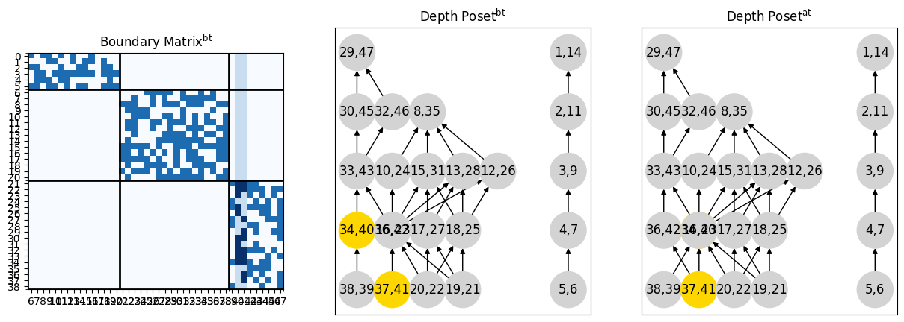

### Birth Death Pairs
|                          |                                                                                                                                                                                                                                   |
|:-------------------------|:----------------------------------------------------------------------------------------------------------------------------------------------------------------------------------------------------------------------------------|
| Before the transposition | $\{(32, 46), (29, 47), (19, 21), (34, 40), (2, 11), (17, 27), (10, 24), (30, 45), (3, 9), (5, 6), (18, 25), (20, 22), (36, 42), (1, 14), (37, 41), (8, 35), (13, 28), (33, 43), (15, 31), (4, 7), (38, 39), (12, 26), (16, 23)\}$ |
| After the transposition  | $\{(32, 46), (29, 47), (19, 21), (34, 40), (2, 11), (17, 27), (10, 24), (30, 45), (3, 9), (5, 6), (18, 25), (20, 22), (36, 42), (1, 14), (37, 41), (8, 35), (13, 28), (33, 43), (15, 31), (4, 7), (38, 39), (12, 26), (16, 23)\}$ |

### Relations
|                          | Algorithm 1                                                                                                                                                                                                                                                                                                                                                                   | Algorithm 2                                                                                                                                                                                                                                                                                                                                                                                                                             |
|:-------------------------|:------------------------------------------------------------------------------------------------------------------------------------------------------------------------------------------------------------------------------------------------------------------------------------------------------------------------------------------------------------------------------|:----------------------------------------------------------------------------------------------------------------------------------------------------------------------------------------------------------------------------------------------------------------------------------------------------------------------------------------------------------------------------------------------------------------------------------------|
| Before the transposition | $\{(42, 45), (25, 35), (41, 43), (21, 25), (21, 31), (40, 44), (31, 35), (23, 31), (9, 14), (11, 14), (27, 28), (6, 14), (25, 31), (41, 45), (24, 35), (42, 44), (43, 45), (26, 35), (21, 24), (46, 47), (21, 27), (22, 28), (39, 44), (22, 31), (39, 47), (7, 9), (6, 7), (42, 43), (41, 47), (43, 44), (21, 23), (22, 27), (40, 45), (23, 35), (7, 11), (6, 9), (25, 26)\}$ | $\{(4, 0), (20, 8), (4, 3), (3, 1), (20, 17), (17, 15), (19, 15), (37, 36), (13, 8), (16, 10), (16, 13), (18, 13), (33, 32), (3, 0), (20, 16), (5, 0), (38, 34), (17, 8), (34, 30), (19, 8), (34, 33), (36, 30), (37, 29), (19, 17), (10, 8), (36, 33), (16, 12), (30, 29), (18, 12), (32, 29), (20, 12), (20, 18), (3, 2), (12, 8), (20, 15), (5, 2), (19, 16), (34, 32), (33, 30), (18, 8)\}$                                         |
| After the transposition  | $\{(25, 35), (42, 45), (41, 43), (21, 25), (21, 31), (31, 35), (40, 44), (23, 31), (9, 14), (11, 14), (27, 28), (6, 14), (25, 31), (24, 35), (41, 45), (42, 44), (43, 45), (26, 35), (21, 24), (46, 47), (21, 27), (22, 28), (39, 44), (22, 31), (39, 47), (7, 9), (6, 7), (42, 43), (41, 47), (43, 44), (21, 23), (22, 27), (40, 45), (23, 35), (7, 11), (6, 9), (25, 26)\}$ | $\{(4, 0), (20, 8), (4, 3), (3, 1), (20, 17), (17, 15), (37, 30), (19, 15), (37, 33), (37, 36), (13, 8), (16, 10), (16, 13), (18, 13), (33, 32), (3, 0), (20, 16), (5, 0), (38, 34), (17, 8), (34, 30), (19, 8), (34, 33), (36, 30), (37, 29), (19, 17), (10, 8), (36, 33), (37, 32), (16, 12), (30, 29), (18, 12), (32, 29), (20, 12), (20, 18), (3, 2), (12, 8), (20, 15), (5, 2), (19, 16), (34, 32), (37, 34), (33, 30), (18, 8)\}$ |

### Successors and Predecessers
No such node in the Depth Poset

### Temp Sets
|                                                               | Before the Transposition           | After the Transposition            |
|:--------------------------------------------------------------|:-----------------------------------|:-----------------------------------|
| $\mathcal{B} = \{(s, t)\in \text{BD}:\; f(s) > f(x)\}$        | $\{(38, 39), (36, 42), (37, 41)\}$ | $\{(38, 39), (36, 42), (37, 41)\}$ |
| $\mathcal{N} = \{(s, t)\in \text{BD}:\; f(x) > f(s) > f(a)\}$ | $\emptyset$                        | $\emptyset$                        |

### Equations
There are 2 equations are wrong.

| eq   | left (formula)                  | left (paramatrized)               | left (value)                       | right (formula)                                                                        | right (paramatrized)                                                                         | right (value)                                                    | correct   |
|:-----|:--------------------------------|:----------------------------------|:-----------------------------------|:---------------------------------------------------------------------------------------|:---------------------------------------------------------------------------------------------|:-----------------------------------------------------------------|:----------|
| Eq36 | $\text{Succ}_2^\text{at}(x, y)$ | $\text{Succ}_2^\text{at}(34, 40)$ | $\{(33, 43), (30, 45), (32, 46)\}$ | $\text{Succ}_2^\text{bt}(x, y) \oplus \{(a, b)\} \oplus \text{Succ}_2^\text{bt}(a, b)$ | $\text{Succ}_2^\text{bt}(34, 40) \oplus \{(37, 41)\} \oplus \text{Succ}_2^\text{bt}(37, 41)$ | $\{(32, 46), (36, 42), (37, 41), (30, 45), (29, 47), (33, 43)\}$ | ✘         |
| Eq37 | $\text{Pred}_2^\text{at}(a, b)$ | $\text{Pred}_2^\text{at}(37, 41)$ | $\emptyset$                        | $\text{Pred}_2^\text{bt}(a, b) \oplus \{(x, y)\}$                                      | $\text{Pred}_2^\text{bt}(37, 41) \oplus \{(34, 40)\}$                                        | $\{(34, 40)\}$                                                   | ✘         |

## Transposition <8, 9> in complex 4
Here is a __birth-death__ __switch forward__ transposition <8, 9>.

$$
a = 5, \; b = 8, \; x = 9, \; y = 26
$$

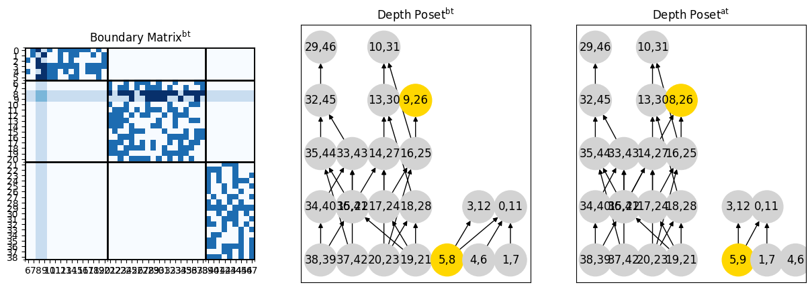

### Birth Death Pairs
|                          |                                                                                                                                                                                                                                   |
|:-------------------------|:----------------------------------------------------------------------------------------------------------------------------------------------------------------------------------------------------------------------------------|
| Before the transposition | $\{(13, 30), (20, 23), (4, 6), (17, 24), (19, 21), (34, 40), (0, 11), (9, 26), (37, 42), (16, 25), (18, 28), (35, 44), (32, 45), (3, 12), (29, 46), (14, 27), (15, 22), (33, 43), (38, 39), (5, 8), (1, 7), (36, 41), (10, 31)\}$ |
| After the transposition  | $\{(13, 30), (20, 23), (4, 6), (17, 24), (19, 21), (34, 40), (0, 11), (37, 42), (16, 25), (18, 28), (35, 44), (32, 45), (3, 12), (5, 9), (29, 46), (14, 27), (8, 26), (15, 22), (33, 43), (38, 39), (1, 7), (36, 41), (10, 31)\}$ |

### Relations
|                          | Algorithm 1                                                                                                                                                                                                                                                                                                                                                                                                                            | Algorithm 2                                                                                                                                                                                                                                                                                                  |
|:-------------------------|:---------------------------------------------------------------------------------------------------------------------------------------------------------------------------------------------------------------------------------------------------------------------------------------------------------------------------------------------------------------------------------------------------------------------------------------|:-------------------------------------------------------------------------------------------------------------------------------------------------------------------------------------------------------------------------------------------------------------------------------------------------------------|
| Before the transposition | $\{(42, 45), (41, 43), (24, 27), (44, 45), (21, 22), (21, 28), (21, 25), (21, 31), (23, 28), (23, 25), (39, 45), (28, 30), (45, 46), (6, 11), (25, 31), (42, 47), (41, 45), (44, 47), (21, 24), (21, 30), (39, 41), (21, 27), (23, 30), (8, 11), (23, 27), (40, 43), (39, 47), (27, 30), (24, 25), (41, 44), (42, 43), (24, 31), (41, 47), (21, 26), (22, 27), (23, 26), (39, 40), (40, 45), (39, 43), (45, 47), (30, 31), (25, 26)\}$ | $\{(38, 29), (38, 35), (38, 32), (1, 0), (19, 18), (37, 33), (33, 32), (4, 2), (20, 10), (20, 16), (35, 29), (5, 0), (5, 3), (17, 14), (19, 14), (37, 29), (19, 17), (37, 35), (16, 9), (13, 10), (15, 10), (3, 2), (20, 18), (5, 2), (38, 36), (17, 16), (19, 10), (36, 32), (19, 13), (36, 35)\}$          |
| After the transposition  | $\{(42, 45), (41, 43), (24, 27), (44, 45), (21, 22), (21, 28), (21, 25), (21, 31), (23, 28), (23, 25), (39, 45), (9, 11), (28, 30), (45, 46), (25, 31), (42, 47), (41, 45), (44, 47), (21, 24), (21, 30), (39, 41), (21, 27), (23, 30), (23, 27), (40, 43), (39, 47), (27, 30), (24, 25), (41, 44), (42, 43), (24, 31), (41, 47), (21, 26), (22, 27), (23, 26), (39, 40), (40, 45), (39, 43), (45, 47), (30, 31), (7, 11), (25, 26)\}$ | $\{(38, 29), (38, 35), (38, 32), (1, 0), (19, 18), (37, 33), (15, 8), (33, 32), (4, 2), (20, 10), (20, 16), (35, 29), (5, 0), (5, 3), (17, 14), (19, 8), (19, 14), (37, 29), (19, 17), (37, 35), (13, 10), (15, 10), (3, 2), (20, 18), (5, 2), (38, 36), (17, 16), (19, 10), (36, 32), (19, 13), (36, 35)\}$ |

### Successors and Predecessers
|                 | $\text{Set}^\text{bt}(5, 8)$                           | $\text{Set}^\text{bt}(9, 26)$                                       | $\text{Set}^\text{at}(5, 9)$                           | $\text{Set}^\text{at}(8, 26)$                                       |
|:----------------|:-------------------------------------------------------|:--------------------------------------------------------------------|:-------------------------------------------------------|:--------------------------------------------------------------------|
| $\text{Succ}_1$ | $\text{Succ}_1^\text{bt}(5, 8) = \{(0, 11)\}$          | $\text{Succ}_1^\text{bt}(9, 26) = \emptyset$                        | $\text{Succ}_1^\text{at}(5, 9) = \{(0, 11)\}$          | $\text{Succ}_1^\text{at}(8, 26) = \emptyset$                        |
| $\text{Pred}_1$ | $\text{Pred}_1^\text{bt}(5, 8) = \emptyset$            | $\text{Pred}_1^\text{bt}(9, 26) = \{(16, 25), (20, 23), (19, 21)\}$ | $\text{Pred}_1^\text{at}(5, 9) = \emptyset$            | $\text{Pred}_1^\text{at}(8, 26) = \{(16, 25), (20, 23), (19, 21)\}$ |
| $\text{Succ}_2$ | $\text{Succ}_2^\text{bt}(5, 8) = \{(3, 12), (0, 11)\}$ | $\text{Succ}_2^\text{bt}(9, 26) = \emptyset$                        | $\text{Succ}_2^\text{at}(5, 9) = \{(3, 12), (0, 11)\}$ | $\text{Succ}_2^\text{at}(8, 26) = \emptyset$                        |
| $\text{Pred}_2$ | $\text{Pred}_2^\text{bt}(5, 8) = \emptyset$            | $\text{Pred}_2^\text{bt}(9, 26) = \{(16, 25)\}$                     | $\text{Pred}_2^\text{at}(5, 9) = \emptyset$            | $\text{Pred}_2^\text{at}(8, 26) = \{(15, 22), (19, 21)\}$           |

### Temp Sets
|                                                              | Before the Transposition                               | After the Transposition                                |
|:-------------------------------------------------------------|:-------------------------------------------------------|:-------------------------------------------------------|
| $A_1 = \{(s, t)\in \text{BD}:\; f(a) < f(s) < f(t) < f(x)\}$ | $\emptyset$                                            | $\emptyset$                                            |
| $B_1 = \{(s, t)\in \text{BD}:\; U_1[t, x] = 1\}$             | $\emptyset$                                            | $\emptyset$                                            |
| $A_2 = \{(s, t)\in \text{BD}:\; f(b) < f(s) < f(t) < f(y)\}$ | $\{(20, 23), (16, 25), (15, 22), (17, 24), (19, 21)\}$ | $\{(20, 23), (16, 25), (15, 22), (17, 24), (19, 21)\}$ |
| $B_2 = \{(s, t)\in \text{BD}:\; U_2[b, s] = 1\}$             | $\emptyset$                                            | $\{(15, 22), (19, 21)\}$                               |

### Equations
There are 2 equations are wrong.

| eq    | left (formula)                  | left (paramatrized)              | left (value)                       | right (formula)                                      | right (paramatrized)                                 | right (value)                      | correct   |
|:------|:--------------------------------|:---------------------------------|:-----------------------------------|:-----------------------------------------------------|:-----------------------------------------------------|:-----------------------------------|:----------|
| Eq48  | $\text{Succ}_1^\text{at}(a, x)$ | $\text{Succ}_1^\text{at}(5, 9)$  | $\{(0, 11)\}$                      | $\text{Succ}_1^\text{bt}(a, b)$                      | $\text{Succ}_1^\text{bt}(5, 8)$                      | $\{(0, 11)\}$                      | ✔         |
| Eq49  | $\text{Succ}_1^\text{at}(b, y)$ | $\text{Succ}_1^\text{at}(8, 26)$ | $\emptyset$                        | $\text{Succ}_1^\text{bt}(x, y)$                      | $\text{Succ}_1^\text{bt}(9, 26)$                     | $\emptyset$                        | ✔         |
| Eq50  | $\text{Pred}_1^\text{at}(a, x)$ | $\text{Pred}_1^\text{at}(5, 9)$  | $\emptyset$                        | $\{(s, t)\in \text{BD}:\; U_1^\text{bt}[t, x] = 1\}$ | $\{(s, t)\in \text{BD}:\; U_1^\text{bt}[t, 9] = 1\}$ | $\emptyset$                        | ✔         |
| Eq50a | $\text{Pred}_1^\text{at}(a, x)$ | $\text{Pred}_1^\text{at}(5, 9)$  | $\emptyset$                        | $A_1^\text{bt} \cap B_1^\text{bt}$                   | $A_1^\text{bt} \cap B_1^\text{bt}$                   | $\emptyset$                        | ✔         |
| Eq50b | $\text{Pred}_1^\text{at}(a, x)$ | $\text{Pred}_1^\text{at}(5, 9)$  | $\emptyset$                        | $A_1^\text{bt} \cap B_1^\text{at}$                   | $A_1^\text{bt} \cap B_1^\text{at}$                   | $\emptyset$                        | ✔         |
| Eq51  | $\text{Pred}_1^\text{at}(b, y)$ | $\text{Pred}_1^\text{at}(8, 26)$ | $\{(16, 25), (20, 23), (19, 21)\}$ | $\text{Pred}_1^\text{bt}(x, y)$                      | $\text{Pred}_1^\text{bt}(9, 26)$                     | $\{(16, 25), (20, 23), (19, 21)\}$ | ✔         |
| Eq52  | $\text{Succ}_2^\text{at}(a, x)$ | $\text{Succ}_2^\text{at}(5, 9)$  | $\{(3, 12), (0, 11)\}$             | $\text{Succ}_2^\text{bt}(a, b)$                      | $\text{Succ}_2^\text{bt}(5, 8)$                      | $\{(3, 12), (0, 11)\}$             | ✔         |
| Eq53  | $\text{Succ}_2^\text{at}(b, y)$ | $\text{Succ}_2^\text{at}(8, 26)$ | $\emptyset$                        | $\text{Succ}_2^\text{bt}(x, y)$                      | $\text{Succ}_2^\text{bt}(9, 26)$                     | $\emptyset$                        | ✔         |
| Eq54  | $\text{Pred}_2^\text{at}(a, x)$ | $\text{Pred}_2^\text{at}(5, 9)$  | $\emptyset$                        | $\text{Pred}_2^\text{bt}(a, b)$                      | $\text{Pred}_2^\text{bt}(5, 8)$                      | $\emptyset$                        | ✔         |
| Eq55  | $\text{Pred}_2^\text{at}(b, y)$ | $\text{Pred}_2^\text{at}(8, 26)$ | $\{(15, 22), (19, 21)\}$           | $\{(s, t)\in \text{BD}:\; U_2^\text{bt}[b, s] = 1\}$ | $\{(s, t)\in \text{BD}:\; U_2^\text{bt}[8, s] = 1\}$ | $\emptyset$                        | ✘         |
| Eq55a | $\text{Pred}_2^\text{at}(b, y)$ | $\text{Pred}_2^\text{at}(8, 26)$ | $\{(15, 22), (19, 21)\}$           | $A_2^\text{bt} \cap B_2^\text{bt}$                   | $A_2^\text{bt} \cap B_2^\text{bt}$                   | $\emptyset$                        | ✘         |
| Eq55b | $\text{Pred}_2^\text{at}(b, y)$ | $\text{Pred}_2^\text{at}(8, 26)$ | $\{(15, 22), (19, 21)\}$           | $A_2^\text{bt} \cap B_2^\text{at}$                   | $A_2^\text{bt} \cap B_2^\text{at}$                   | $\{(15, 22), (19, 21)\}$           | ✔         |

## Transposition <12, 13> in complex 4
Here is a __birth-death__ __switch forward__ transposition <12, 13>.

$$
a = 3, \; b = 12, \; x = 13, \; y = 30
$$

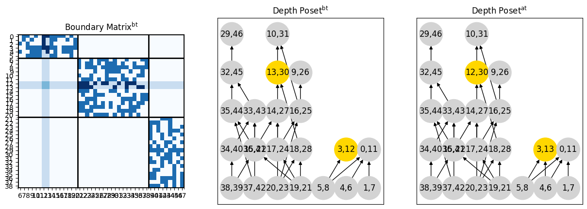

### Birth Death Pairs
|                          |                                                                                                                                                                                                                                   |
|:-------------------------|:----------------------------------------------------------------------------------------------------------------------------------------------------------------------------------------------------------------------------------|
| Before the transposition | $\{(13, 30), (20, 23), (4, 6), (17, 24), (19, 21), (34, 40), (0, 11), (9, 26), (37, 42), (16, 25), (18, 28), (35, 44), (32, 45), (3, 12), (29, 46), (14, 27), (15, 22), (33, 43), (38, 39), (5, 8), (1, 7), (36, 41), (10, 31)\}$ |
| After the transposition  | $\{(20, 23), (4, 6), (3, 13), (17, 24), (19, 21), (34, 40), (0, 11), (9, 26), (37, 42), (16, 25), (18, 28), (35, 44), (32, 45), (12, 30), (29, 46), (14, 27), (15, 22), (33, 43), (38, 39), (5, 8), (1, 7), (36, 41), (10, 31)\}$ |

### Relations
|                          | Algorithm 1                                                                                                                                                                                                                                                                                                                                                                                                                                     | Algorithm 2                                                                                                                                                                                                                                                                                                             |
|:-------------------------|:------------------------------------------------------------------------------------------------------------------------------------------------------------------------------------------------------------------------------------------------------------------------------------------------------------------------------------------------------------------------------------------------------------------------------------------------|:------------------------------------------------------------------------------------------------------------------------------------------------------------------------------------------------------------------------------------------------------------------------------------------------------------------------|
| Before the transposition | $\{(42, 45), (41, 43), (24, 27), (44, 45), (21, 22), (21, 28), (21, 25), (21, 31), (23, 28), (23, 25), (39, 45), (28, 30), (45, 46), (6, 11), (25, 31), (42, 47), (41, 45), (44, 47), (21, 24), (21, 30), (39, 41), (21, 27), (23, 30), (8, 11), (23, 27), (40, 43), (39, 47), (27, 30), (24, 25), (41, 44), (42, 43), (24, 31), (41, 47), (21, 26), (22, 27), (23, 26), (39, 40), (40, 45), (39, 43), (45, 47), (30, 31), (25, 26)\}$          | $\{(38, 29), (38, 35), (38, 32), (1, 0), (19, 18), (37, 33), (33, 32), (4, 2), (20, 10), (20, 16), (35, 29), (5, 0), (5, 3), (17, 14), (19, 14), (37, 29), (19, 17), (37, 35), (16, 9), (13, 10), (15, 10), (3, 2), (20, 18), (5, 2), (38, 36), (17, 16), (19, 10), (36, 32), (19, 13), (36, 35)\}$                     |
| After the transposition  | $\{(42, 45), (41, 43), (24, 27), (44, 45), (21, 22), (21, 28), (21, 25), (21, 31), (23, 28), (23, 25), (39, 45), (28, 30), (45, 46), (6, 11), (25, 31), (42, 47), (41, 45), (44, 47), (21, 24), (21, 30), (39, 41), (21, 27), (23, 30), (8, 11), (23, 27), (40, 43), (39, 47), (27, 30), (24, 25), (6, 13), (41, 44), (42, 43), (24, 31), (41, 47), (21, 26), (22, 27), (23, 26), (39, 40), (40, 45), (39, 43), (45, 47), (30, 31), (25, 26)\}$ | $\{(38, 29), (38, 35), (12, 10), (38, 32), (17, 12), (19, 12), (1, 0), (19, 18), (37, 33), (33, 32), (4, 2), (20, 10), (20, 16), (35, 29), (5, 0), (5, 3), (17, 14), (19, 14), (37, 29), (19, 17), (37, 35), (16, 9), (15, 10), (18, 12), (3, 2), (20, 18), (5, 2), (38, 36), (17, 16), (19, 10), (36, 32), (36, 35)\}$ |

### Successors and Predecessers
|                 | $\text{Set}^\text{bt}(3, 12)$                 | $\text{Set}^\text{bt}(13, 30)$                                                 | $\text{Set}^\text{at}(3, 13)$                 | $\text{Set}^\text{at}(12, 30)$                                                 |
|:----------------|:----------------------------------------------|:-------------------------------------------------------------------------------|:----------------------------------------------|:-------------------------------------------------------------------------------|
| $\text{Succ}_1$ | $\text{Succ}_1^\text{bt}(3, 12) = \emptyset$  | $\text{Succ}_1^\text{bt}(13, 30) = \{(10, 31)\}$                               | $\text{Succ}_1^\text{at}(3, 13) = \emptyset$  | $\text{Succ}_1^\text{at}(12, 30) = \{(10, 31)\}$                               |
| $\text{Pred}_1$ | $\text{Pred}_1^\text{bt}(3, 12) = \emptyset$  | $\text{Pred}_1^\text{bt}(13, 30) = \{(20, 23), (18, 28), (19, 21), (14, 27)\}$ | $\text{Pred}_1^\text{at}(3, 13) = \{(4, 6)\}$ | $\text{Pred}_1^\text{at}(12, 30) = \{(20, 23), (18, 28), (19, 21), (14, 27)\}$ |
| $\text{Succ}_2$ | $\text{Succ}_2^\text{bt}(3, 12) = \emptyset$  | $\text{Succ}_2^\text{bt}(13, 30) = \{(10, 31)\}$                               | $\text{Succ}_2^\text{at}(3, 13) = \emptyset$  | $\text{Succ}_2^\text{at}(12, 30) = \{(10, 31)\}$                               |
| $\text{Pred}_2$ | $\text{Pred}_2^\text{bt}(3, 12) = \{(5, 8)\}$ | $\text{Pred}_2^\text{bt}(13, 30) = \{(19, 21)\}$                               | $\text{Pred}_2^\text{at}(3, 13) = \{(5, 8)\}$ | $\text{Pred}_2^\text{at}(12, 30) = \{(18, 28), (17, 24), (19, 21)\}$           |

### Temp Sets
|                                                              | Before the Transposition                                                   | After the Transposition                                                    |
|:-------------------------------------------------------------|:---------------------------------------------------------------------------|:---------------------------------------------------------------------------|
| $A_1 = \{(s, t)\in \text{BD}:\; f(a) < f(s) < f(t) < f(x)\}$ | $\{(4, 6), (5, 8)\}$                                                       | $\{(4, 6), (5, 8)\}$                                                       |
| $B_1 = \{(s, t)\in \text{BD}:\; U_1[t, x] = 1\}$             | $\emptyset$                                                                | $\{(4, 6)\}$                                                               |
| $A_2 = \{(s, t)\in \text{BD}:\; f(b) < f(s) < f(t) < f(y)\}$ | $\{(14, 27), (20, 23), (16, 25), (18, 28), (15, 22), (17, 24), (19, 21)\}$ | $\{(14, 27), (20, 23), (16, 25), (18, 28), (15, 22), (17, 24), (19, 21)\}$ |
| $B_2 = \{(s, t)\in \text{BD}:\; U_2[b, s] = 1\}$             | $\emptyset$                                                                | $\{(18, 28), (17, 24), (19, 21)\}$                                         |

### Equations
There are 4 equations are wrong.

| eq    | left (formula)                  | left (paramatrized)               | left (value)                                 | right (formula)                                      | right (paramatrized)                                  | right (value)                                | correct   |
|:------|:--------------------------------|:----------------------------------|:---------------------------------------------|:-----------------------------------------------------|:------------------------------------------------------|:---------------------------------------------|:----------|
| Eq48  | $\text{Succ}_1^\text{at}(a, x)$ | $\text{Succ}_1^\text{at}(3, 13)$  | $\emptyset$                                  | $\text{Succ}_1^\text{bt}(a, b)$                      | $\text{Succ}_1^\text{bt}(3, 12)$                      | $\emptyset$                                  | ✔         |
| Eq49  | $\text{Succ}_1^\text{at}(b, y)$ | $\text{Succ}_1^\text{at}(12, 30)$ | $\{(10, 31)\}$                               | $\text{Succ}_1^\text{bt}(x, y)$                      | $\text{Succ}_1^\text{bt}(13, 30)$                     | $\{(10, 31)\}$                               | ✔         |
| Eq50  | $\text{Pred}_1^\text{at}(a, x)$ | $\text{Pred}_1^\text{at}(3, 13)$  | $\{(4, 6)\}$                                 | $\{(s, t)\in \text{BD}:\; U_1^\text{bt}[t, x] = 1\}$ | $\{(s, t)\in \text{BD}:\; U_1^\text{bt}[t, 13] = 1\}$ | $\emptyset$                                  | ✘         |
| Eq50a | $\text{Pred}_1^\text{at}(a, x)$ | $\text{Pred}_1^\text{at}(3, 13)$  | $\{(4, 6)\}$                                 | $A_1^\text{bt} \cap B_1^\text{bt}$                   | $A_1^\text{bt} \cap B_1^\text{bt}$                    | $\emptyset$                                  | ✘         |
| Eq50b | $\text{Pred}_1^\text{at}(a, x)$ | $\text{Pred}_1^\text{at}(3, 13)$  | $\{(4, 6)\}$                                 | $A_1^\text{bt} \cap B_1^\text{at}$                   | $A_1^\text{bt} \cap B_1^\text{at}$                    | $\{(4, 6)\}$                                 | ✔         |
| Eq51  | $\text{Pred}_1^\text{at}(b, y)$ | $\text{Pred}_1^\text{at}(12, 30)$ | $\{(20, 23), (18, 28), (19, 21), (14, 27)\}$ | $\text{Pred}_1^\text{bt}(x, y)$                      | $\text{Pred}_1^\text{bt}(13, 30)$                     | $\{(20, 23), (18, 28), (19, 21), (14, 27)\}$ | ✔         |
| Eq52  | $\text{Succ}_2^\text{at}(a, x)$ | $\text{Succ}_2^\text{at}(3, 13)$  | $\emptyset$                                  | $\text{Succ}_2^\text{bt}(a, b)$                      | $\text{Succ}_2^\text{bt}(3, 12)$                      | $\emptyset$                                  | ✔         |
| Eq53  | $\text{Succ}_2^\text{at}(b, y)$ | $\text{Succ}_2^\text{at}(12, 30)$ | $\{(10, 31)\}$                               | $\text{Succ}_2^\text{bt}(x, y)$                      | $\text{Succ}_2^\text{bt}(13, 30)$                     | $\{(10, 31)\}$                               | ✔         |
| Eq54  | $\text{Pred}_2^\text{at}(a, x)$ | $\text{Pred}_2^\text{at}(3, 13)$  | $\{(5, 8)\}$                                 | $\text{Pred}_2^\text{bt}(a, b)$                      | $\text{Pred}_2^\text{bt}(3, 12)$                      | $\{(5, 8)\}$                                 | ✔         |
| Eq55  | $\text{Pred}_2^\text{at}(b, y)$ | $\text{Pred}_2^\text{at}(12, 30)$ | $\{(18, 28), (17, 24), (19, 21)\}$           | $\{(s, t)\in \text{BD}:\; U_2^\text{bt}[b, s] = 1\}$ | $\{(s, t)\in \text{BD}:\; U_2^\text{bt}[12, s] = 1\}$ | $\emptyset$                                  | ✘         |
| Eq55a | $\text{Pred}_2^\text{at}(b, y)$ | $\text{Pred}_2^\text{at}(12, 30)$ | $\{(18, 28), (17, 24), (19, 21)\}$           | $A_2^\text{bt} \cap B_2^\text{bt}$                   | $A_2^\text{bt} \cap B_2^\text{bt}$                    | $\emptyset$                                  | ✘         |
| Eq55b | $\text{Pred}_2^\text{at}(b, y)$ | $\text{Pred}_2^\text{at}(12, 30)$ | $\{(18, 28), (17, 24), (19, 21)\}$           | $A_2^\text{bt} \cap B_2^\text{at}$                   | $A_2^\text{bt} \cap B_2^\text{at}$                    | $\{(19, 21), (18, 28), (17, 24)\}$           | ✔         |

## Transposition <15, 16> in complex 4
Here is a __birth-birth__ __no switch__ transposition <15, 16>.

$$
a = 15, \; b = 22, \; x = 16, \; y = 25
$$

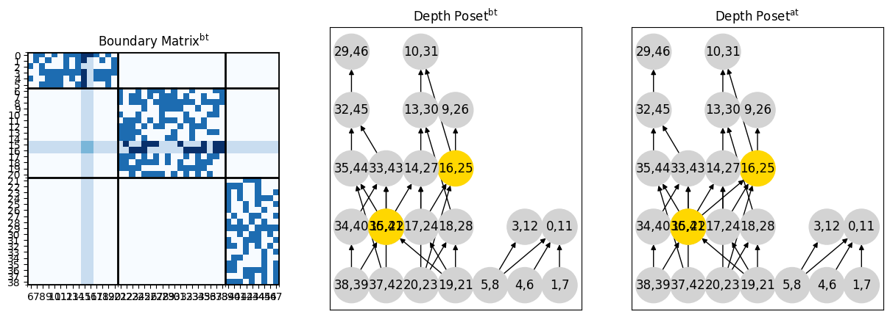

### Birth Death Pairs
|                          |                                                                                                                                                                                                                                   |
|:-------------------------|:----------------------------------------------------------------------------------------------------------------------------------------------------------------------------------------------------------------------------------|
| Before the transposition | $\{(13, 30), (20, 23), (4, 6), (17, 24), (19, 21), (34, 40), (0, 11), (9, 26), (37, 42), (16, 25), (18, 28), (35, 44), (32, 45), (3, 12), (29, 46), (14, 27), (15, 22), (33, 43), (38, 39), (5, 8), (1, 7), (36, 41), (10, 31)\}$ |
| After the transposition  | $\{(13, 30), (20, 23), (4, 6), (17, 24), (19, 21), (34, 40), (0, 11), (9, 26), (37, 42), (16, 25), (18, 28), (35, 44), (32, 45), (3, 12), (29, 46), (14, 27), (15, 22), (33, 43), (38, 39), (5, 8), (1, 7), (36, 41), (10, 31)\}$ |

### Relations
|                          | Algorithm 1                                                                                                                                                                                                                                                                                                                                                                                                                                                          | Algorithm 2                                                                                                                                                                                                                                                                                         |
|:-------------------------|:---------------------------------------------------------------------------------------------------------------------------------------------------------------------------------------------------------------------------------------------------------------------------------------------------------------------------------------------------------------------------------------------------------------------------------------------------------------------|:----------------------------------------------------------------------------------------------------------------------------------------------------------------------------------------------------------------------------------------------------------------------------------------------------|
| Before the transposition | $\{(42, 45), (41, 43), (24, 27), (44, 45), (21, 22), (21, 28), (21, 25), (21, 31), (23, 28), (23, 25), (39, 45), (28, 30), (45, 46), (6, 11), (25, 31), (42, 47), (41, 45), (44, 47), (21, 24), (21, 30), (39, 41), (21, 27), (23, 30), (8, 11), (23, 27), (40, 43), (39, 47), (27, 30), (24, 25), (41, 44), (42, 43), (24, 31), (41, 47), (21, 26), (22, 27), (23, 26), (39, 40), (40, 45), (39, 43), (45, 47), (30, 31), (25, 26)\}$                               | $\{(38, 29), (38, 35), (38, 32), (1, 0), (19, 18), (37, 33), (33, 32), (4, 2), (20, 10), (20, 16), (35, 29), (5, 0), (5, 3), (17, 14), (19, 14), (37, 29), (19, 17), (37, 35), (16, 9), (13, 10), (15, 10), (3, 2), (20, 18), (5, 2), (38, 36), (17, 16), (19, 10), (36, 32), (19, 13), (36, 35)\}$ |
| After the transposition  | $\{(42, 45), (41, 43), (24, 27), (44, 45), (21, 22), (21, 28), (21, 25), (21, 31), (23, 28), (22, 26), (23, 25), (39, 45), (28, 30), (45, 46), (6, 11), (25, 31), (42, 47), (41, 45), (44, 47), (21, 24), (21, 30), (22, 25), (39, 41), (21, 27), (23, 30), (8, 11), (23, 27), (40, 43), (22, 31), (39, 47), (27, 30), (24, 25), (41, 44), (42, 43), (24, 31), (41, 47), (21, 26), (22, 27), (23, 26), (39, 40), (40, 45), (39, 43), (45, 47), (30, 31), (25, 26)\}$ | $\{(38, 29), (38, 35), (38, 32), (1, 0), (19, 18), (37, 33), (33, 32), (4, 2), (20, 10), (35, 29), (20, 16), (5, 0), (5, 3), (17, 14), (19, 14), (37, 29), (19, 17), (37, 35), (13, 10), (16, 9), (15, 10), (3, 2), (20, 18), (5, 2), (38, 36), (17, 16), (19, 10), (36, 32), (19, 13), (36, 35)\}$ |

### Successors and Predecessers
No such node in the Depth Poset

### Temp Sets
|                                                               | Before the Transposition                                                               | After the Transposition                                                                |
|:--------------------------------------------------------------|:---------------------------------------------------------------------------------------|:---------------------------------------------------------------------------------------|
| $\mathcal{L} = \{(s, t)\in \text{BD}:\; f(t) < f(y)\}$        | $\{(5, 8), (20, 23), (4, 6), (1, 7), (3, 12), (15, 22), (17, 24), (19, 21), (0, 11)\}$ | $\{(5, 8), (20, 23), (4, 6), (1, 7), (3, 12), (15, 22), (17, 24), (19, 21), (0, 11)\}$ |
| $\mathcal{M} = \{(s, t)\in \text{BD}:\; f(y) < f(t) < f(b)\}$ | $\emptyset$                                                                            | $\emptyset$                                                                            |

### Equations
There are 2 equations are wrong.

| eq   | left (formula)                  | left (paramatrized)               | left (value)            | right (formula)                                                                        | right (paramatrized)                                                                         | right (value)                               | correct   |
|:-----|:--------------------------------|:----------------------------------|:------------------------|:---------------------------------------------------------------------------------------|:---------------------------------------------------------------------------------------------|:--------------------------------------------|:----------|
| Eq16 | $\text{Succ}_1^\text{at}(x, y)$ | $\text{Succ}_1^\text{at}(16, 25)$ | $\{(10, 31), (9, 26)\}$ | $\text{Succ}_1^\text{bt}(x, y) \oplus \{(a, b)\} \oplus \text{Succ}_1^\text{bt}(a, b)$ | $\text{Succ}_1^\text{bt}(16, 25) \oplus \{(15, 22)\} \oplus \text{Succ}_1^\text{bt}(15, 22)$ | $\{(15, 22), (10, 31), (14, 27), (9, 26)\}$ | ✘         |
| Eq17 | $\text{Pred}_1^\text{at}(a, b)$ | $\text{Pred}_1^\text{at}(15, 22)$ | $\{(19, 21)\}$          | $\text{Pred}_1^\text{bt}(a, b) \oplus \{(x, y)\}$                                      | $\text{Pred}_1^\text{bt}(15, 22) \oplus \{(16, 25)\}$                                        | $\{(16, 25), (19, 21)\}$                    | ✘         |

## Transposition <19, 20> in complex 4
Here is a __birth-birth__ __no switch__ transposition <19, 20>.

$$
a = 19, \; b = 21, \; x = 20, \; y = 23
$$

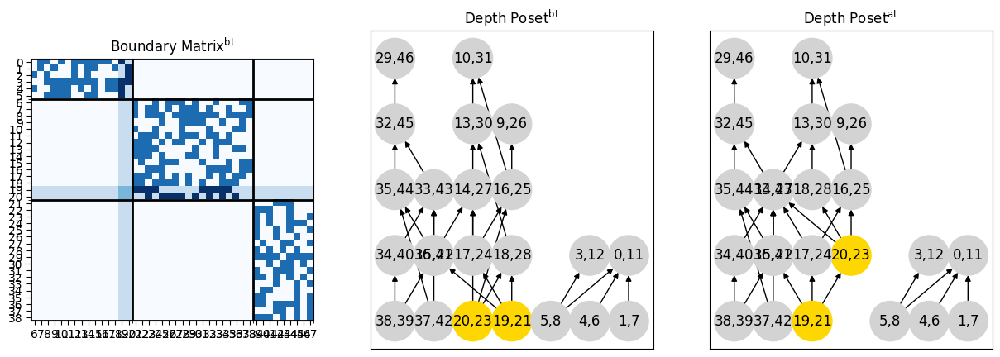

### Birth Death Pairs
|                          |                                                                                                                                                                                                                                   |
|:-------------------------|:----------------------------------------------------------------------------------------------------------------------------------------------------------------------------------------------------------------------------------|
| Before the transposition | $\{(13, 30), (20, 23), (4, 6), (17, 24), (19, 21), (34, 40), (0, 11), (9, 26), (37, 42), (16, 25), (18, 28), (35, 44), (32, 45), (3, 12), (29, 46), (14, 27), (15, 22), (33, 43), (38, 39), (5, 8), (1, 7), (36, 41), (10, 31)\}$ |
| After the transposition  | $\{(13, 30), (20, 23), (4, 6), (17, 24), (19, 21), (34, 40), (0, 11), (9, 26), (37, 42), (16, 25), (18, 28), (35, 44), (32, 45), (3, 12), (29, 46), (14, 27), (15, 22), (33, 43), (38, 39), (5, 8), (1, 7), (36, 41), (10, 31)\}$ |

### Relations
|                          | Algorithm 1                                                                                                                                                                                                                                                                                                                                                                                                                            | Algorithm 2                                                                                                                                                                                                                                                                                         |
|:-------------------------|:---------------------------------------------------------------------------------------------------------------------------------------------------------------------------------------------------------------------------------------------------------------------------------------------------------------------------------------------------------------------------------------------------------------------------------------|:----------------------------------------------------------------------------------------------------------------------------------------------------------------------------------------------------------------------------------------------------------------------------------------------------|
| Before the transposition | $\{(42, 45), (41, 43), (24, 27), (44, 45), (21, 22), (21, 28), (21, 25), (21, 31), (23, 28), (23, 25), (39, 45), (28, 30), (45, 46), (6, 11), (25, 31), (42, 47), (41, 45), (44, 47), (21, 24), (21, 30), (39, 41), (21, 27), (23, 30), (8, 11), (23, 27), (40, 43), (39, 47), (27, 30), (24, 25), (41, 44), (42, 43), (24, 31), (41, 47), (21, 26), (22, 27), (23, 26), (39, 40), (40, 45), (39, 43), (45, 47), (30, 31), (25, 26)\}$ | $\{(38, 29), (38, 35), (38, 32), (1, 0), (19, 18), (37, 33), (33, 32), (4, 2), (20, 10), (20, 16), (35, 29), (5, 0), (5, 3), (17, 14), (19, 14), (37, 29), (19, 17), (37, 35), (16, 9), (13, 10), (15, 10), (3, 2), (20, 18), (5, 2), (38, 36), (17, 16), (19, 10), (36, 32), (19, 13), (36, 35)\}$ |
| After the transposition  | $\{(42, 45), (41, 43), (24, 27), (44, 45), (21, 22), (21, 31), (23, 28), (23, 25), (39, 45), (28, 30), (45, 46), (6, 11), (25, 31), (42, 47), (41, 45), (44, 47), (21, 24), (39, 41), (23, 30), (8, 11), (23, 27), (40, 43), (39, 47), (27, 30), (24, 25), (41, 44), (42, 43), (24, 31), (41, 47), (21, 23), (22, 27), (23, 26), (39, 40), (40, 45), (39, 43), (45, 47), (30, 31), (25, 26)\}$                                         | $\{(38, 29), (38, 35), (38, 32), (1, 0), (19, 18), (37, 33), (33, 32), (4, 2), (35, 29), (20, 10), (20, 16), (5, 0), (5, 3), (17, 14), (19, 14), (37, 29), (19, 17), (37, 35), (16, 9), (13, 10), (15, 10), (3, 2), (20, 18), (5, 2), (38, 36), (17, 16), (19, 10), (36, 32), (19, 13), (36, 35)\}$ |

### Successors and Predecessers
No such node in the Depth Poset

### Temp Sets
|                                                               | Before the Transposition                                           | After the Transposition                                            |
|:--------------------------------------------------------------|:-------------------------------------------------------------------|:-------------------------------------------------------------------|
| $\mathcal{L} = \{(s, t)\in \text{BD}:\; f(t) < f(y)\}$        | $\{(5, 8), (4, 6), (1, 7), (3, 12), (15, 22), (19, 21), (0, 11)\}$ | $\{(5, 8), (4, 6), (1, 7), (3, 12), (15, 22), (19, 21), (0, 11)\}$ |
| $\mathcal{M} = \{(s, t)\in \text{BD}:\; f(y) < f(t) < f(b)\}$ | $\emptyset$                                                        | $\emptyset$                                                        |

### Equations
There are 2 equations are wrong.

| eq   | left (formula)                  | left (paramatrized)               | left (value)                                          | right (formula)                                                                        | right (paramatrized)                                                                         | right (value)                                | correct   |
|:-----|:--------------------------------|:----------------------------------|:------------------------------------------------------|:---------------------------------------------------------------------------------------|:---------------------------------------------------------------------------------------------|:---------------------------------------------|:----------|
| Eq16 | $\text{Succ}_1^\text{at}(x, y)$ | $\text{Succ}_1^\text{at}(20, 23)$ | $\{(13, 30), (14, 27), (16, 25), (18, 28), (9, 26)\}$ | $\text{Succ}_1^\text{bt}(x, y) \oplus \{(a, b)\} \oplus \text{Succ}_1^\text{bt}(a, b)$ | $\text{Succ}_1^\text{bt}(20, 23) \oplus \{(19, 21)\} \oplus \text{Succ}_1^\text{bt}(19, 21)$ | $\{(15, 22), (17, 24), (19, 21), (10, 31)\}$ | ✘         |
| Eq17 | $\text{Pred}_1^\text{at}(a, b)$ | $\text{Pred}_1^\text{at}(19, 21)$ | $\emptyset$                                           | $\text{Pred}_1^\text{bt}(a, b) \oplus \{(x, y)\}$                                      | $\text{Pred}_1^\text{bt}(19, 21) \oplus \{(20, 23)\}$                                        | $\{(20, 23)\}$                               | ✘         |

## Transposition <21, 22> in complex 4
Here is a __death-death__ __switch forward__ transposition <21, 22>.

$$
a = 15, \; b = 22, \; x = 19, \; y = 21
$$

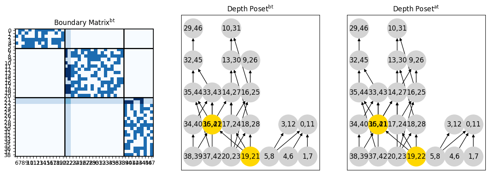

### Birth Death Pairs
|                          |                                                                                                                                                                                                                                   |
|:-------------------------|:----------------------------------------------------------------------------------------------------------------------------------------------------------------------------------------------------------------------------------|
| Before the transposition | $\{(13, 30), (20, 23), (4, 6), (17, 24), (19, 21), (34, 40), (0, 11), (9, 26), (37, 42), (16, 25), (18, 28), (35, 44), (32, 45), (3, 12), (29, 46), (14, 27), (15, 22), (33, 43), (38, 39), (5, 8), (1, 7), (36, 41), (10, 31)\}$ |
| After the transposition  | $\{(15, 21), (13, 30), (20, 23), (4, 6), (17, 24), (34, 40), (0, 11), (9, 26), (37, 42), (16, 25), (18, 28), (35, 44), (32, 45), (3, 12), (29, 46), (14, 27), (33, 43), (38, 39), (5, 8), (1, 7), (19, 22), (36, 41), (10, 31)\}$ |

### Relations
|                          | Algorithm 1                                                                                                                                                                                                                                                                                                                                                                                                                                      | Algorithm 2                                                                                                                                                                                                                                                                                         |
|:-------------------------|:-------------------------------------------------------------------------------------------------------------------------------------------------------------------------------------------------------------------------------------------------------------------------------------------------------------------------------------------------------------------------------------------------------------------------------------------------|:----------------------------------------------------------------------------------------------------------------------------------------------------------------------------------------------------------------------------------------------------------------------------------------------------|
| Before the transposition | $\{(42, 45), (41, 43), (24, 27), (44, 45), (21, 22), (21, 28), (21, 25), (21, 31), (23, 28), (23, 25), (39, 45), (28, 30), (45, 46), (6, 11), (25, 31), (42, 47), (41, 45), (44, 47), (21, 24), (21, 30), (39, 41), (21, 27), (23, 30), (8, 11), (23, 27), (40, 43), (39, 47), (27, 30), (24, 25), (41, 44), (42, 43), (24, 31), (41, 47), (21, 26), (22, 27), (23, 26), (39, 40), (40, 45), (39, 43), (45, 47), (30, 31), (25, 26)\}$           | $\{(38, 29), (38, 35), (38, 32), (1, 0), (19, 18), (37, 33), (33, 32), (4, 2), (20, 10), (20, 16), (35, 29), (5, 0), (5, 3), (17, 14), (19, 14), (37, 29), (19, 17), (37, 35), (16, 9), (13, 10), (15, 10), (3, 2), (20, 18), (5, 2), (38, 36), (17, 16), (19, 10), (36, 32), (19, 13), (36, 35)\}$ |
| After the transposition  | $\{(42, 45), (41, 43), (24, 27), (44, 45), (23, 28), (22, 26), (23, 25), (39, 45), (28, 30), (45, 46), (6, 11), (25, 31), (42, 47), (41, 45), (44, 47), (22, 25), (39, 41), (21, 27), (23, 30), (22, 28), (8, 11), (23, 27), (40, 43), (22, 31), (39, 47), (27, 30), (24, 25), (41, 44), (42, 43), (24, 31), (41, 47), (21, 26), (22, 21), (22, 27), (23, 26), (22, 24), (22, 30), (39, 40), (40, 45), (39, 43), (45, 47), (30, 31), (25, 26)\}$ | $\{(38, 29), (38, 35), (38, 32), (1, 0), (19, 18), (19, 15), (37, 33), (33, 32), (4, 2), (20, 10), (20, 16), (35, 29), (5, 0), (5, 3), (17, 14), (19, 14), (37, 29), (19, 17), (37, 35), (16, 9), (13, 10), (15, 10), (3, 2), (20, 18), (5, 2), (38, 36), (17, 16), (36, 32), (19, 13), (36, 35)\}$ |

### Successors and Predecessers
|                 | $\text{Set}^\text{bt}(15, 22)$                   | $\text{Set}^\text{bt}(19, 21)$                                                                                        | $\text{Set}^\text{at}(19, 22)$                                                                                        | $\text{Set}^\text{at}(15, 21)$                            |
|:----------------|:-------------------------------------------------|:----------------------------------------------------------------------------------------------------------------------|:----------------------------------------------------------------------------------------------------------------------|:----------------------------------------------------------|
| $\text{Succ}_1$ | $\text{Succ}_1^\text{bt}(15, 22) = \{(14, 27)\}$ | $\text{Succ}_1^\text{bt}(19, 21) = \{(13, 30), (14, 27), (16, 25), (18, 28), (10, 31), (15, 22), (17, 24), (9, 26)\}$ | $\text{Succ}_1^\text{at}(19, 22) = \{(15, 21), (13, 30), (14, 27), (16, 25), (18, 28), (10, 31), (17, 24), (9, 26)\}$ | $\text{Succ}_1^\text{at}(15, 21) = \{(14, 27), (9, 26)\}$ |
| $\text{Pred}_1$ | $\text{Pred}_1^\text{bt}(15, 22) = \{(19, 21)\}$ | $\text{Pred}_1^\text{bt}(19, 21) = \emptyset$                                                                         | $\text{Pred}_1^\text{at}(19, 22) = \emptyset$                                                                         | $\text{Pred}_1^\text{at}(15, 21) = \{(19, 22)\}$          |
| $\text{Succ}_2$ | $\text{Succ}_2^\text{bt}(15, 22) = \{(10, 31)\}$ | $\text{Succ}_2^\text{bt}(19, 21) = \{(13, 30), (14, 27), (18, 28), (17, 24), (10, 31)\}$                              | $\text{Succ}_2^\text{at}(19, 22) = \{(15, 21), (13, 30), (14, 27), (18, 28), (17, 24)\}$                              | $\text{Succ}_2^\text{at}(15, 21) = \{(10, 31)\}$          |
| $\text{Pred}_2$ | $\text{Pred}_2^\text{bt}(15, 22) = \emptyset$    | $\text{Pred}_2^\text{bt}(19, 21) = \emptyset$                                                                         | $\text{Pred}_2^\text{at}(19, 22) = \emptyset$                                                                         | $\text{Pred}_2^\text{at}(15, 21) = \{(19, 22)\}$          |

### Temp Sets
|                                                               | Before the Transposition                                                                       | After the Transposition                                                                        |
|:--------------------------------------------------------------|:-----------------------------------------------------------------------------------------------|:-----------------------------------------------------------------------------------------------|
| $\mathcal{B} = \{(s, t)\in \text{BD}:\; f(s) > f(x)\}$        | $\{(37, 42), (29, 46), (38, 39), (20, 23), (35, 44), (32, 45), (36, 41), (34, 40), (33, 43)\}$ | $\{(37, 42), (29, 46), (38, 39), (20, 23), (35, 44), (32, 45), (36, 41), (34, 40), (33, 43)\}$ |
| $\mathcal{N} = \{(s, t)\in \text{BD}:\; f(x) > f(s) > f(a)\}$ | $\{(16, 25), (18, 28), (17, 24)\}$                                                             | $\{(16, 25), (18, 28), (17, 24)\}$                                                             |

### Equations
There are 1 equations are wrong.

| eq   | left (formula)                  | left (paramatrized)               | left (value)                                                                        | right (formula)                                                                                          | right (paramatrized)                                                                                           | right (value)                                                                       | correct   |
|:-----|:--------------------------------|:----------------------------------|:------------------------------------------------------------------------------------|:---------------------------------------------------------------------------------------------------------|:---------------------------------------------------------------------------------------------------------------|:------------------------------------------------------------------------------------|:----------|
| Eq28 | $\text{Succ}_1^\text{at}(x, b)$ | $\text{Succ}_1^\text{at}(19, 22)$ | $\{(15, 21), (13, 30), (14, 27), (16, 25), (18, 28), (10, 31), (17, 24), (9, 26)\}$ | $\text{Succ}_1^\text{bt}(x, y) \oplus \{(a, y), (a, b)\}$                                                | $\text{Succ}_1^\text{bt}(19, 21) \oplus \{(15, 21), (15, 22)\}$                                                | $\{(15, 21), (13, 30), (14, 27), (9, 26), (16, 25), (18, 28), (17, 24), (10, 31)\}$ | ✔         |
| Eq29 | $\text{Succ}_1^\text{at}(a, y)$ | $\text{Succ}_1^\text{at}(15, 21)$ | $\{(14, 27), (9, 26)\}$                                                             | $\text{Succ}_1^\text{bt}(a, b)$                                                                          | $\text{Succ}_1^\text{bt}(15, 22)$                                                                              | $\{(14, 27)\}$                                                                      | ✘         |
| Eq30 | $\text{Pred}_1^\text{at}(x, b)$ | $\text{Pred}_1^\text{at}(19, 22)$ | $\emptyset$                                                                         | $[\text{Pred}_1^\text{bt}(a, b) \cap \mathcal{B}]$                                                       | $[\text{Pred}_1^\text{bt}(15, 22) \cap \mathcal{B}]$                                                           | $\emptyset$                                                                         | ✔         |
| Eq31 | $\text{Pred}_1^\text{at}(a, y)$ | $\text{Pred}_1^\text{at}(15, 21)$ | $\{(19, 22)\}$                                                                      | $\text{Pred}_1^\text{bt}(x, y) \oplus \{(x, b)\} \oplus[\text{Pred}_1^\text{bt}(a, b) \cap \mathcal{N}]$ | $\text{Pred}_1^\text{bt}(19, 21) \oplus \{(19, 22)\} \oplus[\text{Pred}_1^\text{bt}(15, 22) \cap \mathcal{N}]$ | $\{(19, 22)\}$                                                                      | ✔         |
| Eq32 | $\text{Succ}_2^\text{at}(x, b)$ | $\text{Succ}_2^\text{at}(19, 22)$ | $\{(15, 21), (13, 30), (14, 27), (18, 28), (17, 24)\}$                              | $\text{Succ}_2^\text{bt}(x, y) \oplus \{(a, y)\} \oplus \text{Succ}_2^\text{bt}(a, b)$                   | $\text{Succ}_2^\text{bt}(19, 21) \oplus \{(15, 21)\} \oplus \text{Succ}_2^\text{bt}(15, 22)$                   | $\{(15, 21), (13, 30), (14, 27), (18, 28), (17, 24)\}$                              | ✔         |
| Eq33 | $\text{Succ}_2^\text{at}(a, y)$ | $\text{Succ}_2^\text{at}(15, 21)$ | $\{(10, 31)\}$                                                                      | $\text{Succ}_2^\text{bt}(a, b)$                                                                          | $\text{Succ}_2^\text{bt}(15, 22)$                                                                              | $\{(10, 31)\}$                                                                      | ✔         |
| Eq34 | $\text{Pred}_2^\text{at}(x, b)$ | $\text{Pred}_2^\text{at}(19, 22)$ | $\emptyset$                                                                         | $\text{Pred}_2^\text{bt}(x, y)$                                                                          | $\text{Pred}_2^\text{bt}(19, 21)$                                                                              | $\emptyset$                                                                         | ✔         |
| Eq35 | $\text{Pred}_2^\text{at}(a, y)$ | $\text{Pred}_2^\text{at}(15, 21)$ | $\{(19, 22)\}$                                                                      | $\text{Pred}_2^\text{bt}(a, b) \oplus \{(x, b)\}$                                                        | $\text{Pred}_2^\text{bt}(15, 22) \oplus \{(19, 22)\}$                                                          | $\{(19, 22)\}$                                                                      | ✔         |

## Transposition <28, 29> in complex 4
Here is a __birth-death__ __switch forward__ transposition <28, 29>.

$$
a = 18, \; b = 28, \; x = 29, \; y = 46
$$

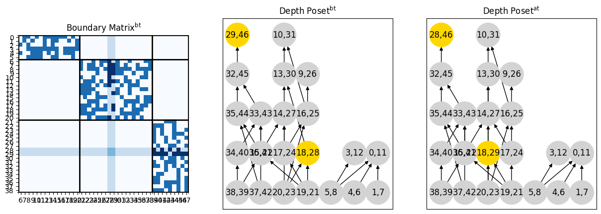

### Birth Death Pairs
|                          |                                                                                                                                                                                                                                   |
|:-------------------------|:----------------------------------------------------------------------------------------------------------------------------------------------------------------------------------------------------------------------------------|
| Before the transposition | $\{(13, 30), (20, 23), (4, 6), (17, 24), (19, 21), (34, 40), (0, 11), (9, 26), (37, 42), (16, 25), (18, 28), (35, 44), (32, 45), (3, 12), (29, 46), (14, 27), (15, 22), (33, 43), (38, 39), (5, 8), (1, 7), (36, 41), (10, 31)\}$ |
| After the transposition  | $\{(13, 30), (28, 46), (20, 23), (4, 6), (18, 29), (17, 24), (19, 21), (34, 40), (0, 11), (9, 26), (37, 42), (16, 25), (35, 44), (32, 45), (3, 12), (14, 27), (15, 22), (33, 43), (38, 39), (5, 8), (1, 7), (36, 41), (10, 31)\}$ |

### Relations
|                          | Algorithm 1                                                                                                                                                                                                                                                                                                                                                                                                                            | Algorithm 2                                                                                                                                                                                                                                                                                                                                 |
|:-------------------------|:---------------------------------------------------------------------------------------------------------------------------------------------------------------------------------------------------------------------------------------------------------------------------------------------------------------------------------------------------------------------------------------------------------------------------------------|:--------------------------------------------------------------------------------------------------------------------------------------------------------------------------------------------------------------------------------------------------------------------------------------------------------------------------------------------|
| Before the transposition | $\{(42, 45), (41, 43), (24, 27), (44, 45), (21, 22), (21, 28), (21, 25), (21, 31), (23, 28), (23, 25), (39, 45), (28, 30), (45, 46), (6, 11), (25, 31), (42, 47), (41, 45), (44, 47), (21, 24), (21, 30), (39, 41), (21, 27), (23, 30), (8, 11), (23, 27), (40, 43), (39, 47), (27, 30), (24, 25), (41, 44), (42, 43), (24, 31), (41, 47), (21, 26), (22, 27), (23, 26), (39, 40), (40, 45), (39, 43), (45, 47), (30, 31), (25, 26)\}$ | $\{(38, 29), (38, 35), (38, 32), (1, 0), (19, 18), (37, 33), (33, 32), (4, 2), (20, 10), (20, 16), (35, 29), (5, 0), (5, 3), (17, 14), (19, 14), (37, 29), (19, 17), (37, 35), (16, 9), (13, 10), (15, 10), (3, 2), (20, 18), (5, 2), (38, 36), (17, 16), (19, 10), (36, 32), (19, 13), (36, 35)\}$                                         |
| After the transposition  | $\{(24, 30), (42, 45), (41, 43), (24, 27), (44, 45), (21, 22), (21, 25), (21, 31), (23, 25), (39, 45), (45, 46), (6, 11), (25, 31), (42, 47), (41, 45), (44, 47), (21, 24), (21, 30), (39, 41), (21, 27), (23, 30), (8, 11), (23, 27), (40, 43), (39, 47), (27, 30), (24, 25), (41, 44), (42, 43), (24, 31), (41, 47), (29, 30), (21, 26), (22, 27), (23, 26), (39, 40), (40, 45), (39, 43), (45, 47), (30, 31), (25, 26)\}$           | $\{(38, 35), (38, 32), (34, 28), (1, 0), (19, 18), (36, 28), (37, 33), (33, 32), (4, 2), (38, 28), (20, 10), (20, 16), (5, 0), (5, 3), (17, 14), (19, 14), (19, 17), (37, 35), (16, 9), (13, 10), (33, 28), (15, 10), (35, 28), (3, 2), (20, 18), (5, 2), (38, 36), (17, 16), (37, 28), (19, 10), (36, 32), (19, 13), (36, 35), (32, 28)\}$ |

### Successors and Predecessers
|                 | $\text{Set}^\text{bt}(18, 28)$                             | $\text{Set}^\text{bt}(29, 46)$                                       | $\text{Set}^\text{at}(18, 29)$                             | $\text{Set}^\text{at}(28, 46)$                                                                               |
|:----------------|:-----------------------------------------------------------|:---------------------------------------------------------------------|:-----------------------------------------------------------|:-------------------------------------------------------------------------------------------------------------|
| $\text{Succ}_1$ | $\text{Succ}_1^\text{bt}(18, 28) = \{(13, 30)\}$           | $\text{Succ}_1^\text{bt}(29, 46) = \emptyset$                        | $\text{Succ}_1^\text{at}(18, 29) = \{(13, 30)\}$           | $\text{Succ}_1^\text{at}(28, 46) = \emptyset$                                                                |
| $\text{Pred}_1$ | $\text{Pred}_1^\text{bt}(18, 28) = \{(20, 23), (19, 21)\}$ | $\text{Pred}_1^\text{bt}(29, 46) = \{(32, 45)\}$                     | $\text{Pred}_1^\text{at}(18, 29) = \emptyset$              | $\text{Pred}_1^\text{at}(28, 46) = \{(32, 45)\}$                                                             |
| $\text{Succ}_2$ | $\text{Succ}_2^\text{bt}(18, 28) = \emptyset$              | $\text{Succ}_2^\text{bt}(29, 46) = \emptyset$                        | $\text{Succ}_2^\text{at}(18, 29) = \emptyset$              | $\text{Succ}_2^\text{at}(28, 46) = \emptyset$                                                                |
| $\text{Pred}_2$ | $\text{Pred}_2^\text{bt}(18, 28) = \{(20, 23), (19, 21)\}$ | $\text{Pred}_2^\text{bt}(29, 46) = \{(37, 42), (35, 44), (38, 39)\}$ | $\text{Pred}_2^\text{at}(18, 29) = \{(20, 23), (19, 21)\}$ | $\text{Pred}_2^\text{at}(28, 46) = \{(37, 42), (38, 39), (35, 44), (32, 45), (36, 41), (34, 40), (33, 43)\}$ |

### Temp Sets
|                                                              | Before the Transposition                                                   | After the Transposition                                                    |
|:-------------------------------------------------------------|:---------------------------------------------------------------------------|:---------------------------------------------------------------------------|
| $A_1 = \{(s, t)\in \text{BD}:\; f(a) < f(s) < f(t) < f(x)\}$ | $\{(20, 23), (19, 21)\}$                                                   | $\{(20, 23), (19, 21)\}$                                                   |
| $B_1 = \{(s, t)\in \text{BD}:\; U_1[t, x] = 1\}$             | $\emptyset$                                                                | $\emptyset$                                                                |
| $A_2 = \{(s, t)\in \text{BD}:\; f(b) < f(s) < f(t) < f(y)\}$ | $\{(37, 42), (38, 39), (35, 44), (32, 45), (36, 41), (34, 40), (33, 43)\}$ | $\{(37, 42), (38, 39), (35, 44), (32, 45), (36, 41), (34, 40), (33, 43)\}$ |
| $B_2 = \{(s, t)\in \text{BD}:\; U_2[b, s] = 1\}$             | $\emptyset$                                                                | $\{(37, 42), (38, 39), (35, 44), (32, 45), (36, 41), (34, 40), (33, 43)\}$ |

### Equations
There are 2 equations are wrong.

| eq    | left (formula)                  | left (paramatrized)               | left (value)                                                               | right (formula)                                      | right (paramatrized)                                  | right (value)                                                              | correct   |
|:------|:--------------------------------|:----------------------------------|:---------------------------------------------------------------------------|:-----------------------------------------------------|:------------------------------------------------------|:---------------------------------------------------------------------------|:----------|
| Eq48  | $\text{Succ}_1^\text{at}(a, x)$ | $\text{Succ}_1^\text{at}(18, 29)$ | $\{(13, 30)\}$                                                             | $\text{Succ}_1^\text{bt}(a, b)$                      | $\text{Succ}_1^\text{bt}(18, 28)$                     | $\{(13, 30)\}$                                                             | ✔         |
| Eq49  | $\text{Succ}_1^\text{at}(b, y)$ | $\text{Succ}_1^\text{at}(28, 46)$ | $\emptyset$                                                                | $\text{Succ}_1^\text{bt}(x, y)$                      | $\text{Succ}_1^\text{bt}(29, 46)$                     | $\emptyset$                                                                | ✔         |
| Eq50  | $\text{Pred}_1^\text{at}(a, x)$ | $\text{Pred}_1^\text{at}(18, 29)$ | $\emptyset$                                                                | $\{(s, t)\in \text{BD}:\; U_1^\text{bt}[t, x] = 1\}$ | $\{(s, t)\in \text{BD}:\; U_1^\text{bt}[t, 29] = 1\}$ | $\emptyset$                                                                | ✔         |
| Eq50a | $\text{Pred}_1^\text{at}(a, x)$ | $\text{Pred}_1^\text{at}(18, 29)$ | $\emptyset$                                                                | $A_1^\text{bt} \cap B_1^\text{bt}$                   | $A_1^\text{bt} \cap B_1^\text{bt}$                    | $\emptyset$                                                                | ✔         |
| Eq50b | $\text{Pred}_1^\text{at}(a, x)$ | $\text{Pred}_1^\text{at}(18, 29)$ | $\emptyset$                                                                | $A_1^\text{bt} \cap B_1^\text{at}$                   | $A_1^\text{bt} \cap B_1^\text{at}$                    | $\emptyset$                                                                | ✔         |
| Eq51  | $\text{Pred}_1^\text{at}(b, y)$ | $\text{Pred}_1^\text{at}(28, 46)$ | $\{(32, 45)\}$                                                             | $\text{Pred}_1^\text{bt}(x, y)$                      | $\text{Pred}_1^\text{bt}(29, 46)$                     | $\{(32, 45)\}$                                                             | ✔         |
| Eq52  | $\text{Succ}_2^\text{at}(a, x)$ | $\text{Succ}_2^\text{at}(18, 29)$ | $\emptyset$                                                                | $\text{Succ}_2^\text{bt}(a, b)$                      | $\text{Succ}_2^\text{bt}(18, 28)$                     | $\emptyset$                                                                | ✔         |
| Eq53  | $\text{Succ}_2^\text{at}(b, y)$ | $\text{Succ}_2^\text{at}(28, 46)$ | $\emptyset$                                                                | $\text{Succ}_2^\text{bt}(x, y)$                      | $\text{Succ}_2^\text{bt}(29, 46)$                     | $\emptyset$                                                                | ✔         |
| Eq54  | $\text{Pred}_2^\text{at}(a, x)$ | $\text{Pred}_2^\text{at}(18, 29)$ | $\{(20, 23), (19, 21)\}$                                                   | $\text{Pred}_2^\text{bt}(a, b)$                      | $\text{Pred}_2^\text{bt}(18, 28)$                     | $\{(20, 23), (19, 21)\}$                                                   | ✔         |
| Eq55  | $\text{Pred}_2^\text{at}(b, y)$ | $\text{Pred}_2^\text{at}(28, 46)$ | $\{(37, 42), (38, 39), (35, 44), (32, 45), (36, 41), (34, 40), (33, 43)\}$ | $\{(s, t)\in \text{BD}:\; U_2^\text{bt}[b, s] = 1\}$ | $\{(s, t)\in \text{BD}:\; U_2^\text{bt}[28, s] = 1\}$ | $\emptyset$                                                                | ✘         |
| Eq55a | $\text{Pred}_2^\text{at}(b, y)$ | $\text{Pred}_2^\text{at}(28, 46)$ | $\{(37, 42), (38, 39), (35, 44), (32, 45), (36, 41), (34, 40), (33, 43)\}$ | $A_2^\text{bt} \cap B_2^\text{bt}$                   | $A_2^\text{bt} \cap B_2^\text{bt}$                    | $\emptyset$                                                                | ✘         |
| Eq55b | $\text{Pred}_2^\text{at}(b, y)$ | $\text{Pred}_2^\text{at}(28, 46)$ | $\{(37, 42), (38, 39), (35, 44), (32, 45), (36, 41), (34, 40), (33, 43)\}$ | $A_2^\text{bt} \cap B_2^\text{at}$                   | $A_2^\text{bt} \cap B_2^\text{at}$                    | $\{(37, 42), (38, 39), (35, 44), (32, 45), (36, 41), (34, 40), (33, 43)\}$ | ✔         |

## Transposition <34, 35> in complex 4
Here is a __birth-birth__ __no switch__ transposition <34, 35>.

$$
a = 34, \; b = 40, \; x = 35, \; y = 44
$$

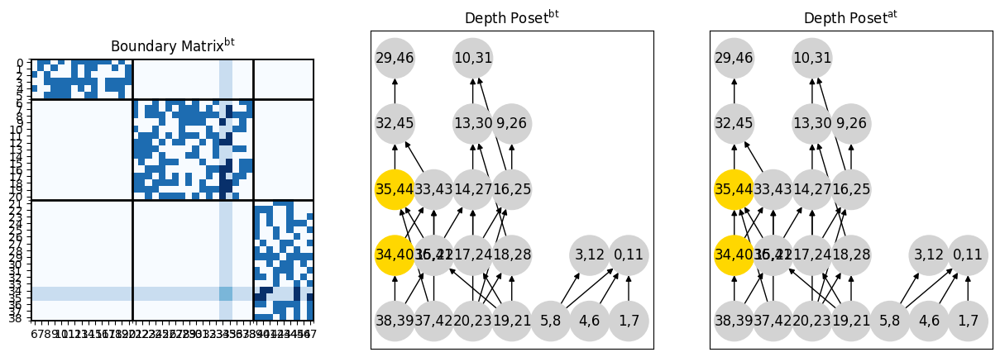

### Birth Death Pairs
|                          |                                                                                                                                                                                                                                   |
|:-------------------------|:----------------------------------------------------------------------------------------------------------------------------------------------------------------------------------------------------------------------------------|
| Before the transposition | $\{(13, 30), (20, 23), (4, 6), (17, 24), (19, 21), (34, 40), (0, 11), (9, 26), (37, 42), (16, 25), (18, 28), (35, 44), (32, 45), (3, 12), (29, 46), (14, 27), (15, 22), (33, 43), (38, 39), (5, 8), (1, 7), (36, 41), (10, 31)\}$ |
| After the transposition  | $\{(13, 30), (20, 23), (4, 6), (17, 24), (19, 21), (34, 40), (0, 11), (9, 26), (37, 42), (16, 25), (18, 28), (35, 44), (32, 45), (3, 12), (29, 46), (14, 27), (15, 22), (33, 43), (38, 39), (5, 8), (1, 7), (36, 41), (10, 31)\}$ |

### Relations
|                          | Algorithm 1                                                                                                                                                                                                                                                                                                                                                                                                                                      | Algorithm 2                                                                                                                                                                                                                                                                                         |
|:-------------------------|:-------------------------------------------------------------------------------------------------------------------------------------------------------------------------------------------------------------------------------------------------------------------------------------------------------------------------------------------------------------------------------------------------------------------------------------------------|:----------------------------------------------------------------------------------------------------------------------------------------------------------------------------------------------------------------------------------------------------------------------------------------------------|
| Before the transposition | $\{(42, 45), (41, 43), (24, 27), (44, 45), (21, 22), (21, 28), (21, 25), (21, 31), (23, 28), (23, 25), (39, 45), (28, 30), (45, 46), (6, 11), (25, 31), (42, 47), (41, 45), (44, 47), (21, 24), (21, 30), (39, 41), (21, 27), (23, 30), (8, 11), (23, 27), (40, 43), (39, 47), (27, 30), (24, 25), (41, 44), (42, 43), (24, 31), (41, 47), (21, 26), (22, 27), (23, 26), (39, 40), (40, 45), (39, 43), (45, 47), (30, 31), (25, 26)\}$           | $\{(38, 29), (38, 35), (38, 32), (1, 0), (19, 18), (37, 33), (33, 32), (4, 2), (20, 10), (20, 16), (35, 29), (5, 0), (5, 3), (17, 14), (19, 14), (37, 29), (19, 17), (37, 35), (16, 9), (13, 10), (15, 10), (3, 2), (20, 18), (5, 2), (38, 36), (17, 16), (19, 10), (36, 32), (19, 13), (36, 35)\}$ |
| After the transposition  | $\{(42, 45), (41, 43), (24, 27), (44, 45), (21, 22), (21, 28), (21, 25), (21, 31), (23, 28), (40, 44), (23, 25), (40, 47), (39, 45), (28, 30), (45, 46), (6, 11), (25, 31), (42, 47), (41, 45), (44, 47), (21, 24), (21, 30), (39, 41), (21, 27), (23, 30), (8, 11), (23, 27), (40, 43), (39, 47), (27, 30), (24, 25), (41, 44), (42, 43), (24, 31), (41, 47), (21, 26), (22, 27), (23, 26), (39, 40), (39, 43), (45, 47), (30, 31), (25, 26)\}$ | $\{(38, 29), (38, 35), (38, 32), (1, 0), (19, 18), (37, 33), (33, 32), (4, 2), (20, 10), (20, 16), (35, 29), (5, 0), (5, 3), (17, 14), (19, 14), (37, 29), (19, 17), (37, 35), (16, 9), (13, 10), (15, 10), (3, 2), (20, 18), (5, 2), (38, 36), (17, 16), (19, 10), (36, 32), (19, 13), (36, 35)\}$ |

### Successors and Predecessers
No such node in the Depth Poset

### Temp Sets
|                                                               | Before the Transposition                                                                                                                                                                            | After the Transposition                                                                                                                                                                             |
|:--------------------------------------------------------------|:----------------------------------------------------------------------------------------------------------------------------------------------------------------------------------------------------|:----------------------------------------------------------------------------------------------------------------------------------------------------------------------------------------------------|
| $\mathcal{L} = \{(s, t)\in \text{BD}:\; f(t) < f(y)\}$        | $\{(13, 30), (20, 23), (4, 6), (17, 24), (34, 40), (19, 21), (0, 11), (9, 26), (37, 42), (16, 25), (18, 28), (3, 12), (14, 27), (15, 22), (33, 43), (38, 39), (5, 8), (1, 7), (36, 41), (10, 31)\}$ | $\{(13, 30), (20, 23), (4, 6), (17, 24), (34, 40), (19, 21), (0, 11), (9, 26), (37, 42), (16, 25), (18, 28), (3, 12), (14, 27), (15, 22), (33, 43), (38, 39), (5, 8), (1, 7), (36, 41), (10, 31)\}$ |
| $\mathcal{M} = \{(s, t)\in \text{BD}:\; f(y) < f(t) < f(b)\}$ | $\emptyset$                                                                                                                                                                                         | $\emptyset$                                                                                                                                                                                         |

### Equations
There are 2 equations are wrong.

| eq   | left (formula)                  | left (paramatrized)               | left (value)   | right (formula)                                                                        | right (paramatrized)                                                                         | right (value)            | correct   |
|:-----|:--------------------------------|:----------------------------------|:---------------|:---------------------------------------------------------------------------------------|:---------------------------------------------------------------------------------------------|:-------------------------|:----------|
| Eq16 | $\text{Succ}_1^\text{at}(x, y)$ | $\text{Succ}_1^\text{at}(35, 44)$ | $\{(32, 45)\}$ | $\text{Succ}_1^\text{bt}(x, y) \oplus \{(a, b)\} \oplus \text{Succ}_1^\text{bt}(a, b)$ | $\text{Succ}_1^\text{bt}(35, 44) \oplus \{(34, 40)\} \oplus \text{Succ}_1^\text{bt}(34, 40)$ | $\{(34, 40), (33, 43)\}$ | ✘         |
| Eq17 | $\text{Pred}_1^\text{at}(a, b)$ | $\text{Pred}_1^\text{at}(34, 40)$ | $\{(38, 39)\}$ | $\text{Pred}_1^\text{bt}(a, b) \oplus \{(x, y)\}$                                      | $\text{Pred}_1^\text{bt}(34, 40) \oplus \{(35, 44)\}$                                        | $\{(35, 44), (38, 39)\}$ | ✘         |

## Transposition <36, 37> in complex 4
Here is a __birth-birth__ __no switch__ transposition <36, 37>.

$$
a = 36, \; b = 41, \; x = 37, \; y = 42
$$

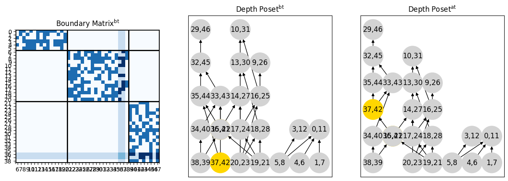

### Birth Death Pairs
|                          |                                                                                                                                                                                                                                   |
|:-------------------------|:----------------------------------------------------------------------------------------------------------------------------------------------------------------------------------------------------------------------------------|
| Before the transposition | $\{(13, 30), (20, 23), (4, 6), (17, 24), (19, 21), (34, 40), (0, 11), (9, 26), (37, 42), (16, 25), (18, 28), (35, 44), (32, 45), (3, 12), (29, 46), (14, 27), (15, 22), (33, 43), (38, 39), (5, 8), (1, 7), (36, 41), (10, 31)\}$ |
| After the transposition  | $\{(13, 30), (20, 23), (4, 6), (17, 24), (19, 21), (34, 40), (0, 11), (9, 26), (37, 42), (16, 25), (18, 28), (35, 44), (32, 45), (3, 12), (29, 46), (14, 27), (15, 22), (33, 43), (38, 39), (5, 8), (1, 7), (36, 41), (10, 31)\}$ |

### Relations
|                          | Algorithm 1                                                                                                                                                                                                                                                                                                                                                                                                                            | Algorithm 2                                                                                                                                                                                                                                                                                         |
|:-------------------------|:---------------------------------------------------------------------------------------------------------------------------------------------------------------------------------------------------------------------------------------------------------------------------------------------------------------------------------------------------------------------------------------------------------------------------------------|:----------------------------------------------------------------------------------------------------------------------------------------------------------------------------------------------------------------------------------------------------------------------------------------------------|
| Before the transposition | $\{(42, 45), (41, 43), (24, 27), (44, 45), (21, 22), (21, 28), (21, 25), (21, 31), (23, 28), (23, 25), (39, 45), (28, 30), (45, 46), (6, 11), (25, 31), (42, 47), (41, 45), (44, 47), (21, 24), (21, 30), (39, 41), (21, 27), (23, 30), (8, 11), (23, 27), (40, 43), (39, 47), (27, 30), (24, 25), (41, 44), (42, 43), (24, 31), (41, 47), (21, 26), (22, 27), (23, 26), (39, 40), (40, 45), (39, 43), (45, 47), (30, 31), (25, 26)\}$ | $\{(38, 29), (38, 35), (38, 32), (1, 0), (19, 18), (37, 33), (33, 32), (4, 2), (20, 10), (20, 16), (35, 29), (5, 0), (5, 3), (17, 14), (19, 14), (37, 29), (19, 17), (37, 35), (16, 9), (13, 10), (15, 10), (3, 2), (20, 18), (5, 2), (38, 36), (17, 16), (19, 10), (36, 32), (19, 13), (36, 35)\}$ |
| After the transposition  | $\{(42, 45), (24, 27), (44, 45), (21, 22), (21, 28), (21, 25), (21, 31), (23, 28), (23, 25), (39, 45), (28, 30), (45, 46), (6, 11), (41, 42), (25, 31), (42, 47), (44, 47), (21, 24), (21, 30), (39, 41), (21, 27), (23, 30), (8, 11), (23, 27), (40, 43), (39, 47), (27, 30), (24, 25), (41, 44), (42, 43), (24, 31), (21, 26), (22, 27), (23, 26), (39, 40), (40, 45), (39, 43), (45, 47), (30, 31), (25, 26)\}$                     | $\{(38, 29), (38, 35), (38, 32), (1, 0), (19, 18), (37, 33), (33, 32), (4, 2), (20, 10), (20, 16), (35, 29), (5, 0), (5, 3), (17, 14), (19, 14), (37, 29), (19, 17), (37, 35), (16, 9), (13, 10), (15, 10), (3, 2), (20, 18), (5, 2), (38, 36), (17, 16), (19, 10), (36, 32), (19, 13), (36, 35)\}$ |

### Successors and Predecessers
No such node in the Depth Poset

### Temp Sets
|                                                               | Before the Transposition                                                                                                                                                        | After the Transposition                                                                                                                                                         |
|:--------------------------------------------------------------|:--------------------------------------------------------------------------------------------------------------------------------------------------------------------------------|:--------------------------------------------------------------------------------------------------------------------------------------------------------------------------------|
| $\mathcal{L} = \{(s, t)\in \text{BD}:\; f(t) < f(y)\}$        | $\{(13, 30), (14, 27), (38, 39), (5, 8), (19, 21), (20, 23), (4, 6), (16, 25), (1, 7), (18, 28), (10, 31), (3, 12), (15, 22), (36, 41), (17, 24), (34, 40), (0, 11), (9, 26)\}$ | $\{(13, 30), (14, 27), (38, 39), (5, 8), (19, 21), (20, 23), (4, 6), (16, 25), (1, 7), (18, 28), (10, 31), (3, 12), (15, 22), (36, 41), (17, 24), (34, 40), (0, 11), (9, 26)\}$ |
| $\mathcal{M} = \{(s, t)\in \text{BD}:\; f(y) < f(t) < f(b)\}$ | $\emptyset$                                                                                                                                                                     | $\emptyset$                                                                                                                                                                     |

### Equations
There are 2 equations are wrong.

| eq   | left (formula)                  | left (paramatrized)               | left (value)             | right (formula)                                                                        | right (paramatrized)                                                                         | right (value)            | correct   |
|:-----|:--------------------------------|:----------------------------------|:-------------------------|:---------------------------------------------------------------------------------------|:---------------------------------------------------------------------------------------------|:-------------------------|:----------|
| Eq16 | $\text{Succ}_1^\text{at}(x, y)$ | $\text{Succ}_1^\text{at}(37, 42)$ | $\{(32, 45), (33, 43)\}$ | $\text{Succ}_1^\text{bt}(x, y) \oplus \{(a, b)\} \oplus \text{Succ}_1^\text{bt}(a, b)$ | $\text{Succ}_1^\text{bt}(37, 42) \oplus \{(36, 41)\} \oplus \text{Succ}_1^\text{bt}(36, 41)$ | $\{(36, 41), (35, 44)\}$ | ✘         |
| Eq17 | $\text{Pred}_1^\text{at}(a, b)$ | $\text{Pred}_1^\text{at}(36, 41)$ | $\{(38, 39)\}$           | $\text{Pred}_1^\text{bt}(a, b) \oplus \{(x, y)\}$                                      | $\text{Pred}_1^\text{bt}(36, 41) \oplus \{(37, 42)\}$                                        | $\{(37, 42), (38, 39)\}$ | ✘         |

## Transposition <39, 40> in complex 4
Here is a __death-death__ __switch forward__ transposition <39, 40>.

$$
a = 34, \; b = 40, \; x = 38, \; y = 39
$$

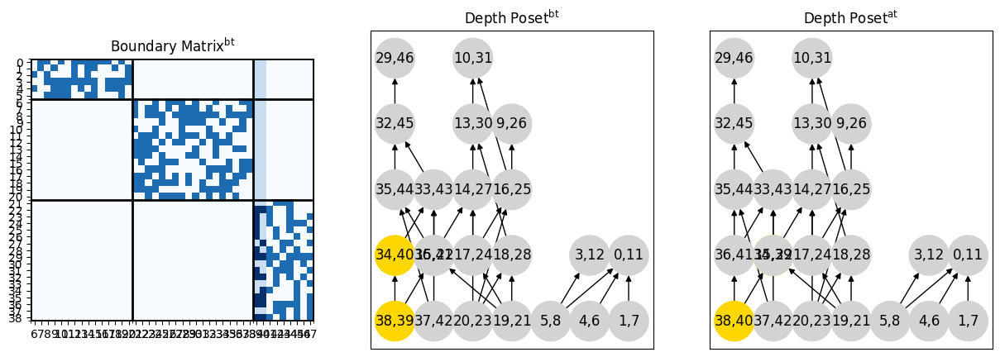

### Birth Death Pairs
|                          |                                                                                                                                                                                                                                   |
|:-------------------------|:----------------------------------------------------------------------------------------------------------------------------------------------------------------------------------------------------------------------------------|
| Before the transposition | $\{(13, 30), (20, 23), (4, 6), (17, 24), (19, 21), (34, 40), (0, 11), (9, 26), (37, 42), (16, 25), (18, 28), (35, 44), (32, 45), (3, 12), (29, 46), (14, 27), (15, 22), (33, 43), (38, 39), (5, 8), (1, 7), (36, 41), (10, 31)\}$ |
| After the transposition  | $\{(13, 30), (20, 23), (4, 6), (17, 24), (19, 21), (0, 11), (9, 26), (37, 42), (16, 25), (18, 28), (35, 44), (32, 45), (38, 40), (3, 12), (29, 46), (14, 27), (34, 39), (15, 22), (33, 43), (5, 8), (1, 7), (36, 41), (10, 31)\}$ |

### Relations
|                          | Algorithm 1                                                                                                                                                                                                                                                                                                                                                                                                                            | Algorithm 2                                                                                                                                                                                                                                                                                                   |
|:-------------------------|:---------------------------------------------------------------------------------------------------------------------------------------------------------------------------------------------------------------------------------------------------------------------------------------------------------------------------------------------------------------------------------------------------------------------------------------|:--------------------------------------------------------------------------------------------------------------------------------------------------------------------------------------------------------------------------------------------------------------------------------------------------------------|
| Before the transposition | $\{(42, 45), (41, 43), (24, 27), (44, 45), (21, 22), (21, 28), (21, 25), (21, 31), (23, 28), (23, 25), (39, 45), (28, 30), (45, 46), (6, 11), (25, 31), (42, 47), (41, 45), (44, 47), (21, 24), (21, 30), (39, 41), (21, 27), (23, 30), (8, 11), (23, 27), (40, 43), (39, 47), (27, 30), (24, 25), (41, 44), (42, 43), (24, 31), (41, 47), (21, 26), (22, 27), (23, 26), (39, 40), (40, 45), (39, 43), (45, 47), (30, 31), (25, 26)\}$ | $\{(38, 29), (38, 35), (38, 32), (1, 0), (19, 18), (37, 33), (33, 32), (4, 2), (20, 10), (20, 16), (35, 29), (5, 0), (5, 3), (17, 14), (19, 14), (37, 29), (19, 17), (37, 35), (16, 9), (13, 10), (15, 10), (3, 2), (20, 18), (5, 2), (38, 36), (17, 16), (19, 10), (36, 32), (19, 13), (36, 35)\}$           |
| After the transposition  | $\{(42, 45), (41, 43), (24, 27), (44, 45), (21, 22), (21, 28), (21, 25), (21, 31), (23, 28), (23, 25), (40, 41), (40, 47), (28, 30), (45, 46), (6, 11), (25, 31), (42, 47), (41, 45), (44, 47), (21, 24), (21, 30), (21, 27), (23, 30), (8, 11), (23, 27), (40, 43), (39, 47), (27, 30), (24, 25), (41, 44), (42, 43), (24, 31), (41, 47), (21, 26), (22, 27), (23, 26), (40, 39), (40, 45), (39, 43), (45, 47), (30, 31), (25, 26)\}$ | $\{(38, 29), (38, 35), (38, 32), (1, 0), (19, 18), (37, 33), (33, 32), (4, 2), (20, 10), (20, 16), (35, 29), (5, 0), (38, 34), (5, 3), (17, 14), (19, 14), (37, 29), (19, 17), (37, 35), (16, 9), (13, 10), (15, 10), (3, 2), (20, 18), (5, 2), (38, 36), (17, 16), (19, 10), (36, 32), (19, 13), (36, 35)\}$ |

### Successors and Predecessers
|                 | $\text{Set}^\text{bt}(34, 40)$                             | $\text{Set}^\text{bt}(38, 39)$                                                 | $\text{Set}^\text{at}(38, 40)$                                                           | $\text{Set}^\text{at}(34, 39)$                   |
|:----------------|:-----------------------------------------------------------|:-------------------------------------------------------------------------------|:-----------------------------------------------------------------------------------------|:-------------------------------------------------|
| $\text{Succ}_1$ | $\text{Succ}_1^\text{bt}(34, 40) = \{(32, 45), (33, 43)\}$ | $\text{Succ}_1^\text{bt}(38, 39) = \{(36, 41), (34, 40), (33, 43), (32, 45)\}$ | $\text{Succ}_1^\text{at}(38, 40) = \{(34, 39), (32, 45), (33, 43), (36, 41)\}$           | $\text{Succ}_1^\text{at}(34, 39) = \{(33, 43)\}$ |
| $\text{Pred}_1$ | $\text{Pred}_1^\text{bt}(34, 40) = \{(38, 39)\}$           | $\text{Pred}_1^\text{bt}(38, 39) = \emptyset$                                  | $\text{Pred}_1^\text{at}(38, 40) = \emptyset$                                            | $\text{Pred}_1^\text{at}(34, 39) = \{(38, 40)\}$ |
| $\text{Succ}_2$ | $\text{Succ}_2^\text{bt}(34, 40) = \emptyset$              | $\text{Succ}_2^\text{bt}(38, 39) = \{(36, 41), (35, 44), (29, 46), (32, 45)\}$ | $\text{Succ}_2^\text{at}(38, 40) = \{(29, 46), (34, 39), (35, 44), (32, 45), (36, 41)\}$ | $\text{Succ}_2^\text{at}(34, 39) = \emptyset$    |
| $\text{Pred}_2$ | $\text{Pred}_2^\text{bt}(34, 40) = \emptyset$              | $\text{Pred}_2^\text{bt}(38, 39) = \emptyset$                                  | $\text{Pred}_2^\text{at}(38, 40) = \emptyset$                                            | $\text{Pred}_2^\text{at}(34, 39) = \{(38, 40)\}$ |

### Temp Sets
|                                                               | Before the Transposition           | After the Transposition            |
|:--------------------------------------------------------------|:-----------------------------------|:-----------------------------------|
| $\mathcal{B} = \{(s, t)\in \text{BD}:\; f(s) > f(x)\}$        | $\emptyset$                        | $\emptyset$                        |
| $\mathcal{N} = \{(s, t)\in \text{BD}:\; f(x) > f(s) > f(a)\}$ | $\{(37, 42), (36, 41), (35, 44)\}$ | $\{(37, 42), (36, 41), (35, 44)\}$ |

### Equations
There are 1 equations are wrong.

| eq   | left (formula)                  | left (paramatrized)               | left (value)                                           | right (formula)                                                                                          | right (paramatrized)                                                                                           | right (value)                                          | correct   |
|:-----|:--------------------------------|:----------------------------------|:-------------------------------------------------------|:---------------------------------------------------------------------------------------------------------|:---------------------------------------------------------------------------------------------------------------|:-------------------------------------------------------|:----------|
| Eq28 | $\text{Succ}_1^\text{at}(x, b)$ | $\text{Succ}_1^\text{at}(38, 40)$ | $\{(34, 39), (32, 45), (33, 43), (36, 41)\}$           | $\text{Succ}_1^\text{bt}(x, y) \oplus \{(a, y), (a, b)\}$                                                | $\text{Succ}_1^\text{bt}(38, 39) \oplus \{(34, 39), (34, 40)\}$                                                | $\{(34, 39), (32, 45), (33, 43), (36, 41)\}$           | ✔         |
| Eq29 | $\text{Succ}_1^\text{at}(a, y)$ | $\text{Succ}_1^\text{at}(34, 39)$ | $\{(33, 43)\}$                                         | $\text{Succ}_1^\text{bt}(a, b)$                                                                          | $\text{Succ}_1^\text{bt}(34, 40)$                                                                              | $\{(32, 45), (33, 43)\}$                               | ✘         |
| Eq30 | $\text{Pred}_1^\text{at}(x, b)$ | $\text{Pred}_1^\text{at}(38, 40)$ | $\emptyset$                                            | $[\text{Pred}_1^\text{bt}(a, b) \cap \mathcal{B}]$                                                       | $[\text{Pred}_1^\text{bt}(34, 40) \cap \mathcal{B}]$                                                           | $\emptyset$                                            | ✔         |
| Eq31 | $\text{Pred}_1^\text{at}(a, y)$ | $\text{Pred}_1^\text{at}(34, 39)$ | $\{(38, 40)\}$                                         | $\text{Pred}_1^\text{bt}(x, y) \oplus \{(x, b)\} \oplus[\text{Pred}_1^\text{bt}(a, b) \cap \mathcal{N}]$ | $\text{Pred}_1^\text{bt}(38, 39) \oplus \{(38, 40)\} \oplus[\text{Pred}_1^\text{bt}(34, 40) \cap \mathcal{N}]$ | $\{(38, 40)\}$                                         | ✔         |
| Eq32 | $\text{Succ}_2^\text{at}(x, b)$ | $\text{Succ}_2^\text{at}(38, 40)$ | $\{(29, 46), (34, 39), (35, 44), (32, 45), (36, 41)\}$ | $\text{Succ}_2^\text{bt}(x, y) \oplus \{(a, y)\} \oplus \text{Succ}_2^\text{bt}(a, b)$                   | $\text{Succ}_2^\text{bt}(38, 39) \oplus \{(34, 39)\} \oplus \text{Succ}_2^\text{bt}(34, 40)$                   | $\{(29, 46), (34, 39), (35, 44), (32, 45), (36, 41)\}$ | ✔         |
| Eq33 | $\text{Succ}_2^\text{at}(a, y)$ | $\text{Succ}_2^\text{at}(34, 39)$ | $\emptyset$                                            | $\text{Succ}_2^\text{bt}(a, b)$                                                                          | $\text{Succ}_2^\text{bt}(34, 40)$                                                                              | $\emptyset$                                            | ✔         |
| Eq34 | $\text{Pred}_2^\text{at}(x, b)$ | $\text{Pred}_2^\text{at}(38, 40)$ | $\emptyset$                                            | $\text{Pred}_2^\text{bt}(x, y)$                                                                          | $\text{Pred}_2^\text{bt}(38, 39)$                                                                              | $\emptyset$                                            | ✔         |
| Eq35 | $\text{Pred}_2^\text{at}(a, y)$ | $\text{Pred}_2^\text{at}(34, 39)$ | $\{(38, 40)\}$                                         | $\text{Pred}_2^\text{bt}(a, b) \oplus \{(x, b)\}$                                                        | $\text{Pred}_2^\text{bt}(34, 40) \oplus \{(38, 40)\}$                                                          | $\{(38, 40)\}$                                         | ✔         |

## Transposition <40, 41> in complex 4
Here is a __death-death__ __no switch__ transposition <40, 41>.

$$
a = 36, \; b = 41, \; x = 34, \; y = 40
$$

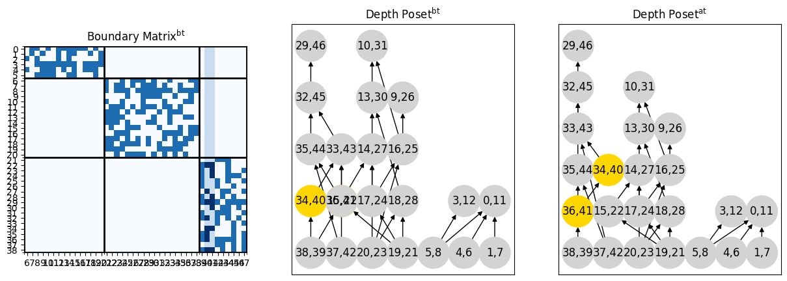

### Birth Death Pairs
|                          |                                                                                                                                                                                                                                   |
|:-------------------------|:----------------------------------------------------------------------------------------------------------------------------------------------------------------------------------------------------------------------------------|
| Before the transposition | $\{(13, 30), (20, 23), (4, 6), (17, 24), (19, 21), (34, 40), (0, 11), (9, 26), (37, 42), (16, 25), (18, 28), (35, 44), (32, 45), (3, 12), (29, 46), (14, 27), (15, 22), (33, 43), (38, 39), (5, 8), (1, 7), (36, 41), (10, 31)\}$ |
| After the transposition  | $\{(13, 30), (20, 23), (4, 6), (17, 24), (19, 21), (34, 40), (0, 11), (9, 26), (37, 42), (16, 25), (18, 28), (35, 44), (32, 45), (3, 12), (29, 46), (14, 27), (15, 22), (33, 43), (38, 39), (5, 8), (1, 7), (36, 41), (10, 31)\}$ |

### Relations
|                          | Algorithm 1                                                                                                                                                                                                                                                                                                                                                                                                                            | Algorithm 2                                                                                                                                                                                                                                                                                                   |
|:-------------------------|:---------------------------------------------------------------------------------------------------------------------------------------------------------------------------------------------------------------------------------------------------------------------------------------------------------------------------------------------------------------------------------------------------------------------------------------|:--------------------------------------------------------------------------------------------------------------------------------------------------------------------------------------------------------------------------------------------------------------------------------------------------------------|
| Before the transposition | $\{(42, 45), (41, 43), (24, 27), (44, 45), (21, 22), (21, 28), (21, 25), (21, 31), (23, 28), (23, 25), (39, 45), (28, 30), (45, 46), (6, 11), (25, 31), (42, 47), (41, 45), (44, 47), (21, 24), (21, 30), (39, 41), (21, 27), (23, 30), (8, 11), (23, 27), (40, 43), (39, 47), (27, 30), (24, 25), (41, 44), (42, 43), (24, 31), (41, 47), (21, 26), (22, 27), (23, 26), (39, 40), (40, 45), (39, 43), (45, 47), (30, 31), (25, 26)\}$ | $\{(38, 29), (38, 35), (38, 32), (1, 0), (19, 18), (37, 33), (33, 32), (4, 2), (20, 10), (20, 16), (35, 29), (5, 0), (5, 3), (17, 14), (19, 14), (37, 29), (19, 17), (37, 35), (16, 9), (13, 10), (15, 10), (3, 2), (20, 18), (5, 2), (38, 36), (17, 16), (19, 10), (36, 32), (19, 13), (36, 35)\}$           |
| After the transposition  | $\{(42, 45), (24, 27), (41, 43), (44, 45), (21, 22), (21, 28), (21, 25), (21, 31), (23, 28), (23, 25), (39, 45), (28, 30), (45, 46), (6, 11), (25, 31), (42, 47), (41, 45), (44, 47), (21, 24), (21, 30), (21, 27), (39, 41), (23, 30), (8, 11), (23, 27), (40, 43), (39, 47), (27, 30), (24, 25), (41, 44), (42, 43), (24, 31), (41, 47), (21, 26), (22, 27), (23, 26), (39, 40), (40, 45), (39, 43), (45, 47), (30, 31), (25, 26)\}$ | $\{(38, 29), (38, 35), (38, 32), (1, 0), (19, 18), (37, 33), (36, 34), (33, 32), (4, 2), (20, 10), (20, 16), (35, 29), (5, 0), (5, 3), (17, 14), (19, 14), (37, 29), (19, 17), (37, 35), (16, 9), (13, 10), (15, 10), (3, 2), (20, 18), (5, 2), (38, 36), (17, 16), (19, 10), (36, 32), (19, 13), (36, 35)\}$ |

### Successors and Predecessers
No such node in the Depth Poset

### Temp Sets
|                                                               | Before the Transposition                     | After the Transposition                      |
|:--------------------------------------------------------------|:---------------------------------------------|:---------------------------------------------|
| $\mathcal{B} = \{(s, t)\in \text{BD}:\; f(s) > f(x)\}$        | $\{(37, 42), (36, 41), (35, 44), (38, 39)\}$ | $\{(37, 42), (36, 41), (35, 44), (38, 39)\}$ |
| $\mathcal{N} = \{(s, t)\in \text{BD}:\; f(x) > f(s) > f(a)\}$ | $\emptyset$                                  | $\emptyset$                                  |

### Equations
There are 2 equations are wrong.

| eq   | left (formula)                  | left (paramatrized)               | left (value)   | right (formula)                                                                        | right (paramatrized)                                                                         | right (value)                      | correct   |
|:-----|:--------------------------------|:----------------------------------|:---------------|:---------------------------------------------------------------------------------------|:---------------------------------------------------------------------------------------------|:-----------------------------------|:----------|
| Eq36 | $\text{Succ}_2^\text{at}(x, y)$ | $\text{Succ}_2^\text{at}(34, 40)$ | $\emptyset$    | $\text{Succ}_2^\text{bt}(x, y) \oplus \{(a, b)\} \oplus \text{Succ}_2^\text{bt}(a, b)$ | $\text{Succ}_2^\text{bt}(34, 40) \oplus \{(36, 41)\} \oplus \text{Succ}_2^\text{bt}(36, 41)$ | $\{(36, 41), (35, 44), (32, 45)\}$ | ✘         |
| Eq37 | $\text{Pred}_2^\text{at}(a, b)$ | $\text{Pred}_2^\text{at}(36, 41)$ | $\{(38, 39)\}$ | $\text{Pred}_2^\text{bt}(a, b) \oplus \{(x, y)\}$                                      | $\text{Pred}_2^\text{bt}(36, 41) \oplus \{(34, 40)\}$                                        | $\{(34, 40), (38, 39)\}$           | ✘         |

## Transposition <41, 42> in complex 4
Here is a __death-death__ __no switch__ transposition <41, 42>.

$$
a = 37, \; b = 42, \; x = 36, \; y = 41
$$

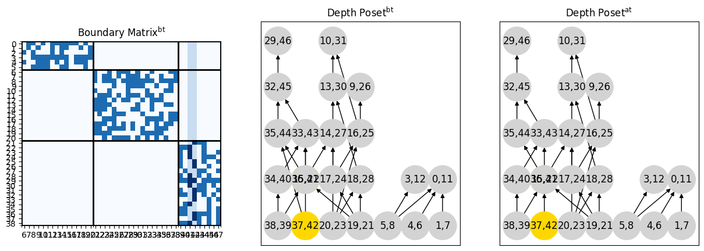

### Birth Death Pairs
|                          |                                                                                                                                                                                                                                   |
|:-------------------------|:----------------------------------------------------------------------------------------------------------------------------------------------------------------------------------------------------------------------------------|
| Before the transposition | $\{(13, 30), (20, 23), (4, 6), (17, 24), (19, 21), (34, 40), (0, 11), (9, 26), (37, 42), (16, 25), (18, 28), (35, 44), (32, 45), (3, 12), (29, 46), (14, 27), (15, 22), (33, 43), (38, 39), (5, 8), (1, 7), (36, 41), (10, 31)\}$ |
| After the transposition  | $\{(13, 30), (20, 23), (4, 6), (17, 24), (19, 21), (34, 40), (0, 11), (9, 26), (37, 42), (16, 25), (18, 28), (35, 44), (32, 45), (3, 12), (29, 46), (14, 27), (15, 22), (33, 43), (38, 39), (5, 8), (1, 7), (36, 41), (10, 31)\}$ |

### Relations
|                          | Algorithm 1                                                                                                                                                                                                                                                                                                                                                                                                                            | Algorithm 2                                                                                                                                                                                                                                                                                                   |
|:-------------------------|:---------------------------------------------------------------------------------------------------------------------------------------------------------------------------------------------------------------------------------------------------------------------------------------------------------------------------------------------------------------------------------------------------------------------------------------|:--------------------------------------------------------------------------------------------------------------------------------------------------------------------------------------------------------------------------------------------------------------------------------------------------------------|
| Before the transposition | $\{(42, 45), (41, 43), (24, 27), (44, 45), (21, 22), (21, 28), (21, 25), (21, 31), (23, 28), (23, 25), (39, 45), (28, 30), (45, 46), (6, 11), (25, 31), (42, 47), (41, 45), (44, 47), (21, 24), (21, 30), (39, 41), (21, 27), (23, 30), (8, 11), (23, 27), (40, 43), (39, 47), (27, 30), (24, 25), (41, 44), (42, 43), (24, 31), (41, 47), (21, 26), (22, 27), (23, 26), (39, 40), (40, 45), (39, 43), (45, 47), (30, 31), (25, 26)\}$ | $\{(38, 29), (38, 35), (38, 32), (1, 0), (19, 18), (37, 33), (33, 32), (4, 2), (20, 10), (20, 16), (35, 29), (5, 0), (5, 3), (17, 14), (19, 14), (37, 29), (19, 17), (37, 35), (16, 9), (13, 10), (15, 10), (3, 2), (20, 18), (5, 2), (38, 36), (17, 16), (19, 10), (36, 32), (19, 13), (36, 35)\}$           |
| After the transposition  | $\{(24, 27), (42, 45), (41, 43), (44, 45), (21, 22), (21, 28), (21, 25), (21, 31), (23, 28), (23, 25), (39, 45), (28, 30), (45, 46), (6, 11), (25, 31), (42, 47), (41, 45), (44, 47), (21, 24), (21, 30), (39, 41), (21, 27), (23, 30), (8, 11), (23, 27), (40, 43), (39, 47), (27, 30), (24, 25), (41, 44), (42, 43), (24, 31), (41, 47), (21, 26), (22, 27), (23, 26), (39, 40), (40, 45), (39, 43), (45, 47), (30, 31), (25, 26)\}$ | $\{(38, 29), (38, 35), (38, 32), (1, 0), (19, 18), (37, 33), (37, 36), (33, 32), (4, 2), (20, 10), (20, 16), (35, 29), (5, 0), (5, 3), (17, 14), (19, 14), (37, 29), (19, 17), (37, 32), (16, 9), (13, 10), (15, 10), (3, 2), (20, 18), (5, 2), (38, 36), (17, 16), (19, 10), (36, 32), (19, 13), (36, 35)\}$ |

### Successors and Predecessers
No such node in the Depth Poset

### Temp Sets
|                                                               | Before the Transposition   | After the Transposition   |
|:--------------------------------------------------------------|:---------------------------|:--------------------------|
| $\mathcal{B} = \{(s, t)\in \text{BD}:\; f(s) > f(x)\}$        | $\{(37, 42), (38, 39)\}$   | $\{(37, 42), (38, 39)\}$  |
| $\mathcal{N} = \{(s, t)\in \text{BD}:\; f(x) > f(s) > f(a)\}$ | $\emptyset$                | $\emptyset$               |

### Equations
There are 2 equations are wrong.

| eq   | left (formula)                  | left (paramatrized)               | left (value)             | right (formula)                                                                        | right (paramatrized)                                                                         | right (value)                                | correct   |
|:-----|:--------------------------------|:----------------------------------|:-------------------------|:---------------------------------------------------------------------------------------|:---------------------------------------------------------------------------------------------|:---------------------------------------------|:----------|
| Eq36 | $\text{Succ}_2^\text{at}(x, y)$ | $\text{Succ}_2^\text{at}(36, 41)$ | $\{(35, 44), (32, 45)\}$ | $\text{Succ}_2^\text{bt}(x, y) \oplus \{(a, b)\} \oplus \text{Succ}_2^\text{bt}(a, b)$ | $\text{Succ}_2^\text{bt}(36, 41) \oplus \{(37, 42)\} \oplus \text{Succ}_2^\text{bt}(37, 42)$ | $\{(37, 42), (33, 43), (32, 45), (29, 46)\}$ | ✘         |
| Eq37 | $\text{Pred}_2^\text{at}(a, b)$ | $\text{Pred}_2^\text{at}(37, 42)$ | $\emptyset$              | $\text{Pred}_2^\text{bt}(a, b) \oplus \{(x, y)\}$                                      | $\text{Pred}_2^\text{bt}(37, 42) \oplus \{(36, 41)\}$                                        | $\{(36, 41)\}$                               | ✘         |

## Transposition <1, 2> in complex 5
Here is a __birth-birth__ __no switch__ transposition <1, 2>.

$$
a = 1, \; b = 9, \; x = 2, \; y = 10
$$

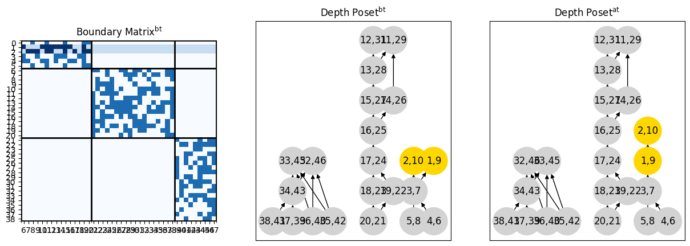

### Birth Death Pairs
|                          |                                                                                                                                                                                                                         |
|:-------------------------|:------------------------------------------------------------------------------------------------------------------------------------------------------------------------------------------------------------------------|
| Before the transposition | $\{(18, 23), (32, 46), (33, 45), (35, 42), (15, 27), (4, 6), (3, 7), (38, 41), (12, 31), (17, 24), (1, 9), (34, 43), (36, 40), (37, 39), (11, 29), (16, 25), (2, 10), (13, 28), (20, 21), (5, 8), (14, 26), (19, 22)\}$ |
| After the transposition  | $\{(18, 23), (32, 46), (33, 45), (35, 42), (15, 27), (4, 6), (3, 7), (38, 41), (12, 31), (17, 24), (1, 9), (34, 43), (36, 40), (37, 39), (11, 29), (16, 25), (2, 10), (13, 28), (20, 21), (5, 8), (14, 26), (19, 22)\}$ |

### Relations
|                          | Algorithm 1                                                                                                                                                                                                                                                                                                                                                                                                   | Algorithm 2                                                                                                                                                                                                                                                                                                                                                                                                                                      |
|:-------------------------|:--------------------------------------------------------------------------------------------------------------------------------------------------------------------------------------------------------------------------------------------------------------------------------------------------------------------------------------------------------------------------------------------------------------|:-------------------------------------------------------------------------------------------------------------------------------------------------------------------------------------------------------------------------------------------------------------------------------------------------------------------------------------------------------------------------------------------------------------------------------------------------|
| Before the transposition | $\{(25, 29), (24, 27), (43, 46), (41, 46), (23, 28), (23, 25), (23, 31), (40, 47), (27, 28), (27, 31), (25, 28), (24, 26), (7, 10), (42, 47), (41, 45), (26, 29), (21, 27), (23, 30), (22, 28), (39, 44), (23, 27), (22, 31), (39, 47), (27, 30), (28, 29), (7, 9), (24, 25), (6, 7), (6, 10), (24, 31), (43, 44), (42, 46), (22, 27), (21, 29), (23, 26), (22, 24), (39, 46), (23, 29), (28, 31)\}$          | $\{(35, 30), (20, 11), (18, 17), (35, 33), (20, 14), (4, 3), (3, 1), (20, 17), (13, 11), (32, 30), (18, 16), (20, 13), (18, 13), (18, 11), (20, 16), (5, 0), (20, 19), (38, 34), (17, 11), (34, 30), (19, 14), (36, 30), (34, 33), (19, 17), (36, 33), (15, 13), (16, 12), (16, 15), (18, 15), (20, 12), (3, 2), (20, 18), (4, 1), (20, 15), (5, 2), (14, 11), (15, 12), (17, 16), (36, 32), (37, 34), (13, 12), (16, 14), (33, 30), (16, 11)\}$ |
| After the transposition  | $\{(25, 29), (24, 27), (43, 46), (41, 46), (23, 28), (23, 25), (23, 31), (40, 47), (27, 28), (27, 31), (25, 28), (24, 26), (7, 10), (42, 47), (41, 45), (26, 29), (21, 27), (23, 30), (22, 28), (39, 44), (23, 27), (9, 10), (22, 31), (39, 47), (27, 30), (28, 29), (7, 9), (24, 25), (6, 7), (6, 10), (24, 31), (43, 44), (42, 46), (22, 27), (21, 29), (23, 26), (22, 24), (39, 46), (23, 29), (28, 31)\}$ | $\{(35, 30), (20, 11), (18, 17), (35, 33), (20, 14), (4, 3), (3, 1), (20, 17), (33, 30), (13, 11), (32, 30), (18, 16), (20, 13), (18, 13), (20, 16), (5, 0), (20, 19), (38, 34), (17, 11), (34, 30), (19, 14), (36, 30), (34, 33), (19, 17), (36, 33), (15, 13), (16, 12), (16, 15), (18, 15), (3, 2), (20, 12), (4, 1), (20, 18), (20, 15), (5, 2), (14, 11), (15, 12), (17, 16), (36, 32), (37, 34), (13, 12), (16, 14), (18, 11), (16, 11)\}$ |

### Successors and Predecessers
No such node in the Depth Poset

### Temp Sets
|                                                               | Before the Transposition             | After the Transposition              |
|:--------------------------------------------------------------|:-------------------------------------|:-------------------------------------|
| $\mathcal{L} = \{(s, t)\in \text{BD}:\; f(t) < f(y)\}$        | $\{(3, 7), (4, 6), (1, 9), (5, 8)\}$ | $\{(3, 7), (4, 6), (1, 9), (5, 8)\}$ |
| $\mathcal{M} = \{(s, t)\in \text{BD}:\; f(y) < f(t) < f(b)\}$ | $\emptyset$                          | $\emptyset$                          |

### Equations
There are 2 equations are wrong.

| eq   | left (formula)                  | left (paramatrized)              | left (value)   | right (formula)                                                                        | right (paramatrized)                                                                    | right (value)         | correct   |
|:-----|:--------------------------------|:---------------------------------|:---------------|:---------------------------------------------------------------------------------------|:----------------------------------------------------------------------------------------|:----------------------|:----------|
| Eq16 | $\text{Succ}_1^\text{at}(x, y)$ | $\text{Succ}_1^\text{at}(2, 10)$ | $\emptyset$    | $\text{Succ}_1^\text{bt}(x, y) \oplus \{(a, b)\} \oplus \text{Succ}_1^\text{bt}(a, b)$ | $\text{Succ}_1^\text{bt}(2, 10) \oplus \{(1, 9)\} \oplus \text{Succ}_1^\text{bt}(1, 9)$ | $\{(1, 9)\}$          | ✘         |
| Eq17 | $\text{Pred}_1^\text{at}(a, b)$ | $\text{Pred}_1^\text{at}(1, 9)$  | $\{(3, 7)\}$   | $\text{Pred}_1^\text{bt}(a, b) \oplus \{(x, y)\}$                                      | $\text{Pred}_1^\text{bt}(1, 9) \oplus \{(2, 10)\}$                                      | $\{(3, 7), (2, 10)\}$ | ✘         |

## Transposition <9, 10> in complex 5
Here is a __death-death__ __no switch__ transposition <9, 10>.

$$
a = 2, \; b = 10, \; x = 1, \; y = 9
$$

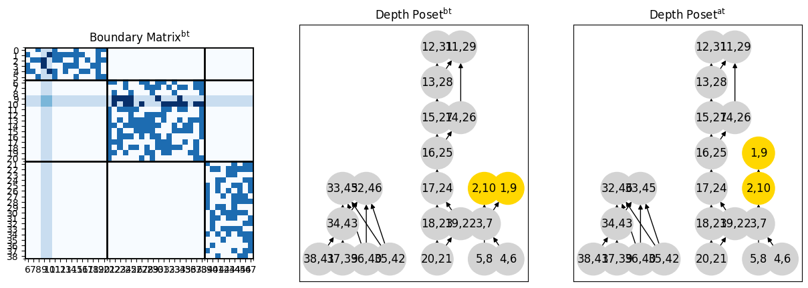

### Birth Death Pairs
|                          |                                                                                                                                                                                                                         |
|:-------------------------|:------------------------------------------------------------------------------------------------------------------------------------------------------------------------------------------------------------------------|
| Before the transposition | $\{(18, 23), (32, 46), (33, 45), (35, 42), (15, 27), (4, 6), (3, 7), (38, 41), (12, 31), (17, 24), (1, 9), (34, 43), (36, 40), (37, 39), (11, 29), (16, 25), (2, 10), (13, 28), (20, 21), (5, 8), (14, 26), (19, 22)\}$ |
| After the transposition  | $\{(18, 23), (32, 46), (33, 45), (35, 42), (15, 27), (4, 6), (3, 7), (38, 41), (12, 31), (17, 24), (1, 9), (34, 43), (36, 40), (37, 39), (11, 29), (16, 25), (2, 10), (13, 28), (20, 21), (5, 8), (14, 26), (19, 22)\}$ |

### Relations
|                          | Algorithm 1                                                                                                                                                                                                                                                                                                                                                                                          | Algorithm 2                                                                                                                                                                                                                                                                                                                                                                                                                                              |
|:-------------------------|:-----------------------------------------------------------------------------------------------------------------------------------------------------------------------------------------------------------------------------------------------------------------------------------------------------------------------------------------------------------------------------------------------------|:---------------------------------------------------------------------------------------------------------------------------------------------------------------------------------------------------------------------------------------------------------------------------------------------------------------------------------------------------------------------------------------------------------------------------------------------------------|
| Before the transposition | $\{(25, 29), (24, 27), (43, 46), (41, 46), (23, 28), (23, 25), (23, 31), (40, 47), (27, 28), (27, 31), (25, 28), (24, 26), (7, 10), (42, 47), (41, 45), (26, 29), (21, 27), (23, 30), (22, 28), (39, 44), (23, 27), (22, 31), (39, 47), (27, 30), (28, 29), (7, 9), (24, 25), (6, 7), (6, 10), (24, 31), (43, 44), (42, 46), (22, 27), (21, 29), (23, 26), (22, 24), (39, 46), (23, 29), (28, 31)\}$ | $\{(35, 30), (20, 11), (18, 17), (35, 33), (20, 14), (4, 3), (3, 1), (20, 17), (13, 11), (32, 30), (18, 16), (20, 13), (18, 13), (18, 11), (20, 16), (5, 0), (20, 19), (38, 34), (17, 11), (34, 30), (19, 14), (36, 30), (34, 33), (19, 17), (36, 33), (15, 13), (16, 12), (16, 15), (18, 15), (20, 12), (3, 2), (20, 18), (4, 1), (20, 15), (5, 2), (14, 11), (15, 12), (17, 16), (36, 32), (37, 34), (13, 12), (16, 14), (33, 30), (16, 11)\}$         |
| After the transposition  | $\{(25, 29), (24, 27), (43, 46), (41, 46), (23, 28), (23, 25), (23, 31), (40, 47), (27, 28), (27, 31), (25, 28), (24, 26), (7, 10), (42, 47), (41, 45), (26, 29), (21, 27), (23, 30), (22, 28), (39, 44), (23, 27), (22, 31), (39, 47), (27, 30), (28, 29), (7, 9), (24, 25), (6, 7), (6, 10), (24, 31), (43, 44), (42, 46), (22, 27), (21, 29), (23, 26), (22, 24), (39, 46), (23, 29), (28, 31)\}$ | $\{(35, 30), (20, 11), (18, 17), (35, 33), (20, 14), (4, 3), (3, 1), (20, 17), (33, 30), (13, 11), (32, 30), (18, 16), (20, 13), (18, 13), (20, 16), (5, 0), (20, 19), (38, 34), (17, 11), (34, 30), (19, 14), (36, 30), (34, 33), (2, 1), (19, 17), (36, 33), (15, 13), (16, 12), (16, 15), (18, 15), (20, 12), (3, 2), (20, 18), (4, 1), (20, 15), (5, 2), (14, 11), (15, 12), (17, 16), (36, 32), (37, 34), (13, 12), (16, 14), (18, 11), (16, 11)\}$ |

### Successors and Predecessers
No such node in the Depth Poset

### Temp Sets
|                                                               | Before the Transposition                                                                                                                                                                                        | After the Transposition                                                                                                                                                                                         |
|:--------------------------------------------------------------|:----------------------------------------------------------------------------------------------------------------------------------------------------------------------------------------------------------------|:----------------------------------------------------------------------------------------------------------------------------------------------------------------------------------------------------------------|
| $\mathcal{B} = \{(s, t)\in \text{BD}:\; f(s) > f(x)\}$        | $\{(18, 23), (32, 46), (33, 45), (35, 42), (15, 27), (4, 6), (3, 7), (38, 41), (12, 31), (17, 24), (34, 43), (36, 40), (37, 39), (11, 29), (16, 25), (2, 10), (13, 28), (20, 21), (5, 8), (14, 26), (19, 22)\}$ | $\{(18, 23), (32, 46), (33, 45), (35, 42), (15, 27), (4, 6), (3, 7), (38, 41), (12, 31), (17, 24), (34, 43), (36, 40), (37, 39), (11, 29), (16, 25), (2, 10), (13, 28), (20, 21), (5, 8), (14, 26), (19, 22)\}$ |
| $\mathcal{N} = \{(s, t)\in \text{BD}:\; f(x) > f(s) > f(a)\}$ | $\emptyset$                                                                                                                                                                                                     | $\emptyset$                                                                                                                                                                                                     |

### Equations
There are 2 equations are wrong.

| eq   | left (formula)                  | left (paramatrized)              | left (value)         | right (formula)                                                                        | right (paramatrized)                                                                     | right (value)                | correct   |
|:-----|:--------------------------------|:---------------------------------|:---------------------|:---------------------------------------------------------------------------------------|:-----------------------------------------------------------------------------------------|:-----------------------------|:----------|
| Eq36 | $\text{Succ}_2^\text{at}(x, y)$ | $\text{Succ}_2^\text{at}(1, 9)$  | $\emptyset$          | $\text{Succ}_2^\text{bt}(x, y) \oplus \{(a, b)\} \oplus \text{Succ}_2^\text{bt}(a, b)$ | $\text{Succ}_2^\text{bt}(1, 9) \oplus \{(2, 10)\} \oplus \text{Succ}_2^\text{bt}(2, 10)$ | $\{(2, 10)\}$                | ✘         |
| Eq37 | $\text{Pred}_2^\text{at}(a, b)$ | $\text{Pred}_2^\text{at}(2, 10)$ | $\{(3, 7), (5, 8)\}$ | $\text{Pred}_2^\text{bt}(a, b) \oplus \{(x, y)\}$                                      | $\text{Pred}_2^\text{bt}(2, 10) \oplus \{(1, 9)\}$                                       | $\{(3, 7), (1, 9), (5, 8)\}$ | ✘         |

## Transposition <10, 11> in complex 5
Here is a __birth-death__ __switch forward__ transposition <10, 11>.

$$
a = 2, \; b = 10, \; x = 11, \; y = 29
$$

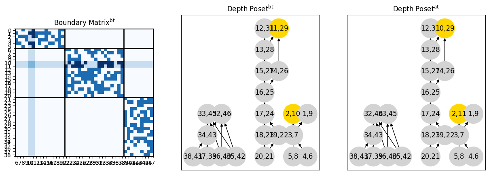

### Birth Death Pairs
|                          |                                                                                                                                                                                                                         |
|:-------------------------|:------------------------------------------------------------------------------------------------------------------------------------------------------------------------------------------------------------------------|
| Before the transposition | $\{(18, 23), (32, 46), (33, 45), (35, 42), (15, 27), (4, 6), (3, 7), (38, 41), (12, 31), (17, 24), (1, 9), (34, 43), (36, 40), (37, 39), (11, 29), (16, 25), (2, 10), (13, 28), (20, 21), (5, 8), (14, 26), (19, 22)\}$ |
| After the transposition  | $\{(18, 23), (32, 46), (33, 45), (35, 42), (15, 27), (4, 6), (3, 7), (38, 41), (12, 31), (17, 24), (2, 11), (1, 9), (34, 43), (36, 40), (37, 39), (16, 25), (10, 29), (13, 28), (20, 21), (5, 8), (14, 26), (19, 22)\}$ |

### Relations
|                          | Algorithm 1                                                                                                                                                                                                                                                                                                                                                                                                   | Algorithm 2                                                                                                                                                                                                                                                                                                                                                                                                                                      |
|:-------------------------|:--------------------------------------------------------------------------------------------------------------------------------------------------------------------------------------------------------------------------------------------------------------------------------------------------------------------------------------------------------------------------------------------------------------|:-------------------------------------------------------------------------------------------------------------------------------------------------------------------------------------------------------------------------------------------------------------------------------------------------------------------------------------------------------------------------------------------------------------------------------------------------|
| Before the transposition | $\{(25, 29), (24, 27), (43, 46), (41, 46), (23, 28), (23, 25), (23, 31), (40, 47), (27, 28), (27, 31), (25, 28), (24, 26), (7, 10), (42, 47), (41, 45), (26, 29), (21, 27), (23, 30), (22, 28), (39, 44), (23, 27), (22, 31), (39, 47), (27, 30), (28, 29), (7, 9), (24, 25), (6, 7), (6, 10), (24, 31), (43, 44), (42, 46), (22, 27), (21, 29), (23, 26), (22, 24), (39, 46), (23, 29), (28, 31)\}$          | $\{(35, 30), (20, 11), (18, 17), (35, 33), (20, 14), (4, 3), (3, 1), (20, 17), (13, 11), (32, 30), (18, 16), (20, 13), (18, 13), (18, 11), (20, 16), (5, 0), (20, 19), (38, 34), (17, 11), (34, 30), (19, 14), (36, 30), (34, 33), (19, 17), (36, 33), (15, 13), (16, 12), (16, 15), (18, 15), (20, 12), (3, 2), (20, 18), (4, 1), (20, 15), (5, 2), (14, 11), (15, 12), (17, 16), (36, 32), (37, 34), (13, 12), (16, 14), (33, 30), (16, 11)\}$ |
| After the transposition  | $\{(25, 29), (24, 27), (43, 46), (41, 46), (23, 28), (23, 25), (23, 31), (40, 47), (27, 28), (27, 31), (6, 11), (25, 28), (24, 26), (42, 47), (41, 45), (26, 29), (21, 27), (23, 30), (22, 28), (39, 44), (23, 27), (8, 11), (22, 31), (39, 47), (27, 30), (28, 29), (7, 9), (24, 25), (6, 7), (24, 31), (43, 44), (42, 46), (22, 27), (21, 29), (23, 26), (22, 24), (39, 46), (23, 29), (28, 31), (7, 11)\}$ | $\{(35, 30), (18, 17), (35, 33), (20, 14), (4, 3), (3, 1), (20, 17), (33, 30), (16, 10), (32, 30), (18, 16), (20, 13), (18, 13), (20, 16), (5, 0), (20, 19), (38, 34), (34, 30), (19, 14), (36, 30), (34, 33), (19, 17), (36, 33), (15, 13), (16, 12), (16, 15), (18, 15), (20, 12), (3, 2), (20, 18), (4, 1), (20, 15), (5, 2), (17, 16), (19, 10), (36, 32), (37, 34), (13, 12), (16, 14), (15, 12)\}$                                         |

### Successors and Predecessers
|                 | $\text{Set}^\text{bt}(2, 10)$                         | $\text{Set}^\text{bt}(11, 29)$                                                                     | $\text{Set}^\text{at}(2, 11)$                                 | $\text{Set}^\text{at}(10, 29)$                                                           |
|:----------------|:------------------------------------------------------|:---------------------------------------------------------------------------------------------------|:--------------------------------------------------------------|:-----------------------------------------------------------------------------------------|
| $\text{Succ}_1$ | $\text{Succ}_1^\text{bt}(2, 10) = \emptyset$          | $\text{Succ}_1^\text{bt}(11, 29) = \emptyset$                                                      | $\text{Succ}_1^\text{at}(2, 11) = \emptyset$                  | $\text{Succ}_1^\text{at}(10, 29) = \emptyset$                                            |
| $\text{Pred}_1$ | $\text{Pred}_1^\text{bt}(2, 10) = \{(3, 7), (4, 6)\}$ | $\text{Pred}_1^\text{bt}(11, 29) = \{(18, 23), (14, 26), (16, 25), (13, 28), (20, 21)\}$           | $\text{Pred}_1^\text{at}(2, 11) = \{(3, 7), (4, 6), (5, 8)\}$ | $\text{Pred}_1^\text{at}(10, 29) = \{(18, 23), (14, 26), (16, 25), (13, 28), (20, 21)\}$ |
| $\text{Succ}_2$ | $\text{Succ}_2^\text{bt}(2, 10) = \emptyset$          | $\text{Succ}_2^\text{bt}(11, 29) = \emptyset$                                                      | $\text{Succ}_2^\text{at}(2, 11) = \emptyset$                  | $\text{Succ}_2^\text{at}(10, 29) = \emptyset$                                            |
| $\text{Pred}_2$ | $\text{Pred}_2^\text{bt}(2, 10) = \{(3, 7), (5, 8)\}$ | $\text{Pred}_2^\text{bt}(11, 29) = \{(18, 23), (14, 26), (16, 25), (13, 28), (17, 24), (20, 21)\}$ | $\text{Pred}_2^\text{at}(2, 11) = \{(3, 7), (5, 8)\}$         | $\text{Pred}_2^\text{at}(10, 29) = \{(16, 25), (19, 22)\}$                               |

### Temp Sets
|                                                              | Before the Transposition                                                             | After the Transposition                                                              |
|:-------------------------------------------------------------|:-------------------------------------------------------------------------------------|:-------------------------------------------------------------------------------------|
| $A_1 = \{(s, t)\in \text{BD}:\; f(a) < f(s) < f(t) < f(x)\}$ | $\{(3, 7), (4, 6), (5, 8)\}$                                                         | $\{(3, 7), (4, 6), (5, 8)\}$                                                         |
| $B_1 = \{(s, t)\in \text{BD}:\; U_1[t, x] = 1\}$             | $\emptyset$                                                                          | $\{(3, 7), (4, 6), (5, 8)\}$                                                         |
| $A_2 = \{(s, t)\in \text{BD}:\; f(b) < f(s) < f(t) < f(y)\}$ | $\{(18, 23), (15, 27), (14, 26), (16, 25), (19, 22), (13, 28), (17, 24), (20, 21)\}$ | $\{(18, 23), (15, 27), (14, 26), (16, 25), (19, 22), (13, 28), (17, 24), (20, 21)\}$ |
| $B_2 = \{(s, t)\in \text{BD}:\; U_2[b, s] = 1\}$             | $\emptyset$                                                                          | $\{(16, 25), (19, 22)\}$                                                             |

### Equations
There are 4 equations are wrong.

| eq    | left (formula)                  | left (paramatrized)               | left (value)                                           | right (formula)                                      | right (paramatrized)                                  | right (value)                                          | correct   |
|:------|:--------------------------------|:----------------------------------|:-------------------------------------------------------|:-----------------------------------------------------|:------------------------------------------------------|:-------------------------------------------------------|:----------|
| Eq48  | $\text{Succ}_1^\text{at}(a, x)$ | $\text{Succ}_1^\text{at}(2, 11)$  | $\emptyset$                                            | $\text{Succ}_1^\text{bt}(a, b)$                      | $\text{Succ}_1^\text{bt}(2, 10)$                      | $\emptyset$                                            | ✔         |
| Eq49  | $\text{Succ}_1^\text{at}(b, y)$ | $\text{Succ}_1^\text{at}(10, 29)$ | $\emptyset$                                            | $\text{Succ}_1^\text{bt}(x, y)$                      | $\text{Succ}_1^\text{bt}(11, 29)$                     | $\emptyset$                                            | ✔         |
| Eq50  | $\text{Pred}_1^\text{at}(a, x)$ | $\text{Pred}_1^\text{at}(2, 11)$  | $\{(3, 7), (4, 6), (5, 8)\}$                           | $\{(s, t)\in \text{BD}:\; U_1^\text{bt}[t, x] = 1\}$ | $\{(s, t)\in \text{BD}:\; U_1^\text{bt}[t, 11] = 1\}$ | $\emptyset$                                            | ✘         |
| Eq50a | $\text{Pred}_1^\text{at}(a, x)$ | $\text{Pred}_1^\text{at}(2, 11)$  | $\{(3, 7), (4, 6), (5, 8)\}$                           | $A_1^\text{bt} \cap B_1^\text{bt}$                   | $A_1^\text{bt} \cap B_1^\text{bt}$                    | $\emptyset$                                            | ✘         |
| Eq50b | $\text{Pred}_1^\text{at}(a, x)$ | $\text{Pred}_1^\text{at}(2, 11)$  | $\{(3, 7), (4, 6), (5, 8)\}$                           | $A_1^\text{bt} \cap B_1^\text{at}$                   | $A_1^\text{bt} \cap B_1^\text{at}$                    | $\{(3, 7), (4, 6), (5, 8)\}$                           | ✔         |
| Eq51  | $\text{Pred}_1^\text{at}(b, y)$ | $\text{Pred}_1^\text{at}(10, 29)$ | $\{(18, 23), (14, 26), (16, 25), (13, 28), (20, 21)\}$ | $\text{Pred}_1^\text{bt}(x, y)$                      | $\text{Pred}_1^\text{bt}(11, 29)$                     | $\{(18, 23), (14, 26), (16, 25), (13, 28), (20, 21)\}$ | ✔         |
| Eq52  | $\text{Succ}_2^\text{at}(a, x)$ | $\text{Succ}_2^\text{at}(2, 11)$  | $\emptyset$                                            | $\text{Succ}_2^\text{bt}(a, b)$                      | $\text{Succ}_2^\text{bt}(2, 10)$                      | $\emptyset$                                            | ✔         |
| Eq53  | $\text{Succ}_2^\text{at}(b, y)$ | $\text{Succ}_2^\text{at}(10, 29)$ | $\emptyset$                                            | $\text{Succ}_2^\text{bt}(x, y)$                      | $\text{Succ}_2^\text{bt}(11, 29)$                     | $\emptyset$                                            | ✔         |
| Eq54  | $\text{Pred}_2^\text{at}(a, x)$ | $\text{Pred}_2^\text{at}(2, 11)$  | $\{(3, 7), (5, 8)\}$                                   | $\text{Pred}_2^\text{bt}(a, b)$                      | $\text{Pred}_2^\text{bt}(2, 10)$                      | $\{(3, 7), (5, 8)\}$                                   | ✔         |
| Eq55  | $\text{Pred}_2^\text{at}(b, y)$ | $\text{Pred}_2^\text{at}(10, 29)$ | $\{(16, 25), (19, 22)\}$                               | $\{(s, t)\in \text{BD}:\; U_2^\text{bt}[b, s] = 1\}$ | $\{(s, t)\in \text{BD}:\; U_2^\text{bt}[10, s] = 1\}$ | $\emptyset$                                            | ✘         |
| Eq55a | $\text{Pred}_2^\text{at}(b, y)$ | $\text{Pred}_2^\text{at}(10, 29)$ | $\{(16, 25), (19, 22)\}$                               | $A_2^\text{bt} \cap B_2^\text{bt}$                   | $A_2^\text{bt} \cap B_2^\text{bt}$                    | $\emptyset$                                            | ✘         |
| Eq55b | $\text{Pred}_2^\text{at}(b, y)$ | $\text{Pred}_2^\text{at}(10, 29)$ | $\{(16, 25), (19, 22)\}$                               | $A_2^\text{bt} \cap B_2^\text{at}$                   | $A_2^\text{bt} \cap B_2^\text{at}$                    | $\{(16, 25), (19, 22)\}$                               | ✔         |

## Transposition <11, 12> in complex 5
Here is a __birth-birth__ __no switch__ transposition <11, 12>.

$$
a = 11, \; b = 29, \; x = 12, \; y = 31
$$

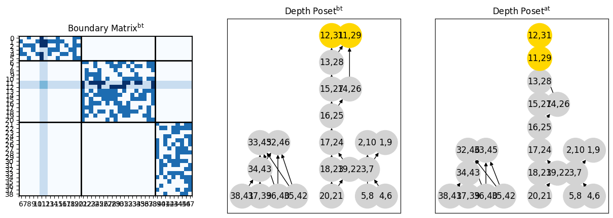

### Birth Death Pairs
|                          |                                                                                                                                                                                                                         |
|:-------------------------|:------------------------------------------------------------------------------------------------------------------------------------------------------------------------------------------------------------------------|
| Before the transposition | $\{(18, 23), (32, 46), (33, 45), (35, 42), (15, 27), (4, 6), (3, 7), (38, 41), (12, 31), (17, 24), (1, 9), (34, 43), (36, 40), (37, 39), (11, 29), (16, 25), (2, 10), (13, 28), (20, 21), (5, 8), (14, 26), (19, 22)\}$ |
| After the transposition  | $\{(18, 23), (32, 46), (33, 45), (35, 42), (15, 27), (4, 6), (3, 7), (38, 41), (12, 31), (17, 24), (1, 9), (34, 43), (36, 40), (37, 39), (11, 29), (16, 25), (2, 10), (13, 28), (20, 21), (5, 8), (14, 26), (19, 22)\}$ |

### Relations
|                          | Algorithm 1                                                                                                                                                                                                                                                                                                                                                                                                    | Algorithm 2                                                                                                                                                                                                                                                                                                                                                                                                                                      |
|:-------------------------|:---------------------------------------------------------------------------------------------------------------------------------------------------------------------------------------------------------------------------------------------------------------------------------------------------------------------------------------------------------------------------------------------------------------|:-------------------------------------------------------------------------------------------------------------------------------------------------------------------------------------------------------------------------------------------------------------------------------------------------------------------------------------------------------------------------------------------------------------------------------------------------|
| Before the transposition | $\{(25, 29), (24, 27), (43, 46), (41, 46), (23, 28), (23, 25), (23, 31), (40, 47), (27, 28), (27, 31), (25, 28), (24, 26), (7, 10), (42, 47), (41, 45), (26, 29), (21, 27), (23, 30), (22, 28), (39, 44), (23, 27), (22, 31), (39, 47), (27, 30), (28, 29), (7, 9), (24, 25), (6, 7), (6, 10), (24, 31), (43, 44), (42, 46), (22, 27), (21, 29), (23, 26), (22, 24), (39, 46), (23, 29), (28, 31)\}$           | $\{(35, 30), (20, 11), (18, 17), (35, 33), (20, 14), (4, 3), (3, 1), (20, 17), (13, 11), (32, 30), (18, 16), (20, 13), (18, 13), (18, 11), (20, 16), (5, 0), (20, 19), (38, 34), (17, 11), (34, 30), (19, 14), (36, 30), (34, 33), (19, 17), (36, 33), (15, 13), (16, 12), (16, 15), (18, 15), (20, 12), (3, 2), (20, 18), (4, 1), (20, 15), (5, 2), (14, 11), (15, 12), (17, 16), (36, 32), (37, 34), (13, 12), (16, 14), (33, 30), (16, 11)\}$ |
| After the transposition  | $\{(25, 29), (24, 27), (43, 46), (41, 46), (23, 28), (23, 25), (23, 31), (40, 47), (27, 28), (27, 31), (25, 28), (24, 26), (7, 10), (42, 47), (41, 45), (26, 29), (29, 31), (21, 27), (23, 30), (22, 28), (39, 44), (23, 27), (22, 31), (39, 47), (27, 30), (28, 29), (7, 9), (24, 25), (6, 7), (6, 10), (24, 31), (43, 44), (42, 46), (22, 27), (21, 29), (23, 26), (22, 24), (39, 46), (23, 29), (28, 31)\}$ | $\{(35, 30), (20, 11), (18, 17), (35, 33), (20, 14), (4, 3), (3, 1), (20, 17), (33, 30), (13, 11), (32, 30), (18, 16), (20, 13), (18, 13), (18, 11), (20, 16), (5, 0), (20, 19), (38, 34), (17, 11), (34, 30), (19, 14), (36, 30), (34, 33), (19, 17), (36, 33), (15, 13), (16, 12), (16, 15), (18, 15), (20, 12), (3, 2), (20, 18), (4, 1), (20, 15), (14, 11), (5, 2), (17, 16), (36, 32), (37, 34), (13, 12), (16, 14), (15, 12), (16, 11)\}$ |

### Successors and Predecessers
No such node in the Depth Poset

### Temp Sets
|                                                               | Before the Transposition                                                                                                                | After the Transposition                                                                                                                 |
|:--------------------------------------------------------------|:----------------------------------------------------------------------------------------------------------------------------------------|:----------------------------------------------------------------------------------------------------------------------------------------|
| $\mathcal{L} = \{(s, t)\in \text{BD}:\; f(t) < f(y)\}$        | $\{(18, 23), (5, 8), (15, 27), (3, 7), (11, 29), (4, 6), (14, 26), (2, 10), (16, 25), (19, 22), (13, 28), (17, 24), (1, 9), (20, 21)\}$ | $\{(18, 23), (5, 8), (15, 27), (3, 7), (11, 29), (4, 6), (14, 26), (2, 10), (16, 25), (19, 22), (13, 28), (17, 24), (1, 9), (20, 21)\}$ |
| $\mathcal{M} = \{(s, t)\in \text{BD}:\; f(y) < f(t) < f(b)\}$ | $\emptyset$                                                                                                                             | $\emptyset$                                                                                                                             |

### Equations
There are 2 equations are wrong.

| eq   | left (formula)                  | left (paramatrized)               | left (value)                                           | right (formula)                                                                        | right (paramatrized)                                                                         | right (value)                                                    | correct   |
|:-----|:--------------------------------|:----------------------------------|:-------------------------------------------------------|:---------------------------------------------------------------------------------------|:---------------------------------------------------------------------------------------------|:-----------------------------------------------------------------|:----------|
| Eq16 | $\text{Succ}_1^\text{at}(x, y)$ | $\text{Succ}_1^\text{at}(12, 31)$ | $\emptyset$                                            | $\text{Succ}_1^\text{bt}(x, y) \oplus \{(a, b)\} \oplus \text{Succ}_1^\text{bt}(a, b)$ | $\text{Succ}_1^\text{bt}(12, 31) \oplus \{(11, 29)\} \oplus \text{Succ}_1^\text{bt}(11, 29)$ | $\{(11, 29)\}$                                                   | ✘         |
| Eq17 | $\text{Pred}_1^\text{at}(a, b)$ | $\text{Pred}_1^\text{at}(11, 29)$ | $\{(18, 23), (14, 26), (16, 25), (13, 28), (20, 21)\}$ | $\text{Pred}_1^\text{bt}(a, b) \oplus \{(x, y)\}$                                      | $\text{Pred}_1^\text{bt}(11, 29) \oplus \{(12, 31)\}$                                        | $\{(18, 23), (14, 26), (16, 25), (13, 28), (12, 31), (20, 21)\}$ | ✘         |

## Transposition <14, 15> in complex 5
Here is a __birth-birth__ __no switch__ transposition <14, 15>.

$$
a = 14, \; b = 26, \; x = 15, \; y = 27
$$

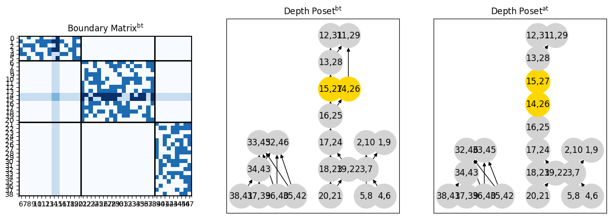

### Birth Death Pairs
|                          |                                                                                                                                                                                                                         |
|:-------------------------|:------------------------------------------------------------------------------------------------------------------------------------------------------------------------------------------------------------------------|
| Before the transposition | $\{(18, 23), (32, 46), (33, 45), (35, 42), (15, 27), (4, 6), (3, 7), (38, 41), (12, 31), (17, 24), (1, 9), (34, 43), (36, 40), (37, 39), (11, 29), (16, 25), (2, 10), (13, 28), (20, 21), (5, 8), (14, 26), (19, 22)\}$ |
| After the transposition  | $\{(18, 23), (32, 46), (33, 45), (35, 42), (15, 27), (4, 6), (3, 7), (38, 41), (12, 31), (17, 24), (1, 9), (34, 43), (36, 40), (37, 39), (11, 29), (16, 25), (2, 10), (13, 28), (20, 21), (5, 8), (14, 26), (19, 22)\}$ |

### Relations
|                          | Algorithm 1                                                                                                                                                                                                                                                                                                                                                                                                                                  | Algorithm 2                                                                                                                                                                                                                                                                                                                                                                                                                                      |
|:-------------------------|:---------------------------------------------------------------------------------------------------------------------------------------------------------------------------------------------------------------------------------------------------------------------------------------------------------------------------------------------------------------------------------------------------------------------------------------------|:-------------------------------------------------------------------------------------------------------------------------------------------------------------------------------------------------------------------------------------------------------------------------------------------------------------------------------------------------------------------------------------------------------------------------------------------------|
| Before the transposition | $\{(25, 29), (24, 27), (43, 46), (41, 46), (23, 28), (23, 25), (23, 31), (40, 47), (27, 28), (27, 31), (25, 28), (24, 26), (7, 10), (42, 47), (41, 45), (26, 29), (21, 27), (23, 30), (22, 28), (39, 44), (23, 27), (22, 31), (39, 47), (27, 30), (28, 29), (7, 9), (24, 25), (6, 7), (6, 10), (24, 31), (43, 44), (42, 46), (22, 27), (21, 29), (23, 26), (22, 24), (39, 46), (23, 29), (28, 31)\}$                                         | $\{(35, 30), (20, 11), (18, 17), (35, 33), (20, 14), (4, 3), (3, 1), (20, 17), (13, 11), (32, 30), (18, 16), (20, 13), (18, 13), (18, 11), (20, 16), (5, 0), (20, 19), (38, 34), (17, 11), (34, 30), (19, 14), (36, 30), (34, 33), (19, 17), (36, 33), (15, 13), (16, 12), (16, 15), (18, 15), (20, 12), (3, 2), (20, 18), (4, 1), (20, 15), (5, 2), (14, 11), (15, 12), (17, 16), (36, 32), (37, 34), (13, 12), (16, 14), (33, 30), (16, 11)\}$ |
| After the transposition  | $\{(25, 29), (24, 27), (26, 30), (43, 46), (41, 46), (26, 27), (23, 28), (23, 25), (23, 31), (40, 47), (27, 28), (27, 31), (25, 28), (24, 26), (7, 10), (42, 47), (41, 45), (26, 29), (21, 27), (23, 30), (22, 28), (39, 44), (23, 27), (22, 31), (39, 47), (27, 30), (28, 29), (7, 9), (24, 25), (6, 7), (6, 10), (24, 31), (26, 28), (43, 44), (42, 46), (26, 31), (22, 27), (21, 29), (23, 26), (22, 24), (39, 46), (23, 29), (28, 31)\}$ | $\{(35, 30), (20, 11), (18, 17), (35, 33), (20, 14), (4, 3), (3, 1), (20, 17), (33, 30), (13, 11), (32, 30), (18, 16), (20, 13), (18, 13), (20, 16), (5, 0), (20, 19), (38, 34), (17, 11), (34, 30), (19, 14), (34, 33), (36, 30), (19, 17), (36, 33), (15, 13), (16, 12), (16, 15), (18, 15), (20, 12), (3, 2), (20, 18), (4, 1), (20, 15), (14, 11), (5, 2), (15, 12), (17, 16), (36, 32), (37, 34), (13, 12), (16, 14), (18, 11), (16, 11)\}$ |

### Successors and Predecessers
No such node in the Depth Poset

### Temp Sets
|                                                               | Before the Transposition                                                                                  | After the Transposition                                                                                   |
|:--------------------------------------------------------------|:----------------------------------------------------------------------------------------------------------|:----------------------------------------------------------------------------------------------------------|
| $\mathcal{L} = \{(s, t)\in \text{BD}:\; f(t) < f(y)\}$        | $\{(18, 23), (5, 8), (3, 7), (2, 10), (4, 6), (14, 26), (16, 25), (19, 22), (17, 24), (1, 9), (20, 21)\}$ | $\{(18, 23), (5, 8), (3, 7), (2, 10), (4, 6), (14, 26), (16, 25), (19, 22), (17, 24), (1, 9), (20, 21)\}$ |
| $\mathcal{M} = \{(s, t)\in \text{BD}:\; f(y) < f(t) < f(b)\}$ | $\emptyset$                                                                                               | $\emptyset$                                                                                               |

### Equations
There are 2 equations are wrong.

| eq   | left (formula)                  | left (paramatrized)               | left (value)             | right (formula)                                                                        | right (paramatrized)                                                                         | right (value)                                | correct   |
|:-----|:--------------------------------|:----------------------------------|:-------------------------|:---------------------------------------------------------------------------------------|:---------------------------------------------------------------------------------------------|:---------------------------------------------|:----------|
| Eq16 | $\text{Succ}_1^\text{at}(x, y)$ | $\text{Succ}_1^\text{at}(15, 27)$ | $\{(13, 28), (12, 31)\}$ | $\text{Succ}_1^\text{bt}(x, y) \oplus \{(a, b)\} \oplus \text{Succ}_1^\text{bt}(a, b)$ | $\text{Succ}_1^\text{bt}(15, 27) \oplus \{(14, 26)\} \oplus \text{Succ}_1^\text{bt}(14, 26)$ | $\{(11, 29), (14, 26), (13, 28), (12, 31)\}$ | ✘         |
| Eq17 | $\text{Pred}_1^\text{at}(a, b)$ | $\text{Pred}_1^\text{at}(14, 26)$ | $\{(17, 24), (18, 23)\}$ | $\text{Pred}_1^\text{bt}(a, b) \oplus \{(x, y)\}$                                      | $\text{Pred}_1^\text{bt}(14, 26) \oplus \{(15, 27)\}$                                        | $\{(15, 27), (17, 24), (18, 23)\}$           | ✘         |

## Transposition <15, 16> in complex 5
Here is a __birth-birth__ __switch forward__ transposition <15, 16>.

$$
a = 15, \; b = 27, \; x = 16, \; y = 25
$$

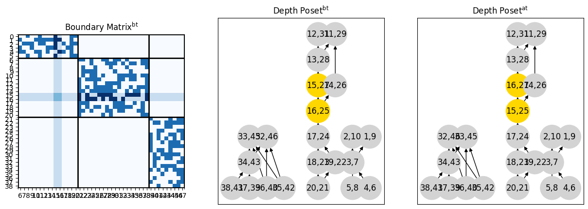

### Birth Death Pairs
|                          |                                                                                                                                                                                                                         |
|:-------------------------|:------------------------------------------------------------------------------------------------------------------------------------------------------------------------------------------------------------------------|
| Before the transposition | $\{(18, 23), (32, 46), (33, 45), (35, 42), (15, 27), (4, 6), (3, 7), (38, 41), (12, 31), (17, 24), (1, 9), (34, 43), (36, 40), (37, 39), (11, 29), (16, 25), (2, 10), (13, 28), (20, 21), (5, 8), (14, 26), (19, 22)\}$ |
| After the transposition  | $\{(18, 23), (32, 46), (33, 45), (35, 42), (3, 7), (4, 6), (38, 41), (12, 31), (17, 24), (1, 9), (34, 43), (36, 40), (37, 39), (11, 29), (2, 10), (13, 28), (15, 25), (16, 27), (20, 21), (5, 8), (14, 26), (19, 22)\}$ |

### Relations
|                          | Algorithm 1                                                                                                                                                                                                                                                                                                                                                                                                              | Algorithm 2                                                                                                                                                                                                                                                                                                                                                                                                                                      |
|:-------------------------|:-------------------------------------------------------------------------------------------------------------------------------------------------------------------------------------------------------------------------------------------------------------------------------------------------------------------------------------------------------------------------------------------------------------------------|:-------------------------------------------------------------------------------------------------------------------------------------------------------------------------------------------------------------------------------------------------------------------------------------------------------------------------------------------------------------------------------------------------------------------------------------------------|
| Before the transposition | $\{(25, 29), (24, 27), (43, 46), (41, 46), (23, 28), (23, 25), (23, 31), (40, 47), (27, 28), (27, 31), (25, 28), (24, 26), (7, 10), (42, 47), (41, 45), (26, 29), (21, 27), (23, 30), (22, 28), (39, 44), (23, 27), (22, 31), (39, 47), (27, 30), (28, 29), (7, 9), (24, 25), (6, 7), (6, 10), (24, 31), (43, 44), (42, 46), (22, 27), (21, 29), (23, 26), (22, 24), (39, 46), (23, 29), (28, 31)\}$                     | $\{(35, 30), (20, 11), (18, 17), (35, 33), (20, 14), (4, 3), (3, 1), (20, 17), (13, 11), (32, 30), (18, 16), (20, 13), (18, 13), (18, 11), (20, 16), (5, 0), (20, 19), (38, 34), (17, 11), (34, 30), (19, 14), (36, 30), (34, 33), (19, 17), (36, 33), (15, 13), (16, 12), (16, 15), (18, 15), (20, 12), (3, 2), (20, 18), (4, 1), (20, 15), (5, 2), (14, 11), (15, 12), (17, 16), (36, 32), (37, 34), (13, 12), (16, 14), (33, 30), (16, 11)\}$ |
| After the transposition  | $\{(25, 29), (24, 27), (43, 46), (41, 46), (23, 28), (23, 25), (23, 31), (40, 47), (27, 28), (27, 31), (7, 10), (24, 26), (25, 31), (42, 47), (41, 45), (26, 29), (21, 27), (23, 30), (22, 28), (39, 44), (23, 27), (22, 31), (39, 47), (27, 30), (28, 29), (7, 9), (24, 25), (6, 7), (6, 10), (25, 27), (24, 31), (43, 44), (42, 46), (25, 30), (22, 27), (21, 29), (23, 26), (22, 24), (39, 46), (23, 29), (28, 31)\}$ | $\{(35, 30), (20, 11), (18, 17), (35, 33), (20, 14), (4, 3), (3, 1), (20, 17), (33, 30), (13, 11), (15, 11), (15, 14), (32, 30), (16, 13), (18, 16), (20, 13), (18, 13), (20, 16), (5, 0), (20, 19), (38, 34), (17, 11), (34, 30), (19, 14), (36, 30), (34, 33), (19, 17), (36, 33), (15, 16), (18, 15), (20, 12), (3, 2), (20, 18), (4, 1), (20, 15), (5, 2), (14, 11), (15, 12), (17, 16), (36, 32), (37, 34), (13, 12), (18, 11)\}$           |

### Successors and Predecessers
|                 | $\text{Set}^\text{bt}(15, 27)$                                                 | $\text{Set}^\text{bt}(16, 25)$                                                 | $\text{Set}^\text{at}(15, 25)$                                                 | $\text{Set}^\text{at}(16, 27)$                                                           |
|:----------------|:-------------------------------------------------------------------------------|:-------------------------------------------------------------------------------|:-------------------------------------------------------------------------------|:-----------------------------------------------------------------------------------------|
| $\text{Succ}_1$ | $\text{Succ}_1^\text{bt}(15, 27) = \{(13, 28), (12, 31)\}$                     | $\text{Succ}_1^\text{bt}(16, 25) = \{(11, 29), (13, 28)\}$                     | $\text{Succ}_1^\text{at}(15, 25) = \{(11, 29), (16, 27), (12, 31)\}$           | $\text{Succ}_1^\text{at}(16, 27) = \{(13, 28), (12, 31)\}$                               |
| $\text{Pred}_1$ | $\text{Pred}_1^\text{bt}(15, 27) = \{(17, 24), (18, 23), (19, 22), (20, 21)\}$ | $\text{Pred}_1^\text{bt}(16, 25) = \{(17, 24), (18, 23)\}$                     | $\text{Pred}_1^\text{at}(15, 25) = \{(17, 24), (18, 23)\}$                     | $\text{Pred}_1^\text{at}(16, 27) = \{(18, 23), (19, 22), (15, 25), (17, 24), (20, 21)\}$ |
| $\text{Succ}_2$ | $\text{Succ}_2^\text{bt}(15, 27) = \{(13, 28), (12, 31)\}$                     | $\text{Succ}_2^\text{bt}(16, 25) = \{(15, 27), (11, 29), (14, 26), (12, 31)\}$ | $\text{Succ}_2^\text{at}(15, 25) = \{(11, 29), (16, 27), (14, 26), (12, 31)\}$ | $\text{Succ}_2^\text{at}(16, 27) = \{(13, 28)\}$                                         |
| $\text{Pred}_2$ | $\text{Pred}_2^\text{bt}(15, 27) = \{(16, 25), (18, 23), (20, 21)\}$           | $\text{Pred}_2^\text{bt}(16, 25) = \{(17, 24), (18, 23), (20, 21)\}$           | $\text{Pred}_2^\text{at}(15, 25) = \{(18, 23), (20, 21)\}$                     | $\text{Pred}_2^\text{at}(16, 27) = \{(17, 24), (18, 23), (15, 25), (20, 21)\}$           |

### Temp Sets
|                                                               | Before the Transposition                                                              | After the Transposition                                                               |
|:--------------------------------------------------------------|:--------------------------------------------------------------------------------------|:--------------------------------------------------------------------------------------|
| $\mathcal{L} = \{(s, t)\in \text{BD}:\; f(t) < f(y)\}$        | $\{(18, 23), (5, 8), (3, 7), (2, 10), (4, 6), (19, 22), (17, 24), (1, 9), (20, 21)\}$ | $\{(18, 23), (5, 8), (3, 7), (2, 10), (4, 6), (19, 22), (17, 24), (1, 9), (20, 21)\}$ |
| $\mathcal{M} = \{(s, t)\in \text{BD}:\; f(y) < f(t) < f(b)\}$ | $\{(14, 26)\}$                                                                        | $\{(14, 26)\}$                                                                        |

### Equations
There are 1 equations are wrong.

| eq   | left (formula)                  | left (paramatrized)               | left (value)                                           | right (formula)                                                                                           | right (paramatrized)                                                                                            | right (value)                                          | correct   |
|:-----|:--------------------------------|:----------------------------------|:-------------------------------------------------------|:----------------------------------------------------------------------------------------------------------|:----------------------------------------------------------------------------------------------------------------|:-------------------------------------------------------|:----------|
| Eq08 | $\text{Succ}_1^\text{at}(a, y)$ | $\text{Succ}_1^\text{at}(15, 25)$ | $\{(11, 29), (16, 27), (12, 31)\}$                     | $\text{Succ}_1^\text{bt}(x, y) \oplus \{(x, b)\} \oplus \text{Succ}_1^\text{bt}(a, b)$                    | $\text{Succ}_1^\text{bt}(16, 25) \oplus \{(16, 27)\} \oplus \text{Succ}_1^\text{bt}(15, 27)$                    | $\{(11, 29), (16, 27), (12, 31)\}$                     | ✔         |
| Eq09 | $\text{Succ}_1^\text{at}(x, b)$ | $\text{Succ}_1^\text{at}(16, 27)$ | $\{(13, 28), (12, 31)\}$                               | $\text{Succ}_1^\text{bt}(a, b)$                                                                           | $\text{Succ}_1^\text{bt}(15, 27)$                                                                               | $\{(13, 28), (12, 31)\}$                               | ✔         |
| Eq10 | $\text{Pred}_1^\text{at}(a, y)$ | $\text{Pred}_1^\text{at}(15, 25)$ | $\{(17, 24), (18, 23)\}$                               | $\text{Pred}_1^\text{bt}(x, y)$                                                                           | $\text{Pred}_1^\text{bt}(16, 25)$                                                                               | $\{(17, 24), (18, 23)\}$                               | ✔         |
| Eq11 | $\text{Pred}_1^\text{at}(x, b)$ | $\text{Pred}_1^\text{at}(16, 27)$ | $\{(18, 23), (19, 22), (15, 25), (17, 24), (20, 21)\}$ | $\text{Pred}_1^\text{bt}(a, b) \oplus \{(a, y)\}$                                                         | $\text{Pred}_1^\text{bt}(15, 27) \oplus \{(15, 25)\}$                                                           | $\{(18, 23), (19, 22), (15, 25), (17, 24), (20, 21)\}$ | ✔         |
| Eq12 | $\text{Succ}_2^\text{at}(a, y)$ | $\text{Succ}_2^\text{at}(15, 25)$ | $\{(11, 29), (16, 27), (14, 26), (12, 31)\}$           | $\text{Succ}_2^\text{bt}(x, y) \oplus \{(x, b), (a, b)\}$                                                 | $\text{Succ}_2^\text{bt}(16, 25) \oplus \{(16, 27), (15, 27)\}$                                                 | $\{(11, 29), (16, 27), (14, 26), (12, 31)\}$           | ✔         |
| Eq13 | $\text{Succ}_2^\text{at}(x, b)$ | $\text{Succ}_2^\text{at}(16, 27)$ | $\{(13, 28)\}$                                         | $\text{Succ}_2^\text{bt}(a, b)$                                                                           | $\text{Succ}_2^\text{bt}(15, 27)$                                                                               | $\{(13, 28), (12, 31)\}$                               | ✘         |
| Eq14 | $\text{Pred}_2^\text{at}(a, y)$ | $\text{Pred}_2^\text{at}(15, 25)$ | $\{(18, 23), (20, 21)\}$                               | $[\text{Pred}_2^\text{bt}(a, b) \cap \mathcal{L}]$                                                        | $[\text{Pred}_2^\text{bt}(15, 27) \cap \mathcal{L}]$                                                            | $\{(18, 23), (20, 21)\}$                               | ✔         |
| Eq15 | $\text{Pred}_2^\text{at}(x, b)$ | $\text{Pred}_2^\text{at}(16, 27)$ | $\{(17, 24), (18, 23), (15, 25), (20, 21)\}$           | $\text{Pred}_2^\text{bt}(x, y) \oplus \{(a, y)\} \oplus [\text{Pred}_2^\text{bt}(a, b) \cap \mathcal{M}]$ | $\text{Pred}_2^\text{bt}(16, 25) \oplus \{(15, 25)\} \oplus [\text{Pred}_2^\text{bt}(15, 27) \cap \mathcal{M}]$ | $\{(17, 24), (18, 23), (15, 25), (20, 21)\}$           | ✔         |

## Transposition <17, 18> in complex 5
Here is a __birth-birth__ __switch forward__ transposition <17, 18>.

$$
a = 17, \; b = 24, \; x = 18, \; y = 23
$$

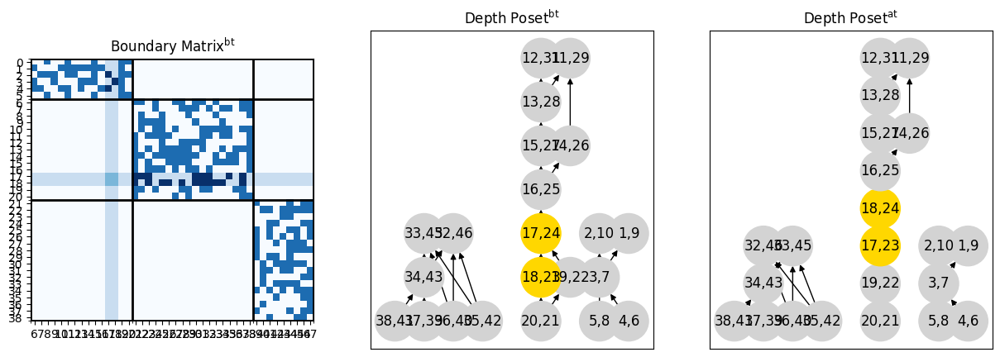

### Birth Death Pairs
|                          |                                                                                                                                                                                                                         |
|:-------------------------|:------------------------------------------------------------------------------------------------------------------------------------------------------------------------------------------------------------------------|
| Before the transposition | $\{(18, 23), (32, 46), (33, 45), (35, 42), (15, 27), (4, 6), (3, 7), (38, 41), (12, 31), (17, 24), (1, 9), (34, 43), (36, 40), (37, 39), (11, 29), (16, 25), (2, 10), (13, 28), (20, 21), (5, 8), (14, 26), (19, 22)\}$ |
| After the transposition  | $\{(32, 46), (33, 45), (35, 42), (15, 27), (4, 6), (3, 7), (38, 41), (12, 31), (1, 9), (34, 43), (36, 40), (37, 39), (11, 29), (16, 25), (17, 23), (2, 10), (13, 28), (18, 24), (20, 21), (5, 8), (14, 26), (19, 22)\}$ |

### Relations
|                          | Algorithm 1                                                                                                                                                                                                                                                                                                                                                                                          | Algorithm 2                                                                                                                                                                                                                                                                                                                                                                                                                                      |
|:-------------------------|:-----------------------------------------------------------------------------------------------------------------------------------------------------------------------------------------------------------------------------------------------------------------------------------------------------------------------------------------------------------------------------------------------------|:-------------------------------------------------------------------------------------------------------------------------------------------------------------------------------------------------------------------------------------------------------------------------------------------------------------------------------------------------------------------------------------------------------------------------------------------------|
| Before the transposition | $\{(25, 29), (24, 27), (43, 46), (41, 46), (23, 28), (23, 25), (23, 31), (40, 47), (27, 28), (27, 31), (25, 28), (24, 26), (7, 10), (42, 47), (41, 45), (26, 29), (21, 27), (23, 30), (22, 28), (39, 44), (23, 27), (22, 31), (39, 47), (27, 30), (28, 29), (7, 9), (24, 25), (6, 7), (6, 10), (24, 31), (43, 44), (42, 46), (22, 27), (21, 29), (23, 26), (22, 24), (39, 46), (23, 29), (28, 31)\}$ | $\{(35, 30), (20, 11), (18, 17), (35, 33), (20, 14), (4, 3), (3, 1), (20, 17), (13, 11), (32, 30), (18, 16), (20, 13), (18, 13), (18, 11), (20, 16), (5, 0), (20, 19), (38, 34), (17, 11), (34, 30), (19, 14), (36, 30), (34, 33), (19, 17), (36, 33), (15, 13), (16, 12), (16, 15), (18, 15), (20, 12), (3, 2), (20, 18), (4, 1), (20, 15), (5, 2), (14, 11), (15, 12), (17, 16), (36, 32), (37, 34), (13, 12), (16, 14), (33, 30), (16, 11)\}$ |
| After the transposition  | $\{(25, 29), (24, 27), (43, 46), (41, 46), (23, 28), (40, 47), (27, 28), (27, 31), (25, 28), (24, 26), (7, 10), (42, 47), (41, 45), (26, 29), (21, 27), (23, 24), (23, 30), (22, 28), (39, 44), (22, 31), (39, 47), (27, 30), (28, 29), (7, 9), (24, 25), (6, 7), (6, 10), (24, 31), (43, 44), (42, 46), (22, 27), (21, 29), (22, 24), (39, 46), (23, 29), (28, 31)\}$                               | $\{(35, 30), (20, 11), (35, 33), (20, 14), (4, 3), (3, 1), (20, 17), (33, 30), (17, 15), (17, 18), (13, 11), (32, 30), (20, 13), (18, 13), (20, 16), (5, 0), (20, 19), (38, 34), (17, 11), (34, 30), (19, 14), (36, 30), (34, 33), (19, 17), (36, 33), (15, 13), (16, 12), (16, 15), (18, 15), (20, 12), (20, 18), (3, 2), (4, 1), (20, 15), (5, 2), (14, 11), (17, 16), (17, 13), (36, 32), (37, 34), (13, 12), (16, 14), (15, 12), (16, 11)\}$ |

### Successors and Predecessers
|                 | $\text{Set}^\text{bt}(17, 24)$                                                 | $\text{Set}^\text{bt}(18, 23)$                                                                     | $\text{Set}^\text{at}(17, 23)$                                                           | $\text{Set}^\text{at}(18, 24)$                                                 |
|:----------------|:-------------------------------------------------------------------------------|:---------------------------------------------------------------------------------------------------|:-----------------------------------------------------------------------------------------|:-------------------------------------------------------------------------------|
| $\text{Succ}_1$ | $\text{Succ}_1^\text{bt}(17, 24) = \{(15, 27), (16, 25), (14, 26), (12, 31)\}$ | $\text{Succ}_1^\text{bt}(18, 23) = \{(15, 27), (11, 29), (14, 26), (16, 25), (13, 28), (12, 31)\}$ | $\text{Succ}_1^\text{at}(17, 23) = \{(11, 29), (18, 24), (13, 28)\}$                     | $\text{Succ}_1^\text{at}(18, 24) = \{(15, 27), (16, 25), (14, 26), (12, 31)\}$ |
| $\text{Pred}_1$ | $\text{Pred}_1^\text{bt}(17, 24) = \{(19, 22)\}$                               | $\text{Pred}_1^\text{bt}(18, 23) = \emptyset$                                                      | $\text{Pred}_1^\text{at}(17, 23) = \emptyset$                                            | $\text{Pred}_1^\text{at}(18, 24) = \{(17, 23), (19, 22)\}$                     |
| $\text{Succ}_2$ | $\text{Succ}_2^\text{bt}(17, 24) = \{(11, 29), (16, 25)\}$                     | $\text{Succ}_2^\text{bt}(18, 23) = \{(15, 27), (11, 29), (16, 25), (13, 28), (17, 24)\}$           | $\text{Succ}_2^\text{at}(17, 23) = \{(15, 27), (11, 29), (16, 25), (13, 28), (18, 24)\}$ | $\text{Succ}_2^\text{at}(18, 24) = \{(15, 27), (13, 28)\}$                     |
| $\text{Pred}_2$ | $\text{Pred}_2^\text{bt}(17, 24) = \{(18, 23), (19, 22), (20, 21)\}$           | $\text{Pred}_2^\text{bt}(18, 23) = \{(20, 21)\}$                                                   | $\text{Pred}_2^\text{at}(17, 23) = \{(19, 22), (20, 21)\}$                               | $\text{Pred}_2^\text{at}(18, 24) = \{(17, 23), (20, 21)\}$                     |

### Temp Sets
|                                                               | Before the Transposition                                          | After the Transposition                                           |
|:--------------------------------------------------------------|:------------------------------------------------------------------|:------------------------------------------------------------------|
| $\mathcal{L} = \{(s, t)\in \text{BD}:\; f(t) < f(y)\}$        | $\{(5, 8), (3, 7), (2, 10), (4, 6), (19, 22), (1, 9), (20, 21)\}$ | $\{(5, 8), (3, 7), (2, 10), (4, 6), (19, 22), (1, 9), (20, 21)\}$ |
| $\mathcal{M} = \{(s, t)\in \text{BD}:\; f(y) < f(t) < f(b)\}$ | $\emptyset$                                                       | $\emptyset$                                                       |

### Equations
There are 1 equations are wrong.

| eq   | left (formula)                  | left (paramatrized)               | left (value)                                           | right (formula)                                                                                           | right (paramatrized)                                                                                            | right (value)                                          | correct   |
|:-----|:--------------------------------|:----------------------------------|:-------------------------------------------------------|:----------------------------------------------------------------------------------------------------------|:----------------------------------------------------------------------------------------------------------------|:-------------------------------------------------------|:----------|
| Eq08 | $\text{Succ}_1^\text{at}(a, y)$ | $\text{Succ}_1^\text{at}(17, 23)$ | $\{(11, 29), (18, 24), (13, 28)\}$                     | $\text{Succ}_1^\text{bt}(x, y) \oplus \{(x, b)\} \oplus \text{Succ}_1^\text{bt}(a, b)$                    | $\text{Succ}_1^\text{bt}(18, 23) \oplus \{(18, 24)\} \oplus \text{Succ}_1^\text{bt}(17, 24)$                    | $\{(11, 29), (18, 24), (13, 28)\}$                     | ✔         |
| Eq09 | $\text{Succ}_1^\text{at}(x, b)$ | $\text{Succ}_1^\text{at}(18, 24)$ | $\{(15, 27), (16, 25), (14, 26), (12, 31)\}$           | $\text{Succ}_1^\text{bt}(a, b)$                                                                           | $\text{Succ}_1^\text{bt}(17, 24)$                                                                               | $\{(15, 27), (16, 25), (14, 26), (12, 31)\}$           | ✔         |
| Eq10 | $\text{Pred}_1^\text{at}(a, y)$ | $\text{Pred}_1^\text{at}(17, 23)$ | $\emptyset$                                            | $\text{Pred}_1^\text{bt}(x, y)$                                                                           | $\text{Pred}_1^\text{bt}(18, 23)$                                                                               | $\emptyset$                                            | ✔         |
| Eq11 | $\text{Pred}_1^\text{at}(x, b)$ | $\text{Pred}_1^\text{at}(18, 24)$ | $\{(17, 23), (19, 22)\}$                               | $\text{Pred}_1^\text{bt}(a, b) \oplus \{(a, y)\}$                                                         | $\text{Pred}_1^\text{bt}(17, 24) \oplus \{(17, 23)\}$                                                           | $\{(17, 23), (19, 22)\}$                               | ✔         |
| Eq12 | $\text{Succ}_2^\text{at}(a, y)$ | $\text{Succ}_2^\text{at}(17, 23)$ | $\{(15, 27), (11, 29), (16, 25), (13, 28), (18, 24)\}$ | $\text{Succ}_2^\text{bt}(x, y) \oplus \{(x, b), (a, b)\}$                                                 | $\text{Succ}_2^\text{bt}(18, 23) \oplus \{(18, 24), (17, 24)\}$                                                 | $\{(11, 29), (15, 27), (16, 25), (13, 28), (18, 24)\}$ | ✔         |
| Eq13 | $\text{Succ}_2^\text{at}(x, b)$ | $\text{Succ}_2^\text{at}(18, 24)$ | $\{(15, 27), (13, 28)\}$                               | $\text{Succ}_2^\text{bt}(a, b)$                                                                           | $\text{Succ}_2^\text{bt}(17, 24)$                                                                               | $\{(11, 29), (16, 25)\}$                               | ✘         |
| Eq14 | $\text{Pred}_2^\text{at}(a, y)$ | $\text{Pred}_2^\text{at}(17, 23)$ | $\{(19, 22), (20, 21)\}$                               | $[\text{Pred}_2^\text{bt}(a, b) \cap \mathcal{L}]$                                                        | $[\text{Pred}_2^\text{bt}(17, 24) \cap \mathcal{L}]$                                                            | $\{(19, 22), (20, 21)\}$                               | ✔         |
| Eq15 | $\text{Pred}_2^\text{at}(x, b)$ | $\text{Pred}_2^\text{at}(18, 24)$ | $\{(17, 23), (20, 21)\}$                               | $\text{Pred}_2^\text{bt}(x, y) \oplus \{(a, y)\} \oplus [\text{Pred}_2^\text{bt}(a, b) \cap \mathcal{M}]$ | $\text{Pred}_2^\text{bt}(18, 23) \oplus \{(17, 23)\} \oplus [\text{Pred}_2^\text{bt}(17, 24) \cap \mathcal{M}]$ | $\{(17, 23), (20, 21)\}$                               | ✔         |

## Transposition <19, 20> in complex 5
Here is a __birth-birth__ __switch forward__ transposition <19, 20>.

$$
a = 19, \; b = 22, \; x = 20, \; y = 21
$$

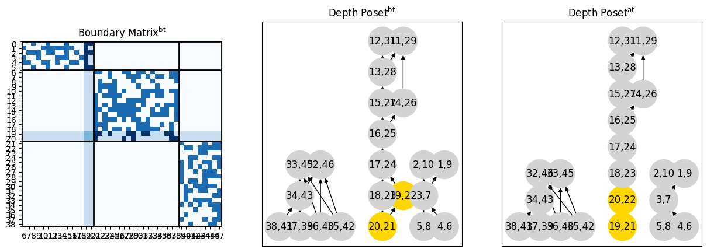

### Birth Death Pairs
|                          |                                                                                                                                                                                                                         |
|:-------------------------|:------------------------------------------------------------------------------------------------------------------------------------------------------------------------------------------------------------------------|
| Before the transposition | $\{(18, 23), (32, 46), (33, 45), (35, 42), (15, 27), (4, 6), (3, 7), (38, 41), (12, 31), (17, 24), (1, 9), (34, 43), (36, 40), (37, 39), (11, 29), (16, 25), (2, 10), (13, 28), (20, 21), (5, 8), (14, 26), (19, 22)\}$ |
| After the transposition  | $\{(18, 23), (32, 46), (33, 45), (35, 42), (15, 27), (4, 6), (3, 7), (38, 41), (12, 31), (17, 24), (19, 21), (1, 9), (34, 43), (36, 40), (37, 39), (11, 29), (16, 25), (20, 22), (2, 10), (13, 28), (5, 8), (14, 26)\}$ |

### Relations
|                          | Algorithm 1                                                                                                                                                                                                                                                                                                                                                                                                                        | Algorithm 2                                                                                                                                                                                                                                                                                                                                                                                                                                                                              |
|:-------------------------|:-----------------------------------------------------------------------------------------------------------------------------------------------------------------------------------------------------------------------------------------------------------------------------------------------------------------------------------------------------------------------------------------------------------------------------------|:-----------------------------------------------------------------------------------------------------------------------------------------------------------------------------------------------------------------------------------------------------------------------------------------------------------------------------------------------------------------------------------------------------------------------------------------------------------------------------------------|
| Before the transposition | $\{(25, 29), (24, 27), (43, 46), (41, 46), (23, 28), (23, 25), (23, 31), (40, 47), (27, 28), (27, 31), (25, 28), (24, 26), (7, 10), (42, 47), (41, 45), (26, 29), (21, 27), (23, 30), (22, 28), (39, 44), (23, 27), (22, 31), (39, 47), (27, 30), (28, 29), (7, 9), (24, 25), (6, 7), (6, 10), (24, 31), (43, 44), (42, 46), (22, 27), (21, 29), (23, 26), (22, 24), (39, 46), (23, 29), (28, 31)\}$                               | $\{(35, 30), (20, 11), (18, 17), (35, 33), (20, 14), (4, 3), (3, 1), (20, 17), (13, 11), (32, 30), (18, 16), (20, 13), (18, 13), (18, 11), (20, 16), (5, 0), (20, 19), (38, 34), (17, 11), (34, 30), (19, 14), (36, 30), (34, 33), (19, 17), (36, 33), (15, 13), (16, 12), (16, 15), (18, 15), (20, 12), (3, 2), (20, 18), (4, 1), (20, 15), (5, 2), (14, 11), (15, 12), (17, 16), (36, 32), (37, 34), (13, 12), (16, 14), (33, 30), (16, 11)\}$                                         |
| After the transposition  | $\{(25, 29), (24, 27), (43, 46), (41, 46), (21, 22), (21, 28), (21, 31), (23, 28), (23, 25), (23, 31), (40, 47), (27, 28), (27, 31), (25, 28), (24, 26), (7, 10), (42, 47), (41, 45), (26, 29), (21, 24), (23, 30), (22, 28), (39, 44), (23, 27), (22, 31), (39, 47), (27, 30), (28, 29), (7, 9), (24, 25), (6, 7), (6, 10), (24, 31), (43, 44), (42, 46), (22, 27), (21, 29), (23, 26), (22, 24), (39, 46), (23, 29), (28, 31)\}$ | $\{(35, 30), (20, 11), (18, 17), (35, 33), (4, 3), (3, 1), (33, 30), (19, 12), (19, 18), (19, 15), (13, 11), (32, 30), (18, 16), (20, 13), (18, 13), (20, 16), (5, 0), (38, 34), (17, 11), (19, 11), (34, 30), (19, 14), (34, 33), (36, 30), (19, 17), (36, 33), (19, 20), (15, 13), (16, 12), (16, 15), (18, 15), (20, 12), (20, 18), (3, 2), (4, 1), (20, 15), (5, 2), (14, 11), (15, 12), (17, 16), (19, 16), (36, 32), (19, 13), (37, 34), (13, 12), (16, 14), (18, 11), (16, 11)\}$ |

### Successors and Predecessers
|                 | $\text{Set}^\text{bt}(19, 22)$                                                 | $\text{Set}^\text{bt}(20, 21)$                                                                                                   | $\text{Set}^\text{at}(19, 21)$                                                                                                   | $\text{Set}^\text{at}(20, 22)$                                                                     |
|:----------------|:-------------------------------------------------------------------------------|:---------------------------------------------------------------------------------------------------------------------------------|:---------------------------------------------------------------------------------------------------------------------------------|:---------------------------------------------------------------------------------------------------|
| $\text{Succ}_1$ | $\text{Succ}_1^\text{bt}(19, 22) = \{(15, 27), (17, 24), (13, 28), (12, 31)\}$ | $\text{Succ}_1^\text{bt}(20, 21) = \{(15, 27), (11, 29)\}$                                                                       | $\text{Succ}_1^\text{at}(19, 21) = \{(11, 29), (13, 28), (12, 31), (20, 22), (17, 24)\}$                                         | $\text{Succ}_1^\text{at}(20, 22) = \{(15, 27), (17, 24), (13, 28), (12, 31)\}$                     |
| $\text{Pred}_1$ | $\text{Pred}_1^\text{bt}(19, 22) = \emptyset$                                  | $\text{Pred}_1^\text{bt}(20, 21) = \emptyset$                                                                                    | $\text{Pred}_1^\text{at}(19, 21) = \emptyset$                                                                                    | $\text{Pred}_1^\text{at}(20, 22) = \{(19, 21)\}$                                                   |
| $\text{Succ}_2$ | $\text{Succ}_2^\text{bt}(19, 22) = \{(17, 24), (14, 26)\}$                     | $\text{Succ}_2^\text{bt}(20, 21) = \{(18, 23), (15, 27), (11, 29), (14, 26), (16, 25), (19, 22), (13, 28), (12, 31), (17, 24)\}$ | $\text{Succ}_2^\text{at}(19, 21) = \{(18, 23), (15, 27), (11, 29), (14, 26), (16, 25), (13, 28), (12, 31), (20, 22), (17, 24)\}$ | $\text{Succ}_2^\text{at}(20, 22) = \{(18, 23), (15, 27), (11, 29), (16, 25), (13, 28), (12, 31)\}$ |
| $\text{Pred}_2$ | $\text{Pred}_2^\text{bt}(19, 22) = \{(20, 21)\}$                               | $\text{Pred}_2^\text{bt}(20, 21) = \emptyset$                                                                                    | $\text{Pred}_2^\text{at}(19, 21) = \emptyset$                                                                                    | $\text{Pred}_2^\text{at}(20, 22) = \{(19, 21)\}$                                                   |

### Temp Sets
|                                                               | Before the Transposition                      | After the Transposition                       |
|:--------------------------------------------------------------|:----------------------------------------------|:----------------------------------------------|
| $\mathcal{L} = \{(s, t)\in \text{BD}:\; f(t) < f(y)\}$        | $\{(5, 8), (3, 7), (2, 10), (4, 6), (1, 9)\}$ | $\{(5, 8), (3, 7), (2, 10), (4, 6), (1, 9)\}$ |
| $\mathcal{M} = \{(s, t)\in \text{BD}:\; f(y) < f(t) < f(b)\}$ | $\emptyset$                                   | $\emptyset$                                   |

### Equations
There are 1 equations are wrong.

| eq   | left (formula)                  | left (paramatrized)               | left (value)                                                                                   | right (formula)                                                                                           | right (paramatrized)                                                                                            | right (value)                                                                                  | correct   |
|:-----|:--------------------------------|:----------------------------------|:-----------------------------------------------------------------------------------------------|:----------------------------------------------------------------------------------------------------------|:----------------------------------------------------------------------------------------------------------------|:-----------------------------------------------------------------------------------------------|:----------|
| Eq08 | $\text{Succ}_1^\text{at}(a, y)$ | $\text{Succ}_1^\text{at}(19, 21)$ | $\{(11, 29), (13, 28), (12, 31), (20, 22), (17, 24)\}$                                         | $\text{Succ}_1^\text{bt}(x, y) \oplus \{(x, b)\} \oplus \text{Succ}_1^\text{bt}(a, b)$                    | $\text{Succ}_1^\text{bt}(20, 21) \oplus \{(20, 22)\} \oplus \text{Succ}_1^\text{bt}(19, 22)$                    | $\{(11, 29), (13, 28), (12, 31), (20, 22), (17, 24)\}$                                         | ✔         |
| Eq09 | $\text{Succ}_1^\text{at}(x, b)$ | $\text{Succ}_1^\text{at}(20, 22)$ | $\{(15, 27), (17, 24), (13, 28), (12, 31)\}$                                                   | $\text{Succ}_1^\text{bt}(a, b)$                                                                           | $\text{Succ}_1^\text{bt}(19, 22)$                                                                               | $\{(15, 27), (17, 24), (13, 28), (12, 31)\}$                                                   | ✔         |
| Eq10 | $\text{Pred}_1^\text{at}(a, y)$ | $\text{Pred}_1^\text{at}(19, 21)$ | $\emptyset$                                                                                    | $\text{Pred}_1^\text{bt}(x, y)$                                                                           | $\text{Pred}_1^\text{bt}(20, 21)$                                                                               | $\emptyset$                                                                                    | ✔         |
| Eq11 | $\text{Pred}_1^\text{at}(x, b)$ | $\text{Pred}_1^\text{at}(20, 22)$ | $\{(19, 21)\}$                                                                                 | $\text{Pred}_1^\text{bt}(a, b) \oplus \{(a, y)\}$                                                         | $\text{Pred}_1^\text{bt}(19, 22) \oplus \{(19, 21)\}$                                                           | $\{(19, 21)\}$                                                                                 | ✔         |
| Eq12 | $\text{Succ}_2^\text{at}(a, y)$ | $\text{Succ}_2^\text{at}(19, 21)$ | $\{(18, 23), (15, 27), (11, 29), (14, 26), (16, 25), (13, 28), (12, 31), (20, 22), (17, 24)\}$ | $\text{Succ}_2^\text{bt}(x, y) \oplus \{(x, b), (a, b)\}$                                                 | $\text{Succ}_2^\text{bt}(20, 21) \oplus \{(20, 22), (19, 22)\}$                                                 | $\{(18, 23), (15, 27), (11, 29), (14, 26), (16, 25), (13, 28), (12, 31), (20, 22), (17, 24)\}$ | ✔         |
| Eq13 | $\text{Succ}_2^\text{at}(x, b)$ | $\text{Succ}_2^\text{at}(20, 22)$ | $\{(18, 23), (15, 27), (11, 29), (16, 25), (13, 28), (12, 31)\}$                               | $\text{Succ}_2^\text{bt}(a, b)$                                                                           | $\text{Succ}_2^\text{bt}(19, 22)$                                                                               | $\{(17, 24), (14, 26)\}$                                                                       | ✘         |
| Eq14 | $\text{Pred}_2^\text{at}(a, y)$ | $\text{Pred}_2^\text{at}(19, 21)$ | $\emptyset$                                                                                    | $[\text{Pred}_2^\text{bt}(a, b) \cap \mathcal{L}]$                                                        | $[\text{Pred}_2^\text{bt}(19, 22) \cap \mathcal{L}]$                                                            | $\emptyset$                                                                                    | ✔         |
| Eq15 | $\text{Pred}_2^\text{at}(x, b)$ | $\text{Pred}_2^\text{at}(20, 22)$ | $\{(19, 21)\}$                                                                                 | $\text{Pred}_2^\text{bt}(x, y) \oplus \{(a, y)\} \oplus [\text{Pred}_2^\text{bt}(a, b) \cap \mathcal{M}]$ | $\text{Pred}_2^\text{bt}(20, 21) \oplus \{(19, 21)\} \oplus [\text{Pred}_2^\text{bt}(19, 22) \cap \mathcal{M}]$ | $\{(19, 21)\}$                                                                                 | ✔         |

## Transposition <26, 27> in complex 5
Here is a __death-death__ __no switch__ transposition <26, 27>.

$$
a = 15, \; b = 27, \; x = 14, \; y = 26
$$

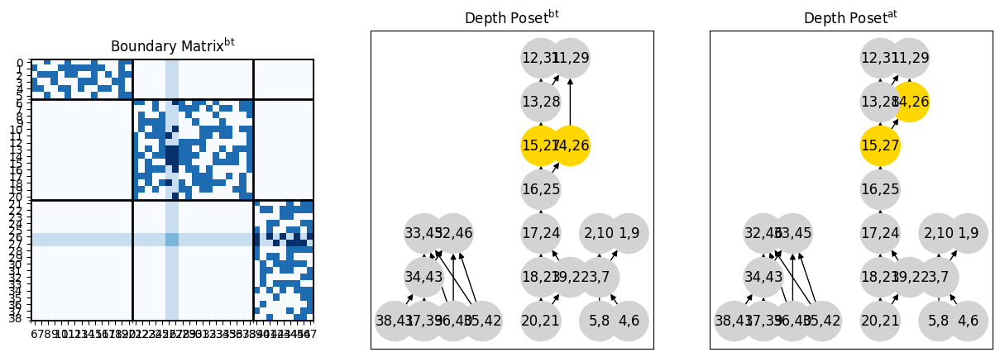

### Birth Death Pairs
|                          |                                                                                                                                                                                                                         |
|:-------------------------|:------------------------------------------------------------------------------------------------------------------------------------------------------------------------------------------------------------------------|
| Before the transposition | $\{(18, 23), (32, 46), (33, 45), (35, 42), (15, 27), (4, 6), (3, 7), (38, 41), (12, 31), (17, 24), (1, 9), (34, 43), (36, 40), (37, 39), (11, 29), (16, 25), (2, 10), (13, 28), (20, 21), (5, 8), (14, 26), (19, 22)\}$ |
| After the transposition  | $\{(18, 23), (32, 46), (33, 45), (35, 42), (15, 27), (4, 6), (3, 7), (38, 41), (12, 31), (17, 24), (1, 9), (34, 43), (36, 40), (37, 39), (11, 29), (16, 25), (2, 10), (13, 28), (20, 21), (5, 8), (14, 26), (19, 22)\}$ |

### Relations
|                          | Algorithm 1                                                                                                                                                                                                                                                                                                                                                                                          | Algorithm 2                                                                                                                                                                                                                                                                                                                                                                                                                                                          |
|:-------------------------|:-----------------------------------------------------------------------------------------------------------------------------------------------------------------------------------------------------------------------------------------------------------------------------------------------------------------------------------------------------------------------------------------------------|:---------------------------------------------------------------------------------------------------------------------------------------------------------------------------------------------------------------------------------------------------------------------------------------------------------------------------------------------------------------------------------------------------------------------------------------------------------------------|
| Before the transposition | $\{(25, 29), (24, 27), (43, 46), (41, 46), (23, 28), (23, 25), (23, 31), (40, 47), (27, 28), (27, 31), (25, 28), (24, 26), (7, 10), (42, 47), (41, 45), (26, 29), (21, 27), (23, 30), (22, 28), (39, 44), (23, 27), (22, 31), (39, 47), (27, 30), (28, 29), (7, 9), (24, 25), (6, 7), (6, 10), (24, 31), (43, 44), (42, 46), (22, 27), (21, 29), (23, 26), (22, 24), (39, 46), (23, 29), (28, 31)\}$ | $\{(35, 30), (20, 11), (18, 17), (35, 33), (20, 14), (4, 3), (3, 1), (20, 17), (13, 11), (32, 30), (18, 16), (20, 13), (18, 13), (18, 11), (20, 16), (5, 0), (20, 19), (38, 34), (17, 11), (34, 30), (19, 14), (36, 30), (34, 33), (19, 17), (36, 33), (15, 13), (16, 12), (16, 15), (18, 15), (20, 12), (3, 2), (20, 18), (4, 1), (20, 15), (5, 2), (14, 11), (15, 12), (17, 16), (36, 32), (37, 34), (13, 12), (16, 14), (33, 30), (16, 11)\}$                     |
| After the transposition  | $\{(25, 29), (24, 27), (43, 46), (41, 46), (23, 28), (23, 25), (23, 31), (40, 47), (27, 28), (27, 31), (25, 28), (24, 26), (7, 10), (42, 47), (41, 45), (26, 29), (21, 27), (23, 30), (22, 28), (39, 44), (23, 27), (22, 31), (39, 47), (27, 30), (28, 29), (7, 9), (24, 25), (6, 7), (6, 10), (24, 31), (43, 44), (42, 46), (22, 27), (21, 29), (23, 26), (22, 24), (39, 46), (23, 29), (28, 31)\}$ | $\{(35, 30), (20, 11), (18, 17), (35, 33), (20, 14), (4, 3), (3, 1), (20, 17), (33, 30), (13, 11), (15, 11), (15, 14), (32, 30), (18, 16), (20, 13), (18, 13), (20, 16), (5, 0), (20, 19), (38, 34), (17, 11), (34, 30), (19, 14), (36, 30), (34, 33), (19, 17), (36, 33), (15, 13), (16, 12), (16, 15), (18, 15), (20, 12), (3, 2), (20, 18), (4, 1), (20, 15), (5, 2), (14, 11), (15, 12), (17, 16), (36, 32), (37, 34), (13, 12), (16, 14), (18, 11), (16, 11)\}$ |

### Successors and Predecessers
No such node in the Depth Poset

### Temp Sets
|                                                               | Before the Transposition                                                                                                               | After the Transposition                                                                                                                |
|:--------------------------------------------------------------|:---------------------------------------------------------------------------------------------------------------------------------------|:---------------------------------------------------------------------------------------------------------------------------------------|
| $\mathcal{B} = \{(s, t)\in \text{BD}:\; f(s) > f(x)\}$        | $\{(34, 43), (36, 40), (37, 39), (18, 23), (32, 46), (33, 45), (35, 42), (15, 27), (38, 41), (16, 25), (19, 22), (17, 24), (20, 21)\}$ | $\{(34, 43), (36, 40), (37, 39), (18, 23), (32, 46), (33, 45), (35, 42), (15, 27), (38, 41), (16, 25), (19, 22), (17, 24), (20, 21)\}$ |
| $\mathcal{N} = \{(s, t)\in \text{BD}:\; f(x) > f(s) > f(a)\}$ | $\emptyset$                                                                                                                            | $\emptyset$                                                                                                                            |

### Equations
There are 2 equations are wrong.

| eq   | left (formula)                  | left (paramatrized)               | left (value)                       | right (formula)                                                                        | right (paramatrized)                                                                         | right (value)                                | correct   |
|:-----|:--------------------------------|:----------------------------------|:-----------------------------------|:---------------------------------------------------------------------------------------|:---------------------------------------------------------------------------------------------|:---------------------------------------------|:----------|
| Eq36 | $\text{Succ}_2^\text{at}(x, y)$ | $\text{Succ}_2^\text{at}(14, 26)$ | $\{(11, 29)\}$                     | $\text{Succ}_2^\text{bt}(x, y) \oplus \{(a, b)\} \oplus \text{Succ}_2^\text{bt}(a, b)$ | $\text{Succ}_2^\text{bt}(14, 26) \oplus \{(15, 27)\} \oplus \text{Succ}_2^\text{bt}(15, 27)$ | $\{(15, 27), (11, 29), (13, 28), (12, 31)\}$ | ✘         |
| Eq37 | $\text{Pred}_2^\text{at}(a, b)$ | $\text{Pred}_2^\text{at}(15, 27)$ | $\{(16, 25), (18, 23), (20, 21)\}$ | $\text{Pred}_2^\text{bt}(a, b) \oplus \{(x, y)\}$                                      | $\text{Pred}_2^\text{bt}(15, 27) \oplus \{(14, 26)\}$                                        | $\{(16, 25), (18, 23), (14, 26), (20, 21)\}$ | ✘         |

## Transposition <2, 3> in complex 6
Here is a __birth-birth__ __no switch__ transposition <2, 3>.

$$
a = 2, \; b = 6, \; x = 3, \; y = 12
$$

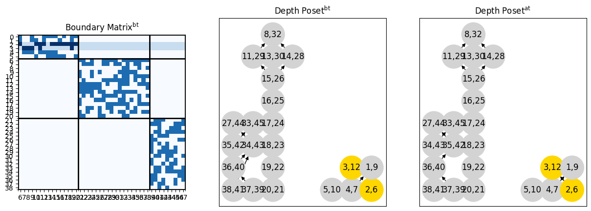

### Birth Death Pairs
|                          |                                                                                                                                                                                                                         |
|:-------------------------|:------------------------------------------------------------------------------------------------------------------------------------------------------------------------------------------------------------------------|
| Before the transposition | $\{(13, 30), (18, 23), (33, 45), (35, 42), (38, 41), (5, 10), (14, 28), (17, 24), (1, 9), (34, 43), (36, 40), (37, 39), (11, 29), (15, 26), (16, 25), (3, 12), (8, 32), (4, 7), (20, 21), (2, 6), (19, 22), (27, 44)\}$ |
| After the transposition  | $\{(13, 30), (18, 23), (33, 45), (35, 42), (38, 41), (5, 10), (14, 28), (17, 24), (1, 9), (34, 43), (36, 40), (37, 39), (11, 29), (15, 26), (16, 25), (3, 12), (8, 32), (4, 7), (20, 21), (2, 6), (19, 22), (27, 44)\}$ |

### Relations
|                          | Algorithm 1                                                                                                                                                                                                                                                                                                                                                                                                      | Algorithm 2                                                                                                                                                                                                                                                                                                                                                                            |
|:-------------------------|:-----------------------------------------------------------------------------------------------------------------------------------------------------------------------------------------------------------------------------------------------------------------------------------------------------------------------------------------------------------------------------------------------------------------|:---------------------------------------------------------------------------------------------------------------------------------------------------------------------------------------------------------------------------------------------------------------------------------------------------------------------------------------------------------------------------------------|
| Before the transposition | $\{(24, 30), (25, 29), (42, 45), (41, 43), (26, 30), (43, 46), (21, 22), (22, 23), (29, 32), (23, 28), (39, 42), (22, 29), (40, 47), (39, 45), (45, 46), (25, 28), (24, 29), (26, 32), (26, 29), (43, 45), (23, 24), (40, 43), (22, 31), (30, 32), (28, 32), (7, 9), (7, 12), (43, 44), (42, 46), (25, 30), (26, 31), (44, 46), (21, 26), (23, 26), (21, 32), (23, 29), (39, 43), (30, 31), (25, 26)\}$          | $\{(18, 17), (35, 27), (20, 14), (4, 3), (20, 17), (1, 0), (37, 27), (19, 15), (37, 36), (36, 34), (15, 11), (15, 14), (16, 13), (18, 16), (20, 13), (18, 13), (20, 16), (38, 31), (5, 0), (20, 19), (17, 11), (19, 11), (34, 27), (34, 33), (2, 1), (19, 17), (37, 35), (36, 33), (33, 31), (18, 15), (35, 31), (17, 16), (2, 0), (19, 16), (37, 31), (36, 35), (18, 11), (18, 14)\}$ |
| After the transposition  | $\{(24, 30), (6, 12), (25, 29), (42, 45), (41, 43), (26, 30), (43, 46), (21, 22), (22, 23), (29, 32), (23, 28), (39, 42), (40, 47), (22, 29), (39, 45), (45, 46), (25, 28), (24, 29), (26, 32), (26, 29), (43, 45), (23, 24), (40, 43), (22, 31), (30, 32), (28, 32), (7, 9), (7, 12), (43, 44), (42, 46), (25, 30), (26, 31), (44, 46), (21, 26), (23, 26), (21, 32), (23, 29), (39, 43), (30, 31), (25, 26)\}$ | $\{(18, 17), (35, 27), (20, 14), (4, 3), (20, 17), (1, 0), (37, 27), (19, 15), (37, 36), (36, 34), (15, 11), (15, 14), (16, 13), (18, 16), (20, 13), (18, 13), (20, 16), (38, 31), (5, 0), (20, 19), (17, 11), (19, 11), (34, 27), (34, 33), (2, 1), (19, 17), (37, 35), (36, 33), (33, 31), (18, 15), (35, 31), (17, 16), (2, 0), (19, 16), (37, 31), (36, 35), (18, 11), (18, 14)\}$ |

### Successors and Predecessers
No such node in the Depth Poset

### Temp Sets
|                                                               | Before the Transposition              | After the Transposition               |
|:--------------------------------------------------------------|:--------------------------------------|:--------------------------------------|
| $\mathcal{L} = \{(s, t)\in \text{BD}:\; f(t) < f(y)\}$        | $\{(5, 10), (2, 6), (4, 7), (1, 9)\}$ | $\{(5, 10), (2, 6), (4, 7), (1, 9)\}$ |
| $\mathcal{M} = \{(s, t)\in \text{BD}:\; f(y) < f(t) < f(b)\}$ | $\emptyset$                           | $\emptyset$                           |

### Equations
There are 2 equations are wrong.

| eq   | left (formula)                  | left (paramatrized)              | left (value)   | right (formula)                                                                        | right (paramatrized)                                                                    | right (value)   | correct   |
|:-----|:--------------------------------|:---------------------------------|:---------------|:---------------------------------------------------------------------------------------|:----------------------------------------------------------------------------------------|:----------------|:----------|
| Eq16 | $\text{Succ}_1^\text{at}(x, y)$ | $\text{Succ}_1^\text{at}(3, 12)$ | $\emptyset$    | $\text{Succ}_1^\text{bt}(x, y) \oplus \{(a, b)\} \oplus \text{Succ}_1^\text{bt}(a, b)$ | $\text{Succ}_1^\text{bt}(3, 12) \oplus \{(2, 6)\} \oplus \text{Succ}_1^\text{bt}(2, 6)$ | $\{(2, 6)\}$    | ✘         |
| Eq17 | $\text{Pred}_1^\text{at}(a, b)$ | $\text{Pred}_1^\text{at}(2, 6)$  | $\emptyset$    | $\text{Pred}_1^\text{bt}(a, b) \oplus \{(x, y)\}$                                      | $\text{Pred}_1^\text{bt}(2, 6) \oplus \{(3, 12)\}$                                      | $\{(3, 12)\}$   | ✘         |

## Transposition <7, 8> in complex 6
Here is a __birth-death__ __switch forward__ transposition <7, 8>.

$$
a = 4, \; b = 7, \; x = 8, \; y = 32
$$

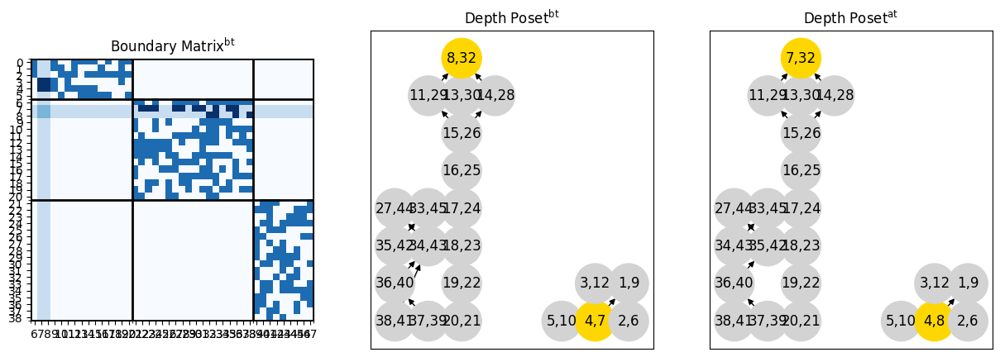

### Birth Death Pairs
|                          |                                                                                                                                                                                                                         |
|:-------------------------|:------------------------------------------------------------------------------------------------------------------------------------------------------------------------------------------------------------------------|
| Before the transposition | $\{(13, 30), (18, 23), (33, 45), (35, 42), (38, 41), (5, 10), (14, 28), (17, 24), (1, 9), (34, 43), (36, 40), (37, 39), (11, 29), (15, 26), (16, 25), (3, 12), (8, 32), (4, 7), (20, 21), (2, 6), (19, 22), (27, 44)\}$ |
| After the transposition  | $\{(13, 30), (18, 23), (33, 45), (35, 42), (7, 32), (38, 41), (5, 10), (14, 28), (17, 24), (1, 9), (34, 43), (36, 40), (37, 39), (11, 29), (15, 26), (16, 25), (4, 8), (3, 12), (20, 21), (2, 6), (19, 22), (27, 44)\}$ |

### Relations
|                          | Algorithm 1                                                                                                                                                                                                                                                                                                                                                                                             | Algorithm 2                                                                                                                                                                                                                                                                                                                                                                                                       |
|:-------------------------|:--------------------------------------------------------------------------------------------------------------------------------------------------------------------------------------------------------------------------------------------------------------------------------------------------------------------------------------------------------------------------------------------------------|:------------------------------------------------------------------------------------------------------------------------------------------------------------------------------------------------------------------------------------------------------------------------------------------------------------------------------------------------------------------------------------------------------------------|
| Before the transposition | $\{(24, 30), (25, 29), (42, 45), (41, 43), (26, 30), (43, 46), (21, 22), (22, 23), (29, 32), (23, 28), (39, 42), (22, 29), (40, 47), (39, 45), (45, 46), (25, 28), (24, 29), (26, 32), (26, 29), (43, 45), (23, 24), (40, 43), (22, 31), (30, 32), (28, 32), (7, 9), (7, 12), (43, 44), (42, 46), (25, 30), (26, 31), (44, 46), (21, 26), (23, 26), (21, 32), (23, 29), (39, 43), (30, 31), (25, 26)\}$ | $\{(18, 17), (35, 27), (20, 14), (4, 3), (20, 17), (1, 0), (37, 27), (19, 15), (37, 36), (36, 34), (15, 11), (15, 14), (16, 13), (18, 16), (20, 13), (18, 13), (20, 16), (38, 31), (5, 0), (20, 19), (17, 11), (19, 11), (34, 27), (34, 33), (2, 1), (19, 17), (37, 35), (36, 33), (33, 31), (18, 15), (35, 31), (17, 16), (2, 0), (19, 16), (37, 31), (36, 35), (18, 11), (18, 14)\}$                            |
| After the transposition  | $\{(24, 30), (25, 29), (42, 45), (41, 43), (26, 30), (43, 46), (21, 22), (22, 23), (29, 32), (23, 28), (8, 9), (39, 42), (40, 47), (22, 29), (39, 45), (8, 12), (45, 46), (25, 28), (24, 29), (26, 32), (26, 29), (43, 45), (23, 24), (40, 43), (22, 31), (30, 32), (28, 32), (43, 44), (42, 46), (25, 30), (26, 31), (44, 46), (21, 26), (23, 26), (21, 32), (23, 29), (39, 43), (30, 31), (25, 26)\}$ | $\{(18, 17), (35, 27), (20, 14), (4, 3), (20, 17), (14, 7), (1, 0), (37, 27), (19, 15), (37, 36), (36, 34), (15, 11), (15, 14), (16, 13), (18, 16), (20, 13), (18, 13), (20, 16), (38, 31), (5, 0), (20, 19), (17, 11), (19, 11), (34, 27), (34, 33), (2, 1), (19, 17), (37, 35), (36, 33), (33, 31), (18, 15), (35, 31), (17, 7), (19, 7), (17, 16), (2, 0), (19, 16), (37, 31), (36, 35), (18, 11), (18, 14)\}$ |

### Successors and Predecessers
|                 | $\text{Set}^\text{bt}(4, 7)$                          | $\text{Set}^\text{bt}(8, 32)$                                                           | $\text{Set}^\text{at}(4, 8)$                          | $\text{Set}^\text{at}(7, 32)$                                                           |
|:----------------|:------------------------------------------------------|:----------------------------------------------------------------------------------------|:------------------------------------------------------|:----------------------------------------------------------------------------------------|
| $\text{Succ}_1$ | $\text{Succ}_1^\text{bt}(4, 7) = \{(3, 12), (1, 9)\}$ | $\text{Succ}_1^\text{bt}(8, 32) = \emptyset$                                            | $\text{Succ}_1^\text{at}(4, 8) = \{(3, 12), (1, 9)\}$ | $\text{Succ}_1^\text{at}(7, 32) = \emptyset$                                            |
| $\text{Pred}_1$ | $\text{Pred}_1^\text{bt}(4, 7) = \emptyset$           | $\text{Pred}_1^\text{bt}(8, 32) = \{(13, 30), (11, 29), (15, 26), (14, 28), (20, 21)\}$ | $\text{Pred}_1^\text{at}(4, 8) = \emptyset$           | $\text{Pred}_1^\text{at}(7, 32) = \{(13, 30), (11, 29), (15, 26), (14, 28), (20, 21)\}$ |
| $\text{Succ}_2$ | $\text{Succ}_2^\text{bt}(4, 7) = \{(3, 12)\}$         | $\text{Succ}_2^\text{bt}(8, 32) = \emptyset$                                            | $\text{Succ}_2^\text{at}(4, 8) = \{(3, 12)\}$         | $\text{Succ}_2^\text{at}(7, 32) = \emptyset$                                            |
| $\text{Pred}_2$ | $\text{Pred}_2^\text{bt}(4, 7) = \emptyset$           | $\text{Pred}_2^\text{bt}(8, 32) = \emptyset$                                            | $\text{Pred}_2^\text{at}(4, 8) = \emptyset$           | $\text{Pred}_2^\text{at}(7, 32) = \{(17, 24), (19, 22), (14, 28)\}$                     |

### Temp Sets
|                                                              | Before the Transposition                                                                       | After the Transposition                                                                        |
|:-------------------------------------------------------------|:-----------------------------------------------------------------------------------------------|:-----------------------------------------------------------------------------------------------|
| $A_1 = \{(s, t)\in \text{BD}:\; f(a) < f(s) < f(t) < f(x)\}$ | $\emptyset$                                                                                    | $\emptyset$                                                                                    |
| $B_1 = \{(s, t)\in \text{BD}:\; U_1[t, x] = 1\}$             | $\emptyset$                                                                                    | $\emptyset$                                                                                    |
| $A_2 = \{(s, t)\in \text{BD}:\; f(b) < f(s) < f(t) < f(y)\}$ | $\{(13, 30), (18, 23), (11, 29), (15, 26), (16, 25), (19, 22), (14, 28), (17, 24), (20, 21)\}$ | $\{(13, 30), (18, 23), (11, 29), (15, 26), (16, 25), (19, 22), (14, 28), (17, 24), (20, 21)\}$ |
| $B_2 = \{(s, t)\in \text{BD}:\; U_2[b, s] = 1\}$             | $\emptyset$                                                                                    | $\{(17, 24), (19, 22), (14, 28)\}$                                                             |

### Equations
There are 2 equations are wrong.

| eq    | left (formula)                  | left (paramatrized)              | left (value)                                           | right (formula)                                      | right (paramatrized)                                 | right (value)                                          | correct   |
|:------|:--------------------------------|:---------------------------------|:-------------------------------------------------------|:-----------------------------------------------------|:-----------------------------------------------------|:-------------------------------------------------------|:----------|
| Eq48  | $\text{Succ}_1^\text{at}(a, x)$ | $\text{Succ}_1^\text{at}(4, 8)$  | $\{(3, 12), (1, 9)\}$                                  | $\text{Succ}_1^\text{bt}(a, b)$                      | $\text{Succ}_1^\text{bt}(4, 7)$                      | $\{(3, 12), (1, 9)\}$                                  | ✔         |
| Eq49  | $\text{Succ}_1^\text{at}(b, y)$ | $\text{Succ}_1^\text{at}(7, 32)$ | $\emptyset$                                            | $\text{Succ}_1^\text{bt}(x, y)$                      | $\text{Succ}_1^\text{bt}(8, 32)$                     | $\emptyset$                                            | ✔         |
| Eq50  | $\text{Pred}_1^\text{at}(a, x)$ | $\text{Pred}_1^\text{at}(4, 8)$  | $\emptyset$                                            | $\{(s, t)\in \text{BD}:\; U_1^\text{bt}[t, x] = 1\}$ | $\{(s, t)\in \text{BD}:\; U_1^\text{bt}[t, 8] = 1\}$ | $\emptyset$                                            | ✔         |
| Eq50a | $\text{Pred}_1^\text{at}(a, x)$ | $\text{Pred}_1^\text{at}(4, 8)$  | $\emptyset$                                            | $A_1^\text{bt} \cap B_1^\text{bt}$                   | $A_1^\text{bt} \cap B_1^\text{bt}$                   | $\emptyset$                                            | ✔         |
| Eq50b | $\text{Pred}_1^\text{at}(a, x)$ | $\text{Pred}_1^\text{at}(4, 8)$  | $\emptyset$                                            | $A_1^\text{bt} \cap B_1^\text{at}$                   | $A_1^\text{bt} \cap B_1^\text{at}$                   | $\emptyset$                                            | ✔         |
| Eq51  | $\text{Pred}_1^\text{at}(b, y)$ | $\text{Pred}_1^\text{at}(7, 32)$ | $\{(13, 30), (11, 29), (15, 26), (14, 28), (20, 21)\}$ | $\text{Pred}_1^\text{bt}(x, y)$                      | $\text{Pred}_1^\text{bt}(8, 32)$                     | $\{(13, 30), (11, 29), (15, 26), (14, 28), (20, 21)\}$ | ✔         |
| Eq52  | $\text{Succ}_2^\text{at}(a, x)$ | $\text{Succ}_2^\text{at}(4, 8)$  | $\{(3, 12)\}$                                          | $\text{Succ}_2^\text{bt}(a, b)$                      | $\text{Succ}_2^\text{bt}(4, 7)$                      | $\{(3, 12)\}$                                          | ✔         |
| Eq53  | $\text{Succ}_2^\text{at}(b, y)$ | $\text{Succ}_2^\text{at}(7, 32)$ | $\emptyset$                                            | $\text{Succ}_2^\text{bt}(x, y)$                      | $\text{Succ}_2^\text{bt}(8, 32)$                     | $\emptyset$                                            | ✔         |
| Eq54  | $\text{Pred}_2^\text{at}(a, x)$ | $\text{Pred}_2^\text{at}(4, 8)$  | $\emptyset$                                            | $\text{Pred}_2^\text{bt}(a, b)$                      | $\text{Pred}_2^\text{bt}(4, 7)$                      | $\emptyset$                                            | ✔         |
| Eq55  | $\text{Pred}_2^\text{at}(b, y)$ | $\text{Pred}_2^\text{at}(7, 32)$ | $\{(17, 24), (19, 22), (14, 28)\}$                     | $\{(s, t)\in \text{BD}:\; U_2^\text{bt}[b, s] = 1\}$ | $\{(s, t)\in \text{BD}:\; U_2^\text{bt}[7, s] = 1\}$ | $\emptyset$                                            | ✘         |
| Eq55a | $\text{Pred}_2^\text{at}(b, y)$ | $\text{Pred}_2^\text{at}(7, 32)$ | $\{(17, 24), (19, 22), (14, 28)\}$                     | $A_2^\text{bt} \cap B_2^\text{bt}$                   | $A_2^\text{bt} \cap B_2^\text{bt}$                   | $\emptyset$                                            | ✘         |
| Eq55b | $\text{Pred}_2^\text{at}(b, y)$ | $\text{Pred}_2^\text{at}(7, 32)$ | $\{(17, 24), (19, 22), (14, 28)\}$                     | $A_2^\text{bt} \cap B_2^\text{at}$                   | $A_2^\text{bt} \cap B_2^\text{at}$                   | $\{(17, 24), (19, 22), (14, 28)\}$                     | ✔         |

## Transposition <12, 13> in complex 6
Here is a __birth-death__ __switch forward__ transposition <12, 13>.

$$
a = 3, \; b = 12, \; x = 13, \; y = 30
$$

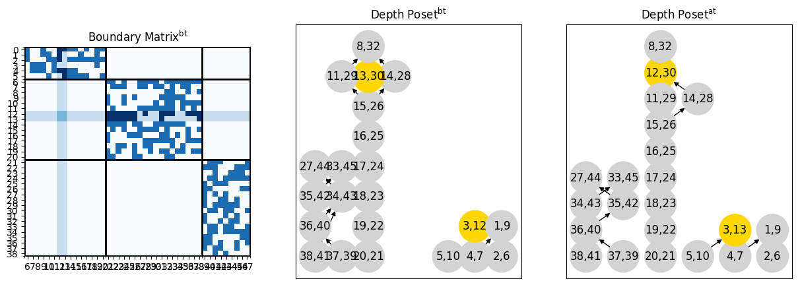

### Birth Death Pairs
|                          |                                                                                                                                                                                                                         |
|:-------------------------|:------------------------------------------------------------------------------------------------------------------------------------------------------------------------------------------------------------------------|
| Before the transposition | $\{(13, 30), (18, 23), (33, 45), (35, 42), (38, 41), (5, 10), (14, 28), (17, 24), (1, 9), (34, 43), (36, 40), (37, 39), (11, 29), (15, 26), (16, 25), (3, 12), (8, 32), (4, 7), (20, 21), (2, 6), (19, 22), (27, 44)\}$ |
| After the transposition  | $\{(18, 23), (33, 45), (35, 42), (38, 41), (5, 10), (3, 13), (14, 28), (17, 24), (1, 9), (34, 43), (36, 40), (37, 39), (11, 29), (15, 26), (16, 25), (12, 30), (8, 32), (4, 7), (20, 21), (2, 6), (19, 22), (27, 44)\}$ |

### Relations
|                          | Algorithm 1                                                                                                                                                                                                                                                                                                                                                                                                       | Algorithm 2                                                                                                                                                                                                                                                                                                                                                                                      |
|:-------------------------|:------------------------------------------------------------------------------------------------------------------------------------------------------------------------------------------------------------------------------------------------------------------------------------------------------------------------------------------------------------------------------------------------------------------|:-------------------------------------------------------------------------------------------------------------------------------------------------------------------------------------------------------------------------------------------------------------------------------------------------------------------------------------------------------------------------------------------------|
| Before the transposition | $\{(24, 30), (25, 29), (42, 45), (41, 43), (26, 30), (43, 46), (21, 22), (22, 23), (29, 32), (23, 28), (39, 42), (22, 29), (40, 47), (39, 45), (45, 46), (25, 28), (24, 29), (26, 32), (26, 29), (43, 45), (23, 24), (40, 43), (22, 31), (30, 32), (28, 32), (7, 9), (7, 12), (43, 44), (42, 46), (25, 30), (26, 31), (44, 46), (21, 26), (23, 26), (21, 32), (23, 29), (39, 43), (30, 31), (25, 26)\}$           | $\{(18, 17), (35, 27), (20, 14), (4, 3), (20, 17), (1, 0), (37, 27), (19, 15), (37, 36), (36, 34), (15, 11), (15, 14), (16, 13), (18, 16), (20, 13), (18, 13), (20, 16), (38, 31), (5, 0), (20, 19), (17, 11), (19, 11), (34, 27), (34, 33), (2, 1), (19, 17), (37, 35), (36, 33), (33, 31), (18, 15), (35, 31), (17, 16), (2, 0), (19, 16), (37, 31), (36, 35), (18, 11), (18, 14)\}$           |
| After the transposition  | $\{(24, 30), (25, 29), (42, 45), (41, 43), (26, 30), (43, 46), (21, 22), (22, 23), (29, 32), (23, 28), (39, 42), (40, 47), (22, 29), (39, 45), (45, 46), (25, 28), (7, 13), (24, 29), (26, 32), (26, 29), (43, 45), (23, 24), (40, 43), (22, 31), (30, 32), (28, 32), (7, 9), (43, 44), (42, 46), (25, 30), (26, 31), (44, 46), (21, 26), (23, 26), (21, 32), (23, 29), (39, 43), (10, 13), (30, 31), (25, 26)\}$ | $\{(18, 17), (35, 27), (20, 14), (4, 3), (20, 17), (1, 0), (37, 27), (19, 15), (37, 36), (36, 34), (15, 11), (15, 14), (18, 16), (20, 16), (38, 31), (5, 0), (20, 19), (14, 12), (17, 11), (19, 11), (34, 27), (34, 33), (2, 1), (19, 17), (37, 35), (36, 33), (16, 12), (18, 12), (33, 31), (18, 15), (35, 31), (20, 12), (17, 16), (2, 0), (19, 16), (37, 31), (36, 35), (18, 11), (18, 14)\}$ |

### Successors and Predecessers
|                 | $\text{Set}^\text{bt}(3, 12)$                 | $\text{Set}^\text{bt}(13, 30)$                                       | $\text{Set}^\text{at}(3, 13)$                          | $\text{Set}^\text{at}(12, 30)$                                                 |
|:----------------|:----------------------------------------------|:---------------------------------------------------------------------|:-------------------------------------------------------|:-------------------------------------------------------------------------------|
| $\text{Succ}_1$ | $\text{Succ}_1^\text{bt}(3, 12) = \emptyset$  | $\text{Succ}_1^\text{bt}(13, 30) = \{(8, 32)\}$                      | $\text{Succ}_1^\text{at}(3, 13) = \emptyset$           | $\text{Succ}_1^\text{at}(12, 30) = \{(8, 32)\}$                                |
| $\text{Pred}_1$ | $\text{Pred}_1^\text{bt}(3, 12) = \{(4, 7)\}$ | $\text{Pred}_1^\text{bt}(13, 30) = \{(16, 25), (17, 24), (15, 26)\}$ | $\text{Pred}_1^\text{at}(3, 13) = \{(5, 10), (4, 7)\}$ | $\text{Pred}_1^\text{at}(12, 30) = \{(16, 25), (17, 24), (15, 26)\}$           |
| $\text{Succ}_2$ | $\text{Succ}_2^\text{bt}(3, 12) = \emptyset$  | $\text{Succ}_2^\text{bt}(13, 30) = \emptyset$                        | $\text{Succ}_2^\text{at}(3, 13) = \emptyset$           | $\text{Succ}_2^\text{at}(12, 30) = \emptyset$                                  |
| $\text{Pred}_2$ | $\text{Pred}_2^\text{bt}(3, 12) = \{(4, 7)\}$ | $\text{Pred}_2^\text{bt}(13, 30) = \{(16, 25), (18, 23), (20, 21)\}$ | $\text{Pred}_2^\text{at}(3, 13) = \{(4, 7)\}$          | $\text{Pred}_2^\text{at}(12, 30) = \{(16, 25), (20, 21), (18, 23), (14, 28)\}$ |

### Temp Sets
|                                                              | Before the Transposition                                                   | After the Transposition                                                    |
|:-------------------------------------------------------------|:---------------------------------------------------------------------------|:---------------------------------------------------------------------------|
| $A_1 = \{(s, t)\in \text{BD}:\; f(a) < f(s) < f(t) < f(x)\}$ | $\{(5, 10), (4, 7)\}$                                                      | $\{(5, 10), (4, 7)\}$                                                      |
| $B_1 = \{(s, t)\in \text{BD}:\; U_1[t, x] = 1\}$             | $\emptyset$                                                                | $\{(5, 10), (4, 7)\}$                                                      |
| $A_2 = \{(s, t)\in \text{BD}:\; f(b) < f(s) < f(t) < f(y)\}$ | $\{(18, 23), (15, 26), (16, 25), (19, 22), (14, 28), (17, 24), (20, 21)\}$ | $\{(18, 23), (15, 26), (16, 25), (19, 22), (14, 28), (17, 24), (20, 21)\}$ |
| $B_2 = \{(s, t)\in \text{BD}:\; U_2[b, s] = 1\}$             | $\emptyset$                                                                | $\{(16, 25), (20, 21), (18, 23), (14, 28)\}$                               |

### Equations
There are 4 equations are wrong.

| eq    | left (formula)                  | left (paramatrized)               | left (value)                                 | right (formula)                                      | right (paramatrized)                                  | right (value)                                | correct   |
|:------|:--------------------------------|:----------------------------------|:---------------------------------------------|:-----------------------------------------------------|:------------------------------------------------------|:---------------------------------------------|:----------|
| Eq48  | $\text{Succ}_1^\text{at}(a, x)$ | $\text{Succ}_1^\text{at}(3, 13)$  | $\emptyset$                                  | $\text{Succ}_1^\text{bt}(a, b)$                      | $\text{Succ}_1^\text{bt}(3, 12)$                      | $\emptyset$                                  | ✔         |
| Eq49  | $\text{Succ}_1^\text{at}(b, y)$ | $\text{Succ}_1^\text{at}(12, 30)$ | $\{(8, 32)\}$                                | $\text{Succ}_1^\text{bt}(x, y)$                      | $\text{Succ}_1^\text{bt}(13, 30)$                     | $\{(8, 32)\}$                                | ✔         |
| Eq50  | $\text{Pred}_1^\text{at}(a, x)$ | $\text{Pred}_1^\text{at}(3, 13)$  | $\{(5, 10), (4, 7)\}$                        | $\{(s, t)\in \text{BD}:\; U_1^\text{bt}[t, x] = 1\}$ | $\{(s, t)\in \text{BD}:\; U_1^\text{bt}[t, 13] = 1\}$ | $\emptyset$                                  | ✘         |
| Eq50a | $\text{Pred}_1^\text{at}(a, x)$ | $\text{Pred}_1^\text{at}(3, 13)$  | $\{(5, 10), (4, 7)\}$                        | $A_1^\text{bt} \cap B_1^\text{bt}$                   | $A_1^\text{bt} \cap B_1^\text{bt}$                    | $\emptyset$                                  | ✘         |
| Eq50b | $\text{Pred}_1^\text{at}(a, x)$ | $\text{Pred}_1^\text{at}(3, 13)$  | $\{(5, 10), (4, 7)\}$                        | $A_1^\text{bt} \cap B_1^\text{at}$                   | $A_1^\text{bt} \cap B_1^\text{at}$                    | $\{(5, 10), (4, 7)\}$                        | ✔         |
| Eq51  | $\text{Pred}_1^\text{at}(b, y)$ | $\text{Pred}_1^\text{at}(12, 30)$ | $\{(16, 25), (17, 24), (15, 26)\}$           | $\text{Pred}_1^\text{bt}(x, y)$                      | $\text{Pred}_1^\text{bt}(13, 30)$                     | $\{(16, 25), (17, 24), (15, 26)\}$           | ✔         |
| Eq52  | $\text{Succ}_2^\text{at}(a, x)$ | $\text{Succ}_2^\text{at}(3, 13)$  | $\emptyset$                                  | $\text{Succ}_2^\text{bt}(a, b)$                      | $\text{Succ}_2^\text{bt}(3, 12)$                      | $\emptyset$                                  | ✔         |
| Eq53  | $\text{Succ}_2^\text{at}(b, y)$ | $\text{Succ}_2^\text{at}(12, 30)$ | $\emptyset$                                  | $\text{Succ}_2^\text{bt}(x, y)$                      | $\text{Succ}_2^\text{bt}(13, 30)$                     | $\emptyset$                                  | ✔         |
| Eq54  | $\text{Pred}_2^\text{at}(a, x)$ | $\text{Pred}_2^\text{at}(3, 13)$  | $\{(4, 7)\}$                                 | $\text{Pred}_2^\text{bt}(a, b)$                      | $\text{Pred}_2^\text{bt}(3, 12)$                      | $\{(4, 7)\}$                                 | ✔         |
| Eq55  | $\text{Pred}_2^\text{at}(b, y)$ | $\text{Pred}_2^\text{at}(12, 30)$ | $\{(16, 25), (20, 21), (18, 23), (14, 28)\}$ | $\{(s, t)\in \text{BD}:\; U_2^\text{bt}[b, s] = 1\}$ | $\{(s, t)\in \text{BD}:\; U_2^\text{bt}[12, s] = 1\}$ | $\emptyset$                                  | ✘         |
| Eq55a | $\text{Pred}_2^\text{at}(b, y)$ | $\text{Pred}_2^\text{at}(12, 30)$ | $\{(16, 25), (20, 21), (18, 23), (14, 28)\}$ | $A_2^\text{bt} \cap B_2^\text{bt}$                   | $A_2^\text{bt} \cap B_2^\text{bt}$                    | $\emptyset$                                  | ✘         |
| Eq55b | $\text{Pred}_2^\text{at}(b, y)$ | $\text{Pred}_2^\text{at}(12, 30)$ | $\{(16, 25), (20, 21), (18, 23), (14, 28)\}$ | $A_2^\text{bt} \cap B_2^\text{at}$                   | $A_2^\text{bt} \cap B_2^\text{at}$                    | $\{(14, 28), (16, 25), (18, 23), (20, 21)\}$ | ✔         |

## Transposition <14, 15> in complex 6
Here is a __birth-birth__ __switch forward__ transposition <14, 15>.

$$
a = 14, \; b = 28, \; x = 15, \; y = 26
$$

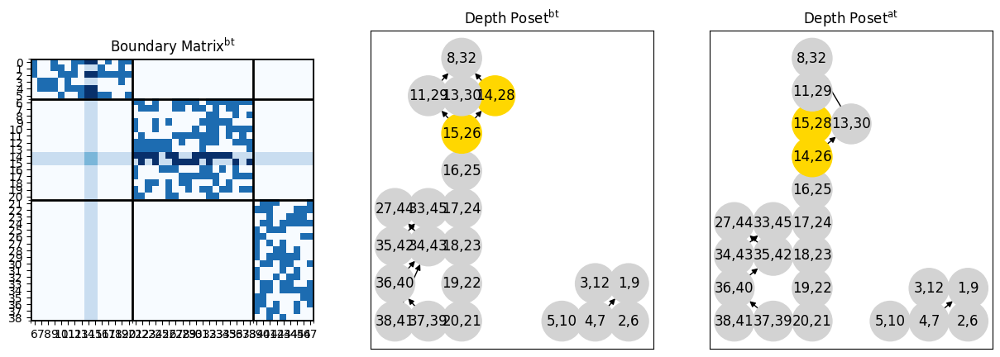

### Birth Death Pairs
|                          |                                                                                                                                                                                                                         |
|:-------------------------|:------------------------------------------------------------------------------------------------------------------------------------------------------------------------------------------------------------------------|
| Before the transposition | $\{(13, 30), (18, 23), (33, 45), (35, 42), (38, 41), (5, 10), (14, 28), (17, 24), (1, 9), (34, 43), (36, 40), (37, 39), (11, 29), (15, 26), (16, 25), (3, 12), (8, 32), (4, 7), (20, 21), (2, 6), (19, 22), (27, 44)\}$ |
| After the transposition  | $\{(13, 30), (18, 23), (33, 45), (35, 42), (38, 41), (5, 10), (17, 24), (1, 9), (34, 43), (36, 40), (37, 39), (11, 29), (16, 25), (3, 12), (8, 32), (15, 28), (4, 7), (20, 21), (14, 26), (2, 6), (19, 22), (27, 44)\}$ |

### Relations
|                          | Algorithm 1                                                                                                                                                                                                                                                                                                                                                                                             | Algorithm 2                                                                                                                                                                                                                                                                                                                                                                                      |
|:-------------------------|:--------------------------------------------------------------------------------------------------------------------------------------------------------------------------------------------------------------------------------------------------------------------------------------------------------------------------------------------------------------------------------------------------------|:-------------------------------------------------------------------------------------------------------------------------------------------------------------------------------------------------------------------------------------------------------------------------------------------------------------------------------------------------------------------------------------------------|
| Before the transposition | $\{(24, 30), (25, 29), (42, 45), (41, 43), (26, 30), (43, 46), (21, 22), (22, 23), (29, 32), (23, 28), (39, 42), (22, 29), (40, 47), (39, 45), (45, 46), (25, 28), (24, 29), (26, 32), (26, 29), (43, 45), (23, 24), (40, 43), (22, 31), (30, 32), (28, 32), (7, 9), (7, 12), (43, 44), (42, 46), (25, 30), (26, 31), (44, 46), (21, 26), (23, 26), (21, 32), (23, 29), (39, 43), (30, 31), (25, 26)\}$ | $\{(18, 17), (35, 27), (20, 14), (4, 3), (20, 17), (1, 0), (37, 27), (19, 15), (37, 36), (36, 34), (15, 11), (15, 14), (16, 13), (18, 16), (20, 13), (18, 13), (20, 16), (38, 31), (5, 0), (20, 19), (17, 11), (19, 11), (34, 27), (34, 33), (2, 1), (19, 17), (37, 35), (36, 33), (33, 31), (18, 15), (35, 31), (17, 16), (2, 0), (19, 16), (37, 31), (36, 35), (18, 11), (18, 14)\}$           |
| After the transposition  | $\{(24, 30), (25, 29), (42, 45), (41, 43), (26, 30), (43, 46), (21, 22), (22, 23), (29, 32), (23, 28), (39, 42), (40, 47), (22, 29), (39, 45), (45, 46), (25, 28), (24, 29), (26, 29), (43, 45), (23, 24), (40, 43), (22, 31), (30, 32), (28, 32), (7, 9), (7, 12), (26, 28), (43, 44), (42, 46), (25, 30), (26, 31), (44, 46), (21, 26), (23, 26), (21, 32), (23, 29), (39, 43), (30, 31), (25, 26)\}$ | $\{(18, 17), (35, 27), (20, 14), (4, 3), (20, 17), (1, 0), (37, 27), (19, 15), (37, 36), (36, 34), (15, 11), (16, 13), (18, 16), (20, 13), (18, 13), (20, 16), (38, 31), (5, 0), (20, 19), (17, 11), (14, 15), (19, 11), (34, 27), (34, 33), (2, 1), (19, 17), (37, 35), (36, 33), (33, 31), (18, 15), (35, 31), (14, 11), (17, 16), (2, 0), (19, 16), (37, 31), (36, 35), (18, 11), (18, 14)\}$ |

### Successors and Predecessers
|                 | $\text{Set}^\text{bt}(14, 28)$                                       | $\text{Set}^\text{bt}(15, 26)$                                       | $\text{Set}^\text{at}(14, 26)$                                       | $\text{Set}^\text{at}(15, 28)$                                       |
|:----------------|:---------------------------------------------------------------------|:---------------------------------------------------------------------|:---------------------------------------------------------------------|:---------------------------------------------------------------------|
| $\text{Succ}_1$ | $\text{Succ}_1^\text{bt}(14, 28) = \{(8, 32)\}$                      | $\text{Succ}_1^\text{bt}(15, 26) = \{(13, 30), (11, 29), (8, 32)\}$  | $\text{Succ}_1^\text{at}(14, 26) = \{(13, 30), (15, 28), (11, 29)\}$ | $\text{Succ}_1^\text{at}(15, 28) = \{(8, 32)\}$                      |
| $\text{Pred}_1$ | $\text{Pred}_1^\text{bt}(14, 28) = \{(16, 25), (18, 23)\}$           | $\text{Pred}_1^\text{bt}(15, 26) = \{(16, 25), (18, 23), (20, 21)\}$ | $\text{Pred}_1^\text{at}(14, 26) = \{(16, 25), (18, 23), (20, 21)\}$ | $\text{Pred}_1^\text{at}(15, 28) = \{(16, 25), (14, 26), (18, 23)\}$ |
| $\text{Succ}_2$ | $\text{Succ}_2^\text{bt}(14, 28) = \emptyset$                        | $\text{Succ}_2^\text{bt}(15, 26) = \{(11, 29), (14, 28)\}$           | $\text{Succ}_2^\text{at}(14, 26) = \{(11, 29), (15, 28)\}$           | $\text{Succ}_2^\text{at}(15, 28) = \{(11, 29)\}$                     |
| $\text{Pred}_2$ | $\text{Pred}_2^\text{bt}(14, 28) = \{(20, 21), (18, 23), (15, 26)\}$ | $\text{Pred}_2^\text{bt}(15, 26) = \{(18, 23), (19, 22)\}$           | $\text{Pred}_2^\text{at}(14, 26) = \{(18, 23), (20, 21)\}$           | $\text{Pred}_2^\text{at}(15, 28) = \{(18, 23), (14, 26), (19, 22)\}$ |

### Temp Sets
|                                                               | Before the Transposition                                                                         | After the Transposition                                                                          |
|:--------------------------------------------------------------|:-------------------------------------------------------------------------------------------------|:-------------------------------------------------------------------------------------------------|
| $\mathcal{L} = \{(s, t)\in \text{BD}:\; f(t) < f(y)\}$        | $\{(18, 23), (4, 7), (16, 25), (5, 10), (2, 6), (19, 22), (3, 12), (17, 24), (1, 9), (20, 21)\}$ | $\{(18, 23), (4, 7), (16, 25), (5, 10), (2, 6), (19, 22), (3, 12), (17, 24), (1, 9), (20, 21)\}$ |
| $\mathcal{M} = \{(s, t)\in \text{BD}:\; f(y) < f(t) < f(b)\}$ | $\emptyset$                                                                                      | $\emptyset$                                                                                      |

### Equations
There are 1 equations are wrong.

| eq   | left (formula)                  | left (paramatrized)               | left (value)                       | right (formula)                                                                                           | right (paramatrized)                                                                                            | right (value)                      | correct   |
|:-----|:--------------------------------|:----------------------------------|:-----------------------------------|:----------------------------------------------------------------------------------------------------------|:----------------------------------------------------------------------------------------------------------------|:-----------------------------------|:----------|
| Eq08 | $\text{Succ}_1^\text{at}(a, y)$ | $\text{Succ}_1^\text{at}(14, 26)$ | $\{(13, 30), (15, 28), (11, 29)\}$ | $\text{Succ}_1^\text{bt}(x, y) \oplus \{(x, b)\} \oplus \text{Succ}_1^\text{bt}(a, b)$                    | $\text{Succ}_1^\text{bt}(15, 26) \oplus \{(15, 28)\} \oplus \text{Succ}_1^\text{bt}(14, 28)$                    | $\{(13, 30), (15, 28), (11, 29)\}$ | ✔         |
| Eq09 | $\text{Succ}_1^\text{at}(x, b)$ | $\text{Succ}_1^\text{at}(15, 28)$ | $\{(8, 32)\}$                      | $\text{Succ}_1^\text{bt}(a, b)$                                                                           | $\text{Succ}_1^\text{bt}(14, 28)$                                                                               | $\{(8, 32)\}$                      | ✔         |
| Eq10 | $\text{Pred}_1^\text{at}(a, y)$ | $\text{Pred}_1^\text{at}(14, 26)$ | $\{(16, 25), (18, 23), (20, 21)\}$ | $\text{Pred}_1^\text{bt}(x, y)$                                                                           | $\text{Pred}_1^\text{bt}(15, 26)$                                                                               | $\{(16, 25), (18, 23), (20, 21)\}$ | ✔         |
| Eq11 | $\text{Pred}_1^\text{at}(x, b)$ | $\text{Pred}_1^\text{at}(15, 28)$ | $\{(16, 25), (14, 26), (18, 23)\}$ | $\text{Pred}_1^\text{bt}(a, b) \oplus \{(a, y)\}$                                                         | $\text{Pred}_1^\text{bt}(14, 28) \oplus \{(14, 26)\}$                                                           | $\{(16, 25), (14, 26), (18, 23)\}$ | ✔         |
| Eq12 | $\text{Succ}_2^\text{at}(a, y)$ | $\text{Succ}_2^\text{at}(14, 26)$ | $\{(11, 29), (15, 28)\}$           | $\text{Succ}_2^\text{bt}(x, y) \oplus \{(x, b), (a, b)\}$                                                 | $\text{Succ}_2^\text{bt}(15, 26) \oplus \{(15, 28), (14, 28)\}$                                                 | $\{(11, 29), (15, 28)\}$           | ✔         |
| Eq13 | $\text{Succ}_2^\text{at}(x, b)$ | $\text{Succ}_2^\text{at}(15, 28)$ | $\{(11, 29)\}$                     | $\text{Succ}_2^\text{bt}(a, b)$                                                                           | $\text{Succ}_2^\text{bt}(14, 28)$                                                                               | $\emptyset$                        | ✘         |
| Eq14 | $\text{Pred}_2^\text{at}(a, y)$ | $\text{Pred}_2^\text{at}(14, 26)$ | $\{(18, 23), (20, 21)\}$           | $[\text{Pred}_2^\text{bt}(a, b) \cap \mathcal{L}]$                                                        | $[\text{Pred}_2^\text{bt}(14, 28) \cap \mathcal{L}]$                                                            | $\{(18, 23), (20, 21)\}$           | ✔         |
| Eq15 | $\text{Pred}_2^\text{at}(x, b)$ | $\text{Pred}_2^\text{at}(15, 28)$ | $\{(18, 23), (14, 26), (19, 22)\}$ | $\text{Pred}_2^\text{bt}(x, y) \oplus \{(a, y)\} \oplus [\text{Pred}_2^\text{bt}(a, b) \cap \mathcal{M}]$ | $\text{Pred}_2^\text{bt}(15, 26) \oplus \{(14, 26)\} \oplus [\text{Pred}_2^\text{bt}(14, 28) \cap \mathcal{M}]$ | $\{(18, 23), (14, 26), (19, 22)\}$ | ✔         |

## Transposition <16, 17> in complex 6
Here is a __birth-birth__ __switch forward__ transposition <16, 17>.

$$
a = 16, \; b = 25, \; x = 17, \; y = 24
$$

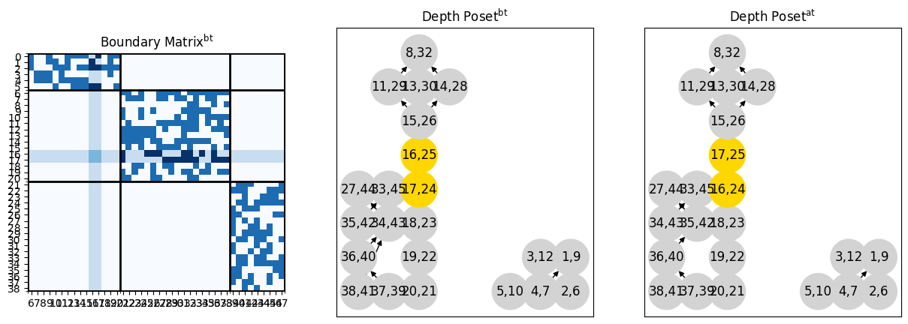

### Birth Death Pairs
|                          |                                                                                                                                                                                                                         |
|:-------------------------|:------------------------------------------------------------------------------------------------------------------------------------------------------------------------------------------------------------------------|
| Before the transposition | $\{(13, 30), (18, 23), (33, 45), (35, 42), (38, 41), (5, 10), (14, 28), (17, 24), (1, 9), (34, 43), (36, 40), (37, 39), (11, 29), (15, 26), (16, 25), (3, 12), (8, 32), (4, 7), (20, 21), (2, 6), (19, 22), (27, 44)\}$ |
| After the transposition  | $\{(13, 30), (18, 23), (33, 45), (35, 42), (38, 41), (5, 10), (14, 28), (1, 9), (34, 43), (36, 40), (37, 39), (11, 29), (15, 26), (3, 12), (8, 32), (16, 24), (4, 7), (20, 21), (17, 25), (19, 22), (2, 6), (27, 44)\}$ |

### Relations
|                          | Algorithm 1                                                                                                                                                                                                                                                                                                                                                                                                       | Algorithm 2                                                                                                                                                                                                                                                                                                                                                                                      |
|:-------------------------|:------------------------------------------------------------------------------------------------------------------------------------------------------------------------------------------------------------------------------------------------------------------------------------------------------------------------------------------------------------------------------------------------------------------|:-------------------------------------------------------------------------------------------------------------------------------------------------------------------------------------------------------------------------------------------------------------------------------------------------------------------------------------------------------------------------------------------------|
| Before the transposition | $\{(24, 30), (25, 29), (42, 45), (41, 43), (26, 30), (43, 46), (21, 22), (22, 23), (29, 32), (23, 28), (39, 42), (22, 29), (40, 47), (39, 45), (45, 46), (25, 28), (24, 29), (26, 32), (26, 29), (43, 45), (23, 24), (40, 43), (22, 31), (30, 32), (28, 32), (7, 9), (7, 12), (43, 44), (42, 46), (25, 30), (26, 31), (44, 46), (21, 26), (23, 26), (21, 32), (23, 29), (39, 43), (30, 31), (25, 26)\}$           | $\{(18, 17), (35, 27), (20, 14), (4, 3), (20, 17), (1, 0), (37, 27), (19, 15), (37, 36), (36, 34), (15, 11), (15, 14), (16, 13), (18, 16), (20, 13), (18, 13), (20, 16), (38, 31), (5, 0), (20, 19), (17, 11), (19, 11), (34, 27), (34, 33), (2, 1), (19, 17), (37, 35), (36, 33), (33, 31), (18, 15), (35, 31), (17, 16), (2, 0), (19, 16), (37, 31), (36, 35), (18, 11), (18, 14)\}$           |
| After the transposition  | $\{(25, 29), (42, 45), (41, 43), (26, 30), (43, 46), (21, 22), (22, 23), (29, 32), (23, 28), (39, 42), (40, 47), (22, 29), (39, 45), (45, 46), (25, 28), (24, 26), (26, 32), (26, 29), (43, 45), (23, 24), (40, 43), (22, 31), (30, 32), (28, 32), (7, 9), (24, 25), (7, 12), (24, 28), (43, 44), (42, 46), (25, 30), (26, 31), (44, 46), (21, 26), (23, 26), (21, 32), (23, 29), (39, 43), (30, 31), (25, 26)\}$ | $\{(35, 27), (18, 17), (20, 14), (4, 3), (20, 17), (1, 0), (37, 27), (19, 15), (37, 36), (36, 34), (15, 11), (15, 14), (18, 16), (20, 13), (18, 13), (20, 16), (38, 31), (5, 0), (20, 19), (17, 11), (19, 11), (34, 27), (34, 33), (2, 1), (37, 35), (36, 33), (19, 17), (33, 31), (18, 15), (35, 31), (17, 13), (2, 0), (19, 16), (37, 31), (36, 35), (18, 11), (16, 11), (16, 17), (18, 14)\}$ |

### Successors and Predecessers
|                 | $\text{Set}^\text{bt}(16, 25)$                                                 | $\text{Set}^\text{bt}(17, 24)$                                       | $\text{Set}^\text{at}(16, 24)$                                       | $\text{Set}^\text{at}(17, 25)$                                                 |
|:----------------|:-------------------------------------------------------------------------------|:---------------------------------------------------------------------|:---------------------------------------------------------------------|:-------------------------------------------------------------------------------|
| $\text{Succ}_1$ | $\text{Succ}_1^\text{bt}(16, 25) = \{(11, 29), (15, 26), (13, 30), (14, 28)\}$ | $\text{Succ}_1^\text{bt}(17, 24) = \{(13, 30), (11, 29)\}$           | $\text{Succ}_1^\text{at}(16, 24) = \{(15, 26), (17, 25), (14, 28)\}$ | $\text{Succ}_1^\text{at}(17, 25) = \{(11, 29), (15, 26), (13, 30), (14, 28)\}$ |
| $\text{Pred}_1$ | $\text{Pred}_1^\text{bt}(16, 25) = \emptyset$                                  | $\text{Pred}_1^\text{bt}(17, 24) = \{(18, 23)\}$                     | $\text{Pred}_1^\text{at}(16, 24) = \{(18, 23)\}$                     | $\text{Pred}_1^\text{at}(17, 25) = \{(16, 24)\}$                               |
| $\text{Succ}_2$ | $\text{Succ}_2^\text{bt}(16, 25) = \{(13, 30)\}$                               | $\text{Succ}_2^\text{bt}(17, 24) = \{(11, 29), (16, 25)\}$           | $\text{Succ}_2^\text{at}(16, 24) = \{(11, 29), (17, 25)\}$           | $\text{Succ}_2^\text{at}(17, 25) = \{(13, 30), (11, 29)\}$                     |
| $\text{Pred}_2$ | $\text{Pred}_2^\text{bt}(16, 25) = \{(17, 24), (18, 23), (19, 22), (20, 21)\}$ | $\text{Pred}_2^\text{bt}(17, 24) = \{(18, 23), (19, 22), (20, 21)\}$ | $\text{Pred}_2^\text{at}(16, 24) = \{(18, 23), (19, 22), (20, 21)\}$ | $\text{Pred}_2^\text{at}(17, 25) = \{(16, 24), (18, 23), (19, 22), (20, 21)\}$ |

### Temp Sets
|                                                               | Before the Transposition                                                     | After the Transposition                                                      |
|:--------------------------------------------------------------|:-----------------------------------------------------------------------------|:-----------------------------------------------------------------------------|
| $\mathcal{L} = \{(s, t)\in \text{BD}:\; f(t) < f(y)\}$        | $\{(18, 23), (4, 7), (5, 10), (2, 6), (19, 22), (3, 12), (1, 9), (20, 21)\}$ | $\{(18, 23), (4, 7), (5, 10), (2, 6), (19, 22), (3, 12), (1, 9), (20, 21)\}$ |
| $\mathcal{M} = \{(s, t)\in \text{BD}:\; f(y) < f(t) < f(b)\}$ | $\emptyset$                                                                  | $\emptyset$                                                                  |

### Equations
There are 1 equations are wrong.

| eq   | left (formula)                  | left (paramatrized)               | left (value)                                 | right (formula)                                                                                           | right (paramatrized)                                                                                            | right (value)                                | correct   |
|:-----|:--------------------------------|:----------------------------------|:---------------------------------------------|:----------------------------------------------------------------------------------------------------------|:----------------------------------------------------------------------------------------------------------------|:---------------------------------------------|:----------|
| Eq08 | $\text{Succ}_1^\text{at}(a, y)$ | $\text{Succ}_1^\text{at}(16, 24)$ | $\{(15, 26), (17, 25), (14, 28)\}$           | $\text{Succ}_1^\text{bt}(x, y) \oplus \{(x, b)\} \oplus \text{Succ}_1^\text{bt}(a, b)$                    | $\text{Succ}_1^\text{bt}(17, 24) \oplus \{(17, 25)\} \oplus \text{Succ}_1^\text{bt}(16, 25)$                    | $\{(15, 26), (17, 25), (14, 28)\}$           | ✔         |
| Eq09 | $\text{Succ}_1^\text{at}(x, b)$ | $\text{Succ}_1^\text{at}(17, 25)$ | $\{(11, 29), (15, 26), (13, 30), (14, 28)\}$ | $\text{Succ}_1^\text{bt}(a, b)$                                                                           | $\text{Succ}_1^\text{bt}(16, 25)$                                                                               | $\{(11, 29), (15, 26), (13, 30), (14, 28)\}$ | ✔         |
| Eq10 | $\text{Pred}_1^\text{at}(a, y)$ | $\text{Pred}_1^\text{at}(16, 24)$ | $\{(18, 23)\}$                               | $\text{Pred}_1^\text{bt}(x, y)$                                                                           | $\text{Pred}_1^\text{bt}(17, 24)$                                                                               | $\{(18, 23)\}$                               | ✔         |
| Eq11 | $\text{Pred}_1^\text{at}(x, b)$ | $\text{Pred}_1^\text{at}(17, 25)$ | $\{(16, 24)\}$                               | $\text{Pred}_1^\text{bt}(a, b) \oplus \{(a, y)\}$                                                         | $\text{Pred}_1^\text{bt}(16, 25) \oplus \{(16, 24)\}$                                                           | $\{(16, 24)\}$                               | ✔         |
| Eq12 | $\text{Succ}_2^\text{at}(a, y)$ | $\text{Succ}_2^\text{at}(16, 24)$ | $\{(11, 29), (17, 25)\}$                     | $\text{Succ}_2^\text{bt}(x, y) \oplus \{(x, b), (a, b)\}$                                                 | $\text{Succ}_2^\text{bt}(17, 24) \oplus \{(17, 25), (16, 25)\}$                                                 | $\{(11, 29), (17, 25)\}$                     | ✔         |
| Eq13 | $\text{Succ}_2^\text{at}(x, b)$ | $\text{Succ}_2^\text{at}(17, 25)$ | $\{(13, 30), (11, 29)\}$                     | $\text{Succ}_2^\text{bt}(a, b)$                                                                           | $\text{Succ}_2^\text{bt}(16, 25)$                                                                               | $\{(13, 30)\}$                               | ✘         |
| Eq14 | $\text{Pred}_2^\text{at}(a, y)$ | $\text{Pred}_2^\text{at}(16, 24)$ | $\{(18, 23), (19, 22), (20, 21)\}$           | $[\text{Pred}_2^\text{bt}(a, b) \cap \mathcal{L}]$                                                        | $[\text{Pred}_2^\text{bt}(16, 25) \cap \mathcal{L}]$                                                            | $\{(18, 23), (19, 22), (20, 21)\}$           | ✔         |
| Eq15 | $\text{Pred}_2^\text{at}(x, b)$ | $\text{Pred}_2^\text{at}(17, 25)$ | $\{(16, 24), (18, 23), (19, 22), (20, 21)\}$ | $\text{Pred}_2^\text{bt}(x, y) \oplus \{(a, y)\} \oplus [\text{Pred}_2^\text{bt}(a, b) \cap \mathcal{M}]$ | $\text{Pred}_2^\text{bt}(17, 24) \oplus \{(16, 24)\} \oplus [\text{Pred}_2^\text{bt}(16, 25) \cap \mathcal{M}]$ | $\{(16, 24), (18, 23), (19, 22), (20, 21)\}$ | ✔         |

## Transposition <22, 23> in complex 6
Here is a __death-death__ __switch forward__ transposition <22, 23>.

$$
a = 18, \; b = 23, \; x = 19, \; y = 22
$$

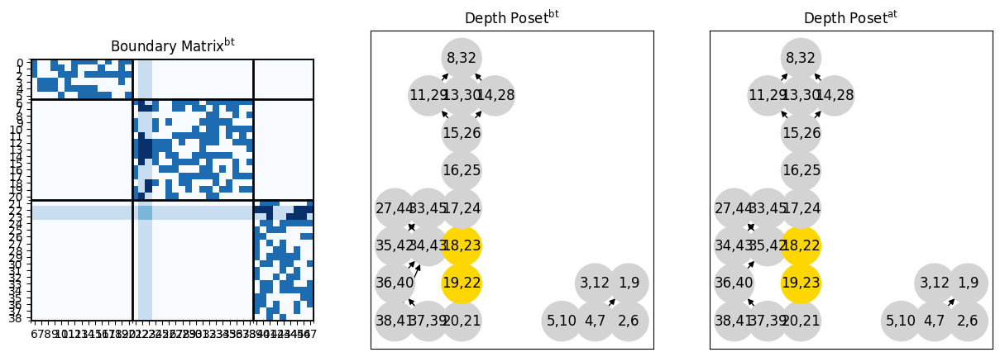

### Birth Death Pairs
|                          |                                                                                                                                                                                                                         |
|:-------------------------|:------------------------------------------------------------------------------------------------------------------------------------------------------------------------------------------------------------------------|
| Before the transposition | $\{(13, 30), (18, 23), (33, 45), (35, 42), (38, 41), (5, 10), (14, 28), (17, 24), (1, 9), (34, 43), (36, 40), (37, 39), (11, 29), (15, 26), (16, 25), (3, 12), (8, 32), (4, 7), (20, 21), (2, 6), (19, 22), (27, 44)\}$ |
| After the transposition  | $\{(13, 30), (33, 45), (35, 42), (38, 41), (5, 10), (14, 28), (17, 24), (1, 9), (34, 43), (36, 40), (37, 39), (11, 29), (15, 26), (16, 25), (18, 22), (3, 12), (19, 23), (8, 32), (4, 7), (20, 21), (2, 6), (27, 44)\}$ |

### Relations
|                          | Algorithm 1                                                                                                                                                                                                                                                                                                                                                                                             | Algorithm 2                                                                                                                                                                                                                                                                                                                                                                            |
|:-------------------------|:--------------------------------------------------------------------------------------------------------------------------------------------------------------------------------------------------------------------------------------------------------------------------------------------------------------------------------------------------------------------------------------------------------|:---------------------------------------------------------------------------------------------------------------------------------------------------------------------------------------------------------------------------------------------------------------------------------------------------------------------------------------------------------------------------------------|
| Before the transposition | $\{(24, 30), (25, 29), (42, 45), (41, 43), (26, 30), (43, 46), (21, 22), (22, 23), (29, 32), (23, 28), (39, 42), (22, 29), (40, 47), (39, 45), (45, 46), (25, 28), (24, 29), (26, 32), (26, 29), (43, 45), (23, 24), (40, 43), (22, 31), (30, 32), (28, 32), (7, 9), (7, 12), (43, 44), (42, 46), (25, 30), (26, 31), (44, 46), (21, 26), (23, 26), (21, 32), (23, 29), (39, 43), (30, 31), (25, 26)\}$ | $\{(18, 17), (35, 27), (20, 14), (4, 3), (20, 17), (1, 0), (37, 27), (19, 15), (37, 36), (36, 34), (15, 11), (15, 14), (16, 13), (18, 16), (20, 13), (18, 13), (20, 16), (38, 31), (5, 0), (20, 19), (17, 11), (19, 11), (34, 27), (34, 33), (2, 1), (19, 17), (37, 35), (36, 33), (33, 31), (18, 15), (35, 31), (17, 16), (2, 0), (19, 16), (37, 31), (36, 35), (18, 11), (18, 14)\}$ |
| After the transposition  | $\{(24, 30), (25, 29), (42, 45), (41, 43), (26, 30), (43, 46), (21, 22), (23, 22), (29, 32), (22, 26), (39, 42), (23, 31), (40, 47), (39, 45), (45, 46), (25, 28), (24, 29), (26, 32), (26, 29), (43, 45), (22, 28), (40, 43), (22, 31), (30, 32), (28, 32), (7, 9), (7, 12), (43, 44), (42, 46), (25, 30), (26, 31), (44, 46), (21, 26), (22, 24), (21, 32), (23, 29), (39, 43), (30, 31), (25, 26)\}$ | $\{(18, 17), (35, 27), (20, 14), (4, 3), (20, 17), (1, 0), (19, 18), (37, 27), (37, 36), (36, 34), (15, 11), (15, 14), (16, 13), (18, 16), (20, 13), (18, 13), (20, 16), (38, 31), (5, 0), (20, 19), (17, 11), (34, 27), (19, 14), (34, 33), (2, 1), (37, 35), (36, 33), (33, 31), (18, 15), (35, 31), (17, 16), (2, 0), (19, 13), (37, 31), (36, 35), (18, 11), (18, 14)\}$           |

### Successors and Predecessers
|                 | $\text{Set}^\text{bt}(18, 23)$                                                                     | $\text{Set}^\text{bt}(19, 22)$                                                 | $\text{Set}^\text{at}(19, 23)$                                       | $\text{Set}^\text{at}(18, 22)$                                                                     |
|:----------------|:---------------------------------------------------------------------------------------------------|:-------------------------------------------------------------------------------|:---------------------------------------------------------------------|:---------------------------------------------------------------------------------------------------|
| $\text{Succ}_1$ | $\text{Succ}_1^\text{bt}(18, 23) = \{(11, 29), (15, 26), (17, 24), (14, 28)\}$                     | $\text{Succ}_1^\text{bt}(19, 22) = \{(11, 29), (18, 23)\}$                     | $\text{Succ}_1^\text{at}(19, 23) = \{(11, 29), (18, 22)\}$           | $\text{Succ}_1^\text{at}(18, 22) = \{(15, 26), (17, 24), (14, 28)\}$                               |
| $\text{Pred}_1$ | $\text{Pred}_1^\text{bt}(18, 23) = \{(19, 22)\}$                                                   | $\text{Pred}_1^\text{bt}(19, 22) = \{(20, 21)\}$                               | $\text{Pred}_1^\text{at}(19, 23) = \emptyset$                        | $\text{Pred}_1^\text{at}(18, 22) = \{(20, 21), (19, 23)\}$                                         |
| $\text{Succ}_2$ | $\text{Succ}_2^\text{bt}(18, 23) = \{(13, 30), (11, 29), (15, 26), (16, 25), (14, 28), (17, 24)\}$ | $\text{Succ}_2^\text{bt}(19, 22) = \{(11, 29), (16, 25), (17, 24), (15, 26)\}$ | $\text{Succ}_2^\text{at}(19, 23) = \{(13, 30), (18, 22), (14, 28)\}$ | $\text{Succ}_2^\text{at}(18, 22) = \{(13, 30), (11, 29), (15, 26), (16, 25), (14, 28), (17, 24)\}$ |
| $\text{Pred}_2$ | $\text{Pred}_2^\text{bt}(18, 23) = \emptyset$                                                      | $\text{Pred}_2^\text{bt}(19, 22) = \{(20, 21)\}$                               | $\text{Pred}_2^\text{at}(19, 23) = \{(20, 21)\}$                     | $\text{Pred}_2^\text{at}(18, 22) = \{(19, 23)\}$                                                   |

### Temp Sets
|                                                               | Before the Transposition                                                             | After the Transposition                                                              |
|:--------------------------------------------------------------|:-------------------------------------------------------------------------------------|:-------------------------------------------------------------------------------------|
| $\mathcal{B} = \{(s, t)\in \text{BD}:\; f(s) > f(x)\}$        | $\{(34, 43), (36, 40), (37, 39), (33, 45), (35, 42), (38, 41), (27, 44), (20, 21)\}$ | $\{(34, 43), (36, 40), (37, 39), (33, 45), (35, 42), (38, 41), (27, 44), (20, 21)\}$ |
| $\mathcal{N} = \{(s, t)\in \text{BD}:\; f(x) > f(s) > f(a)\}$ | $\emptyset$                                                                          | $\emptyset$                                                                          |

### Equations
There are 1 equations are wrong.

| eq   | left (formula)                  | left (paramatrized)               | left (value)                                                     | right (formula)                                                                                          | right (paramatrized)                                                                                           | right (value)                                                    | correct   |
|:-----|:--------------------------------|:----------------------------------|:-----------------------------------------------------------------|:---------------------------------------------------------------------------------------------------------|:---------------------------------------------------------------------------------------------------------------|:-----------------------------------------------------------------|:----------|
| Eq28 | $\text{Succ}_1^\text{at}(x, b)$ | $\text{Succ}_1^\text{at}(19, 23)$ | $\{(11, 29), (18, 22)\}$                                         | $\text{Succ}_1^\text{bt}(x, y) \oplus \{(a, y), (a, b)\}$                                                | $\text{Succ}_1^\text{bt}(19, 22) \oplus \{(18, 22), (18, 23)\}$                                                | $\{(11, 29), (18, 22)\}$                                         | ✔         |
| Eq29 | $\text{Succ}_1^\text{at}(a, y)$ | $\text{Succ}_1^\text{at}(18, 22)$ | $\{(15, 26), (17, 24), (14, 28)\}$                               | $\text{Succ}_1^\text{bt}(a, b)$                                                                          | $\text{Succ}_1^\text{bt}(18, 23)$                                                                              | $\{(11, 29), (15, 26), (17, 24), (14, 28)\}$                     | ✘         |
| Eq30 | $\text{Pred}_1^\text{at}(x, b)$ | $\text{Pred}_1^\text{at}(19, 23)$ | $\emptyset$                                                      | $[\text{Pred}_1^\text{bt}(a, b) \cap \mathcal{B}]$                                                       | $[\text{Pred}_1^\text{bt}(18, 23) \cap \mathcal{B}]$                                                           | $\emptyset$                                                      | ✔         |
| Eq31 | $\text{Pred}_1^\text{at}(a, y)$ | $\text{Pred}_1^\text{at}(18, 22)$ | $\{(20, 21), (19, 23)\}$                                         | $\text{Pred}_1^\text{bt}(x, y) \oplus \{(x, b)\} \oplus[\text{Pred}_1^\text{bt}(a, b) \cap \mathcal{N}]$ | $\text{Pred}_1^\text{bt}(19, 22) \oplus \{(19, 23)\} \oplus[\text{Pred}_1^\text{bt}(18, 23) \cap \mathcal{N}]$ | $\{(20, 21), (19, 23)\}$                                         | ✔         |
| Eq32 | $\text{Succ}_2^\text{at}(x, b)$ | $\text{Succ}_2^\text{at}(19, 23)$ | $\{(13, 30), (18, 22), (14, 28)\}$                               | $\text{Succ}_2^\text{bt}(x, y) \oplus \{(a, y)\} \oplus \text{Succ}_2^\text{bt}(a, b)$                   | $\text{Succ}_2^\text{bt}(19, 22) \oplus \{(18, 22)\} \oplus \text{Succ}_2^\text{bt}(18, 23)$                   | $\{(13, 30), (18, 22), (14, 28)\}$                               | ✔         |
| Eq33 | $\text{Succ}_2^\text{at}(a, y)$ | $\text{Succ}_2^\text{at}(18, 22)$ | $\{(13, 30), (11, 29), (15, 26), (16, 25), (14, 28), (17, 24)\}$ | $\text{Succ}_2^\text{bt}(a, b)$                                                                          | $\text{Succ}_2^\text{bt}(18, 23)$                                                                              | $\{(13, 30), (11, 29), (15, 26), (16, 25), (14, 28), (17, 24)\}$ | ✔         |
| Eq34 | $\text{Pred}_2^\text{at}(x, b)$ | $\text{Pred}_2^\text{at}(19, 23)$ | $\{(20, 21)\}$                                                   | $\text{Pred}_2^\text{bt}(x, y)$                                                                          | $\text{Pred}_2^\text{bt}(19, 22)$                                                                              | $\{(20, 21)\}$                                                   | ✔         |
| Eq35 | $\text{Pred}_2^\text{at}(a, y)$ | $\text{Pred}_2^\text{at}(18, 22)$ | $\{(19, 23)\}$                                                   | $\text{Pred}_2^\text{bt}(a, b) \oplus \{(x, b)\}$                                                        | $\text{Pred}_2^\text{bt}(18, 23) \oplus \{(19, 23)\}$                                                          | $\{(19, 23)\}$                                                   | ✔         |

## Transposition <25, 26> in complex 6
Here is a __death-death__ __switch forward__ transposition <25, 26>.

$$
a = 15, \; b = 26, \; x = 16, \; y = 25
$$

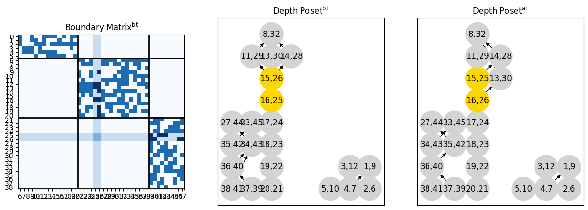

### Birth Death Pairs
|                          |                                                                                                                                                                                                                         |
|:-------------------------|:------------------------------------------------------------------------------------------------------------------------------------------------------------------------------------------------------------------------|
| Before the transposition | $\{(13, 30), (18, 23), (33, 45), (35, 42), (38, 41), (5, 10), (14, 28), (17, 24), (1, 9), (34, 43), (36, 40), (37, 39), (11, 29), (15, 26), (16, 25), (3, 12), (8, 32), (4, 7), (20, 21), (2, 6), (19, 22), (27, 44)\}$ |
| After the transposition  | $\{(13, 30), (16, 26), (18, 23), (33, 45), (35, 42), (38, 41), (5, 10), (14, 28), (17, 24), (1, 9), (34, 43), (36, 40), (37, 39), (11, 29), (3, 12), (8, 32), (15, 25), (4, 7), (20, 21), (2, 6), (19, 22), (27, 44)\}$ |

### Relations
|                          | Algorithm 1                                                                                                                                                                                                                                                                                                                                                                                             | Algorithm 2                                                                                                                                                                                                                                                                                                                                                                                                          |
|:-------------------------|:--------------------------------------------------------------------------------------------------------------------------------------------------------------------------------------------------------------------------------------------------------------------------------------------------------------------------------------------------------------------------------------------------------|:---------------------------------------------------------------------------------------------------------------------------------------------------------------------------------------------------------------------------------------------------------------------------------------------------------------------------------------------------------------------------------------------------------------------|
| Before the transposition | $\{(24, 30), (25, 29), (42, 45), (41, 43), (26, 30), (43, 46), (21, 22), (22, 23), (29, 32), (23, 28), (39, 42), (22, 29), (40, 47), (39, 45), (45, 46), (25, 28), (24, 29), (26, 32), (26, 29), (43, 45), (23, 24), (40, 43), (22, 31), (30, 32), (28, 32), (7, 9), (7, 12), (43, 44), (42, 46), (25, 30), (26, 31), (44, 46), (21, 26), (23, 26), (21, 32), (23, 29), (39, 43), (30, 31), (25, 26)\}$ | $\{(18, 17), (35, 27), (20, 14), (4, 3), (20, 17), (1, 0), (37, 27), (19, 15), (37, 36), (36, 34), (15, 11), (15, 14), (16, 13), (18, 16), (20, 13), (18, 13), (20, 16), (38, 31), (5, 0), (20, 19), (17, 11), (19, 11), (34, 27), (34, 33), (2, 1), (19, 17), (37, 35), (36, 33), (33, 31), (18, 15), (35, 31), (17, 16), (2, 0), (19, 16), (37, 31), (36, 35), (18, 11), (18, 14)\}$                               |
| After the transposition  | $\{(24, 30), (42, 45), (41, 43), (26, 30), (43, 46), (25, 32), (21, 22), (22, 23), (29, 32), (23, 28), (39, 42), (40, 47), (22, 29), (39, 45), (45, 46), (25, 28), (25, 31), (24, 29), (26, 29), (43, 45), (23, 24), (40, 43), (22, 31), (30, 32), (28, 32), (7, 9), (7, 12), (26, 25), (26, 28), (43, 44), (42, 46), (44, 46), (21, 26), (23, 26), (21, 32), (23, 29), (39, 43), (30, 31)\}$           | $\{(18, 17), (35, 27), (20, 14), (4, 3), (20, 17), (1, 0), (37, 27), (19, 15), (37, 36), (36, 34), (15, 11), (15, 14), (16, 13), (18, 16), (20, 13), (18, 13), (20, 16), (38, 31), (5, 0), (20, 19), (17, 11), (19, 11), (34, 27), (34, 33), (2, 1), (19, 17), (37, 35), (36, 33), (16, 15), (33, 31), (18, 15), (35, 31), (17, 16), (2, 0), (19, 16), (37, 31), (36, 35), (16, 14), (18, 11), (16, 11), (18, 14)\}$ |

### Successors and Predecessers
|                 | $\text{Set}^\text{bt}(15, 26)$                                       | $\text{Set}^\text{bt}(16, 25)$                                                 | $\text{Set}^\text{at}(16, 26)$                                                 | $\text{Set}^\text{at}(15, 25)$                                       |
|:----------------|:---------------------------------------------------------------------|:-------------------------------------------------------------------------------|:-------------------------------------------------------------------------------|:---------------------------------------------------------------------|
| $\text{Succ}_1$ | $\text{Succ}_1^\text{bt}(15, 26) = \{(13, 30), (11, 29), (8, 32)\}$  | $\text{Succ}_1^\text{bt}(16, 25) = \{(11, 29), (15, 26), (13, 30), (14, 28)\}$ | $\text{Succ}_1^\text{at}(16, 26) = \{(13, 30), (11, 29), (15, 25), (14, 28)\}$ | $\text{Succ}_1^\text{at}(15, 25) = \{(8, 32), (14, 28)\}$            |
| $\text{Pred}_1$ | $\text{Pred}_1^\text{bt}(15, 26) = \{(16, 25), (18, 23), (20, 21)\}$ | $\text{Pred}_1^\text{bt}(16, 25) = \emptyset$                                  | $\text{Pred}_1^\text{at}(16, 26) = \{(18, 23), (20, 21)\}$                     | $\text{Pred}_1^\text{at}(15, 25) = \{(16, 26)\}$                     |
| $\text{Succ}_2$ | $\text{Succ}_2^\text{bt}(15, 26) = \{(11, 29), (14, 28)\}$           | $\text{Succ}_2^\text{bt}(16, 25) = \{(13, 30)\}$                               | $\text{Succ}_2^\text{at}(16, 26) = \{(13, 30), (11, 29), (15, 25), (14, 28)\}$ | $\text{Succ}_2^\text{at}(15, 25) = \{(11, 29), (14, 28)\}$           |
| $\text{Pred}_2$ | $\text{Pred}_2^\text{bt}(15, 26) = \{(18, 23), (19, 22)\}$           | $\text{Pred}_2^\text{bt}(16, 25) = \{(17, 24), (18, 23), (19, 22), (20, 21)\}$ | $\text{Pred}_2^\text{at}(16, 26) = \{(17, 24), (18, 23), (19, 22), (20, 21)\}$ | $\text{Pred}_2^\text{at}(15, 25) = \{(16, 26), (18, 23), (19, 22)\}$ |

### Temp Sets
|                                                               | Before the Transposition                                                                                           | After the Transposition                                                                                            |
|:--------------------------------------------------------------|:-------------------------------------------------------------------------------------------------------------------|:-------------------------------------------------------------------------------------------------------------------|
| $\mathcal{B} = \{(s, t)\in \text{BD}:\; f(s) > f(x)\}$        | $\{(34, 43), (36, 40), (37, 39), (18, 23), (33, 45), (35, 42), (38, 41), (19, 22), (17, 24), (27, 44), (20, 21)\}$ | $\{(34, 43), (36, 40), (37, 39), (18, 23), (33, 45), (35, 42), (38, 41), (19, 22), (17, 24), (27, 44), (20, 21)\}$ |
| $\mathcal{N} = \{(s, t)\in \text{BD}:\; f(x) > f(s) > f(a)\}$ | $\emptyset$                                                                                                        | $\emptyset$                                                                                                        |

### Equations
There are 1 equations are wrong.

| eq   | left (formula)                  | left (paramatrized)               | left (value)                                 | right (formula)                                                                                          | right (paramatrized)                                                                                           | right (value)                                | correct   |
|:-----|:--------------------------------|:----------------------------------|:---------------------------------------------|:---------------------------------------------------------------------------------------------------------|:---------------------------------------------------------------------------------------------------------------|:---------------------------------------------|:----------|
| Eq28 | $\text{Succ}_1^\text{at}(x, b)$ | $\text{Succ}_1^\text{at}(16, 26)$ | $\{(13, 30), (11, 29), (15, 25), (14, 28)\}$ | $\text{Succ}_1^\text{bt}(x, y) \oplus \{(a, y), (a, b)\}$                                                | $\text{Succ}_1^\text{bt}(16, 25) \oplus \{(15, 25), (15, 26)\}$                                                | $\{(13, 30), (11, 29), (15, 25), (14, 28)\}$ | ✔         |
| Eq29 | $\text{Succ}_1^\text{at}(a, y)$ | $\text{Succ}_1^\text{at}(15, 25)$ | $\{(8, 32), (14, 28)\}$                      | $\text{Succ}_1^\text{bt}(a, b)$                                                                          | $\text{Succ}_1^\text{bt}(15, 26)$                                                                              | $\{(13, 30), (11, 29), (8, 32)\}$            | ✘         |
| Eq30 | $\text{Pred}_1^\text{at}(x, b)$ | $\text{Pred}_1^\text{at}(16, 26)$ | $\{(18, 23), (20, 21)\}$                     | $[\text{Pred}_1^\text{bt}(a, b) \cap \mathcal{B}]$                                                       | $[\text{Pred}_1^\text{bt}(15, 26) \cap \mathcal{B}]$                                                           | $\{(18, 23), (20, 21)\}$                     | ✔         |
| Eq31 | $\text{Pred}_1^\text{at}(a, y)$ | $\text{Pred}_1^\text{at}(15, 25)$ | $\{(16, 26)\}$                               | $\text{Pred}_1^\text{bt}(x, y) \oplus \{(x, b)\} \oplus[\text{Pred}_1^\text{bt}(a, b) \cap \mathcal{N}]$ | $\text{Pred}_1^\text{bt}(16, 25) \oplus \{(16, 26)\} \oplus[\text{Pred}_1^\text{bt}(15, 26) \cap \mathcal{N}]$ | $\{(16, 26)\}$                               | ✔         |
| Eq32 | $\text{Succ}_2^\text{at}(x, b)$ | $\text{Succ}_2^\text{at}(16, 26)$ | $\{(13, 30), (11, 29), (15, 25), (14, 28)\}$ | $\text{Succ}_2^\text{bt}(x, y) \oplus \{(a, y)\} \oplus \text{Succ}_2^\text{bt}(a, b)$                   | $\text{Succ}_2^\text{bt}(16, 25) \oplus \{(15, 25)\} \oplus \text{Succ}_2^\text{bt}(15, 26)$                   | $\{(11, 29), (13, 30), (15, 25), (14, 28)\}$ | ✔         |
| Eq33 | $\text{Succ}_2^\text{at}(a, y)$ | $\text{Succ}_2^\text{at}(15, 25)$ | $\{(11, 29), (14, 28)\}$                     | $\text{Succ}_2^\text{bt}(a, b)$                                                                          | $\text{Succ}_2^\text{bt}(15, 26)$                                                                              | $\{(11, 29), (14, 28)\}$                     | ✔         |
| Eq34 | $\text{Pred}_2^\text{at}(x, b)$ | $\text{Pred}_2^\text{at}(16, 26)$ | $\{(17, 24), (18, 23), (19, 22), (20, 21)\}$ | $\text{Pred}_2^\text{bt}(x, y)$                                                                          | $\text{Pred}_2^\text{bt}(16, 25)$                                                                              | $\{(17, 24), (18, 23), (19, 22), (20, 21)\}$ | ✔         |
| Eq35 | $\text{Pred}_2^\text{at}(a, y)$ | $\text{Pred}_2^\text{at}(15, 25)$ | $\{(16, 26), (18, 23), (19, 22)\}$           | $\text{Pred}_2^\text{bt}(a, b) \oplus \{(x, b)\}$                                                        | $\text{Pred}_2^\text{bt}(15, 26) \oplus \{(16, 26)\}$                                                          | $\{(16, 26), (18, 23), (19, 22)\}$           | ✔         |

## Transposition <29, 30> in complex 6
Here is a __death-death__ __no switch__ transposition <29, 30>.

$$
a = 13, \; b = 30, \; x = 11, \; y = 29
$$

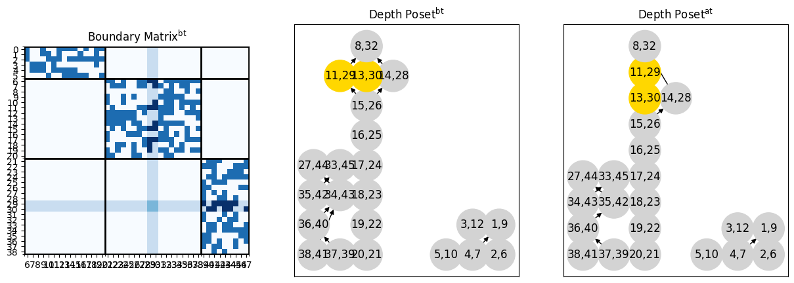

### Birth Death Pairs
|                          |                                                                                                                                                                                                                         |
|:-------------------------|:------------------------------------------------------------------------------------------------------------------------------------------------------------------------------------------------------------------------|
| Before the transposition | $\{(13, 30), (18, 23), (33, 45), (35, 42), (38, 41), (5, 10), (14, 28), (17, 24), (1, 9), (34, 43), (36, 40), (37, 39), (11, 29), (15, 26), (16, 25), (3, 12), (8, 32), (4, 7), (20, 21), (2, 6), (19, 22), (27, 44)\}$ |
| After the transposition  | $\{(13, 30), (18, 23), (33, 45), (35, 42), (38, 41), (5, 10), (14, 28), (17, 24), (1, 9), (34, 43), (36, 40), (37, 39), (11, 29), (15, 26), (16, 25), (3, 12), (8, 32), (4, 7), (20, 21), (2, 6), (19, 22), (27, 44)\}$ |

### Relations
|                          | Algorithm 1                                                                                                                                                                                                                                                                                                                                                                                             | Algorithm 2                                                                                                                                                                                                                                                                                                                                                                                      |
|:-------------------------|:--------------------------------------------------------------------------------------------------------------------------------------------------------------------------------------------------------------------------------------------------------------------------------------------------------------------------------------------------------------------------------------------------------|:-------------------------------------------------------------------------------------------------------------------------------------------------------------------------------------------------------------------------------------------------------------------------------------------------------------------------------------------------------------------------------------------------|
| Before the transposition | $\{(24, 30), (25, 29), (42, 45), (41, 43), (26, 30), (43, 46), (21, 22), (22, 23), (29, 32), (23, 28), (39, 42), (22, 29), (40, 47), (39, 45), (45, 46), (25, 28), (24, 29), (26, 32), (26, 29), (43, 45), (23, 24), (40, 43), (22, 31), (30, 32), (28, 32), (7, 9), (7, 12), (43, 44), (42, 46), (25, 30), (26, 31), (44, 46), (21, 26), (23, 26), (21, 32), (23, 29), (39, 43), (30, 31), (25, 26)\}$ | $\{(18, 17), (35, 27), (20, 14), (4, 3), (20, 17), (1, 0), (37, 27), (19, 15), (37, 36), (36, 34), (15, 11), (15, 14), (16, 13), (18, 16), (20, 13), (18, 13), (20, 16), (38, 31), (5, 0), (20, 19), (17, 11), (19, 11), (34, 27), (34, 33), (2, 1), (19, 17), (37, 35), (36, 33), (33, 31), (18, 15), (35, 31), (17, 16), (2, 0), (19, 16), (37, 31), (36, 35), (18, 11), (18, 14)\}$           |
| After the transposition  | $\{(24, 30), (25, 29), (42, 45), (41, 43), (26, 30), (43, 46), (21, 22), (22, 23), (29, 32), (23, 28), (39, 42), (40, 47), (39, 45), (22, 29), (45, 46), (25, 28), (24, 29), (26, 32), (26, 29), (43, 45), (23, 24), (40, 43), (22, 31), (30, 32), (28, 32), (7, 9), (7, 12), (25, 30), (43, 44), (42, 46), (26, 31), (44, 46), (21, 26), (23, 26), (21, 32), (23, 29), (39, 43), (30, 31), (25, 26)\}$ | $\{(18, 17), (35, 27), (20, 14), (4, 3), (20, 17), (1, 0), (37, 27), (19, 15), (13, 11), (37, 36), (36, 34), (15, 11), (15, 14), (16, 13), (18, 16), (20, 13), (18, 13), (20, 16), (38, 31), (5, 0), (20, 19), (17, 11), (19, 11), (34, 27), (34, 33), (2, 1), (19, 17), (37, 35), (36, 33), (33, 31), (18, 15), (35, 31), (17, 16), (2, 0), (19, 16), (37, 31), (36, 35), (18, 11), (18, 14)\}$ |

### Successors and Predecessers
No such node in the Depth Poset

### Temp Sets
|                                                               | Before the Transposition                                                                                                                                   | After the Transposition                                                                                                                                    |
|:--------------------------------------------------------------|:-----------------------------------------------------------------------------------------------------------------------------------------------------------|:-----------------------------------------------------------------------------------------------------------------------------------------------------------|
| $\mathcal{B} = \{(s, t)\in \text{BD}:\; f(s) > f(x)\}$        | $\{(34, 43), (36, 40), (13, 30), (37, 39), (18, 23), (33, 45), (35, 42), (15, 26), (38, 41), (16, 25), (19, 22), (14, 28), (17, 24), (27, 44), (20, 21)\}$ | $\{(34, 43), (36, 40), (13, 30), (37, 39), (18, 23), (33, 45), (35, 42), (15, 26), (38, 41), (16, 25), (19, 22), (14, 28), (17, 24), (27, 44), (20, 21)\}$ |
| $\mathcal{N} = \{(s, t)\in \text{BD}:\; f(x) > f(s) > f(a)\}$ | $\emptyset$                                                                                                                                                | $\emptyset$                                                                                                                                                |

### Equations
There are 2 equations are wrong.

| eq   | left (formula)                  | left (paramatrized)               | left (value)                       | right (formula)                                                                        | right (paramatrized)                                                                         | right (value)                                | correct   |
|:-----|:--------------------------------|:----------------------------------|:-----------------------------------|:---------------------------------------------------------------------------------------|:---------------------------------------------------------------------------------------------|:---------------------------------------------|:----------|
| Eq36 | $\text{Succ}_2^\text{at}(x, y)$ | $\text{Succ}_2^\text{at}(11, 29)$ | $\emptyset$                        | $\text{Succ}_2^\text{bt}(x, y) \oplus \{(a, b)\} \oplus \text{Succ}_2^\text{bt}(a, b)$ | $\text{Succ}_2^\text{bt}(11, 29) \oplus \{(13, 30)\} \oplus \text{Succ}_2^\text{bt}(13, 30)$ | $\{(13, 30)\}$                               | ✘         |
| Eq37 | $\text{Pred}_2^\text{at}(a, b)$ | $\text{Pred}_2^\text{at}(13, 30)$ | $\{(16, 25), (18, 23), (20, 21)\}$ | $\text{Pred}_2^\text{bt}(a, b) \oplus \{(x, y)\}$                                      | $\text{Pred}_2^\text{bt}(13, 30) \oplus \{(11, 29)\}$                                        | $\{(11, 29), (16, 25), (18, 23), (20, 21)\}$ | ✘         |

## Transposition <32, 33> in complex 6
Here is a __birth-death__ __switch forward__ transposition <32, 33>.

$$
a = 8, \; b = 32, \; x = 33, \; y = 45
$$

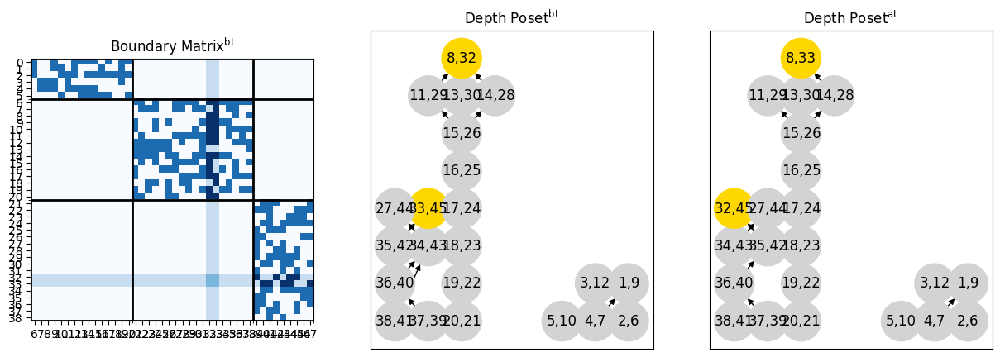

### Birth Death Pairs
|                          |                                                                                                                                                                                                                         |
|:-------------------------|:------------------------------------------------------------------------------------------------------------------------------------------------------------------------------------------------------------------------|
| Before the transposition | $\{(13, 30), (18, 23), (33, 45), (35, 42), (38, 41), (5, 10), (14, 28), (17, 24), (1, 9), (34, 43), (36, 40), (37, 39), (11, 29), (15, 26), (16, 25), (3, 12), (8, 32), (4, 7), (20, 21), (2, 6), (19, 22), (27, 44)\}$ |
| After the transposition  | $\{(13, 30), (18, 23), (35, 42), (38, 41), (5, 10), (14, 28), (17, 24), (1, 9), (34, 43), (36, 40), (37, 39), (8, 33), (11, 29), (15, 26), (16, 25), (32, 45), (3, 12), (4, 7), (20, 21), (2, 6), (19, 22), (27, 44)\}$ |

### Relations
|                          | Algorithm 1                                                                                                                                                                                                                                                                                                                                                                                                       | Algorithm 2                                                                                                                                                                                                                                                                                                                                                                                      |
|:-------------------------|:------------------------------------------------------------------------------------------------------------------------------------------------------------------------------------------------------------------------------------------------------------------------------------------------------------------------------------------------------------------------------------------------------------------|:-------------------------------------------------------------------------------------------------------------------------------------------------------------------------------------------------------------------------------------------------------------------------------------------------------------------------------------------------------------------------------------------------|
| Before the transposition | $\{(24, 30), (25, 29), (42, 45), (41, 43), (26, 30), (43, 46), (21, 22), (22, 23), (29, 32), (23, 28), (39, 42), (22, 29), (40, 47), (39, 45), (45, 46), (25, 28), (24, 29), (26, 32), (26, 29), (43, 45), (23, 24), (40, 43), (22, 31), (30, 32), (28, 32), (7, 9), (7, 12), (43, 44), (42, 46), (25, 30), (26, 31), (44, 46), (21, 26), (23, 26), (21, 32), (23, 29), (39, 43), (30, 31), (25, 26)\}$           | $\{(18, 17), (35, 27), (20, 14), (4, 3), (20, 17), (1, 0), (37, 27), (19, 15), (37, 36), (36, 34), (15, 11), (15, 14), (16, 13), (18, 16), (20, 13), (18, 13), (20, 16), (38, 31), (5, 0), (20, 19), (17, 11), (19, 11), (34, 27), (34, 33), (2, 1), (19, 17), (37, 35), (36, 33), (33, 31), (18, 15), (35, 31), (17, 16), (2, 0), (19, 16), (37, 31), (36, 35), (18, 11), (18, 14)\}$           |
| After the transposition  | $\{(24, 30), (25, 29), (42, 45), (41, 43), (26, 30), (43, 46), (21, 22), (22, 23), (23, 28), (39, 42), (40, 47), (39, 45), (22, 29), (28, 33), (45, 46), (30, 33), (25, 28), (24, 29), (26, 29), (43, 45), (23, 24), (21, 33), (40, 43), (22, 31), (23, 33), (7, 9), (7, 12), (25, 33), (43, 44), (42, 46), (25, 30), (26, 31), (44, 46), (21, 26), (23, 26), (23, 29), (22, 33), (39, 43), (30, 31), (25, 26)\}$ | $\{(32, 31), (18, 17), (35, 27), (20, 14), (4, 3), (20, 17), (38, 32), (1, 0), (37, 27), (19, 15), (37, 36), (36, 34), (15, 11), (15, 14), (16, 13), (18, 16), (20, 13), (18, 13), (20, 16), (38, 31), (5, 0), (20, 19), (17, 11), (19, 11), (34, 27), (2, 1), (19, 17), (37, 35), (37, 32), (18, 15), (35, 31), (17, 16), (2, 0), (19, 16), (34, 32), (37, 31), (36, 35), (18, 11), (18, 14)\}$ |

### Successors and Predecessers
|                 | $\text{Set}^\text{bt}(8, 32)$                                                           | $\text{Set}^\text{bt}(33, 45)$                                       | $\text{Set}^\text{at}(8, 33)$                                                                     | $\text{Set}^\text{at}(32, 45)$                                       |
|:----------------|:----------------------------------------------------------------------------------------|:---------------------------------------------------------------------|:--------------------------------------------------------------------------------------------------|:---------------------------------------------------------------------|
| $\text{Succ}_1$ | $\text{Succ}_1^\text{bt}(8, 32) = \emptyset$                                            | $\text{Succ}_1^\text{bt}(33, 45) = \emptyset$                        | $\text{Succ}_1^\text{at}(8, 33) = \emptyset$                                                      | $\text{Succ}_1^\text{at}(32, 45) = \emptyset$                        |
| $\text{Pred}_1$ | $\text{Pred}_1^\text{bt}(8, 32) = \{(13, 30), (11, 29), (15, 26), (14, 28), (20, 21)\}$ | $\text{Pred}_1^\text{bt}(33, 45) = \{(34, 43), (35, 42), (37, 39)\}$ | $\text{Pred}_1^\text{at}(8, 33) = \{(13, 30), (18, 23), (16, 25), (19, 22), (14, 28), (20, 21)\}$ | $\text{Pred}_1^\text{at}(32, 45) = \{(34, 43), (35, 42), (37, 39)\}$ |
| $\text{Succ}_2$ | $\text{Succ}_2^\text{bt}(8, 32) = \emptyset$                                            | $\text{Succ}_2^\text{bt}(33, 45) = \emptyset$                        | $\text{Succ}_2^\text{at}(8, 33) = \emptyset$                                                      | $\text{Succ}_2^\text{at}(32, 45) = \emptyset$                        |
| $\text{Pred}_2$ | $\text{Pred}_2^\text{bt}(8, 32) = \emptyset$                                            | $\text{Pred}_2^\text{bt}(33, 45) = \{(34, 43), (36, 40)\}$           | $\text{Pred}_2^\text{at}(8, 33) = \emptyset$                                                      | $\text{Pred}_2^\text{at}(32, 45) = \{(34, 43), (38, 41), (37, 39)\}$ |

### Temp Sets
|                                                              | Before the Transposition                                                                       | After the Transposition                                                                        |
|:-------------------------------------------------------------|:-----------------------------------------------------------------------------------------------|:-----------------------------------------------------------------------------------------------|
| $A_1 = \{(s, t)\in \text{BD}:\; f(a) < f(s) < f(t) < f(x)\}$ | $\{(13, 30), (18, 23), (11, 29), (15, 26), (16, 25), (19, 22), (14, 28), (17, 24), (20, 21)\}$ | $\{(13, 30), (18, 23), (11, 29), (15, 26), (16, 25), (19, 22), (14, 28), (17, 24), (20, 21)\}$ |
| $B_1 = \{(s, t)\in \text{BD}:\; U_1[t, x] = 1\}$             | $\emptyset$                                                                                    | $\{(13, 30), (18, 23), (16, 25), (19, 22), (14, 28), (20, 21)\}$                               |
| $A_2 = \{(s, t)\in \text{BD}:\; f(b) < f(s) < f(t) < f(y)\}$ | $\{(34, 43), (36, 40), (37, 39), (35, 42), (38, 41)\}$                                         | $\{(34, 43), (36, 40), (37, 39), (35, 42), (38, 41)\}$                                         |
| $B_2 = \{(s, t)\in \text{BD}:\; U_2[b, s] = 1\}$             | $\emptyset$                                                                                    | $\{(34, 43), (38, 41), (37, 39)\}$                                                             |

### Equations
There are 4 equations are wrong.

| eq    | left (formula)                  | left (paramatrized)               | left (value)                                                     | right (formula)                                      | right (paramatrized)                                  | right (value)                                                    | correct   |
|:------|:--------------------------------|:----------------------------------|:-----------------------------------------------------------------|:-----------------------------------------------------|:------------------------------------------------------|:-----------------------------------------------------------------|:----------|
| Eq48  | $\text{Succ}_1^\text{at}(a, x)$ | $\text{Succ}_1^\text{at}(8, 33)$  | $\emptyset$                                                      | $\text{Succ}_1^\text{bt}(a, b)$                      | $\text{Succ}_1^\text{bt}(8, 32)$                      | $\emptyset$                                                      | ✔         |
| Eq49  | $\text{Succ}_1^\text{at}(b, y)$ | $\text{Succ}_1^\text{at}(32, 45)$ | $\emptyset$                                                      | $\text{Succ}_1^\text{bt}(x, y)$                      | $\text{Succ}_1^\text{bt}(33, 45)$                     | $\emptyset$                                                      | ✔         |
| Eq50  | $\text{Pred}_1^\text{at}(a, x)$ | $\text{Pred}_1^\text{at}(8, 33)$  | $\{(13, 30), (18, 23), (16, 25), (19, 22), (14, 28), (20, 21)\}$ | $\{(s, t)\in \text{BD}:\; U_1^\text{bt}[t, x] = 1\}$ | $\{(s, t)\in \text{BD}:\; U_1^\text{bt}[t, 33] = 1\}$ | $\emptyset$                                                      | ✘         |
| Eq50a | $\text{Pred}_1^\text{at}(a, x)$ | $\text{Pred}_1^\text{at}(8, 33)$  | $\{(13, 30), (18, 23), (16, 25), (19, 22), (14, 28), (20, 21)\}$ | $A_1^\text{bt} \cap B_1^\text{bt}$                   | $A_1^\text{bt} \cap B_1^\text{bt}$                    | $\emptyset$                                                      | ✘         |
| Eq50b | $\text{Pred}_1^\text{at}(a, x)$ | $\text{Pred}_1^\text{at}(8, 33)$  | $\{(13, 30), (18, 23), (16, 25), (19, 22), (14, 28), (20, 21)\}$ | $A_1^\text{bt} \cap B_1^\text{at}$                   | $A_1^\text{bt} \cap B_1^\text{at}$                    | $\{(13, 30), (18, 23), (16, 25), (19, 22), (14, 28), (20, 21)\}$ | ✔         |
| Eq51  | $\text{Pred}_1^\text{at}(b, y)$ | $\text{Pred}_1^\text{at}(32, 45)$ | $\{(34, 43), (35, 42), (37, 39)\}$                               | $\text{Pred}_1^\text{bt}(x, y)$                      | $\text{Pred}_1^\text{bt}(33, 45)$                     | $\{(34, 43), (35, 42), (37, 39)\}$                               | ✔         |
| Eq52  | $\text{Succ}_2^\text{at}(a, x)$ | $\text{Succ}_2^\text{at}(8, 33)$  | $\emptyset$                                                      | $\text{Succ}_2^\text{bt}(a, b)$                      | $\text{Succ}_2^\text{bt}(8, 32)$                      | $\emptyset$                                                      | ✔         |
| Eq53  | $\text{Succ}_2^\text{at}(b, y)$ | $\text{Succ}_2^\text{at}(32, 45)$ | $\emptyset$                                                      | $\text{Succ}_2^\text{bt}(x, y)$                      | $\text{Succ}_2^\text{bt}(33, 45)$                     | $\emptyset$                                                      | ✔         |
| Eq54  | $\text{Pred}_2^\text{at}(a, x)$ | $\text{Pred}_2^\text{at}(8, 33)$  | $\emptyset$                                                      | $\text{Pred}_2^\text{bt}(a, b)$                      | $\text{Pred}_2^\text{bt}(8, 32)$                      | $\emptyset$                                                      | ✔         |
| Eq55  | $\text{Pred}_2^\text{at}(b, y)$ | $\text{Pred}_2^\text{at}(32, 45)$ | $\{(34, 43), (38, 41), (37, 39)\}$                               | $\{(s, t)\in \text{BD}:\; U_2^\text{bt}[b, s] = 1\}$ | $\{(s, t)\in \text{BD}:\; U_2^\text{bt}[32, s] = 1\}$ | $\emptyset$                                                      | ✘         |
| Eq55a | $\text{Pred}_2^\text{at}(b, y)$ | $\text{Pred}_2^\text{at}(32, 45)$ | $\{(34, 43), (38, 41), (37, 39)\}$                               | $A_2^\text{bt} \cap B_2^\text{bt}$                   | $A_2^\text{bt} \cap B_2^\text{bt}$                    | $\emptyset$                                                      | ✘         |
| Eq55b | $\text{Pred}_2^\text{at}(b, y)$ | $\text{Pred}_2^\text{at}(32, 45)$ | $\{(34, 43), (38, 41), (37, 39)\}$                               | $A_2^\text{bt} \cap B_2^\text{at}$                   | $A_2^\text{bt} \cap B_2^\text{at}$                    | $\{(34, 43), (38, 41), (37, 39)\}$                               | ✔         |

## Transposition <35, 36> in complex 6
Here is a __birth-birth__ __switch forward__ transposition <35, 36>.

$$
a = 35, \; b = 42, \; x = 36, \; y = 40
$$

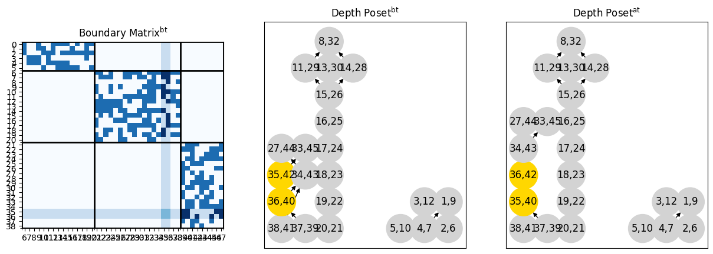

### Birth Death Pairs
|                          |                                                                                                                                                                                                                         |
|:-------------------------|:------------------------------------------------------------------------------------------------------------------------------------------------------------------------------------------------------------------------|
| Before the transposition | $\{(13, 30), (18, 23), (33, 45), (35, 42), (38, 41), (5, 10), (14, 28), (17, 24), (1, 9), (34, 43), (36, 40), (37, 39), (11, 29), (15, 26), (16, 25), (3, 12), (8, 32), (4, 7), (20, 21), (2, 6), (19, 22), (27, 44)\}$ |
| After the transposition  | $\{(13, 30), (18, 23), (33, 45), (38, 41), (5, 10), (14, 28), (17, 24), (1, 9), (34, 43), (37, 39), (11, 29), (15, 26), (16, 25), (3, 12), (36, 42), (8, 32), (4, 7), (35, 40), (20, 21), (2, 6), (19, 22), (27, 44)\}$ |

### Relations
|                          | Algorithm 1                                                                                                                                                                                                                                                                                                                                                                                                                           | Algorithm 2                                                                                                                                                                                                                                                                                                                                                                                                |
|:-------------------------|:--------------------------------------------------------------------------------------------------------------------------------------------------------------------------------------------------------------------------------------------------------------------------------------------------------------------------------------------------------------------------------------------------------------------------------------|:-----------------------------------------------------------------------------------------------------------------------------------------------------------------------------------------------------------------------------------------------------------------------------------------------------------------------------------------------------------------------------------------------------------|
| Before the transposition | $\{(24, 30), (25, 29), (42, 45), (41, 43), (26, 30), (43, 46), (21, 22), (22, 23), (29, 32), (23, 28), (39, 42), (22, 29), (40, 47), (39, 45), (45, 46), (25, 28), (24, 29), (26, 32), (26, 29), (43, 45), (23, 24), (40, 43), (22, 31), (30, 32), (28, 32), (7, 9), (7, 12), (43, 44), (42, 46), (25, 30), (26, 31), (44, 46), (21, 26), (23, 26), (21, 32), (23, 29), (39, 43), (30, 31), (25, 26)\}$                               | $\{(18, 17), (35, 27), (20, 14), (4, 3), (20, 17), (1, 0), (37, 27), (19, 15), (37, 36), (36, 34), (15, 11), (15, 14), (16, 13), (18, 16), (20, 13), (18, 13), (20, 16), (38, 31), (5, 0), (20, 19), (17, 11), (19, 11), (34, 27), (34, 33), (2, 1), (19, 17), (37, 35), (36, 33), (33, 31), (18, 15), (35, 31), (17, 16), (2, 0), (19, 16), (37, 31), (36, 35), (18, 11), (18, 14)\}$                     |
| After the transposition  | $\{(24, 30), (25, 29), (42, 45), (41, 43), (26, 30), (43, 46), (21, 22), (22, 23), (29, 32), (23, 28), (39, 42), (22, 29), (39, 45), (40, 47), (45, 46), (25, 28), (24, 29), (26, 32), (26, 29), (43, 45), (23, 24), (40, 43), (22, 31), (40, 46), (30, 32), (28, 32), (7, 9), (7, 12), (43, 44), (42, 46), (25, 30), (26, 31), (44, 46), (21, 26), (23, 26), (40, 42), (21, 32), (23, 29), (40, 45), (39, 43), (30, 31), (25, 26)\}$ | $\{(18, 17), (35, 33), (20, 14), (4, 3), (35, 36), (20, 17), (1, 0), (37, 27), (19, 15), (36, 31), (37, 36), (36, 34), (15, 11), (15, 14), (16, 13), (18, 16), (20, 13), (18, 13), (20, 16), (38, 31), (5, 0), (20, 19), (17, 11), (19, 11), (34, 27), (34, 33), (2, 1), (36, 27), (36, 33), (37, 35), (19, 17), (33, 31), (18, 15), (35, 34), (17, 16), (2, 0), (19, 16), (37, 31), (18, 11), (18, 14)\}$ |

### Successors and Predecessers
|                 | $\text{Set}^\text{bt}(35, 42)$                             | $\text{Set}^\text{bt}(36, 40)$                                       | $\text{Set}^\text{at}(35, 40)$                                       | $\text{Set}^\text{at}(36, 42)$                                       |
|:----------------|:-----------------------------------------------------------|:---------------------------------------------------------------------|:---------------------------------------------------------------------|:---------------------------------------------------------------------|
| $\text{Succ}_1$ | $\text{Succ}_1^\text{bt}(35, 42) = \{(33, 45)\}$           | $\text{Succ}_1^\text{bt}(36, 40) = \{(34, 43)\}$                     | $\text{Succ}_1^\text{at}(35, 40) = \{(34, 43), (33, 45), (36, 42)\}$ | $\text{Succ}_1^\text{at}(36, 42) = \{(33, 45)\}$                     |
| $\text{Pred}_1$ | $\text{Pred}_1^\text{bt}(35, 42) = \{(37, 39)\}$           | $\text{Pred}_1^\text{bt}(36, 40) = \emptyset$                        | $\text{Pred}_1^\text{at}(35, 40) = \emptyset$                        | $\text{Pred}_1^\text{at}(36, 42) = \{(37, 39), (35, 40)\}$           |
| $\text{Succ}_2$ | $\text{Succ}_2^\text{bt}(35, 42) = \{(27, 44)\}$           | $\text{Succ}_2^\text{bt}(36, 40) = \{(34, 43), (35, 42), (33, 45)\}$ | $\text{Succ}_2^\text{at}(35, 40) = \{(34, 43), (33, 45), (36, 42)\}$ | $\text{Succ}_2^\text{at}(36, 42) = \{(34, 43), (33, 45), (27, 44)\}$ |
| $\text{Pred}_2$ | $\text{Pred}_2^\text{bt}(35, 42) = \{(36, 40), (37, 39)\}$ | $\text{Pred}_2^\text{bt}(36, 40) = \{(37, 39)\}$                     | $\text{Pred}_2^\text{at}(35, 40) = \{(37, 39)\}$                     | $\text{Pred}_2^\text{at}(36, 42) = \{(37, 39), (35, 40)\}$           |

### Temp Sets
|                                                               | Before the Transposition                                                                                                                                    | After the Transposition                                                                                                                                     |
|:--------------------------------------------------------------|:------------------------------------------------------------------------------------------------------------------------------------------------------------|:------------------------------------------------------------------------------------------------------------------------------------------------------------|
| $\mathcal{L} = \{(s, t)\in \text{BD}:\; f(t) < f(y)\}$        | $\{(13, 30), (37, 39), (18, 23), (11, 29), (15, 26), (4, 7), (16, 25), (5, 10), (8, 32), (2, 6), (19, 22), (14, 28), (3, 12), (17, 24), (1, 9), (20, 21)\}$ | $\{(13, 30), (37, 39), (18, 23), (11, 29), (15, 26), (4, 7), (16, 25), (5, 10), (8, 32), (2, 6), (19, 22), (14, 28), (3, 12), (17, 24), (1, 9), (20, 21)\}$ |
| $\mathcal{M} = \{(s, t)\in \text{BD}:\; f(y) < f(t) < f(b)\}$ | $\{(38, 41)\}$                                                                                                                                              | $\{(38, 41)\}$                                                                                                                                              |

### Equations
There are 1 equations are wrong.

| eq   | left (formula)                  | left (paramatrized)               | left (value)                       | right (formula)                                                                                           | right (paramatrized)                                                                                            | right (value)                      | correct   |
|:-----|:--------------------------------|:----------------------------------|:-----------------------------------|:----------------------------------------------------------------------------------------------------------|:----------------------------------------------------------------------------------------------------------------|:-----------------------------------|:----------|
| Eq08 | $\text{Succ}_1^\text{at}(a, y)$ | $\text{Succ}_1^\text{at}(35, 40)$ | $\{(34, 43), (33, 45), (36, 42)\}$ | $\text{Succ}_1^\text{bt}(x, y) \oplus \{(x, b)\} \oplus \text{Succ}_1^\text{bt}(a, b)$                    | $\text{Succ}_1^\text{bt}(36, 40) \oplus \{(36, 42)\} \oplus \text{Succ}_1^\text{bt}(35, 42)$                    | $\{(33, 45), (34, 43), (36, 42)\}$ | ✔         |
| Eq09 | $\text{Succ}_1^\text{at}(x, b)$ | $\text{Succ}_1^\text{at}(36, 42)$ | $\{(33, 45)\}$                     | $\text{Succ}_1^\text{bt}(a, b)$                                                                           | $\text{Succ}_1^\text{bt}(35, 42)$                                                                               | $\{(33, 45)\}$                     | ✔         |
| Eq10 | $\text{Pred}_1^\text{at}(a, y)$ | $\text{Pred}_1^\text{at}(35, 40)$ | $\emptyset$                        | $\text{Pred}_1^\text{bt}(x, y)$                                                                           | $\text{Pred}_1^\text{bt}(36, 40)$                                                                               | $\emptyset$                        | ✔         |
| Eq11 | $\text{Pred}_1^\text{at}(x, b)$ | $\text{Pred}_1^\text{at}(36, 42)$ | $\{(37, 39), (35, 40)\}$           | $\text{Pred}_1^\text{bt}(a, b) \oplus \{(a, y)\}$                                                         | $\text{Pred}_1^\text{bt}(35, 42) \oplus \{(35, 40)\}$                                                           | $\{(37, 39), (35, 40)\}$           | ✔         |
| Eq12 | $\text{Succ}_2^\text{at}(a, y)$ | $\text{Succ}_2^\text{at}(35, 40)$ | $\{(34, 43), (33, 45), (36, 42)\}$ | $\text{Succ}_2^\text{bt}(x, y) \oplus \{(x, b), (a, b)\}$                                                 | $\text{Succ}_2^\text{bt}(36, 40) \oplus \{(36, 42), (35, 42)\}$                                                 | $\{(34, 43), (33, 45), (36, 42)\}$ | ✔         |
| Eq13 | $\text{Succ}_2^\text{at}(x, b)$ | $\text{Succ}_2^\text{at}(36, 42)$ | $\{(34, 43), (33, 45), (27, 44)\}$ | $\text{Succ}_2^\text{bt}(a, b)$                                                                           | $\text{Succ}_2^\text{bt}(35, 42)$                                                                               | $\{(27, 44)\}$                     | ✘         |
| Eq14 | $\text{Pred}_2^\text{at}(a, y)$ | $\text{Pred}_2^\text{at}(35, 40)$ | $\{(37, 39)\}$                     | $[\text{Pred}_2^\text{bt}(a, b) \cap \mathcal{L}]$                                                        | $[\text{Pred}_2^\text{bt}(35, 42) \cap \mathcal{L}]$                                                            | $\{(37, 39)\}$                     | ✔         |
| Eq15 | $\text{Pred}_2^\text{at}(x, b)$ | $\text{Pred}_2^\text{at}(36, 42)$ | $\{(37, 39), (35, 40)\}$           | $\text{Pred}_2^\text{bt}(x, y) \oplus \{(a, y)\} \oplus [\text{Pred}_2^\text{bt}(a, b) \cap \mathcal{M}]$ | $\text{Pred}_2^\text{bt}(36, 40) \oplus \{(35, 40)\} \oplus [\text{Pred}_2^\text{bt}(35, 42) \cap \mathcal{M}]$ | $\{(37, 39), (35, 40)\}$           | ✔         |

## Transposition <36, 37> in complex 6
Here is a __birth-birth__ __switch forward__ transposition <36, 37>.

$$
a = 36, \; b = 40, \; x = 37, \; y = 39
$$

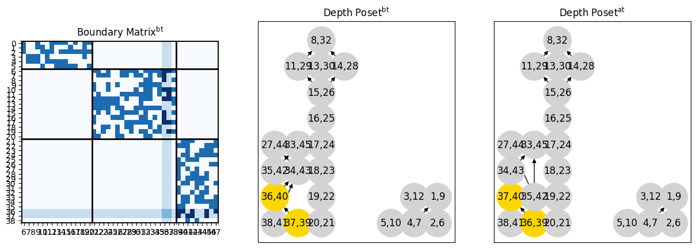

### Birth Death Pairs
|                          |                                                                                                                                                                                                                         |
|:-------------------------|:------------------------------------------------------------------------------------------------------------------------------------------------------------------------------------------------------------------------|
| Before the transposition | $\{(13, 30), (18, 23), (33, 45), (35, 42), (38, 41), (5, 10), (14, 28), (17, 24), (1, 9), (34, 43), (36, 40), (37, 39), (11, 29), (15, 26), (16, 25), (3, 12), (8, 32), (4, 7), (20, 21), (2, 6), (19, 22), (27, 44)\}$ |
| After the transposition  | $\{(13, 30), (18, 23), (33, 45), (35, 42), (38, 41), (5, 10), (14, 28), (17, 24), (1, 9), (34, 43), (11, 29), (15, 26), (16, 25), (3, 12), (36, 39), (8, 32), (4, 7), (20, 21), (2, 6), (37, 40), (19, 22), (27, 44)\}$ |

### Relations
|                          | Algorithm 1                                                                                                                                                                                                                                                                                                                                                                                                       | Algorithm 2                                                                                                                                                                                                                                                                                                                                                                                      |
|:-------------------------|:------------------------------------------------------------------------------------------------------------------------------------------------------------------------------------------------------------------------------------------------------------------------------------------------------------------------------------------------------------------------------------------------------------------|:-------------------------------------------------------------------------------------------------------------------------------------------------------------------------------------------------------------------------------------------------------------------------------------------------------------------------------------------------------------------------------------------------|
| Before the transposition | $\{(24, 30), (25, 29), (42, 45), (41, 43), (26, 30), (43, 46), (21, 22), (22, 23), (29, 32), (23, 28), (39, 42), (22, 29), (40, 47), (39, 45), (45, 46), (25, 28), (24, 29), (26, 32), (26, 29), (43, 45), (23, 24), (40, 43), (22, 31), (30, 32), (28, 32), (7, 9), (7, 12), (43, 44), (42, 46), (25, 30), (26, 31), (44, 46), (21, 26), (23, 26), (21, 32), (23, 29), (39, 43), (30, 31), (25, 26)\}$           | $\{(18, 17), (35, 27), (20, 14), (4, 3), (20, 17), (1, 0), (37, 27), (19, 15), (37, 36), (36, 34), (15, 11), (15, 14), (16, 13), (18, 16), (20, 13), (18, 13), (20, 16), (38, 31), (5, 0), (20, 19), (17, 11), (19, 11), (34, 27), (34, 33), (2, 1), (19, 17), (37, 35), (36, 33), (33, 31), (18, 15), (35, 31), (17, 16), (2, 0), (19, 16), (37, 31), (36, 35), (18, 11), (18, 14)\}$           |
| After the transposition  | $\{(24, 30), (25, 29), (42, 45), (41, 43), (26, 30), (43, 46), (21, 22), (22, 23), (29, 32), (23, 28), (39, 42), (40, 47), (22, 29), (39, 45), (45, 46), (25, 28), (24, 29), (26, 32), (26, 29), (43, 45), (23, 24), (40, 43), (22, 31), (39, 47), (30, 32), (28, 32), (7, 9), (7, 12), (43, 44), (42, 46), (25, 30), (26, 31), (44, 46), (21, 26), (23, 26), (39, 40), (21, 32), (23, 29), (30, 31), (25, 26)\}$ | $\{(18, 17), (35, 27), (20, 14), (4, 3), (20, 17), (1, 0), (37, 27), (19, 15), (37, 33), (36, 37), (36, 31), (15, 11), (15, 14), (16, 13), (18, 16), (20, 13), (18, 13), (20, 16), (38, 31), (5, 0), (20, 19), (17, 11), (19, 11), (34, 27), (34, 33), (2, 1), (36, 27), (19, 17), (33, 31), (18, 15), (35, 31), (17, 16), (2, 0), (19, 16), (37, 31), (36, 35), (37, 34), (18, 11), (18, 14)\}$ |

### Successors and Predecessers
|                 | $\text{Set}^\text{bt}(36, 40)$                                       | $\text{Set}^\text{bt}(37, 39)$                                       | $\text{Set}^\text{at}(36, 39)$                                       | $\text{Set}^\text{at}(37, 40)$                                       |
|:----------------|:---------------------------------------------------------------------|:---------------------------------------------------------------------|:---------------------------------------------------------------------|:---------------------------------------------------------------------|
| $\text{Succ}_1$ | $\text{Succ}_1^\text{bt}(36, 40) = \{(34, 43)\}$                     | $\text{Succ}_1^\text{bt}(37, 39) = \{(34, 43), (35, 42), (33, 45)\}$ | $\text{Succ}_1^\text{at}(36, 39) = \{(33, 45), (35, 42), (37, 40)\}$ | $\text{Succ}_1^\text{at}(37, 40) = \{(34, 43)\}$                     |
| $\text{Pred}_1$ | $\text{Pred}_1^\text{bt}(36, 40) = \emptyset$                        | $\text{Pred}_1^\text{bt}(37, 39) = \emptyset$                        | $\text{Pred}_1^\text{at}(36, 39) = \emptyset$                        | $\text{Pred}_1^\text{at}(37, 40) = \{(36, 39)\}$                     |
| $\text{Succ}_2$ | $\text{Succ}_2^\text{bt}(36, 40) = \{(34, 43), (35, 42), (33, 45)\}$ | $\text{Succ}_2^\text{bt}(37, 39) = \{(36, 40), (27, 44), (35, 42)\}$ | $\text{Succ}_2^\text{at}(36, 39) = \{(35, 42), (27, 44), (37, 40)\}$ | $\text{Succ}_2^\text{at}(37, 40) = \{(34, 43), (33, 45), (27, 44)\}$ |
| $\text{Pred}_2$ | $\text{Pred}_2^\text{bt}(36, 40) = \{(37, 39)\}$                     | $\text{Pred}_2^\text{bt}(37, 39) = \emptyset$                        | $\text{Pred}_2^\text{at}(36, 39) = \emptyset$                        | $\text{Pred}_2^\text{at}(37, 40) = \{(36, 39)\}$                     |

### Temp Sets
|                                                               | Before the Transposition                                                                                                                          | After the Transposition                                                                                                                           |
|:--------------------------------------------------------------|:--------------------------------------------------------------------------------------------------------------------------------------------------|:--------------------------------------------------------------------------------------------------------------------------------------------------|
| $\mathcal{L} = \{(s, t)\in \text{BD}:\; f(t) < f(y)\}$        | $\{(13, 30), (18, 23), (11, 29), (15, 26), (4, 7), (16, 25), (5, 10), (8, 32), (2, 6), (19, 22), (14, 28), (3, 12), (17, 24), (1, 9), (20, 21)\}$ | $\{(13, 30), (18, 23), (11, 29), (15, 26), (4, 7), (16, 25), (5, 10), (8, 32), (2, 6), (19, 22), (14, 28), (3, 12), (17, 24), (1, 9), (20, 21)\}$ |
| $\mathcal{M} = \{(s, t)\in \text{BD}:\; f(y) < f(t) < f(b)\}$ | $\emptyset$                                                                                                                                       | $\emptyset$                                                                                                                                       |

### Equations
There are 1 equations are wrong.

| eq   | left (formula)                  | left (paramatrized)               | left (value)                       | right (formula)                                                                                           | right (paramatrized)                                                                                            | right (value)                      | correct   |
|:-----|:--------------------------------|:----------------------------------|:-----------------------------------|:----------------------------------------------------------------------------------------------------------|:----------------------------------------------------------------------------------------------------------------|:-----------------------------------|:----------|
| Eq08 | $\text{Succ}_1^\text{at}(a, y)$ | $\text{Succ}_1^\text{at}(36, 39)$ | $\{(33, 45), (35, 42), (37, 40)\}$ | $\text{Succ}_1^\text{bt}(x, y) \oplus \{(x, b)\} \oplus \text{Succ}_1^\text{bt}(a, b)$                    | $\text{Succ}_1^\text{bt}(37, 39) \oplus \{(37, 40)\} \oplus \text{Succ}_1^\text{bt}(36, 40)$                    | $\{(33, 45), (35, 42), (37, 40)\}$ | ✔         |
| Eq09 | $\text{Succ}_1^\text{at}(x, b)$ | $\text{Succ}_1^\text{at}(37, 40)$ | $\{(34, 43)\}$                     | $\text{Succ}_1^\text{bt}(a, b)$                                                                           | $\text{Succ}_1^\text{bt}(36, 40)$                                                                               | $\{(34, 43)\}$                     | ✔         |
| Eq10 | $\text{Pred}_1^\text{at}(a, y)$ | $\text{Pred}_1^\text{at}(36, 39)$ | $\emptyset$                        | $\text{Pred}_1^\text{bt}(x, y)$                                                                           | $\text{Pred}_1^\text{bt}(37, 39)$                                                                               | $\emptyset$                        | ✔         |
| Eq11 | $\text{Pred}_1^\text{at}(x, b)$ | $\text{Pred}_1^\text{at}(37, 40)$ | $\{(36, 39)\}$                     | $\text{Pred}_1^\text{bt}(a, b) \oplus \{(a, y)\}$                                                         | $\text{Pred}_1^\text{bt}(36, 40) \oplus \{(36, 39)\}$                                                           | $\{(36, 39)\}$                     | ✔         |
| Eq12 | $\text{Succ}_2^\text{at}(a, y)$ | $\text{Succ}_2^\text{at}(36, 39)$ | $\{(35, 42), (27, 44), (37, 40)\}$ | $\text{Succ}_2^\text{bt}(x, y) \oplus \{(x, b), (a, b)\}$                                                 | $\text{Succ}_2^\text{bt}(37, 39) \oplus \{(37, 40), (36, 40)\}$                                                 | $\{(35, 42), (27, 44), (37, 40)\}$ | ✔         |
| Eq13 | $\text{Succ}_2^\text{at}(x, b)$ | $\text{Succ}_2^\text{at}(37, 40)$ | $\{(34, 43), (33, 45), (27, 44)\}$ | $\text{Succ}_2^\text{bt}(a, b)$                                                                           | $\text{Succ}_2^\text{bt}(36, 40)$                                                                               | $\{(34, 43), (35, 42), (33, 45)\}$ | ✘         |
| Eq14 | $\text{Pred}_2^\text{at}(a, y)$ | $\text{Pred}_2^\text{at}(36, 39)$ | $\emptyset$                        | $[\text{Pred}_2^\text{bt}(a, b) \cap \mathcal{L}]$                                                        | $[\text{Pred}_2^\text{bt}(36, 40) \cap \mathcal{L}]$                                                            | $\emptyset$                        | ✔         |
| Eq15 | $\text{Pred}_2^\text{at}(x, b)$ | $\text{Pred}_2^\text{at}(37, 40)$ | $\{(36, 39)\}$                     | $\text{Pred}_2^\text{bt}(x, y) \oplus \{(a, y)\} \oplus [\text{Pred}_2^\text{bt}(a, b) \cap \mathcal{M}]$ | $\text{Pred}_2^\text{bt}(37, 39) \oplus \{(36, 39)\} \oplus [\text{Pred}_2^\text{bt}(36, 40) \cap \mathcal{M}]$ | $\{(36, 39)\}$                     | ✔         |

## Transposition <37, 38> in complex 6
Here is a __birth-birth__ __no switch__ transposition <37, 38>.

$$
a = 37, \; b = 39, \; x = 38, \; y = 41
$$

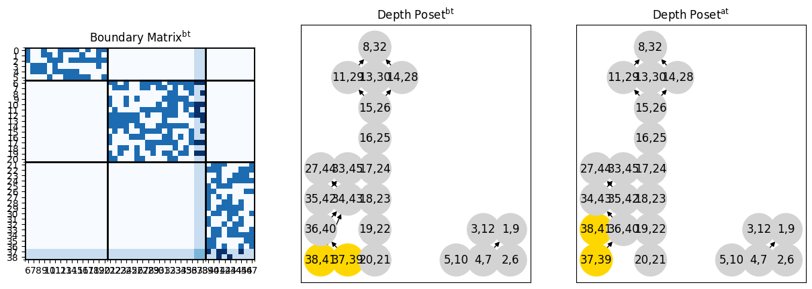

### Birth Death Pairs
|                          |                                                                                                                                                                                                                         |
|:-------------------------|:------------------------------------------------------------------------------------------------------------------------------------------------------------------------------------------------------------------------|
| Before the transposition | $\{(13, 30), (18, 23), (33, 45), (35, 42), (38, 41), (5, 10), (14, 28), (17, 24), (1, 9), (34, 43), (36, 40), (37, 39), (11, 29), (15, 26), (16, 25), (3, 12), (8, 32), (4, 7), (20, 21), (2, 6), (19, 22), (27, 44)\}$ |
| After the transposition  | $\{(13, 30), (18, 23), (33, 45), (35, 42), (38, 41), (5, 10), (14, 28), (17, 24), (1, 9), (34, 43), (36, 40), (37, 39), (11, 29), (15, 26), (16, 25), (3, 12), (8, 32), (4, 7), (20, 21), (2, 6), (19, 22), (27, 44)\}$ |

### Relations
|                          | Algorithm 1                                                                                                                                                                                                                                                                                                                                                                                             | Algorithm 2                                                                                                                                                                                                                                                                                                                                                                            |
|:-------------------------|:--------------------------------------------------------------------------------------------------------------------------------------------------------------------------------------------------------------------------------------------------------------------------------------------------------------------------------------------------------------------------------------------------------|:---------------------------------------------------------------------------------------------------------------------------------------------------------------------------------------------------------------------------------------------------------------------------------------------------------------------------------------------------------------------------------------|
| Before the transposition | $\{(24, 30), (25, 29), (42, 45), (41, 43), (26, 30), (43, 46), (21, 22), (22, 23), (29, 32), (23, 28), (39, 42), (22, 29), (40, 47), (39, 45), (45, 46), (25, 28), (24, 29), (26, 32), (26, 29), (43, 45), (23, 24), (40, 43), (22, 31), (30, 32), (28, 32), (7, 9), (7, 12), (43, 44), (42, 46), (25, 30), (26, 31), (44, 46), (21, 26), (23, 26), (21, 32), (23, 29), (39, 43), (30, 31), (25, 26)\}$ | $\{(18, 17), (35, 27), (20, 14), (4, 3), (20, 17), (1, 0), (37, 27), (19, 15), (37, 36), (36, 34), (15, 11), (15, 14), (16, 13), (18, 16), (20, 13), (18, 13), (20, 16), (38, 31), (5, 0), (20, 19), (17, 11), (19, 11), (34, 27), (34, 33), (2, 1), (19, 17), (37, 35), (36, 33), (33, 31), (18, 15), (35, 31), (17, 16), (2, 0), (19, 16), (37, 31), (36, 35), (18, 11), (18, 14)\}$ |
| After the transposition  | $\{(24, 30), (25, 29), (42, 45), (41, 43), (26, 30), (43, 46), (21, 22), (22, 23), (29, 32), (23, 28), (39, 42), (40, 47), (22, 29), (39, 45), (45, 46), (25, 28), (24, 29), (26, 32), (26, 29), (43, 45), (39, 41), (23, 24), (40, 43), (22, 31), (30, 32), (28, 32), (7, 9), (7, 12), (43, 44), (42, 46), (25, 30), (26, 31), (44, 46), (21, 26), (23, 26), (21, 32), (23, 29), (30, 31), (25, 26)\}$ | $\{(18, 17), (35, 27), (20, 14), (4, 3), (20, 17), (1, 0), (37, 27), (19, 15), (37, 36), (36, 34), (15, 11), (15, 14), (16, 13), (18, 16), (20, 13), (18, 13), (20, 16), (38, 31), (5, 0), (20, 19), (17, 11), (19, 11), (34, 27), (34, 33), (2, 1), (37, 35), (19, 17), (36, 33), (33, 31), (18, 15), (35, 31), (17, 16), (2, 0), (19, 16), (37, 31), (36, 35), (18, 11), (18, 14)\}$ |

### Successors and Predecessers
No such node in the Depth Poset

### Temp Sets
|                                                               | Before the Transposition                                                                                                                                              | After the Transposition                                                                                                                                               |
|:--------------------------------------------------------------|:----------------------------------------------------------------------------------------------------------------------------------------------------------------------|:----------------------------------------------------------------------------------------------------------------------------------------------------------------------|
| $\mathcal{L} = \{(s, t)\in \text{BD}:\; f(t) < f(y)\}$        | $\{(13, 30), (36, 40), (37, 39), (18, 23), (11, 29), (15, 26), (4, 7), (16, 25), (5, 10), (8, 32), (2, 6), (19, 22), (14, 28), (3, 12), (17, 24), (1, 9), (20, 21)\}$ | $\{(13, 30), (36, 40), (37, 39), (18, 23), (11, 29), (15, 26), (4, 7), (16, 25), (5, 10), (8, 32), (2, 6), (19, 22), (14, 28), (3, 12), (17, 24), (1, 9), (20, 21)\}$ |
| $\mathcal{M} = \{(s, t)\in \text{BD}:\; f(y) < f(t) < f(b)\}$ | $\emptyset$                                                                                                                                                           | $\emptyset$                                                                                                                                                           |

### Equations
There are 2 equations are wrong.

| eq   | left (formula)                  | left (paramatrized)               | left (value)   | right (formula)                                                                        | right (paramatrized)                                                                         | right (value)                      | correct   |
|:-----|:--------------------------------|:----------------------------------|:---------------|:---------------------------------------------------------------------------------------|:---------------------------------------------------------------------------------------------|:-----------------------------------|:----------|
| Eq16 | $\text{Succ}_1^\text{at}(x, y)$ | $\text{Succ}_1^\text{at}(38, 41)$ | $\{(34, 43)\}$ | $\text{Succ}_1^\text{bt}(x, y) \oplus \{(a, b)\} \oplus \text{Succ}_1^\text{bt}(a, b)$ | $\text{Succ}_1^\text{bt}(38, 41) \oplus \{(37, 39)\} \oplus \text{Succ}_1^\text{bt}(37, 39)$ | $\{(33, 45), (35, 42), (37, 39)\}$ | ✘         |
| Eq17 | $\text{Pred}_1^\text{at}(a, b)$ | $\text{Pred}_1^\text{at}(37, 39)$ | $\emptyset$    | $\text{Pred}_1^\text{bt}(a, b) \oplus \{(x, y)\}$                                      | $\text{Pred}_1^\text{bt}(37, 39) \oplus \{(38, 41)\}$                                        | $\{(38, 41)\}$                     | ✘         |

## Transposition <40, 41> in complex 6
Here is a __death-death__ __no switch__ transposition <40, 41>.

$$
a = 38, \; b = 41, \; x = 36, \; y = 40
$$

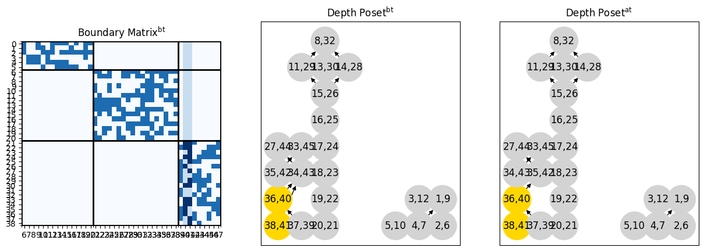

### Birth Death Pairs
|                          |                                                                                                                                                                                                                         |
|:-------------------------|:------------------------------------------------------------------------------------------------------------------------------------------------------------------------------------------------------------------------|
| Before the transposition | $\{(13, 30), (18, 23), (33, 45), (35, 42), (38, 41), (5, 10), (14, 28), (17, 24), (1, 9), (34, 43), (36, 40), (37, 39), (11, 29), (15, 26), (16, 25), (3, 12), (8, 32), (4, 7), (20, 21), (2, 6), (19, 22), (27, 44)\}$ |
| After the transposition  | $\{(13, 30), (18, 23), (33, 45), (35, 42), (38, 41), (5, 10), (14, 28), (17, 24), (1, 9), (34, 43), (36, 40), (37, 39), (11, 29), (15, 26), (16, 25), (3, 12), (8, 32), (4, 7), (20, 21), (2, 6), (19, 22), (27, 44)\}$ |

### Relations
|                          | Algorithm 1                                                                                                                                                                                                                                                                                                                                                                                             | Algorithm 2                                                                                                                                                                                                                                                                                                                                                                                                                    |
|:-------------------------|:--------------------------------------------------------------------------------------------------------------------------------------------------------------------------------------------------------------------------------------------------------------------------------------------------------------------------------------------------------------------------------------------------------|:-------------------------------------------------------------------------------------------------------------------------------------------------------------------------------------------------------------------------------------------------------------------------------------------------------------------------------------------------------------------------------------------------------------------------------|
| Before the transposition | $\{(24, 30), (25, 29), (42, 45), (41, 43), (26, 30), (43, 46), (21, 22), (22, 23), (29, 32), (23, 28), (39, 42), (22, 29), (40, 47), (39, 45), (45, 46), (25, 28), (24, 29), (26, 32), (26, 29), (43, 45), (23, 24), (40, 43), (22, 31), (30, 32), (28, 32), (7, 9), (7, 12), (43, 44), (42, 46), (25, 30), (26, 31), (44, 46), (21, 26), (23, 26), (21, 32), (23, 29), (39, 43), (30, 31), (25, 26)\}$ | $\{(18, 17), (35, 27), (20, 14), (4, 3), (20, 17), (1, 0), (37, 27), (19, 15), (37, 36), (36, 34), (15, 11), (15, 14), (16, 13), (18, 16), (20, 13), (18, 13), (20, 16), (38, 31), (5, 0), (20, 19), (17, 11), (19, 11), (34, 27), (34, 33), (2, 1), (19, 17), (37, 35), (36, 33), (33, 31), (18, 15), (35, 31), (17, 16), (2, 0), (19, 16), (37, 31), (36, 35), (18, 11), (18, 14)\}$                                         |
| After the transposition  | $\{(24, 30), (25, 29), (42, 45), (41, 43), (26, 30), (43, 46), (21, 22), (22, 23), (29, 32), (23, 28), (39, 42), (22, 29), (39, 45), (40, 47), (45, 46), (25, 28), (24, 29), (26, 32), (26, 29), (43, 45), (23, 24), (40, 43), (22, 31), (30, 32), (28, 32), (7, 9), (7, 12), (43, 44), (42, 46), (25, 30), (26, 31), (44, 46), (21, 26), (23, 26), (21, 32), (23, 29), (39, 43), (30, 31), (25, 26)\}$ | $\{(18, 17), (35, 27), (20, 14), (4, 3), (20, 17), (38, 35), (1, 0), (37, 27), (19, 15), (37, 36), (36, 34), (15, 11), (15, 14), (16, 13), (18, 16), (20, 13), (18, 13), (20, 16), (38, 31), (5, 0), (20, 19), (38, 34), (17, 11), (19, 11), (34, 27), (34, 33), (2, 1), (19, 17), (37, 35), (36, 33), (33, 31), (18, 15), (35, 31), (38, 33), (38, 36), (17, 16), (2, 0), (19, 16), (37, 31), (36, 35), (18, 11), (18, 14)\}$ |

### Successors and Predecessers
No such node in the Depth Poset

### Temp Sets
|                                                               | Before the Transposition   | After the Transposition   |
|:--------------------------------------------------------------|:---------------------------|:--------------------------|
| $\mathcal{B} = \{(s, t)\in \text{BD}:\; f(s) > f(x)\}$        | $\{(38, 41), (37, 39)\}$   | $\{(38, 41), (37, 39)\}$  |
| $\mathcal{N} = \{(s, t)\in \text{BD}:\; f(x) > f(s) > f(a)\}$ | $\emptyset$                | $\emptyset$               |

### Equations
There are 2 equations are wrong.

| eq   | left (formula)                  | left (paramatrized)               | left (value)                       | right (formula)                                                                        | right (paramatrized)                                                                         | right (value)                                | correct   |
|:-----|:--------------------------------|:----------------------------------|:-----------------------------------|:---------------------------------------------------------------------------------------|:---------------------------------------------------------------------------------------------|:---------------------------------------------|:----------|
| Eq36 | $\text{Succ}_2^\text{at}(x, y)$ | $\text{Succ}_2^\text{at}(36, 40)$ | $\{(34, 43), (35, 42), (33, 45)\}$ | $\text{Succ}_2^\text{bt}(x, y) \oplus \{(a, b)\} \oplus \text{Succ}_2^\text{bt}(a, b)$ | $\text{Succ}_2^\text{bt}(36, 40) \oplus \{(38, 41)\} \oplus \text{Succ}_2^\text{bt}(38, 41)$ | $\{(34, 43), (38, 41), (33, 45), (35, 42)\}$ | ✘         |
| Eq37 | $\text{Pred}_2^\text{at}(a, b)$ | $\text{Pred}_2^\text{at}(38, 41)$ | $\emptyset$                        | $\text{Pred}_2^\text{bt}(a, b) \oplus \{(x, y)\}$                                      | $\text{Pred}_2^\text{bt}(38, 41) \oplus \{(36, 40)\}$                                        | $\{(36, 40)\}$                               | ✘         |

## Transposition <44, 45> in complex 6
Here is a __death-death__ __no switch__ transposition <44, 45>.

$$
a = 33, \; b = 45, \; x = 27, \; y = 44
$$

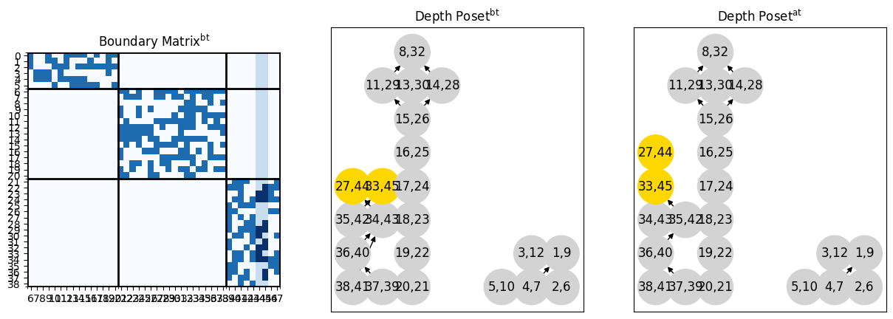

### Birth Death Pairs
|                          |                                                                                                                                                                                                                         |
|:-------------------------|:------------------------------------------------------------------------------------------------------------------------------------------------------------------------------------------------------------------------|
| Before the transposition | $\{(13, 30), (18, 23), (33, 45), (35, 42), (38, 41), (5, 10), (14, 28), (17, 24), (1, 9), (34, 43), (36, 40), (37, 39), (11, 29), (15, 26), (16, 25), (3, 12), (8, 32), (4, 7), (20, 21), (2, 6), (19, 22), (27, 44)\}$ |
| After the transposition  | $\{(13, 30), (18, 23), (33, 45), (35, 42), (38, 41), (5, 10), (14, 28), (17, 24), (1, 9), (34, 43), (36, 40), (37, 39), (11, 29), (15, 26), (16, 25), (3, 12), (8, 32), (4, 7), (20, 21), (2, 6), (19, 22), (27, 44)\}$ |

### Relations
|                          | Algorithm 1                                                                                                                                                                                                                                                                                                                                                                                             | Algorithm 2                                                                                                                                                                                                                                                                                                                                                                                      |
|:-------------------------|:--------------------------------------------------------------------------------------------------------------------------------------------------------------------------------------------------------------------------------------------------------------------------------------------------------------------------------------------------------------------------------------------------------|:-------------------------------------------------------------------------------------------------------------------------------------------------------------------------------------------------------------------------------------------------------------------------------------------------------------------------------------------------------------------------------------------------|
| Before the transposition | $\{(24, 30), (25, 29), (42, 45), (41, 43), (26, 30), (43, 46), (21, 22), (22, 23), (29, 32), (23, 28), (39, 42), (22, 29), (40, 47), (39, 45), (45, 46), (25, 28), (24, 29), (26, 32), (26, 29), (43, 45), (23, 24), (40, 43), (22, 31), (30, 32), (28, 32), (7, 9), (7, 12), (43, 44), (42, 46), (25, 30), (26, 31), (44, 46), (21, 26), (23, 26), (21, 32), (23, 29), (39, 43), (30, 31), (25, 26)\}$ | $\{(18, 17), (35, 27), (20, 14), (4, 3), (20, 17), (1, 0), (37, 27), (19, 15), (37, 36), (36, 34), (15, 11), (15, 14), (16, 13), (18, 16), (20, 13), (18, 13), (20, 16), (38, 31), (5, 0), (20, 19), (17, 11), (19, 11), (34, 27), (34, 33), (2, 1), (19, 17), (37, 35), (36, 33), (33, 31), (18, 15), (35, 31), (17, 16), (2, 0), (19, 16), (37, 31), (36, 35), (18, 11), (18, 14)\}$           |
| After the transposition  | $\{(24, 30), (25, 29), (42, 45), (41, 43), (26, 30), (43, 46), (21, 22), (22, 23), (29, 32), (23, 28), (39, 42), (22, 29), (40, 47), (39, 45), (45, 46), (25, 28), (24, 29), (26, 32), (26, 29), (43, 45), (23, 24), (40, 43), (22, 31), (30, 32), (28, 32), (7, 9), (7, 12), (43, 44), (42, 46), (25, 30), (26, 31), (44, 46), (21, 26), (23, 26), (21, 32), (23, 29), (39, 43), (30, 31), (25, 26)\}$ | $\{(18, 17), (35, 27), (20, 14), (4, 3), (20, 17), (1, 0), (37, 27), (19, 15), (37, 36), (36, 34), (15, 11), (15, 14), (16, 13), (18, 16), (20, 13), (18, 13), (20, 16), (38, 31), (5, 0), (20, 19), (17, 11), (19, 11), (34, 27), (34, 33), (2, 1), (19, 17), (37, 35), (36, 33), (33, 31), (18, 15), (35, 31), (17, 16), (2, 0), (19, 16), (37, 31), (36, 35), (18, 11), (33, 27), (18, 14)\}$ |

### Successors and Predecessers
No such node in the Depth Poset

### Temp Sets
|                                                               | Before the Transposition                                         | After the Transposition                                          |
|:--------------------------------------------------------------|:-----------------------------------------------------------------|:-----------------------------------------------------------------|
| $\mathcal{B} = \{(s, t)\in \text{BD}:\; f(s) > f(x)\}$        | $\{(34, 43), (36, 40), (37, 39), (33, 45), (35, 42), (38, 41)\}$ | $\{(34, 43), (36, 40), (37, 39), (33, 45), (35, 42), (38, 41)\}$ |
| $\mathcal{N} = \{(s, t)\in \text{BD}:\; f(x) > f(s) > f(a)\}$ | $\emptyset$                                                      | $\emptyset$                                                      |

### Equations
There are 2 equations are wrong.

| eq   | left (formula)                  | left (paramatrized)               | left (value)             | right (formula)                                                                        | right (paramatrized)                                                                         | right (value)                      | correct   |
|:-----|:--------------------------------|:----------------------------------|:-------------------------|:---------------------------------------------------------------------------------------|:---------------------------------------------------------------------------------------------|:-----------------------------------|:----------|
| Eq36 | $\text{Succ}_2^\text{at}(x, y)$ | $\text{Succ}_2^\text{at}(27, 44)$ | $\emptyset$              | $\text{Succ}_2^\text{bt}(x, y) \oplus \{(a, b)\} \oplus \text{Succ}_2^\text{bt}(a, b)$ | $\text{Succ}_2^\text{bt}(27, 44) \oplus \{(33, 45)\} \oplus \text{Succ}_2^\text{bt}(33, 45)$ | $\{(33, 45)\}$                     | ✘         |
| Eq37 | $\text{Pred}_2^\text{at}(a, b)$ | $\text{Pred}_2^\text{at}(33, 45)$ | $\{(34, 43), (36, 40)\}$ | $\text{Pred}_2^\text{bt}(a, b) \oplus \{(x, y)\}$                                      | $\text{Pred}_2^\text{bt}(33, 45) \oplus \{(27, 44)\}$                                        | $\{(34, 43), (36, 40), (27, 44)\}$ | ✘         |

## Transposition <4, 5> in complex 7
Here is a __birth-birth__ __no switch__ transposition <4, 5>.

$$
a = 4, \; b = 7, \; x = 5, \; y = 8
$$

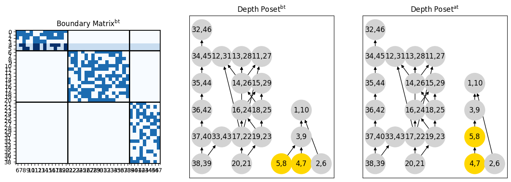

### Birth Death Pairs
|                          |                                                                                                                                                                                                                         |
|:-------------------------|:------------------------------------------------------------------------------------------------------------------------------------------------------------------------------------------------------------------------|
| Before the transposition | $\{(32, 46), (12, 31), (15, 29), (35, 44), (3, 9), (18, 25), (19, 23), (34, 45), (36, 42), (13, 28), (16, 24), (4, 7), (33, 43), (20, 21), (38, 39), (5, 8), (14, 26), (17, 22), (2, 6), (37, 40), (1, 10), (11, 27)\}$ |
| After the transposition  | $\{(32, 46), (12, 31), (15, 29), (35, 44), (3, 9), (18, 25), (19, 23), (34, 45), (36, 42), (13, 28), (16, 24), (4, 7), (33, 43), (20, 21), (38, 39), (5, 8), (14, 26), (17, 22), (2, 6), (37, 40), (1, 10), (11, 27)\}$ |

### Relations
|                          | Algorithm 1                                                                                                                                                                                                                                                                                                                                                                                            | Algorithm 2                                                                                                                                                                                                                                                                                                                                                |
|:-------------------------|:-------------------------------------------------------------------------------------------------------------------------------------------------------------------------------------------------------------------------------------------------------------------------------------------------------------------------------------------------------------------------------------------------------|:-----------------------------------------------------------------------------------------------------------------------------------------------------------------------------------------------------------------------------------------------------------------------------------------------------------------------------------------------------------|
| Before the transposition | $\{(25, 29), (44, 45), (26, 27), (21, 28), (21, 31), (23, 28), (40, 44), (8, 9), (23, 25), (23, 31), (25, 28), (24, 29), (21, 24), (21, 30), (21, 27), (23, 24), (39, 41), (22, 28), (39, 44), (22, 31), (40, 46), (27, 30), (7, 9), (24, 28), (26, 28), (42, 46), (43, 47), (29, 30), (44, 46), (21, 29), (23, 26), (40, 42), (39, 40), (39, 46), (23, 29), (22, 30), (39, 43), (45, 47), (25, 26)\}$ | $\{(20, 11), (4, 0), (20, 14), (3, 1), (20, 17), (38, 32), (5, 1), (14, 13), (19, 12), (1, 0), (16, 13), (35, 32), (5, 0), (20, 19), (38, 37), (5, 3), (17, 11), (14, 12), (19, 11), (34, 30), (36, 30), (2, 1), (16, 15), (18, 12), (18, 15), (20, 18), (4, 1), (35, 34), (20, 15), (17, 16), (2, 0), (19, 16), (34, 32), (36, 35), (37, 34), (33, 30)\}$ |
| After the transposition  | $\{(25, 29), (44, 45), (26, 27), (21, 28), (21, 31), (23, 28), (40, 44), (8, 9), (23, 25), (23, 31), (25, 28), (24, 29), (21, 24), (21, 30), (21, 27), (23, 24), (39, 41), (22, 28), (39, 44), (22, 31), (40, 46), (27, 30), (24, 28), (26, 28), (42, 46), (43, 47), (29, 30), (44, 46), (21, 29), (23, 26), (40, 42), (39, 40), (39, 46), (23, 29), (22, 30), (39, 43), (45, 47), (7, 8), (25, 26)\}$ | $\{(20, 11), (4, 0), (20, 14), (3, 1), (20, 17), (38, 32), (5, 1), (14, 13), (19, 12), (1, 0), (16, 13), (35, 32), (5, 0), (20, 19), (38, 37), (5, 3), (17, 11), (14, 12), (19, 11), (34, 30), (36, 30), (2, 1), (16, 15), (18, 12), (18, 15), (20, 18), (4, 1), (35, 34), (20, 15), (17, 16), (2, 0), (19, 16), (34, 32), (36, 35), (37, 34), (33, 30)\}$ |

### Successors and Predecessers
No such node in the Depth Poset

### Temp Sets
|                                                               | Before the Transposition   | After the Transposition   |
|:--------------------------------------------------------------|:---------------------------|:--------------------------|
| $\mathcal{L} = \{(s, t)\in \text{BD}:\; f(t) < f(y)\}$        | $\{(2, 6), (4, 7)\}$       | $\{(2, 6), (4, 7)\}$      |
| $\mathcal{M} = \{(s, t)\in \text{BD}:\; f(y) < f(t) < f(b)\}$ | $\emptyset$                | $\emptyset$               |

### Equations
There are 2 equations are wrong.

| eq   | left (formula)                  | left (paramatrized)             | left (value)   | right (formula)                                                                        | right (paramatrized)                                                                   | right (value)   | correct   |
|:-----|:--------------------------------|:--------------------------------|:---------------|:---------------------------------------------------------------------------------------|:---------------------------------------------------------------------------------------|:----------------|:----------|
| Eq16 | $\text{Succ}_1^\text{at}(x, y)$ | $\text{Succ}_1^\text{at}(5, 8)$ | $\{(3, 9)\}$   | $\text{Succ}_1^\text{bt}(x, y) \oplus \{(a, b)\} \oplus \text{Succ}_1^\text{bt}(a, b)$ | $\text{Succ}_1^\text{bt}(5, 8) \oplus \{(4, 7)\} \oplus \text{Succ}_1^\text{bt}(4, 7)$ | $\{(4, 7)\}$    | ✘         |
| Eq17 | $\text{Pred}_1^\text{at}(a, b)$ | $\text{Pred}_1^\text{at}(4, 7)$ | $\emptyset$    | $\text{Pred}_1^\text{bt}(a, b) \oplus \{(x, y)\}$                                      | $\text{Pred}_1^\text{bt}(4, 7) \oplus \{(5, 8)\}$                                      | $\{(5, 8)\}$    | ✘         |

## Transposition <7, 8> in complex 7
Here is a __death-death__ __no switch__ transposition <7, 8>.

$$
a = 5, \; b = 8, \; x = 4, \; y = 7
$$

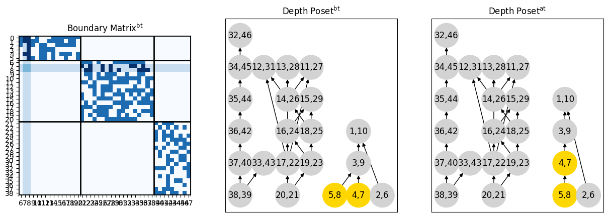

### Birth Death Pairs
|                          |                                                                                                                                                                                                                         |
|:-------------------------|:------------------------------------------------------------------------------------------------------------------------------------------------------------------------------------------------------------------------|
| Before the transposition | $\{(32, 46), (12, 31), (15, 29), (35, 44), (3, 9), (18, 25), (19, 23), (34, 45), (36, 42), (13, 28), (16, 24), (4, 7), (33, 43), (20, 21), (38, 39), (5, 8), (14, 26), (17, 22), (2, 6), (37, 40), (1, 10), (11, 27)\}$ |
| After the transposition  | $\{(32, 46), (12, 31), (15, 29), (35, 44), (3, 9), (18, 25), (19, 23), (34, 45), (36, 42), (13, 28), (16, 24), (4, 7), (33, 43), (20, 21), (38, 39), (5, 8), (14, 26), (17, 22), (2, 6), (37, 40), (1, 10), (11, 27)\}$ |

### Relations
|                          | Algorithm 1                                                                                                                                                                                                                                                                                                                                                                                            | Algorithm 2                                                                                                                                                                                                                                                                                                                                                |
|:-------------------------|:-------------------------------------------------------------------------------------------------------------------------------------------------------------------------------------------------------------------------------------------------------------------------------------------------------------------------------------------------------------------------------------------------------|:-----------------------------------------------------------------------------------------------------------------------------------------------------------------------------------------------------------------------------------------------------------------------------------------------------------------------------------------------------------|
| Before the transposition | $\{(25, 29), (44, 45), (26, 27), (21, 28), (21, 31), (23, 28), (40, 44), (8, 9), (23, 25), (23, 31), (25, 28), (24, 29), (21, 24), (21, 30), (21, 27), (23, 24), (39, 41), (22, 28), (39, 44), (22, 31), (40, 46), (27, 30), (7, 9), (24, 28), (26, 28), (42, 46), (43, 47), (29, 30), (44, 46), (21, 29), (23, 26), (40, 42), (39, 40), (39, 46), (23, 29), (22, 30), (39, 43), (45, 47), (25, 26)\}$ | $\{(20, 11), (4, 0), (20, 14), (3, 1), (20, 17), (38, 32), (5, 1), (14, 13), (19, 12), (1, 0), (16, 13), (35, 32), (5, 0), (20, 19), (38, 37), (5, 3), (17, 11), (14, 12), (19, 11), (34, 30), (36, 30), (2, 1), (16, 15), (18, 12), (18, 15), (20, 18), (4, 1), (35, 34), (20, 15), (17, 16), (2, 0), (19, 16), (34, 32), (36, 35), (37, 34), (33, 30)\}$ |
| After the transposition  | $\{(25, 29), (44, 45), (26, 27), (21, 28), (21, 31), (23, 28), (40, 44), (8, 9), (23, 25), (23, 31), (25, 28), (24, 29), (21, 24), (21, 30), (21, 27), (23, 24), (39, 41), (22, 28), (39, 44), (22, 31), (40, 46), (27, 30), (7, 9), (24, 28), (26, 28), (42, 46), (43, 47), (29, 30), (44, 46), (21, 29), (23, 26), (40, 42), (39, 40), (39, 46), (23, 29), (22, 30), (39, 43), (45, 47), (25, 26)\}$ | $\{(20, 11), (4, 0), (20, 14), (3, 1), (20, 17), (5, 4), (38, 32), (14, 13), (19, 12), (1, 0), (16, 13), (35, 32), (20, 19), (38, 37), (5, 3), (17, 11), (14, 12), (19, 11), (34, 30), (36, 30), (2, 1), (16, 15), (18, 12), (18, 15), (20, 18), (4, 1), (35, 34), (20, 15), (17, 16), (2, 0), (19, 16), (34, 32), (36, 35), (37, 34), (33, 30)\}$         |

### Successors and Predecessers
No such node in the Depth Poset

### Temp Sets
|                                                               | Before the Transposition                                                                                                                                                               | After the Transposition                                                                                                                                                                |
|:--------------------------------------------------------------|:---------------------------------------------------------------------------------------------------------------------------------------------------------------------------------------|:---------------------------------------------------------------------------------------------------------------------------------------------------------------------------------------|
| $\mathcal{B} = \{(s, t)\in \text{BD}:\; f(s) > f(x)\}$        | $\{(38, 39), (19, 23), (5, 8), (32, 46), (34, 45), (36, 42), (14, 26), (17, 22), (33, 43), (15, 29), (35, 44), (37, 40), (18, 25), (13, 28), (16, 24), (12, 31), (11, 27), (20, 21)\}$ | $\{(38, 39), (19, 23), (5, 8), (32, 46), (34, 45), (36, 42), (14, 26), (17, 22), (33, 43), (15, 29), (35, 44), (37, 40), (18, 25), (13, 28), (16, 24), (12, 31), (11, 27), (20, 21)\}$ |
| $\mathcal{N} = \{(s, t)\in \text{BD}:\; f(x) > f(s) > f(a)\}$ | $\emptyset$                                                                                                                                                                            | $\emptyset$                                                                                                                                                                            |

### Equations
There are 2 equations are wrong.

| eq   | left (formula)                  | left (paramatrized)             | left (value)   | right (formula)                                                                        | right (paramatrized)                                                                   | right (value)        | correct   |
|:-----|:--------------------------------|:--------------------------------|:---------------|:---------------------------------------------------------------------------------------|:---------------------------------------------------------------------------------------|:---------------------|:----------|
| Eq36 | $\text{Succ}_2^\text{at}(x, y)$ | $\text{Succ}_2^\text{at}(4, 7)$ | $\{(1, 10)\}$  | $\text{Succ}_2^\text{bt}(x, y) \oplus \{(a, b)\} \oplus \text{Succ}_2^\text{bt}(a, b)$ | $\text{Succ}_2^\text{bt}(4, 7) \oplus \{(5, 8)\} \oplus \text{Succ}_2^\text{bt}(5, 8)$ | $\{(3, 9), (5, 8)\}$ | ✘         |
| Eq37 | $\text{Pred}_2^\text{at}(a, b)$ | $\text{Pred}_2^\text{at}(5, 8)$ | $\emptyset$    | $\text{Pred}_2^\text{bt}(a, b) \oplus \{(x, y)\}$                                      | $\text{Pred}_2^\text{bt}(5, 8) \oplus \{(4, 7)\}$                                      | $\{(4, 7)\}$         | ✘         |

## Transposition <10, 11> in complex 7
Here is a __birth-death__ __switch forward__ transposition <10, 11>.

$$
a = 1, \; b = 10, \; x = 11, \; y = 27
$$

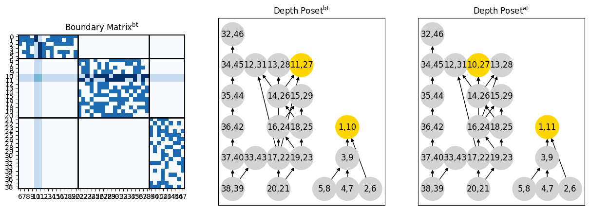

### Birth Death Pairs
|                          |                                                                                                                                                                                                                         |
|:-------------------------|:------------------------------------------------------------------------------------------------------------------------------------------------------------------------------------------------------------------------|
| Before the transposition | $\{(32, 46), (12, 31), (15, 29), (35, 44), (3, 9), (18, 25), (19, 23), (34, 45), (36, 42), (13, 28), (16, 24), (4, 7), (33, 43), (20, 21), (38, 39), (5, 8), (14, 26), (17, 22), (2, 6), (37, 40), (1, 10), (11, 27)\}$ |
| After the transposition  | $\{(32, 46), (12, 31), (10, 27), (15, 29), (35, 44), (3, 9), (18, 25), (19, 23), (1, 11), (34, 45), (36, 42), (13, 28), (16, 24), (4, 7), (33, 43), (20, 21), (38, 39), (5, 8), (14, 26), (17, 22), (2, 6), (37, 40)\}$ |

### Relations
|                          | Algorithm 1                                                                                                                                                                                                                                                                                                                                                                                                     | Algorithm 2                                                                                                                                                                                                                                                                                                                                                |
|:-------------------------|:----------------------------------------------------------------------------------------------------------------------------------------------------------------------------------------------------------------------------------------------------------------------------------------------------------------------------------------------------------------------------------------------------------------|:-----------------------------------------------------------------------------------------------------------------------------------------------------------------------------------------------------------------------------------------------------------------------------------------------------------------------------------------------------------|
| Before the transposition | $\{(25, 29), (44, 45), (26, 27), (21, 28), (21, 31), (23, 28), (40, 44), (8, 9), (23, 25), (23, 31), (25, 28), (24, 29), (21, 24), (21, 30), (21, 27), (23, 24), (39, 41), (22, 28), (39, 44), (22, 31), (40, 46), (27, 30), (7, 9), (24, 28), (26, 28), (42, 46), (43, 47), (29, 30), (44, 46), (21, 29), (23, 26), (40, 42), (39, 40), (39, 46), (23, 29), (22, 30), (39, 43), (45, 47), (25, 26)\}$          | $\{(20, 11), (4, 0), (20, 14), (3, 1), (20, 17), (38, 32), (5, 1), (14, 13), (19, 12), (1, 0), (16, 13), (35, 32), (5, 0), (20, 19), (38, 37), (5, 3), (17, 11), (14, 12), (19, 11), (34, 30), (36, 30), (2, 1), (16, 15), (18, 12), (18, 15), (20, 18), (4, 1), (35, 34), (20, 15), (17, 16), (2, 0), (19, 16), (34, 32), (36, 35), (37, 34), (33, 30)\}$ |
| After the transposition  | $\{(25, 29), (44, 45), (26, 27), (21, 28), (21, 31), (23, 28), (40, 44), (8, 9), (23, 25), (23, 31), (25, 28), (24, 29), (21, 24), (21, 30), (21, 27), (23, 24), (39, 41), (22, 28), (39, 44), (8, 11), (22, 31), (40, 46), (27, 30), (7, 9), (24, 28), (26, 28), (42, 46), (43, 47), (29, 30), (44, 46), (21, 29), (23, 26), (40, 42), (39, 40), (39, 46), (23, 29), (22, 30), (39, 43), (45, 47), (25, 26)\}$ | $\{(4, 0), (20, 14), (3, 1), (20, 17), (38, 32), (5, 1), (14, 13), (19, 12), (1, 0), (16, 10), (16, 13), (35, 32), (5, 0), (20, 19), (38, 37), (5, 3), (14, 12), (34, 30), (36, 30), (2, 1), (16, 15), (18, 12), (18, 15), (20, 18), (4, 1), (35, 34), (20, 15), (17, 16), (19, 10), (2, 0), (19, 16), (34, 32), (36, 35), (37, 34), (33, 30)\}$           |

### Successors and Predecessers
|                 | $\text{Set}^\text{bt}(1, 10)$                                         | $\text{Set}^\text{bt}(11, 27)$                                       | $\text{Set}^\text{at}(1, 11)$                                         | $\text{Set}^\text{at}(10, 27)$                             |
|:----------------|:----------------------------------------------------------------------|:---------------------------------------------------------------------|:----------------------------------------------------------------------|:-----------------------------------------------------------|
| $\text{Succ}_1$ | $\text{Succ}_1^\text{bt}(1, 10) = \emptyset$                          | $\text{Succ}_1^\text{bt}(11, 27) = \emptyset$                        | $\text{Succ}_1^\text{at}(1, 11) = \emptyset$                          | $\text{Succ}_1^\text{at}(10, 27) = \emptyset$              |
| $\text{Pred}_1$ | $\text{Pred}_1^\text{bt}(1, 10) = \emptyset$                          | $\text{Pred}_1^\text{bt}(11, 27) = \{(14, 26), (20, 21)\}$           | $\text{Pred}_1^\text{at}(1, 11) = \{(5, 8)\}$                         | $\text{Pred}_1^\text{at}(10, 27) = \{(14, 26), (20, 21)\}$ |
| $\text{Succ}_2$ | $\text{Succ}_2^\text{bt}(1, 10) = \emptyset$                          | $\text{Succ}_2^\text{bt}(11, 27) = \emptyset$                        | $\text{Succ}_2^\text{at}(1, 11) = \emptyset$                          | $\text{Succ}_2^\text{at}(10, 27) = \emptyset$              |
| $\text{Pred}_2$ | $\text{Pred}_2^\text{bt}(1, 10) = \{(3, 9), (4, 7), (2, 6), (5, 8)\}$ | $\text{Pred}_2^\text{bt}(11, 27) = \{(17, 22), (20, 21), (19, 23)\}$ | $\text{Pred}_2^\text{at}(1, 11) = \{(3, 9), (4, 7), (2, 6), (5, 8)\}$ | $\text{Pred}_2^\text{at}(10, 27) = \{(16, 24), (19, 23)\}$ |

### Temp Sets
|                                                              | Before the Transposition                                         | After the Transposition                                          |
|:-------------------------------------------------------------|:-----------------------------------------------------------------|:-----------------------------------------------------------------|
| $A_1 = \{(s, t)\in \text{BD}:\; f(a) < f(s) < f(t) < f(x)\}$ | $\{(3, 9), (4, 7), (2, 6), (5, 8)\}$                             | $\{(3, 9), (4, 7), (2, 6), (5, 8)\}$                             |
| $B_1 = \{(s, t)\in \text{BD}:\; U_1[t, x] = 1\}$             | $\emptyset$                                                      | $\{(5, 8)\}$                                                     |
| $A_2 = \{(s, t)\in \text{BD}:\; f(b) < f(s) < f(t) < f(y)\}$ | $\{(19, 23), (14, 26), (17, 22), (18, 25), (16, 24), (20, 21)\}$ | $\{(19, 23), (14, 26), (17, 22), (18, 25), (16, 24), (20, 21)\}$ |
| $B_2 = \{(s, t)\in \text{BD}:\; U_2[b, s] = 1\}$             | $\emptyset$                                                      | $\{(16, 24), (19, 23)\}$                                         |

### Equations
There are 4 equations are wrong.

| eq    | left (formula)                  | left (paramatrized)               | left (value)                         | right (formula)                                      | right (paramatrized)                                  | right (value)                        | correct   |
|:------|:--------------------------------|:----------------------------------|:-------------------------------------|:-----------------------------------------------------|:------------------------------------------------------|:-------------------------------------|:----------|
| Eq48  | $\text{Succ}_1^\text{at}(a, x)$ | $\text{Succ}_1^\text{at}(1, 11)$  | $\emptyset$                          | $\text{Succ}_1^\text{bt}(a, b)$                      | $\text{Succ}_1^\text{bt}(1, 10)$                      | $\emptyset$                          | ✔         |
| Eq49  | $\text{Succ}_1^\text{at}(b, y)$ | $\text{Succ}_1^\text{at}(10, 27)$ | $\emptyset$                          | $\text{Succ}_1^\text{bt}(x, y)$                      | $\text{Succ}_1^\text{bt}(11, 27)$                     | $\emptyset$                          | ✔         |
| Eq50  | $\text{Pred}_1^\text{at}(a, x)$ | $\text{Pred}_1^\text{at}(1, 11)$  | $\{(5, 8)\}$                         | $\{(s, t)\in \text{BD}:\; U_1^\text{bt}[t, x] = 1\}$ | $\{(s, t)\in \text{BD}:\; U_1^\text{bt}[t, 11] = 1\}$ | $\emptyset$                          | ✘         |
| Eq50a | $\text{Pred}_1^\text{at}(a, x)$ | $\text{Pred}_1^\text{at}(1, 11)$  | $\{(5, 8)\}$                         | $A_1^\text{bt} \cap B_1^\text{bt}$                   | $A_1^\text{bt} \cap B_1^\text{bt}$                    | $\emptyset$                          | ✘         |
| Eq50b | $\text{Pred}_1^\text{at}(a, x)$ | $\text{Pred}_1^\text{at}(1, 11)$  | $\{(5, 8)\}$                         | $A_1^\text{bt} \cap B_1^\text{at}$                   | $A_1^\text{bt} \cap B_1^\text{at}$                    | $\{(5, 8)\}$                         | ✔         |
| Eq51  | $\text{Pred}_1^\text{at}(b, y)$ | $\text{Pred}_1^\text{at}(10, 27)$ | $\{(14, 26), (20, 21)\}$             | $\text{Pred}_1^\text{bt}(x, y)$                      | $\text{Pred}_1^\text{bt}(11, 27)$                     | $\{(14, 26), (20, 21)\}$             | ✔         |
| Eq52  | $\text{Succ}_2^\text{at}(a, x)$ | $\text{Succ}_2^\text{at}(1, 11)$  | $\emptyset$                          | $\text{Succ}_2^\text{bt}(a, b)$                      | $\text{Succ}_2^\text{bt}(1, 10)$                      | $\emptyset$                          | ✔         |
| Eq53  | $\text{Succ}_2^\text{at}(b, y)$ | $\text{Succ}_2^\text{at}(10, 27)$ | $\emptyset$                          | $\text{Succ}_2^\text{bt}(x, y)$                      | $\text{Succ}_2^\text{bt}(11, 27)$                     | $\emptyset$                          | ✔         |
| Eq54  | $\text{Pred}_2^\text{at}(a, x)$ | $\text{Pred}_2^\text{at}(1, 11)$  | $\{(3, 9), (4, 7), (2, 6), (5, 8)\}$ | $\text{Pred}_2^\text{bt}(a, b)$                      | $\text{Pred}_2^\text{bt}(1, 10)$                      | $\{(3, 9), (4, 7), (2, 6), (5, 8)\}$ | ✔         |
| Eq55  | $\text{Pred}_2^\text{at}(b, y)$ | $\text{Pred}_2^\text{at}(10, 27)$ | $\{(16, 24), (19, 23)\}$             | $\{(s, t)\in \text{BD}:\; U_2^\text{bt}[b, s] = 1\}$ | $\{(s, t)\in \text{BD}:\; U_2^\text{bt}[10, s] = 1\}$ | $\emptyset$                          | ✘         |
| Eq55a | $\text{Pred}_2^\text{at}(b, y)$ | $\text{Pred}_2^\text{at}(10, 27)$ | $\{(16, 24), (19, 23)\}$             | $A_2^\text{bt} \cap B_2^\text{bt}$                   | $A_2^\text{bt} \cap B_2^\text{bt}$                    | $\emptyset$                          | ✘         |
| Eq55b | $\text{Pred}_2^\text{at}(b, y)$ | $\text{Pred}_2^\text{at}(10, 27)$ | $\{(16, 24), (19, 23)\}$             | $A_2^\text{bt} \cap B_2^\text{at}$                   | $A_2^\text{bt} \cap B_2^\text{at}$                    | $\{(16, 24), (19, 23)\}$             | ✔         |

## Transposition <11, 12> in complex 7
Here is a __birth-birth__ __no switch__ transposition <11, 12>.

$$
a = 11, \; b = 27, \; x = 12, \; y = 31
$$

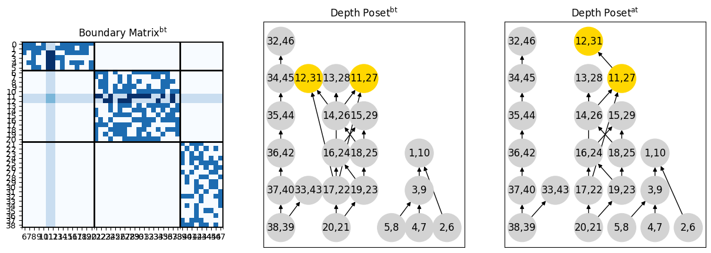

### Birth Death Pairs
|                          |                                                                                                                                                                                                                         |
|:-------------------------|:------------------------------------------------------------------------------------------------------------------------------------------------------------------------------------------------------------------------|
| Before the transposition | $\{(32, 46), (12, 31), (15, 29), (35, 44), (3, 9), (18, 25), (19, 23), (34, 45), (36, 42), (13, 28), (16, 24), (4, 7), (33, 43), (20, 21), (38, 39), (5, 8), (14, 26), (17, 22), (2, 6), (37, 40), (1, 10), (11, 27)\}$ |
| After the transposition  | $\{(32, 46), (12, 31), (15, 29), (35, 44), (3, 9), (18, 25), (19, 23), (34, 45), (36, 42), (13, 28), (16, 24), (4, 7), (33, 43), (20, 21), (38, 39), (5, 8), (14, 26), (17, 22), (2, 6), (37, 40), (1, 10), (11, 27)\}$ |

### Relations
|                          | Algorithm 1                                                                                                                                                                                                                                                                                                                                                                                                      | Algorithm 2                                                                                                                                                                                                                                                                                                                                                |
|:-------------------------|:-----------------------------------------------------------------------------------------------------------------------------------------------------------------------------------------------------------------------------------------------------------------------------------------------------------------------------------------------------------------------------------------------------------------|:-----------------------------------------------------------------------------------------------------------------------------------------------------------------------------------------------------------------------------------------------------------------------------------------------------------------------------------------------------------|
| Before the transposition | $\{(25, 29), (44, 45), (26, 27), (21, 28), (21, 31), (23, 28), (40, 44), (8, 9), (23, 25), (23, 31), (25, 28), (24, 29), (21, 24), (21, 30), (21, 27), (23, 24), (39, 41), (22, 28), (39, 44), (22, 31), (40, 46), (27, 30), (7, 9), (24, 28), (26, 28), (42, 46), (43, 47), (29, 30), (44, 46), (21, 29), (23, 26), (40, 42), (39, 40), (39, 46), (23, 29), (22, 30), (39, 43), (45, 47), (25, 26)\}$           | $\{(20, 11), (4, 0), (20, 14), (3, 1), (20, 17), (38, 32), (5, 1), (14, 13), (19, 12), (1, 0), (16, 13), (35, 32), (5, 0), (20, 19), (38, 37), (5, 3), (17, 11), (14, 12), (19, 11), (34, 30), (36, 30), (2, 1), (16, 15), (18, 12), (18, 15), (20, 18), (4, 1), (35, 34), (20, 15), (17, 16), (2, 0), (19, 16), (34, 32), (36, 35), (37, 34), (33, 30)\}$ |
| After the transposition  | $\{(25, 29), (44, 45), (26, 27), (21, 28), (21, 31), (23, 28), (40, 44), (8, 9), (23, 25), (23, 31), (27, 31), (25, 28), (24, 29), (21, 24), (21, 30), (21, 27), (23, 24), (39, 41), (22, 28), (39, 44), (22, 31), (40, 46), (27, 30), (7, 9), (24, 28), (26, 28), (42, 46), (43, 47), (29, 30), (44, 46), (21, 29), (23, 26), (40, 42), (39, 40), (39, 46), (23, 29), (22, 30), (39, 43), (45, 47), (25, 26)\}$ | $\{(20, 11), (4, 0), (20, 14), (3, 1), (20, 17), (38, 32), (5, 1), (14, 13), (19, 12), (1, 0), (16, 13), (35, 32), (5, 0), (20, 19), (38, 37), (5, 3), (17, 11), (14, 12), (34, 30), (19, 11), (36, 30), (2, 1), (16, 15), (18, 12), (18, 15), (20, 18), (4, 1), (35, 34), (20, 15), (17, 16), (2, 0), (19, 16), (34, 32), (36, 35), (37, 34), (33, 30)\}$ |

### Successors and Predecessers
No such node in the Depth Poset

### Temp Sets
|                                                               | Before the Transposition                                                                                                                | After the Transposition                                                                                                                 |
|:--------------------------------------------------------------|:----------------------------------------------------------------------------------------------------------------------------------------|:----------------------------------------------------------------------------------------------------------------------------------------|
| $\mathcal{L} = \{(s, t)\in \text{BD}:\; f(t) < f(y)\}$        | $\{(5, 8), (19, 23), (11, 27), (14, 26), (17, 22), (15, 29), (3, 9), (13, 28), (18, 25), (2, 6), (16, 24), (1, 10), (4, 7), (20, 21)\}$ | $\{(5, 8), (19, 23), (11, 27), (14, 26), (17, 22), (15, 29), (3, 9), (13, 28), (18, 25), (2, 6), (16, 24), (1, 10), (4, 7), (20, 21)\}$ |
| $\mathcal{M} = \{(s, t)\in \text{BD}:\; f(y) < f(t) < f(b)\}$ | $\emptyset$                                                                                                                             | $\emptyset$                                                                                                                             |

### Equations
There are 2 equations are wrong.

| eq   | left (formula)                  | left (paramatrized)               | left (value)             | right (formula)                                                                        | right (paramatrized)                                                                         | right (value)                      | correct   |
|:-----|:--------------------------------|:----------------------------------|:-------------------------|:---------------------------------------------------------------------------------------|:---------------------------------------------------------------------------------------------|:-----------------------------------|:----------|
| Eq16 | $\text{Succ}_1^\text{at}(x, y)$ | $\text{Succ}_1^\text{at}(12, 31)$ | $\emptyset$              | $\text{Succ}_1^\text{bt}(x, y) \oplus \{(a, b)\} \oplus \text{Succ}_1^\text{bt}(a, b)$ | $\text{Succ}_1^\text{bt}(12, 31) \oplus \{(11, 27)\} \oplus \text{Succ}_1^\text{bt}(11, 27)$ | $\{(11, 27)\}$                     | ✘         |
| Eq17 | $\text{Pred}_1^\text{at}(a, b)$ | $\text{Pred}_1^\text{at}(11, 27)$ | $\{(14, 26), (20, 21)\}$ | $\text{Pred}_1^\text{bt}(a, b) \oplus \{(x, y)\}$                                      | $\text{Pred}_1^\text{bt}(11, 27) \oplus \{(12, 31)\}$                                        | $\{(14, 26), (12, 31), (20, 21)\}$ | ✘         |

## Transposition <16, 17> in complex 7
Here is a __birth-birth__ __switch forward__ transposition <16, 17>.

$$
a = 16, \; b = 24, \; x = 17, \; y = 22
$$

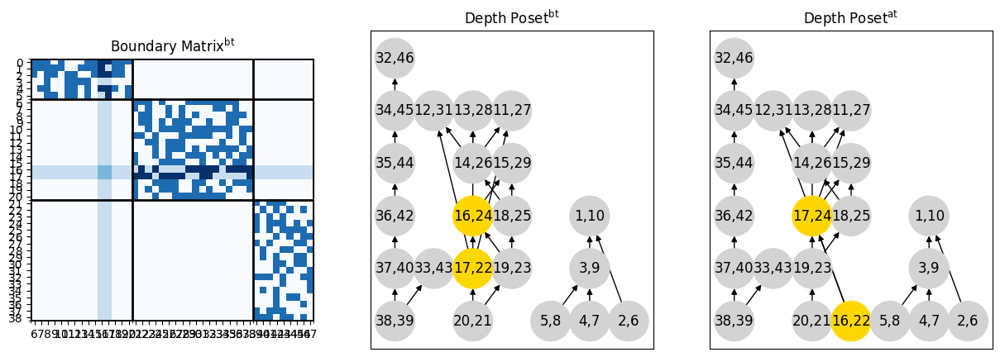

### Birth Death Pairs
|                          |                                                                                                                                                                                                                         |
|:-------------------------|:------------------------------------------------------------------------------------------------------------------------------------------------------------------------------------------------------------------------|
| Before the transposition | $\{(32, 46), (12, 31), (15, 29), (35, 44), (3, 9), (18, 25), (19, 23), (34, 45), (36, 42), (13, 28), (16, 24), (4, 7), (33, 43), (20, 21), (38, 39), (5, 8), (14, 26), (17, 22), (2, 6), (37, 40), (1, 10), (11, 27)\}$ |
| After the transposition  | $\{(32, 46), (12, 31), (17, 24), (16, 22), (15, 29), (35, 44), (3, 9), (18, 25), (19, 23), (34, 45), (36, 42), (13, 28), (4, 7), (33, 43), (20, 21), (38, 39), (5, 8), (14, 26), (2, 6), (37, 40), (1, 10), (11, 27)\}$ |

### Relations
|                          | Algorithm 1                                                                                                                                                                                                                                                                                                                                                                                                      | Algorithm 2                                                                                                                                                                                                                                                                                                                                                |
|:-------------------------|:-----------------------------------------------------------------------------------------------------------------------------------------------------------------------------------------------------------------------------------------------------------------------------------------------------------------------------------------------------------------------------------------------------------------|:-----------------------------------------------------------------------------------------------------------------------------------------------------------------------------------------------------------------------------------------------------------------------------------------------------------------------------------------------------------|
| Before the transposition | $\{(25, 29), (44, 45), (26, 27), (21, 28), (21, 31), (23, 28), (40, 44), (8, 9), (23, 25), (23, 31), (25, 28), (24, 29), (21, 24), (21, 30), (21, 27), (23, 24), (39, 41), (22, 28), (39, 44), (22, 31), (40, 46), (27, 30), (7, 9), (24, 28), (26, 28), (42, 46), (43, 47), (29, 30), (44, 46), (21, 29), (23, 26), (40, 42), (39, 40), (39, 46), (23, 29), (22, 30), (39, 43), (45, 47), (25, 26)\}$           | $\{(20, 11), (4, 0), (20, 14), (3, 1), (20, 17), (38, 32), (5, 1), (14, 13), (19, 12), (1, 0), (16, 13), (35, 32), (5, 0), (20, 19), (38, 37), (5, 3), (17, 11), (14, 12), (19, 11), (34, 30), (36, 30), (2, 1), (16, 15), (18, 12), (18, 15), (20, 18), (4, 1), (35, 34), (20, 15), (17, 16), (2, 0), (19, 16), (34, 32), (36, 35), (37, 34), (33, 30)\}$ |
| After the transposition  | $\{(25, 29), (44, 45), (26, 27), (21, 28), (21, 31), (23, 28), (40, 44), (8, 9), (23, 25), (23, 31), (22, 29), (25, 28), (24, 29), (21, 24), (21, 30), (21, 27), (39, 41), (23, 24), (39, 44), (22, 31), (40, 46), (27, 30), (7, 9), (24, 28), (26, 28), (42, 46), (43, 47), (29, 30), (44, 46), (21, 29), (23, 26), (40, 42), (39, 40), (39, 46), (23, 29), (22, 24), (39, 43), (22, 30), (45, 47), (25, 26)\}$ | $\{(20, 11), (4, 0), (20, 14), (3, 1), (20, 17), (38, 32), (5, 1), (14, 13), (17, 15), (19, 12), (1, 0), (35, 32), (5, 0), (20, 19), (38, 37), (5, 3), (14, 12), (17, 11), (34, 30), (36, 30), (2, 1), (19, 17), (18, 12), (18, 15), (20, 18), (4, 1), (35, 34), (20, 15), (17, 13), (2, 0), (34, 32), (36, 35), (37, 34), (33, 30), (16, 11), (16, 17)\}$ |

### Successors and Predecessers
|                 | $\text{Set}^\text{bt}(16, 24)$                             | $\text{Set}^\text{bt}(17, 22)$                             | $\text{Set}^\text{at}(16, 22)$                                       | $\text{Set}^\text{at}(17, 24)$                                       |
|:----------------|:-----------------------------------------------------------|:-----------------------------------------------------------|:---------------------------------------------------------------------|:---------------------------------------------------------------------|
| $\text{Succ}_1$ | $\text{Succ}_1^\text{bt}(16, 24) = \{(15, 29), (13, 28)\}$ | $\text{Succ}_1^\text{bt}(17, 22) = \{(13, 28), (12, 31)\}$ | $\text{Succ}_1^\text{at}(16, 22) = \{(15, 29), (17, 24), (12, 31)\}$ | $\text{Succ}_1^\text{at}(17, 24) = \{(15, 29), (13, 28)\}$           |
| $\text{Pred}_1$ | $\text{Pred}_1^\text{bt}(16, 24) = \{(20, 21), (19, 23)\}$ | $\text{Pred}_1^\text{bt}(17, 22) = \emptyset$              | $\text{Pred}_1^\text{at}(16, 22) = \emptyset$                        | $\text{Pred}_1^\text{at}(17, 24) = \{(20, 21), (16, 22), (19, 23)\}$ |
| $\text{Succ}_2$ | $\text{Succ}_2^\text{bt}(16, 24) = \{(15, 29), (13, 28)\}$ | $\text{Succ}_2^\text{bt}(17, 22) = \{(16, 24), (11, 27)\}$ | $\text{Succ}_2^\text{at}(16, 22) = \{(17, 24), (11, 27)\}$           | $\text{Succ}_2^\text{at}(17, 24) = \{(15, 29), (13, 28), (11, 27)\}$ |
| $\text{Pred}_2$ | $\text{Pred}_2^\text{bt}(16, 24) = \{(17, 22), (19, 23)\}$ | $\text{Pred}_2^\text{bt}(17, 22) = \{(20, 21)\}$           | $\text{Pred}_2^\text{at}(16, 22) = \emptyset$                        | $\text{Pred}_2^\text{at}(17, 24) = \{(20, 21), (16, 22), (19, 23)\}$ |

### Temp Sets
|                                                               | Before the Transposition                                | After the Transposition                                 |
|:--------------------------------------------------------------|:--------------------------------------------------------|:--------------------------------------------------------|
| $\mathcal{L} = \{(s, t)\in \text{BD}:\; f(t) < f(y)\}$        | $\{(5, 8), (3, 9), (2, 6), (1, 10), (4, 7), (20, 21)\}$ | $\{(5, 8), (3, 9), (2, 6), (1, 10), (4, 7), (20, 21)\}$ |
| $\mathcal{M} = \{(s, t)\in \text{BD}:\; f(y) < f(t) < f(b)\}$ | $\{(19, 23)\}$                                          | $\{(19, 23)\}$                                          |

### Equations
There are 1 equations are wrong.

| eq   | left (formula)                  | left (paramatrized)               | left (value)                       | right (formula)                                                                                           | right (paramatrized)                                                                                            | right (value)                      | correct   |
|:-----|:--------------------------------|:----------------------------------|:-----------------------------------|:----------------------------------------------------------------------------------------------------------|:----------------------------------------------------------------------------------------------------------------|:-----------------------------------|:----------|
| Eq08 | $\text{Succ}_1^\text{at}(a, y)$ | $\text{Succ}_1^\text{at}(16, 22)$ | $\{(15, 29), (17, 24), (12, 31)\}$ | $\text{Succ}_1^\text{bt}(x, y) \oplus \{(x, b)\} \oplus \text{Succ}_1^\text{bt}(a, b)$                    | $\text{Succ}_1^\text{bt}(17, 22) \oplus \{(17, 24)\} \oplus \text{Succ}_1^\text{bt}(16, 24)$                    | $\{(15, 29), (17, 24), (12, 31)\}$ | ✔         |
| Eq09 | $\text{Succ}_1^\text{at}(x, b)$ | $\text{Succ}_1^\text{at}(17, 24)$ | $\{(15, 29), (13, 28)\}$           | $\text{Succ}_1^\text{bt}(a, b)$                                                                           | $\text{Succ}_1^\text{bt}(16, 24)$                                                                               | $\{(15, 29), (13, 28)\}$           | ✔         |
| Eq10 | $\text{Pred}_1^\text{at}(a, y)$ | $\text{Pred}_1^\text{at}(16, 22)$ | $\emptyset$                        | $\text{Pred}_1^\text{bt}(x, y)$                                                                           | $\text{Pred}_1^\text{bt}(17, 22)$                                                                               | $\emptyset$                        | ✔         |
| Eq11 | $\text{Pred}_1^\text{at}(x, b)$ | $\text{Pred}_1^\text{at}(17, 24)$ | $\{(20, 21), (16, 22), (19, 23)\}$ | $\text{Pred}_1^\text{bt}(a, b) \oplus \{(a, y)\}$                                                         | $\text{Pred}_1^\text{bt}(16, 24) \oplus \{(16, 22)\}$                                                           | $\{(19, 23), (16, 22), (20, 21)\}$ | ✔         |
| Eq12 | $\text{Succ}_2^\text{at}(a, y)$ | $\text{Succ}_2^\text{at}(16, 22)$ | $\{(17, 24), (11, 27)\}$           | $\text{Succ}_2^\text{bt}(x, y) \oplus \{(x, b), (a, b)\}$                                                 | $\text{Succ}_2^\text{bt}(17, 22) \oplus \{(17, 24), (16, 24)\}$                                                 | $\{(17, 24), (11, 27)\}$           | ✔         |
| Eq13 | $\text{Succ}_2^\text{at}(x, b)$ | $\text{Succ}_2^\text{at}(17, 24)$ | $\{(15, 29), (13, 28), (11, 27)\}$ | $\text{Succ}_2^\text{bt}(a, b)$                                                                           | $\text{Succ}_2^\text{bt}(16, 24)$                                                                               | $\{(15, 29), (13, 28)\}$           | ✘         |
| Eq14 | $\text{Pred}_2^\text{at}(a, y)$ | $\text{Pred}_2^\text{at}(16, 22)$ | $\emptyset$                        | $[\text{Pred}_2^\text{bt}(a, b) \cap \mathcal{L}]$                                                        | $[\text{Pred}_2^\text{bt}(16, 24) \cap \mathcal{L}]$                                                            | $\emptyset$                        | ✔         |
| Eq15 | $\text{Pred}_2^\text{at}(x, b)$ | $\text{Pred}_2^\text{at}(17, 24)$ | $\{(20, 21), (16, 22), (19, 23)\}$ | $\text{Pred}_2^\text{bt}(x, y) \oplus \{(a, y)\} \oplus [\text{Pred}_2^\text{bt}(a, b) \cap \mathcal{M}]$ | $\text{Pred}_2^\text{bt}(17, 22) \oplus \{(16, 22)\} \oplus [\text{Pred}_2^\text{bt}(16, 24) \cap \mathcal{M}]$ | $\{(19, 23), (16, 22), (20, 21)\}$ | ✔         |

## Transposition <19, 20> in complex 7
Here is a __birth-birth__ __switch forward__ transposition <19, 20>.

$$
a = 19, \; b = 23, \; x = 20, \; y = 21
$$

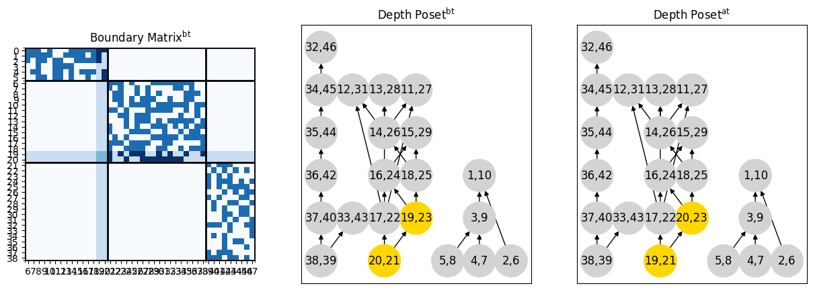

### Birth Death Pairs
|                          |                                                                                                                                                                                                                         |
|:-------------------------|:------------------------------------------------------------------------------------------------------------------------------------------------------------------------------------------------------------------------|
| Before the transposition | $\{(32, 46), (12, 31), (15, 29), (35, 44), (3, 9), (18, 25), (19, 23), (34, 45), (36, 42), (13, 28), (16, 24), (4, 7), (33, 43), (20, 21), (38, 39), (5, 8), (14, 26), (17, 22), (2, 6), (37, 40), (1, 10), (11, 27)\}$ |
| After the transposition  | $\{(32, 46), (20, 23), (12, 31), (19, 21), (15, 29), (35, 44), (3, 9), (18, 25), (34, 45), (36, 42), (13, 28), (16, 24), (4, 7), (33, 43), (38, 39), (5, 8), (14, 26), (17, 22), (2, 6), (37, 40), (1, 10), (11, 27)\}$ |

### Relations
|                          | Algorithm 1                                                                                                                                                                                                                                                                                                                                                                                            | Algorithm 2                                                                                                                                                                                                                                                                                                                                                                    |
|:-------------------------|:-------------------------------------------------------------------------------------------------------------------------------------------------------------------------------------------------------------------------------------------------------------------------------------------------------------------------------------------------------------------------------------------------------|:-------------------------------------------------------------------------------------------------------------------------------------------------------------------------------------------------------------------------------------------------------------------------------------------------------------------------------------------------------------------------------|
| Before the transposition | $\{(25, 29), (44, 45), (26, 27), (21, 28), (21, 31), (23, 28), (40, 44), (8, 9), (23, 25), (23, 31), (25, 28), (24, 29), (21, 24), (21, 30), (21, 27), (23, 24), (39, 41), (22, 28), (39, 44), (22, 31), (40, 46), (27, 30), (7, 9), (24, 28), (26, 28), (42, 46), (43, 47), (29, 30), (44, 46), (21, 29), (23, 26), (40, 42), (39, 40), (39, 46), (23, 29), (22, 30), (39, 43), (45, 47), (25, 26)\}$ | $\{(20, 11), (4, 0), (20, 14), (3, 1), (20, 17), (38, 32), (5, 1), (14, 13), (19, 12), (1, 0), (16, 13), (35, 32), (5, 0), (20, 19), (38, 37), (5, 3), (17, 11), (14, 12), (19, 11), (34, 30), (36, 30), (2, 1), (16, 15), (18, 12), (18, 15), (20, 18), (4, 1), (35, 34), (20, 15), (17, 16), (2, 0), (19, 16), (34, 32), (36, 35), (37, 34), (33, 30)\}$                     |
| After the transposition  | $\{(25, 29), (44, 45), (26, 27), (21, 25), (23, 28), (40, 44), (8, 9), (23, 25), (23, 31), (25, 28), (24, 29), (21, 30), (21, 27), (23, 24), (39, 41), (22, 28), (39, 44), (22, 31), (40, 46), (27, 30), (7, 9), (24, 28), (26, 28), (42, 46), (21, 23), (43, 47), (29, 30), (44, 46), (21, 26), (23, 26), (40, 42), (39, 40), (39, 46), (23, 29), (22, 30), (39, 43), (45, 47), (25, 26)\}$           | $\{(20, 11), (4, 0), (20, 14), (3, 1), (38, 32), (5, 1), (14, 13), (1, 0), (19, 18), (19, 15), (16, 13), (35, 32), (5, 0), (38, 37), (5, 3), (17, 11), (14, 12), (19, 11), (34, 30), (19, 14), (36, 30), (2, 1), (19, 17), (19, 20), (16, 15), (18, 12), (18, 15), (20, 12), (20, 18), (4, 1), (35, 34), (20, 15), (17, 16), (2, 0), (34, 32), (36, 35), (37, 34), (33, 30)\}$ |

### Successors and Predecessers
|                 | $\text{Set}^\text{bt}(19, 23)$                                                                     | $\text{Set}^\text{bt}(20, 21)$                                                                     | $\text{Set}^\text{at}(19, 21)$                                                                     | $\text{Set}^\text{at}(20, 23)$                                                                     |
|:----------------|:---------------------------------------------------------------------------------------------------|:---------------------------------------------------------------------------------------------------|:---------------------------------------------------------------------------------------------------|:---------------------------------------------------------------------------------------------------|
| $\text{Succ}_1$ | $\text{Succ}_1^\text{bt}(19, 23) = \{(14, 26), (15, 29), (13, 28), (18, 25), (12, 31), (16, 24)\}$ | $\text{Succ}_1^\text{bt}(20, 21) = \{(15, 29), (13, 28), (12, 31), (16, 24), (11, 27)\}$           | $\text{Succ}_1^\text{at}(19, 21) = \{(20, 23), (14, 26), (11, 27), (18, 25)\}$                     | $\text{Succ}_1^\text{at}(20, 23) = \{(14, 26), (15, 29), (13, 28), (18, 25), (12, 31), (16, 24)\}$ |
| $\text{Pred}_1$ | $\text{Pred}_1^\text{bt}(19, 23) = \emptyset$                                                      | $\text{Pred}_1^\text{bt}(20, 21) = \emptyset$                                                      | $\text{Pred}_1^\text{at}(19, 21) = \emptyset$                                                      | $\text{Pred}_1^\text{at}(20, 23) = \{(19, 21)\}$                                                   |
| $\text{Succ}_2$ | $\text{Succ}_2^\text{bt}(19, 23) = \{(16, 24), (11, 27), (12, 31)\}$                               | $\text{Succ}_2^\text{bt}(20, 21) = \{(19, 23), (14, 26), (17, 22), (15, 29), (18, 25), (11, 27)\}$ | $\text{Succ}_2^\text{at}(19, 21) = \{(20, 23), (14, 26), (17, 22), (15, 29), (18, 25), (11, 27)\}$ | $\text{Succ}_2^\text{at}(20, 23) = \{(14, 26), (15, 29), (18, 25), (12, 31), (11, 27)\}$           |
| $\text{Pred}_2$ | $\text{Pred}_2^\text{bt}(19, 23) = \{(20, 21)\}$                                                   | $\text{Pred}_2^\text{bt}(20, 21) = \emptyset$                                                      | $\text{Pred}_2^\text{at}(19, 21) = \emptyset$                                                      | $\text{Pred}_2^\text{at}(20, 23) = \{(19, 21)\}$                                                   |

### Temp Sets
|                                                               | Before the Transposition                      | After the Transposition                       |
|:--------------------------------------------------------------|:----------------------------------------------|:----------------------------------------------|
| $\mathcal{L} = \{(s, t)\in \text{BD}:\; f(t) < f(y)\}$        | $\{(5, 8), (3, 9), (2, 6), (1, 10), (4, 7)\}$ | $\{(5, 8), (3, 9), (2, 6), (1, 10), (4, 7)\}$ |
| $\mathcal{M} = \{(s, t)\in \text{BD}:\; f(y) < f(t) < f(b)\}$ | $\{(17, 22)\}$                                | $\{(17, 22)\}$                                |

### Equations
There are 1 equations are wrong.

| eq   | left (formula)                  | left (paramatrized)               | left (value)                                                     | right (formula)                                                                                           | right (paramatrized)                                                                                            | right (value)                                                    | correct   |
|:-----|:--------------------------------|:----------------------------------|:-----------------------------------------------------------------|:----------------------------------------------------------------------------------------------------------|:----------------------------------------------------------------------------------------------------------------|:-----------------------------------------------------------------|:----------|
| Eq08 | $\text{Succ}_1^\text{at}(a, y)$ | $\text{Succ}_1^\text{at}(19, 21)$ | $\{(20, 23), (14, 26), (11, 27), (18, 25)\}$                     | $\text{Succ}_1^\text{bt}(x, y) \oplus \{(x, b)\} \oplus \text{Succ}_1^\text{bt}(a, b)$                    | $\text{Succ}_1^\text{bt}(20, 21) \oplus \{(20, 23)\} \oplus \text{Succ}_1^\text{bt}(19, 23)$                    | $\{(20, 23), (14, 26), (11, 27), (18, 25)\}$                     | ✔         |
| Eq09 | $\text{Succ}_1^\text{at}(x, b)$ | $\text{Succ}_1^\text{at}(20, 23)$ | $\{(14, 26), (15, 29), (13, 28), (18, 25), (12, 31), (16, 24)\}$ | $\text{Succ}_1^\text{bt}(a, b)$                                                                           | $\text{Succ}_1^\text{bt}(19, 23)$                                                                               | $\{(14, 26), (15, 29), (13, 28), (18, 25), (12, 31), (16, 24)\}$ | ✔         |
| Eq10 | $\text{Pred}_1^\text{at}(a, y)$ | $\text{Pred}_1^\text{at}(19, 21)$ | $\emptyset$                                                      | $\text{Pred}_1^\text{bt}(x, y)$                                                                           | $\text{Pred}_1^\text{bt}(20, 21)$                                                                               | $\emptyset$                                                      | ✔         |
| Eq11 | $\text{Pred}_1^\text{at}(x, b)$ | $\text{Pred}_1^\text{at}(20, 23)$ | $\{(19, 21)\}$                                                   | $\text{Pred}_1^\text{bt}(a, b) \oplus \{(a, y)\}$                                                         | $\text{Pred}_1^\text{bt}(19, 23) \oplus \{(19, 21)\}$                                                           | $\{(19, 21)\}$                                                   | ✔         |
| Eq12 | $\text{Succ}_2^\text{at}(a, y)$ | $\text{Succ}_2^\text{at}(19, 21)$ | $\{(20, 23), (14, 26), (17, 22), (15, 29), (18, 25), (11, 27)\}$ | $\text{Succ}_2^\text{bt}(x, y) \oplus \{(x, b), (a, b)\}$                                                 | $\text{Succ}_2^\text{bt}(20, 21) \oplus \{(20, 23), (19, 23)\}$                                                 | $\{(20, 23), (14, 26), (17, 22), (15, 29), (18, 25), (11, 27)\}$ | ✔         |
| Eq13 | $\text{Succ}_2^\text{at}(x, b)$ | $\text{Succ}_2^\text{at}(20, 23)$ | $\{(14, 26), (15, 29), (18, 25), (12, 31), (11, 27)\}$           | $\text{Succ}_2^\text{bt}(a, b)$                                                                           | $\text{Succ}_2^\text{bt}(19, 23)$                                                                               | $\{(16, 24), (11, 27), (12, 31)\}$                               | ✘         |
| Eq14 | $\text{Pred}_2^\text{at}(a, y)$ | $\text{Pred}_2^\text{at}(19, 21)$ | $\emptyset$                                                      | $[\text{Pred}_2^\text{bt}(a, b) \cap \mathcal{L}]$                                                        | $[\text{Pred}_2^\text{bt}(19, 23) \cap \mathcal{L}]$                                                            | $\emptyset$                                                      | ✔         |
| Eq15 | $\text{Pred}_2^\text{at}(x, b)$ | $\text{Pred}_2^\text{at}(20, 23)$ | $\{(19, 21)\}$                                                   | $\text{Pred}_2^\text{bt}(x, y) \oplus \{(a, y)\} \oplus [\text{Pred}_2^\text{bt}(a, b) \cap \mathcal{M}]$ | $\text{Pred}_2^\text{bt}(20, 21) \oplus \{(19, 21)\} \oplus [\text{Pred}_2^\text{bt}(19, 23) \cap \mathcal{M}]$ | $\{(19, 21)\}$                                                   | ✔         |

## Transposition <22, 23> in complex 7
Here is a __death-death__ __no switch__ transposition <22, 23>.

$$
a = 19, \; b = 23, \; x = 17, \; y = 22
$$

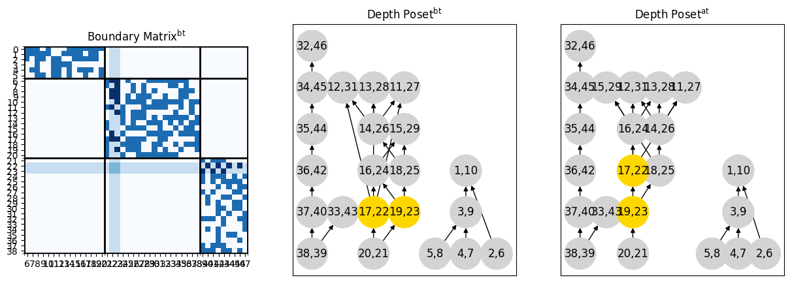

### Birth Death Pairs
|                          |                                                                                                                                                                                                                         |
|:-------------------------|:------------------------------------------------------------------------------------------------------------------------------------------------------------------------------------------------------------------------|
| Before the transposition | $\{(32, 46), (12, 31), (15, 29), (35, 44), (3, 9), (18, 25), (19, 23), (34, 45), (36, 42), (13, 28), (16, 24), (4, 7), (33, 43), (20, 21), (38, 39), (5, 8), (14, 26), (17, 22), (2, 6), (37, 40), (1, 10), (11, 27)\}$ |
| After the transposition  | $\{(32, 46), (12, 31), (15, 29), (35, 44), (3, 9), (18, 25), (19, 23), (34, 45), (36, 42), (13, 28), (16, 24), (4, 7), (33, 43), (20, 21), (38, 39), (5, 8), (14, 26), (17, 22), (2, 6), (37, 40), (1, 10), (11, 27)\}$ |

### Relations
|                          | Algorithm 1                                                                                                                                                                                                                                                                                                                                                                                            | Algorithm 2                                                                                                                                                                                                                                                                                                                                                |
|:-------------------------|:-------------------------------------------------------------------------------------------------------------------------------------------------------------------------------------------------------------------------------------------------------------------------------------------------------------------------------------------------------------------------------------------------------|:-----------------------------------------------------------------------------------------------------------------------------------------------------------------------------------------------------------------------------------------------------------------------------------------------------------------------------------------------------------|
| Before the transposition | $\{(25, 29), (44, 45), (26, 27), (21, 28), (21, 31), (23, 28), (40, 44), (8, 9), (23, 25), (23, 31), (25, 28), (24, 29), (21, 24), (21, 30), (21, 27), (23, 24), (39, 41), (22, 28), (39, 44), (22, 31), (40, 46), (27, 30), (7, 9), (24, 28), (26, 28), (42, 46), (43, 47), (29, 30), (44, 46), (21, 29), (23, 26), (40, 42), (39, 40), (39, 46), (23, 29), (22, 30), (39, 43), (45, 47), (25, 26)\}$ | $\{(20, 11), (4, 0), (20, 14), (3, 1), (20, 17), (38, 32), (5, 1), (14, 13), (19, 12), (1, 0), (16, 13), (35, 32), (5, 0), (20, 19), (38, 37), (5, 3), (17, 11), (14, 12), (19, 11), (34, 30), (36, 30), (2, 1), (16, 15), (18, 12), (18, 15), (20, 18), (4, 1), (35, 34), (20, 15), (17, 16), (2, 0), (19, 16), (34, 32), (36, 35), (37, 34), (33, 30)\}$ |
| After the transposition  | $\{(25, 29), (44, 45), (26, 27), (21, 28), (21, 31), (23, 28), (40, 44), (8, 9), (23, 25), (23, 31), (25, 28), (24, 29), (21, 24), (21, 30), (21, 27), (39, 41), (23, 24), (22, 28), (39, 44), (22, 31), (40, 46), (27, 30), (7, 9), (24, 28), (26, 28), (42, 46), (43, 47), (29, 30), (44, 46), (21, 29), (23, 26), (40, 42), (22, 30), (39, 40), (23, 29), (39, 46), (39, 43), (45, 47), (25, 26)\}$ | $\{(20, 11), (4, 0), (20, 14), (3, 1), (20, 17), (38, 32), (5, 1), (14, 13), (19, 12), (1, 0), (16, 13), (35, 32), (5, 0), (20, 19), (38, 37), (5, 3), (17, 11), (14, 12), (34, 30), (36, 30), (2, 1), (19, 17), (16, 15), (18, 12), (18, 15), (20, 18), (4, 1), (35, 34), (20, 15), (17, 16), (2, 0), (34, 32), (36, 35), (37, 34), (33, 30)\}$           |

### Successors and Predecessers
No such node in the Depth Poset

### Temp Sets
|                                                               | Before the Transposition                                                                                 | After the Transposition                                                                                  |
|:--------------------------------------------------------------|:---------------------------------------------------------------------------------------------------------|:---------------------------------------------------------------------------------------------------------|
| $\mathcal{B} = \{(s, t)\in \text{BD}:\; f(s) > f(x)\}$        | $\{(38, 39), (19, 23), (32, 46), (34, 45), (36, 42), (35, 44), (37, 40), (18, 25), (33, 43), (20, 21)\}$ | $\{(38, 39), (19, 23), (32, 46), (34, 45), (36, 42), (35, 44), (37, 40), (18, 25), (33, 43), (20, 21)\}$ |
| $\mathcal{N} = \{(s, t)\in \text{BD}:\; f(x) > f(s) > f(a)\}$ | $\emptyset$                                                                                              | $\emptyset$                                                                                              |

### Equations
There are 2 equations are wrong.

| eq   | left (formula)                  | left (paramatrized)               | left (value)             | right (formula)                                                                        | right (paramatrized)                                                                         | right (value)            | correct   |
|:-----|:--------------------------------|:----------------------------------|:-------------------------|:---------------------------------------------------------------------------------------|:---------------------------------------------------------------------------------------------|:-------------------------|:----------|
| Eq36 | $\text{Succ}_2^\text{at}(x, y)$ | $\text{Succ}_2^\text{at}(17, 22)$ | $\{(16, 24), (11, 27)\}$ | $\text{Succ}_2^\text{bt}(x, y) \oplus \{(a, b)\} \oplus \text{Succ}_2^\text{bt}(a, b)$ | $\text{Succ}_2^\text{bt}(17, 22) \oplus \{(19, 23)\} \oplus \text{Succ}_2^\text{bt}(19, 23)$ | $\{(12, 31), (19, 23)\}$ | ✘         |
| Eq37 | $\text{Pred}_2^\text{at}(a, b)$ | $\text{Pred}_2^\text{at}(19, 23)$ | $\{(20, 21)\}$           | $\text{Pred}_2^\text{bt}(a, b) \oplus \{(x, y)\}$                                      | $\text{Pred}_2^\text{bt}(19, 23) \oplus \{(17, 22)\}$                                        | $\{(17, 22), (20, 21)\}$ | ✘         |

## Transposition <25, 26> in complex 7
Here is a __death-death__ __switch forward__ transposition <25, 26>.

$$
a = 14, \; b = 26, \; x = 18, \; y = 25
$$

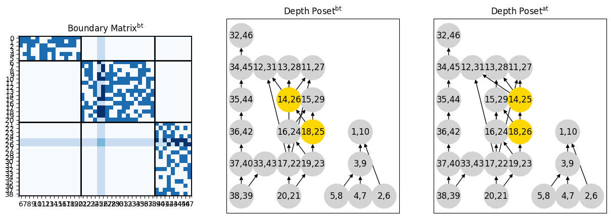

### Birth Death Pairs
|                          |                                                                                                                                                                                                                         |
|:-------------------------|:------------------------------------------------------------------------------------------------------------------------------------------------------------------------------------------------------------------------|
| Before the transposition | $\{(32, 46), (12, 31), (15, 29), (35, 44), (3, 9), (18, 25), (19, 23), (34, 45), (36, 42), (13, 28), (16, 24), (4, 7), (33, 43), (20, 21), (38, 39), (5, 8), (14, 26), (17, 22), (2, 6), (37, 40), (1, 10), (11, 27)\}$ |
| After the transposition  | $\{(32, 46), (18, 26), (14, 25), (12, 31), (15, 29), (35, 44), (3, 9), (19, 23), (34, 45), (36, 42), (13, 28), (16, 24), (4, 7), (33, 43), (20, 21), (38, 39), (5, 8), (17, 22), (2, 6), (37, 40), (1, 10), (11, 27)\}$ |

### Relations
|                          | Algorithm 1                                                                                                                                                                                                                                                                                                                                                                                            | Algorithm 2                                                                                                                                                                                                                                                                                                                                                          |
|:-------------------------|:-------------------------------------------------------------------------------------------------------------------------------------------------------------------------------------------------------------------------------------------------------------------------------------------------------------------------------------------------------------------------------------------------------|:---------------------------------------------------------------------------------------------------------------------------------------------------------------------------------------------------------------------------------------------------------------------------------------------------------------------------------------------------------------------|
| Before the transposition | $\{(25, 29), (44, 45), (26, 27), (21, 28), (21, 31), (23, 28), (40, 44), (8, 9), (23, 25), (23, 31), (25, 28), (24, 29), (21, 24), (21, 30), (21, 27), (23, 24), (39, 41), (22, 28), (39, 44), (22, 31), (40, 46), (27, 30), (7, 9), (24, 28), (26, 28), (42, 46), (43, 47), (29, 30), (44, 46), (21, 29), (23, 26), (40, 42), (39, 40), (39, 46), (23, 29), (22, 30), (39, 43), (45, 47), (25, 26)\}$ | $\{(20, 11), (4, 0), (20, 14), (3, 1), (20, 17), (38, 32), (5, 1), (14, 13), (19, 12), (1, 0), (16, 13), (35, 32), (5, 0), (20, 19), (38, 37), (5, 3), (17, 11), (14, 12), (19, 11), (34, 30), (36, 30), (2, 1), (16, 15), (18, 12), (18, 15), (20, 18), (4, 1), (35, 34), (20, 15), (17, 16), (2, 0), (19, 16), (34, 32), (36, 35), (37, 34), (33, 30)\}$           |
| After the transposition  | $\{(44, 45), (21, 28), (21, 31), (23, 28), (40, 44), (8, 9), (23, 25), (23, 31), (24, 29), (26, 29), (21, 24), (21, 30), (39, 41), (21, 27), (23, 24), (22, 28), (39, 44), (22, 31), (40, 46), (27, 30), (7, 9), (24, 28), (26, 25), (25, 27), (26, 28), (25, 30), (42, 46), (43, 47), (29, 30), (44, 46), (21, 29), (23, 26), (40, 42), (39, 40), (39, 46), (23, 29), (22, 30), (39, 43), (45, 47)\}$ | $\{(20, 11), (4, 0), (20, 14), (3, 1), (20, 17), (38, 32), (5, 1), (14, 13), (19, 12), (1, 0), (16, 13), (35, 32), (18, 13), (5, 0), (20, 19), (38, 37), (5, 3), (17, 11), (14, 12), (19, 11), (34, 30), (36, 30), (2, 1), (16, 15), (18, 15), (20, 18), (4, 1), (35, 34), (20, 15), (17, 16), (2, 0), (19, 16), (34, 32), (36, 35), (37, 34), (33, 30), (18, 14)\}$ |

### Successors and Predecessers
|                 | $\text{Set}^\text{bt}(14, 26)$                             | $\text{Set}^\text{bt}(18, 25)$                                       | $\text{Set}^\text{at}(18, 26)$                                       | $\text{Set}^\text{at}(14, 25)$                             |
|:----------------|:-----------------------------------------------------------|:---------------------------------------------------------------------|:---------------------------------------------------------------------|:-----------------------------------------------------------|
| $\text{Succ}_1$ | $\text{Succ}_1^\text{bt}(14, 26) = \{(13, 28), (11, 27)\}$ | $\text{Succ}_1^\text{bt}(18, 25) = \{(15, 29), (14, 26), (13, 28)\}$ | $\text{Succ}_1^\text{at}(18, 26) = \{(15, 29), (14, 25), (13, 28)\}$ | $\text{Succ}_1^\text{at}(14, 25) = \{(11, 27)\}$           |
| $\text{Pred}_1$ | $\text{Pred}_1^\text{bt}(14, 26) = \{(18, 25), (19, 23)\}$ | $\text{Pred}_1^\text{bt}(18, 25) = \{(19, 23)\}$                     | $\text{Pred}_1^\text{at}(18, 26) = \{(19, 23)\}$                     | $\text{Pred}_1^\text{at}(14, 25) = \{(18, 26), (19, 23)\}$ |
| $\text{Succ}_2$ | $\text{Succ}_2^\text{bt}(14, 26) = \{(13, 28), (12, 31)\}$ | $\text{Succ}_2^\text{bt}(18, 25) = \{(15, 29), (12, 31)\}$           | $\text{Succ}_2^\text{at}(18, 26) = \{(15, 29), (14, 25), (13, 28)\}$ | $\text{Succ}_2^\text{at}(14, 25) = \{(13, 28), (12, 31)\}$ |
| $\text{Pred}_2$ | $\text{Pred}_2^\text{bt}(14, 26) = \{(20, 21)\}$           | $\text{Pred}_2^\text{bt}(18, 25) = \{(20, 21)\}$                     | $\text{Pred}_2^\text{at}(18, 26) = \{(20, 21)\}$                     | $\text{Pred}_2^\text{at}(14, 25) = \{(18, 26), (20, 21)\}$ |

### Temp Sets
|                                                               | Before the Transposition                                                                       | After the Transposition                                                                        |
|:--------------------------------------------------------------|:-----------------------------------------------------------------------------------------------|:-----------------------------------------------------------------------------------------------|
| $\mathcal{B} = \{(s, t)\in \text{BD}:\; f(s) > f(x)\}$        | $\{(38, 39), (19, 23), (32, 46), (34, 45), (36, 42), (35, 44), (37, 40), (33, 43), (20, 21)\}$ | $\{(38, 39), (19, 23), (32, 46), (34, 45), (36, 42), (35, 44), (37, 40), (33, 43), (20, 21)\}$ |
| $\mathcal{N} = \{(s, t)\in \text{BD}:\; f(x) > f(s) > f(a)\}$ | $\{(17, 22), (15, 29), (16, 24)\}$                                                             | $\{(17, 22), (15, 29), (16, 24)\}$                                                             |

### Equations
There are 1 equations are wrong.

| eq   | left (formula)                  | left (paramatrized)               | left (value)                       | right (formula)                                                                                          | right (paramatrized)                                                                                           | right (value)                      | correct   |
|:-----|:--------------------------------|:----------------------------------|:-----------------------------------|:---------------------------------------------------------------------------------------------------------|:---------------------------------------------------------------------------------------------------------------|:-----------------------------------|:----------|
| Eq28 | $\text{Succ}_1^\text{at}(x, b)$ | $\text{Succ}_1^\text{at}(18, 26)$ | $\{(15, 29), (14, 25), (13, 28)\}$ | $\text{Succ}_1^\text{bt}(x, y) \oplus \{(a, y), (a, b)\}$                                                | $\text{Succ}_1^\text{bt}(18, 25) \oplus \{(14, 25), (14, 26)\}$                                                | $\{(14, 25), (15, 29), (13, 28)\}$ | ✔         |
| Eq29 | $\text{Succ}_1^\text{at}(a, y)$ | $\text{Succ}_1^\text{at}(14, 25)$ | $\{(11, 27)\}$                     | $\text{Succ}_1^\text{bt}(a, b)$                                                                          | $\text{Succ}_1^\text{bt}(14, 26)$                                                                              | $\{(13, 28), (11, 27)\}$           | ✘         |
| Eq30 | $\text{Pred}_1^\text{at}(x, b)$ | $\text{Pred}_1^\text{at}(18, 26)$ | $\{(19, 23)\}$                     | $[\text{Pred}_1^\text{bt}(a, b) \cap \mathcal{B}]$                                                       | $[\text{Pred}_1^\text{bt}(14, 26) \cap \mathcal{B}]$                                                           | $\{(19, 23)\}$                     | ✔         |
| Eq31 | $\text{Pred}_1^\text{at}(a, y)$ | $\text{Pred}_1^\text{at}(14, 25)$ | $\{(18, 26), (19, 23)\}$           | $\text{Pred}_1^\text{bt}(x, y) \oplus \{(x, b)\} \oplus[\text{Pred}_1^\text{bt}(a, b) \cap \mathcal{N}]$ | $\text{Pred}_1^\text{bt}(18, 25) \oplus \{(18, 26)\} \oplus[\text{Pred}_1^\text{bt}(14, 26) \cap \mathcal{N}]$ | $\{(18, 26), (19, 23)\}$           | ✔         |
| Eq32 | $\text{Succ}_2^\text{at}(x, b)$ | $\text{Succ}_2^\text{at}(18, 26)$ | $\{(15, 29), (14, 25), (13, 28)\}$ | $\text{Succ}_2^\text{bt}(x, y) \oplus \{(a, y)\} \oplus \text{Succ}_2^\text{bt}(a, b)$                   | $\text{Succ}_2^\text{bt}(18, 25) \oplus \{(14, 25)\} \oplus \text{Succ}_2^\text{bt}(14, 26)$                   | $\{(15, 29), (14, 25), (13, 28)\}$ | ✔         |
| Eq33 | $\text{Succ}_2^\text{at}(a, y)$ | $\text{Succ}_2^\text{at}(14, 25)$ | $\{(13, 28), (12, 31)\}$           | $\text{Succ}_2^\text{bt}(a, b)$                                                                          | $\text{Succ}_2^\text{bt}(14, 26)$                                                                              | $\{(13, 28), (12, 31)\}$           | ✔         |
| Eq34 | $\text{Pred}_2^\text{at}(x, b)$ | $\text{Pred}_2^\text{at}(18, 26)$ | $\{(20, 21)\}$                     | $\text{Pred}_2^\text{bt}(x, y)$                                                                          | $\text{Pred}_2^\text{bt}(18, 25)$                                                                              | $\{(20, 21)\}$                     | ✔         |
| Eq35 | $\text{Pred}_2^\text{at}(a, y)$ | $\text{Pred}_2^\text{at}(14, 25)$ | $\{(18, 26), (20, 21)\}$           | $\text{Pred}_2^\text{bt}(a, b) \oplus \{(x, b)\}$                                                        | $\text{Pred}_2^\text{bt}(14, 26) \oplus \{(18, 26)\}$                                                          | $\{(18, 26), (20, 21)\}$           | ✔         |

## Transposition <27, 28> in complex 7
Here is a __death-death__ __no switch__ transposition <27, 28>.

$$
a = 13, \; b = 28, \; x = 11, \; y = 27
$$

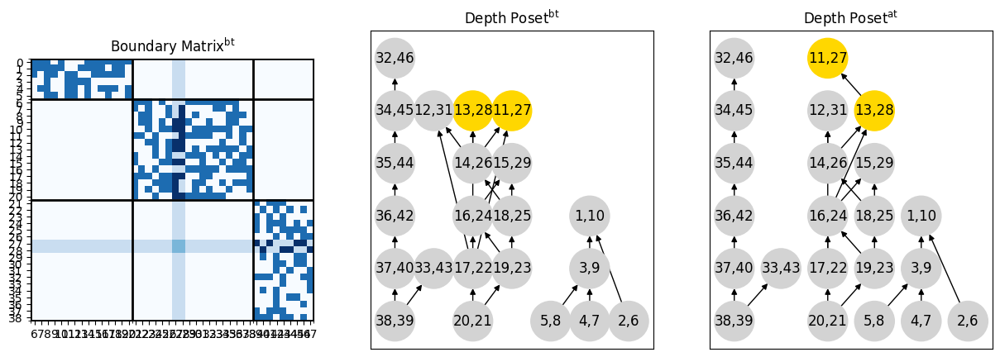

### Birth Death Pairs
|                          |                                                                                                                                                                                                                         |
|:-------------------------|:------------------------------------------------------------------------------------------------------------------------------------------------------------------------------------------------------------------------|
| Before the transposition | $\{(32, 46), (12, 31), (15, 29), (35, 44), (3, 9), (18, 25), (19, 23), (34, 45), (36, 42), (13, 28), (16, 24), (4, 7), (33, 43), (20, 21), (38, 39), (5, 8), (14, 26), (17, 22), (2, 6), (37, 40), (1, 10), (11, 27)\}$ |
| After the transposition  | $\{(32, 46), (12, 31), (15, 29), (35, 44), (3, 9), (18, 25), (19, 23), (34, 45), (36, 42), (13, 28), (16, 24), (4, 7), (33, 43), (20, 21), (38, 39), (5, 8), (14, 26), (17, 22), (2, 6), (37, 40), (1, 10), (11, 27)\}$ |

### Relations
|                          | Algorithm 1                                                                                                                                                                                                                                                                                                                                                                                            | Algorithm 2                                                                                                                                                                                                                                                                                                                                                          |
|:-------------------------|:-------------------------------------------------------------------------------------------------------------------------------------------------------------------------------------------------------------------------------------------------------------------------------------------------------------------------------------------------------------------------------------------------------|:---------------------------------------------------------------------------------------------------------------------------------------------------------------------------------------------------------------------------------------------------------------------------------------------------------------------------------------------------------------------|
| Before the transposition | $\{(25, 29), (44, 45), (26, 27), (21, 28), (21, 31), (23, 28), (40, 44), (8, 9), (23, 25), (23, 31), (25, 28), (24, 29), (21, 24), (21, 30), (21, 27), (23, 24), (39, 41), (22, 28), (39, 44), (22, 31), (40, 46), (27, 30), (7, 9), (24, 28), (26, 28), (42, 46), (43, 47), (29, 30), (44, 46), (21, 29), (23, 26), (40, 42), (39, 40), (39, 46), (23, 29), (22, 30), (39, 43), (45, 47), (25, 26)\}$ | $\{(20, 11), (4, 0), (20, 14), (3, 1), (20, 17), (38, 32), (5, 1), (14, 13), (19, 12), (1, 0), (16, 13), (35, 32), (5, 0), (20, 19), (38, 37), (5, 3), (17, 11), (14, 12), (19, 11), (34, 30), (36, 30), (2, 1), (16, 15), (18, 12), (18, 15), (20, 18), (4, 1), (35, 34), (20, 15), (17, 16), (2, 0), (19, 16), (34, 32), (36, 35), (37, 34), (33, 30)\}$           |
| After the transposition  | $\{(25, 29), (44, 45), (26, 27), (21, 28), (21, 31), (23, 28), (40, 44), (8, 9), (23, 25), (23, 31), (25, 28), (24, 29), (21, 24), (21, 30), (39, 41), (21, 27), (23, 24), (22, 28), (39, 44), (22, 31), (40, 46), (27, 30), (7, 9), (24, 28), (26, 28), (42, 46), (43, 47), (29, 30), (44, 46), (21, 29), (23, 26), (40, 42), (39, 40), (39, 46), (23, 29), (22, 30), (39, 43), (45, 47), (25, 26)\}$ | $\{(20, 11), (4, 0), (20, 14), (3, 1), (20, 17), (38, 32), (5, 1), (14, 13), (19, 12), (1, 0), (13, 11), (16, 13), (35, 32), (5, 0), (20, 19), (38, 37), (5, 3), (17, 11), (14, 12), (19, 11), (34, 30), (36, 30), (2, 1), (16, 15), (18, 12), (18, 15), (20, 18), (4, 1), (35, 34), (20, 15), (17, 16), (2, 0), (19, 16), (34, 32), (36, 35), (37, 34), (33, 30)\}$ |

### Successors and Predecessers
No such node in the Depth Poset

### Temp Sets
|                                                               | Before the Transposition                                                                                                                                             | After the Transposition                                                                                                                                              |
|:--------------------------------------------------------------|:---------------------------------------------------------------------------------------------------------------------------------------------------------------------|:---------------------------------------------------------------------------------------------------------------------------------------------------------------------|
| $\mathcal{B} = \{(s, t)\in \text{BD}:\; f(s) > f(x)\}$        | $\{(38, 39), (19, 23), (32, 46), (34, 45), (36, 42), (14, 26), (17, 22), (15, 29), (35, 44), (37, 40), (18, 25), (13, 28), (16, 24), (12, 31), (33, 43), (20, 21)\}$ | $\{(38, 39), (19, 23), (32, 46), (34, 45), (36, 42), (14, 26), (17, 22), (15, 29), (35, 44), (37, 40), (18, 25), (13, 28), (16, 24), (12, 31), (33, 43), (20, 21)\}$ |
| $\mathcal{N} = \{(s, t)\in \text{BD}:\; f(x) > f(s) > f(a)\}$ | $\emptyset$                                                                                                                                                          | $\emptyset$                                                                                                                                                          |

### Equations
There are 2 equations are wrong.

| eq   | left (formula)                  | left (paramatrized)               | left (value)             | right (formula)                                                                        | right (paramatrized)                                                                         | right (value)                      | correct   |
|:-----|:--------------------------------|:----------------------------------|:-------------------------|:---------------------------------------------------------------------------------------|:---------------------------------------------------------------------------------------------|:-----------------------------------|:----------|
| Eq36 | $\text{Succ}_2^\text{at}(x, y)$ | $\text{Succ}_2^\text{at}(11, 27)$ | $\emptyset$              | $\text{Succ}_2^\text{bt}(x, y) \oplus \{(a, b)\} \oplus \text{Succ}_2^\text{bt}(a, b)$ | $\text{Succ}_2^\text{bt}(11, 27) \oplus \{(13, 28)\} \oplus \text{Succ}_2^\text{bt}(13, 28)$ | $\{(13, 28)\}$                     | ✘         |
| Eq37 | $\text{Pred}_2^\text{at}(a, b)$ | $\text{Pred}_2^\text{at}(13, 28)$ | $\{(16, 24), (14, 26)\}$ | $\text{Pred}_2^\text{bt}(a, b) \oplus \{(x, y)\}$                                      | $\text{Pred}_2^\text{bt}(13, 28) \oplus \{(11, 27)\}$                                        | $\{(16, 24), (14, 26), (11, 27)\}$ | ✘         |

## Transposition <28, 29> in complex 7
Here is a __death-death__ __no switch__ transposition <28, 29>.

$$
a = 15, \; b = 29, \; x = 13, \; y = 28
$$

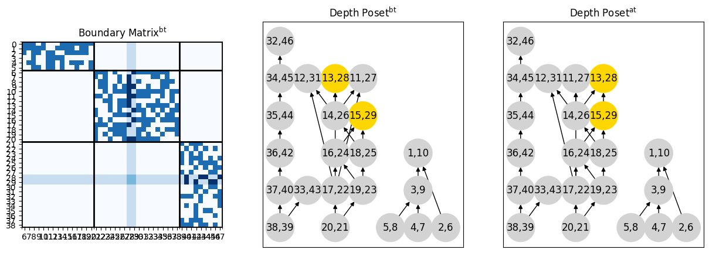

### Birth Death Pairs
|                          |                                                                                                                                                                                                                         |
|:-------------------------|:------------------------------------------------------------------------------------------------------------------------------------------------------------------------------------------------------------------------|
| Before the transposition | $\{(32, 46), (12, 31), (15, 29), (35, 44), (3, 9), (18, 25), (19, 23), (34, 45), (36, 42), (13, 28), (16, 24), (4, 7), (33, 43), (20, 21), (38, 39), (5, 8), (14, 26), (17, 22), (2, 6), (37, 40), (1, 10), (11, 27)\}$ |
| After the transposition  | $\{(32, 46), (12, 31), (15, 29), (35, 44), (3, 9), (18, 25), (19, 23), (34, 45), (36, 42), (13, 28), (16, 24), (4, 7), (33, 43), (20, 21), (38, 39), (5, 8), (14, 26), (17, 22), (2, 6), (37, 40), (1, 10), (11, 27)\}$ |

### Relations
|                          | Algorithm 1                                                                                                                                                                                                                                                                                                                                                                                            | Algorithm 2                                                                                                                                                                                                                                                                                                                                                          |
|:-------------------------|:-------------------------------------------------------------------------------------------------------------------------------------------------------------------------------------------------------------------------------------------------------------------------------------------------------------------------------------------------------------------------------------------------------|:---------------------------------------------------------------------------------------------------------------------------------------------------------------------------------------------------------------------------------------------------------------------------------------------------------------------------------------------------------------------|
| Before the transposition | $\{(25, 29), (44, 45), (26, 27), (21, 28), (21, 31), (23, 28), (40, 44), (8, 9), (23, 25), (23, 31), (25, 28), (24, 29), (21, 24), (21, 30), (21, 27), (23, 24), (39, 41), (22, 28), (39, 44), (22, 31), (40, 46), (27, 30), (7, 9), (24, 28), (26, 28), (42, 46), (43, 47), (29, 30), (44, 46), (21, 29), (23, 26), (40, 42), (39, 40), (39, 46), (23, 29), (22, 30), (39, 43), (45, 47), (25, 26)\}$ | $\{(20, 11), (4, 0), (20, 14), (3, 1), (20, 17), (38, 32), (5, 1), (14, 13), (19, 12), (1, 0), (16, 13), (35, 32), (5, 0), (20, 19), (38, 37), (5, 3), (17, 11), (14, 12), (19, 11), (34, 30), (36, 30), (2, 1), (16, 15), (18, 12), (18, 15), (20, 18), (4, 1), (35, 34), (20, 15), (17, 16), (2, 0), (19, 16), (34, 32), (36, 35), (37, 34), (33, 30)\}$           |
| After the transposition  | $\{(25, 29), (44, 45), (26, 27), (21, 28), (21, 31), (23, 28), (40, 44), (8, 9), (23, 25), (23, 31), (25, 28), (24, 29), (21, 24), (21, 30), (21, 27), (39, 41), (23, 24), (22, 28), (39, 44), (22, 31), (40, 46), (27, 30), (7, 9), (24, 28), (26, 28), (42, 46), (29, 30), (43, 47), (44, 46), (21, 29), (23, 26), (40, 42), (39, 40), (39, 46), (23, 29), (22, 30), (39, 43), (45, 47), (25, 26)\}$ | $\{(20, 11), (4, 0), (20, 14), (3, 1), (20, 17), (38, 32), (5, 1), (14, 13), (19, 12), (1, 0), (16, 13), (35, 32), (5, 0), (20, 19), (38, 37), (5, 3), (17, 11), (14, 12), (19, 11), (34, 30), (36, 30), (2, 1), (15, 13), (16, 15), (18, 12), (18, 15), (20, 18), (4, 1), (35, 34), (20, 15), (17, 16), (2, 0), (19, 16), (34, 32), (36, 35), (37, 34), (33, 30)\}$ |

### Successors and Predecessers
No such node in the Depth Poset

### Temp Sets
|                                                               | Before the Transposition                                                                                                                         | After the Transposition                                                                                                                          |
|:--------------------------------------------------------------|:-------------------------------------------------------------------------------------------------------------------------------------------------|:-------------------------------------------------------------------------------------------------------------------------------------------------|
| $\mathcal{B} = \{(s, t)\in \text{BD}:\; f(s) > f(x)\}$        | $\{(38, 39), (19, 23), (32, 46), (34, 45), (36, 42), (14, 26), (17, 22), (15, 29), (35, 44), (37, 40), (18, 25), (16, 24), (33, 43), (20, 21)\}$ | $\{(38, 39), (19, 23), (32, 46), (34, 45), (36, 42), (14, 26), (17, 22), (15, 29), (35, 44), (37, 40), (18, 25), (16, 24), (33, 43), (20, 21)\}$ |
| $\mathcal{N} = \{(s, t)\in \text{BD}:\; f(x) > f(s) > f(a)\}$ | $\emptyset$                                                                                                                                      | $\emptyset$                                                                                                                                      |

### Equations
There are 2 equations are wrong.

| eq   | left (formula)                  | left (paramatrized)               | left (value)                       | right (formula)                                                                        | right (paramatrized)                                                                         | right (value)                                | correct   |
|:-----|:--------------------------------|:----------------------------------|:-----------------------------------|:---------------------------------------------------------------------------------------|:---------------------------------------------------------------------------------------------|:---------------------------------------------|:----------|
| Eq36 | $\text{Succ}_2^\text{at}(x, y)$ | $\text{Succ}_2^\text{at}(13, 28)$ | $\emptyset$                        | $\text{Succ}_2^\text{bt}(x, y) \oplus \{(a, b)\} \oplus \text{Succ}_2^\text{bt}(a, b)$ | $\text{Succ}_2^\text{bt}(13, 28) \oplus \{(15, 29)\} \oplus \text{Succ}_2^\text{bt}(15, 29)$ | $\{(15, 29)\}$                               | ✘         |
| Eq37 | $\text{Pred}_2^\text{at}(a, b)$ | $\text{Pred}_2^\text{at}(15, 29)$ | $\{(16, 24), (18, 25), (20, 21)\}$ | $\text{Pred}_2^\text{bt}(a, b) \oplus \{(x, y)\}$                                      | $\text{Pred}_2^\text{bt}(15, 29) \oplus \{(13, 28)\}$                                        | $\{(16, 24), (13, 28), (18, 25), (20, 21)\}$ | ✘         |

## Transposition <0, 1> in complex 8
Here is a __birth-birth__ __no switch__ transposition <0, 1>.

$$
a = 0, \; b = 7, \; x = 1, \; y = 10
$$

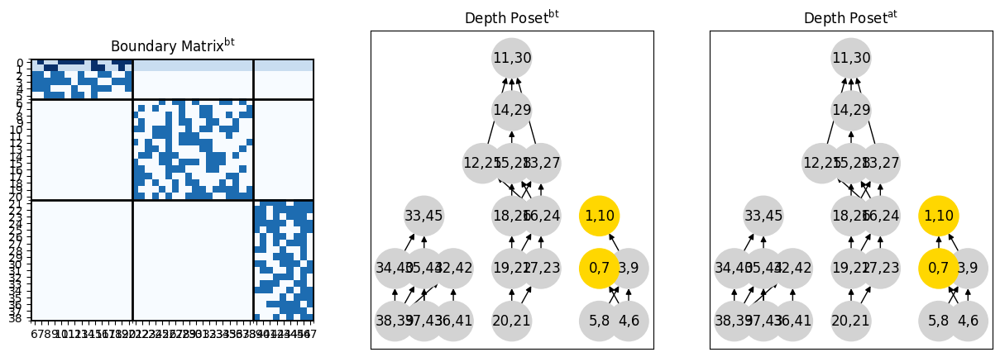

### Birth Death Pairs
|                          |                                                                                                                                                                                                                         |
|:-------------------------|:------------------------------------------------------------------------------------------------------------------------------------------------------------------------------------------------------------------------|
| Before the transposition | $\{(13, 27), (33, 45), (18, 26), (4, 6), (12, 25), (34, 40), (32, 42), (35, 44), (3, 9), (0, 7), (17, 23), (36, 41), (16, 24), (15, 28), (20, 21), (38, 39), (5, 8), (14, 29), (19, 22), (1, 10), (37, 43), (11, 30)\}$ |
| After the transposition  | $\{(13, 27), (33, 45), (18, 26), (4, 6), (12, 25), (34, 40), (32, 42), (35, 44), (3, 9), (0, 7), (17, 23), (36, 41), (16, 24), (15, 28), (20, 21), (38, 39), (5, 8), (14, 29), (19, 22), (1, 10), (37, 43), (11, 30)\}$ |

### Relations
|                          | Algorithm 1                                                                                                                                                                                                                                                                                                                                                                                                                                                                                          | Algorithm 2                                                                                                                                                                                                                                                                                              |
|:-------------------------|:-----------------------------------------------------------------------------------------------------------------------------------------------------------------------------------------------------------------------------------------------------------------------------------------------------------------------------------------------------------------------------------------------------------------------------------------------------------------------------------------------------|:---------------------------------------------------------------------------------------------------------------------------------------------------------------------------------------------------------------------------------------------------------------------------------------------------------|
| Before the transposition | $\{(24, 30), (24, 27), (43, 46), (41, 46), (26, 27), (21, 22), (21, 31), (22, 26), (39, 42), (8, 9), (23, 31), (22, 29), (40, 47), (27, 31), (45, 46), (41, 42), (24, 29), (44, 47), (43, 45), (21, 24), (21, 30), (29, 31), (22, 25), (23, 24), (23, 30), (39, 44), (9, 10), (39, 47), (40, 46), (27, 30), (28, 29), (6, 7), (24, 28), (6, 10), (24, 31), (41, 47), (43, 44), (42, 46), (25, 30), (26, 31), (29, 30), (21, 26), (22, 27), (21, 29), (22, 24), (39, 46), (8, 10), (6, 9)\}$          | $\{(32, 31), (4, 3), (20, 17), (5, 1), (17, 12), (34, 31), (19, 12), (19, 15), (13, 11), (18, 13), (4, 2), (20, 16), (20, 19), (38, 34), (17, 14), (19, 14), (34, 33), (37, 35), (16, 12), (33, 31), (18, 15), (35, 31), (12, 11), (20, 12), (20, 18), (20, 15), (5, 2), (17, 13), (37, 31), (16, 11)\}$ |
| After the transposition  | $\{(24, 30), (24, 27), (43, 46), (41, 46), (26, 27), (21, 22), (21, 31), (22, 26), (39, 42), (8, 9), (23, 31), (22, 29), (40, 47), (27, 31), (45, 46), (7, 10), (41, 42), (24, 29), (44, 47), (43, 45), (21, 24), (21, 30), (29, 31), (22, 25), (23, 24), (23, 30), (39, 44), (9, 10), (39, 47), (40, 46), (27, 30), (28, 29), (6, 7), (24, 28), (6, 10), (24, 31), (41, 47), (43, 44), (42, 46), (25, 30), (26, 31), (29, 30), (21, 26), (22, 27), (21, 29), (22, 24), (39, 46), (8, 10), (6, 9)\}$ | $\{(32, 31), (4, 3), (20, 17), (5, 1), (17, 12), (19, 12), (34, 31), (19, 15), (13, 11), (18, 13), (4, 2), (20, 16), (20, 19), (38, 34), (17, 14), (19, 14), (34, 33), (37, 35), (16, 12), (33, 31), (18, 15), (35, 31), (12, 11), (20, 12), (20, 18), (20, 15), (5, 2), (17, 13), (37, 31), (16, 11)\}$ |

### Successors and Predecessers
No such node in the Depth Poset

### Temp Sets
|                                                               | Before the Transposition             | After the Transposition              |
|:--------------------------------------------------------------|:-------------------------------------|:-------------------------------------|
| $\mathcal{L} = \{(s, t)\in \text{BD}:\; f(t) < f(y)\}$        | $\{(0, 7), (4, 6), (3, 9), (5, 8)\}$ | $\{(0, 7), (4, 6), (3, 9), (5, 8)\}$ |
| $\mathcal{M} = \{(s, t)\in \text{BD}:\; f(y) < f(t) < f(b)\}$ | $\emptyset$                          | $\emptyset$                          |

### Equations
There are 2 equations are wrong.

| eq   | left (formula)                  | left (paramatrized)              | left (value)   | right (formula)                                                                        | right (paramatrized)                                                                    | right (value)         | correct   |
|:-----|:--------------------------------|:---------------------------------|:---------------|:---------------------------------------------------------------------------------------|:----------------------------------------------------------------------------------------|:----------------------|:----------|
| Eq16 | $\text{Succ}_1^\text{at}(x, y)$ | $\text{Succ}_1^\text{at}(1, 10)$ | $\emptyset$    | $\text{Succ}_1^\text{bt}(x, y) \oplus \{(a, b)\} \oplus \text{Succ}_1^\text{bt}(a, b)$ | $\text{Succ}_1^\text{bt}(1, 10) \oplus \{(0, 7)\} \oplus \text{Succ}_1^\text{bt}(0, 7)$ | $\{(0, 7)\}$          | ✘         |
| Eq17 | $\text{Pred}_1^\text{at}(a, b)$ | $\text{Pred}_1^\text{at}(0, 7)$  | $\{(4, 6)\}$   | $\text{Pred}_1^\text{bt}(a, b) \oplus \{(x, y)\}$                                      | $\text{Pred}_1^\text{bt}(0, 7) \oplus \{(1, 10)\}$                                      | $\{(4, 6), (1, 10)\}$ | ✘         |

## Transposition <4, 5> in complex 8
Here is a __birth-birth__ __no switch__ transposition <4, 5>.

$$
a = 4, \; b = 6, \; x = 5, \; y = 8
$$

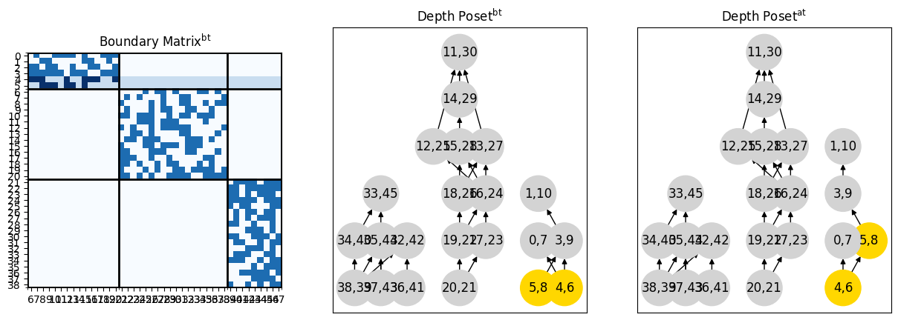

### Birth Death Pairs
|                          |                                                                                                                                                                                                                         |
|:-------------------------|:------------------------------------------------------------------------------------------------------------------------------------------------------------------------------------------------------------------------|
| Before the transposition | $\{(13, 27), (33, 45), (18, 26), (4, 6), (12, 25), (34, 40), (32, 42), (35, 44), (3, 9), (0, 7), (17, 23), (36, 41), (16, 24), (15, 28), (20, 21), (38, 39), (5, 8), (14, 29), (19, 22), (1, 10), (37, 43), (11, 30)\}$ |
| After the transposition  | $\{(13, 27), (33, 45), (18, 26), (4, 6), (12, 25), (34, 40), (32, 42), (35, 44), (3, 9), (0, 7), (17, 23), (36, 41), (16, 24), (15, 28), (20, 21), (38, 39), (5, 8), (14, 29), (19, 22), (1, 10), (37, 43), (11, 30)\}$ |

### Relations
|                          | Algorithm 1                                                                                                                                                                                                                                                                                                                                                                                                                                                                                 | Algorithm 2                                                                                                                                                                                                                                                                                              |
|:-------------------------|:--------------------------------------------------------------------------------------------------------------------------------------------------------------------------------------------------------------------------------------------------------------------------------------------------------------------------------------------------------------------------------------------------------------------------------------------------------------------------------------------|:---------------------------------------------------------------------------------------------------------------------------------------------------------------------------------------------------------------------------------------------------------------------------------------------------------|
| Before the transposition | $\{(24, 30), (24, 27), (43, 46), (41, 46), (26, 27), (21, 22), (21, 31), (22, 26), (39, 42), (8, 9), (23, 31), (22, 29), (40, 47), (27, 31), (45, 46), (41, 42), (24, 29), (44, 47), (43, 45), (21, 24), (21, 30), (29, 31), (22, 25), (23, 24), (23, 30), (39, 44), (9, 10), (39, 47), (40, 46), (27, 30), (28, 29), (6, 7), (24, 28), (6, 10), (24, 31), (41, 47), (43, 44), (42, 46), (25, 30), (26, 31), (29, 30), (21, 26), (22, 27), (21, 29), (22, 24), (39, 46), (8, 10), (6, 9)\}$ | $\{(32, 31), (4, 3), (20, 17), (5, 1), (17, 12), (34, 31), (19, 12), (19, 15), (13, 11), (18, 13), (4, 2), (20, 16), (20, 19), (38, 34), (17, 14), (19, 14), (34, 33), (37, 35), (16, 12), (33, 31), (18, 15), (35, 31), (12, 11), (20, 12), (20, 18), (20, 15), (5, 2), (17, 13), (37, 31), (16, 11)\}$ |
| After the transposition  | $\{(24, 30), (24, 27), (43, 46), (41, 46), (26, 27), (21, 22), (21, 31), (22, 26), (39, 42), (8, 9), (23, 31), (22, 29), (40, 47), (27, 31), (45, 46), (6, 8), (41, 42), (24, 29), (44, 47), (43, 45), (21, 24), (21, 30), (29, 31), (22, 25), (23, 24), (23, 30), (39, 44), (9, 10), (39, 47), (40, 46), (27, 30), (28, 29), (6, 7), (24, 28), (24, 31), (41, 47), (43, 44), (42, 46), (25, 30), (26, 31), (29, 30), (21, 26), (22, 27), (21, 29), (22, 24), (39, 46), (8, 10)\}$          | $\{(32, 31), (4, 3), (20, 17), (5, 1), (17, 12), (19, 12), (34, 31), (19, 15), (13, 11), (18, 13), (4, 2), (20, 16), (20, 19), (38, 34), (17, 14), (19, 14), (34, 33), (37, 35), (16, 12), (33, 31), (18, 15), (35, 31), (12, 11), (20, 12), (20, 18), (20, 15), (5, 2), (17, 13), (37, 31), (16, 11)\}$ |

### Successors and Predecessers
No such node in the Depth Poset

### Temp Sets
|                                                               | Before the Transposition   | After the Transposition   |
|:--------------------------------------------------------------|:---------------------------|:--------------------------|
| $\mathcal{L} = \{(s, t)\in \text{BD}:\; f(t) < f(y)\}$        | $\{(0, 7), (4, 6)\}$       | $\{(0, 7), (4, 6)\}$      |
| $\mathcal{M} = \{(s, t)\in \text{BD}:\; f(y) < f(t) < f(b)\}$ | $\emptyset$                | $\emptyset$               |

### Equations
There are 2 equations are wrong.

| eq   | left (formula)                  | left (paramatrized)             | left (value)          | right (formula)                                                                        | right (paramatrized)                                                                   | right (value)        | correct   |
|:-----|:--------------------------------|:--------------------------------|:----------------------|:---------------------------------------------------------------------------------------|:---------------------------------------------------------------------------------------|:---------------------|:----------|
| Eq16 | $\text{Succ}_1^\text{at}(x, y)$ | $\text{Succ}_1^\text{at}(5, 8)$ | $\{(3, 9), (1, 10)\}$ | $\text{Succ}_1^\text{bt}(x, y) \oplus \{(a, b)\} \oplus \text{Succ}_1^\text{bt}(a, b)$ | $\text{Succ}_1^\text{bt}(5, 8) \oplus \{(4, 6)\} \oplus \text{Succ}_1^\text{bt}(4, 6)$ | $\{(0, 7), (4, 6)\}$ | ✘         |
| Eq17 | $\text{Pred}_1^\text{at}(a, b)$ | $\text{Pred}_1^\text{at}(4, 6)$ | $\emptyset$           | $\text{Pred}_1^\text{bt}(a, b) \oplus \{(x, y)\}$                                      | $\text{Pred}_1^\text{bt}(4, 6) \oplus \{(5, 8)\}$                                      | $\{(5, 8)\}$         | ✘         |

## Transposition <8, 9> in complex 8
Here is a __death-death__ __switch forward__ transposition <8, 9>.

$$
a = 3, \; b = 9, \; x = 5, \; y = 8
$$

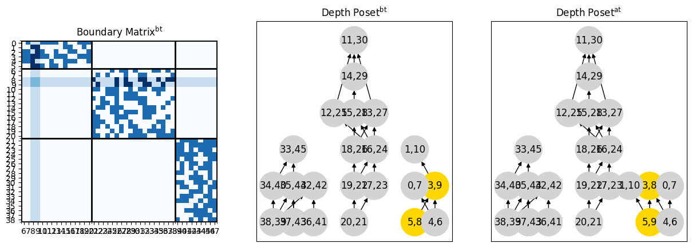

### Birth Death Pairs
|                          |                                                                                                                                                                                                                         |
|:-------------------------|:------------------------------------------------------------------------------------------------------------------------------------------------------------------------------------------------------------------------|
| Before the transposition | $\{(13, 27), (33, 45), (18, 26), (4, 6), (12, 25), (34, 40), (32, 42), (35, 44), (3, 9), (0, 7), (17, 23), (36, 41), (16, 24), (15, 28), (20, 21), (38, 39), (5, 8), (14, 29), (19, 22), (1, 10), (37, 43), (11, 30)\}$ |
| After the transposition  | $\{(13, 27), (33, 45), (18, 26), (4, 6), (12, 25), (34, 40), (32, 42), (35, 44), (5, 9), (0, 7), (17, 23), (36, 41), (16, 24), (15, 28), (20, 21), (3, 8), (38, 39), (14, 29), (19, 22), (1, 10), (37, 43), (11, 30)\}$ |

### Relations
|                          | Algorithm 1                                                                                                                                                                                                                                                                                                                                                                                                                                                                                 | Algorithm 2                                                                                                                                                                                                                                                                                                      |
|:-------------------------|:--------------------------------------------------------------------------------------------------------------------------------------------------------------------------------------------------------------------------------------------------------------------------------------------------------------------------------------------------------------------------------------------------------------------------------------------------------------------------------------------|:-----------------------------------------------------------------------------------------------------------------------------------------------------------------------------------------------------------------------------------------------------------------------------------------------------------------|
| Before the transposition | $\{(24, 30), (24, 27), (43, 46), (41, 46), (26, 27), (21, 22), (21, 31), (22, 26), (39, 42), (8, 9), (23, 31), (22, 29), (40, 47), (27, 31), (45, 46), (41, 42), (24, 29), (44, 47), (43, 45), (21, 24), (21, 30), (29, 31), (22, 25), (23, 24), (23, 30), (39, 44), (9, 10), (39, 47), (40, 46), (27, 30), (28, 29), (6, 7), (24, 28), (6, 10), (24, 31), (41, 47), (43, 44), (42, 46), (25, 30), (26, 31), (29, 30), (21, 26), (22, 27), (21, 29), (22, 24), (39, 46), (8, 10), (6, 9)\}$ | $\{(32, 31), (4, 3), (20, 17), (5, 1), (17, 12), (34, 31), (19, 12), (19, 15), (13, 11), (18, 13), (4, 2), (20, 16), (20, 19), (38, 34), (17, 14), (19, 14), (34, 33), (37, 35), (16, 12), (33, 31), (18, 15), (35, 31), (12, 11), (20, 12), (20, 18), (20, 15), (5, 2), (17, 13), (37, 31), (16, 11)\}$         |
| After the transposition  | $\{(24, 30), (24, 27), (43, 46), (41, 46), (26, 27), (21, 22), (21, 31), (22, 26), (39, 42), (9, 8), (23, 31), (22, 29), (40, 47), (27, 31), (45, 46), (6, 8), (41, 42), (24, 29), (44, 47), (43, 45), (21, 24), (21, 30), (29, 31), (22, 25), (23, 24), (23, 30), (39, 44), (9, 10), (39, 47), (40, 46), (27, 30), (28, 29), (6, 7), (24, 28), (24, 31), (41, 47), (43, 44), (42, 46), (25, 30), (26, 31), (29, 30), (21, 26), (22, 27), (21, 29), (22, 24), (39, 46)\}$                   | $\{(32, 31), (4, 3), (20, 17), (5, 1), (17, 12), (19, 12), (34, 31), (19, 15), (13, 11), (18, 13), (4, 2), (20, 16), (20, 19), (38, 34), (5, 3), (17, 14), (19, 14), (34, 33), (37, 35), (16, 12), (33, 31), (18, 15), (35, 31), (20, 12), (20, 18), (12, 11), (20, 15), (5, 2), (17, 13), (37, 31), (16, 11)\}$ |

### Successors and Predecessers
|                 | $\text{Set}^\text{bt}(3, 9)$                         | $\text{Set}^\text{bt}(5, 8)$                          | $\text{Set}^\text{at}(5, 9)$                          | $\text{Set}^\text{at}(3, 8)$                         |
|:----------------|:-----------------------------------------------------|:------------------------------------------------------|:------------------------------------------------------|:-----------------------------------------------------|
| $\text{Succ}_1$ | $\text{Succ}_1^\text{bt}(3, 9) = \{(1, 10)\}$        | $\text{Succ}_1^\text{bt}(5, 8) = \{(3, 9), (1, 10)\}$ | $\text{Succ}_1^\text{at}(5, 9) = \{(3, 8), (1, 10)\}$ | $\text{Succ}_1^\text{at}(3, 8) = \emptyset$          |
| $\text{Pred}_1$ | $\text{Pred}_1^\text{bt}(3, 9) = \{(4, 6), (5, 8)\}$ | $\text{Pred}_1^\text{bt}(5, 8) = \emptyset$           | $\text{Pred}_1^\text{at}(5, 9) = \emptyset$           | $\text{Pred}_1^\text{at}(3, 8) = \{(5, 9), (4, 6)\}$ |
| $\text{Succ}_2$ | $\text{Succ}_2^\text{bt}(3, 9) = \emptyset$          | $\text{Succ}_2^\text{bt}(5, 8) = \{(1, 10)\}$         | $\text{Succ}_2^\text{at}(5, 9) = \{(3, 8), (1, 10)\}$ | $\text{Succ}_2^\text{at}(3, 8) = \emptyset$          |
| $\text{Pred}_2$ | $\text{Pred}_2^\text{bt}(3, 9) = \{(4, 6)\}$         | $\text{Pred}_2^\text{bt}(5, 8) = \emptyset$           | $\text{Pred}_2^\text{at}(5, 9) = \emptyset$           | $\text{Pred}_2^\text{at}(3, 8) = \{(5, 9), (4, 6)\}$ |

### Temp Sets
|                                                               | Before the Transposition                                                                                                                                                       | After the Transposition                                                                                                                                                        |
|:--------------------------------------------------------------|:-------------------------------------------------------------------------------------------------------------------------------------------------------------------------------|:-------------------------------------------------------------------------------------------------------------------------------------------------------------------------------|
| $\mathcal{B} = \{(s, t)\in \text{BD}:\; f(s) > f(x)\}$        | $\{(11, 30), (13, 27), (17, 23), (38, 39), (36, 41), (33, 45), (18, 26), (32, 42), (14, 29), (35, 44), (19, 22), (12, 25), (16, 24), (37, 43), (15, 28), (34, 40), (20, 21)\}$ | $\{(11, 30), (13, 27), (17, 23), (38, 39), (36, 41), (33, 45), (18, 26), (32, 42), (14, 29), (35, 44), (19, 22), (12, 25), (16, 24), (37, 43), (15, 28), (34, 40), (20, 21)\}$ |
| $\mathcal{N} = \{(s, t)\in \text{BD}:\; f(x) > f(s) > f(a)\}$ | $\{(4, 6)\}$                                                                                                                                                                   | $\{(4, 6)\}$                                                                                                                                                                   |

### Equations
There are 1 equations are wrong.

| eq   | left (formula)                  | left (paramatrized)             | left (value)          | right (formula)                                                                                          | right (paramatrized)                                                                                     | right (value)         | correct   |
|:-----|:--------------------------------|:--------------------------------|:----------------------|:---------------------------------------------------------------------------------------------------------|:---------------------------------------------------------------------------------------------------------|:----------------------|:----------|
| Eq28 | $\text{Succ}_1^\text{at}(x, b)$ | $\text{Succ}_1^\text{at}(5, 9)$ | $\{(3, 8), (1, 10)\}$ | $\text{Succ}_1^\text{bt}(x, y) \oplus \{(a, y), (a, b)\}$                                                | $\text{Succ}_1^\text{bt}(5, 8) \oplus \{(3, 8), (3, 9)\}$                                                | $\{(3, 8), (1, 10)\}$ | ✔         |
| Eq29 | $\text{Succ}_1^\text{at}(a, y)$ | $\text{Succ}_1^\text{at}(3, 8)$ | $\emptyset$           | $\text{Succ}_1^\text{bt}(a, b)$                                                                          | $\text{Succ}_1^\text{bt}(3, 9)$                                                                          | $\{(1, 10)\}$         | ✘         |
| Eq30 | $\text{Pred}_1^\text{at}(x, b)$ | $\text{Pred}_1^\text{at}(5, 9)$ | $\emptyset$           | $[\text{Pred}_1^\text{bt}(a, b) \cap \mathcal{B}]$                                                       | $[\text{Pred}_1^\text{bt}(3, 9) \cap \mathcal{B}]$                                                       | $\emptyset$           | ✔         |
| Eq31 | $\text{Pred}_1^\text{at}(a, y)$ | $\text{Pred}_1^\text{at}(3, 8)$ | $\{(5, 9), (4, 6)\}$  | $\text{Pred}_1^\text{bt}(x, y) \oplus \{(x, b)\} \oplus[\text{Pred}_1^\text{bt}(a, b) \cap \mathcal{N}]$ | $\text{Pred}_1^\text{bt}(5, 8) \oplus \{(5, 9)\} \oplus[\text{Pred}_1^\text{bt}(3, 9) \cap \mathcal{N}]$ | $\{(5, 9), (4, 6)\}$  | ✔         |
| Eq32 | $\text{Succ}_2^\text{at}(x, b)$ | $\text{Succ}_2^\text{at}(5, 9)$ | $\{(3, 8), (1, 10)\}$ | $\text{Succ}_2^\text{bt}(x, y) \oplus \{(a, y)\} \oplus \text{Succ}_2^\text{bt}(a, b)$                   | $\text{Succ}_2^\text{bt}(5, 8) \oplus \{(3, 8)\} \oplus \text{Succ}_2^\text{bt}(3, 9)$                   | $\{(3, 8), (1, 10)\}$ | ✔         |
| Eq33 | $\text{Succ}_2^\text{at}(a, y)$ | $\text{Succ}_2^\text{at}(3, 8)$ | $\emptyset$           | $\text{Succ}_2^\text{bt}(a, b)$                                                                          | $\text{Succ}_2^\text{bt}(3, 9)$                                                                          | $\emptyset$           | ✔         |
| Eq34 | $\text{Pred}_2^\text{at}(x, b)$ | $\text{Pred}_2^\text{at}(5, 9)$ | $\emptyset$           | $\text{Pred}_2^\text{bt}(x, y)$                                                                          | $\text{Pred}_2^\text{bt}(5, 8)$                                                                          | $\emptyset$           | ✔         |
| Eq35 | $\text{Pred}_2^\text{at}(a, y)$ | $\text{Pred}_2^\text{at}(3, 8)$ | $\{(5, 9), (4, 6)\}$  | $\text{Pred}_2^\text{bt}(a, b) \oplus \{(x, b)\}$                                                        | $\text{Pred}_2^\text{bt}(3, 9) \oplus \{(5, 9)\}$                                                        | $\{(5, 9), (4, 6)\}$  | ✔         |

## Transposition <12, 13> in complex 8
Here is a __birth-birth__ __no switch__ transposition <12, 13>.

$$
a = 12, \; b = 25, \; x = 13, \; y = 27
$$

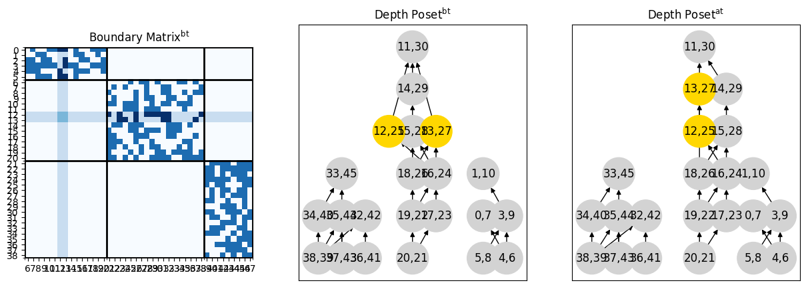

### Birth Death Pairs
|                          |                                                                                                                                                                                                                         |
|:-------------------------|:------------------------------------------------------------------------------------------------------------------------------------------------------------------------------------------------------------------------|
| Before the transposition | $\{(13, 27), (33, 45), (18, 26), (4, 6), (12, 25), (34, 40), (32, 42), (35, 44), (3, 9), (0, 7), (17, 23), (36, 41), (16, 24), (15, 28), (20, 21), (38, 39), (5, 8), (14, 29), (19, 22), (1, 10), (37, 43), (11, 30)\}$ |
| After the transposition  | $\{(13, 27), (33, 45), (18, 26), (4, 6), (12, 25), (34, 40), (32, 42), (35, 44), (3, 9), (0, 7), (17, 23), (36, 41), (16, 24), (15, 28), (20, 21), (38, 39), (5, 8), (14, 29), (19, 22), (1, 10), (37, 43), (11, 30)\}$ |

### Relations
|                          | Algorithm 1                                                                                                                                                                                                                                                                                                                                                                                                                                                                                           | Algorithm 2                                                                                                                                                                                                                                                                                              |
|:-------------------------|:------------------------------------------------------------------------------------------------------------------------------------------------------------------------------------------------------------------------------------------------------------------------------------------------------------------------------------------------------------------------------------------------------------------------------------------------------------------------------------------------------|:---------------------------------------------------------------------------------------------------------------------------------------------------------------------------------------------------------------------------------------------------------------------------------------------------------|
| Before the transposition | $\{(24, 30), (24, 27), (43, 46), (41, 46), (26, 27), (21, 22), (21, 31), (22, 26), (39, 42), (8, 9), (23, 31), (22, 29), (40, 47), (27, 31), (45, 46), (41, 42), (24, 29), (44, 47), (43, 45), (21, 24), (21, 30), (29, 31), (22, 25), (23, 24), (23, 30), (39, 44), (9, 10), (39, 47), (40, 46), (27, 30), (28, 29), (6, 7), (24, 28), (6, 10), (24, 31), (41, 47), (43, 44), (42, 46), (25, 30), (26, 31), (29, 30), (21, 26), (22, 27), (21, 29), (22, 24), (39, 46), (8, 10), (6, 9)\}$           | $\{(32, 31), (4, 3), (20, 17), (5, 1), (17, 12), (34, 31), (19, 12), (19, 15), (13, 11), (18, 13), (4, 2), (20, 16), (20, 19), (38, 34), (17, 14), (19, 14), (34, 33), (37, 35), (16, 12), (33, 31), (18, 15), (35, 31), (12, 11), (20, 12), (20, 18), (20, 15), (5, 2), (17, 13), (37, 31), (16, 11)\}$ |
| After the transposition  | $\{(24, 30), (24, 27), (43, 46), (41, 46), (26, 27), (21, 22), (21, 31), (22, 26), (39, 42), (8, 9), (23, 31), (22, 29), (40, 47), (27, 31), (45, 46), (41, 42), (25, 31), (24, 29), (44, 47), (43, 45), (21, 24), (21, 30), (29, 31), (22, 25), (23, 24), (23, 30), (39, 44), (9, 10), (39, 47), (40, 46), (27, 30), (28, 29), (6, 7), (24, 28), (6, 10), (25, 27), (24, 31), (41, 47), (43, 44), (42, 46), (26, 31), (29, 30), (21, 26), (22, 27), (21, 29), (22, 24), (39, 46), (8, 10), (6, 9)\}$ | $\{(32, 31), (4, 3), (20, 17), (5, 1), (17, 12), (34, 31), (19, 12), (19, 15), (13, 11), (18, 13), (4, 2), (20, 16), (20, 19), (38, 34), (17, 14), (19, 14), (34, 33), (37, 35), (16, 12), (33, 31), (18, 15), (35, 31), (20, 12), (12, 11), (20, 18), (20, 15), (5, 2), (17, 13), (37, 31), (16, 11)\}$ |

### Successors and Predecessers
No such node in the Depth Poset

### Temp Sets
|                                                               | Before the Transposition                                                                                  | After the Transposition                                                                                   |
|:--------------------------------------------------------------|:----------------------------------------------------------------------------------------------------------|:----------------------------------------------------------------------------------------------------------|
| $\mathcal{L} = \{(s, t)\in \text{BD}:\; f(t) < f(y)\}$        | $\{(0, 7), (17, 23), (5, 8), (18, 26), (4, 6), (3, 9), (19, 22), (12, 25), (1, 10), (16, 24), (20, 21)\}$ | $\{(0, 7), (17, 23), (5, 8), (18, 26), (4, 6), (3, 9), (19, 22), (12, 25), (1, 10), (16, 24), (20, 21)\}$ |
| $\mathcal{M} = \{(s, t)\in \text{BD}:\; f(y) < f(t) < f(b)\}$ | $\emptyset$                                                                                               | $\emptyset$                                                                                               |

### Equations
There are 2 equations are wrong.

| eq   | left (formula)                  | left (paramatrized)               | left (value)   | right (formula)                                                                        | right (paramatrized)                                                                         | right (value)            | correct   |
|:-----|:--------------------------------|:----------------------------------|:---------------|:---------------------------------------------------------------------------------------|:---------------------------------------------------------------------------------------------|:-------------------------|:----------|
| Eq16 | $\text{Succ}_1^\text{at}(x, y)$ | $\text{Succ}_1^\text{at}(13, 27)$ | $\{(11, 30)\}$ | $\text{Succ}_1^\text{bt}(x, y) \oplus \{(a, b)\} \oplus \text{Succ}_1^\text{bt}(a, b)$ | $\text{Succ}_1^\text{bt}(13, 27) \oplus \{(12, 25)\} \oplus \text{Succ}_1^\text{bt}(12, 25)$ | $\{(12, 25)\}$           | ✘         |
| Eq17 | $\text{Pred}_1^\text{at}(a, b)$ | $\text{Pred}_1^\text{at}(12, 25)$ | $\{(19, 22)\}$ | $\text{Pred}_1^\text{bt}(a, b) \oplus \{(x, y)\}$                                      | $\text{Pred}_1^\text{bt}(12, 25) \oplus \{(13, 27)\}$                                        | $\{(13, 27), (19, 22)\}$ | ✘         |

## Transposition <23, 24> in complex 8
Here is a __death-death__ __switch forward__ transposition <23, 24>.

$$
a = 16, \; b = 24, \; x = 17, \; y = 23
$$

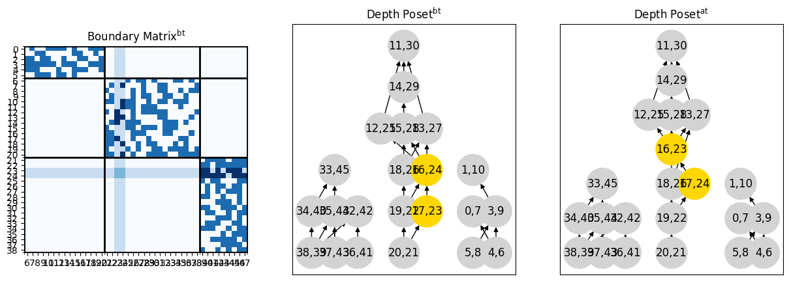

### Birth Death Pairs
|                          |                                                                                                                                                                                                                         |
|:-------------------------|:------------------------------------------------------------------------------------------------------------------------------------------------------------------------------------------------------------------------|
| Before the transposition | $\{(13, 27), (33, 45), (18, 26), (4, 6), (12, 25), (34, 40), (32, 42), (35, 44), (3, 9), (0, 7), (17, 23), (36, 41), (16, 24), (15, 28), (20, 21), (38, 39), (5, 8), (14, 29), (19, 22), (1, 10), (37, 43), (11, 30)\}$ |
| After the transposition  | $\{(13, 27), (33, 45), (18, 26), (4, 6), (12, 25), (17, 24), (34, 40), (32, 42), (35, 44), (3, 9), (0, 7), (36, 41), (15, 28), (20, 21), (38, 39), (5, 8), (14, 29), (19, 22), (1, 10), (37, 43), (11, 30), (16, 23)\}$ |

### Relations
|                          | Algorithm 1                                                                                                                                                                                                                                                                                                                                                                                                                                                                                 | Algorithm 2                                                                                                                                                                                                                                                                                                        |
|:-------------------------|:--------------------------------------------------------------------------------------------------------------------------------------------------------------------------------------------------------------------------------------------------------------------------------------------------------------------------------------------------------------------------------------------------------------------------------------------------------------------------------------------|:-------------------------------------------------------------------------------------------------------------------------------------------------------------------------------------------------------------------------------------------------------------------------------------------------------------------|
| Before the transposition | $\{(24, 30), (24, 27), (43, 46), (41, 46), (26, 27), (21, 22), (21, 31), (22, 26), (39, 42), (8, 9), (23, 31), (22, 29), (40, 47), (27, 31), (45, 46), (41, 42), (24, 29), (44, 47), (43, 45), (21, 24), (21, 30), (29, 31), (22, 25), (23, 24), (23, 30), (39, 44), (9, 10), (39, 47), (40, 46), (27, 30), (28, 29), (6, 7), (24, 28), (6, 10), (24, 31), (41, 47), (43, 44), (42, 46), (25, 30), (26, 31), (29, 30), (21, 26), (22, 27), (21, 29), (22, 24), (39, 46), (8, 10), (6, 9)\}$ | $\{(32, 31), (4, 3), (20, 17), (5, 1), (17, 12), (34, 31), (19, 12), (19, 15), (13, 11), (18, 13), (4, 2), (20, 16), (20, 19), (38, 34), (17, 14), (19, 14), (34, 33), (37, 35), (16, 12), (33, 31), (18, 15), (35, 31), (12, 11), (20, 12), (20, 18), (20, 15), (5, 2), (17, 13), (37, 31), (16, 11)\}$           |
| After the transposition  | $\{(24, 30), (43, 46), (41, 46), (26, 27), (21, 22), (21, 31), (23, 28), (22, 26), (39, 42), (8, 9), (22, 29), (40, 47), (27, 31), (45, 46), (24, 23), (41, 42), (44, 47), (43, 45), (21, 24), (21, 30), (29, 31), (22, 25), (39, 44), (23, 27), (9, 10), (39, 47), (40, 46), (27, 30), (28, 29), (6, 7), (6, 10), (24, 31), (41, 47), (43, 44), (42, 46), (25, 30), (26, 31), (29, 30), (21, 26), (22, 27), (21, 29), (22, 24), (39, 46), (23, 29), (8, 10), (6, 9)\}$                     | $\{(32, 31), (4, 3), (20, 17), (5, 1), (19, 12), (34, 31), (19, 15), (13, 11), (18, 13), (4, 2), (20, 16), (20, 19), (38, 34), (17, 11), (17, 14), (19, 14), (34, 33), (37, 35), (16, 12), (33, 31), (18, 15), (35, 31), (20, 12), (20, 18), (12, 11), (20, 15), (5, 2), (17, 16), (17, 13), (37, 31), (16, 11)\}$ |

### Successors and Predecessers
|                 | $\text{Set}^\text{bt}(16, 24)$                                                 | $\text{Set}^\text{bt}(17, 23)$                                       | $\text{Set}^\text{at}(17, 24)$                                                 | $\text{Set}^\text{at}(16, 23)$                                       |
|:----------------|:-------------------------------------------------------------------------------|:---------------------------------------------------------------------|:-------------------------------------------------------------------------------|:---------------------------------------------------------------------|
| $\text{Succ}_1$ | $\text{Succ}_1^\text{bt}(16, 24) = \{(14, 29), (15, 28), (13, 27), (11, 30)\}$ | $\text{Succ}_1^\text{bt}(17, 23) = \{(16, 24), (11, 30)\}$           | $\text{Succ}_1^\text{at}(17, 24) = \{(11, 30), (16, 23)\}$                     | $\text{Succ}_1^\text{at}(16, 23) = \{(14, 29), (15, 28), (13, 27)\}$ |
| $\text{Pred}_1$ | $\text{Pred}_1^\text{bt}(16, 24) = \{(17, 23), (19, 22), (20, 21)\}$           | $\text{Pred}_1^\text{bt}(17, 23) = \emptyset$                        | $\text{Pred}_1^\text{at}(17, 24) = \{(19, 22), (20, 21)\}$                     | $\text{Pred}_1^\text{at}(16, 23) = \{(17, 24)\}$                     |
| $\text{Succ}_2$ | $\text{Succ}_2^\text{bt}(16, 24) = \{(11, 30), (12, 25)\}$                     | $\text{Succ}_2^\text{bt}(17, 23) = \{(14, 29), (13, 27), (12, 25)\}$ | $\text{Succ}_2^\text{at}(17, 24) = \{(14, 29), (11, 30), (13, 27), (16, 23)\}$ | $\text{Succ}_2^\text{at}(16, 23) = \{(11, 30), (12, 25)\}$           |
| $\text{Pred}_2$ | $\text{Pred}_2^\text{bt}(16, 24) = \{(20, 21)\}$                               | $\text{Pred}_2^\text{bt}(17, 23) = \{(20, 21)\}$                     | $\text{Pred}_2^\text{at}(17, 24) = \{(20, 21)\}$                               | $\text{Pred}_2^\text{at}(16, 23) = \{(17, 24), (20, 21)\}$           |

### Temp Sets
|                                                               | Before the Transposition                                                                                 | After the Transposition                                                                                  |
|:--------------------------------------------------------------|:---------------------------------------------------------------------------------------------------------|:---------------------------------------------------------------------------------------------------------|
| $\mathcal{B} = \{(s, t)\in \text{BD}:\; f(s) > f(x)\}$        | $\{(38, 39), (33, 45), (18, 26), (32, 42), (35, 44), (19, 22), (37, 43), (36, 41), (34, 40), (20, 21)\}$ | $\{(38, 39), (33, 45), (18, 26), (32, 42), (35, 44), (19, 22), (37, 43), (36, 41), (34, 40), (20, 21)\}$ |
| $\mathcal{N} = \{(s, t)\in \text{BD}:\; f(x) > f(s) > f(a)\}$ | $\emptyset$                                                                                              | $\emptyset$                                                                                              |

### Equations
There are 1 equations are wrong.

| eq   | left (formula)                  | left (paramatrized)               | left (value)                                 | right (formula)                                                                                          | right (paramatrized)                                                                                           | right (value)                                | correct   |
|:-----|:--------------------------------|:----------------------------------|:---------------------------------------------|:---------------------------------------------------------------------------------------------------------|:---------------------------------------------------------------------------------------------------------------|:---------------------------------------------|:----------|
| Eq28 | $\text{Succ}_1^\text{at}(x, b)$ | $\text{Succ}_1^\text{at}(17, 24)$ | $\{(11, 30), (16, 23)\}$                     | $\text{Succ}_1^\text{bt}(x, y) \oplus \{(a, y), (a, b)\}$                                                | $\text{Succ}_1^\text{bt}(17, 23) \oplus \{(16, 23), (16, 24)\}$                                                | $\{(11, 30), (16, 23)\}$                     | ✔         |
| Eq29 | $\text{Succ}_1^\text{at}(a, y)$ | $\text{Succ}_1^\text{at}(16, 23)$ | $\{(14, 29), (15, 28), (13, 27)\}$           | $\text{Succ}_1^\text{bt}(a, b)$                                                                          | $\text{Succ}_1^\text{bt}(16, 24)$                                                                              | $\{(14, 29), (15, 28), (13, 27), (11, 30)\}$ | ✘         |
| Eq30 | $\text{Pred}_1^\text{at}(x, b)$ | $\text{Pred}_1^\text{at}(17, 24)$ | $\{(19, 22), (20, 21)\}$                     | $[\text{Pred}_1^\text{bt}(a, b) \cap \mathcal{B}]$                                                       | $[\text{Pred}_1^\text{bt}(16, 24) \cap \mathcal{B}]$                                                           | $\{(19, 22), (20, 21)\}$                     | ✔         |
| Eq31 | $\text{Pred}_1^\text{at}(a, y)$ | $\text{Pred}_1^\text{at}(16, 23)$ | $\{(17, 24)\}$                               | $\text{Pred}_1^\text{bt}(x, y) \oplus \{(x, b)\} \oplus[\text{Pred}_1^\text{bt}(a, b) \cap \mathcal{N}]$ | $\text{Pred}_1^\text{bt}(17, 23) \oplus \{(17, 24)\} \oplus[\text{Pred}_1^\text{bt}(16, 24) \cap \mathcal{N}]$ | $\{(17, 24)\}$                               | ✔         |
| Eq32 | $\text{Succ}_2^\text{at}(x, b)$ | $\text{Succ}_2^\text{at}(17, 24)$ | $\{(14, 29), (11, 30), (13, 27), (16, 23)\}$ | $\text{Succ}_2^\text{bt}(x, y) \oplus \{(a, y)\} \oplus \text{Succ}_2^\text{bt}(a, b)$                   | $\text{Succ}_2^\text{bt}(17, 23) \oplus \{(16, 23)\} \oplus \text{Succ}_2^\text{bt}(16, 24)$                   | $\{(14, 29), (11, 30), (13, 27), (16, 23)\}$ | ✔         |
| Eq33 | $\text{Succ}_2^\text{at}(a, y)$ | $\text{Succ}_2^\text{at}(16, 23)$ | $\{(11, 30), (12, 25)\}$                     | $\text{Succ}_2^\text{bt}(a, b)$                                                                          | $\text{Succ}_2^\text{bt}(16, 24)$                                                                              | $\{(11, 30), (12, 25)\}$                     | ✔         |
| Eq34 | $\text{Pred}_2^\text{at}(x, b)$ | $\text{Pred}_2^\text{at}(17, 24)$ | $\{(20, 21)\}$                               | $\text{Pred}_2^\text{bt}(x, y)$                                                                          | $\text{Pred}_2^\text{bt}(17, 23)$                                                                              | $\{(20, 21)\}$                               | ✔         |
| Eq35 | $\text{Pred}_2^\text{at}(a, y)$ | $\text{Pred}_2^\text{at}(16, 23)$ | $\{(17, 24), (20, 21)\}$                     | $\text{Pred}_2^\text{bt}(a, b) \oplus \{(x, b)\}$                                                        | $\text{Pred}_2^\text{bt}(16, 24) \oplus \{(17, 24)\}$                                                          | $\{(17, 24), (20, 21)\}$                     | ✔         |

## Transposition <25, 26> in complex 8
Here is a __death-death__ __no switch__ transposition <25, 26>.

$$
a = 18, \; b = 26, \; x = 12, \; y = 25
$$

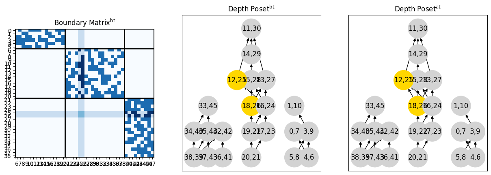

### Birth Death Pairs
|                          |                                                                                                                                                                                                                         |
|:-------------------------|:------------------------------------------------------------------------------------------------------------------------------------------------------------------------------------------------------------------------|
| Before the transposition | $\{(13, 27), (33, 45), (18, 26), (4, 6), (12, 25), (34, 40), (32, 42), (35, 44), (3, 9), (0, 7), (17, 23), (36, 41), (16, 24), (15, 28), (20, 21), (38, 39), (5, 8), (14, 29), (19, 22), (1, 10), (37, 43), (11, 30)\}$ |
| After the transposition  | $\{(13, 27), (33, 45), (18, 26), (4, 6), (12, 25), (34, 40), (32, 42), (35, 44), (3, 9), (0, 7), (17, 23), (36, 41), (16, 24), (15, 28), (20, 21), (38, 39), (5, 8), (14, 29), (19, 22), (1, 10), (37, 43), (11, 30)\}$ |

### Relations
|                          | Algorithm 1                                                                                                                                                                                                                                                                                                                                                                                                                                                                                 | Algorithm 2                                                                                                                                                                                                                                                                                                                  |
|:-------------------------|:--------------------------------------------------------------------------------------------------------------------------------------------------------------------------------------------------------------------------------------------------------------------------------------------------------------------------------------------------------------------------------------------------------------------------------------------------------------------------------------------|:-----------------------------------------------------------------------------------------------------------------------------------------------------------------------------------------------------------------------------------------------------------------------------------------------------------------------------|
| Before the transposition | $\{(24, 30), (24, 27), (43, 46), (41, 46), (26, 27), (21, 22), (21, 31), (22, 26), (39, 42), (8, 9), (23, 31), (22, 29), (40, 47), (27, 31), (45, 46), (41, 42), (24, 29), (44, 47), (43, 45), (21, 24), (21, 30), (29, 31), (22, 25), (23, 24), (23, 30), (39, 44), (9, 10), (39, 47), (40, 46), (27, 30), (28, 29), (6, 7), (24, 28), (6, 10), (24, 31), (41, 47), (43, 44), (42, 46), (25, 30), (26, 31), (29, 30), (21, 26), (22, 27), (21, 29), (22, 24), (39, 46), (8, 10), (6, 9)\}$ | $\{(32, 31), (4, 3), (20, 17), (5, 1), (17, 12), (34, 31), (19, 12), (19, 15), (13, 11), (18, 13), (4, 2), (20, 16), (20, 19), (38, 34), (17, 14), (19, 14), (34, 33), (37, 35), (16, 12), (33, 31), (18, 15), (35, 31), (12, 11), (20, 12), (20, 18), (20, 15), (5, 2), (17, 13), (37, 31), (16, 11)\}$                     |
| After the transposition  | $\{(24, 30), (24, 27), (43, 46), (41, 46), (26, 27), (21, 22), (21, 31), (8, 9), (39, 42), (22, 26), (23, 31), (22, 29), (40, 47), (27, 31), (45, 46), (41, 42), (24, 29), (44, 47), (43, 45), (21, 24), (21, 30), (29, 31), (22, 25), (23, 24), (23, 30), (39, 44), (9, 10), (39, 47), (40, 46), (27, 30), (28, 29), (6, 7), (24, 28), (6, 10), (24, 31), (41, 47), (25, 30), (43, 44), (42, 46), (26, 31), (29, 30), (21, 26), (22, 27), (21, 29), (22, 24), (39, 46), (8, 10), (6, 9)\}$ | $\{(32, 31), (4, 3), (20, 17), (5, 1), (17, 12), (19, 12), (34, 31), (19, 15), (13, 11), (18, 13), (4, 2), (20, 16), (20, 19), (38, 34), (17, 14), (19, 14), (34, 33), (37, 35), (16, 12), (18, 12), (33, 31), (18, 15), (35, 31), (20, 12), (20, 18), (12, 11), (20, 15), (5, 2), (17, 13), (37, 31), (18, 11), (16, 11)\}$ |

### Successors and Predecessers
No such node in the Depth Poset

### Temp Sets
|                                                               | Before the Transposition                                                                                                                                   | After the Transposition                                                                                                                                    |
|:--------------------------------------------------------------|:-----------------------------------------------------------------------------------------------------------------------------------------------------------|:-----------------------------------------------------------------------------------------------------------------------------------------------------------|
| $\mathcal{B} = \{(s, t)\in \text{BD}:\; f(s) > f(x)\}$        | $\{(17, 23), (13, 27), (38, 39), (36, 41), (33, 45), (18, 26), (32, 42), (14, 29), (35, 44), (19, 22), (16, 24), (37, 43), (15, 28), (34, 40), (20, 21)\}$ | $\{(17, 23), (13, 27), (38, 39), (36, 41), (33, 45), (18, 26), (32, 42), (14, 29), (35, 44), (19, 22), (16, 24), (37, 43), (15, 28), (34, 40), (20, 21)\}$ |
| $\mathcal{N} = \{(s, t)\in \text{BD}:\; f(x) > f(s) > f(a)\}$ | $\emptyset$                                                                                                                                                | $\emptyset$                                                                                                                                                |

### Equations
There are 2 equations are wrong.

| eq   | left (formula)                  | left (paramatrized)               | left (value)   | right (formula)                                                                        | right (paramatrized)                                                                         | right (value)                                | correct   |
|:-----|:--------------------------------|:----------------------------------|:---------------|:---------------------------------------------------------------------------------------|:---------------------------------------------------------------------------------------------|:---------------------------------------------|:----------|
| Eq36 | $\text{Succ}_2^\text{at}(x, y)$ | $\text{Succ}_2^\text{at}(12, 25)$ | $\{(11, 30)\}$ | $\text{Succ}_2^\text{bt}(x, y) \oplus \{(a, b)\} \oplus \text{Succ}_2^\text{bt}(a, b)$ | $\text{Succ}_2^\text{bt}(12, 25) \oplus \{(18, 26)\} \oplus \text{Succ}_2^\text{bt}(18, 26)$ | $\{(18, 26), (15, 28), (13, 27), (11, 30)\}$ | ✘         |
| Eq37 | $\text{Pred}_2^\text{at}(a, b)$ | $\text{Pred}_2^\text{at}(18, 26)$ | $\{(20, 21)\}$ | $\text{Pred}_2^\text{bt}(a, b) \oplus \{(x, y)\}$                                      | $\text{Pred}_2^\text{bt}(18, 26) \oplus \{(12, 25)\}$                                        | $\{(12, 25), (20, 21)\}$                     | ✘         |

## Transposition <32, 33> in complex 8
Here is a __birth-birth__ __no switch__ transposition <32, 33>.

$$
a = 32, \; b = 42, \; x = 33, \; y = 45
$$

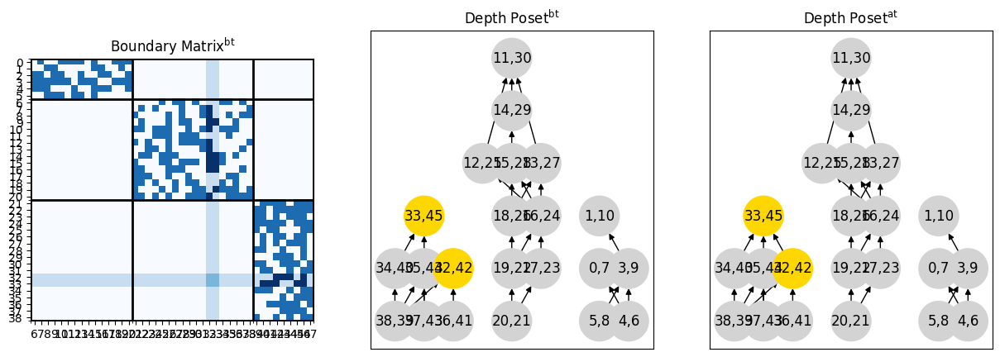

### Birth Death Pairs
|                          |                                                                                                                                                                                                                         |
|:-------------------------|:------------------------------------------------------------------------------------------------------------------------------------------------------------------------------------------------------------------------|
| Before the transposition | $\{(13, 27), (33, 45), (18, 26), (4, 6), (12, 25), (34, 40), (32, 42), (35, 44), (3, 9), (0, 7), (17, 23), (36, 41), (16, 24), (15, 28), (20, 21), (38, 39), (5, 8), (14, 29), (19, 22), (1, 10), (37, 43), (11, 30)\}$ |
| After the transposition  | $\{(13, 27), (33, 45), (18, 26), (4, 6), (12, 25), (34, 40), (32, 42), (35, 44), (3, 9), (0, 7), (17, 23), (36, 41), (16, 24), (15, 28), (20, 21), (38, 39), (5, 8), (14, 29), (19, 22), (1, 10), (37, 43), (11, 30)\}$ |

### Relations
|                          | Algorithm 1                                                                                                                                                                                                                                                                                                                                                                                                                                                                                 | Algorithm 2                                                                                                                                                                                                                                                                                              |
|:-------------------------|:--------------------------------------------------------------------------------------------------------------------------------------------------------------------------------------------------------------------------------------------------------------------------------------------------------------------------------------------------------------------------------------------------------------------------------------------------------------------------------------------|:---------------------------------------------------------------------------------------------------------------------------------------------------------------------------------------------------------------------------------------------------------------------------------------------------------|
| Before the transposition | $\{(24, 30), (24, 27), (43, 46), (41, 46), (26, 27), (21, 22), (21, 31), (22, 26), (39, 42), (8, 9), (23, 31), (22, 29), (40, 47), (27, 31), (45, 46), (41, 42), (24, 29), (44, 47), (43, 45), (21, 24), (21, 30), (29, 31), (22, 25), (23, 24), (23, 30), (39, 44), (9, 10), (39, 47), (40, 46), (27, 30), (28, 29), (6, 7), (24, 28), (6, 10), (24, 31), (41, 47), (43, 44), (42, 46), (25, 30), (26, 31), (29, 30), (21, 26), (22, 27), (21, 29), (22, 24), (39, 46), (8, 10), (6, 9)\}$ | $\{(32, 31), (4, 3), (20, 17), (5, 1), (17, 12), (34, 31), (19, 12), (19, 15), (13, 11), (18, 13), (4, 2), (20, 16), (20, 19), (38, 34), (17, 14), (19, 14), (34, 33), (37, 35), (16, 12), (33, 31), (18, 15), (35, 31), (12, 11), (20, 12), (20, 18), (20, 15), (5, 2), (17, 13), (37, 31), (16, 11)\}$ |
| After the transposition  | $\{(24, 30), (42, 45), (24, 27), (43, 46), (41, 46), (26, 27), (21, 22), (21, 31), (22, 26), (39, 42), (8, 9), (23, 31), (22, 29), (40, 47), (27, 31), (45, 46), (41, 42), (24, 29), (44, 47), (43, 45), (21, 24), (21, 30), (29, 31), (22, 25), (23, 24), (23, 30), (39, 44), (9, 10), (39, 47), (40, 46), (27, 30), (28, 29), (6, 7), (24, 28), (6, 10), (24, 31), (41, 47), (43, 44), (25, 30), (26, 31), (29, 30), (21, 26), (22, 27), (21, 29), (22, 24), (39, 46), (8, 10), (6, 9)\}$ | $\{(32, 31), (4, 3), (20, 17), (5, 1), (17, 12), (19, 12), (34, 31), (19, 15), (13, 11), (18, 13), (4, 2), (20, 16), (20, 19), (38, 34), (17, 14), (19, 14), (34, 33), (37, 35), (16, 12), (33, 31), (18, 15), (35, 31), (12, 11), (20, 12), (20, 18), (20, 15), (5, 2), (17, 13), (37, 31), (16, 11)\}$ |

### Successors and Predecessers
No such node in the Depth Poset

### Temp Sets
|                                                               | Before the Transposition                                                                                                                                                                                      | After the Transposition                                                                                                                                                                                       |
|:--------------------------------------------------------------|:--------------------------------------------------------------------------------------------------------------------------------------------------------------------------------------------------------------|:--------------------------------------------------------------------------------------------------------------------------------------------------------------------------------------------------------------|
| $\mathcal{L} = \{(s, t)\in \text{BD}:\; f(t) < f(y)\}$        | $\{(13, 27), (18, 26), (4, 6), (12, 25), (34, 40), (32, 42), (35, 44), (3, 9), (0, 7), (17, 23), (11, 30), (16, 24), (15, 28), (20, 21), (38, 39), (5, 8), (14, 29), (19, 22), (1, 10), (37, 43), (36, 41)\}$ | $\{(13, 27), (18, 26), (4, 6), (12, 25), (34, 40), (32, 42), (35, 44), (3, 9), (0, 7), (17, 23), (11, 30), (16, 24), (15, 28), (20, 21), (38, 39), (5, 8), (14, 29), (19, 22), (1, 10), (37, 43), (36, 41)\}$ |
| $\mathcal{M} = \{(s, t)\in \text{BD}:\; f(y) < f(t) < f(b)\}$ | $\emptyset$                                                                                                                                                                                                   | $\emptyset$                                                                                                                                                                                                   |

### Equations
There are 2 equations are wrong.

| eq   | left (formula)                  | left (paramatrized)               | left (value)             | right (formula)                                                                        | right (paramatrized)                                                                         | right (value)                      | correct   |
|:-----|:--------------------------------|:----------------------------------|:-------------------------|:---------------------------------------------------------------------------------------|:---------------------------------------------------------------------------------------------|:-----------------------------------|:----------|
| Eq16 | $\text{Succ}_1^\text{at}(x, y)$ | $\text{Succ}_1^\text{at}(33, 45)$ | $\emptyset$              | $\text{Succ}_1^\text{bt}(x, y) \oplus \{(a, b)\} \oplus \text{Succ}_1^\text{bt}(a, b)$ | $\text{Succ}_1^\text{bt}(33, 45) \oplus \{(32, 42)\} \oplus \text{Succ}_1^\text{bt}(32, 42)$ | $\{(32, 42)\}$                     | ✘         |
| Eq17 | $\text{Pred}_1^\text{at}(a, b)$ | $\text{Pred}_1^\text{at}(32, 42)$ | $\{(36, 41), (38, 39)\}$ | $\text{Pred}_1^\text{bt}(a, b) \oplus \{(x, y)\}$                                      | $\text{Pred}_1^\text{bt}(32, 42) \oplus \{(33, 45)\}$                                        | $\{(33, 45), (36, 41), (38, 39)\}$ | ✘         |

## Transposition <36, 37> in complex 8
Here is a __birth-birth__ __no switch__ transposition <36, 37>.

$$
a = 36, \; b = 41, \; x = 37, \; y = 43
$$

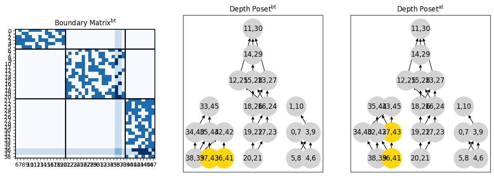

### Birth Death Pairs
|                          |                                                                                                                                                                                                                         |
|:-------------------------|:------------------------------------------------------------------------------------------------------------------------------------------------------------------------------------------------------------------------|
| Before the transposition | $\{(13, 27), (33, 45), (18, 26), (4, 6), (12, 25), (34, 40), (32, 42), (35, 44), (3, 9), (0, 7), (17, 23), (36, 41), (16, 24), (15, 28), (20, 21), (38, 39), (5, 8), (14, 29), (19, 22), (1, 10), (37, 43), (11, 30)\}$ |
| After the transposition  | $\{(13, 27), (33, 45), (18, 26), (4, 6), (12, 25), (34, 40), (32, 42), (35, 44), (3, 9), (0, 7), (17, 23), (36, 41), (16, 24), (15, 28), (20, 21), (38, 39), (5, 8), (14, 29), (19, 22), (1, 10), (37, 43), (11, 30)\}$ |

### Relations
|                          | Algorithm 1                                                                                                                                                                                                                                                                                                                                                                                                                                                                                                     | Algorithm 2                                                                                                                                                                                                                                                                                              |
|:-------------------------|:----------------------------------------------------------------------------------------------------------------------------------------------------------------------------------------------------------------------------------------------------------------------------------------------------------------------------------------------------------------------------------------------------------------------------------------------------------------------------------------------------------------|:---------------------------------------------------------------------------------------------------------------------------------------------------------------------------------------------------------------------------------------------------------------------------------------------------------|
| Before the transposition | $\{(24, 30), (24, 27), (43, 46), (41, 46), (26, 27), (21, 22), (21, 31), (22, 26), (39, 42), (8, 9), (23, 31), (22, 29), (40, 47), (27, 31), (45, 46), (41, 42), (24, 29), (44, 47), (43, 45), (21, 24), (21, 30), (29, 31), (22, 25), (23, 24), (23, 30), (39, 44), (9, 10), (39, 47), (40, 46), (27, 30), (28, 29), (6, 7), (24, 28), (6, 10), (24, 31), (41, 47), (43, 44), (42, 46), (25, 30), (26, 31), (29, 30), (21, 26), (22, 27), (21, 29), (22, 24), (39, 46), (8, 10), (6, 9)\}$                     | $\{(32, 31), (4, 3), (20, 17), (5, 1), (17, 12), (34, 31), (19, 12), (19, 15), (13, 11), (18, 13), (4, 2), (20, 16), (20, 19), (38, 34), (17, 14), (19, 14), (34, 33), (37, 35), (16, 12), (33, 31), (18, 15), (35, 31), (12, 11), (20, 12), (20, 18), (20, 15), (5, 2), (17, 13), (37, 31), (16, 11)\}$ |
| After the transposition  | $\{(24, 30), (24, 27), (41, 43), (43, 46), (26, 27), (21, 22), (21, 31), (22, 26), (39, 42), (8, 9), (23, 31), (22, 29), (40, 47), (27, 31), (45, 46), (41, 42), (24, 29), (41, 45), (44, 47), (43, 45), (21, 24), (21, 30), (29, 31), (22, 25), (23, 24), (23, 30), (39, 44), (9, 10), (39, 47), (40, 46), (27, 30), (28, 29), (6, 7), (24, 28), (41, 44), (6, 10), (24, 31), (41, 47), (43, 44), (42, 46), (25, 30), (26, 31), (29, 30), (21, 26), (22, 27), (21, 29), (22, 24), (39, 46), (8, 10), (6, 9)\}$ | $\{(32, 31), (4, 3), (20, 17), (5, 1), (17, 12), (19, 12), (34, 31), (19, 15), (13, 11), (18, 13), (4, 2), (20, 16), (20, 19), (38, 34), (17, 14), (19, 14), (34, 33), (37, 35), (16, 12), (33, 31), (18, 15), (35, 31), (12, 11), (20, 12), (20, 18), (20, 15), (5, 2), (17, 13), (37, 31), (16, 11)\}$ |

### Successors and Predecessers
No such node in the Depth Poset

### Temp Sets
|                                                               | Before the Transposition                                                                                                                                                                  | After the Transposition                                                                                                                                                                   |
|:--------------------------------------------------------------|:------------------------------------------------------------------------------------------------------------------------------------------------------------------------------------------|:------------------------------------------------------------------------------------------------------------------------------------------------------------------------------------------|
| $\mathcal{L} = \{(s, t)\in \text{BD}:\; f(t) < f(y)\}$        | $\{(13, 27), (18, 26), (4, 6), (12, 25), (34, 40), (32, 42), (3, 9), (0, 7), (17, 23), (36, 41), (16, 24), (15, 28), (20, 21), (38, 39), (5, 8), (14, 29), (19, 22), (1, 10), (11, 30)\}$ | $\{(13, 27), (18, 26), (4, 6), (12, 25), (34, 40), (32, 42), (3, 9), (0, 7), (17, 23), (36, 41), (16, 24), (15, 28), (20, 21), (38, 39), (5, 8), (14, 29), (19, 22), (1, 10), (11, 30)\}$ |
| $\mathcal{M} = \{(s, t)\in \text{BD}:\; f(y) < f(t) < f(b)\}$ | $\emptyset$                                                                                                                                                                               | $\emptyset$                                                                                                                                                                               |

### Equations
There are 2 equations are wrong.

| eq   | left (formula)                  | left (paramatrized)               | left (value)             | right (formula)                                                                        | right (paramatrized)                                                                         | right (value)                                | correct   |
|:-----|:--------------------------------|:----------------------------------|:-------------------------|:---------------------------------------------------------------------------------------|:---------------------------------------------------------------------------------------------|:---------------------------------------------|:----------|
| Eq16 | $\text{Succ}_1^\text{at}(x, y)$ | $\text{Succ}_1^\text{at}(37, 43)$ | $\{(33, 45), (35, 44)\}$ | $\text{Succ}_1^\text{bt}(x, y) \oplus \{(a, b)\} \oplus \text{Succ}_1^\text{bt}(a, b)$ | $\text{Succ}_1^\text{bt}(37, 43) \oplus \{(36, 41)\} \oplus \text{Succ}_1^\text{bt}(36, 41)$ | $\{(32, 42), (33, 45), (36, 41), (35, 44)\}$ | ✘         |
| Eq17 | $\text{Pred}_1^\text{at}(a, b)$ | $\text{Pred}_1^\text{at}(36, 41)$ | $\emptyset$              | $\text{Pred}_1^\text{bt}(a, b) \oplus \{(x, y)\}$                                      | $\text{Pred}_1^\text{bt}(36, 41) \oplus \{(37, 43)\}$                                        | $\{(37, 43)\}$                               | ✘         |

## Transposition <40, 41> in complex 8
Here is a __death-death__ __no switch__ transposition <40, 41>.

$$
a = 36, \; b = 41, \; x = 34, \; y = 40
$$

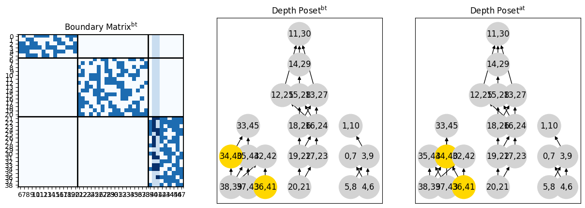

### Birth Death Pairs
|                          |                                                                                                                                                                                                                         |
|:-------------------------|:------------------------------------------------------------------------------------------------------------------------------------------------------------------------------------------------------------------------|
| Before the transposition | $\{(13, 27), (33, 45), (18, 26), (4, 6), (12, 25), (34, 40), (32, 42), (35, 44), (3, 9), (0, 7), (17, 23), (36, 41), (16, 24), (15, 28), (20, 21), (38, 39), (5, 8), (14, 29), (19, 22), (1, 10), (37, 43), (11, 30)\}$ |
| After the transposition  | $\{(13, 27), (33, 45), (18, 26), (4, 6), (12, 25), (34, 40), (32, 42), (35, 44), (3, 9), (0, 7), (17, 23), (36, 41), (16, 24), (15, 28), (20, 21), (38, 39), (5, 8), (14, 29), (19, 22), (1, 10), (37, 43), (11, 30)\}$ |

### Relations
|                          | Algorithm 1                                                                                                                                                                                                                                                                                                                                                                                                                                                                                 | Algorithm 2                                                                                                                                                                                                                                                                                                                            |
|:-------------------------|:--------------------------------------------------------------------------------------------------------------------------------------------------------------------------------------------------------------------------------------------------------------------------------------------------------------------------------------------------------------------------------------------------------------------------------------------------------------------------------------------|:---------------------------------------------------------------------------------------------------------------------------------------------------------------------------------------------------------------------------------------------------------------------------------------------------------------------------------------|
| Before the transposition | $\{(24, 30), (24, 27), (43, 46), (41, 46), (26, 27), (21, 22), (21, 31), (22, 26), (39, 42), (8, 9), (23, 31), (22, 29), (40, 47), (27, 31), (45, 46), (41, 42), (24, 29), (44, 47), (43, 45), (21, 24), (21, 30), (29, 31), (22, 25), (23, 24), (23, 30), (39, 44), (9, 10), (39, 47), (40, 46), (27, 30), (28, 29), (6, 7), (24, 28), (6, 10), (24, 31), (41, 47), (43, 44), (42, 46), (25, 30), (26, 31), (29, 30), (21, 26), (22, 27), (21, 29), (22, 24), (39, 46), (8, 10), (6, 9)\}$ | $\{(32, 31), (4, 3), (20, 17), (5, 1), (17, 12), (34, 31), (19, 12), (19, 15), (13, 11), (18, 13), (4, 2), (20, 16), (20, 19), (38, 34), (17, 14), (19, 14), (34, 33), (37, 35), (16, 12), (33, 31), (18, 15), (35, 31), (12, 11), (20, 12), (20, 18), (20, 15), (5, 2), (17, 13), (37, 31), (16, 11)\}$                               |
| After the transposition  | $\{(24, 30), (24, 27), (43, 46), (26, 27), (41, 46), (21, 22), (21, 31), (22, 26), (39, 42), (8, 9), (23, 31), (22, 29), (40, 47), (27, 31), (45, 46), (41, 42), (24, 29), (44, 47), (43, 45), (21, 24), (21, 30), (29, 31), (22, 25), (23, 24), (23, 30), (39, 44), (9, 10), (39, 47), (40, 46), (27, 30), (28, 29), (6, 7), (24, 28), (6, 10), (24, 31), (41, 47), (43, 44), (42, 46), (25, 30), (26, 31), (29, 30), (21, 26), (22, 27), (21, 29), (22, 24), (39, 46), (8, 10), (6, 9)\}$ | $\{(32, 31), (4, 3), (20, 17), (5, 1), (17, 12), (19, 12), (34, 31), (19, 15), (36, 31), (13, 11), (36, 34), (18, 13), (4, 2), (20, 16), (20, 19), (38, 34), (17, 14), (19, 14), (34, 33), (37, 35), (36, 33), (16, 12), (33, 31), (18, 15), (35, 31), (12, 11), (20, 12), (20, 18), (20, 15), (5, 2), (17, 13), (37, 31), (16, 11)\}$ |

### Successors and Predecessers
No such node in the Depth Poset

### Temp Sets
|                                                               | Before the Transposition                     | After the Transposition                      |
|:--------------------------------------------------------------|:---------------------------------------------|:---------------------------------------------|
| $\mathcal{B} = \{(s, t)\in \text{BD}:\; f(s) > f(x)\}$        | $\{(37, 43), (36, 41), (35, 44), (38, 39)\}$ | $\{(37, 43), (36, 41), (35, 44), (38, 39)\}$ |
| $\mathcal{N} = \{(s, t)\in \text{BD}:\; f(x) > f(s) > f(a)\}$ | $\emptyset$                                  | $\emptyset$                                  |

### Equations
There are 2 equations are wrong.

| eq   | left (formula)                  | left (paramatrized)               | left (value)   | right (formula)                                                                        | right (paramatrized)                                                                         | right (value)            | correct   |
|:-----|:--------------------------------|:----------------------------------|:---------------|:---------------------------------------------------------------------------------------|:---------------------------------------------------------------------------------------------|:-------------------------|:----------|
| Eq36 | $\text{Succ}_2^\text{at}(x, y)$ | $\text{Succ}_2^\text{at}(34, 40)$ | $\{(33, 45)\}$ | $\text{Succ}_2^\text{bt}(x, y) \oplus \{(a, b)\} \oplus \text{Succ}_2^\text{bt}(a, b)$ | $\text{Succ}_2^\text{bt}(34, 40) \oplus \{(36, 41)\} \oplus \text{Succ}_2^\text{bt}(36, 41)$ | $\{(33, 45), (36, 41)\}$ | ✘         |
| Eq37 | $\text{Pred}_2^\text{at}(a, b)$ | $\text{Pred}_2^\text{at}(36, 41)$ | $\emptyset$    | $\text{Pred}_2^\text{bt}(a, b) \oplus \{(x, y)\}$                                      | $\text{Pred}_2^\text{bt}(36, 41) \oplus \{(34, 40)\}$                                        | $\{(34, 40)\}$           | ✘         |

## Transposition <42, 43> in complex 8
Here is a __death-death__ __no switch__ transposition <42, 43>.

$$
a = 37, \; b = 43, \; x = 32, \; y = 42
$$

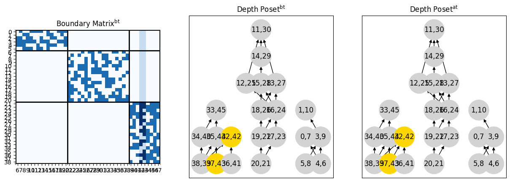

### Birth Death Pairs
|                          |                                                                                                                                                                                                                         |
|:-------------------------|:------------------------------------------------------------------------------------------------------------------------------------------------------------------------------------------------------------------------|
| Before the transposition | $\{(13, 27), (33, 45), (18, 26), (4, 6), (12, 25), (34, 40), (32, 42), (35, 44), (3, 9), (0, 7), (17, 23), (36, 41), (16, 24), (15, 28), (20, 21), (38, 39), (5, 8), (14, 29), (19, 22), (1, 10), (37, 43), (11, 30)\}$ |
| After the transposition  | $\{(13, 27), (33, 45), (18, 26), (4, 6), (12, 25), (34, 40), (32, 42), (35, 44), (3, 9), (0, 7), (17, 23), (36, 41), (16, 24), (15, 28), (20, 21), (38, 39), (5, 8), (14, 29), (19, 22), (1, 10), (37, 43), (11, 30)\}$ |

### Relations
|                          | Algorithm 1                                                                                                                                                                                                                                                                                                                                                                                                                                                                                 | Algorithm 2                                                                                                                                                                                                                                                                                              |
|:-------------------------|:--------------------------------------------------------------------------------------------------------------------------------------------------------------------------------------------------------------------------------------------------------------------------------------------------------------------------------------------------------------------------------------------------------------------------------------------------------------------------------------------|:---------------------------------------------------------------------------------------------------------------------------------------------------------------------------------------------------------------------------------------------------------------------------------------------------------|
| Before the transposition | $\{(24, 30), (24, 27), (43, 46), (41, 46), (26, 27), (21, 22), (21, 31), (22, 26), (39, 42), (8, 9), (23, 31), (22, 29), (40, 47), (27, 31), (45, 46), (41, 42), (24, 29), (44, 47), (43, 45), (21, 24), (21, 30), (29, 31), (22, 25), (23, 24), (23, 30), (39, 44), (9, 10), (39, 47), (40, 46), (27, 30), (28, 29), (6, 7), (24, 28), (6, 10), (24, 31), (41, 47), (43, 44), (42, 46), (25, 30), (26, 31), (29, 30), (21, 26), (22, 27), (21, 29), (22, 24), (39, 46), (8, 10), (6, 9)\}$ | $\{(32, 31), (4, 3), (20, 17), (5, 1), (17, 12), (34, 31), (19, 12), (19, 15), (13, 11), (18, 13), (4, 2), (20, 16), (20, 19), (38, 34), (17, 14), (19, 14), (34, 33), (37, 35), (16, 12), (33, 31), (18, 15), (35, 31), (12, 11), (20, 12), (20, 18), (20, 15), (5, 2), (17, 13), (37, 31), (16, 11)\}$ |
| After the transposition  | $\{(24, 30), (24, 27), (43, 46), (41, 46), (26, 27), (21, 22), (21, 31), (22, 26), (8, 9), (39, 42), (23, 31), (22, 29), (40, 47), (27, 31), (45, 46), (41, 42), (24, 29), (44, 47), (43, 45), (21, 24), (21, 30), (29, 31), (22, 25), (23, 24), (23, 30), (39, 44), (9, 10), (39, 47), (40, 46), (27, 30), (28, 29), (6, 7), (24, 28), (6, 10), (24, 31), (41, 47), (43, 44), (42, 46), (25, 30), (26, 31), (29, 30), (21, 26), (22, 27), (21, 29), (22, 24), (39, 46), (8, 10), (6, 9)\}$ | $\{(32, 31), (4, 3), (20, 17), (5, 1), (17, 12), (19, 12), (34, 31), (19, 15), (13, 11), (18, 13), (4, 2), (20, 16), (20, 19), (38, 34), (17, 14), (19, 14), (34, 33), (37, 35), (37, 32), (16, 12), (33, 31), (18, 15), (35, 31), (12, 11), (20, 12), (20, 18), (20, 15), (5, 2), (17, 13), (16, 11)\}$ |

### Successors and Predecessers
No such node in the Depth Poset

### Temp Sets
|                                                               | Before the Transposition                                         | After the Transposition                                          |
|:--------------------------------------------------------------|:-----------------------------------------------------------------|:-----------------------------------------------------------------|
| $\mathcal{B} = \{(s, t)\in \text{BD}:\; f(s) > f(x)\}$        | $\{(38, 39), (33, 45), (35, 44), (37, 43), (36, 41), (34, 40)\}$ | $\{(38, 39), (33, 45), (35, 44), (37, 43), (36, 41), (34, 40)\}$ |
| $\mathcal{N} = \{(s, t)\in \text{BD}:\; f(x) > f(s) > f(a)\}$ | $\emptyset$                                                      | $\emptyset$                                                      |

### Equations
There are 2 equations are wrong.

| eq   | left (formula)                  | left (paramatrized)               | left (value)   | right (formula)                                                                        | right (paramatrized)                                                                         | right (value)            | correct   |
|:-----|:--------------------------------|:----------------------------------|:---------------|:---------------------------------------------------------------------------------------|:---------------------------------------------------------------------------------------------|:-------------------------|:----------|
| Eq36 | $\text{Succ}_2^\text{at}(x, y)$ | $\text{Succ}_2^\text{at}(32, 42)$ | $\emptyset$    | $\text{Succ}_2^\text{bt}(x, y) \oplus \{(a, b)\} \oplus \text{Succ}_2^\text{bt}(a, b)$ | $\text{Succ}_2^\text{bt}(32, 42) \oplus \{(37, 43)\} \oplus \text{Succ}_2^\text{bt}(37, 43)$ | $\{(37, 43), (35, 44)\}$ | ✘         |
| Eq37 | $\text{Pred}_2^\text{at}(a, b)$ | $\text{Pred}_2^\text{at}(37, 43)$ | $\emptyset$    | $\text{Pred}_2^\text{bt}(a, b) \oplus \{(x, y)\}$                                      | $\text{Pred}_2^\text{bt}(37, 43) \oplus \{(32, 42)\}$                                        | $\{(32, 42)\}$           | ✘         |

## Transposition <3, 4> in complex 9
Here is a __birth-birth__ __no switch__ transposition <3, 4>.

$$
a = 3, \; b = 7, \; x = 4, \; y = 10
$$

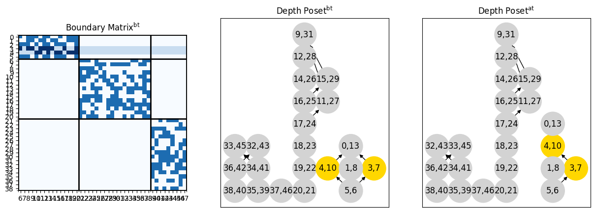

### Birth Death Pairs
|                          |                                                                                                                                                                                                                         |
|:-------------------------|:------------------------------------------------------------------------------------------------------------------------------------------------------------------------------------------------------------------------|
| Before the transposition | $\{(18, 23), (33, 45), (32, 43), (3, 7), (35, 39), (12, 28), (17, 24), (16, 25), (15, 29), (5, 6), (38, 40), (0, 13), (1, 8), (36, 42), (9, 31), (20, 21), (4, 10), (37, 46), (14, 26), (34, 41), (19, 22), (11, 27)\}$ |
| After the transposition  | $\{(18, 23), (33, 45), (32, 43), (3, 7), (35, 39), (12, 28), (17, 24), (16, 25), (15, 29), (5, 6), (38, 40), (0, 13), (1, 8), (36, 42), (9, 31), (20, 21), (4, 10), (37, 46), (14, 26), (34, 41), (19, 22), (11, 27)\}$ |

### Relations
|                          | Algorithm 1                                                                                                                                                                                                                                                                                                                                                                                                   | Algorithm 2                                                                                                                                                                                                                                                                                                                                                               |
|:-------------------------|:--------------------------------------------------------------------------------------------------------------------------------------------------------------------------------------------------------------------------------------------------------------------------------------------------------------------------------------------------------------------------------------------------------------|:--------------------------------------------------------------------------------------------------------------------------------------------------------------------------------------------------------------------------------------------------------------------------------------------------------------------------------------------------------------------------|
| Before the transposition | $\{(25, 29), (42, 45), (41, 43), (21, 28), (22, 23), (21, 25), (40, 44), (28, 30), (25, 28), (6, 8), (25, 31), (24, 29), (7, 13), (21, 24), (22, 25), (23, 24), (23, 30), (22, 28), (39, 47), (24, 25), (6, 7), (6, 13), (6, 10), (41, 44), (42, 43), (24, 31), (41, 47), (26, 28), (21, 23), (43, 47), (29, 30), (26, 31), (21, 29), (40, 42), (23, 29), (40, 45), (10, 13), (28, 31), (45, 47), (25, 26)\}$ | $\{(35, 30), (20, 11), (4, 0), (35, 33), (18, 17), (20, 17), (38, 32), (17, 12), (17, 15), (19, 15), (32, 30), (18, 16), (35, 32), (3, 0), (20, 16), (5, 0), (20, 19), (5, 3), (17, 11), (14, 12), (19, 11), (34, 30), (34, 33), (16, 12), (16, 15), (20, 9), (20, 18), (35, 34), (38, 33), (5, 2), (38, 36), (11, 9), (19, 16), (34, 32), (15, 9), (16, 14), (33, 30)\}$ |
| After the transposition  | $\{(25, 29), (42, 45), (41, 43), (21, 28), (22, 23), (21, 25), (40, 44), (28, 30), (25, 28), (6, 8), (7, 10), (25, 31), (24, 29), (21, 24), (22, 25), (23, 24), (23, 30), (22, 28), (39, 47), (24, 25), (6, 7), (6, 13), (6, 10), (41, 44), (42, 43), (24, 31), (41, 47), (26, 28), (21, 23), (43, 47), (29, 30), (26, 31), (21, 29), (40, 42), (23, 29), (40, 45), (10, 13), (28, 31), (45, 47), (25, 26)\}$ | $\{(35, 30), (20, 11), (18, 17), (35, 33), (4, 0), (20, 17), (38, 32), (17, 12), (17, 15), (19, 15), (32, 30), (18, 16), (35, 32), (3, 0), (20, 16), (5, 0), (20, 19), (5, 3), (14, 12), (17, 11), (19, 11), (34, 30), (34, 33), (16, 12), (16, 15), (20, 9), (20, 18), (35, 34), (38, 33), (5, 2), (38, 36), (11, 9), (19, 16), (34, 32), (15, 9), (16, 14), (33, 30)\}$ |

### Successors and Predecessers
No such node in the Depth Poset

### Temp Sets
|                                                               | Before the Transposition     | After the Transposition      |
|:--------------------------------------------------------------|:-----------------------------|:-----------------------------|
| $\mathcal{L} = \{(s, t)\in \text{BD}:\; f(t) < f(y)\}$        | $\{(3, 7), (1, 8), (5, 6)\}$ | $\{(3, 7), (1, 8), (5, 6)\}$ |
| $\mathcal{M} = \{(s, t)\in \text{BD}:\; f(y) < f(t) < f(b)\}$ | $\emptyset$                  | $\emptyset$                  |

### Equations
There are 2 equations are wrong.

| eq   | left (formula)                  | left (paramatrized)              | left (value)   | right (formula)                                                                        | right (paramatrized)                                                                    | right (value)         | correct   |
|:-----|:--------------------------------|:---------------------------------|:---------------|:---------------------------------------------------------------------------------------|:----------------------------------------------------------------------------------------|:----------------------|:----------|
| Eq16 | $\text{Succ}_1^\text{at}(x, y)$ | $\text{Succ}_1^\text{at}(4, 10)$ | $\{(0, 13)\}$  | $\text{Succ}_1^\text{bt}(x, y) \oplus \{(a, b)\} \oplus \text{Succ}_1^\text{bt}(a, b)$ | $\text{Succ}_1^\text{bt}(4, 10) \oplus \{(3, 7)\} \oplus \text{Succ}_1^\text{bt}(3, 7)$ | $\{(3, 7)\}$          | ✘         |
| Eq17 | $\text{Pred}_1^\text{at}(a, b)$ | $\text{Pred}_1^\text{at}(3, 7)$  | $\{(5, 6)\}$   | $\text{Pred}_1^\text{bt}(a, b) \oplus \{(x, y)\}$                                      | $\text{Pred}_1^\text{bt}(3, 7) \oplus \{(4, 10)\}$                                      | $\{(4, 10), (5, 6)\}$ | ✘         |

## Transposition <8, 9> in complex 9
Here is a __birth-death__ __switch forward__ transposition <8, 9>.

$$
a = 1, \; b = 8, \; x = 9, \; y = 31
$$

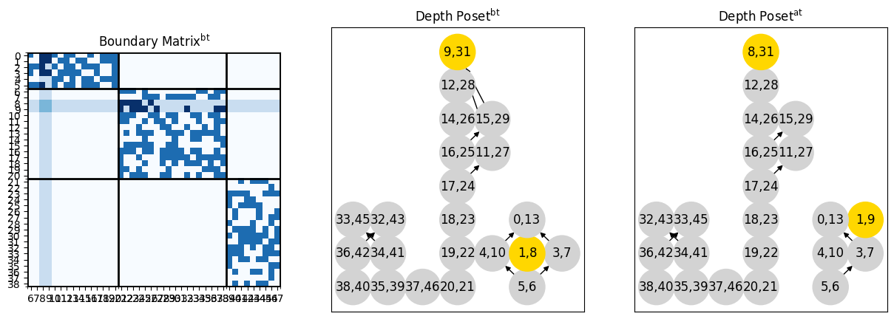

### Birth Death Pairs
|                          |                                                                                                                                                                                                                         |
|:-------------------------|:------------------------------------------------------------------------------------------------------------------------------------------------------------------------------------------------------------------------|
| Before the transposition | $\{(18, 23), (33, 45), (32, 43), (3, 7), (35, 39), (12, 28), (17, 24), (16, 25), (15, 29), (5, 6), (38, 40), (0, 13), (1, 8), (36, 42), (9, 31), (20, 21), (4, 10), (37, 46), (14, 26), (34, 41), (19, 22), (11, 27)\}$ |
| After the transposition  | $\{(18, 23), (33, 45), (32, 43), (3, 7), (35, 39), (12, 28), (17, 24), (1, 9), (16, 25), (15, 29), (5, 6), (38, 40), (0, 13), (36, 42), (20, 21), (4, 10), (37, 46), (14, 26), (34, 41), (19, 22), (8, 31), (11, 27)\}$ |

### Relations
|                          | Algorithm 1                                                                                                                                                                                                                                                                                                                                                                                                   | Algorithm 2                                                                                                                                                                                                                                                                                                                                                                                          |
|:-------------------------|:--------------------------------------------------------------------------------------------------------------------------------------------------------------------------------------------------------------------------------------------------------------------------------------------------------------------------------------------------------------------------------------------------------------|:-----------------------------------------------------------------------------------------------------------------------------------------------------------------------------------------------------------------------------------------------------------------------------------------------------------------------------------------------------------------------------------------------------|
| Before the transposition | $\{(25, 29), (42, 45), (41, 43), (21, 28), (22, 23), (21, 25), (40, 44), (28, 30), (25, 28), (6, 8), (25, 31), (24, 29), (7, 13), (21, 24), (22, 25), (23, 24), (23, 30), (22, 28), (39, 47), (24, 25), (6, 7), (6, 13), (6, 10), (41, 44), (42, 43), (24, 31), (41, 47), (26, 28), (21, 23), (43, 47), (29, 30), (26, 31), (21, 29), (40, 42), (23, 29), (40, 45), (10, 13), (28, 31), (45, 47), (25, 26)\}$ | $\{(35, 30), (20, 11), (4, 0), (35, 33), (18, 17), (20, 17), (38, 32), (17, 12), (17, 15), (19, 15), (32, 30), (18, 16), (35, 32), (3, 0), (20, 16), (5, 0), (20, 19), (5, 3), (17, 11), (14, 12), (19, 11), (34, 30), (34, 33), (16, 12), (16, 15), (20, 9), (20, 18), (35, 34), (38, 33), (5, 2), (38, 36), (11, 9), (19, 16), (34, 32), (15, 9), (16, 14), (33, 30)\}$                            |
| After the transposition  | $\{(25, 29), (42, 45), (41, 43), (21, 28), (22, 23), (21, 25), (40, 44), (28, 30), (25, 28), (25, 31), (24, 29), (7, 13), (21, 24), (22, 25), (23, 24), (23, 30), (22, 28), (39, 47), (7, 9), (24, 25), (6, 7), (6, 13), (6, 10), (41, 44), (42, 43), (24, 31), (41, 47), (26, 28), (21, 23), (43, 47), (29, 30), (26, 31), (21, 29), (40, 42), (23, 29), (40, 45), (10, 13), (28, 31), (45, 47), (25, 26)\}$ | $\{(35, 30), (20, 11), (4, 0), (35, 33), (18, 17), (20, 8), (20, 17), (38, 32), (17, 12), (17, 15), (19, 15), (32, 30), (18, 16), (35, 32), (3, 0), (20, 16), (5, 0), (20, 19), (5, 3), (17, 11), (14, 12), (17, 8), (19, 11), (34, 30), (19, 8), (34, 33), (16, 12), (16, 15), (20, 18), (12, 8), (35, 34), (38, 33), (5, 2), (38, 36), (19, 16), (34, 32), (16, 8), (16, 14), (33, 30), (18, 8)\}$ |

### Successors and Predecessers
|                 | $\text{Set}^\text{bt}(1, 8)$                 | $\text{Set}^\text{bt}(9, 31)$                                                 | $\text{Set}^\text{at}(1, 9)$                 | $\text{Set}^\text{at}(8, 31)$                                                                     |
|:----------------|:---------------------------------------------|:------------------------------------------------------------------------------|:---------------------------------------------|:--------------------------------------------------------------------------------------------------|
| $\text{Succ}_1$ | $\text{Succ}_1^\text{bt}(1, 8) = \emptyset$  | $\text{Succ}_1^\text{bt}(9, 31) = \emptyset$                                  | $\text{Succ}_1^\text{at}(1, 9) = \emptyset$  | $\text{Succ}_1^\text{at}(8, 31) = \emptyset$                                                      |
| $\text{Pred}_1$ | $\text{Pred}_1^\text{bt}(1, 8) = \{(5, 6)\}$ | $\text{Pred}_1^\text{bt}(9, 31) = \{(16, 25), (12, 28), (17, 24), (14, 26)\}$ | $\text{Pred}_1^\text{at}(1, 9) = \{(3, 7)\}$ | $\text{Pred}_1^\text{at}(8, 31) = \{(16, 25), (12, 28), (17, 24), (14, 26)\}$                     |
| $\text{Succ}_2$ | $\text{Succ}_2^\text{bt}(1, 8) = \emptyset$  | $\text{Succ}_2^\text{bt}(9, 31) = \emptyset$                                  | $\text{Succ}_2^\text{at}(1, 9) = \emptyset$  | $\text{Succ}_2^\text{at}(8, 31) = \emptyset$                                                      |
| $\text{Pred}_2$ | $\text{Pred}_2^\text{bt}(1, 8) = \emptyset$  | $\text{Pred}_2^\text{bt}(9, 31) = \{(15, 29), (11, 27), (20, 21)\}$           | $\text{Pred}_2^\text{at}(1, 9) = \emptyset$  | $\text{Pred}_2^\text{at}(8, 31) = \{(18, 23), (16, 25), (12, 28), (19, 22), (17, 24), (20, 21)\}$ |

### Temp Sets
|                                                              | Before the Transposition                                                                       | After the Transposition                                                                        |
|:-------------------------------------------------------------|:-----------------------------------------------------------------------------------------------|:-----------------------------------------------------------------------------------------------|
| $A_1 = \{(s, t)\in \text{BD}:\; f(a) < f(s) < f(t) < f(x)\}$ | $\{(3, 7), (5, 6)\}$                                                                           | $\{(3, 7), (5, 6)\}$                                                                           |
| $B_1 = \{(s, t)\in \text{BD}:\; U_1[t, x] = 1\}$             | $\emptyset$                                                                                    | $\{(3, 7)\}$                                                                                   |
| $A_2 = \{(s, t)\in \text{BD}:\; f(b) < f(s) < f(t) < f(y)\}$ | $\{(18, 23), (14, 26), (16, 25), (12, 28), (15, 29), (19, 22), (17, 24), (11, 27), (20, 21)\}$ | $\{(18, 23), (14, 26), (16, 25), (12, 28), (15, 29), (19, 22), (17, 24), (11, 27), (20, 21)\}$ |
| $B_2 = \{(s, t)\in \text{BD}:\; U_2[b, s] = 1\}$             | $\emptyset$                                                                                    | $\{(18, 23), (16, 25), (12, 28), (19, 22), (17, 24), (20, 21)\}$                               |

### Equations
There are 4 equations are wrong.

| eq    | left (formula)                  | left (paramatrized)              | left (value)                                                     | right (formula)                                      | right (paramatrized)                                 | right (value)                                                    | correct   |
|:------|:--------------------------------|:---------------------------------|:-----------------------------------------------------------------|:-----------------------------------------------------|:-----------------------------------------------------|:-----------------------------------------------------------------|:----------|
| Eq48  | $\text{Succ}_1^\text{at}(a, x)$ | $\text{Succ}_1^\text{at}(1, 9)$  | $\emptyset$                                                      | $\text{Succ}_1^\text{bt}(a, b)$                      | $\text{Succ}_1^\text{bt}(1, 8)$                      | $\emptyset$                                                      | ✔         |
| Eq49  | $\text{Succ}_1^\text{at}(b, y)$ | $\text{Succ}_1^\text{at}(8, 31)$ | $\emptyset$                                                      | $\text{Succ}_1^\text{bt}(x, y)$                      | $\text{Succ}_1^\text{bt}(9, 31)$                     | $\emptyset$                                                      | ✔         |
| Eq50  | $\text{Pred}_1^\text{at}(a, x)$ | $\text{Pred}_1^\text{at}(1, 9)$  | $\{(3, 7)\}$                                                     | $\{(s, t)\in \text{BD}:\; U_1^\text{bt}[t, x] = 1\}$ | $\{(s, t)\in \text{BD}:\; U_1^\text{bt}[t, 9] = 1\}$ | $\emptyset$                                                      | ✘         |
| Eq50a | $\text{Pred}_1^\text{at}(a, x)$ | $\text{Pred}_1^\text{at}(1, 9)$  | $\{(3, 7)\}$                                                     | $A_1^\text{bt} \cap B_1^\text{bt}$                   | $A_1^\text{bt} \cap B_1^\text{bt}$                   | $\emptyset$                                                      | ✘         |
| Eq50b | $\text{Pred}_1^\text{at}(a, x)$ | $\text{Pred}_1^\text{at}(1, 9)$  | $\{(3, 7)\}$                                                     | $A_1^\text{bt} \cap B_1^\text{at}$                   | $A_1^\text{bt} \cap B_1^\text{at}$                   | $\{(3, 7)\}$                                                     | ✔         |
| Eq51  | $\text{Pred}_1^\text{at}(b, y)$ | $\text{Pred}_1^\text{at}(8, 31)$ | $\{(16, 25), (12, 28), (17, 24), (14, 26)\}$                     | $\text{Pred}_1^\text{bt}(x, y)$                      | $\text{Pred}_1^\text{bt}(9, 31)$                     | $\{(16, 25), (12, 28), (17, 24), (14, 26)\}$                     | ✔         |
| Eq52  | $\text{Succ}_2^\text{at}(a, x)$ | $\text{Succ}_2^\text{at}(1, 9)$  | $\emptyset$                                                      | $\text{Succ}_2^\text{bt}(a, b)$                      | $\text{Succ}_2^\text{bt}(1, 8)$                      | $\emptyset$                                                      | ✔         |
| Eq53  | $\text{Succ}_2^\text{at}(b, y)$ | $\text{Succ}_2^\text{at}(8, 31)$ | $\emptyset$                                                      | $\text{Succ}_2^\text{bt}(x, y)$                      | $\text{Succ}_2^\text{bt}(9, 31)$                     | $\emptyset$                                                      | ✔         |
| Eq54  | $\text{Pred}_2^\text{at}(a, x)$ | $\text{Pred}_2^\text{at}(1, 9)$  | $\emptyset$                                                      | $\text{Pred}_2^\text{bt}(a, b)$                      | $\text{Pred}_2^\text{bt}(1, 8)$                      | $\emptyset$                                                      | ✔         |
| Eq55  | $\text{Pred}_2^\text{at}(b, y)$ | $\text{Pred}_2^\text{at}(8, 31)$ | $\{(18, 23), (16, 25), (12, 28), (19, 22), (17, 24), (20, 21)\}$ | $\{(s, t)\in \text{BD}:\; U_2^\text{bt}[b, s] = 1\}$ | $\{(s, t)\in \text{BD}:\; U_2^\text{bt}[8, s] = 1\}$ | $\emptyset$                                                      | ✘         |
| Eq55a | $\text{Pred}_2^\text{at}(b, y)$ | $\text{Pred}_2^\text{at}(8, 31)$ | $\{(18, 23), (16, 25), (12, 28), (19, 22), (17, 24), (20, 21)\}$ | $A_2^\text{bt} \cap B_2^\text{bt}$                   | $A_2^\text{bt} \cap B_2^\text{bt}$                   | $\emptyset$                                                      | ✘         |
| Eq55b | $\text{Pred}_2^\text{at}(b, y)$ | $\text{Pred}_2^\text{at}(8, 31)$ | $\{(18, 23), (16, 25), (12, 28), (19, 22), (17, 24), (20, 21)\}$ | $A_2^\text{bt} \cap B_2^\text{at}$                   | $A_2^\text{bt} \cap B_2^\text{at}$                   | $\{(18, 23), (16, 25), (12, 28), (19, 22), (17, 24), (20, 21)\}$ | ✔         |

## Transposition <10, 11> in complex 9
Here is a __birth-death__ __switch forward__ transposition <10, 11>.

$$
a = 4, \; b = 10, \; x = 11, \; y = 27
$$

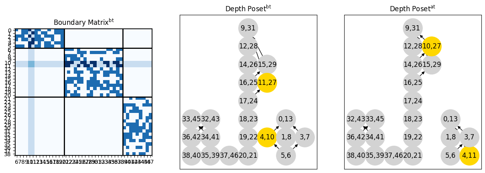

### Birth Death Pairs
|                          |                                                                                                                                                                                                                         |
|:-------------------------|:------------------------------------------------------------------------------------------------------------------------------------------------------------------------------------------------------------------------|
| Before the transposition | $\{(18, 23), (33, 45), (32, 43), (3, 7), (35, 39), (12, 28), (17, 24), (16, 25), (15, 29), (5, 6), (38, 40), (0, 13), (1, 8), (36, 42), (9, 31), (20, 21), (4, 10), (37, 46), (14, 26), (34, 41), (19, 22), (11, 27)\}$ |
| After the transposition  | $\{(18, 23), (33, 45), (32, 43), (3, 7), (35, 39), (12, 28), (17, 24), (10, 27), (16, 25), (15, 29), (5, 6), (38, 40), (4, 11), (0, 13), (1, 8), (36, 42), (9, 31), (20, 21), (14, 26), (34, 41), (19, 22), (37, 46)\}$ |

### Relations
|                          | Algorithm 1                                                                                                                                                                                                                                                                                                                                                                                                   | Algorithm 2                                                                                                                                                                                                                                                                                                                                                                         |
|:-------------------------|:--------------------------------------------------------------------------------------------------------------------------------------------------------------------------------------------------------------------------------------------------------------------------------------------------------------------------------------------------------------------------------------------------------------|:------------------------------------------------------------------------------------------------------------------------------------------------------------------------------------------------------------------------------------------------------------------------------------------------------------------------------------------------------------------------------------|
| Before the transposition | $\{(25, 29), (42, 45), (41, 43), (21, 28), (22, 23), (21, 25), (40, 44), (28, 30), (25, 28), (6, 8), (25, 31), (24, 29), (7, 13), (21, 24), (22, 25), (23, 24), (23, 30), (22, 28), (39, 47), (24, 25), (6, 7), (6, 13), (6, 10), (41, 44), (42, 43), (24, 31), (41, 47), (26, 28), (21, 23), (43, 47), (29, 30), (26, 31), (21, 29), (40, 42), (23, 29), (40, 45), (10, 13), (28, 31), (45, 47), (25, 26)\}$ | $\{(35, 30), (20, 11), (4, 0), (35, 33), (18, 17), (20, 17), (38, 32), (17, 12), (17, 15), (19, 15), (32, 30), (18, 16), (35, 32), (3, 0), (20, 16), (5, 0), (20, 19), (5, 3), (17, 11), (14, 12), (19, 11), (34, 30), (34, 33), (16, 12), (16, 15), (20, 9), (20, 18), (35, 34), (38, 33), (5, 2), (38, 36), (11, 9), (19, 16), (34, 32), (15, 9), (16, 14), (33, 30)\}$           |
| After the transposition  | $\{(25, 29), (42, 45), (41, 43), (21, 28), (22, 23), (21, 25), (40, 44), (28, 30), (25, 28), (6, 8), (25, 31), (24, 29), (7, 13), (21, 24), (22, 25), (23, 24), (23, 30), (22, 28), (39, 47), (11, 13), (24, 25), (6, 7), (6, 13), (41, 44), (42, 43), (24, 31), (41, 47), (26, 28), (21, 23), (43, 47), (29, 30), (26, 31), (21, 29), (40, 42), (23, 29), (40, 45), (8, 13), (28, 31), (45, 47), (25, 26)\}$ | $\{(35, 30), (18, 17), (4, 0), (35, 33), (20, 17), (38, 32), (14, 10), (17, 12), (17, 15), (10, 9), (19, 15), (32, 30), (18, 10), (18, 16), (35, 32), (20, 10), (3, 0), (20, 16), (5, 0), (20, 19), (5, 3), (14, 12), (34, 30), (34, 33), (16, 12), (16, 15), (20, 9), (20, 18), (35, 34), (38, 33), (5, 2), (38, 36), (19, 10), (19, 16), (34, 32), (15, 9), (16, 14), (33, 30)\}$ |

### Successors and Predecessers
|                 | $\text{Set}^\text{bt}(4, 10)$                  | $\text{Set}^\text{bt}(11, 27)$                                       | $\text{Set}^\text{at}(4, 11)$                  | $\text{Set}^\text{at}(10, 27)$                                                 |
|:----------------|:-----------------------------------------------|:---------------------------------------------------------------------|:-----------------------------------------------|:-------------------------------------------------------------------------------|
| $\text{Succ}_1$ | $\text{Succ}_1^\text{bt}(4, 10) = \{(0, 13)\}$ | $\text{Succ}_1^\text{bt}(11, 27) = \emptyset$                        | $\text{Succ}_1^\text{at}(4, 11) = \{(0, 13)\}$ | $\text{Succ}_1^\text{at}(10, 27) = \emptyset$                                  |
| $\text{Pred}_1$ | $\text{Pred}_1^\text{bt}(4, 10) = \{(5, 6)\}$  | $\text{Pred}_1^\text{bt}(11, 27) = \emptyset$                        | $\text{Pred}_1^\text{at}(4, 11) = \emptyset$   | $\text{Pred}_1^\text{at}(10, 27) = \emptyset$                                  |
| $\text{Succ}_2$ | $\text{Succ}_2^\text{bt}(4, 10) = \{(0, 13)\}$ | $\text{Succ}_2^\text{bt}(11, 27) = \{(9, 31)\}$                      | $\text{Succ}_2^\text{at}(4, 11) = \{(0, 13)\}$ | $\text{Succ}_2^\text{at}(10, 27) = \{(9, 31)\}$                                |
| $\text{Pred}_2$ | $\text{Pred}_2^\text{bt}(4, 10) = \emptyset$   | $\text{Pred}_2^\text{bt}(11, 27) = \{(17, 24), (19, 22), (20, 21)\}$ | $\text{Pred}_2^\text{at}(4, 11) = \emptyset$   | $\text{Pred}_2^\text{at}(10, 27) = \{(18, 23), (14, 26), (19, 22), (20, 21)\}$ |

### Temp Sets
|                                                              | Before the Transposition                                         | After the Transposition                                          |
|:-------------------------------------------------------------|:-----------------------------------------------------------------|:-----------------------------------------------------------------|
| $A_1 = \{(s, t)\in \text{BD}:\; f(a) < f(s) < f(t) < f(x)\}$ | $\{(5, 6)\}$                                                     | $\{(5, 6)\}$                                                     |
| $B_1 = \{(s, t)\in \text{BD}:\; U_1[t, x] = 1\}$             | $\emptyset$                                                      | $\emptyset$                                                      |
| $A_2 = \{(s, t)\in \text{BD}:\; f(b) < f(s) < f(t) < f(y)\}$ | $\{(18, 23), (14, 26), (16, 25), (19, 22), (17, 24), (20, 21)\}$ | $\{(18, 23), (14, 26), (16, 25), (19, 22), (17, 24), (20, 21)\}$ |
| $B_2 = \{(s, t)\in \text{BD}:\; U_2[b, s] = 1\}$             | $\emptyset$                                                      | $\{(18, 23), (14, 26), (19, 22), (20, 21)\}$                     |

### Equations
There are 2 equations are wrong.

| eq    | left (formula)                  | left (paramatrized)               | left (value)                                 | right (formula)                                      | right (paramatrized)                                  | right (value)                                | correct   |
|:------|:--------------------------------|:----------------------------------|:---------------------------------------------|:-----------------------------------------------------|:------------------------------------------------------|:---------------------------------------------|:----------|
| Eq48  | $\text{Succ}_1^\text{at}(a, x)$ | $\text{Succ}_1^\text{at}(4, 11)$  | $\{(0, 13)\}$                                | $\text{Succ}_1^\text{bt}(a, b)$                      | $\text{Succ}_1^\text{bt}(4, 10)$                      | $\{(0, 13)\}$                                | ✔         |
| Eq49  | $\text{Succ}_1^\text{at}(b, y)$ | $\text{Succ}_1^\text{at}(10, 27)$ | $\emptyset$                                  | $\text{Succ}_1^\text{bt}(x, y)$                      | $\text{Succ}_1^\text{bt}(11, 27)$                     | $\emptyset$                                  | ✔         |
| Eq50  | $\text{Pred}_1^\text{at}(a, x)$ | $\text{Pred}_1^\text{at}(4, 11)$  | $\emptyset$                                  | $\{(s, t)\in \text{BD}:\; U_1^\text{bt}[t, x] = 1\}$ | $\{(s, t)\in \text{BD}:\; U_1^\text{bt}[t, 11] = 1\}$ | $\emptyset$                                  | ✔         |
| Eq50a | $\text{Pred}_1^\text{at}(a, x)$ | $\text{Pred}_1^\text{at}(4, 11)$  | $\emptyset$                                  | $A_1^\text{bt} \cap B_1^\text{bt}$                   | $A_1^\text{bt} \cap B_1^\text{bt}$                    | $\emptyset$                                  | ✔         |
| Eq50b | $\text{Pred}_1^\text{at}(a, x)$ | $\text{Pred}_1^\text{at}(4, 11)$  | $\emptyset$                                  | $A_1^\text{bt} \cap B_1^\text{at}$                   | $A_1^\text{bt} \cap B_1^\text{at}$                    | $\emptyset$                                  | ✔         |
| Eq51  | $\text{Pred}_1^\text{at}(b, y)$ | $\text{Pred}_1^\text{at}(10, 27)$ | $\emptyset$                                  | $\text{Pred}_1^\text{bt}(x, y)$                      | $\text{Pred}_1^\text{bt}(11, 27)$                     | $\emptyset$                                  | ✔         |
| Eq52  | $\text{Succ}_2^\text{at}(a, x)$ | $\text{Succ}_2^\text{at}(4, 11)$  | $\{(0, 13)\}$                                | $\text{Succ}_2^\text{bt}(a, b)$                      | $\text{Succ}_2^\text{bt}(4, 10)$                      | $\{(0, 13)\}$                                | ✔         |
| Eq53  | $\text{Succ}_2^\text{at}(b, y)$ | $\text{Succ}_2^\text{at}(10, 27)$ | $\{(9, 31)\}$                                | $\text{Succ}_2^\text{bt}(x, y)$                      | $\text{Succ}_2^\text{bt}(11, 27)$                     | $\{(9, 31)\}$                                | ✔         |
| Eq54  | $\text{Pred}_2^\text{at}(a, x)$ | $\text{Pred}_2^\text{at}(4, 11)$  | $\emptyset$                                  | $\text{Pred}_2^\text{bt}(a, b)$                      | $\text{Pred}_2^\text{bt}(4, 10)$                      | $\emptyset$                                  | ✔         |
| Eq55  | $\text{Pred}_2^\text{at}(b, y)$ | $\text{Pred}_2^\text{at}(10, 27)$ | $\{(18, 23), (14, 26), (19, 22), (20, 21)\}$ | $\{(s, t)\in \text{BD}:\; U_2^\text{bt}[b, s] = 1\}$ | $\{(s, t)\in \text{BD}:\; U_2^\text{bt}[10, s] = 1\}$ | $\emptyset$                                  | ✘         |
| Eq55a | $\text{Pred}_2^\text{at}(b, y)$ | $\text{Pred}_2^\text{at}(10, 27)$ | $\{(18, 23), (14, 26), (19, 22), (20, 21)\}$ | $A_2^\text{bt} \cap B_2^\text{bt}$                   | $A_2^\text{bt} \cap B_2^\text{bt}$                    | $\emptyset$                                  | ✘         |
| Eq55b | $\text{Pred}_2^\text{at}(b, y)$ | $\text{Pred}_2^\text{at}(10, 27)$ | $\{(18, 23), (14, 26), (19, 22), (20, 21)\}$ | $A_2^\text{bt} \cap B_2^\text{at}$                   | $A_2^\text{bt} \cap B_2^\text{at}$                    | $\{(14, 26), (18, 23), (19, 22), (20, 21)\}$ | ✔         |

## Transposition <11, 12> in complex 9
Here is a __birth-birth__ __no switch__ transposition <11, 12>.

$$
a = 11, \; b = 27, \; x = 12, \; y = 28
$$

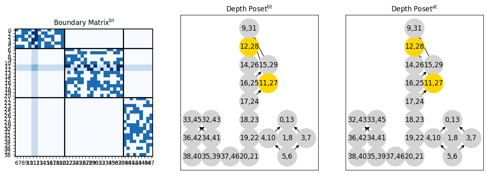

### Birth Death Pairs
|                          |                                                                                                                                                                                                                         |
|:-------------------------|:------------------------------------------------------------------------------------------------------------------------------------------------------------------------------------------------------------------------|
| Before the transposition | $\{(18, 23), (33, 45), (32, 43), (3, 7), (35, 39), (12, 28), (17, 24), (16, 25), (15, 29), (5, 6), (38, 40), (0, 13), (1, 8), (36, 42), (9, 31), (20, 21), (4, 10), (37, 46), (14, 26), (34, 41), (19, 22), (11, 27)\}$ |
| After the transposition  | $\{(18, 23), (33, 45), (32, 43), (3, 7), (35, 39), (12, 28), (17, 24), (16, 25), (15, 29), (5, 6), (38, 40), (0, 13), (1, 8), (36, 42), (9, 31), (20, 21), (4, 10), (37, 46), (14, 26), (34, 41), (19, 22), (11, 27)\}$ |

### Relations
|                          | Algorithm 1                                                                                                                                                                                                                                                                                                                                                                                                                                 | Algorithm 2                                                                                                                                                                                                                                                                                                                                                               |
|:-------------------------|:--------------------------------------------------------------------------------------------------------------------------------------------------------------------------------------------------------------------------------------------------------------------------------------------------------------------------------------------------------------------------------------------------------------------------------------------|:--------------------------------------------------------------------------------------------------------------------------------------------------------------------------------------------------------------------------------------------------------------------------------------------------------------------------------------------------------------------------|
| Before the transposition | $\{(25, 29), (42, 45), (41, 43), (21, 28), (22, 23), (21, 25), (40, 44), (28, 30), (25, 28), (6, 8), (25, 31), (24, 29), (7, 13), (21, 24), (22, 25), (23, 24), (23, 30), (22, 28), (39, 47), (24, 25), (6, 7), (6, 13), (6, 10), (41, 44), (42, 43), (24, 31), (41, 47), (26, 28), (21, 23), (43, 47), (29, 30), (26, 31), (21, 29), (40, 42), (23, 29), (40, 45), (10, 13), (28, 31), (45, 47), (25, 26)\}$                               | $\{(35, 30), (20, 11), (4, 0), (35, 33), (18, 17), (20, 17), (38, 32), (17, 12), (17, 15), (19, 15), (32, 30), (18, 16), (35, 32), (3, 0), (20, 16), (5, 0), (20, 19), (5, 3), (17, 11), (14, 12), (19, 11), (34, 30), (34, 33), (16, 12), (16, 15), (20, 9), (20, 18), (35, 34), (38, 33), (5, 2), (38, 36), (11, 9), (19, 16), (34, 32), (15, 9), (16, 14), (33, 30)\}$ |
| After the transposition  | $\{(25, 29), (42, 45), (41, 43), (21, 28), (22, 23), (21, 25), (40, 44), (28, 30), (27, 28), (27, 31), (25, 28), (6, 8), (25, 31), (24, 29), (7, 13), (21, 24), (22, 25), (23, 24), (23, 30), (22, 28), (39, 47), (27, 30), (24, 25), (6, 7), (6, 13), (6, 10), (41, 44), (42, 43), (24, 31), (41, 47), (26, 28), (21, 23), (43, 47), (29, 30), (26, 31), (21, 29), (40, 42), (23, 29), (40, 45), (10, 13), (28, 31), (45, 47), (25, 26)\}$ | $\{(35, 30), (20, 11), (4, 0), (18, 17), (35, 33), (20, 17), (38, 32), (17, 12), (17, 15), (19, 15), (32, 30), (18, 16), (35, 32), (3, 0), (20, 16), (5, 0), (20, 19), (5, 3), (17, 11), (14, 12), (19, 11), (34, 30), (34, 33), (16, 12), (16, 15), (20, 9), (20, 18), (35, 34), (38, 33), (5, 2), (38, 36), (11, 9), (19, 16), (34, 32), (15, 9), (16, 14), (33, 30)\}$ |

### Successors and Predecessers
No such node in the Depth Poset

### Temp Sets
|                                                               | Before the Transposition                                                                                             | After the Transposition                                                                                              |
|:--------------------------------------------------------------|:---------------------------------------------------------------------------------------------------------------------|:---------------------------------------------------------------------------------------------------------------------|
| $\mathcal{L} = \{(s, t)\in \text{BD}:\; f(t) < f(y)\}$        | $\{(4, 10), (18, 23), (0, 13), (3, 7), (1, 8), (14, 26), (16, 25), (19, 22), (5, 6), (17, 24), (11, 27), (20, 21)\}$ | $\{(4, 10), (18, 23), (0, 13), (3, 7), (1, 8), (14, 26), (16, 25), (19, 22), (5, 6), (17, 24), (11, 27), (20, 21)\}$ |
| $\mathcal{M} = \{(s, t)\in \text{BD}:\; f(y) < f(t) < f(b)\}$ | $\emptyset$                                                                                                          | $\emptyset$                                                                                                          |

### Equations
There are 2 equations are wrong.

| eq   | left (formula)                  | left (paramatrized)               | left (value)   | right (formula)                                                                        | right (paramatrized)                                                                         | right (value)           | correct   |
|:-----|:--------------------------------|:----------------------------------|:---------------|:---------------------------------------------------------------------------------------|:---------------------------------------------------------------------------------------------|:------------------------|:----------|
| Eq16 | $\text{Succ}_1^\text{at}(x, y)$ | $\text{Succ}_1^\text{at}(12, 28)$ | $\{(9, 31)\}$  | $\text{Succ}_1^\text{bt}(x, y) \oplus \{(a, b)\} \oplus \text{Succ}_1^\text{bt}(a, b)$ | $\text{Succ}_1^\text{bt}(12, 28) \oplus \{(11, 27)\} \oplus \text{Succ}_1^\text{bt}(11, 27)$ | $\{(11, 27), (9, 31)\}$ | ✘         |
| Eq17 | $\text{Pred}_1^\text{at}(a, b)$ | $\text{Pred}_1^\text{at}(11, 27)$ | $\emptyset$    | $\text{Pred}_1^\text{bt}(a, b) \oplus \{(x, y)\}$                                      | $\text{Pred}_1^\text{bt}(11, 27) \oplus \{(12, 28)\}$                                        | $\{(12, 28)\}$          | ✘         |

## Transposition <13, 14> in complex 9
Here is a __birth-death__ __switch forward__ transposition <13, 14>.

$$
a = 0, \; b = 13, \; x = 14, \; y = 26
$$

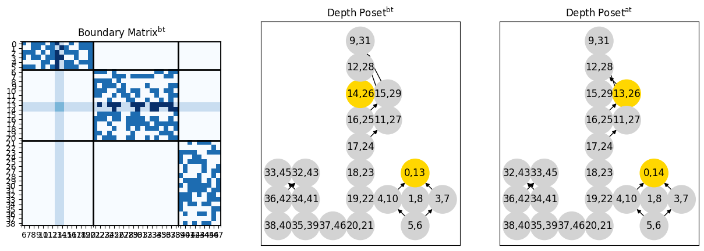

### Birth Death Pairs
|                          |                                                                                                                                                                                                                         |
|:-------------------------|:------------------------------------------------------------------------------------------------------------------------------------------------------------------------------------------------------------------------|
| Before the transposition | $\{(18, 23), (33, 45), (32, 43), (3, 7), (35, 39), (12, 28), (17, 24), (16, 25), (15, 29), (5, 6), (38, 40), (0, 13), (1, 8), (36, 42), (9, 31), (20, 21), (4, 10), (37, 46), (14, 26), (34, 41), (19, 22), (11, 27)\}$ |
| After the transposition  | $\{(18, 23), (33, 45), (32, 43), (3, 7), (35, 39), (12, 28), (17, 24), (0, 14), (13, 26), (16, 25), (15, 29), (5, 6), (38, 40), (1, 8), (36, 42), (9, 31), (20, 21), (4, 10), (37, 46), (34, 41), (19, 22), (11, 27)\}$ |

### Relations
|                          | Algorithm 1                                                                                                                                                                                                                                                                                                                                                                                                   | Algorithm 2                                                                                                                                                                                                                                                                                                                                                                         |
|:-------------------------|:--------------------------------------------------------------------------------------------------------------------------------------------------------------------------------------------------------------------------------------------------------------------------------------------------------------------------------------------------------------------------------------------------------------|:------------------------------------------------------------------------------------------------------------------------------------------------------------------------------------------------------------------------------------------------------------------------------------------------------------------------------------------------------------------------------------|
| Before the transposition | $\{(25, 29), (42, 45), (41, 43), (21, 28), (22, 23), (21, 25), (40, 44), (28, 30), (25, 28), (6, 8), (25, 31), (24, 29), (7, 13), (21, 24), (22, 25), (23, 24), (23, 30), (22, 28), (39, 47), (24, 25), (6, 7), (6, 13), (6, 10), (41, 44), (42, 43), (24, 31), (41, 47), (26, 28), (21, 23), (43, 47), (29, 30), (26, 31), (21, 29), (40, 42), (23, 29), (40, 45), (10, 13), (28, 31), (45, 47), (25, 26)\}$ | $\{(35, 30), (20, 11), (4, 0), (35, 33), (18, 17), (20, 17), (38, 32), (17, 12), (17, 15), (19, 15), (32, 30), (18, 16), (35, 32), (3, 0), (20, 16), (5, 0), (20, 19), (5, 3), (17, 11), (14, 12), (19, 11), (34, 30), (34, 33), (16, 12), (16, 15), (20, 9), (20, 18), (35, 34), (38, 33), (5, 2), (38, 36), (11, 9), (19, 16), (34, 32), (15, 9), (16, 14), (33, 30)\}$           |
| After the transposition  | $\{(25, 29), (42, 45), (41, 43), (21, 28), (22, 23), (21, 25), (40, 44), (28, 30), (25, 28), (6, 8), (25, 31), (24, 29), (21, 24), (22, 25), (23, 24), (23, 30), (22, 28), (8, 14), (39, 47), (24, 25), (6, 7), (6, 10), (41, 44), (42, 43), (24, 31), (41, 47), (26, 28), (21, 23), (43, 47), (29, 30), (26, 31), (21, 29), (40, 42), (23, 29), (40, 45), (28, 31), (45, 47), (25, 26), (7, 14)\}$           | $\{(35, 30), (20, 11), (4, 0), (35, 33), (18, 17), (20, 17), (38, 32), (17, 12), (17, 15), (19, 15), (32, 30), (18, 16), (35, 32), (18, 13), (3, 0), (20, 16), (5, 0), (20, 19), (5, 3), (17, 11), (19, 11), (34, 30), (34, 33), (16, 12), (16, 15), (20, 9), (20, 18), (35, 34), (38, 33), (5, 2), (38, 36), (11, 9), (19, 16), (19, 13), (34, 32), (13, 12), (15, 9), (33, 30)\}$ |

### Successors and Predecessers
|                 | $\text{Set}^\text{bt}(0, 13)$                                  | $\text{Set}^\text{bt}(14, 26)$                            | $\text{Set}^\text{at}(0, 14)$                                  | $\text{Set}^\text{at}(13, 26)$                             |
|:----------------|:---------------------------------------------------------------|:----------------------------------------------------------|:---------------------------------------------------------------|:-----------------------------------------------------------|
| $\text{Succ}_1$ | $\text{Succ}_1^\text{bt}(0, 13) = \emptyset$                   | $\text{Succ}_1^\text{bt}(14, 26) = \{(12, 28), (9, 31)\}$ | $\text{Succ}_1^\text{at}(0, 14) = \emptyset$                   | $\text{Succ}_1^\text{at}(13, 26) = \{(12, 28), (9, 31)\}$  |
| $\text{Pred}_1$ | $\text{Pred}_1^\text{bt}(0, 13) = \{(4, 10), (5, 6), (3, 7)\}$ | $\text{Pred}_1^\text{bt}(14, 26) = \{(16, 25)\}$          | $\text{Pred}_1^\text{at}(0, 14) = \{(3, 7), (1, 8)\}$          | $\text{Pred}_1^\text{at}(13, 26) = \{(16, 25)\}$           |
| $\text{Succ}_2$ | $\text{Succ}_2^\text{bt}(0, 13) = \emptyset$                   | $\text{Succ}_2^\text{bt}(14, 26) = \{(12, 28)\}$          | $\text{Succ}_2^\text{at}(0, 14) = \emptyset$                   | $\text{Succ}_2^\text{at}(13, 26) = \{(12, 28)\}$           |
| $\text{Pred}_2$ | $\text{Pred}_2^\text{bt}(0, 13) = \{(4, 10), (5, 6), (3, 7)\}$ | $\text{Pred}_2^\text{bt}(14, 26) = \{(16, 25)\}$          | $\text{Pred}_2^\text{at}(0, 14) = \{(4, 10), (5, 6), (3, 7)\}$ | $\text{Pred}_2^\text{at}(13, 26) = \{(18, 23), (19, 22)\}$ |

### Temp Sets
|                                                              | Before the Transposition                               | After the Transposition                                |
|:-------------------------------------------------------------|:-------------------------------------------------------|:-------------------------------------------------------|
| $A_1 = \{(s, t)\in \text{BD}:\; f(a) < f(s) < f(t) < f(x)\}$ | $\{(4, 10), (1, 8), (5, 6), (3, 7)\}$                  | $\{(4, 10), (1, 8), (5, 6), (3, 7)\}$                  |
| $B_1 = \{(s, t)\in \text{BD}:\; U_1[t, x] = 1\}$             | $\emptyset$                                            | $\{(3, 7), (1, 8)\}$                                   |
| $A_2 = \{(s, t)\in \text{BD}:\; f(b) < f(s) < f(t) < f(y)\}$ | $\{(18, 23), (16, 25), (19, 22), (17, 24), (20, 21)\}$ | $\{(18, 23), (16, 25), (19, 22), (17, 24), (20, 21)\}$ |
| $B_2 = \{(s, t)\in \text{BD}:\; U_2[b, s] = 1\}$             | $\emptyset$                                            | $\{(18, 23), (19, 22)\}$                               |

### Equations
There are 4 equations are wrong.

| eq    | left (formula)                  | left (paramatrized)               | left (value)                  | right (formula)                                      | right (paramatrized)                                  | right (value)                 | correct   |
|:------|:--------------------------------|:----------------------------------|:------------------------------|:-----------------------------------------------------|:------------------------------------------------------|:------------------------------|:----------|
| Eq48  | $\text{Succ}_1^\text{at}(a, x)$ | $\text{Succ}_1^\text{at}(0, 14)$  | $\emptyset$                   | $\text{Succ}_1^\text{bt}(a, b)$                      | $\text{Succ}_1^\text{bt}(0, 13)$                      | $\emptyset$                   | ✔         |
| Eq49  | $\text{Succ}_1^\text{at}(b, y)$ | $\text{Succ}_1^\text{at}(13, 26)$ | $\{(12, 28), (9, 31)\}$       | $\text{Succ}_1^\text{bt}(x, y)$                      | $\text{Succ}_1^\text{bt}(14, 26)$                     | $\{(12, 28), (9, 31)\}$       | ✔         |
| Eq50  | $\text{Pred}_1^\text{at}(a, x)$ | $\text{Pred}_1^\text{at}(0, 14)$  | $\{(3, 7), (1, 8)\}$          | $\{(s, t)\in \text{BD}:\; U_1^\text{bt}[t, x] = 1\}$ | $\{(s, t)\in \text{BD}:\; U_1^\text{bt}[t, 14] = 1\}$ | $\emptyset$                   | ✘         |
| Eq50a | $\text{Pred}_1^\text{at}(a, x)$ | $\text{Pred}_1^\text{at}(0, 14)$  | $\{(3, 7), (1, 8)\}$          | $A_1^\text{bt} \cap B_1^\text{bt}$                   | $A_1^\text{bt} \cap B_1^\text{bt}$                    | $\emptyset$                   | ✘         |
| Eq50b | $\text{Pred}_1^\text{at}(a, x)$ | $\text{Pred}_1^\text{at}(0, 14)$  | $\{(3, 7), (1, 8)\}$          | $A_1^\text{bt} \cap B_1^\text{at}$                   | $A_1^\text{bt} \cap B_1^\text{at}$                    | $\{(3, 7), (1, 8)\}$          | ✔         |
| Eq51  | $\text{Pred}_1^\text{at}(b, y)$ | $\text{Pred}_1^\text{at}(13, 26)$ | $\{(16, 25)\}$                | $\text{Pred}_1^\text{bt}(x, y)$                      | $\text{Pred}_1^\text{bt}(14, 26)$                     | $\{(16, 25)\}$                | ✔         |
| Eq52  | $\text{Succ}_2^\text{at}(a, x)$ | $\text{Succ}_2^\text{at}(0, 14)$  | $\emptyset$                   | $\text{Succ}_2^\text{bt}(a, b)$                      | $\text{Succ}_2^\text{bt}(0, 13)$                      | $\emptyset$                   | ✔         |
| Eq53  | $\text{Succ}_2^\text{at}(b, y)$ | $\text{Succ}_2^\text{at}(13, 26)$ | $\{(12, 28)\}$                | $\text{Succ}_2^\text{bt}(x, y)$                      | $\text{Succ}_2^\text{bt}(14, 26)$                     | $\{(12, 28)\}$                | ✔         |
| Eq54  | $\text{Pred}_2^\text{at}(a, x)$ | $\text{Pred}_2^\text{at}(0, 14)$  | $\{(4, 10), (5, 6), (3, 7)\}$ | $\text{Pred}_2^\text{bt}(a, b)$                      | $\text{Pred}_2^\text{bt}(0, 13)$                      | $\{(4, 10), (5, 6), (3, 7)\}$ | ✔         |
| Eq55  | $\text{Pred}_2^\text{at}(b, y)$ | $\text{Pred}_2^\text{at}(13, 26)$ | $\{(18, 23), (19, 22)\}$      | $\{(s, t)\in \text{BD}:\; U_2^\text{bt}[b, s] = 1\}$ | $\{(s, t)\in \text{BD}:\; U_2^\text{bt}[13, s] = 1\}$ | $\emptyset$                   | ✘         |
| Eq55a | $\text{Pred}_2^\text{at}(b, y)$ | $\text{Pred}_2^\text{at}(13, 26)$ | $\{(18, 23), (19, 22)\}$      | $A_2^\text{bt} \cap B_2^\text{bt}$                   | $A_2^\text{bt} \cap B_2^\text{bt}$                    | $\emptyset$                   | ✘         |
| Eq55b | $\text{Pred}_2^\text{at}(b, y)$ | $\text{Pred}_2^\text{at}(13, 26)$ | $\{(18, 23), (19, 22)\}$      | $A_2^\text{bt} \cap B_2^\text{at}$                   | $A_2^\text{bt} \cap B_2^\text{at}$                    | $\{(18, 23), (19, 22)\}$      | ✔         |

## Transposition <14, 15> in complex 9
Here is a __birth-birth__ __no switch__ transposition <14, 15>.

$$
a = 14, \; b = 26, \; x = 15, \; y = 29
$$

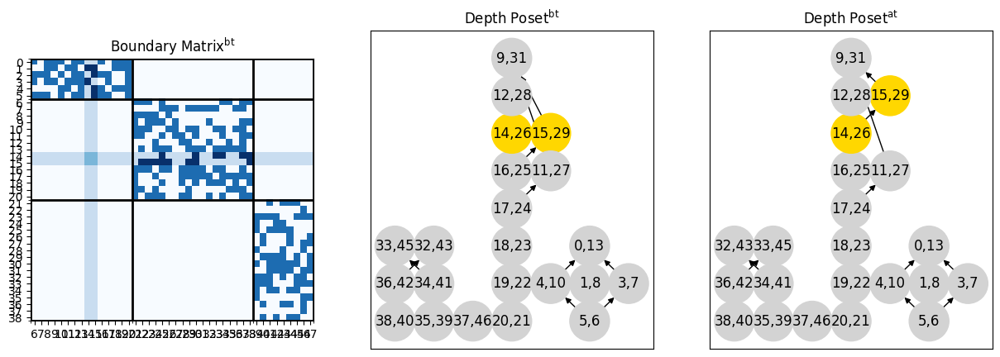

### Birth Death Pairs
|                          |                                                                                                                                                                                                                         |
|:-------------------------|:------------------------------------------------------------------------------------------------------------------------------------------------------------------------------------------------------------------------|
| Before the transposition | $\{(18, 23), (33, 45), (32, 43), (3, 7), (35, 39), (12, 28), (17, 24), (16, 25), (15, 29), (5, 6), (38, 40), (0, 13), (1, 8), (36, 42), (9, 31), (20, 21), (4, 10), (37, 46), (14, 26), (34, 41), (19, 22), (11, 27)\}$ |
| After the transposition  | $\{(18, 23), (33, 45), (32, 43), (3, 7), (35, 39), (12, 28), (17, 24), (16, 25), (15, 29), (5, 6), (38, 40), (0, 13), (1, 8), (36, 42), (9, 31), (20, 21), (4, 10), (37, 46), (14, 26), (34, 41), (19, 22), (11, 27)\}$ |

### Relations
|                          | Algorithm 1                                                                                                                                                                                                                                                                                                                                                                                                                       | Algorithm 2                                                                                                                                                                                                                                                                                                                                                               |
|:-------------------------|:----------------------------------------------------------------------------------------------------------------------------------------------------------------------------------------------------------------------------------------------------------------------------------------------------------------------------------------------------------------------------------------------------------------------------------|:--------------------------------------------------------------------------------------------------------------------------------------------------------------------------------------------------------------------------------------------------------------------------------------------------------------------------------------------------------------------------|
| Before the transposition | $\{(25, 29), (42, 45), (41, 43), (21, 28), (22, 23), (21, 25), (40, 44), (28, 30), (25, 28), (6, 8), (25, 31), (24, 29), (7, 13), (21, 24), (22, 25), (23, 24), (23, 30), (22, 28), (39, 47), (24, 25), (6, 7), (6, 13), (6, 10), (41, 44), (42, 43), (24, 31), (41, 47), (26, 28), (21, 23), (43, 47), (29, 30), (26, 31), (21, 29), (40, 42), (23, 29), (40, 45), (10, 13), (28, 31), (45, 47), (25, 26)\}$                     | $\{(35, 30), (20, 11), (4, 0), (35, 33), (18, 17), (20, 17), (38, 32), (17, 12), (17, 15), (19, 15), (32, 30), (18, 16), (35, 32), (3, 0), (20, 16), (5, 0), (20, 19), (5, 3), (17, 11), (14, 12), (19, 11), (34, 30), (34, 33), (16, 12), (16, 15), (20, 9), (20, 18), (35, 34), (38, 33), (5, 2), (38, 36), (11, 9), (19, 16), (34, 32), (15, 9), (16, 14), (33, 30)\}$ |
| After the transposition  | $\{(25, 29), (42, 45), (41, 43), (26, 30), (21, 28), (22, 23), (21, 25), (40, 44), (28, 30), (25, 28), (6, 8), (25, 31), (24, 29), (7, 13), (26, 29), (21, 24), (22, 25), (23, 24), (23, 30), (22, 28), (39, 47), (24, 25), (6, 7), (6, 13), (6, 10), (41, 44), (42, 43), (24, 31), (41, 47), (26, 28), (21, 23), (43, 47), (26, 31), (29, 30), (21, 29), (40, 42), (23, 29), (40, 45), (10, 13), (28, 31), (45, 47), (25, 26)\}$ | $\{(35, 30), (20, 11), (4, 0), (35, 33), (18, 17), (20, 17), (38, 32), (17, 12), (17, 15), (19, 15), (32, 30), (18, 16), (35, 32), (3, 0), (20, 16), (5, 0), (20, 19), (5, 3), (17, 11), (14, 12), (19, 11), (34, 30), (34, 33), (16, 12), (16, 15), (20, 9), (20, 18), (35, 34), (38, 33), (5, 2), (38, 36), (11, 9), (19, 16), (34, 32), (15, 9), (16, 14), (33, 30)\}$ |

### Successors and Predecessers
No such node in the Depth Poset

### Temp Sets
|                                                               | Before the Transposition                                                                                                       | After the Transposition                                                                                                        |
|:--------------------------------------------------------------|:-------------------------------------------------------------------------------------------------------------------------------|:-------------------------------------------------------------------------------------------------------------------------------|
| $\mathcal{L} = \{(s, t)\in \text{BD}:\; f(t) < f(y)\}$        | $\{(4, 10), (18, 23), (0, 13), (3, 7), (1, 8), (14, 26), (16, 25), (12, 28), (19, 22), (5, 6), (17, 24), (11, 27), (20, 21)\}$ | $\{(4, 10), (18, 23), (0, 13), (3, 7), (1, 8), (14, 26), (16, 25), (12, 28), (19, 22), (5, 6), (17, 24), (11, 27), (20, 21)\}$ |
| $\mathcal{M} = \{(s, t)\in \text{BD}:\; f(y) < f(t) < f(b)\}$ | $\emptyset$                                                                                                                    | $\emptyset$                                                                                                                    |

### Equations
There are 2 equations are wrong.

| eq   | left (formula)                  | left (paramatrized)               | left (value)   | right (formula)                                                                        | right (paramatrized)                                                                         | right (value)                     | correct   |
|:-----|:--------------------------------|:----------------------------------|:---------------|:---------------------------------------------------------------------------------------|:---------------------------------------------------------------------------------------------|:----------------------------------|:----------|
| Eq16 | $\text{Succ}_1^\text{at}(x, y)$ | $\text{Succ}_1^\text{at}(15, 29)$ | $\emptyset$    | $\text{Succ}_1^\text{bt}(x, y) \oplus \{(a, b)\} \oplus \text{Succ}_1^\text{bt}(a, b)$ | $\text{Succ}_1^\text{bt}(15, 29) \oplus \{(14, 26)\} \oplus \text{Succ}_1^\text{bt}(14, 26)$ | $\{(12, 28), (14, 26), (9, 31)\}$ | ✘         |
| Eq17 | $\text{Pred}_1^\text{at}(a, b)$ | $\text{Pred}_1^\text{at}(14, 26)$ | $\{(16, 25)\}$ | $\text{Pred}_1^\text{bt}(a, b) \oplus \{(x, y)\}$                                      | $\text{Pred}_1^\text{bt}(14, 26) \oplus \{(15, 29)\}$                                        | $\{(16, 25), (15, 29)\}$          | ✘         |

## Transposition <19, 20> in complex 9
Here is a __birth-birth__ __switch forward__ transposition <19, 20>.

$$
a = 19, \; b = 22, \; x = 20, \; y = 21
$$

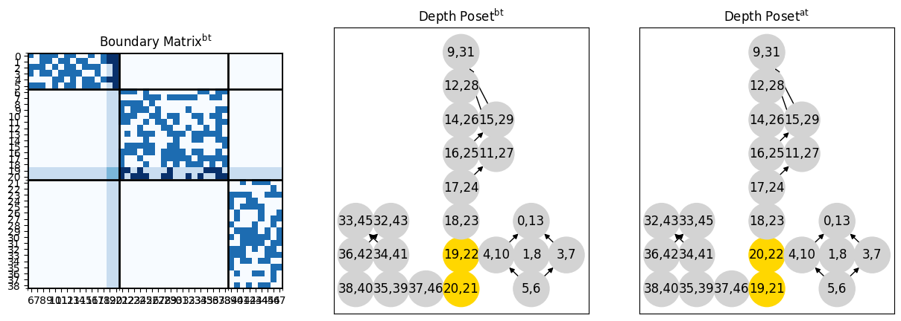

### Birth Death Pairs
|                          |                                                                                                                                                                                                                         |
|:-------------------------|:------------------------------------------------------------------------------------------------------------------------------------------------------------------------------------------------------------------------|
| Before the transposition | $\{(18, 23), (33, 45), (32, 43), (3, 7), (35, 39), (12, 28), (17, 24), (16, 25), (15, 29), (5, 6), (38, 40), (0, 13), (1, 8), (36, 42), (9, 31), (20, 21), (4, 10), (37, 46), (14, 26), (34, 41), (19, 22), (11, 27)\}$ |
| After the transposition  | $\{(18, 23), (33, 45), (32, 43), (3, 7), (35, 39), (12, 28), (17, 24), (19, 21), (16, 25), (15, 29), (5, 6), (20, 22), (38, 40), (0, 13), (1, 8), (36, 42), (9, 31), (4, 10), (37, 46), (14, 26), (34, 41), (11, 27)\}$ |

### Relations
|                          | Algorithm 1                                                                                                                                                                                                                                                                                                                                                                                                   | Algorithm 2                                                                                                                                                                                                                                                                                                                                                                        |
|:-------------------------|:--------------------------------------------------------------------------------------------------------------------------------------------------------------------------------------------------------------------------------------------------------------------------------------------------------------------------------------------------------------------------------------------------------------|:-----------------------------------------------------------------------------------------------------------------------------------------------------------------------------------------------------------------------------------------------------------------------------------------------------------------------------------------------------------------------------------|
| Before the transposition | $\{(25, 29), (42, 45), (41, 43), (21, 28), (22, 23), (21, 25), (40, 44), (28, 30), (25, 28), (6, 8), (25, 31), (24, 29), (7, 13), (21, 24), (22, 25), (23, 24), (23, 30), (22, 28), (39, 47), (24, 25), (6, 7), (6, 13), (6, 10), (41, 44), (42, 43), (24, 31), (41, 47), (26, 28), (21, 23), (43, 47), (29, 30), (26, 31), (21, 29), (40, 42), (23, 29), (40, 45), (10, 13), (28, 31), (45, 47), (25, 26)\}$ | $\{(35, 30), (20, 11), (4, 0), (35, 33), (18, 17), (20, 17), (38, 32), (17, 12), (17, 15), (19, 15), (32, 30), (18, 16), (35, 32), (3, 0), (20, 16), (5, 0), (20, 19), (5, 3), (17, 11), (14, 12), (19, 11), (34, 30), (34, 33), (16, 12), (16, 15), (20, 9), (20, 18), (35, 34), (38, 33), (5, 2), (38, 36), (11, 9), (19, 16), (34, 32), (15, 9), (16, 14), (33, 30)\}$          |
| After the transposition  | $\{(25, 29), (42, 45), (41, 43), (21, 22), (22, 23), (40, 44), (28, 30), (25, 28), (6, 8), (25, 31), (24, 29), (7, 13), (21, 24), (22, 25), (23, 24), (23, 30), (22, 28), (39, 47), (24, 25), (6, 7), (6, 13), (6, 10), (41, 44), (42, 43), (24, 31), (41, 47), (26, 28), (26, 31), (43, 47), (29, 30), (21, 29), (40, 42), (23, 29), (40, 45), (10, 13), (28, 31), (45, 47), (25, 26)\}$                     | $\{(35, 30), (18, 17), (4, 0), (35, 33), (20, 17), (38, 32), (17, 12), (19, 9), (17, 15), (19, 18), (32, 30), (18, 16), (35, 32), (3, 0), (5, 0), (5, 3), (17, 11), (14, 12), (19, 11), (34, 30), (34, 33), (19, 17), (19, 20), (16, 12), (16, 15), (20, 9), (20, 18), (35, 34), (20, 15), (38, 33), (5, 2), (38, 36), (11, 9), (19, 16), (34, 32), (15, 9), (16, 14), (33, 30)\}$ |

### Successors and Predecessers
|                 | $\text{Set}^\text{bt}(19, 22)$                                       | $\text{Set}^\text{bt}(20, 21)$                                                                    | $\text{Set}^\text{at}(19, 21)$                                                                    | $\text{Set}^\text{at}(20, 22)$                                                |
|:----------------|:---------------------------------------------------------------------|:--------------------------------------------------------------------------------------------------|:--------------------------------------------------------------------------------------------------|:------------------------------------------------------------------------------|
| $\text{Succ}_1$ | $\text{Succ}_1^\text{bt}(19, 22) = \{(16, 25), (12, 28), (18, 23)\}$ | $\text{Succ}_1^\text{bt}(20, 21) = \{(18, 23), (16, 25), (12, 28), (15, 29), (17, 24)\}$          | $\text{Succ}_1^\text{at}(19, 21) = \{(20, 22), (15, 29), (17, 24)\}$                              | $\text{Succ}_1^\text{at}(20, 22) = \{(16, 25), (12, 28), (18, 23)\}$          |
| $\text{Pred}_1$ | $\text{Pred}_1^\text{bt}(19, 22) = \emptyset$                        | $\text{Pred}_1^\text{bt}(20, 21) = \emptyset$                                                     | $\text{Pred}_1^\text{at}(19, 21) = \emptyset$                                                     | $\text{Pred}_1^\text{at}(20, 22) = \{(19, 21)\}$                              |
| $\text{Succ}_2$ | $\text{Succ}_2^\text{bt}(19, 22) = \{(16, 25), (15, 29), (11, 27)\}$ | $\text{Succ}_2^\text{bt}(20, 21) = \{(18, 23), (9, 31), (16, 25), (19, 22), (17, 24), (11, 27)\}$ | $\text{Succ}_2^\text{at}(19, 21) = \{(18, 23), (9, 31), (16, 25), (20, 22), (17, 24), (11, 27)\}$ | $\text{Succ}_2^\text{at}(20, 22) = \{(18, 23), (15, 29), (17, 24), (9, 31)\}$ |
| $\text{Pred}_2$ | $\text{Pred}_2^\text{bt}(19, 22) = \{(20, 21)\}$                     | $\text{Pred}_2^\text{bt}(20, 21) = \emptyset$                                                     | $\text{Pred}_2^\text{at}(19, 21) = \emptyset$                                                     | $\text{Pred}_2^\text{at}(20, 22) = \{(19, 21)\}$                              |

### Temp Sets
|                                                               | Before the Transposition                       | After the Transposition                        |
|:--------------------------------------------------------------|:-----------------------------------------------|:-----------------------------------------------|
| $\mathcal{L} = \{(s, t)\in \text{BD}:\; f(t) < f(y)\}$        | $\{(4, 10), (0, 13), (3, 7), (1, 8), (5, 6)\}$ | $\{(4, 10), (0, 13), (3, 7), (1, 8), (5, 6)\}$ |
| $\mathcal{M} = \{(s, t)\in \text{BD}:\; f(y) < f(t) < f(b)\}$ | $\emptyset$                                    | $\emptyset$                                    |

### Equations
There are 1 equations are wrong.

| eq   | left (formula)                  | left (paramatrized)               | left (value)                                                    | right (formula)                                                                                           | right (paramatrized)                                                                                            | right (value)                                                   | correct   |
|:-----|:--------------------------------|:----------------------------------|:----------------------------------------------------------------|:----------------------------------------------------------------------------------------------------------|:----------------------------------------------------------------------------------------------------------------|:----------------------------------------------------------------|:----------|
| Eq08 | $\text{Succ}_1^\text{at}(a, y)$ | $\text{Succ}_1^\text{at}(19, 21)$ | $\{(20, 22), (15, 29), (17, 24)\}$                              | $\text{Succ}_1^\text{bt}(x, y) \oplus \{(x, b)\} \oplus \text{Succ}_1^\text{bt}(a, b)$                    | $\text{Succ}_1^\text{bt}(20, 21) \oplus \{(20, 22)\} \oplus \text{Succ}_1^\text{bt}(19, 22)$                    | $\{(20, 22), (15, 29), (17, 24)\}$                              | ✔         |
| Eq09 | $\text{Succ}_1^\text{at}(x, b)$ | $\text{Succ}_1^\text{at}(20, 22)$ | $\{(16, 25), (12, 28), (18, 23)\}$                              | $\text{Succ}_1^\text{bt}(a, b)$                                                                           | $\text{Succ}_1^\text{bt}(19, 22)$                                                                               | $\{(16, 25), (12, 28), (18, 23)\}$                              | ✔         |
| Eq10 | $\text{Pred}_1^\text{at}(a, y)$ | $\text{Pred}_1^\text{at}(19, 21)$ | $\emptyset$                                                     | $\text{Pred}_1^\text{bt}(x, y)$                                                                           | $\text{Pred}_1^\text{bt}(20, 21)$                                                                               | $\emptyset$                                                     | ✔         |
| Eq11 | $\text{Pred}_1^\text{at}(x, b)$ | $\text{Pred}_1^\text{at}(20, 22)$ | $\{(19, 21)\}$                                                  | $\text{Pred}_1^\text{bt}(a, b) \oplus \{(a, y)\}$                                                         | $\text{Pred}_1^\text{bt}(19, 22) \oplus \{(19, 21)\}$                                                           | $\{(19, 21)\}$                                                  | ✔         |
| Eq12 | $\text{Succ}_2^\text{at}(a, y)$ | $\text{Succ}_2^\text{at}(19, 21)$ | $\{(18, 23), (9, 31), (16, 25), (20, 22), (17, 24), (11, 27)\}$ | $\text{Succ}_2^\text{bt}(x, y) \oplus \{(x, b), (a, b)\}$                                                 | $\text{Succ}_2^\text{bt}(20, 21) \oplus \{(20, 22), (19, 22)\}$                                                 | $\{(18, 23), (9, 31), (16, 25), (20, 22), (17, 24), (11, 27)\}$ | ✔         |
| Eq13 | $\text{Succ}_2^\text{at}(x, b)$ | $\text{Succ}_2^\text{at}(20, 22)$ | $\{(18, 23), (15, 29), (17, 24), (9, 31)\}$                     | $\text{Succ}_2^\text{bt}(a, b)$                                                                           | $\text{Succ}_2^\text{bt}(19, 22)$                                                                               | $\{(16, 25), (15, 29), (11, 27)\}$                              | ✘         |
| Eq14 | $\text{Pred}_2^\text{at}(a, y)$ | $\text{Pred}_2^\text{at}(19, 21)$ | $\emptyset$                                                     | $[\text{Pred}_2^\text{bt}(a, b) \cap \mathcal{L}]$                                                        | $[\text{Pred}_2^\text{bt}(19, 22) \cap \mathcal{L}]$                                                            | $\emptyset$                                                     | ✔         |
| Eq15 | $\text{Pred}_2^\text{at}(x, b)$ | $\text{Pred}_2^\text{at}(20, 22)$ | $\{(19, 21)\}$                                                  | $\text{Pred}_2^\text{bt}(x, y) \oplus \{(a, y)\} \oplus [\text{Pred}_2^\text{bt}(a, b) \cap \mathcal{M}]$ | $\text{Pred}_2^\text{bt}(20, 21) \oplus \{(19, 21)\} \oplus [\text{Pred}_2^\text{bt}(19, 22) \cap \mathcal{M}]$ | $\{(19, 21)\}$                                                  | ✔         |

## Transposition <22, 23> in complex 9
Here is a __death-death__ __switch forward__ transposition <22, 23>.

$$
a = 18, \; b = 23, \; x = 19, \; y = 22
$$

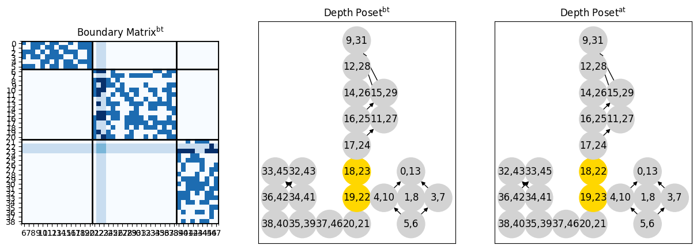

### Birth Death Pairs
|                          |                                                                                                                                                                                                                         |
|:-------------------------|:------------------------------------------------------------------------------------------------------------------------------------------------------------------------------------------------------------------------|
| Before the transposition | $\{(18, 23), (33, 45), (32, 43), (3, 7), (35, 39), (12, 28), (17, 24), (16, 25), (15, 29), (5, 6), (38, 40), (0, 13), (1, 8), (36, 42), (9, 31), (20, 21), (4, 10), (37, 46), (14, 26), (34, 41), (19, 22), (11, 27)\}$ |
| After the transposition  | $\{(33, 45), (32, 43), (3, 7), (35, 39), (12, 28), (17, 24), (16, 25), (18, 22), (15, 29), (5, 6), (38, 40), (19, 23), (0, 13), (1, 8), (36, 42), (9, 31), (20, 21), (4, 10), (37, 46), (14, 26), (34, 41), (11, 27)\}$ |

### Relations
|                          | Algorithm 1                                                                                                                                                                                                                                                                                                                                                                                                                       | Algorithm 2                                                                                                                                                                                                                                                                                                                                                                         |
|:-------------------------|:----------------------------------------------------------------------------------------------------------------------------------------------------------------------------------------------------------------------------------------------------------------------------------------------------------------------------------------------------------------------------------------------------------------------------------|:------------------------------------------------------------------------------------------------------------------------------------------------------------------------------------------------------------------------------------------------------------------------------------------------------------------------------------------------------------------------------------|
| Before the transposition | $\{(25, 29), (42, 45), (41, 43), (21, 28), (22, 23), (21, 25), (40, 44), (28, 30), (25, 28), (6, 8), (25, 31), (24, 29), (7, 13), (21, 24), (22, 25), (23, 24), (23, 30), (22, 28), (39, 47), (24, 25), (6, 7), (6, 13), (6, 10), (41, 44), (42, 43), (24, 31), (41, 47), (26, 28), (21, 23), (43, 47), (29, 30), (26, 31), (21, 29), (40, 42), (23, 29), (40, 45), (10, 13), (28, 31), (45, 47), (25, 26)\}$                     | $\{(35, 30), (20, 11), (4, 0), (35, 33), (18, 17), (20, 17), (38, 32), (17, 12), (17, 15), (19, 15), (32, 30), (18, 16), (35, 32), (3, 0), (20, 16), (5, 0), (20, 19), (5, 3), (17, 11), (14, 12), (19, 11), (34, 30), (34, 33), (16, 12), (16, 15), (20, 9), (20, 18), (35, 34), (38, 33), (5, 2), (38, 36), (11, 9), (19, 16), (34, 32), (15, 9), (16, 14), (33, 30)\}$           |
| After the transposition  | $\{(25, 29), (42, 45), (41, 43), (21, 28), (21, 25), (23, 22), (23, 28), (40, 44), (23, 25), (22, 29), (28, 30), (25, 28), (6, 8), (25, 31), (24, 29), (7, 13), (21, 24), (22, 25), (22, 28), (39, 47), (24, 25), (6, 7), (6, 13), (6, 10), (41, 44), (42, 43), (24, 31), (41, 47), (26, 28), (21, 23), (26, 31), (43, 47), (29, 30), (21, 29), (22, 24), (22, 30), (40, 42), (40, 45), (10, 13), (28, 31), (45, 47), (25, 26)\}$ | $\{(35, 30), (20, 11), (4, 0), (35, 33), (18, 17), (20, 17), (38, 32), (17, 12), (17, 15), (19, 18), (19, 15), (32, 30), (18, 16), (35, 32), (3, 0), (20, 16), (5, 0), (20, 19), (5, 3), (17, 11), (14, 12), (19, 11), (34, 30), (34, 33), (19, 17), (16, 12), (16, 15), (20, 9), (20, 18), (35, 34), (38, 33), (5, 2), (38, 36), (11, 9), (34, 32), (15, 9), (16, 14), (33, 30)\}$ |

### Successors and Predecessers
|                 | $\text{Set}^\text{bt}(18, 23)$                             | $\text{Set}^\text{bt}(19, 22)$                                       | $\text{Set}^\text{at}(19, 23)$                                                 | $\text{Set}^\text{at}(18, 22)$                                                 |
|:----------------|:-----------------------------------------------------------|:---------------------------------------------------------------------|:-------------------------------------------------------------------------------|:-------------------------------------------------------------------------------|
| $\text{Succ}_1$ | $\text{Succ}_1^\text{bt}(18, 23) = \{(15, 29), (17, 24)\}$ | $\text{Succ}_1^\text{bt}(19, 22) = \{(16, 25), (12, 28), (18, 23)\}$ | $\text{Succ}_1^\text{at}(19, 23) = \{(16, 25), (18, 22), (12, 28)\}$           | $\text{Succ}_1^\text{at}(18, 22) = \{(16, 25), (12, 28), (15, 29), (17, 24)\}$ |
| $\text{Pred}_1$ | $\text{Pred}_1^\text{bt}(18, 23) = \{(19, 22), (20, 21)\}$ | $\text{Pred}_1^\text{bt}(19, 22) = \emptyset$                        | $\text{Pred}_1^\text{at}(19, 23) = \{(20, 21)\}$                               | $\text{Pred}_1^\text{at}(18, 22) = \{(19, 23)\}$                               |
| $\text{Succ}_2$ | $\text{Succ}_2^\text{bt}(18, 23) = \{(16, 25), (17, 24)\}$ | $\text{Succ}_2^\text{bt}(19, 22) = \{(16, 25), (15, 29), (11, 27)\}$ | $\text{Succ}_2^\text{at}(19, 23) = \{(18, 22), (15, 29), (17, 24), (11, 27)\}$ | $\text{Succ}_2^\text{at}(18, 22) = \{(16, 25), (17, 24)\}$                     |
| $\text{Pred}_2$ | $\text{Pred}_2^\text{bt}(18, 23) = \{(20, 21)\}$           | $\text{Pred}_2^\text{bt}(19, 22) = \{(20, 21)\}$                     | $\text{Pred}_2^\text{at}(19, 23) = \{(20, 21)\}$                               | $\text{Pred}_2^\text{at}(18, 22) = \{(20, 21), (19, 23)\}$                     |

### Temp Sets
|                                                               | Before the Transposition                                                             | After the Transposition                                                              |
|:--------------------------------------------------------------|:-------------------------------------------------------------------------------------|:-------------------------------------------------------------------------------------|
| $\mathcal{B} = \{(s, t)\in \text{BD}:\; f(s) > f(x)\}$        | $\{(33, 45), (32, 43), (35, 39), (36, 42), (34, 41), (38, 40), (37, 46), (20, 21)\}$ | $\{(33, 45), (32, 43), (35, 39), (36, 42), (34, 41), (38, 40), (37, 46), (20, 21)\}$ |
| $\mathcal{N} = \{(s, t)\in \text{BD}:\; f(x) > f(s) > f(a)\}$ | $\emptyset$                                                                          | $\emptyset$                                                                          |

### Equations
There are 1 equations are wrong.

| eq   | left (formula)                  | left (paramatrized)               | left (value)                                 | right (formula)                                                                                          | right (paramatrized)                                                                                           | right (value)                                | correct   |
|:-----|:--------------------------------|:----------------------------------|:---------------------------------------------|:---------------------------------------------------------------------------------------------------------|:---------------------------------------------------------------------------------------------------------------|:---------------------------------------------|:----------|
| Eq28 | $\text{Succ}_1^\text{at}(x, b)$ | $\text{Succ}_1^\text{at}(19, 23)$ | $\{(16, 25), (18, 22), (12, 28)\}$           | $\text{Succ}_1^\text{bt}(x, y) \oplus \{(a, y), (a, b)\}$                                                | $\text{Succ}_1^\text{bt}(19, 22) \oplus \{(18, 22), (18, 23)\}$                                                | $\{(16, 25), (18, 22), (12, 28)\}$           | ✔         |
| Eq29 | $\text{Succ}_1^\text{at}(a, y)$ | $\text{Succ}_1^\text{at}(18, 22)$ | $\{(16, 25), (12, 28), (15, 29), (17, 24)\}$ | $\text{Succ}_1^\text{bt}(a, b)$                                                                          | $\text{Succ}_1^\text{bt}(18, 23)$                                                                              | $\{(15, 29), (17, 24)\}$                     | ✘         |
| Eq30 | $\text{Pred}_1^\text{at}(x, b)$ | $\text{Pred}_1^\text{at}(19, 23)$ | $\{(20, 21)\}$                               | $[\text{Pred}_1^\text{bt}(a, b) \cap \mathcal{B}]$                                                       | $[\text{Pred}_1^\text{bt}(18, 23) \cap \mathcal{B}]$                                                           | $\{(20, 21)\}$                               | ✔         |
| Eq31 | $\text{Pred}_1^\text{at}(a, y)$ | $\text{Pred}_1^\text{at}(18, 22)$ | $\{(19, 23)\}$                               | $\text{Pred}_1^\text{bt}(x, y) \oplus \{(x, b)\} \oplus[\text{Pred}_1^\text{bt}(a, b) \cap \mathcal{N}]$ | $\text{Pred}_1^\text{bt}(19, 22) \oplus \{(19, 23)\} \oplus[\text{Pred}_1^\text{bt}(18, 23) \cap \mathcal{N}]$ | $\{(19, 23)\}$                               | ✔         |
| Eq32 | $\text{Succ}_2^\text{at}(x, b)$ | $\text{Succ}_2^\text{at}(19, 23)$ | $\{(18, 22), (15, 29), (17, 24), (11, 27)\}$ | $\text{Succ}_2^\text{bt}(x, y) \oplus \{(a, y)\} \oplus \text{Succ}_2^\text{bt}(a, b)$                   | $\text{Succ}_2^\text{bt}(19, 22) \oplus \{(18, 22)\} \oplus \text{Succ}_2^\text{bt}(18, 23)$                   | $\{(18, 22), (15, 29), (17, 24), (11, 27)\}$ | ✔         |
| Eq33 | $\text{Succ}_2^\text{at}(a, y)$ | $\text{Succ}_2^\text{at}(18, 22)$ | $\{(16, 25), (17, 24)\}$                     | $\text{Succ}_2^\text{bt}(a, b)$                                                                          | $\text{Succ}_2^\text{bt}(18, 23)$                                                                              | $\{(16, 25), (17, 24)\}$                     | ✔         |
| Eq34 | $\text{Pred}_2^\text{at}(x, b)$ | $\text{Pred}_2^\text{at}(19, 23)$ | $\{(20, 21)\}$                               | $\text{Pred}_2^\text{bt}(x, y)$                                                                          | $\text{Pred}_2^\text{bt}(19, 22)$                                                                              | $\{(20, 21)\}$                               | ✔         |
| Eq35 | $\text{Pred}_2^\text{at}(a, y)$ | $\text{Pred}_2^\text{at}(18, 22)$ | $\{(20, 21), (19, 23)\}$                     | $\text{Pred}_2^\text{bt}(a, b) \oplus \{(x, b)\}$                                                        | $\text{Pred}_2^\text{bt}(18, 23) \oplus \{(19, 23)\}$                                                          | $\{(19, 23), (20, 21)\}$                     | ✔         |

## Transposition <24, 25> in complex 9
Here is a __death-death__ __switch forward__ transposition <24, 25>.

$$
a = 16, \; b = 25, \; x = 17, \; y = 24
$$

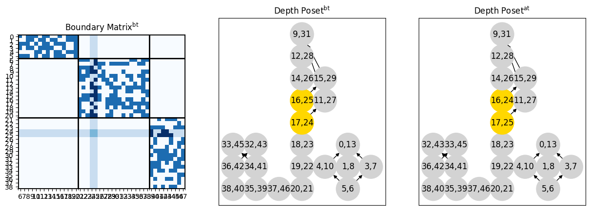

### Birth Death Pairs
|                          |                                                                                                                                                                                                                         |
|:-------------------------|:------------------------------------------------------------------------------------------------------------------------------------------------------------------------------------------------------------------------|
| Before the transposition | $\{(18, 23), (33, 45), (32, 43), (3, 7), (35, 39), (12, 28), (17, 24), (16, 25), (15, 29), (5, 6), (38, 40), (0, 13), (1, 8), (36, 42), (9, 31), (20, 21), (4, 10), (37, 46), (14, 26), (34, 41), (19, 22), (11, 27)\}$ |
| After the transposition  | $\{(18, 23), (33, 45), (32, 43), (3, 7), (35, 39), (12, 28), (15, 29), (5, 6), (38, 40), (0, 13), (1, 8), (36, 42), (9, 31), (16, 24), (20, 21), (4, 10), (37, 46), (14, 26), (17, 25), (34, 41), (19, 22), (11, 27)\}$ |

### Relations
|                          | Algorithm 1                                                                                                                                                                                                                                                                                                                                                                                                   | Algorithm 2                                                                                                                                                                                                                                                                                                                                                               |
|:-------------------------|:--------------------------------------------------------------------------------------------------------------------------------------------------------------------------------------------------------------------------------------------------------------------------------------------------------------------------------------------------------------------------------------------------------------|:--------------------------------------------------------------------------------------------------------------------------------------------------------------------------------------------------------------------------------------------------------------------------------------------------------------------------------------------------------------------------|
| Before the transposition | $\{(25, 29), (42, 45), (41, 43), (21, 28), (22, 23), (21, 25), (40, 44), (28, 30), (25, 28), (6, 8), (25, 31), (24, 29), (7, 13), (21, 24), (22, 25), (23, 24), (23, 30), (22, 28), (39, 47), (24, 25), (6, 7), (6, 13), (6, 10), (41, 44), (42, 43), (24, 31), (41, 47), (26, 28), (21, 23), (43, 47), (29, 30), (26, 31), (21, 29), (40, 42), (23, 29), (40, 45), (10, 13), (28, 31), (45, 47), (25, 26)\}$ | $\{(35, 30), (20, 11), (4, 0), (35, 33), (18, 17), (20, 17), (38, 32), (17, 12), (17, 15), (19, 15), (32, 30), (18, 16), (35, 32), (3, 0), (20, 16), (5, 0), (20, 19), (5, 3), (17, 11), (14, 12), (19, 11), (34, 30), (34, 33), (16, 12), (16, 15), (20, 9), (20, 18), (35, 34), (38, 33), (5, 2), (38, 36), (11, 9), (19, 16), (34, 32), (15, 9), (16, 14), (33, 30)\}$ |
| After the transposition  | $\{(25, 29), (42, 45), (41, 43), (21, 28), (22, 23), (21, 25), (40, 44), (28, 30), (6, 8), (24, 26), (7, 13), (25, 31), (21, 24), (22, 25), (23, 24), (23, 30), (22, 28), (39, 47), (6, 7), (6, 13), (25, 24), (24, 28), (6, 10), (41, 44), (42, 43), (41, 47), (26, 28), (21, 23), (43, 47), (29, 30), (26, 31), (21, 29), (40, 42), (23, 29), (40, 45), (10, 13), (28, 31), (45, 47)\}$                     | $\{(35, 30), (20, 11), (4, 0), (35, 33), (18, 17), (20, 17), (38, 32), (19, 15), (32, 30), (18, 16), (35, 32), (3, 0), (20, 16), (5, 0), (20, 19), (5, 3), (17, 11), (14, 12), (17, 14), (19, 11), (34, 30), (34, 33), (16, 12), (16, 15), (20, 9), (20, 18), (35, 34), (38, 33), (5, 2), (38, 36), (17, 16), (11, 9), (19, 16), (34, 32), (15, 9), (16, 14), (33, 30)\}$ |

### Successors and Predecessers
|                 | $\text{Set}^\text{bt}(16, 25)$                                                | $\text{Set}^\text{bt}(17, 24)$                                       | $\text{Set}^\text{at}(17, 25)$                                       | $\text{Set}^\text{at}(16, 24)$                                                 |
|:----------------|:------------------------------------------------------------------------------|:---------------------------------------------------------------------|:---------------------------------------------------------------------|:-------------------------------------------------------------------------------|
| $\text{Succ}_1$ | $\text{Succ}_1^\text{bt}(16, 25) = \{(12, 28), (15, 29), (14, 26), (9, 31)\}$ | $\text{Succ}_1^\text{bt}(17, 24) = \{(16, 25), (15, 29), (9, 31)\}$  | $\text{Succ}_1^\text{at}(17, 25) = \{(16, 24), (15, 29), (9, 31)\}$  | $\text{Succ}_1^\text{at}(16, 24) = \{(12, 28), (14, 26)\}$                     |
| $\text{Pred}_1$ | $\text{Pred}_1^\text{bt}(16, 25) = \{(17, 24), (19, 22), (20, 21)\}$          | $\text{Pred}_1^\text{bt}(17, 24) = \{(18, 23), (20, 21)\}$           | $\text{Pred}_1^\text{at}(17, 25) = \{(19, 22), (20, 21)\}$           | $\text{Pred}_1^\text{at}(16, 24) = \{(18, 23), (17, 25), (20, 21)\}$           |
| $\text{Succ}_2$ | $\text{Succ}_2^\text{bt}(16, 25) = \{(12, 28), (15, 29), (14, 26)\}$          | $\text{Succ}_2^\text{bt}(17, 24) = \{(12, 28), (15, 29), (11, 27)\}$ | $\text{Succ}_2^\text{at}(17, 25) = \{(16, 24), (14, 26), (11, 27)\}$ | $\text{Succ}_2^\text{at}(16, 24) = \{(12, 28), (15, 29), (14, 26)\}$           |
| $\text{Pred}_2$ | $\text{Pred}_2^\text{bt}(16, 25) = \{(18, 23), (19, 22), (20, 21)\}$          | $\text{Pred}_2^\text{bt}(17, 24) = \{(18, 23), (20, 21)\}$           | $\text{Pred}_2^\text{at}(17, 25) = \{(18, 23), (20, 21)\}$           | $\text{Pred}_2^\text{at}(16, 24) = \{(18, 23), (17, 25), (19, 22), (20, 21)\}$ |

### Temp Sets
|                                                               | Before the Transposition                                                                                 | After the Transposition                                                                                  |
|:--------------------------------------------------------------|:---------------------------------------------------------------------------------------------------------|:---------------------------------------------------------------------------------------------------------|
| $\mathcal{B} = \{(s, t)\in \text{BD}:\; f(s) > f(x)\}$        | $\{(18, 23), (33, 45), (32, 43), (35, 39), (36, 42), (34, 41), (19, 22), (38, 40), (37, 46), (20, 21)\}$ | $\{(18, 23), (33, 45), (32, 43), (35, 39), (36, 42), (34, 41), (19, 22), (38, 40), (37, 46), (20, 21)\}$ |
| $\mathcal{N} = \{(s, t)\in \text{BD}:\; f(x) > f(s) > f(a)\}$ | $\emptyset$                                                                                              | $\emptyset$                                                                                              |

### Equations
There are 1 equations are wrong.

| eq   | left (formula)                  | left (paramatrized)               | left (value)                                 | right (formula)                                                                                          | right (paramatrized)                                                                                           | right (value)                                | correct   |
|:-----|:--------------------------------|:----------------------------------|:---------------------------------------------|:---------------------------------------------------------------------------------------------------------|:---------------------------------------------------------------------------------------------------------------|:---------------------------------------------|:----------|
| Eq28 | $\text{Succ}_1^\text{at}(x, b)$ | $\text{Succ}_1^\text{at}(17, 25)$ | $\{(16, 24), (15, 29), (9, 31)\}$            | $\text{Succ}_1^\text{bt}(x, y) \oplus \{(a, y), (a, b)\}$                                                | $\text{Succ}_1^\text{bt}(17, 24) \oplus \{(16, 24), (16, 25)\}$                                                | $\{(16, 24), (15, 29), (9, 31)\}$            | ✔         |
| Eq29 | $\text{Succ}_1^\text{at}(a, y)$ | $\text{Succ}_1^\text{at}(16, 24)$ | $\{(12, 28), (14, 26)\}$                     | $\text{Succ}_1^\text{bt}(a, b)$                                                                          | $\text{Succ}_1^\text{bt}(16, 25)$                                                                              | $\{(12, 28), (15, 29), (14, 26), (9, 31)\}$  | ✘         |
| Eq30 | $\text{Pred}_1^\text{at}(x, b)$ | $\text{Pred}_1^\text{at}(17, 25)$ | $\{(19, 22), (20, 21)\}$                     | $[\text{Pred}_1^\text{bt}(a, b) \cap \mathcal{B}]$                                                       | $[\text{Pred}_1^\text{bt}(16, 25) \cap \mathcal{B}]$                                                           | $\{(19, 22), (20, 21)\}$                     | ✔         |
| Eq31 | $\text{Pred}_1^\text{at}(a, y)$ | $\text{Pred}_1^\text{at}(16, 24)$ | $\{(18, 23), (17, 25), (20, 21)\}$           | $\text{Pred}_1^\text{bt}(x, y) \oplus \{(x, b)\} \oplus[\text{Pred}_1^\text{bt}(a, b) \cap \mathcal{N}]$ | $\text{Pred}_1^\text{bt}(17, 24) \oplus \{(17, 25)\} \oplus[\text{Pred}_1^\text{bt}(16, 25) \cap \mathcal{N}]$ | $\{(18, 23), (17, 25), (20, 21)\}$           | ✔         |
| Eq32 | $\text{Succ}_2^\text{at}(x, b)$ | $\text{Succ}_2^\text{at}(17, 25)$ | $\{(16, 24), (14, 26), (11, 27)\}$           | $\text{Succ}_2^\text{bt}(x, y) \oplus \{(a, y)\} \oplus \text{Succ}_2^\text{bt}(a, b)$                   | $\text{Succ}_2^\text{bt}(17, 24) \oplus \{(16, 24)\} \oplus \text{Succ}_2^\text{bt}(16, 25)$                   | $\{(16, 24), (14, 26), (11, 27)\}$           | ✔         |
| Eq33 | $\text{Succ}_2^\text{at}(a, y)$ | $\text{Succ}_2^\text{at}(16, 24)$ | $\{(12, 28), (15, 29), (14, 26)\}$           | $\text{Succ}_2^\text{bt}(a, b)$                                                                          | $\text{Succ}_2^\text{bt}(16, 25)$                                                                              | $\{(12, 28), (15, 29), (14, 26)\}$           | ✔         |
| Eq34 | $\text{Pred}_2^\text{at}(x, b)$ | $\text{Pred}_2^\text{at}(17, 25)$ | $\{(18, 23), (20, 21)\}$                     | $\text{Pred}_2^\text{bt}(x, y)$                                                                          | $\text{Pred}_2^\text{bt}(17, 24)$                                                                              | $\{(18, 23), (20, 21)\}$                     | ✔         |
| Eq35 | $\text{Pred}_2^\text{at}(a, y)$ | $\text{Pred}_2^\text{at}(16, 24)$ | $\{(18, 23), (17, 25), (19, 22), (20, 21)\}$ | $\text{Pred}_2^\text{bt}(a, b) \oplus \{(x, b)\}$                                                        | $\text{Pred}_2^\text{bt}(16, 25) \oplus \{(17, 25)\}$                                                          | $\{(19, 22), (18, 23), (17, 25), (20, 21)\}$ | ✔         |

## Transposition <27, 28> in complex 9
Here is a __death-death__ __no switch__ transposition <27, 28>.

$$
a = 12, \; b = 28, \; x = 11, \; y = 27
$$

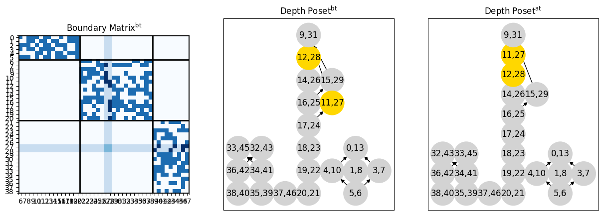

### Birth Death Pairs
|                          |                                                                                                                                                                                                                         |
|:-------------------------|:------------------------------------------------------------------------------------------------------------------------------------------------------------------------------------------------------------------------|
| Before the transposition | $\{(18, 23), (33, 45), (32, 43), (3, 7), (35, 39), (12, 28), (17, 24), (16, 25), (15, 29), (5, 6), (38, 40), (0, 13), (1, 8), (36, 42), (9, 31), (20, 21), (4, 10), (37, 46), (14, 26), (34, 41), (19, 22), (11, 27)\}$ |
| After the transposition  | $\{(18, 23), (33, 45), (32, 43), (3, 7), (35, 39), (12, 28), (17, 24), (16, 25), (15, 29), (5, 6), (38, 40), (0, 13), (1, 8), (36, 42), (9, 31), (20, 21), (4, 10), (37, 46), (14, 26), (34, 41), (19, 22), (11, 27)\}$ |

### Relations
|                          | Algorithm 1                                                                                                                                                                                                                                                                                                                                                                                                   | Algorithm 2                                                                                                                                                                                                                                                                                                                                                                                  |
|:-------------------------|:--------------------------------------------------------------------------------------------------------------------------------------------------------------------------------------------------------------------------------------------------------------------------------------------------------------------------------------------------------------------------------------------------------------|:---------------------------------------------------------------------------------------------------------------------------------------------------------------------------------------------------------------------------------------------------------------------------------------------------------------------------------------------------------------------------------------------|
| Before the transposition | $\{(25, 29), (42, 45), (41, 43), (21, 28), (22, 23), (21, 25), (40, 44), (28, 30), (25, 28), (6, 8), (25, 31), (24, 29), (7, 13), (21, 24), (22, 25), (23, 24), (23, 30), (22, 28), (39, 47), (24, 25), (6, 7), (6, 13), (6, 10), (41, 44), (42, 43), (24, 31), (41, 47), (26, 28), (21, 23), (43, 47), (29, 30), (26, 31), (21, 29), (40, 42), (23, 29), (40, 45), (10, 13), (28, 31), (45, 47), (25, 26)\}$ | $\{(35, 30), (20, 11), (4, 0), (35, 33), (18, 17), (20, 17), (38, 32), (17, 12), (17, 15), (19, 15), (32, 30), (18, 16), (35, 32), (3, 0), (20, 16), (5, 0), (20, 19), (5, 3), (17, 11), (14, 12), (19, 11), (34, 30), (34, 33), (16, 12), (16, 15), (20, 9), (20, 18), (35, 34), (38, 33), (5, 2), (38, 36), (11, 9), (19, 16), (34, 32), (15, 9), (16, 14), (33, 30)\}$                    |
| After the transposition  | $\{(25, 29), (42, 45), (41, 43), (21, 28), (22, 23), (21, 25), (40, 44), (28, 30), (25, 28), (6, 8), (25, 31), (24, 29), (7, 13), (21, 24), (22, 25), (23, 24), (23, 30), (22, 28), (39, 47), (24, 25), (6, 7), (6, 13), (6, 10), (41, 44), (42, 43), (24, 31), (26, 28), (41, 47), (21, 23), (43, 47), (29, 30), (26, 31), (21, 29), (40, 42), (23, 29), (40, 45), (10, 13), (28, 31), (45, 47), (25, 26)\}$ | $\{(35, 30), (20, 11), (4, 0), (35, 33), (18, 17), (20, 17), (38, 32), (17, 12), (17, 15), (19, 15), (32, 30), (18, 16), (35, 32), (3, 0), (20, 16), (12, 9), (5, 0), (20, 19), (5, 3), (17, 11), (14, 12), (19, 11), (34, 30), (34, 33), (16, 12), (16, 15), (20, 9), (12, 11), (20, 18), (35, 34), (38, 33), (5, 2), (38, 36), (11, 9), (19, 16), (34, 32), (15, 9), (16, 14), (33, 30)\}$ |

### Successors and Predecessers
No such node in the Depth Poset

### Temp Sets
|                                                               | Before the Transposition                                                                                                                                   | After the Transposition                                                                                                                                    |
|:--------------------------------------------------------------|:-----------------------------------------------------------------------------------------------------------------------------------------------------------|:-----------------------------------------------------------------------------------------------------------------------------------------------------------|
| $\mathcal{B} = \{(s, t)\in \text{BD}:\; f(s) > f(x)\}$        | $\{(18, 23), (33, 45), (32, 43), (35, 39), (36, 42), (14, 26), (16, 25), (12, 28), (15, 29), (34, 41), (19, 22), (38, 40), (17, 24), (37, 46), (20, 21)\}$ | $\{(18, 23), (33, 45), (32, 43), (35, 39), (36, 42), (14, 26), (16, 25), (12, 28), (15, 29), (34, 41), (19, 22), (38, 40), (17, 24), (37, 46), (20, 21)\}$ |
| $\mathcal{N} = \{(s, t)\in \text{BD}:\; f(x) > f(s) > f(a)\}$ | $\emptyset$                                                                                                                                                | $\emptyset$                                                                                                                                                |

### Equations
There are 2 equations are wrong.

| eq   | left (formula)                  | left (paramatrized)               | left (value)                       | right (formula)                                                                        | right (paramatrized)                                                                         | right (value)                                | correct   |
|:-----|:--------------------------------|:----------------------------------|:-----------------------------------|:---------------------------------------------------------------------------------------|:---------------------------------------------------------------------------------------------|:---------------------------------------------|:----------|
| Eq36 | $\text{Succ}_2^\text{at}(x, y)$ | $\text{Succ}_2^\text{at}(11, 27)$ | $\{(9, 31)\}$                      | $\text{Succ}_2^\text{bt}(x, y) \oplus \{(a, b)\} \oplus \text{Succ}_2^\text{bt}(a, b)$ | $\text{Succ}_2^\text{bt}(11, 27) \oplus \{(12, 28)\} \oplus \text{Succ}_2^\text{bt}(12, 28)$ | $\{(12, 28), (9, 31)\}$                      | ✘         |
| Eq37 | $\text{Pred}_2^\text{at}(a, b)$ | $\text{Pred}_2^\text{at}(12, 28)$ | $\{(16, 25), (17, 24), (14, 26)\}$ | $\text{Pred}_2^\text{bt}(a, b) \oplus \{(x, y)\}$                                      | $\text{Pred}_2^\text{bt}(12, 28) \oplus \{(11, 27)\}$                                        | $\{(16, 25), (17, 24), (14, 26), (11, 27)\}$ | ✘         |

## Transposition <31, 32> in complex 9
Here is a __birth-death__ __switch forward__ transposition <31, 32>.

$$
a = 9, \; b = 31, \; x = 32, \; y = 43
$$

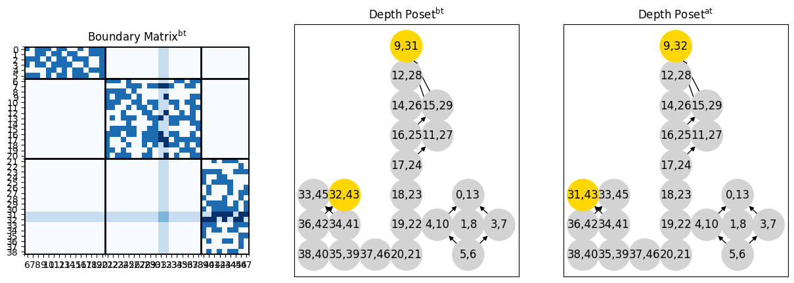

### Birth Death Pairs
|                          |                                                                                                                                                                                                                         |
|:-------------------------|:------------------------------------------------------------------------------------------------------------------------------------------------------------------------------------------------------------------------|
| Before the transposition | $\{(18, 23), (33, 45), (32, 43), (3, 7), (35, 39), (12, 28), (17, 24), (16, 25), (15, 29), (5, 6), (38, 40), (0, 13), (1, 8), (36, 42), (9, 31), (20, 21), (4, 10), (37, 46), (14, 26), (34, 41), (19, 22), (11, 27)\}$ |
| After the transposition  | $\{(18, 23), (33, 45), (3, 7), (35, 39), (12, 28), (17, 24), (9, 32), (16, 25), (15, 29), (5, 6), (38, 40), (31, 43), (0, 13), (1, 8), (36, 42), (20, 21), (4, 10), (37, 46), (14, 26), (34, 41), (19, 22), (11, 27)\}$ |

### Relations
|                          | Algorithm 1                                                                                                                                                                                                                                                                                                                                                                                                                       | Algorithm 2                                                                                                                                                                                                                                                                                                                                                               |
|:-------------------------|:----------------------------------------------------------------------------------------------------------------------------------------------------------------------------------------------------------------------------------------------------------------------------------------------------------------------------------------------------------------------------------------------------------------------------------|:--------------------------------------------------------------------------------------------------------------------------------------------------------------------------------------------------------------------------------------------------------------------------------------------------------------------------------------------------------------------------|
| Before the transposition | $\{(25, 29), (42, 45), (41, 43), (21, 28), (22, 23), (21, 25), (40, 44), (28, 30), (25, 28), (6, 8), (25, 31), (24, 29), (7, 13), (21, 24), (22, 25), (23, 24), (23, 30), (22, 28), (39, 47), (24, 25), (6, 7), (6, 13), (6, 10), (41, 44), (42, 43), (24, 31), (41, 47), (26, 28), (21, 23), (43, 47), (29, 30), (26, 31), (21, 29), (40, 42), (23, 29), (40, 45), (10, 13), (28, 31), (45, 47), (25, 26)\}$                     | $\{(35, 30), (20, 11), (4, 0), (35, 33), (18, 17), (20, 17), (38, 32), (17, 12), (17, 15), (19, 15), (32, 30), (18, 16), (35, 32), (3, 0), (20, 16), (5, 0), (20, 19), (5, 3), (17, 11), (14, 12), (19, 11), (34, 30), (34, 33), (16, 12), (16, 15), (20, 9), (20, 18), (35, 34), (38, 33), (5, 2), (38, 36), (11, 9), (19, 16), (34, 32), (15, 9), (16, 14), (33, 30)\}$ |
| After the transposition  | $\{(25, 29), (42, 45), (41, 43), (21, 28), (22, 23), (21, 25), (29, 32), (40, 44), (22, 32), (28, 30), (25, 28), (6, 8), (7, 13), (24, 29), (26, 32), (21, 24), (22, 25), (23, 24), (23, 30), (22, 28), (39, 47), (28, 32), (24, 25), (6, 7), (6, 13), (6, 10), (41, 44), (42, 43), (41, 47), (26, 28), (21, 23), (43, 47), (29, 30), (21, 29), (40, 42), (21, 32), (23, 29), (40, 45), (10, 13), (27, 32), (45, 47), (25, 26)\}$ | $\{(35, 30), (20, 11), (4, 0), (35, 33), (18, 17), (20, 17), (17, 12), (17, 15), (37, 30), (34, 31), (19, 15), (18, 16), (3, 0), (20, 16), (5, 0), (20, 19), (5, 3), (17, 11), (14, 12), (19, 11), (34, 30), (34, 33), (16, 12), (16, 15), (20, 9), (20, 18), (35, 34), (38, 33), (5, 2), (38, 36), (31, 30), (11, 9), (19, 16), (15, 9), (16, 14), (33, 30)\}$           |

### Successors and Predecessers
|                 | $\text{Set}^\text{bt}(9, 31)$                                                 | $\text{Set}^\text{bt}(32, 43)$                                       | $\text{Set}^\text{at}(9, 32)$                                                                     | $\text{Set}^\text{at}(31, 43)$                             |
|:----------------|:------------------------------------------------------------------------------|:---------------------------------------------------------------------|:--------------------------------------------------------------------------------------------------|:-----------------------------------------------------------|
| $\text{Succ}_1$ | $\text{Succ}_1^\text{bt}(9, 31) = \emptyset$                                  | $\text{Succ}_1^\text{bt}(32, 43) = \emptyset$                        | $\text{Succ}_1^\text{at}(9, 32) = \emptyset$                                                      | $\text{Succ}_1^\text{at}(31, 43) = \emptyset$              |
| $\text{Pred}_1$ | $\text{Pred}_1^\text{bt}(9, 31) = \{(16, 25), (12, 28), (17, 24), (14, 26)\}$ | $\text{Pred}_1^\text{bt}(32, 43) = \{(36, 42), (34, 41)\}$           | $\text{Pred}_1^\text{at}(9, 32) = \{(14, 26), (12, 28), (15, 29), (19, 22), (11, 27), (20, 21)\}$ | $\text{Pred}_1^\text{at}(31, 43) = \{(36, 42), (34, 41)\}$ |
| $\text{Succ}_2$ | $\text{Succ}_2^\text{bt}(9, 31) = \emptyset$                                  | $\text{Succ}_2^\text{bt}(32, 43) = \emptyset$                        | $\text{Succ}_2^\text{at}(9, 32) = \emptyset$                                                      | $\text{Succ}_2^\text{at}(31, 43) = \emptyset$              |
| $\text{Pred}_2$ | $\text{Pred}_2^\text{bt}(9, 31) = \{(15, 29), (11, 27), (20, 21)\}$           | $\text{Pred}_2^\text{bt}(32, 43) = \{(38, 40), (35, 39), (34, 41)\}$ | $\text{Pred}_2^\text{at}(9, 32) = \{(15, 29), (11, 27), (20, 21)\}$                               | $\text{Pred}_2^\text{at}(31, 43) = \{(34, 41)\}$           |

### Temp Sets
|                                                              | Before the Transposition                                                                       | After the Transposition                                                                        |
|:-------------------------------------------------------------|:-----------------------------------------------------------------------------------------------|:-----------------------------------------------------------------------------------------------|
| $A_1 = \{(s, t)\in \text{BD}:\; f(a) < f(s) < f(t) < f(x)\}$ | $\{(18, 23), (14, 26), (16, 25), (12, 28), (15, 29), (19, 22), (17, 24), (11, 27), (20, 21)\}$ | $\{(18, 23), (14, 26), (16, 25), (12, 28), (15, 29), (19, 22), (17, 24), (11, 27), (20, 21)\}$ |
| $B_1 = \{(s, t)\in \text{BD}:\; U_1[t, x] = 1\}$             | $\emptyset$                                                                                    | $\{(14, 26), (12, 28), (15, 29), (19, 22), (11, 27), (20, 21)\}$                               |
| $A_2 = \{(s, t)\in \text{BD}:\; f(b) < f(s) < f(t) < f(y)\}$ | $\{(38, 40), (35, 39), (36, 42), (34, 41)\}$                                                   | $\{(38, 40), (35, 39), (36, 42), (34, 41)\}$                                                   |
| $B_2 = \{(s, t)\in \text{BD}:\; U_2[b, s] = 1\}$             | $\emptyset$                                                                                    | $\{(34, 41)\}$                                                                                 |

### Equations
There are 4 equations are wrong.

| eq    | left (formula)                  | left (paramatrized)               | left (value)                                                     | right (formula)                                      | right (paramatrized)                                  | right (value)                                                    | correct   |
|:------|:--------------------------------|:----------------------------------|:-----------------------------------------------------------------|:-----------------------------------------------------|:------------------------------------------------------|:-----------------------------------------------------------------|:----------|
| Eq48  | $\text{Succ}_1^\text{at}(a, x)$ | $\text{Succ}_1^\text{at}(9, 32)$  | $\emptyset$                                                      | $\text{Succ}_1^\text{bt}(a, b)$                      | $\text{Succ}_1^\text{bt}(9, 31)$                      | $\emptyset$                                                      | ✔         |
| Eq49  | $\text{Succ}_1^\text{at}(b, y)$ | $\text{Succ}_1^\text{at}(31, 43)$ | $\emptyset$                                                      | $\text{Succ}_1^\text{bt}(x, y)$                      | $\text{Succ}_1^\text{bt}(32, 43)$                     | $\emptyset$                                                      | ✔         |
| Eq50  | $\text{Pred}_1^\text{at}(a, x)$ | $\text{Pred}_1^\text{at}(9, 32)$  | $\{(14, 26), (12, 28), (15, 29), (19, 22), (11, 27), (20, 21)\}$ | $\{(s, t)\in \text{BD}:\; U_1^\text{bt}[t, x] = 1\}$ | $\{(s, t)\in \text{BD}:\; U_1^\text{bt}[t, 32] = 1\}$ | $\emptyset$                                                      | ✘         |
| Eq50a | $\text{Pred}_1^\text{at}(a, x)$ | $\text{Pred}_1^\text{at}(9, 32)$  | $\{(14, 26), (12, 28), (15, 29), (19, 22), (11, 27), (20, 21)\}$ | $A_1^\text{bt} \cap B_1^\text{bt}$                   | $A_1^\text{bt} \cap B_1^\text{bt}$                    | $\emptyset$                                                      | ✘         |
| Eq50b | $\text{Pred}_1^\text{at}(a, x)$ | $\text{Pred}_1^\text{at}(9, 32)$  | $\{(14, 26), (12, 28), (15, 29), (19, 22), (11, 27), (20, 21)\}$ | $A_1^\text{bt} \cap B_1^\text{at}$                   | $A_1^\text{bt} \cap B_1^\text{at}$                    | $\{(14, 26), (12, 28), (15, 29), (19, 22), (11, 27), (20, 21)\}$ | ✔         |
| Eq51  | $\text{Pred}_1^\text{at}(b, y)$ | $\text{Pred}_1^\text{at}(31, 43)$ | $\{(36, 42), (34, 41)\}$                                         | $\text{Pred}_1^\text{bt}(x, y)$                      | $\text{Pred}_1^\text{bt}(32, 43)$                     | $\{(36, 42), (34, 41)\}$                                         | ✔         |
| Eq52  | $\text{Succ}_2^\text{at}(a, x)$ | $\text{Succ}_2^\text{at}(9, 32)$  | $\emptyset$                                                      | $\text{Succ}_2^\text{bt}(a, b)$                      | $\text{Succ}_2^\text{bt}(9, 31)$                      | $\emptyset$                                                      | ✔         |
| Eq53  | $\text{Succ}_2^\text{at}(b, y)$ | $\text{Succ}_2^\text{at}(31, 43)$ | $\emptyset$                                                      | $\text{Succ}_2^\text{bt}(x, y)$                      | $\text{Succ}_2^\text{bt}(32, 43)$                     | $\emptyset$                                                      | ✔         |
| Eq54  | $\text{Pred}_2^\text{at}(a, x)$ | $\text{Pred}_2^\text{at}(9, 32)$  | $\{(15, 29), (11, 27), (20, 21)\}$                               | $\text{Pred}_2^\text{bt}(a, b)$                      | $\text{Pred}_2^\text{bt}(9, 31)$                      | $\{(15, 29), (11, 27), (20, 21)\}$                               | ✔         |
| Eq55  | $\text{Pred}_2^\text{at}(b, y)$ | $\text{Pred}_2^\text{at}(31, 43)$ | $\{(34, 41)\}$                                                   | $\{(s, t)\in \text{BD}:\; U_2^\text{bt}[b, s] = 1\}$ | $\{(s, t)\in \text{BD}:\; U_2^\text{bt}[31, s] = 1\}$ | $\emptyset$                                                      | ✘         |
| Eq55a | $\text{Pred}_2^\text{at}(b, y)$ | $\text{Pred}_2^\text{at}(31, 43)$ | $\{(34, 41)\}$                                                   | $A_2^\text{bt} \cap B_2^\text{bt}$                   | $A_2^\text{bt} \cap B_2^\text{bt}$                    | $\emptyset$                                                      | ✘         |
| Eq55b | $\text{Pred}_2^\text{at}(b, y)$ | $\text{Pred}_2^\text{at}(31, 43)$ | $\{(34, 41)\}$                                                   | $A_2^\text{bt} \cap B_2^\text{at}$                   | $A_2^\text{bt} \cap B_2^\text{at}$                    | $\{(34, 41)\}$                                                   | ✔         |

## Transposition <32, 33> in complex 9
Here is a __birth-birth__ __no switch__ transposition <32, 33>.

$$
a = 32, \; b = 43, \; x = 33, \; y = 45
$$

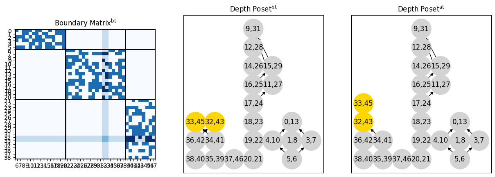

### Birth Death Pairs
|                          |                                                                                                                                                                                                                         |
|:-------------------------|:------------------------------------------------------------------------------------------------------------------------------------------------------------------------------------------------------------------------|
| Before the transposition | $\{(18, 23), (33, 45), (32, 43), (3, 7), (35, 39), (12, 28), (17, 24), (16, 25), (15, 29), (5, 6), (38, 40), (0, 13), (1, 8), (36, 42), (9, 31), (20, 21), (4, 10), (37, 46), (14, 26), (34, 41), (19, 22), (11, 27)\}$ |
| After the transposition  | $\{(18, 23), (33, 45), (32, 43), (3, 7), (35, 39), (12, 28), (17, 24), (16, 25), (15, 29), (5, 6), (38, 40), (0, 13), (1, 8), (36, 42), (9, 31), (20, 21), (4, 10), (37, 46), (14, 26), (34, 41), (19, 22), (11, 27)\}$ |

### Relations
|                          | Algorithm 1                                                                                                                                                                                                                                                                                                                                                                                                   | Algorithm 2                                                                                                                                                                                                                                                                                                                                                               |
|:-------------------------|:--------------------------------------------------------------------------------------------------------------------------------------------------------------------------------------------------------------------------------------------------------------------------------------------------------------------------------------------------------------------------------------------------------------|:--------------------------------------------------------------------------------------------------------------------------------------------------------------------------------------------------------------------------------------------------------------------------------------------------------------------------------------------------------------------------|
| Before the transposition | $\{(25, 29), (42, 45), (41, 43), (21, 28), (22, 23), (21, 25), (40, 44), (28, 30), (25, 28), (6, 8), (25, 31), (24, 29), (7, 13), (21, 24), (22, 25), (23, 24), (23, 30), (22, 28), (39, 47), (24, 25), (6, 7), (6, 13), (6, 10), (41, 44), (42, 43), (24, 31), (41, 47), (26, 28), (21, 23), (43, 47), (29, 30), (26, 31), (21, 29), (40, 42), (23, 29), (40, 45), (10, 13), (28, 31), (45, 47), (25, 26)\}$ | $\{(35, 30), (20, 11), (4, 0), (35, 33), (18, 17), (20, 17), (38, 32), (17, 12), (17, 15), (19, 15), (32, 30), (18, 16), (35, 32), (3, 0), (20, 16), (5, 0), (20, 19), (5, 3), (17, 11), (14, 12), (19, 11), (34, 30), (34, 33), (16, 12), (16, 15), (20, 9), (20, 18), (35, 34), (38, 33), (5, 2), (38, 36), (11, 9), (19, 16), (34, 32), (15, 9), (16, 14), (33, 30)\}$ |
| After the transposition  | $\{(25, 29), (42, 45), (41, 43), (21, 28), (22, 23), (21, 25), (40, 44), (28, 30), (25, 28), (6, 8), (25, 31), (24, 29), (7, 13), (43, 45), (21, 24), (22, 25), (23, 24), (23, 30), (22, 28), (39, 47), (24, 25), (6, 7), (6, 13), (6, 10), (41, 44), (42, 43), (24, 31), (41, 47), (26, 28), (21, 23), (29, 30), (26, 31), (21, 29), (40, 42), (23, 29), (40, 45), (10, 13), (28, 31), (45, 47), (25, 26)\}$ | $\{(35, 30), (20, 11), (4, 0), (18, 17), (35, 33), (20, 17), (38, 32), (17, 12), (17, 15), (19, 15), (32, 30), (18, 16), (35, 32), (3, 0), (20, 16), (5, 0), (20, 19), (5, 3), (17, 11), (14, 12), (19, 11), (34, 30), (34, 33), (16, 12), (16, 15), (20, 9), (20, 18), (35, 34), (38, 33), (5, 2), (38, 36), (11, 9), (19, 16), (34, 32), (15, 9), (16, 14), (33, 30)\}$ |

### Successors and Predecessers
No such node in the Depth Poset

### Temp Sets
|                                                               | Before the Transposition                                                                                                                                                                            | After the Transposition                                                                                                                                                                             |
|:--------------------------------------------------------------|:----------------------------------------------------------------------------------------------------------------------------------------------------------------------------------------------------|:----------------------------------------------------------------------------------------------------------------------------------------------------------------------------------------------------|
| $\mathcal{L} = \{(s, t)\in \text{BD}:\; f(t) < f(y)\}$        | $\{(18, 23), (32, 43), (3, 7), (35, 39), (12, 28), (17, 24), (16, 25), (15, 29), (5, 6), (38, 40), (0, 13), (1, 8), (36, 42), (9, 31), (20, 21), (4, 10), (14, 26), (34, 41), (19, 22), (11, 27)\}$ | $\{(18, 23), (32, 43), (3, 7), (35, 39), (12, 28), (17, 24), (16, 25), (15, 29), (5, 6), (38, 40), (0, 13), (1, 8), (36, 42), (9, 31), (20, 21), (4, 10), (14, 26), (34, 41), (19, 22), (11, 27)\}$ |
| $\mathcal{M} = \{(s, t)\in \text{BD}:\; f(y) < f(t) < f(b)\}$ | $\emptyset$                                                                                                                                                                                         | $\emptyset$                                                                                                                                                                                         |

### Equations
There are 2 equations are wrong.

| eq   | left (formula)                  | left (paramatrized)               | left (value)             | right (formula)                                                                        | right (paramatrized)                                                                         | right (value)                      | correct   |
|:-----|:--------------------------------|:----------------------------------|:-------------------------|:---------------------------------------------------------------------------------------|:---------------------------------------------------------------------------------------------|:-----------------------------------|:----------|
| Eq16 | $\text{Succ}_1^\text{at}(x, y)$ | $\text{Succ}_1^\text{at}(33, 45)$ | $\emptyset$              | $\text{Succ}_1^\text{bt}(x, y) \oplus \{(a, b)\} \oplus \text{Succ}_1^\text{bt}(a, b)$ | $\text{Succ}_1^\text{bt}(33, 45) \oplus \{(32, 43)\} \oplus \text{Succ}_1^\text{bt}(32, 43)$ | $\{(32, 43)\}$                     | ✘         |
| Eq17 | $\text{Pred}_1^\text{at}(a, b)$ | $\text{Pred}_1^\text{at}(32, 43)$ | $\{(36, 42), (34, 41)\}$ | $\text{Pred}_1^\text{bt}(a, b) \oplus \{(x, y)\}$                                      | $\text{Pred}_1^\text{bt}(32, 43) \oplus \{(33, 45)\}$                                        | $\{(33, 45), (36, 42), (34, 41)\}$ | ✘         |

## Transposition <34, 35> in complex 9
Here is a __birth-birth__ __switch forward__ transposition <34, 35>.

$$
a = 34, \; b = 41, \; x = 35, \; y = 39
$$

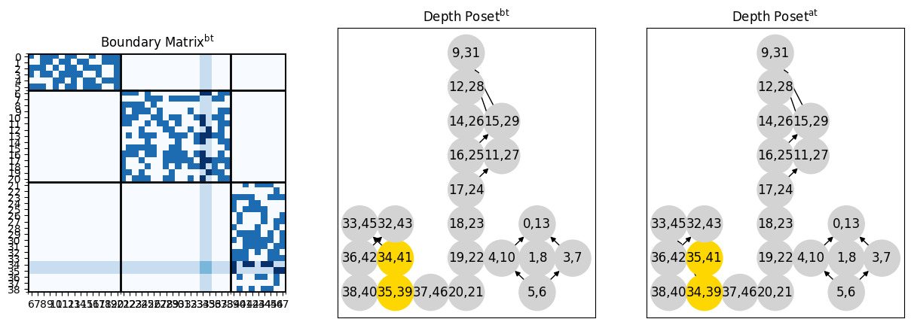

### Birth Death Pairs
|                          |                                                                                                                                                                                                                         |
|:-------------------------|:------------------------------------------------------------------------------------------------------------------------------------------------------------------------------------------------------------------------|
| Before the transposition | $\{(18, 23), (33, 45), (32, 43), (3, 7), (35, 39), (12, 28), (17, 24), (16, 25), (15, 29), (5, 6), (38, 40), (0, 13), (1, 8), (36, 42), (9, 31), (20, 21), (4, 10), (37, 46), (14, 26), (34, 41), (19, 22), (11, 27)\}$ |
| After the transposition  | $\{(18, 23), (33, 45), (32, 43), (3, 7), (12, 28), (17, 24), (16, 25), (15, 29), (5, 6), (35, 41), (38, 40), (0, 13), (34, 39), (1, 8), (36, 42), (9, 31), (20, 21), (4, 10), (37, 46), (14, 26), (19, 22), (11, 27)\}$ |

### Relations
|                          | Algorithm 1                                                                                                                                                                                                                                                                                                                                                                                                                       | Algorithm 2                                                                                                                                                                                                                                                                                                                                                               |
|:-------------------------|:----------------------------------------------------------------------------------------------------------------------------------------------------------------------------------------------------------------------------------------------------------------------------------------------------------------------------------------------------------------------------------------------------------------------------------|:--------------------------------------------------------------------------------------------------------------------------------------------------------------------------------------------------------------------------------------------------------------------------------------------------------------------------------------------------------------------------|
| Before the transposition | $\{(25, 29), (42, 45), (41, 43), (21, 28), (22, 23), (21, 25), (40, 44), (28, 30), (25, 28), (6, 8), (25, 31), (24, 29), (7, 13), (21, 24), (22, 25), (23, 24), (23, 30), (22, 28), (39, 47), (24, 25), (6, 7), (6, 13), (6, 10), (41, 44), (42, 43), (24, 31), (41, 47), (26, 28), (21, 23), (43, 47), (29, 30), (26, 31), (21, 29), (40, 42), (23, 29), (40, 45), (10, 13), (28, 31), (45, 47), (25, 26)\}$                     | $\{(35, 30), (20, 11), (4, 0), (35, 33), (18, 17), (20, 17), (38, 32), (17, 12), (17, 15), (19, 15), (32, 30), (18, 16), (35, 32), (3, 0), (20, 16), (5, 0), (20, 19), (5, 3), (17, 11), (14, 12), (19, 11), (34, 30), (34, 33), (16, 12), (16, 15), (20, 9), (20, 18), (35, 34), (38, 33), (5, 2), (38, 36), (11, 9), (19, 16), (34, 32), (15, 9), (16, 14), (33, 30)\}$ |
| After the transposition  | $\{(25, 29), (42, 45), (41, 43), (21, 28), (22, 23), (21, 25), (40, 44), (28, 30), (25, 28), (6, 8), (25, 31), (24, 29), (7, 13), (21, 24), (22, 25), (39, 41), (23, 24), (23, 30), (22, 28), (39, 44), (24, 25), (6, 7), (6, 13), (6, 10), (41, 44), (42, 43), (24, 31), (41, 47), (26, 28), (21, 23), (43, 47), (29, 30), (26, 31), (21, 29), (40, 42), (23, 29), (40, 45), (39, 43), (10, 13), (28, 31), (45, 47), (25, 26)\}$ | $\{(20, 11), (18, 17), (4, 0), (20, 17), (38, 32), (17, 12), (17, 15), (19, 15), (32, 30), (18, 16), (3, 0), (20, 16), (5, 0), (20, 19), (5, 3), (17, 11), (14, 12), (34, 30), (19, 11), (34, 33), (16, 12), (16, 15), (20, 9), (20, 18), (38, 33), (5, 2), (38, 36), (11, 9), (34, 35), (19, 16), (34, 32), (15, 9), (16, 14), (33, 30)\}$                               |

### Successors and Predecessers
|                 | $\text{Set}^\text{bt}(34, 41)$                             | $\text{Set}^\text{bt}(35, 39)$                                       | $\text{Set}^\text{at}(34, 39)$                                       | $\text{Set}^\text{at}(35, 41)$                   |
|:----------------|:-----------------------------------------------------------|:---------------------------------------------------------------------|:---------------------------------------------------------------------|:-------------------------------------------------|
| $\text{Succ}_1$ | $\text{Succ}_1^\text{bt}(34, 41) = \{(32, 43)\}$           | $\text{Succ}_1^\text{bt}(35, 39) = \emptyset$                        | $\text{Succ}_1^\text{at}(34, 39) = \{(32, 43), (35, 41)\}$           | $\text{Succ}_1^\text{at}(35, 41) = \{(32, 43)\}$ |
| $\text{Pred}_1$ | $\text{Pred}_1^\text{bt}(34, 41) = \emptyset$              | $\text{Pred}_1^\text{bt}(35, 39) = \emptyset$                        | $\text{Pred}_1^\text{at}(34, 39) = \emptyset$                        | $\text{Pred}_1^\text{at}(35, 41) = \{(34, 39)\}$ |
| $\text{Succ}_2$ | $\text{Succ}_2^\text{bt}(34, 41) = \{(33, 45), (32, 43)\}$ | $\text{Succ}_2^\text{bt}(35, 39) = \{(33, 45), (32, 43), (34, 41)\}$ | $\text{Succ}_2^\text{at}(34, 39) = \{(33, 45), (32, 43), (35, 41)\}$ | $\text{Succ}_2^\text{at}(35, 41) = \emptyset$    |
| $\text{Pred}_2$ | $\text{Pred}_2^\text{bt}(34, 41) = \{(35, 39)\}$           | $\text{Pred}_2^\text{bt}(35, 39) = \emptyset$                        | $\text{Pred}_2^\text{at}(34, 39) = \emptyset$                        | $\text{Pred}_2^\text{at}(35, 41) = \{(34, 39)\}$ |

### Temp Sets
|                                                               | Before the Transposition                                                                                                                          | After the Transposition                                                                                                                           |
|:--------------------------------------------------------------|:--------------------------------------------------------------------------------------------------------------------------------------------------|:--------------------------------------------------------------------------------------------------------------------------------------------------|
| $\mathcal{L} = \{(s, t)\in \text{BD}:\; f(t) < f(y)\}$        | $\{(4, 10), (18, 23), (0, 13), (3, 7), (1, 8), (14, 26), (9, 31), (16, 25), (12, 28), (15, 29), (19, 22), (5, 6), (17, 24), (11, 27), (20, 21)\}$ | $\{(4, 10), (18, 23), (0, 13), (3, 7), (1, 8), (14, 26), (9, 31), (16, 25), (12, 28), (15, 29), (19, 22), (5, 6), (17, 24), (11, 27), (20, 21)\}$ |
| $\mathcal{M} = \{(s, t)\in \text{BD}:\; f(y) < f(t) < f(b)\}$ | $\{(38, 40)\}$                                                                                                                                    | $\{(38, 40)\}$                                                                                                                                    |

### Equations
There are 1 equations are wrong.

| eq   | left (formula)                  | left (paramatrized)               | left (value)                       | right (formula)                                                                                           | right (paramatrized)                                                                                            | right (value)                      | correct   |
|:-----|:--------------------------------|:----------------------------------|:-----------------------------------|:----------------------------------------------------------------------------------------------------------|:----------------------------------------------------------------------------------------------------------------|:-----------------------------------|:----------|
| Eq08 | $\text{Succ}_1^\text{at}(a, y)$ | $\text{Succ}_1^\text{at}(34, 39)$ | $\{(32, 43), (35, 41)\}$           | $\text{Succ}_1^\text{bt}(x, y) \oplus \{(x, b)\} \oplus \text{Succ}_1^\text{bt}(a, b)$                    | $\text{Succ}_1^\text{bt}(35, 39) \oplus \{(35, 41)\} \oplus \text{Succ}_1^\text{bt}(34, 41)$                    | $\{(32, 43), (35, 41)\}$           | ✔         |
| Eq09 | $\text{Succ}_1^\text{at}(x, b)$ | $\text{Succ}_1^\text{at}(35, 41)$ | $\{(32, 43)\}$                     | $\text{Succ}_1^\text{bt}(a, b)$                                                                           | $\text{Succ}_1^\text{bt}(34, 41)$                                                                               | $\{(32, 43)\}$                     | ✔         |
| Eq10 | $\text{Pred}_1^\text{at}(a, y)$ | $\text{Pred}_1^\text{at}(34, 39)$ | $\emptyset$                        | $\text{Pred}_1^\text{bt}(x, y)$                                                                           | $\text{Pred}_1^\text{bt}(35, 39)$                                                                               | $\emptyset$                        | ✔         |
| Eq11 | $\text{Pred}_1^\text{at}(x, b)$ | $\text{Pred}_1^\text{at}(35, 41)$ | $\{(34, 39)\}$                     | $\text{Pred}_1^\text{bt}(a, b) \oplus \{(a, y)\}$                                                         | $\text{Pred}_1^\text{bt}(34, 41) \oplus \{(34, 39)\}$                                                           | $\{(34, 39)\}$                     | ✔         |
| Eq12 | $\text{Succ}_2^\text{at}(a, y)$ | $\text{Succ}_2^\text{at}(34, 39)$ | $\{(33, 45), (32, 43), (35, 41)\}$ | $\text{Succ}_2^\text{bt}(x, y) \oplus \{(x, b), (a, b)\}$                                                 | $\text{Succ}_2^\text{bt}(35, 39) \oplus \{(35, 41), (34, 41)\}$                                                 | $\{(33, 45), (32, 43), (35, 41)\}$ | ✔         |
| Eq13 | $\text{Succ}_2^\text{at}(x, b)$ | $\text{Succ}_2^\text{at}(35, 41)$ | $\emptyset$                        | $\text{Succ}_2^\text{bt}(a, b)$                                                                           | $\text{Succ}_2^\text{bt}(34, 41)$                                                                               | $\{(33, 45), (32, 43)\}$           | ✘         |
| Eq14 | $\text{Pred}_2^\text{at}(a, y)$ | $\text{Pred}_2^\text{at}(34, 39)$ | $\emptyset$                        | $[\text{Pred}_2^\text{bt}(a, b) \cap \mathcal{L}]$                                                        | $[\text{Pred}_2^\text{bt}(34, 41) \cap \mathcal{L}]$                                                            | $\emptyset$                        | ✔         |
| Eq15 | $\text{Pred}_2^\text{at}(x, b)$ | $\text{Pred}_2^\text{at}(35, 41)$ | $\{(34, 39)\}$                     | $\text{Pred}_2^\text{bt}(x, y) \oplus \{(a, y)\} \oplus [\text{Pred}_2^\text{bt}(a, b) \cap \mathcal{M}]$ | $\text{Pred}_2^\text{bt}(35, 39) \oplus \{(34, 39)\} \oplus [\text{Pred}_2^\text{bt}(34, 41) \cap \mathcal{M}]$ | $\{(34, 39)\}$                     | ✔         |

## Transposition <36, 37> in complex 9
Here is a __birth-birth__ __no switch__ transposition <36, 37>.

$$
a = 36, \; b = 42, \; x = 37, \; y = 46
$$

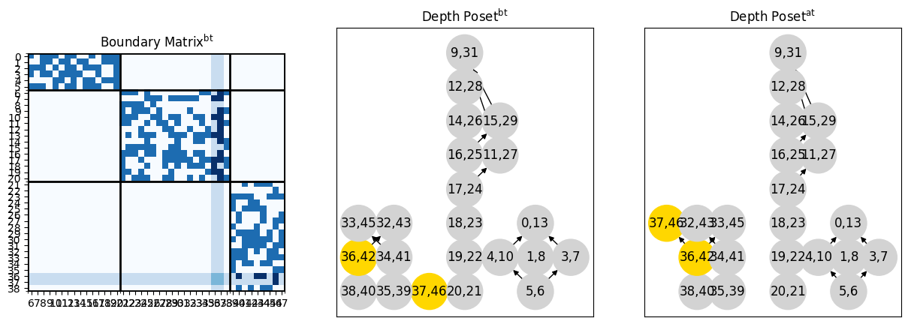

### Birth Death Pairs
|                          |                                                                                                                                                                                                                         |
|:-------------------------|:------------------------------------------------------------------------------------------------------------------------------------------------------------------------------------------------------------------------|
| Before the transposition | $\{(18, 23), (33, 45), (32, 43), (3, 7), (35, 39), (12, 28), (17, 24), (16, 25), (15, 29), (5, 6), (38, 40), (0, 13), (1, 8), (36, 42), (9, 31), (20, 21), (4, 10), (37, 46), (14, 26), (34, 41), (19, 22), (11, 27)\}$ |
| After the transposition  | $\{(18, 23), (33, 45), (32, 43), (3, 7), (35, 39), (12, 28), (17, 24), (16, 25), (15, 29), (5, 6), (38, 40), (0, 13), (1, 8), (36, 42), (9, 31), (20, 21), (4, 10), (37, 46), (14, 26), (34, 41), (19, 22), (11, 27)\}$ |

### Relations
|                          | Algorithm 1                                                                                                                                                                                                                                                                                                                                                                                                             | Algorithm 2                                                                                                                                                                                                                                                                                                                                                               |
|:-------------------------|:------------------------------------------------------------------------------------------------------------------------------------------------------------------------------------------------------------------------------------------------------------------------------------------------------------------------------------------------------------------------------------------------------------------------|:--------------------------------------------------------------------------------------------------------------------------------------------------------------------------------------------------------------------------------------------------------------------------------------------------------------------------------------------------------------------------|
| Before the transposition | $\{(25, 29), (42, 45), (41, 43), (21, 28), (22, 23), (21, 25), (40, 44), (28, 30), (25, 28), (6, 8), (25, 31), (24, 29), (7, 13), (21, 24), (22, 25), (23, 24), (23, 30), (22, 28), (39, 47), (24, 25), (6, 7), (6, 13), (6, 10), (41, 44), (42, 43), (24, 31), (41, 47), (26, 28), (21, 23), (43, 47), (29, 30), (26, 31), (21, 29), (40, 42), (23, 29), (40, 45), (10, 13), (28, 31), (45, 47), (25, 26)\}$           | $\{(35, 30), (20, 11), (4, 0), (35, 33), (18, 17), (20, 17), (38, 32), (17, 12), (17, 15), (19, 15), (32, 30), (18, 16), (35, 32), (3, 0), (20, 16), (5, 0), (20, 19), (5, 3), (17, 11), (14, 12), (19, 11), (34, 30), (34, 33), (16, 12), (16, 15), (20, 9), (20, 18), (35, 34), (38, 33), (5, 2), (38, 36), (11, 9), (19, 16), (34, 32), (15, 9), (16, 14), (33, 30)\}$ |
| After the transposition  | $\{(25, 29), (42, 45), (41, 43), (21, 28), (22, 23), (21, 25), (40, 44), (28, 30), (25, 28), (6, 8), (25, 31), (24, 29), (7, 13), (21, 24), (22, 25), (23, 24), (23, 30), (22, 28), (39, 47), (24, 25), (6, 7), (6, 13), (6, 10), (41, 44), (42, 43), (24, 31), (41, 47), (26, 28), (42, 46), (21, 23), (43, 47), (29, 30), (26, 31), (21, 29), (40, 42), (23, 29), (40, 45), (10, 13), (28, 31), (45, 47), (25, 26)\}$ | $\{(35, 30), (20, 11), (4, 0), (35, 33), (18, 17), (20, 17), (38, 32), (17, 12), (17, 15), (19, 15), (32, 30), (18, 16), (35, 32), (3, 0), (20, 16), (5, 0), (20, 19), (5, 3), (17, 11), (14, 12), (19, 11), (34, 30), (34, 33), (16, 12), (16, 15), (20, 9), (20, 18), (35, 34), (38, 33), (5, 2), (38, 36), (11, 9), (19, 16), (34, 32), (15, 9), (16, 14), (33, 30)\}$ |

### Successors and Predecessers
No such node in the Depth Poset

### Temp Sets
|                                                               | Before the Transposition                                                                                                                                                                                      | After the Transposition                                                                                                                                                                                       |
|:--------------------------------------------------------------|:--------------------------------------------------------------------------------------------------------------------------------------------------------------------------------------------------------------|:--------------------------------------------------------------------------------------------------------------------------------------------------------------------------------------------------------------|
| $\mathcal{L} = \{(s, t)\in \text{BD}:\; f(t) < f(y)\}$        | $\{(18, 23), (33, 45), (32, 43), (3, 7), (35, 39), (12, 28), (17, 24), (16, 25), (15, 29), (5, 6), (38, 40), (0, 13), (1, 8), (36, 42), (9, 31), (20, 21), (4, 10), (14, 26), (34, 41), (19, 22), (11, 27)\}$ | $\{(18, 23), (33, 45), (32, 43), (3, 7), (35, 39), (12, 28), (17, 24), (16, 25), (15, 29), (5, 6), (38, 40), (0, 13), (1, 8), (36, 42), (9, 31), (20, 21), (4, 10), (14, 26), (34, 41), (19, 22), (11, 27)\}$ |
| $\mathcal{M} = \{(s, t)\in \text{BD}:\; f(y) < f(t) < f(b)\}$ | $\emptyset$                                                                                                                                                                                                   | $\emptyset$                                                                                                                                                                                                   |

### Equations
There are 2 equations are wrong.

| eq   | left (formula)                  | left (paramatrized)               | left (value)   | right (formula)                                                                        | right (paramatrized)                                                                         | right (value)                      | correct   |
|:-----|:--------------------------------|:----------------------------------|:---------------|:---------------------------------------------------------------------------------------|:---------------------------------------------------------------------------------------------|:-----------------------------------|:----------|
| Eq16 | $\text{Succ}_1^\text{at}(x, y)$ | $\text{Succ}_1^\text{at}(37, 46)$ | $\emptyset$    | $\text{Succ}_1^\text{bt}(x, y) \oplus \{(a, b)\} \oplus \text{Succ}_1^\text{bt}(a, b)$ | $\text{Succ}_1^\text{bt}(37, 46) \oplus \{(36, 42)\} \oplus \text{Succ}_1^\text{bt}(36, 42)$ | $\{(33, 45), (32, 43), (36, 42)\}$ | ✘         |
| Eq17 | $\text{Pred}_1^\text{at}(a, b)$ | $\text{Pred}_1^\text{at}(36, 42)$ | $\{(38, 40)\}$ | $\text{Pred}_1^\text{bt}(a, b) \oplus \{(x, y)\}$                                      | $\text{Pred}_1^\text{bt}(36, 42) \oplus \{(37, 46)\}$                                        | $\{(38, 40), (37, 46)\}$           | ✘         |

## Transposition <41, 42> in complex 9
Here is a __death-death__ __no switch__ transposition <41, 42>.

$$
a = 36, \; b = 42, \; x = 34, \; y = 41
$$

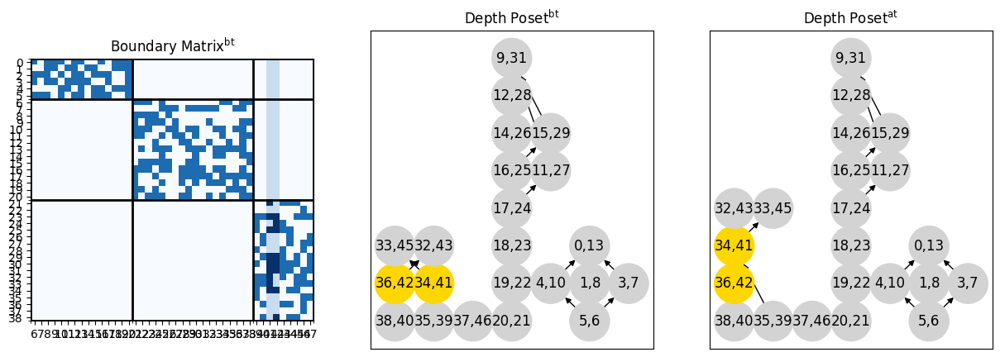

### Birth Death Pairs
|                          |                                                                                                                                                                                                                         |
|:-------------------------|:------------------------------------------------------------------------------------------------------------------------------------------------------------------------------------------------------------------------|
| Before the transposition | $\{(18, 23), (33, 45), (32, 43), (3, 7), (35, 39), (12, 28), (17, 24), (16, 25), (15, 29), (5, 6), (38, 40), (0, 13), (1, 8), (36, 42), (9, 31), (20, 21), (4, 10), (37, 46), (14, 26), (34, 41), (19, 22), (11, 27)\}$ |
| After the transposition  | $\{(18, 23), (33, 45), (32, 43), (3, 7), (35, 39), (12, 28), (17, 24), (16, 25), (15, 29), (5, 6), (38, 40), (0, 13), (1, 8), (36, 42), (9, 31), (20, 21), (4, 10), (37, 46), (14, 26), (34, 41), (19, 22), (11, 27)\}$ |

### Relations
|                          | Algorithm 1                                                                                                                                                                                                                                                                                                                                                                                                   | Algorithm 2                                                                                                                                                                                                                                                                                                                                                                                                       |
|:-------------------------|:--------------------------------------------------------------------------------------------------------------------------------------------------------------------------------------------------------------------------------------------------------------------------------------------------------------------------------------------------------------------------------------------------------------|:------------------------------------------------------------------------------------------------------------------------------------------------------------------------------------------------------------------------------------------------------------------------------------------------------------------------------------------------------------------------------------------------------------------|
| Before the transposition | $\{(25, 29), (42, 45), (41, 43), (21, 28), (22, 23), (21, 25), (40, 44), (28, 30), (25, 28), (6, 8), (25, 31), (24, 29), (7, 13), (21, 24), (22, 25), (23, 24), (23, 30), (22, 28), (39, 47), (24, 25), (6, 7), (6, 13), (6, 10), (41, 44), (42, 43), (24, 31), (41, 47), (26, 28), (21, 23), (43, 47), (29, 30), (26, 31), (21, 29), (40, 42), (23, 29), (40, 45), (10, 13), (28, 31), (45, 47), (25, 26)\}$ | $\{(35, 30), (20, 11), (4, 0), (35, 33), (18, 17), (20, 17), (38, 32), (17, 12), (17, 15), (19, 15), (32, 30), (18, 16), (35, 32), (3, 0), (20, 16), (5, 0), (20, 19), (5, 3), (17, 11), (14, 12), (19, 11), (34, 30), (34, 33), (16, 12), (16, 15), (20, 9), (20, 18), (35, 34), (38, 33), (5, 2), (38, 36), (11, 9), (19, 16), (34, 32), (15, 9), (16, 14), (33, 30)\}$                                         |
| After the transposition  | $\{(25, 29), (42, 45), (41, 43), (21, 28), (22, 23), (21, 25), (40, 44), (28, 30), (25, 28), (6, 8), (25, 31), (24, 29), (7, 13), (21, 24), (22, 25), (23, 24), (23, 30), (22, 28), (39, 47), (24, 25), (6, 7), (6, 13), (6, 10), (41, 44), (42, 43), (24, 31), (41, 47), (26, 28), (21, 23), (43, 47), (29, 30), (26, 31), (21, 29), (40, 42), (23, 29), (40, 45), (10, 13), (28, 31), (45, 47), (25, 26)\}$ | $\{(35, 30), (20, 11), (4, 0), (35, 33), (18, 17), (20, 17), (38, 32), (17, 12), (17, 15), (19, 15), (36, 34), (32, 30), (18, 16), (35, 32), (3, 0), (20, 16), (5, 0), (20, 19), (5, 3), (17, 11), (14, 12), (19, 11), (34, 30), (34, 33), (36, 30), (36, 33), (16, 12), (16, 15), (20, 9), (20, 18), (35, 34), (38, 33), (5, 2), (38, 36), (11, 9), (19, 16), (36, 32), (34, 32), (15, 9), (16, 14), (33, 30)\}$ |

### Successors and Predecessers
No such node in the Depth Poset

### Temp Sets
|                                                               | Before the Transposition                     | After the Transposition                      |
|:--------------------------------------------------------------|:---------------------------------------------|:---------------------------------------------|
| $\mathcal{B} = \{(s, t)\in \text{BD}:\; f(s) > f(x)\}$        | $\{(38, 40), (35, 39), (37, 46), (36, 42)\}$ | $\{(38, 40), (35, 39), (37, 46), (36, 42)\}$ |
| $\mathcal{N} = \{(s, t)\in \text{BD}:\; f(x) > f(s) > f(a)\}$ | $\emptyset$                                  | $\emptyset$                                  |

### Equations
There are 2 equations are wrong.

| eq   | left (formula)                  | left (paramatrized)               | left (value)             | right (formula)                                                                        | right (paramatrized)                                                                         | right (value)                      | correct   |
|:-----|:--------------------------------|:----------------------------------|:-------------------------|:---------------------------------------------------------------------------------------|:---------------------------------------------------------------------------------------------|:-----------------------------------|:----------|
| Eq36 | $\text{Succ}_2^\text{at}(x, y)$ | $\text{Succ}_2^\text{at}(34, 41)$ | $\{(33, 45), (32, 43)\}$ | $\text{Succ}_2^\text{bt}(x, y) \oplus \{(a, b)\} \oplus \text{Succ}_2^\text{bt}(a, b)$ | $\text{Succ}_2^\text{bt}(34, 41) \oplus \{(36, 42)\} \oplus \text{Succ}_2^\text{bt}(36, 42)$ | $\{(33, 45), (32, 43), (36, 42)\}$ | ✘         |
| Eq37 | $\text{Pred}_2^\text{at}(a, b)$ | $\text{Pred}_2^\text{at}(36, 42)$ | $\{(38, 40)\}$           | $\text{Pred}_2^\text{bt}(a, b) \oplus \{(x, y)\}$                                      | $\text{Pred}_2^\text{bt}(36, 42) \oplus \{(34, 41)\}$                                        | $\{(38, 40), (34, 41)\}$           | ✘         |

## Transposition <45, 46> in complex 9
Here is a __death-death__ __no switch__ transposition <45, 46>.

$$
a = 37, \; b = 46, \; x = 33, \; y = 45
$$

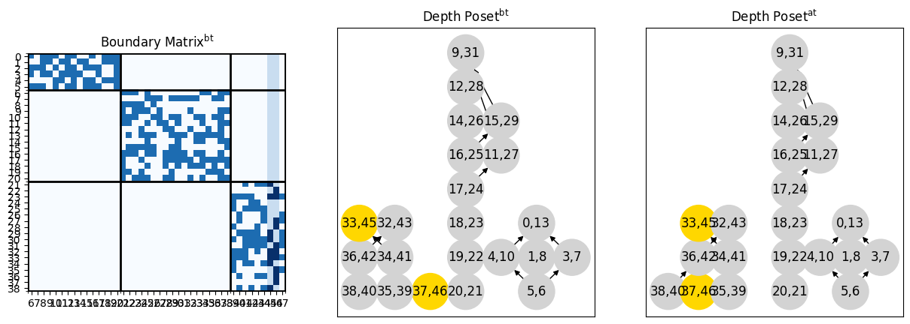

### Birth Death Pairs
|                          |                                                                                                                                                                                                                         |
|:-------------------------|:------------------------------------------------------------------------------------------------------------------------------------------------------------------------------------------------------------------------|
| Before the transposition | $\{(18, 23), (33, 45), (32, 43), (3, 7), (35, 39), (12, 28), (17, 24), (16, 25), (15, 29), (5, 6), (38, 40), (0, 13), (1, 8), (36, 42), (9, 31), (20, 21), (4, 10), (37, 46), (14, 26), (34, 41), (19, 22), (11, 27)\}$ |
| After the transposition  | $\{(18, 23), (33, 45), (32, 43), (3, 7), (35, 39), (12, 28), (17, 24), (16, 25), (15, 29), (5, 6), (38, 40), (0, 13), (1, 8), (36, 42), (9, 31), (20, 21), (4, 10), (37, 46), (14, 26), (34, 41), (19, 22), (11, 27)\}$ |

### Relations
|                          | Algorithm 1                                                                                                                                                                                                                                                                                                                                                                                                   | Algorithm 2                                                                                                                                                                                                                                                                                                                                                                                   |
|:-------------------------|:--------------------------------------------------------------------------------------------------------------------------------------------------------------------------------------------------------------------------------------------------------------------------------------------------------------------------------------------------------------------------------------------------------------|:----------------------------------------------------------------------------------------------------------------------------------------------------------------------------------------------------------------------------------------------------------------------------------------------------------------------------------------------------------------------------------------------|
| Before the transposition | $\{(25, 29), (42, 45), (41, 43), (21, 28), (22, 23), (21, 25), (40, 44), (28, 30), (25, 28), (6, 8), (25, 31), (24, 29), (7, 13), (21, 24), (22, 25), (23, 24), (23, 30), (22, 28), (39, 47), (24, 25), (6, 7), (6, 13), (6, 10), (41, 44), (42, 43), (24, 31), (41, 47), (26, 28), (21, 23), (43, 47), (29, 30), (26, 31), (21, 29), (40, 42), (23, 29), (40, 45), (10, 13), (28, 31), (45, 47), (25, 26)\}$ | $\{(35, 30), (20, 11), (4, 0), (35, 33), (18, 17), (20, 17), (38, 32), (17, 12), (17, 15), (19, 15), (32, 30), (18, 16), (35, 32), (3, 0), (20, 16), (5, 0), (20, 19), (5, 3), (17, 11), (14, 12), (19, 11), (34, 30), (34, 33), (16, 12), (16, 15), (20, 9), (20, 18), (35, 34), (38, 33), (5, 2), (38, 36), (11, 9), (19, 16), (34, 32), (15, 9), (16, 14), (33, 30)\}$                     |
| After the transposition  | $\{(25, 29), (42, 45), (41, 43), (21, 28), (22, 23), (21, 25), (40, 44), (28, 30), (25, 28), (6, 8), (25, 31), (24, 29), (7, 13), (21, 24), (22, 25), (23, 24), (23, 30), (22, 28), (39, 47), (24, 25), (6, 7), (6, 13), (6, 10), (41, 44), (42, 43), (24, 31), (41, 47), (26, 28), (21, 23), (43, 47), (29, 30), (26, 31), (21, 29), (40, 42), (23, 29), (40, 45), (10, 13), (28, 31), (45, 47), (25, 26)\}$ | $\{(35, 30), (20, 11), (4, 0), (35, 33), (18, 17), (20, 17), (38, 32), (17, 12), (17, 15), (37, 30), (19, 15), (37, 33), (32, 30), (18, 16), (35, 32), (3, 0), (20, 16), (5, 0), (20, 19), (5, 3), (17, 11), (14, 12), (19, 11), (34, 30), (34, 33), (16, 12), (16, 15), (20, 9), (20, 18), (35, 34), (38, 33), (5, 2), (38, 36), (11, 9), (19, 16), (34, 32), (15, 9), (16, 14), (33, 30)\}$ |

### Successors and Predecessers
No such node in the Depth Poset

### Temp Sets
|                                                               | Before the Transposition                               | After the Transposition                                |
|:--------------------------------------------------------------|:-------------------------------------------------------|:-------------------------------------------------------|
| $\mathcal{B} = \{(s, t)\in \text{BD}:\; f(s) > f(x)\}$        | $\{(35, 39), (36, 42), (34, 41), (38, 40), (37, 46)\}$ | $\{(35, 39), (36, 42), (34, 41), (38, 40), (37, 46)\}$ |
| $\mathcal{N} = \{(s, t)\in \text{BD}:\; f(x) > f(s) > f(a)\}$ | $\emptyset$                                            | $\emptyset$                                            |

### Equations
There are 2 equations are wrong.

| eq   | left (formula)                  | left (paramatrized)               | left (value)   | right (formula)                                                                        | right (paramatrized)                                                                         | right (value)   | correct   |
|:-----|:--------------------------------|:----------------------------------|:---------------|:---------------------------------------------------------------------------------------|:---------------------------------------------------------------------------------------------|:----------------|:----------|
| Eq36 | $\text{Succ}_2^\text{at}(x, y)$ | $\text{Succ}_2^\text{at}(33, 45)$ | $\emptyset$    | $\text{Succ}_2^\text{bt}(x, y) \oplus \{(a, b)\} \oplus \text{Succ}_2^\text{bt}(a, b)$ | $\text{Succ}_2^\text{bt}(33, 45) \oplus \{(37, 46)\} \oplus \text{Succ}_2^\text{bt}(37, 46)$ | $\{(37, 46)\}$  | ✘         |
| Eq37 | $\text{Pred}_2^\text{at}(a, b)$ | $\text{Pred}_2^\text{at}(37, 46)$ | $\emptyset$    | $\text{Pred}_2^\text{bt}(a, b) \oplus \{(x, y)\}$                                      | $\text{Pred}_2^\text{bt}(37, 46) \oplus \{(33, 45)\}$                                        | $\{(33, 45)\}$  | ✘         |

## Transposition <1, 2> in complex 10
Here is a __birth-birth__ __no switch__ transposition <1, 2>.

$$
a = 1, \; b = 9, \; x = 2, \; y = 10
$$

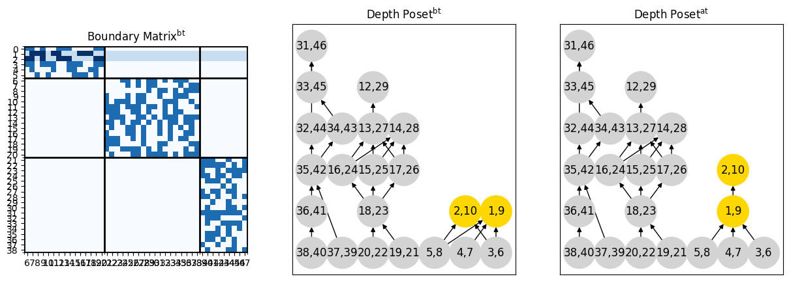

### Birth Death Pairs
|                          |                                                                                                                                                                                                                         |
|:-------------------------|:------------------------------------------------------------------------------------------------------------------------------------------------------------------------------------------------------------------------|
| Before the transposition | $\{(13, 27), (18, 23), (33, 45), (35, 42), (14, 28), (19, 21), (1, 9), (34, 43), (37, 39), (3, 6), (20, 22), (38, 40), (17, 26), (31, 46), (2, 10), (15, 25), (16, 24), (32, 44), (4, 7), (5, 8), (12, 29), (36, 41)\}$ |
| After the transposition  | $\{(13, 27), (18, 23), (33, 45), (35, 42), (14, 28), (19, 21), (1, 9), (34, 43), (37, 39), (3, 6), (20, 22), (38, 40), (17, 26), (31, 46), (2, 10), (15, 25), (16, 24), (32, 44), (4, 7), (5, 8), (12, 29), (36, 41)\}$ |

### Relations
|                          | Algorithm 1                                                                                                                                                                                                                                                                                                                                                                                                              | Algorithm 2                                                                                                                                                                                                                                                                                                                                                                                                                                                  |
|:-------------------------|:-------------------------------------------------------------------------------------------------------------------------------------------------------------------------------------------------------------------------------------------------------------------------------------------------------------------------------------------------------------------------------------------------------------------------|:-------------------------------------------------------------------------------------------------------------------------------------------------------------------------------------------------------------------------------------------------------------------------------------------------------------------------------------------------------------------------------------------------------------------------------------------------------------|
| Before the transposition | $\{(25, 29), (42, 45), (41, 43), (24, 27), (43, 46), (21, 25), (23, 28), (40, 44), (39, 42), (22, 26), (23, 25), (22, 29), (40, 47), (39, 45), (9, 11), (25, 28), (24, 29), (42, 44), (44, 47), (43, 45), (21, 24), (21, 27), (23, 24), (23, 30), (10, 11), (24, 28), (41, 44), (25, 27), (42, 43), (6, 10), (41, 47), (25, 30), (21, 26), (22, 27), (21, 29), (22, 30), (40, 45), (8, 10), (45, 47), (7, 11), (6, 9)\}$ | $\{(32, 31), (20, 11), (18, 17), (20, 14), (20, 17), (38, 35), (38, 32), (5, 1), (17, 12), (19, 12), (19, 18), (36, 31), (15, 11), (15, 14), (35, 32), (20, 13), (18, 13), (3, 0), (38, 31), (17, 11), (17, 14), (19, 11), (19, 14), (34, 33), (19, 17), (15, 13), (18, 12), (33, 31), (20, 12), (3, 2), (20, 18), (4, 1), (20, 15), (38, 30), (38, 33), (35, 34), (38, 36), (17, 13), (2, 0), (19, 16), (36, 32), (37, 31), (36, 35), (13, 12), (18, 11)\}$ |
| After the transposition  | $\{(25, 29), (42, 45), (41, 43), (24, 27), (43, 46), (21, 25), (23, 28), (40, 44), (39, 42), (22, 26), (23, 25), (40, 47), (22, 29), (39, 45), (25, 28), (24, 29), (42, 44), (44, 47), (43, 45), (21, 24), (21, 27), (23, 24), (23, 30), (9, 10), (10, 11), (24, 28), (41, 44), (25, 27), (42, 43), (6, 10), (41, 47), (25, 30), (21, 26), (22, 27), (21, 29), (22, 30), (40, 45), (8, 10), (45, 47), (7, 11), (6, 9)\}$ | $\{(32, 31), (20, 11), (18, 17), (20, 14), (20, 17), (38, 35), (38, 32), (5, 1), (17, 12), (19, 12), (19, 18), (36, 31), (15, 11), (15, 14), (35, 32), (20, 13), (18, 13), (3, 0), (38, 31), (17, 11), (17, 14), (19, 11), (19, 14), (34, 33), (19, 17), (15, 13), (18, 12), (33, 31), (3, 2), (20, 12), (4, 1), (20, 18), (38, 30), (35, 34), (20, 15), (38, 33), (38, 36), (17, 13), (2, 0), (19, 16), (36, 32), (37, 31), (36, 35), (13, 12), (18, 11)\}$ |

### Successors and Predecessers
No such node in the Depth Poset

### Temp Sets
|                                                               | Before the Transposition             | After the Transposition              |
|:--------------------------------------------------------------|:-------------------------------------|:-------------------------------------|
| $\mathcal{L} = \{(s, t)\in \text{BD}:\; f(t) < f(y)\}$        | $\{(4, 7), (5, 8), (1, 9), (3, 6)\}$ | $\{(4, 7), (5, 8), (1, 9), (3, 6)\}$ |
| $\mathcal{M} = \{(s, t)\in \text{BD}:\; f(y) < f(t) < f(b)\}$ | $\emptyset$                          | $\emptyset$                          |

### Equations
There are 2 equations are wrong.

| eq   | left (formula)                  | left (paramatrized)              | left (value)   | right (formula)                                                                        | right (paramatrized)                                                                    | right (value)         | correct   |
|:-----|:--------------------------------|:---------------------------------|:---------------|:---------------------------------------------------------------------------------------|:----------------------------------------------------------------------------------------|:----------------------|:----------|
| Eq16 | $\text{Succ}_1^\text{at}(x, y)$ | $\text{Succ}_1^\text{at}(2, 10)$ | $\emptyset$    | $\text{Succ}_1^\text{bt}(x, y) \oplus \{(a, b)\} \oplus \text{Succ}_1^\text{bt}(a, b)$ | $\text{Succ}_1^\text{bt}(2, 10) \oplus \{(1, 9)\} \oplus \text{Succ}_1^\text{bt}(1, 9)$ | $\{(1, 9)\}$          | ✘         |
| Eq17 | $\text{Pred}_1^\text{at}(a, b)$ | $\text{Pred}_1^\text{at}(1, 9)$  | $\{(3, 6)\}$   | $\text{Pred}_1^\text{bt}(a, b) \oplus \{(x, y)\}$                                      | $\text{Pred}_1^\text{bt}(1, 9) \oplus \{(2, 10)\}$                                      | $\{(2, 10), (3, 6)\}$ | ✘         |

## Transposition <3, 4> in complex 10
Here is a __birth-birth__ __no switch__ transposition <3, 4>.

$$
a = 3, \; b = 6, \; x = 4, \; y = 7
$$

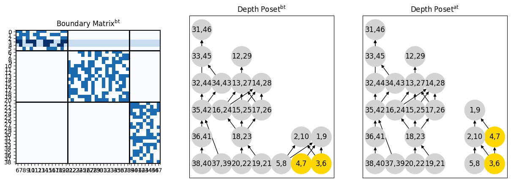

### Birth Death Pairs
|                          |                                                                                                                                                                                                                         |
|:-------------------------|:------------------------------------------------------------------------------------------------------------------------------------------------------------------------------------------------------------------------|
| Before the transposition | $\{(13, 27), (18, 23), (33, 45), (35, 42), (14, 28), (19, 21), (1, 9), (34, 43), (37, 39), (3, 6), (20, 22), (38, 40), (17, 26), (31, 46), (2, 10), (15, 25), (16, 24), (32, 44), (4, 7), (5, 8), (12, 29), (36, 41)\}$ |
| After the transposition  | $\{(13, 27), (18, 23), (33, 45), (35, 42), (14, 28), (19, 21), (1, 9), (34, 43), (37, 39), (3, 6), (20, 22), (38, 40), (17, 26), (31, 46), (2, 10), (15, 25), (16, 24), (32, 44), (4, 7), (5, 8), (12, 29), (36, 41)\}$ |

### Relations
|                          | Algorithm 1                                                                                                                                                                                                                                                                                                                                                                                                                               | Algorithm 2                                                                                                                                                                                                                                                                                                                                                                                                                                                  |
|:-------------------------|:------------------------------------------------------------------------------------------------------------------------------------------------------------------------------------------------------------------------------------------------------------------------------------------------------------------------------------------------------------------------------------------------------------------------------------------|:-------------------------------------------------------------------------------------------------------------------------------------------------------------------------------------------------------------------------------------------------------------------------------------------------------------------------------------------------------------------------------------------------------------------------------------------------------------|
| Before the transposition | $\{(25, 29), (42, 45), (41, 43), (24, 27), (43, 46), (21, 25), (23, 28), (40, 44), (39, 42), (22, 26), (23, 25), (22, 29), (40, 47), (39, 45), (9, 11), (25, 28), (24, 29), (42, 44), (44, 47), (43, 45), (21, 24), (21, 27), (23, 24), (23, 30), (10, 11), (24, 28), (41, 44), (25, 27), (42, 43), (6, 10), (41, 47), (25, 30), (21, 26), (22, 27), (21, 29), (22, 30), (40, 45), (8, 10), (45, 47), (7, 11), (6, 9)\}$                  | $\{(32, 31), (20, 11), (18, 17), (20, 14), (20, 17), (38, 35), (38, 32), (5, 1), (17, 12), (19, 12), (19, 18), (36, 31), (15, 11), (15, 14), (35, 32), (20, 13), (18, 13), (3, 0), (38, 31), (17, 11), (17, 14), (19, 11), (19, 14), (34, 33), (19, 17), (15, 13), (18, 12), (33, 31), (20, 12), (3, 2), (20, 18), (4, 1), (20, 15), (38, 30), (38, 33), (35, 34), (38, 36), (17, 13), (2, 0), (19, 16), (36, 32), (37, 31), (36, 35), (13, 12), (18, 11)\}$ |
| After the transposition  | $\{(25, 29), (42, 45), (41, 43), (24, 27), (43, 46), (21, 25), (23, 28), (40, 44), (39, 42), (22, 26), (23, 25), (40, 47), (22, 29), (39, 45), (9, 11), (6, 11), (25, 28), (24, 29), (42, 44), (44, 47), (43, 45), (21, 24), (21, 27), (23, 24), (23, 30), (10, 11), (6, 7), (24, 28), (41, 44), (25, 27), (42, 43), (6, 10), (41, 47), (25, 30), (21, 26), (22, 27), (21, 29), (22, 30), (40, 45), (8, 10), (45, 47), (7, 11), (6, 9)\}$ | $\{(32, 31), (20, 11), (18, 17), (20, 14), (20, 17), (38, 35), (38, 32), (5, 1), (17, 12), (19, 12), (19, 18), (36, 31), (15, 11), (15, 14), (35, 32), (20, 13), (18, 13), (3, 0), (38, 31), (17, 11), (17, 14), (19, 11), (19, 14), (34, 33), (19, 17), (15, 13), (18, 12), (33, 31), (3, 2), (20, 12), (4, 1), (20, 18), (38, 30), (35, 34), (20, 15), (38, 33), (38, 36), (17, 13), (2, 0), (19, 16), (36, 32), (37, 31), (36, 35), (13, 12), (18, 11)\}$ |

### Successors and Predecessers
No such node in the Depth Poset

### Temp Sets
|                                                               | Before the Transposition   | After the Transposition   |
|:--------------------------------------------------------------|:---------------------------|:--------------------------|
| $\mathcal{L} = \{(s, t)\in \text{BD}:\; f(t) < f(y)\}$        | $\{(3, 6)\}$               | $\{(3, 6)\}$              |
| $\mathcal{M} = \{(s, t)\in \text{BD}:\; f(y) < f(t) < f(b)\}$ | $\emptyset$                | $\emptyset$               |

### Equations
There are 2 equations are wrong.

| eq   | left (formula)                  | left (paramatrized)             | left (value)   | right (formula)                                                                        | right (paramatrized)                                                                   | right (value)                 | correct   |
|:-----|:--------------------------------|:--------------------------------|:---------------|:---------------------------------------------------------------------------------------|:---------------------------------------------------------------------------------------|:------------------------------|:----------|
| Eq16 | $\text{Succ}_1^\text{at}(x, y)$ | $\text{Succ}_1^\text{at}(4, 7)$ | $\emptyset$    | $\text{Succ}_1^\text{bt}(x, y) \oplus \{(a, b)\} \oplus \text{Succ}_1^\text{bt}(a, b)$ | $\text{Succ}_1^\text{bt}(4, 7) \oplus \{(3, 6)\} \oplus \text{Succ}_1^\text{bt}(3, 6)$ | $\{(2, 10), (1, 9), (3, 6)\}$ | ✘         |
| Eq17 | $\text{Pred}_1^\text{at}(a, b)$ | $\text{Pred}_1^\text{at}(3, 6)$ | $\emptyset$    | $\text{Pred}_1^\text{bt}(a, b) \oplus \{(x, y)\}$                                      | $\text{Pred}_1^\text{bt}(3, 6) \oplus \{(4, 7)\}$                                      | $\{(4, 7)\}$                  | ✘         |

## Transposition <6, 7> in complex 10
Here is a __death-death__ __no switch__ transposition <6, 7>.

$$
a = 4, \; b = 7, \; x = 3, \; y = 6
$$

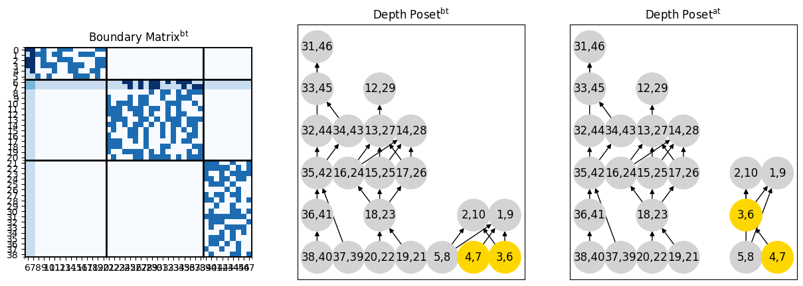

### Birth Death Pairs
|                          |                                                                                                                                                                                                                         |
|:-------------------------|:------------------------------------------------------------------------------------------------------------------------------------------------------------------------------------------------------------------------|
| Before the transposition | $\{(13, 27), (18, 23), (33, 45), (35, 42), (14, 28), (19, 21), (1, 9), (34, 43), (37, 39), (3, 6), (20, 22), (38, 40), (17, 26), (31, 46), (2, 10), (15, 25), (16, 24), (32, 44), (4, 7), (5, 8), (12, 29), (36, 41)\}$ |
| After the transposition  | $\{(13, 27), (18, 23), (33, 45), (35, 42), (14, 28), (19, 21), (1, 9), (34, 43), (37, 39), (3, 6), (20, 22), (38, 40), (17, 26), (31, 46), (2, 10), (15, 25), (16, 24), (32, 44), (4, 7), (5, 8), (12, 29), (36, 41)\}$ |

### Relations
|                          | Algorithm 1                                                                                                                                                                                                                                                                                                                                                                                                              | Algorithm 2                                                                                                                                                                                                                                                                                                                                                                                                                                                                          |
|:-------------------------|:-------------------------------------------------------------------------------------------------------------------------------------------------------------------------------------------------------------------------------------------------------------------------------------------------------------------------------------------------------------------------------------------------------------------------|:-------------------------------------------------------------------------------------------------------------------------------------------------------------------------------------------------------------------------------------------------------------------------------------------------------------------------------------------------------------------------------------------------------------------------------------------------------------------------------------|
| Before the transposition | $\{(25, 29), (42, 45), (41, 43), (24, 27), (43, 46), (21, 25), (23, 28), (40, 44), (39, 42), (22, 26), (23, 25), (22, 29), (40, 47), (39, 45), (9, 11), (25, 28), (24, 29), (42, 44), (44, 47), (43, 45), (21, 24), (21, 27), (23, 24), (23, 30), (10, 11), (24, 28), (41, 44), (25, 27), (42, 43), (6, 10), (41, 47), (25, 30), (21, 26), (22, 27), (21, 29), (22, 30), (40, 45), (8, 10), (45, 47), (7, 11), (6, 9)\}$ | $\{(32, 31), (20, 11), (18, 17), (20, 14), (20, 17), (38, 35), (38, 32), (5, 1), (17, 12), (19, 12), (19, 18), (36, 31), (15, 11), (15, 14), (35, 32), (20, 13), (18, 13), (3, 0), (38, 31), (17, 11), (17, 14), (19, 11), (19, 14), (34, 33), (19, 17), (15, 13), (18, 12), (33, 31), (20, 12), (3, 2), (20, 18), (4, 1), (20, 15), (38, 30), (38, 33), (35, 34), (38, 36), (17, 13), (2, 0), (19, 16), (36, 32), (37, 31), (36, 35), (13, 12), (18, 11)\}$                         |
| After the transposition  | $\{(25, 29), (42, 45), (41, 43), (24, 27), (43, 46), (21, 25), (23, 28), (40, 44), (39, 42), (22, 26), (23, 25), (40, 47), (22, 29), (39, 45), (9, 11), (25, 28), (24, 29), (42, 44), (44, 47), (43, 45), (21, 24), (21, 27), (23, 24), (23, 30), (10, 11), (6, 10), (24, 28), (41, 44), (25, 27), (42, 43), (41, 47), (25, 30), (21, 26), (22, 27), (21, 29), (22, 30), (40, 45), (8, 10), (45, 47), (7, 11), (6, 9)\}$ | $\{(32, 31), (20, 11), (4, 0), (18, 17), (20, 14), (4, 3), (20, 17), (38, 35), (38, 32), (5, 1), (17, 12), (19, 12), (19, 18), (36, 31), (15, 11), (15, 14), (35, 32), (20, 13), (18, 13), (4, 2), (3, 0), (38, 31), (17, 11), (17, 14), (19, 11), (19, 14), (34, 33), (19, 17), (15, 13), (18, 12), (33, 31), (20, 12), (3, 2), (4, 1), (20, 18), (20, 15), (38, 30), (38, 33), (35, 34), (38, 36), (17, 13), (2, 0), (19, 16), (36, 32), (37, 31), (36, 35), (13, 12), (18, 11)\}$ |

### Successors and Predecessers
No such node in the Depth Poset

### Temp Sets
|                                                               | Before the Transposition                                                                                                                                                                       | After the Transposition                                                                                                                                                                        |
|:--------------------------------------------------------------|:-----------------------------------------------------------------------------------------------------------------------------------------------------------------------------------------------|:-----------------------------------------------------------------------------------------------------------------------------------------------------------------------------------------------|
| $\mathcal{B} = \{(s, t)\in \text{BD}:\; f(s) > f(x)\}$        | $\{(13, 27), (18, 23), (33, 45), (35, 42), (14, 28), (19, 21), (34, 43), (37, 39), (38, 40), (20, 22), (17, 26), (31, 46), (15, 25), (16, 24), (32, 44), (4, 7), (5, 8), (12, 29), (36, 41)\}$ | $\{(13, 27), (18, 23), (33, 45), (35, 42), (14, 28), (19, 21), (34, 43), (37, 39), (38, 40), (20, 22), (17, 26), (31, 46), (15, 25), (16, 24), (32, 44), (4, 7), (5, 8), (12, 29), (36, 41)\}$ |
| $\mathcal{N} = \{(s, t)\in \text{BD}:\; f(x) > f(s) > f(a)\}$ | $\emptyset$                                                                                                                                                                                    | $\emptyset$                                                                                                                                                                                    |

### Equations
There are 2 equations are wrong.

| eq   | left (formula)                  | left (paramatrized)             | left (value)   | right (formula)                                                                        | right (paramatrized)                                                                   | right (value)                 | correct   |
|:-----|:--------------------------------|:--------------------------------|:---------------|:---------------------------------------------------------------------------------------|:---------------------------------------------------------------------------------------|:------------------------------|:----------|
| Eq36 | $\text{Succ}_2^\text{at}(x, y)$ | $\text{Succ}_2^\text{at}(3, 6)$ | $\{(2, 10)\}$  | $\text{Succ}_2^\text{bt}(x, y) \oplus \{(a, b)\} \oplus \text{Succ}_2^\text{bt}(a, b)$ | $\text{Succ}_2^\text{bt}(3, 6) \oplus \{(4, 7)\} \oplus \text{Succ}_2^\text{bt}(4, 7)$ | $\{(2, 10), (4, 7), (1, 9)\}$ | ✘         |
| Eq37 | $\text{Pred}_2^\text{at}(a, b)$ | $\text{Pred}_2^\text{at}(4, 7)$ | $\emptyset$    | $\text{Pred}_2^\text{bt}(a, b) \oplus \{(x, y)\}$                                      | $\text{Pred}_2^\text{bt}(4, 7) \oplus \{(3, 6)\}$                                      | $\{(3, 6)\}$                  | ✘         |

## Transposition <9, 10> in complex 10
Here is a __death-death__ __no switch__ transposition <9, 10>.

$$
a = 2, \; b = 10, \; x = 1, \; y = 9
$$

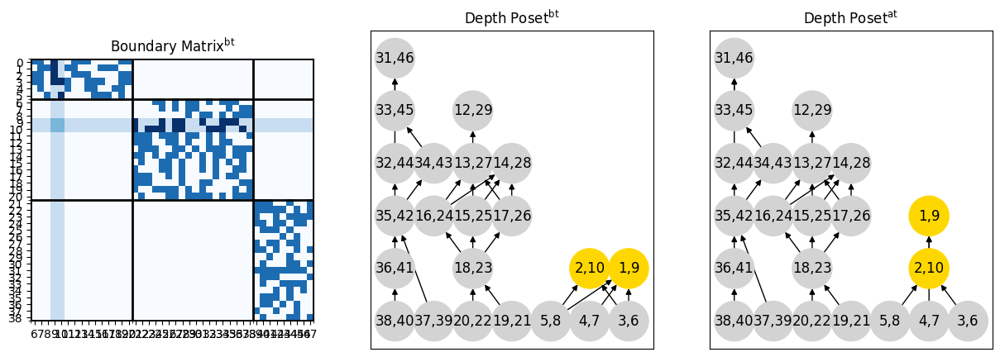

### Birth Death Pairs
|                          |                                                                                                                                                                                                                         |
|:-------------------------|:------------------------------------------------------------------------------------------------------------------------------------------------------------------------------------------------------------------------|
| Before the transposition | $\{(13, 27), (18, 23), (33, 45), (35, 42), (14, 28), (19, 21), (1, 9), (34, 43), (37, 39), (3, 6), (20, 22), (38, 40), (17, 26), (31, 46), (2, 10), (15, 25), (16, 24), (32, 44), (4, 7), (5, 8), (12, 29), (36, 41)\}$ |
| After the transposition  | $\{(13, 27), (18, 23), (33, 45), (35, 42), (14, 28), (19, 21), (1, 9), (34, 43), (37, 39), (3, 6), (20, 22), (38, 40), (17, 26), (31, 46), (2, 10), (15, 25), (16, 24), (32, 44), (4, 7), (5, 8), (12, 29), (36, 41)\}$ |

### Relations
|                          | Algorithm 1                                                                                                                                                                                                                                                                                                                                                                                                              | Algorithm 2                                                                                                                                                                                                                                                                                                                                                                                                                                                          |
|:-------------------------|:-------------------------------------------------------------------------------------------------------------------------------------------------------------------------------------------------------------------------------------------------------------------------------------------------------------------------------------------------------------------------------------------------------------------------|:---------------------------------------------------------------------------------------------------------------------------------------------------------------------------------------------------------------------------------------------------------------------------------------------------------------------------------------------------------------------------------------------------------------------------------------------------------------------|
| Before the transposition | $\{(25, 29), (42, 45), (41, 43), (24, 27), (43, 46), (21, 25), (23, 28), (40, 44), (39, 42), (22, 26), (23, 25), (22, 29), (40, 47), (39, 45), (9, 11), (25, 28), (24, 29), (42, 44), (44, 47), (43, 45), (21, 24), (21, 27), (23, 24), (23, 30), (10, 11), (24, 28), (41, 44), (25, 27), (42, 43), (6, 10), (41, 47), (25, 30), (21, 26), (22, 27), (21, 29), (22, 30), (40, 45), (8, 10), (45, 47), (7, 11), (6, 9)\}$ | $\{(32, 31), (20, 11), (18, 17), (20, 14), (20, 17), (38, 35), (38, 32), (5, 1), (17, 12), (19, 12), (19, 18), (36, 31), (15, 11), (15, 14), (35, 32), (20, 13), (18, 13), (3, 0), (38, 31), (17, 11), (17, 14), (19, 11), (19, 14), (34, 33), (19, 17), (15, 13), (18, 12), (33, 31), (20, 12), (3, 2), (20, 18), (4, 1), (20, 15), (38, 30), (38, 33), (35, 34), (38, 36), (17, 13), (2, 0), (19, 16), (36, 32), (37, 31), (36, 35), (13, 12), (18, 11)\}$         |
| After the transposition  | $\{(25, 29), (42, 45), (41, 43), (24, 27), (43, 46), (21, 25), (23, 28), (40, 44), (39, 42), (22, 26), (23, 25), (40, 47), (22, 29), (39, 45), (9, 11), (25, 28), (24, 29), (42, 44), (44, 47), (43, 45), (21, 24), (21, 27), (23, 24), (23, 30), (10, 11), (24, 28), (41, 44), (25, 27), (42, 43), (6, 10), (41, 47), (25, 30), (21, 26), (22, 27), (21, 29), (22, 30), (8, 10), (40, 45), (45, 47), (7, 11), (6, 9)\}$ | $\{(32, 31), (20, 11), (18, 17), (20, 14), (20, 17), (38, 35), (38, 32), (5, 1), (17, 12), (19, 12), (19, 18), (36, 31), (15, 11), (15, 14), (35, 32), (20, 13), (18, 13), (3, 0), (38, 31), (17, 11), (17, 14), (19, 11), (19, 14), (34, 33), (2, 1), (19, 17), (15, 13), (18, 12), (33, 31), (20, 12), (3, 2), (20, 18), (4, 1), (20, 15), (38, 30), (38, 33), (35, 34), (38, 36), (17, 13), (2, 0), (19, 16), (36, 32), (37, 31), (36, 35), (13, 12), (18, 11)\}$ |

### Successors and Predecessers
No such node in the Depth Poset

### Temp Sets
|                                                               | Before the Transposition                                                                                                                                                                                        | After the Transposition                                                                                                                                                                                         |
|:--------------------------------------------------------------|:----------------------------------------------------------------------------------------------------------------------------------------------------------------------------------------------------------------|:----------------------------------------------------------------------------------------------------------------------------------------------------------------------------------------------------------------|
| $\mathcal{B} = \{(s, t)\in \text{BD}:\; f(s) > f(x)\}$        | $\{(13, 27), (18, 23), (33, 45), (35, 42), (14, 28), (19, 21), (34, 43), (37, 39), (3, 6), (38, 40), (20, 22), (17, 26), (31, 46), (2, 10), (15, 25), (16, 24), (32, 44), (4, 7), (5, 8), (12, 29), (36, 41)\}$ | $\{(13, 27), (18, 23), (33, 45), (35, 42), (14, 28), (19, 21), (34, 43), (37, 39), (3, 6), (38, 40), (20, 22), (17, 26), (31, 46), (2, 10), (15, 25), (16, 24), (32, 44), (4, 7), (5, 8), (12, 29), (36, 41)\}$ |
| $\mathcal{N} = \{(s, t)\in \text{BD}:\; f(x) > f(s) > f(a)\}$ | $\emptyset$                                                                                                                                                                                                     | $\emptyset$                                                                                                                                                                                                     |

### Equations
There are 2 equations are wrong.

| eq   | left (formula)                  | left (paramatrized)              | left (value)   | right (formula)                                                                        | right (paramatrized)                                                                     | right (value)        | correct   |
|:-----|:--------------------------------|:---------------------------------|:---------------|:---------------------------------------------------------------------------------------|:-----------------------------------------------------------------------------------------|:---------------------|:----------|
| Eq36 | $\text{Succ}_2^\text{at}(x, y)$ | $\text{Succ}_2^\text{at}(1, 9)$  | $\emptyset$    | $\text{Succ}_2^\text{bt}(x, y) \oplus \{(a, b)\} \oplus \text{Succ}_2^\text{bt}(a, b)$ | $\text{Succ}_2^\text{bt}(1, 9) \oplus \{(2, 10)\} \oplus \text{Succ}_2^\text{bt}(2, 10)$ | $\{(2, 10)\}$        | ✘         |
| Eq37 | $\text{Pred}_2^\text{at}(a, b)$ | $\text{Pred}_2^\text{at}(2, 10)$ | $\{(3, 6)\}$   | $\text{Pred}_2^\text{bt}(a, b) \oplus \{(x, y)\}$                                      | $\text{Pred}_2^\text{bt}(2, 10) \oplus \{(1, 9)\}$                                       | $\{(1, 9), (3, 6)\}$ | ✘         |

## Transposition <13, 14> in complex 10
Here is a __birth-birth__ __no switch__ transposition <13, 14>.

$$
a = 13, \; b = 27, \; x = 14, \; y = 28
$$

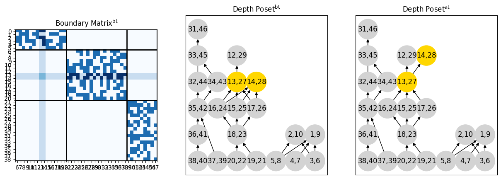

### Birth Death Pairs
|                          |                                                                                                                                                                                                                         |
|:-------------------------|:------------------------------------------------------------------------------------------------------------------------------------------------------------------------------------------------------------------------|
| Before the transposition | $\{(13, 27), (18, 23), (33, 45), (35, 42), (14, 28), (19, 21), (1, 9), (34, 43), (37, 39), (3, 6), (20, 22), (38, 40), (17, 26), (31, 46), (2, 10), (15, 25), (16, 24), (32, 44), (4, 7), (5, 8), (12, 29), (36, 41)\}$ |
| After the transposition  | $\{(13, 27), (18, 23), (33, 45), (35, 42), (14, 28), (19, 21), (1, 9), (34, 43), (37, 39), (3, 6), (20, 22), (38, 40), (17, 26), (31, 46), (2, 10), (15, 25), (16, 24), (32, 44), (4, 7), (5, 8), (12, 29), (36, 41)\}$ |

### Relations
|                          | Algorithm 1                                                                                                                                                                                                                                                                                                                                                                                                                        | Algorithm 2                                                                                                                                                                                                                                                                                                                                                                                                                                                  |
|:-------------------------|:-----------------------------------------------------------------------------------------------------------------------------------------------------------------------------------------------------------------------------------------------------------------------------------------------------------------------------------------------------------------------------------------------------------------------------------|:-------------------------------------------------------------------------------------------------------------------------------------------------------------------------------------------------------------------------------------------------------------------------------------------------------------------------------------------------------------------------------------------------------------------------------------------------------------|
| Before the transposition | $\{(25, 29), (42, 45), (41, 43), (24, 27), (43, 46), (21, 25), (23, 28), (40, 44), (39, 42), (22, 26), (23, 25), (22, 29), (40, 47), (39, 45), (9, 11), (25, 28), (24, 29), (42, 44), (44, 47), (43, 45), (21, 24), (21, 27), (23, 24), (23, 30), (10, 11), (24, 28), (41, 44), (25, 27), (42, 43), (6, 10), (41, 47), (25, 30), (21, 26), (22, 27), (21, 29), (22, 30), (40, 45), (8, 10), (45, 47), (7, 11), (6, 9)\}$           | $\{(32, 31), (20, 11), (18, 17), (20, 14), (20, 17), (38, 35), (38, 32), (5, 1), (17, 12), (19, 12), (19, 18), (36, 31), (15, 11), (15, 14), (35, 32), (20, 13), (18, 13), (3, 0), (38, 31), (17, 11), (17, 14), (19, 11), (19, 14), (34, 33), (19, 17), (15, 13), (18, 12), (33, 31), (20, 12), (3, 2), (20, 18), (4, 1), (20, 15), (38, 30), (38, 33), (35, 34), (38, 36), (17, 13), (2, 0), (19, 16), (36, 32), (37, 31), (36, 35), (13, 12), (18, 11)\}$ |
| After the transposition  | $\{(25, 29), (42, 45), (41, 43), (24, 27), (43, 46), (21, 25), (23, 28), (40, 44), (39, 42), (22, 26), (23, 25), (40, 47), (22, 29), (39, 45), (9, 11), (27, 28), (25, 28), (24, 29), (42, 44), (44, 47), (43, 45), (21, 24), (21, 27), (23, 24), (23, 30), (10, 11), (24, 28), (41, 44), (25, 27), (42, 43), (6, 10), (41, 47), (25, 30), (21, 26), (22, 27), (21, 29), (22, 30), (40, 45), (8, 10), (45, 47), (7, 11), (6, 9)\}$ | $\{(32, 31), (20, 11), (18, 17), (20, 14), (20, 17), (38, 35), (38, 32), (5, 1), (17, 12), (19, 12), (19, 18), (36, 31), (15, 11), (15, 14), (35, 32), (20, 13), (18, 13), (3, 0), (38, 31), (17, 11), (17, 14), (19, 11), (34, 33), (19, 14), (19, 17), (15, 13), (18, 12), (33, 31), (20, 12), (3, 2), (20, 18), (4, 1), (20, 15), (38, 30), (38, 33), (35, 34), (38, 36), (17, 13), (2, 0), (19, 16), (36, 32), (37, 31), (36, 35), (13, 12), (18, 11)\}$ |

### Successors and Predecessers
No such node in the Depth Poset

### Temp Sets
|                                                               | Before the Transposition                                                                                            | After the Transposition                                                                                             |
|:--------------------------------------------------------------|:--------------------------------------------------------------------------------------------------------------------|:--------------------------------------------------------------------------------------------------------------------|
| $\mathcal{L} = \{(s, t)\in \text{BD}:\; f(t) < f(y)\}$        | $\{(13, 27), (18, 23), (17, 26), (5, 8), (2, 10), (20, 22), (4, 7), (15, 25), (3, 6), (16, 24), (19, 21), (1, 9)\}$ | $\{(13, 27), (18, 23), (17, 26), (5, 8), (2, 10), (20, 22), (4, 7), (15, 25), (3, 6), (16, 24), (19, 21), (1, 9)\}$ |
| $\mathcal{M} = \{(s, t)\in \text{BD}:\; f(y) < f(t) < f(b)\}$ | $\emptyset$                                                                                                         | $\emptyset$                                                                                                         |

### Equations
There are 2 equations are wrong.

| eq   | left (formula)                  | left (paramatrized)               | left (value)                                 | right (formula)                                                                        | right (paramatrized)                                                                         | right (value)                                          | correct   |
|:-----|:--------------------------------|:----------------------------------|:---------------------------------------------|:---------------------------------------------------------------------------------------|:---------------------------------------------------------------------------------------------|:-------------------------------------------------------|:----------|
| Eq16 | $\text{Succ}_1^\text{at}(x, y)$ | $\text{Succ}_1^\text{at}(14, 28)$ | $\emptyset$                                  | $\text{Succ}_1^\text{bt}(x, y) \oplus \{(a, b)\} \oplus \text{Succ}_1^\text{bt}(a, b)$ | $\text{Succ}_1^\text{bt}(14, 28) \oplus \{(13, 27)\} \oplus \text{Succ}_1^\text{bt}(13, 27)$ | $\{(13, 27)\}$                                         | ✘         |
| Eq17 | $\text{Pred}_1^\text{at}(a, b)$ | $\text{Pred}_1^\text{at}(13, 27)$ | $\{(20, 22), (16, 24), (19, 21), (15, 25)\}$ | $\text{Pred}_1^\text{bt}(a, b) \oplus \{(x, y)\}$                                      | $\text{Pred}_1^\text{bt}(13, 27) \oplus \{(14, 28)\}$                                        | $\{(20, 22), (15, 25), (14, 28), (16, 24), (19, 21)\}$ | ✘         |

## Transposition <17, 18> in complex 10
Here is a __birth-birth__ __switch forward__ transposition <17, 18>.

$$
a = 17, \; b = 26, \; x = 18, \; y = 23
$$

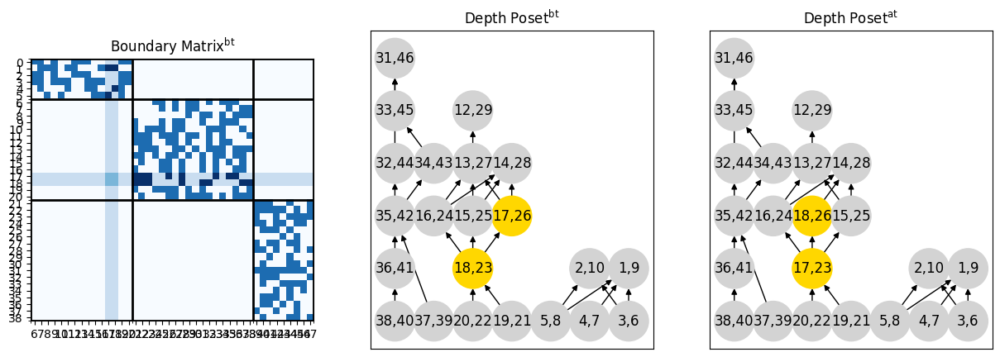

### Birth Death Pairs
|                          |                                                                                                                                                                                                                         |
|:-------------------------|:------------------------------------------------------------------------------------------------------------------------------------------------------------------------------------------------------------------------|
| Before the transposition | $\{(13, 27), (18, 23), (33, 45), (35, 42), (14, 28), (19, 21), (1, 9), (34, 43), (37, 39), (3, 6), (20, 22), (38, 40), (17, 26), (31, 46), (2, 10), (15, 25), (16, 24), (32, 44), (4, 7), (5, 8), (12, 29), (36, 41)\}$ |
| After the transposition  | $\{(13, 27), (33, 45), (35, 42), (18, 26), (14, 28), (19, 21), (1, 9), (34, 43), (37, 39), (3, 6), (20, 22), (38, 40), (17, 23), (31, 46), (2, 10), (15, 25), (16, 24), (32, 44), (4, 7), (5, 8), (12, 29), (36, 41)\}$ |

### Relations
|                          | Algorithm 1                                                                                                                                                                                                                                                                                                                                                                                                                        | Algorithm 2                                                                                                                                                                                                                                                                                                                                                                                                                                                  |
|:-------------------------|:-----------------------------------------------------------------------------------------------------------------------------------------------------------------------------------------------------------------------------------------------------------------------------------------------------------------------------------------------------------------------------------------------------------------------------------|:-------------------------------------------------------------------------------------------------------------------------------------------------------------------------------------------------------------------------------------------------------------------------------------------------------------------------------------------------------------------------------------------------------------------------------------------------------------|
| Before the transposition | $\{(25, 29), (42, 45), (41, 43), (24, 27), (43, 46), (21, 25), (23, 28), (40, 44), (39, 42), (22, 26), (23, 25), (22, 29), (40, 47), (39, 45), (9, 11), (25, 28), (24, 29), (42, 44), (44, 47), (43, 45), (21, 24), (21, 27), (23, 24), (23, 30), (10, 11), (24, 28), (41, 44), (25, 27), (42, 43), (6, 10), (41, 47), (25, 30), (21, 26), (22, 27), (21, 29), (22, 30), (40, 45), (8, 10), (45, 47), (7, 11), (6, 9)\}$           | $\{(32, 31), (20, 11), (18, 17), (20, 14), (20, 17), (38, 35), (38, 32), (5, 1), (17, 12), (19, 12), (19, 18), (36, 31), (15, 11), (15, 14), (35, 32), (20, 13), (18, 13), (3, 0), (38, 31), (17, 11), (17, 14), (19, 11), (19, 14), (34, 33), (19, 17), (15, 13), (18, 12), (33, 31), (20, 12), (3, 2), (20, 18), (4, 1), (20, 15), (38, 30), (38, 33), (35, 34), (38, 36), (17, 13), (2, 0), (19, 16), (36, 32), (37, 31), (36, 35), (13, 12), (18, 11)\}$ |
| After the transposition  | $\{(25, 29), (42, 45), (41, 43), (24, 27), (43, 46), (21, 25), (23, 28), (40, 44), (39, 42), (22, 26), (23, 25), (40, 47), (22, 29), (39, 45), (9, 11), (25, 28), (24, 29), (42, 44), (44, 47), (43, 45), (21, 24), (21, 27), (23, 24), (23, 30), (10, 11), (24, 28), (41, 44), (25, 27), (42, 43), (6, 10), (41, 47), (25, 30), (21, 26), (22, 27), (21, 29), (23, 26), (22, 30), (40, 45), (8, 10), (45, 47), (7, 11), (6, 9)\}$ | $\{(32, 31), (20, 11), (20, 14), (38, 35), (20, 17), (38, 32), (5, 1), (17, 12), (19, 12), (19, 18), (17, 18), (36, 31), (15, 11), (15, 14), (35, 32), (20, 13), (3, 0), (38, 31), (17, 11), (19, 11), (19, 14), (34, 33), (19, 17), (15, 13), (33, 31), (20, 12), (20, 18), (3, 2), (4, 1), (20, 15), (38, 30), (38, 33), (35, 34), (38, 36), (17, 13), (2, 0), (19, 16), (36, 32), (37, 31), (36, 35), (13, 12), (18, 14)\}$                               |

### Successors and Predecessers
|                 | $\text{Set}^\text{bt}(17, 26)$                                       | $\text{Set}^\text{bt}(18, 23)$                                       | $\text{Set}^\text{at}(17, 23)$                                                 | $\text{Set}^\text{at}(18, 26)$                                       |
|:----------------|:---------------------------------------------------------------------|:---------------------------------------------------------------------|:-------------------------------------------------------------------------------|:---------------------------------------------------------------------|
| $\text{Succ}_1$ | $\text{Succ}_1^\text{bt}(17, 26) = \emptyset$                        | $\text{Succ}_1^\text{bt}(18, 23) = \{(16, 24), (15, 25), (14, 28)\}$ | $\text{Succ}_1^\text{at}(17, 23) = \{(18, 26), (16, 24), (15, 25), (14, 28)\}$ | $\text{Succ}_1^\text{at}(18, 26) = \emptyset$                        |
| $\text{Pred}_1$ | $\text{Pred}_1^\text{bt}(17, 26) = \{(20, 22), (19, 21)\}$           | $\text{Pred}_1^\text{bt}(18, 23) = \emptyset$                        | $\text{Pred}_1^\text{at}(17, 23) = \emptyset$                                  | $\text{Pred}_1^\text{at}(18, 26) = \{(20, 22), (17, 23), (19, 21)\}$ |
| $\text{Succ}_2$ | $\text{Succ}_2^\text{bt}(17, 26) = \{(13, 27), (12, 29), (14, 28)\}$ | $\text{Succ}_2^\text{bt}(18, 23) = \{(13, 27), (12, 29), (17, 26)\}$ | $\text{Succ}_2^\text{at}(17, 23) = \{(18, 26), (13, 27), (12, 29)\}$           | $\text{Succ}_2^\text{at}(18, 26) = \{(14, 28)\}$                     |
| $\text{Pred}_2$ | $\text{Pred}_2^\text{bt}(17, 26) = \{(20, 22), (19, 21), (18, 23)\}$ | $\text{Pred}_2^\text{bt}(18, 23) = \{(20, 22), (19, 21)\}$           | $\text{Pred}_2^\text{at}(17, 23) = \{(20, 22), (19, 21)\}$                     | $\text{Pred}_2^\text{at}(18, 26) = \{(20, 22), (17, 23), (19, 21)\}$ |

### Temp Sets
|                                                               | Before the Transposition                                          | After the Transposition                                           |
|:--------------------------------------------------------------|:------------------------------------------------------------------|:------------------------------------------------------------------|
| $\mathcal{L} = \{(s, t)\in \text{BD}:\; f(t) < f(y)\}$        | $\{(5, 8), (2, 10), (4, 7), (3, 6), (20, 22), (19, 21), (1, 9)\}$ | $\{(5, 8), (2, 10), (4, 7), (3, 6), (20, 22), (19, 21), (1, 9)\}$ |
| $\mathcal{M} = \{(s, t)\in \text{BD}:\; f(y) < f(t) < f(b)\}$ | $\{(16, 24), (15, 25)\}$                                          | $\{(16, 24), (15, 25)\}$                                          |

### Equations
There are 1 equations are wrong.

| eq   | left (formula)                  | left (paramatrized)               | left (value)                                 | right (formula)                                                                                           | right (paramatrized)                                                                                            | right (value)                                | correct   |
|:-----|:--------------------------------|:----------------------------------|:---------------------------------------------|:----------------------------------------------------------------------------------------------------------|:----------------------------------------------------------------------------------------------------------------|:---------------------------------------------|:----------|
| Eq08 | $\text{Succ}_1^\text{at}(a, y)$ | $\text{Succ}_1^\text{at}(17, 23)$ | $\{(18, 26), (16, 24), (15, 25), (14, 28)\}$ | $\text{Succ}_1^\text{bt}(x, y) \oplus \{(x, b)\} \oplus \text{Succ}_1^\text{bt}(a, b)$                    | $\text{Succ}_1^\text{bt}(18, 23) \oplus \{(18, 26)\} \oplus \text{Succ}_1^\text{bt}(17, 26)$                    | $\{(18, 26), (16, 24), (15, 25), (14, 28)\}$ | ✔         |
| Eq09 | $\text{Succ}_1^\text{at}(x, b)$ | $\text{Succ}_1^\text{at}(18, 26)$ | $\emptyset$                                  | $\text{Succ}_1^\text{bt}(a, b)$                                                                           | $\text{Succ}_1^\text{bt}(17, 26)$                                                                               | $\emptyset$                                  | ✔         |
| Eq10 | $\text{Pred}_1^\text{at}(a, y)$ | $\text{Pred}_1^\text{at}(17, 23)$ | $\emptyset$                                  | $\text{Pred}_1^\text{bt}(x, y)$                                                                           | $\text{Pred}_1^\text{bt}(18, 23)$                                                                               | $\emptyset$                                  | ✔         |
| Eq11 | $\text{Pred}_1^\text{at}(x, b)$ | $\text{Pred}_1^\text{at}(18, 26)$ | $\{(20, 22), (17, 23), (19, 21)\}$           | $\text{Pred}_1^\text{bt}(a, b) \oplus \{(a, y)\}$                                                         | $\text{Pred}_1^\text{bt}(17, 26) \oplus \{(17, 23)\}$                                                           | $\{(20, 22), (17, 23), (19, 21)\}$           | ✔         |
| Eq12 | $\text{Succ}_2^\text{at}(a, y)$ | $\text{Succ}_2^\text{at}(17, 23)$ | $\{(18, 26), (13, 27), (12, 29)\}$           | $\text{Succ}_2^\text{bt}(x, y) \oplus \{(x, b), (a, b)\}$                                                 | $\text{Succ}_2^\text{bt}(18, 23) \oplus \{(18, 26), (17, 26)\}$                                                 | $\{(18, 26), (13, 27), (12, 29)\}$           | ✔         |
| Eq13 | $\text{Succ}_2^\text{at}(x, b)$ | $\text{Succ}_2^\text{at}(18, 26)$ | $\{(14, 28)\}$                               | $\text{Succ}_2^\text{bt}(a, b)$                                                                           | $\text{Succ}_2^\text{bt}(17, 26)$                                                                               | $\{(13, 27), (12, 29), (14, 28)\}$           | ✘         |
| Eq14 | $\text{Pred}_2^\text{at}(a, y)$ | $\text{Pred}_2^\text{at}(17, 23)$ | $\{(20, 22), (19, 21)\}$                     | $[\text{Pred}_2^\text{bt}(a, b) \cap \mathcal{L}]$                                                        | $[\text{Pred}_2^\text{bt}(17, 26) \cap \mathcal{L}]$                                                            | $\{(20, 22), (19, 21)\}$                     | ✔         |
| Eq15 | $\text{Pred}_2^\text{at}(x, b)$ | $\text{Pred}_2^\text{at}(18, 26)$ | $\{(20, 22), (17, 23), (19, 21)\}$           | $\text{Pred}_2^\text{bt}(x, y) \oplus \{(a, y)\} \oplus [\text{Pred}_2^\text{bt}(a, b) \cap \mathcal{M}]$ | $\text{Pred}_2^\text{bt}(18, 23) \oplus \{(17, 23)\} \oplus [\text{Pred}_2^\text{bt}(17, 26) \cap \mathcal{M}]$ | $\{(20, 22), (17, 23), (19, 21)\}$           | ✔         |

## Transposition <18, 19> in complex 10
Here is a __birth-birth__ __switch forward__ transposition <18, 19>.

$$
a = 18, \; b = 23, \; x = 19, \; y = 21
$$

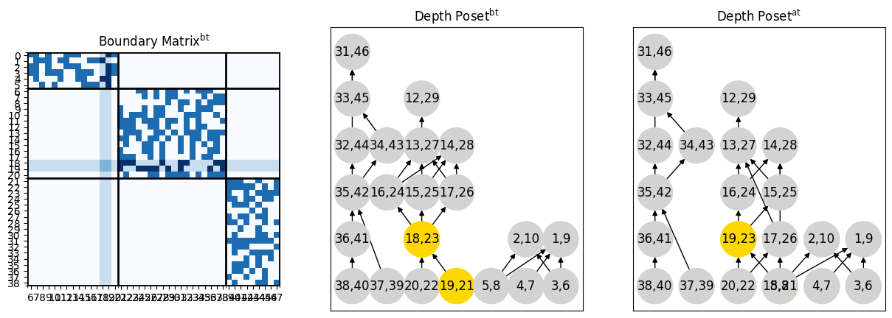

### Birth Death Pairs
|                          |                                                                                                                                                                                                                         |
|:-------------------------|:------------------------------------------------------------------------------------------------------------------------------------------------------------------------------------------------------------------------|
| Before the transposition | $\{(13, 27), (18, 23), (33, 45), (35, 42), (14, 28), (19, 21), (1, 9), (34, 43), (37, 39), (3, 6), (20, 22), (38, 40), (17, 26), (31, 46), (2, 10), (15, 25), (16, 24), (32, 44), (4, 7), (5, 8), (12, 29), (36, 41)\}$ |
| After the transposition  | $\{(13, 27), (33, 45), (35, 42), (14, 28), (1, 9), (34, 43), (37, 39), (3, 6), (20, 22), (38, 40), (17, 26), (19, 23), (31, 46), (2, 10), (15, 25), (16, 24), (18, 21), (32, 44), (4, 7), (5, 8), (12, 29), (36, 41)\}$ |

### Relations
|                          | Algorithm 1                                                                                                                                                                                                                                                                                                                                                                                                                        | Algorithm 2                                                                                                                                                                                                                                                                                                                                                                                                                                                  |
|:-------------------------|:-----------------------------------------------------------------------------------------------------------------------------------------------------------------------------------------------------------------------------------------------------------------------------------------------------------------------------------------------------------------------------------------------------------------------------------|:-------------------------------------------------------------------------------------------------------------------------------------------------------------------------------------------------------------------------------------------------------------------------------------------------------------------------------------------------------------------------------------------------------------------------------------------------------------|
| Before the transposition | $\{(25, 29), (42, 45), (41, 43), (24, 27), (43, 46), (21, 25), (23, 28), (40, 44), (39, 42), (22, 26), (23, 25), (22, 29), (40, 47), (39, 45), (9, 11), (25, 28), (24, 29), (42, 44), (44, 47), (43, 45), (21, 24), (21, 27), (23, 24), (23, 30), (10, 11), (24, 28), (41, 44), (25, 27), (42, 43), (6, 10), (41, 47), (25, 30), (21, 26), (22, 27), (21, 29), (22, 30), (40, 45), (8, 10), (45, 47), (7, 11), (6, 9)\}$           | $\{(32, 31), (20, 11), (18, 17), (20, 14), (20, 17), (38, 35), (38, 32), (5, 1), (17, 12), (19, 12), (19, 18), (36, 31), (15, 11), (15, 14), (35, 32), (20, 13), (18, 13), (3, 0), (38, 31), (17, 11), (17, 14), (19, 11), (19, 14), (34, 33), (19, 17), (15, 13), (18, 12), (33, 31), (20, 12), (3, 2), (20, 18), (4, 1), (20, 15), (38, 30), (38, 33), (35, 34), (38, 36), (17, 13), (2, 0), (19, 16), (36, 32), (37, 31), (36, 35), (13, 12), (18, 11)\}$ |
| After the transposition  | $\{(25, 29), (42, 45), (41, 43), (24, 27), (43, 46), (21, 28), (23, 28), (40, 44), (39, 42), (22, 26), (23, 25), (40, 47), (22, 29), (39, 45), (9, 11), (25, 28), (24, 29), (42, 44), (44, 47), (43, 45), (21, 30), (21, 27), (23, 24), (23, 30), (10, 11), (24, 28), (41, 44), (25, 27), (42, 43), (6, 10), (41, 47), (25, 30), (21, 23), (21, 26), (22, 27), (21, 29), (22, 30), (40, 45), (8, 10), (45, 47), (7, 11), (6, 9)\}$ | $\{(32, 31), (18, 17), (38, 35), (38, 32), (5, 1), (17, 12), (36, 31), (15, 11), (15, 14), (18, 16), (35, 32), (20, 13), (18, 19), (3, 0), (20, 16), (38, 31), (20, 19), (17, 11), (17, 14), (34, 33), (19, 14), (15, 13), (18, 12), (33, 31), (3, 2), (38, 30), (4, 1), (35, 34), (20, 15), (38, 33), (38, 36), (17, 13), (2, 0), (19, 16), (36, 32), (19, 13), (37, 31), (36, 35), (13, 12), (18, 11), (18, 14)\}$                                         |

### Successors and Predecessers
|                 | $\text{Set}^\text{bt}(18, 23)$                                       | $\text{Set}^\text{bt}(19, 21)$                                                           | $\text{Set}^\text{at}(18, 21)$                                                           | $\text{Set}^\text{at}(19, 23)$                                       |
|:----------------|:---------------------------------------------------------------------|:-----------------------------------------------------------------------------------------|:-----------------------------------------------------------------------------------------|:---------------------------------------------------------------------|
| $\text{Succ}_1$ | $\text{Succ}_1^\text{bt}(18, 23) = \{(16, 24), (15, 25), (14, 28)\}$ | $\text{Succ}_1^\text{bt}(19, 21) = \{(13, 27), (17, 26), (12, 29), (15, 25), (16, 24)\}$ | $\text{Succ}_1^\text{at}(18, 21) = \{(13, 27), (17, 26), (19, 23), (12, 29), (14, 28)\}$ | $\text{Succ}_1^\text{at}(19, 23) = \{(16, 24), (15, 25), (14, 28)\}$ |
| $\text{Pred}_1$ | $\text{Pred}_1^\text{bt}(18, 23) = \emptyset$                        | $\text{Pred}_1^\text{bt}(19, 21) = \emptyset$                                            | $\text{Pred}_1^\text{at}(18, 21) = \emptyset$                                            | $\text{Pred}_1^\text{at}(19, 23) = \{(18, 21)\}$                     |
| $\text{Succ}_2$ | $\text{Succ}_2^\text{bt}(18, 23) = \{(13, 27), (12, 29), (17, 26)\}$ | $\text{Succ}_2^\text{bt}(19, 21) = \{(18, 23), (17, 26), (12, 29), (14, 28), (16, 24)\}$ | $\text{Succ}_2^\text{at}(18, 21) = \{(17, 26), (19, 23), (12, 29), (14, 28), (16, 24)\}$ | $\text{Succ}_2^\text{at}(19, 23) = \{(16, 24), (13, 27), (14, 28)\}$ |
| $\text{Pred}_2$ | $\text{Pred}_2^\text{bt}(18, 23) = \{(20, 22), (19, 21)\}$           | $\text{Pred}_2^\text{bt}(19, 21) = \emptyset$                                            | $\text{Pred}_2^\text{at}(18, 21) = \emptyset$                                            | $\text{Pred}_2^\text{at}(19, 23) = \{(20, 22), (18, 21)\}$           |

### Temp Sets
|                                                               | Before the Transposition                      | After the Transposition                       |
|:--------------------------------------------------------------|:----------------------------------------------|:----------------------------------------------|
| $\mathcal{L} = \{(s, t)\in \text{BD}:\; f(t) < f(y)\}$        | $\{(5, 8), (2, 10), (4, 7), (3, 6), (1, 9)\}$ | $\{(5, 8), (2, 10), (4, 7), (3, 6), (1, 9)\}$ |
| $\mathcal{M} = \{(s, t)\in \text{BD}:\; f(y) < f(t) < f(b)\}$ | $\{(20, 22)\}$                                | $\{(20, 22)\}$                                |

### Equations
There are 1 equations are wrong.

| eq   | left (formula)                  | left (paramatrized)               | left (value)                                           | right (formula)                                                                                           | right (paramatrized)                                                                                            | right (value)                                          | correct   |
|:-----|:--------------------------------|:----------------------------------|:-------------------------------------------------------|:----------------------------------------------------------------------------------------------------------|:----------------------------------------------------------------------------------------------------------------|:-------------------------------------------------------|:----------|
| Eq08 | $\text{Succ}_1^\text{at}(a, y)$ | $\text{Succ}_1^\text{at}(18, 21)$ | $\{(13, 27), (17, 26), (19, 23), (12, 29), (14, 28)\}$ | $\text{Succ}_1^\text{bt}(x, y) \oplus \{(x, b)\} \oplus \text{Succ}_1^\text{bt}(a, b)$                    | $\text{Succ}_1^\text{bt}(19, 21) \oplus \{(19, 23)\} \oplus \text{Succ}_1^\text{bt}(18, 23)$                    | $\{(13, 27), (17, 26), (19, 23), (12, 29), (14, 28)\}$ | ✔         |
| Eq09 | $\text{Succ}_1^\text{at}(x, b)$ | $\text{Succ}_1^\text{at}(19, 23)$ | $\{(16, 24), (15, 25), (14, 28)\}$                     | $\text{Succ}_1^\text{bt}(a, b)$                                                                           | $\text{Succ}_1^\text{bt}(18, 23)$                                                                               | $\{(16, 24), (15, 25), (14, 28)\}$                     | ✔         |
| Eq10 | $\text{Pred}_1^\text{at}(a, y)$ | $\text{Pred}_1^\text{at}(18, 21)$ | $\emptyset$                                            | $\text{Pred}_1^\text{bt}(x, y)$                                                                           | $\text{Pred}_1^\text{bt}(19, 21)$                                                                               | $\emptyset$                                            | ✔         |
| Eq11 | $\text{Pred}_1^\text{at}(x, b)$ | $\text{Pred}_1^\text{at}(19, 23)$ | $\{(18, 21)\}$                                         | $\text{Pred}_1^\text{bt}(a, b) \oplus \{(a, y)\}$                                                         | $\text{Pred}_1^\text{bt}(18, 23) \oplus \{(18, 21)\}$                                                           | $\{(18, 21)\}$                                         | ✔         |
| Eq12 | $\text{Succ}_2^\text{at}(a, y)$ | $\text{Succ}_2^\text{at}(18, 21)$ | $\{(17, 26), (19, 23), (12, 29), (14, 28), (16, 24)\}$ | $\text{Succ}_2^\text{bt}(x, y) \oplus \{(x, b), (a, b)\}$                                                 | $\text{Succ}_2^\text{bt}(19, 21) \oplus \{(19, 23), (18, 23)\}$                                                 | $\{(17, 26), (19, 23), (12, 29), (14, 28), (16, 24)\}$ | ✔         |
| Eq13 | $\text{Succ}_2^\text{at}(x, b)$ | $\text{Succ}_2^\text{at}(19, 23)$ | $\{(16, 24), (13, 27), (14, 28)\}$                     | $\text{Succ}_2^\text{bt}(a, b)$                                                                           | $\text{Succ}_2^\text{bt}(18, 23)$                                                                               | $\{(13, 27), (12, 29), (17, 26)\}$                     | ✘         |
| Eq14 | $\text{Pred}_2^\text{at}(a, y)$ | $\text{Pred}_2^\text{at}(18, 21)$ | $\emptyset$                                            | $[\text{Pred}_2^\text{bt}(a, b) \cap \mathcal{L}]$                                                        | $[\text{Pred}_2^\text{bt}(18, 23) \cap \mathcal{L}]$                                                            | $\emptyset$                                            | ✔         |
| Eq15 | $\text{Pred}_2^\text{at}(x, b)$ | $\text{Pred}_2^\text{at}(19, 23)$ | $\{(20, 22), (18, 21)\}$                               | $\text{Pred}_2^\text{bt}(x, y) \oplus \{(a, y)\} \oplus [\text{Pred}_2^\text{bt}(a, b) \cap \mathcal{M}]$ | $\text{Pred}_2^\text{bt}(19, 21) \oplus \{(18, 21)\} \oplus [\text{Pred}_2^\text{bt}(18, 23) \cap \mathcal{M}]$ | $\{(20, 22), (18, 21)\}$                               | ✔         |

## Transposition <23, 24> in complex 10
Here is a __death-death__ __switch forward__ transposition <23, 24>.

$$
a = 16, \; b = 24, \; x = 18, \; y = 23
$$

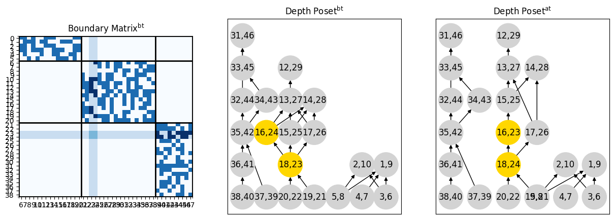

### Birth Death Pairs
|                          |                                                                                                                                                                                                                         |
|:-------------------------|:------------------------------------------------------------------------------------------------------------------------------------------------------------------------------------------------------------------------|
| Before the transposition | $\{(13, 27), (18, 23), (33, 45), (35, 42), (14, 28), (19, 21), (1, 9), (34, 43), (37, 39), (3, 6), (20, 22), (38, 40), (17, 26), (31, 46), (2, 10), (15, 25), (16, 24), (32, 44), (4, 7), (5, 8), (12, 29), (36, 41)\}$ |
| After the transposition  | $\{(13, 27), (33, 45), (35, 42), (14, 28), (19, 21), (1, 9), (34, 43), (37, 39), (3, 6), (20, 22), (38, 40), (17, 26), (31, 46), (2, 10), (15, 25), (32, 44), (4, 7), (18, 24), (5, 8), (12, 29), (36, 41), (16, 23)\}$ |

### Relations
|                          | Algorithm 1                                                                                                                                                                                                                                                                                                                                                                                                                        | Algorithm 2                                                                                                                                                                                                                                                                                                                                                                                                                                                            |
|:-------------------------|:-----------------------------------------------------------------------------------------------------------------------------------------------------------------------------------------------------------------------------------------------------------------------------------------------------------------------------------------------------------------------------------------------------------------------------------|:-----------------------------------------------------------------------------------------------------------------------------------------------------------------------------------------------------------------------------------------------------------------------------------------------------------------------------------------------------------------------------------------------------------------------------------------------------------------------|
| Before the transposition | $\{(25, 29), (42, 45), (41, 43), (24, 27), (43, 46), (21, 25), (23, 28), (40, 44), (39, 42), (22, 26), (23, 25), (22, 29), (40, 47), (39, 45), (9, 11), (25, 28), (24, 29), (42, 44), (44, 47), (43, 45), (21, 24), (21, 27), (23, 24), (23, 30), (10, 11), (24, 28), (41, 44), (25, 27), (42, 43), (6, 10), (41, 47), (25, 30), (21, 26), (22, 27), (21, 29), (22, 30), (40, 45), (8, 10), (45, 47), (7, 11), (6, 9)\}$           | $\{(32, 31), (20, 11), (18, 17), (20, 14), (20, 17), (38, 35), (38, 32), (5, 1), (17, 12), (19, 12), (19, 18), (36, 31), (15, 11), (15, 14), (35, 32), (20, 13), (18, 13), (3, 0), (38, 31), (17, 11), (17, 14), (19, 11), (19, 14), (34, 33), (19, 17), (15, 13), (18, 12), (33, 31), (20, 12), (3, 2), (20, 18), (4, 1), (20, 15), (38, 30), (38, 33), (35, 34), (38, 36), (17, 13), (2, 0), (19, 16), (36, 32), (37, 31), (36, 35), (13, 12), (18, 11)\}$           |
| After the transposition  | $\{(24, 30), (25, 29), (42, 45), (41, 43), (43, 46), (21, 25), (40, 44), (39, 42), (22, 26), (23, 25), (40, 47), (22, 29), (39, 45), (9, 11), (24, 23), (25, 28), (42, 44), (44, 47), (43, 45), (21, 24), (21, 27), (23, 30), (23, 27), (10, 11), (24, 25), (24, 28), (6, 10), (41, 44), (25, 27), (42, 43), (41, 47), (25, 30), (21, 26), (22, 27), (21, 29), (22, 30), (23, 29), (40, 45), (8, 10), (45, 47), (7, 11), (6, 9)\}$ | $\{(32, 31), (20, 11), (18, 17), (20, 14), (20, 17), (38, 35), (38, 32), (5, 1), (17, 12), (19, 12), (19, 18), (36, 31), (15, 11), (15, 14), (18, 16), (35, 32), (20, 13), (18, 13), (3, 0), (38, 31), (17, 11), (17, 14), (19, 11), (19, 14), (34, 33), (19, 17), (15, 13), (18, 12), (33, 31), (20, 12), (3, 2), (20, 18), (4, 1), (20, 15), (38, 30), (38, 33), (35, 34), (38, 36), (17, 13), (2, 0), (19, 16), (36, 32), (37, 31), (36, 35), (13, 12), (18, 11)\}$ |

### Successors and Predecessers
|                 | $\text{Set}^\text{bt}(16, 24)$                                       | $\text{Set}^\text{bt}(18, 23)$                                       | $\text{Set}^\text{at}(18, 24)$                                                 | $\text{Set}^\text{at}(16, 23)$                                       |
|:----------------|:---------------------------------------------------------------------|:---------------------------------------------------------------------|:-------------------------------------------------------------------------------|:---------------------------------------------------------------------|
| $\text{Succ}_1$ | $\text{Succ}_1^\text{bt}(16, 24) = \{(13, 27), (12, 29), (14, 28)\}$ | $\text{Succ}_1^\text{bt}(18, 23) = \{(16, 24), (15, 25), (14, 28)\}$ | $\text{Succ}_1^\text{at}(18, 24) = \{(16, 23), (15, 25), (14, 28)\}$           | $\text{Succ}_1^\text{at}(16, 23) = \{(13, 27), (12, 29), (15, 25)\}$ |
| $\text{Pred}_1$ | $\text{Pred}_1^\text{bt}(16, 24) = \{(19, 21), (18, 23)\}$           | $\text{Pred}_1^\text{bt}(18, 23) = \emptyset$                        | $\text{Pred}_1^\text{at}(18, 24) = \{(19, 21)\}$                               | $\text{Pred}_1^\text{at}(16, 23) = \{(18, 24)\}$                     |
| $\text{Succ}_2$ | $\text{Succ}_2^\text{bt}(16, 24) = \emptyset$                        | $\text{Succ}_2^\text{bt}(18, 23) = \{(13, 27), (12, 29), (17, 26)\}$ | $\text{Succ}_2^\text{at}(18, 24) = \{(13, 27), (12, 29), (17, 26), (16, 23)\}$ | $\text{Succ}_2^\text{at}(16, 23) = \emptyset$                        |
| $\text{Pred}_2$ | $\text{Pred}_2^\text{bt}(16, 24) = \{(19, 21)\}$                     | $\text{Pred}_2^\text{bt}(18, 23) = \{(20, 22), (19, 21)\}$           | $\text{Pred}_2^\text{at}(18, 24) = \{(20, 22), (19, 21)\}$                     | $\text{Pred}_2^\text{at}(16, 23) = \{(19, 21), (18, 24)\}$           |

### Temp Sets
|                                                               | Before the Transposition                                                                                 | After the Transposition                                                                                  |
|:--------------------------------------------------------------|:---------------------------------------------------------------------------------------------------------|:---------------------------------------------------------------------------------------------------------|
| $\mathcal{B} = \{(s, t)\in \text{BD}:\; f(s) > f(x)\}$        | $\{(34, 43), (37, 39), (33, 45), (35, 42), (31, 46), (38, 40), (20, 22), (36, 41), (32, 44), (19, 21)\}$ | $\{(34, 43), (37, 39), (33, 45), (35, 42), (31, 46), (38, 40), (20, 22), (36, 41), (32, 44), (19, 21)\}$ |
| $\mathcal{N} = \{(s, t)\in \text{BD}:\; f(x) > f(s) > f(a)\}$ | $\{(17, 26)\}$                                                                                           | $\{(17, 26)\}$                                                                                           |

### Equations
There are 1 equations are wrong.

| eq   | left (formula)                  | left (paramatrized)               | left (value)                                 | right (formula)                                                                                          | right (paramatrized)                                                                                           | right (value)                                | correct   |
|:-----|:--------------------------------|:----------------------------------|:---------------------------------------------|:---------------------------------------------------------------------------------------------------------|:---------------------------------------------------------------------------------------------------------------|:---------------------------------------------|:----------|
| Eq28 | $\text{Succ}_1^\text{at}(x, b)$ | $\text{Succ}_1^\text{at}(18, 24)$ | $\{(16, 23), (15, 25), (14, 28)\}$           | $\text{Succ}_1^\text{bt}(x, y) \oplus \{(a, y), (a, b)\}$                                                | $\text{Succ}_1^\text{bt}(18, 23) \oplus \{(16, 23), (16, 24)\}$                                                | $\{(16, 23), (15, 25), (14, 28)\}$           | ✔         |
| Eq29 | $\text{Succ}_1^\text{at}(a, y)$ | $\text{Succ}_1^\text{at}(16, 23)$ | $\{(13, 27), (12, 29), (15, 25)\}$           | $\text{Succ}_1^\text{bt}(a, b)$                                                                          | $\text{Succ}_1^\text{bt}(16, 24)$                                                                              | $\{(13, 27), (12, 29), (14, 28)\}$           | ✘         |
| Eq30 | $\text{Pred}_1^\text{at}(x, b)$ | $\text{Pred}_1^\text{at}(18, 24)$ | $\{(19, 21)\}$                               | $[\text{Pred}_1^\text{bt}(a, b) \cap \mathcal{B}]$                                                       | $[\text{Pred}_1^\text{bt}(16, 24) \cap \mathcal{B}]$                                                           | $\{(19, 21)\}$                               | ✔         |
| Eq31 | $\text{Pred}_1^\text{at}(a, y)$ | $\text{Pred}_1^\text{at}(16, 23)$ | $\{(18, 24)\}$                               | $\text{Pred}_1^\text{bt}(x, y) \oplus \{(x, b)\} \oplus[\text{Pred}_1^\text{bt}(a, b) \cap \mathcal{N}]$ | $\text{Pred}_1^\text{bt}(18, 23) \oplus \{(18, 24)\} \oplus[\text{Pred}_1^\text{bt}(16, 24) \cap \mathcal{N}]$ | $\{(18, 24)\}$                               | ✔         |
| Eq32 | $\text{Succ}_2^\text{at}(x, b)$ | $\text{Succ}_2^\text{at}(18, 24)$ | $\{(13, 27), (12, 29), (17, 26), (16, 23)\}$ | $\text{Succ}_2^\text{bt}(x, y) \oplus \{(a, y)\} \oplus \text{Succ}_2^\text{bt}(a, b)$                   | $\text{Succ}_2^\text{bt}(18, 23) \oplus \{(16, 23)\} \oplus \text{Succ}_2^\text{bt}(16, 24)$                   | $\{(13, 27), (12, 29), (17, 26), (16, 23)\}$ | ✔         |
| Eq33 | $\text{Succ}_2^\text{at}(a, y)$ | $\text{Succ}_2^\text{at}(16, 23)$ | $\emptyset$                                  | $\text{Succ}_2^\text{bt}(a, b)$                                                                          | $\text{Succ}_2^\text{bt}(16, 24)$                                                                              | $\emptyset$                                  | ✔         |
| Eq34 | $\text{Pred}_2^\text{at}(x, b)$ | $\text{Pred}_2^\text{at}(18, 24)$ | $\{(20, 22), (19, 21)\}$                     | $\text{Pred}_2^\text{bt}(x, y)$                                                                          | $\text{Pred}_2^\text{bt}(18, 23)$                                                                              | $\{(20, 22), (19, 21)\}$                     | ✔         |
| Eq35 | $\text{Pred}_2^\text{at}(a, y)$ | $\text{Pred}_2^\text{at}(16, 23)$ | $\{(19, 21), (18, 24)\}$                     | $\text{Pred}_2^\text{bt}(a, b) \oplus \{(x, b)\}$                                                        | $\text{Pred}_2^\text{bt}(16, 24) \oplus \{(18, 24)\}$                                                          | $\{(19, 21), (18, 24)\}$                     | ✔         |

## Transposition <27, 28> in complex 10
Here is a __death-death__ __no switch__ transposition <27, 28>.

$$
a = 14, \; b = 28, \; x = 13, \; y = 27
$$

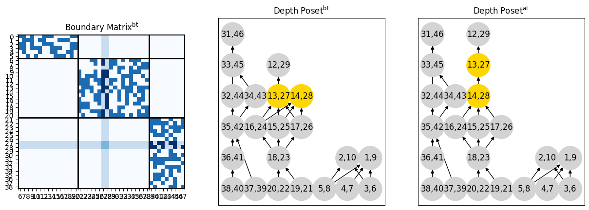

### Birth Death Pairs
|                          |                                                                                                                                                                                                                         |
|:-------------------------|:------------------------------------------------------------------------------------------------------------------------------------------------------------------------------------------------------------------------|
| Before the transposition | $\{(13, 27), (18, 23), (33, 45), (35, 42), (14, 28), (19, 21), (1, 9), (34, 43), (37, 39), (3, 6), (20, 22), (38, 40), (17, 26), (31, 46), (2, 10), (15, 25), (16, 24), (32, 44), (4, 7), (5, 8), (12, 29), (36, 41)\}$ |
| After the transposition  | $\{(13, 27), (18, 23), (33, 45), (35, 42), (14, 28), (19, 21), (1, 9), (34, 43), (37, 39), (3, 6), (20, 22), (38, 40), (17, 26), (31, 46), (2, 10), (15, 25), (16, 24), (32, 44), (4, 7), (5, 8), (12, 29), (36, 41)\}$ |

### Relations
|                          | Algorithm 1                                                                                                                                                                                                                                                                                                                                                                                                              | Algorithm 2                                                                                                                                                                                                                                                                                                                                                                                                                                                                      |
|:-------------------------|:-------------------------------------------------------------------------------------------------------------------------------------------------------------------------------------------------------------------------------------------------------------------------------------------------------------------------------------------------------------------------------------------------------------------------|:---------------------------------------------------------------------------------------------------------------------------------------------------------------------------------------------------------------------------------------------------------------------------------------------------------------------------------------------------------------------------------------------------------------------------------------------------------------------------------|
| Before the transposition | $\{(25, 29), (42, 45), (41, 43), (24, 27), (43, 46), (21, 25), (23, 28), (40, 44), (39, 42), (22, 26), (23, 25), (22, 29), (40, 47), (39, 45), (9, 11), (25, 28), (24, 29), (42, 44), (44, 47), (43, 45), (21, 24), (21, 27), (23, 24), (23, 30), (10, 11), (24, 28), (41, 44), (25, 27), (42, 43), (6, 10), (41, 47), (25, 30), (21, 26), (22, 27), (21, 29), (22, 30), (40, 45), (8, 10), (45, 47), (7, 11), (6, 9)\}$ | $\{(32, 31), (20, 11), (18, 17), (20, 14), (20, 17), (38, 35), (38, 32), (5, 1), (17, 12), (19, 12), (19, 18), (36, 31), (15, 11), (15, 14), (35, 32), (20, 13), (18, 13), (3, 0), (38, 31), (17, 11), (17, 14), (19, 11), (19, 14), (34, 33), (19, 17), (15, 13), (18, 12), (33, 31), (20, 12), (3, 2), (20, 18), (4, 1), (20, 15), (38, 30), (38, 33), (35, 34), (38, 36), (17, 13), (2, 0), (19, 16), (36, 32), (37, 31), (36, 35), (13, 12), (18, 11)\}$                     |
| After the transposition  | $\{(25, 29), (42, 45), (41, 43), (24, 27), (43, 46), (21, 25), (23, 28), (40, 44), (39, 42), (22, 26), (23, 25), (40, 47), (22, 29), (39, 45), (9, 11), (25, 28), (24, 29), (42, 44), (44, 47), (43, 45), (21, 24), (21, 27), (23, 24), (23, 30), (10, 11), (24, 28), (41, 44), (25, 27), (42, 43), (6, 10), (41, 47), (25, 30), (21, 26), (22, 27), (21, 29), (22, 30), (40, 45), (8, 10), (45, 47), (7, 11), (6, 9)\}$ | $\{(32, 31), (20, 11), (18, 17), (20, 14), (20, 17), (38, 35), (38, 32), (5, 1), (14, 13), (17, 12), (19, 12), (19, 18), (36, 31), (15, 11), (15, 14), (35, 32), (20, 13), (18, 13), (3, 0), (38, 31), (14, 12), (17, 11), (17, 14), (19, 11), (19, 14), (34, 33), (19, 17), (15, 13), (18, 12), (33, 31), (20, 12), (3, 2), (20, 18), (4, 1), (20, 15), (38, 30), (38, 33), (35, 34), (38, 36), (17, 13), (2, 0), (19, 16), (36, 32), (37, 31), (36, 35), (13, 12), (18, 11)\}$ |

### Successors and Predecessers
No such node in the Depth Poset

### Temp Sets
|                                                               | Before the Transposition                                                                                                                                   | After the Transposition                                                                                                                                    |
|:--------------------------------------------------------------|:-----------------------------------------------------------------------------------------------------------------------------------------------------------|:-----------------------------------------------------------------------------------------------------------------------------------------------------------|
| $\mathcal{B} = \{(s, t)\in \text{BD}:\; f(s) > f(x)\}$        | $\{(34, 43), (37, 39), (18, 23), (17, 26), (33, 45), (35, 42), (31, 46), (16, 24), (38, 40), (15, 25), (14, 28), (20, 22), (36, 41), (32, 44), (19, 21)\}$ | $\{(34, 43), (37, 39), (18, 23), (17, 26), (33, 45), (35, 42), (31, 46), (16, 24), (38, 40), (15, 25), (14, 28), (20, 22), (36, 41), (32, 44), (19, 21)\}$ |
| $\mathcal{N} = \{(s, t)\in \text{BD}:\; f(x) > f(s) > f(a)\}$ | $\emptyset$                                                                                                                                                | $\emptyset$                                                                                                                                                |

### Equations
There are 2 equations are wrong.

| eq   | left (formula)                  | left (paramatrized)               | left (value)                                 | right (formula)                                                                        | right (paramatrized)                                                                         | right (value)                                          | correct   |
|:-----|:--------------------------------|:----------------------------------|:---------------------------------------------|:---------------------------------------------------------------------------------------|:---------------------------------------------------------------------------------------------|:-------------------------------------------------------|:----------|
| Eq36 | $\text{Succ}_2^\text{at}(x, y)$ | $\text{Succ}_2^\text{at}(13, 27)$ | $\{(12, 29)\}$                               | $\text{Succ}_2^\text{bt}(x, y) \oplus \{(a, b)\} \oplus \text{Succ}_2^\text{bt}(a, b)$ | $\text{Succ}_2^\text{bt}(13, 27) \oplus \{(14, 28)\} \oplus \text{Succ}_2^\text{bt}(14, 28)$ | $\{(12, 29), (14, 28)\}$                               | ✘         |
| Eq37 | $\text{Pred}_2^\text{at}(a, b)$ | $\text{Pred}_2^\text{at}(14, 28)$ | $\{(20, 22), (19, 21), (17, 26), (15, 25)\}$ | $\text{Pred}_2^\text{bt}(a, b) \oplus \{(x, y)\}$                                      | $\text{Pred}_2^\text{bt}(14, 28) \oplus \{(13, 27)\}$                                        | $\{(13, 27), (17, 26), (15, 25), (20, 22), (19, 21)\}$ | ✘         |

## Transposition <35, 36> in complex 10
Here is a __birth-birth__ __switch forward__ transposition <35, 36>.

$$
a = 35, \; b = 42, \; x = 36, \; y = 41
$$

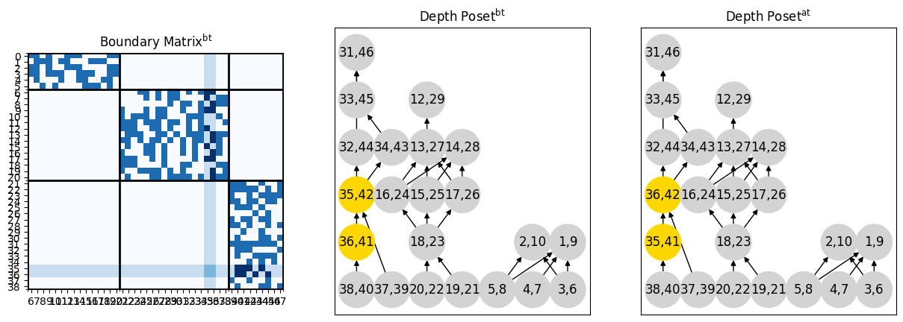

### Birth Death Pairs
|                          |                                                                                                                                                                                                                         |
|:-------------------------|:------------------------------------------------------------------------------------------------------------------------------------------------------------------------------------------------------------------------|
| Before the transposition | $\{(13, 27), (18, 23), (33, 45), (35, 42), (14, 28), (19, 21), (1, 9), (34, 43), (37, 39), (3, 6), (20, 22), (38, 40), (17, 26), (31, 46), (2, 10), (15, 25), (16, 24), (32, 44), (4, 7), (5, 8), (12, 29), (36, 41)\}$ |
| After the transposition  | $\{(13, 27), (18, 23), (33, 45), (14, 28), (19, 21), (1, 9), (34, 43), (37, 39), (35, 41), (20, 22), (38, 40), (3, 6), (17, 26), (31, 46), (2, 10), (36, 42), (15, 25), (16, 24), (32, 44), (4, 7), (5, 8), (12, 29)\}$ |

### Relations
|                          | Algorithm 1                                                                                                                                                                                                                                                                                                                                                                                                              | Algorithm 2                                                                                                                                                                                                                                                                                                                                                                                                                                                  |
|:-------------------------|:-------------------------------------------------------------------------------------------------------------------------------------------------------------------------------------------------------------------------------------------------------------------------------------------------------------------------------------------------------------------------------------------------------------------------|:-------------------------------------------------------------------------------------------------------------------------------------------------------------------------------------------------------------------------------------------------------------------------------------------------------------------------------------------------------------------------------------------------------------------------------------------------------------|
| Before the transposition | $\{(25, 29), (42, 45), (41, 43), (24, 27), (43, 46), (21, 25), (23, 28), (40, 44), (39, 42), (22, 26), (23, 25), (22, 29), (40, 47), (39, 45), (9, 11), (25, 28), (24, 29), (42, 44), (44, 47), (43, 45), (21, 24), (21, 27), (23, 24), (23, 30), (10, 11), (24, 28), (41, 44), (25, 27), (42, 43), (6, 10), (41, 47), (25, 30), (21, 26), (22, 27), (21, 29), (22, 30), (40, 45), (8, 10), (45, 47), (7, 11), (6, 9)\}$ | $\{(32, 31), (20, 11), (18, 17), (20, 14), (20, 17), (38, 35), (38, 32), (5, 1), (17, 12), (19, 12), (19, 18), (36, 31), (15, 11), (15, 14), (35, 32), (20, 13), (18, 13), (3, 0), (38, 31), (17, 11), (17, 14), (19, 11), (19, 14), (34, 33), (19, 17), (15, 13), (18, 12), (33, 31), (20, 12), (3, 2), (20, 18), (4, 1), (20, 15), (38, 30), (38, 33), (35, 34), (38, 36), (17, 13), (2, 0), (19, 16), (36, 32), (37, 31), (36, 35), (13, 12), (18, 11)\}$ |
| After the transposition  | $\{(25, 29), (42, 45), (24, 27), (43, 46), (21, 25), (23, 28), (40, 44), (39, 42), (22, 26), (23, 25), (40, 47), (22, 29), (39, 45), (9, 11), (25, 28), (41, 42), (24, 29), (41, 45), (42, 44), (44, 47), (43, 45), (21, 24), (21, 27), (23, 24), (23, 30), (10, 11), (24, 28), (6, 10), (25, 27), (42, 43), (41, 47), (25, 30), (21, 26), (22, 27), (21, 29), (22, 30), (40, 45), (8, 10), (45, 47), (7, 11), (6, 9)\}$ | $\{(32, 31), (20, 11), (18, 17), (20, 14), (35, 36), (20, 17), (38, 35), (38, 32), (5, 1), (17, 12), (19, 12), (19, 18), (36, 31), (36, 34), (15, 11), (15, 14), (35, 32), (20, 13), (18, 13), (3, 0), (38, 31), (17, 11), (17, 14), (19, 11), (19, 14), (34, 33), (19, 17), (15, 13), (18, 12), (33, 31), (35, 31), (20, 12), (3, 2), (20, 18), (4, 1), (20, 15), (38, 30), (38, 33), (38, 36), (17, 13), (2, 0), (19, 16), (37, 31), (13, 12), (18, 11)\}$ |

### Successors and Predecessers
|                 | $\text{Set}^\text{bt}(35, 42)$                                       | $\text{Set}^\text{bt}(36, 41)$                                       | $\text{Set}^\text{at}(35, 41)$                                       | $\text{Set}^\text{at}(36, 42)$                                       |
|:----------------|:---------------------------------------------------------------------|:---------------------------------------------------------------------|:---------------------------------------------------------------------|:---------------------------------------------------------------------|
| $\text{Succ}_1$ | $\text{Succ}_1^\text{bt}(35, 42) = \{(34, 43), (33, 45), (32, 44)\}$ | $\text{Succ}_1^\text{bt}(36, 41) = \{(34, 43), (32, 44)\}$           | $\text{Succ}_1^\text{at}(35, 41) = \{(33, 45), (36, 42)\}$           | $\text{Succ}_1^\text{at}(36, 42) = \{(34, 43), (33, 45), (32, 44)\}$ |
| $\text{Pred}_1$ | $\text{Pred}_1^\text{bt}(35, 42) = \{(37, 39)\}$                     | $\text{Pred}_1^\text{bt}(36, 41) = \emptyset$                        | $\text{Pred}_1^\text{at}(35, 41) = \emptyset$                        | $\text{Pred}_1^\text{at}(36, 42) = \{(37, 39), (35, 41)\}$           |
| $\text{Succ}_2$ | $\text{Succ}_2^\text{bt}(35, 42) = \{(34, 43), (32, 44)\}$           | $\text{Succ}_2^\text{bt}(36, 41) = \{(35, 42), (31, 46), (32, 44)\}$ | $\text{Succ}_2^\text{at}(35, 41) = \{(31, 46), (32, 44), (36, 42)\}$ | $\text{Succ}_2^\text{at}(36, 42) = \{(34, 43), (31, 46)\}$           |
| $\text{Pred}_2$ | $\text{Pred}_2^\text{bt}(35, 42) = \{(38, 40), (36, 41)\}$           | $\text{Pred}_2^\text{bt}(36, 41) = \{(38, 40)\}$                     | $\text{Pred}_2^\text{at}(35, 41) = \{(38, 40)\}$                     | $\text{Pred}_2^\text{at}(36, 42) = \{(38, 40), (35, 41)\}$           |

### Temp Sets
|                                                               | Before the Transposition                                                                                                                                    | After the Transposition                                                                                                                                     |
|:--------------------------------------------------------------|:------------------------------------------------------------------------------------------------------------------------------------------------------------|:------------------------------------------------------------------------------------------------------------------------------------------------------------|
| $\mathcal{L} = \{(s, t)\in \text{BD}:\; f(t) < f(y)\}$        | $\{(13, 27), (37, 39), (18, 23), (17, 26), (5, 8), (14, 28), (2, 10), (16, 24), (12, 29), (4, 7), (38, 40), (15, 25), (3, 6), (20, 22), (19, 21), (1, 9)\}$ | $\{(13, 27), (37, 39), (18, 23), (17, 26), (5, 8), (14, 28), (2, 10), (16, 24), (12, 29), (4, 7), (38, 40), (15, 25), (3, 6), (20, 22), (19, 21), (1, 9)\}$ |
| $\mathcal{M} = \{(s, t)\in \text{BD}:\; f(y) < f(t) < f(b)\}$ | $\emptyset$                                                                                                                                                 | $\emptyset$                                                                                                                                                 |

### Equations
There are 1 equations are wrong.

| eq   | left (formula)                  | left (paramatrized)               | left (value)                       | right (formula)                                                                                           | right (paramatrized)                                                                                            | right (value)                      | correct   |
|:-----|:--------------------------------|:----------------------------------|:-----------------------------------|:----------------------------------------------------------------------------------------------------------|:----------------------------------------------------------------------------------------------------------------|:-----------------------------------|:----------|
| Eq08 | $\text{Succ}_1^\text{at}(a, y)$ | $\text{Succ}_1^\text{at}(35, 41)$ | $\{(33, 45), (36, 42)\}$           | $\text{Succ}_1^\text{bt}(x, y) \oplus \{(x, b)\} \oplus \text{Succ}_1^\text{bt}(a, b)$                    | $\text{Succ}_1^\text{bt}(36, 41) \oplus \{(36, 42)\} \oplus \text{Succ}_1^\text{bt}(35, 42)$                    | $\{(33, 45), (36, 42)\}$           | ✔         |
| Eq09 | $\text{Succ}_1^\text{at}(x, b)$ | $\text{Succ}_1^\text{at}(36, 42)$ | $\{(34, 43), (33, 45), (32, 44)\}$ | $\text{Succ}_1^\text{bt}(a, b)$                                                                           | $\text{Succ}_1^\text{bt}(35, 42)$                                                                               | $\{(34, 43), (33, 45), (32, 44)\}$ | ✔         |
| Eq10 | $\text{Pred}_1^\text{at}(a, y)$ | $\text{Pred}_1^\text{at}(35, 41)$ | $\emptyset$                        | $\text{Pred}_1^\text{bt}(x, y)$                                                                           | $\text{Pred}_1^\text{bt}(36, 41)$                                                                               | $\emptyset$                        | ✔         |
| Eq11 | $\text{Pred}_1^\text{at}(x, b)$ | $\text{Pred}_1^\text{at}(36, 42)$ | $\{(37, 39), (35, 41)\}$           | $\text{Pred}_1^\text{bt}(a, b) \oplus \{(a, y)\}$                                                         | $\text{Pred}_1^\text{bt}(35, 42) \oplus \{(35, 41)\}$                                                           | $\{(37, 39), (35, 41)\}$           | ✔         |
| Eq12 | $\text{Succ}_2^\text{at}(a, y)$ | $\text{Succ}_2^\text{at}(35, 41)$ | $\{(31, 46), (32, 44), (36, 42)\}$ | $\text{Succ}_2^\text{bt}(x, y) \oplus \{(x, b), (a, b)\}$                                                 | $\text{Succ}_2^\text{bt}(36, 41) \oplus \{(36, 42), (35, 42)\}$                                                 | $\{(31, 46), (32, 44), (36, 42)\}$ | ✔         |
| Eq13 | $\text{Succ}_2^\text{at}(x, b)$ | $\text{Succ}_2^\text{at}(36, 42)$ | $\{(34, 43), (31, 46)\}$           | $\text{Succ}_2^\text{bt}(a, b)$                                                                           | $\text{Succ}_2^\text{bt}(35, 42)$                                                                               | $\{(34, 43), (32, 44)\}$           | ✘         |
| Eq14 | $\text{Pred}_2^\text{at}(a, y)$ | $\text{Pred}_2^\text{at}(35, 41)$ | $\{(38, 40)\}$                     | $[\text{Pred}_2^\text{bt}(a, b) \cap \mathcal{L}]$                                                        | $[\text{Pred}_2^\text{bt}(35, 42) \cap \mathcal{L}]$                                                            | $\{(38, 40)\}$                     | ✔         |
| Eq15 | $\text{Pred}_2^\text{at}(x, b)$ | $\text{Pred}_2^\text{at}(36, 42)$ | $\{(38, 40), (35, 41)\}$           | $\text{Pred}_2^\text{bt}(x, y) \oplus \{(a, y)\} \oplus [\text{Pred}_2^\text{bt}(a, b) \cap \mathcal{M}]$ | $\text{Pred}_2^\text{bt}(36, 41) \oplus \{(35, 41)\} \oplus [\text{Pred}_2^\text{bt}(35, 42) \cap \mathcal{M}]$ | $\{(38, 40), (35, 41)\}$           | ✔         |

## Transposition <8, 9> in complex 11
Here is a __birth-death__ __switch forward__ transposition <8, 9>.

$$
a = 2, \; b = 8, \; x = 9, \; y = 29
$$

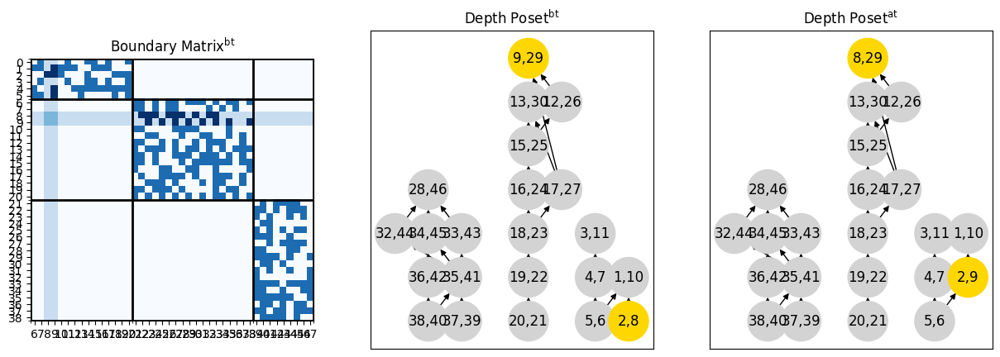

### Birth Death Pairs
|                          |                                                                                                                                                                                                                         |
|:-------------------------|:------------------------------------------------------------------------------------------------------------------------------------------------------------------------------------------------------------------------|
| Before the transposition | $\{(13, 30), (28, 46), (18, 23), (17, 27), (2, 8), (37, 39), (9, 29), (5, 6), (35, 41), (38, 40), (34, 45), (36, 42), (15, 25), (16, 24), (32, 44), (4, 7), (33, 43), (20, 21), (3, 11), (12, 26), (19, 22), (1, 10)\}$ |
| After the transposition  | $\{(13, 30), (28, 46), (18, 23), (17, 27), (37, 39), (5, 6), (35, 41), (38, 40), (34, 45), (36, 42), (8, 29), (15, 25), (16, 24), (32, 44), (4, 7), (33, 43), (20, 21), (3, 11), (12, 26), (2, 9), (19, 22), (1, 10)\}$ |

### Relations
|                          | Algorithm 1                                                                                                                                                                                                                                                                                                                                                                                                                                                     | Algorithm 2                                                                                                                                                                                                                                                                                                                                                                                                                           |
|:-------------------------|:----------------------------------------------------------------------------------------------------------------------------------------------------------------------------------------------------------------------------------------------------------------------------------------------------------------------------------------------------------------------------------------------------------------------------------------------------------------|:--------------------------------------------------------------------------------------------------------------------------------------------------------------------------------------------------------------------------------------------------------------------------------------------------------------------------------------------------------------------------------------------------------------------------------------|
| Before the transposition | $\{(24, 30), (41, 46), (22, 23), (21, 25), (21, 31), (22, 26), (23, 25), (40, 41), (22, 29), (23, 31), (45, 46), (24, 26), (25, 31), (41, 45), (26, 29), (29, 31), (46, 47), (21, 27), (39, 41), (23, 24), (23, 27), (40, 43), (22, 31), (39, 47), (8, 14), (27, 30), (24, 25), (6, 7), (41, 44), (25, 30), (42, 46), (21, 23), (26, 31), (44, 46), (22, 27), (21, 29), (40, 42), (22, 24), (39, 46), (40, 45), (8, 10), (27, 29), (25, 26), (7, 14)\}$         | $\{(32, 31), (18, 17), (4, 0), (35, 33), (20, 14), (4, 3), (5, 4), (38, 32), (5, 1), (34, 31), (19, 12), (36, 28), (37, 33), (19, 15), (36, 34), (15, 14), (16, 13), (18, 16), (35, 32), (20, 13), (3, 0), (20, 16), (38, 31), (20, 19), (17, 14), (19, 14), (19, 17), (37, 35), (37, 32), (16, 9), (15, 13), (16, 12), (18, 9), (33, 28), (20, 12), (20, 15), (38, 36), (37, 28), (37, 31), (37, 34), (15, 9), (15, 12), (32, 28)\}$ |
| After the transposition  | $\{(24, 30), (41, 46), (22, 23), (21, 25), (21, 31), (22, 26), (23, 25), (40, 41), (22, 29), (23, 31), (9, 14), (45, 46), (24, 26), (25, 31), (41, 45), (26, 29), (29, 31), (46, 47), (21, 27), (39, 41), (23, 24), (23, 27), (40, 43), (22, 31), (39, 47), (9, 10), (27, 30), (24, 25), (6, 7), (41, 44), (25, 30), (42, 46), (21, 23), (26, 31), (44, 46), (22, 27), (21, 29), (40, 42), (22, 24), (39, 46), (40, 45), (27, 29), (6, 9), (25, 26), (7, 14)\}$ | $\{(32, 31), (4, 0), (18, 17), (35, 33), (20, 14), (4, 3), (5, 4), (38, 32), (5, 1), (19, 12), (34, 31), (36, 28), (19, 15), (37, 33), (36, 34), (15, 14), (16, 13), (18, 16), (35, 32), (20, 13), (3, 0), (20, 16), (38, 31), (20, 19), (17, 14), (19, 8), (19, 14), (19, 17), (37, 35), (37, 32), (15, 13), (16, 12), (33, 28), (20, 12), (20, 15), (38, 36), (37, 28), (37, 31), (37, 34), (15, 12), (32, 28)\}$                   |

### Successors and Predecessers
|                 | $\text{Set}^\text{bt}(2, 8)$                  | $\text{Set}^\text{bt}(9, 29)$                                                 | $\text{Set}^\text{at}(2, 9)$                  | $\text{Set}^\text{at}(8, 29)$                                                 |
|:----------------|:----------------------------------------------|:------------------------------------------------------------------------------|:----------------------------------------------|:------------------------------------------------------------------------------|
| $\text{Succ}_1$ | $\text{Succ}_1^\text{bt}(2, 8) = \{(1, 10)\}$ | $\text{Succ}_1^\text{bt}(9, 29) = \emptyset$                                  | $\text{Succ}_1^\text{at}(2, 9) = \{(1, 10)\}$ | $\text{Succ}_1^\text{at}(8, 29) = \emptyset$                                  |
| $\text{Pred}_1$ | $\text{Pred}_1^\text{bt}(2, 8) = \emptyset$   | $\text{Pred}_1^\text{bt}(9, 29) = \{(20, 21), (17, 27), (19, 22), (12, 26)\}$ | $\text{Pred}_1^\text{at}(2, 9) = \{(5, 6)\}$  | $\text{Pred}_1^\text{at}(8, 29) = \{(20, 21), (17, 27), (19, 22), (12, 26)\}$ |
| $\text{Succ}_2$ | $\text{Succ}_2^\text{bt}(2, 8) = \emptyset$   | $\text{Succ}_2^\text{bt}(9, 29) = \emptyset$                                  | $\text{Succ}_2^\text{at}(2, 9) = \emptyset$   | $\text{Succ}_2^\text{at}(8, 29) = \emptyset$                                  |
| $\text{Pred}_2$ | $\text{Pred}_2^\text{bt}(2, 8) = \emptyset$   | $\text{Pred}_2^\text{bt}(9, 29) = \{(16, 24), (18, 23), (15, 25)\}$           | $\text{Pred}_2^\text{at}(2, 9) = \emptyset$   | $\text{Pred}_2^\text{at}(8, 29) = \{(19, 22)\}$                               |

### Temp Sets
|                                                              | Before the Transposition                                                   | After the Transposition                                                    |
|:-------------------------------------------------------------|:---------------------------------------------------------------------------|:---------------------------------------------------------------------------|
| $A_1 = \{(s, t)\in \text{BD}:\; f(a) < f(s) < f(t) < f(x)\}$ | $\{(5, 6), (4, 7)\}$                                                       | $\{(5, 6), (4, 7)\}$                                                       |
| $B_1 = \{(s, t)\in \text{BD}:\; U_1[t, x] = 1\}$             | $\emptyset$                                                                | $\{(5, 6)\}$                                                               |
| $A_2 = \{(s, t)\in \text{BD}:\; f(b) < f(s) < f(t) < f(y)\}$ | $\{(18, 23), (17, 27), (12, 26), (19, 22), (15, 25), (16, 24), (20, 21)\}$ | $\{(18, 23), (17, 27), (12, 26), (19, 22), (15, 25), (16, 24), (20, 21)\}$ |
| $B_2 = \{(s, t)\in \text{BD}:\; U_2[b, s] = 1\}$             | $\emptyset$                                                                | $\{(19, 22)\}$                                                             |

### Equations
There are 4 equations are wrong.

| eq    | left (formula)                  | left (paramatrized)              | left (value)                                 | right (formula)                                      | right (paramatrized)                                 | right (value)                                | correct   |
|:------|:--------------------------------|:---------------------------------|:---------------------------------------------|:-----------------------------------------------------|:-----------------------------------------------------|:---------------------------------------------|:----------|
| Eq48  | $\text{Succ}_1^\text{at}(a, x)$ | $\text{Succ}_1^\text{at}(2, 9)$  | $\{(1, 10)\}$                                | $\text{Succ}_1^\text{bt}(a, b)$                      | $\text{Succ}_1^\text{bt}(2, 8)$                      | $\{(1, 10)\}$                                | ✔         |
| Eq49  | $\text{Succ}_1^\text{at}(b, y)$ | $\text{Succ}_1^\text{at}(8, 29)$ | $\emptyset$                                  | $\text{Succ}_1^\text{bt}(x, y)$                      | $\text{Succ}_1^\text{bt}(9, 29)$                     | $\emptyset$                                  | ✔         |
| Eq50  | $\text{Pred}_1^\text{at}(a, x)$ | $\text{Pred}_1^\text{at}(2, 9)$  | $\{(5, 6)\}$                                 | $\{(s, t)\in \text{BD}:\; U_1^\text{bt}[t, x] = 1\}$ | $\{(s, t)\in \text{BD}:\; U_1^\text{bt}[t, 9] = 1\}$ | $\emptyset$                                  | ✘         |
| Eq50a | $\text{Pred}_1^\text{at}(a, x)$ | $\text{Pred}_1^\text{at}(2, 9)$  | $\{(5, 6)\}$                                 | $A_1^\text{bt} \cap B_1^\text{bt}$                   | $A_1^\text{bt} \cap B_1^\text{bt}$                   | $\emptyset$                                  | ✘         |
| Eq50b | $\text{Pred}_1^\text{at}(a, x)$ | $\text{Pred}_1^\text{at}(2, 9)$  | $\{(5, 6)\}$                                 | $A_1^\text{bt} \cap B_1^\text{at}$                   | $A_1^\text{bt} \cap B_1^\text{at}$                   | $\{(5, 6)\}$                                 | ✔         |
| Eq51  | $\text{Pred}_1^\text{at}(b, y)$ | $\text{Pred}_1^\text{at}(8, 29)$ | $\{(20, 21), (17, 27), (19, 22), (12, 26)\}$ | $\text{Pred}_1^\text{bt}(x, y)$                      | $\text{Pred}_1^\text{bt}(9, 29)$                     | $\{(20, 21), (17, 27), (19, 22), (12, 26)\}$ | ✔         |
| Eq52  | $\text{Succ}_2^\text{at}(a, x)$ | $\text{Succ}_2^\text{at}(2, 9)$  | $\emptyset$                                  | $\text{Succ}_2^\text{bt}(a, b)$                      | $\text{Succ}_2^\text{bt}(2, 8)$                      | $\emptyset$                                  | ✔         |
| Eq53  | $\text{Succ}_2^\text{at}(b, y)$ | $\text{Succ}_2^\text{at}(8, 29)$ | $\emptyset$                                  | $\text{Succ}_2^\text{bt}(x, y)$                      | $\text{Succ}_2^\text{bt}(9, 29)$                     | $\emptyset$                                  | ✔         |
| Eq54  | $\text{Pred}_2^\text{at}(a, x)$ | $\text{Pred}_2^\text{at}(2, 9)$  | $\emptyset$                                  | $\text{Pred}_2^\text{bt}(a, b)$                      | $\text{Pred}_2^\text{bt}(2, 8)$                      | $\emptyset$                                  | ✔         |
| Eq55  | $\text{Pred}_2^\text{at}(b, y)$ | $\text{Pred}_2^\text{at}(8, 29)$ | $\{(19, 22)\}$                               | $\{(s, t)\in \text{BD}:\; U_2^\text{bt}[b, s] = 1\}$ | $\{(s, t)\in \text{BD}:\; U_2^\text{bt}[8, s] = 1\}$ | $\emptyset$                                  | ✘         |
| Eq55a | $\text{Pred}_2^\text{at}(b, y)$ | $\text{Pred}_2^\text{at}(8, 29)$ | $\{(19, 22)\}$                               | $A_2^\text{bt} \cap B_2^\text{bt}$                   | $A_2^\text{bt} \cap B_2^\text{bt}$                   | $\emptyset$                                  | ✘         |
| Eq55b | $\text{Pred}_2^\text{at}(b, y)$ | $\text{Pred}_2^\text{at}(8, 29)$ | $\{(19, 22)\}$                               | $A_2^\text{bt} \cap B_2^\text{at}$                   | $A_2^\text{bt} \cap B_2^\text{at}$                   | $\{(19, 22)\}$                               | ✔         |

## Transposition <10, 11> in complex 11
Here is a __death-death__ __no switch__ transposition <10, 11>.

$$
a = 3, \; b = 11, \; x = 1, \; y = 10
$$

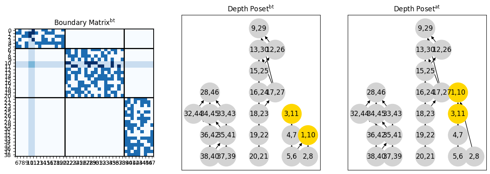

### Birth Death Pairs
|                          |                                                                                                                                                                                                                         |
|:-------------------------|:------------------------------------------------------------------------------------------------------------------------------------------------------------------------------------------------------------------------|
| Before the transposition | $\{(13, 30), (28, 46), (18, 23), (17, 27), (2, 8), (37, 39), (9, 29), (5, 6), (35, 41), (38, 40), (34, 45), (36, 42), (15, 25), (16, 24), (32, 44), (4, 7), (33, 43), (20, 21), (3, 11), (12, 26), (19, 22), (1, 10)\}$ |
| After the transposition  | $\{(13, 30), (28, 46), (18, 23), (17, 27), (2, 8), (37, 39), (9, 29), (5, 6), (35, 41), (38, 40), (34, 45), (36, 42), (15, 25), (16, 24), (32, 44), (4, 7), (33, 43), (20, 21), (3, 11), (12, 26), (19, 22), (1, 10)\}$ |

### Relations
|                          | Algorithm 1                                                                                                                                                                                                                                                                                                                                                                                                                                             | Algorithm 2                                                                                                                                                                                                                                                                                                                                                                                                                                   |
|:-------------------------|:--------------------------------------------------------------------------------------------------------------------------------------------------------------------------------------------------------------------------------------------------------------------------------------------------------------------------------------------------------------------------------------------------------------------------------------------------------|:----------------------------------------------------------------------------------------------------------------------------------------------------------------------------------------------------------------------------------------------------------------------------------------------------------------------------------------------------------------------------------------------------------------------------------------------|
| Before the transposition | $\{(24, 30), (41, 46), (22, 23), (21, 25), (21, 31), (22, 26), (23, 25), (40, 41), (22, 29), (23, 31), (45, 46), (24, 26), (25, 31), (41, 45), (26, 29), (29, 31), (46, 47), (21, 27), (39, 41), (23, 24), (23, 27), (40, 43), (22, 31), (39, 47), (8, 14), (27, 30), (24, 25), (6, 7), (41, 44), (25, 30), (42, 46), (21, 23), (26, 31), (44, 46), (22, 27), (21, 29), (40, 42), (22, 24), (39, 46), (40, 45), (8, 10), (27, 29), (25, 26), (7, 14)\}$ | $\{(32, 31), (18, 17), (4, 0), (35, 33), (20, 14), (4, 3), (5, 4), (38, 32), (5, 1), (34, 31), (19, 12), (36, 28), (37, 33), (19, 15), (36, 34), (15, 14), (16, 13), (18, 16), (35, 32), (20, 13), (3, 0), (20, 16), (38, 31), (20, 19), (17, 14), (19, 14), (19, 17), (37, 35), (37, 32), (16, 9), (15, 13), (16, 12), (18, 9), (33, 28), (20, 12), (20, 15), (38, 36), (37, 28), (37, 31), (37, 34), (15, 9), (15, 12), (32, 28)\}$         |
| After the transposition  | $\{(24, 30), (41, 46), (22, 23), (21, 25), (21, 31), (22, 26), (23, 25), (40, 41), (22, 29), (23, 31), (45, 46), (24, 26), (25, 31), (41, 45), (26, 29), (29, 31), (46, 47), (21, 27), (39, 41), (23, 24), (23, 27), (40, 43), (22, 31), (39, 47), (8, 14), (27, 30), (24, 25), (6, 7), (41, 44), (25, 30), (42, 46), (21, 23), (26, 31), (44, 46), (22, 27), (21, 29), (40, 42), (22, 24), (39, 46), (8, 10), (40, 45), (27, 29), (25, 26), (7, 14)\}$ | $\{(32, 31), (4, 0), (18, 17), (35, 33), (20, 14), (4, 3), (3, 1), (5, 4), (38, 32), (5, 1), (19, 12), (34, 31), (36, 28), (19, 15), (37, 33), (36, 34), (15, 14), (16, 13), (18, 16), (35, 32), (20, 13), (3, 0), (20, 16), (38, 31), (20, 19), (17, 14), (19, 14), (19, 17), (37, 35), (37, 32), (16, 9), (15, 13), (16, 12), (18, 9), (33, 28), (20, 12), (20, 15), (38, 36), (37, 28), (37, 31), (37, 34), (15, 9), (15, 12), (32, 28)\}$ |

### Successors and Predecessers
No such node in the Depth Poset

### Temp Sets
|                                                               | Before the Transposition                                                                                                                                                                                       | After the Transposition                                                                                                                                                                                        |
|:--------------------------------------------------------------|:---------------------------------------------------------------------------------------------------------------------------------------------------------------------------------------------------------------|:---------------------------------------------------------------------------------------------------------------------------------------------------------------------------------------------------------------|
| $\mathcal{B} = \{(s, t)\in \text{BD}:\; f(s) > f(x)\}$        | $\{(13, 30), (28, 46), (18, 23), (17, 27), (2, 8), (37, 39), (9, 29), (5, 6), (35, 41), (38, 40), (34, 45), (36, 42), (15, 25), (16, 24), (32, 44), (33, 43), (4, 7), (3, 11), (20, 21), (12, 26), (19, 22)\}$ | $\{(13, 30), (28, 46), (18, 23), (17, 27), (2, 8), (37, 39), (9, 29), (5, 6), (35, 41), (38, 40), (34, 45), (36, 42), (15, 25), (16, 24), (32, 44), (33, 43), (4, 7), (3, 11), (20, 21), (12, 26), (19, 22)\}$ |
| $\mathcal{N} = \{(s, t)\in \text{BD}:\; f(x) > f(s) > f(a)\}$ | $\emptyset$                                                                                                                                                                                                    | $\emptyset$                                                                                                                                                                                                    |

### Equations
There are 2 equations are wrong.

| eq   | left (formula)                  | left (paramatrized)              | left (value)   | right (formula)                                                                        | right (paramatrized)                                                                      | right (value)         | correct   |
|:-----|:--------------------------------|:---------------------------------|:---------------|:---------------------------------------------------------------------------------------|:------------------------------------------------------------------------------------------|:----------------------|:----------|
| Eq36 | $\text{Succ}_2^\text{at}(x, y)$ | $\text{Succ}_2^\text{at}(1, 10)$ | $\emptyset$    | $\text{Succ}_2^\text{bt}(x, y) \oplus \{(a, b)\} \oplus \text{Succ}_2^\text{bt}(a, b)$ | $\text{Succ}_2^\text{bt}(1, 10) \oplus \{(3, 11)\} \oplus \text{Succ}_2^\text{bt}(3, 11)$ | $\{(3, 11)\}$         | ✘         |
| Eq37 | $\text{Pred}_2^\text{at}(a, b)$ | $\text{Pred}_2^\text{at}(3, 11)$ | $\{(4, 7)\}$   | $\text{Pred}_2^\text{bt}(a, b) \oplus \{(x, y)\}$                                      | $\text{Pred}_2^\text{bt}(3, 11) \oplus \{(1, 10)\}$                                       | $\{(4, 7), (1, 10)\}$ | ✘         |

## Transposition <11, 12> in complex 11
Here is a __birth-death__ __switch forward__ transposition <11, 12>.

$$
a = 3, \; b = 11, \; x = 12, \; y = 26
$$

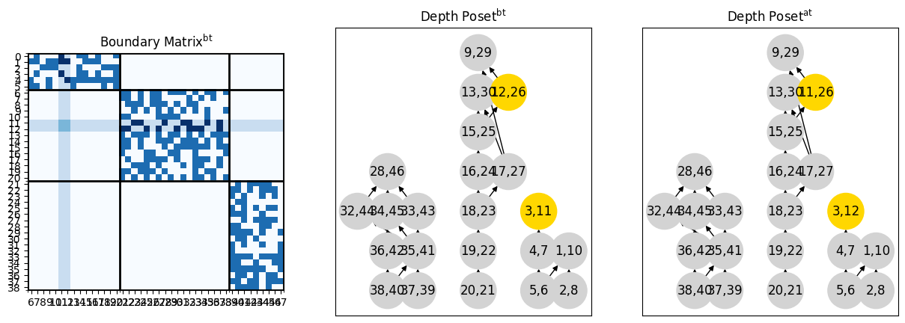

### Birth Death Pairs
|                          |                                                                                                                                                                                                                         |
|:-------------------------|:------------------------------------------------------------------------------------------------------------------------------------------------------------------------------------------------------------------------|
| Before the transposition | $\{(13, 30), (28, 46), (18, 23), (17, 27), (2, 8), (37, 39), (9, 29), (5, 6), (35, 41), (38, 40), (34, 45), (36, 42), (15, 25), (16, 24), (32, 44), (4, 7), (33, 43), (20, 21), (3, 11), (12, 26), (19, 22), (1, 10)\}$ |
| After the transposition  | $\{(13, 30), (28, 46), (18, 23), (17, 27), (2, 8), (37, 39), (11, 26), (9, 29), (5, 6), (35, 41), (38, 40), (3, 12), (34, 45), (36, 42), (15, 25), (16, 24), (32, 44), (4, 7), (33, 43), (20, 21), (19, 22), (1, 10)\}$ |

### Relations
|                          | Algorithm 1                                                                                                                                                                                                                                                                                                                                                                                                                                                      | Algorithm 2                                                                                                                                                                                                                                                                                                                                                                                                                           |
|:-------------------------|:-----------------------------------------------------------------------------------------------------------------------------------------------------------------------------------------------------------------------------------------------------------------------------------------------------------------------------------------------------------------------------------------------------------------------------------------------------------------|:--------------------------------------------------------------------------------------------------------------------------------------------------------------------------------------------------------------------------------------------------------------------------------------------------------------------------------------------------------------------------------------------------------------------------------------|
| Before the transposition | $\{(24, 30), (41, 46), (22, 23), (21, 25), (21, 31), (22, 26), (23, 25), (40, 41), (22, 29), (23, 31), (45, 46), (24, 26), (25, 31), (41, 45), (26, 29), (29, 31), (46, 47), (21, 27), (39, 41), (23, 24), (23, 27), (40, 43), (22, 31), (39, 47), (8, 14), (27, 30), (24, 25), (6, 7), (41, 44), (25, 30), (42, 46), (21, 23), (26, 31), (44, 46), (22, 27), (21, 29), (40, 42), (22, 24), (39, 46), (40, 45), (8, 10), (27, 29), (25, 26), (7, 14)\}$          | $\{(32, 31), (18, 17), (4, 0), (35, 33), (20, 14), (4, 3), (5, 4), (38, 32), (5, 1), (34, 31), (19, 12), (36, 28), (37, 33), (19, 15), (36, 34), (15, 14), (16, 13), (18, 16), (35, 32), (20, 13), (3, 0), (20, 16), (38, 31), (20, 19), (17, 14), (19, 14), (19, 17), (37, 35), (37, 32), (16, 9), (15, 13), (16, 12), (18, 9), (33, 28), (20, 12), (20, 15), (38, 36), (37, 28), (37, 31), (37, 34), (15, 9), (15, 12), (32, 28)\}$ |
| After the transposition  | $\{(24, 30), (41, 46), (22, 23), (21, 25), (21, 31), (22, 26), (23, 25), (40, 41), (22, 29), (23, 31), (45, 46), (24, 26), (25, 31), (41, 45), (26, 29), (29, 31), (46, 47), (21, 27), (39, 41), (23, 24), (23, 27), (40, 43), (22, 31), (39, 47), (8, 14), (27, 30), (24, 25), (6, 7), (7, 12), (41, 44), (25, 30), (42, 46), (21, 23), (26, 31), (44, 46), (22, 27), (21, 29), (40, 42), (22, 24), (39, 46), (40, 45), (8, 10), (27, 29), (25, 26), (7, 14)\}$ | $\{(32, 31), (4, 0), (18, 17), (35, 33), (20, 14), (4, 3), (5, 4), (38, 32), (5, 1), (34, 31), (36, 28), (19, 15), (37, 33), (36, 34), (15, 11), (15, 14), (16, 13), (18, 16), (35, 32), (20, 13), (3, 0), (20, 16), (38, 31), (20, 19), (17, 14), (19, 14), (19, 17), (37, 35), (37, 32), (16, 9), (15, 13), (18, 9), (33, 28), (20, 15), (38, 36), (37, 28), (37, 31), (37, 34), (15, 9), (18, 11), (32, 28)\}$                     |

### Successors and Predecessers
|                 | $\text{Set}^\text{bt}(3, 11)$                 | $\text{Set}^\text{bt}(12, 26)$                                                 | $\text{Set}^\text{at}(3, 12)$                 | $\text{Set}^\text{at}(11, 26)$                                       |
|:----------------|:----------------------------------------------|:-------------------------------------------------------------------------------|:----------------------------------------------|:---------------------------------------------------------------------|
| $\text{Succ}_1$ | $\text{Succ}_1^\text{bt}(3, 11) = \emptyset$  | $\text{Succ}_1^\text{bt}(12, 26) = \{(9, 29)\}$                                | $\text{Succ}_1^\text{at}(3, 12) = \emptyset$  | $\text{Succ}_1^\text{at}(11, 26) = \{(9, 29)\}$                      |
| $\text{Pred}_1$ | $\text{Pred}_1^\text{bt}(3, 11) = \emptyset$  | $\text{Pred}_1^\text{bt}(12, 26) = \{(16, 24), (19, 22), (15, 25)\}$           | $\text{Pred}_1^\text{at}(3, 12) = \{(4, 7)\}$ | $\text{Pred}_1^\text{at}(11, 26) = \{(16, 24), (19, 22), (15, 25)\}$ |
| $\text{Succ}_2$ | $\text{Succ}_2^\text{bt}(3, 11) = \emptyset$  | $\text{Succ}_2^\text{bt}(12, 26) = \emptyset$                                  | $\text{Succ}_2^\text{at}(3, 12) = \emptyset$  | $\text{Succ}_2^\text{at}(11, 26) = \emptyset$                        |
| $\text{Pred}_2$ | $\text{Pred}_2^\text{bt}(3, 11) = \{(4, 7)\}$ | $\text{Pred}_2^\text{bt}(12, 26) = \{(16, 24), (19, 22), (15, 25), (20, 21)\}$ | $\text{Pred}_2^\text{at}(3, 12) = \{(4, 7)\}$ | $\text{Pred}_2^\text{at}(11, 26) = \{(18, 23), (15, 25)\}$           |

### Temp Sets
|                                                              | Before the Transposition                               | After the Transposition                                |
|:-------------------------------------------------------------|:-------------------------------------------------------|:-------------------------------------------------------|
| $A_1 = \{(s, t)\in \text{BD}:\; f(a) < f(s) < f(t) < f(x)\}$ | $\{(5, 6), (4, 7)\}$                                   | $\{(5, 6), (4, 7)\}$                                   |
| $B_1 = \{(s, t)\in \text{BD}:\; U_1[t, x] = 1\}$             | $\emptyset$                                            | $\{(4, 7)\}$                                           |
| $A_2 = \{(s, t)\in \text{BD}:\; f(b) < f(s) < f(t) < f(y)\}$ | $\{(18, 23), (19, 22), (15, 25), (16, 24), (20, 21)\}$ | $\{(18, 23), (19, 22), (15, 25), (16, 24), (20, 21)\}$ |
| $B_2 = \{(s, t)\in \text{BD}:\; U_2[b, s] = 1\}$             | $\emptyset$                                            | $\{(18, 23), (15, 25)\}$                               |

### Equations
There are 4 equations are wrong.

| eq    | left (formula)                  | left (paramatrized)               | left (value)                       | right (formula)                                      | right (paramatrized)                                  | right (value)                      | correct   |
|:------|:--------------------------------|:----------------------------------|:-----------------------------------|:-----------------------------------------------------|:------------------------------------------------------|:-----------------------------------|:----------|
| Eq48  | $\text{Succ}_1^\text{at}(a, x)$ | $\text{Succ}_1^\text{at}(3, 12)$  | $\emptyset$                        | $\text{Succ}_1^\text{bt}(a, b)$                      | $\text{Succ}_1^\text{bt}(3, 11)$                      | $\emptyset$                        | ✔         |
| Eq49  | $\text{Succ}_1^\text{at}(b, y)$ | $\text{Succ}_1^\text{at}(11, 26)$ | $\{(9, 29)\}$                      | $\text{Succ}_1^\text{bt}(x, y)$                      | $\text{Succ}_1^\text{bt}(12, 26)$                     | $\{(9, 29)\}$                      | ✔         |
| Eq50  | $\text{Pred}_1^\text{at}(a, x)$ | $\text{Pred}_1^\text{at}(3, 12)$  | $\{(4, 7)\}$                       | $\{(s, t)\in \text{BD}:\; U_1^\text{bt}[t, x] = 1\}$ | $\{(s, t)\in \text{BD}:\; U_1^\text{bt}[t, 12] = 1\}$ | $\emptyset$                        | ✘         |
| Eq50a | $\text{Pred}_1^\text{at}(a, x)$ | $\text{Pred}_1^\text{at}(3, 12)$  | $\{(4, 7)\}$                       | $A_1^\text{bt} \cap B_1^\text{bt}$                   | $A_1^\text{bt} \cap B_1^\text{bt}$                    | $\emptyset$                        | ✘         |
| Eq50b | $\text{Pred}_1^\text{at}(a, x)$ | $\text{Pred}_1^\text{at}(3, 12)$  | $\{(4, 7)\}$                       | $A_1^\text{bt} \cap B_1^\text{at}$                   | $A_1^\text{bt} \cap B_1^\text{at}$                    | $\{(4, 7)\}$                       | ✔         |
| Eq51  | $\text{Pred}_1^\text{at}(b, y)$ | $\text{Pred}_1^\text{at}(11, 26)$ | $\{(16, 24), (19, 22), (15, 25)\}$ | $\text{Pred}_1^\text{bt}(x, y)$                      | $\text{Pred}_1^\text{bt}(12, 26)$                     | $\{(16, 24), (19, 22), (15, 25)\}$ | ✔         |
| Eq52  | $\text{Succ}_2^\text{at}(a, x)$ | $\text{Succ}_2^\text{at}(3, 12)$  | $\emptyset$                        | $\text{Succ}_2^\text{bt}(a, b)$                      | $\text{Succ}_2^\text{bt}(3, 11)$                      | $\emptyset$                        | ✔         |
| Eq53  | $\text{Succ}_2^\text{at}(b, y)$ | $\text{Succ}_2^\text{at}(11, 26)$ | $\emptyset$                        | $\text{Succ}_2^\text{bt}(x, y)$                      | $\text{Succ}_2^\text{bt}(12, 26)$                     | $\emptyset$                        | ✔         |
| Eq54  | $\text{Pred}_2^\text{at}(a, x)$ | $\text{Pred}_2^\text{at}(3, 12)$  | $\{(4, 7)\}$                       | $\text{Pred}_2^\text{bt}(a, b)$                      | $\text{Pred}_2^\text{bt}(3, 11)$                      | $\{(4, 7)\}$                       | ✔         |
| Eq55  | $\text{Pred}_2^\text{at}(b, y)$ | $\text{Pred}_2^\text{at}(11, 26)$ | $\{(18, 23), (15, 25)\}$           | $\{(s, t)\in \text{BD}:\; U_2^\text{bt}[b, s] = 1\}$ | $\{(s, t)\in \text{BD}:\; U_2^\text{bt}[11, s] = 1\}$ | $\emptyset$                        | ✘         |
| Eq55a | $\text{Pred}_2^\text{at}(b, y)$ | $\text{Pred}_2^\text{at}(11, 26)$ | $\{(18, 23), (15, 25)\}$           | $A_2^\text{bt} \cap B_2^\text{bt}$                   | $A_2^\text{bt} \cap B_2^\text{bt}$                    | $\emptyset$                        | ✘         |
| Eq55b | $\text{Pred}_2^\text{at}(b, y)$ | $\text{Pred}_2^\text{at}(11, 26)$ | $\{(18, 23), (15, 25)\}$           | $A_2^\text{bt} \cap B_2^\text{at}$                   | $A_2^\text{bt} \cap B_2^\text{at}$                    | $\{(18, 23), (15, 25)\}$           | ✔         |

## Transposition <19, 20> in complex 11
Here is a __birth-birth__ __switch forward__ transposition <19, 20>.

$$
a = 19, \; b = 22, \; x = 20, \; y = 21
$$

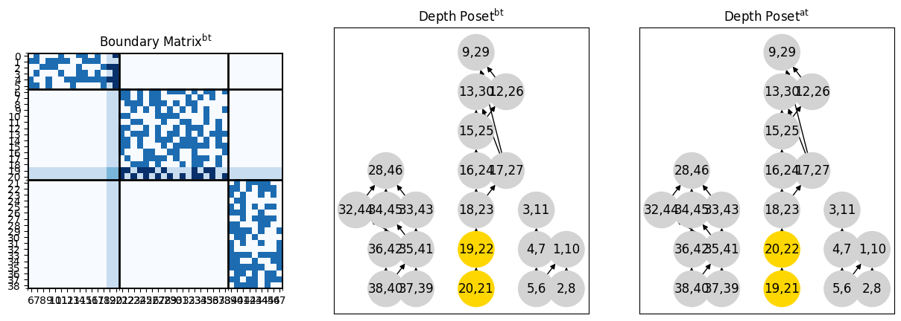

### Birth Death Pairs
|                          |                                                                                                                                                                                                                         |
|:-------------------------|:------------------------------------------------------------------------------------------------------------------------------------------------------------------------------------------------------------------------|
| Before the transposition | $\{(13, 30), (28, 46), (18, 23), (17, 27), (2, 8), (37, 39), (9, 29), (5, 6), (35, 41), (38, 40), (34, 45), (36, 42), (15, 25), (16, 24), (32, 44), (4, 7), (33, 43), (20, 21), (3, 11), (12, 26), (19, 22), (1, 10)\}$ |
| After the transposition  | $\{(13, 30), (28, 46), (18, 23), (19, 21), (17, 27), (2, 8), (37, 39), (9, 29), (5, 6), (35, 41), (20, 22), (38, 40), (34, 45), (36, 42), (15, 25), (16, 24), (32, 44), (4, 7), (33, 43), (3, 11), (12, 26), (1, 10)\}$ |

### Relations
|                          | Algorithm 1                                                                                                                                                                                                                                                                                                                                                                                                                                             | Algorithm 2                                                                                                                                                                                                                                                                                                                                                                                                                           |
|:-------------------------|:--------------------------------------------------------------------------------------------------------------------------------------------------------------------------------------------------------------------------------------------------------------------------------------------------------------------------------------------------------------------------------------------------------------------------------------------------------|:--------------------------------------------------------------------------------------------------------------------------------------------------------------------------------------------------------------------------------------------------------------------------------------------------------------------------------------------------------------------------------------------------------------------------------------|
| Before the transposition | $\{(24, 30), (41, 46), (22, 23), (21, 25), (21, 31), (22, 26), (23, 25), (40, 41), (22, 29), (23, 31), (45, 46), (24, 26), (25, 31), (41, 45), (26, 29), (29, 31), (46, 47), (21, 27), (39, 41), (23, 24), (23, 27), (40, 43), (22, 31), (39, 47), (8, 14), (27, 30), (24, 25), (6, 7), (41, 44), (25, 30), (42, 46), (21, 23), (26, 31), (44, 46), (22, 27), (21, 29), (40, 42), (22, 24), (39, 46), (40, 45), (8, 10), (27, 29), (25, 26), (7, 14)\}$ | $\{(32, 31), (18, 17), (4, 0), (35, 33), (20, 14), (4, 3), (5, 4), (38, 32), (5, 1), (34, 31), (19, 12), (36, 28), (37, 33), (19, 15), (36, 34), (15, 14), (16, 13), (18, 16), (35, 32), (20, 13), (3, 0), (20, 16), (38, 31), (20, 19), (17, 14), (19, 14), (19, 17), (37, 35), (37, 32), (16, 9), (15, 13), (16, 12), (18, 9), (33, 28), (20, 12), (20, 15), (38, 36), (37, 28), (37, 31), (37, 34), (15, 9), (15, 12), (32, 28)\}$ |
| After the transposition  | $\{(24, 30), (41, 46), (21, 22), (22, 23), (21, 25), (22, 26), (23, 25), (40, 41), (22, 29), (23, 31), (45, 46), (24, 26), (25, 31), (41, 45), (26, 29), (21, 24), (29, 31), (46, 47), (39, 41), (23, 24), (23, 27), (40, 43), (22, 31), (39, 47), (8, 14), (27, 30), (24, 25), (6, 7), (41, 44), (25, 30), (42, 46), (26, 31), (44, 46), (21, 26), (22, 27), (40, 42), (22, 24), (39, 46), (40, 45), (8, 10), (27, 29), (25, 26), (7, 14)\}$           | $\{(32, 31), (4, 0), (18, 17), (35, 33), (4, 3), (20, 17), (5, 4), (38, 32), (5, 1), (34, 31), (36, 28), (19, 12), (37, 33), (19, 15), (36, 34), (15, 14), (16, 13), (18, 16), (35, 32), (20, 13), (3, 0), (20, 16), (38, 31), (17, 14), (19, 14), (37, 35), (37, 32), (19, 20), (16, 9), (15, 13), (16, 12), (18, 9), (33, 28), (38, 36), (37, 28), (19, 16), (19, 13), (37, 31), (37, 34), (15, 9), (15, 12), (32, 28)\}$           |

### Successors and Predecessers
|                 | $\text{Set}^\text{bt}(19, 22)$                                                          | $\text{Set}^\text{bt}(20, 21)$                                                           | $\text{Set}^\text{at}(19, 21)$                                                           | $\text{Set}^\text{at}(20, 22)$                                                          |
|:----------------|:----------------------------------------------------------------------------------------|:-----------------------------------------------------------------------------------------|:-----------------------------------------------------------------------------------------|:----------------------------------------------------------------------------------------|
| $\text{Succ}_1$ | $\text{Succ}_1^\text{bt}(19, 22) = \{(9, 29), (18, 23), (12, 26), (16, 24), (17, 27)\}$ | $\text{Succ}_1^\text{bt}(20, 21) = \{(9, 29), (18, 23), (15, 25), (17, 27)\}$            | $\text{Succ}_1^\text{at}(19, 21) = \{(20, 22), (16, 24), (15, 25), (12, 26)\}$           | $\text{Succ}_1^\text{at}(20, 22) = \{(9, 29), (18, 23), (12, 26), (16, 24), (17, 27)\}$ |
| $\text{Pred}_1$ | $\text{Pred}_1^\text{bt}(19, 22) = \emptyset$                                           | $\text{Pred}_1^\text{bt}(20, 21) = \emptyset$                                            | $\text{Pred}_1^\text{at}(19, 21) = \emptyset$                                            | $\text{Pred}_1^\text{at}(20, 22) = \{(19, 21)\}$                                        |
| $\text{Succ}_2$ | $\text{Succ}_2^\text{bt}(19, 22) = \{(17, 27), (15, 25), (12, 26)\}$                    | $\text{Succ}_2^\text{bt}(20, 21) = \{(13, 30), (12, 26), (19, 22), (15, 25), (16, 24)\}$ | $\text{Succ}_2^\text{at}(19, 21) = \{(13, 30), (12, 26), (16, 24), (15, 25), (20, 22)\}$ | $\text{Succ}_2^\text{at}(20, 22) = \{(16, 24), (13, 30), (17, 27)\}$                    |
| $\text{Pred}_2$ | $\text{Pred}_2^\text{bt}(19, 22) = \{(20, 21)\}$                                        | $\text{Pred}_2^\text{bt}(20, 21) = \emptyset$                                            | $\text{Pred}_2^\text{at}(19, 21) = \emptyset$                                            | $\text{Pred}_2^\text{at}(20, 22) = \{(19, 21)\}$                                        |

### Temp Sets
|                                                               | Before the Transposition                       | After the Transposition                        |
|:--------------------------------------------------------------|:-----------------------------------------------|:-----------------------------------------------|
| $\mathcal{L} = \{(s, t)\in \text{BD}:\; f(t) < f(y)\}$        | $\{(3, 11), (5, 6), (1, 10), (4, 7), (2, 8)\}$ | $\{(3, 11), (5, 6), (1, 10), (4, 7), (2, 8)\}$ |
| $\mathcal{M} = \{(s, t)\in \text{BD}:\; f(y) < f(t) < f(b)\}$ | $\emptyset$                                    | $\emptyset$                                    |

### Equations
There are 1 equations are wrong.

| eq   | left (formula)                  | left (paramatrized)               | left (value)                                           | right (formula)                                                                                           | right (paramatrized)                                                                                            | right (value)                                          | correct   |
|:-----|:--------------------------------|:----------------------------------|:-------------------------------------------------------|:----------------------------------------------------------------------------------------------------------|:----------------------------------------------------------------------------------------------------------------|:-------------------------------------------------------|:----------|
| Eq08 | $\text{Succ}_1^\text{at}(a, y)$ | $\text{Succ}_1^\text{at}(19, 21)$ | $\{(20, 22), (16, 24), (15, 25), (12, 26)\}$           | $\text{Succ}_1^\text{bt}(x, y) \oplus \{(x, b)\} \oplus \text{Succ}_1^\text{bt}(a, b)$                    | $\text{Succ}_1^\text{bt}(20, 21) \oplus \{(20, 22)\} \oplus \text{Succ}_1^\text{bt}(19, 22)$                    | $\{(16, 24), (20, 22), (15, 25), (12, 26)\}$           | ✔         |
| Eq09 | $\text{Succ}_1^\text{at}(x, b)$ | $\text{Succ}_1^\text{at}(20, 22)$ | $\{(9, 29), (18, 23), (12, 26), (16, 24), (17, 27)\}$  | $\text{Succ}_1^\text{bt}(a, b)$                                                                           | $\text{Succ}_1^\text{bt}(19, 22)$                                                                               | $\{(9, 29), (18, 23), (12, 26), (16, 24), (17, 27)\}$  | ✔         |
| Eq10 | $\text{Pred}_1^\text{at}(a, y)$ | $\text{Pred}_1^\text{at}(19, 21)$ | $\emptyset$                                            | $\text{Pred}_1^\text{bt}(x, y)$                                                                           | $\text{Pred}_1^\text{bt}(20, 21)$                                                                               | $\emptyset$                                            | ✔         |
| Eq11 | $\text{Pred}_1^\text{at}(x, b)$ | $\text{Pred}_1^\text{at}(20, 22)$ | $\{(19, 21)\}$                                         | $\text{Pred}_1^\text{bt}(a, b) \oplus \{(a, y)\}$                                                         | $\text{Pred}_1^\text{bt}(19, 22) \oplus \{(19, 21)\}$                                                           | $\{(19, 21)\}$                                         | ✔         |
| Eq12 | $\text{Succ}_2^\text{at}(a, y)$ | $\text{Succ}_2^\text{at}(19, 21)$ | $\{(13, 30), (12, 26), (16, 24), (15, 25), (20, 22)\}$ | $\text{Succ}_2^\text{bt}(x, y) \oplus \{(x, b), (a, b)\}$                                                 | $\text{Succ}_2^\text{bt}(20, 21) \oplus \{(20, 22), (19, 22)\}$                                                 | $\{(13, 30), (12, 26), (16, 24), (15, 25), (20, 22)\}$ | ✔         |
| Eq13 | $\text{Succ}_2^\text{at}(x, b)$ | $\text{Succ}_2^\text{at}(20, 22)$ | $\{(16, 24), (13, 30), (17, 27)\}$                     | $\text{Succ}_2^\text{bt}(a, b)$                                                                           | $\text{Succ}_2^\text{bt}(19, 22)$                                                                               | $\{(17, 27), (15, 25), (12, 26)\}$                     | ✘         |
| Eq14 | $\text{Pred}_2^\text{at}(a, y)$ | $\text{Pred}_2^\text{at}(19, 21)$ | $\emptyset$                                            | $[\text{Pred}_2^\text{bt}(a, b) \cap \mathcal{L}]$                                                        | $[\text{Pred}_2^\text{bt}(19, 22) \cap \mathcal{L}]$                                                            | $\emptyset$                                            | ✔         |
| Eq15 | $\text{Pred}_2^\text{at}(x, b)$ | $\text{Pred}_2^\text{at}(20, 22)$ | $\{(19, 21)\}$                                         | $\text{Pred}_2^\text{bt}(x, y) \oplus \{(a, y)\} \oplus [\text{Pred}_2^\text{bt}(a, b) \cap \mathcal{M}]$ | $\text{Pred}_2^\text{bt}(20, 21) \oplus \{(19, 21)\} \oplus [\text{Pred}_2^\text{bt}(19, 22) \cap \mathcal{M}]$ | $\{(19, 21)\}$                                         | ✔         |

## Transposition <22, 23> in complex 11
Here is a __death-death__ __switch forward__ transposition <22, 23>.

$$
a = 18, \; b = 23, \; x = 19, \; y = 22
$$

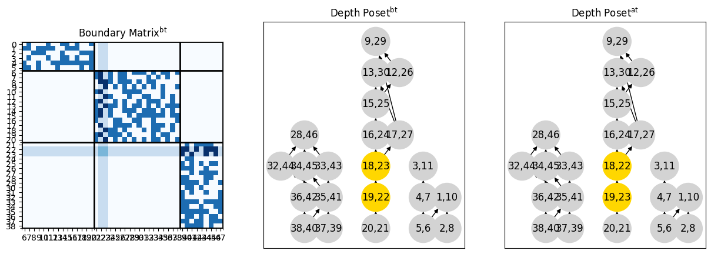

### Birth Death Pairs
|                          |                                                                                                                                                                                                                         |
|:-------------------------|:------------------------------------------------------------------------------------------------------------------------------------------------------------------------------------------------------------------------|
| Before the transposition | $\{(13, 30), (28, 46), (18, 23), (17, 27), (2, 8), (37, 39), (9, 29), (5, 6), (35, 41), (38, 40), (34, 45), (36, 42), (15, 25), (16, 24), (32, 44), (4, 7), (33, 43), (20, 21), (3, 11), (12, 26), (19, 22), (1, 10)\}$ |
| After the transposition  | $\{(13, 30), (28, 46), (17, 27), (2, 8), (37, 39), (9, 29), (18, 22), (5, 6), (35, 41), (38, 40), (19, 23), (34, 45), (36, 42), (15, 25), (16, 24), (32, 44), (4, 7), (33, 43), (20, 21), (3, 11), (12, 26), (1, 10)\}$ |

### Relations
|                          | Algorithm 1                                                                                                                                                                                                                                                                                                                                                                                                                                             | Algorithm 2                                                                                                                                                                                                                                                                                                                                                                                                                                              |
|:-------------------------|:--------------------------------------------------------------------------------------------------------------------------------------------------------------------------------------------------------------------------------------------------------------------------------------------------------------------------------------------------------------------------------------------------------------------------------------------------------|:---------------------------------------------------------------------------------------------------------------------------------------------------------------------------------------------------------------------------------------------------------------------------------------------------------------------------------------------------------------------------------------------------------------------------------------------------------|
| Before the transposition | $\{(24, 30), (41, 46), (22, 23), (21, 25), (21, 31), (22, 26), (23, 25), (40, 41), (22, 29), (23, 31), (45, 46), (24, 26), (25, 31), (41, 45), (26, 29), (29, 31), (46, 47), (21, 27), (39, 41), (23, 24), (23, 27), (40, 43), (22, 31), (39, 47), (8, 14), (27, 30), (24, 25), (6, 7), (41, 44), (25, 30), (42, 46), (21, 23), (26, 31), (44, 46), (22, 27), (21, 29), (40, 42), (22, 24), (39, 46), (40, 45), (8, 10), (27, 29), (25, 26), (7, 14)\}$ | $\{(32, 31), (18, 17), (4, 0), (35, 33), (20, 14), (4, 3), (5, 4), (38, 32), (5, 1), (34, 31), (19, 12), (36, 28), (37, 33), (19, 15), (36, 34), (15, 14), (16, 13), (18, 16), (35, 32), (20, 13), (3, 0), (20, 16), (38, 31), (20, 19), (17, 14), (19, 14), (19, 17), (37, 35), (37, 32), (16, 9), (15, 13), (16, 12), (18, 9), (33, 28), (20, 12), (20, 15), (38, 36), (37, 28), (37, 31), (37, 34), (15, 9), (15, 12), (32, 28)\}$                    |
| After the transposition  | $\{(24, 30), (41, 46), (21, 25), (23, 22), (21, 31), (22, 26), (40, 41), (23, 31), (22, 29), (45, 46), (24, 26), (25, 31), (41, 45), (26, 29), (29, 31), (46, 47), (22, 25), (21, 27), (39, 41), (23, 24), (23, 27), (40, 43), (8, 14), (39, 47), (27, 30), (24, 25), (6, 7), (41, 44), (25, 30), (42, 46), (21, 23), (26, 31), (44, 46), (21, 29), (23, 26), (40, 42), (39, 46), (23, 29), (40, 45), (8, 10), (27, 29), (25, 26), (7, 14)\}$           | $\{(32, 31), (4, 0), (18, 17), (35, 33), (20, 14), (4, 3), (5, 4), (38, 32), (5, 1), (19, 9), (19, 12), (34, 31), (36, 28), (19, 18), (19, 15), (37, 33), (36, 34), (15, 14), (16, 13), (18, 16), (35, 32), (20, 13), (3, 0), (20, 16), (38, 31), (20, 19), (17, 14), (19, 14), (37, 35), (37, 32), (16, 9), (15, 13), (16, 12), (18, 9), (33, 28), (20, 12), (20, 15), (38, 36), (37, 28), (19, 16), (37, 31), (37, 34), (15, 9), (15, 12), (32, 28)\}$ |

### Successors and Predecessers
|                 | $\text{Set}^\text{bt}(18, 23)$                                       | $\text{Set}^\text{bt}(19, 22)$                                                          | $\text{Set}^\text{at}(19, 23)$                                                          | $\text{Set}^\text{at}(18, 22)$                                      |
|:----------------|:---------------------------------------------------------------------|:----------------------------------------------------------------------------------------|:----------------------------------------------------------------------------------------|:--------------------------------------------------------------------|
| $\text{Succ}_1$ | $\text{Succ}_1^\text{bt}(18, 23) = \{(16, 24), (15, 25), (17, 27)\}$ | $\text{Succ}_1^\text{bt}(19, 22) = \{(9, 29), (18, 23), (12, 26), (16, 24), (17, 27)\}$ | $\text{Succ}_1^\text{at}(19, 23) = \{(9, 29), (12, 26), (18, 22), (16, 24), (17, 27)\}$ | $\text{Succ}_1^\text{at}(18, 22) = \{(9, 29), (15, 25), (12, 26)\}$ |
| $\text{Pred}_1$ | $\text{Pred}_1^\text{bt}(18, 23) = \{(19, 22), (20, 21)\}$           | $\text{Pred}_1^\text{bt}(19, 22) = \emptyset$                                           | $\text{Pred}_1^\text{at}(19, 23) = \{(20, 21)\}$                                        | $\text{Pred}_1^\text{at}(18, 22) = \{(19, 23)\}$                    |
| $\text{Succ}_2$ | $\text{Succ}_2^\text{bt}(18, 23) = \{(16, 24), (9, 29), (17, 27)\}$  | $\text{Succ}_2^\text{bt}(19, 22) = \{(17, 27), (15, 25), (12, 26)\}$                    | $\text{Succ}_2^\text{at}(19, 23) = \{(9, 29), (12, 26), (18, 22), (15, 25), (16, 24)\}$ | $\text{Succ}_2^\text{at}(18, 22) = \{(16, 24), (9, 29), (17, 27)\}$ |
| $\text{Pred}_2$ | $\text{Pred}_2^\text{bt}(18, 23) = \emptyset$                        | $\text{Pred}_2^\text{bt}(19, 22) = \{(20, 21)\}$                                        | $\text{Pred}_2^\text{at}(19, 23) = \{(20, 21)\}$                                        | $\text{Pred}_2^\text{at}(18, 22) = \{(19, 23)\}$                    |

### Temp Sets
|                                                               | Before the Transposition                                                                       | After the Transposition                                                                        |
|:--------------------------------------------------------------|:-----------------------------------------------------------------------------------------------|:-----------------------------------------------------------------------------------------------|
| $\mathcal{B} = \{(s, t)\in \text{BD}:\; f(s) > f(x)\}$        | $\{(28, 46), (37, 39), (34, 45), (36, 42), (35, 41), (38, 40), (32, 44), (33, 43), (20, 21)\}$ | $\{(28, 46), (37, 39), (34, 45), (36, 42), (35, 41), (38, 40), (32, 44), (33, 43), (20, 21)\}$ |
| $\mathcal{N} = \{(s, t)\in \text{BD}:\; f(x) > f(s) > f(a)\}$ | $\emptyset$                                                                                    | $\emptyset$                                                                                    |

### Equations
There are 1 equations are wrong.

| eq   | left (formula)                  | left (paramatrized)               | left (value)                                          | right (formula)                                                                                          | right (paramatrized)                                                                                           | right (value)                                         | correct   |
|:-----|:--------------------------------|:----------------------------------|:------------------------------------------------------|:---------------------------------------------------------------------------------------------------------|:---------------------------------------------------------------------------------------------------------------|:------------------------------------------------------|:----------|
| Eq28 | $\text{Succ}_1^\text{at}(x, b)$ | $\text{Succ}_1^\text{at}(19, 23)$ | $\{(9, 29), (12, 26), (18, 22), (16, 24), (17, 27)\}$ | $\text{Succ}_1^\text{bt}(x, y) \oplus \{(a, y), (a, b)\}$                                                | $\text{Succ}_1^\text{bt}(19, 22) \oplus \{(18, 22), (18, 23)\}$                                                | $\{(9, 29), (12, 26), (18, 22), (16, 24), (17, 27)\}$ | ✔         |
| Eq29 | $\text{Succ}_1^\text{at}(a, y)$ | $\text{Succ}_1^\text{at}(18, 22)$ | $\{(9, 29), (15, 25), (12, 26)\}$                     | $\text{Succ}_1^\text{bt}(a, b)$                                                                          | $\text{Succ}_1^\text{bt}(18, 23)$                                                                              | $\{(16, 24), (15, 25), (17, 27)\}$                    | ✘         |
| Eq30 | $\text{Pred}_1^\text{at}(x, b)$ | $\text{Pred}_1^\text{at}(19, 23)$ | $\{(20, 21)\}$                                        | $[\text{Pred}_1^\text{bt}(a, b) \cap \mathcal{B}]$                                                       | $[\text{Pred}_1^\text{bt}(18, 23) \cap \mathcal{B}]$                                                           | $\{(20, 21)\}$                                        | ✔         |
| Eq31 | $\text{Pred}_1^\text{at}(a, y)$ | $\text{Pred}_1^\text{at}(18, 22)$ | $\{(19, 23)\}$                                        | $\text{Pred}_1^\text{bt}(x, y) \oplus \{(x, b)\} \oplus[\text{Pred}_1^\text{bt}(a, b) \cap \mathcal{N}]$ | $\text{Pred}_1^\text{bt}(19, 22) \oplus \{(19, 23)\} \oplus[\text{Pred}_1^\text{bt}(18, 23) \cap \mathcal{N}]$ | $\{(19, 23)\}$                                        | ✔         |
| Eq32 | $\text{Succ}_2^\text{at}(x, b)$ | $\text{Succ}_2^\text{at}(19, 23)$ | $\{(9, 29), (12, 26), (18, 22), (15, 25), (16, 24)\}$ | $\text{Succ}_2^\text{bt}(x, y) \oplus \{(a, y)\} \oplus \text{Succ}_2^\text{bt}(a, b)$                   | $\text{Succ}_2^\text{bt}(19, 22) \oplus \{(18, 22)\} \oplus \text{Succ}_2^\text{bt}(18, 23)$                   | $\{(9, 29), (12, 26), (18, 22), (15, 25), (16, 24)\}$ | ✔         |
| Eq33 | $\text{Succ}_2^\text{at}(a, y)$ | $\text{Succ}_2^\text{at}(18, 22)$ | $\{(16, 24), (9, 29), (17, 27)\}$                     | $\text{Succ}_2^\text{bt}(a, b)$                                                                          | $\text{Succ}_2^\text{bt}(18, 23)$                                                                              | $\{(16, 24), (9, 29), (17, 27)\}$                     | ✔         |
| Eq34 | $\text{Pred}_2^\text{at}(x, b)$ | $\text{Pred}_2^\text{at}(19, 23)$ | $\{(20, 21)\}$                                        | $\text{Pred}_2^\text{bt}(x, y)$                                                                          | $\text{Pred}_2^\text{bt}(19, 22)$                                                                              | $\{(20, 21)\}$                                        | ✔         |
| Eq35 | $\text{Pred}_2^\text{at}(a, y)$ | $\text{Pred}_2^\text{at}(18, 22)$ | $\{(19, 23)\}$                                        | $\text{Pred}_2^\text{bt}(a, b) \oplus \{(x, b)\}$                                                        | $\text{Pred}_2^\text{bt}(18, 23) \oplus \{(19, 23)\}$                                                          | $\{(19, 23)\}$                                        | ✔         |

## Transposition <24, 25> in complex 11
Here is a __death-death__ __switch forward__ transposition <24, 25>.

$$
a = 15, \; b = 25, \; x = 16, \; y = 24
$$

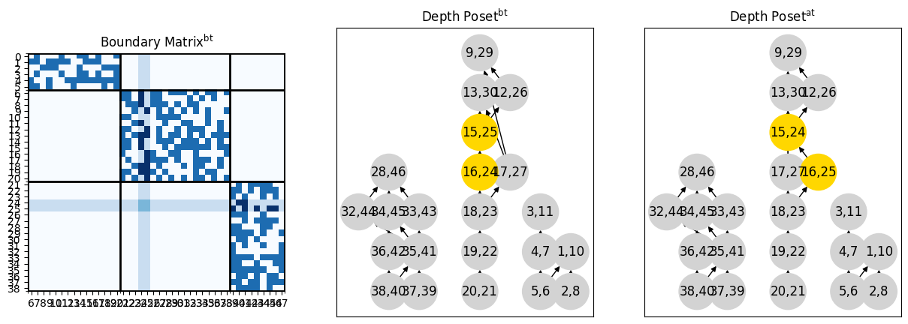

### Birth Death Pairs
|                          |                                                                                                                                                                                                                         |
|:-------------------------|:------------------------------------------------------------------------------------------------------------------------------------------------------------------------------------------------------------------------|
| Before the transposition | $\{(13, 30), (28, 46), (18, 23), (17, 27), (2, 8), (37, 39), (9, 29), (5, 6), (35, 41), (38, 40), (34, 45), (36, 42), (15, 25), (16, 24), (32, 44), (4, 7), (33, 43), (20, 21), (3, 11), (12, 26), (19, 22), (1, 10)\}$ |
| After the transposition  | $\{(13, 30), (28, 46), (18, 23), (15, 24), (17, 27), (2, 8), (37, 39), (9, 29), (16, 25), (5, 6), (35, 41), (38, 40), (34, 45), (36, 42), (32, 44), (4, 7), (33, 43), (20, 21), (3, 11), (12, 26), (19, 22), (1, 10)\}$ |

### Relations
|                          | Algorithm 1                                                                                                                                                                                                                                                                                                                                                                                                                                             | Algorithm 2                                                                                                                                                                                                                                                                                                                                                                                                                           |
|:-------------------------|:--------------------------------------------------------------------------------------------------------------------------------------------------------------------------------------------------------------------------------------------------------------------------------------------------------------------------------------------------------------------------------------------------------------------------------------------------------|:--------------------------------------------------------------------------------------------------------------------------------------------------------------------------------------------------------------------------------------------------------------------------------------------------------------------------------------------------------------------------------------------------------------------------------------|
| Before the transposition | $\{(24, 30), (41, 46), (22, 23), (21, 25), (21, 31), (22, 26), (23, 25), (40, 41), (22, 29), (23, 31), (45, 46), (24, 26), (25, 31), (41, 45), (26, 29), (29, 31), (46, 47), (21, 27), (39, 41), (23, 24), (23, 27), (40, 43), (22, 31), (39, 47), (8, 14), (27, 30), (24, 25), (6, 7), (41, 44), (25, 30), (42, 46), (21, 23), (26, 31), (44, 46), (22, 27), (21, 29), (40, 42), (22, 24), (39, 46), (40, 45), (8, 10), (27, 29), (25, 26), (7, 14)\}$ | $\{(32, 31), (18, 17), (4, 0), (35, 33), (20, 14), (4, 3), (5, 4), (38, 32), (5, 1), (34, 31), (19, 12), (36, 28), (37, 33), (19, 15), (36, 34), (15, 14), (16, 13), (18, 16), (35, 32), (20, 13), (3, 0), (20, 16), (38, 31), (20, 19), (17, 14), (19, 14), (19, 17), (37, 35), (37, 32), (16, 9), (15, 13), (16, 12), (18, 9), (33, 28), (20, 12), (20, 15), (38, 36), (37, 28), (37, 31), (37, 34), (15, 9), (15, 12), (32, 28)\}$ |
| After the transposition  | $\{(41, 46), (22, 23), (21, 25), (21, 31), (22, 26), (23, 25), (40, 41), (22, 29), (23, 31), (45, 46), (41, 45), (26, 29), (29, 31), (46, 47), (21, 27), (23, 24), (39, 41), (23, 27), (40, 43), (22, 31), (39, 47), (8, 14), (27, 30), (6, 7), (25, 24), (41, 44), (24, 31), (25, 30), (42, 46), (21, 23), (26, 31), (44, 46), (22, 27), (21, 29), (22, 24), (40, 42), (39, 46), (40, 45), (8, 10), (27, 29), (25, 26), (7, 14)\}$                     | $\{(32, 31), (4, 0), (18, 17), (35, 33), (20, 14), (4, 3), (5, 4), (38, 32), (5, 1), (19, 12), (34, 31), (36, 28), (19, 15), (37, 33), (36, 34), (15, 14), (18, 16), (35, 32), (20, 13), (3, 0), (20, 16), (38, 31), (20, 19), (17, 14), (19, 14), (19, 17), (37, 35), (37, 32), (15, 13), (18, 9), (33, 28), (16, 15), (20, 12), (20, 15), (38, 36), (37, 28), (37, 31), (37, 34), (15, 9), (16, 14), (15, 12), (32, 28)\}$          |

### Successors and Predecessers
|                 | $\text{Set}^\text{bt}(15, 25)$                                       | $\text{Set}^\text{bt}(16, 24)$                                       | $\text{Set}^\text{at}(16, 25)$                                       | $\text{Set}^\text{at}(15, 24)$                                       |
|:----------------|:---------------------------------------------------------------------|:---------------------------------------------------------------------|:---------------------------------------------------------------------|:---------------------------------------------------------------------|
| $\text{Succ}_1$ | $\text{Succ}_1^\text{bt}(15, 25) = \{(13, 30), (12, 26)\}$           | $\text{Succ}_1^\text{bt}(16, 24) = \{(13, 30), (15, 25), (12, 26)\}$ | $\text{Succ}_1^\text{at}(16, 25) = \{(13, 30), (15, 24), (12, 26)\}$ | $\text{Succ}_1^\text{at}(15, 24) = \emptyset$                        |
| $\text{Pred}_1$ | $\text{Pred}_1^\text{bt}(15, 25) = \{(16, 24), (18, 23), (20, 21)\}$ | $\text{Pred}_1^\text{bt}(16, 24) = \{(18, 23), (19, 22)\}$           | $\text{Pred}_1^\text{at}(16, 25) = \{(18, 23), (20, 21)\}$           | $\text{Pred}_1^\text{at}(15, 24) = \{(16, 25), (18, 23), (19, 22)\}$ |
| $\text{Succ}_2$ | $\text{Succ}_2^\text{bt}(15, 25) = \{(13, 30), (9, 29), (12, 26)\}$  | $\text{Succ}_2^\text{bt}(16, 24) = \{(13, 30), (9, 29), (12, 26)\}$  | $\text{Succ}_2^\text{at}(16, 25) = \{(15, 24)\}$                     | $\text{Succ}_2^\text{at}(15, 24) = \{(13, 30), (9, 29), (12, 26)\}$  |
| $\text{Pred}_2$ | $\text{Pred}_2^\text{bt}(15, 25) = \{(19, 22), (20, 21)\}$           | $\text{Pred}_2^\text{bt}(16, 24) = \{(18, 23), (20, 21)\}$           | $\text{Pred}_2^\text{at}(16, 25) = \{(18, 23), (20, 21)\}$           | $\text{Pred}_2^\text{at}(15, 24) = \{(16, 25), (19, 22), (20, 21)\}$ |

### Temp Sets
|                                                               | Before the Transposition                                                                                                     | After the Transposition                                                                                                      |
|:--------------------------------------------------------------|:-----------------------------------------------------------------------------------------------------------------------------|:-----------------------------------------------------------------------------------------------------------------------------|
| $\mathcal{B} = \{(s, t)\in \text{BD}:\; f(s) > f(x)\}$        | $\{(28, 46), (37, 39), (18, 23), (34, 45), (36, 42), (20, 21), (19, 22), (35, 41), (38, 40), (32, 44), (33, 43), (17, 27)\}$ | $\{(28, 46), (37, 39), (18, 23), (34, 45), (36, 42), (20, 21), (19, 22), (35, 41), (38, 40), (32, 44), (33, 43), (17, 27)\}$ |
| $\mathcal{N} = \{(s, t)\in \text{BD}:\; f(x) > f(s) > f(a)\}$ | $\emptyset$                                                                                                                  | $\emptyset$                                                                                                                  |

### Equations
There are 1 equations are wrong.

| eq   | left (formula)                  | left (paramatrized)               | left (value)                       | right (formula)                                                                                          | right (paramatrized)                                                                                           | right (value)                      | correct   |
|:-----|:--------------------------------|:----------------------------------|:-----------------------------------|:---------------------------------------------------------------------------------------------------------|:---------------------------------------------------------------------------------------------------------------|:-----------------------------------|:----------|
| Eq28 | $\text{Succ}_1^\text{at}(x, b)$ | $\text{Succ}_1^\text{at}(16, 25)$ | $\{(13, 30), (15, 24), (12, 26)\}$ | $\text{Succ}_1^\text{bt}(x, y) \oplus \{(a, y), (a, b)\}$                                                | $\text{Succ}_1^\text{bt}(16, 24) \oplus \{(15, 24), (15, 25)\}$                                                | $\{(13, 30), (15, 24), (12, 26)\}$ | ✔         |
| Eq29 | $\text{Succ}_1^\text{at}(a, y)$ | $\text{Succ}_1^\text{at}(15, 24)$ | $\emptyset$                        | $\text{Succ}_1^\text{bt}(a, b)$                                                                          | $\text{Succ}_1^\text{bt}(15, 25)$                                                                              | $\{(13, 30), (12, 26)\}$           | ✘         |
| Eq30 | $\text{Pred}_1^\text{at}(x, b)$ | $\text{Pred}_1^\text{at}(16, 25)$ | $\{(18, 23), (20, 21)\}$           | $[\text{Pred}_1^\text{bt}(a, b) \cap \mathcal{B}]$                                                       | $[\text{Pred}_1^\text{bt}(15, 25) \cap \mathcal{B}]$                                                           | $\{(18, 23), (20, 21)\}$           | ✔         |
| Eq31 | $\text{Pred}_1^\text{at}(a, y)$ | $\text{Pred}_1^\text{at}(15, 24)$ | $\{(16, 25), (18, 23), (19, 22)\}$ | $\text{Pred}_1^\text{bt}(x, y) \oplus \{(x, b)\} \oplus[\text{Pred}_1^\text{bt}(a, b) \cap \mathcal{N}]$ | $\text{Pred}_1^\text{bt}(16, 24) \oplus \{(16, 25)\} \oplus[\text{Pred}_1^\text{bt}(15, 25) \cap \mathcal{N}]$ | $\{(16, 25), (18, 23), (19, 22)\}$ | ✔         |
| Eq32 | $\text{Succ}_2^\text{at}(x, b)$ | $\text{Succ}_2^\text{at}(16, 25)$ | $\{(15, 24)\}$                     | $\text{Succ}_2^\text{bt}(x, y) \oplus \{(a, y)\} \oplus \text{Succ}_2^\text{bt}(a, b)$                   | $\text{Succ}_2^\text{bt}(16, 24) \oplus \{(15, 24)\} \oplus \text{Succ}_2^\text{bt}(15, 25)$                   | $\{(15, 24)\}$                     | ✔         |
| Eq33 | $\text{Succ}_2^\text{at}(a, y)$ | $\text{Succ}_2^\text{at}(15, 24)$ | $\{(13, 30), (9, 29), (12, 26)\}$  | $\text{Succ}_2^\text{bt}(a, b)$                                                                          | $\text{Succ}_2^\text{bt}(15, 25)$                                                                              | $\{(13, 30), (9, 29), (12, 26)\}$  | ✔         |
| Eq34 | $\text{Pred}_2^\text{at}(x, b)$ | $\text{Pred}_2^\text{at}(16, 25)$ | $\{(18, 23), (20, 21)\}$           | $\text{Pred}_2^\text{bt}(x, y)$                                                                          | $\text{Pred}_2^\text{bt}(16, 24)$                                                                              | $\{(18, 23), (20, 21)\}$           | ✔         |
| Eq35 | $\text{Pred}_2^\text{at}(a, y)$ | $\text{Pred}_2^\text{at}(15, 24)$ | $\{(16, 25), (19, 22), (20, 21)\}$ | $\text{Pred}_2^\text{bt}(a, b) \oplus \{(x, b)\}$                                                        | $\text{Pred}_2^\text{bt}(15, 25) \oplus \{(16, 25)\}$                                                          | $\{(16, 25), (19, 22), (20, 21)\}$ | ✔         |

## Transposition <26, 27> in complex 11
Here is a __death-death__ __no switch__ transposition <26, 27>.

$$
a = 17, \; b = 27, \; x = 12, \; y = 26
$$

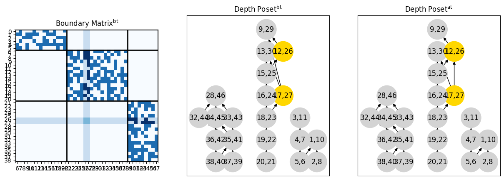

### Birth Death Pairs
|                          |                                                                                                                                                                                                                         |
|:-------------------------|:------------------------------------------------------------------------------------------------------------------------------------------------------------------------------------------------------------------------|
| Before the transposition | $\{(13, 30), (28, 46), (18, 23), (17, 27), (2, 8), (37, 39), (9, 29), (5, 6), (35, 41), (38, 40), (34, 45), (36, 42), (15, 25), (16, 24), (32, 44), (4, 7), (33, 43), (20, 21), (3, 11), (12, 26), (19, 22), (1, 10)\}$ |
| After the transposition  | $\{(13, 30), (28, 46), (18, 23), (17, 27), (2, 8), (37, 39), (9, 29), (5, 6), (35, 41), (38, 40), (34, 45), (36, 42), (15, 25), (16, 24), (32, 44), (4, 7), (33, 43), (20, 21), (3, 11), (12, 26), (19, 22), (1, 10)\}$ |

### Relations
|                          | Algorithm 1                                                                                                                                                                                                                                                                                                                                                                                                                                             | Algorithm 2                                                                                                                                                                                                                                                                                                                                                                                                                                     |
|:-------------------------|:--------------------------------------------------------------------------------------------------------------------------------------------------------------------------------------------------------------------------------------------------------------------------------------------------------------------------------------------------------------------------------------------------------------------------------------------------------|:------------------------------------------------------------------------------------------------------------------------------------------------------------------------------------------------------------------------------------------------------------------------------------------------------------------------------------------------------------------------------------------------------------------------------------------------|
| Before the transposition | $\{(24, 30), (41, 46), (22, 23), (21, 25), (21, 31), (22, 26), (23, 25), (40, 41), (22, 29), (23, 31), (45, 46), (24, 26), (25, 31), (41, 45), (26, 29), (29, 31), (46, 47), (21, 27), (39, 41), (23, 24), (23, 27), (40, 43), (22, 31), (39, 47), (8, 14), (27, 30), (24, 25), (6, 7), (41, 44), (25, 30), (42, 46), (21, 23), (26, 31), (44, 46), (22, 27), (21, 29), (40, 42), (22, 24), (39, 46), (40, 45), (8, 10), (27, 29), (25, 26), (7, 14)\}$ | $\{(32, 31), (18, 17), (4, 0), (35, 33), (20, 14), (4, 3), (5, 4), (38, 32), (5, 1), (34, 31), (19, 12), (36, 28), (37, 33), (19, 15), (36, 34), (15, 14), (16, 13), (18, 16), (35, 32), (20, 13), (3, 0), (20, 16), (38, 31), (20, 19), (17, 14), (19, 14), (19, 17), (37, 35), (37, 32), (16, 9), (15, 13), (16, 12), (18, 9), (33, 28), (20, 12), (20, 15), (38, 36), (37, 28), (37, 31), (37, 34), (15, 9), (15, 12), (32, 28)\}$           |
| After the transposition  | $\{(24, 30), (41, 46), (22, 23), (21, 25), (21, 31), (22, 26), (23, 25), (40, 41), (22, 29), (23, 31), (45, 46), (24, 26), (25, 31), (41, 45), (26, 29), (29, 31), (46, 47), (39, 41), (23, 24), (21, 27), (23, 27), (40, 43), (22, 31), (39, 47), (8, 14), (27, 30), (24, 25), (6, 7), (41, 44), (25, 30), (42, 46), (26, 31), (21, 23), (44, 46), (22, 27), (21, 29), (40, 42), (22, 24), (39, 46), (40, 45), (8, 10), (27, 29), (25, 26), (7, 14)\}$ | $\{(32, 31), (4, 0), (18, 17), (35, 33), (20, 14), (4, 3), (5, 4), (38, 32), (5, 1), (17, 12), (19, 12), (34, 31), (36, 28), (19, 15), (37, 33), (36, 34), (15, 14), (16, 13), (18, 16), (35, 32), (20, 13), (3, 0), (20, 16), (38, 31), (20, 19), (17, 14), (19, 14), (19, 17), (37, 35), (37, 32), (16, 9), (15, 13), (16, 12), (18, 9), (33, 28), (20, 12), (20, 15), (38, 36), (37, 28), (37, 31), (37, 34), (15, 9), (15, 12), (32, 28)\}$ |

### Successors and Predecessers
No such node in the Depth Poset

### Temp Sets
|                                                               | Before the Transposition                                                                                                                                   | After the Transposition                                                                                                                                    |
|:--------------------------------------------------------------|:-----------------------------------------------------------------------------------------------------------------------------------------------------------|:-----------------------------------------------------------------------------------------------------------------------------------------------------------|
| $\mathcal{B} = \{(s, t)\in \text{BD}:\; f(s) > f(x)\}$        | $\{(13, 30), (28, 46), (37, 39), (18, 23), (34, 45), (36, 42), (38, 40), (20, 21), (19, 22), (15, 25), (35, 41), (16, 24), (32, 44), (33, 43), (17, 27)\}$ | $\{(13, 30), (28, 46), (37, 39), (18, 23), (34, 45), (36, 42), (38, 40), (20, 21), (19, 22), (15, 25), (35, 41), (16, 24), (32, 44), (33, 43), (17, 27)\}$ |
| $\mathcal{N} = \{(s, t)\in \text{BD}:\; f(x) > f(s) > f(a)\}$ | $\emptyset$                                                                                                                                                | $\emptyset$                                                                                                                                                |

### Equations
There are 2 equations are wrong.

| eq   | left (formula)                  | left (paramatrized)               | left (value)             | right (formula)                                                                        | right (paramatrized)                                                                         | right (value)                      | correct   |
|:-----|:--------------------------------|:----------------------------------|:-------------------------|:---------------------------------------------------------------------------------------|:---------------------------------------------------------------------------------------------|:-----------------------------------|:----------|
| Eq36 | $\text{Succ}_2^\text{at}(x, y)$ | $\text{Succ}_2^\text{at}(12, 26)$ | $\emptyset$              | $\text{Succ}_2^\text{bt}(x, y) \oplus \{(a, b)\} \oplus \text{Succ}_2^\text{bt}(a, b)$ | $\text{Succ}_2^\text{bt}(12, 26) \oplus \{(17, 27)\} \oplus \text{Succ}_2^\text{bt}(17, 27)$ | $\{(17, 27)\}$                     | ✘         |
| Eq37 | $\text{Pred}_2^\text{at}(a, b)$ | $\text{Pred}_2^\text{at}(17, 27)$ | $\{(18, 23), (19, 22)\}$ | $\text{Pred}_2^\text{bt}(a, b) \oplus \{(x, y)\}$                                      | $\text{Pred}_2^\text{bt}(17, 27) \oplus \{(12, 26)\}$                                        | $\{(18, 23), (19, 22), (12, 26)\}$ | ✘         |

## Transposition <33, 34> in complex 11
Here is a __birth-birth__ __no switch__ transposition <33, 34>.

$$
a = 33, \; b = 43, \; x = 34, \; y = 45
$$

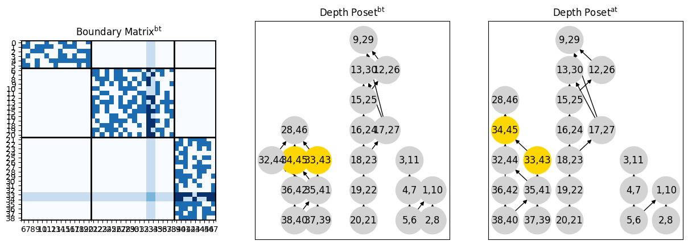

### Birth Death Pairs
|                          |                                                                                                                                                                                                                         |
|:-------------------------|:------------------------------------------------------------------------------------------------------------------------------------------------------------------------------------------------------------------------|
| Before the transposition | $\{(13, 30), (28, 46), (18, 23), (17, 27), (2, 8), (37, 39), (9, 29), (5, 6), (35, 41), (38, 40), (34, 45), (36, 42), (15, 25), (16, 24), (32, 44), (4, 7), (33, 43), (20, 21), (3, 11), (12, 26), (19, 22), (1, 10)\}$ |
| After the transposition  | $\{(13, 30), (28, 46), (18, 23), (17, 27), (2, 8), (37, 39), (9, 29), (5, 6), (35, 41), (38, 40), (34, 45), (36, 42), (15, 25), (16, 24), (32, 44), (4, 7), (33, 43), (20, 21), (3, 11), (12, 26), (19, 22), (1, 10)\}$ |

### Relations
|                          | Algorithm 1                                                                                                                                                                                                                                                                                                                                                                                                                                                                 | Algorithm 2                                                                                                                                                                                                                                                                                                                                                                                                                           |
|:-------------------------|:----------------------------------------------------------------------------------------------------------------------------------------------------------------------------------------------------------------------------------------------------------------------------------------------------------------------------------------------------------------------------------------------------------------------------------------------------------------------------|:--------------------------------------------------------------------------------------------------------------------------------------------------------------------------------------------------------------------------------------------------------------------------------------------------------------------------------------------------------------------------------------------------------------------------------------|
| Before the transposition | $\{(24, 30), (41, 46), (22, 23), (21, 25), (21, 31), (22, 26), (23, 25), (40, 41), (22, 29), (23, 31), (45, 46), (24, 26), (25, 31), (41, 45), (26, 29), (29, 31), (46, 47), (21, 27), (39, 41), (23, 24), (23, 27), (40, 43), (22, 31), (39, 47), (8, 14), (27, 30), (24, 25), (6, 7), (41, 44), (25, 30), (42, 46), (21, 23), (26, 31), (44, 46), (22, 27), (21, 29), (40, 42), (22, 24), (39, 46), (40, 45), (8, 10), (27, 29), (25, 26), (7, 14)\}$                     | $\{(32, 31), (18, 17), (4, 0), (35, 33), (20, 14), (4, 3), (5, 4), (38, 32), (5, 1), (34, 31), (19, 12), (36, 28), (37, 33), (19, 15), (36, 34), (15, 14), (16, 13), (18, 16), (35, 32), (20, 13), (3, 0), (20, 16), (38, 31), (20, 19), (17, 14), (19, 14), (19, 17), (37, 35), (37, 32), (16, 9), (15, 13), (16, 12), (18, 9), (33, 28), (20, 12), (20, 15), (38, 36), (37, 28), (37, 31), (37, 34), (15, 9), (15, 12), (32, 28)\}$ |
| After the transposition  | $\{(24, 30), (43, 46), (41, 46), (22, 23), (21, 25), (21, 31), (22, 26), (23, 25), (40, 41), (22, 29), (23, 31), (45, 46), (24, 26), (25, 31), (41, 45), (26, 29), (43, 45), (29, 31), (46, 47), (21, 27), (39, 41), (23, 24), (23, 27), (40, 43), (22, 31), (39, 47), (8, 14), (27, 30), (24, 25), (6, 7), (41, 44), (25, 30), (42, 46), (21, 23), (26, 31), (44, 46), (22, 27), (21, 29), (40, 42), (22, 24), (39, 46), (40, 45), (8, 10), (27, 29), (25, 26), (7, 14)\}$ | $\{(32, 31), (4, 0), (18, 17), (20, 14), (35, 33), (4, 3), (5, 4), (38, 32), (5, 1), (19, 12), (36, 28), (34, 31), (19, 15), (37, 33), (36, 34), (15, 14), (16, 13), (18, 16), (35, 32), (20, 13), (3, 0), (20, 16), (38, 31), (20, 19), (17, 14), (19, 14), (19, 17), (37, 35), (37, 32), (16, 9), (15, 13), (16, 12), (33, 28), (18, 9), (20, 12), (20, 15), (38, 36), (37, 28), (37, 31), (37, 34), (15, 9), (15, 12), (32, 28)\}$ |

### Successors and Predecessers
No such node in the Depth Poset

### Temp Sets
|                                                               | Before the Transposition                                                                                                                                                                            | After the Transposition                                                                                                                                                                             |
|:--------------------------------------------------------------|:----------------------------------------------------------------------------------------------------------------------------------------------------------------------------------------------------|:----------------------------------------------------------------------------------------------------------------------------------------------------------------------------------------------------|
| $\mathcal{L} = \{(s, t)\in \text{BD}:\; f(t) < f(y)\}$        | $\{(13, 30), (18, 23), (17, 27), (2, 8), (37, 39), (9, 29), (5, 6), (35, 41), (38, 40), (36, 42), (15, 25), (16, 24), (32, 44), (33, 43), (4, 7), (3, 11), (20, 21), (12, 26), (19, 22), (1, 10)\}$ | $\{(13, 30), (18, 23), (17, 27), (2, 8), (37, 39), (9, 29), (5, 6), (35, 41), (38, 40), (36, 42), (15, 25), (16, 24), (32, 44), (33, 43), (4, 7), (3, 11), (20, 21), (12, 26), (19, 22), (1, 10)\}$ |
| $\mathcal{M} = \{(s, t)\in \text{BD}:\; f(y) < f(t) < f(b)\}$ | $\emptyset$                                                                                                                                                                                         | $\emptyset$                                                                                                                                                                                         |

### Equations
There are 2 equations are wrong.

| eq   | left (formula)                  | left (paramatrized)               | left (value)   | right (formula)                                                                        | right (paramatrized)                                                                         | right (value)            | correct   |
|:-----|:--------------------------------|:----------------------------------|:---------------|:---------------------------------------------------------------------------------------|:---------------------------------------------------------------------------------------------|:-------------------------|:----------|
| Eq16 | $\text{Succ}_1^\text{at}(x, y)$ | $\text{Succ}_1^\text{at}(34, 45)$ | $\{(28, 46)\}$ | $\text{Succ}_1^\text{bt}(x, y) \oplus \{(a, b)\} \oplus \text{Succ}_1^\text{bt}(a, b)$ | $\text{Succ}_1^\text{bt}(34, 45) \oplus \{(33, 43)\} \oplus \text{Succ}_1^\text{bt}(33, 43)$ | $\{(28, 46), (33, 43)\}$ | ✘         |
| Eq17 | $\text{Pred}_1^\text{at}(a, b)$ | $\text{Pred}_1^\text{at}(33, 43)$ | $\{(38, 40)\}$ | $\text{Pred}_1^\text{bt}(a, b) \oplus \{(x, y)\}$                                      | $\text{Pred}_1^\text{bt}(33, 43) \oplus \{(34, 45)\}$                                        | $\{(38, 40), (34, 45)\}$ | ✘         |

## Transposition <37, 38> in complex 11
Here is a __birth-birth__ __no switch__ transposition <37, 38>.

$$
a = 37, \; b = 39, \; x = 38, \; y = 40
$$

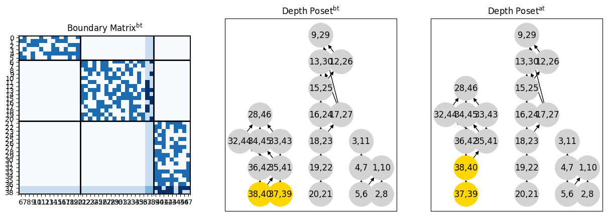

### Birth Death Pairs
|                          |                                                                                                                                                                                                                         |
|:-------------------------|:------------------------------------------------------------------------------------------------------------------------------------------------------------------------------------------------------------------------|
| Before the transposition | $\{(13, 30), (28, 46), (18, 23), (17, 27), (2, 8), (37, 39), (9, 29), (5, 6), (35, 41), (38, 40), (34, 45), (36, 42), (15, 25), (16, 24), (32, 44), (4, 7), (33, 43), (20, 21), (3, 11), (12, 26), (19, 22), (1, 10)\}$ |
| After the transposition  | $\{(13, 30), (28, 46), (18, 23), (17, 27), (2, 8), (37, 39), (9, 29), (5, 6), (35, 41), (38, 40), (34, 45), (36, 42), (15, 25), (16, 24), (32, 44), (4, 7), (33, 43), (20, 21), (3, 11), (12, 26), (19, 22), (1, 10)\}$ |

### Relations
|                          | Algorithm 1                                                                                                                                                                                                                                                                                                                                                                                                                                                                           | Algorithm 2                                                                                                                                                                                                                                                                                                                                                                                                                           |
|:-------------------------|:--------------------------------------------------------------------------------------------------------------------------------------------------------------------------------------------------------------------------------------------------------------------------------------------------------------------------------------------------------------------------------------------------------------------------------------------------------------------------------------|:--------------------------------------------------------------------------------------------------------------------------------------------------------------------------------------------------------------------------------------------------------------------------------------------------------------------------------------------------------------------------------------------------------------------------------------|
| Before the transposition | $\{(24, 30), (41, 46), (22, 23), (21, 25), (21, 31), (22, 26), (23, 25), (40, 41), (22, 29), (23, 31), (45, 46), (24, 26), (25, 31), (41, 45), (26, 29), (29, 31), (46, 47), (21, 27), (39, 41), (23, 24), (23, 27), (40, 43), (22, 31), (39, 47), (8, 14), (27, 30), (24, 25), (6, 7), (41, 44), (25, 30), (42, 46), (21, 23), (26, 31), (44, 46), (22, 27), (21, 29), (40, 42), (22, 24), (39, 46), (40, 45), (8, 10), (27, 29), (25, 26), (7, 14)\}$                               | $\{(32, 31), (18, 17), (4, 0), (35, 33), (20, 14), (4, 3), (5, 4), (38, 32), (5, 1), (34, 31), (19, 12), (36, 28), (37, 33), (19, 15), (36, 34), (15, 14), (16, 13), (18, 16), (35, 32), (20, 13), (3, 0), (20, 16), (38, 31), (20, 19), (17, 14), (19, 14), (19, 17), (37, 35), (37, 32), (16, 9), (15, 13), (16, 12), (18, 9), (33, 28), (20, 12), (20, 15), (38, 36), (37, 28), (37, 31), (37, 34), (15, 9), (15, 12), (32, 28)\}$ |
| After the transposition  | $\{(24, 30), (41, 46), (22, 23), (21, 25), (21, 31), (22, 26), (39, 42), (23, 25), (40, 41), (22, 29), (39, 45), (23, 31), (45, 46), (24, 26), (25, 31), (41, 45), (26, 29), (29, 31), (46, 47), (21, 27), (23, 24), (23, 27), (40, 43), (22, 31), (39, 47), (8, 14), (27, 30), (24, 25), (6, 7), (41, 44), (25, 30), (42, 46), (21, 23), (26, 31), (44, 46), (22, 27), (21, 29), (40, 42), (39, 40), (39, 46), (22, 24), (40, 45), (39, 43), (8, 10), (27, 29), (25, 26), (7, 14)\}$ | $\{(32, 31), (4, 0), (18, 17), (35, 33), (20, 14), (4, 3), (5, 4), (38, 32), (5, 1), (19, 12), (34, 31), (36, 28), (19, 15), (37, 33), (36, 34), (15, 14), (16, 13), (18, 16), (35, 32), (20, 13), (3, 0), (20, 16), (38, 31), (20, 19), (17, 14), (19, 14), (37, 35), (19, 17), (37, 32), (16, 9), (15, 13), (16, 12), (18, 9), (33, 28), (20, 12), (20, 15), (38, 36), (37, 28), (37, 31), (37, 34), (15, 9), (15, 12), (32, 28)\}$ |

### Successors and Predecessers
No such node in the Depth Poset

### Temp Sets
|                                                               | Before the Transposition                                                                                                                          | After the Transposition                                                                                                                           |
|:--------------------------------------------------------------|:--------------------------------------------------------------------------------------------------------------------------------------------------|:--------------------------------------------------------------------------------------------------------------------------------------------------|
| $\mathcal{L} = \{(s, t)\in \text{BD}:\; f(t) < f(y)\}$        | $\{(13, 30), (37, 39), (18, 23), (9, 29), (2, 8), (12, 26), (17, 27), (20, 21), (19, 22), (15, 25), (5, 6), (16, 24), (1, 10), (4, 7), (3, 11)\}$ | $\{(13, 30), (37, 39), (18, 23), (9, 29), (2, 8), (12, 26), (17, 27), (20, 21), (19, 22), (15, 25), (5, 6), (16, 24), (1, 10), (4, 7), (3, 11)\}$ |
| $\mathcal{M} = \{(s, t)\in \text{BD}:\; f(y) < f(t) < f(b)\}$ | $\emptyset$                                                                                                                                       | $\emptyset$                                                                                                                                       |

### Equations
There are 2 equations are wrong.

| eq   | left (formula)                  | left (paramatrized)               | left (value)                                 | right (formula)                                                                        | right (paramatrized)                                                                         | right (value)                                          | correct   |
|:-----|:--------------------------------|:----------------------------------|:---------------------------------------------|:---------------------------------------------------------------------------------------|:---------------------------------------------------------------------------------------------|:-------------------------------------------------------|:----------|
| Eq16 | $\text{Succ}_1^\text{at}(x, y)$ | $\text{Succ}_1^\text{at}(38, 40)$ | $\{(34, 45), (36, 42), (33, 43), (35, 41)\}$ | $\text{Succ}_1^\text{bt}(x, y) \oplus \{(a, b)\} \oplus \text{Succ}_1^\text{bt}(a, b)$ | $\text{Succ}_1^\text{bt}(38, 40) \oplus \{(37, 39)\} \oplus \text{Succ}_1^\text{bt}(37, 39)$ | $\{(28, 46), (37, 39), (34, 45), (36, 42), (33, 43)\}$ | ✘         |
| Eq17 | $\text{Pred}_1^\text{at}(a, b)$ | $\text{Pred}_1^\text{at}(37, 39)$ | $\emptyset$                                  | $\text{Pred}_1^\text{bt}(a, b) \oplus \{(x, y)\}$                                      | $\text{Pred}_1^\text{bt}(37, 39) \oplus \{(38, 40)\}$                                        | $\{(38, 40)\}$                                         | ✘         |

## Transposition <39, 40> in complex 11
Here is a __death-death__ __no switch__ transposition <39, 40>.

$$
a = 38, \; b = 40, \; x = 37, \; y = 39
$$

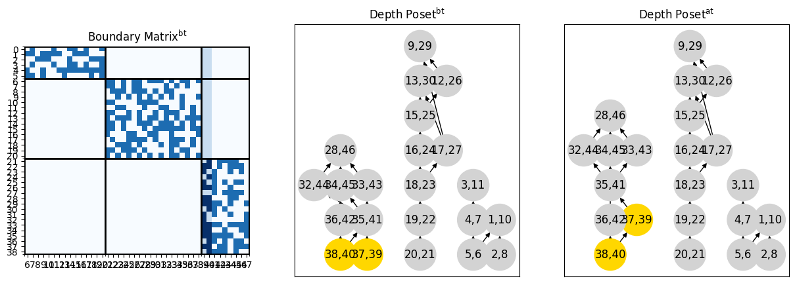

### Birth Death Pairs
|                          |                                                                                                                                                                                                                         |
|:-------------------------|:------------------------------------------------------------------------------------------------------------------------------------------------------------------------------------------------------------------------|
| Before the transposition | $\{(13, 30), (28, 46), (18, 23), (17, 27), (2, 8), (37, 39), (9, 29), (5, 6), (35, 41), (38, 40), (34, 45), (36, 42), (15, 25), (16, 24), (32, 44), (4, 7), (33, 43), (20, 21), (3, 11), (12, 26), (19, 22), (1, 10)\}$ |
| After the transposition  | $\{(13, 30), (28, 46), (18, 23), (17, 27), (2, 8), (37, 39), (9, 29), (5, 6), (35, 41), (38, 40), (34, 45), (36, 42), (15, 25), (16, 24), (32, 44), (4, 7), (33, 43), (20, 21), (3, 11), (12, 26), (19, 22), (1, 10)\}$ |

### Relations
|                          | Algorithm 1                                                                                                                                                                                                                                                                                                                                                                                                                                             | Algorithm 2                                                                                                                                                                                                                                                                                                                                                                                                                                                         |
|:-------------------------|:--------------------------------------------------------------------------------------------------------------------------------------------------------------------------------------------------------------------------------------------------------------------------------------------------------------------------------------------------------------------------------------------------------------------------------------------------------|:--------------------------------------------------------------------------------------------------------------------------------------------------------------------------------------------------------------------------------------------------------------------------------------------------------------------------------------------------------------------------------------------------------------------------------------------------------------------|
| Before the transposition | $\{(24, 30), (41, 46), (22, 23), (21, 25), (21, 31), (22, 26), (23, 25), (40, 41), (22, 29), (23, 31), (45, 46), (24, 26), (25, 31), (41, 45), (26, 29), (29, 31), (46, 47), (21, 27), (39, 41), (23, 24), (23, 27), (40, 43), (22, 31), (39, 47), (8, 14), (27, 30), (24, 25), (6, 7), (41, 44), (25, 30), (42, 46), (21, 23), (26, 31), (44, 46), (22, 27), (21, 29), (40, 42), (22, 24), (39, 46), (40, 45), (8, 10), (27, 29), (25, 26), (7, 14)\}$ | $\{(32, 31), (18, 17), (4, 0), (35, 33), (20, 14), (4, 3), (5, 4), (38, 32), (5, 1), (34, 31), (19, 12), (36, 28), (37, 33), (19, 15), (36, 34), (15, 14), (16, 13), (18, 16), (35, 32), (20, 13), (3, 0), (20, 16), (38, 31), (20, 19), (17, 14), (19, 14), (19, 17), (37, 35), (37, 32), (16, 9), (15, 13), (16, 12), (18, 9), (33, 28), (20, 12), (20, 15), (38, 36), (37, 28), (37, 31), (37, 34), (15, 9), (15, 12), (32, 28)\}$                               |
| After the transposition  | $\{(24, 30), (41, 46), (22, 23), (21, 25), (21, 31), (22, 26), (23, 25), (23, 31), (22, 29), (40, 41), (45, 46), (24, 26), (25, 31), (41, 45), (26, 29), (29, 31), (46, 47), (39, 41), (21, 27), (23, 24), (23, 27), (40, 43), (22, 31), (39, 47), (8, 14), (27, 30), (24, 25), (6, 7), (41, 44), (25, 30), (42, 46), (21, 23), (26, 31), (44, 46), (22, 27), (21, 29), (40, 42), (22, 24), (39, 46), (40, 45), (8, 10), (27, 29), (25, 26), (7, 14)\}$ | $\{(32, 31), (4, 0), (18, 17), (35, 33), (20, 14), (4, 3), (38, 35), (5, 4), (5, 1), (19, 12), (34, 31), (36, 28), (19, 15), (37, 33), (36, 34), (15, 14), (16, 13), (18, 16), (35, 32), (20, 13), (3, 0), (20, 16), (38, 28), (20, 19), (38, 37), (38, 34), (17, 14), (19, 14), (19, 17), (37, 35), (37, 32), (16, 9), (15, 13), (16, 12), (18, 9), (33, 28), (20, 12), (20, 15), (38, 33), (38, 36), (37, 28), (37, 31), (37, 34), (15, 9), (15, 12), (32, 28)\}$ |

### Successors and Predecessers
No such node in the Depth Poset

### Temp Sets
|                                                               | Before the Transposition   | After the Transposition   |
|:--------------------------------------------------------------|:---------------------------|:--------------------------|
| $\mathcal{B} = \{(s, t)\in \text{BD}:\; f(s) > f(x)\}$        | $\{(38, 40)\}$             | $\{(38, 40)\}$            |
| $\mathcal{N} = \{(s, t)\in \text{BD}:\; f(x) > f(s) > f(a)\}$ | $\emptyset$                | $\emptyset$               |

### Equations
There are 2 equations are wrong.

| eq   | left (formula)                  | left (paramatrized)               | left (value)                                           | right (formula)                                                                        | right (paramatrized)                                                                         | right (value)                                                    | correct   |
|:-----|:--------------------------------|:----------------------------------|:-------------------------------------------------------|:---------------------------------------------------------------------------------------|:---------------------------------------------------------------------------------------------|:-----------------------------------------------------------------|:----------|
| Eq36 | $\text{Succ}_2^\text{at}(x, y)$ | $\text{Succ}_2^\text{at}(37, 39)$ | $\{(28, 46), (34, 45), (35, 41), (32, 44), (33, 43)\}$ | $\text{Succ}_2^\text{bt}(x, y) \oplus \{(a, b)\} \oplus \text{Succ}_2^\text{bt}(a, b)$ | $\text{Succ}_2^\text{bt}(37, 39) \oplus \{(38, 40)\} \oplus \text{Succ}_2^\text{bt}(38, 40)$ | $\{(28, 46), (34, 45), (36, 42), (35, 41), (38, 40), (33, 43)\}$ | ✘         |
| Eq37 | $\text{Pred}_2^\text{at}(a, b)$ | $\text{Pred}_2^\text{at}(38, 40)$ | $\emptyset$                                            | $\text{Pred}_2^\text{bt}(a, b) \oplus \{(x, y)\}$                                      | $\text{Pred}_2^\text{bt}(38, 40) \oplus \{(37, 39)\}$                                        | $\{(37, 39)\}$                                                   | ✘         |

## Transposition <40, 41> in complex 11
Here is a __death-death__ __switch forward__ transposition <40, 41>.

$$
a = 35, \; b = 41, \; x = 38, \; y = 40
$$

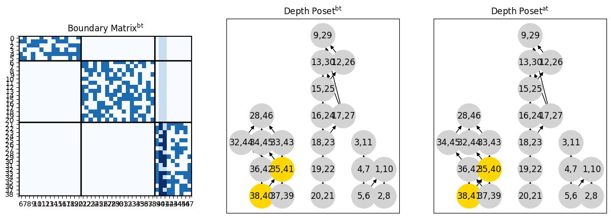

### Birth Death Pairs
|                          |                                                                                                                                                                                                                         |
|:-------------------------|:------------------------------------------------------------------------------------------------------------------------------------------------------------------------------------------------------------------------|
| Before the transposition | $\{(13, 30), (28, 46), (18, 23), (17, 27), (2, 8), (37, 39), (9, 29), (5, 6), (35, 41), (38, 40), (34, 45), (36, 42), (15, 25), (16, 24), (32, 44), (4, 7), (33, 43), (20, 21), (3, 11), (12, 26), (19, 22), (1, 10)\}$ |
| After the transposition  | $\{(13, 30), (28, 46), (18, 23), (38, 41), (17, 27), (2, 8), (37, 39), (9, 29), (5, 6), (34, 45), (36, 42), (15, 25), (16, 24), (32, 44), (4, 7), (33, 43), (35, 40), (20, 21), (3, 11), (12, 26), (19, 22), (1, 10)\}$ |

### Relations
|                          | Algorithm 1                                                                                                                                                                                                                                                                                                                                                                                                                                                                 | Algorithm 2                                                                                                                                                                                                                                                                                                                                                                                                                                     |
|:-------------------------|:----------------------------------------------------------------------------------------------------------------------------------------------------------------------------------------------------------------------------------------------------------------------------------------------------------------------------------------------------------------------------------------------------------------------------------------------------------------------------|:------------------------------------------------------------------------------------------------------------------------------------------------------------------------------------------------------------------------------------------------------------------------------------------------------------------------------------------------------------------------------------------------------------------------------------------------|
| Before the transposition | $\{(24, 30), (41, 46), (22, 23), (21, 25), (21, 31), (22, 26), (23, 25), (40, 41), (22, 29), (23, 31), (45, 46), (24, 26), (25, 31), (41, 45), (26, 29), (29, 31), (46, 47), (21, 27), (39, 41), (23, 24), (23, 27), (40, 43), (22, 31), (39, 47), (8, 14), (27, 30), (24, 25), (6, 7), (41, 44), (25, 30), (42, 46), (21, 23), (26, 31), (44, 46), (22, 27), (21, 29), (40, 42), (22, 24), (39, 46), (40, 45), (8, 10), (27, 29), (25, 26), (7, 14)\}$                     | $\{(32, 31), (18, 17), (4, 0), (35, 33), (20, 14), (4, 3), (5, 4), (38, 32), (5, 1), (34, 31), (19, 12), (36, 28), (37, 33), (19, 15), (36, 34), (15, 14), (16, 13), (18, 16), (35, 32), (20, 13), (3, 0), (20, 16), (38, 31), (20, 19), (17, 14), (19, 14), (19, 17), (37, 35), (37, 32), (16, 9), (15, 13), (16, 12), (18, 9), (33, 28), (20, 12), (20, 15), (38, 36), (37, 28), (37, 31), (37, 34), (15, 9), (15, 12), (32, 28)\}$           |
| After the transposition  | $\{(24, 30), (41, 40), (41, 43), (22, 23), (21, 25), (21, 31), (22, 26), (39, 42), (23, 25), (23, 31), (22, 29), (39, 45), (40, 44), (45, 46), (24, 26), (41, 42), (25, 31), (41, 45), (26, 29), (29, 31), (46, 47), (21, 27), (23, 24), (23, 27), (40, 43), (22, 31), (39, 47), (8, 14), (27, 30), (24, 25), (6, 7), (25, 30), (42, 46), (21, 23), (26, 31), (44, 46), (22, 27), (21, 29), (22, 24), (39, 40), (39, 46), (8, 10), (39, 43), (27, 29), (25, 26), (7, 14)\}$ | $\{(32, 31), (4, 0), (18, 17), (35, 33), (20, 14), (4, 3), (38, 35), (5, 4), (5, 1), (19, 12), (34, 31), (36, 28), (19, 15), (37, 33), (36, 34), (15, 14), (16, 13), (18, 16), (35, 32), (20, 13), (3, 0), (20, 16), (38, 31), (20, 19), (17, 14), (19, 14), (19, 17), (37, 35), (37, 32), (16, 9), (15, 13), (16, 12), (18, 9), (33, 28), (20, 12), (20, 15), (38, 33), (38, 36), (37, 28), (37, 31), (37, 34), (15, 9), (15, 12), (32, 28)\}$ |

### Successors and Predecessers
|                 | $\text{Set}^\text{bt}(35, 41)$                                       | $\text{Set}^\text{bt}(38, 40)$                                                 | $\text{Set}^\text{at}(38, 41)$                                                 | $\text{Set}^\text{at}(35, 40)$                             |
|:----------------|:---------------------------------------------------------------------|:-------------------------------------------------------------------------------|:-------------------------------------------------------------------------------|:-----------------------------------------------------------|
| $\text{Succ}_1$ | $\text{Succ}_1^\text{bt}(35, 41) = \{(28, 46), (34, 45), (32, 44)\}$ | $\text{Succ}_1^\text{bt}(38, 40) = \{(34, 45), (36, 42), (33, 43), (35, 41)\}$ | $\text{Succ}_1^\text{at}(38, 41) = \{(34, 45), (36, 42), (33, 43), (35, 40)\}$ | $\text{Succ}_1^\text{at}(35, 40) = \{(32, 44), (33, 43)\}$ |
| $\text{Pred}_1$ | $\text{Pred}_1^\text{bt}(35, 41) = \{(38, 40), (37, 39)\}$           | $\text{Pred}_1^\text{bt}(38, 40) = \emptyset$                                  | $\text{Pred}_1^\text{at}(38, 41) = \emptyset$                                  | $\text{Pred}_1^\text{at}(35, 40) = \{(38, 41), (37, 39)\}$ |
| $\text{Succ}_2$ | $\text{Succ}_2^\text{bt}(35, 41) = \{(32, 44), (33, 43)\}$           | $\text{Succ}_2^\text{bt}(38, 40) = \{(32, 44), (36, 42)\}$                     | $\text{Succ}_2^\text{at}(38, 41) = \{(36, 42), (33, 43), (35, 40)\}$           | $\text{Succ}_2^\text{at}(35, 40) = \{(32, 44), (33, 43)\}$ |
| $\text{Pred}_2$ | $\text{Pred}_2^\text{bt}(35, 41) = \{(37, 39)\}$                     | $\text{Pred}_2^\text{bt}(38, 40) = \emptyset$                                  | $\text{Pred}_2^\text{at}(38, 41) = \emptyset$                                  | $\text{Pred}_2^\text{at}(35, 40) = \{(38, 41), (37, 39)\}$ |

### Temp Sets
|                                                               | Before the Transposition   | After the Transposition   |
|:--------------------------------------------------------------|:---------------------------|:--------------------------|
| $\mathcal{B} = \{(s, t)\in \text{BD}:\; f(s) > f(x)\}$        | $\emptyset$                | $\emptyset$               |
| $\mathcal{N} = \{(s, t)\in \text{BD}:\; f(x) > f(s) > f(a)\}$ | $\{(37, 39), (36, 42)\}$   | $\{(37, 39), (36, 42)\}$  |

### Equations
There are 1 equations are wrong.

| eq   | left (formula)                  | left (paramatrized)               | left (value)                                 | right (formula)                                                                                          | right (paramatrized)                                                                                           | right (value)                                | correct   |
|:-----|:--------------------------------|:----------------------------------|:---------------------------------------------|:---------------------------------------------------------------------------------------------------------|:---------------------------------------------------------------------------------------------------------------|:---------------------------------------------|:----------|
| Eq28 | $\text{Succ}_1^\text{at}(x, b)$ | $\text{Succ}_1^\text{at}(38, 41)$ | $\{(34, 45), (36, 42), (33, 43), (35, 40)\}$ | $\text{Succ}_1^\text{bt}(x, y) \oplus \{(a, y), (a, b)\}$                                                | $\text{Succ}_1^\text{bt}(38, 40) \oplus \{(35, 40), (35, 41)\}$                                                | $\{(34, 45), (36, 42), (33, 43), (35, 40)\}$ | ✔         |
| Eq29 | $\text{Succ}_1^\text{at}(a, y)$ | $\text{Succ}_1^\text{at}(35, 40)$ | $\{(32, 44), (33, 43)\}$                     | $\text{Succ}_1^\text{bt}(a, b)$                                                                          | $\text{Succ}_1^\text{bt}(35, 41)$                                                                              | $\{(28, 46), (34, 45), (32, 44)\}$           | ✘         |
| Eq30 | $\text{Pred}_1^\text{at}(x, b)$ | $\text{Pred}_1^\text{at}(38, 41)$ | $\emptyset$                                  | $[\text{Pred}_1^\text{bt}(a, b) \cap \mathcal{B}]$                                                       | $[\text{Pred}_1^\text{bt}(35, 41) \cap \mathcal{B}]$                                                           | $\emptyset$                                  | ✔         |
| Eq31 | $\text{Pred}_1^\text{at}(a, y)$ | $\text{Pred}_1^\text{at}(35, 40)$ | $\{(38, 41), (37, 39)\}$                     | $\text{Pred}_1^\text{bt}(x, y) \oplus \{(x, b)\} \oplus[\text{Pred}_1^\text{bt}(a, b) \cap \mathcal{N}]$ | $\text{Pred}_1^\text{bt}(38, 40) \oplus \{(38, 41)\} \oplus[\text{Pred}_1^\text{bt}(35, 41) \cap \mathcal{N}]$ | $\{(38, 41), (37, 39)\}$                     | ✔         |
| Eq32 | $\text{Succ}_2^\text{at}(x, b)$ | $\text{Succ}_2^\text{at}(38, 41)$ | $\{(36, 42), (33, 43), (35, 40)\}$           | $\text{Succ}_2^\text{bt}(x, y) \oplus \{(a, y)\} \oplus \text{Succ}_2^\text{bt}(a, b)$                   | $\text{Succ}_2^\text{bt}(38, 40) \oplus \{(35, 40)\} \oplus \text{Succ}_2^\text{bt}(35, 41)$                   | $\{(36, 42), (33, 43), (35, 40)\}$           | ✔         |
| Eq33 | $\text{Succ}_2^\text{at}(a, y)$ | $\text{Succ}_2^\text{at}(35, 40)$ | $\{(32, 44), (33, 43)\}$                     | $\text{Succ}_2^\text{bt}(a, b)$                                                                          | $\text{Succ}_2^\text{bt}(35, 41)$                                                                              | $\{(32, 44), (33, 43)\}$                     | ✔         |
| Eq34 | $\text{Pred}_2^\text{at}(x, b)$ | $\text{Pred}_2^\text{at}(38, 41)$ | $\emptyset$                                  | $\text{Pred}_2^\text{bt}(x, y)$                                                                          | $\text{Pred}_2^\text{bt}(38, 40)$                                                                              | $\emptyset$                                  | ✔         |
| Eq35 | $\text{Pred}_2^\text{at}(a, y)$ | $\text{Pred}_2^\text{at}(35, 40)$ | $\{(38, 41), (37, 39)\}$                     | $\text{Pred}_2^\text{bt}(a, b) \oplus \{(x, b)\}$                                                        | $\text{Pred}_2^\text{bt}(35, 41) \oplus \{(38, 41)\}$                                                          | $\{(38, 41), (37, 39)\}$                     | ✔         |

## Transposition <44, 45> in complex 11
Here is a __death-death__ __no switch__ transposition <44, 45>.

$$
a = 34, \; b = 45, \; x = 32, \; y = 44
$$

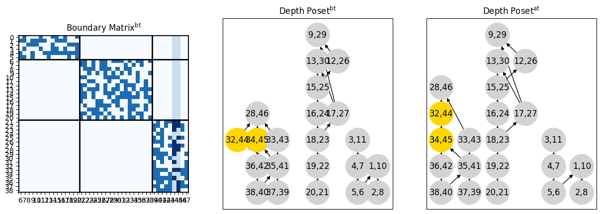

### Birth Death Pairs
|                          |                                                                                                                                                                                                                         |
|:-------------------------|:------------------------------------------------------------------------------------------------------------------------------------------------------------------------------------------------------------------------|
| Before the transposition | $\{(13, 30), (28, 46), (18, 23), (17, 27), (2, 8), (37, 39), (9, 29), (5, 6), (35, 41), (38, 40), (34, 45), (36, 42), (15, 25), (16, 24), (32, 44), (4, 7), (33, 43), (20, 21), (3, 11), (12, 26), (19, 22), (1, 10)\}$ |
| After the transposition  | $\{(13, 30), (28, 46), (18, 23), (17, 27), (2, 8), (37, 39), (9, 29), (5, 6), (35, 41), (38, 40), (34, 45), (36, 42), (15, 25), (16, 24), (32, 44), (4, 7), (33, 43), (20, 21), (3, 11), (12, 26), (19, 22), (1, 10)\}$ |

### Relations
|                          | Algorithm 1                                                                                                                                                                                                                                                                                                                                                                                                                                             | Algorithm 2                                                                                                                                                                                                                                                                                                                                                                                                                                     |
|:-------------------------|:--------------------------------------------------------------------------------------------------------------------------------------------------------------------------------------------------------------------------------------------------------------------------------------------------------------------------------------------------------------------------------------------------------------------------------------------------------|:------------------------------------------------------------------------------------------------------------------------------------------------------------------------------------------------------------------------------------------------------------------------------------------------------------------------------------------------------------------------------------------------------------------------------------------------|
| Before the transposition | $\{(24, 30), (41, 46), (22, 23), (21, 25), (21, 31), (22, 26), (23, 25), (40, 41), (22, 29), (23, 31), (45, 46), (24, 26), (25, 31), (41, 45), (26, 29), (29, 31), (46, 47), (21, 27), (39, 41), (23, 24), (23, 27), (40, 43), (22, 31), (39, 47), (8, 14), (27, 30), (24, 25), (6, 7), (41, 44), (25, 30), (42, 46), (21, 23), (26, 31), (44, 46), (22, 27), (21, 29), (40, 42), (22, 24), (39, 46), (40, 45), (8, 10), (27, 29), (25, 26), (7, 14)\}$ | $\{(32, 31), (18, 17), (4, 0), (35, 33), (20, 14), (4, 3), (5, 4), (38, 32), (5, 1), (34, 31), (19, 12), (36, 28), (37, 33), (19, 15), (36, 34), (15, 14), (16, 13), (18, 16), (35, 32), (20, 13), (3, 0), (20, 16), (38, 31), (20, 19), (17, 14), (19, 14), (19, 17), (37, 35), (37, 32), (16, 9), (15, 13), (16, 12), (18, 9), (33, 28), (20, 12), (20, 15), (38, 36), (37, 28), (37, 31), (37, 34), (15, 9), (15, 12), (32, 28)\}$           |
| After the transposition  | $\{(24, 30), (41, 46), (22, 23), (21, 25), (21, 31), (22, 26), (23, 25), (40, 41), (22, 29), (23, 31), (45, 46), (24, 26), (25, 31), (41, 45), (26, 29), (29, 31), (46, 47), (21, 27), (39, 41), (23, 24), (23, 27), (40, 43), (22, 31), (39, 47), (8, 14), (27, 30), (24, 25), (6, 7), (41, 44), (25, 30), (42, 46), (21, 23), (26, 31), (44, 46), (22, 27), (21, 29), (40, 42), (22, 24), (39, 46), (40, 45), (8, 10), (27, 29), (25, 26), (7, 14)\}$ | $\{(32, 31), (4, 0), (18, 17), (35, 33), (20, 14), (4, 3), (5, 4), (38, 32), (5, 1), (34, 28), (19, 12), (36, 28), (19, 15), (37, 33), (36, 34), (15, 14), (16, 13), (18, 16), (35, 32), (20, 13), (3, 0), (20, 16), (38, 31), (20, 19), (17, 14), (19, 14), (19, 17), (37, 35), (37, 32), (16, 9), (15, 13), (16, 12), (18, 9), (33, 28), (20, 12), (20, 15), (38, 36), (37, 28), (37, 31), (34, 32), (37, 34), (15, 9), (15, 12), (32, 28)\}$ |

### Successors and Predecessers
No such node in the Depth Poset

### Temp Sets
|                                                               | Before the Transposition                                         | After the Transposition                                          |
|:--------------------------------------------------------------|:-----------------------------------------------------------------|:-----------------------------------------------------------------|
| $\mathcal{B} = \{(s, t)\in \text{BD}:\; f(s) > f(x)\}$        | $\{(37, 39), (34, 45), (36, 42), (35, 41), (38, 40), (33, 43)\}$ | $\{(37, 39), (34, 45), (36, 42), (35, 41), (38, 40), (33, 43)\}$ |
| $\mathcal{N} = \{(s, t)\in \text{BD}:\; f(x) > f(s) > f(a)\}$ | $\emptyset$                                                      | $\emptyset$                                                      |

### Equations
There are 2 equations are wrong.

| eq   | left (formula)                  | left (paramatrized)               | left (value)             | right (formula)                                                                        | right (paramatrized)                                                                         | right (value)                      | correct   |
|:-----|:--------------------------------|:----------------------------------|:-------------------------|:---------------------------------------------------------------------------------------|:---------------------------------------------------------------------------------------------|:-----------------------------------|:----------|
| Eq36 | $\text{Succ}_2^\text{at}(x, y)$ | $\text{Succ}_2^\text{at}(32, 44)$ | $\{(28, 46)\}$           | $\text{Succ}_2^\text{bt}(x, y) \oplus \{(a, b)\} \oplus \text{Succ}_2^\text{bt}(a, b)$ | $\text{Succ}_2^\text{bt}(32, 44) \oplus \{(34, 45)\} \oplus \text{Succ}_2^\text{bt}(34, 45)$ | $\{(28, 46), (34, 45)\}$           | ✘         |
| Eq37 | $\text{Pred}_2^\text{at}(a, b)$ | $\text{Pred}_2^\text{at}(34, 45)$ | $\{(37, 39), (36, 42)\}$ | $\text{Pred}_2^\text{bt}(a, b) \oplus \{(x, y)\}$                                      | $\text{Pred}_2^\text{bt}(34, 45) \oplus \{(32, 44)\}$                                        | $\{(37, 39), (36, 42), (32, 44)\}$ | ✘         |

## Transposition <12, 13> in complex 12
Here is a __birth-death__ __switch forward__ transposition <12, 13>.

$$
a = 3, \; b = 12, \; x = 13, \; y = 27
$$

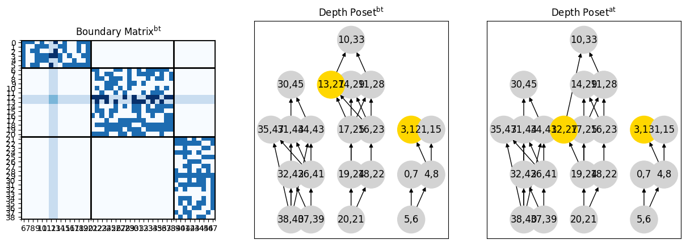

### Birth Death Pairs
|                          |                                                                                                                                                                                                                          |
|:-------------------------|:-------------------------------------------------------------------------------------------------------------------------------------------------------------------------------------------------------------------------|
| Before the transposition | $\{(13, 27), (31, 44), (34, 43), (19, 24), (37, 39), (1, 15), (10, 33), (30, 45), (32, 42), (18, 22), (5, 6), (4, 8), (35, 47), (38, 40), (3, 12), (0, 7), (11, 28), (20, 21), (14, 29), (17, 25), (36, 41), (16, 23)\}$ |
| After the transposition  | $\{(3, 13), (31, 44), (34, 43), (19, 24), (37, 39), (1, 15), (10, 33), (30, 45), (32, 42), (18, 22), (5, 6), (4, 8), (35, 47), (38, 40), (12, 27), (0, 7), (11, 28), (20, 21), (14, 29), (17, 25), (36, 41), (16, 23)\}$ |

### Relations
|                          | Algorithm 1                                                                                                                                                                                                                                                                                                                                                                                      | Algorithm 2                                                                                                                                                                                                                                                                                                                                                          |
|:-------------------------|:-------------------------------------------------------------------------------------------------------------------------------------------------------------------------------------------------------------------------------------------------------------------------------------------------------------------------------------------------------------------------------------------------|:---------------------------------------------------------------------------------------------------------------------------------------------------------------------------------------------------------------------------------------------------------------------------------------------------------------------------------------------------------------------|
| Before the transposition | $\{(6, 12), (42, 45), (41, 43), (24, 33), (24, 27), (6, 15), (21, 22), (21, 28), (22, 23), (40, 44), (39, 42), (8, 12), (8, 15), (28, 33), (45, 46), (25, 28), (24, 26), (6, 8), (24, 29), (21, 24), (21, 27), (39, 41), (22, 28), (23, 33), (27, 33), (7, 9), (24, 25), (41, 44), (25, 33), (41, 47), (42, 46), (21, 23), (23, 26), (40, 42), (39, 46), (23, 29), (40, 45), (6, 9), (25, 26)\}$ | $\{(4, 3), (38, 35), (5, 4), (5, 1), (31, 26), (19, 9), (37, 30), (36, 31), (36, 34), (16, 10), (16, 13), (18, 10), (18, 16), (35, 26), (18, 13), (20, 16), (38, 31), (5, 0), (38, 34), (5, 3), (34, 30), (19, 14), (36, 30), (11, 10), (19, 17), (37, 32), (30, 26), (32, 26), (3, 2), (4, 1), (5, 2), (34, 26), (17, 13), (13, 9), (16, 14), (16, 11), (18, 14)\}$ |
| After the transposition  | $\{(42, 45), (41, 43), (6, 15), (24, 33), (24, 27), (21, 22), (21, 28), (22, 23), (40, 44), (39, 42), (8, 15), (28, 33), (45, 46), (25, 28), (24, 26), (6, 8), (24, 29), (21, 24), (21, 27), (39, 41), (22, 28), (23, 33), (27, 33), (7, 9), (24, 25), (41, 44), (25, 33), (41, 47), (42, 46), (21, 23), (23, 26), (40, 42), (39, 46), (23, 29), (40, 45), (6, 9), (25, 26)\}$                   | $\{(4, 3), (38, 35), (5, 4), (5, 1), (31, 26), (19, 9), (37, 30), (36, 31), (36, 34), (16, 10), (18, 10), (18, 16), (35, 26), (12, 9), (20, 16), (38, 31), (5, 0), (38, 34), (5, 3), (34, 30), (19, 14), (36, 30), (11, 10), (19, 17), (37, 32), (30, 26), (32, 26), (20, 12), (3, 2), (4, 1), (5, 2), (34, 26), (16, 14), (16, 11), (18, 14)\}$                     |

### Successors and Predecessers
|                 | $\text{Set}^\text{bt}(3, 12)$                         | $\text{Set}^\text{bt}(13, 27)$                                       | $\text{Set}^\text{at}(3, 13)$                         | $\text{Set}^\text{at}(12, 27)$                             |
|:----------------|:------------------------------------------------------|:---------------------------------------------------------------------|:------------------------------------------------------|:-----------------------------------------------------------|
| $\text{Succ}_1$ | $\text{Succ}_1^\text{bt}(3, 12) = \emptyset$          | $\text{Succ}_1^\text{bt}(13, 27) = \{(10, 33)\}$                     | $\text{Succ}_1^\text{at}(3, 13) = \emptyset$          | $\text{Succ}_1^\text{at}(12, 27) = \{(10, 33)\}$           |
| $\text{Pred}_1$ | $\text{Pred}_1^\text{bt}(3, 12) = \{(5, 6), (4, 8)\}$ | $\text{Pred}_1^\text{bt}(13, 27) = \{(19, 24), (20, 21)\}$           | $\text{Pred}_1^\text{at}(3, 13) = \emptyset$          | $\text{Pred}_1^\text{at}(12, 27) = \{(19, 24), (20, 21)\}$ |
| $\text{Succ}_2$ | $\text{Succ}_2^\text{bt}(3, 12) = \emptyset$          | $\text{Succ}_2^\text{bt}(13, 27) = \emptyset$                        | $\text{Succ}_2^\text{at}(3, 13) = \emptyset$          | $\text{Succ}_2^\text{at}(12, 27) = \emptyset$              |
| $\text{Pred}_2$ | $\text{Pred}_2^\text{bt}(3, 12) = \{(5, 6), (4, 8)\}$ | $\text{Pred}_2^\text{bt}(13, 27) = \{(18, 22), (17, 25), (16, 23)\}$ | $\text{Pred}_2^\text{at}(3, 13) = \{(5, 6), (4, 8)\}$ | $\text{Pred}_2^\text{at}(12, 27) = \{(20, 21)\}$           |

### Temp Sets
|                                                              | Before the Transposition                               | After the Transposition                                |
|:-------------------------------------------------------------|:-------------------------------------------------------|:-------------------------------------------------------|
| $A_1 = \{(s, t)\in \text{BD}:\; f(a) < f(s) < f(t) < f(x)\}$ | $\{(5, 6), (4, 8)\}$                                   | $\{(5, 6), (4, 8)\}$                                   |
| $B_1 = \{(s, t)\in \text{BD}:\; U_1[t, x] = 1\}$             | $\emptyset$                                            | $\emptyset$                                            |
| $A_2 = \{(s, t)\in \text{BD}:\; f(b) < f(s) < f(t) < f(y)\}$ | $\{(19, 24), (18, 22), (20, 21), (17, 25), (16, 23)\}$ | $\{(19, 24), (18, 22), (20, 21), (17, 25), (16, 23)\}$ |
| $B_2 = \{(s, t)\in \text{BD}:\; U_2[b, s] = 1\}$             | $\emptyset$                                            | $\{(20, 21)\}$                                         |

### Equations
There are 2 equations are wrong.

| eq    | left (formula)                  | left (paramatrized)               | left (value)             | right (formula)                                      | right (paramatrized)                                  | right (value)            | correct   |
|:------|:--------------------------------|:----------------------------------|:-------------------------|:-----------------------------------------------------|:------------------------------------------------------|:-------------------------|:----------|
| Eq48  | $\text{Succ}_1^\text{at}(a, x)$ | $\text{Succ}_1^\text{at}(3, 13)$  | $\emptyset$              | $\text{Succ}_1^\text{bt}(a, b)$                      | $\text{Succ}_1^\text{bt}(3, 12)$                      | $\emptyset$              | ✔         |
| Eq49  | $\text{Succ}_1^\text{at}(b, y)$ | $\text{Succ}_1^\text{at}(12, 27)$ | $\{(10, 33)\}$           | $\text{Succ}_1^\text{bt}(x, y)$                      | $\text{Succ}_1^\text{bt}(13, 27)$                     | $\{(10, 33)\}$           | ✔         |
| Eq50  | $\text{Pred}_1^\text{at}(a, x)$ | $\text{Pred}_1^\text{at}(3, 13)$  | $\emptyset$              | $\{(s, t)\in \text{BD}:\; U_1^\text{bt}[t, x] = 1\}$ | $\{(s, t)\in \text{BD}:\; U_1^\text{bt}[t, 13] = 1\}$ | $\emptyset$              | ✔         |
| Eq50a | $\text{Pred}_1^\text{at}(a, x)$ | $\text{Pred}_1^\text{at}(3, 13)$  | $\emptyset$              | $A_1^\text{bt} \cap B_1^\text{bt}$                   | $A_1^\text{bt} \cap B_1^\text{bt}$                    | $\emptyset$              | ✔         |
| Eq50b | $\text{Pred}_1^\text{at}(a, x)$ | $\text{Pred}_1^\text{at}(3, 13)$  | $\emptyset$              | $A_1^\text{bt} \cap B_1^\text{at}$                   | $A_1^\text{bt} \cap B_1^\text{at}$                    | $\emptyset$              | ✔         |
| Eq51  | $\text{Pred}_1^\text{at}(b, y)$ | $\text{Pred}_1^\text{at}(12, 27)$ | $\{(19, 24), (20, 21)\}$ | $\text{Pred}_1^\text{bt}(x, y)$                      | $\text{Pred}_1^\text{bt}(13, 27)$                     | $\{(19, 24), (20, 21)\}$ | ✔         |
| Eq52  | $\text{Succ}_2^\text{at}(a, x)$ | $\text{Succ}_2^\text{at}(3, 13)$  | $\emptyset$              | $\text{Succ}_2^\text{bt}(a, b)$                      | $\text{Succ}_2^\text{bt}(3, 12)$                      | $\emptyset$              | ✔         |
| Eq53  | $\text{Succ}_2^\text{at}(b, y)$ | $\text{Succ}_2^\text{at}(12, 27)$ | $\emptyset$              | $\text{Succ}_2^\text{bt}(x, y)$                      | $\text{Succ}_2^\text{bt}(13, 27)$                     | $\emptyset$              | ✔         |
| Eq54  | $\text{Pred}_2^\text{at}(a, x)$ | $\text{Pred}_2^\text{at}(3, 13)$  | $\{(5, 6), (4, 8)\}$     | $\text{Pred}_2^\text{bt}(a, b)$                      | $\text{Pred}_2^\text{bt}(3, 12)$                      | $\{(5, 6), (4, 8)\}$     | ✔         |
| Eq55  | $\text{Pred}_2^\text{at}(b, y)$ | $\text{Pred}_2^\text{at}(12, 27)$ | $\{(20, 21)\}$           | $\{(s, t)\in \text{BD}:\; U_2^\text{bt}[b, s] = 1\}$ | $\{(s, t)\in \text{BD}:\; U_2^\text{bt}[12, s] = 1\}$ | $\emptyset$              | ✘         |
| Eq55a | $\text{Pred}_2^\text{at}(b, y)$ | $\text{Pred}_2^\text{at}(12, 27)$ | $\{(20, 21)\}$           | $A_2^\text{bt} \cap B_2^\text{bt}$                   | $A_2^\text{bt} \cap B_2^\text{bt}$                    | $\emptyset$              | ✘         |
| Eq55b | $\text{Pred}_2^\text{at}(b, y)$ | $\text{Pred}_2^\text{at}(12, 27)$ | $\{(20, 21)\}$           | $A_2^\text{bt} \cap B_2^\text{at}$                   | $A_2^\text{bt} \cap B_2^\text{at}$                    | $\{(20, 21)\}$           | ✔         |

## Transposition <18, 19> in complex 12
Here is a __birth-birth__ __no switch__ transposition <18, 19>.

$$
a = 18, \; b = 22, \; x = 19, \; y = 24
$$

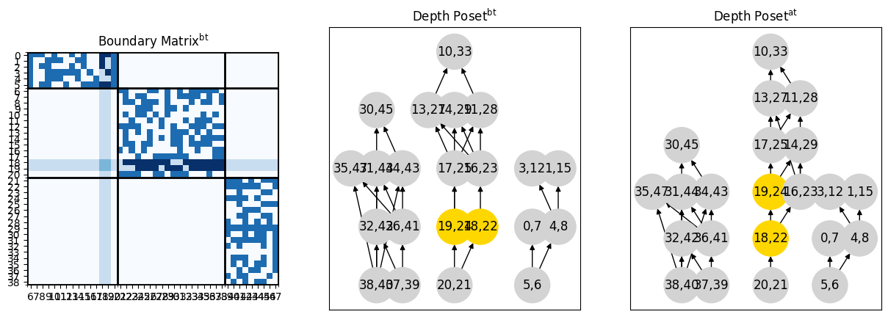

### Birth Death Pairs
|                          |                                                                                                                                                                                                                          |
|:-------------------------|:-------------------------------------------------------------------------------------------------------------------------------------------------------------------------------------------------------------------------|
| Before the transposition | $\{(13, 27), (31, 44), (34, 43), (19, 24), (37, 39), (1, 15), (10, 33), (30, 45), (32, 42), (18, 22), (5, 6), (4, 8), (35, 47), (38, 40), (3, 12), (0, 7), (11, 28), (20, 21), (14, 29), (17, 25), (36, 41), (16, 23)\}$ |
| After the transposition  | $\{(13, 27), (31, 44), (34, 43), (19, 24), (37, 39), (1, 15), (10, 33), (30, 45), (32, 42), (18, 22), (5, 6), (4, 8), (35, 47), (38, 40), (3, 12), (0, 7), (11, 28), (20, 21), (14, 29), (17, 25), (36, 41), (16, 23)\}$ |

### Relations
|                          | Algorithm 1                                                                                                                                                                                                                                                                                                                                                                                                                                                  | Algorithm 2                                                                                                                                                                                                                                                                                                                                                          |
|:-------------------------|:-------------------------------------------------------------------------------------------------------------------------------------------------------------------------------------------------------------------------------------------------------------------------------------------------------------------------------------------------------------------------------------------------------------------------------------------------------------|:---------------------------------------------------------------------------------------------------------------------------------------------------------------------------------------------------------------------------------------------------------------------------------------------------------------------------------------------------------------------|
| Before the transposition | $\{(6, 12), (42, 45), (41, 43), (24, 33), (24, 27), (6, 15), (21, 22), (21, 28), (22, 23), (40, 44), (39, 42), (8, 12), (8, 15), (28, 33), (45, 46), (25, 28), (24, 26), (6, 8), (24, 29), (21, 24), (21, 27), (39, 41), (22, 28), (23, 33), (27, 33), (7, 9), (24, 25), (41, 44), (25, 33), (41, 47), (42, 46), (21, 23), (23, 26), (40, 42), (39, 46), (23, 29), (40, 45), (6, 9), (25, 26)\}$                                                             | $\{(4, 3), (38, 35), (5, 4), (5, 1), (31, 26), (19, 9), (37, 30), (36, 31), (36, 34), (16, 10), (16, 13), (18, 10), (18, 16), (35, 26), (18, 13), (20, 16), (38, 31), (5, 0), (38, 34), (5, 3), (34, 30), (19, 14), (36, 30), (11, 10), (19, 17), (37, 32), (30, 26), (32, 26), (3, 2), (4, 1), (5, 2), (34, 26), (17, 13), (13, 9), (16, 14), (16, 11), (18, 14)\}$ |
| After the transposition  | $\{(6, 12), (42, 45), (41, 43), (24, 33), (24, 27), (6, 15), (21, 22), (21, 28), (22, 23), (40, 44), (39, 42), (22, 26), (22, 29), (8, 12), (8, 15), (28, 33), (45, 46), (25, 28), (24, 26), (6, 8), (24, 29), (21, 24), (22, 25), (21, 27), (39, 41), (22, 28), (23, 33), (27, 33), (7, 9), (24, 25), (41, 44), (25, 33), (41, 47), (42, 46), (21, 23), (22, 27), (23, 26), (40, 42), (22, 24), (39, 46), (23, 29), (40, 45), (22, 33), (6, 9), (25, 26)\}$ | $\{(4, 3), (38, 35), (5, 4), (5, 1), (31, 26), (19, 9), (37, 30), (36, 31), (36, 34), (16, 10), (16, 13), (18, 10), (35, 26), (18, 16), (18, 13), (20, 16), (38, 31), (5, 0), (38, 34), (5, 3), (34, 30), (19, 14), (36, 30), (11, 10), (19, 17), (37, 32), (30, 26), (32, 26), (3, 2), (4, 1), (5, 2), (34, 26), (17, 13), (13, 9), (16, 14), (16, 11), (18, 14)\}$ |

### Successors and Predecessers
No such node in the Depth Poset

### Temp Sets
|                                                               | Before the Transposition                                                     | After the Transposition                                                      |
|:--------------------------------------------------------------|:-----------------------------------------------------------------------------|:-----------------------------------------------------------------------------|
| $\mathcal{L} = \{(s, t)\in \text{BD}:\; f(t) < f(y)\}$        | $\{(0, 7), (1, 15), (18, 22), (16, 23), (5, 6), (4, 8), (3, 12), (20, 21)\}$ | $\{(0, 7), (1, 15), (18, 22), (16, 23), (5, 6), (4, 8), (3, 12), (20, 21)\}$ |
| $\mathcal{M} = \{(s, t)\in \text{BD}:\; f(y) < f(t) < f(b)\}$ | $\emptyset$                                                                  | $\emptyset$                                                                  |

### Equations
There are 2 equations are wrong.

| eq   | left (formula)                  | left (paramatrized)               | left (value)                                 | right (formula)                                                                        | right (paramatrized)                                                                         | right (value)                                                              | correct   |
|:-----|:--------------------------------|:----------------------------------|:---------------------------------------------|:---------------------------------------------------------------------------------------|:---------------------------------------------------------------------------------------------|:---------------------------------------------------------------------------|:----------|
| Eq16 | $\text{Succ}_1^\text{at}(x, y)$ | $\text{Succ}_1^\text{at}(19, 24)$ | $\{(14, 29), (10, 33), (13, 27), (17, 25)\}$ | $\text{Succ}_1^\text{bt}(x, y) \oplus \{(a, b)\} \oplus \text{Succ}_1^\text{bt}(a, b)$ | $\text{Succ}_1^\text{bt}(19, 24) \oplus \{(18, 22)\} \oplus \text{Succ}_1^\text{bt}(18, 22)$ | $\{(13, 27), (10, 33), (11, 28), (14, 29), (18, 22), (17, 25), (16, 23)\}$ | ✘         |
| Eq17 | $\text{Pred}_1^\text{at}(a, b)$ | $\text{Pred}_1^\text{at}(18, 22)$ | $\{(20, 21)\}$                               | $\text{Pred}_1^\text{bt}(a, b) \oplus \{(x, y)\}$                                      | $\text{Pred}_1^\text{bt}(18, 22) \oplus \{(19, 24)\}$                                        | $\{(19, 24), (20, 21)\}$                                                   | ✘         |

## Transposition <21, 22> in complex 12
Here is a __death-death__ __switch forward__ transposition <21, 22>.

$$
a = 18, \; b = 22, \; x = 20, \; y = 21
$$

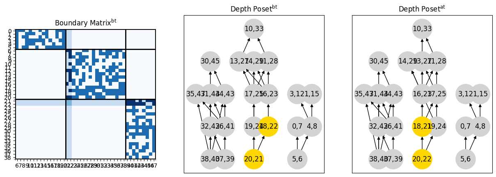

### Birth Death Pairs
|                          |                                                                                                                                                                                                                          |
|:-------------------------|:-------------------------------------------------------------------------------------------------------------------------------------------------------------------------------------------------------------------------|
| Before the transposition | $\{(13, 27), (31, 44), (34, 43), (19, 24), (37, 39), (1, 15), (10, 33), (30, 45), (32, 42), (18, 22), (5, 6), (4, 8), (35, 47), (38, 40), (3, 12), (0, 7), (11, 28), (20, 21), (14, 29), (17, 25), (36, 41), (16, 23)\}$ |
| After the transposition  | $\{(13, 27), (31, 44), (34, 43), (19, 24), (37, 39), (1, 15), (10, 33), (30, 45), (32, 42), (5, 6), (4, 8), (35, 47), (20, 22), (38, 40), (3, 12), (0, 7), (11, 28), (18, 21), (14, 29), (17, 25), (36, 41), (16, 23)\}$ |

### Relations
|                          | Algorithm 1                                                                                                                                                                                                                                                                                                                                                                                                          | Algorithm 2                                                                                                                                                                                                                                                                                                                                                                                        |
|:-------------------------|:---------------------------------------------------------------------------------------------------------------------------------------------------------------------------------------------------------------------------------------------------------------------------------------------------------------------------------------------------------------------------------------------------------------------|:---------------------------------------------------------------------------------------------------------------------------------------------------------------------------------------------------------------------------------------------------------------------------------------------------------------------------------------------------------------------------------------------------|
| Before the transposition | $\{(6, 12), (42, 45), (41, 43), (24, 33), (24, 27), (6, 15), (21, 22), (21, 28), (22, 23), (40, 44), (39, 42), (8, 12), (8, 15), (28, 33), (45, 46), (25, 28), (24, 26), (6, 8), (24, 29), (21, 24), (21, 27), (39, 41), (22, 28), (23, 33), (27, 33), (7, 9), (24, 25), (41, 44), (25, 33), (41, 47), (42, 46), (21, 23), (23, 26), (40, 42), (39, 46), (23, 29), (40, 45), (6, 9), (25, 26)\}$                     | $\{(4, 3), (38, 35), (5, 4), (5, 1), (31, 26), (19, 9), (37, 30), (36, 31), (36, 34), (16, 10), (16, 13), (18, 10), (18, 16), (35, 26), (18, 13), (20, 16), (38, 31), (5, 0), (38, 34), (5, 3), (34, 30), (19, 14), (36, 30), (11, 10), (19, 17), (37, 32), (30, 26), (32, 26), (3, 2), (4, 1), (5, 2), (34, 26), (17, 13), (13, 9), (16, 14), (16, 11), (18, 14)\}$                               |
| After the transposition  | $\{(6, 12), (42, 45), (41, 43), (24, 33), (24, 27), (6, 15), (22, 23), (21, 25), (40, 44), (39, 42), (8, 12), (8, 15), (28, 33), (45, 46), (25, 28), (24, 26), (6, 8), (24, 29), (39, 41), (21, 33), (22, 28), (23, 33), (27, 33), (7, 9), (24, 25), (41, 44), (25, 33), (41, 47), (42, 46), (21, 26), (22, 21), (22, 27), (21, 29), (23, 26), (22, 24), (40, 42), (39, 46), (23, 29), (40, 45), (6, 9), (25, 26)\}$ | $\{(20, 14), (4, 3), (38, 35), (5, 4), (5, 1), (31, 26), (19, 9), (37, 30), (36, 31), (36, 34), (16, 10), (16, 13), (18, 10), (18, 16), (35, 26), (20, 13), (18, 13), (20, 10), (38, 31), (5, 0), (38, 34), (5, 3), (34, 30), (19, 14), (36, 30), (11, 10), (19, 17), (37, 32), (30, 26), (32, 26), (3, 2), (20, 18), (4, 1), (5, 2), (34, 26), (17, 13), (13, 9), (16, 14), (16, 11), (18, 14)\}$ |

### Successors and Predecessers
|                 | $\text{Set}^\text{bt}(18, 22)$                                                 | $\text{Set}^\text{bt}(20, 21)$                                                           | $\text{Set}^\text{at}(20, 22)$                                                           | $\text{Set}^\text{at}(18, 21)$                                                 |
|:----------------|:-------------------------------------------------------------------------------|:-----------------------------------------------------------------------------------------|:-----------------------------------------------------------------------------------------|:-------------------------------------------------------------------------------|
| $\text{Succ}_1$ | $\text{Succ}_1^\text{bt}(18, 22) = \{(16, 23), (11, 28)\}$                     | $\text{Succ}_1^\text{bt}(20, 21) = \{(19, 24), (13, 27), (11, 28), (18, 22), (16, 23)\}$ | $\text{Succ}_1^\text{at}(20, 22) = \{(19, 24), (13, 27), (11, 28), (18, 21), (16, 23)\}$ | $\text{Succ}_1^\text{at}(18, 21) = \{(14, 29), (10, 33), (17, 25)\}$           |
| $\text{Pred}_1$ | $\text{Pred}_1^\text{bt}(18, 22) = \{(20, 21)\}$                               | $\text{Pred}_1^\text{bt}(20, 21) = \emptyset$                                            | $\text{Pred}_1^\text{at}(20, 22) = \emptyset$                                            | $\text{Pred}_1^\text{at}(18, 21) = \{(20, 22)\}$                               |
| $\text{Succ}_2$ | $\text{Succ}_2^\text{bt}(18, 22) = \{(14, 29), (10, 33), (13, 27), (16, 23)\}$ | $\text{Succ}_2^\text{bt}(20, 21) = \{(16, 23)\}$                                         | $\text{Succ}_2^\text{at}(20, 22) = \{(14, 29), (18, 21), (10, 33), (13, 27)\}$           | $\text{Succ}_2^\text{at}(18, 21) = \{(14, 29), (10, 33), (13, 27), (16, 23)\}$ |
| $\text{Pred}_2$ | $\text{Pred}_2^\text{bt}(18, 22) = \emptyset$                                  | $\text{Pred}_2^\text{bt}(20, 21) = \emptyset$                                            | $\text{Pred}_2^\text{at}(20, 22) = \emptyset$                                            | $\text{Pred}_2^\text{at}(18, 21) = \{(20, 22)\}$                               |

### Temp Sets
|                                                               | Before the Transposition                                                             | After the Transposition                                                              |
|:--------------------------------------------------------------|:-------------------------------------------------------------------------------------|:-------------------------------------------------------------------------------------|
| $\mathcal{B} = \{(s, t)\in \text{BD}:\; f(s) > f(x)\}$        | $\{(34, 43), (37, 39), (35, 47), (30, 45), (32, 42), (38, 40), (31, 44), (36, 41)\}$ | $\{(34, 43), (37, 39), (35, 47), (30, 45), (32, 42), (38, 40), (31, 44), (36, 41)\}$ |
| $\mathcal{N} = \{(s, t)\in \text{BD}:\; f(x) > f(s) > f(a)\}$ | $\{(19, 24)\}$                                                                       | $\{(19, 24)\}$                                                                       |

### Equations
There are 1 equations are wrong.

| eq   | left (formula)                  | left (paramatrized)               | left (value)                                           | right (formula)                                                                                          | right (paramatrized)                                                                                           | right (value)                                          | correct   |
|:-----|:--------------------------------|:----------------------------------|:-------------------------------------------------------|:---------------------------------------------------------------------------------------------------------|:---------------------------------------------------------------------------------------------------------------|:-------------------------------------------------------|:----------|
| Eq28 | $\text{Succ}_1^\text{at}(x, b)$ | $\text{Succ}_1^\text{at}(20, 22)$ | $\{(19, 24), (13, 27), (11, 28), (18, 21), (16, 23)\}$ | $\text{Succ}_1^\text{bt}(x, y) \oplus \{(a, y), (a, b)\}$                                                | $\text{Succ}_1^\text{bt}(20, 21) \oplus \{(18, 21), (18, 22)\}$                                                | $\{(19, 24), (13, 27), (11, 28), (18, 21), (16, 23)\}$ | ✔         |
| Eq29 | $\text{Succ}_1^\text{at}(a, y)$ | $\text{Succ}_1^\text{at}(18, 21)$ | $\{(14, 29), (10, 33), (17, 25)\}$                     | $\text{Succ}_1^\text{bt}(a, b)$                                                                          | $\text{Succ}_1^\text{bt}(18, 22)$                                                                              | $\{(16, 23), (11, 28)\}$                               | ✘         |
| Eq30 | $\text{Pred}_1^\text{at}(x, b)$ | $\text{Pred}_1^\text{at}(20, 22)$ | $\emptyset$                                            | $[\text{Pred}_1^\text{bt}(a, b) \cap \mathcal{B}]$                                                       | $[\text{Pred}_1^\text{bt}(18, 22) \cap \mathcal{B}]$                                                           | $\emptyset$                                            | ✔         |
| Eq31 | $\text{Pred}_1^\text{at}(a, y)$ | $\text{Pred}_1^\text{at}(18, 21)$ | $\{(20, 22)\}$                                         | $\text{Pred}_1^\text{bt}(x, y) \oplus \{(x, b)\} \oplus[\text{Pred}_1^\text{bt}(a, b) \cap \mathcal{N}]$ | $\text{Pred}_1^\text{bt}(20, 21) \oplus \{(20, 22)\} \oplus[\text{Pred}_1^\text{bt}(18, 22) \cap \mathcal{N}]$ | $\{(20, 22)\}$                                         | ✔         |
| Eq32 | $\text{Succ}_2^\text{at}(x, b)$ | $\text{Succ}_2^\text{at}(20, 22)$ | $\{(14, 29), (18, 21), (10, 33), (13, 27)\}$           | $\text{Succ}_2^\text{bt}(x, y) \oplus \{(a, y)\} \oplus \text{Succ}_2^\text{bt}(a, b)$                   | $\text{Succ}_2^\text{bt}(20, 21) \oplus \{(18, 21)\} \oplus \text{Succ}_2^\text{bt}(18, 22)$                   | $\{(14, 29), (18, 21), (10, 33), (13, 27)\}$           | ✔         |
| Eq33 | $\text{Succ}_2^\text{at}(a, y)$ | $\text{Succ}_2^\text{at}(18, 21)$ | $\{(14, 29), (10, 33), (13, 27), (16, 23)\}$           | $\text{Succ}_2^\text{bt}(a, b)$                                                                          | $\text{Succ}_2^\text{bt}(18, 22)$                                                                              | $\{(14, 29), (10, 33), (13, 27), (16, 23)\}$           | ✔         |
| Eq34 | $\text{Pred}_2^\text{at}(x, b)$ | $\text{Pred}_2^\text{at}(20, 22)$ | $\emptyset$                                            | $\text{Pred}_2^\text{bt}(x, y)$                                                                          | $\text{Pred}_2^\text{bt}(20, 21)$                                                                              | $\emptyset$                                            | ✔         |
| Eq35 | $\text{Pred}_2^\text{at}(a, y)$ | $\text{Pred}_2^\text{at}(18, 21)$ | $\{(20, 22)\}$                                         | $\text{Pred}_2^\text{bt}(a, b) \oplus \{(x, b)\}$                                                        | $\text{Pred}_2^\text{bt}(18, 22) \oplus \{(20, 22)\}$                                                          | $\{(20, 22)\}$                                         | ✔         |

## Transposition <28, 29> in complex 12
Here is a __death-death__ __no switch__ transposition <28, 29>.

$$
a = 14, \; b = 29, \; x = 11, \; y = 28
$$

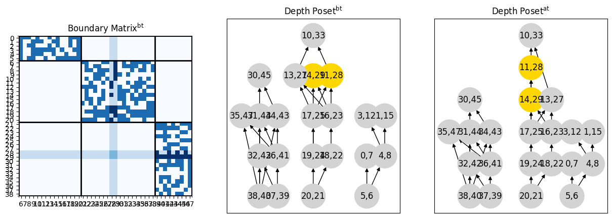

### Birth Death Pairs
|                          |                                                                                                                                                                                                                          |
|:-------------------------|:-------------------------------------------------------------------------------------------------------------------------------------------------------------------------------------------------------------------------|
| Before the transposition | $\{(13, 27), (31, 44), (34, 43), (19, 24), (37, 39), (1, 15), (10, 33), (30, 45), (32, 42), (18, 22), (5, 6), (4, 8), (35, 47), (38, 40), (3, 12), (0, 7), (11, 28), (20, 21), (14, 29), (17, 25), (36, 41), (16, 23)\}$ |
| After the transposition  | $\{(13, 27), (31, 44), (34, 43), (19, 24), (37, 39), (1, 15), (10, 33), (30, 45), (32, 42), (18, 22), (5, 6), (4, 8), (35, 47), (38, 40), (3, 12), (0, 7), (11, 28), (20, 21), (14, 29), (17, 25), (36, 41), (16, 23)\}$ |

### Relations
|                          | Algorithm 1                                                                                                                                                                                                                                                                                                                                                                                      | Algorithm 2                                                                                                                                                                                                                                                                                                                                                                              |
|:-------------------------|:-------------------------------------------------------------------------------------------------------------------------------------------------------------------------------------------------------------------------------------------------------------------------------------------------------------------------------------------------------------------------------------------------|:-----------------------------------------------------------------------------------------------------------------------------------------------------------------------------------------------------------------------------------------------------------------------------------------------------------------------------------------------------------------------------------------|
| Before the transposition | $\{(6, 12), (42, 45), (41, 43), (24, 33), (24, 27), (6, 15), (21, 22), (21, 28), (22, 23), (40, 44), (39, 42), (8, 12), (8, 15), (28, 33), (45, 46), (25, 28), (24, 26), (6, 8), (24, 29), (21, 24), (21, 27), (39, 41), (22, 28), (23, 33), (27, 33), (7, 9), (24, 25), (41, 44), (25, 33), (41, 47), (42, 46), (21, 23), (23, 26), (40, 42), (39, 46), (23, 29), (40, 45), (6, 9), (25, 26)\}$ | $\{(4, 3), (38, 35), (5, 4), (5, 1), (31, 26), (19, 9), (37, 30), (36, 31), (36, 34), (16, 10), (16, 13), (18, 10), (18, 16), (35, 26), (18, 13), (20, 16), (38, 31), (5, 0), (38, 34), (5, 3), (34, 30), (19, 14), (36, 30), (11, 10), (19, 17), (37, 32), (30, 26), (32, 26), (3, 2), (4, 1), (5, 2), (34, 26), (17, 13), (13, 9), (16, 14), (16, 11), (18, 14)\}$                     |
| After the transposition  | $\{(6, 12), (42, 45), (41, 43), (24, 27), (24, 33), (6, 15), (21, 22), (21, 28), (22, 23), (40, 44), (39, 42), (8, 12), (8, 15), (28, 33), (45, 46), (25, 28), (24, 26), (6, 8), (24, 29), (21, 24), (21, 27), (39, 41), (22, 28), (23, 33), (27, 33), (7, 9), (24, 25), (41, 44), (25, 33), (41, 47), (42, 46), (21, 23), (23, 26), (40, 42), (39, 46), (23, 29), (40, 45), (6, 9), (25, 26)\}$ | $\{(4, 3), (38, 35), (5, 4), (5, 1), (14, 10), (31, 26), (19, 9), (37, 30), (36, 31), (36, 34), (16, 10), (16, 13), (18, 10), (18, 16), (35, 26), (18, 13), (20, 16), (38, 31), (5, 0), (38, 34), (5, 3), (34, 30), (19, 14), (36, 30), (11, 10), (19, 17), (37, 32), (30, 26), (32, 26), (3, 2), (4, 1), (5, 2), (14, 11), (34, 26), (17, 13), (13, 9), (16, 14), (16, 11), (18, 14)\}$ |

### Successors and Predecessers
No such node in the Depth Poset

### Temp Sets
|                                                               | Before the Transposition                                                                                                                                   | After the Transposition                                                                                                                                    |
|:--------------------------------------------------------------|:-----------------------------------------------------------------------------------------------------------------------------------------------------------|:-----------------------------------------------------------------------------------------------------------------------------------------------------------|
| $\mathcal{B} = \{(s, t)\in \text{BD}:\; f(s) > f(x)\}$        | $\{(34, 43), (19, 24), (37, 39), (13, 27), (31, 44), (30, 45), (32, 42), (14, 29), (18, 22), (38, 40), (17, 25), (20, 21), (35, 47), (36, 41), (16, 23)\}$ | $\{(34, 43), (19, 24), (37, 39), (13, 27), (31, 44), (30, 45), (32, 42), (14, 29), (18, 22), (38, 40), (17, 25), (20, 21), (35, 47), (36, 41), (16, 23)\}$ |
| $\mathcal{N} = \{(s, t)\in \text{BD}:\; f(x) > f(s) > f(a)\}$ | $\emptyset$                                                                                                                                                | $\emptyset$                                                                                                                                                |

### Equations
There are 2 equations are wrong.

| eq   | left (formula)                  | left (paramatrized)               | left (value)                       | right (formula)                                                                        | right (paramatrized)                                                                         | right (value)                                | correct   |
|:-----|:--------------------------------|:----------------------------------|:-----------------------------------|:---------------------------------------------------------------------------------------|:---------------------------------------------------------------------------------------------|:---------------------------------------------|:----------|
| Eq36 | $\text{Succ}_2^\text{at}(x, y)$ | $\text{Succ}_2^\text{at}(11, 28)$ | $\{(10, 33)\}$                     | $\text{Succ}_2^\text{bt}(x, y) \oplus \{(a, b)\} \oplus \text{Succ}_2^\text{bt}(a, b)$ | $\text{Succ}_2^\text{bt}(11, 28) \oplus \{(14, 29)\} \oplus \text{Succ}_2^\text{bt}(14, 29)$ | $\{(14, 29), (10, 33)\}$                     | ✘         |
| Eq37 | $\text{Pred}_2^\text{at}(a, b)$ | $\text{Pred}_2^\text{at}(14, 29)$ | $\{(19, 24), (18, 22), (16, 23)\}$ | $\text{Pred}_2^\text{bt}(a, b) \oplus \{(x, y)\}$                                      | $\text{Pred}_2^\text{bt}(14, 29) \oplus \{(11, 28)\}$                                        | $\{(19, 24), (18, 22), (11, 28), (16, 23)\}$ | ✘         |

## Transposition <29, 30> in complex 12
Here is a __birth-death__ __switch forward__ transposition <29, 30>.

$$
a = 14, \; b = 29, \; x = 30, \; y = 45
$$

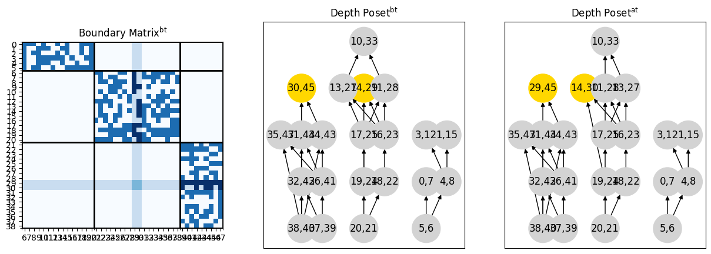

### Birth Death Pairs
|                          |                                                                                                                                                                                                                          |
|:-------------------------|:-------------------------------------------------------------------------------------------------------------------------------------------------------------------------------------------------------------------------|
| Before the transposition | $\{(13, 27), (31, 44), (34, 43), (19, 24), (37, 39), (1, 15), (10, 33), (30, 45), (32, 42), (18, 22), (5, 6), (4, 8), (35, 47), (38, 40), (3, 12), (0, 7), (11, 28), (20, 21), (14, 29), (17, 25), (36, 41), (16, 23)\}$ |
| After the transposition  | $\{(13, 27), (31, 44), (34, 43), (19, 24), (37, 39), (1, 15), (10, 33), (32, 42), (18, 22), (5, 6), (4, 8), (35, 47), (38, 40), (3, 12), (0, 7), (14, 30), (11, 28), (20, 21), (29, 45), (17, 25), (36, 41), (16, 23)\}$ |

### Relations
|                          | Algorithm 1                                                                                                                                                                                                                                                                                                                                                                                                          | Algorithm 2                                                                                                                                                                                                                                                                                                                                                                    |
|:-------------------------|:---------------------------------------------------------------------------------------------------------------------------------------------------------------------------------------------------------------------------------------------------------------------------------------------------------------------------------------------------------------------------------------------------------------------|:-------------------------------------------------------------------------------------------------------------------------------------------------------------------------------------------------------------------------------------------------------------------------------------------------------------------------------------------------------------------------------|
| Before the transposition | $\{(6, 12), (42, 45), (41, 43), (24, 33), (24, 27), (6, 15), (21, 22), (21, 28), (22, 23), (40, 44), (39, 42), (8, 12), (8, 15), (28, 33), (45, 46), (25, 28), (24, 26), (6, 8), (24, 29), (21, 24), (21, 27), (39, 41), (22, 28), (23, 33), (27, 33), (7, 9), (24, 25), (41, 44), (25, 33), (41, 47), (42, 46), (21, 23), (23, 26), (40, 42), (39, 46), (23, 29), (40, 45), (6, 9), (25, 26)\}$                     | $\{(4, 3), (38, 35), (5, 4), (5, 1), (31, 26), (19, 9), (37, 30), (36, 31), (36, 34), (16, 10), (16, 13), (18, 10), (18, 16), (35, 26), (18, 13), (20, 16), (38, 31), (5, 0), (38, 34), (5, 3), (34, 30), (19, 14), (36, 30), (11, 10), (19, 17), (37, 32), (30, 26), (32, 26), (3, 2), (4, 1), (5, 2), (34, 26), (17, 13), (13, 9), (16, 14), (16, 11), (18, 14)\}$           |
| After the transposition  | $\{(6, 12), (24, 30), (42, 45), (41, 43), (24, 33), (24, 27), (6, 15), (21, 22), (21, 28), (22, 23), (40, 44), (39, 42), (8, 12), (8, 15), (28, 33), (45, 46), (25, 28), (24, 26), (6, 8), (21, 24), (21, 30), (21, 27), (39, 41), (23, 30), (22, 28), (23, 33), (27, 33), (7, 9), (24, 25), (41, 44), (25, 33), (41, 47), (42, 46), (21, 23), (23, 26), (40, 42), (22, 30), (39, 46), (40, 45), (6, 9), (25, 26)\}$ | $\{(4, 3), (38, 29), (38, 35), (5, 4), (29, 26), (5, 1), (31, 26), (19, 9), (36, 31), (36, 34), (16, 10), (16, 13), (18, 10), (18, 16), (35, 26), (18, 13), (20, 16), (38, 31), (5, 0), (38, 34), (5, 3), (19, 14), (37, 29), (11, 10), (19, 17), (37, 32), (32, 26), (32, 29), (3, 2), (4, 1), (5, 2), (34, 26), (17, 13), (34, 29), (13, 9), (16, 14), (16, 11), (18, 14)\}$ |

### Successors and Predecessers
|                 | $\text{Set}^\text{bt}(14, 29)$                                       | $\text{Set}^\text{bt}(30, 45)$                                       | $\text{Set}^\text{at}(14, 30)$                                                 | $\text{Set}^\text{at}(29, 45)$                                                 |
|:----------------|:---------------------------------------------------------------------|:---------------------------------------------------------------------|:-------------------------------------------------------------------------------|:-------------------------------------------------------------------------------|
| $\text{Succ}_1$ | $\text{Succ}_1^\text{bt}(14, 29) = \emptyset$                        | $\text{Succ}_1^\text{bt}(30, 45) = \emptyset$                        | $\text{Succ}_1^\text{at}(14, 30) = \emptyset$                                  | $\text{Succ}_1^\text{at}(29, 45) = \emptyset$                                  |
| $\text{Pred}_1$ | $\text{Pred}_1^\text{bt}(14, 29) = \{(19, 24), (16, 23)\}$           | $\text{Pred}_1^\text{bt}(30, 45) = \{(38, 40), (32, 42)\}$           | $\text{Pred}_1^\text{at}(14, 30) = \{(19, 24), (18, 22), (20, 21), (16, 23)\}$ | $\text{Pred}_1^\text{at}(29, 45) = \{(38, 40), (32, 42)\}$                     |
| $\text{Succ}_2$ | $\text{Succ}_2^\text{bt}(14, 29) = \emptyset$                        | $\text{Succ}_2^\text{bt}(30, 45) = \emptyset$                        | $\text{Succ}_2^\text{at}(14, 30) = \emptyset$                                  | $\text{Succ}_2^\text{at}(29, 45) = \emptyset$                                  |
| $\text{Pred}_2$ | $\text{Pred}_2^\text{bt}(14, 29) = \{(19, 24), (18, 22), (16, 23)\}$ | $\text{Pred}_2^\text{bt}(30, 45) = \{(34, 43), (36, 41), (37, 39)\}$ | $\text{Pred}_2^\text{at}(14, 30) = \{(19, 24), (18, 22), (16, 23)\}$           | $\text{Pred}_2^\text{at}(29, 45) = \{(38, 40), (34, 43), (37, 39), (32, 42)\}$ |

### Temp Sets
|                                                              | Before the Transposition                                         | After the Transposition                                          |
|:-------------------------------------------------------------|:-----------------------------------------------------------------|:-----------------------------------------------------------------|
| $A_1 = \{(s, t)\in \text{BD}:\; f(a) < f(s) < f(t) < f(x)\}$ | $\{(19, 24), (18, 22), (20, 21), (17, 25), (16, 23)\}$           | $\{(19, 24), (18, 22), (20, 21), (17, 25), (16, 23)\}$           |
| $B_1 = \{(s, t)\in \text{BD}:\; U_1[t, x] = 1\}$             | $\emptyset$                                                      | $\{(19, 24), (18, 22), (20, 21), (16, 23)\}$                     |
| $A_2 = \{(s, t)\in \text{BD}:\; f(b) < f(s) < f(t) < f(y)\}$ | $\{(34, 43), (37, 39), (31, 44), (32, 42), (38, 40), (36, 41)\}$ | $\{(34, 43), (37, 39), (31, 44), (32, 42), (38, 40), (36, 41)\}$ |
| $B_2 = \{(s, t)\in \text{BD}:\; U_2[b, s] = 1\}$             | $\emptyset$                                                      | $\{(38, 40), (34, 43), (37, 39), (32, 42)\}$                     |

### Equations
There are 4 equations are wrong.

| eq    | left (formula)                  | left (paramatrized)               | left (value)                                 | right (formula)                                      | right (paramatrized)                                  | right (value)                                | correct   |
|:------|:--------------------------------|:----------------------------------|:---------------------------------------------|:-----------------------------------------------------|:------------------------------------------------------|:---------------------------------------------|:----------|
| Eq48  | $\text{Succ}_1^\text{at}(a, x)$ | $\text{Succ}_1^\text{at}(14, 30)$ | $\emptyset$                                  | $\text{Succ}_1^\text{bt}(a, b)$                      | $\text{Succ}_1^\text{bt}(14, 29)$                     | $\emptyset$                                  | ✔         |
| Eq49  | $\text{Succ}_1^\text{at}(b, y)$ | $\text{Succ}_1^\text{at}(29, 45)$ | $\emptyset$                                  | $\text{Succ}_1^\text{bt}(x, y)$                      | $\text{Succ}_1^\text{bt}(30, 45)$                     | $\emptyset$                                  | ✔         |
| Eq50  | $\text{Pred}_1^\text{at}(a, x)$ | $\text{Pred}_1^\text{at}(14, 30)$ | $\{(19, 24), (18, 22), (20, 21), (16, 23)\}$ | $\{(s, t)\in \text{BD}:\; U_1^\text{bt}[t, x] = 1\}$ | $\{(s, t)\in \text{BD}:\; U_1^\text{bt}[t, 30] = 1\}$ | $\emptyset$                                  | ✘         |
| Eq50a | $\text{Pred}_1^\text{at}(a, x)$ | $\text{Pred}_1^\text{at}(14, 30)$ | $\{(19, 24), (18, 22), (20, 21), (16, 23)\}$ | $A_1^\text{bt} \cap B_1^\text{bt}$                   | $A_1^\text{bt} \cap B_1^\text{bt}$                    | $\emptyset$                                  | ✘         |
| Eq50b | $\text{Pred}_1^\text{at}(a, x)$ | $\text{Pred}_1^\text{at}(14, 30)$ | $\{(19, 24), (18, 22), (20, 21), (16, 23)\}$ | $A_1^\text{bt} \cap B_1^\text{at}$                   | $A_1^\text{bt} \cap B_1^\text{at}$                    | $\{(19, 24), (18, 22), (16, 23), (20, 21)\}$ | ✔         |
| Eq51  | $\text{Pred}_1^\text{at}(b, y)$ | $\text{Pred}_1^\text{at}(29, 45)$ | $\{(38, 40), (32, 42)\}$                     | $\text{Pred}_1^\text{bt}(x, y)$                      | $\text{Pred}_1^\text{bt}(30, 45)$                     | $\{(38, 40), (32, 42)\}$                     | ✔         |
| Eq52  | $\text{Succ}_2^\text{at}(a, x)$ | $\text{Succ}_2^\text{at}(14, 30)$ | $\emptyset$                                  | $\text{Succ}_2^\text{bt}(a, b)$                      | $\text{Succ}_2^\text{bt}(14, 29)$                     | $\emptyset$                                  | ✔         |
| Eq53  | $\text{Succ}_2^\text{at}(b, y)$ | $\text{Succ}_2^\text{at}(29, 45)$ | $\emptyset$                                  | $\text{Succ}_2^\text{bt}(x, y)$                      | $\text{Succ}_2^\text{bt}(30, 45)$                     | $\emptyset$                                  | ✔         |
| Eq54  | $\text{Pred}_2^\text{at}(a, x)$ | $\text{Pred}_2^\text{at}(14, 30)$ | $\{(19, 24), (18, 22), (16, 23)\}$           | $\text{Pred}_2^\text{bt}(a, b)$                      | $\text{Pred}_2^\text{bt}(14, 29)$                     | $\{(19, 24), (18, 22), (16, 23)\}$           | ✔         |
| Eq55  | $\text{Pred}_2^\text{at}(b, y)$ | $\text{Pred}_2^\text{at}(29, 45)$ | $\{(38, 40), (34, 43), (37, 39), (32, 42)\}$ | $\{(s, t)\in \text{BD}:\; U_2^\text{bt}[b, s] = 1\}$ | $\{(s, t)\in \text{BD}:\; U_2^\text{bt}[29, s] = 1\}$ | $\emptyset$                                  | ✘         |
| Eq55a | $\text{Pred}_2^\text{at}(b, y)$ | $\text{Pred}_2^\text{at}(29, 45)$ | $\{(38, 40), (34, 43), (37, 39), (32, 42)\}$ | $A_2^\text{bt} \cap B_2^\text{bt}$                   | $A_2^\text{bt} \cap B_2^\text{bt}$                    | $\emptyset$                                  | ✘         |
| Eq55b | $\text{Pred}_2^\text{at}(b, y)$ | $\text{Pred}_2^\text{at}(29, 45)$ | $\{(38, 40), (34, 43), (37, 39), (32, 42)\}$ | $A_2^\text{bt} \cap B_2^\text{at}$                   | $A_2^\text{bt} \cap B_2^\text{at}$                    | $\{(38, 40), (34, 43), (37, 39), (32, 42)\}$ | ✔         |

## Transposition <3, 4> in complex 13
Here is a __birth-birth__ __no switch__ transposition <3, 4>.

$$
a = 3, \; b = 8, \; x = 4, \; y = 11
$$

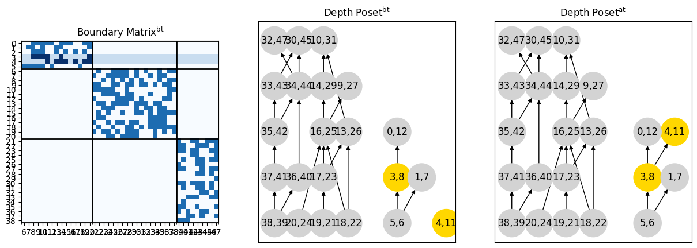

### Birth Death Pairs
|                          |                                                                                                                                                                                                                         |
|:-------------------------|:------------------------------------------------------------------------------------------------------------------------------------------------------------------------------------------------------------------------|
| Before the transposition | $\{(35, 42), (19, 21), (36, 40), (13, 26), (30, 45), (16, 25), (18, 22), (5, 6), (4, 11), (17, 23), (37, 41), (33, 43), (32, 47), (3, 8), (20, 24), (38, 39), (14, 29), (0, 12), (34, 44), (1, 7), (9, 27), (10, 31)\}$ |
| After the transposition  | $\{(35, 42), (19, 21), (36, 40), (13, 26), (30, 45), (16, 25), (18, 22), (5, 6), (4, 11), (17, 23), (37, 41), (33, 43), (32, 47), (3, 8), (20, 24), (38, 39), (14, 29), (0, 12), (34, 44), (1, 7), (9, 27), (10, 31)\}$ |

### Relations
|                          | Algorithm 1                                                                                                                                                                                                                                                                                                                                                                               | Algorithm 2                                                                                                                                                                                                                                                                                                               |
|:-------------------------|:------------------------------------------------------------------------------------------------------------------------------------------------------------------------------------------------------------------------------------------------------------------------------------------------------------------------------------------------------------------------------------------|:--------------------------------------------------------------------------------------------------------------------------------------------------------------------------------------------------------------------------------------------------------------------------------------------------------------------------|
| Before the transposition | $\{(6, 12), (25, 29), (24, 27), (43, 46), (44, 45), (21, 25), (23, 28), (40, 44), (22, 29), (8, 15), (27, 28), (6, 8), (41, 42), (25, 31), (24, 29), (42, 44), (43, 45), (12, 15), (22, 25), (39, 41), (21, 27), (22, 28), (23, 27), (22, 31), (24, 25), (6, 7), (24, 28), (41, 44), (25, 27), (42, 43), (7, 15), (41, 47), (26, 28), (21, 23), (21, 26), (39, 40), (40, 45), (11, 15)\}$ | $\{(20, 14), (38, 35), (14, 10), (17, 9), (19, 9), (37, 30), (37, 33), (36, 34), (18, 10), (18, 16), (18, 13), (4, 2), (3, 0), (17, 14), (34, 30), (19, 17), (37, 35), (16, 9), (13, 10), (18, 9), (33, 28), (20, 9), (18, 15), (3, 2), (38, 30), (20, 15), (38, 36), (17, 16), (17, 13), (19, 10), (34, 32), (33, 30)\}$ |
| After the transposition  | $\{(6, 12), (25, 29), (24, 27), (43, 46), (44, 45), (21, 25), (23, 28), (40, 44), (22, 29), (27, 28), (6, 8), (41, 42), (25, 31), (24, 29), (42, 44), (43, 45), (12, 15), (22, 25), (39, 41), (21, 27), (22, 28), (8, 11), (23, 27), (22, 31), (24, 25), (6, 7), (24, 28), (41, 44), (25, 27), (42, 43), (7, 15), (41, 47), (26, 28), (21, 23), (21, 26), (39, 40), (40, 45), (11, 15)\}$ | $\{(20, 14), (38, 35), (14, 10), (17, 9), (19, 9), (37, 30), (37, 33), (36, 34), (18, 10), (18, 16), (18, 13), (4, 2), (3, 0), (17, 14), (34, 30), (19, 17), (37, 35), (16, 9), (13, 10), (18, 9), (33, 28), (20, 9), (18, 15), (3, 2), (38, 30), (20, 15), (38, 36), (17, 16), (17, 13), (19, 10), (34, 32), (33, 30)\}$ |

### Successors and Predecessers
No such node in the Depth Poset

### Temp Sets
|                                                               | Before the Transposition     | After the Transposition      |
|:--------------------------------------------------------------|:-----------------------------|:-----------------------------|
| $\mathcal{L} = \{(s, t)\in \text{BD}:\; f(t) < f(y)\}$        | $\{(3, 8), (5, 6), (1, 7)\}$ | $\{(3, 8), (5, 6), (1, 7)\}$ |
| $\mathcal{M} = \{(s, t)\in \text{BD}:\; f(y) < f(t) < f(b)\}$ | $\emptyset$                  | $\emptyset$                  |

### Equations
There are 2 equations are wrong.

| eq   | left (formula)                  | left (paramatrized)              | left (value)   | right (formula)                                                                        | right (paramatrized)                                                                    | right (value)         | correct   |
|:-----|:--------------------------------|:---------------------------------|:---------------|:---------------------------------------------------------------------------------------|:----------------------------------------------------------------------------------------|:----------------------|:----------|
| Eq16 | $\text{Succ}_1^\text{at}(x, y)$ | $\text{Succ}_1^\text{at}(4, 11)$ | $\emptyset$    | $\text{Succ}_1^\text{bt}(x, y) \oplus \{(a, b)\} \oplus \text{Succ}_1^\text{bt}(a, b)$ | $\text{Succ}_1^\text{bt}(4, 11) \oplus \{(3, 8)\} \oplus \text{Succ}_1^\text{bt}(3, 8)$ | $\{(3, 8)\}$          | ✘         |
| Eq17 | $\text{Pred}_1^\text{at}(a, b)$ | $\text{Pred}_1^\text{at}(3, 8)$  | $\{(5, 6)\}$   | $\text{Pred}_1^\text{bt}(a, b) \oplus \{(x, y)\}$                                      | $\text{Pred}_1^\text{bt}(3, 8) \oplus \{(4, 11)\}$                                      | $\{(4, 11), (5, 6)\}$ | ✘         |

## Transposition <6, 7> in complex 13
Here is a __death-death__ __switch forward__ transposition <6, 7>.

$$
a = 1, \; b = 7, \; x = 5, \; y = 6
$$

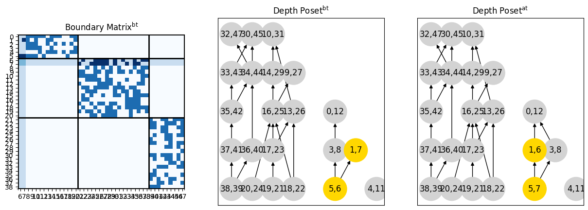

### Birth Death Pairs
|                          |                                                                                                                                                                                                                         |
|:-------------------------|:------------------------------------------------------------------------------------------------------------------------------------------------------------------------------------------------------------------------|
| Before the transposition | $\{(35, 42), (19, 21), (36, 40), (13, 26), (30, 45), (16, 25), (18, 22), (5, 6), (4, 11), (17, 23), (37, 41), (33, 43), (32, 47), (3, 8), (20, 24), (38, 39), (14, 29), (0, 12), (34, 44), (1, 7), (9, 27), (10, 31)\}$ |
| After the transposition  | $\{(35, 42), (5, 7), (1, 6), (19, 21), (36, 40), (13, 26), (30, 45), (16, 25), (18, 22), (4, 11), (17, 23), (37, 41), (33, 43), (32, 47), (3, 8), (20, 24), (38, 39), (14, 29), (0, 12), (34, 44), (9, 27), (10, 31)\}$ |

### Relations
|                          | Algorithm 1                                                                                                                                                                                                                                                                                                                                                                               | Algorithm 2                                                                                                                                                                                                                                                                                                                       |
|:-------------------------|:------------------------------------------------------------------------------------------------------------------------------------------------------------------------------------------------------------------------------------------------------------------------------------------------------------------------------------------------------------------------------------------|:----------------------------------------------------------------------------------------------------------------------------------------------------------------------------------------------------------------------------------------------------------------------------------------------------------------------------------|
| Before the transposition | $\{(6, 12), (25, 29), (24, 27), (43, 46), (44, 45), (21, 25), (23, 28), (40, 44), (22, 29), (8, 15), (27, 28), (6, 8), (41, 42), (25, 31), (24, 29), (42, 44), (43, 45), (12, 15), (22, 25), (39, 41), (21, 27), (22, 28), (23, 27), (22, 31), (24, 25), (6, 7), (24, 28), (41, 44), (25, 27), (42, 43), (7, 15), (41, 47), (26, 28), (21, 23), (21, 26), (39, 40), (40, 45), (11, 15)\}$ | $\{(20, 14), (38, 35), (14, 10), (17, 9), (19, 9), (37, 30), (37, 33), (36, 34), (18, 10), (18, 16), (18, 13), (4, 2), (3, 0), (17, 14), (34, 30), (19, 17), (37, 35), (16, 9), (13, 10), (18, 9), (33, 28), (20, 9), (18, 15), (3, 2), (38, 30), (20, 15), (38, 36), (17, 16), (17, 13), (19, 10), (34, 32), (33, 30)\}$         |
| After the transposition  | $\{(6, 12), (25, 29), (24, 27), (43, 46), (44, 45), (21, 25), (23, 28), (40, 44), (22, 29), (8, 15), (27, 28), (41, 42), (25, 31), (24, 29), (42, 44), (43, 45), (12, 15), (22, 25), (39, 41), (21, 27), (22, 28), (23, 27), (22, 31), (24, 25), (7, 6), (7, 12), (24, 28), (41, 44), (25, 27), (42, 43), (41, 47), (26, 28), (21, 23), (21, 26), (39, 40), (40, 45), (11, 15), (7, 8)\}$ | $\{(20, 14), (38, 35), (5, 1), (17, 9), (14, 10), (19, 9), (37, 30), (37, 33), (36, 34), (18, 10), (18, 16), (18, 13), (4, 2), (3, 0), (17, 14), (34, 30), (19, 17), (37, 35), (16, 9), (13, 10), (18, 9), (33, 28), (20, 9), (18, 15), (3, 2), (38, 30), (20, 15), (38, 36), (17, 16), (17, 13), (19, 10), (34, 32), (33, 30)\}$ |

### Successors and Predecessers
|                 | $\text{Set}^\text{bt}(1, 7)$                 | $\text{Set}^\text{bt}(5, 6)$                                  | $\text{Set}^\text{at}(5, 7)$                                  | $\text{Set}^\text{at}(1, 6)$                  |
|:----------------|:---------------------------------------------|:--------------------------------------------------------------|:--------------------------------------------------------------|:----------------------------------------------|
| $\text{Succ}_1$ | $\text{Succ}_1^\text{bt}(1, 7) = \emptyset$  | $\text{Succ}_1^\text{bt}(5, 6) = \{(0, 12), (3, 8), (1, 7)\}$ | $\text{Succ}_1^\text{at}(5, 7) = \{(0, 12), (1, 6), (3, 8)\}$ | $\text{Succ}_1^\text{at}(1, 6) = \{(0, 12)\}$ |
| $\text{Pred}_1$ | $\text{Pred}_1^\text{bt}(1, 7) = \{(5, 6)\}$ | $\text{Pred}_1^\text{bt}(5, 6) = \emptyset$                   | $\text{Pred}_1^\text{at}(5, 7) = \emptyset$                   | $\text{Pred}_1^\text{at}(1, 6) = \{(5, 7)\}$  |
| $\text{Succ}_2$ | $\text{Succ}_2^\text{bt}(1, 7) = \emptyset$  | $\text{Succ}_2^\text{bt}(5, 6) = \emptyset$                   | $\text{Succ}_2^\text{at}(5, 7) = \{(1, 6)\}$                  | $\text{Succ}_2^\text{at}(1, 6) = \emptyset$   |
| $\text{Pred}_2$ | $\text{Pred}_2^\text{bt}(1, 7) = \emptyset$  | $\text{Pred}_2^\text{bt}(5, 6) = \emptyset$                   | $\text{Pred}_2^\text{at}(5, 7) = \emptyset$                   | $\text{Pred}_2^\text{at}(1, 6) = \{(5, 7)\}$  |

### Temp Sets
|                                                               | Before the Transposition                                                                                                                                                      | After the Transposition                                                                                                                                                       |
|:--------------------------------------------------------------|:------------------------------------------------------------------------------------------------------------------------------------------------------------------------------|:------------------------------------------------------------------------------------------------------------------------------------------------------------------------------|
| $\mathcal{B} = \{(s, t)\in \text{BD}:\; f(s) > f(x)\}$        | $\{(36, 40), (17, 23), (20, 24), (38, 39), (32, 47), (35, 42), (13, 26), (37, 41), (30, 45), (14, 29), (16, 25), (34, 44), (18, 22), (9, 27), (19, 21), (33, 43), (10, 31)\}$ | $\{(36, 40), (17, 23), (20, 24), (38, 39), (32, 47), (35, 42), (13, 26), (37, 41), (30, 45), (14, 29), (16, 25), (34, 44), (18, 22), (9, 27), (19, 21), (33, 43), (10, 31)\}$ |
| $\mathcal{N} = \{(s, t)\in \text{BD}:\; f(x) > f(s) > f(a)\}$ | $\{(4, 11), (3, 8)\}$                                                                                                                                                         | $\{(4, 11), (3, 8)\}$                                                                                                                                                         |

### Equations
There are 1 equations are wrong.

| eq   | left (formula)                  | left (paramatrized)             | left (value)                  | right (formula)                                                                                          | right (paramatrized)                                                                                     | right (value)                 | correct   |
|:-----|:--------------------------------|:--------------------------------|:------------------------------|:---------------------------------------------------------------------------------------------------------|:---------------------------------------------------------------------------------------------------------|:------------------------------|:----------|
| Eq28 | $\text{Succ}_1^\text{at}(x, b)$ | $\text{Succ}_1^\text{at}(5, 7)$ | $\{(0, 12), (1, 6), (3, 8)\}$ | $\text{Succ}_1^\text{bt}(x, y) \oplus \{(a, y), (a, b)\}$                                                | $\text{Succ}_1^\text{bt}(5, 6) \oplus \{(1, 6), (1, 7)\}$                                                | $\{(0, 12), (1, 6), (3, 8)\}$ | ✔         |
| Eq29 | $\text{Succ}_1^\text{at}(a, y)$ | $\text{Succ}_1^\text{at}(1, 6)$ | $\{(0, 12)\}$                 | $\text{Succ}_1^\text{bt}(a, b)$                                                                          | $\text{Succ}_1^\text{bt}(1, 7)$                                                                          | $\emptyset$                   | ✘         |
| Eq30 | $\text{Pred}_1^\text{at}(x, b)$ | $\text{Pred}_1^\text{at}(5, 7)$ | $\emptyset$                   | $[\text{Pred}_1^\text{bt}(a, b) \cap \mathcal{B}]$                                                       | $[\text{Pred}_1^\text{bt}(1, 7) \cap \mathcal{B}]$                                                       | $\emptyset$                   | ✔         |
| Eq31 | $\text{Pred}_1^\text{at}(a, y)$ | $\text{Pred}_1^\text{at}(1, 6)$ | $\{(5, 7)\}$                  | $\text{Pred}_1^\text{bt}(x, y) \oplus \{(x, b)\} \oplus[\text{Pred}_1^\text{bt}(a, b) \cap \mathcal{N}]$ | $\text{Pred}_1^\text{bt}(5, 6) \oplus \{(5, 7)\} \oplus[\text{Pred}_1^\text{bt}(1, 7) \cap \mathcal{N}]$ | $\{(5, 7)\}$                  | ✔         |
| Eq32 | $\text{Succ}_2^\text{at}(x, b)$ | $\text{Succ}_2^\text{at}(5, 7)$ | $\{(1, 6)\}$                  | $\text{Succ}_2^\text{bt}(x, y) \oplus \{(a, y)\} \oplus \text{Succ}_2^\text{bt}(a, b)$                   | $\text{Succ}_2^\text{bt}(5, 6) \oplus \{(1, 6)\} \oplus \text{Succ}_2^\text{bt}(1, 7)$                   | $\{(1, 6)\}$                  | ✔         |
| Eq33 | $\text{Succ}_2^\text{at}(a, y)$ | $\text{Succ}_2^\text{at}(1, 6)$ | $\emptyset$                   | $\text{Succ}_2^\text{bt}(a, b)$                                                                          | $\text{Succ}_2^\text{bt}(1, 7)$                                                                          | $\emptyset$                   | ✔         |
| Eq34 | $\text{Pred}_2^\text{at}(x, b)$ | $\text{Pred}_2^\text{at}(5, 7)$ | $\emptyset$                   | $\text{Pred}_2^\text{bt}(x, y)$                                                                          | $\text{Pred}_2^\text{bt}(5, 6)$                                                                          | $\emptyset$                   | ✔         |
| Eq35 | $\text{Pred}_2^\text{at}(a, y)$ | $\text{Pred}_2^\text{at}(1, 6)$ | $\{(5, 7)\}$                  | $\text{Pred}_2^\text{bt}(a, b) \oplus \{(x, b)\}$                                                        | $\text{Pred}_2^\text{bt}(1, 7) \oplus \{(5, 7)\}$                                                        | $\{(5, 7)\}$                  | ✔         |

## Transposition <7, 8> in complex 13
Here is a __death-death__ __no switch__ transposition <7, 8>.

$$
a = 3, \; b = 8, \; x = 1, \; y = 7
$$

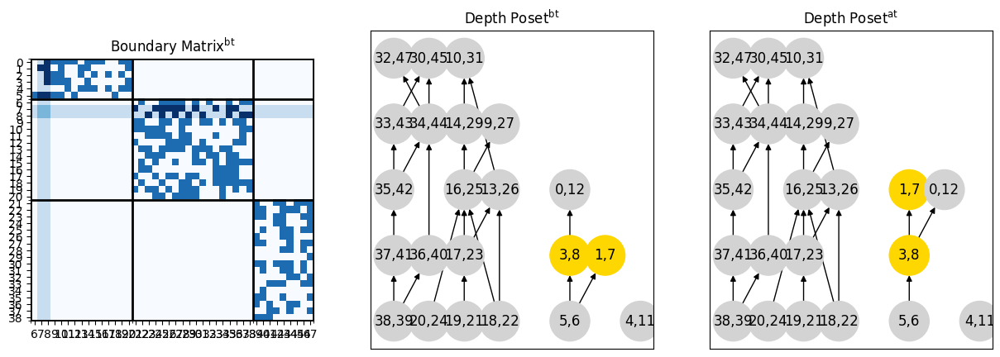

### Birth Death Pairs
|                          |                                                                                                                                                                                                                         |
|:-------------------------|:------------------------------------------------------------------------------------------------------------------------------------------------------------------------------------------------------------------------|
| Before the transposition | $\{(35, 42), (19, 21), (36, 40), (13, 26), (30, 45), (16, 25), (18, 22), (5, 6), (4, 11), (17, 23), (37, 41), (33, 43), (32, 47), (3, 8), (20, 24), (38, 39), (14, 29), (0, 12), (34, 44), (1, 7), (9, 27), (10, 31)\}$ |
| After the transposition  | $\{(35, 42), (19, 21), (36, 40), (13, 26), (30, 45), (16, 25), (18, 22), (5, 6), (4, 11), (17, 23), (37, 41), (33, 43), (32, 47), (3, 8), (20, 24), (38, 39), (14, 29), (0, 12), (34, 44), (1, 7), (9, 27), (10, 31)\}$ |

### Relations
|                          | Algorithm 1                                                                                                                                                                                                                                                                                                                                                                               | Algorithm 2                                                                                                                                                                                                                                                                                                                       |
|:-------------------------|:------------------------------------------------------------------------------------------------------------------------------------------------------------------------------------------------------------------------------------------------------------------------------------------------------------------------------------------------------------------------------------------|:----------------------------------------------------------------------------------------------------------------------------------------------------------------------------------------------------------------------------------------------------------------------------------------------------------------------------------|
| Before the transposition | $\{(6, 12), (25, 29), (24, 27), (43, 46), (44, 45), (21, 25), (23, 28), (40, 44), (22, 29), (8, 15), (27, 28), (6, 8), (41, 42), (25, 31), (24, 29), (42, 44), (43, 45), (12, 15), (22, 25), (39, 41), (21, 27), (22, 28), (23, 27), (22, 31), (24, 25), (6, 7), (24, 28), (41, 44), (25, 27), (42, 43), (7, 15), (41, 47), (26, 28), (21, 23), (21, 26), (39, 40), (40, 45), (11, 15)\}$ | $\{(20, 14), (38, 35), (14, 10), (17, 9), (19, 9), (37, 30), (37, 33), (36, 34), (18, 10), (18, 16), (18, 13), (4, 2), (3, 0), (17, 14), (34, 30), (19, 17), (37, 35), (16, 9), (13, 10), (18, 9), (33, 28), (20, 9), (18, 15), (3, 2), (38, 30), (20, 15), (38, 36), (17, 16), (17, 13), (19, 10), (34, 32), (33, 30)\}$         |
| After the transposition  | $\{(6, 12), (25, 29), (24, 27), (43, 46), (44, 45), (21, 25), (23, 28), (40, 44), (22, 29), (8, 15), (27, 28), (6, 8), (41, 42), (25, 31), (24, 29), (42, 44), (43, 45), (12, 15), (22, 25), (39, 41), (21, 27), (22, 28), (23, 27), (22, 31), (6, 7), (24, 25), (24, 28), (41, 44), (25, 27), (7, 15), (42, 43), (41, 47), (26, 28), (21, 23), (21, 26), (39, 40), (40, 45), (11, 15)\}$ | $\{(20, 14), (3, 1), (38, 35), (14, 10), (17, 9), (19, 9), (37, 30), (37, 33), (36, 34), (18, 10), (18, 16), (18, 13), (4, 2), (3, 0), (17, 14), (34, 30), (19, 17), (37, 35), (16, 9), (13, 10), (18, 9), (33, 28), (20, 9), (18, 15), (3, 2), (38, 30), (20, 15), (38, 36), (17, 16), (17, 13), (19, 10), (34, 32), (33, 30)\}$ |

### Successors and Predecessers
No such node in the Depth Poset

### Temp Sets
|                                                               | Before the Transposition                                                                                                                                                                               | After the Transposition                                                                                                                                                                                |
|:--------------------------------------------------------------|:-------------------------------------------------------------------------------------------------------------------------------------------------------------------------------------------------------|:-------------------------------------------------------------------------------------------------------------------------------------------------------------------------------------------------------|
| $\mathcal{B} = \{(s, t)\in \text{BD}:\; f(s) > f(x)\}$        | $\{(35, 42), (19, 21), (36, 40), (13, 26), (30, 45), (16, 25), (18, 22), (5, 6), (4, 11), (17, 23), (37, 41), (33, 43), (32, 47), (3, 8), (20, 24), (38, 39), (14, 29), (34, 44), (9, 27), (10, 31)\}$ | $\{(35, 42), (19, 21), (36, 40), (13, 26), (30, 45), (16, 25), (18, 22), (5, 6), (4, 11), (17, 23), (37, 41), (33, 43), (32, 47), (3, 8), (20, 24), (38, 39), (14, 29), (34, 44), (9, 27), (10, 31)\}$ |
| $\mathcal{N} = \{(s, t)\in \text{BD}:\; f(x) > f(s) > f(a)\}$ | $\emptyset$                                                                                                                                                                                            | $\emptyset$                                                                                                                                                                                            |

### Equations
There are 2 equations are wrong.

| eq   | left (formula)                  | left (paramatrized)             | left (value)   | right (formula)                                                                        | right (paramatrized)                                                                   | right (value)         | correct   |
|:-----|:--------------------------------|:--------------------------------|:---------------|:---------------------------------------------------------------------------------------|:---------------------------------------------------------------------------------------|:----------------------|:----------|
| Eq36 | $\text{Succ}_2^\text{at}(x, y)$ | $\text{Succ}_2^\text{at}(1, 7)$ | $\emptyset$    | $\text{Succ}_2^\text{bt}(x, y) \oplus \{(a, b)\} \oplus \text{Succ}_2^\text{bt}(a, b)$ | $\text{Succ}_2^\text{bt}(1, 7) \oplus \{(3, 8)\} \oplus \text{Succ}_2^\text{bt}(3, 8)$ | $\{(0, 12), (3, 8)\}$ | ✘         |
| Eq37 | $\text{Pred}_2^\text{at}(a, b)$ | $\text{Pred}_2^\text{at}(3, 8)$ | $\emptyset$    | $\text{Pred}_2^\text{bt}(a, b) \oplus \{(x, y)\}$                                      | $\text{Pred}_2^\text{bt}(3, 8) \oplus \{(1, 7)\}$                                      | $\{(1, 7)\}$          | ✘         |

## Transposition <8, 9> in complex 13
Here is a __birth-death__ __switch forward__ transposition <8, 9>.

$$
a = 3, \; b = 8, \; x = 9, \; y = 27
$$

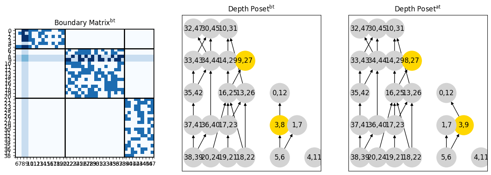

### Birth Death Pairs
|                          |                                                                                                                                                                                                                         |
|:-------------------------|:------------------------------------------------------------------------------------------------------------------------------------------------------------------------------------------------------------------------|
| Before the transposition | $\{(35, 42), (19, 21), (36, 40), (13, 26), (30, 45), (16, 25), (18, 22), (5, 6), (4, 11), (17, 23), (37, 41), (33, 43), (32, 47), (3, 8), (20, 24), (38, 39), (14, 29), (0, 12), (34, 44), (1, 7), (9, 27), (10, 31)\}$ |
| After the transposition  | $\{(35, 42), (19, 21), (36, 40), (8, 27), (13, 26), (30, 45), (16, 25), (18, 22), (3, 9), (5, 6), (4, 11), (17, 23), (37, 41), (33, 43), (32, 47), (20, 24), (38, 39), (14, 29), (0, 12), (34, 44), (1, 7), (10, 31)\}$ |

### Relations
|                          | Algorithm 1                                                                                                                                                                                                                                                                                                                                                                               | Algorithm 2                                                                                                                                                                                                                                                                                                               |
|:-------------------------|:------------------------------------------------------------------------------------------------------------------------------------------------------------------------------------------------------------------------------------------------------------------------------------------------------------------------------------------------------------------------------------------|:--------------------------------------------------------------------------------------------------------------------------------------------------------------------------------------------------------------------------------------------------------------------------------------------------------------------------|
| Before the transposition | $\{(6, 12), (25, 29), (24, 27), (43, 46), (44, 45), (21, 25), (23, 28), (40, 44), (22, 29), (8, 15), (27, 28), (6, 8), (41, 42), (25, 31), (24, 29), (42, 44), (43, 45), (12, 15), (22, 25), (39, 41), (21, 27), (22, 28), (23, 27), (22, 31), (24, 25), (6, 7), (24, 28), (41, 44), (25, 27), (42, 43), (7, 15), (41, 47), (26, 28), (21, 23), (21, 26), (39, 40), (40, 45), (11, 15)\}$ | $\{(20, 14), (38, 35), (14, 10), (17, 9), (19, 9), (37, 30), (37, 33), (36, 34), (18, 10), (18, 16), (18, 13), (4, 2), (3, 0), (17, 14), (34, 30), (19, 17), (37, 35), (16, 9), (13, 10), (18, 9), (33, 28), (20, 9), (18, 15), (3, 2), (38, 30), (20, 15), (38, 36), (17, 16), (17, 13), (19, 10), (34, 32), (33, 30)\}$ |
| After the transposition  | $\{(6, 12), (25, 29), (24, 27), (43, 46), (44, 45), (21, 25), (23, 28), (40, 44), (22, 29), (27, 28), (41, 42), (25, 31), (24, 29), (42, 44), (43, 45), (12, 15), (22, 25), (39, 41), (21, 27), (22, 28), (23, 27), (22, 31), (24, 25), (6, 7), (24, 28), (41, 44), (25, 27), (42, 43), (41, 47), (26, 28), (21, 23), (21, 26), (39, 40), (40, 45), (9, 15), (11, 15), (6, 9)\}$          | $\{(20, 14), (38, 35), (14, 10), (37, 30), (37, 33), (36, 34), (18, 10), (18, 16), (18, 13), (4, 2), (3, 0), (17, 8), (17, 14), (34, 30), (19, 17), (37, 35), (13, 10), (33, 28), (18, 15), (38, 30), (3, 2), (20, 15), (38, 36), (17, 16), (17, 13), (19, 10), (34, 32), (16, 8), (33, 30)\}$                            |

### Successors and Predecessers
|                 | $\text{Set}^\text{bt}(3, 8)$                  | $\text{Set}^\text{bt}(9, 27)$                                                           | $\text{Set}^\text{at}(3, 9)$                  | $\text{Set}^\text{at}(8, 27)$                                                 |
|:----------------|:----------------------------------------------|:----------------------------------------------------------------------------------------|:----------------------------------------------|:------------------------------------------------------------------------------|
| $\text{Succ}_1$ | $\text{Succ}_1^\text{bt}(3, 8) = \emptyset$   | $\text{Succ}_1^\text{bt}(9, 27) = \emptyset$                                            | $\text{Succ}_1^\text{at}(3, 9) = \emptyset$   | $\text{Succ}_1^\text{at}(8, 27) = \emptyset$                                  |
| $\text{Pred}_1$ | $\text{Pred}_1^\text{bt}(3, 8) = \{(5, 6)\}$  | $\text{Pred}_1^\text{bt}(9, 27) = \{(16, 25), (17, 23), (20, 24), (19, 21)\}$           | $\text{Pred}_1^\text{at}(3, 9) = \{(5, 6)\}$  | $\text{Pred}_1^\text{at}(8, 27) = \{(16, 25), (17, 23), (20, 24), (19, 21)\}$ |
| $\text{Succ}_2$ | $\text{Succ}_2^\text{bt}(3, 8) = \{(0, 12)\}$ | $\text{Succ}_2^\text{bt}(9, 27) = \emptyset$                                            | $\text{Succ}_2^\text{at}(3, 9) = \{(0, 12)\}$ | $\text{Succ}_2^\text{at}(8, 27) = \emptyset$                                  |
| $\text{Pred}_2$ | $\text{Pred}_2^\text{bt}(3, 8) = \emptyset$   | $\text{Pred}_2^\text{bt}(9, 27) = \{(17, 23), (20, 24), (16, 25), (18, 22), (19, 21)\}$ | $\text{Pred}_2^\text{at}(3, 9) = \emptyset$   | $\text{Pred}_2^\text{at}(8, 27) = \{(16, 25), (17, 23)\}$                     |

### Temp Sets
|                                                              | Before the Transposition                                         | After the Transposition                                          |
|:-------------------------------------------------------------|:-----------------------------------------------------------------|:-----------------------------------------------------------------|
| $A_1 = \{(s, t)\in \text{BD}:\; f(a) < f(s) < f(t) < f(x)\}$ | $\{(5, 6)\}$                                                     | $\{(5, 6)\}$                                                     |
| $B_1 = \{(s, t)\in \text{BD}:\; U_1[t, x] = 1\}$             | $\emptyset$                                                      | $\{(5, 6)\}$                                                     |
| $A_2 = \{(s, t)\in \text{BD}:\; f(b) < f(s) < f(t) < f(y)\}$ | $\{(17, 23), (20, 24), (13, 26), (16, 25), (18, 22), (19, 21)\}$ | $\{(17, 23), (20, 24), (13, 26), (16, 25), (18, 22), (19, 21)\}$ |
| $B_2 = \{(s, t)\in \text{BD}:\; U_2[b, s] = 1\}$             | $\emptyset$                                                      | $\{(16, 25), (17, 23)\}$                                         |

### Equations
There are 4 equations are wrong.

| eq    | left (formula)                  | left (paramatrized)              | left (value)                                 | right (formula)                                      | right (paramatrized)                                 | right (value)                                | correct   |
|:------|:--------------------------------|:---------------------------------|:---------------------------------------------|:-----------------------------------------------------|:-----------------------------------------------------|:---------------------------------------------|:----------|
| Eq48  | $\text{Succ}_1^\text{at}(a, x)$ | $\text{Succ}_1^\text{at}(3, 9)$  | $\emptyset$                                  | $\text{Succ}_1^\text{bt}(a, b)$                      | $\text{Succ}_1^\text{bt}(3, 8)$                      | $\emptyset$                                  | ✔         |
| Eq49  | $\text{Succ}_1^\text{at}(b, y)$ | $\text{Succ}_1^\text{at}(8, 27)$ | $\emptyset$                                  | $\text{Succ}_1^\text{bt}(x, y)$                      | $\text{Succ}_1^\text{bt}(9, 27)$                     | $\emptyset$                                  | ✔         |
| Eq50  | $\text{Pred}_1^\text{at}(a, x)$ | $\text{Pred}_1^\text{at}(3, 9)$  | $\{(5, 6)\}$                                 | $\{(s, t)\in \text{BD}:\; U_1^\text{bt}[t, x] = 1\}$ | $\{(s, t)\in \text{BD}:\; U_1^\text{bt}[t, 9] = 1\}$ | $\emptyset$                                  | ✘         |
| Eq50a | $\text{Pred}_1^\text{at}(a, x)$ | $\text{Pred}_1^\text{at}(3, 9)$  | $\{(5, 6)\}$                                 | $A_1^\text{bt} \cap B_1^\text{bt}$                   | $A_1^\text{bt} \cap B_1^\text{bt}$                   | $\emptyset$                                  | ✘         |
| Eq50b | $\text{Pred}_1^\text{at}(a, x)$ | $\text{Pred}_1^\text{at}(3, 9)$  | $\{(5, 6)\}$                                 | $A_1^\text{bt} \cap B_1^\text{at}$                   | $A_1^\text{bt} \cap B_1^\text{at}$                   | $\{(5, 6)\}$                                 | ✔         |
| Eq51  | $\text{Pred}_1^\text{at}(b, y)$ | $\text{Pred}_1^\text{at}(8, 27)$ | $\{(16, 25), (17, 23), (20, 24), (19, 21)\}$ | $\text{Pred}_1^\text{bt}(x, y)$                      | $\text{Pred}_1^\text{bt}(9, 27)$                     | $\{(16, 25), (17, 23), (20, 24), (19, 21)\}$ | ✔         |
| Eq52  | $\text{Succ}_2^\text{at}(a, x)$ | $\text{Succ}_2^\text{at}(3, 9)$  | $\{(0, 12)\}$                                | $\text{Succ}_2^\text{bt}(a, b)$                      | $\text{Succ}_2^\text{bt}(3, 8)$                      | $\{(0, 12)\}$                                | ✔         |
| Eq53  | $\text{Succ}_2^\text{at}(b, y)$ | $\text{Succ}_2^\text{at}(8, 27)$ | $\emptyset$                                  | $\text{Succ}_2^\text{bt}(x, y)$                      | $\text{Succ}_2^\text{bt}(9, 27)$                     | $\emptyset$                                  | ✔         |
| Eq54  | $\text{Pred}_2^\text{at}(a, x)$ | $\text{Pred}_2^\text{at}(3, 9)$  | $\emptyset$                                  | $\text{Pred}_2^\text{bt}(a, b)$                      | $\text{Pred}_2^\text{bt}(3, 8)$                      | $\emptyset$                                  | ✔         |
| Eq55  | $\text{Pred}_2^\text{at}(b, y)$ | $\text{Pred}_2^\text{at}(8, 27)$ | $\{(16, 25), (17, 23)\}$                     | $\{(s, t)\in \text{BD}:\; U_2^\text{bt}[b, s] = 1\}$ | $\{(s, t)\in \text{BD}:\; U_2^\text{bt}[8, s] = 1\}$ | $\emptyset$                                  | ✘         |
| Eq55a | $\text{Pred}_2^\text{at}(b, y)$ | $\text{Pred}_2^\text{at}(8, 27)$ | $\{(16, 25), (17, 23)\}$                     | $A_2^\text{bt} \cap B_2^\text{bt}$                   | $A_2^\text{bt} \cap B_2^\text{bt}$                   | $\emptyset$                                  | ✘         |
| Eq55b | $\text{Pred}_2^\text{at}(b, y)$ | $\text{Pred}_2^\text{at}(8, 27)$ | $\{(16, 25), (17, 23)\}$                     | $A_2^\text{bt} \cap B_2^\text{at}$                   | $A_2^\text{bt} \cap B_2^\text{at}$                   | $\{(16, 25), (17, 23)\}$                     | ✔         |

## Transposition <9, 10> in complex 13
Here is a __birth-birth__ __no switch__ transposition <9, 10>.

$$
a = 9, \; b = 27, \; x = 10, \; y = 31
$$

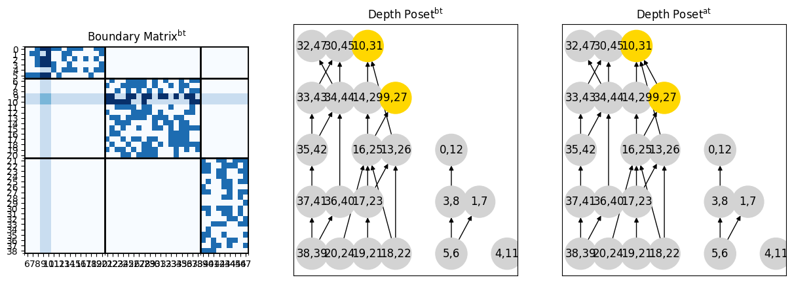

### Birth Death Pairs
|                          |                                                                                                                                                                                                                         |
|:-------------------------|:------------------------------------------------------------------------------------------------------------------------------------------------------------------------------------------------------------------------|
| Before the transposition | $\{(35, 42), (19, 21), (36, 40), (13, 26), (30, 45), (16, 25), (18, 22), (5, 6), (4, 11), (17, 23), (37, 41), (33, 43), (32, 47), (3, 8), (20, 24), (38, 39), (14, 29), (0, 12), (34, 44), (1, 7), (9, 27), (10, 31)\}$ |
| After the transposition  | $\{(35, 42), (19, 21), (36, 40), (13, 26), (30, 45), (16, 25), (18, 22), (5, 6), (4, 11), (17, 23), (37, 41), (33, 43), (32, 47), (3, 8), (20, 24), (38, 39), (14, 29), (0, 12), (34, 44), (1, 7), (9, 27), (10, 31)\}$ |

### Relations
|                          | Algorithm 1                                                                                                                                                                                                                                                                                                                                                                                         | Algorithm 2                                                                                                                                                                                                                                                                                                               |
|:-------------------------|:----------------------------------------------------------------------------------------------------------------------------------------------------------------------------------------------------------------------------------------------------------------------------------------------------------------------------------------------------------------------------------------------------|:--------------------------------------------------------------------------------------------------------------------------------------------------------------------------------------------------------------------------------------------------------------------------------------------------------------------------|
| Before the transposition | $\{(6, 12), (25, 29), (24, 27), (43, 46), (44, 45), (21, 25), (23, 28), (40, 44), (22, 29), (8, 15), (27, 28), (6, 8), (41, 42), (25, 31), (24, 29), (42, 44), (43, 45), (12, 15), (22, 25), (39, 41), (21, 27), (22, 28), (23, 27), (22, 31), (24, 25), (6, 7), (24, 28), (41, 44), (25, 27), (42, 43), (7, 15), (41, 47), (26, 28), (21, 23), (21, 26), (39, 40), (40, 45), (11, 15)\}$           | $\{(20, 14), (38, 35), (14, 10), (17, 9), (19, 9), (37, 30), (37, 33), (36, 34), (18, 10), (18, 16), (18, 13), (4, 2), (3, 0), (17, 14), (34, 30), (19, 17), (37, 35), (16, 9), (13, 10), (18, 9), (33, 28), (20, 9), (18, 15), (3, 2), (38, 30), (20, 15), (38, 36), (17, 16), (17, 13), (19, 10), (34, 32), (33, 30)\}$ |
| After the transposition  | $\{(6, 12), (25, 29), (24, 27), (43, 46), (44, 45), (21, 25), (23, 28), (40, 44), (22, 29), (8, 15), (27, 28), (27, 31), (6, 8), (41, 42), (25, 31), (24, 29), (42, 44), (43, 45), (12, 15), (22, 25), (39, 41), (21, 27), (22, 28), (23, 27), (22, 31), (24, 25), (6, 7), (24, 28), (41, 44), (25, 27), (42, 43), (7, 15), (41, 47), (26, 28), (21, 23), (21, 26), (39, 40), (40, 45), (11, 15)\}$ | $\{(20, 14), (38, 35), (14, 10), (17, 9), (19, 9), (37, 30), (37, 33), (36, 34), (18, 10), (18, 16), (18, 13), (4, 2), (3, 0), (17, 14), (34, 30), (19, 17), (37, 35), (16, 9), (13, 10), (18, 9), (33, 28), (20, 9), (18, 15), (3, 2), (38, 30), (20, 15), (38, 36), (17, 16), (17, 13), (19, 10), (34, 32), (33, 30)\}$ |

### Successors and Predecessers
No such node in the Depth Poset

### Temp Sets
|                                                               | Before the Transposition                                                                                                      | After the Transposition                                                                                                       |
|:--------------------------------------------------------------|:------------------------------------------------------------------------------------------------------------------------------|:------------------------------------------------------------------------------------------------------------------------------|
| $\mathcal{L} = \{(s, t)\in \text{BD}:\; f(t) < f(y)\}$        | $\{(17, 23), (20, 24), (3, 8), (13, 26), (14, 29), (16, 25), (18, 22), (1, 7), (0, 12), (5, 6), (9, 27), (4, 11), (19, 21)\}$ | $\{(17, 23), (20, 24), (3, 8), (13, 26), (14, 29), (16, 25), (18, 22), (1, 7), (0, 12), (5, 6), (9, 27), (4, 11), (19, 21)\}$ |
| $\mathcal{M} = \{(s, t)\in \text{BD}:\; f(y) < f(t) < f(b)\}$ | $\emptyset$                                                                                                                   | $\emptyset$                                                                                                                   |

### Equations
There are 2 equations are wrong.

| eq   | left (formula)                  | left (paramatrized)               | left (value)                                 | right (formula)                                                                        | right (paramatrized)                                                                       | right (value)                                          | correct   |
|:-----|:--------------------------------|:----------------------------------|:---------------------------------------------|:---------------------------------------------------------------------------------------|:-------------------------------------------------------------------------------------------|:-------------------------------------------------------|:----------|
| Eq16 | $\text{Succ}_1^\text{at}(x, y)$ | $\text{Succ}_1^\text{at}(10, 31)$ | $\emptyset$                                  | $\text{Succ}_1^\text{bt}(x, y) \oplus \{(a, b)\} \oplus \text{Succ}_1^\text{bt}(a, b)$ | $\text{Succ}_1^\text{bt}(10, 31) \oplus \{(9, 27)\} \oplus \text{Succ}_1^\text{bt}(9, 27)$ | $\{(9, 27)\}$                                          | ✘         |
| Eq17 | $\text{Pred}_1^\text{at}(a, b)$ | $\text{Pred}_1^\text{at}(9, 27)$  | $\{(16, 25), (17, 23), (20, 24), (19, 21)\}$ | $\text{Pred}_1^\text{bt}(a, b) \oplus \{(x, y)\}$                                      | $\text{Pred}_1^\text{bt}(9, 27) \oplus \{(10, 31)\}$                                       | $\{(17, 23), (20, 24), (16, 25), (19, 21), (10, 31)\}$ | ✘         |

## Transposition <13, 14> in complex 13
Here is a __birth-birth__ __no switch__ transposition <13, 14>.

$$
a = 13, \; b = 26, \; x = 14, \; y = 29
$$

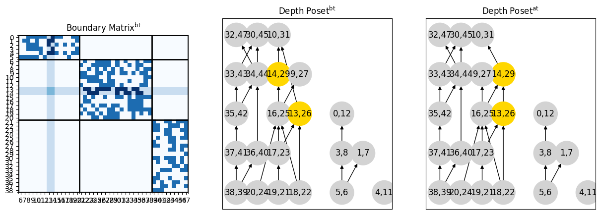

### Birth Death Pairs
|                          |                                                                                                                                                                                                                         |
|:-------------------------|:------------------------------------------------------------------------------------------------------------------------------------------------------------------------------------------------------------------------|
| Before the transposition | $\{(35, 42), (19, 21), (36, 40), (13, 26), (30, 45), (16, 25), (18, 22), (5, 6), (4, 11), (17, 23), (37, 41), (33, 43), (32, 47), (3, 8), (20, 24), (38, 39), (14, 29), (0, 12), (34, 44), (1, 7), (9, 27), (10, 31)\}$ |
| After the transposition  | $\{(35, 42), (19, 21), (36, 40), (13, 26), (30, 45), (16, 25), (18, 22), (5, 6), (4, 11), (17, 23), (37, 41), (33, 43), (32, 47), (3, 8), (20, 24), (38, 39), (14, 29), (0, 12), (34, 44), (1, 7), (9, 27), (10, 31)\}$ |

### Relations
|                          | Algorithm 1                                                                                                                                                                                                                                                                                                                                                                                         | Algorithm 2                                                                                                                                                                                                                                                                                                               |
|:-------------------------|:----------------------------------------------------------------------------------------------------------------------------------------------------------------------------------------------------------------------------------------------------------------------------------------------------------------------------------------------------------------------------------------------------|:--------------------------------------------------------------------------------------------------------------------------------------------------------------------------------------------------------------------------------------------------------------------------------------------------------------------------|
| Before the transposition | $\{(6, 12), (25, 29), (24, 27), (43, 46), (44, 45), (21, 25), (23, 28), (40, 44), (22, 29), (8, 15), (27, 28), (6, 8), (41, 42), (25, 31), (24, 29), (42, 44), (43, 45), (12, 15), (22, 25), (39, 41), (21, 27), (22, 28), (23, 27), (22, 31), (24, 25), (6, 7), (24, 28), (41, 44), (25, 27), (42, 43), (7, 15), (41, 47), (26, 28), (21, 23), (21, 26), (39, 40), (40, 45), (11, 15)\}$           | $\{(20, 14), (38, 35), (14, 10), (17, 9), (19, 9), (37, 30), (37, 33), (36, 34), (18, 10), (18, 16), (18, 13), (4, 2), (3, 0), (17, 14), (34, 30), (19, 17), (37, 35), (16, 9), (13, 10), (18, 9), (33, 28), (20, 9), (18, 15), (3, 2), (38, 30), (20, 15), (38, 36), (17, 16), (17, 13), (19, 10), (34, 32), (33, 30)\}$ |
| After the transposition  | $\{(6, 12), (25, 29), (24, 27), (43, 46), (44, 45), (21, 25), (23, 28), (40, 44), (22, 29), (8, 15), (27, 28), (6, 8), (41, 42), (25, 31), (24, 29), (42, 44), (26, 29), (43, 45), (12, 15), (22, 25), (39, 41), (21, 27), (22, 28), (23, 27), (22, 31), (24, 25), (6, 7), (24, 28), (41, 44), (25, 27), (42, 43), (7, 15), (41, 47), (26, 28), (21, 23), (21, 26), (39, 40), (40, 45), (11, 15)\}$ | $\{(20, 14), (38, 35), (14, 10), (17, 9), (19, 9), (37, 30), (37, 33), (36, 34), (18, 10), (18, 16), (18, 13), (4, 2), (3, 0), (17, 14), (34, 30), (19, 17), (37, 35), (13, 10), (16, 9), (18, 9), (33, 28), (20, 9), (18, 15), (3, 2), (38, 30), (20, 15), (38, 36), (17, 16), (17, 13), (19, 10), (34, 32), (33, 30)\}$ |

### Successors and Predecessers
No such node in the Depth Poset

### Temp Sets
|                                                               | Before the Transposition                                                                                            | After the Transposition                                                                                             |
|:--------------------------------------------------------------|:--------------------------------------------------------------------------------------------------------------------|:--------------------------------------------------------------------------------------------------------------------|
| $\mathcal{L} = \{(s, t)\in \text{BD}:\; f(t) < f(y)\}$        | $\{(17, 23), (20, 24), (3, 8), (13, 26), (0, 12), (16, 25), (18, 22), (1, 7), (5, 6), (9, 27), (4, 11), (19, 21)\}$ | $\{(17, 23), (20, 24), (3, 8), (13, 26), (0, 12), (16, 25), (18, 22), (1, 7), (5, 6), (9, 27), (4, 11), (19, 21)\}$ |
| $\mathcal{M} = \{(s, t)\in \text{BD}:\; f(y) < f(t) < f(b)\}$ | $\emptyset$                                                                                                         | $\emptyset$                                                                                                         |

### Equations
There are 2 equations are wrong.

| eq   | left (formula)                  | left (paramatrized)               | left (value)   | right (formula)                                                                        | right (paramatrized)                                                                         | right (value)            | correct   |
|:-----|:--------------------------------|:----------------------------------|:---------------|:---------------------------------------------------------------------------------------|:---------------------------------------------------------------------------------------------|:-------------------------|:----------|
| Eq16 | $\text{Succ}_1^\text{at}(x, y)$ | $\text{Succ}_1^\text{at}(14, 29)$ | $\emptyset$    | $\text{Succ}_1^\text{bt}(x, y) \oplus \{(a, b)\} \oplus \text{Succ}_1^\text{bt}(a, b)$ | $\text{Succ}_1^\text{bt}(14, 29) \oplus \{(13, 26)\} \oplus \text{Succ}_1^\text{bt}(13, 26)$ | $\{(13, 26)\}$           | ✘         |
| Eq17 | $\text{Pred}_1^\text{at}(a, b)$ | $\text{Pred}_1^\text{at}(13, 26)$ | $\{(19, 21)\}$ | $\text{Pred}_1^\text{bt}(a, b) \oplus \{(x, y)\}$                                      | $\text{Pred}_1^\text{bt}(13, 26) \oplus \{(14, 29)\}$                                        | $\{(14, 29), (19, 21)\}$ | ✘         |

## Transposition <16, 17> in complex 13
Here is a __birth-birth__ __switch forward__ transposition <16, 17>.

$$
a = 16, \; b = 25, \; x = 17, \; y = 23
$$

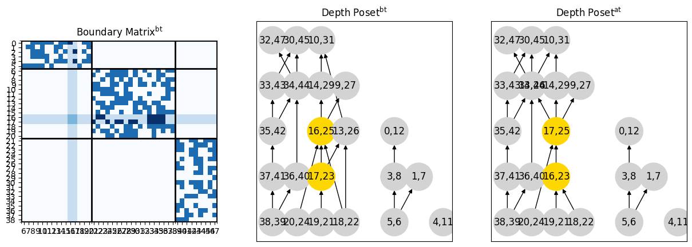

### Birth Death Pairs
|                          |                                                                                                                                                                                                                         |
|:-------------------------|:------------------------------------------------------------------------------------------------------------------------------------------------------------------------------------------------------------------------|
| Before the transposition | $\{(35, 42), (19, 21), (36, 40), (13, 26), (30, 45), (16, 25), (18, 22), (5, 6), (4, 11), (17, 23), (37, 41), (33, 43), (32, 47), (3, 8), (20, 24), (38, 39), (14, 29), (0, 12), (34, 44), (1, 7), (9, 27), (10, 31)\}$ |
| After the transposition  | $\{(35, 42), (19, 21), (36, 40), (13, 26), (30, 45), (18, 22), (5, 6), (4, 11), (37, 41), (10, 31), (33, 43), (32, 47), (3, 8), (20, 24), (38, 39), (14, 29), (0, 12), (34, 44), (1, 7), (17, 25), (9, 27), (16, 23)\}$ |

### Relations
|                          | Algorithm 1                                                                                                                                                                                                                                                                                                                                                                                                   | Algorithm 2                                                                                                                                                                                                                                                                                                                          |
|:-------------------------|:--------------------------------------------------------------------------------------------------------------------------------------------------------------------------------------------------------------------------------------------------------------------------------------------------------------------------------------------------------------------------------------------------------------|:-------------------------------------------------------------------------------------------------------------------------------------------------------------------------------------------------------------------------------------------------------------------------------------------------------------------------------------|
| Before the transposition | $\{(6, 12), (25, 29), (24, 27), (43, 46), (44, 45), (21, 25), (23, 28), (40, 44), (22, 29), (8, 15), (27, 28), (6, 8), (41, 42), (25, 31), (24, 29), (42, 44), (43, 45), (12, 15), (22, 25), (39, 41), (21, 27), (22, 28), (23, 27), (22, 31), (24, 25), (6, 7), (24, 28), (41, 44), (25, 27), (42, 43), (7, 15), (41, 47), (26, 28), (21, 23), (21, 26), (39, 40), (40, 45), (11, 15)\}$                     | $\{(20, 14), (38, 35), (14, 10), (17, 9), (19, 9), (37, 30), (37, 33), (36, 34), (18, 10), (18, 16), (18, 13), (4, 2), (3, 0), (17, 14), (34, 30), (19, 17), (37, 35), (16, 9), (13, 10), (18, 9), (33, 28), (20, 9), (18, 15), (3, 2), (38, 30), (20, 15), (38, 36), (17, 16), (17, 13), (19, 10), (34, 32), (33, 30)\}$            |
| After the transposition  | $\{(6, 12), (25, 29), (24, 27), (43, 46), (44, 45), (21, 25), (23, 28), (40, 44), (23, 25), (23, 31), (22, 29), (8, 15), (27, 28), (6, 8), (41, 42), (25, 31), (24, 29), (42, 44), (43, 45), (12, 15), (22, 25), (39, 41), (21, 27), (22, 28), (22, 31), (24, 25), (6, 7), (24, 28), (41, 44), (25, 27), (42, 43), (7, 15), (41, 47), (26, 28), (21, 23), (21, 26), (39, 40), (23, 29), (40, 45), (11, 15)\}$ | $\{(20, 14), (38, 35), (14, 10), (19, 9), (37, 30), (37, 33), (36, 34), (16, 13), (18, 10), (18, 16), (18, 13), (4, 2), (3, 0), (17, 14), (34, 30), (37, 35), (19, 17), (16, 9), (13, 10), (18, 9), (33, 28), (20, 9), (18, 15), (3, 2), (38, 30), (20, 15), (38, 36), (17, 13), (19, 10), (34, 32), (16, 14), (33, 30), (16, 17)\}$ |

### Successors and Predecessers
|                 | $\text{Set}^\text{bt}(16, 25)$                                       | $\text{Set}^\text{bt}(17, 23)$                                                | $\text{Set}^\text{at}(16, 23)$                                                | $\text{Set}^\text{at}(17, 25)$                                                 |
|:----------------|:---------------------------------------------------------------------|:------------------------------------------------------------------------------|:------------------------------------------------------------------------------|:-------------------------------------------------------------------------------|
| $\text{Succ}_1$ | $\text{Succ}_1^\text{bt}(16, 25) = \{(14, 29), (9, 27), (10, 31)\}$  | $\text{Succ}_1^\text{bt}(17, 23) = \{(9, 27)\}$                               | $\text{Succ}_1^\text{at}(16, 23) = \{(14, 29), (17, 25), (10, 31)\}$          | $\text{Succ}_1^\text{at}(17, 25) = \{(14, 29), (9, 27), (10, 31)\}$            |
| $\text{Pred}_1$ | $\text{Pred}_1^\text{bt}(16, 25) = \{(18, 22), (20, 24), (19, 21)\}$ | $\text{Pred}_1^\text{bt}(17, 23) = \{(19, 21)\}$                              | $\text{Pred}_1^\text{at}(16, 23) = \{(19, 21)\}$                              | $\text{Pred}_1^\text{at}(17, 25) = \{(18, 22), (20, 24), (19, 21), (16, 23)\}$ |
| $\text{Succ}_2$ | $\text{Succ}_2^\text{bt}(16, 25) = \{(9, 27)\}$                      | $\text{Succ}_2^\text{bt}(17, 23) = \{(14, 29), (16, 25), (13, 26), (9, 27)\}$ | $\text{Succ}_2^\text{at}(16, 23) = \{(14, 29), (13, 26), (9, 27), (17, 25)\}$ | $\text{Succ}_2^\text{at}(17, 25) = \{(14, 29), (13, 26)\}$                     |
| $\text{Pred}_2$ | $\text{Pred}_2^\text{bt}(16, 25) = \{(18, 22), (17, 23)\}$           | $\text{Pred}_2^\text{bt}(17, 23) = \{(19, 21)\}$                              | $\text{Pred}_2^\text{at}(16, 23) = \{(18, 22)\}$                              | $\text{Pred}_2^\text{at}(17, 25) = \{(19, 21), (16, 23)\}$                     |

### Temp Sets
|                                                               | Before the Transposition                                           | After the Transposition                                            |
|:--------------------------------------------------------------|:-------------------------------------------------------------------|:-------------------------------------------------------------------|
| $\mathcal{L} = \{(s, t)\in \text{BD}:\; f(t) < f(y)\}$        | $\{(3, 8), (0, 12), (18, 22), (1, 7), (5, 6), (4, 11), (19, 21)\}$ | $\{(3, 8), (0, 12), (18, 22), (1, 7), (5, 6), (4, 11), (19, 21)\}$ |
| $\mathcal{M} = \{(s, t)\in \text{BD}:\; f(y) < f(t) < f(b)\}$ | $\{(20, 24)\}$                                                     | $\{(20, 24)\}$                                                     |

### Equations
There are 1 equations are wrong.

| eq   | left (formula)                  | left (paramatrized)               | left (value)                                 | right (formula)                                                                                           | right (paramatrized)                                                                                            | right (value)                                | correct   |
|:-----|:--------------------------------|:----------------------------------|:---------------------------------------------|:----------------------------------------------------------------------------------------------------------|:----------------------------------------------------------------------------------------------------------------|:---------------------------------------------|:----------|
| Eq08 | $\text{Succ}_1^\text{at}(a, y)$ | $\text{Succ}_1^\text{at}(16, 23)$ | $\{(14, 29), (17, 25), (10, 31)\}$           | $\text{Succ}_1^\text{bt}(x, y) \oplus \{(x, b)\} \oplus \text{Succ}_1^\text{bt}(a, b)$                    | $\text{Succ}_1^\text{bt}(17, 23) \oplus \{(17, 25)\} \oplus \text{Succ}_1^\text{bt}(16, 25)$                    | $\{(14, 29), (17, 25), (10, 31)\}$           | ✔         |
| Eq09 | $\text{Succ}_1^\text{at}(x, b)$ | $\text{Succ}_1^\text{at}(17, 25)$ | $\{(14, 29), (9, 27), (10, 31)\}$            | $\text{Succ}_1^\text{bt}(a, b)$                                                                           | $\text{Succ}_1^\text{bt}(16, 25)$                                                                               | $\{(14, 29), (9, 27), (10, 31)\}$            | ✔         |
| Eq10 | $\text{Pred}_1^\text{at}(a, y)$ | $\text{Pred}_1^\text{at}(16, 23)$ | $\{(19, 21)\}$                               | $\text{Pred}_1^\text{bt}(x, y)$                                                                           | $\text{Pred}_1^\text{bt}(17, 23)$                                                                               | $\{(19, 21)\}$                               | ✔         |
| Eq11 | $\text{Pred}_1^\text{at}(x, b)$ | $\text{Pred}_1^\text{at}(17, 25)$ | $\{(18, 22), (20, 24), (19, 21), (16, 23)\}$ | $\text{Pred}_1^\text{bt}(a, b) \oplus \{(a, y)\}$                                                         | $\text{Pred}_1^\text{bt}(16, 25) \oplus \{(16, 23)\}$                                                           | $\{(18, 22), (20, 24), (19, 21), (16, 23)\}$ | ✔         |
| Eq12 | $\text{Succ}_2^\text{at}(a, y)$ | $\text{Succ}_2^\text{at}(16, 23)$ | $\{(14, 29), (13, 26), (9, 27), (17, 25)\}$  | $\text{Succ}_2^\text{bt}(x, y) \oplus \{(x, b), (a, b)\}$                                                 | $\text{Succ}_2^\text{bt}(17, 23) \oplus \{(17, 25), (16, 25)\}$                                                 | $\{(14, 29), (13, 26), (9, 27), (17, 25)\}$  | ✔         |
| Eq13 | $\text{Succ}_2^\text{at}(x, b)$ | $\text{Succ}_2^\text{at}(17, 25)$ | $\{(14, 29), (13, 26)\}$                     | $\text{Succ}_2^\text{bt}(a, b)$                                                                           | $\text{Succ}_2^\text{bt}(16, 25)$                                                                               | $\{(9, 27)\}$                                | ✘         |
| Eq14 | $\text{Pred}_2^\text{at}(a, y)$ | $\text{Pred}_2^\text{at}(16, 23)$ | $\{(18, 22)\}$                               | $[\text{Pred}_2^\text{bt}(a, b) \cap \mathcal{L}]$                                                        | $[\text{Pred}_2^\text{bt}(16, 25) \cap \mathcal{L}]$                                                            | $\{(18, 22)\}$                               | ✔         |
| Eq15 | $\text{Pred}_2^\text{at}(x, b)$ | $\text{Pred}_2^\text{at}(17, 25)$ | $\{(19, 21), (16, 23)\}$                     | $\text{Pred}_2^\text{bt}(x, y) \oplus \{(a, y)\} \oplus [\text{Pred}_2^\text{bt}(a, b) \cap \mathcal{M}]$ | $\text{Pred}_2^\text{bt}(17, 23) \oplus \{(16, 23)\} \oplus [\text{Pred}_2^\text{bt}(16, 25) \cap \mathcal{M}]$ | $\{(19, 21), (16, 23)\}$                     | ✔         |

## Transposition <19, 20> in complex 13
Here is a __birth-birth__ __no switch__ transposition <19, 20>.

$$
a = 19, \; b = 21, \; x = 20, \; y = 24
$$

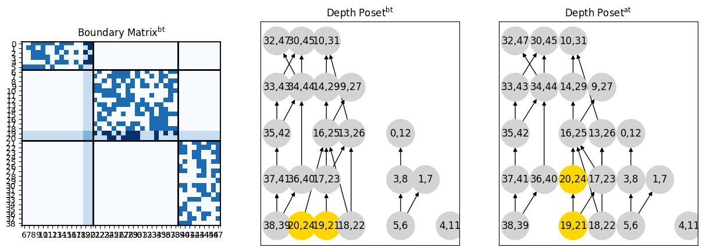

### Birth Death Pairs
|                          |                                                                                                                                                                                                                         |
|:-------------------------|:------------------------------------------------------------------------------------------------------------------------------------------------------------------------------------------------------------------------|
| Before the transposition | $\{(35, 42), (19, 21), (36, 40), (13, 26), (30, 45), (16, 25), (18, 22), (5, 6), (4, 11), (17, 23), (37, 41), (33, 43), (32, 47), (3, 8), (20, 24), (38, 39), (14, 29), (0, 12), (34, 44), (1, 7), (9, 27), (10, 31)\}$ |
| After the transposition  | $\{(35, 42), (19, 21), (36, 40), (13, 26), (30, 45), (16, 25), (18, 22), (5, 6), (4, 11), (17, 23), (37, 41), (33, 43), (32, 47), (3, 8), (20, 24), (38, 39), (14, 29), (0, 12), (34, 44), (1, 7), (9, 27), (10, 31)\}$ |

### Relations
|                          | Algorithm 1                                                                                                                                                                                                                                                                                                                                                                                         | Algorithm 2                                                                                                                                                                                                                                                                                                               |
|:-------------------------|:----------------------------------------------------------------------------------------------------------------------------------------------------------------------------------------------------------------------------------------------------------------------------------------------------------------------------------------------------------------------------------------------------|:--------------------------------------------------------------------------------------------------------------------------------------------------------------------------------------------------------------------------------------------------------------------------------------------------------------------------|
| Before the transposition | $\{(6, 12), (25, 29), (24, 27), (43, 46), (44, 45), (21, 25), (23, 28), (40, 44), (22, 29), (8, 15), (27, 28), (6, 8), (41, 42), (25, 31), (24, 29), (42, 44), (43, 45), (12, 15), (22, 25), (39, 41), (21, 27), (22, 28), (23, 27), (22, 31), (24, 25), (6, 7), (24, 28), (41, 44), (25, 27), (42, 43), (7, 15), (41, 47), (26, 28), (21, 23), (21, 26), (39, 40), (40, 45), (11, 15)\}$           | $\{(20, 14), (38, 35), (14, 10), (17, 9), (19, 9), (37, 30), (37, 33), (36, 34), (18, 10), (18, 16), (18, 13), (4, 2), (3, 0), (17, 14), (34, 30), (19, 17), (37, 35), (16, 9), (13, 10), (18, 9), (33, 28), (20, 9), (18, 15), (3, 2), (38, 30), (20, 15), (38, 36), (17, 16), (17, 13), (19, 10), (34, 32), (33, 30)\}$ |
| After the transposition  | $\{(6, 12), (25, 29), (24, 27), (43, 46), (44, 45), (21, 28), (23, 28), (40, 44), (22, 29), (8, 15), (27, 28), (6, 8), (41, 42), (25, 31), (24, 29), (42, 44), (43, 45), (12, 15), (21, 24), (22, 25), (39, 41), (22, 28), (23, 27), (22, 31), (24, 25), (6, 7), (24, 28), (41, 44), (25, 27), (42, 43), (7, 15), (41, 47), (26, 28), (21, 23), (21, 26), (21, 29), (39, 40), (40, 45), (11, 15)\}$ | $\{(20, 14), (38, 35), (14, 10), (17, 9), (19, 9), (37, 30), (37, 33), (36, 34), (18, 10), (18, 16), (18, 13), (4, 2), (3, 0), (17, 14), (34, 30), (19, 17), (37, 35), (16, 9), (13, 10), (18, 9), (33, 28), (20, 9), (18, 15), (3, 2), (38, 30), (20, 15), (38, 36), (17, 16), (17, 13), (19, 10), (34, 32), (33, 30)\}$ |

### Successors and Predecessers
No such node in the Depth Poset

### Temp Sets
|                                                               | Before the Transposition                                                     | After the Transposition                                                      |
|:--------------------------------------------------------------|:-----------------------------------------------------------------------------|:-----------------------------------------------------------------------------|
| $\mathcal{L} = \{(s, t)\in \text{BD}:\; f(t) < f(y)\}$        | $\{(17, 23), (3, 8), (0, 12), (1, 7), (18, 22), (5, 6), (4, 11), (19, 21)\}$ | $\{(17, 23), (3, 8), (0, 12), (1, 7), (18, 22), (5, 6), (4, 11), (19, 21)\}$ |
| $\mathcal{M} = \{(s, t)\in \text{BD}:\; f(y) < f(t) < f(b)\}$ | $\emptyset$                                                                  | $\emptyset$                                                                  |

### Equations
There are 2 equations are wrong.

| eq   | left (formula)                  | left (paramatrized)               | left (value)                      | right (formula)                                                                        | right (paramatrized)                                                                         | right (value)                                | correct   |
|:-----|:--------------------------------|:----------------------------------|:----------------------------------|:---------------------------------------------------------------------------------------|:---------------------------------------------------------------------------------------------|:---------------------------------------------|:----------|
| Eq16 | $\text{Succ}_1^\text{at}(x, y)$ | $\text{Succ}_1^\text{at}(20, 24)$ | $\{(14, 29), (16, 25), (9, 27)\}$ | $\text{Succ}_1^\text{bt}(x, y) \oplus \{(a, b)\} \oplus \text{Succ}_1^\text{bt}(a, b)$ | $\text{Succ}_1^\text{bt}(20, 24) \oplus \{(19, 21)\} \oplus \text{Succ}_1^\text{bt}(19, 21)$ | $\{(14, 29), (19, 21), (17, 23), (13, 26)\}$ | ✘         |
| Eq17 | $\text{Pred}_1^\text{at}(a, b)$ | $\text{Pred}_1^\text{at}(19, 21)$ | $\emptyset$                       | $\text{Pred}_1^\text{bt}(a, b) \oplus \{(x, y)\}$                                      | $\text{Pred}_1^\text{bt}(19, 21) \oplus \{(20, 24)\}$                                        | $\{(20, 24)\}$                               | ✘         |

## Transposition <24, 25> in complex 13
Here is a __death-death__ __switch forward__ transposition <24, 25>.

$$
a = 16, \; b = 25, \; x = 20, \; y = 24
$$

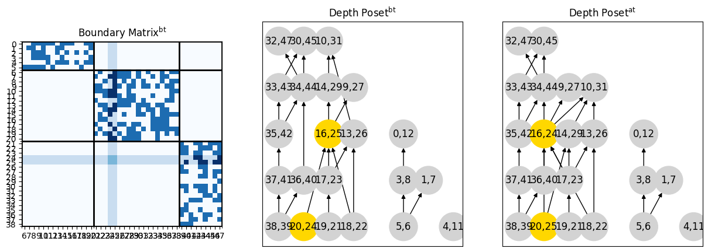

### Birth Death Pairs
|                          |                                                                                                                                                                                                                         |
|:-------------------------|:------------------------------------------------------------------------------------------------------------------------------------------------------------------------------------------------------------------------|
| Before the transposition | $\{(35, 42), (19, 21), (36, 40), (13, 26), (30, 45), (16, 25), (18, 22), (5, 6), (4, 11), (17, 23), (37, 41), (33, 43), (32, 47), (3, 8), (20, 24), (38, 39), (14, 29), (0, 12), (34, 44), (1, 7), (9, 27), (10, 31)\}$ |
| After the transposition  | $\{(35, 42), (19, 21), (36, 40), (13, 26), (30, 45), (18, 22), (20, 25), (5, 6), (4, 11), (17, 23), (37, 41), (16, 24), (33, 43), (32, 47), (3, 8), (38, 39), (14, 29), (0, 12), (34, 44), (1, 7), (9, 27), (10, 31)\}$ |

### Relations
|                          | Algorithm 1                                                                                                                                                                                                                                                                                                                                                                               | Algorithm 2                                                                                                                                                                                                                                                                                                                |
|:-------------------------|:------------------------------------------------------------------------------------------------------------------------------------------------------------------------------------------------------------------------------------------------------------------------------------------------------------------------------------------------------------------------------------------|:---------------------------------------------------------------------------------------------------------------------------------------------------------------------------------------------------------------------------------------------------------------------------------------------------------------------------|
| Before the transposition | $\{(6, 12), (25, 29), (24, 27), (43, 46), (44, 45), (21, 25), (23, 28), (40, 44), (22, 29), (8, 15), (27, 28), (6, 8), (41, 42), (25, 31), (24, 29), (42, 44), (43, 45), (12, 15), (22, 25), (39, 41), (21, 27), (22, 28), (23, 27), (22, 31), (24, 25), (6, 7), (24, 28), (41, 44), (25, 27), (42, 43), (7, 15), (41, 47), (26, 28), (21, 23), (21, 26), (39, 40), (40, 45), (11, 15)\}$ | $\{(20, 14), (38, 35), (14, 10), (17, 9), (19, 9), (37, 30), (37, 33), (36, 34), (18, 10), (18, 16), (18, 13), (4, 2), (3, 0), (17, 14), (34, 30), (19, 17), (37, 35), (16, 9), (13, 10), (18, 9), (33, 28), (20, 9), (18, 15), (3, 2), (38, 30), (20, 15), (38, 36), (17, 16), (17, 13), (19, 10), (34, 32), (33, 30)\}$  |
| After the transposition  | $\{(6, 12), (25, 29), (43, 46), (44, 45), (21, 28), (23, 28), (40, 44), (8, 15), (27, 28), (25, 28), (6, 8), (41, 42), (42, 44), (43, 45), (12, 15), (21, 24), (39, 41), (23, 27), (22, 31), (6, 7), (25, 24), (24, 28), (41, 44), (25, 27), (42, 43), (24, 31), (7, 15), (41, 47), (26, 28), (21, 23), (21, 26), (22, 27), (21, 29), (22, 24), (39, 40), (40, 45), (11, 15)\}$           | $\{(20, 14), (38, 35), (14, 10), (17, 9), (19, 9), (37, 30), (37, 33), (36, 34), (18, 10), (18, 16), (18, 13), (4, 2), (3, 0), (20, 16), (17, 14), (34, 30), (19, 17), (37, 35), (16, 9), (13, 10), (18, 9), (33, 28), (18, 15), (3, 2), (38, 30), (20, 15), (38, 36), (17, 16), (17, 13), (19, 10), (34, 32), (33, 30)\}$ |

### Successors and Predecessers
|                 | $\text{Set}^\text{bt}(16, 25)$                                       | $\text{Set}^\text{bt}(20, 24)$                                      | $\text{Set}^\text{at}(20, 25)$                                      | $\text{Set}^\text{at}(16, 24)$                                       |
|:----------------|:---------------------------------------------------------------------|:--------------------------------------------------------------------|:--------------------------------------------------------------------|:---------------------------------------------------------------------|
| $\text{Succ}_1$ | $\text{Succ}_1^\text{bt}(16, 25) = \{(14, 29), (9, 27), (10, 31)\}$  | $\text{Succ}_1^\text{bt}(20, 24) = \{(14, 29), (16, 25), (9, 27)\}$ | $\text{Succ}_1^\text{at}(20, 25) = \{(16, 24), (9, 27), (14, 29)\}$ | $\text{Succ}_1^\text{at}(16, 24) = \{(10, 31)\}$                     |
| $\text{Pred}_1$ | $\text{Pred}_1^\text{bt}(16, 25) = \{(18, 22), (20, 24), (19, 21)\}$ | $\text{Pred}_1^\text{bt}(20, 24) = \emptyset$                       | $\text{Pred}_1^\text{at}(20, 25) = \emptyset$                       | $\text{Pred}_1^\text{at}(16, 24) = \{(18, 22), (19, 21), (20, 25)\}$ |
| $\text{Succ}_2$ | $\text{Succ}_2^\text{bt}(16, 25) = \{(9, 27)\}$                      | $\text{Succ}_2^\text{bt}(20, 24) = \{(14, 29), (9, 27)\}$           | $\text{Succ}_2^\text{at}(20, 25) = \{(16, 24), (14, 29)\}$          | $\text{Succ}_2^\text{at}(16, 24) = \{(9, 27)\}$                      |
| $\text{Pred}_2$ | $\text{Pred}_2^\text{bt}(16, 25) = \{(18, 22), (17, 23)\}$           | $\text{Pred}_2^\text{bt}(20, 24) = \emptyset$                       | $\text{Pred}_2^\text{at}(20, 25) = \emptyset$                       | $\text{Pred}_2^\text{at}(16, 24) = \{(18, 22), (20, 25), (17, 23)\}$ |

### Temp Sets
|                                                               | Before the Transposition                                                             | After the Transposition                                                              |
|:--------------------------------------------------------------|:-------------------------------------------------------------------------------------|:-------------------------------------------------------------------------------------|
| $\mathcal{B} = \{(s, t)\in \text{BD}:\; f(s) > f(x)\}$        | $\{(36, 40), (38, 39), (35, 42), (30, 45), (37, 41), (34, 44), (33, 43), (32, 47)\}$ | $\{(36, 40), (38, 39), (35, 42), (30, 45), (37, 41), (34, 44), (33, 43), (32, 47)\}$ |
| $\mathcal{N} = \{(s, t)\in \text{BD}:\; f(x) > f(s) > f(a)\}$ | $\{(18, 22), (19, 21), (17, 23)\}$                                                   | $\{(18, 22), (19, 21), (17, 23)\}$                                                   |

### Equations
There are 1 equations are wrong.

| eq   | left (formula)                  | left (paramatrized)               | left (value)                       | right (formula)                                                                                          | right (paramatrized)                                                                                           | right (value)                      | correct   |
|:-----|:--------------------------------|:----------------------------------|:-----------------------------------|:---------------------------------------------------------------------------------------------------------|:---------------------------------------------------------------------------------------------------------------|:-----------------------------------|:----------|
| Eq28 | $\text{Succ}_1^\text{at}(x, b)$ | $\text{Succ}_1^\text{at}(20, 25)$ | $\{(16, 24), (9, 27), (14, 29)\}$  | $\text{Succ}_1^\text{bt}(x, y) \oplus \{(a, y), (a, b)\}$                                                | $\text{Succ}_1^\text{bt}(20, 24) \oplus \{(16, 24), (16, 25)\}$                                                | $\{(16, 24), (9, 27), (14, 29)\}$  | ✔         |
| Eq29 | $\text{Succ}_1^\text{at}(a, y)$ | $\text{Succ}_1^\text{at}(16, 24)$ | $\{(10, 31)\}$                     | $\text{Succ}_1^\text{bt}(a, b)$                                                                          | $\text{Succ}_1^\text{bt}(16, 25)$                                                                              | $\{(14, 29), (9, 27), (10, 31)\}$  | ✘         |
| Eq30 | $\text{Pred}_1^\text{at}(x, b)$ | $\text{Pred}_1^\text{at}(20, 25)$ | $\emptyset$                        | $[\text{Pred}_1^\text{bt}(a, b) \cap \mathcal{B}]$                                                       | $[\text{Pred}_1^\text{bt}(16, 25) \cap \mathcal{B}]$                                                           | $\emptyset$                        | ✔         |
| Eq31 | $\text{Pred}_1^\text{at}(a, y)$ | $\text{Pred}_1^\text{at}(16, 24)$ | $\{(18, 22), (19, 21), (20, 25)\}$ | $\text{Pred}_1^\text{bt}(x, y) \oplus \{(x, b)\} \oplus[\text{Pred}_1^\text{bt}(a, b) \cap \mathcal{N}]$ | $\text{Pred}_1^\text{bt}(20, 24) \oplus \{(20, 25)\} \oplus[\text{Pred}_1^\text{bt}(16, 25) \cap \mathcal{N}]$ | $\{(18, 22), (19, 21), (20, 25)\}$ | ✔         |
| Eq32 | $\text{Succ}_2^\text{at}(x, b)$ | $\text{Succ}_2^\text{at}(20, 25)$ | $\{(16, 24), (14, 29)\}$           | $\text{Succ}_2^\text{bt}(x, y) \oplus \{(a, y)\} \oplus \text{Succ}_2^\text{bt}(a, b)$                   | $\text{Succ}_2^\text{bt}(20, 24) \oplus \{(16, 24)\} \oplus \text{Succ}_2^\text{bt}(16, 25)$                   | $\{(14, 29), (16, 24)\}$           | ✔         |
| Eq33 | $\text{Succ}_2^\text{at}(a, y)$ | $\text{Succ}_2^\text{at}(16, 24)$ | $\{(9, 27)\}$                      | $\text{Succ}_2^\text{bt}(a, b)$                                                                          | $\text{Succ}_2^\text{bt}(16, 25)$                                                                              | $\{(9, 27)\}$                      | ✔         |
| Eq34 | $\text{Pred}_2^\text{at}(x, b)$ | $\text{Pred}_2^\text{at}(20, 25)$ | $\emptyset$                        | $\text{Pred}_2^\text{bt}(x, y)$                                                                          | $\text{Pred}_2^\text{bt}(20, 24)$                                                                              | $\emptyset$                        | ✔         |
| Eq35 | $\text{Pred}_2^\text{at}(a, y)$ | $\text{Pred}_2^\text{at}(16, 24)$ | $\{(18, 22), (20, 25), (17, 23)\}$ | $\text{Pred}_2^\text{bt}(a, b) \oplus \{(x, b)\}$                                                        | $\text{Pred}_2^\text{bt}(16, 25) \oplus \{(20, 25)\}$                                                          | $\{(18, 22), (20, 25), (17, 23)\}$ | ✔         |

## Transposition <33, 34> in complex 13
Here is a __birth-birth__ __no switch__ transposition <33, 34>.

$$
a = 33, \; b = 43, \; x = 34, \; y = 44
$$

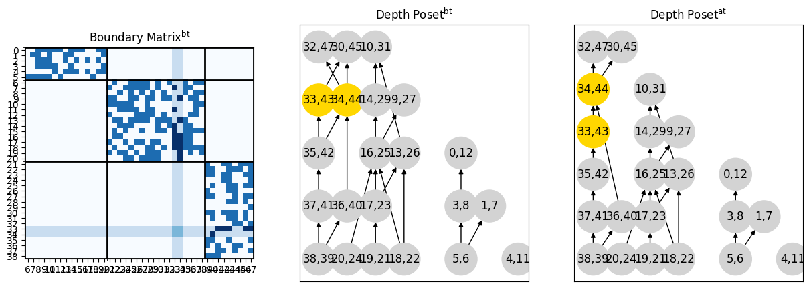

### Birth Death Pairs
|                          |                                                                                                                                                                                                                         |
|:-------------------------|:------------------------------------------------------------------------------------------------------------------------------------------------------------------------------------------------------------------------|
| Before the transposition | $\{(35, 42), (19, 21), (36, 40), (13, 26), (30, 45), (16, 25), (18, 22), (5, 6), (4, 11), (17, 23), (37, 41), (33, 43), (32, 47), (3, 8), (20, 24), (38, 39), (14, 29), (0, 12), (34, 44), (1, 7), (9, 27), (10, 31)\}$ |
| After the transposition  | $\{(35, 42), (19, 21), (36, 40), (13, 26), (30, 45), (16, 25), (18, 22), (5, 6), (4, 11), (17, 23), (37, 41), (33, 43), (32, 47), (3, 8), (20, 24), (38, 39), (14, 29), (0, 12), (34, 44), (1, 7), (9, 27), (10, 31)\}$ |

### Relations
|                          | Algorithm 1                                                                                                                                                                                                                                                                                                                                                                               | Algorithm 2                                                                                                                                                                                                                                                                                                               |
|:-------------------------|:------------------------------------------------------------------------------------------------------------------------------------------------------------------------------------------------------------------------------------------------------------------------------------------------------------------------------------------------------------------------------------------|:--------------------------------------------------------------------------------------------------------------------------------------------------------------------------------------------------------------------------------------------------------------------------------------------------------------------------|
| Before the transposition | $\{(6, 12), (25, 29), (24, 27), (43, 46), (44, 45), (21, 25), (23, 28), (40, 44), (22, 29), (8, 15), (27, 28), (6, 8), (41, 42), (25, 31), (24, 29), (42, 44), (43, 45), (12, 15), (22, 25), (39, 41), (21, 27), (22, 28), (23, 27), (22, 31), (24, 25), (6, 7), (24, 28), (41, 44), (25, 27), (42, 43), (7, 15), (41, 47), (26, 28), (21, 23), (21, 26), (39, 40), (40, 45), (11, 15)\}$ | $\{(20, 14), (38, 35), (14, 10), (17, 9), (19, 9), (37, 30), (37, 33), (36, 34), (18, 10), (18, 16), (18, 13), (4, 2), (3, 0), (17, 14), (34, 30), (19, 17), (37, 35), (16, 9), (13, 10), (18, 9), (33, 28), (20, 9), (18, 15), (3, 2), (38, 30), (20, 15), (38, 36), (17, 16), (17, 13), (19, 10), (34, 32), (33, 30)\}$ |
| After the transposition  | $\{(6, 12), (25, 29), (24, 27), (43, 46), (44, 45), (21, 25), (23, 28), (40, 44), (22, 29), (8, 15), (27, 28), (6, 8), (41, 42), (25, 31), (24, 29), (42, 44), (12, 15), (22, 25), (39, 41), (21, 27), (22, 28), (23, 27), (22, 31), (24, 25), (6, 7), (24, 28), (41, 44), (25, 27), (42, 43), (7, 15), (41, 47), (43, 44), (26, 28), (21, 23), (21, 26), (39, 40), (40, 45), (11, 15)\}$ | $\{(20, 14), (38, 35), (14, 10), (17, 9), (19, 9), (37, 30), (37, 33), (36, 34), (18, 10), (18, 16), (18, 13), (4, 2), (3, 0), (17, 14), (34, 30), (19, 17), (37, 35), (16, 9), (13, 10), (33, 28), (18, 9), (20, 9), (18, 15), (3, 2), (38, 30), (20, 15), (38, 36), (17, 16), (17, 13), (19, 10), (34, 32), (33, 30)\}$ |

### Successors and Predecessers
No such node in the Depth Poset

### Temp Sets
|                                                               | Before the Transposition                                                                                                                                                                  | After the Transposition                                                                                                                                                                   |
|:--------------------------------------------------------------|:------------------------------------------------------------------------------------------------------------------------------------------------------------------------------------------|:------------------------------------------------------------------------------------------------------------------------------------------------------------------------------------------|
| $\mathcal{L} = \{(s, t)\in \text{BD}:\; f(t) < f(y)\}$        | $\{(35, 42), (19, 21), (36, 40), (13, 26), (16, 25), (18, 22), (5, 6), (4, 11), (17, 23), (37, 41), (33, 43), (3, 8), (20, 24), (38, 39), (14, 29), (0, 12), (1, 7), (9, 27), (10, 31)\}$ | $\{(35, 42), (19, 21), (36, 40), (13, 26), (16, 25), (18, 22), (5, 6), (4, 11), (17, 23), (37, 41), (33, 43), (3, 8), (20, 24), (38, 39), (14, 29), (0, 12), (1, 7), (9, 27), (10, 31)\}$ |
| $\mathcal{M} = \{(s, t)\in \text{BD}:\; f(y) < f(t) < f(b)\}$ | $\emptyset$                                                                                                                                                                               | $\emptyset$                                                                                                                                                                               |

### Equations
There are 2 equations are wrong.

| eq   | left (formula)                  | left (paramatrized)               | left (value)   | right (formula)                                                                        | right (paramatrized)                                                                         | right (value)            | correct   |
|:-----|:--------------------------------|:----------------------------------|:---------------|:---------------------------------------------------------------------------------------|:---------------------------------------------------------------------------------------------|:-------------------------|:----------|
| Eq16 | $\text{Succ}_1^\text{at}(x, y)$ | $\text{Succ}_1^\text{at}(34, 44)$ | $\{(30, 45)\}$ | $\text{Succ}_1^\text{bt}(x, y) \oplus \{(a, b)\} \oplus \text{Succ}_1^\text{bt}(a, b)$ | $\text{Succ}_1^\text{bt}(34, 44) \oplus \{(33, 43)\} \oplus \text{Succ}_1^\text{bt}(33, 43)$ | $\{(33, 43)\}$           | ✘         |
| Eq17 | $\text{Pred}_1^\text{at}(a, b)$ | $\text{Pred}_1^\text{at}(33, 43)$ | $\{(35, 42)\}$ | $\text{Pred}_1^\text{bt}(a, b) \oplus \{(x, y)\}$                                      | $\text{Pred}_1^\text{bt}(33, 43) \oplus \{(34, 44)\}$                                        | $\{(35, 42), (34, 44)\}$ | ✘         |

## Transposition <42, 43> in complex 13
Here is a __death-death__ __switch forward__ transposition <42, 43>.

$$
a = 33, \; b = 43, \; x = 35, \; y = 42
$$

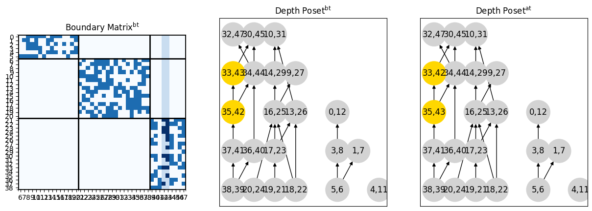

### Birth Death Pairs
|                          |                                                                                                                                                                                                                         |
|:-------------------------|:------------------------------------------------------------------------------------------------------------------------------------------------------------------------------------------------------------------------|
| Before the transposition | $\{(35, 42), (19, 21), (36, 40), (13, 26), (30, 45), (16, 25), (18, 22), (5, 6), (4, 11), (17, 23), (37, 41), (33, 43), (32, 47), (3, 8), (20, 24), (38, 39), (14, 29), (0, 12), (34, 44), (1, 7), (9, 27), (10, 31)\}$ |
| After the transposition  | $\{(33, 42), (19, 21), (36, 40), (13, 26), (30, 45), (16, 25), (18, 22), (5, 6), (4, 11), (17, 23), (37, 41), (32, 47), (35, 43), (20, 24), (3, 8), (38, 39), (14, 29), (0, 12), (34, 44), (1, 7), (9, 27), (10, 31)\}$ |

### Relations
|                          | Algorithm 1                                                                                                                                                                                                                                                                                                                                                                               | Algorithm 2                                                                                                                                                                                                                                                                                                                                             |
|:-------------------------|:------------------------------------------------------------------------------------------------------------------------------------------------------------------------------------------------------------------------------------------------------------------------------------------------------------------------------------------------------------------------------------------|:--------------------------------------------------------------------------------------------------------------------------------------------------------------------------------------------------------------------------------------------------------------------------------------------------------------------------------------------------------|
| Before the transposition | $\{(6, 12), (25, 29), (24, 27), (43, 46), (44, 45), (21, 25), (23, 28), (40, 44), (22, 29), (8, 15), (27, 28), (6, 8), (41, 42), (25, 31), (24, 29), (42, 44), (43, 45), (12, 15), (22, 25), (39, 41), (21, 27), (22, 28), (23, 27), (22, 31), (24, 25), (6, 7), (24, 28), (41, 44), (25, 27), (42, 43), (7, 15), (41, 47), (26, 28), (21, 23), (21, 26), (39, 40), (40, 45), (11, 15)\}$ | $\{(20, 14), (38, 35), (14, 10), (17, 9), (19, 9), (37, 30), (37, 33), (36, 34), (18, 10), (18, 16), (18, 13), (4, 2), (3, 0), (17, 14), (34, 30), (19, 17), (37, 35), (16, 9), (13, 10), (18, 9), (33, 28), (20, 9), (18, 15), (3, 2), (38, 30), (20, 15), (38, 36), (17, 16), (17, 13), (19, 10), (34, 32), (33, 30)\}$                               |
| After the transposition  | $\{(6, 12), (25, 29), (24, 27), (44, 45), (21, 25), (23, 28), (40, 44), (22, 29), (8, 15), (27, 28), (6, 8), (41, 42), (25, 31), (24, 29), (43, 42), (12, 15), (22, 25), (21, 27), (39, 41), (22, 28), (23, 27), (22, 31), (24, 25), (6, 7), (24, 28), (41, 44), (25, 27), (7, 15), (41, 47), (43, 44), (42, 46), (26, 28), (21, 23), (21, 26), (39, 40), (40, 45), (11, 15)\}$           | $\{(35, 30), (35, 33), (20, 14), (38, 35), (14, 10), (17, 9), (19, 9), (37, 30), (37, 33), (36, 34), (18, 10), (18, 16), (18, 13), (4, 2), (3, 0), (17, 14), (34, 30), (19, 17), (37, 35), (16, 9), (13, 10), (18, 9), (33, 28), (35, 28), (20, 9), (18, 15), (3, 2), (38, 30), (20, 15), (38, 36), (17, 16), (17, 13), (19, 10), (34, 32), (33, 30)\}$ |

### Successors and Predecessers
|                 | $\text{Set}^\text{bt}(33, 43)$                   | $\text{Set}^\text{bt}(35, 42)$                             | $\text{Set}^\text{at}(35, 43)$                             | $\text{Set}^\text{at}(33, 42)$                             |
|:----------------|:-------------------------------------------------|:-----------------------------------------------------------|:-----------------------------------------------------------|:-----------------------------------------------------------|
| $\text{Succ}_1$ | $\text{Succ}_1^\text{bt}(33, 43) = \{(30, 45)\}$ | $\text{Succ}_1^\text{bt}(35, 42) = \{(34, 44), (33, 43)\}$ | $\text{Succ}_1^\text{at}(35, 43) = \{(34, 44), (33, 42)\}$ | $\text{Succ}_1^\text{at}(33, 42) = \emptyset$              |
| $\text{Pred}_1$ | $\text{Pred}_1^\text{bt}(33, 43) = \{(35, 42)\}$ | $\text{Pred}_1^\text{bt}(35, 42) = \{(37, 41)\}$           | $\text{Pred}_1^\text{at}(35, 43) = \emptyset$              | $\text{Pred}_1^\text{at}(33, 42) = \{(35, 43), (37, 41)\}$ |
| $\text{Succ}_2$ | $\text{Succ}_2^\text{bt}(33, 43) = \{(30, 45)\}$ | $\text{Succ}_2^\text{bt}(35, 42) = \emptyset$              | $\text{Succ}_2^\text{at}(35, 43) = \{(33, 42), (30, 45)\}$ | $\text{Succ}_2^\text{at}(33, 42) = \{(30, 45)\}$           |
| $\text{Pred}_2$ | $\text{Pred}_2^\text{bt}(33, 43) = \{(37, 41)\}$ | $\text{Pred}_2^\text{bt}(35, 42) = \{(38, 39), (37, 41)\}$ | $\text{Pred}_2^\text{at}(35, 43) = \{(38, 39), (37, 41)\}$ | $\text{Pred}_2^\text{at}(33, 42) = \{(35, 43), (37, 41)\}$ |

### Temp Sets
|                                                               | Before the Transposition           | After the Transposition            |
|:--------------------------------------------------------------|:-----------------------------------|:-----------------------------------|
| $\mathcal{B} = \{(s, t)\in \text{BD}:\; f(s) > f(x)\}$        | $\{(36, 40), (38, 39), (37, 41)\}$ | $\{(36, 40), (38, 39), (37, 41)\}$ |
| $\mathcal{N} = \{(s, t)\in \text{BD}:\; f(x) > f(s) > f(a)\}$ | $\{(34, 44)\}$                     | $\{(34, 44)\}$                     |

### Equations
There are 1 equations are wrong.

| eq   | left (formula)                  | left (paramatrized)               | left (value)             | right (formula)                                                                                          | right (paramatrized)                                                                                           | right (value)            | correct   |
|:-----|:--------------------------------|:----------------------------------|:-------------------------|:---------------------------------------------------------------------------------------------------------|:---------------------------------------------------------------------------------------------------------------|:-------------------------|:----------|
| Eq28 | $\text{Succ}_1^\text{at}(x, b)$ | $\text{Succ}_1^\text{at}(35, 43)$ | $\{(34, 44), (33, 42)\}$ | $\text{Succ}_1^\text{bt}(x, y) \oplus \{(a, y), (a, b)\}$                                                | $\text{Succ}_1^\text{bt}(35, 42) \oplus \{(33, 42), (33, 43)\}$                                                | $\{(34, 44), (33, 42)\}$ | ✔         |
| Eq29 | $\text{Succ}_1^\text{at}(a, y)$ | $\text{Succ}_1^\text{at}(33, 42)$ | $\emptyset$              | $\text{Succ}_1^\text{bt}(a, b)$                                                                          | $\text{Succ}_1^\text{bt}(33, 43)$                                                                              | $\{(30, 45)\}$           | ✘         |
| Eq30 | $\text{Pred}_1^\text{at}(x, b)$ | $\text{Pred}_1^\text{at}(35, 43)$ | $\emptyset$              | $[\text{Pred}_1^\text{bt}(a, b) \cap \mathcal{B}]$                                                       | $[\text{Pred}_1^\text{bt}(33, 43) \cap \mathcal{B}]$                                                           | $\emptyset$              | ✔         |
| Eq31 | $\text{Pred}_1^\text{at}(a, y)$ | $\text{Pred}_1^\text{at}(33, 42)$ | $\{(35, 43), (37, 41)\}$ | $\text{Pred}_1^\text{bt}(x, y) \oplus \{(x, b)\} \oplus[\text{Pred}_1^\text{bt}(a, b) \cap \mathcal{N}]$ | $\text{Pred}_1^\text{bt}(35, 42) \oplus \{(35, 43)\} \oplus[\text{Pred}_1^\text{bt}(33, 43) \cap \mathcal{N}]$ | $\{(35, 43), (37, 41)\}$ | ✔         |
| Eq32 | $\text{Succ}_2^\text{at}(x, b)$ | $\text{Succ}_2^\text{at}(35, 43)$ | $\{(33, 42), (30, 45)\}$ | $\text{Succ}_2^\text{bt}(x, y) \oplus \{(a, y)\} \oplus \text{Succ}_2^\text{bt}(a, b)$                   | $\text{Succ}_2^\text{bt}(35, 42) \oplus \{(33, 42)\} \oplus \text{Succ}_2^\text{bt}(33, 43)$                   | $\{(33, 42), (30, 45)\}$ | ✔         |
| Eq33 | $\text{Succ}_2^\text{at}(a, y)$ | $\text{Succ}_2^\text{at}(33, 42)$ | $\{(30, 45)\}$           | $\text{Succ}_2^\text{bt}(a, b)$                                                                          | $\text{Succ}_2^\text{bt}(33, 43)$                                                                              | $\{(30, 45)\}$           | ✔         |
| Eq34 | $\text{Pred}_2^\text{at}(x, b)$ | $\text{Pred}_2^\text{at}(35, 43)$ | $\{(38, 39), (37, 41)\}$ | $\text{Pred}_2^\text{bt}(x, y)$                                                                          | $\text{Pred}_2^\text{bt}(35, 42)$                                                                              | $\{(38, 39), (37, 41)\}$ | ✔         |
| Eq35 | $\text{Pred}_2^\text{at}(a, y)$ | $\text{Pred}_2^\text{at}(33, 42)$ | $\{(35, 43), (37, 41)\}$ | $\text{Pred}_2^\text{bt}(a, b) \oplus \{(x, b)\}$                                                        | $\text{Pred}_2^\text{bt}(33, 43) \oplus \{(35, 43)\}$                                                          | $\{(35, 43), (37, 41)\}$ | ✔         |

## Transposition <43, 44> in complex 13
Here is a __death-death__ __no switch__ transposition <43, 44>.

$$
a = 34, \; b = 44, \; x = 33, \; y = 43
$$

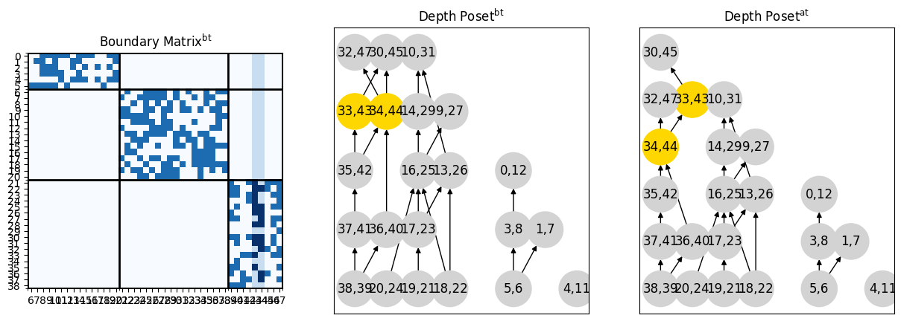

### Birth Death Pairs
|                          |                                                                                                                                                                                                                         |
|:-------------------------|:------------------------------------------------------------------------------------------------------------------------------------------------------------------------------------------------------------------------|
| Before the transposition | $\{(35, 42), (19, 21), (36, 40), (13, 26), (30, 45), (16, 25), (18, 22), (5, 6), (4, 11), (17, 23), (37, 41), (33, 43), (32, 47), (3, 8), (20, 24), (38, 39), (14, 29), (0, 12), (34, 44), (1, 7), (9, 27), (10, 31)\}$ |
| After the transposition  | $\{(35, 42), (19, 21), (36, 40), (13, 26), (30, 45), (16, 25), (18, 22), (5, 6), (4, 11), (17, 23), (37, 41), (33, 43), (32, 47), (3, 8), (20, 24), (38, 39), (14, 29), (0, 12), (34, 44), (1, 7), (9, 27), (10, 31)\}$ |

### Relations
|                          | Algorithm 1                                                                                                                                                                                                                                                                                                                                                                               | Algorithm 2                                                                                                                                                                                                                                                                                                                         |
|:-------------------------|:------------------------------------------------------------------------------------------------------------------------------------------------------------------------------------------------------------------------------------------------------------------------------------------------------------------------------------------------------------------------------------------|:------------------------------------------------------------------------------------------------------------------------------------------------------------------------------------------------------------------------------------------------------------------------------------------------------------------------------------|
| Before the transposition | $\{(6, 12), (25, 29), (24, 27), (43, 46), (44, 45), (21, 25), (23, 28), (40, 44), (22, 29), (8, 15), (27, 28), (6, 8), (41, 42), (25, 31), (24, 29), (42, 44), (43, 45), (12, 15), (22, 25), (39, 41), (21, 27), (22, 28), (23, 27), (22, 31), (24, 25), (6, 7), (24, 28), (41, 44), (25, 27), (42, 43), (7, 15), (41, 47), (26, 28), (21, 23), (21, 26), (39, 40), (40, 45), (11, 15)\}$ | $\{(20, 14), (38, 35), (14, 10), (17, 9), (19, 9), (37, 30), (37, 33), (36, 34), (18, 10), (18, 16), (18, 13), (4, 2), (3, 0), (17, 14), (34, 30), (19, 17), (37, 35), (16, 9), (13, 10), (18, 9), (33, 28), (20, 9), (18, 15), (3, 2), (38, 30), (20, 15), (38, 36), (17, 16), (17, 13), (19, 10), (34, 32), (33, 30)\}$           |
| After the transposition  | $\{(6, 12), (25, 29), (24, 27), (43, 46), (44, 45), (21, 25), (23, 28), (40, 44), (22, 29), (8, 15), (27, 28), (6, 8), (41, 42), (25, 31), (24, 29), (42, 44), (43, 45), (12, 15), (22, 25), (39, 41), (21, 27), (22, 28), (23, 27), (22, 31), (24, 25), (6, 7), (24, 28), (41, 44), (25, 27), (42, 43), (7, 15), (41, 47), (26, 28), (21, 23), (21, 26), (39, 40), (40, 45), (11, 15)\}$ | $\{(20, 14), (38, 35), (14, 10), (17, 9), (19, 9), (34, 28), (37, 30), (37, 33), (36, 34), (18, 10), (18, 16), (18, 13), (4, 2), (3, 0), (17, 14), (34, 33), (19, 17), (37, 35), (16, 9), (13, 10), (18, 9), (33, 28), (20, 9), (18, 15), (3, 2), (38, 30), (20, 15), (38, 36), (17, 16), (17, 13), (19, 10), (34, 32), (33, 30)\}$ |

### Successors and Predecessers
No such node in the Depth Poset

### Temp Sets
|                                                               | Before the Transposition                               | After the Transposition                                |
|:--------------------------------------------------------------|:-------------------------------------------------------|:-------------------------------------------------------|
| $\mathcal{B} = \{(s, t)\in \text{BD}:\; f(s) > f(x)\}$        | $\{(36, 40), (38, 39), (35, 42), (37, 41), (34, 44)\}$ | $\{(36, 40), (38, 39), (35, 42), (37, 41), (34, 44)\}$ |
| $\mathcal{N} = \{(s, t)\in \text{BD}:\; f(x) > f(s) > f(a)\}$ | $\emptyset$                                            | $\emptyset$                                            |

### Equations
There are 2 equations are wrong.

| eq   | left (formula)                  | left (paramatrized)               | left (value)   | right (formula)                                                                        | right (paramatrized)                                                                         | right (value)            | correct   |
|:-----|:--------------------------------|:----------------------------------|:---------------|:---------------------------------------------------------------------------------------|:---------------------------------------------------------------------------------------------|:-------------------------|:----------|
| Eq36 | $\text{Succ}_2^\text{at}(x, y)$ | $\text{Succ}_2^\text{at}(33, 43)$ | $\{(30, 45)\}$ | $\text{Succ}_2^\text{bt}(x, y) \oplus \{(a, b)\} \oplus \text{Succ}_2^\text{bt}(a, b)$ | $\text{Succ}_2^\text{bt}(33, 43) \oplus \{(34, 44)\} \oplus \text{Succ}_2^\text{bt}(34, 44)$ | $\{(34, 44), (32, 47)\}$ | ✘         |
| Eq37 | $\text{Pred}_2^\text{at}(a, b)$ | $\text{Pred}_2^\text{at}(34, 44)$ | $\{(36, 40)\}$ | $\text{Pred}_2^\text{bt}(a, b) \oplus \{(x, y)\}$                                      | $\text{Pred}_2^\text{bt}(34, 44) \oplus \{(33, 43)\}$                                        | $\{(36, 40), (33, 43)\}$ | ✘         |

## Transposition <12, 13> in complex 14
Here is a __birth-birth__ __no switch__ transposition <12, 13>.

$$
a = 12, \; b = 26, \; x = 13, \; y = 27
$$

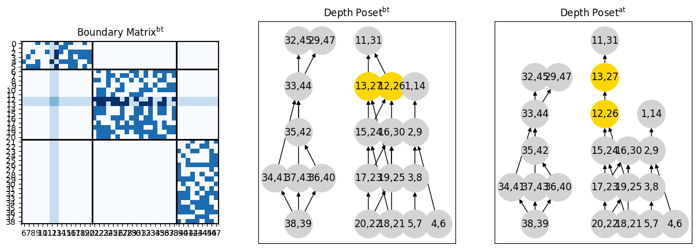

### Birth Death Pairs
|                          |                                                                                                                                                                                                                         |
|:-------------------------|:------------------------------------------------------------------------------------------------------------------------------------------------------------------------------------------------------------------------|
| Before the transposition | $\{(13, 27), (15, 24), (35, 42), (4, 6), (5, 7), (29, 47), (36, 40), (33, 44), (32, 45), (20, 22), (17, 23), (1, 14), (11, 31), (18, 21), (16, 30), (3, 8), (38, 39), (12, 26), (2, 9), (19, 25), (34, 41), (37, 43)\}$ |
| After the transposition  | $\{(13, 27), (15, 24), (35, 42), (4, 6), (5, 7), (29, 47), (36, 40), (33, 44), (32, 45), (20, 22), (17, 23), (1, 14), (11, 31), (18, 21), (16, 30), (3, 8), (38, 39), (12, 26), (2, 9), (19, 25), (34, 41), (37, 43)\}$ |

### Relations
|                          | Algorithm 1                                                                                                                                                                                                                                                                                                                                                                                                                              | Algorithm 2                                                                                                                                                                                                                                                                                                                                                                                                                                          |
|:-------------------------|:-----------------------------------------------------------------------------------------------------------------------------------------------------------------------------------------------------------------------------------------------------------------------------------------------------------------------------------------------------------------------------------------------------------------------------------------|:-----------------------------------------------------------------------------------------------------------------------------------------------------------------------------------------------------------------------------------------------------------------------------------------------------------------------------------------------------------------------------------------------------------------------------------------------------|
| Before the transposition | $\{(42, 45), (41, 46), (44, 45), (21, 28), (22, 23), (23, 28), (40, 44), (39, 42), (22, 26), (8, 9), (40, 47), (39, 45), (9, 14), (27, 28), (25, 26), (45, 46), (25, 28), (24, 26), (6, 14), (42, 47), (44, 47), (43, 45), (21, 30), (39, 41), (21, 27), (23, 24), (23, 30), (22, 31), (7, 9), (24, 28), (41, 44), (43, 44), (25, 30), (26, 31), (44, 46), (22, 24), (39, 46), (40, 45), (39, 43), (6, 9), (7, 8)\}$                     | $\{(20, 11), (35, 33), (12, 10), (20, 17), (38, 29), (38, 35), (38, 32), (34, 28), (19, 12), (1, 0), (37, 33), (13, 11), (15, 11), (16, 10), (18, 16), (35, 32), (20, 13), (33, 32), (20, 10), (20, 16), (38, 28), (20, 19), (38, 34), (5, 3), (19, 11), (11, 10), (36, 33), (15, 13), (15, 10), (33, 28), (18, 12), (18, 15), (3, 2), (12, 11), (38, 33), (38, 36), (2, 0), (19, 16), (36, 32), (37, 28), (19, 13), (36, 29), (36, 35), (32, 28)\}$ |
| After the transposition  | $\{(42, 45), (41, 46), (44, 45), (26, 27), (21, 28), (22, 23), (23, 28), (40, 44), (39, 42), (22, 26), (8, 9), (40, 47), (39, 45), (9, 14), (27, 28), (45, 46), (25, 28), (24, 26), (6, 14), (42, 47), (44, 47), (43, 45), (21, 30), (39, 41), (21, 27), (23, 24), (23, 30), (22, 31), (7, 9), (24, 28), (41, 44), (26, 28), (43, 44), (25, 30), (26, 31), (44, 46), (22, 24), (39, 46), (40, 45), (39, 43), (7, 8), (6, 9), (25, 26)\}$ | $\{(20, 11), (35, 33), (38, 29), (20, 17), (38, 35), (12, 10), (38, 32), (34, 28), (19, 12), (1, 0), (37, 33), (13, 11), (15, 11), (16, 10), (18, 16), (35, 32), (20, 13), (33, 32), (20, 10), (20, 16), (38, 28), (20, 19), (38, 34), (5, 3), (19, 11), (11, 10), (36, 33), (15, 13), (15, 10), (33, 28), (18, 12), (18, 15), (12, 11), (3, 2), (38, 33), (38, 36), (2, 0), (19, 16), (36, 32), (37, 28), (19, 13), (36, 29), (36, 35), (32, 28)\}$ |

### Successors and Predecessers
No such node in the Depth Poset

### Temp Sets
|                                                               | Before the Transposition                                                                                  | After the Transposition                                                                                   |
|:--------------------------------------------------------------|:----------------------------------------------------------------------------------------------------------|:----------------------------------------------------------------------------------------------------------|
| $\mathcal{L} = \{(s, t)\in \text{BD}:\; f(t) < f(y)\}$        | $\{(17, 23), (3, 8), (15, 24), (12, 26), (4, 6), (1, 14), (5, 7), (2, 9), (19, 25), (20, 22), (18, 21)\}$ | $\{(17, 23), (3, 8), (15, 24), (12, 26), (4, 6), (1, 14), (5, 7), (2, 9), (19, 25), (20, 22), (18, 21)\}$ |
| $\mathcal{M} = \{(s, t)\in \text{BD}:\; f(y) < f(t) < f(b)\}$ | $\emptyset$                                                                                               | $\emptyset$                                                                                               |

### Equations
There are 2 equations are wrong.

| eq   | left (formula)                  | left (paramatrized)               | left (value)                       | right (formula)                                                                        | right (paramatrized)                                                                         | right (value)                                | correct   |
|:-----|:--------------------------------|:----------------------------------|:-----------------------------------|:---------------------------------------------------------------------------------------|:---------------------------------------------------------------------------------------------|:---------------------------------------------|:----------|
| Eq16 | $\text{Succ}_1^\text{at}(x, y)$ | $\text{Succ}_1^\text{at}(13, 27)$ | $\emptyset$                        | $\text{Succ}_1^\text{bt}(x, y) \oplus \{(a, b)\} \oplus \text{Succ}_1^\text{bt}(a, b)$ | $\text{Succ}_1^\text{bt}(13, 27) \oplus \{(12, 26)\} \oplus \text{Succ}_1^\text{bt}(12, 26)$ | $\{(11, 31), (12, 26)\}$                     | ✘         |
| Eq17 | $\text{Pred}_1^\text{at}(a, b)$ | $\text{Pred}_1^\text{at}(12, 26)$ | $\{(20, 22), (19, 25), (15, 24)\}$ | $\text{Pred}_1^\text{bt}(a, b) \oplus \{(x, y)\}$                                      | $\text{Pred}_1^\text{bt}(12, 26) \oplus \{(13, 27)\}$                                        | $\{(20, 22), (19, 25), (13, 27), (15, 24)\}$ | ✘         |

## Transposition <14, 15> in complex 14
Here is a __birth-death__ __switch forward__ transposition <14, 15>.

$$
a = 1, \; b = 14, \; x = 15, \; y = 24
$$

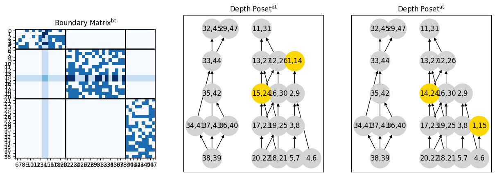

### Birth Death Pairs
|                          |                                                                                                                                                                                                                         |
|:-------------------------|:------------------------------------------------------------------------------------------------------------------------------------------------------------------------------------------------------------------------|
| Before the transposition | $\{(13, 27), (15, 24), (35, 42), (4, 6), (5, 7), (29, 47), (36, 40), (33, 44), (32, 45), (20, 22), (17, 23), (1, 14), (11, 31), (18, 21), (16, 30), (3, 8), (38, 39), (12, 26), (2, 9), (19, 25), (34, 41), (37, 43)\}$ |
| After the transposition  | $\{(13, 27), (35, 42), (4, 6), (5, 7), (29, 47), (36, 40), (1, 15), (33, 44), (32, 45), (20, 22), (14, 24), (17, 23), (11, 31), (18, 21), (16, 30), (3, 8), (38, 39), (12, 26), (2, 9), (19, 25), (34, 41), (37, 43)\}$ |

### Relations
|                          | Algorithm 1                                                                                                                                                                                                                                                                                                                                                                                                          | Algorithm 2                                                                                                                                                                                                                                                                                                                                                                                                                                          |
|:-------------------------|:---------------------------------------------------------------------------------------------------------------------------------------------------------------------------------------------------------------------------------------------------------------------------------------------------------------------------------------------------------------------------------------------------------------------|:-----------------------------------------------------------------------------------------------------------------------------------------------------------------------------------------------------------------------------------------------------------------------------------------------------------------------------------------------------------------------------------------------------------------------------------------------------|
| Before the transposition | $\{(42, 45), (41, 46), (44, 45), (21, 28), (22, 23), (23, 28), (40, 44), (39, 42), (22, 26), (8, 9), (40, 47), (39, 45), (9, 14), (27, 28), (25, 26), (45, 46), (25, 28), (24, 26), (6, 14), (42, 47), (44, 47), (43, 45), (21, 30), (39, 41), (21, 27), (23, 24), (23, 30), (22, 31), (7, 9), (24, 28), (41, 44), (43, 44), (25, 30), (26, 31), (44, 46), (22, 24), (39, 46), (40, 45), (39, 43), (6, 9), (7, 8)\}$ | $\{(20, 11), (35, 33), (12, 10), (20, 17), (38, 29), (38, 35), (38, 32), (34, 28), (19, 12), (1, 0), (37, 33), (13, 11), (15, 11), (16, 10), (18, 16), (35, 32), (20, 13), (33, 32), (20, 10), (20, 16), (38, 28), (20, 19), (38, 34), (5, 3), (19, 11), (11, 10), (36, 33), (15, 13), (15, 10), (33, 28), (18, 12), (18, 15), (3, 2), (12, 11), (38, 33), (38, 36), (2, 0), (19, 16), (36, 32), (37, 28), (19, 13), (36, 29), (36, 35), (32, 28)\}$ |
| After the transposition  | $\{(42, 45), (6, 15), (41, 46), (44, 45), (21, 28), (22, 23), (23, 28), (40, 44), (39, 42), (22, 26), (8, 9), (40, 47), (39, 45), (27, 28), (45, 46), (25, 28), (24, 26), (42, 47), (44, 47), (43, 45), (21, 30), (39, 41), (21, 27), (23, 24), (23, 30), (22, 31), (7, 9), (24, 28), (41, 44), (43, 44), (25, 30), (26, 31), (44, 46), (22, 24), (39, 46), (40, 45), (39, 43), (7, 8), (6, 9), (25, 26)\}$          | $\{(20, 11), (35, 33), (12, 10), (20, 17), (38, 29), (38, 35), (38, 32), (14, 10), (14, 13), (34, 28), (19, 12), (1, 0), (37, 33), (13, 11), (16, 10), (18, 16), (35, 32), (20, 13), (33, 32), (20, 10), (20, 16), (38, 28), (20, 19), (38, 34), (5, 3), (19, 11), (11, 10), (36, 33), (33, 28), (18, 12), (3, 2), (12, 11), (38, 33), (14, 11), (38, 36), (2, 0), (19, 16), (36, 32), (37, 28), (19, 13), (36, 29), (36, 35), (32, 28), (18, 14)\}$ |

### Successors and Predecessers
|                 | $\text{Set}^\text{bt}(1, 14)$                         | $\text{Set}^\text{bt}(15, 24)$                             | $\text{Set}^\text{at}(1, 15)$                 | $\text{Set}^\text{at}(14, 24)$                             |
|:----------------|:------------------------------------------------------|:-----------------------------------------------------------|:----------------------------------------------|:-----------------------------------------------------------|
| $\text{Succ}_1$ | $\text{Succ}_1^\text{bt}(1, 14) = \emptyset$          | $\text{Succ}_1^\text{bt}(15, 24) = \{(12, 26)\}$           | $\text{Succ}_1^\text{at}(1, 15) = \emptyset$  | $\text{Succ}_1^\text{at}(14, 24) = \{(12, 26)\}$           |
| $\text{Pred}_1$ | $\text{Pred}_1^\text{bt}(1, 14) = \{(2, 9), (4, 6)\}$ | $\text{Pred}_1^\text{bt}(15, 24) = \{(20, 22), (17, 23)\}$ | $\text{Pred}_1^\text{at}(1, 15) = \{(4, 6)\}$ | $\text{Pred}_1^\text{at}(14, 24) = \{(20, 22), (17, 23)\}$ |
| $\text{Succ}_2$ | $\text{Succ}_2^\text{bt}(1, 14) = \emptyset$          | $\text{Succ}_2^\text{bt}(15, 24) = \{(11, 31), (13, 27)\}$ | $\text{Succ}_2^\text{at}(1, 15) = \emptyset$  | $\text{Succ}_2^\text{at}(14, 24) = \{(11, 31), (13, 27)\}$ |
| $\text{Pred}_2$ | $\text{Pred}_2^\text{bt}(1, 14) = \emptyset$          | $\text{Pred}_2^\text{bt}(15, 24) = \{(18, 21)\}$           | $\text{Pred}_2^\text{at}(1, 15) = \emptyset$  | $\text{Pred}_2^\text{at}(14, 24) = \{(18, 21)\}$           |

### Temp Sets
|                                                              | Before the Transposition             | After the Transposition              |
|:-------------------------------------------------------------|:-------------------------------------|:-------------------------------------|
| $A_1 = \{(s, t)\in \text{BD}:\; f(a) < f(s) < f(t) < f(x)\}$ | $\{(2, 9), (3, 8), (4, 6), (5, 7)\}$ | $\{(2, 9), (3, 8), (4, 6), (5, 7)\}$ |
| $B_1 = \{(s, t)\in \text{BD}:\; U_1[t, x] = 1\}$             | $\emptyset$                          | $\{(4, 6)\}$                         |
| $A_2 = \{(s, t)\in \text{BD}:\; f(b) < f(s) < f(t) < f(y)\}$ | $\{(20, 22), (18, 21), (17, 23)\}$   | $\{(20, 22), (18, 21), (17, 23)\}$   |
| $B_2 = \{(s, t)\in \text{BD}:\; U_2[b, s] = 1\}$             | $\emptyset$                          | $\{(18, 21)\}$                       |

### Equations
There are 4 equations are wrong.

| eq    | left (formula)                  | left (paramatrized)               | left (value)             | right (formula)                                      | right (paramatrized)                                  | right (value)            | correct   |
|:------|:--------------------------------|:----------------------------------|:-------------------------|:-----------------------------------------------------|:------------------------------------------------------|:-------------------------|:----------|
| Eq48  | $\text{Succ}_1^\text{at}(a, x)$ | $\text{Succ}_1^\text{at}(1, 15)$  | $\emptyset$              | $\text{Succ}_1^\text{bt}(a, b)$                      | $\text{Succ}_1^\text{bt}(1, 14)$                      | $\emptyset$              | ✔         |
| Eq49  | $\text{Succ}_1^\text{at}(b, y)$ | $\text{Succ}_1^\text{at}(14, 24)$ | $\{(12, 26)\}$           | $\text{Succ}_1^\text{bt}(x, y)$                      | $\text{Succ}_1^\text{bt}(15, 24)$                     | $\{(12, 26)\}$           | ✔         |
| Eq50  | $\text{Pred}_1^\text{at}(a, x)$ | $\text{Pred}_1^\text{at}(1, 15)$  | $\{(4, 6)\}$             | $\{(s, t)\in \text{BD}:\; U_1^\text{bt}[t, x] = 1\}$ | $\{(s, t)\in \text{BD}:\; U_1^\text{bt}[t, 15] = 1\}$ | $\emptyset$              | ✘         |
| Eq50a | $\text{Pred}_1^\text{at}(a, x)$ | $\text{Pred}_1^\text{at}(1, 15)$  | $\{(4, 6)\}$             | $A_1^\text{bt} \cap B_1^\text{bt}$                   | $A_1^\text{bt} \cap B_1^\text{bt}$                    | $\emptyset$              | ✘         |
| Eq50b | $\text{Pred}_1^\text{at}(a, x)$ | $\text{Pred}_1^\text{at}(1, 15)$  | $\{(4, 6)\}$             | $A_1^\text{bt} \cap B_1^\text{at}$                   | $A_1^\text{bt} \cap B_1^\text{at}$                    | $\{(4, 6)\}$             | ✔         |
| Eq51  | $\text{Pred}_1^\text{at}(b, y)$ | $\text{Pred}_1^\text{at}(14, 24)$ | $\{(20, 22), (17, 23)\}$ | $\text{Pred}_1^\text{bt}(x, y)$                      | $\text{Pred}_1^\text{bt}(15, 24)$                     | $\{(20, 22), (17, 23)\}$ | ✔         |
| Eq52  | $\text{Succ}_2^\text{at}(a, x)$ | $\text{Succ}_2^\text{at}(1, 15)$  | $\emptyset$              | $\text{Succ}_2^\text{bt}(a, b)$                      | $\text{Succ}_2^\text{bt}(1, 14)$                      | $\emptyset$              | ✔         |
| Eq53  | $\text{Succ}_2^\text{at}(b, y)$ | $\text{Succ}_2^\text{at}(14, 24)$ | $\{(11, 31), (13, 27)\}$ | $\text{Succ}_2^\text{bt}(x, y)$                      | $\text{Succ}_2^\text{bt}(15, 24)$                     | $\{(11, 31), (13, 27)\}$ | ✔         |
| Eq54  | $\text{Pred}_2^\text{at}(a, x)$ | $\text{Pred}_2^\text{at}(1, 15)$  | $\emptyset$              | $\text{Pred}_2^\text{bt}(a, b)$                      | $\text{Pred}_2^\text{bt}(1, 14)$                      | $\emptyset$              | ✔         |
| Eq55  | $\text{Pred}_2^\text{at}(b, y)$ | $\text{Pred}_2^\text{at}(14, 24)$ | $\{(18, 21)\}$           | $\{(s, t)\in \text{BD}:\; U_2^\text{bt}[b, s] = 1\}$ | $\{(s, t)\in \text{BD}:\; U_2^\text{bt}[14, s] = 1\}$ | $\emptyset$              | ✘         |
| Eq55a | $\text{Pred}_2^\text{at}(b, y)$ | $\text{Pred}_2^\text{at}(14, 24)$ | $\{(18, 21)\}$           | $A_2^\text{bt} \cap B_2^\text{bt}$                   | $A_2^\text{bt} \cap B_2^\text{bt}$                    | $\emptyset$              | ✘         |
| Eq55b | $\text{Pred}_2^\text{at}(b, y)$ | $\text{Pred}_2^\text{at}(14, 24)$ | $\{(18, 21)\}$           | $A_2^\text{bt} \cap B_2^\text{at}$                   | $A_2^\text{bt} \cap B_2^\text{at}$                    | $\{(18, 21)\}$           | ✔         |

## Transposition <19, 20> in complex 14
Here is a __birth-birth__ __switch forward__ transposition <19, 20>.

$$
a = 19, \; b = 25, \; x = 20, \; y = 22
$$

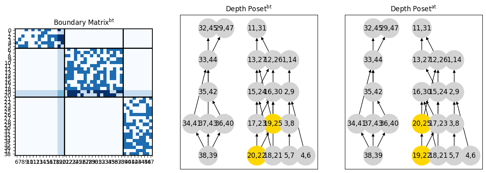

### Birth Death Pairs
|                          |                                                                                                                                                                                                                         |
|:-------------------------|:------------------------------------------------------------------------------------------------------------------------------------------------------------------------------------------------------------------------|
| Before the transposition | $\{(13, 27), (15, 24), (35, 42), (4, 6), (5, 7), (29, 47), (36, 40), (33, 44), (32, 45), (20, 22), (17, 23), (1, 14), (11, 31), (18, 21), (16, 30), (3, 8), (38, 39), (12, 26), (2, 9), (19, 25), (34, 41), (37, 43)\}$ |
| After the transposition  | $\{(13, 27), (15, 24), (35, 42), (4, 6), (5, 7), (29, 47), (36, 40), (33, 44), (32, 45), (20, 25), (17, 23), (1, 14), (11, 31), (18, 21), (16, 30), (3, 8), (38, 39), (12, 26), (2, 9), (34, 41), (19, 22), (37, 43)\}$ |

### Relations
|                          | Algorithm 1                                                                                                                                                                                                                                                                                                                                                                                                                              | Algorithm 2                                                                                                                                                                                                                                                                                                                                                                                                                                          |
|:-------------------------|:-----------------------------------------------------------------------------------------------------------------------------------------------------------------------------------------------------------------------------------------------------------------------------------------------------------------------------------------------------------------------------------------------------------------------------------------|:-----------------------------------------------------------------------------------------------------------------------------------------------------------------------------------------------------------------------------------------------------------------------------------------------------------------------------------------------------------------------------------------------------------------------------------------------------|
| Before the transposition | $\{(42, 45), (41, 46), (44, 45), (21, 28), (22, 23), (23, 28), (40, 44), (39, 42), (22, 26), (8, 9), (40, 47), (39, 45), (9, 14), (27, 28), (25, 26), (45, 46), (25, 28), (24, 26), (6, 14), (42, 47), (44, 47), (43, 45), (21, 30), (39, 41), (21, 27), (23, 24), (23, 30), (22, 31), (7, 9), (24, 28), (41, 44), (43, 44), (25, 30), (26, 31), (44, 46), (22, 24), (39, 46), (40, 45), (39, 43), (6, 9), (7, 8)\}$                     | $\{(20, 11), (35, 33), (12, 10), (20, 17), (38, 29), (38, 35), (38, 32), (34, 28), (19, 12), (1, 0), (37, 33), (13, 11), (15, 11), (16, 10), (18, 16), (35, 32), (20, 13), (33, 32), (20, 10), (20, 16), (38, 28), (20, 19), (38, 34), (5, 3), (19, 11), (11, 10), (36, 33), (15, 13), (15, 10), (33, 28), (18, 12), (18, 15), (3, 2), (12, 11), (38, 33), (38, 36), (2, 0), (19, 16), (36, 32), (37, 28), (19, 13), (36, 29), (36, 35), (32, 28)\}$ |
| After the transposition  | $\{(42, 45), (41, 46), (44, 45), (21, 28), (22, 23), (23, 28), (40, 44), (39, 42), (8, 9), (9, 14), (40, 47), (39, 45), (27, 28), (45, 46), (25, 28), (24, 26), (6, 14), (42, 47), (44, 47), (43, 45), (21, 30), (22, 25), (39, 41), (21, 27), (23, 24), (22, 28), (23, 30), (22, 31), (7, 9), (24, 28), (41, 44), (43, 44), (25, 30), (26, 31), (44, 46), (22, 24), (22, 30), (39, 46), (40, 45), (39, 43), (7, 8), (6, 9), (25, 26)\}$ | $\{(35, 33), (12, 10), (38, 29), (38, 35), (38, 32), (34, 28), (1, 0), (37, 33), (13, 11), (15, 11), (16, 10), (18, 16), (35, 32), (33, 32), (38, 28), (20, 10), (38, 34), (5, 3), (19, 11), (11, 10), (19, 17), (36, 33), (19, 20), (15, 13), (15, 10), (33, 28), (18, 12), (18, 15), (20, 12), (3, 2), (12, 11), (38, 33), (38, 36), (19, 10), (19, 16), (2, 0), (36, 32), (19, 13), (37, 28), (36, 29), (36, 35), (32, 28)\}$                     |

### Successors and Predecessers
|                 | $\text{Set}^\text{bt}(19, 25)$                                                 | $\text{Set}^\text{bt}(20, 22)$                                                           | $\text{Set}^\text{at}(19, 22)$                                                           | $\text{Set}^\text{at}(20, 25)$                             |
|:----------------|:-------------------------------------------------------------------------------|:-----------------------------------------------------------------------------------------|:-----------------------------------------------------------------------------------------|:-----------------------------------------------------------|
| $\text{Succ}_1$ | $\text{Succ}_1^\text{bt}(19, 25) = \{(16, 30), (12, 26)\}$                     | $\text{Succ}_1^\text{bt}(20, 22) = \{(17, 23), (11, 31), (15, 24), (12, 26)\}$           | $\text{Succ}_1^\text{at}(19, 22) = \{(17, 23), (15, 24), (11, 31), (20, 25), (16, 30)\}$ | $\text{Succ}_1^\text{at}(20, 25) = \{(16, 30), (12, 26)\}$ |
| $\text{Pred}_1$ | $\text{Pred}_1^\text{bt}(19, 25) = \emptyset$                                  | $\text{Pred}_1^\text{bt}(20, 22) = \emptyset$                                            | $\text{Pred}_1^\text{at}(19, 22) = \emptyset$                                            | $\text{Pred}_1^\text{at}(20, 25) = \{(19, 22)\}$           |
| $\text{Succ}_2$ | $\text{Succ}_2^\text{bt}(19, 25) = \{(16, 30), (11, 31), (13, 27), (12, 26)\}$ | $\text{Succ}_2^\text{bt}(20, 22) = \{(17, 23), (13, 27), (19, 25), (11, 31), (16, 30)\}$ | $\text{Succ}_2^\text{at}(19, 22) = \{(17, 23), (13, 27), (11, 31), (20, 25), (16, 30)\}$ | $\text{Succ}_2^\text{at}(20, 25) = \{(12, 26)\}$           |
| $\text{Pred}_2$ | $\text{Pred}_2^\text{bt}(19, 25) = \{(20, 22)\}$                               | $\text{Pred}_2^\text{bt}(20, 22) = \emptyset$                                            | $\text{Pred}_2^\text{at}(19, 22) = \emptyset$                                            | $\text{Pred}_2^\text{at}(20, 25) = \{(19, 22)\}$           |

### Temp Sets
|                                                               | Before the Transposition                                | After the Transposition                                 |
|:--------------------------------------------------------------|:--------------------------------------------------------|:--------------------------------------------------------|
| $\mathcal{L} = \{(s, t)\in \text{BD}:\; f(t) < f(y)\}$        | $\{(3, 8), (4, 6), (1, 14), (5, 7), (2, 9), (18, 21)\}$ | $\{(3, 8), (4, 6), (1, 14), (5, 7), (2, 9), (18, 21)\}$ |
| $\mathcal{M} = \{(s, t)\in \text{BD}:\; f(y) < f(t) < f(b)\}$ | $\{(17, 23), (15, 24)\}$                                | $\{(17, 23), (15, 24)\}$                                |

### Equations
There are 1 equations are wrong.

| eq   | left (formula)                  | left (paramatrized)               | left (value)                                           | right (formula)                                                                                           | right (paramatrized)                                                                                            | right (value)                                          | correct   |
|:-----|:--------------------------------|:----------------------------------|:-------------------------------------------------------|:----------------------------------------------------------------------------------------------------------|:----------------------------------------------------------------------------------------------------------------|:-------------------------------------------------------|:----------|
| Eq08 | $\text{Succ}_1^\text{at}(a, y)$ | $\text{Succ}_1^\text{at}(19, 22)$ | $\{(17, 23), (15, 24), (11, 31), (20, 25), (16, 30)\}$ | $\text{Succ}_1^\text{bt}(x, y) \oplus \{(x, b)\} \oplus \text{Succ}_1^\text{bt}(a, b)$                    | $\text{Succ}_1^\text{bt}(20, 22) \oplus \{(20, 25)\} \oplus \text{Succ}_1^\text{bt}(19, 25)$                    | $\{(17, 23), (15, 24), (11, 31), (20, 25), (16, 30)\}$ | ✔         |
| Eq09 | $\text{Succ}_1^\text{at}(x, b)$ | $\text{Succ}_1^\text{at}(20, 25)$ | $\{(16, 30), (12, 26)\}$                               | $\text{Succ}_1^\text{bt}(a, b)$                                                                           | $\text{Succ}_1^\text{bt}(19, 25)$                                                                               | $\{(16, 30), (12, 26)\}$                               | ✔         |
| Eq10 | $\text{Pred}_1^\text{at}(a, y)$ | $\text{Pred}_1^\text{at}(19, 22)$ | $\emptyset$                                            | $\text{Pred}_1^\text{bt}(x, y)$                                                                           | $\text{Pred}_1^\text{bt}(20, 22)$                                                                               | $\emptyset$                                            | ✔         |
| Eq11 | $\text{Pred}_1^\text{at}(x, b)$ | $\text{Pred}_1^\text{at}(20, 25)$ | $\{(19, 22)\}$                                         | $\text{Pred}_1^\text{bt}(a, b) \oplus \{(a, y)\}$                                                         | $\text{Pred}_1^\text{bt}(19, 25) \oplus \{(19, 22)\}$                                                           | $\{(19, 22)\}$                                         | ✔         |
| Eq12 | $\text{Succ}_2^\text{at}(a, y)$ | $\text{Succ}_2^\text{at}(19, 22)$ | $\{(17, 23), (13, 27), (11, 31), (20, 25), (16, 30)\}$ | $\text{Succ}_2^\text{bt}(x, y) \oplus \{(x, b), (a, b)\}$                                                 | $\text{Succ}_2^\text{bt}(20, 22) \oplus \{(20, 25), (19, 25)\}$                                                 | $\{(17, 23), (13, 27), (11, 31), (20, 25), (16, 30)\}$ | ✔         |
| Eq13 | $\text{Succ}_2^\text{at}(x, b)$ | $\text{Succ}_2^\text{at}(20, 25)$ | $\{(12, 26)\}$                                         | $\text{Succ}_2^\text{bt}(a, b)$                                                                           | $\text{Succ}_2^\text{bt}(19, 25)$                                                                               | $\{(16, 30), (11, 31), (13, 27), (12, 26)\}$           | ✘         |
| Eq14 | $\text{Pred}_2^\text{at}(a, y)$ | $\text{Pred}_2^\text{at}(19, 22)$ | $\emptyset$                                            | $[\text{Pred}_2^\text{bt}(a, b) \cap \mathcal{L}]$                                                        | $[\text{Pred}_2^\text{bt}(19, 25) \cap \mathcal{L}]$                                                            | $\emptyset$                                            | ✔         |
| Eq15 | $\text{Pred}_2^\text{at}(x, b)$ | $\text{Pred}_2^\text{at}(20, 25)$ | $\{(19, 22)\}$                                         | $\text{Pred}_2^\text{bt}(x, y) \oplus \{(a, y)\} \oplus [\text{Pred}_2^\text{bt}(a, b) \cap \mathcal{M}]$ | $\text{Pred}_2^\text{bt}(20, 22) \oplus \{(19, 22)\} \oplus [\text{Pred}_2^\text{bt}(19, 25) \cap \mathcal{M}]$ | $\{(19, 22)\}$                                         | ✔         |

## Transposition <21, 22> in complex 14
Here is a __death-death__ __no switch__ transposition <21, 22>.

$$
a = 20, \; b = 22, \; x = 18, \; y = 21
$$

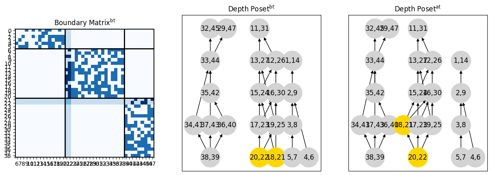

### Birth Death Pairs
|                          |                                                                                                                                                                                                                         |
|:-------------------------|:------------------------------------------------------------------------------------------------------------------------------------------------------------------------------------------------------------------------|
| Before the transposition | $\{(13, 27), (15, 24), (35, 42), (4, 6), (5, 7), (29, 47), (36, 40), (33, 44), (32, 45), (20, 22), (17, 23), (1, 14), (11, 31), (18, 21), (16, 30), (3, 8), (38, 39), (12, 26), (2, 9), (19, 25), (34, 41), (37, 43)\}$ |
| After the transposition  | $\{(13, 27), (15, 24), (35, 42), (4, 6), (5, 7), (29, 47), (36, 40), (33, 44), (32, 45), (20, 22), (17, 23), (1, 14), (11, 31), (18, 21), (16, 30), (3, 8), (38, 39), (12, 26), (2, 9), (19, 25), (34, 41), (37, 43)\}$ |

### Relations
|                          | Algorithm 1                                                                                                                                                                                                                                                                                                                                                                                                          | Algorithm 2                                                                                                                                                                                                                                                                                                                                                                                                                                                              |
|:-------------------------|:---------------------------------------------------------------------------------------------------------------------------------------------------------------------------------------------------------------------------------------------------------------------------------------------------------------------------------------------------------------------------------------------------------------------|:-------------------------------------------------------------------------------------------------------------------------------------------------------------------------------------------------------------------------------------------------------------------------------------------------------------------------------------------------------------------------------------------------------------------------------------------------------------------------|
| Before the transposition | $\{(42, 45), (41, 46), (44, 45), (21, 28), (22, 23), (23, 28), (40, 44), (39, 42), (22, 26), (8, 9), (40, 47), (39, 45), (9, 14), (27, 28), (25, 26), (45, 46), (25, 28), (24, 26), (6, 14), (42, 47), (44, 47), (43, 45), (21, 30), (39, 41), (21, 27), (23, 24), (23, 30), (22, 31), (7, 9), (24, 28), (41, 44), (43, 44), (25, 30), (26, 31), (44, 46), (22, 24), (39, 46), (40, 45), (39, 43), (6, 9), (7, 8)\}$ | $\{(20, 11), (35, 33), (12, 10), (20, 17), (38, 29), (38, 35), (38, 32), (34, 28), (19, 12), (1, 0), (37, 33), (13, 11), (15, 11), (16, 10), (18, 16), (35, 32), (20, 13), (33, 32), (20, 10), (20, 16), (38, 28), (20, 19), (38, 34), (5, 3), (19, 11), (11, 10), (36, 33), (15, 13), (15, 10), (33, 28), (18, 12), (18, 15), (3, 2), (12, 11), (38, 33), (38, 36), (2, 0), (19, 16), (36, 32), (37, 28), (19, 13), (36, 29), (36, 35), (32, 28)\}$                     |
| After the transposition  | $\{(42, 45), (41, 46), (44, 45), (21, 28), (22, 23), (23, 28), (40, 44), (39, 42), (8, 9), (9, 14), (40, 47), (39, 45), (22, 26), (27, 28), (45, 46), (25, 28), (24, 26), (6, 14), (42, 47), (44, 47), (43, 45), (21, 30), (39, 41), (23, 24), (23, 30), (21, 27), (22, 31), (7, 9), (24, 28), (41, 44), (43, 44), (25, 30), (26, 31), (44, 46), (22, 24), (39, 46), (40, 45), (39, 43), (7, 8), (6, 9), (25, 26)\}$ | $\{(20, 11), (35, 33), (12, 10), (20, 17), (38, 29), (38, 35), (38, 32), (34, 28), (19, 12), (1, 0), (37, 33), (13, 11), (15, 11), (16, 10), (18, 16), (35, 32), (20, 13), (33, 32), (20, 10), (38, 28), (20, 19), (38, 34), (5, 3), (19, 11), (11, 10), (36, 33), (15, 13), (15, 10), (33, 28), (18, 12), (18, 15), (20, 12), (3, 2), (20, 18), (12, 11), (20, 15), (38, 33), (38, 36), (2, 0), (19, 16), (36, 32), (37, 28), (19, 13), (36, 29), (36, 35), (32, 28)\}$ |

### Successors and Predecessers
No such node in the Depth Poset

### Temp Sets
|                                                               | Before the Transposition                                                                                 | After the Transposition                                                                                  |
|:--------------------------------------------------------------|:---------------------------------------------------------------------------------------------------------|:---------------------------------------------------------------------------------------------------------|
| $\mathcal{B} = \{(s, t)\in \text{BD}:\; f(s) > f(x)\}$        | $\{(36, 40), (38, 39), (35, 42), (33, 44), (19, 25), (32, 45), (34, 41), (29, 47), (20, 22), (37, 43)\}$ | $\{(36, 40), (38, 39), (35, 42), (33, 44), (19, 25), (32, 45), (34, 41), (29, 47), (20, 22), (37, 43)\}$ |
| $\mathcal{N} = \{(s, t)\in \text{BD}:\; f(x) > f(s) > f(a)\}$ | $\emptyset$                                                                                              | $\emptyset$                                                                                              |

### Equations
There are 2 equations are wrong.

| eq   | left (formula)                  | left (paramatrized)               | left (value)                       | right (formula)                                                                        | right (paramatrized)                                                                         | right (value)                                                              | correct   |
|:-----|:--------------------------------|:----------------------------------|:-----------------------------------|:---------------------------------------------------------------------------------------|:---------------------------------------------------------------------------------------------|:---------------------------------------------------------------------------|:----------|
| Eq36 | $\text{Succ}_2^\text{at}(x, y)$ | $\text{Succ}_2^\text{at}(18, 21)$ | $\{(16, 30), (15, 24), (12, 26)\}$ | $\text{Succ}_2^\text{bt}(x, y) \oplus \{(a, b)\} \oplus \text{Succ}_2^\text{bt}(a, b)$ | $\text{Succ}_2^\text{bt}(18, 21) \oplus \{(20, 22)\} \oplus \text{Succ}_2^\text{bt}(20, 22)$ | $\{(17, 23), (13, 27), (15, 24), (12, 26), (19, 25), (11, 31), (20, 22)\}$ | ✘         |
| Eq37 | $\text{Pred}_2^\text{at}(a, b)$ | $\text{Pred}_2^\text{at}(20, 22)$ | $\emptyset$                        | $\text{Pred}_2^\text{bt}(a, b) \oplus \{(x, y)\}$                                      | $\text{Pred}_2^\text{bt}(20, 22) \oplus \{(18, 21)\}$                                        | $\{(18, 21)\}$                                                             | ✘         |

## Transposition <26, 27> in complex 14
Here is a __death-death__ __no switch__ transposition <26, 27>.

$$
a = 13, \; b = 27, \; x = 12, \; y = 26
$$

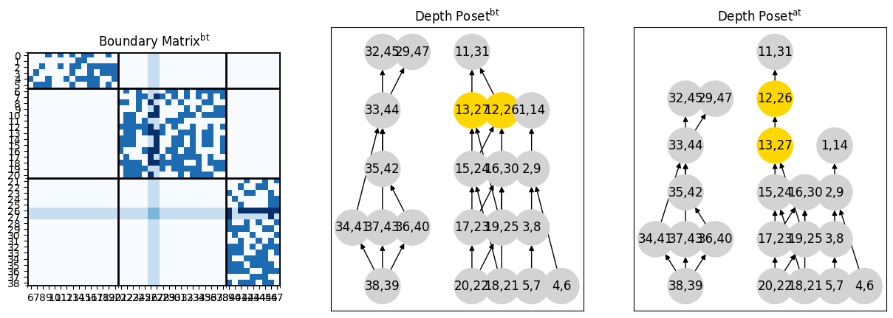

### Birth Death Pairs
|                          |                                                                                                                                                                                                                         |
|:-------------------------|:------------------------------------------------------------------------------------------------------------------------------------------------------------------------------------------------------------------------|
| Before the transposition | $\{(13, 27), (15, 24), (35, 42), (4, 6), (5, 7), (29, 47), (36, 40), (33, 44), (32, 45), (20, 22), (17, 23), (1, 14), (11, 31), (18, 21), (16, 30), (3, 8), (38, 39), (12, 26), (2, 9), (19, 25), (34, 41), (37, 43)\}$ |
| After the transposition  | $\{(13, 27), (15, 24), (35, 42), (4, 6), (5, 7), (29, 47), (36, 40), (33, 44), (32, 45), (20, 22), (17, 23), (1, 14), (11, 31), (18, 21), (16, 30), (3, 8), (38, 39), (12, 26), (2, 9), (19, 25), (34, 41), (37, 43)\}$ |

### Relations
|                          | Algorithm 1                                                                                                                                                                                                                                                                                                                                                                                                          | Algorithm 2                                                                                                                                                                                                                                                                                                                                                                                                                                                    |
|:-------------------------|:---------------------------------------------------------------------------------------------------------------------------------------------------------------------------------------------------------------------------------------------------------------------------------------------------------------------------------------------------------------------------------------------------------------------|:---------------------------------------------------------------------------------------------------------------------------------------------------------------------------------------------------------------------------------------------------------------------------------------------------------------------------------------------------------------------------------------------------------------------------------------------------------------|
| Before the transposition | $\{(42, 45), (41, 46), (44, 45), (21, 28), (22, 23), (23, 28), (40, 44), (39, 42), (22, 26), (8, 9), (40, 47), (39, 45), (9, 14), (27, 28), (25, 26), (45, 46), (25, 28), (24, 26), (6, 14), (42, 47), (44, 47), (43, 45), (21, 30), (39, 41), (21, 27), (23, 24), (23, 30), (22, 31), (7, 9), (24, 28), (41, 44), (43, 44), (25, 30), (26, 31), (44, 46), (22, 24), (39, 46), (40, 45), (39, 43), (6, 9), (7, 8)\}$ | $\{(20, 11), (35, 33), (12, 10), (20, 17), (38, 29), (38, 35), (38, 32), (34, 28), (19, 12), (1, 0), (37, 33), (13, 11), (15, 11), (16, 10), (18, 16), (35, 32), (20, 13), (33, 32), (20, 10), (20, 16), (38, 28), (20, 19), (38, 34), (5, 3), (19, 11), (11, 10), (36, 33), (15, 13), (15, 10), (33, 28), (18, 12), (18, 15), (3, 2), (12, 11), (38, 33), (38, 36), (2, 0), (19, 16), (36, 32), (37, 28), (19, 13), (36, 29), (36, 35), (32, 28)\}$           |
| After the transposition  | $\{(42, 45), (41, 46), (44, 45), (21, 28), (22, 23), (23, 28), (40, 44), (39, 42), (8, 9), (9, 14), (40, 47), (39, 45), (22, 26), (27, 28), (45, 46), (25, 28), (24, 26), (6, 14), (42, 47), (44, 47), (43, 45), (21, 30), (39, 41), (23, 24), (23, 30), (21, 27), (22, 31), (7, 9), (24, 28), (41, 44), (43, 44), (25, 30), (26, 31), (44, 46), (22, 24), (39, 46), (40, 45), (39, 43), (7, 8), (6, 9), (25, 26)\}$ | $\{(20, 11), (35, 33), (12, 10), (20, 17), (38, 29), (38, 35), (38, 32), (34, 28), (19, 12), (1, 0), (37, 33), (15, 11), (16, 10), (18, 16), (35, 32), (20, 13), (33, 32), (20, 10), (20, 16), (38, 28), (20, 19), (38, 34), (5, 3), (19, 11), (11, 10), (36, 33), (13, 10), (15, 13), (15, 10), (33, 28), (18, 12), (18, 15), (3, 2), (12, 11), (38, 33), (38, 36), (2, 0), (19, 16), (36, 32), (37, 28), (19, 13), (36, 29), (36, 35), (13, 12), (32, 28)\}$ |

### Successors and Predecessers
No such node in the Depth Poset

### Temp Sets
|                                                               | Before the Transposition                                                                                                                                   | After the Transposition                                                                                                                                    |
|:--------------------------------------------------------------|:-----------------------------------------------------------------------------------------------------------------------------------------------------------|:-----------------------------------------------------------------------------------------------------------------------------------------------------------|
| $\mathcal{B} = \{(s, t)\in \text{BD}:\; f(s) > f(x)\}$        | $\{(36, 40), (17, 23), (13, 27), (15, 24), (38, 39), (35, 42), (33, 44), (19, 25), (32, 45), (34, 41), (16, 30), (29, 47), (20, 22), (18, 21), (37, 43)\}$ | $\{(36, 40), (17, 23), (13, 27), (15, 24), (38, 39), (35, 42), (33, 44), (19, 25), (32, 45), (34, 41), (16, 30), (29, 47), (20, 22), (18, 21), (37, 43)\}$ |
| $\mathcal{N} = \{(s, t)\in \text{BD}:\; f(x) > f(s) > f(a)\}$ | $\emptyset$                                                                                                                                                | $\emptyset$                                                                                                                                                |

### Equations
There are 2 equations are wrong.

| eq   | left (formula)                  | left (paramatrized)               | left (value)                       | right (formula)                                                                        | right (paramatrized)                                                                         | right (value)                                | correct   |
|:-----|:--------------------------------|:----------------------------------|:-----------------------------------|:---------------------------------------------------------------------------------------|:---------------------------------------------------------------------------------------------|:---------------------------------------------|:----------|
| Eq36 | $\text{Succ}_2^\text{at}(x, y)$ | $\text{Succ}_2^\text{at}(12, 26)$ | $\{(11, 31)\}$                     | $\text{Succ}_2^\text{bt}(x, y) \oplus \{(a, b)\} \oplus \text{Succ}_2^\text{bt}(a, b)$ | $\text{Succ}_2^\text{bt}(12, 26) \oplus \{(13, 27)\} \oplus \text{Succ}_2^\text{bt}(13, 27)$ | $\{(13, 27)\}$                               | ✘         |
| Eq37 | $\text{Pred}_2^\text{at}(a, b)$ | $\text{Pred}_2^\text{at}(13, 27)$ | $\{(20, 22), (19, 25), (15, 24)\}$ | $\text{Pred}_2^\text{bt}(a, b) \oplus \{(x, y)\}$                                      | $\text{Pred}_2^\text{bt}(13, 27) \oplus \{(12, 26)\}$                                        | $\{(20, 22), (19, 25), (15, 24), (12, 26)\}$ | ✘         |

## Transposition <35, 36> in complex 14
Here is a __birth-birth__ __switch forward__ transposition <35, 36>.

$$
a = 35, \; b = 42, \; x = 36, \; y = 40
$$

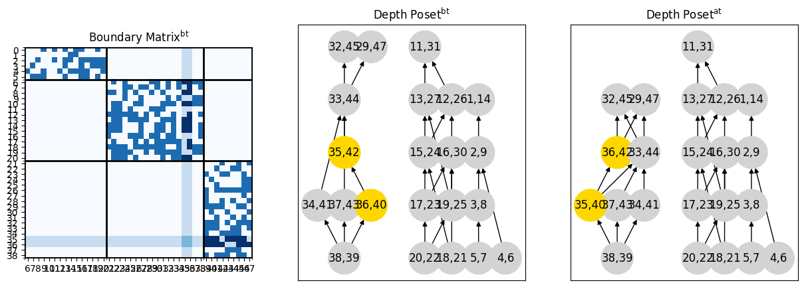

### Birth Death Pairs
|                          |                                                                                                                                                                                                                         |
|:-------------------------|:------------------------------------------------------------------------------------------------------------------------------------------------------------------------------------------------------------------------|
| Before the transposition | $\{(13, 27), (15, 24), (35, 42), (4, 6), (5, 7), (29, 47), (36, 40), (33, 44), (32, 45), (20, 22), (17, 23), (1, 14), (11, 31), (18, 21), (16, 30), (3, 8), (38, 39), (12, 26), (2, 9), (19, 25), (34, 41), (37, 43)\}$ |
| After the transposition  | $\{(13, 27), (15, 24), (4, 6), (5, 7), (29, 47), (33, 44), (32, 45), (20, 22), (17, 23), (36, 42), (1, 14), (11, 31), (18, 21), (16, 30), (35, 40), (3, 8), (38, 39), (12, 26), (2, 9), (19, 25), (34, 41), (37, 43)\}$ |

### Relations
|                          | Algorithm 1                                                                                                                                                                                                                                                                                                                                                                                                          | Algorithm 2                                                                                                                                                                                                                                                                                                                                                                                                                                          |
|:-------------------------|:---------------------------------------------------------------------------------------------------------------------------------------------------------------------------------------------------------------------------------------------------------------------------------------------------------------------------------------------------------------------------------------------------------------------|:-----------------------------------------------------------------------------------------------------------------------------------------------------------------------------------------------------------------------------------------------------------------------------------------------------------------------------------------------------------------------------------------------------------------------------------------------------|
| Before the transposition | $\{(42, 45), (41, 46), (44, 45), (21, 28), (22, 23), (23, 28), (40, 44), (39, 42), (22, 26), (8, 9), (40, 47), (39, 45), (9, 14), (27, 28), (25, 26), (45, 46), (25, 28), (24, 26), (6, 14), (42, 47), (44, 47), (43, 45), (21, 30), (39, 41), (21, 27), (23, 24), (23, 30), (22, 31), (7, 9), (24, 28), (41, 44), (43, 44), (25, 30), (26, 31), (44, 46), (22, 24), (39, 46), (40, 45), (39, 43), (6, 9), (7, 8)\}$ | $\{(20, 11), (35, 33), (12, 10), (20, 17), (38, 29), (38, 35), (38, 32), (34, 28), (19, 12), (1, 0), (37, 33), (13, 11), (15, 11), (16, 10), (18, 16), (35, 32), (20, 13), (33, 32), (20, 10), (20, 16), (38, 28), (20, 19), (38, 34), (5, 3), (19, 11), (11, 10), (36, 33), (15, 13), (15, 10), (33, 28), (18, 12), (18, 15), (3, 2), (12, 11), (38, 33), (38, 36), (2, 0), (19, 16), (36, 32), (37, 28), (19, 13), (36, 29), (36, 35), (32, 28)\}$ |
| After the transposition  | $\{(42, 45), (41, 46), (44, 45), (21, 28), (22, 23), (23, 28), (40, 44), (39, 42), (22, 26), (8, 9), (9, 14), (39, 45), (27, 28), (45, 46), (25, 28), (24, 26), (6, 14), (42, 47), (44, 47), (43, 45), (21, 30), (39, 41), (21, 27), (23, 24), (23, 30), (22, 31), (7, 9), (24, 28), (41, 44), (43, 44), (25, 30), (26, 31), (44, 46), (40, 42), (22, 24), (39, 46), (39, 43), (7, 8), (6, 9), (25, 26)\}$           | $\{(20, 11), (35, 33), (12, 10), (20, 17), (38, 29), (38, 35), (38, 32), (35, 36), (34, 28), (19, 12), (1, 0), (37, 33), (13, 11), (15, 11), (16, 10), (18, 16), (35, 32), (20, 13), (33, 32), (35, 29), (20, 10), (20, 16), (38, 28), (20, 19), (38, 34), (5, 3), (19, 11), (11, 10), (15, 13), (15, 10), (33, 28), (18, 12), (18, 15), (3, 2), (12, 11), (38, 33), (38, 36), (2, 0), (19, 16), (37, 28), (19, 13), (36, 29), (32, 28)\}$           |

### Successors and Predecessers
|                 | $\text{Set}^\text{bt}(35, 42)$                             | $\text{Set}^\text{bt}(36, 40)$                                                 | $\text{Set}^\text{at}(35, 40)$                                                 | $\text{Set}^\text{at}(36, 42)$                             |
|:----------------|:-----------------------------------------------------------|:-------------------------------------------------------------------------------|:-------------------------------------------------------------------------------|:-----------------------------------------------------------|
| $\text{Succ}_1$ | $\text{Succ}_1^\text{bt}(35, 42) = \{(32, 45), (29, 47)\}$ | $\text{Succ}_1^\text{bt}(36, 40) = \{(33, 44), (32, 45), (29, 47)\}$           | $\text{Succ}_1^\text{at}(35, 40) = \{(36, 42), (33, 44)\}$                     | $\text{Succ}_1^\text{at}(36, 42) = \{(32, 45), (29, 47)\}$ |
| $\text{Pred}_1$ | $\text{Pred}_1^\text{bt}(35, 42) = \{(38, 39)\}$           | $\text{Pred}_1^\text{bt}(36, 40) = \emptyset$                                  | $\text{Pred}_1^\text{at}(35, 40) = \emptyset$                                  | $\text{Pred}_1^\text{at}(36, 42) = \{(38, 39), (35, 40)\}$ |
| $\text{Succ}_2$ | $\text{Succ}_2^\text{bt}(35, 42) = \{(32, 45), (33, 44)\}$ | $\text{Succ}_2^\text{bt}(36, 40) = \{(35, 42), (32, 45), (33, 44), (29, 47)\}$ | $\text{Succ}_2^\text{at}(35, 40) = \{(33, 44), (36, 42), (32, 45), (29, 47)\}$ | $\text{Succ}_2^\text{at}(36, 42) = \{(29, 47)\}$           |
| $\text{Pred}_2$ | $\text{Pred}_2^\text{bt}(35, 42) = \{(36, 40), (38, 39)\}$ | $\text{Pred}_2^\text{bt}(36, 40) = \{(38, 39)\}$                               | $\text{Pred}_2^\text{at}(35, 40) = \{(38, 39)\}$                               | $\text{Pred}_2^\text{at}(36, 42) = \{(38, 39), (35, 40)\}$ |

### Temp Sets
|                                                               | Before the Transposition                                                                                                                          | After the Transposition                                                                                                                           |
|:--------------------------------------------------------------|:--------------------------------------------------------------------------------------------------------------------------------------------------|:--------------------------------------------------------------------------------------------------------------------------------------------------|
| $\mathcal{L} = \{(s, t)\in \text{BD}:\; f(t) < f(y)\}$        | $\{(18, 21), (17, 23), (13, 27), (15, 24), (3, 8), (38, 39), (12, 26), (4, 6), (1, 14), (5, 7), (2, 9), (19, 25), (11, 31), (20, 22), (16, 30)\}$ | $\{(18, 21), (17, 23), (13, 27), (15, 24), (3, 8), (38, 39), (12, 26), (4, 6), (1, 14), (5, 7), (2, 9), (19, 25), (11, 31), (20, 22), (16, 30)\}$ |
| $\mathcal{M} = \{(s, t)\in \text{BD}:\; f(y) < f(t) < f(b)\}$ | $\{(34, 41)\}$                                                                                                                                    | $\{(34, 41)\}$                                                                                                                                    |

### Equations
There are 1 equations are wrong.

| eq   | left (formula)                  | left (paramatrized)               | left (value)                                 | right (formula)                                                                                           | right (paramatrized)                                                                                            | right (value)                                | correct   |
|:-----|:--------------------------------|:----------------------------------|:---------------------------------------------|:----------------------------------------------------------------------------------------------------------|:----------------------------------------------------------------------------------------------------------------|:---------------------------------------------|:----------|
| Eq08 | $\text{Succ}_1^\text{at}(a, y)$ | $\text{Succ}_1^\text{at}(35, 40)$ | $\{(36, 42), (33, 44)\}$                     | $\text{Succ}_1^\text{bt}(x, y) \oplus \{(x, b)\} \oplus \text{Succ}_1^\text{bt}(a, b)$                    | $\text{Succ}_1^\text{bt}(36, 40) \oplus \{(36, 42)\} \oplus \text{Succ}_1^\text{bt}(35, 42)$                    | $\{(36, 42), (33, 44)\}$                     | ✔         |
| Eq09 | $\text{Succ}_1^\text{at}(x, b)$ | $\text{Succ}_1^\text{at}(36, 42)$ | $\{(32, 45), (29, 47)\}$                     | $\text{Succ}_1^\text{bt}(a, b)$                                                                           | $\text{Succ}_1^\text{bt}(35, 42)$                                                                               | $\{(32, 45), (29, 47)\}$                     | ✔         |
| Eq10 | $\text{Pred}_1^\text{at}(a, y)$ | $\text{Pred}_1^\text{at}(35, 40)$ | $\emptyset$                                  | $\text{Pred}_1^\text{bt}(x, y)$                                                                           | $\text{Pred}_1^\text{bt}(36, 40)$                                                                               | $\emptyset$                                  | ✔         |
| Eq11 | $\text{Pred}_1^\text{at}(x, b)$ | $\text{Pred}_1^\text{at}(36, 42)$ | $\{(38, 39), (35, 40)\}$                     | $\text{Pred}_1^\text{bt}(a, b) \oplus \{(a, y)\}$                                                         | $\text{Pred}_1^\text{bt}(35, 42) \oplus \{(35, 40)\}$                                                           | $\{(35, 40), (38, 39)\}$                     | ✔         |
| Eq12 | $\text{Succ}_2^\text{at}(a, y)$ | $\text{Succ}_2^\text{at}(35, 40)$ | $\{(33, 44), (36, 42), (32, 45), (29, 47)\}$ | $\text{Succ}_2^\text{bt}(x, y) \oplus \{(x, b), (a, b)\}$                                                 | $\text{Succ}_2^\text{bt}(36, 40) \oplus \{(36, 42), (35, 42)\}$                                                 | $\{(29, 47), (36, 42), (32, 45), (33, 44)\}$ | ✔         |
| Eq13 | $\text{Succ}_2^\text{at}(x, b)$ | $\text{Succ}_2^\text{at}(36, 42)$ | $\{(29, 47)\}$                               | $\text{Succ}_2^\text{bt}(a, b)$                                                                           | $\text{Succ}_2^\text{bt}(35, 42)$                                                                               | $\{(32, 45), (33, 44)\}$                     | ✘         |
| Eq14 | $\text{Pred}_2^\text{at}(a, y)$ | $\text{Pred}_2^\text{at}(35, 40)$ | $\{(38, 39)\}$                               | $[\text{Pred}_2^\text{bt}(a, b) \cap \mathcal{L}]$                                                        | $[\text{Pred}_2^\text{bt}(35, 42) \cap \mathcal{L}]$                                                            | $\{(38, 39)\}$                               | ✔         |
| Eq15 | $\text{Pred}_2^\text{at}(x, b)$ | $\text{Pred}_2^\text{at}(36, 42)$ | $\{(38, 39), (35, 40)\}$                     | $\text{Pred}_2^\text{bt}(x, y) \oplus \{(a, y)\} \oplus [\text{Pred}_2^\text{bt}(a, b) \cap \mathcal{M}]$ | $\text{Pred}_2^\text{bt}(36, 40) \oplus \{(35, 40)\} \oplus [\text{Pred}_2^\text{bt}(35, 42) \cap \mathcal{M}]$ | $\{(38, 39), (35, 40)\}$                     | ✔         |

## Transposition <36, 37> in complex 14
Here is a __birth-birth__ __no switch__ transposition <36, 37>.

$$
a = 36, \; b = 40, \; x = 37, \; y = 43
$$

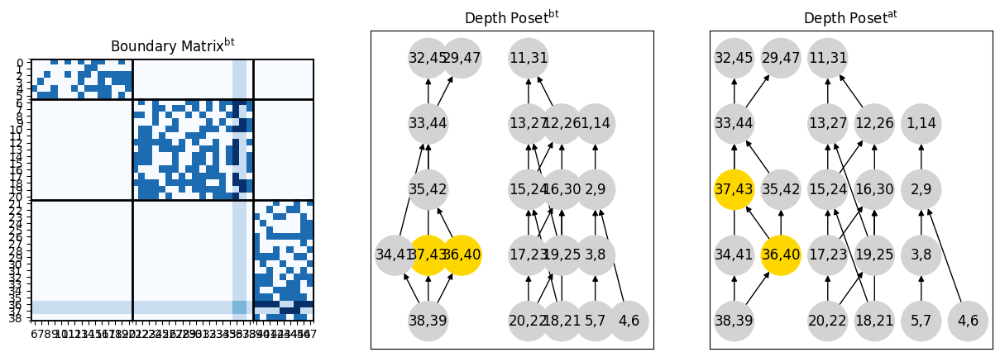

### Birth Death Pairs
|                          |                                                                                                                                                                                                                         |
|:-------------------------|:------------------------------------------------------------------------------------------------------------------------------------------------------------------------------------------------------------------------|
| Before the transposition | $\{(13, 27), (15, 24), (35, 42), (4, 6), (5, 7), (29, 47), (36, 40), (33, 44), (32, 45), (20, 22), (17, 23), (1, 14), (11, 31), (18, 21), (16, 30), (3, 8), (38, 39), (12, 26), (2, 9), (19, 25), (34, 41), (37, 43)\}$ |
| After the transposition  | $\{(13, 27), (15, 24), (35, 42), (4, 6), (5, 7), (29, 47), (36, 40), (33, 44), (32, 45), (20, 22), (17, 23), (1, 14), (11, 31), (18, 21), (16, 30), (3, 8), (38, 39), (12, 26), (2, 9), (19, 25), (34, 41), (37, 43)\}$ |

### Relations
|                          | Algorithm 1                                                                                                                                                                                                                                                                                                                                                                                                          | Algorithm 2                                                                                                                                                                                                                                                                                                                                                                                                                                          |
|:-------------------------|:---------------------------------------------------------------------------------------------------------------------------------------------------------------------------------------------------------------------------------------------------------------------------------------------------------------------------------------------------------------------------------------------------------------------|:-----------------------------------------------------------------------------------------------------------------------------------------------------------------------------------------------------------------------------------------------------------------------------------------------------------------------------------------------------------------------------------------------------------------------------------------------------|
| Before the transposition | $\{(42, 45), (41, 46), (44, 45), (21, 28), (22, 23), (23, 28), (40, 44), (39, 42), (22, 26), (8, 9), (40, 47), (39, 45), (9, 14), (27, 28), (25, 26), (45, 46), (25, 28), (24, 26), (6, 14), (42, 47), (44, 47), (43, 45), (21, 30), (39, 41), (21, 27), (23, 24), (23, 30), (22, 31), (7, 9), (24, 28), (41, 44), (43, 44), (25, 30), (26, 31), (44, 46), (22, 24), (39, 46), (40, 45), (39, 43), (6, 9), (7, 8)\}$ | $\{(20, 11), (35, 33), (12, 10), (20, 17), (38, 29), (38, 35), (38, 32), (34, 28), (19, 12), (1, 0), (37, 33), (13, 11), (15, 11), (16, 10), (18, 16), (35, 32), (20, 13), (33, 32), (20, 10), (20, 16), (38, 28), (20, 19), (38, 34), (5, 3), (19, 11), (11, 10), (36, 33), (15, 13), (15, 10), (33, 28), (18, 12), (18, 15), (3, 2), (12, 11), (38, 33), (38, 36), (2, 0), (19, 16), (36, 32), (37, 28), (19, 13), (36, 29), (36, 35), (32, 28)\}$ |
| After the transposition  | $\{(42, 45), (41, 46), (44, 45), (21, 28), (22, 23), (23, 28), (22, 26), (39, 42), (8, 9), (9, 14), (40, 47), (39, 45), (27, 28), (45, 46), (25, 28), (24, 26), (6, 14), (42, 47), (44, 47), (43, 45), (21, 30), (39, 41), (21, 27), (23, 24), (23, 30), (40, 43), (22, 31), (7, 9), (24, 28), (41, 44), (43, 44), (25, 30), (26, 31), (44, 46), (22, 24), (39, 46), (39, 43), (7, 8), (6, 9), (25, 26)\}$           | $\{(20, 11), (35, 33), (12, 10), (20, 17), (38, 29), (38, 35), (38, 32), (34, 28), (19, 12), (1, 0), (37, 33), (13, 11), (15, 11), (16, 10), (18, 16), (35, 32), (20, 13), (33, 32), (20, 10), (20, 16), (38, 28), (20, 19), (38, 34), (5, 3), (19, 11), (11, 10), (36, 33), (15, 13), (15, 10), (33, 28), (18, 12), (18, 15), (3, 2), (12, 11), (38, 33), (38, 36), (37, 28), (2, 0), (36, 32), (19, 16), (19, 13), (36, 29), (36, 35), (32, 28)\}$ |

### Successors and Predecessers
No such node in the Depth Poset

### Temp Sets
|                                                               | Before the Transposition                                                                                                                                                        | After the Transposition                                                                                                                                                         |
|:--------------------------------------------------------------|:--------------------------------------------------------------------------------------------------------------------------------------------------------------------------------|:--------------------------------------------------------------------------------------------------------------------------------------------------------------------------------|
| $\mathcal{L} = \{(s, t)\in \text{BD}:\; f(t) < f(y)\}$        | $\{(18, 21), (36, 40), (17, 23), (13, 27), (15, 24), (3, 8), (38, 39), (12, 26), (35, 42), (4, 6), (1, 14), (5, 7), (2, 9), (19, 25), (11, 31), (34, 41), (20, 22), (16, 30)\}$ | $\{(18, 21), (36, 40), (17, 23), (13, 27), (15, 24), (3, 8), (38, 39), (12, 26), (35, 42), (4, 6), (1, 14), (5, 7), (2, 9), (19, 25), (11, 31), (34, 41), (20, 22), (16, 30)\}$ |
| $\mathcal{M} = \{(s, t)\in \text{BD}:\; f(y) < f(t) < f(b)\}$ | $\emptyset$                                                                                                                                                                     | $\emptyset$                                                                                                                                                                     |

### Equations
There are 2 equations are wrong.

| eq   | left (formula)                  | left (paramatrized)               | left (value)             | right (formula)                                                                        | right (paramatrized)                                                                         | right (value)            | correct   |
|:-----|:--------------------------------|:----------------------------------|:-------------------------|:---------------------------------------------------------------------------------------|:---------------------------------------------------------------------------------------------|:-------------------------|:----------|
| Eq16 | $\text{Succ}_1^\text{at}(x, y)$ | $\text{Succ}_1^\text{at}(37, 43)$ | $\{(32, 45), (33, 44)\}$ | $\text{Succ}_1^\text{bt}(x, y) \oplus \{(a, b)\} \oplus \text{Succ}_1^\text{bt}(a, b)$ | $\text{Succ}_1^\text{bt}(37, 43) \oplus \{(36, 40)\} \oplus \text{Succ}_1^\text{bt}(36, 40)$ | $\{(36, 40), (29, 47)\}$ | ✘         |
| Eq17 | $\text{Pred}_1^\text{at}(a, b)$ | $\text{Pred}_1^\text{at}(36, 40)$ | $\emptyset$              | $\text{Pred}_1^\text{bt}(a, b) \oplus \{(x, y)\}$                                      | $\text{Pred}_1^\text{bt}(36, 40) \oplus \{(37, 43)\}$                                        | $\{(37, 43)\}$           | ✘         |

## Transposition <42, 43> in complex 14
Here is a __death-death__ __no switch__ transposition <42, 43>.

$$
a = 37, \; b = 43, \; x = 35, \; y = 42
$$

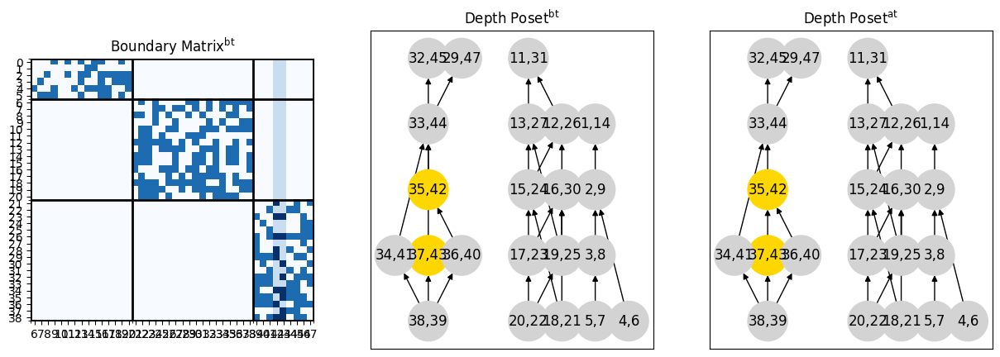

### Birth Death Pairs
|                          |                                                                                                                                                                                                                         |
|:-------------------------|:------------------------------------------------------------------------------------------------------------------------------------------------------------------------------------------------------------------------|
| Before the transposition | $\{(13, 27), (15, 24), (35, 42), (4, 6), (5, 7), (29, 47), (36, 40), (33, 44), (32, 45), (20, 22), (17, 23), (1, 14), (11, 31), (18, 21), (16, 30), (3, 8), (38, 39), (12, 26), (2, 9), (19, 25), (34, 41), (37, 43)\}$ |
| After the transposition  | $\{(13, 27), (15, 24), (35, 42), (4, 6), (5, 7), (29, 47), (36, 40), (33, 44), (32, 45), (20, 22), (17, 23), (1, 14), (11, 31), (18, 21), (16, 30), (3, 8), (38, 39), (12, 26), (2, 9), (19, 25), (34, 41), (37, 43)\}$ |

### Relations
|                          | Algorithm 1                                                                                                                                                                                                                                                                                                                                                                                                          | Algorithm 2                                                                                                                                                                                                                                                                                                                                                                                                                                                    |
|:-------------------------|:---------------------------------------------------------------------------------------------------------------------------------------------------------------------------------------------------------------------------------------------------------------------------------------------------------------------------------------------------------------------------------------------------------------------|:---------------------------------------------------------------------------------------------------------------------------------------------------------------------------------------------------------------------------------------------------------------------------------------------------------------------------------------------------------------------------------------------------------------------------------------------------------------|
| Before the transposition | $\{(42, 45), (41, 46), (44, 45), (21, 28), (22, 23), (23, 28), (40, 44), (39, 42), (22, 26), (8, 9), (40, 47), (39, 45), (9, 14), (27, 28), (25, 26), (45, 46), (25, 28), (24, 26), (6, 14), (42, 47), (44, 47), (43, 45), (21, 30), (39, 41), (21, 27), (23, 24), (23, 30), (22, 31), (7, 9), (24, 28), (41, 44), (43, 44), (25, 30), (26, 31), (44, 46), (22, 24), (39, 46), (40, 45), (39, 43), (6, 9), (7, 8)\}$ | $\{(20, 11), (35, 33), (12, 10), (20, 17), (38, 29), (38, 35), (38, 32), (34, 28), (19, 12), (1, 0), (37, 33), (13, 11), (15, 11), (16, 10), (18, 16), (35, 32), (20, 13), (33, 32), (20, 10), (20, 16), (38, 28), (20, 19), (38, 34), (5, 3), (19, 11), (11, 10), (36, 33), (15, 13), (15, 10), (33, 28), (18, 12), (18, 15), (3, 2), (12, 11), (38, 33), (38, 36), (2, 0), (19, 16), (36, 32), (37, 28), (19, 13), (36, 29), (36, 35), (32, 28)\}$           |
| After the transposition  | $\{(42, 45), (41, 46), (44, 45), (21, 28), (22, 23), (23, 28), (40, 44), (22, 26), (8, 9), (9, 14), (40, 47), (39, 45), (39, 42), (27, 28), (45, 46), (25, 28), (24, 26), (6, 14), (42, 47), (44, 47), (43, 45), (21, 30), (39, 41), (21, 27), (23, 24), (23, 30), (22, 31), (7, 9), (24, 28), (41, 44), (43, 44), (25, 30), (26, 31), (44, 46), (22, 24), (39, 46), (40, 45), (39, 43), (7, 8), (6, 9), (25, 26)\}$ | $\{(20, 11), (35, 33), (12, 10), (20, 17), (38, 29), (38, 35), (38, 32), (34, 28), (19, 12), (1, 0), (13, 11), (15, 11), (16, 10), (18, 16), (35, 32), (20, 13), (33, 32), (20, 10), (20, 16), (38, 28), (20, 19), (38, 34), (5, 3), (19, 11), (11, 10), (37, 35), (36, 33), (37, 32), (15, 13), (15, 10), (33, 28), (18, 12), (18, 15), (3, 2), (12, 11), (38, 33), (38, 36), (2, 0), (19, 16), (36, 32), (37, 28), (19, 13), (36, 29), (36, 35), (32, 28)\}$ |

### Successors and Predecessers
No such node in the Depth Poset

### Temp Sets
|                                                               | Before the Transposition           | After the Transposition            |
|:--------------------------------------------------------------|:-----------------------------------|:-----------------------------------|
| $\mathcal{B} = \{(s, t)\in \text{BD}:\; f(s) > f(x)\}$        | $\{(37, 43), (38, 39), (36, 40)\}$ | $\{(37, 43), (38, 39), (36, 40)\}$ |
| $\mathcal{N} = \{(s, t)\in \text{BD}:\; f(x) > f(s) > f(a)\}$ | $\emptyset$                        | $\emptyset$                        |

### Equations
There are 2 equations are wrong.

| eq   | left (formula)                  | left (paramatrized)               | left (value)             | right (formula)                                                                        | right (paramatrized)                                                                         | right (value)            | correct   |
|:-----|:--------------------------------|:----------------------------------|:-------------------------|:---------------------------------------------------------------------------------------|:---------------------------------------------------------------------------------------------|:-------------------------|:----------|
| Eq36 | $\text{Succ}_2^\text{at}(x, y)$ | $\text{Succ}_2^\text{at}(35, 42)$ | $\{(32, 45), (33, 44)\}$ | $\text{Succ}_2^\text{bt}(x, y) \oplus \{(a, b)\} \oplus \text{Succ}_2^\text{bt}(a, b)$ | $\text{Succ}_2^\text{bt}(35, 42) \oplus \{(37, 43)\} \oplus \text{Succ}_2^\text{bt}(37, 43)$ | $\{(37, 43), (32, 45)\}$ | ✘         |
| Eq37 | $\text{Pred}_2^\text{at}(a, b)$ | $\text{Pred}_2^\text{at}(37, 43)$ | $\emptyset$              | $\text{Pred}_2^\text{bt}(a, b) \oplus \{(x, y)\}$                                      | $\text{Pred}_2^\text{bt}(37, 43) \oplus \{(35, 42)\}$                                        | $\{(35, 42)\}$           | ✘         |

## Transposition <3, 4> in complex 15
Here is a __birth-birth__ __no switch__ transposition <3, 4>.

$$
a = 3, \; b = 7, \; x = 4, \; y = 10
$$

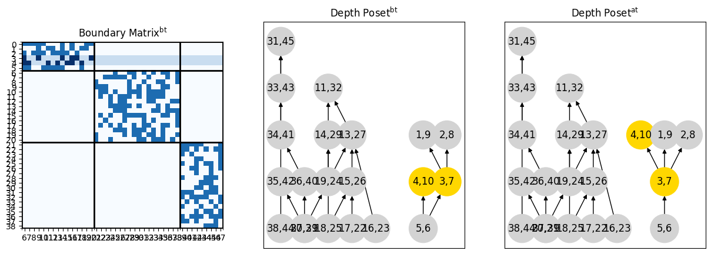

### Birth Death Pairs
|                          |                                                                                                                                                                                                               |
|:-------------------------|:--------------------------------------------------------------------------------------------------------------------------------------------------------------------------------------------------------------|
| Before the transposition | $\{(13, 27), (35, 42), (3, 7), (38, 44), (1, 9), (2, 8), (19, 24), (36, 40), (37, 39), (11, 32), (15, 26), (5, 6), (18, 25), (33, 43), (20, 21), (4, 10), (17, 22), (31, 45), (14, 29), (34, 41), (16, 23)\}$ |
| After the transposition  | $\{(13, 27), (35, 42), (3, 7), (38, 44), (1, 9), (2, 8), (19, 24), (36, 40), (37, 39), (11, 32), (15, 26), (5, 6), (18, 25), (33, 43), (20, 21), (4, 10), (17, 22), (31, 45), (14, 29), (34, 41), (16, 23)\}$ |

### Relations
|                          | Algorithm 1                                                                                                                                                                                                                                                                                                                                                                                                                                         | Algorithm 2                                                                                                                                                                                                                                                                                                                                                            |
|:-------------------------|:----------------------------------------------------------------------------------------------------------------------------------------------------------------------------------------------------------------------------------------------------------------------------------------------------------------------------------------------------------------------------------------------------------------------------------------------------|:-----------------------------------------------------------------------------------------------------------------------------------------------------------------------------------------------------------------------------------------------------------------------------------------------------------------------------------------------------------------------|
| Before the transposition | $\{(6, 12), (25, 29), (24, 27), (26, 30), (44, 45), (41, 46), (26, 27), (22, 26), (39, 42), (40, 41), (40, 47), (10, 12), (27, 28), (45, 46), (42, 47), (41, 45), (24, 29), (26, 32), (24, 32), (43, 45), (21, 24), (21, 30), (23, 27), (40, 43), (7, 9), (6, 7), (6, 10), (25, 27), (26, 28), (25, 30), (42, 46), (43, 47), (29, 30), (44, 46), (22, 27), (39, 40), (39, 46), (9, 12), (40, 45), (27, 32), (45, 47), (25, 26)\}$                   | $\{(35, 30), (4, 0), (5, 4), (34, 28), (17, 15), (34, 31), (36, 28), (19, 12), (1, 0), (13, 11), (37, 36), (36, 34), (18, 13), (38, 28), (38, 31), (5, 0), (20, 19), (5, 3), (17, 11), (14, 12), (31, 28), (34, 33), (36, 33), (33, 28), (3, 2), (38, 30), (14, 11), (5, 2), (15, 12), (2, 0), (37, 28), (19, 13), (37, 31), (37, 34), (13, 12), (33, 30), (18, 14)\}$ |
| After the transposition  | $\{(6, 12), (25, 29), (24, 27), (26, 30), (44, 45), (41, 46), (26, 27), (22, 26), (39, 42), (40, 41), (40, 47), (10, 12), (27, 28), (45, 46), (7, 10), (42, 47), (41, 45), (24, 29), (26, 32), (24, 32), (43, 45), (21, 24), (21, 30), (23, 27), (40, 43), (7, 9), (6, 7), (7, 12), (6, 10), (25, 27), (26, 28), (25, 30), (42, 46), (43, 47), (29, 30), (44, 46), (22, 27), (39, 40), (39, 46), (9, 12), (40, 45), (27, 32), (45, 47), (25, 26)\}$ | $\{(35, 30), (4, 0), (5, 4), (33, 30), (34, 28), (17, 15), (19, 12), (36, 28), (1, 0), (34, 31), (13, 11), (37, 36), (36, 34), (18, 13), (38, 28), (38, 31), (5, 0), (20, 19), (5, 3), (17, 11), (14, 12), (31, 28), (34, 33), (36, 33), (33, 28), (3, 2), (38, 30), (14, 11), (5, 2), (2, 0), (37, 28), (19, 13), (37, 31), (37, 34), (13, 12), (15, 12), (18, 14)\}$ |

### Successors and Predecessers
No such node in the Depth Poset

### Temp Sets
|                                                               | Before the Transposition             | After the Transposition              |
|:--------------------------------------------------------------|:-------------------------------------|:-------------------------------------|
| $\mathcal{L} = \{(s, t)\in \text{BD}:\; f(t) < f(y)\}$        | $\{(3, 7), (5, 6), (1, 9), (2, 8)\}$ | $\{(3, 7), (5, 6), (1, 9), (2, 8)\}$ |
| $\mathcal{M} = \{(s, t)\in \text{BD}:\; f(y) < f(t) < f(b)\}$ | $\emptyset$                          | $\emptyset$                          |

### Equations
There are 2 equations are wrong.

| eq   | left (formula)                  | left (paramatrized)              | left (value)   | right (formula)                                                                        | right (paramatrized)                                                                    | right (value)         | correct   |
|:-----|:--------------------------------|:---------------------------------|:---------------|:---------------------------------------------------------------------------------------|:----------------------------------------------------------------------------------------|:----------------------|:----------|
| Eq16 | $\text{Succ}_1^\text{at}(x, y)$ | $\text{Succ}_1^\text{at}(4, 10)$ | $\emptyset$    | $\text{Succ}_1^\text{bt}(x, y) \oplus \{(a, b)\} \oplus \text{Succ}_1^\text{bt}(a, b)$ | $\text{Succ}_1^\text{bt}(4, 10) \oplus \{(3, 7)\} \oplus \text{Succ}_1^\text{bt}(3, 7)$ | $\{(3, 7), (1, 9)\}$  | ✘         |
| Eq17 | $\text{Pred}_1^\text{at}(a, b)$ | $\text{Pred}_1^\text{at}(3, 7)$  | $\{(5, 6)\}$   | $\text{Pred}_1^\text{bt}(a, b) \oplus \{(x, y)\}$                                      | $\text{Pred}_1^\text{bt}(3, 7) \oplus \{(4, 10)\}$                                      | $\{(4, 10), (5, 6)\}$ | ✘         |

## Transposition <25, 26> in complex 15
Here is a __death-death__ __switch forward__ transposition <25, 26>.

$$
a = 15, \; b = 26, \; x = 18, \; y = 25
$$

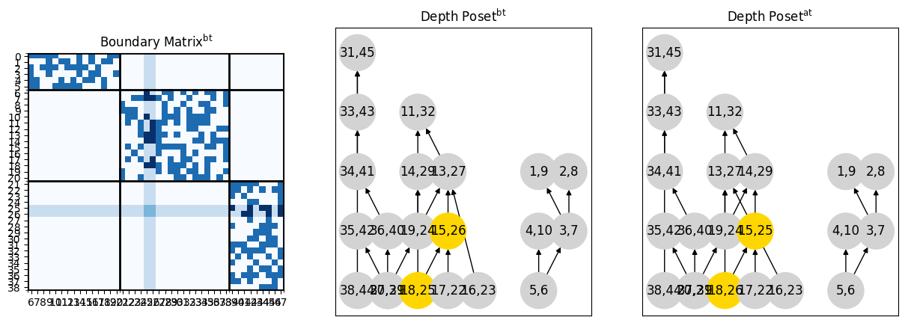

### Birth Death Pairs
|                          |                                                                                                                                                                                                               |
|:-------------------------|:--------------------------------------------------------------------------------------------------------------------------------------------------------------------------------------------------------------|
| Before the transposition | $\{(13, 27), (35, 42), (3, 7), (38, 44), (1, 9), (2, 8), (19, 24), (36, 40), (37, 39), (11, 32), (15, 26), (5, 6), (18, 25), (33, 43), (20, 21), (4, 10), (17, 22), (31, 45), (14, 29), (34, 41), (16, 23)\}$ |
| After the transposition  | $\{(13, 27), (18, 26), (35, 42), (3, 7), (38, 44), (1, 9), (2, 8), (19, 24), (36, 40), (37, 39), (11, 32), (5, 6), (15, 25), (33, 43), (20, 21), (4, 10), (17, 22), (31, 45), (14, 29), (34, 41), (16, 23)\}$ |

### Relations
|                          | Algorithm 1                                                                                                                                                                                                                                                                                                                                                                                                                       | Algorithm 2                                                                                                                                                                                                                                                                                                                                                                                |
|:-------------------------|:----------------------------------------------------------------------------------------------------------------------------------------------------------------------------------------------------------------------------------------------------------------------------------------------------------------------------------------------------------------------------------------------------------------------------------|:-------------------------------------------------------------------------------------------------------------------------------------------------------------------------------------------------------------------------------------------------------------------------------------------------------------------------------------------------------------------------------------------|
| Before the transposition | $\{(6, 12), (25, 29), (24, 27), (26, 30), (44, 45), (41, 46), (26, 27), (22, 26), (39, 42), (40, 41), (40, 47), (10, 12), (27, 28), (45, 46), (42, 47), (41, 45), (24, 29), (26, 32), (24, 32), (43, 45), (21, 24), (21, 30), (23, 27), (40, 43), (7, 9), (6, 7), (6, 10), (25, 27), (26, 28), (25, 30), (42, 46), (43, 47), (29, 30), (44, 46), (22, 27), (39, 40), (39, 46), (9, 12), (40, 45), (27, 32), (45, 47), (25, 26)\}$ | $\{(35, 30), (4, 0), (5, 4), (34, 28), (17, 15), (34, 31), (36, 28), (19, 12), (1, 0), (13, 11), (37, 36), (36, 34), (18, 13), (38, 28), (38, 31), (5, 0), (20, 19), (5, 3), (17, 11), (14, 12), (31, 28), (34, 33), (36, 33), (33, 28), (3, 2), (38, 30), (14, 11), (5, 2), (15, 12), (2, 0), (37, 28), (19, 13), (37, 31), (37, 34), (13, 12), (33, 30), (18, 14)\}$                     |
| After the transposition  | $\{(6, 12), (25, 29), (24, 27), (26, 30), (25, 32), (44, 45), (41, 46), (26, 27), (39, 42), (40, 41), (22, 29), (40, 47), (10, 12), (27, 28), (45, 46), (25, 28), (42, 47), (41, 45), (24, 29), (24, 32), (26, 29), (43, 45), (21, 24), (21, 30), (22, 25), (23, 27), (40, 43), (7, 9), (6, 7), (6, 10), (26, 25), (42, 46), (43, 47), (29, 30), (44, 46), (39, 40), (39, 46), (22, 30), (40, 45), (9, 12), (27, 32), (45, 47)\}$ | $\{(35, 30), (4, 0), (5, 4), (33, 30), (34, 28), (17, 15), (19, 12), (1, 0), (34, 31), (36, 28), (13, 11), (37, 36), (36, 34), (18, 13), (38, 28), (38, 31), (5, 0), (20, 19), (5, 3), (17, 11), (14, 12), (31, 28), (34, 33), (36, 33), (33, 28), (18, 12), (18, 15), (3, 2), (38, 30), (5, 2), (14, 11), (2, 0), (37, 28), (19, 13), (37, 31), (37, 34), (13, 12), (15, 12), (18, 14)\}$ |

### Successors and Predecessers
|                 | $\text{Set}^\text{bt}(15, 26)$                             | $\text{Set}^\text{bt}(18, 25)$                                       | $\text{Set}^\text{at}(18, 26)$                                       | $\text{Set}^\text{at}(15, 25)$                             |
|:----------------|:-----------------------------------------------------------|:---------------------------------------------------------------------|:---------------------------------------------------------------------|:-----------------------------------------------------------|
| $\text{Succ}_1$ | $\text{Succ}_1^\text{bt}(15, 26) = \{(13, 27), (11, 32)\}$ | $\text{Succ}_1^\text{bt}(18, 25) = \{(14, 29), (13, 27), (15, 26)\}$ | $\text{Succ}_1^\text{at}(18, 26) = \{(14, 29), (13, 27), (15, 25)\}$ | $\text{Succ}_1^\text{at}(15, 25) = \{(14, 29), (11, 32)\}$ |
| $\text{Pred}_1$ | $\text{Pred}_1^\text{bt}(15, 26) = \{(17, 22), (18, 25)\}$ | $\text{Pred}_1^\text{bt}(18, 25) = \emptyset$                        | $\text{Pred}_1^\text{at}(18, 26) = \emptyset$                        | $\text{Pred}_1^\text{at}(15, 25) = \{(18, 26), (17, 22)\}$ |
| $\text{Succ}_2$ | $\text{Succ}_2^\text{bt}(15, 26) = \emptyset$              | $\text{Succ}_2^\text{bt}(18, 25) = \{(14, 29), (13, 27)\}$           | $\text{Succ}_2^\text{at}(18, 26) = \{(14, 29), (13, 27), (15, 25)\}$ | $\text{Succ}_2^\text{at}(15, 25) = \emptyset$              |
| $\text{Pred}_2$ | $\text{Pred}_2^\text{bt}(15, 26) = \{(17, 22)\}$           | $\text{Pred}_2^\text{bt}(18, 25) = \emptyset$                        | $\text{Pred}_2^\text{at}(18, 26) = \emptyset$                        | $\text{Pred}_2^\text{at}(15, 25) = \{(18, 26), (17, 22)\}$ |

### Temp Sets
|                                                               | Before the Transposition                                                                       | After the Transposition                                                                        |
|:--------------------------------------------------------------|:-----------------------------------------------------------------------------------------------|:-----------------------------------------------------------------------------------------------|
| $\mathcal{B} = \{(s, t)\in \text{BD}:\; f(s) > f(x)\}$        | $\{(19, 24), (36, 40), (37, 39), (35, 42), (31, 45), (34, 41), (38, 44), (33, 43), (20, 21)\}$ | $\{(19, 24), (36, 40), (37, 39), (35, 42), (31, 45), (34, 41), (38, 44), (33, 43), (20, 21)\}$ |
| $\mathcal{N} = \{(s, t)\in \text{BD}:\; f(x) > f(s) > f(a)\}$ | $\{(17, 22), (16, 23)\}$                                                                       | $\{(17, 22), (16, 23)\}$                                                                       |

### Equations
There are 1 equations are wrong.

| eq   | left (formula)                  | left (paramatrized)               | left (value)                       | right (formula)                                                                                          | right (paramatrized)                                                                                           | right (value)                      | correct   |
|:-----|:--------------------------------|:----------------------------------|:-----------------------------------|:---------------------------------------------------------------------------------------------------------|:---------------------------------------------------------------------------------------------------------------|:-----------------------------------|:----------|
| Eq28 | $\text{Succ}_1^\text{at}(x, b)$ | $\text{Succ}_1^\text{at}(18, 26)$ | $\{(14, 29), (13, 27), (15, 25)\}$ | $\text{Succ}_1^\text{bt}(x, y) \oplus \{(a, y), (a, b)\}$                                                | $\text{Succ}_1^\text{bt}(18, 25) \oplus \{(15, 25), (15, 26)\}$                                                | $\{(14, 29), (13, 27), (15, 25)\}$ | ✔         |
| Eq29 | $\text{Succ}_1^\text{at}(a, y)$ | $\text{Succ}_1^\text{at}(15, 25)$ | $\{(14, 29), (11, 32)\}$           | $\text{Succ}_1^\text{bt}(a, b)$                                                                          | $\text{Succ}_1^\text{bt}(15, 26)$                                                                              | $\{(13, 27), (11, 32)\}$           | ✘         |
| Eq30 | $\text{Pred}_1^\text{at}(x, b)$ | $\text{Pred}_1^\text{at}(18, 26)$ | $\emptyset$                        | $[\text{Pred}_1^\text{bt}(a, b) \cap \mathcal{B}]$                                                       | $[\text{Pred}_1^\text{bt}(15, 26) \cap \mathcal{B}]$                                                           | $\emptyset$                        | ✔         |
| Eq31 | $\text{Pred}_1^\text{at}(a, y)$ | $\text{Pred}_1^\text{at}(15, 25)$ | $\{(18, 26), (17, 22)\}$           | $\text{Pred}_1^\text{bt}(x, y) \oplus \{(x, b)\} \oplus[\text{Pred}_1^\text{bt}(a, b) \cap \mathcal{N}]$ | $\text{Pred}_1^\text{bt}(18, 25) \oplus \{(18, 26)\} \oplus[\text{Pred}_1^\text{bt}(15, 26) \cap \mathcal{N}]$ | $\{(17, 22), (18, 26)\}$           | ✔         |
| Eq32 | $\text{Succ}_2^\text{at}(x, b)$ | $\text{Succ}_2^\text{at}(18, 26)$ | $\{(14, 29), (13, 27), (15, 25)\}$ | $\text{Succ}_2^\text{bt}(x, y) \oplus \{(a, y)\} \oplus \text{Succ}_2^\text{bt}(a, b)$                   | $\text{Succ}_2^\text{bt}(18, 25) \oplus \{(15, 25)\} \oplus \text{Succ}_2^\text{bt}(15, 26)$                   | $\{(14, 29), (13, 27), (15, 25)\}$ | ✔         |
| Eq33 | $\text{Succ}_2^\text{at}(a, y)$ | $\text{Succ}_2^\text{at}(15, 25)$ | $\emptyset$                        | $\text{Succ}_2^\text{bt}(a, b)$                                                                          | $\text{Succ}_2^\text{bt}(15, 26)$                                                                              | $\emptyset$                        | ✔         |
| Eq34 | $\text{Pred}_2^\text{at}(x, b)$ | $\text{Pred}_2^\text{at}(18, 26)$ | $\emptyset$                        | $\text{Pred}_2^\text{bt}(x, y)$                                                                          | $\text{Pred}_2^\text{bt}(18, 25)$                                                                              | $\emptyset$                        | ✔         |
| Eq35 | $\text{Pred}_2^\text{at}(a, y)$ | $\text{Pred}_2^\text{at}(15, 25)$ | $\{(18, 26), (17, 22)\}$           | $\text{Pred}_2^\text{bt}(a, b) \oplus \{(x, b)\}$                                                        | $\text{Pred}_2^\text{bt}(15, 26) \oplus \{(18, 26)\}$                                                          | $\{(18, 26), (17, 22)\}$           | ✔         |

## Transposition <26, 27> in complex 15
Here is a __death-death__ __switch forward__ transposition <26, 27>.

$$
a = 13, \; b = 27, \; x = 15, \; y = 26
$$

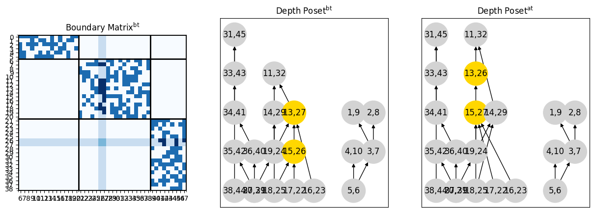

### Birth Death Pairs
|                          |                                                                                                                                                                                                               |
|:-------------------------|:--------------------------------------------------------------------------------------------------------------------------------------------------------------------------------------------------------------|
| Before the transposition | $\{(13, 27), (35, 42), (3, 7), (38, 44), (1, 9), (2, 8), (19, 24), (36, 40), (37, 39), (11, 32), (15, 26), (5, 6), (18, 25), (33, 43), (20, 21), (4, 10), (17, 22), (31, 45), (14, 29), (34, 41), (16, 23)\}$ |
| After the transposition  | $\{(15, 27), (35, 42), (3, 7), (38, 44), (1, 9), (2, 8), (19, 24), (36, 40), (37, 39), (13, 26), (11, 32), (5, 6), (18, 25), (33, 43), (20, 21), (4, 10), (17, 22), (31, 45), (14, 29), (34, 41), (16, 23)\}$ |

### Relations
|                          | Algorithm 1                                                                                                                                                                                                                                                                                                                                                                                                                       | Algorithm 2                                                                                                                                                                                                                                                                                                                                                                      |
|:-------------------------|:----------------------------------------------------------------------------------------------------------------------------------------------------------------------------------------------------------------------------------------------------------------------------------------------------------------------------------------------------------------------------------------------------------------------------------|:---------------------------------------------------------------------------------------------------------------------------------------------------------------------------------------------------------------------------------------------------------------------------------------------------------------------------------------------------------------------------------|
| Before the transposition | $\{(6, 12), (25, 29), (24, 27), (26, 30), (44, 45), (41, 46), (26, 27), (22, 26), (39, 42), (40, 41), (40, 47), (10, 12), (27, 28), (45, 46), (42, 47), (41, 45), (24, 29), (26, 32), (24, 32), (43, 45), (21, 24), (21, 30), (23, 27), (40, 43), (7, 9), (6, 7), (6, 10), (25, 27), (26, 28), (25, 30), (42, 46), (43, 47), (29, 30), (44, 46), (22, 27), (39, 40), (39, 46), (9, 12), (40, 45), (27, 32), (45, 47), (25, 26)\}$ | $\{(35, 30), (4, 0), (5, 4), (34, 28), (17, 15), (34, 31), (36, 28), (19, 12), (1, 0), (13, 11), (37, 36), (36, 34), (18, 13), (38, 28), (38, 31), (5, 0), (20, 19), (5, 3), (17, 11), (14, 12), (31, 28), (34, 33), (36, 33), (33, 28), (3, 2), (38, 30), (14, 11), (5, 2), (15, 12), (2, 0), (37, 28), (19, 13), (37, 31), (37, 34), (13, 12), (33, 30), (18, 14)\}$           |
| After the transposition  | $\{(6, 12), (25, 29), (24, 27), (26, 30), (44, 45), (41, 46), (22, 26), (39, 42), (40, 41), (40, 47), (10, 12), (27, 28), (45, 46), (42, 47), (41, 45), (24, 29), (24, 32), (43, 45), (21, 24), (21, 30), (23, 27), (40, 43), (27, 30), (7, 9), (6, 7), (6, 10), (25, 27), (25, 30), (42, 46), (43, 47), (29, 30), (44, 46), (22, 27), (39, 40), (39, 46), (9, 12), (40, 45), (27, 26), (27, 32), (45, 47), (25, 26)\}$           | $\{(35, 30), (4, 0), (5, 4), (34, 28), (17, 15), (19, 12), (1, 0), (34, 31), (36, 28), (13, 11), (37, 36), (36, 34), (15, 11), (18, 13), (38, 28), (38, 31), (5, 0), (20, 19), (5, 3), (17, 11), (14, 12), (31, 28), (34, 33), (36, 33), (15, 13), (33, 28), (3, 2), (38, 30), (5, 2), (14, 11), (2, 0), (37, 28), (19, 13), (37, 31), (37, 34), (13, 12), (33, 30), (18, 14)\}$ |

### Successors and Predecessers
|                 | $\text{Set}^\text{bt}(13, 27)$                                                           | $\text{Set}^\text{bt}(15, 26)$                             | $\text{Set}^\text{at}(15, 27)$                                                 | $\text{Set}^\text{at}(13, 26)$                                       |
|:----------------|:-----------------------------------------------------------------------------------------|:-----------------------------------------------------------|:-------------------------------------------------------------------------------|:---------------------------------------------------------------------|
| $\text{Succ}_1$ | $\text{Succ}_1^\text{bt}(13, 27) = \{(11, 32)\}$                                         | $\text{Succ}_1^\text{bt}(15, 26) = \{(13, 27), (11, 32)\}$ | $\text{Succ}_1^\text{at}(15, 27) = \{(13, 26), (11, 32)\}$                     | $\text{Succ}_1^\text{at}(13, 26) = \emptyset$                        |
| $\text{Pred}_1$ | $\text{Pred}_1^\text{bt}(13, 27) = \{(19, 24), (15, 26), (17, 22), (18, 25), (16, 23)\}$ | $\text{Pred}_1^\text{bt}(15, 26) = \{(17, 22), (18, 25)\}$ | $\text{Pred}_1^\text{at}(15, 27) = \{(19, 24), (17, 22), (18, 25), (16, 23)\}$ | $\text{Pred}_1^\text{at}(13, 26) = \{(17, 22), (15, 27), (18, 25)\}$ |
| $\text{Succ}_2$ | $\text{Succ}_2^\text{bt}(13, 27) = \{(11, 32)\}$                                         | $\text{Succ}_2^\text{bt}(15, 26) = \emptyset$              | $\text{Succ}_2^\text{at}(15, 27) = \{(13, 26), (11, 32)\}$                     | $\text{Succ}_2^\text{at}(13, 26) = \{(11, 32)\}$                     |
| $\text{Pred}_2$ | $\text{Pred}_2^\text{bt}(13, 27) = \{(19, 24), (18, 25)\}$                               | $\text{Pred}_2^\text{bt}(15, 26) = \{(17, 22)\}$           | $\text{Pred}_2^\text{at}(15, 27) = \{(17, 22)\}$                               | $\text{Pred}_2^\text{at}(13, 26) = \{(19, 24), (15, 27), (18, 25)\}$ |

### Temp Sets
|                                                               | Before the Transposition                                                                                                     | After the Transposition                                                                                                      |
|:--------------------------------------------------------------|:-----------------------------------------------------------------------------------------------------------------------------|:-----------------------------------------------------------------------------------------------------------------------------|
| $\mathcal{B} = \{(s, t)\in \text{BD}:\; f(s) > f(x)\}$        | $\{(19, 24), (36, 40), (37, 39), (35, 42), (17, 22), (31, 45), (20, 21), (34, 41), (38, 44), (18, 25), (33, 43), (16, 23)\}$ | $\{(19, 24), (36, 40), (37, 39), (35, 42), (17, 22), (31, 45), (20, 21), (34, 41), (38, 44), (18, 25), (33, 43), (16, 23)\}$ |
| $\mathcal{N} = \{(s, t)\in \text{BD}:\; f(x) > f(s) > f(a)\}$ | $\{(14, 29)\}$                                                                                                               | $\{(14, 29)\}$                                                                                                               |

### Equations
There are 1 equations are wrong.

| eq   | left (formula)                  | left (paramatrized)               | left (value)                                 | right (formula)                                                                                          | right (paramatrized)                                                                                           | right (value)                                | correct   |
|:-----|:--------------------------------|:----------------------------------|:---------------------------------------------|:---------------------------------------------------------------------------------------------------------|:---------------------------------------------------------------------------------------------------------------|:---------------------------------------------|:----------|
| Eq28 | $\text{Succ}_1^\text{at}(x, b)$ | $\text{Succ}_1^\text{at}(15, 27)$ | $\{(13, 26), (11, 32)\}$                     | $\text{Succ}_1^\text{bt}(x, y) \oplus \{(a, y), (a, b)\}$                                                | $\text{Succ}_1^\text{bt}(15, 26) \oplus \{(13, 26), (13, 27)\}$                                                | $\{(13, 26), (11, 32)\}$                     | ✔         |
| Eq29 | $\text{Succ}_1^\text{at}(a, y)$ | $\text{Succ}_1^\text{at}(13, 26)$ | $\emptyset$                                  | $\text{Succ}_1^\text{bt}(a, b)$                                                                          | $\text{Succ}_1^\text{bt}(13, 27)$                                                                              | $\{(11, 32)\}$                               | ✘         |
| Eq30 | $\text{Pred}_1^\text{at}(x, b)$ | $\text{Pred}_1^\text{at}(15, 27)$ | $\{(19, 24), (17, 22), (18, 25), (16, 23)\}$ | $[\text{Pred}_1^\text{bt}(a, b) \cap \mathcal{B}]$                                                       | $[\text{Pred}_1^\text{bt}(13, 27) \cap \mathcal{B}]$                                                           | $\{(19, 24), (17, 22), (18, 25), (16, 23)\}$ | ✔         |
| Eq31 | $\text{Pred}_1^\text{at}(a, y)$ | $\text{Pred}_1^\text{at}(13, 26)$ | $\{(17, 22), (15, 27), (18, 25)\}$           | $\text{Pred}_1^\text{bt}(x, y) \oplus \{(x, b)\} \oplus[\text{Pred}_1^\text{bt}(a, b) \cap \mathcal{N}]$ | $\text{Pred}_1^\text{bt}(15, 26) \oplus \{(15, 27)\} \oplus[\text{Pred}_1^\text{bt}(13, 27) \cap \mathcal{N}]$ | $\{(15, 27), (17, 22), (18, 25)\}$           | ✔         |
| Eq32 | $\text{Succ}_2^\text{at}(x, b)$ | $\text{Succ}_2^\text{at}(15, 27)$ | $\{(13, 26), (11, 32)\}$                     | $\text{Succ}_2^\text{bt}(x, y) \oplus \{(a, y)\} \oplus \text{Succ}_2^\text{bt}(a, b)$                   | $\text{Succ}_2^\text{bt}(15, 26) \oplus \{(13, 26)\} \oplus \text{Succ}_2^\text{bt}(13, 27)$                   | $\{(13, 26), (11, 32)\}$                     | ✔         |
| Eq33 | $\text{Succ}_2^\text{at}(a, y)$ | $\text{Succ}_2^\text{at}(13, 26)$ | $\{(11, 32)\}$                               | $\text{Succ}_2^\text{bt}(a, b)$                                                                          | $\text{Succ}_2^\text{bt}(13, 27)$                                                                              | $\{(11, 32)\}$                               | ✔         |
| Eq34 | $\text{Pred}_2^\text{at}(x, b)$ | $\text{Pred}_2^\text{at}(15, 27)$ | $\{(17, 22)\}$                               | $\text{Pred}_2^\text{bt}(x, y)$                                                                          | $\text{Pred}_2^\text{bt}(15, 26)$                                                                              | $\{(17, 22)\}$                               | ✔         |
| Eq35 | $\text{Pred}_2^\text{at}(a, y)$ | $\text{Pred}_2^\text{at}(13, 26)$ | $\{(19, 24), (15, 27), (18, 25)\}$           | $\text{Pred}_2^\text{bt}(a, b) \oplus \{(x, b)\}$                                                        | $\text{Pred}_2^\text{bt}(13, 27) \oplus \{(15, 27)\}$                                                          | $\{(15, 27), (19, 24), (18, 25)\}$           | ✔         |

## Transposition <33, 34> in complex 15
Here is a __birth-birth__ __switch forward__ transposition <33, 34>.

$$
a = 33, \; b = 43, \; x = 34, \; y = 41
$$

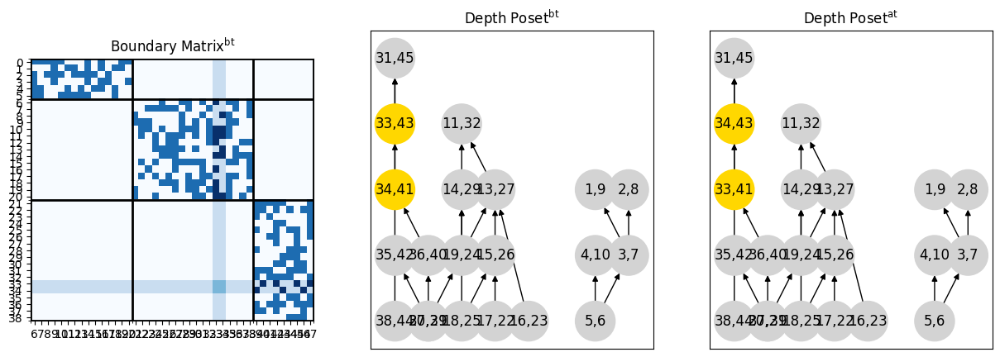

### Birth Death Pairs
|                          |                                                                                                                                                                                                               |
|:-------------------------|:--------------------------------------------------------------------------------------------------------------------------------------------------------------------------------------------------------------|
| Before the transposition | $\{(13, 27), (35, 42), (3, 7), (38, 44), (1, 9), (2, 8), (19, 24), (36, 40), (37, 39), (11, 32), (15, 26), (5, 6), (18, 25), (33, 43), (20, 21), (4, 10), (17, 22), (31, 45), (14, 29), (34, 41), (16, 23)\}$ |
| After the transposition  | $\{(13, 27), (35, 42), (3, 7), (38, 44), (1, 9), (2, 8), (34, 43), (36, 40), (19, 24), (37, 39), (11, 32), (15, 26), (33, 41), (5, 6), (18, 25), (20, 21), (4, 10), (17, 22), (31, 45), (14, 29), (16, 23)\}$ |

### Relations
|                          | Algorithm 1                                                                                                                                                                                                                                                                                                                                                                                                                                 | Algorithm 2                                                                                                                                                                                                                                                                                                                                                            |
|:-------------------------|:--------------------------------------------------------------------------------------------------------------------------------------------------------------------------------------------------------------------------------------------------------------------------------------------------------------------------------------------------------------------------------------------------------------------------------------------|:-----------------------------------------------------------------------------------------------------------------------------------------------------------------------------------------------------------------------------------------------------------------------------------------------------------------------------------------------------------------------|
| Before the transposition | $\{(6, 12), (25, 29), (24, 27), (26, 30), (44, 45), (41, 46), (26, 27), (22, 26), (39, 42), (40, 41), (40, 47), (10, 12), (27, 28), (45, 46), (42, 47), (41, 45), (24, 29), (26, 32), (24, 32), (43, 45), (21, 24), (21, 30), (23, 27), (40, 43), (7, 9), (6, 7), (6, 10), (25, 27), (26, 28), (25, 30), (42, 46), (43, 47), (29, 30), (44, 46), (22, 27), (39, 40), (39, 46), (9, 12), (40, 45), (27, 32), (45, 47), (25, 26)\}$           | $\{(35, 30), (4, 0), (5, 4), (34, 28), (17, 15), (34, 31), (36, 28), (19, 12), (1, 0), (13, 11), (37, 36), (36, 34), (18, 13), (38, 28), (38, 31), (5, 0), (20, 19), (5, 3), (17, 11), (14, 12), (31, 28), (34, 33), (36, 33), (33, 28), (3, 2), (38, 30), (14, 11), (5, 2), (15, 12), (2, 0), (37, 28), (19, 13), (37, 31), (37, 34), (13, 12), (33, 30), (18, 14)\}$ |
| After the transposition  | $\{(6, 12), (25, 29), (24, 27), (41, 43), (26, 30), (44, 45), (41, 46), (26, 27), (22, 26), (39, 42), (40, 41), (40, 47), (10, 12), (27, 28), (45, 46), (42, 47), (24, 29), (26, 32), (24, 32), (43, 45), (21, 24), (21, 30), (23, 27), (40, 43), (7, 9), (6, 7), (6, 10), (25, 27), (41, 47), (25, 30), (42, 46), (26, 28), (43, 47), (29, 30), (44, 46), (22, 27), (39, 40), (39, 46), (9, 12), (40, 45), (27, 32), (45, 47), (25, 26)\}$ | $\{(35, 30), (4, 0), (5, 4), (17, 15), (19, 12), (1, 0), (36, 28), (34, 31), (13, 11), (37, 36), (36, 34), (18, 13), (38, 28), (38, 31), (5, 0), (20, 19), (5, 3), (17, 11), (14, 12), (31, 28), (34, 30), (36, 33), (33, 28), (33, 31), (33, 34), (3, 2), (38, 30), (14, 11), (5, 2), (2, 0), (37, 28), (19, 13), (37, 31), (37, 34), (13, 12), (15, 12), (18, 14)\}$ |

### Successors and Predecessers
|                 | $\text{Set}^\text{bt}(33, 43)$                             | $\text{Set}^\text{bt}(34, 41)$                             | $\text{Set}^\text{at}(33, 41)$                             | $\text{Set}^\text{at}(34, 43)$                                       |
|:----------------|:-----------------------------------------------------------|:-----------------------------------------------------------|:-----------------------------------------------------------|:---------------------------------------------------------------------|
| $\text{Succ}_1$ | $\text{Succ}_1^\text{bt}(33, 43) = \{(31, 45)\}$           | $\text{Succ}_1^\text{bt}(34, 41) = \{(31, 45)\}$           | $\text{Succ}_1^\text{at}(33, 41) = \{(34, 43)\}$           | $\text{Succ}_1^\text{at}(34, 43) = \{(31, 45)\}$                     |
| $\text{Pred}_1$ | $\text{Pred}_1^\text{bt}(33, 43) = \{(36, 40)\}$           | $\text{Pred}_1^\text{bt}(34, 41) = \{(36, 40)\}$           | $\text{Pred}_1^\text{at}(33, 41) = \{(36, 40)\}$           | $\text{Pred}_1^\text{at}(34, 43) = \{(36, 40), (33, 41)\}$           |
| $\text{Succ}_2$ | $\text{Succ}_2^\text{bt}(33, 43) = \emptyset$              | $\text{Succ}_2^\text{bt}(34, 41) = \{(31, 45), (33, 43)\}$ | $\text{Succ}_2^\text{at}(33, 41) = \{(34, 43), (31, 45)\}$ | $\text{Succ}_2^\text{at}(34, 43) = \{(31, 45)\}$                     |
| $\text{Pred}_2$ | $\text{Pred}_2^\text{bt}(33, 43) = \{(36, 40), (34, 41)\}$ | $\text{Pred}_2^\text{bt}(34, 41) = \{(36, 40), (37, 39)\}$ | $\text{Pred}_2^\text{at}(33, 41) = \{(36, 40)\}$           | $\text{Pred}_2^\text{at}(34, 43) = \{(36, 40), (33, 41), (37, 39)\}$ |

### Temp Sets
|                                                               | Before the Transposition                                                                                                                                    | After the Transposition                                                                                                                                     |
|:--------------------------------------------------------------|:------------------------------------------------------------------------------------------------------------------------------------------------------------|:------------------------------------------------------------------------------------------------------------------------------------------------------------|
| $\mathcal{L} = \{(s, t)\in \text{BD}:\; f(t) < f(y)\}$        | $\{(19, 24), (36, 40), (4, 10), (37, 39), (13, 27), (3, 7), (11, 32), (15, 26), (17, 22), (14, 29), (20, 21), (16, 23), (5, 6), (18, 25), (1, 9), (2, 8)\}$ | $\{(19, 24), (36, 40), (4, 10), (37, 39), (13, 27), (3, 7), (11, 32), (15, 26), (17, 22), (14, 29), (20, 21), (16, 23), (5, 6), (18, 25), (1, 9), (2, 8)\}$ |
| $\mathcal{M} = \{(s, t)\in \text{BD}:\; f(y) < f(t) < f(b)\}$ | $\{(35, 42)\}$                                                                                                                                              | $\{(35, 42)\}$                                                                                                                                              |

### Equations
There are 1 equations are wrong.

| eq   | left (formula)                  | left (paramatrized)               | left (value)                       | right (formula)                                                                                           | right (paramatrized)                                                                                            | right (value)                      | correct   |
|:-----|:--------------------------------|:----------------------------------|:-----------------------------------|:----------------------------------------------------------------------------------------------------------|:----------------------------------------------------------------------------------------------------------------|:-----------------------------------|:----------|
| Eq08 | $\text{Succ}_1^\text{at}(a, y)$ | $\text{Succ}_1^\text{at}(33, 41)$ | $\{(34, 43)\}$                     | $\text{Succ}_1^\text{bt}(x, y) \oplus \{(x, b)\} \oplus \text{Succ}_1^\text{bt}(a, b)$                    | $\text{Succ}_1^\text{bt}(34, 41) \oplus \{(34, 43)\} \oplus \text{Succ}_1^\text{bt}(33, 43)$                    | $\{(34, 43)\}$                     | ✔         |
| Eq09 | $\text{Succ}_1^\text{at}(x, b)$ | $\text{Succ}_1^\text{at}(34, 43)$ | $\{(31, 45)\}$                     | $\text{Succ}_1^\text{bt}(a, b)$                                                                           | $\text{Succ}_1^\text{bt}(33, 43)$                                                                               | $\{(31, 45)\}$                     | ✔         |
| Eq10 | $\text{Pred}_1^\text{at}(a, y)$ | $\text{Pred}_1^\text{at}(33, 41)$ | $\{(36, 40)\}$                     | $\text{Pred}_1^\text{bt}(x, y)$                                                                           | $\text{Pred}_1^\text{bt}(34, 41)$                                                                               | $\{(36, 40)\}$                     | ✔         |
| Eq11 | $\text{Pred}_1^\text{at}(x, b)$ | $\text{Pred}_1^\text{at}(34, 43)$ | $\{(36, 40), (33, 41)\}$           | $\text{Pred}_1^\text{bt}(a, b) \oplus \{(a, y)\}$                                                         | $\text{Pred}_1^\text{bt}(33, 43) \oplus \{(33, 41)\}$                                                           | $\{(36, 40), (33, 41)\}$           | ✔         |
| Eq12 | $\text{Succ}_2^\text{at}(a, y)$ | $\text{Succ}_2^\text{at}(33, 41)$ | $\{(34, 43), (31, 45)\}$           | $\text{Succ}_2^\text{bt}(x, y) \oplus \{(x, b), (a, b)\}$                                                 | $\text{Succ}_2^\text{bt}(34, 41) \oplus \{(34, 43), (33, 43)\}$                                                 | $\{(34, 43), (31, 45)\}$           | ✔         |
| Eq13 | $\text{Succ}_2^\text{at}(x, b)$ | $\text{Succ}_2^\text{at}(34, 43)$ | $\{(31, 45)\}$                     | $\text{Succ}_2^\text{bt}(a, b)$                                                                           | $\text{Succ}_2^\text{bt}(33, 43)$                                                                               | $\emptyset$                        | ✘         |
| Eq14 | $\text{Pred}_2^\text{at}(a, y)$ | $\text{Pred}_2^\text{at}(33, 41)$ | $\{(36, 40)\}$                     | $[\text{Pred}_2^\text{bt}(a, b) \cap \mathcal{L}]$                                                        | $[\text{Pred}_2^\text{bt}(33, 43) \cap \mathcal{L}]$                                                            | $\{(36, 40)\}$                     | ✔         |
| Eq15 | $\text{Pred}_2^\text{at}(x, b)$ | $\text{Pred}_2^\text{at}(34, 43)$ | $\{(36, 40), (33, 41), (37, 39)\}$ | $\text{Pred}_2^\text{bt}(x, y) \oplus \{(a, y)\} \oplus [\text{Pred}_2^\text{bt}(a, b) \cap \mathcal{M}]$ | $\text{Pred}_2^\text{bt}(34, 41) \oplus \{(33, 41)\} \oplus [\text{Pred}_2^\text{bt}(33, 43) \cap \mathcal{M}]$ | $\{(36, 40), (33, 41), (37, 39)\}$ | ✔         |

## Transposition <34, 35> in complex 15
Here is a __birth-birth__ __no switch__ transposition <34, 35>.

$$
a = 34, \; b = 41, \; x = 35, \; y = 42
$$

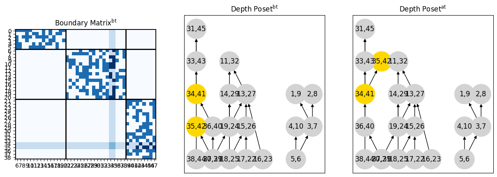

### Birth Death Pairs
|                          |                                                                                                                                                                                                               |
|:-------------------------|:--------------------------------------------------------------------------------------------------------------------------------------------------------------------------------------------------------------|
| Before the transposition | $\{(13, 27), (35, 42), (3, 7), (38, 44), (1, 9), (2, 8), (19, 24), (36, 40), (37, 39), (11, 32), (15, 26), (5, 6), (18, 25), (33, 43), (20, 21), (4, 10), (17, 22), (31, 45), (14, 29), (34, 41), (16, 23)\}$ |
| After the transposition  | $\{(13, 27), (35, 42), (3, 7), (38, 44), (1, 9), (2, 8), (19, 24), (36, 40), (37, 39), (11, 32), (15, 26), (5, 6), (18, 25), (33, 43), (20, 21), (4, 10), (17, 22), (31, 45), (14, 29), (34, 41), (16, 23)\}$ |

### Relations
|                          | Algorithm 1                                                                                                                                                                                                                                                                                                                                                                                                                                 | Algorithm 2                                                                                                                                                                                                                                                                                                                                                            |
|:-------------------------|:--------------------------------------------------------------------------------------------------------------------------------------------------------------------------------------------------------------------------------------------------------------------------------------------------------------------------------------------------------------------------------------------------------------------------------------------|:-----------------------------------------------------------------------------------------------------------------------------------------------------------------------------------------------------------------------------------------------------------------------------------------------------------------------------------------------------------------------|
| Before the transposition | $\{(6, 12), (25, 29), (24, 27), (26, 30), (44, 45), (41, 46), (26, 27), (22, 26), (39, 42), (40, 41), (40, 47), (10, 12), (27, 28), (45, 46), (42, 47), (41, 45), (24, 29), (26, 32), (24, 32), (43, 45), (21, 24), (21, 30), (23, 27), (40, 43), (7, 9), (6, 7), (6, 10), (25, 27), (26, 28), (25, 30), (42, 46), (43, 47), (29, 30), (44, 46), (22, 27), (39, 40), (39, 46), (9, 12), (40, 45), (27, 32), (45, 47), (25, 26)\}$           | $\{(35, 30), (4, 0), (5, 4), (34, 28), (17, 15), (34, 31), (36, 28), (19, 12), (1, 0), (13, 11), (37, 36), (36, 34), (18, 13), (38, 28), (38, 31), (5, 0), (20, 19), (5, 3), (17, 11), (14, 12), (31, 28), (34, 33), (36, 33), (33, 28), (3, 2), (38, 30), (14, 11), (5, 2), (15, 12), (2, 0), (37, 28), (19, 13), (37, 31), (37, 34), (13, 12), (33, 30), (18, 14)\}$ |
| After the transposition  | $\{(6, 12), (25, 29), (24, 27), (26, 30), (44, 45), (26, 27), (22, 26), (39, 42), (40, 41), (40, 47), (10, 12), (27, 28), (45, 46), (41, 42), (42, 47), (41, 45), (24, 29), (26, 32), (24, 32), (43, 45), (21, 24), (21, 30), (23, 27), (40, 43), (7, 9), (6, 7), (6, 10), (25, 27), (41, 47), (25, 30), (42, 46), (26, 28), (43, 47), (29, 30), (44, 46), (22, 27), (39, 40), (39, 46), (9, 12), (40, 45), (27, 32), (45, 47), (25, 26)\}$ | $\{(35, 30), (4, 0), (5, 4), (33, 30), (34, 28), (17, 15), (19, 12), (1, 0), (36, 28), (34, 31), (13, 11), (37, 36), (36, 34), (18, 13), (38, 28), (38, 31), (5, 0), (20, 19), (5, 3), (17, 11), (31, 28), (14, 12), (34, 33), (36, 33), (33, 28), (3, 2), (38, 30), (14, 11), (5, 2), (2, 0), (37, 28), (19, 13), (37, 31), (37, 34), (13, 12), (15, 12), (18, 14)\}$ |

### Successors and Predecessers
No such node in the Depth Poset

### Temp Sets
|                                                               | Before the Transposition                                                                                                                                              | After the Transposition                                                                                                                                               |
|:--------------------------------------------------------------|:----------------------------------------------------------------------------------------------------------------------------------------------------------------------|:----------------------------------------------------------------------------------------------------------------------------------------------------------------------|
| $\mathcal{L} = \{(s, t)\in \text{BD}:\; f(t) < f(y)\}$        | $\{(19, 24), (36, 40), (4, 10), (37, 39), (13, 27), (3, 7), (11, 32), (15, 26), (17, 22), (14, 29), (20, 21), (16, 23), (34, 41), (18, 25), (5, 6), (1, 9), (2, 8)\}$ | $\{(19, 24), (36, 40), (4, 10), (37, 39), (13, 27), (3, 7), (11, 32), (15, 26), (17, 22), (14, 29), (20, 21), (16, 23), (34, 41), (18, 25), (5, 6), (1, 9), (2, 8)\}$ |
| $\mathcal{M} = \{(s, t)\in \text{BD}:\; f(y) < f(t) < f(b)\}$ | $\emptyset$                                                                                                                                                           | $\emptyset$                                                                                                                                                           |

### Equations
There are 2 equations are wrong.

| eq   | left (formula)                  | left (paramatrized)               | left (value)   | right (formula)                                                                        | right (paramatrized)                                                                         | right (value)            | correct   |
|:-----|:--------------------------------|:----------------------------------|:---------------|:---------------------------------------------------------------------------------------|:---------------------------------------------------------------------------------------------|:-------------------------|:----------|
| Eq16 | $\text{Succ}_1^\text{at}(x, y)$ | $\text{Succ}_1^\text{at}(35, 42)$ | $\emptyset$    | $\text{Succ}_1^\text{bt}(x, y) \oplus \{(a, b)\} \oplus \text{Succ}_1^\text{bt}(a, b)$ | $\text{Succ}_1^\text{bt}(35, 42) \oplus \{(34, 41)\} \oplus \text{Succ}_1^\text{bt}(34, 41)$ | $\{(31, 45), (34, 41)\}$ | ✘         |
| Eq17 | $\text{Pred}_1^\text{at}(a, b)$ | $\text{Pred}_1^\text{at}(34, 41)$ | $\{(36, 40)\}$ | $\text{Pred}_1^\text{bt}(a, b) \oplus \{(x, y)\}$                                      | $\text{Pred}_1^\text{bt}(34, 41) \oplus \{(35, 42)\}$                                        | $\{(35, 42), (36, 40)\}$ | ✘         |

## Transposition <41, 42> in complex 15
Here is a __death-death__ __no switch__ transposition <41, 42>.

$$
a = 35, \; b = 42, \; x = 34, \; y = 41
$$

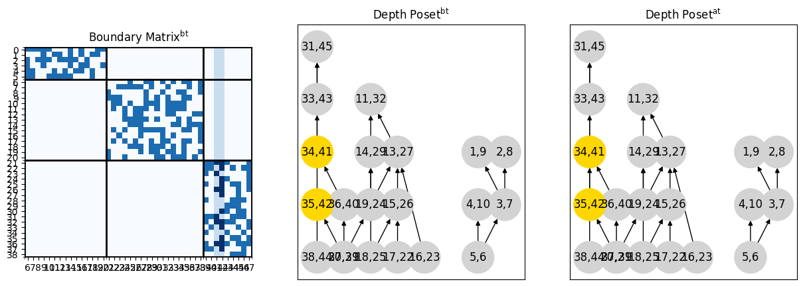

### Birth Death Pairs
|                          |                                                                                                                                                                                                               |
|:-------------------------|:--------------------------------------------------------------------------------------------------------------------------------------------------------------------------------------------------------------|
| Before the transposition | $\{(13, 27), (35, 42), (3, 7), (38, 44), (1, 9), (2, 8), (19, 24), (36, 40), (37, 39), (11, 32), (15, 26), (5, 6), (18, 25), (33, 43), (20, 21), (4, 10), (17, 22), (31, 45), (14, 29), (34, 41), (16, 23)\}$ |
| After the transposition  | $\{(13, 27), (35, 42), (3, 7), (38, 44), (1, 9), (2, 8), (19, 24), (36, 40), (37, 39), (11, 32), (15, 26), (5, 6), (18, 25), (33, 43), (20, 21), (4, 10), (17, 22), (31, 45), (14, 29), (34, 41), (16, 23)\}$ |

### Relations
|                          | Algorithm 1                                                                                                                                                                                                                                                                                                                                                                                                                       | Algorithm 2                                                                                                                                                                                                                                                                                                                                                                                                    |
|:-------------------------|:----------------------------------------------------------------------------------------------------------------------------------------------------------------------------------------------------------------------------------------------------------------------------------------------------------------------------------------------------------------------------------------------------------------------------------|:---------------------------------------------------------------------------------------------------------------------------------------------------------------------------------------------------------------------------------------------------------------------------------------------------------------------------------------------------------------------------------------------------------------|
| Before the transposition | $\{(6, 12), (25, 29), (24, 27), (26, 30), (44, 45), (41, 46), (26, 27), (22, 26), (39, 42), (40, 41), (40, 47), (10, 12), (27, 28), (45, 46), (42, 47), (41, 45), (24, 29), (26, 32), (24, 32), (43, 45), (21, 24), (21, 30), (23, 27), (40, 43), (7, 9), (6, 7), (6, 10), (25, 27), (26, 28), (25, 30), (42, 46), (43, 47), (29, 30), (44, 46), (22, 27), (39, 40), (39, 46), (9, 12), (40, 45), (27, 32), (45, 47), (25, 26)\}$ | $\{(35, 30), (4, 0), (5, 4), (34, 28), (17, 15), (34, 31), (36, 28), (19, 12), (1, 0), (13, 11), (37, 36), (36, 34), (18, 13), (38, 28), (38, 31), (5, 0), (20, 19), (5, 3), (17, 11), (14, 12), (31, 28), (34, 33), (36, 33), (33, 28), (3, 2), (38, 30), (14, 11), (5, 2), (15, 12), (2, 0), (37, 28), (19, 13), (37, 31), (37, 34), (13, 12), (33, 30), (18, 14)\}$                                         |
| After the transposition  | $\{(6, 12), (25, 29), (24, 27), (26, 30), (44, 45), (26, 27), (41, 46), (22, 26), (39, 42), (40, 41), (40, 47), (10, 12), (27, 28), (45, 46), (24, 29), (41, 45), (26, 32), (42, 47), (24, 32), (43, 45), (21, 24), (21, 30), (23, 27), (40, 43), (7, 9), (6, 7), (6, 10), (25, 27), (26, 28), (25, 30), (42, 46), (43, 47), (29, 30), (44, 46), (22, 27), (39, 40), (39, 46), (9, 12), (40, 45), (27, 32), (45, 47), (25, 26)\}$ | $\{(35, 30), (4, 0), (35, 33), (5, 4), (33, 30), (34, 28), (17, 15), (19, 12), (1, 0), (34, 31), (36, 28), (13, 11), (37, 36), (36, 34), (18, 13), (38, 28), (38, 31), (5, 0), (20, 19), (5, 3), (17, 11), (14, 12), (31, 28), (34, 33), (36, 33), (33, 28), (35, 28), (35, 31), (3, 2), (38, 30), (35, 34), (14, 11), (5, 2), (2, 0), (37, 28), (19, 13), (37, 31), (37, 34), (13, 12), (15, 12), (18, 14)\}$ |

### Successors and Predecessers
No such node in the Depth Poset

### Temp Sets
|                                                               | Before the Transposition                     | After the Transposition                      |
|:--------------------------------------------------------------|:---------------------------------------------|:---------------------------------------------|
| $\mathcal{B} = \{(s, t)\in \text{BD}:\; f(s) > f(x)\}$        | $\{(36, 40), (37, 39), (38, 44), (35, 42)\}$ | $\{(36, 40), (37, 39), (38, 44), (35, 42)\}$ |
| $\mathcal{N} = \{(s, t)\in \text{BD}:\; f(x) > f(s) > f(a)\}$ | $\emptyset$                                  | $\emptyset$                                  |

### Equations
There are 2 equations are wrong.

| eq   | left (formula)                  | left (paramatrized)               | left (value)             | right (formula)                                                                        | right (paramatrized)                                                                         | right (value)                      | correct   |
|:-----|:--------------------------------|:----------------------------------|:-------------------------|:---------------------------------------------------------------------------------------|:---------------------------------------------------------------------------------------------|:-----------------------------------|:----------|
| Eq36 | $\text{Succ}_2^\text{at}(x, y)$ | $\text{Succ}_2^\text{at}(34, 41)$ | $\{(31, 45), (33, 43)\}$ | $\text{Succ}_2^\text{bt}(x, y) \oplus \{(a, b)\} \oplus \text{Succ}_2^\text{bt}(a, b)$ | $\text{Succ}_2^\text{bt}(34, 41) \oplus \{(35, 42)\} \oplus \text{Succ}_2^\text{bt}(35, 42)$ | $\{(33, 43), (35, 42), (31, 45)\}$ | ✘         |
| Eq37 | $\text{Pred}_2^\text{at}(a, b)$ | $\text{Pred}_2^\text{at}(35, 42)$ | $\emptyset$              | $\text{Pred}_2^\text{bt}(a, b) \oplus \{(x, y)\}$                                      | $\text{Pred}_2^\text{bt}(35, 42) \oplus \{(34, 41)\}$                                        | $\{(34, 41)\}$                     | ✘         |

## Transposition <11, 12> in complex 16
Here is a __birth-death__ __switch forward__ transposition <11, 12>.

$$
a = 0, \; b = 11, \; x = 12, \; y = 30
$$

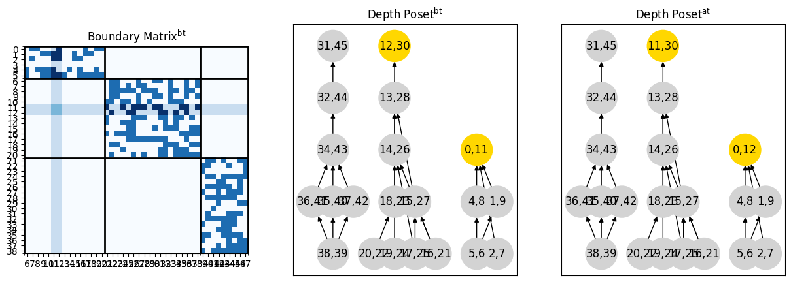

### Birth Death Pairs
|                          |                                                                                                                                                                                                               |
|:-------------------------|:--------------------------------------------------------------------------------------------------------------------------------------------------------------------------------------------------------------|
| Before the transposition | $\{(18, 23), (15, 27), (1, 9), (0, 11), (37, 42), (34, 43), (19, 24), (5, 6), (4, 8), (20, 22), (12, 30), (2, 7), (16, 21), (13, 28), (32, 44), (35, 40), (38, 39), (14, 26), (31, 45), (17, 25), (36, 41)\}$ |
| After the transposition  | $\{(18, 23), (15, 27), (1, 9), (37, 42), (34, 43), (19, 24), (5, 6), (4, 8), (20, 22), (2, 7), (36, 41), (16, 21), (13, 28), (32, 44), (35, 40), (38, 39), (14, 26), (0, 12), (31, 45), (17, 25), (11, 30)\}$ |

### Relations
|                          | Algorithm 1                                                                                                                                                                                                                                                                                                                                                                                                                                                                                                                                    | Algorithm 2                                                                                                                                                                                                                                                                                                                                                  |
|:-------------------------|:-----------------------------------------------------------------------------------------------------------------------------------------------------------------------------------------------------------------------------------------------------------------------------------------------------------------------------------------------------------------------------------------------------------------------------------------------------------------------------------------------------------------------------------------------|:-------------------------------------------------------------------------------------------------------------------------------------------------------------------------------------------------------------------------------------------------------------------------------------------------------------------------------------------------------------|
| Before the transposition | $\{(25, 29), (42, 45), (41, 43), (43, 46), (41, 46), (26, 33), (23, 28), (22, 26), (39, 42), (40, 47), (39, 45), (9, 11), (28, 30), (27, 28), (28, 33), (45, 46), (6, 11), (25, 28), (42, 47), (42, 44), (43, 45), (21, 30), (39, 41), (21, 27), (21, 33), (22, 28), (39, 44), (9, 10), (40, 43), (23, 33), (39, 47), (28, 29), (27, 33), (6, 10), (41, 44), (25, 27), (41, 47), (25, 30), (42, 46), (26, 28), (43, 47), (44, 46), (21, 26), (21, 29), (23, 26), (39, 46), (40, 45), (39, 43), (27, 29), (7, 11), (6, 9), (25, 26)\}$          | $\{(32, 31), (4, 0), (38, 35), (5, 4), (14, 10), (17, 12), (31, 29), (17, 15), (34, 31), (36, 31), (16, 10), (16, 13), (18, 10), (35, 32), (18, 13), (20, 10), (14, 12), (34, 33), (37, 29), (36, 33), (15, 10), (32, 29), (35, 31), (20, 12), (20, 18), (38, 33), (38, 36), (17, 13), (2, 0), (19, 13), (34, 32), (37, 34), (16, 14), (15, 12), (18, 14)\}$ |
| After the transposition  | $\{(6, 12), (25, 29), (42, 45), (41, 43), (43, 46), (41, 46), (26, 33), (23, 28), (22, 26), (39, 42), (40, 47), (39, 45), (8, 12), (28, 30), (27, 28), (28, 33), (45, 46), (25, 28), (42, 47), (42, 44), (43, 45), (21, 30), (39, 41), (21, 27), (21, 33), (22, 28), (39, 44), (9, 10), (40, 43), (23, 33), (39, 47), (28, 29), (27, 33), (7, 12), (6, 10), (41, 44), (25, 27), (41, 47), (25, 30), (42, 46), (26, 28), (43, 47), (44, 46), (21, 26), (21, 29), (23, 26), (39, 46), (9, 12), (40, 45), (39, 43), (27, 29), (6, 9), (25, 26)\}$ | $\{(32, 31), (4, 0), (38, 35), (5, 4), (14, 10), (31, 29), (17, 15), (34, 31), (36, 31), (13, 11), (16, 10), (16, 13), (18, 10), (35, 32), (18, 13), (20, 10), (17, 11), (34, 33), (37, 29), (36, 33), (15, 10), (32, 29), (35, 31), (20, 18), (38, 33), (38, 36), (17, 13), (2, 0), (19, 13), (34, 32), (37, 34), (16, 14), (18, 11), (16, 11), (18, 14)\}$ |

### Successors and Predecessers
|                 | $\text{Set}^\text{bt}(0, 11)$                                 | $\text{Set}^\text{bt}(12, 30)$                                                 | $\text{Set}^\text{at}(0, 12)$                                         | $\text{Set}^\text{at}(11, 30)$                                                 |
|:----------------|:--------------------------------------------------------------|:-------------------------------------------------------------------------------|:----------------------------------------------------------------------|:-------------------------------------------------------------------------------|
| $\text{Succ}_1$ | $\text{Succ}_1^\text{bt}(0, 11) = \emptyset$                  | $\text{Succ}_1^\text{bt}(12, 30) = \emptyset$                                  | $\text{Succ}_1^\text{at}(0, 12) = \emptyset$                          | $\text{Succ}_1^\text{at}(11, 30) = \emptyset$                                  |
| $\text{Pred}_1$ | $\text{Pred}_1^\text{bt}(0, 11) = \{(5, 6), (1, 9), (2, 7)\}$ | $\text{Pred}_1^\text{bt}(12, 30) = \{(13, 28), (16, 21), (17, 25)\}$           | $\text{Pred}_1^\text{at}(0, 12) = \{(4, 8), (1, 9), (5, 6), (2, 7)\}$ | $\text{Pred}_1^\text{at}(11, 30) = \{(13, 28), (16, 21), (17, 25)\}$           |
| $\text{Succ}_2$ | $\text{Succ}_2^\text{bt}(0, 11) = \emptyset$                  | $\text{Succ}_2^\text{bt}(12, 30) = \emptyset$                                  | $\text{Succ}_2^\text{at}(0, 12) = \emptyset$                          | $\text{Succ}_2^\text{at}(11, 30) = \emptyset$                                  |
| $\text{Pred}_2$ | $\text{Pred}_2^\text{bt}(0, 11) = \{(4, 8), (2, 7)\}$         | $\text{Pred}_2^\text{bt}(12, 30) = \{(20, 22), (15, 27), (14, 26), (17, 25)\}$ | $\text{Pred}_2^\text{at}(0, 12) = \{(4, 8), (2, 7)\}$                 | $\text{Pred}_2^\text{at}(11, 30) = \{(18, 23), (17, 25), (16, 21), (13, 28)\}$ |

### Temp Sets
|                                                              | Before the Transposition                                                             | After the Transposition                                                              |
|:-------------------------------------------------------------|:-------------------------------------------------------------------------------------|:-------------------------------------------------------------------------------------|
| $A_1 = \{(s, t)\in \text{BD}:\; f(a) < f(s) < f(t) < f(x)\}$ | $\{(4, 8), (1, 9), (5, 6), (2, 7)\}$                                                 | $\{(4, 8), (1, 9), (5, 6), (2, 7)\}$                                                 |
| $B_1 = \{(s, t)\in \text{BD}:\; U_1[t, x] = 1\}$             | $\emptyset$                                                                          | $\{(4, 8), (1, 9), (5, 6), (2, 7)\}$                                                 |
| $A_2 = \{(s, t)\in \text{BD}:\; f(b) < f(s) < f(t) < f(y)\}$ | $\{(19, 24), (18, 23), (15, 27), (14, 26), (16, 21), (17, 25), (13, 28), (20, 22)\}$ | $\{(19, 24), (18, 23), (15, 27), (14, 26), (16, 21), (17, 25), (13, 28), (20, 22)\}$ |
| $B_2 = \{(s, t)\in \text{BD}:\; U_2[b, s] = 1\}$             | $\emptyset$                                                                          | $\{(18, 23), (17, 25), (16, 21), (13, 28)\}$                                         |

### Equations
There are 4 equations are wrong.

| eq    | left (formula)                  | left (paramatrized)               | left (value)                                 | right (formula)                                      | right (paramatrized)                                  | right (value)                                | correct   |
|:------|:--------------------------------|:----------------------------------|:---------------------------------------------|:-----------------------------------------------------|:------------------------------------------------------|:---------------------------------------------|:----------|
| Eq48  | $\text{Succ}_1^\text{at}(a, x)$ | $\text{Succ}_1^\text{at}(0, 12)$  | $\emptyset$                                  | $\text{Succ}_1^\text{bt}(a, b)$                      | $\text{Succ}_1^\text{bt}(0, 11)$                      | $\emptyset$                                  | ✔         |
| Eq49  | $\text{Succ}_1^\text{at}(b, y)$ | $\text{Succ}_1^\text{at}(11, 30)$ | $\emptyset$                                  | $\text{Succ}_1^\text{bt}(x, y)$                      | $\text{Succ}_1^\text{bt}(12, 30)$                     | $\emptyset$                                  | ✔         |
| Eq50  | $\text{Pred}_1^\text{at}(a, x)$ | $\text{Pred}_1^\text{at}(0, 12)$  | $\{(4, 8), (1, 9), (5, 6), (2, 7)\}$         | $\{(s, t)\in \text{BD}:\; U_1^\text{bt}[t, x] = 1\}$ | $\{(s, t)\in \text{BD}:\; U_1^\text{bt}[t, 12] = 1\}$ | $\emptyset$                                  | ✘         |
| Eq50a | $\text{Pred}_1^\text{at}(a, x)$ | $\text{Pred}_1^\text{at}(0, 12)$  | $\{(4, 8), (1, 9), (5, 6), (2, 7)\}$         | $A_1^\text{bt} \cap B_1^\text{bt}$                   | $A_1^\text{bt} \cap B_1^\text{bt}$                    | $\emptyset$                                  | ✘         |
| Eq50b | $\text{Pred}_1^\text{at}(a, x)$ | $\text{Pred}_1^\text{at}(0, 12)$  | $\{(4, 8), (1, 9), (5, 6), (2, 7)\}$         | $A_1^\text{bt} \cap B_1^\text{at}$                   | $A_1^\text{bt} \cap B_1^\text{at}$                    | $\{(2, 7), (5, 6), (1, 9), (4, 8)\}$         | ✔         |
| Eq51  | $\text{Pred}_1^\text{at}(b, y)$ | $\text{Pred}_1^\text{at}(11, 30)$ | $\{(13, 28), (16, 21), (17, 25)\}$           | $\text{Pred}_1^\text{bt}(x, y)$                      | $\text{Pred}_1^\text{bt}(12, 30)$                     | $\{(13, 28), (16, 21), (17, 25)\}$           | ✔         |
| Eq52  | $\text{Succ}_2^\text{at}(a, x)$ | $\text{Succ}_2^\text{at}(0, 12)$  | $\emptyset$                                  | $\text{Succ}_2^\text{bt}(a, b)$                      | $\text{Succ}_2^\text{bt}(0, 11)$                      | $\emptyset$                                  | ✔         |
| Eq53  | $\text{Succ}_2^\text{at}(b, y)$ | $\text{Succ}_2^\text{at}(11, 30)$ | $\emptyset$                                  | $\text{Succ}_2^\text{bt}(x, y)$                      | $\text{Succ}_2^\text{bt}(12, 30)$                     | $\emptyset$                                  | ✔         |
| Eq54  | $\text{Pred}_2^\text{at}(a, x)$ | $\text{Pred}_2^\text{at}(0, 12)$  | $\{(4, 8), (2, 7)\}$                         | $\text{Pred}_2^\text{bt}(a, b)$                      | $\text{Pred}_2^\text{bt}(0, 11)$                      | $\{(4, 8), (2, 7)\}$                         | ✔         |
| Eq55  | $\text{Pred}_2^\text{at}(b, y)$ | $\text{Pred}_2^\text{at}(11, 30)$ | $\{(18, 23), (17, 25), (16, 21), (13, 28)\}$ | $\{(s, t)\in \text{BD}:\; U_2^\text{bt}[b, s] = 1\}$ | $\{(s, t)\in \text{BD}:\; U_2^\text{bt}[11, s] = 1\}$ | $\emptyset$                                  | ✘         |
| Eq55a | $\text{Pred}_2^\text{at}(b, y)$ | $\text{Pred}_2^\text{at}(11, 30)$ | $\{(18, 23), (17, 25), (16, 21), (13, 28)\}$ | $A_2^\text{bt} \cap B_2^\text{bt}$                   | $A_2^\text{bt} \cap B_2^\text{bt}$                    | $\emptyset$                                  | ✘         |
| Eq55b | $\text{Pred}_2^\text{at}(b, y)$ | $\text{Pred}_2^\text{at}(11, 30)$ | $\{(18, 23), (17, 25), (16, 21), (13, 28)\}$ | $A_2^\text{bt} \cap B_2^\text{at}$                   | $A_2^\text{bt} \cap B_2^\text{at}$                    | $\{(13, 28), (16, 21), (18, 23), (17, 25)\}$ | ✔         |

## Transposition <16, 17> in complex 16
Here is a __birth-birth__ __no switch__ transposition <16, 17>.

$$
a = 16, \; b = 21, \; x = 17, \; y = 25
$$

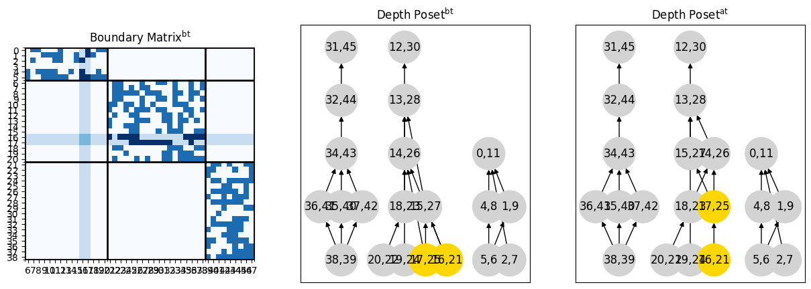

### Birth Death Pairs
|                          |                                                                                                                                                                                                               |
|:-------------------------|:--------------------------------------------------------------------------------------------------------------------------------------------------------------------------------------------------------------|
| Before the transposition | $\{(18, 23), (15, 27), (1, 9), (0, 11), (37, 42), (34, 43), (19, 24), (5, 6), (4, 8), (20, 22), (12, 30), (2, 7), (16, 21), (13, 28), (32, 44), (35, 40), (38, 39), (14, 26), (31, 45), (17, 25), (36, 41)\}$ |
| After the transposition  | $\{(18, 23), (15, 27), (1, 9), (0, 11), (37, 42), (34, 43), (19, 24), (5, 6), (4, 8), (20, 22), (12, 30), (2, 7), (16, 21), (13, 28), (32, 44), (35, 40), (38, 39), (14, 26), (31, 45), (17, 25), (36, 41)\}$ |

### Relations
|                          | Algorithm 1                                                                                                                                                                                                                                                                                                                                                                                                                                                                                                                           | Algorithm 2                                                                                                                                                                                                                                                                                                                                                  |
|:-------------------------|:--------------------------------------------------------------------------------------------------------------------------------------------------------------------------------------------------------------------------------------------------------------------------------------------------------------------------------------------------------------------------------------------------------------------------------------------------------------------------------------------------------------------------------------|:-------------------------------------------------------------------------------------------------------------------------------------------------------------------------------------------------------------------------------------------------------------------------------------------------------------------------------------------------------------|
| Before the transposition | $\{(25, 29), (42, 45), (41, 43), (43, 46), (41, 46), (26, 33), (23, 28), (22, 26), (39, 42), (40, 47), (39, 45), (9, 11), (28, 30), (27, 28), (28, 33), (45, 46), (6, 11), (25, 28), (42, 47), (42, 44), (43, 45), (21, 30), (39, 41), (21, 27), (21, 33), (22, 28), (39, 44), (9, 10), (40, 43), (23, 33), (39, 47), (28, 29), (27, 33), (6, 10), (41, 44), (25, 27), (41, 47), (25, 30), (42, 46), (26, 28), (43, 47), (44, 46), (21, 26), (21, 29), (23, 26), (39, 46), (40, 45), (39, 43), (27, 29), (7, 11), (6, 9), (25, 26)\}$ | $\{(32, 31), (4, 0), (38, 35), (5, 4), (14, 10), (17, 12), (31, 29), (17, 15), (34, 31), (36, 31), (16, 10), (16, 13), (18, 10), (35, 32), (18, 13), (20, 10), (14, 12), (34, 33), (37, 29), (36, 33), (15, 10), (32, 29), (35, 31), (20, 12), (20, 18), (38, 33), (38, 36), (17, 13), (2, 0), (19, 13), (34, 32), (37, 34), (16, 14), (15, 12), (18, 14)\}$ |
| After the transposition  | $\{(25, 29), (42, 45), (41, 43), (43, 46), (41, 46), (26, 33), (21, 28), (21, 25), (23, 28), (22, 26), (39, 42), (40, 47), (39, 45), (9, 11), (28, 30), (27, 28), (28, 33), (45, 46), (6, 11), (25, 28), (42, 47), (42, 44), (43, 45), (39, 41), (21, 33), (22, 28), (39, 44), (9, 10), (40, 43), (23, 33), (39, 47), (28, 29), (27, 33), (6, 10), (41, 44), (25, 27), (41, 47), (25, 30), (42, 46), (26, 28), (43, 47), (44, 46), (23, 26), (39, 46), (40, 45), (39, 43), (27, 29), (7, 11), (6, 9), (25, 26)\}$                     | $\{(32, 31), (4, 0), (38, 35), (5, 4), (14, 10), (31, 29), (17, 12), (17, 15), (34, 31), (36, 31), (16, 10), (16, 13), (18, 10), (35, 32), (18, 13), (20, 10), (14, 12), (34, 33), (37, 29), (36, 33), (15, 10), (32, 29), (35, 31), (20, 12), (20, 18), (38, 33), (38, 36), (17, 13), (2, 0), (19, 13), (34, 32), (37, 34), (16, 14), (15, 12), (18, 14)\}$ |

### Successors and Predecessers
No such node in the Depth Poset

### Temp Sets
|                                                               | Before the Transposition                                                              | After the Transposition                                                               |
|:--------------------------------------------------------------|:--------------------------------------------------------------------------------------|:--------------------------------------------------------------------------------------|
| $\mathcal{L} = \{(s, t)\in \text{BD}:\; f(t) < f(y)\}$        | $\{(19, 24), (18, 23), (2, 7), (16, 21), (5, 6), (4, 8), (20, 22), (1, 9), (0, 11)\}$ | $\{(19, 24), (18, 23), (2, 7), (16, 21), (5, 6), (4, 8), (20, 22), (1, 9), (0, 11)\}$ |
| $\mathcal{M} = \{(s, t)\in \text{BD}:\; f(y) < f(t) < f(b)\}$ | $\emptyset$                                                                           | $\emptyset$                                                                           |

### Equations
There are 2 equations are wrong.

| eq   | left (formula)                  | left (paramatrized)               | left (value)                                 | right (formula)                                                                        | right (paramatrized)                                                                         | right (value)            | correct   |
|:-----|:--------------------------------|:----------------------------------|:---------------------------------------------|:---------------------------------------------------------------------------------------|:---------------------------------------------------------------------------------------------|:-------------------------|:----------|
| Eq16 | $\text{Succ}_1^\text{at}(x, y)$ | $\text{Succ}_1^\text{at}(17, 25)$ | $\{(15, 27), (14, 26), (12, 30), (13, 28)\}$ | $\text{Succ}_1^\text{bt}(x, y) \oplus \{(a, b)\} \oplus \text{Succ}_1^\text{bt}(a, b)$ | $\text{Succ}_1^\text{bt}(17, 25) \oplus \{(16, 21)\} \oplus \text{Succ}_1^\text{bt}(16, 21)$ | $\{(16, 21), (13, 28)\}$ | ✘         |
| Eq17 | $\text{Pred}_1^\text{at}(a, b)$ | $\text{Pred}_1^\text{at}(16, 21)$ | $\emptyset$                                  | $\text{Pred}_1^\text{bt}(a, b) \oplus \{(x, y)\}$                                      | $\text{Pred}_1^\text{bt}(16, 21) \oplus \{(17, 25)\}$                                        | $\{(17, 25)\}$           | ✘         |

## Transposition <25, 26> in complex 16
Here is a __death-death__ __switch forward__ transposition <25, 26>.

$$
a = 14, \; b = 26, \; x = 17, \; y = 25
$$

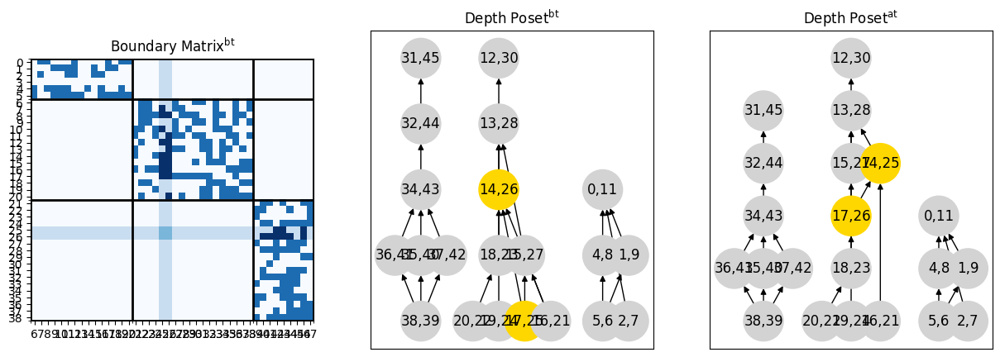

### Birth Death Pairs
|                          |                                                                                                                                                                                                               |
|:-------------------------|:--------------------------------------------------------------------------------------------------------------------------------------------------------------------------------------------------------------|
| Before the transposition | $\{(18, 23), (15, 27), (1, 9), (0, 11), (37, 42), (34, 43), (19, 24), (5, 6), (4, 8), (20, 22), (12, 30), (2, 7), (16, 21), (13, 28), (32, 44), (35, 40), (38, 39), (14, 26), (31, 45), (17, 25), (36, 41)\}$ |
| After the transposition  | $\{(18, 23), (15, 27), (14, 25), (1, 9), (0, 11), (37, 42), (34, 43), (19, 24), (5, 6), (4, 8), (20, 22), (12, 30), (17, 26), (2, 7), (16, 21), (13, 28), (32, 44), (35, 40), (38, 39), (31, 45), (36, 41)\}$ |

### Relations
|                          | Algorithm 1                                                                                                                                                                                                                                                                                                                                                                                                                                                                                                                           | Algorithm 2                                                                                                                                                                                                                                                                                                                                                            |
|:-------------------------|:--------------------------------------------------------------------------------------------------------------------------------------------------------------------------------------------------------------------------------------------------------------------------------------------------------------------------------------------------------------------------------------------------------------------------------------------------------------------------------------------------------------------------------------|:-----------------------------------------------------------------------------------------------------------------------------------------------------------------------------------------------------------------------------------------------------------------------------------------------------------------------------------------------------------------------|
| Before the transposition | $\{(25, 29), (42, 45), (41, 43), (43, 46), (41, 46), (26, 33), (23, 28), (22, 26), (39, 42), (40, 47), (39, 45), (9, 11), (28, 30), (27, 28), (28, 33), (45, 46), (6, 11), (25, 28), (42, 47), (42, 44), (43, 45), (21, 30), (39, 41), (21, 27), (21, 33), (22, 28), (39, 44), (9, 10), (40, 43), (23, 33), (39, 47), (28, 29), (27, 33), (6, 10), (41, 44), (25, 27), (41, 47), (25, 30), (42, 46), (26, 28), (43, 47), (44, 46), (21, 26), (21, 29), (23, 26), (39, 46), (40, 45), (39, 43), (27, 29), (7, 11), (6, 9), (25, 26)\}$ | $\{(32, 31), (4, 0), (38, 35), (5, 4), (14, 10), (17, 12), (31, 29), (17, 15), (34, 31), (36, 31), (16, 10), (16, 13), (18, 10), (35, 32), (18, 13), (20, 10), (14, 12), (34, 33), (37, 29), (36, 33), (15, 10), (32, 29), (35, 31), (20, 12), (20, 18), (38, 33), (38, 36), (17, 13), (2, 0), (19, 13), (34, 32), (37, 34), (16, 14), (15, 12), (18, 14)\}$           |
| After the transposition  | $\{(42, 45), (41, 43), (26, 30), (43, 46), (41, 46), (26, 27), (21, 28), (21, 25), (23, 28), (22, 26), (39, 42), (40, 47), (39, 45), (9, 11), (28, 30), (27, 28), (28, 33), (45, 46), (6, 11), (25, 28), (42, 47), (42, 44), (26, 29), (43, 45), (39, 41), (21, 33), (22, 28), (39, 44), (9, 10), (40, 43), (23, 33), (39, 47), (28, 29), (27, 33), (6, 10), (41, 44), (26, 25), (26, 28), (25, 30), (41, 47), (42, 46), (43, 47), (44, 46), (23, 26), (39, 46), (40, 45), (39, 43), (27, 29), (7, 11), (6, 9)\}$                     | $\{(32, 31), (4, 0), (38, 35), (5, 4), (14, 10), (31, 29), (17, 15), (34, 31), (36, 31), (16, 10), (16, 13), (18, 10), (35, 32), (18, 13), (20, 10), (14, 12), (17, 14), (34, 33), (37, 29), (36, 33), (15, 10), (32, 29), (35, 31), (20, 12), (20, 18), (38, 33), (38, 36), (17, 10), (17, 13), (2, 0), (19, 13), (34, 32), (37, 34), (16, 14), (15, 12), (18, 14)\}$ |

### Successors and Predecessers
|                 | $\text{Set}^\text{bt}(14, 26)$                                                 | $\text{Set}^\text{bt}(17, 25)$                                                 | $\text{Set}^\text{at}(17, 26)$                                                 | $\text{Set}^\text{at}(14, 25)$                                       |
|:----------------|:-------------------------------------------------------------------------------|:-------------------------------------------------------------------------------|:-------------------------------------------------------------------------------|:---------------------------------------------------------------------|
| $\text{Succ}_1$ | $\text{Succ}_1^\text{bt}(14, 26) = \{(13, 28)\}$                               | $\text{Succ}_1^\text{bt}(17, 25) = \{(15, 27), (14, 26), (12, 30), (13, 28)\}$ | $\text{Succ}_1^\text{at}(17, 26) = \{(15, 27), (14, 25), (13, 28), (12, 30)\}$ | $\text{Succ}_1^\text{at}(14, 25) = \{(13, 28), (12, 30)\}$           |
| $\text{Pred}_1$ | $\text{Pred}_1^\text{bt}(14, 26) = \{(20, 22), (18, 23), (16, 21), (17, 25)\}$ | $\text{Pred}_1^\text{bt}(17, 25) = \emptyset$                                  | $\text{Pred}_1^\text{at}(17, 26) = \{(20, 22), (18, 23)\}$                     | $\text{Pred}_1^\text{at}(14, 25) = \{(16, 21), (17, 26)\}$           |
| $\text{Succ}_2$ | $\text{Succ}_2^\text{bt}(14, 26) = \{(12, 30)\}$                               | $\text{Succ}_2^\text{bt}(17, 25) = \{(15, 27), (13, 28), (12, 30)\}$           | $\text{Succ}_2^\text{at}(17, 26) = \{(15, 27), (14, 25), (13, 28)\}$           | $\text{Succ}_2^\text{at}(14, 25) = \{(12, 30)\}$                     |
| $\text{Pred}_2$ | $\text{Pred}_2^\text{bt}(14, 26) = \{(18, 23), (16, 21)\}$                     | $\text{Pred}_2^\text{bt}(17, 25) = \emptyset$                                  | $\text{Pred}_2^\text{at}(17, 26) = \emptyset$                                  | $\text{Pred}_2^\text{at}(14, 25) = \{(18, 23), (16, 21), (17, 26)\}$ |

### Temp Sets
|                                                               | Before the Transposition                                                                                 | After the Transposition                                                                                  |
|:--------------------------------------------------------------|:---------------------------------------------------------------------------------------------------------|:---------------------------------------------------------------------------------------------------------|
| $\mathcal{B} = \{(s, t)\in \text{BD}:\; f(s) > f(x)\}$        | $\{(37, 42), (34, 43), (19, 24), (18, 23), (38, 39), (31, 45), (20, 22), (36, 41), (32, 44), (35, 40)\}$ | $\{(37, 42), (34, 43), (19, 24), (18, 23), (38, 39), (31, 45), (20, 22), (36, 41), (32, 44), (35, 40)\}$ |
| $\mathcal{N} = \{(s, t)\in \text{BD}:\; f(x) > f(s) > f(a)\}$ | $\{(15, 27), (16, 21)\}$                                                                                 | $\{(15, 27), (16, 21)\}$                                                                                 |

### Equations
There are 1 equations are wrong.

| eq   | left (formula)                  | left (paramatrized)               | left (value)                                 | right (formula)                                                                                          | right (paramatrized)                                                                                           | right (value)                                | correct   |
|:-----|:--------------------------------|:----------------------------------|:---------------------------------------------|:---------------------------------------------------------------------------------------------------------|:---------------------------------------------------------------------------------------------------------------|:---------------------------------------------|:----------|
| Eq28 | $\text{Succ}_1^\text{at}(x, b)$ | $\text{Succ}_1^\text{at}(17, 26)$ | $\{(15, 27), (14, 25), (13, 28), (12, 30)\}$ | $\text{Succ}_1^\text{bt}(x, y) \oplus \{(a, y), (a, b)\}$                                                | $\text{Succ}_1^\text{bt}(17, 25) \oplus \{(14, 25), (14, 26)\}$                                                | $\{(15, 27), (12, 30), (14, 25), (13, 28)\}$ | ✔         |
| Eq29 | $\text{Succ}_1^\text{at}(a, y)$ | $\text{Succ}_1^\text{at}(14, 25)$ | $\{(13, 28), (12, 30)\}$                     | $\text{Succ}_1^\text{bt}(a, b)$                                                                          | $\text{Succ}_1^\text{bt}(14, 26)$                                                                              | $\{(13, 28)\}$                               | ✘         |
| Eq30 | $\text{Pred}_1^\text{at}(x, b)$ | $\text{Pred}_1^\text{at}(17, 26)$ | $\{(20, 22), (18, 23)\}$                     | $[\text{Pred}_1^\text{bt}(a, b) \cap \mathcal{B}]$                                                       | $[\text{Pred}_1^\text{bt}(14, 26) \cap \mathcal{B}]$                                                           | $\{(20, 22), (18, 23)\}$                     | ✔         |
| Eq31 | $\text{Pred}_1^\text{at}(a, y)$ | $\text{Pred}_1^\text{at}(14, 25)$ | $\{(16, 21), (17, 26)\}$                     | $\text{Pred}_1^\text{bt}(x, y) \oplus \{(x, b)\} \oplus[\text{Pred}_1^\text{bt}(a, b) \cap \mathcal{N}]$ | $\text{Pred}_1^\text{bt}(17, 25) \oplus \{(17, 26)\} \oplus[\text{Pred}_1^\text{bt}(14, 26) \cap \mathcal{N}]$ | $\{(16, 21), (17, 26)\}$                     | ✔         |
| Eq32 | $\text{Succ}_2^\text{at}(x, b)$ | $\text{Succ}_2^\text{at}(17, 26)$ | $\{(15, 27), (14, 25), (13, 28)\}$           | $\text{Succ}_2^\text{bt}(x, y) \oplus \{(a, y)\} \oplus \text{Succ}_2^\text{bt}(a, b)$                   | $\text{Succ}_2^\text{bt}(17, 25) \oplus \{(14, 25)\} \oplus \text{Succ}_2^\text{bt}(14, 26)$                   | $\{(15, 27), (14, 25), (13, 28)\}$           | ✔         |
| Eq33 | $\text{Succ}_2^\text{at}(a, y)$ | $\text{Succ}_2^\text{at}(14, 25)$ | $\{(12, 30)\}$                               | $\text{Succ}_2^\text{bt}(a, b)$                                                                          | $\text{Succ}_2^\text{bt}(14, 26)$                                                                              | $\{(12, 30)\}$                               | ✔         |
| Eq34 | $\text{Pred}_2^\text{at}(x, b)$ | $\text{Pred}_2^\text{at}(17, 26)$ | $\emptyset$                                  | $\text{Pred}_2^\text{bt}(x, y)$                                                                          | $\text{Pred}_2^\text{bt}(17, 25)$                                                                              | $\emptyset$                                  | ✔         |
| Eq35 | $\text{Pred}_2^\text{at}(a, y)$ | $\text{Pred}_2^\text{at}(14, 25)$ | $\{(18, 23), (16, 21), (17, 26)\}$           | $\text{Pred}_2^\text{bt}(a, b) \oplus \{(x, b)\}$                                                        | $\text{Pred}_2^\text{bt}(14, 26) \oplus \{(17, 26)\}$                                                          | $\{(16, 21), (18, 23), (17, 26)\}$           | ✔         |

## Transposition <30, 31> in complex 16
Here is a __birth-death__ __switch forward__ transposition <30, 31>.

$$
a = 12, \; b = 30, \; x = 31, \; y = 45
$$

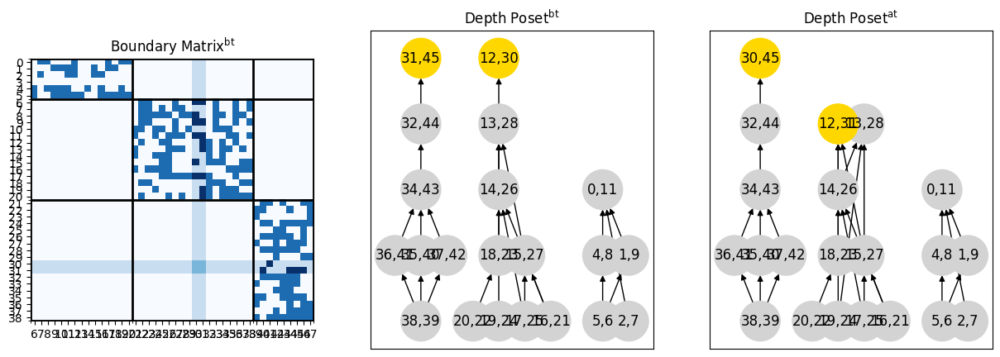

### Birth Death Pairs
|                          |                                                                                                                                                                                                               |
|:-------------------------|:--------------------------------------------------------------------------------------------------------------------------------------------------------------------------------------------------------------|
| Before the transposition | $\{(18, 23), (15, 27), (1, 9), (0, 11), (37, 42), (34, 43), (19, 24), (5, 6), (4, 8), (20, 22), (12, 30), (2, 7), (16, 21), (13, 28), (32, 44), (35, 40), (38, 39), (14, 26), (31, 45), (17, 25), (36, 41)\}$ |
| After the transposition  | $\{(18, 23), (15, 27), (12, 31), (1, 9), (0, 11), (37, 42), (34, 43), (19, 24), (30, 45), (5, 6), (4, 8), (20, 22), (2, 7), (16, 21), (13, 28), (32, 44), (35, 40), (38, 39), (14, 26), (17, 25), (36, 41)\}$ |

### Relations
|                          | Algorithm 1                                                                                                                                                                                                                                                                                                                                                                                                                                                                                                                                                                   | Algorithm 2                                                                                                                                                                                                                                                                                                                                                  |
|:-------------------------|:------------------------------------------------------------------------------------------------------------------------------------------------------------------------------------------------------------------------------------------------------------------------------------------------------------------------------------------------------------------------------------------------------------------------------------------------------------------------------------------------------------------------------------------------------------------------------|:-------------------------------------------------------------------------------------------------------------------------------------------------------------------------------------------------------------------------------------------------------------------------------------------------------------------------------------------------------------|
| Before the transposition | $\{(25, 29), (42, 45), (41, 43), (43, 46), (41, 46), (26, 33), (23, 28), (22, 26), (39, 42), (40, 47), (39, 45), (9, 11), (28, 30), (27, 28), (28, 33), (45, 46), (6, 11), (25, 28), (42, 47), (42, 44), (43, 45), (21, 30), (39, 41), (21, 27), (21, 33), (22, 28), (39, 44), (9, 10), (40, 43), (23, 33), (39, 47), (28, 29), (27, 33), (6, 10), (41, 44), (25, 27), (41, 47), (25, 30), (42, 46), (26, 28), (43, 47), (44, 46), (21, 26), (21, 29), (23, 26), (39, 46), (40, 45), (39, 43), (27, 29), (7, 11), (6, 9), (25, 26)\}$                                         | $\{(32, 31), (4, 0), (38, 35), (5, 4), (14, 10), (17, 12), (31, 29), (17, 15), (34, 31), (36, 31), (16, 10), (16, 13), (18, 10), (35, 32), (18, 13), (20, 10), (14, 12), (34, 33), (37, 29), (36, 33), (15, 10), (32, 29), (35, 31), (20, 12), (20, 18), (38, 33), (38, 36), (17, 13), (2, 0), (19, 13), (34, 32), (37, 34), (16, 14), (15, 12), (18, 14)\}$ |
| After the transposition  | $\{(25, 29), (42, 45), (41, 43), (43, 46), (41, 46), (26, 33), (21, 31), (23, 28), (22, 26), (39, 42), (23, 31), (40, 47), (39, 45), (9, 11), (27, 28), (28, 33), (27, 31), (45, 46), (6, 11), (25, 28), (25, 31), (42, 47), (42, 44), (43, 45), (39, 41), (21, 27), (21, 33), (22, 28), (39, 44), (9, 10), (40, 43), (23, 33), (39, 47), (22, 31), (28, 29), (27, 33), (6, 10), (41, 44), (25, 27), (24, 31), (41, 47), (26, 28), (42, 46), (26, 31), (43, 47), (44, 46), (21, 26), (21, 29), (23, 26), (39, 46), (40, 45), (39, 43), (27, 29), (7, 11), (6, 9), (25, 26)\}$ | $\{(4, 0), (38, 35), (5, 4), (14, 10), (17, 12), (17, 15), (37, 30), (16, 10), (32, 30), (16, 13), (18, 10), (35, 32), (18, 13), (20, 10), (14, 12), (34, 30), (34, 33), (36, 30), (37, 29), (36, 33), (30, 29), (15, 10), (32, 29), (20, 12), (20, 18), (38, 33), (38, 36), (17, 13), (2, 0), (19, 13), (34, 32), (37, 34), (16, 14), (15, 12), (18, 14)\}$ |

### Successors and Predecessers
|                 | $\text{Set}^\text{bt}(12, 30)$                                                 | $\text{Set}^\text{bt}(31, 45)$                                                 | $\text{Set}^\text{at}(12, 31)$                                                                               | $\text{Set}^\text{at}(30, 45)$                                                 |
|:----------------|:-------------------------------------------------------------------------------|:-------------------------------------------------------------------------------|:-------------------------------------------------------------------------------------------------------------|:-------------------------------------------------------------------------------|
| $\text{Succ}_1$ | $\text{Succ}_1^\text{bt}(12, 30) = \emptyset$                                  | $\text{Succ}_1^\text{bt}(31, 45) = \emptyset$                                  | $\text{Succ}_1^\text{at}(12, 31) = \emptyset$                                                                | $\text{Succ}_1^\text{at}(30, 45) = \emptyset$                                  |
| $\text{Pred}_1$ | $\text{Pred}_1^\text{bt}(12, 30) = \{(13, 28), (16, 21), (17, 25)\}$           | $\text{Pred}_1^\text{bt}(31, 45) = \{(37, 42), (34, 43), (38, 39), (35, 40)\}$ | $\text{Pred}_1^\text{at}(12, 31) = \{(19, 24), (18, 23), (15, 27), (14, 26), (16, 21), (17, 25), (20, 22)\}$ | $\text{Pred}_1^\text{at}(30, 45) = \{(37, 42), (34, 43), (38, 39), (35, 40)\}$ |
| $\text{Succ}_2$ | $\text{Succ}_2^\text{bt}(12, 30) = \emptyset$                                  | $\text{Succ}_2^\text{bt}(31, 45) = \emptyset$                                  | $\text{Succ}_2^\text{at}(12, 31) = \emptyset$                                                                | $\text{Succ}_2^\text{at}(30, 45) = \emptyset$                                  |
| $\text{Pred}_2$ | $\text{Pred}_2^\text{bt}(12, 30) = \{(20, 22), (15, 27), (14, 26), (17, 25)\}$ | $\text{Pred}_2^\text{bt}(31, 45) = \{(34, 43), (36, 41), (32, 44), (35, 40)\}$ | $\text{Pred}_2^\text{at}(12, 31) = \{(20, 22), (15, 27), (14, 26), (17, 25)\}$                               | $\text{Pred}_2^\text{at}(30, 45) = \{(37, 42), (36, 41), (32, 44), (34, 43)\}$ |

### Temp Sets
|                                                              | Before the Transposition                                                             | After the Transposition                                                              |
|:-------------------------------------------------------------|:-------------------------------------------------------------------------------------|:-------------------------------------------------------------------------------------|
| $A_1 = \{(s, t)\in \text{BD}:\; f(a) < f(s) < f(t) < f(x)\}$ | $\{(19, 24), (18, 23), (15, 27), (14, 26), (16, 21), (17, 25), (13, 28), (20, 22)\}$ | $\{(19, 24), (18, 23), (15, 27), (14, 26), (16, 21), (17, 25), (13, 28), (20, 22)\}$ |
| $B_1 = \{(s, t)\in \text{BD}:\; U_1[t, x] = 1\}$             | $\emptyset$                                                                          | $\{(19, 24), (18, 23), (15, 27), (14, 26), (16, 21), (17, 25), (20, 22)\}$           |
| $A_2 = \{(s, t)\in \text{BD}:\; f(b) < f(s) < f(t) < f(y)\}$ | $\{(37, 42), (34, 43), (38, 39), (36, 41), (32, 44), (35, 40)\}$                     | $\{(37, 42), (34, 43), (38, 39), (36, 41), (32, 44), (35, 40)\}$                     |
| $B_2 = \{(s, t)\in \text{BD}:\; U_2[b, s] = 1\}$             | $\emptyset$                                                                          | $\{(37, 42), (36, 41), (32, 44), (34, 43)\}$                                         |

### Equations
There are 4 equations are wrong.

| eq    | left (formula)                  | left (paramatrized)               | left (value)                                                               | right (formula)                                      | right (paramatrized)                                  | right (value)                                                              | correct   |
|:------|:--------------------------------|:----------------------------------|:---------------------------------------------------------------------------|:-----------------------------------------------------|:------------------------------------------------------|:---------------------------------------------------------------------------|:----------|
| Eq48  | $\text{Succ}_1^\text{at}(a, x)$ | $\text{Succ}_1^\text{at}(12, 31)$ | $\emptyset$                                                                | $\text{Succ}_1^\text{bt}(a, b)$                      | $\text{Succ}_1^\text{bt}(12, 30)$                     | $\emptyset$                                                                | ✔         |
| Eq49  | $\text{Succ}_1^\text{at}(b, y)$ | $\text{Succ}_1^\text{at}(30, 45)$ | $\emptyset$                                                                | $\text{Succ}_1^\text{bt}(x, y)$                      | $\text{Succ}_1^\text{bt}(31, 45)$                     | $\emptyset$                                                                | ✔         |
| Eq50  | $\text{Pred}_1^\text{at}(a, x)$ | $\text{Pred}_1^\text{at}(12, 31)$ | $\{(19, 24), (18, 23), (15, 27), (14, 26), (16, 21), (17, 25), (20, 22)\}$ | $\{(s, t)\in \text{BD}:\; U_1^\text{bt}[t, x] = 1\}$ | $\{(s, t)\in \text{BD}:\; U_1^\text{bt}[t, 31] = 1\}$ | $\emptyset$                                                                | ✘         |
| Eq50a | $\text{Pred}_1^\text{at}(a, x)$ | $\text{Pred}_1^\text{at}(12, 31)$ | $\{(19, 24), (18, 23), (15, 27), (14, 26), (16, 21), (17, 25), (20, 22)\}$ | $A_1^\text{bt} \cap B_1^\text{bt}$                   | $A_1^\text{bt} \cap B_1^\text{bt}$                    | $\emptyset$                                                                | ✘         |
| Eq50b | $\text{Pred}_1^\text{at}(a, x)$ | $\text{Pred}_1^\text{at}(12, 31)$ | $\{(19, 24), (18, 23), (15, 27), (14, 26), (16, 21), (17, 25), (20, 22)\}$ | $A_1^\text{bt} \cap B_1^\text{at}$                   | $A_1^\text{bt} \cap B_1^\text{at}$                    | $\{(19, 24), (18, 23), (15, 27), (14, 26), (16, 21), (17, 25), (20, 22)\}$ | ✔         |
| Eq51  | $\text{Pred}_1^\text{at}(b, y)$ | $\text{Pred}_1^\text{at}(30, 45)$ | $\{(37, 42), (34, 43), (38, 39), (35, 40)\}$                               | $\text{Pred}_1^\text{bt}(x, y)$                      | $\text{Pred}_1^\text{bt}(31, 45)$                     | $\{(37, 42), (34, 43), (38, 39), (35, 40)\}$                               | ✔         |
| Eq52  | $\text{Succ}_2^\text{at}(a, x)$ | $\text{Succ}_2^\text{at}(12, 31)$ | $\emptyset$                                                                | $\text{Succ}_2^\text{bt}(a, b)$                      | $\text{Succ}_2^\text{bt}(12, 30)$                     | $\emptyset$                                                                | ✔         |
| Eq53  | $\text{Succ}_2^\text{at}(b, y)$ | $\text{Succ}_2^\text{at}(30, 45)$ | $\emptyset$                                                                | $\text{Succ}_2^\text{bt}(x, y)$                      | $\text{Succ}_2^\text{bt}(31, 45)$                     | $\emptyset$                                                                | ✔         |
| Eq54  | $\text{Pred}_2^\text{at}(a, x)$ | $\text{Pred}_2^\text{at}(12, 31)$ | $\{(20, 22), (15, 27), (14, 26), (17, 25)\}$                               | $\text{Pred}_2^\text{bt}(a, b)$                      | $\text{Pred}_2^\text{bt}(12, 30)$                     | $\{(20, 22), (15, 27), (14, 26), (17, 25)\}$                               | ✔         |
| Eq55  | $\text{Pred}_2^\text{at}(b, y)$ | $\text{Pred}_2^\text{at}(30, 45)$ | $\{(37, 42), (36, 41), (32, 44), (34, 43)\}$                               | $\{(s, t)\in \text{BD}:\; U_2^\text{bt}[b, s] = 1\}$ | $\{(s, t)\in \text{BD}:\; U_2^\text{bt}[30, s] = 1\}$ | $\emptyset$                                                                | ✘         |
| Eq55a | $\text{Pred}_2^\text{at}(b, y)$ | $\text{Pred}_2^\text{at}(30, 45)$ | $\{(37, 42), (36, 41), (32, 44), (34, 43)\}$                               | $A_2^\text{bt} \cap B_2^\text{bt}$                   | $A_2^\text{bt} \cap B_2^\text{bt}$                    | $\emptyset$                                                                | ✘         |
| Eq55b | $\text{Pred}_2^\text{at}(b, y)$ | $\text{Pred}_2^\text{at}(30, 45)$ | $\{(37, 42), (36, 41), (32, 44), (34, 43)\}$                               | $A_2^\text{bt} \cap B_2^\text{at}$                   | $A_2^\text{bt} \cap B_2^\text{at}$                    | $\{(37, 42), (36, 41), (32, 44), (34, 43)\}$                               | ✔         |

## Transposition <35, 36> in complex 16
Here is a __birth-birth__ __no switch__ transposition <35, 36>.

$$
a = 35, \; b = 40, \; x = 36, \; y = 41
$$

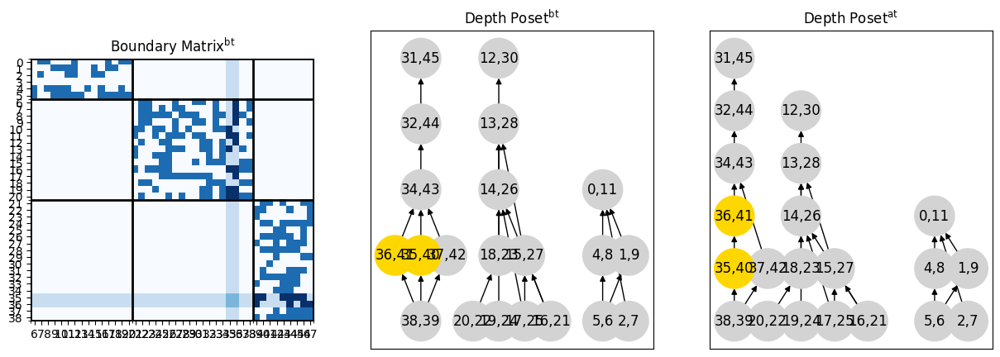

### Birth Death Pairs
|                          |                                                                                                                                                                                                               |
|:-------------------------|:--------------------------------------------------------------------------------------------------------------------------------------------------------------------------------------------------------------|
| Before the transposition | $\{(18, 23), (15, 27), (1, 9), (0, 11), (37, 42), (34, 43), (19, 24), (5, 6), (4, 8), (20, 22), (12, 30), (2, 7), (16, 21), (13, 28), (32, 44), (35, 40), (38, 39), (14, 26), (31, 45), (17, 25), (36, 41)\}$ |
| After the transposition  | $\{(18, 23), (15, 27), (1, 9), (0, 11), (37, 42), (34, 43), (19, 24), (5, 6), (4, 8), (20, 22), (12, 30), (2, 7), (16, 21), (13, 28), (32, 44), (35, 40), (38, 39), (14, 26), (31, 45), (17, 25), (36, 41)\}$ |

### Relations
|                          | Algorithm 1                                                                                                                                                                                                                                                                                                                                                                                                                                                                                                                                     | Algorithm 2                                                                                                                                                                                                                                                                                                                                                  |
|:-------------------------|:------------------------------------------------------------------------------------------------------------------------------------------------------------------------------------------------------------------------------------------------------------------------------------------------------------------------------------------------------------------------------------------------------------------------------------------------------------------------------------------------------------------------------------------------|:-------------------------------------------------------------------------------------------------------------------------------------------------------------------------------------------------------------------------------------------------------------------------------------------------------------------------------------------------------------|
| Before the transposition | $\{(25, 29), (42, 45), (41, 43), (43, 46), (41, 46), (26, 33), (23, 28), (22, 26), (39, 42), (40, 47), (39, 45), (9, 11), (28, 30), (27, 28), (28, 33), (45, 46), (6, 11), (25, 28), (42, 47), (42, 44), (43, 45), (21, 30), (39, 41), (21, 27), (21, 33), (22, 28), (39, 44), (9, 10), (40, 43), (23, 33), (39, 47), (28, 29), (27, 33), (6, 10), (41, 44), (25, 27), (41, 47), (25, 30), (42, 46), (26, 28), (43, 47), (44, 46), (21, 26), (21, 29), (23, 26), (39, 46), (40, 45), (39, 43), (27, 29), (7, 11), (6, 9), (25, 26)\}$           | $\{(32, 31), (4, 0), (38, 35), (5, 4), (14, 10), (17, 12), (31, 29), (17, 15), (34, 31), (36, 31), (16, 10), (16, 13), (18, 10), (35, 32), (18, 13), (20, 10), (14, 12), (34, 33), (37, 29), (36, 33), (15, 10), (32, 29), (35, 31), (20, 12), (20, 18), (38, 33), (38, 36), (17, 13), (2, 0), (19, 13), (34, 32), (37, 34), (16, 14), (15, 12), (18, 14)\}$ |
| After the transposition  | $\{(25, 29), (42, 45), (41, 43), (43, 46), (41, 46), (26, 33), (23, 28), (40, 44), (39, 42), (22, 26), (40, 41), (39, 45), (9, 11), (28, 30), (27, 28), (28, 33), (45, 46), (6, 11), (25, 28), (42, 47), (42, 44), (43, 45), (21, 30), (39, 41), (21, 27), (21, 33), (22, 28), (39, 44), (9, 10), (23, 33), (39, 47), (40, 46), (28, 29), (27, 33), (6, 10), (41, 44), (25, 27), (41, 47), (25, 30), (42, 46), (26, 28), (43, 47), (44, 46), (21, 26), (21, 29), (23, 26), (39, 46), (40, 45), (39, 43), (27, 29), (7, 11), (6, 9), (25, 26)\}$ | $\{(32, 31), (4, 0), (38, 35), (5, 4), (14, 10), (17, 12), (31, 29), (17, 15), (34, 31), (36, 31), (16, 10), (16, 13), (18, 10), (35, 32), (18, 13), (20, 10), (14, 12), (34, 33), (37, 29), (36, 33), (15, 10), (32, 29), (35, 31), (20, 12), (20, 18), (38, 33), (38, 36), (17, 13), (2, 0), (19, 13), (34, 32), (37, 34), (16, 14), (15, 12), (18, 14)\}$ |

### Successors and Predecessers
No such node in the Depth Poset

### Temp Sets
|                                                               | Before the Transposition                                                                                                                                    | After the Transposition                                                                                                                                     |
|:--------------------------------------------------------------|:------------------------------------------------------------------------------------------------------------------------------------------------------------|:------------------------------------------------------------------------------------------------------------------------------------------------------------|
| $\mathcal{L} = \{(s, t)\in \text{BD}:\; f(t) < f(y)\}$        | $\{(19, 24), (18, 23), (35, 40), (2, 7), (38, 39), (15, 27), (12, 30), (14, 26), (17, 25), (16, 21), (13, 28), (5, 6), (20, 22), (4, 8), (1, 9), (0, 11)\}$ | $\{(19, 24), (18, 23), (35, 40), (2, 7), (38, 39), (15, 27), (12, 30), (14, 26), (17, 25), (16, 21), (13, 28), (5, 6), (20, 22), (4, 8), (1, 9), (0, 11)\}$ |
| $\mathcal{M} = \{(s, t)\in \text{BD}:\; f(y) < f(t) < f(b)\}$ | $\emptyset$                                                                                                                                                 | $\emptyset$                                                                                                                                                 |

### Equations
There are 2 equations are wrong.

| eq   | left (formula)                  | left (paramatrized)               | left (value)             | right (formula)                                                                        | right (paramatrized)                                                                         | right (value)                      | correct   |
|:-----|:--------------------------------|:----------------------------------|:-------------------------|:---------------------------------------------------------------------------------------|:---------------------------------------------------------------------------------------------|:-----------------------------------|:----------|
| Eq16 | $\text{Succ}_1^\text{at}(x, y)$ | $\text{Succ}_1^\text{at}(36, 41)$ | $\{(34, 43), (32, 44)\}$ | $\text{Succ}_1^\text{bt}(x, y) \oplus \{(a, b)\} \oplus \text{Succ}_1^\text{bt}(a, b)$ | $\text{Succ}_1^\text{bt}(36, 41) \oplus \{(35, 40)\} \oplus \text{Succ}_1^\text{bt}(35, 40)$ | $\{(31, 45), (32, 44), (35, 40)\}$ | ✘         |
| Eq17 | $\text{Pred}_1^\text{at}(a, b)$ | $\text{Pred}_1^\text{at}(35, 40)$ | $\emptyset$              | $\text{Pred}_1^\text{bt}(a, b) \oplus \{(x, y)\}$                                      | $\text{Pred}_1^\text{bt}(35, 40) \oplus \{(36, 41)\}$                                        | $\{(36, 41)\}$                     | ✘         |

## Transposition <36, 37> in complex 16
Here is a __birth-birth__ __no switch__ transposition <36, 37>.

$$
a = 36, \; b = 41, \; x = 37, \; y = 42
$$

### Birth Death Pairs
|                          |                                                                                                                                                                                                               |
|:-------------------------|:--------------------------------------------------------------------------------------------------------------------------------------------------------------------------------------------------------------|
| Before the transposition | $\{(18, 23), (15, 27), (1, 9), (0, 11), (37, 42), (34, 43), (19, 24), (5, 6), (4, 8), (20, 22), (12, 30), (2, 7), (16, 21), (13, 28), (32, 44), (35, 40), (38, 39), (14, 26), (31, 45), (17, 25), (36, 41)\}$ |
| After the transposition  | $\{(18, 23), (15, 27), (1, 9), (0, 11), (37, 42), (34, 43), (19, 24), (5, 6), (4, 8), (20, 22), (12, 30), (2, 7), (16, 21), (13, 28), (32, 44), (35, 40), (38, 39), (14, 26), (31, 45), (17, 25), (36, 41)\}$ |

### Relations
|                          | Algorithm 1                                                                                                                                                                                                                                                                                                                                                                                                                                                                                                                           | Algorithm 2                                                                                                                                                                                                                                                                                                                                                  |
|:-------------------------|:--------------------------------------------------------------------------------------------------------------------------------------------------------------------------------------------------------------------------------------------------------------------------------------------------------------------------------------------------------------------------------------------------------------------------------------------------------------------------------------------------------------------------------------|:-------------------------------------------------------------------------------------------------------------------------------------------------------------------------------------------------------------------------------------------------------------------------------------------------------------------------------------------------------------|
| Before the transposition | $\{(25, 29), (42, 45), (41, 43), (43, 46), (41, 46), (26, 33), (23, 28), (22, 26), (39, 42), (40, 47), (39, 45), (9, 11), (28, 30), (27, 28), (28, 33), (45, 46), (6, 11), (25, 28), (42, 47), (42, 44), (43, 45), (21, 30), (39, 41), (21, 27), (21, 33), (22, 28), (39, 44), (9, 10), (40, 43), (23, 33), (39, 47), (28, 29), (27, 33), (6, 10), (41, 44), (25, 27), (41, 47), (25, 30), (42, 46), (26, 28), (43, 47), (44, 46), (21, 26), (21, 29), (23, 26), (39, 46), (40, 45), (39, 43), (27, 29), (7, 11), (6, 9), (25, 26)\}$ | $\{(32, 31), (4, 0), (38, 35), (5, 4), (14, 10), (17, 12), (31, 29), (17, 15), (34, 31), (36, 31), (16, 10), (16, 13), (18, 10), (35, 32), (18, 13), (20, 10), (14, 12), (34, 33), (37, 29), (36, 33), (15, 10), (32, 29), (35, 31), (20, 12), (20, 18), (38, 33), (38, 36), (17, 13), (2, 0), (19, 13), (34, 32), (37, 34), (16, 14), (15, 12), (18, 14)\}$ |
| After the transposition  | $\{(25, 29), (42, 45), (41, 43), (43, 46), (26, 33), (23, 28), (22, 26), (39, 42), (40, 47), (39, 45), (9, 11), (28, 30), (27, 28), (28, 33), (45, 46), (6, 11), (25, 28), (41, 42), (42, 47), (41, 45), (42, 44), (43, 45), (21, 30), (39, 41), (21, 27), (21, 33), (22, 28), (39, 44), (9, 10), (40, 43), (23, 33), (39, 47), (28, 29), (27, 33), (6, 10), (25, 27), (26, 28), (25, 30), (42, 46), (43, 47), (44, 46), (21, 26), (21, 29), (23, 26), (39, 46), (40, 45), (39, 43), (27, 29), (7, 11), (6, 9), (25, 26)\}$           | $\{(32, 31), (4, 0), (38, 35), (5, 4), (14, 10), (17, 12), (31, 29), (17, 15), (34, 31), (36, 31), (16, 10), (16, 13), (18, 10), (35, 32), (18, 13), (20, 10), (14, 12), (34, 33), (37, 29), (36, 33), (15, 10), (32, 29), (35, 31), (20, 12), (20, 18), (38, 33), (38, 36), (17, 13), (2, 0), (19, 13), (34, 32), (37, 34), (16, 14), (15, 12), (18, 14)\}$ |

### Successors and Predecessers
No such node in the Depth Poset

### Temp Sets
|                                                               | Before the Transposition                                                                                                                                              | After the Transposition                                                                                                                                               |
|:--------------------------------------------------------------|:----------------------------------------------------------------------------------------------------------------------------------------------------------------------|:----------------------------------------------------------------------------------------------------------------------------------------------------------------------|
| $\mathcal{L} = \{(s, t)\in \text{BD}:\; f(t) < f(y)\}$        | $\{(19, 24), (18, 23), (35, 40), (2, 7), (38, 39), (15, 27), (12, 30), (14, 26), (17, 25), (16, 21), (13, 28), (5, 6), (20, 22), (4, 8), (36, 41), (1, 9), (0, 11)\}$ | $\{(19, 24), (18, 23), (35, 40), (2, 7), (38, 39), (15, 27), (12, 30), (14, 26), (17, 25), (16, 21), (13, 28), (5, 6), (20, 22), (4, 8), (36, 41), (1, 9), (0, 11)\}$ |
| $\mathcal{M} = \{(s, t)\in \text{BD}:\; f(y) < f(t) < f(b)\}$ | $\emptyset$                                                                                                                                                           | $\emptyset$                                                                                                                                                           |

### Equations
There are 2 equations are wrong.

| eq   | left (formula)                  | left (paramatrized)               | left (value)             | right (formula)                                                                        | right (paramatrized)                                                                         | right (value)                      | correct   |
|:-----|:--------------------------------|:----------------------------------|:-------------------------|:---------------------------------------------------------------------------------------|:---------------------------------------------------------------------------------------------|:-----------------------------------|:----------|
| Eq16 | $\text{Succ}_1^\text{at}(x, y)$ | $\text{Succ}_1^\text{at}(37, 42)$ | $\{(31, 45), (32, 44)\}$ | $\text{Succ}_1^\text{bt}(x, y) \oplus \{(a, b)\} \oplus \text{Succ}_1^\text{bt}(a, b)$ | $\text{Succ}_1^\text{bt}(37, 42) \oplus \{(36, 41)\} \oplus \text{Succ}_1^\text{bt}(36, 41)$ | $\{(34, 43), (31, 45), (36, 41)\}$ | ✘         |
| Eq17 | $\text{Pred}_1^\text{at}(a, b)$ | $\text{Pred}_1^\text{at}(36, 41)$ | $\{(38, 39)\}$           | $\text{Pred}_1^\text{bt}(a, b) \oplus \{(x, y)\}$                                      | $\text{Pred}_1^\text{bt}(36, 41) \oplus \{(37, 42)\}$                                        | $\{(37, 42), (38, 39)\}$           | ✘         |

## Transposition <40, 41> in complex 16
Here is a __death-death__ __no switch__ transposition <40, 41>.

$$
a = 36, \; b = 41, \; x = 35, \; y = 40
$$

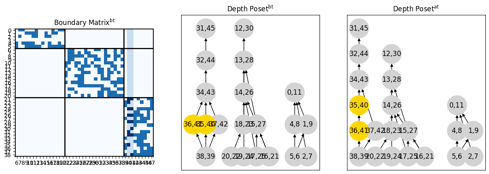

### Birth Death Pairs
|                          |                                                                                                                                                                                                               |
|:-------------------------|:--------------------------------------------------------------------------------------------------------------------------------------------------------------------------------------------------------------|
| Before the transposition | $\{(18, 23), (15, 27), (1, 9), (0, 11), (37, 42), (34, 43), (19, 24), (5, 6), (4, 8), (20, 22), (12, 30), (2, 7), (16, 21), (13, 28), (32, 44), (35, 40), (38, 39), (14, 26), (31, 45), (17, 25), (36, 41)\}$ |
| After the transposition  | $\{(18, 23), (15, 27), (1, 9), (0, 11), (37, 42), (34, 43), (19, 24), (5, 6), (4, 8), (20, 22), (12, 30), (2, 7), (16, 21), (13, 28), (32, 44), (35, 40), (38, 39), (14, 26), (31, 45), (17, 25), (36, 41)\}$ |

### Relations
|                          | Algorithm 1                                                                                                                                                                                                                                                                                                                                                                                                                                                                                                                           | Algorithm 2                                                                                                                                                                                                                                                                                                                                                            |
|:-------------------------|:--------------------------------------------------------------------------------------------------------------------------------------------------------------------------------------------------------------------------------------------------------------------------------------------------------------------------------------------------------------------------------------------------------------------------------------------------------------------------------------------------------------------------------------|:-----------------------------------------------------------------------------------------------------------------------------------------------------------------------------------------------------------------------------------------------------------------------------------------------------------------------------------------------------------------------|
| Before the transposition | $\{(25, 29), (42, 45), (41, 43), (43, 46), (41, 46), (26, 33), (23, 28), (22, 26), (39, 42), (40, 47), (39, 45), (9, 11), (28, 30), (27, 28), (28, 33), (45, 46), (6, 11), (25, 28), (42, 47), (42, 44), (43, 45), (21, 30), (39, 41), (21, 27), (21, 33), (22, 28), (39, 44), (9, 10), (40, 43), (23, 33), (39, 47), (28, 29), (27, 33), (6, 10), (41, 44), (25, 27), (41, 47), (25, 30), (42, 46), (26, 28), (43, 47), (44, 46), (21, 26), (21, 29), (23, 26), (39, 46), (40, 45), (39, 43), (27, 29), (7, 11), (6, 9), (25, 26)\}$ | $\{(32, 31), (4, 0), (38, 35), (5, 4), (14, 10), (17, 12), (31, 29), (17, 15), (34, 31), (36, 31), (16, 10), (16, 13), (18, 10), (35, 32), (18, 13), (20, 10), (14, 12), (34, 33), (37, 29), (36, 33), (15, 10), (32, 29), (35, 31), (20, 12), (20, 18), (38, 33), (38, 36), (17, 13), (2, 0), (19, 13), (34, 32), (37, 34), (16, 14), (15, 12), (18, 14)\}$           |
| After the transposition  | $\{(25, 29), (42, 45), (41, 43), (43, 46), (41, 46), (26, 33), (23, 28), (22, 26), (39, 42), (40, 47), (39, 45), (9, 11), (28, 30), (27, 28), (28, 33), (45, 46), (6, 11), (25, 28), (42, 47), (42, 44), (43, 45), (21, 30), (21, 27), (21, 33), (39, 41), (22, 28), (39, 44), (9, 10), (40, 43), (23, 33), (39, 47), (28, 29), (27, 33), (6, 10), (41, 44), (25, 27), (41, 47), (25, 30), (42, 46), (26, 28), (43, 47), (44, 46), (21, 26), (21, 29), (23, 26), (39, 46), (40, 45), (39, 43), (27, 29), (7, 11), (6, 9), (25, 26)\}$ | $\{(32, 31), (4, 0), (38, 35), (5, 4), (14, 10), (17, 12), (31, 29), (17, 15), (34, 31), (16, 10), (16, 13), (18, 10), (35, 32), (18, 13), (20, 10), (14, 12), (34, 33), (37, 29), (36, 33), (15, 10), (32, 29), (35, 31), (20, 12), (20, 18), (38, 33), (38, 36), (17, 13), (2, 0), (36, 32), (19, 13), (34, 32), (36, 35), (37, 34), (16, 14), (15, 12), (18, 14)\}$ |

### Successors and Predecessers
No such node in the Depth Poset

### Temp Sets
|                                                               | Before the Transposition           | After the Transposition            |
|:--------------------------------------------------------------|:-----------------------------------|:-----------------------------------|
| $\mathcal{B} = \{(s, t)\in \text{BD}:\; f(s) > f(x)\}$        | $\{(37, 42), (36, 41), (38, 39)\}$ | $\{(37, 42), (36, 41), (38, 39)\}$ |
| $\mathcal{N} = \{(s, t)\in \text{BD}:\; f(x) > f(s) > f(a)\}$ | $\emptyset$                        | $\emptyset$                        |

### Equations
There are 2 equations are wrong.

| eq   | left (formula)                  | left (paramatrized)               | left (value)             | right (formula)                                                                        | right (paramatrized)                                                                         | right (value)            | correct   |
|:-----|:--------------------------------|:----------------------------------|:-------------------------|:---------------------------------------------------------------------------------------|:---------------------------------------------------------------------------------------------|:-------------------------|:----------|
| Eq36 | $\text{Succ}_2^\text{at}(x, y)$ | $\text{Succ}_2^\text{at}(35, 40)$ | $\{(31, 45), (32, 44)\}$ | $\text{Succ}_2^\text{bt}(x, y) \oplus \{(a, b)\} \oplus \text{Succ}_2^\text{bt}(a, b)$ | $\text{Succ}_2^\text{bt}(35, 40) \oplus \{(36, 41)\} \oplus \text{Succ}_2^\text{bt}(36, 41)$ | $\{(36, 41), (32, 44)\}$ | ✘         |
| Eq37 | $\text{Pred}_2^\text{at}(a, b)$ | $\text{Pred}_2^\text{at}(36, 41)$ | $\{(38, 39)\}$           | $\text{Pred}_2^\text{bt}(a, b) \oplus \{(x, y)\}$                                      | $\text{Pred}_2^\text{bt}(36, 41) \oplus \{(35, 40)\}$                                        | $\{(35, 40), (38, 39)\}$ | ✘         |

## Transposition <41, 42> in complex 16
Here is a __death-death__ __no switch__ transposition <41, 42>.

$$
a = 37, \; b = 42, \; x = 36, \; y = 41
$$

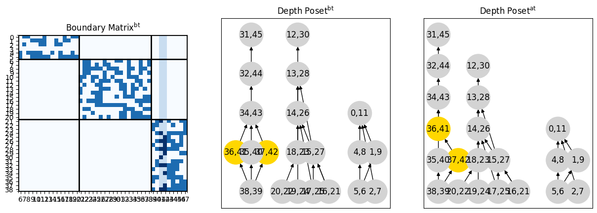

### Birth Death Pairs
|                          |                                                                                                                                                                                                               |
|:-------------------------|:--------------------------------------------------------------------------------------------------------------------------------------------------------------------------------------------------------------|
| Before the transposition | $\{(18, 23), (15, 27), (1, 9), (0, 11), (37, 42), (34, 43), (19, 24), (5, 6), (4, 8), (20, 22), (12, 30), (2, 7), (16, 21), (13, 28), (32, 44), (35, 40), (38, 39), (14, 26), (31, 45), (17, 25), (36, 41)\}$ |
| After the transposition  | $\{(18, 23), (15, 27), (1, 9), (0, 11), (37, 42), (34, 43), (19, 24), (5, 6), (4, 8), (20, 22), (12, 30), (2, 7), (16, 21), (13, 28), (32, 44), (35, 40), (38, 39), (14, 26), (31, 45), (17, 25), (36, 41)\}$ |

### Relations
|                          | Algorithm 1                                                                                                                                                                                                                                                                                                                                                                                                                                                                                                                           | Algorithm 2                                                                                                                                                                                                                                                                                                                                                                                |
|:-------------------------|:--------------------------------------------------------------------------------------------------------------------------------------------------------------------------------------------------------------------------------------------------------------------------------------------------------------------------------------------------------------------------------------------------------------------------------------------------------------------------------------------------------------------------------------|:-------------------------------------------------------------------------------------------------------------------------------------------------------------------------------------------------------------------------------------------------------------------------------------------------------------------------------------------------------------------------------------------|
| Before the transposition | $\{(25, 29), (42, 45), (41, 43), (43, 46), (41, 46), (26, 33), (23, 28), (22, 26), (39, 42), (40, 47), (39, 45), (9, 11), (28, 30), (27, 28), (28, 33), (45, 46), (6, 11), (25, 28), (42, 47), (42, 44), (43, 45), (21, 30), (39, 41), (21, 27), (21, 33), (22, 28), (39, 44), (9, 10), (40, 43), (23, 33), (39, 47), (28, 29), (27, 33), (6, 10), (41, 44), (25, 27), (41, 47), (25, 30), (42, 46), (26, 28), (43, 47), (44, 46), (21, 26), (21, 29), (23, 26), (39, 46), (40, 45), (39, 43), (27, 29), (7, 11), (6, 9), (25, 26)\}$ | $\{(32, 31), (4, 0), (38, 35), (5, 4), (14, 10), (17, 12), (31, 29), (17, 15), (34, 31), (36, 31), (16, 10), (16, 13), (18, 10), (35, 32), (18, 13), (20, 10), (14, 12), (34, 33), (37, 29), (36, 33), (15, 10), (32, 29), (35, 31), (20, 12), (20, 18), (38, 33), (38, 36), (17, 13), (2, 0), (19, 13), (34, 32), (37, 34), (16, 14), (15, 12), (18, 14)\}$                               |
| After the transposition  | $\{(25, 29), (42, 45), (41, 43), (43, 46), (41, 46), (26, 33), (23, 28), (22, 26), (39, 42), (40, 47), (39, 45), (9, 11), (28, 30), (27, 28), (28, 33), (45, 46), (6, 11), (25, 28), (42, 47), (42, 44), (43, 45), (21, 30), (39, 41), (21, 27), (21, 33), (22, 28), (39, 44), (9, 10), (40, 43), (23, 33), (39, 47), (28, 29), (27, 33), (6, 10), (41, 44), (25, 27), (41, 47), (25, 30), (42, 46), (26, 28), (43, 47), (44, 46), (21, 26), (21, 29), (23, 26), (39, 46), (40, 45), (39, 43), (27, 29), (7, 11), (6, 9), (25, 26)\}$ | $\{(32, 31), (4, 0), (38, 35), (5, 4), (14, 10), (17, 12), (31, 29), (17, 15), (34, 31), (37, 33), (36, 31), (37, 36), (16, 10), (16, 13), (18, 10), (35, 32), (18, 13), (20, 10), (14, 12), (34, 33), (37, 29), (36, 33), (15, 10), (32, 29), (35, 31), (20, 12), (20, 18), (38, 33), (38, 36), (17, 13), (2, 0), (19, 13), (37, 31), (34, 32), (37, 34), (16, 14), (15, 12), (18, 14)\}$ |

### Successors and Predecessers
No such node in the Depth Poset

### Temp Sets
|                                                               | Before the Transposition   | After the Transposition   |
|:--------------------------------------------------------------|:---------------------------|:--------------------------|
| $\mathcal{B} = \{(s, t)\in \text{BD}:\; f(s) > f(x)\}$        | $\{(37, 42), (38, 39)\}$   | $\{(37, 42), (38, 39)\}$  |
| $\mathcal{N} = \{(s, t)\in \text{BD}:\; f(x) > f(s) > f(a)\}$ | $\emptyset$                | $\emptyset$               |

### Equations
There are 2 equations are wrong.

| eq   | left (formula)                  | left (paramatrized)               | left (value)   | right (formula)                                                                        | right (paramatrized)                                                                         | right (value)                      | correct   |
|:-----|:--------------------------------|:----------------------------------|:---------------|:---------------------------------------------------------------------------------------|:---------------------------------------------------------------------------------------------|:-----------------------------------|:----------|
| Eq36 | $\text{Succ}_2^\text{at}(x, y)$ | $\text{Succ}_2^\text{at}(36, 41)$ | $\{(31, 45)\}$ | $\text{Succ}_2^\text{bt}(x, y) \oplus \{(a, b)\} \oplus \text{Succ}_2^\text{bt}(a, b)$ | $\text{Succ}_2^\text{bt}(36, 41) \oplus \{(37, 42)\} \oplus \text{Succ}_2^\text{bt}(37, 42)$ | $\{(34, 43), (31, 45), (37, 42)\}$ | ✘         |
| Eq37 | $\text{Pred}_2^\text{at}(a, b)$ | $\text{Pred}_2^\text{at}(37, 42)$ | $\emptyset$    | $\text{Pred}_2^\text{bt}(a, b) \oplus \{(x, y)\}$                                      | $\text{Pred}_2^\text{bt}(37, 42) \oplus \{(36, 41)\}$                                        | $\{(36, 41)\}$                     | ✘         |

## Transposition <6, 7> in complex 17
Here is a __death-death__ __switch forward__ transposition <6, 7>.

$$
a = 4, \; b = 7, \; x = 5, \; y = 6
$$

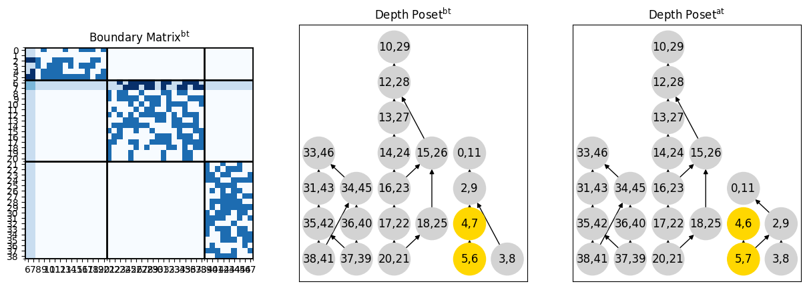

### Birth Death Pairs
|                          |                                                                                                                                                                                                               |
|:-------------------------|:--------------------------------------------------------------------------------------------------------------------------------------------------------------------------------------------------------------|
| Before the transposition | $\{(13, 27), (35, 42), (38, 41), (12, 28), (0, 11), (36, 40), (37, 39), (15, 26), (5, 6), (18, 25), (14, 24), (31, 43), (34, 45), (10, 29), (4, 7), (20, 21), (33, 46), (3, 8), (17, 22), (2, 9), (16, 23)\}$ |
| After the transposition  | $\{(13, 27), (35, 42), (4, 6), (5, 7), (38, 41), (12, 28), (0, 11), (36, 40), (37, 39), (15, 26), (18, 25), (14, 24), (31, 43), (34, 45), (10, 29), (20, 21), (33, 46), (3, 8), (17, 22), (2, 9), (16, 23)\}$ |

### Relations
|                          | Algorithm 1                                                                                                                                                                                                                                                                                                                                                                           | Algorithm 2                                                                                                                                                                                                                                                                                                                                                                                                  |
|:-------------------------|:--------------------------------------------------------------------------------------------------------------------------------------------------------------------------------------------------------------------------------------------------------------------------------------------------------------------------------------------------------------------------------------|:-------------------------------------------------------------------------------------------------------------------------------------------------------------------------------------------------------------------------------------------------------------------------------------------------------------------------------------------------------------------------------------------------------------|
| Before the transposition | $\{(24, 30), (24, 27), (41, 43), (25, 32), (21, 25), (22, 26), (39, 42), (22, 32), (22, 29), (9, 11), (28, 30), (27, 28), (6, 11), (25, 28), (41, 42), (42, 47), (26, 32), (42, 44), (8, 11), (39, 47), (40, 46), (7, 9), (6, 7), (41, 44), (42, 43), (26, 28), (6, 19), (42, 46), (43, 47), (23, 26), (39, 40), (22, 30), (23, 29), (39, 43), (27, 32), (7, 11), (6, 9), (25, 26)\}$ | $\{(35, 30), (35, 33), (12, 10), (20, 17), (38, 32), (14, 13), (37, 30), (37, 33), (36, 34), (18, 10), (35, 32), (33, 32), (20, 19), (38, 34), (17, 14), (34, 30), (34, 33), (36, 30), (36, 33), (37, 32), (13, 10), (16, 12), (15, 10), (16, 15), (18, 15), (35, 31), (3, 2), (20, 12), (20, 18), (20, 15), (5, 2), (15, 12), (17, 16), (2, 0), (37, 31), (37, 34), (13, 12), (16, 14), (33, 30)\}$         |
| After the transposition  | $\{(24, 30), (24, 27), (41, 43), (25, 32), (21, 25), (22, 26), (39, 42), (22, 32), (22, 29), (9, 11), (28, 30), (27, 28), (25, 28), (41, 42), (42, 47), (7, 19), (26, 32), (42, 44), (8, 11), (39, 47), (40, 46), (7, 9), (7, 6), (41, 44), (42, 43), (6, 19), (26, 28), (42, 46), (43, 47), (23, 26), (39, 40), (22, 30), (23, 29), (39, 43), (27, 32), (7, 11), (25, 26)\}$         | $\{(35, 30), (35, 33), (12, 10), (20, 17), (5, 4), (38, 32), (33, 30), (14, 13), (37, 30), (37, 33), (36, 34), (18, 10), (35, 32), (33, 32), (20, 19), (38, 34), (17, 14), (34, 30), (34, 33), (36, 30), (36, 33), (37, 32), (13, 10), (16, 12), (15, 10), (16, 15), (18, 15), (35, 31), (3, 2), (20, 12), (20, 18), (20, 15), (5, 2), (17, 16), (2, 0), (37, 31), (37, 34), (13, 12), (16, 14), (15, 12)\}$ |

### Successors and Predecessers
|                 | $\text{Set}^\text{bt}(4, 7)$                          | $\text{Set}^\text{bt}(5, 6)$                                  | $\text{Set}^\text{at}(5, 7)$                                  | $\text{Set}^\text{at}(4, 6)$                 |
|:----------------|:------------------------------------------------------|:--------------------------------------------------------------|:--------------------------------------------------------------|:---------------------------------------------|
| $\text{Succ}_1$ | $\text{Succ}_1^\text{bt}(4, 7) = \{(2, 9), (0, 11)\}$ | $\text{Succ}_1^\text{bt}(5, 6) = \{(2, 9), (4, 7), (0, 11)\}$ | $\text{Succ}_1^\text{at}(5, 7) = \{(2, 9), (4, 6), (0, 11)\}$ | $\text{Succ}_1^\text{at}(4, 6) = \emptyset$  |
| $\text{Pred}_1$ | $\text{Pred}_1^\text{bt}(4, 7) = \{(5, 6)\}$          | $\text{Pred}_1^\text{bt}(5, 6) = \emptyset$                   | $\text{Pred}_1^\text{at}(5, 7) = \emptyset$                   | $\text{Pred}_1^\text{at}(4, 6) = \{(5, 7)\}$ |
| $\text{Succ}_2$ | $\text{Succ}_2^\text{bt}(4, 7) = \emptyset$           | $\text{Succ}_2^\text{bt}(5, 6) = \{(2, 9)\}$                  | $\text{Succ}_2^\text{at}(5, 7) = \{(2, 9), (4, 6)\}$          | $\text{Succ}_2^\text{at}(4, 6) = \emptyset$  |
| $\text{Pred}_2$ | $\text{Pred}_2^\text{bt}(4, 7) = \emptyset$           | $\text{Pred}_2^\text{bt}(5, 6) = \emptyset$                   | $\text{Pred}_2^\text{at}(5, 7) = \emptyset$                   | $\text{Pred}_2^\text{at}(4, 6) = \{(5, 7)\}$ |

### Temp Sets
|                                                               | Before the Transposition                                                                                                                                             | After the Transposition                                                                                                                                              |
|:--------------------------------------------------------------|:---------------------------------------------------------------------------------------------------------------------------------------------------------------------|:---------------------------------------------------------------------------------------------------------------------------------------------------------------------|
| $\mathcal{B} = \{(s, t)\in \text{BD}:\; f(s) > f(x)\}$        | $\{(14, 24), (36, 40), (37, 39), (33, 46), (13, 27), (31, 43), (35, 42), (34, 45), (15, 26), (17, 22), (38, 41), (12, 28), (20, 21), (10, 29), (18, 25), (16, 23)\}$ | $\{(14, 24), (36, 40), (37, 39), (33, 46), (13, 27), (31, 43), (35, 42), (34, 45), (15, 26), (17, 22), (38, 41), (12, 28), (20, 21), (10, 29), (18, 25), (16, 23)\}$ |
| $\mathcal{N} = \{(s, t)\in \text{BD}:\; f(x) > f(s) > f(a)\}$ | $\emptyset$                                                                                                                                                          | $\emptyset$                                                                                                                                                          |

### Equations
There are 1 equations are wrong.

| eq   | left (formula)                  | left (paramatrized)             | left (value)                  | right (formula)                                                                                          | right (paramatrized)                                                                                     | right (value)                 | correct   |
|:-----|:--------------------------------|:--------------------------------|:------------------------------|:---------------------------------------------------------------------------------------------------------|:---------------------------------------------------------------------------------------------------------|:------------------------------|:----------|
| Eq28 | $\text{Succ}_1^\text{at}(x, b)$ | $\text{Succ}_1^\text{at}(5, 7)$ | $\{(2, 9), (4, 6), (0, 11)\}$ | $\text{Succ}_1^\text{bt}(x, y) \oplus \{(a, y), (a, b)\}$                                                | $\text{Succ}_1^\text{bt}(5, 6) \oplus \{(4, 6), (4, 7)\}$                                                | $\{(2, 9), (4, 6), (0, 11)\}$ | ✔         |
| Eq29 | $\text{Succ}_1^\text{at}(a, y)$ | $\text{Succ}_1^\text{at}(4, 6)$ | $\emptyset$                   | $\text{Succ}_1^\text{bt}(a, b)$                                                                          | $\text{Succ}_1^\text{bt}(4, 7)$                                                                          | $\{(2, 9), (0, 11)\}$         | ✘         |
| Eq30 | $\text{Pred}_1^\text{at}(x, b)$ | $\text{Pred}_1^\text{at}(5, 7)$ | $\emptyset$                   | $[\text{Pred}_1^\text{bt}(a, b) \cap \mathcal{B}]$                                                       | $[\text{Pred}_1^\text{bt}(4, 7) \cap \mathcal{B}]$                                                       | $\emptyset$                   | ✔         |
| Eq31 | $\text{Pred}_1^\text{at}(a, y)$ | $\text{Pred}_1^\text{at}(4, 6)$ | $\{(5, 7)\}$                  | $\text{Pred}_1^\text{bt}(x, y) \oplus \{(x, b)\} \oplus[\text{Pred}_1^\text{bt}(a, b) \cap \mathcal{N}]$ | $\text{Pred}_1^\text{bt}(5, 6) \oplus \{(5, 7)\} \oplus[\text{Pred}_1^\text{bt}(4, 7) \cap \mathcal{N}]$ | $\{(5, 7)\}$                  | ✔         |
| Eq32 | $\text{Succ}_2^\text{at}(x, b)$ | $\text{Succ}_2^\text{at}(5, 7)$ | $\{(2, 9), (4, 6)\}$          | $\text{Succ}_2^\text{bt}(x, y) \oplus \{(a, y)\} \oplus \text{Succ}_2^\text{bt}(a, b)$                   | $\text{Succ}_2^\text{bt}(5, 6) \oplus \{(4, 6)\} \oplus \text{Succ}_2^\text{bt}(4, 7)$                   | $\{(2, 9), (4, 6)\}$          | ✔         |
| Eq33 | $\text{Succ}_2^\text{at}(a, y)$ | $\text{Succ}_2^\text{at}(4, 6)$ | $\emptyset$                   | $\text{Succ}_2^\text{bt}(a, b)$                                                                          | $\text{Succ}_2^\text{bt}(4, 7)$                                                                          | $\emptyset$                   | ✔         |
| Eq34 | $\text{Pred}_2^\text{at}(x, b)$ | $\text{Pred}_2^\text{at}(5, 7)$ | $\emptyset$                   | $\text{Pred}_2^\text{bt}(x, y)$                                                                          | $\text{Pred}_2^\text{bt}(5, 6)$                                                                          | $\emptyset$                   | ✔         |
| Eq35 | $\text{Pred}_2^\text{at}(a, y)$ | $\text{Pred}_2^\text{at}(4, 6)$ | $\{(5, 7)\}$                  | $\text{Pred}_2^\text{bt}(a, b) \oplus \{(x, b)\}$                                                        | $\text{Pred}_2^\text{bt}(4, 7) \oplus \{(5, 7)\}$                                                        | $\{(5, 7)\}$                  | ✔         |

## Transposition <11, 12> in complex 17
Here is a __birth-death__ __switch forward__ transposition <11, 12>.

$$
a = 0, \; b = 11, \; x = 12, \; y = 28
$$

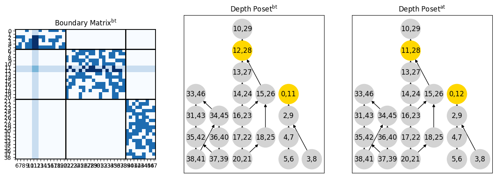

### Birth Death Pairs
|                          |                                                                                                                                                                                                               |
|:-------------------------|:--------------------------------------------------------------------------------------------------------------------------------------------------------------------------------------------------------------|
| Before the transposition | $\{(13, 27), (35, 42), (38, 41), (12, 28), (0, 11), (36, 40), (37, 39), (15, 26), (5, 6), (18, 25), (14, 24), (31, 43), (34, 45), (10, 29), (4, 7), (20, 21), (33, 46), (3, 8), (17, 22), (2, 9), (16, 23)\}$ |
| After the transposition  | $\{(13, 27), (35, 42), (38, 41), (36, 40), (37, 39), (15, 26), (5, 6), (18, 25), (14, 24), (31, 43), (34, 45), (11, 28), (10, 29), (4, 7), (20, 21), (33, 46), (3, 8), (17, 22), (2, 9), (0, 12), (16, 23)\}$ |

### Relations
|                          | Algorithm 1                                                                                                                                                                                                                                                                                                                                                                           | Algorithm 2                                                                                                                                                                                                                                                                                                                                                                                          |
|:-------------------------|:--------------------------------------------------------------------------------------------------------------------------------------------------------------------------------------------------------------------------------------------------------------------------------------------------------------------------------------------------------------------------------------|:-----------------------------------------------------------------------------------------------------------------------------------------------------------------------------------------------------------------------------------------------------------------------------------------------------------------------------------------------------------------------------------------------------|
| Before the transposition | $\{(24, 30), (24, 27), (41, 43), (25, 32), (21, 25), (22, 26), (39, 42), (22, 32), (22, 29), (9, 11), (28, 30), (27, 28), (6, 11), (25, 28), (41, 42), (42, 47), (26, 32), (42, 44), (8, 11), (39, 47), (40, 46), (7, 9), (6, 7), (41, 44), (42, 43), (26, 28), (6, 19), (42, 46), (43, 47), (23, 26), (39, 40), (22, 30), (23, 29), (39, 43), (27, 32), (7, 11), (6, 9), (25, 26)\}$ | $\{(35, 30), (35, 33), (12, 10), (20, 17), (38, 32), (14, 13), (37, 30), (37, 33), (36, 34), (18, 10), (35, 32), (33, 32), (20, 19), (38, 34), (17, 14), (34, 30), (34, 33), (36, 30), (36, 33), (37, 32), (13, 10), (16, 12), (15, 10), (16, 15), (18, 15), (35, 31), (3, 2), (20, 12), (20, 18), (20, 15), (5, 2), (15, 12), (17, 16), (2, 0), (37, 31), (37, 34), (13, 12), (16, 14), (33, 30)\}$ |
| After the transposition  | $\{(24, 30), (6, 12), (24, 27), (41, 43), (25, 32), (21, 25), (22, 26), (39, 42), (22, 32), (8, 12), (22, 29), (28, 30), (27, 28), (25, 28), (41, 42), (42, 47), (26, 32), (42, 44), (39, 47), (40, 46), (7, 9), (6, 7), (7, 12), (41, 44), (42, 43), (26, 28), (6, 19), (42, 46), (43, 47), (23, 26), (39, 40), (22, 30), (9, 12), (23, 29), (39, 43), (27, 32), (6, 9), (25, 26)\}$ | $\{(35, 30), (35, 33), (20, 17), (38, 32), (14, 13), (37, 30), (37, 33), (36, 34), (18, 10), (35, 32), (33, 32), (20, 19), (38, 34), (17, 11), (17, 14), (34, 30), (34, 33), (36, 30), (11, 10), (36, 33), (37, 32), (13, 10), (15, 10), (16, 15), (18, 15), (35, 31), (3, 2), (20, 18), (20, 15), (5, 2), (17, 16), (2, 0), (37, 31), (37, 34), (16, 14), (33, 30)\}$                               |

### Successors and Predecessers
|                 | $\text{Set}^\text{bt}(0, 11)$                                         | $\text{Set}^\text{bt}(12, 28)$                                                 | $\text{Set}^\text{at}(0, 12)$                                         | $\text{Set}^\text{at}(11, 28)$                                       |
|:----------------|:----------------------------------------------------------------------|:-------------------------------------------------------------------------------|:----------------------------------------------------------------------|:---------------------------------------------------------------------|
| $\text{Succ}_1$ | $\text{Succ}_1^\text{bt}(0, 11) = \emptyset$                          | $\text{Succ}_1^\text{bt}(12, 28) = \emptyset$                                  | $\text{Succ}_1^\text{at}(0, 12) = \emptyset$                          | $\text{Succ}_1^\text{at}(11, 28) = \emptyset$                        |
| $\text{Pred}_1$ | $\text{Pred}_1^\text{bt}(0, 11) = \{(2, 9), (3, 8), (5, 6), (4, 7)\}$ | $\text{Pred}_1^\text{bt}(12, 28) = \{(13, 27), (18, 25), (15, 26)\}$           | $\text{Pred}_1^\text{at}(0, 12) = \{(2, 9), (3, 8), (5, 6), (4, 7)\}$ | $\text{Pred}_1^\text{at}(11, 28) = \{(13, 27), (18, 25), (15, 26)\}$ |
| $\text{Succ}_2$ | $\text{Succ}_2^\text{bt}(0, 11) = \emptyset$                          | $\text{Succ}_2^\text{bt}(12, 28) = \{(10, 29)\}$                               | $\text{Succ}_2^\text{at}(0, 12) = \emptyset$                          | $\text{Succ}_2^\text{at}(11, 28) = \{(10, 29)\}$                     |
| $\text{Pred}_2$ | $\text{Pred}_2^\text{bt}(0, 11) = \{(2, 9)\}$                         | $\text{Pred}_2^\text{bt}(12, 28) = \{(20, 21), (16, 23), (13, 27), (15, 26)\}$ | $\text{Pred}_2^\text{at}(0, 12) = \{(2, 9)\}$                         | $\text{Pred}_2^\text{at}(11, 28) = \{(17, 22)\}$                     |

### Temp Sets
|                                                              | Before the Transposition                                                   | After the Transposition                                                    |
|:-------------------------------------------------------------|:---------------------------------------------------------------------------|:---------------------------------------------------------------------------|
| $A_1 = \{(s, t)\in \text{BD}:\; f(a) < f(s) < f(t) < f(x)\}$ | $\{(2, 9), (3, 8), (5, 6), (4, 7)\}$                                       | $\{(2, 9), (3, 8), (5, 6), (4, 7)\}$                                       |
| $B_1 = \{(s, t)\in \text{BD}:\; U_1[t, x] = 1\}$             | $\emptyset$                                                                | $\{(2, 9), (3, 8), (5, 6), (4, 7)\}$                                       |
| $A_2 = \{(s, t)\in \text{BD}:\; f(b) < f(s) < f(t) < f(y)\}$ | $\{(14, 24), (13, 27), (15, 26), (17, 22), (16, 23), (18, 25), (20, 21)\}$ | $\{(14, 24), (13, 27), (15, 26), (17, 22), (16, 23), (18, 25), (20, 21)\}$ |
| $B_2 = \{(s, t)\in \text{BD}:\; U_2[b, s] = 1\}$             | $\emptyset$                                                                | $\{(17, 22)\}$                                                             |

### Equations
There are 4 equations are wrong.

| eq    | left (formula)                  | left (paramatrized)               | left (value)                         | right (formula)                                      | right (paramatrized)                                  | right (value)                        | correct   |
|:------|:--------------------------------|:----------------------------------|:-------------------------------------|:-----------------------------------------------------|:------------------------------------------------------|:-------------------------------------|:----------|
| Eq48  | $\text{Succ}_1^\text{at}(a, x)$ | $\text{Succ}_1^\text{at}(0, 12)$  | $\emptyset$                          | $\text{Succ}_1^\text{bt}(a, b)$                      | $\text{Succ}_1^\text{bt}(0, 11)$                      | $\emptyset$                          | ✔         |
| Eq49  | $\text{Succ}_1^\text{at}(b, y)$ | $\text{Succ}_1^\text{at}(11, 28)$ | $\emptyset$                          | $\text{Succ}_1^\text{bt}(x, y)$                      | $\text{Succ}_1^\text{bt}(12, 28)$                     | $\emptyset$                          | ✔         |
| Eq50  | $\text{Pred}_1^\text{at}(a, x)$ | $\text{Pred}_1^\text{at}(0, 12)$  | $\{(2, 9), (3, 8), (5, 6), (4, 7)\}$ | $\{(s, t)\in \text{BD}:\; U_1^\text{bt}[t, x] = 1\}$ | $\{(s, t)\in \text{BD}:\; U_1^\text{bt}[t, 12] = 1\}$ | $\emptyset$                          | ✘         |
| Eq50a | $\text{Pred}_1^\text{at}(a, x)$ | $\text{Pred}_1^\text{at}(0, 12)$  | $\{(2, 9), (3, 8), (5, 6), (4, 7)\}$ | $A_1^\text{bt} \cap B_1^\text{bt}$                   | $A_1^\text{bt} \cap B_1^\text{bt}$                    | $\emptyset$                          | ✘         |
| Eq50b | $\text{Pred}_1^\text{at}(a, x)$ | $\text{Pred}_1^\text{at}(0, 12)$  | $\{(2, 9), (3, 8), (5, 6), (4, 7)\}$ | $A_1^\text{bt} \cap B_1^\text{at}$                   | $A_1^\text{bt} \cap B_1^\text{at}$                    | $\{(4, 7), (2, 9), (3, 8), (5, 6)\}$ | ✔         |
| Eq51  | $\text{Pred}_1^\text{at}(b, y)$ | $\text{Pred}_1^\text{at}(11, 28)$ | $\{(13, 27), (18, 25), (15, 26)\}$   | $\text{Pred}_1^\text{bt}(x, y)$                      | $\text{Pred}_1^\text{bt}(12, 28)$                     | $\{(13, 27), (18, 25), (15, 26)\}$   | ✔         |
| Eq52  | $\text{Succ}_2^\text{at}(a, x)$ | $\text{Succ}_2^\text{at}(0, 12)$  | $\emptyset$                          | $\text{Succ}_2^\text{bt}(a, b)$                      | $\text{Succ}_2^\text{bt}(0, 11)$                      | $\emptyset$                          | ✔         |
| Eq53  | $\text{Succ}_2^\text{at}(b, y)$ | $\text{Succ}_2^\text{at}(11, 28)$ | $\{(10, 29)\}$                       | $\text{Succ}_2^\text{bt}(x, y)$                      | $\text{Succ}_2^\text{bt}(12, 28)$                     | $\{(10, 29)\}$                       | ✔         |
| Eq54  | $\text{Pred}_2^\text{at}(a, x)$ | $\text{Pred}_2^\text{at}(0, 12)$  | $\{(2, 9)\}$                         | $\text{Pred}_2^\text{bt}(a, b)$                      | $\text{Pred}_2^\text{bt}(0, 11)$                      | $\{(2, 9)\}$                         | ✔         |
| Eq55  | $\text{Pred}_2^\text{at}(b, y)$ | $\text{Pred}_2^\text{at}(11, 28)$ | $\{(17, 22)\}$                       | $\{(s, t)\in \text{BD}:\; U_2^\text{bt}[b, s] = 1\}$ | $\{(s, t)\in \text{BD}:\; U_2^\text{bt}[11, s] = 1\}$ | $\emptyset$                          | ✘         |
| Eq55a | $\text{Pred}_2^\text{at}(b, y)$ | $\text{Pred}_2^\text{at}(11, 28)$ | $\{(17, 22)\}$                       | $A_2^\text{bt} \cap B_2^\text{bt}$                   | $A_2^\text{bt} \cap B_2^\text{bt}$                    | $\emptyset$                          | ✘         |
| Eq55b | $\text{Pred}_2^\text{at}(b, y)$ | $\text{Pred}_2^\text{at}(11, 28)$ | $\{(17, 22)\}$                       | $A_2^\text{bt} \cap B_2^\text{at}$                   | $A_2^\text{bt} \cap B_2^\text{at}$                    | $\{(17, 22)\}$                       | ✔         |

## Transposition <16, 17> in complex 17
Here is a __birth-birth__ __switch forward__ transposition <16, 17>.

$$
a = 16, \; b = 23, \; x = 17, \; y = 22
$$

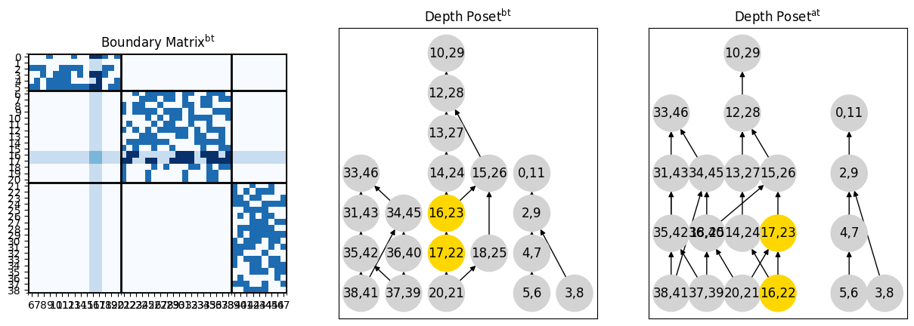

### Birth Death Pairs
|                          |                                                                                                                                                                                                               |
|:-------------------------|:--------------------------------------------------------------------------------------------------------------------------------------------------------------------------------------------------------------|
| Before the transposition | $\{(13, 27), (35, 42), (38, 41), (12, 28), (0, 11), (36, 40), (37, 39), (15, 26), (5, 6), (18, 25), (14, 24), (31, 43), (34, 45), (10, 29), (4, 7), (20, 21), (33, 46), (3, 8), (17, 22), (2, 9), (16, 23)\}$ |
| After the transposition  | $\{(13, 27), (35, 42), (38, 41), (12, 28), (0, 11), (36, 40), (37, 39), (16, 22), (15, 26), (5, 6), (18, 25), (14, 24), (17, 23), (31, 43), (34, 45), (10, 29), (4, 7), (20, 21), (33, 46), (3, 8), (2, 9)\}$ |

### Relations
|                          | Algorithm 1                                                                                                                                                                                                                                                                                                                                                                           | Algorithm 2                                                                                                                                                                                                                                                                                                                                                                                          |
|:-------------------------|:--------------------------------------------------------------------------------------------------------------------------------------------------------------------------------------------------------------------------------------------------------------------------------------------------------------------------------------------------------------------------------------|:-----------------------------------------------------------------------------------------------------------------------------------------------------------------------------------------------------------------------------------------------------------------------------------------------------------------------------------------------------------------------------------------------------|
| Before the transposition | $\{(24, 30), (24, 27), (41, 43), (25, 32), (21, 25), (22, 26), (39, 42), (22, 32), (22, 29), (9, 11), (28, 30), (27, 28), (6, 11), (25, 28), (41, 42), (42, 47), (26, 32), (42, 44), (8, 11), (39, 47), (40, 46), (7, 9), (6, 7), (41, 44), (42, 43), (26, 28), (6, 19), (42, 46), (43, 47), (23, 26), (39, 40), (22, 30), (23, 29), (39, 43), (27, 32), (7, 11), (6, 9), (25, 26)\}$ | $\{(35, 30), (35, 33), (12, 10), (20, 17), (38, 32), (14, 13), (37, 30), (37, 33), (36, 34), (18, 10), (35, 32), (33, 32), (20, 19), (38, 34), (17, 14), (34, 30), (34, 33), (36, 30), (36, 33), (37, 32), (13, 10), (16, 12), (15, 10), (16, 15), (18, 15), (35, 31), (3, 2), (20, 12), (20, 18), (20, 15), (5, 2), (15, 12), (17, 16), (2, 0), (37, 31), (37, 34), (13, 12), (16, 14), (33, 30)\}$ |
| After the transposition  | $\{(24, 30), (24, 27), (41, 43), (25, 32), (22, 23), (21, 25), (39, 42), (22, 32), (9, 11), (28, 30), (27, 28), (6, 11), (25, 28), (41, 42), (42, 47), (26, 32), (42, 44), (8, 11), (39, 47), (40, 46), (7, 9), (6, 7), (41, 44), (42, 43), (26, 28), (6, 19), (42, 46), (43, 47), (23, 26), (39, 40), (22, 30), (23, 29), (39, 43), (27, 32), (7, 11), (6, 9), (25, 26)\}$           | $\{(35, 30), (35, 33), (12, 10), (20, 17), (38, 32), (33, 30), (14, 13), (17, 12), (17, 15), (37, 30), (37, 33), (36, 34), (18, 10), (35, 32), (33, 32), (20, 19), (38, 34), (34, 30), (34, 33), (36, 30), (36, 33), (37, 32), (13, 10), (15, 10), (18, 15), (35, 31), (3, 2), (20, 12), (20, 18), (20, 15), (5, 2), (2, 0), (37, 31), (37, 34), (13, 12), (16, 14), (15, 12), (16, 17)\}$           |

### Successors and Predecessers
|                 | $\text{Set}^\text{bt}(16, 23)$                                       | $\text{Set}^\text{bt}(17, 22)$                             | $\text{Set}^\text{at}(16, 22)$                             | $\text{Set}^\text{at}(17, 23)$                             |
|:----------------|:---------------------------------------------------------------------|:-----------------------------------------------------------|:-----------------------------------------------------------|:-----------------------------------------------------------|
| $\text{Succ}_1$ | $\text{Succ}_1^\text{bt}(16, 23) = \{(10, 29), (15, 26)\}$           | $\text{Succ}_1^\text{bt}(17, 22) = \{(10, 29), (15, 26)\}$ | $\text{Succ}_1^\text{at}(16, 22) = \{(17, 23)\}$           | $\text{Succ}_1^\text{at}(17, 23) = \{(10, 29), (15, 26)\}$ |
| $\text{Pred}_1$ | $\text{Pred}_1^\text{bt}(16, 23) = \emptyset$                        | $\text{Pred}_1^\text{bt}(17, 22) = \emptyset$              | $\text{Pred}_1^\text{at}(16, 22) = \emptyset$              | $\text{Pred}_1^\text{at}(17, 23) = \{(16, 22)\}$           |
| $\text{Succ}_2$ | $\text{Succ}_2^\text{bt}(16, 23) = \{(14, 24), (12, 28), (15, 26)\}$ | $\text{Succ}_2^\text{bt}(17, 22) = \{(14, 24), (16, 23)\}$ | $\text{Succ}_2^\text{at}(16, 22) = \{(14, 24), (17, 23)\}$ | $\text{Succ}_2^\text{at}(17, 23) = \{(12, 28), (15, 26)\}$ |
| $\text{Pred}_2$ | $\text{Pred}_2^\text{bt}(16, 23) = \{(17, 22)\}$                     | $\text{Pred}_2^\text{bt}(17, 22) = \{(20, 21)\}$           | $\text{Pred}_2^\text{at}(16, 22) = \emptyset$              | $\text{Pred}_2^\text{at}(17, 23) = \{(16, 22), (20, 21)\}$ |

### Temp Sets
|                                                               | Before the Transposition                                | After the Transposition                                 |
|:--------------------------------------------------------------|:--------------------------------------------------------|:--------------------------------------------------------|
| $\mathcal{L} = \{(s, t)\in \text{BD}:\; f(t) < f(y)\}$        | $\{(3, 8), (2, 9), (5, 6), (4, 7), (0, 11), (20, 21)\}$ | $\{(3, 8), (2, 9), (5, 6), (4, 7), (0, 11), (20, 21)\}$ |
| $\mathcal{M} = \{(s, t)\in \text{BD}:\; f(y) < f(t) < f(b)\}$ | $\emptyset$                                             | $\emptyset$                                             |

### Equations
There are 1 equations are wrong.

| eq   | left (formula)                  | left (paramatrized)               | left (value)             | right (formula)                                                                                           | right (paramatrized)                                                                                            | right (value)                      | correct   |
|:-----|:--------------------------------|:----------------------------------|:-------------------------|:----------------------------------------------------------------------------------------------------------|:----------------------------------------------------------------------------------------------------------------|:-----------------------------------|:----------|
| Eq08 | $\text{Succ}_1^\text{at}(a, y)$ | $\text{Succ}_1^\text{at}(16, 22)$ | $\{(17, 23)\}$           | $\text{Succ}_1^\text{bt}(x, y) \oplus \{(x, b)\} \oplus \text{Succ}_1^\text{bt}(a, b)$                    | $\text{Succ}_1^\text{bt}(17, 22) \oplus \{(17, 23)\} \oplus \text{Succ}_1^\text{bt}(16, 23)$                    | $\{(17, 23)\}$                     | ✔         |
| Eq09 | $\text{Succ}_1^\text{at}(x, b)$ | $\text{Succ}_1^\text{at}(17, 23)$ | $\{(10, 29), (15, 26)\}$ | $\text{Succ}_1^\text{bt}(a, b)$                                                                           | $\text{Succ}_1^\text{bt}(16, 23)$                                                                               | $\{(10, 29), (15, 26)\}$           | ✔         |
| Eq10 | $\text{Pred}_1^\text{at}(a, y)$ | $\text{Pred}_1^\text{at}(16, 22)$ | $\emptyset$              | $\text{Pred}_1^\text{bt}(x, y)$                                                                           | $\text{Pred}_1^\text{bt}(17, 22)$                                                                               | $\emptyset$                        | ✔         |
| Eq11 | $\text{Pred}_1^\text{at}(x, b)$ | $\text{Pred}_1^\text{at}(17, 23)$ | $\{(16, 22)\}$           | $\text{Pred}_1^\text{bt}(a, b) \oplus \{(a, y)\}$                                                         | $\text{Pred}_1^\text{bt}(16, 23) \oplus \{(16, 22)\}$                                                           | $\{(16, 22)\}$                     | ✔         |
| Eq12 | $\text{Succ}_2^\text{at}(a, y)$ | $\text{Succ}_2^\text{at}(16, 22)$ | $\{(14, 24), (17, 23)\}$ | $\text{Succ}_2^\text{bt}(x, y) \oplus \{(x, b), (a, b)\}$                                                 | $\text{Succ}_2^\text{bt}(17, 22) \oplus \{(17, 23), (16, 23)\}$                                                 | $\{(14, 24), (17, 23)\}$           | ✔         |
| Eq13 | $\text{Succ}_2^\text{at}(x, b)$ | $\text{Succ}_2^\text{at}(17, 23)$ | $\{(12, 28), (15, 26)\}$ | $\text{Succ}_2^\text{bt}(a, b)$                                                                           | $\text{Succ}_2^\text{bt}(16, 23)$                                                                               | $\{(14, 24), (12, 28), (15, 26)\}$ | ✘         |
| Eq14 | $\text{Pred}_2^\text{at}(a, y)$ | $\text{Pred}_2^\text{at}(16, 22)$ | $\emptyset$              | $[\text{Pred}_2^\text{bt}(a, b) \cap \mathcal{L}]$                                                        | $[\text{Pred}_2^\text{bt}(16, 23) \cap \mathcal{L}]$                                                            | $\emptyset$                        | ✔         |
| Eq15 | $\text{Pred}_2^\text{at}(x, b)$ | $\text{Pred}_2^\text{at}(17, 23)$ | $\{(16, 22), (20, 21)\}$ | $\text{Pred}_2^\text{bt}(x, y) \oplus \{(a, y)\} \oplus [\text{Pred}_2^\text{bt}(a, b) \cap \mathcal{M}]$ | $\text{Pred}_2^\text{bt}(17, 22) \oplus \{(16, 22)\} \oplus [\text{Pred}_2^\text{bt}(16, 23) \cap \mathcal{M}]$ | $\{(16, 22), (20, 21)\}$           | ✔         |

## Transposition <24, 25> in complex 17
Here is a __death-death__ __no switch__ transposition <24, 25>.

$$
a = 18, \; b = 25, \; x = 14, \; y = 24
$$

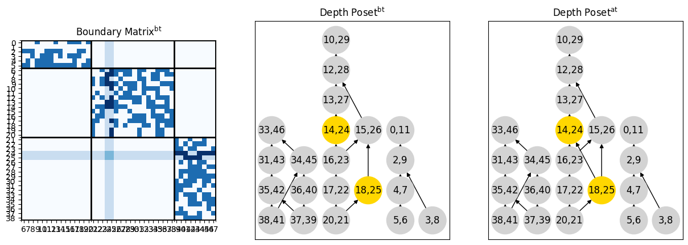

### Birth Death Pairs
|                          |                                                                                                                                                                                                               |
|:-------------------------|:--------------------------------------------------------------------------------------------------------------------------------------------------------------------------------------------------------------|
| Before the transposition | $\{(13, 27), (35, 42), (38, 41), (12, 28), (0, 11), (36, 40), (37, 39), (15, 26), (5, 6), (18, 25), (14, 24), (31, 43), (34, 45), (10, 29), (4, 7), (20, 21), (33, 46), (3, 8), (17, 22), (2, 9), (16, 23)\}$ |
| After the transposition  | $\{(13, 27), (35, 42), (38, 41), (12, 28), (0, 11), (36, 40), (37, 39), (15, 26), (5, 6), (18, 25), (14, 24), (31, 43), (34, 45), (10, 29), (4, 7), (20, 21), (33, 46), (3, 8), (17, 22), (2, 9), (16, 23)\}$ |

### Relations
|                          | Algorithm 1                                                                                                                                                                                                                                                                                                                                                                           | Algorithm 2                                                                                                                                                                                                                                                                                                                                                                                                              |
|:-------------------------|:--------------------------------------------------------------------------------------------------------------------------------------------------------------------------------------------------------------------------------------------------------------------------------------------------------------------------------------------------------------------------------------|:-------------------------------------------------------------------------------------------------------------------------------------------------------------------------------------------------------------------------------------------------------------------------------------------------------------------------------------------------------------------------------------------------------------------------|
| Before the transposition | $\{(24, 30), (24, 27), (41, 43), (25, 32), (21, 25), (22, 26), (39, 42), (22, 32), (22, 29), (9, 11), (28, 30), (27, 28), (6, 11), (25, 28), (41, 42), (42, 47), (26, 32), (42, 44), (8, 11), (39, 47), (40, 46), (7, 9), (6, 7), (41, 44), (42, 43), (26, 28), (6, 19), (42, 46), (43, 47), (23, 26), (39, 40), (22, 30), (23, 29), (39, 43), (27, 32), (7, 11), (6, 9), (25, 26)\}$ | $\{(35, 30), (35, 33), (12, 10), (20, 17), (38, 32), (14, 13), (37, 30), (37, 33), (36, 34), (18, 10), (35, 32), (33, 32), (20, 19), (38, 34), (17, 14), (34, 30), (34, 33), (36, 30), (36, 33), (37, 32), (13, 10), (16, 12), (15, 10), (16, 15), (18, 15), (35, 31), (3, 2), (20, 12), (20, 18), (20, 15), (5, 2), (15, 12), (17, 16), (2, 0), (37, 31), (37, 34), (13, 12), (16, 14), (33, 30)\}$                     |
| After the transposition  | $\{(24, 30), (24, 27), (41, 43), (25, 32), (21, 25), (22, 26), (22, 32), (39, 42), (22, 29), (9, 11), (28, 30), (27, 28), (6, 11), (25, 28), (41, 42), (42, 47), (26, 32), (42, 44), (8, 11), (39, 47), (40, 46), (7, 9), (6, 7), (41, 44), (42, 43), (26, 28), (6, 19), (42, 46), (43, 47), (23, 26), (39, 40), (22, 30), (23, 29), (39, 43), (27, 32), (7, 11), (6, 9), (25, 26)\}$ | $\{(35, 30), (35, 33), (12, 10), (20, 17), (38, 32), (33, 30), (14, 13), (37, 30), (37, 33), (36, 34), (18, 10), (35, 32), (18, 13), (33, 32), (20, 19), (38, 34), (17, 14), (34, 30), (34, 33), (36, 30), (36, 33), (37, 32), (13, 10), (16, 12), (15, 10), (16, 15), (18, 15), (35, 31), (3, 2), (20, 12), (20, 18), (20, 15), (5, 2), (17, 16), (2, 0), (37, 31), (37, 34), (13, 12), (16, 14), (15, 12), (18, 14)\}$ |

### Successors and Predecessers
No such node in the Depth Poset

### Temp Sets
|                                                               | Before the Transposition                                                                                                     | After the Transposition                                                                                                      |
|:--------------------------------------------------------------|:-----------------------------------------------------------------------------------------------------------------------------|:-----------------------------------------------------------------------------------------------------------------------------|
| $\mathcal{B} = \{(s, t)\in \text{BD}:\; f(s) > f(x)\}$        | $\{(36, 40), (33, 46), (37, 39), (31, 43), (35, 42), (34, 45), (15, 26), (17, 22), (38, 41), (20, 21), (18, 25), (16, 23)\}$ | $\{(36, 40), (33, 46), (37, 39), (31, 43), (35, 42), (34, 45), (15, 26), (17, 22), (38, 41), (20, 21), (18, 25), (16, 23)\}$ |
| $\mathcal{N} = \{(s, t)\in \text{BD}:\; f(x) > f(s) > f(a)\}$ | $\emptyset$                                                                                                                  | $\emptyset$                                                                                                                  |

### Equations
There are 2 equations are wrong.

| eq   | left (formula)                  | left (paramatrized)               | left (value)   | right (formula)                                                                        | right (paramatrized)                                                                         | right (value)                                | correct   |
|:-----|:--------------------------------|:----------------------------------|:---------------|:---------------------------------------------------------------------------------------|:---------------------------------------------------------------------------------------------|:---------------------------------------------|:----------|
| Eq36 | $\text{Succ}_2^\text{at}(x, y)$ | $\text{Succ}_2^\text{at}(14, 24)$ | $\{(13, 27)\}$ | $\text{Succ}_2^\text{bt}(x, y) \oplus \{(a, b)\} \oplus \text{Succ}_2^\text{bt}(a, b)$ | $\text{Succ}_2^\text{bt}(14, 24) \oplus \{(18, 25)\} \oplus \text{Succ}_2^\text{bt}(18, 25)$ | $\{(13, 27), (10, 29), (18, 25), (15, 26)\}$ | ✘         |
| Eq37 | $\text{Pred}_2^\text{at}(a, b)$ | $\text{Pred}_2^\text{at}(18, 25)$ | $\{(20, 21)\}$ | $\text{Pred}_2^\text{bt}(a, b) \oplus \{(x, y)\}$                                      | $\text{Pred}_2^\text{bt}(18, 25) \oplus \{(14, 24)\}$                                        | $\{(14, 24), (20, 21)\}$                     | ✘         |

## Transposition <37, 38> in complex 17
Here is a __birth-birth__ __no switch__ transposition <37, 38>.

$$
a = 37, \; b = 39, \; x = 38, \; y = 41
$$

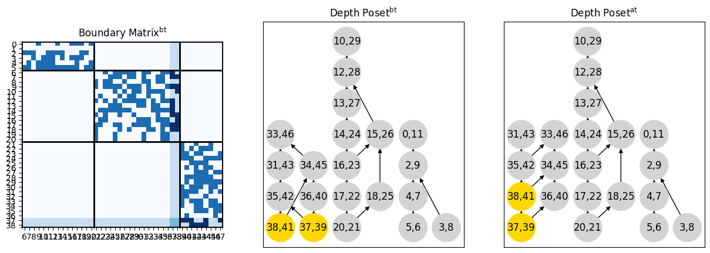

### Birth Death Pairs
|                          |                                                                                                                                                                                                               |
|:-------------------------|:--------------------------------------------------------------------------------------------------------------------------------------------------------------------------------------------------------------|
| Before the transposition | $\{(13, 27), (35, 42), (38, 41), (12, 28), (0, 11), (36, 40), (37, 39), (15, 26), (5, 6), (18, 25), (14, 24), (31, 43), (34, 45), (10, 29), (4, 7), (20, 21), (33, 46), (3, 8), (17, 22), (2, 9), (16, 23)\}$ |
| After the transposition  | $\{(13, 27), (35, 42), (38, 41), (12, 28), (0, 11), (36, 40), (37, 39), (15, 26), (5, 6), (18, 25), (14, 24), (31, 43), (34, 45), (10, 29), (4, 7), (20, 21), (33, 46), (3, 8), (17, 22), (2, 9), (16, 23)\}$ |

### Relations
|                          | Algorithm 1                                                                                                                                                                                                                                                                                                                                                                           | Algorithm 2                                                                                                                                                                                                                                                                                                                                                                                          |
|:-------------------------|:--------------------------------------------------------------------------------------------------------------------------------------------------------------------------------------------------------------------------------------------------------------------------------------------------------------------------------------------------------------------------------------|:-----------------------------------------------------------------------------------------------------------------------------------------------------------------------------------------------------------------------------------------------------------------------------------------------------------------------------------------------------------------------------------------------------|
| Before the transposition | $\{(24, 30), (24, 27), (41, 43), (25, 32), (21, 25), (22, 26), (39, 42), (22, 32), (22, 29), (9, 11), (28, 30), (27, 28), (6, 11), (25, 28), (41, 42), (42, 47), (26, 32), (42, 44), (8, 11), (39, 47), (40, 46), (7, 9), (6, 7), (41, 44), (42, 43), (26, 28), (6, 19), (42, 46), (43, 47), (23, 26), (39, 40), (22, 30), (23, 29), (39, 43), (27, 32), (7, 11), (6, 9), (25, 26)\}$ | $\{(35, 30), (35, 33), (12, 10), (20, 17), (38, 32), (14, 13), (37, 30), (37, 33), (36, 34), (18, 10), (35, 32), (33, 32), (20, 19), (38, 34), (17, 14), (34, 30), (34, 33), (36, 30), (36, 33), (37, 32), (13, 10), (16, 12), (15, 10), (16, 15), (18, 15), (35, 31), (3, 2), (20, 12), (20, 18), (20, 15), (5, 2), (15, 12), (17, 16), (2, 0), (37, 31), (37, 34), (13, 12), (16, 14), (33, 30)\}$ |
| After the transposition  | $\{(24, 30), (24, 27), (41, 43), (25, 32), (21, 25), (22, 26), (22, 32), (22, 29), (9, 11), (28, 30), (27, 28), (6, 11), (25, 28), (41, 42), (42, 47), (26, 32), (42, 44), (39, 41), (8, 11), (39, 44), (39, 47), (40, 46), (7, 9), (6, 7), (41, 44), (42, 43), (26, 28), (6, 19), (42, 46), (43, 47), (23, 26), (39, 40), (22, 30), (23, 29), (27, 32), (7, 11), (6, 9), (25, 26)\}$ | $\{(35, 30), (35, 33), (12, 10), (20, 17), (38, 32), (33, 30), (14, 13), (37, 30), (37, 33), (36, 34), (18, 10), (35, 32), (33, 32), (20, 19), (38, 34), (17, 14), (34, 30), (34, 33), (36, 30), (36, 33), (37, 32), (13, 10), (16, 12), (15, 10), (16, 15), (18, 15), (35, 31), (3, 2), (20, 12), (20, 18), (20, 15), (5, 2), (17, 16), (2, 0), (37, 31), (37, 34), (13, 12), (16, 14), (15, 12)\}$ |

### Successors and Predecessers
No such node in the Depth Poset

### Temp Sets
|                                                               | Before the Transposition                                                                                                                                    | After the Transposition                                                                                                                                     |
|:--------------------------------------------------------------|:------------------------------------------------------------------------------------------------------------------------------------------------------------|:------------------------------------------------------------------------------------------------------------------------------------------------------------|
| $\mathcal{L} = \{(s, t)\in \text{BD}:\; f(t) < f(y)\}$        | $\{(14, 24), (36, 40), (3, 8), (37, 39), (13, 27), (15, 26), (17, 22), (2, 9), (12, 28), (20, 21), (10, 29), (5, 6), (18, 25), (4, 7), (0, 11), (16, 23)\}$ | $\{(14, 24), (36, 40), (3, 8), (37, 39), (13, 27), (15, 26), (17, 22), (2, 9), (12, 28), (20, 21), (10, 29), (5, 6), (18, 25), (4, 7), (0, 11), (16, 23)\}$ |
| $\mathcal{M} = \{(s, t)\in \text{BD}:\; f(y) < f(t) < f(b)\}$ | $\emptyset$                                                                                                                                                 | $\emptyset$                                                                                                                                                 |

### Equations
There are 2 equations are wrong.

| eq   | left (formula)                  | left (paramatrized)               | left (value)             | right (formula)                                                                        | right (paramatrized)                                                                         | right (value)            | correct   |
|:-----|:--------------------------------|:----------------------------------|:-------------------------|:---------------------------------------------------------------------------------------|:---------------------------------------------------------------------------------------------|:-------------------------|:----------|
| Eq16 | $\text{Succ}_1^\text{at}(x, y)$ | $\text{Succ}_1^\text{at}(38, 41)$ | $\{(35, 42), (31, 43)\}$ | $\text{Succ}_1^\text{bt}(x, y) \oplus \{(a, b)\} \oplus \text{Succ}_1^\text{bt}(a, b)$ | $\text{Succ}_1^\text{bt}(38, 41) \oplus \{(37, 39)\} \oplus \text{Succ}_1^\text{bt}(37, 39)$ | $\{(36, 40), (37, 39)\}$ | ✘         |
| Eq17 | $\text{Pred}_1^\text{at}(a, b)$ | $\text{Pred}_1^\text{at}(37, 39)$ | $\emptyset$              | $\text{Pred}_1^\text{bt}(a, b) \oplus \{(x, y)\}$                                      | $\text{Pred}_1^\text{bt}(37, 39) \oplus \{(38, 41)\}$                                        | $\{(38, 41)\}$           | ✘         |

## Transposition <39, 40> in complex 17
Here is a __death-death__ __switch forward__ transposition <39, 40>.

$$
a = 36, \; b = 40, \; x = 37, \; y = 39
$$

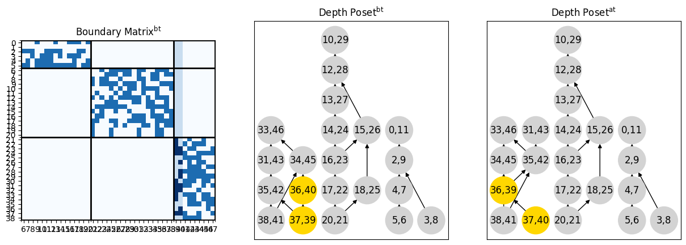

### Birth Death Pairs
|                          |                                                                                                                                                                                                               |
|:-------------------------|:--------------------------------------------------------------------------------------------------------------------------------------------------------------------------------------------------------------|
| Before the transposition | $\{(13, 27), (35, 42), (38, 41), (12, 28), (0, 11), (36, 40), (37, 39), (15, 26), (5, 6), (18, 25), (14, 24), (31, 43), (34, 45), (10, 29), (4, 7), (20, 21), (33, 46), (3, 8), (17, 22), (2, 9), (16, 23)\}$ |
| After the transposition  | $\{(13, 27), (35, 42), (38, 41), (12, 28), (0, 11), (15, 26), (5, 6), (18, 25), (14, 24), (31, 43), (36, 39), (34, 45), (10, 29), (4, 7), (20, 21), (33, 46), (3, 8), (17, 22), (2, 9), (37, 40), (16, 23)\}$ |

### Relations
|                          | Algorithm 1                                                                                                                                                                                                                                                                                                                                                                                                         | Algorithm 2                                                                                                                                                                                                                                                                                                                                                                                          |
|:-------------------------|:--------------------------------------------------------------------------------------------------------------------------------------------------------------------------------------------------------------------------------------------------------------------------------------------------------------------------------------------------------------------------------------------------------------------|:-----------------------------------------------------------------------------------------------------------------------------------------------------------------------------------------------------------------------------------------------------------------------------------------------------------------------------------------------------------------------------------------------------|
| Before the transposition | $\{(24, 30), (24, 27), (41, 43), (25, 32), (21, 25), (22, 26), (39, 42), (22, 32), (22, 29), (9, 11), (28, 30), (27, 28), (6, 11), (25, 28), (41, 42), (42, 47), (26, 32), (42, 44), (8, 11), (39, 47), (40, 46), (7, 9), (6, 7), (41, 44), (42, 43), (26, 28), (6, 19), (42, 46), (43, 47), (23, 26), (39, 40), (22, 30), (23, 29), (39, 43), (27, 32), (7, 11), (6, 9), (25, 26)\}$                               | $\{(35, 30), (35, 33), (12, 10), (20, 17), (38, 32), (14, 13), (37, 30), (37, 33), (36, 34), (18, 10), (35, 32), (33, 32), (20, 19), (38, 34), (17, 14), (34, 30), (34, 33), (36, 30), (36, 33), (37, 32), (13, 10), (16, 12), (15, 10), (16, 15), (18, 15), (35, 31), (3, 2), (20, 12), (20, 18), (20, 15), (5, 2), (15, 12), (17, 16), (2, 0), (37, 31), (37, 34), (13, 12), (16, 14), (33, 30)\}$ |
| After the transposition  | $\{(24, 30), (24, 27), (41, 43), (25, 32), (21, 25), (22, 26), (22, 32), (39, 42), (22, 29), (40, 47), (9, 11), (28, 30), (27, 28), (6, 11), (25, 28), (41, 42), (42, 47), (26, 32), (42, 44), (8, 11), (40, 43), (39, 47), (7, 9), (6, 7), (41, 44), (42, 43), (26, 28), (6, 19), (42, 46), (43, 47), (23, 26), (40, 42), (22, 30), (39, 46), (40, 39), (23, 29), (39, 43), (27, 32), (7, 11), (6, 9), (25, 26)\}$ | $\{(35, 30), (35, 33), (12, 10), (20, 17), (38, 32), (33, 30), (14, 13), (37, 36), (36, 34), (18, 10), (35, 32), (33, 32), (20, 19), (38, 34), (17, 14), (34, 30), (34, 33), (36, 30), (36, 33), (37, 32), (13, 10), (16, 12), (15, 10), (16, 15), (18, 15), (35, 31), (3, 2), (20, 12), (20, 18), (20, 15), (5, 2), (17, 16), (2, 0), (37, 31), (13, 12), (16, 14), (15, 12)\}$                     |

### Successors and Predecessers
|                 | $\text{Set}^\text{bt}(36, 40)$                             | $\text{Set}^\text{bt}(37, 39)$                                       | $\text{Set}^\text{at}(37, 40)$                                       | $\text{Set}^\text{at}(36, 39)$                                       |
|:----------------|:-----------------------------------------------------------|:---------------------------------------------------------------------|:---------------------------------------------------------------------|:---------------------------------------------------------------------|
| $\text{Succ}_1$ | $\text{Succ}_1^\text{bt}(36, 40) = \{(33, 46)\}$           | $\text{Succ}_1^\text{bt}(37, 39) = \{(35, 42), (36, 40), (31, 43)\}$ | $\text{Succ}_1^\text{at}(37, 40) = \{(36, 39), (35, 42), (31, 43)\}$ | $\text{Succ}_1^\text{at}(36, 39) = \{(35, 42), (33, 46), (31, 43)\}$ |
| $\text{Pred}_1$ | $\text{Pred}_1^\text{bt}(36, 40) = \{(37, 39)\}$           | $\text{Pred}_1^\text{bt}(37, 39) = \emptyset$                        | $\text{Pred}_1^\text{at}(37, 40) = \emptyset$                        | $\text{Pred}_1^\text{at}(36, 39) = \{(37, 40)\}$                     |
| $\text{Succ}_2$ | $\text{Succ}_2^\text{bt}(36, 40) = \{(33, 46), (34, 45)\}$ | $\text{Succ}_2^\text{bt}(37, 39) = \{(33, 46), (34, 45), (31, 43)\}$ | $\text{Succ}_2^\text{at}(37, 40) = \{(36, 39), (31, 43)\}$           | $\text{Succ}_2^\text{at}(36, 39) = \{(33, 46), (34, 45)\}$           |
| $\text{Pred}_2$ | $\text{Pred}_2^\text{bt}(36, 40) = \emptyset$              | $\text{Pred}_2^\text{bt}(37, 39) = \emptyset$                        | $\text{Pred}_2^\text{at}(37, 40) = \emptyset$                        | $\text{Pred}_2^\text{at}(36, 39) = \{(37, 40)\}$                     |

### Temp Sets
|                                                               | Before the Transposition   | After the Transposition   |
|:--------------------------------------------------------------|:---------------------------|:--------------------------|
| $\mathcal{B} = \{(s, t)\in \text{BD}:\; f(s) > f(x)\}$        | $\{(38, 41)\}$             | $\{(38, 41)\}$            |
| $\mathcal{N} = \{(s, t)\in \text{BD}:\; f(x) > f(s) > f(a)\}$ | $\emptyset$                | $\emptyset$               |

### Equations
There are 1 equations are wrong.

| eq   | left (formula)                  | left (paramatrized)               | left (value)                       | right (formula)                                                                                          | right (paramatrized)                                                                                           | right (value)                      | correct   |
|:-----|:--------------------------------|:----------------------------------|:-----------------------------------|:---------------------------------------------------------------------------------------------------------|:---------------------------------------------------------------------------------------------------------------|:-----------------------------------|:----------|
| Eq28 | $\text{Succ}_1^\text{at}(x, b)$ | $\text{Succ}_1^\text{at}(37, 40)$ | $\{(36, 39), (35, 42), (31, 43)\}$ | $\text{Succ}_1^\text{bt}(x, y) \oplus \{(a, y), (a, b)\}$                                                | $\text{Succ}_1^\text{bt}(37, 39) \oplus \{(36, 39), (36, 40)\}$                                                | $\{(36, 39), (35, 42), (31, 43)\}$ | ✔         |
| Eq29 | $\text{Succ}_1^\text{at}(a, y)$ | $\text{Succ}_1^\text{at}(36, 39)$ | $\{(35, 42), (33, 46), (31, 43)\}$ | $\text{Succ}_1^\text{bt}(a, b)$                                                                          | $\text{Succ}_1^\text{bt}(36, 40)$                                                                              | $\{(33, 46)\}$                     | ✘         |
| Eq30 | $\text{Pred}_1^\text{at}(x, b)$ | $\text{Pred}_1^\text{at}(37, 40)$ | $\emptyset$                        | $[\text{Pred}_1^\text{bt}(a, b) \cap \mathcal{B}]$                                                       | $[\text{Pred}_1^\text{bt}(36, 40) \cap \mathcal{B}]$                                                           | $\emptyset$                        | ✔         |
| Eq31 | $\text{Pred}_1^\text{at}(a, y)$ | $\text{Pred}_1^\text{at}(36, 39)$ | $\{(37, 40)\}$                     | $\text{Pred}_1^\text{bt}(x, y) \oplus \{(x, b)\} \oplus[\text{Pred}_1^\text{bt}(a, b) \cap \mathcal{N}]$ | $\text{Pred}_1^\text{bt}(37, 39) \oplus \{(37, 40)\} \oplus[\text{Pred}_1^\text{bt}(36, 40) \cap \mathcal{N}]$ | $\{(37, 40)\}$                     | ✔         |
| Eq32 | $\text{Succ}_2^\text{at}(x, b)$ | $\text{Succ}_2^\text{at}(37, 40)$ | $\{(36, 39), (31, 43)\}$           | $\text{Succ}_2^\text{bt}(x, y) \oplus \{(a, y)\} \oplus \text{Succ}_2^\text{bt}(a, b)$                   | $\text{Succ}_2^\text{bt}(37, 39) \oplus \{(36, 39)\} \oplus \text{Succ}_2^\text{bt}(36, 40)$                   | $\{(36, 39), (31, 43)\}$           | ✔         |
| Eq33 | $\text{Succ}_2^\text{at}(a, y)$ | $\text{Succ}_2^\text{at}(36, 39)$ | $\{(33, 46), (34, 45)\}$           | $\text{Succ}_2^\text{bt}(a, b)$                                                                          | $\text{Succ}_2^\text{bt}(36, 40)$                                                                              | $\{(33, 46), (34, 45)\}$           | ✔         |
| Eq34 | $\text{Pred}_2^\text{at}(x, b)$ | $\text{Pred}_2^\text{at}(37, 40)$ | $\emptyset$                        | $\text{Pred}_2^\text{bt}(x, y)$                                                                          | $\text{Pred}_2^\text{bt}(37, 39)$                                                                              | $\emptyset$                        | ✔         |
| Eq35 | $\text{Pred}_2^\text{at}(a, y)$ | $\text{Pred}_2^\text{at}(36, 39)$ | $\{(37, 40)\}$                     | $\text{Pred}_2^\text{bt}(a, b) \oplus \{(x, b)\}$                                                        | $\text{Pred}_2^\text{bt}(36, 40) \oplus \{(37, 40)\}$                                                          | $\{(37, 40)\}$                     | ✔         |

## Transposition <41, 42> in complex 17
Here is a __death-death__ __switch forward__ transposition <41, 42>.

$$
a = 35, \; b = 42, \; x = 38, \; y = 41
$$

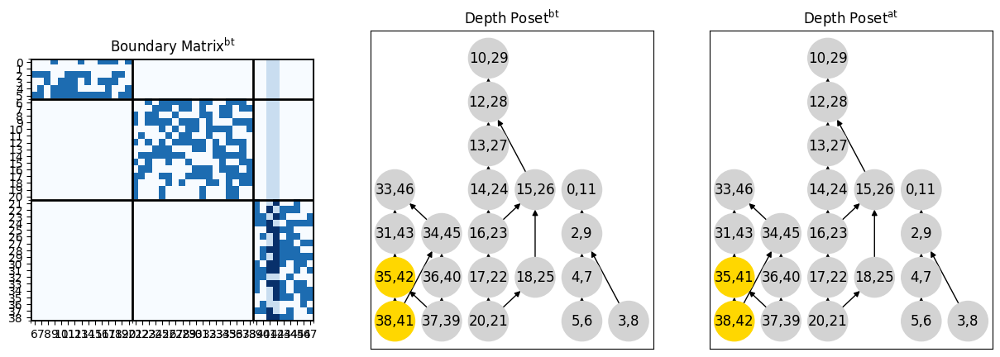

### Birth Death Pairs
|                          |                                                                                                                                                                                                               |
|:-------------------------|:--------------------------------------------------------------------------------------------------------------------------------------------------------------------------------------------------------------|
| Before the transposition | $\{(13, 27), (35, 42), (38, 41), (12, 28), (0, 11), (36, 40), (37, 39), (15, 26), (5, 6), (18, 25), (14, 24), (31, 43), (34, 45), (10, 29), (4, 7), (20, 21), (33, 46), (3, 8), (17, 22), (2, 9), (16, 23)\}$ |
| After the transposition  | $\{(13, 27), (12, 28), (0, 11), (36, 40), (37, 39), (15, 26), (5, 6), (18, 25), (35, 41), (14, 24), (31, 43), (34, 45), (10, 29), (4, 7), (20, 21), (33, 46), (3, 8), (38, 42), (17, 22), (2, 9), (16, 23)\}$ |

### Relations
|                          | Algorithm 1                                                                                                                                                                                                                                                                                                                                                                           | Algorithm 2                                                                                                                                                                                                                                                                                                                                                                                                                        |
|:-------------------------|:--------------------------------------------------------------------------------------------------------------------------------------------------------------------------------------------------------------------------------------------------------------------------------------------------------------------------------------------------------------------------------------|:-----------------------------------------------------------------------------------------------------------------------------------------------------------------------------------------------------------------------------------------------------------------------------------------------------------------------------------------------------------------------------------------------------------------------------------|
| Before the transposition | $\{(24, 30), (24, 27), (41, 43), (25, 32), (21, 25), (22, 26), (39, 42), (22, 32), (22, 29), (9, 11), (28, 30), (27, 28), (6, 11), (25, 28), (41, 42), (42, 47), (26, 32), (42, 44), (8, 11), (39, 47), (40, 46), (7, 9), (6, 7), (41, 44), (42, 43), (26, 28), (6, 19), (42, 46), (43, 47), (23, 26), (39, 40), (22, 30), (23, 29), (39, 43), (27, 32), (7, 11), (6, 9), (25, 26)\}$ | $\{(35, 30), (35, 33), (12, 10), (20, 17), (38, 32), (14, 13), (37, 30), (37, 33), (36, 34), (18, 10), (35, 32), (33, 32), (20, 19), (38, 34), (17, 14), (34, 30), (34, 33), (36, 30), (36, 33), (37, 32), (13, 10), (16, 12), (15, 10), (16, 15), (18, 15), (35, 31), (3, 2), (20, 12), (20, 18), (20, 15), (5, 2), (15, 12), (17, 16), (2, 0), (37, 31), (37, 34), (13, 12), (16, 14), (33, 30)\}$                               |
| After the transposition  | $\{(24, 30), (24, 27), (25, 32), (41, 46), (21, 25), (22, 26), (22, 32), (22, 29), (9, 11), (28, 30), (27, 28), (6, 11), (25, 28), (42, 41), (26, 32), (42, 44), (39, 41), (8, 11), (39, 44), (39, 47), (40, 46), (7, 9), (6, 7), (42, 43), (41, 47), (26, 28), (6, 19), (43, 47), (23, 26), (39, 40), (22, 30), (23, 29), (27, 32), (7, 11), (6, 9), (25, 26)\}$                     | $\{(35, 30), (35, 33), (12, 10), (20, 17), (38, 35), (33, 30), (14, 13), (37, 30), (37, 33), (36, 34), (18, 10), (35, 32), (33, 32), (38, 31), (20, 19), (38, 34), (17, 14), (34, 30), (34, 33), (36, 30), (36, 33), (37, 32), (13, 10), (16, 12), (15, 10), (16, 15), (18, 15), (35, 31), (3, 2), (20, 12), (20, 18), (38, 30), (20, 15), (5, 2), (38, 33), (17, 16), (2, 0), (37, 31), (37, 34), (13, 12), (16, 14), (15, 12)\}$ |

### Successors and Predecessers
|                 | $\text{Set}^\text{bt}(35, 42)$                             | $\text{Set}^\text{bt}(38, 41)$                             | $\text{Set}^\text{at}(38, 42)$                                                 | $\text{Set}^\text{at}(35, 41)$                             |
|:----------------|:-----------------------------------------------------------|:-----------------------------------------------------------|:-------------------------------------------------------------------------------|:-----------------------------------------------------------|
| $\text{Succ}_1$ | $\text{Succ}_1^\text{bt}(35, 42) = \{(33, 46), (31, 43)\}$ | $\text{Succ}_1^\text{bt}(38, 41) = \{(35, 42), (31, 43)\}$ | $\text{Succ}_1^\text{at}(38, 42) = \{(31, 43), (35, 41)\}$                     | $\text{Succ}_1^\text{at}(35, 41) = \{(33, 46)\}$           |
| $\text{Pred}_1$ | $\text{Pred}_1^\text{bt}(35, 42) = \{(38, 41), (37, 39)\}$ | $\text{Pred}_1^\text{bt}(38, 41) = \emptyset$              | $\text{Pred}_1^\text{at}(38, 42) = \emptyset$                                  | $\text{Pred}_1^\text{at}(35, 41) = \{(37, 39), (38, 42)\}$ |
| $\text{Succ}_2$ | $\text{Succ}_2^\text{bt}(35, 42) = \{(33, 46), (31, 43)\}$ | $\text{Succ}_2^\text{bt}(38, 41) = \{(34, 45)\}$           | $\text{Succ}_2^\text{at}(38, 42) = \{(33, 46), (34, 45), (31, 43), (35, 41)\}$ | $\text{Succ}_2^\text{at}(35, 41) = \{(33, 46), (31, 43)\}$ |
| $\text{Pred}_2$ | $\text{Pred}_2^\text{bt}(35, 42) = \emptyset$              | $\text{Pred}_2^\text{bt}(38, 41) = \emptyset$              | $\text{Pred}_2^\text{at}(38, 42) = \emptyset$                                  | $\text{Pred}_2^\text{at}(35, 41) = \{(38, 42)\}$           |

### Temp Sets
|                                                               | Before the Transposition   | After the Transposition   |
|:--------------------------------------------------------------|:---------------------------|:--------------------------|
| $\mathcal{B} = \{(s, t)\in \text{BD}:\; f(s) > f(x)\}$        | $\emptyset$                | $\emptyset$               |
| $\mathcal{N} = \{(s, t)\in \text{BD}:\; f(x) > f(s) > f(a)\}$ | $\{(36, 40), (37, 39)\}$   | $\{(36, 40), (37, 39)\}$  |

### Equations
There are 1 equations are wrong.

| eq   | left (formula)                  | left (paramatrized)               | left (value)                                 | right (formula)                                                                                          | right (paramatrized)                                                                                           | right (value)                                | correct   |
|:-----|:--------------------------------|:----------------------------------|:---------------------------------------------|:---------------------------------------------------------------------------------------------------------|:---------------------------------------------------------------------------------------------------------------|:---------------------------------------------|:----------|
| Eq28 | $\text{Succ}_1^\text{at}(x, b)$ | $\text{Succ}_1^\text{at}(38, 42)$ | $\{(31, 43), (35, 41)\}$                     | $\text{Succ}_1^\text{bt}(x, y) \oplus \{(a, y), (a, b)\}$                                                | $\text{Succ}_1^\text{bt}(38, 41) \oplus \{(35, 41), (35, 42)\}$                                                | $\{(31, 43), (35, 41)\}$                     | ✔         |
| Eq29 | $\text{Succ}_1^\text{at}(a, y)$ | $\text{Succ}_1^\text{at}(35, 41)$ | $\{(33, 46)\}$                               | $\text{Succ}_1^\text{bt}(a, b)$                                                                          | $\text{Succ}_1^\text{bt}(35, 42)$                                                                              | $\{(33, 46), (31, 43)\}$                     | ✘         |
| Eq30 | $\text{Pred}_1^\text{at}(x, b)$ | $\text{Pred}_1^\text{at}(38, 42)$ | $\emptyset$                                  | $[\text{Pred}_1^\text{bt}(a, b) \cap \mathcal{B}]$                                                       | $[\text{Pred}_1^\text{bt}(35, 42) \cap \mathcal{B}]$                                                           | $\emptyset$                                  | ✔         |
| Eq31 | $\text{Pred}_1^\text{at}(a, y)$ | $\text{Pred}_1^\text{at}(35, 41)$ | $\{(37, 39), (38, 42)\}$                     | $\text{Pred}_1^\text{bt}(x, y) \oplus \{(x, b)\} \oplus[\text{Pred}_1^\text{bt}(a, b) \cap \mathcal{N}]$ | $\text{Pred}_1^\text{bt}(38, 41) \oplus \{(38, 42)\} \oplus[\text{Pred}_1^\text{bt}(35, 42) \cap \mathcal{N}]$ | $\{(37, 39), (38, 42)\}$                     | ✔         |
| Eq32 | $\text{Succ}_2^\text{at}(x, b)$ | $\text{Succ}_2^\text{at}(38, 42)$ | $\{(33, 46), (34, 45), (31, 43), (35, 41)\}$ | $\text{Succ}_2^\text{bt}(x, y) \oplus \{(a, y)\} \oplus \text{Succ}_2^\text{bt}(a, b)$                   | $\text{Succ}_2^\text{bt}(38, 41) \oplus \{(35, 41)\} \oplus \text{Succ}_2^\text{bt}(35, 42)$                   | $\{(33, 46), (34, 45), (31, 43), (35, 41)\}$ | ✔         |
| Eq33 | $\text{Succ}_2^\text{at}(a, y)$ | $\text{Succ}_2^\text{at}(35, 41)$ | $\{(33, 46), (31, 43)\}$                     | $\text{Succ}_2^\text{bt}(a, b)$                                                                          | $\text{Succ}_2^\text{bt}(35, 42)$                                                                              | $\{(33, 46), (31, 43)\}$                     | ✔         |
| Eq34 | $\text{Pred}_2^\text{at}(x, b)$ | $\text{Pred}_2^\text{at}(38, 42)$ | $\emptyset$                                  | $\text{Pred}_2^\text{bt}(x, y)$                                                                          | $\text{Pred}_2^\text{bt}(38, 41)$                                                                              | $\emptyset$                                  | ✔         |
| Eq35 | $\text{Pred}_2^\text{at}(a, y)$ | $\text{Pred}_2^\text{at}(35, 41)$ | $\{(38, 42)\}$                               | $\text{Pred}_2^\text{bt}(a, b) \oplus \{(x, b)\}$                                                        | $\text{Pred}_2^\text{bt}(35, 42) \oplus \{(38, 42)\}$                                                          | $\{(38, 42)\}$                               | ✔         |

## Transposition <3, 4> in complex 18
Here is a __birth-birth__ __no switch__ transposition <3, 4>.

$$
a = 3, \; b = 6, \; x = 4, \; y = 8
$$

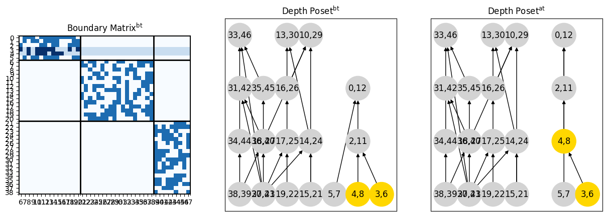

### Birth Death Pairs
|                          |                                                                                                                                                                                                                |
|:-------------------------|:---------------------------------------------------------------------------------------------------------------------------------------------------------------------------------------------------------------|
| Before the transposition | $\{(15, 21), (13, 30), (16, 26), (20, 23), (35, 45), (5, 7), (2, 11), (36, 40), (4, 8), (3, 6), (14, 24), (37, 41), (10, 29), (33, 46), (18, 27), (38, 39), (31, 42), (0, 12), (34, 44), (17, 25), (19, 22)\}$ |
| After the transposition  | $\{(15, 21), (13, 30), (16, 26), (20, 23), (35, 45), (5, 7), (2, 11), (36, 40), (4, 8), (3, 6), (14, 24), (37, 41), (10, 29), (33, 46), (18, 27), (38, 39), (31, 42), (0, 12), (34, 44), (17, 25), (19, 22)\}$ |

### Relations
|                          | Algorithm 1                                                                                                                                                                                                                                                                                                                                                                                                                               | Algorithm 2                                                                                                                                                                                                                                                                                                                                                                |
|:-------------------------|:------------------------------------------------------------------------------------------------------------------------------------------------------------------------------------------------------------------------------------------------------------------------------------------------------------------------------------------------------------------------------------------------------------------------------------------|:---------------------------------------------------------------------------------------------------------------------------------------------------------------------------------------------------------------------------------------------------------------------------------------------------------------------------------------------------------------------------|
| Before the transposition | $\{(24, 30), (25, 29), (41, 43), (26, 30), (25, 32), (21, 28), (29, 32), (22, 32), (23, 25), (8, 12), (27, 28), (45, 46), (41, 42), (42, 47), (26, 32), (24, 32), (44, 47), (26, 29), (21, 24), (21, 30), (22, 25), (23, 24), (22, 28), (39, 44), (23, 27), (40, 43), (8, 11), (39, 47), (40, 46), (7, 9), (7, 12), (24, 28), (23, 26), (40, 42), (23, 29), (11, 12), (27, 32), (45, 47), (27, 29), (25, 26)\}$                           | $\{(4, 0), (35, 33), (20, 14), (20, 17), (38, 35), (38, 32), (5, 1), (14, 13), (34, 28), (36, 28), (10, 9), (37, 33), (15, 14), (35, 32), (20, 13), (33, 32), (4, 2), (38, 28), (38, 31), (5, 0), (14, 9), (31, 28), (34, 33), (19, 17), (36, 33), (37, 32), (15, 10), (33, 28), (3, 2), (38, 33), (38, 36), (37, 28), (19, 16), (19, 13), (37, 31), (36, 35), (34, 32)\}$ |
| After the transposition  | $\{(24, 30), (6, 12), (25, 29), (41, 43), (26, 30), (25, 32), (21, 28), (29, 32), (22, 32), (23, 25), (8, 12), (27, 28), (45, 46), (6, 11), (6, 8), (41, 42), (42, 47), (26, 32), (24, 32), (44, 47), (26, 29), (21, 24), (21, 30), (22, 25), (23, 24), (22, 28), (39, 44), (23, 27), (40, 43), (8, 11), (39, 47), (40, 46), (7, 9), (7, 12), (24, 28), (23, 26), (40, 42), (23, 29), (11, 12), (27, 32), (45, 47), (27, 29), (25, 26)\}$ | $\{(4, 0), (35, 33), (20, 14), (20, 17), (38, 35), (38, 32), (5, 1), (14, 13), (34, 28), (10, 9), (36, 28), (37, 33), (15, 14), (35, 32), (20, 13), (33, 32), (4, 2), (38, 28), (38, 31), (5, 0), (14, 9), (31, 28), (34, 33), (19, 17), (36, 33), (37, 32), (15, 10), (33, 28), (3, 2), (38, 33), (38, 36), (37, 28), (19, 16), (19, 13), (37, 31), (36, 35), (34, 32)\}$ |

### Successors and Predecessers
No such node in the Depth Poset

### Temp Sets
|                                                               | Before the Transposition   | After the Transposition   |
|:--------------------------------------------------------------|:---------------------------|:--------------------------|
| $\mathcal{L} = \{(s, t)\in \text{BD}:\; f(t) < f(y)\}$        | $\{(5, 7), (3, 6)\}$       | $\{(5, 7), (3, 6)\}$      |
| $\mathcal{M} = \{(s, t)\in \text{BD}:\; f(y) < f(t) < f(b)\}$ | $\emptyset$                | $\emptyset$               |

### Equations
There are 2 equations are wrong.

| eq   | left (formula)                  | left (paramatrized)             | left (value)           | right (formula)                                                                        | right (paramatrized)                                                                   | right (value)                  | correct   |
|:-----|:--------------------------------|:--------------------------------|:-----------------------|:---------------------------------------------------------------------------------------|:---------------------------------------------------------------------------------------|:-------------------------------|:----------|
| Eq16 | $\text{Succ}_1^\text{at}(x, y)$ | $\text{Succ}_1^\text{at}(4, 8)$ | $\{(0, 12), (2, 11)\}$ | $\text{Succ}_1^\text{bt}(x, y) \oplus \{(a, b)\} \oplus \text{Succ}_1^\text{bt}(a, b)$ | $\text{Succ}_1^\text{bt}(4, 8) \oplus \{(3, 6)\} \oplus \text{Succ}_1^\text{bt}(3, 6)$ | $\{(0, 12), (2, 11), (3, 6)\}$ | ✘         |
| Eq17 | $\text{Pred}_1^\text{at}(a, b)$ | $\text{Pred}_1^\text{at}(3, 6)$ | $\emptyset$            | $\text{Pred}_1^\text{bt}(a, b) \oplus \{(x, y)\}$                                      | $\text{Pred}_1^\text{bt}(3, 6) \oplus \{(4, 8)\}$                                      | $\{(4, 8)\}$                   | ✘         |

## Transposition <19, 20> in complex 18
Here is a __birth-birth__ __no switch__ transposition <19, 20>.

$$
a = 19, \; b = 22, \; x = 20, \; y = 23
$$

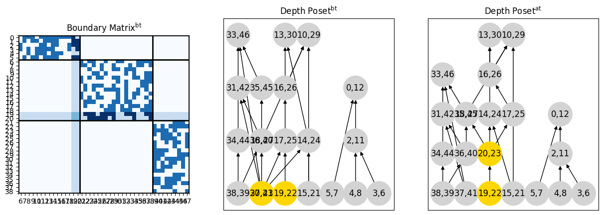

### Birth Death Pairs
|                          |                                                                                                                                                                                                                |
|:-------------------------|:---------------------------------------------------------------------------------------------------------------------------------------------------------------------------------------------------------------|
| Before the transposition | $\{(15, 21), (13, 30), (16, 26), (20, 23), (35, 45), (5, 7), (2, 11), (36, 40), (4, 8), (3, 6), (14, 24), (37, 41), (10, 29), (33, 46), (18, 27), (38, 39), (31, 42), (0, 12), (34, 44), (17, 25), (19, 22)\}$ |
| After the transposition  | $\{(15, 21), (13, 30), (16, 26), (20, 23), (35, 45), (5, 7), (2, 11), (36, 40), (4, 8), (3, 6), (14, 24), (37, 41), (10, 29), (33, 46), (18, 27), (38, 39), (31, 42), (0, 12), (34, 44), (17, 25), (19, 22)\}$ |

### Relations
|                          | Algorithm 1                                                                                                                                                                                                                                                                                                                                                                                                                                             | Algorithm 2                                                                                                                                                                                                                                                                                                                                                                |
|:-------------------------|:--------------------------------------------------------------------------------------------------------------------------------------------------------------------------------------------------------------------------------------------------------------------------------------------------------------------------------------------------------------------------------------------------------------------------------------------------------|:---------------------------------------------------------------------------------------------------------------------------------------------------------------------------------------------------------------------------------------------------------------------------------------------------------------------------------------------------------------------------|
| Before the transposition | $\{(24, 30), (25, 29), (41, 43), (26, 30), (25, 32), (21, 28), (29, 32), (22, 32), (23, 25), (8, 12), (27, 28), (45, 46), (41, 42), (42, 47), (26, 32), (24, 32), (44, 47), (26, 29), (21, 24), (21, 30), (22, 25), (23, 24), (22, 28), (39, 44), (23, 27), (40, 43), (8, 11), (39, 47), (40, 46), (7, 9), (7, 12), (24, 28), (23, 26), (40, 42), (23, 29), (11, 12), (27, 32), (45, 47), (27, 29), (25, 26)\}$                                         | $\{(4, 0), (35, 33), (20, 14), (20, 17), (38, 35), (38, 32), (5, 1), (14, 13), (34, 28), (36, 28), (10, 9), (37, 33), (15, 14), (35, 32), (20, 13), (33, 32), (4, 2), (38, 28), (38, 31), (5, 0), (14, 9), (31, 28), (34, 33), (19, 17), (36, 33), (37, 32), (15, 10), (33, 28), (3, 2), (38, 33), (38, 36), (37, 28), (19, 16), (19, 13), (37, 31), (36, 35), (34, 32)\}$ |
| After the transposition  | $\{(24, 30), (25, 29), (41, 43), (26, 30), (25, 32), (21, 28), (22, 23), (29, 32), (22, 26), (22, 32), (23, 25), (22, 29), (8, 12), (27, 28), (45, 46), (41, 42), (42, 47), (26, 32), (24, 32), (44, 47), (26, 29), (21, 24), (21, 30), (23, 24), (22, 28), (39, 44), (23, 27), (40, 43), (8, 11), (39, 47), (40, 46), (7, 9), (7, 12), (24, 28), (22, 27), (23, 26), (40, 42), (22, 24), (23, 29), (11, 12), (27, 32), (45, 47), (27, 29), (25, 26)\}$ | $\{(4, 0), (35, 33), (20, 14), (38, 35), (20, 17), (38, 32), (5, 1), (14, 13), (34, 28), (10, 9), (36, 28), (37, 33), (15, 14), (35, 32), (20, 13), (33, 32), (4, 2), (38, 28), (38, 31), (5, 0), (14, 9), (31, 28), (34, 33), (19, 17), (36, 33), (37, 32), (15, 10), (33, 28), (3, 2), (38, 33), (38, 36), (37, 28), (19, 16), (19, 13), (37, 31), (36, 35), (34, 32)\}$ |

### Successors and Predecessers
No such node in the Depth Poset

### Temp Sets
|                                                               | Before the Transposition                                           | After the Transposition                                            |
|:--------------------------------------------------------------|:-------------------------------------------------------------------|:-------------------------------------------------------------------|
| $\mathcal{L} = \{(s, t)\in \text{BD}:\; f(t) < f(y)\}$        | $\{(15, 21), (5, 7), (0, 12), (19, 22), (4, 8), (3, 6), (2, 11)\}$ | $\{(15, 21), (5, 7), (0, 12), (19, 22), (4, 8), (3, 6), (2, 11)\}$ |
| $\mathcal{M} = \{(s, t)\in \text{BD}:\; f(y) < f(t) < f(b)\}$ | $\emptyset$                                                        | $\emptyset$                                                        |

### Equations
There are 2 equations are wrong.

| eq   | left (formula)                  | left (paramatrized)               | left (value)                                           | right (formula)                                                                        | right (paramatrized)                                                                         | right (value)                                          | correct   |
|:-----|:--------------------------------|:----------------------------------|:-------------------------------------------------------|:---------------------------------------------------------------------------------------|:---------------------------------------------------------------------------------------------|:-------------------------------------------------------|:----------|
| Eq16 | $\text{Succ}_1^\text{at}(x, y)$ | $\text{Succ}_1^\text{at}(20, 23)$ | $\{(14, 24), (18, 27), (16, 26), (17, 25), (10, 29)\}$ | $\text{Succ}_1^\text{bt}(x, y) \oplus \{(a, b)\} \oplus \text{Succ}_1^\text{bt}(a, b)$ | $\text{Succ}_1^\text{bt}(20, 23) \oplus \{(19, 22)\} \oplus \text{Succ}_1^\text{bt}(19, 22)$ | $\{(14, 24), (18, 27), (16, 26), (10, 29), (19, 22)\}$ | ✘         |
| Eq17 | $\text{Pred}_1^\text{at}(a, b)$ | $\text{Pred}_1^\text{at}(19, 22)$ | $\emptyset$                                            | $\text{Pred}_1^\text{bt}(a, b) \oplus \{(x, y)\}$                                      | $\text{Pred}_1^\text{bt}(19, 22) \oplus \{(20, 23)\}$                                        | $\{(20, 23)\}$                                         | ✘         |

## Transposition <22, 23> in complex 18
Here is a __death-death__ __no switch__ transposition <22, 23>.

$$
a = 20, \; b = 23, \; x = 19, \; y = 22
$$

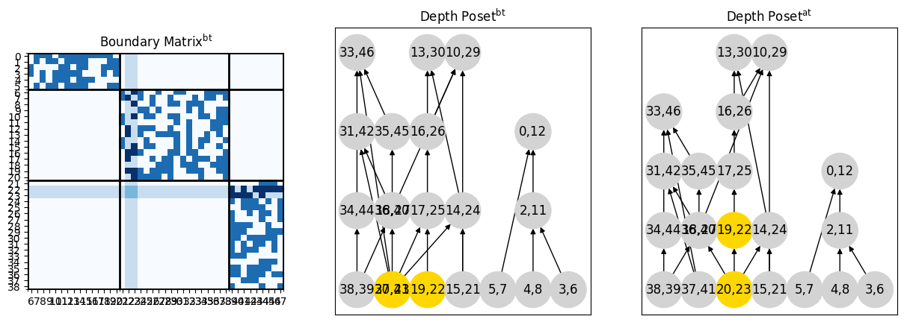

### Birth Death Pairs
|                          |                                                                                                                                                                                                                |
|:-------------------------|:---------------------------------------------------------------------------------------------------------------------------------------------------------------------------------------------------------------|
| Before the transposition | $\{(15, 21), (13, 30), (16, 26), (20, 23), (35, 45), (5, 7), (2, 11), (36, 40), (4, 8), (3, 6), (14, 24), (37, 41), (10, 29), (33, 46), (18, 27), (38, 39), (31, 42), (0, 12), (34, 44), (17, 25), (19, 22)\}$ |
| After the transposition  | $\{(15, 21), (13, 30), (16, 26), (20, 23), (35, 45), (5, 7), (2, 11), (36, 40), (4, 8), (3, 6), (14, 24), (37, 41), (10, 29), (33, 46), (18, 27), (38, 39), (31, 42), (0, 12), (34, 44), (17, 25), (19, 22)\}$ |

### Relations
|                          | Algorithm 1                                                                                                                                                                                                                                                                                                                                                                                                     | Algorithm 2                                                                                                                                                                                                                                                                                                                                                                |
|:-------------------------|:----------------------------------------------------------------------------------------------------------------------------------------------------------------------------------------------------------------------------------------------------------------------------------------------------------------------------------------------------------------------------------------------------------------|:---------------------------------------------------------------------------------------------------------------------------------------------------------------------------------------------------------------------------------------------------------------------------------------------------------------------------------------------------------------------------|
| Before the transposition | $\{(24, 30), (25, 29), (41, 43), (26, 30), (25, 32), (21, 28), (29, 32), (22, 32), (23, 25), (8, 12), (27, 28), (45, 46), (41, 42), (42, 47), (26, 32), (24, 32), (44, 47), (26, 29), (21, 24), (21, 30), (22, 25), (23, 24), (22, 28), (39, 44), (23, 27), (40, 43), (8, 11), (39, 47), (40, 46), (7, 9), (7, 12), (24, 28), (23, 26), (40, 42), (23, 29), (11, 12), (27, 32), (45, 47), (27, 29), (25, 26)\}$ | $\{(4, 0), (35, 33), (20, 14), (20, 17), (38, 35), (38, 32), (5, 1), (14, 13), (34, 28), (36, 28), (10, 9), (37, 33), (15, 14), (35, 32), (20, 13), (33, 32), (4, 2), (38, 28), (38, 31), (5, 0), (14, 9), (31, 28), (34, 33), (19, 17), (36, 33), (37, 32), (15, 10), (33, 28), (3, 2), (38, 33), (38, 36), (37, 28), (19, 16), (19, 13), (37, 31), (36, 35), (34, 32)\}$ |
| After the transposition  | $\{(24, 30), (25, 29), (41, 43), (26, 30), (25, 32), (21, 28), (29, 32), (22, 32), (23, 25), (8, 12), (27, 28), (45, 46), (41, 42), (42, 47), (26, 32), (24, 32), (44, 47), (26, 29), (21, 24), (21, 30), (22, 25), (23, 24), (22, 28), (8, 11), (39, 44), (40, 43), (23, 27), (39, 47), (40, 46), (7, 9), (7, 12), (24, 28), (23, 26), (40, 42), (23, 29), (11, 12), (27, 32), (45, 47), (27, 29), (25, 26)\}$ | $\{(4, 0), (35, 33), (20, 14), (38, 35), (38, 32), (5, 1), (14, 13), (34, 28), (10, 9), (36, 28), (37, 33), (15, 14), (35, 32), (33, 32), (4, 2), (38, 28), (20, 16), (38, 31), (5, 0), (20, 19), (14, 9), (31, 28), (34, 33), (19, 17), (36, 33), (37, 32), (15, 10), (33, 28), (3, 2), (38, 33), (38, 36), (37, 28), (19, 16), (19, 13), (37, 31), (36, 35), (34, 32)\}$ |

### Successors and Predecessers
No such node in the Depth Poset

### Temp Sets
|                                                               | Before the Transposition                                                             | After the Transposition                                                              |
|:--------------------------------------------------------------|:-------------------------------------------------------------------------------------|:-------------------------------------------------------------------------------------|
| $\mathcal{B} = \{(s, t)\in \text{BD}:\; f(s) > f(x)\}$        | $\{(36, 40), (33, 46), (38, 39), (20, 23), (35, 45), (37, 41), (31, 42), (34, 44)\}$ | $\{(36, 40), (33, 46), (38, 39), (20, 23), (35, 45), (37, 41), (31, 42), (34, 44)\}$ |
| $\mathcal{N} = \{(s, t)\in \text{BD}:\; f(x) > f(s) > f(a)\}$ | $\emptyset$                                                                          | $\emptyset$                                                                          |

### Equations
There are 2 equations are wrong.

| eq   | left (formula)                  | left (paramatrized)               | left (value)                       | right (formula)                                                                        | right (paramatrized)                                                                         | right (value)                      | correct   |
|:-----|:--------------------------------|:----------------------------------|:-----------------------------------|:---------------------------------------------------------------------------------------|:---------------------------------------------------------------------------------------------|:-----------------------------------|:----------|
| Eq36 | $\text{Succ}_2^\text{at}(x, y)$ | $\text{Succ}_2^\text{at}(19, 22)$ | $\{(13, 30), (16, 26), (17, 25)\}$ | $\text{Succ}_2^\text{bt}(x, y) \oplus \{(a, b)\} \oplus \text{Succ}_2^\text{bt}(a, b)$ | $\text{Succ}_2^\text{bt}(19, 22) \oplus \{(20, 23)\} \oplus \text{Succ}_2^\text{bt}(20, 23)$ | $\{(14, 24), (20, 23), (16, 26)\}$ | ✘         |
| Eq37 | $\text{Pred}_2^\text{at}(a, b)$ | $\text{Pred}_2^\text{at}(20, 23)$ | $\emptyset$                        | $\text{Pred}_2^\text{bt}(a, b) \oplus \{(x, y)\}$                                      | $\text{Pred}_2^\text{bt}(20, 23) \oplus \{(19, 22)\}$                                        | $\{(19, 22)\}$                     | ✘         |

## Transposition <24, 25> in complex 18
Here is a __death-death__ __no switch__ transposition <24, 25>.

$$
a = 17, \; b = 25, \; x = 14, \; y = 24
$$

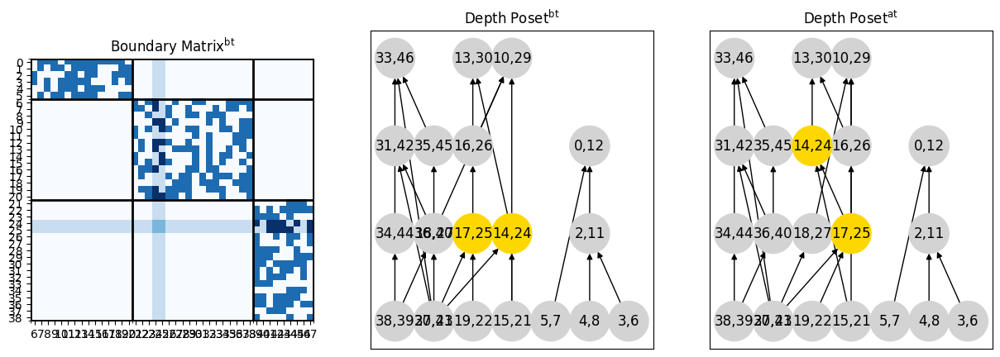

### Birth Death Pairs
|                          |                                                                                                                                                                                                                |
|:-------------------------|:---------------------------------------------------------------------------------------------------------------------------------------------------------------------------------------------------------------|
| Before the transposition | $\{(15, 21), (13, 30), (16, 26), (20, 23), (35, 45), (5, 7), (2, 11), (36, 40), (4, 8), (3, 6), (14, 24), (37, 41), (10, 29), (33, 46), (18, 27), (38, 39), (31, 42), (0, 12), (34, 44), (17, 25), (19, 22)\}$ |
| After the transposition  | $\{(15, 21), (13, 30), (16, 26), (20, 23), (35, 45), (5, 7), (2, 11), (36, 40), (4, 8), (3, 6), (14, 24), (37, 41), (10, 29), (33, 46), (18, 27), (38, 39), (31, 42), (0, 12), (34, 44), (17, 25), (19, 22)\}$ |

### Relations
|                          | Algorithm 1                                                                                                                                                                                                                                                                                                                                                                                                     | Algorithm 2                                                                                                                                                                                                                                                                                                                                                                                             |
|:-------------------------|:----------------------------------------------------------------------------------------------------------------------------------------------------------------------------------------------------------------------------------------------------------------------------------------------------------------------------------------------------------------------------------------------------------------|:--------------------------------------------------------------------------------------------------------------------------------------------------------------------------------------------------------------------------------------------------------------------------------------------------------------------------------------------------------------------------------------------------------|
| Before the transposition | $\{(24, 30), (25, 29), (41, 43), (26, 30), (25, 32), (21, 28), (29, 32), (22, 32), (23, 25), (8, 12), (27, 28), (45, 46), (41, 42), (42, 47), (26, 32), (24, 32), (44, 47), (26, 29), (21, 24), (21, 30), (22, 25), (23, 24), (22, 28), (39, 44), (23, 27), (40, 43), (8, 11), (39, 47), (40, 46), (7, 9), (7, 12), (24, 28), (23, 26), (40, 42), (23, 29), (11, 12), (27, 32), (45, 47), (27, 29), (25, 26)\}$ | $\{(4, 0), (35, 33), (20, 14), (20, 17), (38, 35), (38, 32), (5, 1), (14, 13), (34, 28), (36, 28), (10, 9), (37, 33), (15, 14), (35, 32), (20, 13), (33, 32), (4, 2), (38, 28), (38, 31), (5, 0), (14, 9), (31, 28), (34, 33), (19, 17), (36, 33), (37, 32), (15, 10), (33, 28), (3, 2), (38, 33), (38, 36), (37, 28), (19, 16), (19, 13), (37, 31), (36, 35), (34, 32)\}$                              |
| After the transposition  | $\{(24, 30), (25, 29), (41, 43), (26, 30), (25, 32), (21, 28), (29, 32), (22, 32), (23, 25), (8, 12), (27, 28), (45, 46), (41, 42), (42, 47), (26, 32), (24, 32), (44, 47), (26, 29), (21, 24), (21, 30), (22, 25), (23, 24), (22, 28), (39, 44), (23, 27), (40, 43), (8, 11), (39, 47), (40, 46), (7, 9), (7, 12), (24, 28), (23, 26), (40, 42), (23, 29), (11, 12), (27, 32), (45, 47), (27, 29), (25, 26)\}$ | $\{(4, 0), (35, 33), (20, 14), (20, 17), (38, 35), (38, 32), (5, 1), (17, 9), (14, 13), (34, 28), (10, 9), (36, 28), (37, 33), (15, 14), (35, 32), (20, 13), (33, 32), (4, 2), (38, 28), (38, 31), (5, 0), (14, 9), (31, 28), (17, 14), (34, 33), (19, 17), (36, 33), (37, 32), (15, 10), (33, 28), (3, 2), (38, 33), (38, 36), (17, 13), (37, 28), (19, 16), (19, 13), (37, 31), (36, 35), (34, 32)\}$ |

### Successors and Predecessers
No such node in the Depth Poset

### Temp Sets
|                                                               | Before the Transposition                                                                                                               | After the Transposition                                                                                                                |
|:--------------------------------------------------------------|:---------------------------------------------------------------------------------------------------------------------------------------|:---------------------------------------------------------------------------------------------------------------------------------------|
| $\mathcal{B} = \{(s, t)\in \text{BD}:\; f(s) > f(x)\}$        | $\{(15, 21), (36, 40), (33, 46), (16, 26), (18, 27), (38, 39), (20, 23), (35, 45), (37, 41), (31, 42), (34, 44), (17, 25), (19, 22)\}$ | $\{(15, 21), (36, 40), (33, 46), (16, 26), (18, 27), (38, 39), (20, 23), (35, 45), (37, 41), (31, 42), (34, 44), (17, 25), (19, 22)\}$ |
| $\mathcal{N} = \{(s, t)\in \text{BD}:\; f(x) > f(s) > f(a)\}$ | $\emptyset$                                                                                                                            | $\emptyset$                                                                                                                            |

### Equations
There are 2 equations are wrong.

| eq   | left (formula)                  | left (paramatrized)               | left (value)             | right (formula)                                                                        | right (paramatrized)                                                                         | right (value)                      | correct   |
|:-----|:--------------------------------|:----------------------------------|:-------------------------|:---------------------------------------------------------------------------------------|:---------------------------------------------------------------------------------------------|:-----------------------------------|:----------|
| Eq36 | $\text{Succ}_2^\text{at}(x, y)$ | $\text{Succ}_2^\text{at}(14, 24)$ | $\{(13, 30)\}$           | $\text{Succ}_2^\text{bt}(x, y) \oplus \{(a, b)\} \oplus \text{Succ}_2^\text{bt}(a, b)$ | $\text{Succ}_2^\text{bt}(14, 24) \oplus \{(17, 25)\} \oplus \text{Succ}_2^\text{bt}(17, 25)$ | $\{(13, 30), (17, 25)\}$           | ✘         |
| Eq37 | $\text{Pred}_2^\text{at}(a, b)$ | $\text{Pred}_2^\text{at}(17, 25)$ | $\{(20, 23), (19, 22)\}$ | $\text{Pred}_2^\text{bt}(a, b) \oplus \{(x, y)\}$                                      | $\text{Pred}_2^\text{bt}(17, 25) \oplus \{(14, 24)\}$                                        | $\{(14, 24), (20, 23), (19, 22)\}$ | ✘         |

## Transposition <25, 26> in complex 18
Here is a __death-death__ __switch forward__ transposition <25, 26>.

$$
a = 16, \; b = 26, \; x = 17, \; y = 25
$$

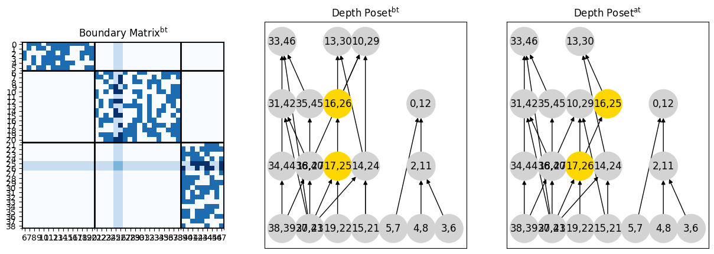

### Birth Death Pairs
|                          |                                                                                                                                                                                                                |
|:-------------------------|:---------------------------------------------------------------------------------------------------------------------------------------------------------------------------------------------------------------|
| Before the transposition | $\{(15, 21), (13, 30), (16, 26), (20, 23), (35, 45), (5, 7), (2, 11), (36, 40), (4, 8), (3, 6), (14, 24), (37, 41), (10, 29), (33, 46), (18, 27), (38, 39), (31, 42), (0, 12), (34, 44), (17, 25), (19, 22)\}$ |
| After the transposition  | $\{(15, 21), (13, 30), (20, 23), (35, 45), (5, 7), (2, 11), (36, 40), (16, 25), (4, 8), (3, 6), (14, 24), (17, 26), (37, 41), (10, 29), (33, 46), (18, 27), (38, 39), (31, 42), (0, 12), (34, 44), (19, 22)\}$ |

### Relations
|                          | Algorithm 1                                                                                                                                                                                                                                                                                                                                                                                                     | Algorithm 2                                                                                                                                                                                                                                                                                                                                                                          |
|:-------------------------|:----------------------------------------------------------------------------------------------------------------------------------------------------------------------------------------------------------------------------------------------------------------------------------------------------------------------------------------------------------------------------------------------------------------|:-------------------------------------------------------------------------------------------------------------------------------------------------------------------------------------------------------------------------------------------------------------------------------------------------------------------------------------------------------------------------------------|
| Before the transposition | $\{(24, 30), (25, 29), (41, 43), (26, 30), (25, 32), (21, 28), (29, 32), (22, 32), (23, 25), (8, 12), (27, 28), (45, 46), (41, 42), (42, 47), (26, 32), (24, 32), (44, 47), (26, 29), (21, 24), (21, 30), (22, 25), (23, 24), (22, 28), (39, 44), (23, 27), (40, 43), (8, 11), (39, 47), (40, 46), (7, 9), (7, 12), (24, 28), (23, 26), (40, 42), (23, 29), (11, 12), (27, 32), (45, 47), (27, 29), (25, 26)\}$ | $\{(4, 0), (35, 33), (20, 14), (20, 17), (38, 35), (38, 32), (5, 1), (14, 13), (34, 28), (36, 28), (10, 9), (37, 33), (15, 14), (35, 32), (20, 13), (33, 32), (4, 2), (38, 28), (38, 31), (5, 0), (14, 9), (31, 28), (34, 33), (19, 17), (36, 33), (37, 32), (15, 10), (33, 28), (3, 2), (38, 33), (38, 36), (37, 28), (19, 16), (19, 13), (37, 31), (36, 35), (34, 32)\}$           |
| After the transposition  | $\{(24, 30), (41, 43), (21, 28), (29, 32), (22, 32), (23, 25), (8, 12), (27, 28), (45, 46), (41, 42), (42, 47), (26, 32), (24, 32), (26, 29), (44, 47), (21, 24), (21, 30), (22, 25), (23, 24), (22, 28), (39, 44), (23, 27), (40, 43), (8, 11), (39, 47), (40, 46), (7, 9), (7, 12), (24, 28), (26, 25), (25, 30), (23, 26), (40, 42), (23, 29), (11, 12), (27, 32), (45, 47), (27, 29)\}$                     | $\{(4, 0), (35, 33), (20, 14), (20, 17), (38, 35), (38, 32), (5, 1), (14, 13), (34, 28), (10, 9), (36, 28), (37, 33), (15, 14), (35, 32), (20, 13), (33, 32), (4, 2), (38, 28), (38, 31), (5, 0), (14, 9), (31, 28), (34, 33), (19, 17), (36, 33), (37, 32), (15, 10), (33, 28), (3, 2), (38, 33), (38, 36), (17, 16), (37, 28), (19, 16), (19, 13), (37, 31), (36, 35), (34, 32)\}$ |

### Successors and Predecessers
|                 | $\text{Set}^\text{bt}(16, 26)$                             | $\text{Set}^\text{bt}(17, 25)$                             | $\text{Set}^\text{at}(17, 26)$                             | $\text{Set}^\text{at}(16, 25)$                                       |
|:----------------|:-----------------------------------------------------------|:-----------------------------------------------------------|:-----------------------------------------------------------|:---------------------------------------------------------------------|
| $\text{Succ}_1$ | $\text{Succ}_1^\text{bt}(16, 26) = \{(13, 30), (10, 29)\}$ | $\text{Succ}_1^\text{bt}(17, 25) = \{(16, 26), (10, 29)\}$ | $\text{Succ}_1^\text{at}(17, 26) = \{(16, 25), (10, 29)\}$ | $\text{Succ}_1^\text{at}(16, 25) = \{(13, 30)\}$                     |
| $\text{Pred}_1$ | $\text{Pred}_1^\text{bt}(16, 26) = \{(20, 23), (17, 25)\}$ | $\text{Pred}_1^\text{bt}(17, 25) = \{(20, 23), (19, 22)\}$ | $\text{Pred}_1^\text{at}(17, 26) = \{(20, 23)\}$           | $\text{Pred}_1^\text{at}(16, 25) = \{(20, 23), (19, 22), (17, 26)\}$ |
| $\text{Succ}_2$ | $\text{Succ}_2^\text{bt}(16, 26) = \emptyset$              | $\text{Succ}_2^\text{bt}(17, 25) = \emptyset$              | $\text{Succ}_2^\text{at}(17, 26) = \{(16, 25)\}$           | $\text{Succ}_2^\text{at}(16, 25) = \emptyset$                        |
| $\text{Pred}_2$ | $\text{Pred}_2^\text{bt}(16, 26) = \{(19, 22)\}$           | $\text{Pred}_2^\text{bt}(17, 25) = \{(20, 23), (19, 22)\}$ | $\text{Pred}_2^\text{at}(17, 26) = \{(20, 23), (19, 22)\}$ | $\text{Pred}_2^\text{at}(16, 25) = \{(19, 22), (17, 26)\}$           |

### Temp Sets
|                                                               | Before the Transposition                                                                                 | After the Transposition                                                                                  |
|:--------------------------------------------------------------|:---------------------------------------------------------------------------------------------------------|:---------------------------------------------------------------------------------------------------------|
| $\mathcal{B} = \{(s, t)\in \text{BD}:\; f(s) > f(x)\}$        | $\{(36, 40), (33, 46), (18, 27), (38, 39), (20, 23), (35, 45), (37, 41), (31, 42), (34, 44), (19, 22)\}$ | $\{(36, 40), (33, 46), (18, 27), (38, 39), (20, 23), (35, 45), (37, 41), (31, 42), (34, 44), (19, 22)\}$ |
| $\mathcal{N} = \{(s, t)\in \text{BD}:\; f(x) > f(s) > f(a)\}$ | $\emptyset$                                                                                              | $\emptyset$                                                                                              |

### Equations
There are 1 equations are wrong.

| eq   | left (formula)                  | left (paramatrized)               | left (value)                       | right (formula)                                                                                          | right (paramatrized)                                                                                           | right (value)                      | correct   |
|:-----|:--------------------------------|:----------------------------------|:-----------------------------------|:---------------------------------------------------------------------------------------------------------|:---------------------------------------------------------------------------------------------------------------|:-----------------------------------|:----------|
| Eq28 | $\text{Succ}_1^\text{at}(x, b)$ | $\text{Succ}_1^\text{at}(17, 26)$ | $\{(16, 25), (10, 29)\}$           | $\text{Succ}_1^\text{bt}(x, y) \oplus \{(a, y), (a, b)\}$                                                | $\text{Succ}_1^\text{bt}(17, 25) \oplus \{(16, 25), (16, 26)\}$                                                | $\{(16, 25), (10, 29)\}$           | ✔         |
| Eq29 | $\text{Succ}_1^\text{at}(a, y)$ | $\text{Succ}_1^\text{at}(16, 25)$ | $\{(13, 30)\}$                     | $\text{Succ}_1^\text{bt}(a, b)$                                                                          | $\text{Succ}_1^\text{bt}(16, 26)$                                                                              | $\{(13, 30), (10, 29)\}$           | ✘         |
| Eq30 | $\text{Pred}_1^\text{at}(x, b)$ | $\text{Pred}_1^\text{at}(17, 26)$ | $\{(20, 23)\}$                     | $[\text{Pred}_1^\text{bt}(a, b) \cap \mathcal{B}]$                                                       | $[\text{Pred}_1^\text{bt}(16, 26) \cap \mathcal{B}]$                                                           | $\{(20, 23)\}$                     | ✔         |
| Eq31 | $\text{Pred}_1^\text{at}(a, y)$ | $\text{Pred}_1^\text{at}(16, 25)$ | $\{(20, 23), (19, 22), (17, 26)\}$ | $\text{Pred}_1^\text{bt}(x, y) \oplus \{(x, b)\} \oplus[\text{Pred}_1^\text{bt}(a, b) \cap \mathcal{N}]$ | $\text{Pred}_1^\text{bt}(17, 25) \oplus \{(17, 26)\} \oplus[\text{Pred}_1^\text{bt}(16, 26) \cap \mathcal{N}]$ | $\{(20, 23), (19, 22), (17, 26)\}$ | ✔         |
| Eq32 | $\text{Succ}_2^\text{at}(x, b)$ | $\text{Succ}_2^\text{at}(17, 26)$ | $\{(16, 25)\}$                     | $\text{Succ}_2^\text{bt}(x, y) \oplus \{(a, y)\} \oplus \text{Succ}_2^\text{bt}(a, b)$                   | $\text{Succ}_2^\text{bt}(17, 25) \oplus \{(16, 25)\} \oplus \text{Succ}_2^\text{bt}(16, 26)$                   | $\{(16, 25)\}$                     | ✔         |
| Eq33 | $\text{Succ}_2^\text{at}(a, y)$ | $\text{Succ}_2^\text{at}(16, 25)$ | $\emptyset$                        | $\text{Succ}_2^\text{bt}(a, b)$                                                                          | $\text{Succ}_2^\text{bt}(16, 26)$                                                                              | $\emptyset$                        | ✔         |
| Eq34 | $\text{Pred}_2^\text{at}(x, b)$ | $\text{Pred}_2^\text{at}(17, 26)$ | $\{(20, 23), (19, 22)\}$           | $\text{Pred}_2^\text{bt}(x, y)$                                                                          | $\text{Pred}_2^\text{bt}(17, 25)$                                                                              | $\{(20, 23), (19, 22)\}$           | ✔         |
| Eq35 | $\text{Pred}_2^\text{at}(a, y)$ | $\text{Pred}_2^\text{at}(16, 25)$ | $\{(19, 22), (17, 26)\}$           | $\text{Pred}_2^\text{bt}(a, b) \oplus \{(x, b)\}$                                                        | $\text{Pred}_2^\text{bt}(16, 26) \oplus \{(17, 26)\}$                                                          | $\{(19, 22), (17, 26)\}$           | ✔         |

## Transposition <26, 27> in complex 18
Here is a __death-death__ __no switch__ transposition <26, 27>.

$$
a = 18, \; b = 27, \; x = 16, \; y = 26
$$

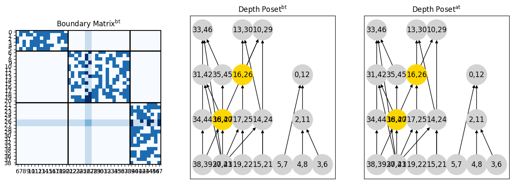

### Birth Death Pairs
|                          |                                                                                                                                                                                                                |
|:-------------------------|:---------------------------------------------------------------------------------------------------------------------------------------------------------------------------------------------------------------|
| Before the transposition | $\{(15, 21), (13, 30), (16, 26), (20, 23), (35, 45), (5, 7), (2, 11), (36, 40), (4, 8), (3, 6), (14, 24), (37, 41), (10, 29), (33, 46), (18, 27), (38, 39), (31, 42), (0, 12), (34, 44), (17, 25), (19, 22)\}$ |
| After the transposition  | $\{(15, 21), (13, 30), (16, 26), (20, 23), (35, 45), (5, 7), (2, 11), (36, 40), (4, 8), (3, 6), (14, 24), (37, 41), (10, 29), (33, 46), (18, 27), (38, 39), (31, 42), (0, 12), (34, 44), (17, 25), (19, 22)\}$ |

### Relations
|                          | Algorithm 1                                                                                                                                                                                                                                                                                                                                                                                                     | Algorithm 2                                                                                                                                                                                                                                                                                                                                                                          |
|:-------------------------|:----------------------------------------------------------------------------------------------------------------------------------------------------------------------------------------------------------------------------------------------------------------------------------------------------------------------------------------------------------------------------------------------------------------|:-------------------------------------------------------------------------------------------------------------------------------------------------------------------------------------------------------------------------------------------------------------------------------------------------------------------------------------------------------------------------------------|
| Before the transposition | $\{(24, 30), (25, 29), (41, 43), (26, 30), (25, 32), (21, 28), (29, 32), (22, 32), (23, 25), (8, 12), (27, 28), (45, 46), (41, 42), (42, 47), (26, 32), (24, 32), (44, 47), (26, 29), (21, 24), (21, 30), (22, 25), (23, 24), (22, 28), (39, 44), (23, 27), (40, 43), (8, 11), (39, 47), (40, 46), (7, 9), (7, 12), (24, 28), (23, 26), (40, 42), (23, 29), (11, 12), (27, 32), (45, 47), (27, 29), (25, 26)\}$ | $\{(4, 0), (35, 33), (20, 14), (20, 17), (38, 35), (38, 32), (5, 1), (14, 13), (34, 28), (36, 28), (10, 9), (37, 33), (15, 14), (35, 32), (20, 13), (33, 32), (4, 2), (38, 28), (38, 31), (5, 0), (14, 9), (31, 28), (34, 33), (19, 17), (36, 33), (37, 32), (15, 10), (33, 28), (3, 2), (38, 33), (38, 36), (37, 28), (19, 16), (19, 13), (37, 31), (36, 35), (34, 32)\}$           |
| After the transposition  | $\{(24, 30), (25, 29), (41, 43), (26, 30), (25, 32), (21, 28), (29, 32), (22, 32), (23, 25), (8, 12), (27, 28), (45, 46), (41, 42), (42, 47), (26, 32), (24, 32), (44, 47), (26, 29), (21, 24), (21, 30), (22, 25), (23, 24), (22, 28), (39, 44), (8, 11), (40, 43), (23, 27), (39, 47), (40, 46), (7, 9), (7, 12), (24, 28), (23, 26), (40, 42), (23, 29), (11, 12), (27, 32), (27, 29), (45, 47), (25, 26)\}$ | $\{(4, 0), (35, 33), (20, 14), (20, 17), (38, 35), (38, 32), (5, 1), (14, 13), (34, 28), (10, 9), (36, 28), (37, 33), (15, 14), (18, 16), (35, 32), (20, 13), (33, 32), (4, 2), (38, 28), (38, 31), (5, 0), (14, 9), (31, 28), (34, 33), (19, 17), (36, 33), (37, 32), (15, 10), (33, 28), (3, 2), (38, 33), (38, 36), (37, 28), (19, 16), (19, 13), (37, 31), (36, 35), (34, 32)\}$ |

### Successors and Predecessers
No such node in the Depth Poset

### Temp Sets
|                                                               | Before the Transposition                                                                                           | After the Transposition                                                                                            |
|:--------------------------------------------------------------|:-------------------------------------------------------------------------------------------------------------------|:-------------------------------------------------------------------------------------------------------------------|
| $\mathcal{B} = \{(s, t)\in \text{BD}:\; f(s) > f(x)\}$        | $\{(36, 40), (33, 46), (18, 27), (38, 39), (20, 23), (35, 45), (37, 41), (31, 42), (34, 44), (17, 25), (19, 22)\}$ | $\{(36, 40), (33, 46), (18, 27), (38, 39), (20, 23), (35, 45), (37, 41), (31, 42), (34, 44), (17, 25), (19, 22)\}$ |
| $\mathcal{N} = \{(s, t)\in \text{BD}:\; f(x) > f(s) > f(a)\}$ | $\emptyset$                                                                                                        | $\emptyset$                                                                                                        |

### Equations
There are 2 equations are wrong.

| eq   | left (formula)                  | left (paramatrized)               | left (value)   | right (formula)                                                                        | right (paramatrized)                                                                         | right (value)   | correct   |
|:-----|:--------------------------------|:----------------------------------|:---------------|:---------------------------------------------------------------------------------------|:---------------------------------------------------------------------------------------------|:----------------|:----------|
| Eq36 | $\text{Succ}_2^\text{at}(x, y)$ | $\text{Succ}_2^\text{at}(16, 26)$ | $\emptyset$    | $\text{Succ}_2^\text{bt}(x, y) \oplus \{(a, b)\} \oplus \text{Succ}_2^\text{bt}(a, b)$ | $\text{Succ}_2^\text{bt}(16, 26) \oplus \{(18, 27)\} \oplus \text{Succ}_2^\text{bt}(18, 27)$ | $\{(18, 27)\}$  | ✘         |
| Eq37 | $\text{Pred}_2^\text{at}(a, b)$ | $\text{Pred}_2^\text{at}(18, 27)$ | $\emptyset$    | $\text{Pred}_2^\text{bt}(a, b) \oplus \{(x, y)\}$                                      | $\text{Pred}_2^\text{bt}(18, 27) \oplus \{(16, 26)\}$                                        | $\{(16, 26)\}$  | ✘         |

## Transposition <34, 35> in complex 18
Here is a __birth-birth__ __no switch__ transposition <34, 35>.

$$
a = 34, \; b = 44, \; x = 35, \; y = 45
$$

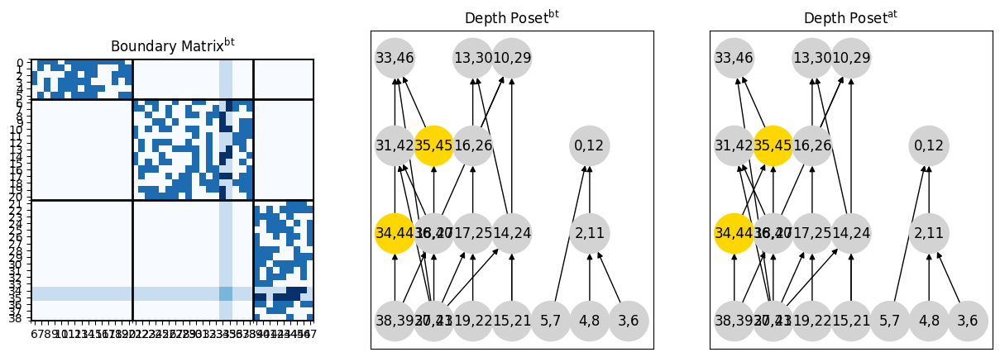

### Birth Death Pairs
|                          |                                                                                                                                                                                                                |
|:-------------------------|:---------------------------------------------------------------------------------------------------------------------------------------------------------------------------------------------------------------|
| Before the transposition | $\{(15, 21), (13, 30), (16, 26), (20, 23), (35, 45), (5, 7), (2, 11), (36, 40), (4, 8), (3, 6), (14, 24), (37, 41), (10, 29), (33, 46), (18, 27), (38, 39), (31, 42), (0, 12), (34, 44), (17, 25), (19, 22)\}$ |
| After the transposition  | $\{(15, 21), (13, 30), (16, 26), (20, 23), (35, 45), (5, 7), (2, 11), (36, 40), (4, 8), (3, 6), (14, 24), (37, 41), (10, 29), (33, 46), (18, 27), (38, 39), (31, 42), (0, 12), (34, 44), (17, 25), (19, 22)\}$ |

### Relations
|                          | Algorithm 1                                                                                                                                                                                                                                                                                                                                                                                                               | Algorithm 2                                                                                                                                                                                                                                                                                                                                                                |
|:-------------------------|:--------------------------------------------------------------------------------------------------------------------------------------------------------------------------------------------------------------------------------------------------------------------------------------------------------------------------------------------------------------------------------------------------------------------------|:---------------------------------------------------------------------------------------------------------------------------------------------------------------------------------------------------------------------------------------------------------------------------------------------------------------------------------------------------------------------------|
| Before the transposition | $\{(24, 30), (25, 29), (41, 43), (26, 30), (25, 32), (21, 28), (29, 32), (22, 32), (23, 25), (8, 12), (27, 28), (45, 46), (41, 42), (42, 47), (26, 32), (24, 32), (44, 47), (26, 29), (21, 24), (21, 30), (22, 25), (23, 24), (22, 28), (39, 44), (23, 27), (40, 43), (8, 11), (39, 47), (40, 46), (7, 9), (7, 12), (24, 28), (23, 26), (40, 42), (23, 29), (11, 12), (27, 32), (45, 47), (27, 29), (25, 26)\}$           | $\{(4, 0), (35, 33), (20, 14), (20, 17), (38, 35), (38, 32), (5, 1), (14, 13), (34, 28), (36, 28), (10, 9), (37, 33), (15, 14), (35, 32), (20, 13), (33, 32), (4, 2), (38, 28), (38, 31), (5, 0), (14, 9), (31, 28), (34, 33), (19, 17), (36, 33), (37, 32), (15, 10), (33, 28), (3, 2), (38, 33), (38, 36), (37, 28), (19, 16), (19, 13), (37, 31), (36, 35), (34, 32)\}$ |
| After the transposition  | $\{(24, 30), (25, 29), (41, 43), (26, 30), (25, 32), (44, 45), (21, 28), (29, 32), (22, 32), (23, 25), (8, 12), (27, 28), (45, 46), (41, 42), (42, 47), (26, 32), (24, 32), (26, 29), (21, 24), (21, 30), (22, 25), (23, 24), (22, 28), (39, 44), (23, 27), (40, 43), (8, 11), (39, 47), (40, 46), (7, 9), (7, 12), (24, 28), (44, 46), (23, 26), (40, 42), (23, 29), (11, 12), (27, 32), (45, 47), (27, 29), (25, 26)\}$ | $\{(4, 0), (35, 33), (20, 14), (20, 17), (38, 35), (38, 32), (5, 1), (14, 13), (34, 28), (10, 9), (36, 28), (37, 33), (15, 14), (35, 32), (20, 13), (33, 32), (4, 2), (38, 28), (38, 31), (5, 0), (14, 9), (31, 28), (34, 33), (19, 17), (36, 33), (37, 32), (15, 10), (33, 28), (3, 2), (38, 33), (38, 36), (37, 28), (19, 16), (34, 32), (19, 13), (36, 35), (37, 31)\}$ |

### Successors and Predecessers
No such node in the Depth Poset

### Temp Sets
|                                                               | Before the Transposition                                                                                                                                                                   | After the Transposition                                                                                                                                                                    |
|:--------------------------------------------------------------|:-------------------------------------------------------------------------------------------------------------------------------------------------------------------------------------------|:-------------------------------------------------------------------------------------------------------------------------------------------------------------------------------------------|
| $\mathcal{L} = \{(s, t)\in \text{BD}:\; f(t) < f(y)\}$        | $\{(15, 21), (13, 30), (16, 26), (20, 23), (5, 7), (2, 11), (36, 40), (4, 8), (3, 6), (14, 24), (37, 41), (10, 29), (18, 27), (38, 39), (31, 42), (0, 12), (34, 44), (17, 25), (19, 22)\}$ | $\{(15, 21), (13, 30), (16, 26), (20, 23), (5, 7), (2, 11), (36, 40), (4, 8), (3, 6), (14, 24), (37, 41), (10, 29), (18, 27), (38, 39), (31, 42), (0, 12), (34, 44), (17, 25), (19, 22)\}$ |
| $\mathcal{M} = \{(s, t)\in \text{BD}:\; f(y) < f(t) < f(b)\}$ | $\emptyset$                                                                                                                                                                                | $\emptyset$                                                                                                                                                                                |

### Equations
There are 2 equations are wrong.

| eq   | left (formula)                  | left (paramatrized)               | left (value)   | right (formula)                                                                        | right (paramatrized)                                                                         | right (value)            | correct   |
|:-----|:--------------------------------|:----------------------------------|:---------------|:---------------------------------------------------------------------------------------|:---------------------------------------------------------------------------------------------|:-------------------------|:----------|
| Eq16 | $\text{Succ}_1^\text{at}(x, y)$ | $\text{Succ}_1^\text{at}(35, 45)$ | $\{(33, 46)\}$ | $\text{Succ}_1^\text{bt}(x, y) \oplus \{(a, b)\} \oplus \text{Succ}_1^\text{bt}(a, b)$ | $\text{Succ}_1^\text{bt}(35, 45) \oplus \{(34, 44)\} \oplus \text{Succ}_1^\text{bt}(34, 44)$ | $\{(33, 46), (34, 44)\}$ | ✘         |
| Eq17 | $\text{Pred}_1^\text{at}(a, b)$ | $\text{Pred}_1^\text{at}(34, 44)$ | $\{(38, 39)\}$ | $\text{Pred}_1^\text{bt}(a, b) \oplus \{(x, y)\}$                                      | $\text{Pred}_1^\text{bt}(34, 44) \oplus \{(35, 45)\}$                                        | $\{(35, 45), (38, 39)\}$ | ✘         |

## Transposition <35, 36> in complex 18
Here is a __birth-birth__ __switch forward__ transposition <35, 36>.

$$
a = 35, \; b = 45, \; x = 36, \; y = 40
$$

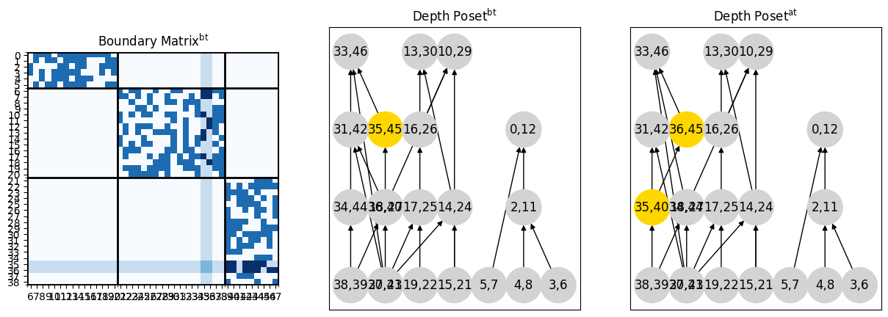

### Birth Death Pairs
|                          |                                                                                                                                                                                                                |
|:-------------------------|:---------------------------------------------------------------------------------------------------------------------------------------------------------------------------------------------------------------|
| Before the transposition | $\{(15, 21), (13, 30), (16, 26), (20, 23), (35, 45), (5, 7), (2, 11), (36, 40), (4, 8), (3, 6), (14, 24), (37, 41), (10, 29), (33, 46), (18, 27), (38, 39), (31, 42), (0, 12), (34, 44), (17, 25), (19, 22)\}$ |
| After the transposition  | $\{(15, 21), (13, 30), (16, 26), (20, 23), (5, 7), (2, 11), (4, 8), (3, 6), (14, 24), (37, 41), (36, 45), (10, 29), (35, 40), (33, 46), (18, 27), (38, 39), (31, 42), (0, 12), (34, 44), (17, 25), (19, 22)\}$ |

### Relations
|                          | Algorithm 1                                                                                                                                                                                                                                                                                                                                                                                                               | Algorithm 2                                                                                                                                                                                                                                                                                                                                                                |
|:-------------------------|:--------------------------------------------------------------------------------------------------------------------------------------------------------------------------------------------------------------------------------------------------------------------------------------------------------------------------------------------------------------------------------------------------------------------------|:---------------------------------------------------------------------------------------------------------------------------------------------------------------------------------------------------------------------------------------------------------------------------------------------------------------------------------------------------------------------------|
| Before the transposition | $\{(24, 30), (25, 29), (41, 43), (26, 30), (25, 32), (21, 28), (29, 32), (22, 32), (23, 25), (8, 12), (27, 28), (45, 46), (41, 42), (42, 47), (26, 32), (24, 32), (44, 47), (26, 29), (21, 24), (21, 30), (22, 25), (23, 24), (22, 28), (39, 44), (23, 27), (40, 43), (8, 11), (39, 47), (40, 46), (7, 9), (7, 12), (24, 28), (23, 26), (40, 42), (23, 29), (11, 12), (27, 32), (45, 47), (27, 29), (25, 26)\}$           | $\{(4, 0), (35, 33), (20, 14), (20, 17), (38, 35), (38, 32), (5, 1), (14, 13), (34, 28), (36, 28), (10, 9), (37, 33), (15, 14), (35, 32), (20, 13), (33, 32), (4, 2), (38, 28), (38, 31), (5, 0), (14, 9), (31, 28), (34, 33), (19, 17), (36, 33), (37, 32), (15, 10), (33, 28), (3, 2), (38, 33), (38, 36), (37, 28), (19, 16), (19, 13), (37, 31), (36, 35), (34, 32)\}$ |
| After the transposition  | $\{(24, 30), (25, 29), (41, 43), (26, 30), (25, 32), (21, 28), (29, 32), (22, 32), (23, 25), (8, 12), (40, 47), (27, 28), (45, 46), (41, 42), (42, 47), (26, 32), (24, 32), (44, 47), (26, 29), (21, 24), (21, 30), (22, 25), (23, 24), (22, 28), (39, 44), (23, 27), (40, 43), (8, 11), (39, 47), (7, 9), (7, 12), (24, 28), (23, 26), (40, 42), (23, 29), (40, 45), (11, 12), (27, 32), (45, 47), (27, 29), (25, 26)\}$ | $\{(4, 0), (35, 33), (20, 14), (35, 36), (20, 17), (38, 35), (38, 32), (5, 1), (14, 13), (34, 28), (10, 9), (36, 28), (37, 33), (15, 14), (20, 13), (33, 32), (4, 2), (38, 28), (38, 31), (5, 0), (14, 9), (31, 28), (34, 33), (19, 17), (37, 32), (15, 10), (33, 28), (35, 28), (3, 2), (38, 33), (38, 36), (37, 28), (19, 16), (36, 32), (19, 13), (37, 31), (34, 32)\}$ |

### Successors and Predecessers
|                 | $\text{Set}^\text{bt}(35, 45)$                             | $\text{Set}^\text{bt}(36, 40)$                             | $\text{Set}^\text{at}(35, 40)$                             | $\text{Set}^\text{at}(36, 45)$                             |
|:----------------|:-----------------------------------------------------------|:-----------------------------------------------------------|:-----------------------------------------------------------|:-----------------------------------------------------------|
| $\text{Succ}_1$ | $\text{Succ}_1^\text{bt}(35, 45) = \{(33, 46)\}$           | $\text{Succ}_1^\text{bt}(36, 40) = \{(33, 46), (31, 42)\}$ | $\text{Succ}_1^\text{at}(35, 40) = \{(36, 45), (31, 42)\}$ | $\text{Succ}_1^\text{at}(36, 45) = \{(33, 46)\}$           |
| $\text{Pred}_1$ | $\text{Pred}_1^\text{bt}(35, 45) = \emptyset$              | $\text{Pred}_1^\text{bt}(36, 40) = \emptyset$              | $\text{Pred}_1^\text{at}(35, 40) = \emptyset$              | $\text{Pred}_1^\text{at}(36, 45) = \{(35, 40)\}$           |
| $\text{Succ}_2$ | $\text{Succ}_2^\text{bt}(35, 45) = \{(33, 46)\}$           | $\text{Succ}_2^\text{bt}(36, 40) = \{(33, 46), (35, 45)\}$ | $\text{Succ}_2^\text{at}(35, 40) = \{(36, 45), (33, 46)\}$ | $\text{Succ}_2^\text{at}(36, 45) = \emptyset$              |
| $\text{Pred}_2$ | $\text{Pred}_2^\text{bt}(35, 45) = \{(36, 40), (38, 39)\}$ | $\text{Pred}_2^\text{bt}(36, 40) = \{(38, 39)\}$           | $\text{Pred}_2^\text{at}(35, 40) = \{(38, 39)\}$           | $\text{Pred}_2^\text{at}(36, 45) = \{(38, 39), (35, 40)\}$ |

### Temp Sets
|                                                               | Before the Transposition                                                                                                                           | After the Transposition                                                                                                                            |
|:--------------------------------------------------------------|:---------------------------------------------------------------------------------------------------------------------------------------------------|:---------------------------------------------------------------------------------------------------------------------------------------------------|
| $\mathcal{L} = \{(s, t)\in \text{BD}:\; f(t) < f(y)\}$        | $\{(15, 21), (18, 27), (14, 24), (16, 26), (13, 30), (38, 39), (20, 23), (5, 7), (0, 12), (17, 25), (19, 22), (10, 29), (4, 8), (3, 6), (2, 11)\}$ | $\{(15, 21), (18, 27), (14, 24), (16, 26), (13, 30), (38, 39), (20, 23), (5, 7), (0, 12), (17, 25), (19, 22), (10, 29), (4, 8), (3, 6), (2, 11)\}$ |
| $\mathcal{M} = \{(s, t)\in \text{BD}:\; f(y) < f(t) < f(b)\}$ | $\{(34, 44), (31, 42), (37, 41)\}$                                                                                                                 | $\{(34, 44), (31, 42), (37, 41)\}$                                                                                                                 |

### Equations
There are 1 equations are wrong.

| eq   | left (formula)                  | left (paramatrized)               | left (value)             | right (formula)                                                                                           | right (paramatrized)                                                                                            | right (value)            | correct   |
|:-----|:--------------------------------|:----------------------------------|:-------------------------|:----------------------------------------------------------------------------------------------------------|:----------------------------------------------------------------------------------------------------------------|:-------------------------|:----------|
| Eq08 | $\text{Succ}_1^\text{at}(a, y)$ | $\text{Succ}_1^\text{at}(35, 40)$ | $\{(36, 45), (31, 42)\}$ | $\text{Succ}_1^\text{bt}(x, y) \oplus \{(x, b)\} \oplus \text{Succ}_1^\text{bt}(a, b)$                    | $\text{Succ}_1^\text{bt}(36, 40) \oplus \{(36, 45)\} \oplus \text{Succ}_1^\text{bt}(35, 45)$                    | $\{(36, 45), (31, 42)\}$ | ✔         |
| Eq09 | $\text{Succ}_1^\text{at}(x, b)$ | $\text{Succ}_1^\text{at}(36, 45)$ | $\{(33, 46)\}$           | $\text{Succ}_1^\text{bt}(a, b)$                                                                           | $\text{Succ}_1^\text{bt}(35, 45)$                                                                               | $\{(33, 46)\}$           | ✔         |
| Eq10 | $\text{Pred}_1^\text{at}(a, y)$ | $\text{Pred}_1^\text{at}(35, 40)$ | $\emptyset$              | $\text{Pred}_1^\text{bt}(x, y)$                                                                           | $\text{Pred}_1^\text{bt}(36, 40)$                                                                               | $\emptyset$              | ✔         |
| Eq11 | $\text{Pred}_1^\text{at}(x, b)$ | $\text{Pred}_1^\text{at}(36, 45)$ | $\{(35, 40)\}$           | $\text{Pred}_1^\text{bt}(a, b) \oplus \{(a, y)\}$                                                         | $\text{Pred}_1^\text{bt}(35, 45) \oplus \{(35, 40)\}$                                                           | $\{(35, 40)\}$           | ✔         |
| Eq12 | $\text{Succ}_2^\text{at}(a, y)$ | $\text{Succ}_2^\text{at}(35, 40)$ | $\{(36, 45), (33, 46)\}$ | $\text{Succ}_2^\text{bt}(x, y) \oplus \{(x, b), (a, b)\}$                                                 | $\text{Succ}_2^\text{bt}(36, 40) \oplus \{(36, 45), (35, 45)\}$                                                 | $\{(36, 45), (33, 46)\}$ | ✔         |
| Eq13 | $\text{Succ}_2^\text{at}(x, b)$ | $\text{Succ}_2^\text{at}(36, 45)$ | $\emptyset$              | $\text{Succ}_2^\text{bt}(a, b)$                                                                           | $\text{Succ}_2^\text{bt}(35, 45)$                                                                               | $\{(33, 46)\}$           | ✘         |
| Eq14 | $\text{Pred}_2^\text{at}(a, y)$ | $\text{Pred}_2^\text{at}(35, 40)$ | $\{(38, 39)\}$           | $[\text{Pred}_2^\text{bt}(a, b) \cap \mathcal{L}]$                                                        | $[\text{Pred}_2^\text{bt}(35, 45) \cap \mathcal{L}]$                                                            | $\{(38, 39)\}$           | ✔         |
| Eq15 | $\text{Pred}_2^\text{at}(x, b)$ | $\text{Pred}_2^\text{at}(36, 45)$ | $\{(38, 39), (35, 40)\}$ | $\text{Pred}_2^\text{bt}(x, y) \oplus \{(a, y)\} \oplus [\text{Pred}_2^\text{bt}(a, b) \cap \mathcal{M}]$ | $\text{Pred}_2^\text{bt}(36, 40) \oplus \{(35, 40)\} \oplus [\text{Pred}_2^\text{bt}(35, 45) \cap \mathcal{M}]$ | $\{(38, 39), (35, 40)\}$ | ✔         |

## Transposition <44, 45> in complex 18
Here is a __death-death__ __no switch__ transposition <44, 45>.

$$
a = 35, \; b = 45, \; x = 34, \; y = 44
$$

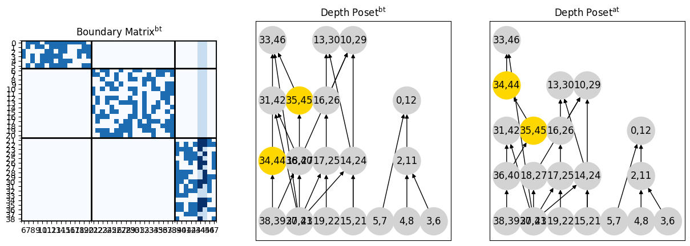

### Birth Death Pairs
|                          |                                                                                                                                                                                                                |
|:-------------------------|:---------------------------------------------------------------------------------------------------------------------------------------------------------------------------------------------------------------|
| Before the transposition | $\{(15, 21), (13, 30), (16, 26), (20, 23), (35, 45), (5, 7), (2, 11), (36, 40), (4, 8), (3, 6), (14, 24), (37, 41), (10, 29), (33, 46), (18, 27), (38, 39), (31, 42), (0, 12), (34, 44), (17, 25), (19, 22)\}$ |
| After the transposition  | $\{(15, 21), (13, 30), (16, 26), (20, 23), (35, 45), (5, 7), (2, 11), (36, 40), (4, 8), (3, 6), (14, 24), (37, 41), (10, 29), (33, 46), (18, 27), (38, 39), (31, 42), (0, 12), (34, 44), (17, 25), (19, 22)\}$ |

### Relations
|                          | Algorithm 1                                                                                                                                                                                                                                                                                                                                                                                                     | Algorithm 2                                                                                                                                                                                                                                                                                                                                                                |
|:-------------------------|:----------------------------------------------------------------------------------------------------------------------------------------------------------------------------------------------------------------------------------------------------------------------------------------------------------------------------------------------------------------------------------------------------------------|:---------------------------------------------------------------------------------------------------------------------------------------------------------------------------------------------------------------------------------------------------------------------------------------------------------------------------------------------------------------------------|
| Before the transposition | $\{(24, 30), (25, 29), (41, 43), (26, 30), (25, 32), (21, 28), (29, 32), (22, 32), (23, 25), (8, 12), (27, 28), (45, 46), (41, 42), (42, 47), (26, 32), (24, 32), (44, 47), (26, 29), (21, 24), (21, 30), (22, 25), (23, 24), (22, 28), (39, 44), (23, 27), (40, 43), (8, 11), (39, 47), (40, 46), (7, 9), (7, 12), (24, 28), (23, 26), (40, 42), (23, 29), (11, 12), (27, 32), (45, 47), (27, 29), (25, 26)\}$ | $\{(4, 0), (35, 33), (20, 14), (20, 17), (38, 35), (38, 32), (5, 1), (14, 13), (34, 28), (36, 28), (10, 9), (37, 33), (15, 14), (35, 32), (20, 13), (33, 32), (4, 2), (38, 28), (38, 31), (5, 0), (14, 9), (31, 28), (34, 33), (19, 17), (36, 33), (37, 32), (15, 10), (33, 28), (3, 2), (38, 33), (38, 36), (37, 28), (19, 16), (19, 13), (37, 31), (36, 35), (34, 32)\}$ |
| After the transposition  | $\{(24, 30), (25, 29), (41, 43), (26, 30), (25, 32), (21, 28), (29, 32), (22, 32), (23, 25), (8, 12), (27, 28), (45, 46), (41, 42), (42, 47), (26, 32), (24, 32), (26, 29), (44, 47), (21, 24), (21, 30), (22, 25), (23, 24), (22, 28), (39, 44), (8, 11), (23, 27), (40, 43), (39, 47), (40, 46), (7, 9), (7, 12), (24, 28), (23, 26), (40, 42), (23, 29), (11, 12), (27, 32), (45, 47), (27, 29), (25, 26)\}$ | $\{(4, 0), (20, 14), (20, 17), (38, 35), (38, 32), (5, 1), (14, 13), (34, 28), (10, 9), (36, 28), (37, 33), (15, 14), (20, 13), (33, 32), (4, 2), (38, 28), (38, 31), (5, 0), (14, 9), (31, 28), (34, 33), (19, 17), (36, 33), (37, 32), (15, 10), (33, 28), (35, 28), (3, 2), (35, 34), (38, 33), (38, 36), (37, 28), (19, 16), (19, 13), (37, 31), (36, 35), (34, 32)\}$ |

### Successors and Predecessers
No such node in the Depth Poset

### Temp Sets
|                                                               | Before the Transposition                     | After the Transposition                      |
|:--------------------------------------------------------------|:---------------------------------------------|:---------------------------------------------|
| $\mathcal{B} = \{(s, t)\in \text{BD}:\; f(s) > f(x)\}$        | $\{(36, 40), (38, 39), (35, 45), (37, 41)\}$ | $\{(36, 40), (38, 39), (35, 45), (37, 41)\}$ |
| $\mathcal{N} = \{(s, t)\in \text{BD}:\; f(x) > f(s) > f(a)\}$ | $\emptyset$                                  | $\emptyset$                                  |

### Equations
There are 2 equations are wrong.

| eq   | left (formula)                  | left (paramatrized)               | left (value)             | right (formula)                                                                        | right (paramatrized)                                                                         | right (value)                      | correct   |
|:-----|:--------------------------------|:----------------------------------|:-------------------------|:---------------------------------------------------------------------------------------|:---------------------------------------------------------------------------------------------|:-----------------------------------|:----------|
| Eq36 | $\text{Succ}_2^\text{at}(x, y)$ | $\text{Succ}_2^\text{at}(34, 44)$ | $\{(33, 46)\}$           | $\text{Succ}_2^\text{bt}(x, y) \oplus \{(a, b)\} \oplus \text{Succ}_2^\text{bt}(a, b)$ | $\text{Succ}_2^\text{bt}(34, 44) \oplus \{(35, 45)\} \oplus \text{Succ}_2^\text{bt}(35, 45)$ | $\{(35, 45)\}$                     | ✘         |
| Eq37 | $\text{Pred}_2^\text{at}(a, b)$ | $\text{Pred}_2^\text{at}(35, 45)$ | $\{(36, 40), (38, 39)\}$ | $\text{Pred}_2^\text{bt}(a, b) \oplus \{(x, y)\}$                                      | $\text{Pred}_2^\text{bt}(35, 45) \oplus \{(34, 44)\}$                                        | $\{(36, 40), (34, 44), (38, 39)\}$ | ✘         |

## Transposition <3, 4> in complex 19
Here is a __birth-birth__ __switch forward__ transposition <3, 4>.

$$
a = 3, \; b = 7, \; x = 4, \; y = 6
$$

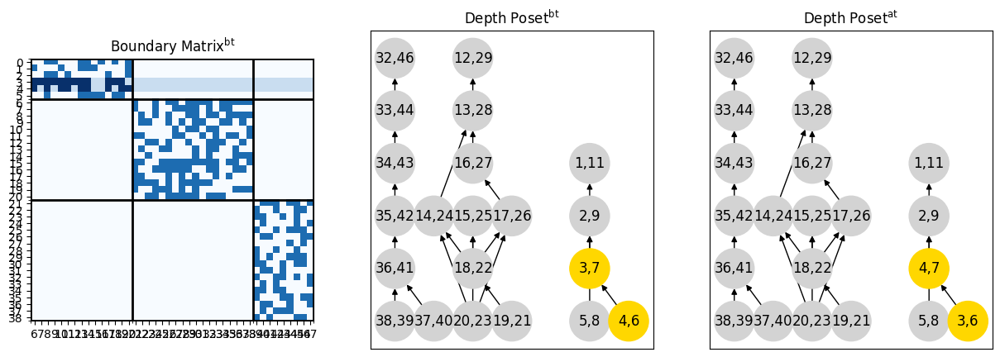

### Birth Death Pairs
|                          |                                                                                                                                                                                                               |
|:-------------------------|:--------------------------------------------------------------------------------------------------------------------------------------------------------------------------------------------------------------|
| Before the transposition | $\{(32, 46), (35, 42), (20, 23), (4, 6), (3, 7), (19, 21), (34, 43), (33, 44), (18, 22), (14, 24), (17, 26), (1, 11), (13, 28), (15, 25), (16, 27), (38, 39), (5, 8), (12, 29), (2, 9), (37, 40), (36, 41)\}$ |
| After the transposition  | $\{(32, 46), (35, 42), (20, 23), (19, 21), (34, 43), (33, 44), (18, 22), (3, 6), (14, 24), (17, 26), (1, 11), (13, 28), (15, 25), (16, 27), (4, 7), (38, 39), (5, 8), (12, 29), (2, 9), (37, 40), (36, 41)\}$ |

### Relations
|                          | Algorithm 1                                                                                                                                                                                                                                                                                                                                                                                                                                                                                           | Algorithm 2                                                                                                                                                                                                                                                                                                                                                                                                                                                      |
|:-------------------------|:------------------------------------------------------------------------------------------------------------------------------------------------------------------------------------------------------------------------------------------------------------------------------------------------------------------------------------------------------------------------------------------------------------------------------------------------------------------------------------------------------|:-----------------------------------------------------------------------------------------------------------------------------------------------------------------------------------------------------------------------------------------------------------------------------------------------------------------------------------------------------------------------------------------------------------------------------------------------------------------|
| Before the transposition | $\{(24, 30), (42, 45), (41, 43), (26, 30), (43, 46), (26, 27), (21, 28), (21, 25), (23, 28), (40, 44), (22, 26), (39, 45), (9, 11), (6, 11), (41, 42), (25, 31), (24, 29), (42, 44), (21, 24), (21, 30), (22, 25), (39, 41), (23, 24), (23, 30), (22, 28), (23, 27), (40, 43), (22, 31), (27, 30), (7, 9), (6, 10), (24, 31), (41, 47), (26, 28), (25, 30), (26, 31), (43, 47), (44, 46), (21, 26), (22, 27), (23, 26), (40, 42), (22, 24), (39, 46), (23, 29), (22, 30), (27, 29)\}$                 | $\{(18, 17), (20, 14), (4, 3), (20, 17), (38, 35), (38, 32), (5, 1), (14, 13), (34, 31), (1, 0), (19, 18), (37, 30), (37, 33), (19, 15), (36, 31), (37, 36), (36, 34), (16, 10), (16, 13), (20, 13), (18, 13), (5, 0), (38, 34), (34, 30), (34, 33), (36, 30), (19, 17), (16, 12), (33, 31), (18, 15), (20, 12), (38, 30), (4, 1), (35, 34), (20, 15), (5, 2), (17, 13), (2, 0), (19, 16), (36, 32), (37, 31), (36, 35), (37, 34), (13, 12), (33, 30)\}$         |
| After the transposition  | $\{(24, 30), (42, 45), (41, 43), (26, 30), (43, 46), (26, 27), (21, 28), (21, 25), (23, 28), (40, 44), (22, 26), (39, 45), (9, 11), (6, 11), (41, 42), (25, 31), (24, 29), (42, 44), (21, 24), (21, 30), (22, 25), (39, 41), (23, 24), (23, 30), (22, 28), (23, 27), (40, 43), (22, 31), (27, 30), (7, 9), (6, 7), (6, 10), (24, 31), (41, 47), (26, 28), (25, 30), (26, 31), (43, 47), (44, 46), (21, 26), (22, 27), (23, 26), (40, 42), (22, 24), (39, 46), (23, 29), (22, 30), (27, 29), (6, 9)\}$ | $\{(18, 17), (20, 14), (3, 4), (3, 1), (20, 17), (38, 35), (38, 32), (5, 1), (14, 13), (34, 31), (1, 0), (37, 30), (19, 18), (19, 15), (36, 31), (37, 33), (37, 36), (36, 34), (16, 10), (16, 13), (20, 13), (18, 13), (5, 0), (38, 34), (34, 30), (34, 33), (36, 30), (19, 17), (16, 12), (33, 31), (18, 15), (20, 12), (38, 30), (4, 1), (35, 34), (20, 15), (5, 2), (17, 13), (2, 0), (19, 16), (36, 32), (37, 31), (36, 35), (37, 34), (13, 12), (33, 30)\}$ |

### Successors and Predecessers
|                 | $\text{Set}^\text{bt}(3, 7)$                 | $\text{Set}^\text{bt}(4, 6)$                          | $\text{Set}^\text{at}(3, 6)$                                  | $\text{Set}^\text{at}(4, 7)$                  |
|:----------------|:---------------------------------------------|:------------------------------------------------------|:--------------------------------------------------------------|:----------------------------------------------|
| $\text{Succ}_1$ | $\text{Succ}_1^\text{bt}(3, 7) = \{(2, 9)\}$ | $\text{Succ}_1^\text{bt}(4, 6) = \{(1, 11)\}$         | $\text{Succ}_1^\text{at}(3, 6) = \{(1, 11), (2, 9), (4, 7)\}$ | $\text{Succ}_1^\text{at}(4, 7) = \{(2, 9)\}$  |
| $\text{Pred}_1$ | $\text{Pred}_1^\text{bt}(3, 7) = \emptyset$  | $\text{Pred}_1^\text{bt}(4, 6) = \emptyset$           | $\text{Pred}_1^\text{at}(3, 6) = \emptyset$                   | $\text{Pred}_1^\text{at}(4, 7) = \{(3, 6)\}$  |
| $\text{Succ}_2$ | $\text{Succ}_2^\text{bt}(3, 7) = \emptyset$  | $\text{Succ}_2^\text{bt}(4, 6) = \{(1, 11), (3, 7)\}$ | $\text{Succ}_2^\text{at}(3, 6) = \{(1, 11), (4, 7)\}$         | $\text{Succ}_2^\text{at}(4, 7) = \{(1, 11)\}$ |
| $\text{Pred}_2$ | $\text{Pred}_2^\text{bt}(3, 7) = \{(4, 6)\}$ | $\text{Pred}_2^\text{bt}(4, 6) = \emptyset$           | $\text{Pred}_2^\text{at}(3, 6) = \emptyset$                   | $\text{Pred}_2^\text{at}(4, 7) = \{(3, 6)\}$  |

### Temp Sets
|                                                               | Before the Transposition   | After the Transposition   |
|:--------------------------------------------------------------|:---------------------------|:--------------------------|
| $\mathcal{L} = \{(s, t)\in \text{BD}:\; f(t) < f(y)\}$        | $\emptyset$                | $\emptyset$               |
| $\mathcal{M} = \{(s, t)\in \text{BD}:\; f(y) < f(t) < f(b)\}$ | $\emptyset$                | $\emptyset$               |

### Equations
There are 1 equations are wrong.

| eq   | left (formula)                  | left (paramatrized)             | left (value)                  | right (formula)                                                                                           | right (paramatrized)                                                                                      | right (value)                 | correct   |
|:-----|:--------------------------------|:--------------------------------|:------------------------------|:----------------------------------------------------------------------------------------------------------|:----------------------------------------------------------------------------------------------------------|:------------------------------|:----------|
| Eq08 | $\text{Succ}_1^\text{at}(a, y)$ | $\text{Succ}_1^\text{at}(3, 6)$ | $\{(1, 11), (2, 9), (4, 7)\}$ | $\text{Succ}_1^\text{bt}(x, y) \oplus \{(x, b)\} \oplus \text{Succ}_1^\text{bt}(a, b)$                    | $\text{Succ}_1^\text{bt}(4, 6) \oplus \{(4, 7)\} \oplus \text{Succ}_1^\text{bt}(3, 7)$                    | $\{(1, 11), (2, 9), (4, 7)\}$ | ✔         |
| Eq09 | $\text{Succ}_1^\text{at}(x, b)$ | $\text{Succ}_1^\text{at}(4, 7)$ | $\{(2, 9)\}$                  | $\text{Succ}_1^\text{bt}(a, b)$                                                                           | $\text{Succ}_1^\text{bt}(3, 7)$                                                                           | $\{(2, 9)\}$                  | ✔         |
| Eq10 | $\text{Pred}_1^\text{at}(a, y)$ | $\text{Pred}_1^\text{at}(3, 6)$ | $\emptyset$                   | $\text{Pred}_1^\text{bt}(x, y)$                                                                           | $\text{Pred}_1^\text{bt}(4, 6)$                                                                           | $\emptyset$                   | ✔         |
| Eq11 | $\text{Pred}_1^\text{at}(x, b)$ | $\text{Pred}_1^\text{at}(4, 7)$ | $\{(3, 6)\}$                  | $\text{Pred}_1^\text{bt}(a, b) \oplus \{(a, y)\}$                                                         | $\text{Pred}_1^\text{bt}(3, 7) \oplus \{(3, 6)\}$                                                         | $\{(3, 6)\}$                  | ✔         |
| Eq12 | $\text{Succ}_2^\text{at}(a, y)$ | $\text{Succ}_2^\text{at}(3, 6)$ | $\{(1, 11), (4, 7)\}$         | $\text{Succ}_2^\text{bt}(x, y) \oplus \{(x, b), (a, b)\}$                                                 | $\text{Succ}_2^\text{bt}(4, 6) \oplus \{(4, 7), (3, 7)\}$                                                 | $\{(1, 11), (4, 7)\}$         | ✔         |
| Eq13 | $\text{Succ}_2^\text{at}(x, b)$ | $\text{Succ}_2^\text{at}(4, 7)$ | $\{(1, 11)\}$                 | $\text{Succ}_2^\text{bt}(a, b)$                                                                           | $\text{Succ}_2^\text{bt}(3, 7)$                                                                           | $\emptyset$                   | ✘         |
| Eq14 | $\text{Pred}_2^\text{at}(a, y)$ | $\text{Pred}_2^\text{at}(3, 6)$ | $\emptyset$                   | $[\text{Pred}_2^\text{bt}(a, b) \cap \mathcal{L}]$                                                        | $[\text{Pred}_2^\text{bt}(3, 7) \cap \mathcal{L}]$                                                        | $\emptyset$                   | ✔         |
| Eq15 | $\text{Pred}_2^\text{at}(x, b)$ | $\text{Pred}_2^\text{at}(4, 7)$ | $\{(3, 6)\}$                  | $\text{Pred}_2^\text{bt}(x, y) \oplus \{(a, y)\} \oplus [\text{Pred}_2^\text{bt}(a, b) \cap \mathcal{M}]$ | $\text{Pred}_2^\text{bt}(4, 6) \oplus \{(3, 6)\} \oplus [\text{Pred}_2^\text{bt}(3, 7) \cap \mathcal{M}]$ | $\{(3, 6)\}$                  | ✔         |

## Transposition <4, 5> in complex 19
Here is a __birth-birth__ __no switch__ transposition <4, 5>.

$$
a = 4, \; b = 6, \; x = 5, \; y = 8
$$

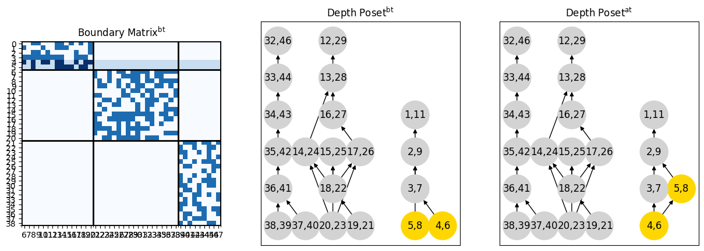

### Birth Death Pairs
|                          |                                                                                                                                                                                                               |
|:-------------------------|:--------------------------------------------------------------------------------------------------------------------------------------------------------------------------------------------------------------|
| Before the transposition | $\{(32, 46), (35, 42), (20, 23), (4, 6), (3, 7), (19, 21), (34, 43), (33, 44), (18, 22), (14, 24), (17, 26), (1, 11), (13, 28), (15, 25), (16, 27), (38, 39), (5, 8), (12, 29), (2, 9), (37, 40), (36, 41)\}$ |
| After the transposition  | $\{(32, 46), (35, 42), (20, 23), (4, 6), (3, 7), (19, 21), (34, 43), (33, 44), (18, 22), (14, 24), (17, 26), (1, 11), (13, 28), (15, 25), (16, 27), (38, 39), (5, 8), (12, 29), (2, 9), (37, 40), (36, 41)\}$ |

### Relations
|                          | Algorithm 1                                                                                                                                                                                                                                                                                                                                                                                                                                                                                   | Algorithm 2                                                                                                                                                                                                                                                                                                                                                                                                                                              |
|:-------------------------|:----------------------------------------------------------------------------------------------------------------------------------------------------------------------------------------------------------------------------------------------------------------------------------------------------------------------------------------------------------------------------------------------------------------------------------------------------------------------------------------------|:---------------------------------------------------------------------------------------------------------------------------------------------------------------------------------------------------------------------------------------------------------------------------------------------------------------------------------------------------------------------------------------------------------------------------------------------------------|
| Before the transposition | $\{(24, 30), (42, 45), (41, 43), (26, 30), (43, 46), (26, 27), (21, 28), (21, 25), (23, 28), (40, 44), (22, 26), (39, 45), (9, 11), (6, 11), (41, 42), (25, 31), (24, 29), (42, 44), (21, 24), (21, 30), (22, 25), (39, 41), (23, 24), (23, 30), (22, 28), (23, 27), (40, 43), (22, 31), (27, 30), (7, 9), (6, 10), (24, 31), (41, 47), (26, 28), (25, 30), (26, 31), (43, 47), (44, 46), (21, 26), (22, 27), (23, 26), (40, 42), (22, 24), (39, 46), (23, 29), (22, 30), (27, 29)\}$         | $\{(18, 17), (20, 14), (4, 3), (20, 17), (38, 35), (38, 32), (5, 1), (14, 13), (34, 31), (1, 0), (19, 18), (37, 30), (37, 33), (19, 15), (36, 31), (37, 36), (36, 34), (16, 10), (16, 13), (20, 13), (18, 13), (5, 0), (38, 34), (34, 30), (34, 33), (36, 30), (19, 17), (16, 12), (33, 31), (18, 15), (20, 12), (38, 30), (4, 1), (35, 34), (20, 15), (5, 2), (17, 13), (2, 0), (19, 16), (36, 32), (37, 31), (36, 35), (37, 34), (13, 12), (33, 30)\}$ |
| After the transposition  | $\{(24, 30), (42, 45), (41, 43), (26, 30), (43, 46), (26, 27), (21, 28), (21, 25), (23, 28), (40, 44), (22, 26), (39, 45), (9, 11), (6, 11), (6, 8), (41, 42), (25, 31), (24, 29), (42, 44), (21, 24), (21, 30), (22, 25), (39, 41), (23, 24), (23, 30), (22, 28), (23, 27), (40, 43), (22, 31), (27, 30), (7, 9), (6, 10), (24, 31), (41, 47), (26, 28), (25, 30), (26, 31), (43, 47), (44, 46), (21, 26), (22, 27), (23, 26), (40, 42), (22, 24), (39, 46), (23, 29), (22, 30), (27, 29)\}$ | $\{(18, 17), (20, 14), (4, 3), (20, 17), (38, 35), (38, 32), (5, 1), (14, 13), (34, 31), (1, 0), (37, 30), (19, 18), (19, 15), (36, 31), (37, 33), (37, 36), (36, 34), (16, 10), (16, 13), (20, 13), (18, 13), (5, 0), (38, 34), (34, 30), (34, 33), (36, 30), (19, 17), (16, 12), (33, 31), (18, 15), (20, 12), (38, 30), (4, 1), (35, 34), (20, 15), (5, 2), (17, 13), (2, 0), (19, 16), (36, 32), (37, 31), (36, 35), (37, 34), (13, 12), (33, 30)\}$ |

### Successors and Predecessers
No such node in the Depth Poset

### Temp Sets
|                                                               | Before the Transposition   | After the Transposition   |
|:--------------------------------------------------------------|:---------------------------|:--------------------------|
| $\mathcal{L} = \{(s, t)\in \text{BD}:\; f(t) < f(y)\}$        | $\{(3, 7), (4, 6)\}$       | $\{(3, 7), (4, 6)\}$      |
| $\mathcal{M} = \{(s, t)\in \text{BD}:\; f(y) < f(t) < f(b)\}$ | $\emptyset$                | $\emptyset$               |

### Equations
There are 2 equations are wrong.

| eq   | left (formula)                  | left (paramatrized)             | left (value)   | right (formula)                                                                        | right (paramatrized)                                                                   | right (value)         | correct   |
|:-----|:--------------------------------|:--------------------------------|:---------------|:---------------------------------------------------------------------------------------|:---------------------------------------------------------------------------------------|:----------------------|:----------|
| Eq16 | $\text{Succ}_1^\text{at}(x, y)$ | $\text{Succ}_1^\text{at}(5, 8)$ | $\emptyset$    | $\text{Succ}_1^\text{bt}(x, y) \oplus \{(a, b)\} \oplus \text{Succ}_1^\text{bt}(a, b)$ | $\text{Succ}_1^\text{bt}(5, 8) \oplus \{(4, 6)\} \oplus \text{Succ}_1^\text{bt}(4, 6)$ | $\{(1, 11), (4, 6)\}$ | ✘         |
| Eq17 | $\text{Pred}_1^\text{at}(a, b)$ | $\text{Pred}_1^\text{at}(4, 6)$ | $\emptyset$    | $\text{Pred}_1^\text{bt}(a, b) \oplus \{(x, y)\}$                                      | $\text{Pred}_1^\text{bt}(4, 6) \oplus \{(5, 8)\}$                                      | $\{(5, 8)\}$          | ✘         |

## Transposition <15, 16> in complex 19
Here is a __birth-birth__ __no switch__ transposition <15, 16>.

$$
a = 15, \; b = 25, \; x = 16, \; y = 27
$$

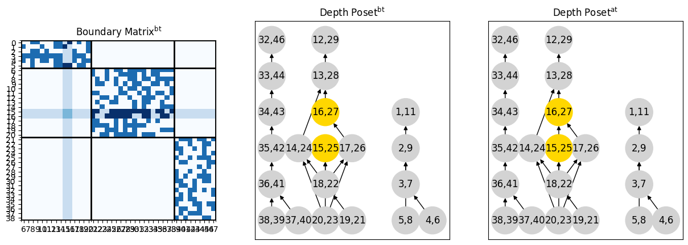

### Birth Death Pairs
|                          |                                                                                                                                                                                                               |
|:-------------------------|:--------------------------------------------------------------------------------------------------------------------------------------------------------------------------------------------------------------|
| Before the transposition | $\{(32, 46), (35, 42), (20, 23), (4, 6), (3, 7), (19, 21), (34, 43), (33, 44), (18, 22), (14, 24), (17, 26), (1, 11), (13, 28), (15, 25), (16, 27), (38, 39), (5, 8), (12, 29), (2, 9), (37, 40), (36, 41)\}$ |
| After the transposition  | $\{(32, 46), (35, 42), (20, 23), (4, 6), (3, 7), (19, 21), (34, 43), (33, 44), (18, 22), (14, 24), (17, 26), (1, 11), (13, 28), (15, 25), (16, 27), (38, 39), (5, 8), (12, 29), (2, 9), (37, 40), (36, 41)\}$ |

### Relations
|                          | Algorithm 1                                                                                                                                                                                                                                                                                                                                                                                                                                                                                     | Algorithm 2                                                                                                                                                                                                                                                                                                                                                                                                                                              |
|:-------------------------|:------------------------------------------------------------------------------------------------------------------------------------------------------------------------------------------------------------------------------------------------------------------------------------------------------------------------------------------------------------------------------------------------------------------------------------------------------------------------------------------------|:---------------------------------------------------------------------------------------------------------------------------------------------------------------------------------------------------------------------------------------------------------------------------------------------------------------------------------------------------------------------------------------------------------------------------------------------------------|
| Before the transposition | $\{(24, 30), (42, 45), (41, 43), (26, 30), (43, 46), (26, 27), (21, 28), (21, 25), (23, 28), (40, 44), (22, 26), (39, 45), (9, 11), (6, 11), (41, 42), (25, 31), (24, 29), (42, 44), (21, 24), (21, 30), (22, 25), (39, 41), (23, 24), (23, 30), (22, 28), (23, 27), (40, 43), (22, 31), (27, 30), (7, 9), (6, 10), (24, 31), (41, 47), (26, 28), (25, 30), (26, 31), (43, 47), (44, 46), (21, 26), (22, 27), (23, 26), (40, 42), (22, 24), (39, 46), (23, 29), (22, 30), (27, 29)\}$           | $\{(18, 17), (20, 14), (4, 3), (20, 17), (38, 35), (38, 32), (5, 1), (14, 13), (34, 31), (1, 0), (19, 18), (37, 30), (37, 33), (19, 15), (36, 31), (37, 36), (36, 34), (16, 10), (16, 13), (20, 13), (18, 13), (5, 0), (38, 34), (34, 30), (34, 33), (36, 30), (19, 17), (16, 12), (33, 31), (18, 15), (20, 12), (38, 30), (4, 1), (35, 34), (20, 15), (5, 2), (17, 13), (2, 0), (19, 16), (36, 32), (37, 31), (36, 35), (37, 34), (13, 12), (33, 30)\}$ |
| After the transposition  | $\{(24, 30), (25, 29), (42, 45), (41, 43), (26, 30), (43, 46), (26, 27), (21, 28), (21, 25), (23, 28), (40, 44), (22, 26), (39, 45), (9, 11), (6, 11), (41, 42), (25, 31), (24, 29), (42, 44), (21, 24), (21, 30), (22, 25), (39, 41), (23, 24), (23, 30), (22, 28), (23, 27), (40, 43), (22, 31), (27, 30), (7, 9), (6, 10), (25, 27), (24, 31), (41, 47), (26, 28), (26, 31), (43, 47), (44, 46), (21, 26), (22, 27), (23, 26), (40, 42), (22, 24), (39, 46), (23, 29), (22, 30), (27, 29)\}$ | $\{(18, 17), (20, 14), (4, 3), (20, 17), (38, 35), (38, 32), (5, 1), (14, 13), (34, 31), (1, 0), (37, 30), (19, 18), (37, 33), (36, 31), (19, 15), (37, 36), (36, 34), (16, 10), (16, 13), (20, 13), (18, 13), (5, 0), (38, 34), (34, 30), (34, 33), (36, 30), (19, 17), (16, 12), (33, 31), (18, 15), (20, 12), (38, 30), (4, 1), (35, 34), (20, 15), (5, 2), (17, 13), (2, 0), (19, 16), (36, 32), (37, 31), (36, 35), (37, 34), (13, 12), (33, 30)\}$ |

### Successors and Predecessers
No such node in the Depth Poset

### Temp Sets
|                                                               | Before the Transposition                                                                                  | After the Transposition                                                                                   |
|:--------------------------------------------------------------|:----------------------------------------------------------------------------------------------------------|:----------------------------------------------------------------------------------------------------------|
| $\mathcal{L} = \{(s, t)\in \text{BD}:\; f(t) < f(y)\}$        | $\{(14, 24), (17, 26), (5, 8), (1, 11), (3, 7), (20, 23), (4, 6), (2, 9), (18, 22), (15, 25), (19, 21)\}$ | $\{(14, 24), (17, 26), (5, 8), (1, 11), (3, 7), (20, 23), (4, 6), (2, 9), (18, 22), (15, 25), (19, 21)\}$ |
| $\mathcal{M} = \{(s, t)\in \text{BD}:\; f(y) < f(t) < f(b)\}$ | $\emptyset$                                                                                               | $\emptyset$                                                                                               |

### Equations
There are 2 equations are wrong.

| eq   | left (formula)                  | left (paramatrized)               | left (value)             | right (formula)                                                                        | right (paramatrized)                                                                         | right (value)                      | correct   |
|:-----|:--------------------------------|:----------------------------------|:-------------------------|:---------------------------------------------------------------------------------------|:---------------------------------------------------------------------------------------------|:-----------------------------------|:----------|
| Eq16 | $\text{Succ}_1^\text{at}(x, y)$ | $\text{Succ}_1^\text{at}(16, 27)$ | $\{(12, 29)\}$           | $\text{Succ}_1^\text{bt}(x, y) \oplus \{(a, b)\} \oplus \text{Succ}_1^\text{bt}(a, b)$ | $\text{Succ}_1^\text{bt}(16, 27) \oplus \{(15, 25)\} \oplus \text{Succ}_1^\text{bt}(15, 25)$ | $\{(12, 29), (15, 25)\}$           | ✘         |
| Eq17 | $\text{Pred}_1^\text{at}(a, b)$ | $\text{Pred}_1^\text{at}(15, 25)$ | $\{(18, 22), (19, 21)\}$ | $\text{Pred}_1^\text{bt}(a, b) \oplus \{(x, y)\}$                                      | $\text{Pred}_1^\text{bt}(15, 25) \oplus \{(16, 27)\}$                                        | $\{(18, 22), (16, 27), (19, 21)\}$ | ✘         |

## Transposition <18, 19> in complex 19
Here is a __birth-birth__ __switch forward__ transposition <18, 19>.

$$
a = 18, \; b = 22, \; x = 19, \; y = 21
$$

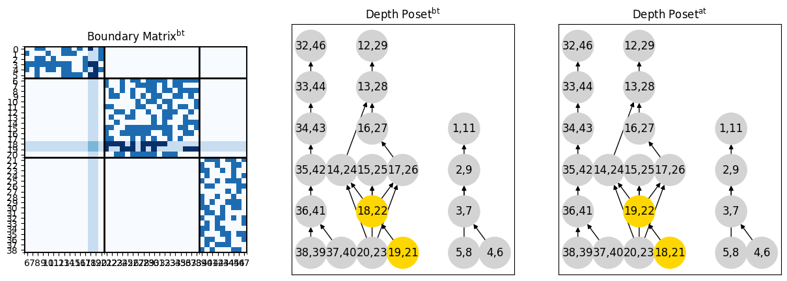

### Birth Death Pairs
|                          |                                                                                                                                                                                                               |
|:-------------------------|:--------------------------------------------------------------------------------------------------------------------------------------------------------------------------------------------------------------|
| Before the transposition | $\{(32, 46), (35, 42), (20, 23), (4, 6), (3, 7), (19, 21), (34, 43), (33, 44), (18, 22), (14, 24), (17, 26), (1, 11), (13, 28), (15, 25), (16, 27), (38, 39), (5, 8), (12, 29), (2, 9), (37, 40), (36, 41)\}$ |
| After the transposition  | $\{(32, 46), (35, 42), (20, 23), (4, 6), (3, 7), (34, 43), (33, 44), (14, 24), (17, 26), (1, 11), (13, 28), (15, 25), (18, 21), (16, 27), (38, 39), (5, 8), (12, 29), (2, 9), (37, 40), (19, 22), (36, 41)\}$ |

### Relations
|                          | Algorithm 1                                                                                                                                                                                                                                                                                                                                                                                                                                                                           | Algorithm 2                                                                                                                                                                                                                                                                                                                                                                                                                                              |
|:-------------------------|:--------------------------------------------------------------------------------------------------------------------------------------------------------------------------------------------------------------------------------------------------------------------------------------------------------------------------------------------------------------------------------------------------------------------------------------------------------------------------------------|:---------------------------------------------------------------------------------------------------------------------------------------------------------------------------------------------------------------------------------------------------------------------------------------------------------------------------------------------------------------------------------------------------------------------------------------------------------|
| Before the transposition | $\{(24, 30), (42, 45), (41, 43), (26, 30), (43, 46), (26, 27), (21, 28), (21, 25), (23, 28), (40, 44), (22, 26), (39, 45), (9, 11), (6, 11), (41, 42), (25, 31), (24, 29), (42, 44), (21, 24), (21, 30), (22, 25), (39, 41), (23, 24), (23, 30), (22, 28), (23, 27), (40, 43), (22, 31), (27, 30), (7, 9), (6, 10), (24, 31), (41, 47), (26, 28), (25, 30), (26, 31), (43, 47), (44, 46), (21, 26), (22, 27), (23, 26), (40, 42), (22, 24), (39, 46), (23, 29), (22, 30), (27, 29)\}$ | $\{(18, 17), (20, 14), (4, 3), (20, 17), (38, 35), (38, 32), (5, 1), (14, 13), (34, 31), (1, 0), (19, 18), (37, 30), (37, 33), (19, 15), (36, 31), (37, 36), (36, 34), (16, 10), (16, 13), (20, 13), (18, 13), (5, 0), (38, 34), (34, 30), (34, 33), (36, 30), (19, 17), (16, 12), (33, 31), (18, 15), (20, 12), (38, 30), (4, 1), (35, 34), (20, 15), (5, 2), (17, 13), (2, 0), (19, 16), (36, 32), (37, 31), (36, 35), (37, 34), (13, 12), (33, 30)\}$ |
| After the transposition  | $\{(24, 30), (42, 45), (41, 43), (26, 30), (43, 46), (26, 27), (21, 22), (21, 31), (23, 28), (40, 44), (22, 26), (39, 45), (9, 11), (6, 11), (41, 42), (25, 31), (24, 29), (42, 44), (22, 25), (39, 41), (23, 24), (23, 30), (21, 27), (22, 28), (23, 27), (40, 43), (22, 31), (27, 30), (7, 9), (6, 10), (24, 31), (41, 47), (26, 28), (25, 30), (26, 31), (43, 47), (44, 46), (22, 27), (23, 26), (40, 42), (22, 24), (39, 46), (23, 29), (22, 30), (27, 29)\}$                     | $\{(18, 17), (20, 14), (4, 3), (20, 17), (38, 35), (38, 32), (5, 1), (14, 13), (34, 31), (1, 0), (37, 30), (37, 33), (36, 31), (37, 36), (36, 34), (16, 10), (16, 13), (18, 16), (20, 13), (18, 19), (5, 0), (38, 34), (34, 30), (34, 33), (36, 30), (16, 12), (33, 31), (18, 15), (20, 12), (38, 30), (4, 1), (35, 34), (20, 15), (5, 2), (17, 13), (2, 0), (19, 16), (36, 32), (19, 13), (37, 31), (36, 35), (37, 34), (13, 12), (33, 30)\}$           |

### Successors and Predecessers
|                 | $\text{Set}^\text{bt}(18, 22)$                                                           | $\text{Set}^\text{bt}(19, 21)$                                                 | $\text{Set}^\text{at}(18, 21)$                                                 | $\text{Set}^\text{at}(19, 22)$                                                           |
|:----------------|:-----------------------------------------------------------------------------------------|:-------------------------------------------------------------------------------|:-------------------------------------------------------------------------------|:-----------------------------------------------------------------------------------------|
| $\text{Succ}_1$ | $\text{Succ}_1^\text{bt}(18, 22) = \{(14, 24), (17, 26), (13, 28), (15, 25), (16, 27)\}$ | $\text{Succ}_1^\text{bt}(19, 21) = \{(17, 26), (14, 24), (13, 28), (15, 25)\}$ | $\text{Succ}_1^\text{at}(18, 21) = \{(16, 27), (19, 22)\}$                     | $\text{Succ}_1^\text{at}(19, 22) = \{(14, 24), (17, 26), (13, 28), (15, 25), (16, 27)\}$ |
| $\text{Pred}_1$ | $\text{Pred}_1^\text{bt}(18, 22) = \emptyset$                                            | $\text{Pred}_1^\text{bt}(19, 21) = \emptyset$                                  | $\text{Pred}_1^\text{at}(18, 21) = \emptyset$                                  | $\text{Pred}_1^\text{at}(19, 22) = \{(18, 21)\}$                                         |
| $\text{Succ}_2$ | $\text{Succ}_2^\text{bt}(18, 22) = \{(17, 26), (13, 28), (15, 25)\}$                     | $\text{Succ}_2^\text{bt}(19, 21) = \{(18, 22), (16, 27), (17, 26), (15, 25)\}$ | $\text{Succ}_2^\text{at}(18, 21) = \{(17, 26), (16, 27), (19, 22), (15, 25)\}$ | $\text{Succ}_2^\text{at}(19, 22) = \{(16, 27), (13, 28)\}$                               |
| $\text{Pred}_2$ | $\text{Pred}_2^\text{bt}(18, 22) = \{(19, 21)\}$                                         | $\text{Pred}_2^\text{bt}(19, 21) = \emptyset$                                  | $\text{Pred}_2^\text{at}(18, 21) = \emptyset$                                  | $\text{Pred}_2^\text{at}(19, 22) = \{(18, 21)\}$                                         |

### Temp Sets
|                                                               | Before the Transposition                      | After the Transposition                       |
|:--------------------------------------------------------------|:----------------------------------------------|:----------------------------------------------|
| $\mathcal{L} = \{(s, t)\in \text{BD}:\; f(t) < f(y)\}$        | $\{(5, 8), (1, 11), (3, 7), (4, 6), (2, 9)\}$ | $\{(5, 8), (1, 11), (3, 7), (4, 6), (2, 9)\}$ |
| $\mathcal{M} = \{(s, t)\in \text{BD}:\; f(y) < f(t) < f(b)\}$ | $\emptyset$                                   | $\emptyset$                                   |

### Equations
There are 1 equations are wrong.

| eq   | left (formula)                  | left (paramatrized)               | left (value)                                           | right (formula)                                                                                           | right (paramatrized)                                                                                            | right (value)                                          | correct   |
|:-----|:--------------------------------|:----------------------------------|:-------------------------------------------------------|:----------------------------------------------------------------------------------------------------------|:----------------------------------------------------------------------------------------------------------------|:-------------------------------------------------------|:----------|
| Eq08 | $\text{Succ}_1^\text{at}(a, y)$ | $\text{Succ}_1^\text{at}(18, 21)$ | $\{(16, 27), (19, 22)\}$                               | $\text{Succ}_1^\text{bt}(x, y) \oplus \{(x, b)\} \oplus \text{Succ}_1^\text{bt}(a, b)$                    | $\text{Succ}_1^\text{bt}(19, 21) \oplus \{(19, 22)\} \oplus \text{Succ}_1^\text{bt}(18, 22)$                    | $\{(16, 27), (19, 22)\}$                               | ✔         |
| Eq09 | $\text{Succ}_1^\text{at}(x, b)$ | $\text{Succ}_1^\text{at}(19, 22)$ | $\{(14, 24), (17, 26), (13, 28), (15, 25), (16, 27)\}$ | $\text{Succ}_1^\text{bt}(a, b)$                                                                           | $\text{Succ}_1^\text{bt}(18, 22)$                                                                               | $\{(14, 24), (17, 26), (13, 28), (15, 25), (16, 27)\}$ | ✔         |
| Eq10 | $\text{Pred}_1^\text{at}(a, y)$ | $\text{Pred}_1^\text{at}(18, 21)$ | $\emptyset$                                            | $\text{Pred}_1^\text{bt}(x, y)$                                                                           | $\text{Pred}_1^\text{bt}(19, 21)$                                                                               | $\emptyset$                                            | ✔         |
| Eq11 | $\text{Pred}_1^\text{at}(x, b)$ | $\text{Pred}_1^\text{at}(19, 22)$ | $\{(18, 21)\}$                                         | $\text{Pred}_1^\text{bt}(a, b) \oplus \{(a, y)\}$                                                         | $\text{Pred}_1^\text{bt}(18, 22) \oplus \{(18, 21)\}$                                                           | $\{(18, 21)\}$                                         | ✔         |
| Eq12 | $\text{Succ}_2^\text{at}(a, y)$ | $\text{Succ}_2^\text{at}(18, 21)$ | $\{(17, 26), (16, 27), (19, 22), (15, 25)\}$           | $\text{Succ}_2^\text{bt}(x, y) \oplus \{(x, b), (a, b)\}$                                                 | $\text{Succ}_2^\text{bt}(19, 21) \oplus \{(19, 22), (18, 22)\}$                                                 | $\{(15, 25), (16, 27), (19, 22), (17, 26)\}$           | ✔         |
| Eq13 | $\text{Succ}_2^\text{at}(x, b)$ | $\text{Succ}_2^\text{at}(19, 22)$ | $\{(16, 27), (13, 28)\}$                               | $\text{Succ}_2^\text{bt}(a, b)$                                                                           | $\text{Succ}_2^\text{bt}(18, 22)$                                                                               | $\{(17, 26), (13, 28), (15, 25)\}$                     | ✘         |
| Eq14 | $\text{Pred}_2^\text{at}(a, y)$ | $\text{Pred}_2^\text{at}(18, 21)$ | $\emptyset$                                            | $[\text{Pred}_2^\text{bt}(a, b) \cap \mathcal{L}]$                                                        | $[\text{Pred}_2^\text{bt}(18, 22) \cap \mathcal{L}]$                                                            | $\emptyset$                                            | ✔         |
| Eq15 | $\text{Pred}_2^\text{at}(x, b)$ | $\text{Pred}_2^\text{at}(19, 22)$ | $\{(18, 21)\}$                                         | $\text{Pred}_2^\text{bt}(x, y) \oplus \{(a, y)\} \oplus [\text{Pred}_2^\text{bt}(a, b) \cap \mathcal{M}]$ | $\text{Pred}_2^\text{bt}(19, 21) \oplus \{(18, 21)\} \oplus [\text{Pred}_2^\text{bt}(18, 22) \cap \mathcal{M}]$ | $\{(18, 21)\}$                                         | ✔         |

## Transposition <22, 23> in complex 19
Here is a __death-death__ __no switch__ transposition <22, 23>.

$$
a = 20, \; b = 23, \; x = 18, \; y = 22
$$

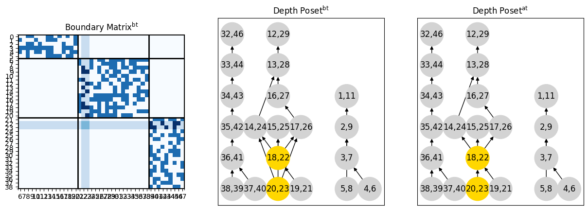

### Birth Death Pairs
|                          |                                                                                                                                                                                                               |
|:-------------------------|:--------------------------------------------------------------------------------------------------------------------------------------------------------------------------------------------------------------|
| Before the transposition | $\{(32, 46), (35, 42), (20, 23), (4, 6), (3, 7), (19, 21), (34, 43), (33, 44), (18, 22), (14, 24), (17, 26), (1, 11), (13, 28), (15, 25), (16, 27), (38, 39), (5, 8), (12, 29), (2, 9), (37, 40), (36, 41)\}$ |
| After the transposition  | $\{(32, 46), (35, 42), (20, 23), (4, 6), (3, 7), (19, 21), (34, 43), (33, 44), (18, 22), (14, 24), (17, 26), (1, 11), (13, 28), (15, 25), (16, 27), (38, 39), (5, 8), (12, 29), (2, 9), (37, 40), (36, 41)\}$ |

### Relations
|                          | Algorithm 1                                                                                                                                                                                                                                                                                                                                                                                                                                                                           | Algorithm 2                                                                                                                                                                                                                                                                                                                                                                                                                                              |
|:-------------------------|:--------------------------------------------------------------------------------------------------------------------------------------------------------------------------------------------------------------------------------------------------------------------------------------------------------------------------------------------------------------------------------------------------------------------------------------------------------------------------------------|:---------------------------------------------------------------------------------------------------------------------------------------------------------------------------------------------------------------------------------------------------------------------------------------------------------------------------------------------------------------------------------------------------------------------------------------------------------|
| Before the transposition | $\{(24, 30), (42, 45), (41, 43), (26, 30), (43, 46), (26, 27), (21, 28), (21, 25), (23, 28), (40, 44), (22, 26), (39, 45), (9, 11), (6, 11), (41, 42), (25, 31), (24, 29), (42, 44), (21, 24), (21, 30), (22, 25), (39, 41), (23, 24), (23, 30), (22, 28), (23, 27), (40, 43), (22, 31), (27, 30), (7, 9), (6, 10), (24, 31), (41, 47), (26, 28), (25, 30), (26, 31), (43, 47), (44, 46), (21, 26), (22, 27), (23, 26), (40, 42), (22, 24), (39, 46), (23, 29), (22, 30), (27, 29)\}$ | $\{(18, 17), (20, 14), (4, 3), (20, 17), (38, 35), (38, 32), (5, 1), (14, 13), (34, 31), (1, 0), (19, 18), (37, 30), (37, 33), (19, 15), (36, 31), (37, 36), (36, 34), (16, 10), (16, 13), (20, 13), (18, 13), (5, 0), (38, 34), (34, 30), (34, 33), (36, 30), (19, 17), (16, 12), (33, 31), (18, 15), (20, 12), (38, 30), (4, 1), (35, 34), (20, 15), (5, 2), (17, 13), (2, 0), (19, 16), (36, 32), (37, 31), (36, 35), (37, 34), (13, 12), (33, 30)\}$ |
| After the transposition  | $\{(24, 30), (42, 45), (41, 43), (26, 30), (43, 46), (26, 27), (21, 28), (21, 25), (23, 28), (40, 44), (22, 26), (39, 45), (9, 11), (6, 11), (41, 42), (25, 31), (24, 29), (42, 44), (21, 24), (21, 30), (22, 25), (39, 41), (23, 24), (23, 30), (22, 28), (23, 27), (40, 43), (22, 31), (27, 30), (7, 9), (6, 10), (24, 31), (41, 47), (26, 28), (25, 30), (26, 31), (43, 47), (44, 46), (21, 26), (22, 27), (23, 26), (22, 24), (22, 30), (40, 42), (23, 29), (39, 46), (27, 29)\}$ | $\{(18, 17), (20, 14), (4, 3), (38, 35), (38, 32), (5, 1), (14, 13), (34, 31), (1, 0), (37, 30), (19, 18), (19, 15), (37, 33), (36, 31), (37, 36), (36, 34), (16, 10), (16, 13), (18, 13), (5, 0), (38, 34), (34, 30), (34, 33), (36, 30), (19, 17), (16, 12), (33, 31), (18, 15), (20, 12), (20, 18), (4, 1), (38, 30), (35, 34), (5, 2), (17, 13), (2, 0), (19, 16), (36, 32), (37, 31), (36, 35), (37, 34), (13, 12), (33, 30)\}$                     |

### Successors and Predecessers
No such node in the Depth Poset

### Temp Sets
|                                                               | Before the Transposition                                                                       | After the Transposition                                                                        |
|:--------------------------------------------------------------|:-----------------------------------------------------------------------------------------------|:-----------------------------------------------------------------------------------------------|
| $\mathcal{B} = \{(s, t)\in \text{BD}:\; f(s) > f(x)\}$        | $\{(34, 43), (38, 39), (32, 46), (35, 42), (20, 23), (33, 44), (37, 40), (36, 41), (19, 21)\}$ | $\{(34, 43), (38, 39), (32, 46), (35, 42), (20, 23), (33, 44), (37, 40), (36, 41), (19, 21)\}$ |
| $\mathcal{N} = \{(s, t)\in \text{BD}:\; f(x) > f(s) > f(a)\}$ | $\emptyset$                                                                                    | $\emptyset$                                                                                    |

### Equations
There are 2 equations are wrong.

| eq   | left (formula)                  | left (paramatrized)               | left (value)                       | right (formula)                                                                        | right (paramatrized)                                                                         | right (value)                      | correct   |
|:-----|:--------------------------------|:----------------------------------|:-----------------------------------|:---------------------------------------------------------------------------------------|:---------------------------------------------------------------------------------------------|:-----------------------------------|:----------|
| Eq36 | $\text{Succ}_2^\text{at}(x, y)$ | $\text{Succ}_2^\text{at}(18, 22)$ | $\{(17, 26), (13, 28), (15, 25)\}$ | $\text{Succ}_2^\text{bt}(x, y) \oplus \{(a, b)\} \oplus \text{Succ}_2^\text{bt}(a, b)$ | $\text{Succ}_2^\text{bt}(18, 22) \oplus \{(20, 23)\} \oplus \text{Succ}_2^\text{bt}(20, 23)$ | $\{(14, 24), (20, 23), (12, 29)\}$ | ✘         |
| Eq37 | $\text{Pred}_2^\text{at}(a, b)$ | $\text{Pred}_2^\text{at}(20, 23)$ | $\emptyset$                        | $\text{Pred}_2^\text{bt}(a, b) \oplus \{(x, y)\}$                                      | $\text{Pred}_2^\text{bt}(20, 23) \oplus \{(18, 22)\}$                                        | $\{(18, 22)\}$                     | ✘         |

## Transposition <25, 26> in complex 19
Here is a __death-death__ __no switch__ transposition <25, 26>.

$$
a = 17, \; b = 26, \; x = 15, \; y = 25
$$

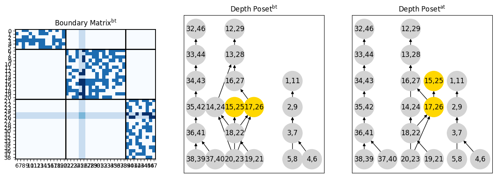

### Birth Death Pairs
|                          |                                                                                                                                                                                                               |
|:-------------------------|:--------------------------------------------------------------------------------------------------------------------------------------------------------------------------------------------------------------|
| Before the transposition | $\{(32, 46), (35, 42), (20, 23), (4, 6), (3, 7), (19, 21), (34, 43), (33, 44), (18, 22), (14, 24), (17, 26), (1, 11), (13, 28), (15, 25), (16, 27), (38, 39), (5, 8), (12, 29), (2, 9), (37, 40), (36, 41)\}$ |
| After the transposition  | $\{(32, 46), (35, 42), (20, 23), (4, 6), (3, 7), (19, 21), (34, 43), (33, 44), (18, 22), (14, 24), (17, 26), (1, 11), (13, 28), (15, 25), (16, 27), (38, 39), (5, 8), (12, 29), (2, 9), (37, 40), (36, 41)\}$ |

### Relations
|                          | Algorithm 1                                                                                                                                                                                                                                                                                                                                                                                                                                                                           | Algorithm 2                                                                                                                                                                                                                                                                                                                                                                                                                                                        |
|:-------------------------|:--------------------------------------------------------------------------------------------------------------------------------------------------------------------------------------------------------------------------------------------------------------------------------------------------------------------------------------------------------------------------------------------------------------------------------------------------------------------------------------|:-------------------------------------------------------------------------------------------------------------------------------------------------------------------------------------------------------------------------------------------------------------------------------------------------------------------------------------------------------------------------------------------------------------------------------------------------------------------|
| Before the transposition | $\{(24, 30), (42, 45), (41, 43), (26, 30), (43, 46), (26, 27), (21, 28), (21, 25), (23, 28), (40, 44), (22, 26), (39, 45), (9, 11), (6, 11), (41, 42), (25, 31), (24, 29), (42, 44), (21, 24), (21, 30), (22, 25), (39, 41), (23, 24), (23, 30), (22, 28), (23, 27), (40, 43), (22, 31), (27, 30), (7, 9), (6, 10), (24, 31), (41, 47), (26, 28), (25, 30), (26, 31), (43, 47), (44, 46), (21, 26), (22, 27), (23, 26), (40, 42), (22, 24), (39, 46), (23, 29), (22, 30), (27, 29)\}$ | $\{(18, 17), (20, 14), (4, 3), (20, 17), (38, 35), (38, 32), (5, 1), (14, 13), (34, 31), (1, 0), (19, 18), (37, 30), (37, 33), (19, 15), (36, 31), (37, 36), (36, 34), (16, 10), (16, 13), (20, 13), (18, 13), (5, 0), (38, 34), (34, 30), (34, 33), (36, 30), (19, 17), (16, 12), (33, 31), (18, 15), (20, 12), (38, 30), (4, 1), (35, 34), (20, 15), (5, 2), (17, 13), (2, 0), (19, 16), (36, 32), (37, 31), (36, 35), (37, 34), (13, 12), (33, 30)\}$           |
| After the transposition  | $\{(24, 30), (42, 45), (41, 43), (26, 30), (43, 46), (26, 27), (21, 28), (21, 25), (23, 28), (40, 44), (22, 26), (39, 45), (9, 11), (6, 11), (41, 42), (25, 31), (24, 29), (42, 44), (21, 24), (21, 30), (22, 25), (39, 41), (23, 24), (23, 30), (22, 28), (23, 27), (40, 43), (22, 31), (27, 30), (7, 9), (6, 10), (24, 31), (26, 28), (25, 30), (41, 47), (26, 31), (43, 47), (44, 46), (21, 26), (22, 27), (23, 26), (40, 42), (22, 24), (39, 46), (23, 29), (22, 30), (27, 29)\}$ | $\{(18, 17), (20, 14), (4, 3), (20, 17), (38, 35), (38, 32), (5, 1), (14, 13), (17, 15), (34, 31), (1, 0), (37, 30), (19, 18), (19, 15), (37, 33), (36, 31), (37, 36), (36, 34), (16, 10), (16, 13), (20, 13), (18, 13), (5, 0), (38, 34), (34, 30), (34, 33), (36, 30), (19, 17), (16, 12), (33, 31), (18, 15), (20, 12), (38, 30), (4, 1), (35, 34), (20, 15), (5, 2), (17, 13), (2, 0), (19, 16), (36, 32), (37, 31), (36, 35), (37, 34), (13, 12), (33, 30)\}$ |

### Successors and Predecessers
No such node in the Depth Poset

### Temp Sets
|                                                               | Before the Transposition                                                                                                     | After the Transposition                                                                                                      |
|:--------------------------------------------------------------|:-----------------------------------------------------------------------------------------------------------------------------|:-----------------------------------------------------------------------------------------------------------------------------|
| $\mathcal{B} = \{(s, t)\in \text{BD}:\; f(s) > f(x)\}$        | $\{(34, 43), (17, 26), (38, 39), (32, 46), (35, 42), (20, 23), (19, 21), (33, 44), (18, 22), (37, 40), (36, 41), (16, 27)\}$ | $\{(34, 43), (17, 26), (38, 39), (32, 46), (35, 42), (20, 23), (19, 21), (33, 44), (18, 22), (37, 40), (36, 41), (16, 27)\}$ |
| $\mathcal{N} = \{(s, t)\in \text{BD}:\; f(x) > f(s) > f(a)\}$ | $\emptyset$                                                                                                                  | $\emptyset$                                                                                                                  |

### Equations
There are 2 equations are wrong.

| eq   | left (formula)                  | left (paramatrized)               | left (value)                       | right (formula)                                                                        | right (paramatrized)                                                                         | right (value)                                | correct   |
|:-----|:--------------------------------|:----------------------------------|:-----------------------------------|:---------------------------------------------------------------------------------------|:---------------------------------------------------------------------------------------------|:---------------------------------------------|:----------|
| Eq36 | $\text{Succ}_2^\text{at}(x, y)$ | $\text{Succ}_2^\text{at}(15, 25)$ | $\emptyset$                        | $\text{Succ}_2^\text{bt}(x, y) \oplus \{(a, b)\} \oplus \text{Succ}_2^\text{bt}(a, b)$ | $\text{Succ}_2^\text{bt}(15, 25) \oplus \{(17, 26)\} \oplus \text{Succ}_2^\text{bt}(17, 26)$ | $\{(13, 28), (17, 26)\}$                     | ✘         |
| Eq37 | $\text{Pred}_2^\text{at}(a, b)$ | $\text{Pred}_2^\text{at}(17, 26)$ | $\{(18, 22), (20, 23), (19, 21)\}$ | $\text{Pred}_2^\text{bt}(a, b) \oplus \{(x, y)\}$                                      | $\text{Pred}_2^\text{bt}(17, 26) \oplus \{(15, 25)\}$                                        | $\{(18, 22), (20, 23), (19, 21), (15, 25)\}$ | ✘         |

## Transposition <26, 27> in complex 19
Here is a __death-death__ __switch forward__ transposition <26, 27>.

$$
a = 16, \; b = 27, \; x = 17, \; y = 26
$$

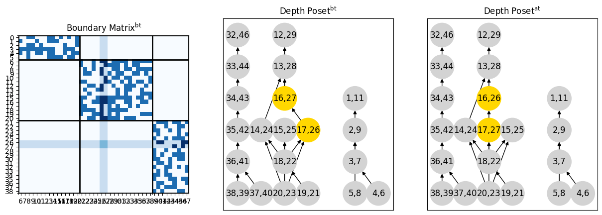

### Birth Death Pairs
|                          |                                                                                                                                                                                                               |
|:-------------------------|:--------------------------------------------------------------------------------------------------------------------------------------------------------------------------------------------------------------|
| Before the transposition | $\{(32, 46), (35, 42), (20, 23), (4, 6), (3, 7), (19, 21), (34, 43), (33, 44), (18, 22), (14, 24), (17, 26), (1, 11), (13, 28), (15, 25), (16, 27), (38, 39), (5, 8), (12, 29), (2, 9), (37, 40), (36, 41)\}$ |
| After the transposition  | $\{(16, 26), (32, 46), (35, 42), (20, 23), (4, 6), (3, 7), (19, 21), (17, 27), (34, 43), (33, 44), (18, 22), (14, 24), (1, 11), (13, 28), (15, 25), (38, 39), (5, 8), (12, 29), (2, 9), (37, 40), (36, 41)\}$ |

### Relations
|                          | Algorithm 1                                                                                                                                                                                                                                                                                                                                                                                                                                                                                     | Algorithm 2                                                                                                                                                                                                                                                                                                                                                                                                                                                                  |
|:-------------------------|:------------------------------------------------------------------------------------------------------------------------------------------------------------------------------------------------------------------------------------------------------------------------------------------------------------------------------------------------------------------------------------------------------------------------------------------------------------------------------------------------|:-----------------------------------------------------------------------------------------------------------------------------------------------------------------------------------------------------------------------------------------------------------------------------------------------------------------------------------------------------------------------------------------------------------------------------------------------------------------------------|
| Before the transposition | $\{(24, 30), (42, 45), (41, 43), (26, 30), (43, 46), (26, 27), (21, 28), (21, 25), (23, 28), (40, 44), (22, 26), (39, 45), (9, 11), (6, 11), (41, 42), (25, 31), (24, 29), (42, 44), (21, 24), (21, 30), (22, 25), (39, 41), (23, 24), (23, 30), (22, 28), (23, 27), (40, 43), (22, 31), (27, 30), (7, 9), (6, 10), (24, 31), (41, 47), (26, 28), (25, 30), (26, 31), (43, 47), (44, 46), (21, 26), (22, 27), (23, 26), (40, 42), (22, 24), (39, 46), (23, 29), (22, 30), (27, 29)\}$           | $\{(18, 17), (20, 14), (4, 3), (20, 17), (38, 35), (38, 32), (5, 1), (14, 13), (34, 31), (1, 0), (19, 18), (37, 30), (37, 33), (19, 15), (36, 31), (37, 36), (36, 34), (16, 10), (16, 13), (20, 13), (18, 13), (5, 0), (38, 34), (34, 30), (34, 33), (36, 30), (19, 17), (16, 12), (33, 31), (18, 15), (20, 12), (38, 30), (4, 1), (35, 34), (20, 15), (5, 2), (17, 13), (2, 0), (19, 16), (36, 32), (37, 31), (36, 35), (37, 34), (13, 12), (33, 30)\}$                     |
| After the transposition  | $\{(24, 30), (42, 45), (41, 43), (43, 46), (21, 28), (21, 25), (23, 28), (40, 44), (22, 26), (39, 45), (9, 11), (27, 28), (27, 31), (6, 11), (41, 42), (25, 31), (24, 29), (42, 44), (26, 29), (21, 24), (21, 30), (22, 25), (39, 41), (23, 24), (23, 30), (22, 28), (23, 27), (40, 43), (22, 31), (27, 30), (7, 9), (6, 10), (24, 31), (26, 28), (41, 47), (25, 30), (26, 31), (43, 47), (44, 46), (21, 26), (22, 27), (23, 26), (40, 42), (22, 24), (39, 46), (23, 29), (22, 30), (27, 26)\}$ | $\{(18, 17), (20, 14), (4, 3), (20, 17), (38, 35), (38, 32), (5, 1), (14, 13), (17, 12), (34, 31), (1, 0), (37, 30), (19, 18), (19, 15), (37, 33), (36, 31), (37, 36), (36, 34), (16, 10), (16, 13), (20, 13), (18, 13), (5, 0), (38, 34), (34, 30), (34, 33), (36, 30), (19, 17), (16, 12), (33, 31), (18, 15), (20, 12), (38, 30), (4, 1), (35, 34), (20, 15), (5, 2), (17, 10), (17, 16), (2, 0), (19, 16), (36, 32), (37, 31), (36, 35), (37, 34), (13, 12), (33, 30)\}$ |

### Successors and Predecessers
|                 | $\text{Set}^\text{bt}(16, 27)$                                       | $\text{Set}^\text{bt}(17, 26)$                                       | $\text{Set}^\text{at}(17, 27)$                                       | $\text{Set}^\text{at}(16, 26)$                                                 |
|:----------------|:---------------------------------------------------------------------|:---------------------------------------------------------------------|:---------------------------------------------------------------------|:-------------------------------------------------------------------------------|
| $\text{Succ}_1$ | $\text{Succ}_1^\text{bt}(16, 27) = \{(12, 29)\}$                     | $\text{Succ}_1^\text{bt}(17, 26) = \{(16, 27), (13, 28)\}$           | $\text{Succ}_1^\text{at}(17, 27) = \{(16, 26), (13, 28)\}$           | $\text{Succ}_1^\text{at}(16, 26) = \{(12, 29), (13, 28)\}$                     |
| $\text{Pred}_1$ | $\text{Pred}_1^\text{bt}(16, 27) = \{(18, 22), (20, 23), (17, 26)\}$ | $\text{Pred}_1^\text{bt}(17, 26) = \{(18, 22), (20, 23), (19, 21)\}$ | $\text{Pred}_1^\text{at}(17, 27) = \{(18, 22), (20, 23)\}$           | $\text{Pred}_1^\text{at}(16, 26) = \{(18, 22), (20, 23), (19, 21), (17, 27)\}$ |
| $\text{Succ}_2$ | $\text{Succ}_2^\text{bt}(16, 27) = \{(12, 29), (13, 28)\}$           | $\text{Succ}_2^\text{bt}(17, 26) = \{(13, 28)\}$                     | $\text{Succ}_2^\text{at}(17, 27) = \{(16, 26), (12, 29)\}$           | $\text{Succ}_2^\text{at}(16, 26) = \{(12, 29), (13, 28)\}$                     |
| $\text{Pred}_2$ | $\text{Pred}_2^\text{bt}(16, 27) = \{(19, 21)\}$                     | $\text{Pred}_2^\text{bt}(17, 26) = \{(18, 22), (20, 23), (19, 21)\}$ | $\text{Pred}_2^\text{at}(17, 27) = \{(18, 22), (20, 23), (19, 21)\}$ | $\text{Pred}_2^\text{at}(16, 26) = \{(19, 21), (17, 27)\}$                     |

### Temp Sets
|                                                               | Before the Transposition                                                                                 | After the Transposition                                                                                  |
|:--------------------------------------------------------------|:---------------------------------------------------------------------------------------------------------|:---------------------------------------------------------------------------------------------------------|
| $\mathcal{B} = \{(s, t)\in \text{BD}:\; f(s) > f(x)\}$        | $\{(34, 43), (38, 39), (32, 46), (35, 42), (20, 23), (33, 44), (18, 22), (37, 40), (36, 41), (19, 21)\}$ | $\{(34, 43), (38, 39), (32, 46), (35, 42), (20, 23), (33, 44), (18, 22), (37, 40), (36, 41), (19, 21)\}$ |
| $\mathcal{N} = \{(s, t)\in \text{BD}:\; f(x) > f(s) > f(a)\}$ | $\emptyset$                                                                                              | $\emptyset$                                                                                              |

### Equations
There are 1 equations are wrong.

| eq   | left (formula)                  | left (paramatrized)               | left (value)                                 | right (formula)                                                                                          | right (paramatrized)                                                                                           | right (value)                                | correct   |
|:-----|:--------------------------------|:----------------------------------|:---------------------------------------------|:---------------------------------------------------------------------------------------------------------|:---------------------------------------------------------------------------------------------------------------|:---------------------------------------------|:----------|
| Eq28 | $\text{Succ}_1^\text{at}(x, b)$ | $\text{Succ}_1^\text{at}(17, 27)$ | $\{(16, 26), (13, 28)\}$                     | $\text{Succ}_1^\text{bt}(x, y) \oplus \{(a, y), (a, b)\}$                                                | $\text{Succ}_1^\text{bt}(17, 26) \oplus \{(16, 26), (16, 27)\}$                                                | $\{(16, 26), (13, 28)\}$                     | ✔         |
| Eq29 | $\text{Succ}_1^\text{at}(a, y)$ | $\text{Succ}_1^\text{at}(16, 26)$ | $\{(12, 29), (13, 28)\}$                     | $\text{Succ}_1^\text{bt}(a, b)$                                                                          | $\text{Succ}_1^\text{bt}(16, 27)$                                                                              | $\{(12, 29)\}$                               | ✘         |
| Eq30 | $\text{Pred}_1^\text{at}(x, b)$ | $\text{Pred}_1^\text{at}(17, 27)$ | $\{(18, 22), (20, 23)\}$                     | $[\text{Pred}_1^\text{bt}(a, b) \cap \mathcal{B}]$                                                       | $[\text{Pred}_1^\text{bt}(16, 27) \cap \mathcal{B}]$                                                           | $\{(18, 22), (20, 23)\}$                     | ✔         |
| Eq31 | $\text{Pred}_1^\text{at}(a, y)$ | $\text{Pred}_1^\text{at}(16, 26)$ | $\{(18, 22), (20, 23), (19, 21), (17, 27)\}$ | $\text{Pred}_1^\text{bt}(x, y) \oplus \{(x, b)\} \oplus[\text{Pred}_1^\text{bt}(a, b) \cap \mathcal{N}]$ | $\text{Pred}_1^\text{bt}(17, 26) \oplus \{(17, 27)\} \oplus[\text{Pred}_1^\text{bt}(16, 27) \cap \mathcal{N}]$ | $\{(18, 22), (20, 23), (19, 21), (17, 27)\}$ | ✔         |
| Eq32 | $\text{Succ}_2^\text{at}(x, b)$ | $\text{Succ}_2^\text{at}(17, 27)$ | $\{(16, 26), (12, 29)\}$                     | $\text{Succ}_2^\text{bt}(x, y) \oplus \{(a, y)\} \oplus \text{Succ}_2^\text{bt}(a, b)$                   | $\text{Succ}_2^\text{bt}(17, 26) \oplus \{(16, 26)\} \oplus \text{Succ}_2^\text{bt}(16, 27)$                   | $\{(12, 29), (16, 26)\}$                     | ✔         |
| Eq33 | $\text{Succ}_2^\text{at}(a, y)$ | $\text{Succ}_2^\text{at}(16, 26)$ | $\{(12, 29), (13, 28)\}$                     | $\text{Succ}_2^\text{bt}(a, b)$                                                                          | $\text{Succ}_2^\text{bt}(16, 27)$                                                                              | $\{(12, 29), (13, 28)\}$                     | ✔         |
| Eq34 | $\text{Pred}_2^\text{at}(x, b)$ | $\text{Pred}_2^\text{at}(17, 27)$ | $\{(18, 22), (20, 23), (19, 21)\}$           | $\text{Pred}_2^\text{bt}(x, y)$                                                                          | $\text{Pred}_2^\text{bt}(17, 26)$                                                                              | $\{(18, 22), (20, 23), (19, 21)\}$           | ✔         |
| Eq35 | $\text{Pred}_2^\text{at}(a, y)$ | $\text{Pred}_2^\text{at}(16, 26)$ | $\{(19, 21), (17, 27)\}$                     | $\text{Pred}_2^\text{bt}(a, b) \oplus \{(x, b)\}$                                                        | $\text{Pred}_2^\text{bt}(16, 27) \oplus \{(17, 27)\}$                                                          | $\{(19, 21), (17, 27)\}$                     | ✔         |

## Transposition <36, 37> in complex 19
Here is a __birth-birth__ __switch forward__ transposition <36, 37>.

$$
a = 36, \; b = 41, \; x = 37, \; y = 40
$$

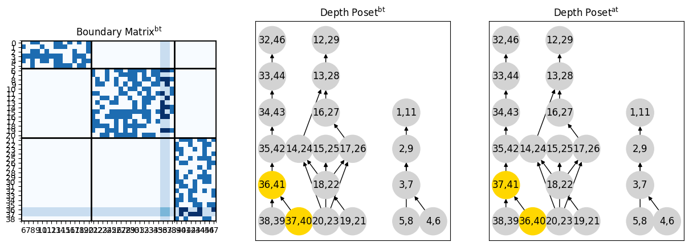

### Birth Death Pairs
|                          |                                                                                                                                                                                                               |
|:-------------------------|:--------------------------------------------------------------------------------------------------------------------------------------------------------------------------------------------------------------|
| Before the transposition | $\{(32, 46), (35, 42), (20, 23), (4, 6), (3, 7), (19, 21), (34, 43), (33, 44), (18, 22), (14, 24), (17, 26), (1, 11), (13, 28), (15, 25), (16, 27), (38, 39), (5, 8), (12, 29), (2, 9), (37, 40), (36, 41)\}$ |
| After the transposition  | $\{(32, 46), (35, 42), (20, 23), (4, 6), (3, 7), (19, 21), (34, 43), (36, 40), (33, 44), (18, 22), (14, 24), (17, 26), (1, 11), (37, 41), (13, 28), (15, 25), (16, 27), (38, 39), (5, 8), (12, 29), (2, 9)\}$ |

### Relations
|                          | Algorithm 1                                                                                                                                                                                                                                                                                                                                                                                                                                                                           | Algorithm 2                                                                                                                                                                                                                                                                                                                                                                                                                                              |
|:-------------------------|:--------------------------------------------------------------------------------------------------------------------------------------------------------------------------------------------------------------------------------------------------------------------------------------------------------------------------------------------------------------------------------------------------------------------------------------------------------------------------------------|:---------------------------------------------------------------------------------------------------------------------------------------------------------------------------------------------------------------------------------------------------------------------------------------------------------------------------------------------------------------------------------------------------------------------------------------------------------|
| Before the transposition | $\{(24, 30), (42, 45), (41, 43), (26, 30), (43, 46), (26, 27), (21, 28), (21, 25), (23, 28), (40, 44), (22, 26), (39, 45), (9, 11), (6, 11), (41, 42), (25, 31), (24, 29), (42, 44), (21, 24), (21, 30), (22, 25), (39, 41), (23, 24), (23, 30), (22, 28), (23, 27), (40, 43), (22, 31), (27, 30), (7, 9), (6, 10), (24, 31), (41, 47), (26, 28), (25, 30), (26, 31), (43, 47), (44, 46), (21, 26), (22, 27), (23, 26), (40, 42), (22, 24), (39, 46), (23, 29), (22, 30), (27, 29)\}$ | $\{(18, 17), (20, 14), (4, 3), (20, 17), (38, 35), (38, 32), (5, 1), (14, 13), (34, 31), (1, 0), (19, 18), (37, 30), (37, 33), (19, 15), (36, 31), (37, 36), (36, 34), (16, 10), (16, 13), (20, 13), (18, 13), (5, 0), (38, 34), (34, 30), (34, 33), (36, 30), (19, 17), (16, 12), (33, 31), (18, 15), (20, 12), (38, 30), (4, 1), (35, 34), (20, 15), (5, 2), (17, 13), (2, 0), (19, 16), (36, 32), (37, 31), (36, 35), (37, 34), (13, 12), (33, 30)\}$ |
| After the transposition  | $\{(24, 30), (42, 45), (41, 43), (26, 30), (43, 46), (26, 27), (21, 28), (21, 25), (23, 28), (40, 44), (22, 26), (40, 41), (40, 47), (39, 45), (9, 11), (6, 11), (41, 42), (25, 31), (24, 29), (42, 44), (21, 24), (21, 30), (22, 25), (39, 41), (23, 24), (23, 30), (22, 28), (23, 27), (22, 31), (27, 30), (7, 9), (6, 10), (24, 31), (41, 47), (26, 28), (25, 30), (26, 31), (43, 47), (44, 46), (21, 26), (22, 27), (23, 26), (22, 24), (22, 30), (39, 46), (23, 29), (27, 29)\}$ | $\{(18, 17), (20, 14), (4, 3), (20, 17), (38, 35), (38, 32), (5, 1), (14, 13), (34, 31), (1, 0), (19, 18), (19, 15), (37, 33), (36, 37), (36, 31), (36, 34), (16, 10), (16, 13), (20, 13), (18, 13), (5, 0), (38, 34), (34, 30), (34, 33), (36, 30), (19, 17), (36, 33), (37, 35), (37, 32), (16, 12), (33, 31), (18, 15), (20, 12), (38, 30), (4, 1), (35, 34), (20, 15), (5, 2), (17, 13), (2, 0), (19, 16), (13, 12), (33, 30)\}$                     |

### Successors and Predecessers
|                 | $\text{Set}^\text{bt}(36, 41)$                                       | $\text{Set}^\text{bt}(37, 40)$                                       | $\text{Set}^\text{at}(36, 40)$                                       | $\text{Set}^\text{at}(37, 41)$                                       |
|:----------------|:---------------------------------------------------------------------|:---------------------------------------------------------------------|:---------------------------------------------------------------------|:---------------------------------------------------------------------|
| $\text{Succ}_1$ | $\text{Succ}_1^\text{bt}(36, 41) = \{(34, 43), (35, 42)\}$           | $\text{Succ}_1^\text{bt}(37, 40) = \{(34, 43), (35, 42), (33, 44)\}$ | $\text{Succ}_1^\text{at}(36, 40) = \{(37, 41), (33, 44)\}$           | $\text{Succ}_1^\text{at}(37, 41) = \{(34, 43), (35, 42)\}$           |
| $\text{Pred}_1$ | $\text{Pred}_1^\text{bt}(36, 41) = \{(38, 39)\}$                     | $\text{Pred}_1^\text{bt}(37, 40) = \emptyset$                        | $\text{Pred}_1^\text{at}(36, 40) = \emptyset$                        | $\text{Pred}_1^\text{at}(37, 41) = \{(36, 40), (38, 39)\}$           |
| $\text{Succ}_2$ | $\text{Succ}_2^\text{bt}(36, 41) = \{(34, 43), (35, 42), (32, 46)\}$ | $\text{Succ}_2^\text{bt}(37, 40) = \{(34, 43), (36, 41), (33, 44)\}$ | $\text{Succ}_2^\text{at}(36, 40) = \{(34, 43), (37, 41), (33, 44)\}$ | $\text{Succ}_2^\text{at}(37, 41) = \{(35, 42), (32, 46), (33, 44)\}$ |
| $\text{Pred}_2$ | $\text{Pred}_2^\text{bt}(36, 41) = \{(37, 40)\}$                     | $\text{Pred}_2^\text{bt}(37, 40) = \emptyset$                        | $\text{Pred}_2^\text{at}(36, 40) = \emptyset$                        | $\text{Pred}_2^\text{at}(37, 41) = \{(36, 40)\}$                     |

### Temp Sets
|                                                               | Before the Transposition                                                                                                                          | After the Transposition                                                                                                                           |
|:--------------------------------------------------------------|:--------------------------------------------------------------------------------------------------------------------------------------------------|:--------------------------------------------------------------------------------------------------------------------------------------------------|
| $\mathcal{L} = \{(s, t)\in \text{BD}:\; f(t) < f(y)\}$        | $\{(14, 24), (38, 39), (17, 26), (5, 8), (3, 7), (20, 23), (12, 29), (4, 6), (1, 11), (19, 21), (2, 9), (18, 22), (13, 28), (15, 25), (16, 27)\}$ | $\{(14, 24), (38, 39), (17, 26), (5, 8), (3, 7), (20, 23), (12, 29), (4, 6), (1, 11), (19, 21), (2, 9), (18, 22), (13, 28), (15, 25), (16, 27)\}$ |
| $\mathcal{M} = \{(s, t)\in \text{BD}:\; f(y) < f(t) < f(b)\}$ | $\emptyset$                                                                                                                                       | $\emptyset$                                                                                                                                       |

### Equations
There are 1 equations are wrong.

| eq   | left (formula)                  | left (paramatrized)               | left (value)                       | right (formula)                                                                                           | right (paramatrized)                                                                                            | right (value)                      | correct   |
|:-----|:--------------------------------|:----------------------------------|:-----------------------------------|:----------------------------------------------------------------------------------------------------------|:----------------------------------------------------------------------------------------------------------------|:-----------------------------------|:----------|
| Eq08 | $\text{Succ}_1^\text{at}(a, y)$ | $\text{Succ}_1^\text{at}(36, 40)$ | $\{(37, 41), (33, 44)\}$           | $\text{Succ}_1^\text{bt}(x, y) \oplus \{(x, b)\} \oplus \text{Succ}_1^\text{bt}(a, b)$                    | $\text{Succ}_1^\text{bt}(37, 40) \oplus \{(37, 41)\} \oplus \text{Succ}_1^\text{bt}(36, 41)$                    | $\{(37, 41), (33, 44)\}$           | ✔         |
| Eq09 | $\text{Succ}_1^\text{at}(x, b)$ | $\text{Succ}_1^\text{at}(37, 41)$ | $\{(34, 43), (35, 42)\}$           | $\text{Succ}_1^\text{bt}(a, b)$                                                                           | $\text{Succ}_1^\text{bt}(36, 41)$                                                                               | $\{(34, 43), (35, 42)\}$           | ✔         |
| Eq10 | $\text{Pred}_1^\text{at}(a, y)$ | $\text{Pred}_1^\text{at}(36, 40)$ | $\emptyset$                        | $\text{Pred}_1^\text{bt}(x, y)$                                                                           | $\text{Pred}_1^\text{bt}(37, 40)$                                                                               | $\emptyset$                        | ✔         |
| Eq11 | $\text{Pred}_1^\text{at}(x, b)$ | $\text{Pred}_1^\text{at}(37, 41)$ | $\{(36, 40), (38, 39)\}$           | $\text{Pred}_1^\text{bt}(a, b) \oplus \{(a, y)\}$                                                         | $\text{Pred}_1^\text{bt}(36, 41) \oplus \{(36, 40)\}$                                                           | $\{(36, 40), (38, 39)\}$           | ✔         |
| Eq12 | $\text{Succ}_2^\text{at}(a, y)$ | $\text{Succ}_2^\text{at}(36, 40)$ | $\{(34, 43), (37, 41), (33, 44)\}$ | $\text{Succ}_2^\text{bt}(x, y) \oplus \{(x, b), (a, b)\}$                                                 | $\text{Succ}_2^\text{bt}(37, 40) \oplus \{(37, 41), (36, 41)\}$                                                 | $\{(34, 43), (37, 41), (33, 44)\}$ | ✔         |
| Eq13 | $\text{Succ}_2^\text{at}(x, b)$ | $\text{Succ}_2^\text{at}(37, 41)$ | $\{(35, 42), (32, 46), (33, 44)\}$ | $\text{Succ}_2^\text{bt}(a, b)$                                                                           | $\text{Succ}_2^\text{bt}(36, 41)$                                                                               | $\{(34, 43), (35, 42), (32, 46)\}$ | ✘         |
| Eq14 | $\text{Pred}_2^\text{at}(a, y)$ | $\text{Pred}_2^\text{at}(36, 40)$ | $\emptyset$                        | $[\text{Pred}_2^\text{bt}(a, b) \cap \mathcal{L}]$                                                        | $[\text{Pred}_2^\text{bt}(36, 41) \cap \mathcal{L}]$                                                            | $\emptyset$                        | ✔         |
| Eq15 | $\text{Pred}_2^\text{at}(x, b)$ | $\text{Pred}_2^\text{at}(37, 41)$ | $\{(36, 40)\}$                     | $\text{Pred}_2^\text{bt}(x, y) \oplus \{(a, y)\} \oplus [\text{Pred}_2^\text{bt}(a, b) \cap \mathcal{M}]$ | $\text{Pred}_2^\text{bt}(37, 40) \oplus \{(36, 40)\} \oplus [\text{Pred}_2^\text{bt}(36, 41) \cap \mathcal{M}]$ | $\{(36, 40)\}$                     | ✔         |

## Transposition <6, 7> in complex 20
Here is a __death-death__ __switch forward__ transposition <6, 7>.

$$
a = 2, \; b = 7, \; x = 5, \; y = 6
$$

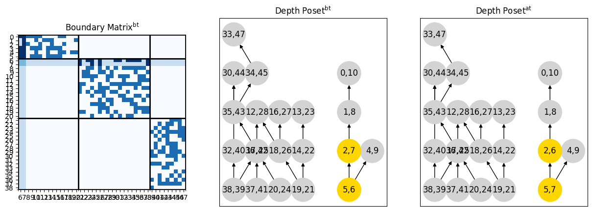

### Birth Death Pairs
|                          |                                                                                                                                                                                                               |
|:-------------------------|:--------------------------------------------------------------------------------------------------------------------------------------------------------------------------------------------------------------|
| Before the transposition | $\{(32, 40), (18, 26), (4, 9), (12, 28), (14, 22), (19, 21), (13, 23), (33, 47), (5, 6), (0, 10), (2, 7), (34, 45), (36, 42), (1, 8), (37, 41), (30, 44), (16, 27), (35, 43), (20, 24), (38, 39), (17, 25)\}$ |
| After the transposition  | $\{(32, 40), (18, 26), (4, 9), (5, 7), (12, 28), (14, 22), (19, 21), (13, 23), (33, 47), (0, 10), (34, 45), (36, 42), (1, 8), (37, 41), (30, 44), (16, 27), (35, 43), (20, 24), (38, 39), (17, 25), (2, 6)\}$ |

### Relations
|                          | Algorithm 1                                                                                                                                                                                                                                                                                                                                                                                                                                   | Algorithm 2                                                                                                                                                                                                                                                                                                                                                    |
|:-------------------------|:----------------------------------------------------------------------------------------------------------------------------------------------------------------------------------------------------------------------------------------------------------------------------------------------------------------------------------------------------------------------------------------------------------------------------------------------|:---------------------------------------------------------------------------------------------------------------------------------------------------------------------------------------------------------------------------------------------------------------------------------------------------------------------------------------------------------------|
| Before the transposition | $\{(41, 43), (6, 15), (43, 46), (41, 46), (26, 27), (21, 22), (21, 28), (22, 23), (40, 44), (23, 31), (9, 11), (10, 15), (6, 11), (25, 28), (41, 42), (25, 31), (42, 47), (41, 45), (24, 29), (42, 44), (43, 45), (8, 11), (22, 31), (10, 11), (28, 29), (6, 7), (6, 10), (41, 44), (24, 31), (26, 28), (43, 44), (42, 46), (43, 47), (44, 46), (21, 26), (8, 10), (9, 15), (28, 31), (45, 47), (27, 29), (7, 11), (6, 9), (7, 8)\}$          | $\{(35, 30), (20, 11), (35, 33), (38, 29), (20, 17), (5, 4), (38, 32), (14, 13), (34, 31), (19, 12), (1, 0), (37, 30), (37, 36), (32, 30), (18, 16), (35, 29), (5, 0), (5, 3), (19, 14), (36, 30), (34, 33), (2, 1), (37, 29), (37, 35), (36, 33), (30, 29), (16, 15), (33, 31), (38, 30), (12, 11), (20, 15), (38, 36), (19, 13), (36, 35)\}$                 |
| After the transposition  | $\{(41, 43), (43, 46), (41, 46), (26, 27), (21, 22), (21, 28), (22, 23), (40, 44), (23, 31), (9, 11), (10, 15), (6, 11), (25, 28), (7, 10), (41, 42), (6, 8), (25, 31), (42, 47), (41, 45), (24, 29), (42, 44), (43, 45), (8, 11), (22, 31), (10, 11), (28, 29), (7, 9), (7, 6), (6, 10), (41, 44), (7, 15), (24, 31), (26, 28), (43, 44), (42, 46), (43, 47), (44, 46), (21, 26), (8, 10), (9, 15), (28, 31), (45, 47), (27, 29), (7, 11)\}$ | $\{(35, 30), (20, 11), (35, 33), (38, 29), (20, 17), (5, 4), (38, 32), (5, 1), (14, 13), (19, 12), (34, 31), (1, 0), (37, 30), (37, 36), (32, 30), (18, 16), (35, 29), (5, 0), (5, 3), (19, 14), (36, 30), (34, 33), (2, 1), (37, 29), (37, 35), (36, 33), (30, 29), (16, 15), (33, 31), (38, 30), (12, 11), (20, 15), (5, 2), (38, 36), (19, 13), (36, 35)\}$ |

### Successors and Predecessers
|                 | $\text{Set}^\text{bt}(2, 7)$                 | $\text{Set}^\text{bt}(5, 6)$                                  | $\text{Set}^\text{at}(5, 7)$                                          | $\text{Set}^\text{at}(2, 6)$                          |
|:----------------|:---------------------------------------------|:--------------------------------------------------------------|:----------------------------------------------------------------------|:------------------------------------------------------|
| $\text{Succ}_1$ | $\text{Succ}_1^\text{bt}(2, 7) = \{(1, 8)\}$ | $\text{Succ}_1^\text{bt}(5, 6) = \{(4, 9), (0, 10), (2, 7)\}$ | $\text{Succ}_1^\text{at}(5, 7) = \{(4, 9), (2, 6), (0, 10)\}$         | $\text{Succ}_1^\text{at}(2, 6) = \{(1, 8), (0, 10)\}$ |
| $\text{Pred}_1$ | $\text{Pred}_1^\text{bt}(2, 7) = \{(5, 6)\}$ | $\text{Pred}_1^\text{bt}(5, 6) = \emptyset$                   | $\text{Pred}_1^\text{at}(5, 7) = \emptyset$                           | $\text{Pred}_1^\text{at}(2, 6) = \{(5, 7)\}$          |
| $\text{Succ}_2$ | $\text{Succ}_2^\text{bt}(2, 7) = \{(1, 8)\}$ | $\text{Succ}_2^\text{bt}(5, 6) = \{(4, 9), (0, 10)\}$         | $\text{Succ}_2^\text{at}(5, 7) = \{(4, 9), (1, 8), (2, 6), (0, 10)\}$ | $\text{Succ}_2^\text{at}(2, 6) = \{(1, 8)\}$          |
| $\text{Pred}_2$ | $\text{Pred}_2^\text{bt}(2, 7) = \emptyset$  | $\text{Pred}_2^\text{bt}(5, 6) = \emptyset$                   | $\text{Pred}_2^\text{at}(5, 7) = \emptyset$                           | $\text{Pred}_2^\text{at}(2, 6) = \{(5, 7)\}$          |

### Temp Sets
|                                                               | Before the Transposition                                                                                                                                             | After the Transposition                                                                                                                                              |
|:--------------------------------------------------------------|:---------------------------------------------------------------------------------------------------------------------------------------------------------------------|:---------------------------------------------------------------------------------------------------------------------------------------------------------------------|
| $\mathcal{B} = \{(s, t)\in \text{BD}:\; f(s) > f(x)\}$        | $\{(35, 43), (20, 24), (32, 40), (13, 23), (38, 39), (18, 26), (19, 21), (34, 45), (36, 42), (37, 41), (12, 28), (33, 47), (17, 25), (30, 44), (14, 22), (16, 27)\}$ | $\{(35, 43), (20, 24), (32, 40), (13, 23), (38, 39), (18, 26), (19, 21), (34, 45), (36, 42), (37, 41), (12, 28), (33, 47), (17, 25), (30, 44), (14, 22), (16, 27)\}$ |
| $\mathcal{N} = \{(s, t)\in \text{BD}:\; f(x) > f(s) > f(a)\}$ | $\{(4, 9)\}$                                                                                                                                                         | $\{(4, 9)\}$                                                                                                                                                         |

### Equations
There are 1 equations are wrong.

| eq   | left (formula)                  | left (paramatrized)             | left (value)                          | right (formula)                                                                                          | right (paramatrized)                                                                                     | right (value)                         | correct   |
|:-----|:--------------------------------|:--------------------------------|:--------------------------------------|:---------------------------------------------------------------------------------------------------------|:---------------------------------------------------------------------------------------------------------|:--------------------------------------|:----------|
| Eq28 | $\text{Succ}_1^\text{at}(x, b)$ | $\text{Succ}_1^\text{at}(5, 7)$ | $\{(4, 9), (2, 6), (0, 10)\}$         | $\text{Succ}_1^\text{bt}(x, y) \oplus \{(a, y), (a, b)\}$                                                | $\text{Succ}_1^\text{bt}(5, 6) \oplus \{(2, 6), (2, 7)\}$                                                | $\{(4, 9), (2, 6), (0, 10)\}$         | ✔         |
| Eq29 | $\text{Succ}_1^\text{at}(a, y)$ | $\text{Succ}_1^\text{at}(2, 6)$ | $\{(1, 8), (0, 10)\}$                 | $\text{Succ}_1^\text{bt}(a, b)$                                                                          | $\text{Succ}_1^\text{bt}(2, 7)$                                                                          | $\{(1, 8)\}$                          | ✘         |
| Eq30 | $\text{Pred}_1^\text{at}(x, b)$ | $\text{Pred}_1^\text{at}(5, 7)$ | $\emptyset$                           | $[\text{Pred}_1^\text{bt}(a, b) \cap \mathcal{B}]$                                                       | $[\text{Pred}_1^\text{bt}(2, 7) \cap \mathcal{B}]$                                                       | $\emptyset$                           | ✔         |
| Eq31 | $\text{Pred}_1^\text{at}(a, y)$ | $\text{Pred}_1^\text{at}(2, 6)$ | $\{(5, 7)\}$                          | $\text{Pred}_1^\text{bt}(x, y) \oplus \{(x, b)\} \oplus[\text{Pred}_1^\text{bt}(a, b) \cap \mathcal{N}]$ | $\text{Pred}_1^\text{bt}(5, 6) \oplus \{(5, 7)\} \oplus[\text{Pred}_1^\text{bt}(2, 7) \cap \mathcal{N}]$ | $\{(5, 7)\}$                          | ✔         |
| Eq32 | $\text{Succ}_2^\text{at}(x, b)$ | $\text{Succ}_2^\text{at}(5, 7)$ | $\{(4, 9), (1, 8), (2, 6), (0, 10)\}$ | $\text{Succ}_2^\text{bt}(x, y) \oplus \{(a, y)\} \oplus \text{Succ}_2^\text{bt}(a, b)$                   | $\text{Succ}_2^\text{bt}(5, 6) \oplus \{(2, 6)\} \oplus \text{Succ}_2^\text{bt}(2, 7)$                   | $\{(4, 9), (1, 8), (2, 6), (0, 10)\}$ | ✔         |
| Eq33 | $\text{Succ}_2^\text{at}(a, y)$ | $\text{Succ}_2^\text{at}(2, 6)$ | $\{(1, 8)\}$                          | $\text{Succ}_2^\text{bt}(a, b)$                                                                          | $\text{Succ}_2^\text{bt}(2, 7)$                                                                          | $\{(1, 8)\}$                          | ✔         |
| Eq34 | $\text{Pred}_2^\text{at}(x, b)$ | $\text{Pred}_2^\text{at}(5, 7)$ | $\emptyset$                           | $\text{Pred}_2^\text{bt}(x, y)$                                                                          | $\text{Pred}_2^\text{bt}(5, 6)$                                                                          | $\emptyset$                           | ✔         |
| Eq35 | $\text{Pred}_2^\text{at}(a, y)$ | $\text{Pred}_2^\text{at}(2, 6)$ | $\{(5, 7)\}$                          | $\text{Pred}_2^\text{bt}(a, b) \oplus \{(x, b)\}$                                                        | $\text{Pred}_2^\text{bt}(2, 7) \oplus \{(5, 7)\}$                                                        | $\{(5, 7)\}$                          | ✔         |

## Transposition <17, 18> in complex 20
Here is a __birth-birth__ __no switch__ transposition <17, 18>.

$$
a = 17, \; b = 25, \; x = 18, \; y = 26
$$

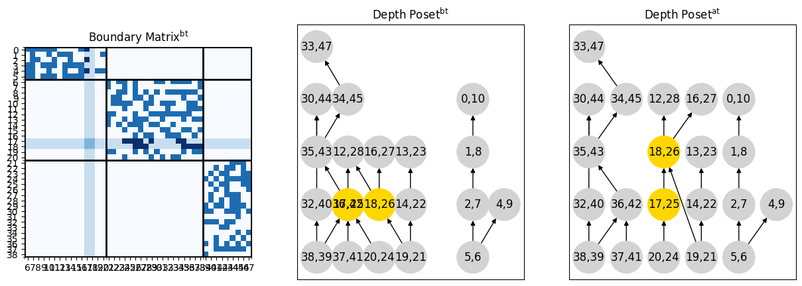

### Birth Death Pairs
|                          |                                                                                                                                                                                                               |
|:-------------------------|:--------------------------------------------------------------------------------------------------------------------------------------------------------------------------------------------------------------|
| Before the transposition | $\{(32, 40), (18, 26), (4, 9), (12, 28), (14, 22), (19, 21), (13, 23), (33, 47), (5, 6), (0, 10), (2, 7), (34, 45), (36, 42), (1, 8), (37, 41), (30, 44), (16, 27), (35, 43), (20, 24), (38, 39), (17, 25)\}$ |
| After the transposition  | $\{(32, 40), (18, 26), (4, 9), (12, 28), (14, 22), (19, 21), (13, 23), (33, 47), (5, 6), (0, 10), (2, 7), (34, 45), (36, 42), (1, 8), (37, 41), (30, 44), (16, 27), (35, 43), (20, 24), (38, 39), (17, 25)\}$ |

### Relations
|                          | Algorithm 1                                                                                                                                                                                                                                                                                                                                                                                                                                    | Algorithm 2                                                                                                                                                                                                                                                                                                                                    |
|:-------------------------|:-----------------------------------------------------------------------------------------------------------------------------------------------------------------------------------------------------------------------------------------------------------------------------------------------------------------------------------------------------------------------------------------------------------------------------------------------|:-----------------------------------------------------------------------------------------------------------------------------------------------------------------------------------------------------------------------------------------------------------------------------------------------------------------------------------------------|
| Before the transposition | $\{(41, 43), (6, 15), (43, 46), (41, 46), (26, 27), (21, 22), (21, 28), (22, 23), (40, 44), (23, 31), (9, 11), (10, 15), (6, 11), (25, 28), (41, 42), (25, 31), (42, 47), (41, 45), (24, 29), (42, 44), (43, 45), (8, 11), (22, 31), (10, 11), (28, 29), (6, 7), (6, 10), (41, 44), (24, 31), (26, 28), (43, 44), (42, 46), (43, 47), (44, 46), (21, 26), (8, 10), (9, 15), (28, 31), (45, 47), (27, 29), (7, 11), (6, 9), (7, 8)\}$           | $\{(35, 30), (20, 11), (35, 33), (38, 29), (20, 17), (5, 4), (38, 32), (14, 13), (34, 31), (19, 12), (1, 0), (37, 30), (37, 36), (32, 30), (18, 16), (35, 29), (5, 0), (5, 3), (19, 14), (36, 30), (34, 33), (2, 1), (37, 29), (37, 35), (36, 33), (30, 29), (16, 15), (33, 31), (38, 30), (12, 11), (20, 15), (38, 36), (19, 13), (36, 35)\}$ |
| After the transposition  | $\{(41, 43), (6, 15), (43, 46), (41, 46), (26, 27), (21, 22), (21, 28), (22, 23), (40, 44), (23, 31), (9, 11), (10, 15), (6, 11), (41, 42), (25, 31), (42, 47), (41, 45), (24, 29), (42, 44), (43, 45), (8, 11), (22, 31), (10, 11), (28, 29), (6, 7), (6, 10), (41, 44), (25, 27), (24, 31), (26, 28), (43, 44), (42, 46), (43, 47), (44, 46), (21, 26), (8, 10), (9, 15), (28, 31), (45, 47), (27, 29), (7, 8), (7, 11), (6, 9), (25, 26)\}$ | $\{(35, 30), (20, 11), (35, 33), (38, 29), (20, 17), (5, 4), (38, 32), (14, 13), (19, 12), (34, 31), (1, 0), (37, 30), (37, 36), (32, 30), (18, 16), (35, 29), (5, 0), (5, 3), (19, 14), (36, 30), (34, 33), (2, 1), (37, 29), (37, 35), (36, 33), (30, 29), (16, 15), (33, 31), (38, 30), (12, 11), (20, 15), (38, 36), (19, 13), (36, 35)\}$ |

### Successors and Predecessers
No such node in the Depth Poset

### Temp Sets
|                                                               | Before the Transposition                                                                        | After the Transposition                                                                         |
|:--------------------------------------------------------------|:------------------------------------------------------------------------------------------------|:------------------------------------------------------------------------------------------------|
| $\mathcal{L} = \{(s, t)\in \text{BD}:\; f(t) < f(y)\}$        | $\{(20, 24), (0, 10), (2, 7), (13, 23), (4, 9), (1, 8), (17, 25), (5, 6), (14, 22), (19, 21)\}$ | $\{(20, 24), (0, 10), (2, 7), (13, 23), (4, 9), (1, 8), (17, 25), (5, 6), (14, 22), (19, 21)\}$ |
| $\mathcal{M} = \{(s, t)\in \text{BD}:\; f(y) < f(t) < f(b)\}$ | $\emptyset$                                                                                     | $\emptyset$                                                                                     |

### Equations
There are 2 equations are wrong.

| eq   | left (formula)                  | left (paramatrized)               | left (value)             | right (formula)                                                                        | right (paramatrized)                                                                         | right (value)            | correct   |
|:-----|:--------------------------------|:----------------------------------|:-------------------------|:---------------------------------------------------------------------------------------|:---------------------------------------------------------------------------------------------|:-------------------------|:----------|
| Eq16 | $\text{Succ}_1^\text{at}(x, y)$ | $\text{Succ}_1^\text{at}(18, 26)$ | $\{(12, 28), (16, 27)\}$ | $\text{Succ}_1^\text{bt}(x, y) \oplus \{(a, b)\} \oplus \text{Succ}_1^\text{bt}(a, b)$ | $\text{Succ}_1^\text{bt}(18, 26) \oplus \{(17, 25)\} \oplus \text{Succ}_1^\text{bt}(17, 25)$ | $\{(16, 27), (17, 25)\}$ | ✘         |
| Eq17 | $\text{Pred}_1^\text{at}(a, b)$ | $\text{Pred}_1^\text{at}(17, 25)$ | $\emptyset$              | $\text{Pred}_1^\text{bt}(a, b) \oplus \{(x, y)\}$                                      | $\text{Pred}_1^\text{bt}(17, 25) \oplus \{(18, 26)\}$                                        | $\{(18, 26)\}$           | ✘         |

## Transposition <23, 24> in complex 20
Here is a __death-death__ __no switch__ transposition <23, 24>.

$$
a = 20, \; b = 24, \; x = 13, \; y = 23
$$

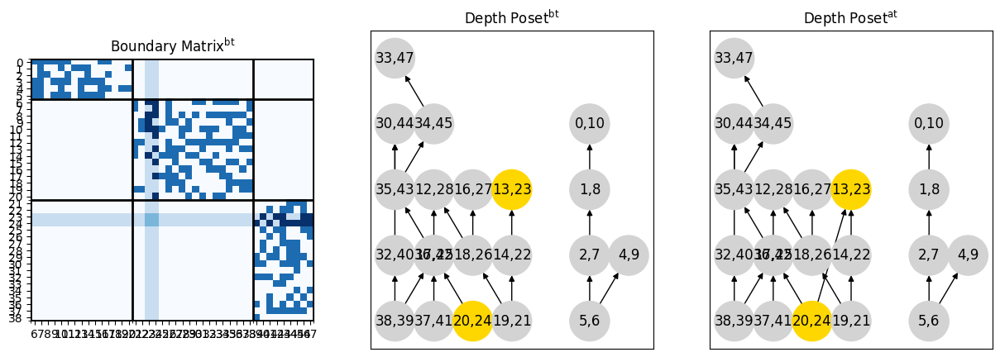

### Birth Death Pairs
|                          |                                                                                                                                                                                                               |
|:-------------------------|:--------------------------------------------------------------------------------------------------------------------------------------------------------------------------------------------------------------|
| Before the transposition | $\{(32, 40), (18, 26), (4, 9), (12, 28), (14, 22), (19, 21), (13, 23), (33, 47), (5, 6), (0, 10), (2, 7), (34, 45), (36, 42), (1, 8), (37, 41), (30, 44), (16, 27), (35, 43), (20, 24), (38, 39), (17, 25)\}$ |
| After the transposition  | $\{(32, 40), (18, 26), (4, 9), (12, 28), (14, 22), (19, 21), (13, 23), (33, 47), (5, 6), (0, 10), (2, 7), (34, 45), (36, 42), (1, 8), (37, 41), (30, 44), (16, 27), (35, 43), (20, 24), (38, 39), (17, 25)\}$ |

### Relations
|                          | Algorithm 1                                                                                                                                                                                                                                                                                                                                                                                                                          | Algorithm 2                                                                                                                                                                                                                                                                                                                                              |
|:-------------------------|:-------------------------------------------------------------------------------------------------------------------------------------------------------------------------------------------------------------------------------------------------------------------------------------------------------------------------------------------------------------------------------------------------------------------------------------|:---------------------------------------------------------------------------------------------------------------------------------------------------------------------------------------------------------------------------------------------------------------------------------------------------------------------------------------------------------|
| Before the transposition | $\{(41, 43), (6, 15), (43, 46), (41, 46), (26, 27), (21, 22), (21, 28), (22, 23), (40, 44), (23, 31), (9, 11), (10, 15), (6, 11), (25, 28), (41, 42), (25, 31), (42, 47), (41, 45), (24, 29), (42, 44), (43, 45), (8, 11), (22, 31), (10, 11), (28, 29), (6, 7), (6, 10), (41, 44), (24, 31), (26, 28), (43, 44), (42, 46), (43, 47), (44, 46), (21, 26), (8, 10), (9, 15), (28, 31), (45, 47), (27, 29), (7, 11), (6, 9), (7, 8)\}$ | $\{(35, 30), (20, 11), (35, 33), (38, 29), (20, 17), (5, 4), (38, 32), (14, 13), (34, 31), (19, 12), (1, 0), (37, 30), (37, 36), (32, 30), (18, 16), (35, 29), (5, 0), (5, 3), (19, 14), (36, 30), (34, 33), (2, 1), (37, 29), (37, 35), (36, 33), (30, 29), (16, 15), (33, 31), (38, 30), (12, 11), (20, 15), (38, 36), (19, 13), (36, 35)\}$           |
| After the transposition  | $\{(41, 43), (6, 15), (43, 46), (41, 46), (26, 27), (21, 22), (21, 28), (22, 23), (40, 44), (23, 31), (9, 11), (10, 15), (6, 11), (25, 28), (41, 42), (25, 31), (42, 47), (41, 45), (24, 29), (42, 44), (43, 45), (8, 11), (22, 31), (10, 11), (28, 29), (6, 7), (6, 10), (41, 44), (24, 31), (26, 28), (43, 44), (42, 46), (43, 47), (44, 46), (21, 26), (8, 10), (9, 15), (28, 31), (45, 47), (27, 29), (7, 11), (6, 9), (7, 8)\}$ | $\{(35, 30), (20, 11), (35, 33), (38, 29), (20, 17), (5, 4), (38, 32), (14, 13), (19, 12), (34, 31), (1, 0), (37, 30), (37, 36), (32, 30), (18, 16), (20, 13), (35, 29), (5, 0), (5, 3), (19, 14), (36, 30), (34, 33), (2, 1), (37, 29), (37, 35), (36, 33), (30, 29), (16, 15), (33, 31), (38, 30), (12, 11), (20, 15), (38, 36), (19, 13), (36, 35)\}$ |

### Successors and Predecessers
No such node in the Depth Poset

### Temp Sets
|                                                               | Before the Transposition                                                                                                                         | After the Transposition                                                                                                                          |
|:--------------------------------------------------------------|:-------------------------------------------------------------------------------------------------------------------------------------------------|:-------------------------------------------------------------------------------------------------------------------------------------------------|
| $\mathcal{B} = \{(s, t)\in \text{BD}:\; f(s) > f(x)\}$        | $\{(35, 43), (20, 24), (32, 40), (38, 39), (18, 26), (19, 21), (34, 45), (36, 42), (37, 41), (33, 47), (17, 25), (30, 44), (14, 22), (16, 27)\}$ | $\{(35, 43), (20, 24), (32, 40), (38, 39), (18, 26), (19, 21), (34, 45), (36, 42), (37, 41), (33, 47), (17, 25), (30, 44), (14, 22), (16, 27)\}$ |
| $\mathcal{N} = \{(s, t)\in \text{BD}:\; f(x) > f(s) > f(a)\}$ | $\emptyset$                                                                                                                                      | $\emptyset$                                                                                                                                      |

### Equations
There are 2 equations are wrong.

| eq   | left (formula)                  | left (paramatrized)               | left (value)   | right (formula)                                                                        | right (paramatrized)                                                                         | right (value)            | correct   |
|:-----|:--------------------------------|:----------------------------------|:---------------|:---------------------------------------------------------------------------------------|:---------------------------------------------------------------------------------------------|:-------------------------|:----------|
| Eq36 | $\text{Succ}_2^\text{at}(x, y)$ | $\text{Succ}_2^\text{at}(13, 23)$ | $\emptyset$    | $\text{Succ}_2^\text{bt}(x, y) \oplus \{(a, b)\} \oplus \text{Succ}_2^\text{bt}(a, b)$ | $\text{Succ}_2^\text{bt}(13, 23) \oplus \{(20, 24)\} \oplus \text{Succ}_2^\text{bt}(20, 24)$ | $\{(20, 24), (17, 25)\}$ | ✘         |
| Eq37 | $\text{Pred}_2^\text{at}(a, b)$ | $\text{Pred}_2^\text{at}(20, 24)$ | $\emptyset$    | $\text{Pred}_2^\text{bt}(a, b) \oplus \{(x, y)\}$                                      | $\text{Pred}_2^\text{bt}(20, 24) \oplus \{(13, 23)\}$                                        | $\{(13, 23)\}$           | ✘         |

## Transposition <25, 26> in complex 20
Here is a __death-death__ __no switch__ transposition <25, 26>.

$$
a = 18, \; b = 26, \; x = 17, \; y = 25
$$

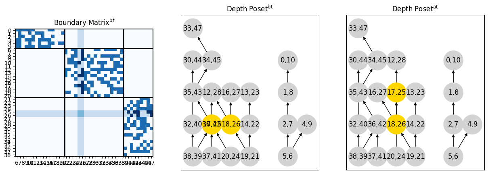

### Birth Death Pairs
|                          |                                                                                                                                                                                                               |
|:-------------------------|:--------------------------------------------------------------------------------------------------------------------------------------------------------------------------------------------------------------|
| Before the transposition | $\{(32, 40), (18, 26), (4, 9), (12, 28), (14, 22), (19, 21), (13, 23), (33, 47), (5, 6), (0, 10), (2, 7), (34, 45), (36, 42), (1, 8), (37, 41), (30, 44), (16, 27), (35, 43), (20, 24), (38, 39), (17, 25)\}$ |
| After the transposition  | $\{(32, 40), (18, 26), (4, 9), (12, 28), (14, 22), (19, 21), (13, 23), (33, 47), (5, 6), (0, 10), (2, 7), (34, 45), (36, 42), (1, 8), (37, 41), (30, 44), (16, 27), (35, 43), (20, 24), (38, 39), (17, 25)\}$ |

### Relations
|                          | Algorithm 1                                                                                                                                                                                                                                                                                                                                                                                                                          | Algorithm 2                                                                                                                                                                                                                                                                                                                                              |
|:-------------------------|:-------------------------------------------------------------------------------------------------------------------------------------------------------------------------------------------------------------------------------------------------------------------------------------------------------------------------------------------------------------------------------------------------------------------------------------|:---------------------------------------------------------------------------------------------------------------------------------------------------------------------------------------------------------------------------------------------------------------------------------------------------------------------------------------------------------|
| Before the transposition | $\{(41, 43), (6, 15), (43, 46), (41, 46), (26, 27), (21, 22), (21, 28), (22, 23), (40, 44), (23, 31), (9, 11), (10, 15), (6, 11), (25, 28), (41, 42), (25, 31), (42, 47), (41, 45), (24, 29), (42, 44), (43, 45), (8, 11), (22, 31), (10, 11), (28, 29), (6, 7), (6, 10), (41, 44), (24, 31), (26, 28), (43, 44), (42, 46), (43, 47), (44, 46), (21, 26), (8, 10), (9, 15), (28, 31), (45, 47), (27, 29), (7, 11), (6, 9), (7, 8)\}$ | $\{(35, 30), (20, 11), (35, 33), (38, 29), (20, 17), (5, 4), (38, 32), (14, 13), (34, 31), (19, 12), (1, 0), (37, 30), (37, 36), (32, 30), (18, 16), (35, 29), (5, 0), (5, 3), (19, 14), (36, 30), (34, 33), (2, 1), (37, 29), (37, 35), (36, 33), (30, 29), (16, 15), (33, 31), (38, 30), (12, 11), (20, 15), (38, 36), (19, 13), (36, 35)\}$           |
| After the transposition  | $\{(41, 43), (6, 15), (43, 46), (41, 46), (26, 27), (21, 22), (21, 28), (22, 23), (40, 44), (23, 31), (9, 11), (10, 15), (6, 11), (25, 28), (41, 42), (25, 31), (42, 47), (41, 45), (24, 29), (42, 44), (43, 45), (8, 11), (22, 31), (10, 11), (28, 29), (6, 7), (6, 10), (41, 44), (24, 31), (26, 28), (43, 44), (42, 46), (43, 47), (44, 46), (21, 26), (8, 10), (9, 15), (28, 31), (45, 47), (27, 29), (7, 11), (6, 9), (7, 8)\}$ | $\{(35, 30), (20, 11), (18, 17), (35, 33), (38, 29), (20, 17), (5, 4), (38, 32), (14, 13), (19, 12), (34, 31), (1, 0), (37, 30), (37, 36), (32, 30), (18, 16), (35, 29), (5, 0), (5, 3), (19, 14), (36, 30), (34, 33), (2, 1), (37, 29), (37, 35), (36, 33), (30, 29), (16, 15), (33, 31), (38, 30), (12, 11), (20, 15), (38, 36), (19, 13), (36, 35)\}$ |

### Successors and Predecessers
No such node in the Depth Poset

### Temp Sets
|                                                               | Before the Transposition                                                                                           | After the Transposition                                                                                            |
|:--------------------------------------------------------------|:-------------------------------------------------------------------------------------------------------------------|:-------------------------------------------------------------------------------------------------------------------|
| $\mathcal{B} = \{(s, t)\in \text{BD}:\; f(s) > f(x)\}$        | $\{(35, 43), (20, 24), (32, 40), (38, 39), (18, 26), (34, 45), (36, 42), (37, 41), (33, 47), (30, 44), (19, 21)\}$ | $\{(35, 43), (20, 24), (32, 40), (38, 39), (18, 26), (34, 45), (36, 42), (37, 41), (33, 47), (30, 44), (19, 21)\}$ |
| $\mathcal{N} = \{(s, t)\in \text{BD}:\; f(x) > f(s) > f(a)\}$ | $\emptyset$                                                                                                        | $\emptyset$                                                                                                        |

### Equations
There are 2 equations are wrong.

| eq   | left (formula)                  | left (paramatrized)               | left (value)   | right (formula)                                                                        | right (paramatrized)                                                                         | right (value)            | correct   |
|:-----|:--------------------------------|:----------------------------------|:---------------|:---------------------------------------------------------------------------------------|:---------------------------------------------------------------------------------------------|:-------------------------|:----------|
| Eq36 | $\text{Succ}_2^\text{at}(x, y)$ | $\text{Succ}_2^\text{at}(17, 25)$ | $\emptyset$    | $\text{Succ}_2^\text{bt}(x, y) \oplus \{(a, b)\} \oplus \text{Succ}_2^\text{bt}(a, b)$ | $\text{Succ}_2^\text{bt}(17, 25) \oplus \{(18, 26)\} \oplus \text{Succ}_2^\text{bt}(18, 26)$ | $\{(18, 26), (16, 27)\}$ | ✘         |
| Eq37 | $\text{Pred}_2^\text{at}(a, b)$ | $\text{Pred}_2^\text{at}(18, 26)$ | $\emptyset$    | $\text{Pred}_2^\text{bt}(a, b) \oplus \{(x, y)\}$                                      | $\text{Pred}_2^\text{bt}(18, 26) \oplus \{(17, 25)\}$                                        | $\{(17, 25)\}$           | ✘         |

## Transposition <35, 36> in complex 20
Here is a __birth-birth__ __switch forward__ transposition <35, 36>.

$$
a = 35, \; b = 43, \; x = 36, \; y = 42
$$

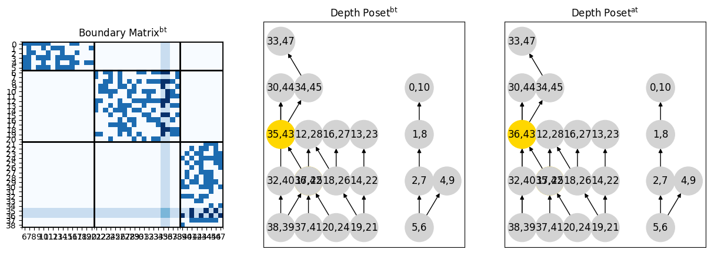

### Birth Death Pairs
|                          |                                                                                                                                                                                                               |
|:-------------------------|:--------------------------------------------------------------------------------------------------------------------------------------------------------------------------------------------------------------|
| Before the transposition | $\{(32, 40), (18, 26), (4, 9), (12, 28), (14, 22), (19, 21), (13, 23), (33, 47), (5, 6), (0, 10), (2, 7), (34, 45), (36, 42), (1, 8), (37, 41), (30, 44), (16, 27), (35, 43), (20, 24), (38, 39), (17, 25)\}$ |
| After the transposition  | $\{(32, 40), (18, 26), (35, 42), (4, 9), (12, 28), (14, 22), (19, 21), (36, 43), (13, 23), (33, 47), (5, 6), (0, 10), (2, 7), (34, 45), (1, 8), (37, 41), (30, 44), (16, 27), (20, 24), (38, 39), (17, 25)\}$ |

### Relations
|                          | Algorithm 1                                                                                                                                                                                                                                                                                                                                                                                                                          | Algorithm 2                                                                                                                                                                                                                                                                                                                                    |
|:-------------------------|:-------------------------------------------------------------------------------------------------------------------------------------------------------------------------------------------------------------------------------------------------------------------------------------------------------------------------------------------------------------------------------------------------------------------------------------|:-----------------------------------------------------------------------------------------------------------------------------------------------------------------------------------------------------------------------------------------------------------------------------------------------------------------------------------------------|
| Before the transposition | $\{(41, 43), (6, 15), (43, 46), (41, 46), (26, 27), (21, 22), (21, 28), (22, 23), (40, 44), (23, 31), (9, 11), (10, 15), (6, 11), (25, 28), (41, 42), (25, 31), (42, 47), (41, 45), (24, 29), (42, 44), (43, 45), (8, 11), (22, 31), (10, 11), (28, 29), (6, 7), (6, 10), (41, 44), (24, 31), (26, 28), (43, 44), (42, 46), (43, 47), (44, 46), (21, 26), (8, 10), (9, 15), (28, 31), (45, 47), (27, 29), (7, 11), (6, 9), (7, 8)\}$ | $\{(35, 30), (20, 11), (35, 33), (38, 29), (20, 17), (5, 4), (38, 32), (14, 13), (34, 31), (19, 12), (1, 0), (37, 30), (37, 36), (32, 30), (18, 16), (35, 29), (5, 0), (5, 3), (19, 14), (36, 30), (34, 33), (2, 1), (37, 29), (37, 35), (36, 33), (30, 29), (16, 15), (33, 31), (38, 30), (12, 11), (20, 15), (38, 36), (19, 13), (36, 35)\}$ |
| After the transposition  | $\{(42, 45), (41, 43), (6, 15), (43, 46), (41, 46), (26, 27), (21, 22), (21, 28), (22, 23), (40, 44), (23, 31), (9, 11), (10, 15), (6, 11), (25, 28), (41, 42), (25, 31), (24, 29), (41, 45), (43, 45), (8, 11), (22, 31), (10, 11), (28, 29), (6, 7), (6, 10), (41, 44), (42, 43), (24, 31), (26, 28), (43, 44), (43, 47), (44, 46), (21, 26), (8, 10), (9, 15), (28, 31), (45, 47), (27, 29), (7, 11), (6, 9), (7, 8)\}$           | $\{(35, 30), (20, 11), (35, 33), (38, 29), (20, 17), (5, 4), (35, 36), (38, 32), (14, 13), (19, 12), (34, 31), (1, 0), (37, 30), (37, 36), (32, 30), (18, 16), (5, 0), (5, 3), (19, 14), (34, 33), (2, 1), (37, 35), (37, 29), (30, 29), (16, 15), (33, 31), (38, 30), (12, 11), (20, 15), (38, 36), (19, 13), (36, 29)\}$                     |

### Successors and Predecessers
|                 | $\text{Set}^\text{bt}(35, 43)$                                       | $\text{Set}^\text{bt}(36, 42)$                                       | $\text{Set}^\text{at}(35, 42)$                                       | $\text{Set}^\text{at}(36, 43)$                                       |
|:----------------|:---------------------------------------------------------------------|:---------------------------------------------------------------------|:---------------------------------------------------------------------|:---------------------------------------------------------------------|
| $\text{Succ}_1$ | $\text{Succ}_1^\text{bt}(35, 43) = \{(34, 45), (33, 47), (30, 44)\}$ | $\text{Succ}_1^\text{bt}(36, 42) = \{(33, 47), (30, 44)\}$           | $\text{Succ}_1^\text{at}(35, 42) = \{(34, 45), (36, 43)\}$           | $\text{Succ}_1^\text{at}(36, 43) = \{(34, 45), (33, 47), (30, 44)\}$ |
| $\text{Pred}_1$ | $\text{Pred}_1^\text{bt}(35, 43) = \{(37, 41)\}$                     | $\text{Pred}_1^\text{bt}(36, 42) = \{(37, 41)\}$                     | $\text{Pred}_1^\text{at}(35, 42) = \{(37, 41)\}$                     | $\text{Pred}_1^\text{at}(36, 43) = \{(35, 42), (37, 41)\}$           |
| $\text{Succ}_2$ | $\text{Succ}_2^\text{bt}(35, 43) = \{(33, 47), (30, 44)\}$           | $\text{Succ}_2^\text{bt}(36, 42) = \{(35, 43), (33, 47), (30, 44)\}$ | $\text{Succ}_2^\text{at}(35, 42) = \{(33, 47), (30, 44), (36, 43)\}$ | $\text{Succ}_2^\text{at}(36, 43) = \emptyset$                        |
| $\text{Pred}_2$ | $\text{Pred}_2^\text{bt}(35, 43) = \{(36, 42), (37, 41)\}$           | $\text{Pred}_2^\text{bt}(36, 42) = \{(38, 39), (37, 41)\}$           | $\text{Pred}_2^\text{at}(35, 42) = \{(37, 41)\}$                     | $\text{Pred}_2^\text{at}(36, 43) = \{(35, 42), (38, 39), (37, 41)\}$ |

### Temp Sets
|                                                               | Before the Transposition                                                                                                                                    | After the Transposition                                                                                                                                     |
|:--------------------------------------------------------------|:------------------------------------------------------------------------------------------------------------------------------------------------------------|:------------------------------------------------------------------------------------------------------------------------------------------------------------|
| $\mathcal{L} = \{(s, t)\in \text{BD}:\; f(t) < f(y)\}$        | $\{(20, 24), (32, 40), (13, 23), (38, 39), (18, 26), (4, 9), (2, 7), (1, 8), (0, 10), (19, 21), (37, 41), (12, 28), (17, 25), (5, 6), (14, 22), (16, 27)\}$ | $\{(20, 24), (32, 40), (13, 23), (38, 39), (18, 26), (4, 9), (2, 7), (1, 8), (0, 10), (19, 21), (37, 41), (12, 28), (17, 25), (5, 6), (14, 22), (16, 27)\}$ |
| $\mathcal{M} = \{(s, t)\in \text{BD}:\; f(y) < f(t) < f(b)\}$ | $\emptyset$                                                                                                                                                 | $\emptyset$                                                                                                                                                 |

### Equations
There are 1 equations are wrong.

| eq   | left (formula)                  | left (paramatrized)               | left (value)                       | right (formula)                                                                                           | right (paramatrized)                                                                                            | right (value)                      | correct   |
|:-----|:--------------------------------|:----------------------------------|:-----------------------------------|:----------------------------------------------------------------------------------------------------------|:----------------------------------------------------------------------------------------------------------------|:-----------------------------------|:----------|
| Eq08 | $\text{Succ}_1^\text{at}(a, y)$ | $\text{Succ}_1^\text{at}(35, 42)$ | $\{(34, 45), (36, 43)\}$           | $\text{Succ}_1^\text{bt}(x, y) \oplus \{(x, b)\} \oplus \text{Succ}_1^\text{bt}(a, b)$                    | $\text{Succ}_1^\text{bt}(36, 42) \oplus \{(36, 43)\} \oplus \text{Succ}_1^\text{bt}(35, 43)$                    | $\{(34, 45), (36, 43)\}$           | ✔         |
| Eq09 | $\text{Succ}_1^\text{at}(x, b)$ | $\text{Succ}_1^\text{at}(36, 43)$ | $\{(34, 45), (33, 47), (30, 44)\}$ | $\text{Succ}_1^\text{bt}(a, b)$                                                                           | $\text{Succ}_1^\text{bt}(35, 43)$                                                                               | $\{(34, 45), (33, 47), (30, 44)\}$ | ✔         |
| Eq10 | $\text{Pred}_1^\text{at}(a, y)$ | $\text{Pred}_1^\text{at}(35, 42)$ | $\{(37, 41)\}$                     | $\text{Pred}_1^\text{bt}(x, y)$                                                                           | $\text{Pred}_1^\text{bt}(36, 42)$                                                                               | $\{(37, 41)\}$                     | ✔         |
| Eq11 | $\text{Pred}_1^\text{at}(x, b)$ | $\text{Pred}_1^\text{at}(36, 43)$ | $\{(35, 42), (37, 41)\}$           | $\text{Pred}_1^\text{bt}(a, b) \oplus \{(a, y)\}$                                                         | $\text{Pred}_1^\text{bt}(35, 43) \oplus \{(35, 42)\}$                                                           | $\{(35, 42), (37, 41)\}$           | ✔         |
| Eq12 | $\text{Succ}_2^\text{at}(a, y)$ | $\text{Succ}_2^\text{at}(35, 42)$ | $\{(33, 47), (30, 44), (36, 43)\}$ | $\text{Succ}_2^\text{bt}(x, y) \oplus \{(x, b), (a, b)\}$                                                 | $\text{Succ}_2^\text{bt}(36, 42) \oplus \{(36, 43), (35, 43)\}$                                                 | $\{(33, 47), (30, 44), (36, 43)\}$ | ✔         |
| Eq13 | $\text{Succ}_2^\text{at}(x, b)$ | $\text{Succ}_2^\text{at}(36, 43)$ | $\emptyset$                        | $\text{Succ}_2^\text{bt}(a, b)$                                                                           | $\text{Succ}_2^\text{bt}(35, 43)$                                                                               | $\{(33, 47), (30, 44)\}$           | ✘         |
| Eq14 | $\text{Pred}_2^\text{at}(a, y)$ | $\text{Pred}_2^\text{at}(35, 42)$ | $\{(37, 41)\}$                     | $[\text{Pred}_2^\text{bt}(a, b) \cap \mathcal{L}]$                                                        | $[\text{Pred}_2^\text{bt}(35, 43) \cap \mathcal{L}]$                                                            | $\{(37, 41)\}$                     | ✔         |
| Eq15 | $\text{Pred}_2^\text{at}(x, b)$ | $\text{Pred}_2^\text{at}(36, 43)$ | $\{(35, 42), (38, 39), (37, 41)\}$ | $\text{Pred}_2^\text{bt}(x, y) \oplus \{(a, y)\} \oplus [\text{Pred}_2^\text{bt}(a, b) \cap \mathcal{M}]$ | $\text{Pred}_2^\text{bt}(36, 42) \oplus \{(35, 42)\} \oplus [\text{Pred}_2^\text{bt}(35, 43) \cap \mathcal{M}]$ | $\{(35, 42), (38, 39), (37, 41)\}$ | ✔         |

## Transposition <40, 41> in complex 20
Here is a __death-death__ __no switch__ transposition <40, 41>.

$$
a = 37, \; b = 41, \; x = 32, \; y = 40
$$

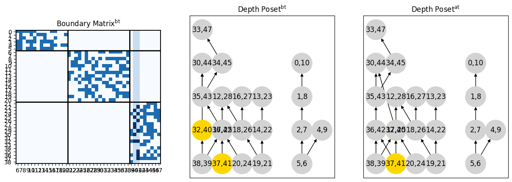

### Birth Death Pairs
|                          |                                                                                                                                                                                                               |
|:-------------------------|:--------------------------------------------------------------------------------------------------------------------------------------------------------------------------------------------------------------|
| Before the transposition | $\{(32, 40), (18, 26), (4, 9), (12, 28), (14, 22), (19, 21), (13, 23), (33, 47), (5, 6), (0, 10), (2, 7), (34, 45), (36, 42), (1, 8), (37, 41), (30, 44), (16, 27), (35, 43), (20, 24), (38, 39), (17, 25)\}$ |
| After the transposition  | $\{(32, 40), (18, 26), (4, 9), (12, 28), (14, 22), (19, 21), (13, 23), (33, 47), (5, 6), (0, 10), (2, 7), (34, 45), (36, 42), (1, 8), (37, 41), (30, 44), (16, 27), (35, 43), (20, 24), (38, 39), (17, 25)\}$ |

### Relations
|                          | Algorithm 1                                                                                                                                                                                                                                                                                                                                                                                                                          | Algorithm 2                                                                                                                                                                                                                                                                                                                                    |
|:-------------------------|:-------------------------------------------------------------------------------------------------------------------------------------------------------------------------------------------------------------------------------------------------------------------------------------------------------------------------------------------------------------------------------------------------------------------------------------|:-----------------------------------------------------------------------------------------------------------------------------------------------------------------------------------------------------------------------------------------------------------------------------------------------------------------------------------------------|
| Before the transposition | $\{(41, 43), (6, 15), (43, 46), (41, 46), (26, 27), (21, 22), (21, 28), (22, 23), (40, 44), (23, 31), (9, 11), (10, 15), (6, 11), (25, 28), (41, 42), (25, 31), (42, 47), (41, 45), (24, 29), (42, 44), (43, 45), (8, 11), (22, 31), (10, 11), (28, 29), (6, 7), (6, 10), (41, 44), (24, 31), (26, 28), (43, 44), (42, 46), (43, 47), (44, 46), (21, 26), (8, 10), (9, 15), (28, 31), (45, 47), (27, 29), (7, 11), (6, 9), (7, 8)\}$ | $\{(35, 30), (20, 11), (35, 33), (38, 29), (20, 17), (5, 4), (38, 32), (14, 13), (34, 31), (19, 12), (1, 0), (37, 30), (37, 36), (32, 30), (18, 16), (35, 29), (5, 0), (5, 3), (19, 14), (36, 30), (34, 33), (2, 1), (37, 29), (37, 35), (36, 33), (30, 29), (16, 15), (33, 31), (38, 30), (12, 11), (20, 15), (38, 36), (19, 13), (36, 35)\}$ |
| After the transposition  | $\{(6, 15), (41, 43), (43, 46), (26, 27), (41, 46), (21, 22), (21, 28), (22, 23), (40, 44), (23, 31), (9, 11), (10, 15), (6, 11), (25, 28), (41, 42), (25, 31), (42, 47), (24, 29), (41, 45), (42, 44), (43, 45), (8, 11), (22, 31), (10, 11), (28, 29), (6, 7), (6, 10), (41, 44), (24, 31), (26, 28), (43, 44), (42, 46), (43, 47), (44, 46), (21, 26), (8, 10), (9, 15), (28, 31), (45, 47), (27, 29), (7, 11), (6, 9), (7, 8)\}$ | $\{(35, 30), (20, 11), (35, 33), (38, 29), (20, 17), (5, 4), (38, 32), (14, 13), (19, 12), (34, 31), (1, 0), (37, 36), (32, 30), (18, 16), (35, 29), (5, 0), (5, 3), (19, 14), (36, 30), (34, 33), (2, 1), (37, 29), (37, 35), (36, 33), (37, 32), (30, 29), (16, 15), (33, 31), (38, 30), (12, 11), (20, 15), (38, 36), (19, 13), (36, 35)\}$ |

### Successors and Predecessers
No such node in the Depth Poset

### Temp Sets
|                                                               | Before the Transposition                                         | After the Transposition                                          |
|:--------------------------------------------------------------|:-----------------------------------------------------------------|:-----------------------------------------------------------------|
| $\mathcal{B} = \{(s, t)\in \text{BD}:\; f(s) > f(x)\}$        | $\{(35, 43), (38, 39), (34, 45), (36, 42), (37, 41), (33, 47)\}$ | $\{(35, 43), (38, 39), (34, 45), (36, 42), (37, 41), (33, 47)\}$ |
| $\mathcal{N} = \{(s, t)\in \text{BD}:\; f(x) > f(s) > f(a)\}$ | $\emptyset$                                                      | $\emptyset$                                                      |

### Equations
There are 2 equations are wrong.

| eq   | left (formula)                  | left (paramatrized)               | left (value)   | right (formula)                                                                        | right (paramatrized)                                                                         | right (value)                      | correct   |
|:-----|:--------------------------------|:----------------------------------|:---------------|:---------------------------------------------------------------------------------------|:---------------------------------------------------------------------------------------------|:-----------------------------------|:----------|
| Eq36 | $\text{Succ}_2^\text{at}(x, y)$ | $\text{Succ}_2^\text{at}(32, 40)$ | $\{(30, 44)\}$ | $\text{Succ}_2^\text{bt}(x, y) \oplus \{(a, b)\} \oplus \text{Succ}_2^\text{bt}(a, b)$ | $\text{Succ}_2^\text{bt}(32, 40) \oplus \{(37, 41)\} \oplus \text{Succ}_2^\text{bt}(37, 41)$ | $\{(35, 43), (36, 42), (37, 41)\}$ | ✘         |
| Eq37 | $\text{Pred}_2^\text{at}(a, b)$ | $\text{Pred}_2^\text{at}(37, 41)$ | $\emptyset$    | $\text{Pred}_2^\text{bt}(a, b) \oplus \{(x, y)\}$                                      | $\text{Pred}_2^\text{bt}(37, 41) \oplus \{(32, 40)\}$                                        | $\{(32, 40)\}$                     | ✘         |

## Transposition <44, 45> in complex 20
Here is a __death-death__ __no switch__ transposition <44, 45>.

$$
a = 34, \; b = 45, \; x = 30, \; y = 44
$$

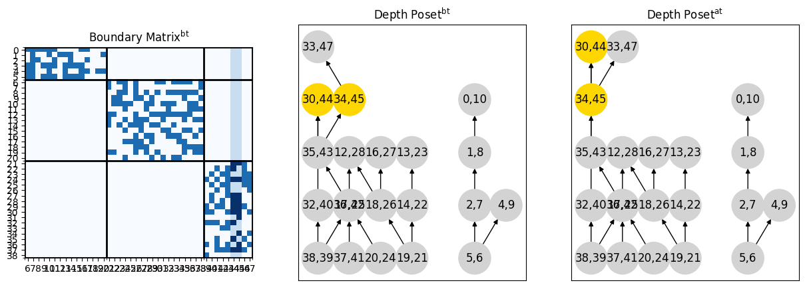

### Birth Death Pairs
|                          |                                                                                                                                                                                                               |
|:-------------------------|:--------------------------------------------------------------------------------------------------------------------------------------------------------------------------------------------------------------|
| Before the transposition | $\{(32, 40), (18, 26), (4, 9), (12, 28), (14, 22), (19, 21), (13, 23), (33, 47), (5, 6), (0, 10), (2, 7), (34, 45), (36, 42), (1, 8), (37, 41), (30, 44), (16, 27), (35, 43), (20, 24), (38, 39), (17, 25)\}$ |
| After the transposition  | $\{(32, 40), (18, 26), (4, 9), (12, 28), (14, 22), (19, 21), (13, 23), (33, 47), (5, 6), (0, 10), (2, 7), (34, 45), (36, 42), (1, 8), (37, 41), (30, 44), (16, 27), (35, 43), (20, 24), (38, 39), (17, 25)\}$ |

### Relations
|                          | Algorithm 1                                                                                                                                                                                                                                                                                                                                                                                                                          | Algorithm 2                                                                                                                                                                                                                                                                                                                                                        |
|:-------------------------|:-------------------------------------------------------------------------------------------------------------------------------------------------------------------------------------------------------------------------------------------------------------------------------------------------------------------------------------------------------------------------------------------------------------------------------------|:-------------------------------------------------------------------------------------------------------------------------------------------------------------------------------------------------------------------------------------------------------------------------------------------------------------------------------------------------------------------|
| Before the transposition | $\{(41, 43), (6, 15), (43, 46), (41, 46), (26, 27), (21, 22), (21, 28), (22, 23), (40, 44), (23, 31), (9, 11), (10, 15), (6, 11), (25, 28), (41, 42), (25, 31), (42, 47), (41, 45), (24, 29), (42, 44), (43, 45), (8, 11), (22, 31), (10, 11), (28, 29), (6, 7), (6, 10), (41, 44), (24, 31), (26, 28), (43, 44), (42, 46), (43, 47), (44, 46), (21, 26), (8, 10), (9, 15), (28, 31), (45, 47), (27, 29), (7, 11), (6, 9), (7, 8)\}$ | $\{(35, 30), (20, 11), (35, 33), (38, 29), (20, 17), (5, 4), (38, 32), (14, 13), (34, 31), (19, 12), (1, 0), (37, 30), (37, 36), (32, 30), (18, 16), (35, 29), (5, 0), (5, 3), (19, 14), (36, 30), (34, 33), (2, 1), (37, 29), (37, 35), (36, 33), (30, 29), (16, 15), (33, 31), (38, 30), (12, 11), (20, 15), (38, 36), (19, 13), (36, 35)\}$                     |
| After the transposition  | $\{(41, 43), (6, 15), (43, 46), (41, 46), (26, 27), (21, 22), (21, 28), (22, 23), (40, 44), (23, 31), (9, 11), (10, 15), (6, 11), (25, 28), (41, 42), (25, 31), (42, 47), (24, 29), (41, 45), (42, 44), (43, 45), (8, 11), (22, 31), (10, 11), (28, 29), (6, 7), (6, 10), (41, 44), (24, 31), (26, 28), (43, 44), (42, 46), (43, 47), (44, 46), (21, 26), (8, 10), (9, 15), (28, 31), (45, 47), (27, 29), (7, 11), (6, 9), (7, 8)\}$ | $\{(35, 30), (20, 11), (35, 33), (38, 29), (20, 17), (5, 4), (38, 32), (14, 13), (19, 12), (34, 31), (1, 0), (37, 30), (37, 36), (32, 30), (18, 16), (35, 29), (5, 0), (5, 3), (34, 30), (19, 14), (36, 30), (34, 33), (2, 1), (37, 29), (37, 35), (36, 33), (30, 29), (16, 15), (33, 31), (38, 30), (12, 11), (20, 15), (38, 36), (34, 29), (19, 13), (36, 35)\}$ |

### Successors and Predecessers
No such node in the Depth Poset

### Temp Sets
|                                                               | Before the Transposition                                                   | After the Transposition                                                    |
|:--------------------------------------------------------------|:---------------------------------------------------------------------------|:---------------------------------------------------------------------------|
| $\mathcal{B} = \{(s, t)\in \text{BD}:\; f(s) > f(x)\}$        | $\{(35, 43), (32, 40), (38, 39), (34, 45), (36, 42), (37, 41), (33, 47)\}$ | $\{(35, 43), (32, 40), (38, 39), (34, 45), (36, 42), (37, 41), (33, 47)\}$ |
| $\mathcal{N} = \{(s, t)\in \text{BD}:\; f(x) > f(s) > f(a)\}$ | $\emptyset$                                                                | $\emptyset$                                                                |

### Equations
There are 2 equations are wrong.

| eq   | left (formula)                  | left (paramatrized)               | left (value)   | right (formula)                                                                        | right (paramatrized)                                                                         | right (value)            | correct   |
|:-----|:--------------------------------|:----------------------------------|:---------------|:---------------------------------------------------------------------------------------|:---------------------------------------------------------------------------------------------|:-------------------------|:----------|
| Eq36 | $\text{Succ}_2^\text{at}(x, y)$ | $\text{Succ}_2^\text{at}(30, 44)$ | $\emptyset$    | $\text{Succ}_2^\text{bt}(x, y) \oplus \{(a, b)\} \oplus \text{Succ}_2^\text{bt}(a, b)$ | $\text{Succ}_2^\text{bt}(30, 44) \oplus \{(34, 45)\} \oplus \text{Succ}_2^\text{bt}(34, 45)$ | $\{(33, 47), (34, 45)\}$ | ✘         |
| Eq37 | $\text{Pred}_2^\text{at}(a, b)$ | $\text{Pred}_2^\text{at}(34, 45)$ | $\emptyset$    | $\text{Pred}_2^\text{bt}(a, b) \oplus \{(x, y)\}$                                      | $\text{Pred}_2^\text{bt}(34, 45) \oplus \{(30, 44)\}$                                        | $\{(30, 44)\}$           | ✘         |

## Transposition <4, 5> in complex 21
Here is a __birth-birth__ __switch forward__ transposition <4, 5>.

$$
a = 4, \; b = 9, \; x = 5, \; y = 6
$$

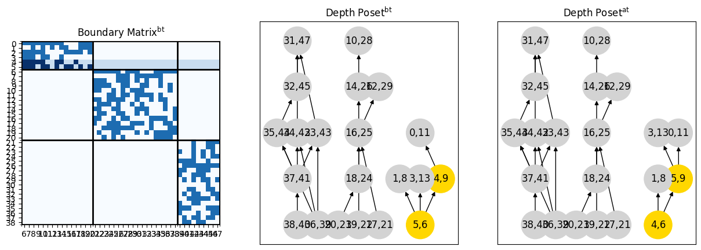

### Birth Death Pairs
|                          |                                                                                                                                                                                                                |
|:-------------------------|:---------------------------------------------------------------------------------------------------------------------------------------------------------------------------------------------------------------|
| Before the transposition | $\{(4, 9), (20, 23), (3, 13), (17, 21), (31, 47), (0, 11), (16, 25), (35, 44), (32, 45), (5, 6), (38, 40), (34, 42), (36, 39), (1, 8), (37, 41), (18, 24), (33, 43), (12, 29), (14, 26), (19, 22), (10, 28)\}$ |
| After the transposition  | $\{(20, 23), (4, 6), (3, 13), (17, 21), (31, 47), (0, 11), (16, 25), (35, 44), (32, 45), (38, 40), (5, 9), (34, 42), (36, 39), (1, 8), (37, 41), (18, 24), (33, 43), (12, 29), (14, 26), (19, 22), (10, 28)\}$ |

### Relations
|                          | Algorithm 1                                                                                                                                                                                                                                                                                                                                                                                                                    | Algorithm 2                                                                                                                                                                                                                                                                                                                                                                                                                                   |
|:-------------------------|:-------------------------------------------------------------------------------------------------------------------------------------------------------------------------------------------------------------------------------------------------------------------------------------------------------------------------------------------------------------------------------------------------------------------------------|:----------------------------------------------------------------------------------------------------------------------------------------------------------------------------------------------------------------------------------------------------------------------------------------------------------------------------------------------------------------------------------------------------------------------------------------------|
| Before the transposition | $\{(6, 15), (26, 30), (43, 46), (41, 46), (44, 45), (26, 27), (21, 28), (21, 25), (40, 44), (22, 26), (23, 25), (40, 41), (9, 11), (8, 15), (6, 11), (24, 26), (41, 42), (6, 8), (42, 47), (41, 45), (24, 29), (21, 30), (22, 25), (23, 27), (40, 43), (39, 47), (6, 7), (6, 13), (24, 28), (41, 44), (25, 27), (26, 28), (42, 46), (43, 47), (29, 30), (22, 30), (39, 46), (39, 43), (9, 15), (45, 47), (13, 15), (25, 26)\}$ | $\{(32, 31), (4, 0), (35, 27), (14, 7), (5, 4), (38, 35), (38, 32), (17, 12), (19, 12), (37, 27), (37, 33), (19, 15), (36, 34), (32, 27), (16, 10), (32, 30), (18, 10), (18, 16), (4, 2), (5, 0), (38, 37), (5, 3), (17, 14), (34, 27), (19, 14), (36, 27), (37, 32), (16, 12), (35, 31), (3, 2), (20, 18), (38, 27), (20, 15), (5, 2), (31, 30), (17, 10), (17, 16), (19, 10), (19, 16), (37, 31), (36, 35), (16, 14), (33, 27), (18, 14)\}$ |
| After the transposition  | $\{(26, 30), (43, 46), (41, 46), (44, 45), (26, 27), (21, 28), (21, 25), (40, 44), (22, 26), (23, 25), (40, 41), (9, 11), (8, 15), (24, 26), (41, 42), (6, 8), (42, 47), (41, 45), (24, 29), (21, 30), (22, 25), (23, 27), (40, 43), (39, 47), (6, 7), (6, 13), (24, 28), (41, 44), (25, 27), (26, 28), (42, 46), (43, 47), (29, 30), (22, 30), (39, 46), (39, 43), (9, 15), (45, 47), (13, 15), (6, 9), (25, 26)\}$           | $\{(32, 31), (35, 27), (4, 0), (4, 3), (14, 7), (38, 35), (38, 32), (17, 12), (19, 12), (37, 27), (19, 15), (37, 33), (36, 34), (32, 27), (16, 10), (32, 30), (18, 10), (18, 16), (4, 2), (4, 5), (38, 37), (5, 3), (17, 14), (34, 27), (19, 14), (36, 27), (37, 32), (16, 12), (35, 31), (3, 2), (20, 18), (38, 27), (20, 15), (31, 30), (17, 10), (17, 16), (19, 10), (19, 16), (37, 31), (36, 35), (16, 14), (33, 27), (18, 14)\}$         |

### Successors and Predecessers
|                 | $\text{Set}^\text{bt}(4, 9)$                  | $\text{Set}^\text{bt}(5, 6)$                                   | $\text{Set}^\text{at}(4, 6)$                                   | $\text{Set}^\text{at}(5, 9)$                  |
|:----------------|:----------------------------------------------|:---------------------------------------------------------------|:---------------------------------------------------------------|:----------------------------------------------|
| $\text{Succ}_1$ | $\text{Succ}_1^\text{bt}(4, 9) = \{(0, 11)\}$ | $\text{Succ}_1^\text{bt}(5, 6) = \{(3, 13), (1, 8), (0, 11)\}$ | $\text{Succ}_1^\text{at}(4, 6) = \{(5, 9), (1, 8), (3, 13)\}$  | $\text{Succ}_1^\text{at}(5, 9) = \{(0, 11)\}$ |
| $\text{Pred}_1$ | $\text{Pred}_1^\text{bt}(4, 9) = \emptyset$   | $\text{Pred}_1^\text{bt}(5, 6) = \emptyset$                    | $\text{Pred}_1^\text{at}(4, 6) = \emptyset$                    | $\text{Pred}_1^\text{at}(5, 9) = \{(4, 6)\}$  |
| $\text{Succ}_2$ | $\text{Succ}_2^\text{bt}(4, 9) = \{(0, 11)\}$ | $\text{Succ}_2^\text{bt}(5, 6) = \{(4, 9), (3, 13), (0, 11)\}$ | $\text{Succ}_2^\text{at}(4, 6) = \{(5, 9), (3, 13), (0, 11)\}$ | $\text{Succ}_2^\text{at}(5, 9) = \{(3, 13)\}$ |
| $\text{Pred}_2$ | $\text{Pred}_2^\text{bt}(4, 9) = \{(5, 6)\}$  | $\text{Pred}_2^\text{bt}(5, 6) = \emptyset$                    | $\text{Pred}_2^\text{at}(4, 6) = \emptyset$                    | $\text{Pred}_2^\text{at}(5, 9) = \{(4, 6)\}$  |

### Temp Sets
|                                                               | Before the Transposition   | After the Transposition   |
|:--------------------------------------------------------------|:---------------------------|:--------------------------|
| $\mathcal{L} = \{(s, t)\in \text{BD}:\; f(t) < f(y)\}$        | $\emptyset$                | $\emptyset$               |
| $\mathcal{M} = \{(s, t)\in \text{BD}:\; f(y) < f(t) < f(b)\}$ | $\{(1, 8)\}$               | $\{(1, 8)\}$              |

### Equations
There are 1 equations are wrong.

| eq   | left (formula)                  | left (paramatrized)             | left (value)                   | right (formula)                                                                                           | right (paramatrized)                                                                                      | right (value)                  | correct   |
|:-----|:--------------------------------|:--------------------------------|:-------------------------------|:----------------------------------------------------------------------------------------------------------|:----------------------------------------------------------------------------------------------------------|:-------------------------------|:----------|
| Eq08 | $\text{Succ}_1^\text{at}(a, y)$ | $\text{Succ}_1^\text{at}(4, 6)$ | $\{(5, 9), (1, 8), (3, 13)\}$  | $\text{Succ}_1^\text{bt}(x, y) \oplus \{(x, b)\} \oplus \text{Succ}_1^\text{bt}(a, b)$                    | $\text{Succ}_1^\text{bt}(5, 6) \oplus \{(5, 9)\} \oplus \text{Succ}_1^\text{bt}(4, 9)$                    | $\{(5, 9), (1, 8), (3, 13)\}$  | ✔         |
| Eq09 | $\text{Succ}_1^\text{at}(x, b)$ | $\text{Succ}_1^\text{at}(5, 9)$ | $\{(0, 11)\}$                  | $\text{Succ}_1^\text{bt}(a, b)$                                                                           | $\text{Succ}_1^\text{bt}(4, 9)$                                                                           | $\{(0, 11)\}$                  | ✔         |
| Eq10 | $\text{Pred}_1^\text{at}(a, y)$ | $\text{Pred}_1^\text{at}(4, 6)$ | $\emptyset$                    | $\text{Pred}_1^\text{bt}(x, y)$                                                                           | $\text{Pred}_1^\text{bt}(5, 6)$                                                                           | $\emptyset$                    | ✔         |
| Eq11 | $\text{Pred}_1^\text{at}(x, b)$ | $\text{Pred}_1^\text{at}(5, 9)$ | $\{(4, 6)\}$                   | $\text{Pred}_1^\text{bt}(a, b) \oplus \{(a, y)\}$                                                         | $\text{Pred}_1^\text{bt}(4, 9) \oplus \{(4, 6)\}$                                                         | $\{(4, 6)\}$                   | ✔         |
| Eq12 | $\text{Succ}_2^\text{at}(a, y)$ | $\text{Succ}_2^\text{at}(4, 6)$ | $\{(5, 9), (3, 13), (0, 11)\}$ | $\text{Succ}_2^\text{bt}(x, y) \oplus \{(x, b), (a, b)\}$                                                 | $\text{Succ}_2^\text{bt}(5, 6) \oplus \{(5, 9), (4, 9)\}$                                                 | $\{(5, 9), (3, 13), (0, 11)\}$ | ✔         |
| Eq13 | $\text{Succ}_2^\text{at}(x, b)$ | $\text{Succ}_2^\text{at}(5, 9)$ | $\{(3, 13)\}$                  | $\text{Succ}_2^\text{bt}(a, b)$                                                                           | $\text{Succ}_2^\text{bt}(4, 9)$                                                                           | $\{(0, 11)\}$                  | ✘         |
| Eq14 | $\text{Pred}_2^\text{at}(a, y)$ | $\text{Pred}_2^\text{at}(4, 6)$ | $\emptyset$                    | $[\text{Pred}_2^\text{bt}(a, b) \cap \mathcal{L}]$                                                        | $[\text{Pred}_2^\text{bt}(4, 9) \cap \mathcal{L}]$                                                        | $\emptyset$                    | ✔         |
| Eq15 | $\text{Pred}_2^\text{at}(x, b)$ | $\text{Pred}_2^\text{at}(5, 9)$ | $\{(4, 6)\}$                   | $\text{Pred}_2^\text{bt}(x, y) \oplus \{(a, y)\} \oplus [\text{Pred}_2^\text{bt}(a, b) \cap \mathcal{M}]$ | $\text{Pred}_2^\text{bt}(5, 6) \oplus \{(4, 6)\} \oplus [\text{Pred}_2^\text{bt}(4, 9) \cap \mathcal{M}]$ | $\{(4, 6)\}$                   | ✔         |

## Transposition <11, 12> in complex 21
Here is a __birth-death__ __switch forward__ transposition <11, 12>.

$$
a = 0, \; b = 11, \; x = 12, \; y = 29
$$

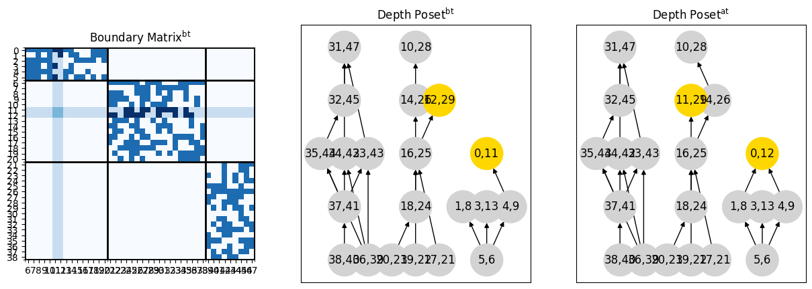

### Birth Death Pairs
|                          |                                                                                                                                                                                                                |
|:-------------------------|:---------------------------------------------------------------------------------------------------------------------------------------------------------------------------------------------------------------|
| Before the transposition | $\{(4, 9), (20, 23), (3, 13), (17, 21), (31, 47), (0, 11), (16, 25), (35, 44), (32, 45), (5, 6), (38, 40), (34, 42), (36, 39), (1, 8), (37, 41), (18, 24), (33, 43), (12, 29), (14, 26), (19, 22), (10, 28)\}$ |
| After the transposition  | $\{(4, 9), (20, 23), (3, 13), (17, 21), (31, 47), (11, 29), (16, 25), (35, 44), (32, 45), (5, 6), (38, 40), (34, 42), (36, 39), (1, 8), (37, 41), (18, 24), (33, 43), (14, 26), (0, 12), (19, 22), (10, 28)\}$ |

### Relations
|                          | Algorithm 1                                                                                                                                                                                                                                                                                                                                                                                                                    | Algorithm 2                                                                                                                                                                                                                                                                                                                                                                                                                                   |
|:-------------------------|:-------------------------------------------------------------------------------------------------------------------------------------------------------------------------------------------------------------------------------------------------------------------------------------------------------------------------------------------------------------------------------------------------------------------------------|:----------------------------------------------------------------------------------------------------------------------------------------------------------------------------------------------------------------------------------------------------------------------------------------------------------------------------------------------------------------------------------------------------------------------------------------------|
| Before the transposition | $\{(6, 15), (26, 30), (43, 46), (41, 46), (44, 45), (26, 27), (21, 28), (21, 25), (40, 44), (22, 26), (23, 25), (40, 41), (9, 11), (8, 15), (6, 11), (24, 26), (41, 42), (6, 8), (42, 47), (41, 45), (24, 29), (21, 30), (22, 25), (23, 27), (40, 43), (39, 47), (6, 7), (6, 13), (24, 28), (41, 44), (25, 27), (26, 28), (42, 46), (43, 47), (29, 30), (22, 30), (39, 46), (39, 43), (9, 15), (45, 47), (13, 15), (25, 26)\}$ | $\{(32, 31), (4, 0), (35, 27), (14, 7), (5, 4), (38, 35), (38, 32), (17, 12), (19, 12), (37, 27), (37, 33), (19, 15), (36, 34), (32, 27), (16, 10), (32, 30), (18, 10), (18, 16), (4, 2), (5, 0), (38, 37), (5, 3), (17, 14), (34, 27), (19, 14), (36, 27), (37, 32), (16, 12), (35, 31), (3, 2), (20, 18), (38, 27), (20, 15), (5, 2), (31, 30), (17, 10), (17, 16), (19, 10), (19, 16), (37, 31), (36, 35), (16, 14), (33, 27), (18, 14)\}$ |
| After the transposition  | $\{(6, 15), (26, 30), (43, 46), (41, 46), (44, 45), (26, 27), (21, 28), (21, 25), (40, 44), (22, 26), (23, 25), (40, 41), (8, 12), (8, 15), (24, 26), (41, 42), (6, 8), (42, 47), (41, 45), (24, 29), (21, 30), (22, 25), (23, 27), (40, 43), (39, 47), (6, 7), (6, 13), (24, 28), (41, 44), (25, 27), (26, 28), (42, 46), (43, 47), (29, 30), (22, 30), (39, 46), (39, 43), (9, 15), (45, 47), (13, 15), (25, 26)\}$          | $\{(32, 31), (4, 0), (35, 27), (14, 7), (5, 4), (38, 35), (38, 32), (37, 27), (19, 15), (37, 33), (36, 34), (32, 27), (16, 10), (32, 30), (18, 10), (18, 16), (4, 2), (5, 0), (38, 37), (5, 3), (17, 14), (34, 27), (19, 14), (36, 27), (37, 32), (35, 31), (3, 2), (20, 18), (38, 27), (20, 15), (5, 2), (31, 30), (17, 10), (17, 16), (19, 10), (19, 16), (37, 31), (36, 35), (16, 14), (18, 11), (16, 11), (33, 27), (18, 14)\}$           |

### Successors and Predecessers
|                 | $\text{Set}^\text{bt}(0, 11)$                         | $\text{Set}^\text{bt}(12, 29)$                                       | $\text{Set}^\text{at}(0, 12)$                         | $\text{Set}^\text{at}(11, 29)$                             |
|:----------------|:------------------------------------------------------|:---------------------------------------------------------------------|:------------------------------------------------------|:-----------------------------------------------------------|
| $\text{Succ}_1$ | $\text{Succ}_1^\text{bt}(0, 11) = \emptyset$          | $\text{Succ}_1^\text{bt}(12, 29) = \emptyset$                        | $\text{Succ}_1^\text{at}(0, 12) = \emptyset$          | $\text{Succ}_1^\text{at}(11, 29) = \emptyset$              |
| $\text{Pred}_1$ | $\text{Pred}_1^\text{bt}(0, 11) = \{(4, 9), (5, 6)\}$ | $\text{Pred}_1^\text{bt}(12, 29) = \{(18, 24)\}$                     | $\text{Pred}_1^\text{at}(0, 12) = \{(1, 8)\}$         | $\text{Pred}_1^\text{at}(11, 29) = \{(18, 24)\}$           |
| $\text{Succ}_2$ | $\text{Succ}_2^\text{bt}(0, 11) = \emptyset$          | $\text{Succ}_2^\text{bt}(12, 29) = \emptyset$                        | $\text{Succ}_2^\text{at}(0, 12) = \emptyset$          | $\text{Succ}_2^\text{at}(11, 29) = \emptyset$              |
| $\text{Pred}_2$ | $\text{Pred}_2^\text{bt}(0, 11) = \{(4, 9), (5, 6)\}$ | $\text{Pred}_2^\text{bt}(12, 29) = \{(16, 25), (19, 22), (17, 21)\}$ | $\text{Pred}_2^\text{at}(0, 12) = \{(4, 9), (5, 6)\}$ | $\text{Pred}_2^\text{at}(11, 29) = \{(16, 25), (18, 24)\}$ |

### Temp Sets
|                                                              | Before the Transposition                                         | After the Transposition                                          |
|:-------------------------------------------------------------|:-----------------------------------------------------------------|:-----------------------------------------------------------------|
| $A_1 = \{(s, t)\in \text{BD}:\; f(a) < f(s) < f(t) < f(x)\}$ | $\{(4, 9), (1, 8), (5, 6)\}$                                     | $\{(4, 9), (1, 8), (5, 6)\}$                                     |
| $B_1 = \{(s, t)\in \text{BD}:\; U_1[t, x] = 1\}$             | $\emptyset$                                                      | $\{(1, 8)\}$                                                     |
| $A_2 = \{(s, t)\in \text{BD}:\; f(b) < f(s) < f(t) < f(y)\}$ | $\{(20, 23), (14, 26), (16, 25), (19, 22), (17, 21), (18, 24)\}$ | $\{(20, 23), (14, 26), (16, 25), (19, 22), (17, 21), (18, 24)\}$ |
| $B_2 = \{(s, t)\in \text{BD}:\; U_2[b, s] = 1\}$             | $\emptyset$                                                      | $\{(16, 25), (18, 24)\}$                                         |

### Equations
There are 4 equations are wrong.

| eq    | left (formula)                  | left (paramatrized)               | left (value)             | right (formula)                                      | right (paramatrized)                                  | right (value)            | correct   |
|:------|:--------------------------------|:----------------------------------|:-------------------------|:-----------------------------------------------------|:------------------------------------------------------|:-------------------------|:----------|
| Eq48  | $\text{Succ}_1^\text{at}(a, x)$ | $\text{Succ}_1^\text{at}(0, 12)$  | $\emptyset$              | $\text{Succ}_1^\text{bt}(a, b)$                      | $\text{Succ}_1^\text{bt}(0, 11)$                      | $\emptyset$              | ✔         |
| Eq49  | $\text{Succ}_1^\text{at}(b, y)$ | $\text{Succ}_1^\text{at}(11, 29)$ | $\emptyset$              | $\text{Succ}_1^\text{bt}(x, y)$                      | $\text{Succ}_1^\text{bt}(12, 29)$                     | $\emptyset$              | ✔         |
| Eq50  | $\text{Pred}_1^\text{at}(a, x)$ | $\text{Pred}_1^\text{at}(0, 12)$  | $\{(1, 8)\}$             | $\{(s, t)\in \text{BD}:\; U_1^\text{bt}[t, x] = 1\}$ | $\{(s, t)\in \text{BD}:\; U_1^\text{bt}[t, 12] = 1\}$ | $\emptyset$              | ✘         |
| Eq50a | $\text{Pred}_1^\text{at}(a, x)$ | $\text{Pred}_1^\text{at}(0, 12)$  | $\{(1, 8)\}$             | $A_1^\text{bt} \cap B_1^\text{bt}$                   | $A_1^\text{bt} \cap B_1^\text{bt}$                    | $\emptyset$              | ✘         |
| Eq50b | $\text{Pred}_1^\text{at}(a, x)$ | $\text{Pred}_1^\text{at}(0, 12)$  | $\{(1, 8)\}$             | $A_1^\text{bt} \cap B_1^\text{at}$                   | $A_1^\text{bt} \cap B_1^\text{at}$                    | $\{(1, 8)\}$             | ✔         |
| Eq51  | $\text{Pred}_1^\text{at}(b, y)$ | $\text{Pred}_1^\text{at}(11, 29)$ | $\{(18, 24)\}$           | $\text{Pred}_1^\text{bt}(x, y)$                      | $\text{Pred}_1^\text{bt}(12, 29)$                     | $\{(18, 24)\}$           | ✔         |
| Eq52  | $\text{Succ}_2^\text{at}(a, x)$ | $\text{Succ}_2^\text{at}(0, 12)$  | $\emptyset$              | $\text{Succ}_2^\text{bt}(a, b)$                      | $\text{Succ}_2^\text{bt}(0, 11)$                      | $\emptyset$              | ✔         |
| Eq53  | $\text{Succ}_2^\text{at}(b, y)$ | $\text{Succ}_2^\text{at}(11, 29)$ | $\emptyset$              | $\text{Succ}_2^\text{bt}(x, y)$                      | $\text{Succ}_2^\text{bt}(12, 29)$                     | $\emptyset$              | ✔         |
| Eq54  | $\text{Pred}_2^\text{at}(a, x)$ | $\text{Pred}_2^\text{at}(0, 12)$  | $\{(4, 9), (5, 6)\}$     | $\text{Pred}_2^\text{bt}(a, b)$                      | $\text{Pred}_2^\text{bt}(0, 11)$                      | $\{(4, 9), (5, 6)\}$     | ✔         |
| Eq55  | $\text{Pred}_2^\text{at}(b, y)$ | $\text{Pred}_2^\text{at}(11, 29)$ | $\{(16, 25), (18, 24)\}$ | $\{(s, t)\in \text{BD}:\; U_2^\text{bt}[b, s] = 1\}$ | $\{(s, t)\in \text{BD}:\; U_2^\text{bt}[11, s] = 1\}$ | $\emptyset$              | ✘         |
| Eq55a | $\text{Pred}_2^\text{at}(b, y)$ | $\text{Pred}_2^\text{at}(11, 29)$ | $\{(16, 25), (18, 24)\}$ | $A_2^\text{bt} \cap B_2^\text{bt}$                   | $A_2^\text{bt} \cap B_2^\text{bt}$                    | $\emptyset$              | ✘         |
| Eq55b | $\text{Pred}_2^\text{at}(b, y)$ | $\text{Pred}_2^\text{at}(11, 29)$ | $\{(16, 25), (18, 24)\}$ | $A_2^\text{bt} \cap B_2^\text{at}$                   | $A_2^\text{bt} \cap B_2^\text{at}$                    | $\{(16, 25), (18, 24)\}$ | ✔         |

## Transposition <13, 14> in complex 21
Here is a __birth-death__ __switch forward__ transposition <13, 14>.

$$
a = 3, \; b = 13, \; x = 14, \; y = 26
$$

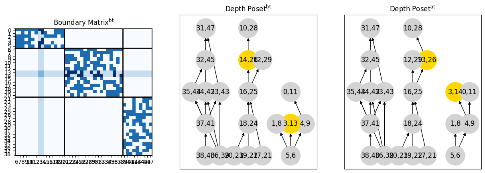

### Birth Death Pairs
|                          |                                                                                                                                                                                                                |
|:-------------------------|:---------------------------------------------------------------------------------------------------------------------------------------------------------------------------------------------------------------|
| Before the transposition | $\{(4, 9), (20, 23), (3, 13), (17, 21), (31, 47), (0, 11), (16, 25), (35, 44), (32, 45), (5, 6), (38, 40), (34, 42), (36, 39), (1, 8), (37, 41), (18, 24), (33, 43), (12, 29), (14, 26), (19, 22), (10, 28)\}$ |
| After the transposition  | $\{(4, 9), (20, 23), (17, 21), (31, 47), (0, 11), (13, 26), (16, 25), (35, 44), (32, 45), (5, 6), (38, 40), (34, 42), (36, 39), (1, 8), (37, 41), (18, 24), (33, 43), (3, 14), (12, 29), (19, 22), (10, 28)\}$ |

### Relations
|                          | Algorithm 1                                                                                                                                                                                                                                                                                                                                                                                                                    | Algorithm 2                                                                                                                                                                                                                                                                                                                                                                                                                                   |
|:-------------------------|:-------------------------------------------------------------------------------------------------------------------------------------------------------------------------------------------------------------------------------------------------------------------------------------------------------------------------------------------------------------------------------------------------------------------------------|:----------------------------------------------------------------------------------------------------------------------------------------------------------------------------------------------------------------------------------------------------------------------------------------------------------------------------------------------------------------------------------------------------------------------------------------------|
| Before the transposition | $\{(6, 15), (26, 30), (43, 46), (41, 46), (44, 45), (26, 27), (21, 28), (21, 25), (40, 44), (22, 26), (23, 25), (40, 41), (9, 11), (8, 15), (6, 11), (24, 26), (41, 42), (6, 8), (42, 47), (41, 45), (24, 29), (21, 30), (22, 25), (23, 27), (40, 43), (39, 47), (6, 7), (6, 13), (24, 28), (41, 44), (25, 27), (26, 28), (42, 46), (43, 47), (29, 30), (22, 30), (39, 46), (39, 43), (9, 15), (45, 47), (13, 15), (25, 26)\}$ | $\{(32, 31), (4, 0), (35, 27), (14, 7), (5, 4), (38, 35), (38, 32), (17, 12), (19, 12), (37, 27), (37, 33), (19, 15), (36, 34), (32, 27), (16, 10), (32, 30), (18, 10), (18, 16), (4, 2), (5, 0), (38, 37), (5, 3), (17, 14), (34, 27), (19, 14), (36, 27), (37, 32), (16, 12), (35, 31), (3, 2), (20, 18), (38, 27), (20, 15), (5, 2), (31, 30), (17, 10), (17, 16), (19, 10), (19, 16), (37, 31), (36, 35), (16, 14), (33, 27), (18, 14)\}$ |
| After the transposition  | $\{(6, 15), (26, 30), (43, 46), (41, 46), (44, 45), (26, 27), (21, 28), (21, 25), (40, 44), (22, 26), (23, 25), (40, 41), (9, 14), (9, 11), (6, 11), (24, 26), (41, 42), (6, 8), (42, 47), (41, 45), (24, 29), (21, 30), (22, 25), (14, 15), (23, 27), (40, 43), (39, 47), (6, 7), (24, 28), (41, 44), (25, 27), (26, 28), (42, 46), (43, 47), (29, 30), (22, 30), (39, 46), (39, 43), (9, 15), (45, 47), (25, 26)\}$          | $\{(32, 31), (4, 0), (35, 27), (38, 35), (5, 4), (38, 32), (17, 12), (19, 12), (37, 27), (19, 15), (37, 33), (36, 34), (32, 27), (16, 10), (32, 30), (18, 10), (18, 16), (20, 13), (18, 13), (4, 2), (5, 0), (38, 37), (5, 3), (34, 27), (36, 27), (13, 7), (37, 32), (16, 12), (35, 31), (3, 2), (20, 18), (38, 27), (20, 15), (5, 2), (31, 30), (17, 10), (17, 16), (19, 10), (19, 16), (19, 13), (37, 31), (36, 35), (33, 27)\}$           |

### Successors and Predecessers
|                 | $\text{Set}^\text{bt}(3, 13)$                 | $\text{Set}^\text{bt}(14, 26)$                                                 | $\text{Set}^\text{at}(3, 14)$                 | $\text{Set}^\text{at}(13, 26)$                                       |
|:----------------|:----------------------------------------------|:-------------------------------------------------------------------------------|:----------------------------------------------|:---------------------------------------------------------------------|
| $\text{Succ}_1$ | $\text{Succ}_1^\text{bt}(3, 13) = \emptyset$  | $\text{Succ}_1^\text{bt}(14, 26) = \{(10, 28)\}$                               | $\text{Succ}_1^\text{at}(3, 14) = \emptyset$  | $\text{Succ}_1^\text{at}(13, 26) = \{(10, 28)\}$                     |
| $\text{Pred}_1$ | $\text{Pred}_1^\text{bt}(3, 13) = \{(5, 6)\}$ | $\text{Pred}_1^\text{bt}(14, 26) = \{(16, 25), (19, 22), (18, 24)\}$           | $\text{Pred}_1^\text{at}(3, 14) = \{(4, 9)\}$ | $\text{Pred}_1^\text{at}(13, 26) = \{(16, 25), (19, 22), (18, 24)\}$ |
| $\text{Succ}_2$ | $\text{Succ}_2^\text{bt}(3, 13) = \emptyset$  | $\text{Succ}_2^\text{bt}(14, 26) = \emptyset$                                  | $\text{Succ}_2^\text{at}(3, 14) = \emptyset$  | $\text{Succ}_2^\text{at}(13, 26) = \emptyset$                        |
| $\text{Pred}_2$ | $\text{Pred}_2^\text{bt}(3, 13) = \{(5, 6)\}$ | $\text{Pred}_2^\text{bt}(14, 26) = \{(16, 25), (19, 22), (18, 24), (17, 21)\}$ | $\text{Pred}_2^\text{at}(3, 14) = \{(5, 6)\}$ | $\text{Pred}_2^\text{at}(13, 26) = \{(19, 22), (20, 23), (18, 24)\}$ |

### Temp Sets
|                                                              | Before the Transposition                               | After the Transposition                                |
|:-------------------------------------------------------------|:-------------------------------------------------------|:-------------------------------------------------------|
| $A_1 = \{(s, t)\in \text{BD}:\; f(a) < f(s) < f(t) < f(x)\}$ | $\{(4, 9), (5, 6)\}$                                   | $\{(4, 9), (5, 6)\}$                                   |
| $B_1 = \{(s, t)\in \text{BD}:\; U_1[t, x] = 1\}$             | $\emptyset$                                            | $\{(4, 9)\}$                                           |
| $A_2 = \{(s, t)\in \text{BD}:\; f(b) < f(s) < f(t) < f(y)\}$ | $\{(20, 23), (16, 25), (19, 22), (17, 21), (18, 24)\}$ | $\{(20, 23), (16, 25), (19, 22), (17, 21), (18, 24)\}$ |
| $B_2 = \{(s, t)\in \text{BD}:\; U_2[b, s] = 1\}$             | $\emptyset$                                            | $\{(19, 22), (20, 23), (18, 24)\}$                     |

### Equations
There are 4 equations are wrong.

| eq    | left (formula)                  | left (paramatrized)               | left (value)                       | right (formula)                                      | right (paramatrized)                                  | right (value)                      | correct   |
|:------|:--------------------------------|:----------------------------------|:-----------------------------------|:-----------------------------------------------------|:------------------------------------------------------|:-----------------------------------|:----------|
| Eq48  | $\text{Succ}_1^\text{at}(a, x)$ | $\text{Succ}_1^\text{at}(3, 14)$  | $\emptyset$                        | $\text{Succ}_1^\text{bt}(a, b)$                      | $\text{Succ}_1^\text{bt}(3, 13)$                      | $\emptyset$                        | ✔         |
| Eq49  | $\text{Succ}_1^\text{at}(b, y)$ | $\text{Succ}_1^\text{at}(13, 26)$ | $\{(10, 28)\}$                     | $\text{Succ}_1^\text{bt}(x, y)$                      | $\text{Succ}_1^\text{bt}(14, 26)$                     | $\{(10, 28)\}$                     | ✔         |
| Eq50  | $\text{Pred}_1^\text{at}(a, x)$ | $\text{Pred}_1^\text{at}(3, 14)$  | $\{(4, 9)\}$                       | $\{(s, t)\in \text{BD}:\; U_1^\text{bt}[t, x] = 1\}$ | $\{(s, t)\in \text{BD}:\; U_1^\text{bt}[t, 14] = 1\}$ | $\emptyset$                        | ✘         |
| Eq50a | $\text{Pred}_1^\text{at}(a, x)$ | $\text{Pred}_1^\text{at}(3, 14)$  | $\{(4, 9)\}$                       | $A_1^\text{bt} \cap B_1^\text{bt}$                   | $A_1^\text{bt} \cap B_1^\text{bt}$                    | $\emptyset$                        | ✘         |
| Eq50b | $\text{Pred}_1^\text{at}(a, x)$ | $\text{Pred}_1^\text{at}(3, 14)$  | $\{(4, 9)\}$                       | $A_1^\text{bt} \cap B_1^\text{at}$                   | $A_1^\text{bt} \cap B_1^\text{at}$                    | $\{(4, 9)\}$                       | ✔         |
| Eq51  | $\text{Pred}_1^\text{at}(b, y)$ | $\text{Pred}_1^\text{at}(13, 26)$ | $\{(16, 25), (19, 22), (18, 24)\}$ | $\text{Pred}_1^\text{bt}(x, y)$                      | $\text{Pred}_1^\text{bt}(14, 26)$                     | $\{(16, 25), (19, 22), (18, 24)\}$ | ✔         |
| Eq52  | $\text{Succ}_2^\text{at}(a, x)$ | $\text{Succ}_2^\text{at}(3, 14)$  | $\emptyset$                        | $\text{Succ}_2^\text{bt}(a, b)$                      | $\text{Succ}_2^\text{bt}(3, 13)$                      | $\emptyset$                        | ✔         |
| Eq53  | $\text{Succ}_2^\text{at}(b, y)$ | $\text{Succ}_2^\text{at}(13, 26)$ | $\emptyset$                        | $\text{Succ}_2^\text{bt}(x, y)$                      | $\text{Succ}_2^\text{bt}(14, 26)$                     | $\emptyset$                        | ✔         |
| Eq54  | $\text{Pred}_2^\text{at}(a, x)$ | $\text{Pred}_2^\text{at}(3, 14)$  | $\{(5, 6)\}$                       | $\text{Pred}_2^\text{bt}(a, b)$                      | $\text{Pred}_2^\text{bt}(3, 13)$                      | $\{(5, 6)\}$                       | ✔         |
| Eq55  | $\text{Pred}_2^\text{at}(b, y)$ | $\text{Pred}_2^\text{at}(13, 26)$ | $\{(19, 22), (20, 23), (18, 24)\}$ | $\{(s, t)\in \text{BD}:\; U_2^\text{bt}[b, s] = 1\}$ | $\{(s, t)\in \text{BD}:\; U_2^\text{bt}[13, s] = 1\}$ | $\emptyset$                        | ✘         |
| Eq55a | $\text{Pred}_2^\text{at}(b, y)$ | $\text{Pred}_2^\text{at}(13, 26)$ | $\{(19, 22), (20, 23), (18, 24)\}$ | $A_2^\text{bt} \cap B_2^\text{bt}$                   | $A_2^\text{bt} \cap B_2^\text{bt}$                    | $\emptyset$                        | ✘         |
| Eq55b | $\text{Pred}_2^\text{at}(b, y)$ | $\text{Pred}_2^\text{at}(13, 26)$ | $\{(19, 22), (20, 23), (18, 24)\}$ | $A_2^\text{bt} \cap B_2^\text{at}$                   | $A_2^\text{bt} \cap B_2^\text{at}$                    | $\{(18, 24), (20, 23), (19, 22)\}$ | ✔         |

## Transposition <17, 18> in complex 21
Here is a __birth-birth__ __no switch__ transposition <17, 18>.

$$
a = 17, \; b = 21, \; x = 18, \; y = 24
$$

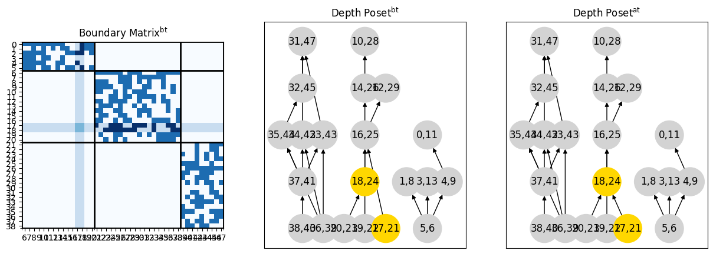

### Birth Death Pairs
|                          |                                                                                                                                                                                                                |
|:-------------------------|:---------------------------------------------------------------------------------------------------------------------------------------------------------------------------------------------------------------|
| Before the transposition | $\{(4, 9), (20, 23), (3, 13), (17, 21), (31, 47), (0, 11), (16, 25), (35, 44), (32, 45), (5, 6), (38, 40), (34, 42), (36, 39), (1, 8), (37, 41), (18, 24), (33, 43), (12, 29), (14, 26), (19, 22), (10, 28)\}$ |
| After the transposition  | $\{(4, 9), (20, 23), (3, 13), (17, 21), (31, 47), (0, 11), (16, 25), (35, 44), (32, 45), (5, 6), (38, 40), (34, 42), (36, 39), (1, 8), (37, 41), (18, 24), (33, 43), (12, 29), (14, 26), (19, 22), (10, 28)\}$ |

### Relations
|                          | Algorithm 1                                                                                                                                                                                                                                                                                                                                                                                                                                        | Algorithm 2                                                                                                                                                                                                                                                                                                                                                                                                                                   |
|:-------------------------|:---------------------------------------------------------------------------------------------------------------------------------------------------------------------------------------------------------------------------------------------------------------------------------------------------------------------------------------------------------------------------------------------------------------------------------------------------|:----------------------------------------------------------------------------------------------------------------------------------------------------------------------------------------------------------------------------------------------------------------------------------------------------------------------------------------------------------------------------------------------------------------------------------------------|
| Before the transposition | $\{(6, 15), (26, 30), (43, 46), (41, 46), (44, 45), (26, 27), (21, 28), (21, 25), (40, 44), (22, 26), (23, 25), (40, 41), (9, 11), (8, 15), (6, 11), (24, 26), (41, 42), (6, 8), (42, 47), (41, 45), (24, 29), (21, 30), (22, 25), (23, 27), (40, 43), (39, 47), (6, 7), (6, 13), (24, 28), (41, 44), (25, 27), (26, 28), (42, 46), (43, 47), (29, 30), (22, 30), (39, 46), (39, 43), (9, 15), (45, 47), (13, 15), (25, 26)\}$                     | $\{(32, 31), (4, 0), (35, 27), (14, 7), (5, 4), (38, 35), (38, 32), (17, 12), (19, 12), (37, 27), (37, 33), (19, 15), (36, 34), (32, 27), (16, 10), (32, 30), (18, 10), (18, 16), (4, 2), (5, 0), (38, 37), (5, 3), (17, 14), (34, 27), (19, 14), (36, 27), (37, 32), (16, 12), (35, 31), (3, 2), (20, 18), (38, 27), (20, 15), (5, 2), (31, 30), (17, 10), (17, 16), (19, 10), (19, 16), (37, 31), (36, 35), (16, 14), (33, 27), (18, 14)\}$ |
| After the transposition  | $\{(6, 15), (26, 30), (43, 46), (41, 46), (44, 45), (26, 27), (21, 25), (40, 44), (22, 26), (23, 25), (40, 41), (9, 11), (8, 15), (6, 11), (24, 26), (41, 42), (6, 8), (42, 47), (41, 45), (24, 29), (21, 24), (21, 30), (22, 25), (23, 27), (40, 43), (39, 47), (6, 7), (6, 13), (24, 28), (41, 44), (25, 27), (26, 28), (42, 46), (43, 47), (29, 30), (21, 26), (21, 29), (22, 30), (39, 46), (39, 43), (9, 15), (45, 47), (13, 15), (25, 26)\}$ | $\{(32, 31), (4, 0), (35, 27), (14, 7), (5, 4), (38, 35), (38, 32), (17, 12), (19, 12), (37, 27), (19, 15), (37, 33), (36, 34), (32, 27), (16, 10), (32, 30), (18, 10), (18, 16), (4, 2), (5, 0), (38, 37), (5, 3), (17, 14), (34, 27), (19, 14), (36, 27), (37, 32), (16, 12), (35, 31), (3, 2), (20, 18), (38, 27), (20, 15), (5, 2), (31, 30), (17, 10), (17, 16), (19, 10), (19, 16), (37, 31), (36, 35), (16, 14), (33, 27), (18, 14)\}$ |

### Successors and Predecessers
No such node in the Depth Poset

### Temp Sets
|                                                               | Before the Transposition                                                     | After the Transposition                                                      |
|:--------------------------------------------------------------|:-----------------------------------------------------------------------------|:-----------------------------------------------------------------------------|
| $\mathcal{L} = \{(s, t)\in \text{BD}:\; f(t) < f(y)\}$        | $\{(4, 9), (20, 23), (1, 8), (3, 13), (5, 6), (19, 22), (17, 21), (0, 11)\}$ | $\{(4, 9), (20, 23), (1, 8), (3, 13), (5, 6), (19, 22), (17, 21), (0, 11)\}$ |
| $\mathcal{M} = \{(s, t)\in \text{BD}:\; f(y) < f(t) < f(b)\}$ | $\emptyset$                                                                  | $\emptyset$                                                                  |

### Equations
There are 2 equations are wrong.

| eq   | left (formula)                  | left (paramatrized)               | left (value)                       | right (formula)                                                                        | right (paramatrized)                                                                         | right (value)                                | correct   |
|:-----|:--------------------------------|:----------------------------------|:-----------------------------------|:---------------------------------------------------------------------------------------|:---------------------------------------------------------------------------------------------|:---------------------------------------------|:----------|
| Eq16 | $\text{Succ}_1^\text{at}(x, y)$ | $\text{Succ}_1^\text{at}(18, 24)$ | $\{(12, 29), (14, 26), (10, 28)\}$ | $\text{Succ}_1^\text{bt}(x, y) \oplus \{(a, b)\} \oplus \text{Succ}_1^\text{bt}(a, b)$ | $\text{Succ}_1^\text{bt}(18, 24) \oplus \{(17, 21)\} \oplus \text{Succ}_1^\text{bt}(17, 21)$ | $\{(16, 25), (12, 29), (14, 26), (17, 21)\}$ | ✘         |
| Eq17 | $\text{Pred}_1^\text{at}(a, b)$ | $\text{Pred}_1^\text{at}(17, 21)$ | $\emptyset$                        | $\text{Pred}_1^\text{bt}(a, b) \oplus \{(x, y)\}$                                      | $\text{Pred}_1^\text{bt}(17, 21) \oplus \{(18, 24)\}$                                        | $\{(18, 24)\}$                               | ✘         |

## Transposition <28, 29> in complex 21
Here is a __death-death__ __no switch__ transposition <28, 29>.

$$
a = 12, \; b = 29, \; x = 10, \; y = 28
$$

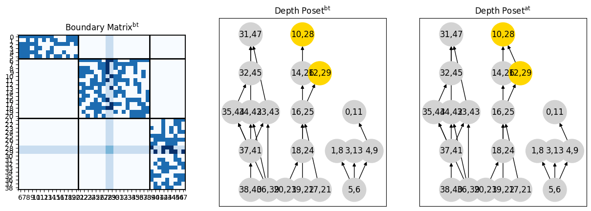

### Birth Death Pairs
|                          |                                                                                                                                                                                                                |
|:-------------------------|:---------------------------------------------------------------------------------------------------------------------------------------------------------------------------------------------------------------|
| Before the transposition | $\{(4, 9), (20, 23), (3, 13), (17, 21), (31, 47), (0, 11), (16, 25), (35, 44), (32, 45), (5, 6), (38, 40), (34, 42), (36, 39), (1, 8), (37, 41), (18, 24), (33, 43), (12, 29), (14, 26), (19, 22), (10, 28)\}$ |
| After the transposition  | $\{(4, 9), (20, 23), (3, 13), (17, 21), (31, 47), (0, 11), (16, 25), (35, 44), (32, 45), (5, 6), (38, 40), (34, 42), (36, 39), (1, 8), (37, 41), (18, 24), (33, 43), (12, 29), (14, 26), (19, 22), (10, 28)\}$ |

### Relations
|                          | Algorithm 1                                                                                                                                                                                                                                                                                                                                                                                                                    | Algorithm 2                                                                                                                                                                                                                                                                                                                                                                                                                                             |
|:-------------------------|:-------------------------------------------------------------------------------------------------------------------------------------------------------------------------------------------------------------------------------------------------------------------------------------------------------------------------------------------------------------------------------------------------------------------------------|:--------------------------------------------------------------------------------------------------------------------------------------------------------------------------------------------------------------------------------------------------------------------------------------------------------------------------------------------------------------------------------------------------------------------------------------------------------|
| Before the transposition | $\{(6, 15), (26, 30), (43, 46), (41, 46), (44, 45), (26, 27), (21, 28), (21, 25), (40, 44), (22, 26), (23, 25), (40, 41), (9, 11), (8, 15), (6, 11), (24, 26), (41, 42), (6, 8), (42, 47), (41, 45), (24, 29), (21, 30), (22, 25), (23, 27), (40, 43), (39, 47), (6, 7), (6, 13), (24, 28), (41, 44), (25, 27), (26, 28), (42, 46), (43, 47), (29, 30), (22, 30), (39, 46), (39, 43), (9, 15), (45, 47), (13, 15), (25, 26)\}$ | $\{(32, 31), (4, 0), (35, 27), (14, 7), (5, 4), (38, 35), (38, 32), (17, 12), (19, 12), (37, 27), (37, 33), (19, 15), (36, 34), (32, 27), (16, 10), (32, 30), (18, 10), (18, 16), (4, 2), (5, 0), (38, 37), (5, 3), (17, 14), (34, 27), (19, 14), (36, 27), (37, 32), (16, 12), (35, 31), (3, 2), (20, 18), (38, 27), (20, 15), (5, 2), (31, 30), (17, 10), (17, 16), (19, 10), (19, 16), (37, 31), (36, 35), (16, 14), (33, 27), (18, 14)\}$           |
| After the transposition  | $\{(6, 15), (26, 30), (43, 46), (41, 46), (44, 45), (26, 27), (21, 28), (21, 25), (40, 44), (22, 26), (23, 25), (40, 41), (9, 11), (8, 15), (6, 11), (24, 26), (41, 42), (6, 8), (42, 47), (41, 45), (24, 29), (21, 30), (22, 25), (23, 27), (40, 43), (39, 47), (6, 7), (6, 13), (24, 28), (41, 44), (25, 27), (26, 28), (42, 46), (29, 30), (43, 47), (22, 30), (39, 46), (39, 43), (9, 15), (45, 47), (13, 15), (25, 26)\}$ | $\{(32, 31), (4, 0), (35, 27), (12, 10), (14, 7), (5, 4), (38, 35), (38, 32), (17, 12), (19, 12), (37, 27), (19, 15), (37, 33), (36, 34), (32, 27), (16, 10), (32, 30), (18, 10), (18, 16), (4, 2), (5, 0), (38, 37), (5, 3), (17, 14), (34, 27), (19, 14), (36, 27), (37, 32), (16, 12), (35, 31), (3, 2), (20, 18), (38, 27), (20, 15), (5, 2), (31, 30), (17, 10), (17, 16), (19, 10), (19, 16), (37, 31), (36, 35), (16, 14), (33, 27), (18, 14)\}$ |

### Successors and Predecessers
No such node in the Depth Poset

### Temp Sets
|                                                               | Before the Transposition                                                                                                                                   | After the Transposition                                                                                                                                    |
|:--------------------------------------------------------------|:-----------------------------------------------------------------------------------------------------------------------------------------------------------|:-----------------------------------------------------------------------------------------------------------------------------------------------------------|
| $\mathcal{B} = \{(s, t)\in \text{BD}:\; f(s) > f(x)\}$        | $\{(34, 42), (36, 39), (20, 23), (12, 29), (14, 26), (37, 41), (33, 43), (16, 25), (35, 44), (32, 45), (19, 22), (17, 21), (38, 40), (31, 47), (18, 24)\}$ | $\{(34, 42), (36, 39), (20, 23), (12, 29), (14, 26), (37, 41), (33, 43), (16, 25), (35, 44), (32, 45), (19, 22), (17, 21), (38, 40), (31, 47), (18, 24)\}$ |
| $\mathcal{N} = \{(s, t)\in \text{BD}:\; f(x) > f(s) > f(a)\}$ | $\emptyset$                                                                                                                                                | $\emptyset$                                                                                                                                                |

### Equations
There are 2 equations are wrong.

| eq   | left (formula)                  | left (paramatrized)               | left (value)                       | right (formula)                                                                        | right (paramatrized)                                                                         | right (value)                                | correct   |
|:-----|:--------------------------------|:----------------------------------|:-----------------------------------|:---------------------------------------------------------------------------------------|:---------------------------------------------------------------------------------------------|:---------------------------------------------|:----------|
| Eq36 | $\text{Succ}_2^\text{at}(x, y)$ | $\text{Succ}_2^\text{at}(10, 28)$ | $\emptyset$                        | $\text{Succ}_2^\text{bt}(x, y) \oplus \{(a, b)\} \oplus \text{Succ}_2^\text{bt}(a, b)$ | $\text{Succ}_2^\text{bt}(10, 28) \oplus \{(12, 29)\} \oplus \text{Succ}_2^\text{bt}(12, 29)$ | $\{(12, 29)\}$                               | ✘         |
| Eq37 | $\text{Pred}_2^\text{at}(a, b)$ | $\text{Pred}_2^\text{at}(12, 29)$ | $\{(16, 25), (19, 22), (17, 21)\}$ | $\text{Pred}_2^\text{bt}(a, b) \oplus \{(x, y)\}$                                      | $\text{Pred}_2^\text{bt}(12, 29) \oplus \{(10, 28)\}$                                        | $\{(16, 25), (10, 28), (19, 22), (17, 21)\}$ | ✘         |

## Transposition <1, 2> in complex 22
Here is a __birth-birth__ __no switch__ transposition <1, 2>.

$$
a = 1, \; b = 6, \; x = 2, \; y = 12
$$

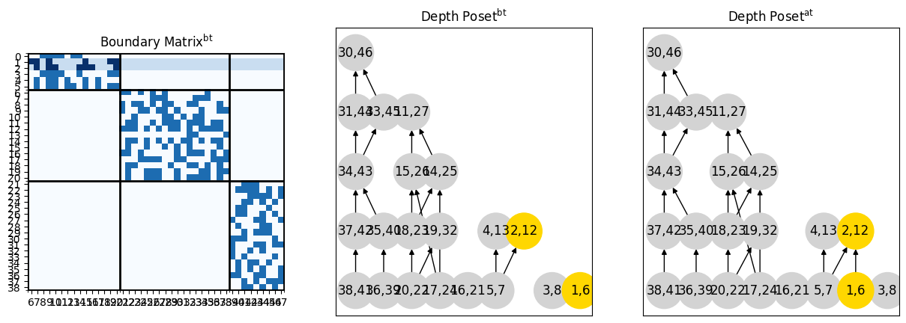

### Birth Death Pairs
|                          |                                                                                                                                                                                                                |
|:-------------------------|:---------------------------------------------------------------------------------------------------------------------------------------------------------------------------------------------------------------|
| Before the transposition | $\{(18, 23), (30, 46), (33, 45), (5, 7), (38, 41), (14, 25), (31, 44), (1, 6), (17, 24), (37, 42), (34, 43), (15, 26), (20, 22), (36, 39), (19, 32), (16, 21), (35, 40), (3, 8), (4, 13), (2, 12), (11, 27)\}$ |
| After the transposition  | $\{(18, 23), (30, 46), (33, 45), (5, 7), (38, 41), (14, 25), (31, 44), (1, 6), (17, 24), (37, 42), (34, 43), (15, 26), (20, 22), (36, 39), (19, 32), (16, 21), (35, 40), (3, 8), (4, 13), (2, 12), (11, 27)\}$ |

### Relations
|                          | Algorithm 1                                                                                                                                                                                                                                                                                                                                                                                                          | Algorithm 2                                                                                                                                                                                                                                                                                                                                                                                                                  |
|:-------------------------|:---------------------------------------------------------------------------------------------------------------------------------------------------------------------------------------------------------------------------------------------------------------------------------------------------------------------------------------------------------------------------------------------------------------------|:-----------------------------------------------------------------------------------------------------------------------------------------------------------------------------------------------------------------------------------------------------------------------------------------------------------------------------------------------------------------------------------------------------------------------------|
| Before the transposition | $\{(42, 45), (24, 27), (41, 46), (26, 27), (22, 26), (22, 32), (23, 25), (8, 9), (7, 10), (24, 26), (41, 42), (7, 13), (42, 47), (42, 44), (44, 47), (43, 45), (22, 25), (39, 44), (23, 27), (40, 43), (39, 47), (7, 9), (24, 25), (7, 12), (6, 10), (41, 44), (25, 27), (42, 43), (26, 28), (43, 44), (43, 47), (44, 46), (22, 27), (23, 26), (39, 40), (23, 29), (40, 45), (39, 43), (8, 10), (45, 47)\}$          | $\{(20, 11), (4, 0), (35, 33), (20, 14), (38, 29), (5, 4), (14, 10), (31, 29), (34, 28), (34, 31), (37, 30), (36, 31), (15, 11), (18, 10), (3, 0), (18, 11), (20, 19), (38, 37), (34, 33), (36, 30), (11, 10), (37, 29), (36, 33), (16, 9), (15, 10), (33, 28), (35, 28), (20, 9), (35, 31), (38, 30), (20, 18), (35, 34), (20, 15), (5, 2), (38, 33), (31, 30), (11, 9), (37, 28), (37, 31), (15, 9), (33, 30), (18, 14)\}$ |
| After the transposition  | $\{(6, 12), (42, 45), (24, 27), (41, 46), (26, 27), (22, 26), (22, 32), (23, 25), (8, 9), (7, 10), (24, 26), (41, 42), (7, 13), (42, 47), (42, 44), (44, 47), (43, 45), (22, 25), (39, 44), (23, 27), (40, 43), (39, 47), (7, 9), (24, 25), (7, 12), (6, 10), (41, 44), (25, 27), (42, 43), (26, 28), (43, 44), (43, 47), (44, 46), (22, 27), (23, 26), (39, 40), (23, 29), (40, 45), (39, 43), (8, 10), (45, 47)\}$ | $\{(20, 11), (4, 0), (35, 33), (20, 14), (38, 29), (5, 4), (14, 10), (33, 30), (31, 29), (34, 28), (34, 31), (37, 30), (36, 31), (15, 11), (18, 10), (3, 0), (20, 19), (38, 37), (34, 33), (36, 30), (11, 10), (37, 29), (36, 33), (16, 9), (15, 10), (33, 28), (35, 28), (20, 9), (35, 31), (38, 30), (20, 18), (35, 34), (20, 15), (5, 2), (38, 33), (31, 30), (11, 9), (37, 28), (37, 31), (15, 9), (18, 11), (18, 14)\}$ |

### Successors and Predecessers
No such node in the Depth Poset

### Temp Sets
|                                                               | Before the Transposition     | After the Transposition      |
|:--------------------------------------------------------------|:-----------------------------|:-----------------------------|
| $\mathcal{L} = \{(s, t)\in \text{BD}:\; f(t) < f(y)\}$        | $\{(1, 6), (3, 8), (5, 7)\}$ | $\{(1, 6), (3, 8), (5, 7)\}$ |
| $\mathcal{M} = \{(s, t)\in \text{BD}:\; f(y) < f(t) < f(b)\}$ | $\emptyset$                  | $\emptyset$                  |

### Equations
There are 2 equations are wrong.

| eq   | left (formula)                  | left (paramatrized)              | left (value)   | right (formula)                                                                        | right (paramatrized)                                                                    | right (value)   | correct   |
|:-----|:--------------------------------|:---------------------------------|:---------------|:---------------------------------------------------------------------------------------|:----------------------------------------------------------------------------------------|:----------------|:----------|
| Eq16 | $\text{Succ}_1^\text{at}(x, y)$ | $\text{Succ}_1^\text{at}(2, 12)$ | $\emptyset$    | $\text{Succ}_1^\text{bt}(x, y) \oplus \{(a, b)\} \oplus \text{Succ}_1^\text{bt}(a, b)$ | $\text{Succ}_1^\text{bt}(2, 12) \oplus \{(1, 6)\} \oplus \text{Succ}_1^\text{bt}(1, 6)$ | $\{(1, 6)\}$    | ✘         |
| Eq17 | $\text{Pred}_1^\text{at}(a, b)$ | $\text{Pred}_1^\text{at}(1, 6)$  | $\emptyset$    | $\text{Pred}_1^\text{bt}(a, b) \oplus \{(x, y)\}$                                      | $\text{Pred}_1^\text{bt}(1, 6) \oplus \{(2, 12)\}$                                      | $\{(2, 12)\}$   | ✘         |

## Transposition <6, 7> in complex 22
Here is a __death-death__ __no switch__ transposition <6, 7>.

$$
a = 5, \; b = 7, \; x = 1, \; y = 6
$$

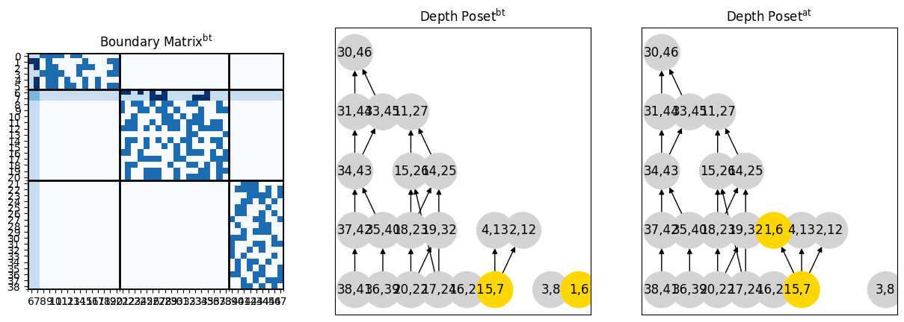

### Birth Death Pairs
|                          |                                                                                                                                                                                                                |
|:-------------------------|:---------------------------------------------------------------------------------------------------------------------------------------------------------------------------------------------------------------|
| Before the transposition | $\{(18, 23), (30, 46), (33, 45), (5, 7), (38, 41), (14, 25), (31, 44), (1, 6), (17, 24), (37, 42), (34, 43), (15, 26), (20, 22), (36, 39), (19, 32), (16, 21), (35, 40), (3, 8), (4, 13), (2, 12), (11, 27)\}$ |
| After the transposition  | $\{(18, 23), (30, 46), (33, 45), (5, 7), (38, 41), (14, 25), (31, 44), (1, 6), (17, 24), (37, 42), (34, 43), (15, 26), (20, 22), (36, 39), (19, 32), (16, 21), (35, 40), (3, 8), (4, 13), (2, 12), (11, 27)\}$ |

### Relations
|                          | Algorithm 1                                                                                                                                                                                                                                                                                                                                                                                                 | Algorithm 2                                                                                                                                                                                                                                                                                                                                                                                                                          |
|:-------------------------|:------------------------------------------------------------------------------------------------------------------------------------------------------------------------------------------------------------------------------------------------------------------------------------------------------------------------------------------------------------------------------------------------------------|:-------------------------------------------------------------------------------------------------------------------------------------------------------------------------------------------------------------------------------------------------------------------------------------------------------------------------------------------------------------------------------------------------------------------------------------|
| Before the transposition | $\{(42, 45), (24, 27), (41, 46), (26, 27), (22, 26), (22, 32), (23, 25), (8, 9), (7, 10), (24, 26), (41, 42), (7, 13), (42, 47), (42, 44), (44, 47), (43, 45), (22, 25), (39, 44), (23, 27), (40, 43), (39, 47), (7, 9), (24, 25), (7, 12), (6, 10), (41, 44), (25, 27), (42, 43), (26, 28), (43, 44), (43, 47), (44, 46), (22, 27), (23, 26), (39, 40), (23, 29), (40, 45), (39, 43), (8, 10), (45, 47)\}$ | $\{(20, 11), (4, 0), (35, 33), (20, 14), (38, 29), (5, 4), (14, 10), (31, 29), (34, 28), (34, 31), (37, 30), (36, 31), (15, 11), (18, 10), (3, 0), (18, 11), (20, 19), (38, 37), (34, 33), (36, 30), (11, 10), (37, 29), (36, 33), (16, 9), (15, 10), (33, 28), (35, 28), (20, 9), (35, 31), (38, 30), (20, 18), (35, 34), (20, 15), (5, 2), (38, 33), (31, 30), (11, 9), (37, 28), (37, 31), (15, 9), (33, 30), (18, 14)\}$         |
| After the transposition  | $\{(42, 45), (24, 27), (41, 46), (26, 27), (22, 26), (22, 32), (23, 25), (8, 9), (7, 10), (24, 26), (41, 42), (7, 13), (42, 47), (42, 44), (44, 47), (43, 45), (22, 25), (39, 44), (23, 27), (40, 43), (39, 47), (7, 9), (24, 25), (7, 12), (6, 10), (41, 44), (25, 27), (42, 43), (26, 28), (43, 44), (43, 47), (44, 46), (22, 27), (23, 26), (39, 40), (23, 29), (40, 45), (39, 43), (8, 10), (45, 47)\}$ | $\{(20, 11), (4, 0), (35, 33), (20, 14), (38, 29), (5, 4), (5, 1), (14, 10), (33, 30), (31, 29), (34, 28), (34, 31), (37, 30), (36, 31), (15, 11), (18, 10), (3, 0), (20, 19), (38, 37), (34, 33), (36, 30), (11, 10), (37, 29), (36, 33), (16, 9), (15, 10), (33, 28), (35, 28), (20, 9), (35, 31), (38, 30), (20, 18), (35, 34), (20, 15), (5, 2), (38, 33), (31, 30), (11, 9), (37, 28), (37, 31), (15, 9), (18, 11), (18, 14)\}$ |

### Successors and Predecessers
No such node in the Depth Poset

### Temp Sets
|                                                               | Before the Transposition                                                                                                                                                                               | After the Transposition                                                                                                                                                                                |
|:--------------------------------------------------------------|:-------------------------------------------------------------------------------------------------------------------------------------------------------------------------------------------------------|:-------------------------------------------------------------------------------------------------------------------------------------------------------------------------------------------------------|
| $\mathcal{B} = \{(s, t)\in \text{BD}:\; f(s) > f(x)\}$        | $\{(18, 23), (30, 46), (33, 45), (5, 7), (38, 41), (14, 25), (31, 44), (17, 24), (37, 42), (34, 43), (15, 26), (20, 22), (36, 39), (19, 32), (16, 21), (35, 40), (3, 8), (4, 13), (2, 12), (11, 27)\}$ | $\{(18, 23), (30, 46), (33, 45), (5, 7), (38, 41), (14, 25), (31, 44), (17, 24), (37, 42), (34, 43), (15, 26), (20, 22), (36, 39), (19, 32), (16, 21), (35, 40), (3, 8), (4, 13), (2, 12), (11, 27)\}$ |
| $\mathcal{N} = \{(s, t)\in \text{BD}:\; f(x) > f(s) > f(a)\}$ | $\emptyset$                                                                                                                                                                                            | $\emptyset$                                                                                                                                                                                            |

### Equations
There are 2 equations are wrong.

| eq   | left (formula)                  | left (paramatrized)             | left (value)   | right (formula)                                                                        | right (paramatrized)                                                                   | right (value)                  | correct   |
|:-----|:--------------------------------|:--------------------------------|:---------------|:---------------------------------------------------------------------------------------|:---------------------------------------------------------------------------------------|:-------------------------------|:----------|
| Eq36 | $\text{Succ}_2^\text{at}(x, y)$ | $\text{Succ}_2^\text{at}(1, 6)$ | $\emptyset$    | $\text{Succ}_2^\text{bt}(x, y) \oplus \{(a, b)\} \oplus \text{Succ}_2^\text{bt}(a, b)$ | $\text{Succ}_2^\text{bt}(1, 6) \oplus \{(5, 7)\} \oplus \text{Succ}_2^\text{bt}(5, 7)$ | $\{(2, 12), (4, 13), (5, 7)\}$ | ✘         |
| Eq37 | $\text{Pred}_2^\text{at}(a, b)$ | $\text{Pred}_2^\text{at}(5, 7)$ | $\emptyset$    | $\text{Pred}_2^\text{bt}(a, b) \oplus \{(x, y)\}$                                      | $\text{Pred}_2^\text{bt}(5, 7) \oplus \{(1, 6)\}$                                      | $\{(1, 6)\}$                   | ✘         |

## Transposition <12, 13> in complex 22
Here is a __death-death__ __no switch__ transposition <12, 13>.

$$
a = 4, \; b = 13, \; x = 2, \; y = 12
$$

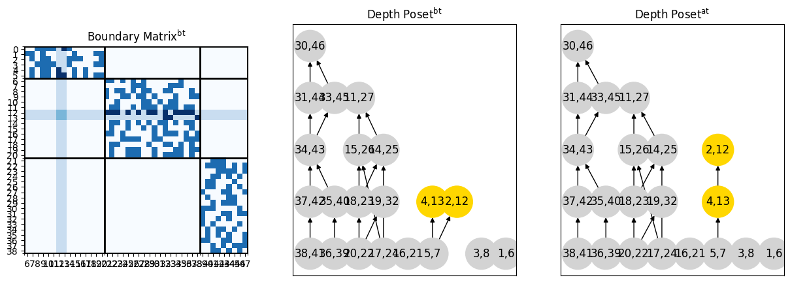

### Birth Death Pairs
|                          |                                                                                                                                                                                                                |
|:-------------------------|:---------------------------------------------------------------------------------------------------------------------------------------------------------------------------------------------------------------|
| Before the transposition | $\{(18, 23), (30, 46), (33, 45), (5, 7), (38, 41), (14, 25), (31, 44), (1, 6), (17, 24), (37, 42), (34, 43), (15, 26), (20, 22), (36, 39), (19, 32), (16, 21), (35, 40), (3, 8), (4, 13), (2, 12), (11, 27)\}$ |
| After the transposition  | $\{(18, 23), (30, 46), (33, 45), (5, 7), (38, 41), (14, 25), (31, 44), (1, 6), (17, 24), (37, 42), (34, 43), (15, 26), (20, 22), (36, 39), (19, 32), (16, 21), (35, 40), (3, 8), (4, 13), (2, 12), (11, 27)\}$ |

### Relations
|                          | Algorithm 1                                                                                                                                                                                                                                                                                                                                                                                                 | Algorithm 2                                                                                                                                                                                                                                                                                                                                                                                                                          |
|:-------------------------|:------------------------------------------------------------------------------------------------------------------------------------------------------------------------------------------------------------------------------------------------------------------------------------------------------------------------------------------------------------------------------------------------------------|:-------------------------------------------------------------------------------------------------------------------------------------------------------------------------------------------------------------------------------------------------------------------------------------------------------------------------------------------------------------------------------------------------------------------------------------|
| Before the transposition | $\{(42, 45), (24, 27), (41, 46), (26, 27), (22, 26), (22, 32), (23, 25), (8, 9), (7, 10), (24, 26), (41, 42), (7, 13), (42, 47), (42, 44), (44, 47), (43, 45), (22, 25), (39, 44), (23, 27), (40, 43), (39, 47), (7, 9), (24, 25), (7, 12), (6, 10), (41, 44), (25, 27), (42, 43), (26, 28), (43, 44), (43, 47), (44, 46), (22, 27), (23, 26), (39, 40), (23, 29), (40, 45), (39, 43), (8, 10), (45, 47)\}$ | $\{(20, 11), (4, 0), (35, 33), (20, 14), (38, 29), (5, 4), (14, 10), (31, 29), (34, 28), (34, 31), (37, 30), (36, 31), (15, 11), (18, 10), (3, 0), (18, 11), (20, 19), (38, 37), (34, 33), (36, 30), (11, 10), (37, 29), (36, 33), (16, 9), (15, 10), (33, 28), (35, 28), (20, 9), (35, 31), (38, 30), (20, 18), (35, 34), (20, 15), (5, 2), (38, 33), (31, 30), (11, 9), (37, 28), (37, 31), (15, 9), (33, 30), (18, 14)\}$         |
| After the transposition  | $\{(42, 45), (24, 27), (41, 46), (26, 27), (22, 26), (22, 32), (23, 25), (8, 9), (7, 10), (24, 26), (41, 42), (7, 13), (42, 47), (42, 44), (44, 47), (43, 45), (22, 25), (39, 44), (23, 27), (40, 43), (39, 47), (7, 9), (24, 25), (7, 12), (6, 10), (41, 44), (25, 27), (42, 43), (26, 28), (43, 44), (43, 47), (44, 46), (22, 27), (23, 26), (39, 40), (23, 29), (40, 45), (39, 43), (8, 10), (45, 47)\}$ | $\{(20, 11), (4, 0), (35, 33), (20, 14), (38, 29), (5, 4), (14, 10), (33, 30), (31, 29), (34, 28), (34, 31), (37, 30), (36, 31), (15, 11), (18, 10), (4, 2), (3, 0), (20, 19), (38, 37), (34, 33), (36, 30), (11, 10), (37, 29), (36, 33), (16, 9), (15, 10), (33, 28), (35, 28), (20, 9), (35, 31), (38, 30), (20, 18), (35, 34), (20, 15), (5, 2), (38, 33), (31, 30), (11, 9), (37, 28), (37, 31), (15, 9), (18, 11), (18, 14)\}$ |

### Successors and Predecessers
No such node in the Depth Poset

### Temp Sets
|                                                               | Before the Transposition                                                                                                                                                                      | After the Transposition                                                                                                                                                                       |
|:--------------------------------------------------------------|:----------------------------------------------------------------------------------------------------------------------------------------------------------------------------------------------|:----------------------------------------------------------------------------------------------------------------------------------------------------------------------------------------------|
| $\mathcal{B} = \{(s, t)\in \text{BD}:\; f(s) > f(x)\}$        | $\{(18, 23), (30, 46), (33, 45), (5, 7), (38, 41), (14, 25), (31, 44), (17, 24), (37, 42), (34, 43), (15, 26), (20, 22), (36, 39), (19, 32), (16, 21), (35, 40), (3, 8), (4, 13), (11, 27)\}$ | $\{(18, 23), (30, 46), (33, 45), (5, 7), (38, 41), (14, 25), (31, 44), (17, 24), (37, 42), (34, 43), (15, 26), (20, 22), (36, 39), (19, 32), (16, 21), (35, 40), (3, 8), (4, 13), (11, 27)\}$ |
| $\mathcal{N} = \{(s, t)\in \text{BD}:\; f(x) > f(s) > f(a)\}$ | $\emptyset$                                                                                                                                                                                   | $\emptyset$                                                                                                                                                                                   |

### Equations
There are 2 equations are wrong.

| eq   | left (formula)                  | left (paramatrized)              | left (value)   | right (formula)                                                                        | right (paramatrized)                                                                      | right (value)         | correct   |
|:-----|:--------------------------------|:---------------------------------|:---------------|:---------------------------------------------------------------------------------------|:------------------------------------------------------------------------------------------|:----------------------|:----------|
| Eq36 | $\text{Succ}_2^\text{at}(x, y)$ | $\text{Succ}_2^\text{at}(2, 12)$ | $\emptyset$    | $\text{Succ}_2^\text{bt}(x, y) \oplus \{(a, b)\} \oplus \text{Succ}_2^\text{bt}(a, b)$ | $\text{Succ}_2^\text{bt}(2, 12) \oplus \{(4, 13)\} \oplus \text{Succ}_2^\text{bt}(4, 13)$ | $\{(4, 13)\}$         | ✘         |
| Eq37 | $\text{Pred}_2^\text{at}(a, b)$ | $\text{Pred}_2^\text{at}(4, 13)$ | $\{(5, 7)\}$   | $\text{Pred}_2^\text{bt}(a, b) \oplus \{(x, y)\}$                                      | $\text{Pred}_2^\text{bt}(4, 13) \oplus \{(2, 12)\}$                                       | $\{(2, 12), (5, 7)\}$ | ✘         |

## Transposition <16, 17> in complex 22
Here is a __birth-birth__ __no switch__ transposition <16, 17>.

$$
a = 16, \; b = 21, \; x = 17, \; y = 24
$$

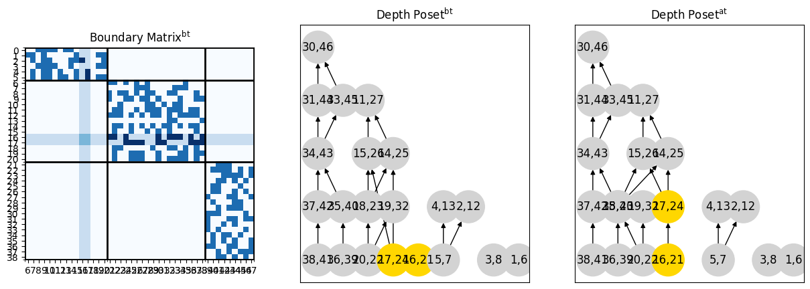

### Birth Death Pairs
|                          |                                                                                                                                                                                                                |
|:-------------------------|:---------------------------------------------------------------------------------------------------------------------------------------------------------------------------------------------------------------|
| Before the transposition | $\{(18, 23), (30, 46), (33, 45), (5, 7), (38, 41), (14, 25), (31, 44), (1, 6), (17, 24), (37, 42), (34, 43), (15, 26), (20, 22), (36, 39), (19, 32), (16, 21), (35, 40), (3, 8), (4, 13), (2, 12), (11, 27)\}$ |
| After the transposition  | $\{(18, 23), (30, 46), (33, 45), (5, 7), (38, 41), (14, 25), (31, 44), (1, 6), (17, 24), (37, 42), (34, 43), (15, 26), (20, 22), (36, 39), (19, 32), (16, 21), (35, 40), (3, 8), (4, 13), (2, 12), (11, 27)\}$ |

### Relations
|                          | Algorithm 1                                                                                                                                                                                                                                                                                                                                                                                                                                         | Algorithm 2                                                                                                                                                                                                                                                                                                                                                                                                                  |
|:-------------------------|:----------------------------------------------------------------------------------------------------------------------------------------------------------------------------------------------------------------------------------------------------------------------------------------------------------------------------------------------------------------------------------------------------------------------------------------------------|:-----------------------------------------------------------------------------------------------------------------------------------------------------------------------------------------------------------------------------------------------------------------------------------------------------------------------------------------------------------------------------------------------------------------------------|
| Before the transposition | $\{(42, 45), (24, 27), (41, 46), (26, 27), (22, 26), (22, 32), (23, 25), (8, 9), (7, 10), (24, 26), (41, 42), (7, 13), (42, 47), (42, 44), (44, 47), (43, 45), (22, 25), (39, 44), (23, 27), (40, 43), (39, 47), (7, 9), (24, 25), (7, 12), (6, 10), (41, 44), (25, 27), (42, 43), (26, 28), (43, 44), (43, 47), (44, 46), (22, 27), (23, 26), (39, 40), (23, 29), (40, 45), (39, 43), (8, 10), (45, 47)\}$                                         | $\{(20, 11), (4, 0), (35, 33), (20, 14), (38, 29), (5, 4), (14, 10), (31, 29), (34, 28), (34, 31), (37, 30), (36, 31), (15, 11), (18, 10), (3, 0), (18, 11), (20, 19), (38, 37), (34, 33), (36, 30), (11, 10), (37, 29), (36, 33), (16, 9), (15, 10), (33, 28), (35, 28), (20, 9), (35, 31), (38, 30), (20, 18), (35, 34), (20, 15), (5, 2), (38, 33), (31, 30), (11, 9), (37, 28), (37, 31), (15, 9), (33, 30), (18, 14)\}$ |
| After the transposition  | $\{(42, 45), (24, 27), (41, 46), (26, 27), (21, 25), (22, 26), (22, 32), (23, 25), (8, 9), (7, 10), (24, 26), (41, 42), (7, 13), (42, 47), (42, 44), (44, 47), (43, 45), (21, 24), (22, 25), (21, 27), (39, 44), (23, 27), (40, 43), (39, 47), (7, 9), (24, 25), (7, 12), (6, 10), (41, 44), (25, 27), (42, 43), (26, 28), (43, 44), (43, 47), (44, 46), (21, 26), (22, 27), (23, 26), (39, 40), (23, 29), (40, 45), (39, 43), (8, 10), (45, 47)\}$ | $\{(20, 11), (4, 0), (35, 33), (20, 14), (38, 29), (5, 4), (14, 10), (33, 30), (31, 29), (34, 28), (34, 31), (37, 30), (36, 31), (15, 11), (18, 10), (3, 0), (20, 19), (38, 37), (34, 33), (36, 30), (11, 10), (37, 29), (36, 33), (16, 9), (15, 10), (33, 28), (35, 28), (20, 9), (35, 31), (38, 30), (20, 18), (35, 34), (20, 15), (5, 2), (38, 33), (31, 30), (11, 9), (37, 28), (37, 31), (15, 9), (18, 11), (18, 14)\}$ |

### Successors and Predecessers
No such node in the Depth Poset

### Temp Sets
|                                                               | Before the Transposition                                                     | After the Transposition                                                      |
|:--------------------------------------------------------------|:-----------------------------------------------------------------------------|:-----------------------------------------------------------------------------|
| $\mathcal{L} = \{(s, t)\in \text{BD}:\; f(t) < f(y)\}$        | $\{(3, 8), (18, 23), (4, 13), (5, 7), (16, 21), (2, 12), (20, 22), (1, 6)\}$ | $\{(3, 8), (18, 23), (4, 13), (5, 7), (16, 21), (2, 12), (20, 22), (1, 6)\}$ |
| $\mathcal{M} = \{(s, t)\in \text{BD}:\; f(y) < f(t) < f(b)\}$ | $\emptyset$                                                                  | $\emptyset$                                                                  |

### Equations
There are 2 equations are wrong.

| eq   | left (formula)                  | left (paramatrized)               | left (value)                       | right (formula)                                                                        | right (paramatrized)                                                                         | right (value)                                | correct   |
|:-----|:--------------------------------|:----------------------------------|:-----------------------------------|:---------------------------------------------------------------------------------------|:---------------------------------------------------------------------------------------------|:---------------------------------------------|:----------|
| Eq16 | $\text{Succ}_1^\text{at}(x, y)$ | $\text{Succ}_1^\text{at}(17, 24)$ | $\{(14, 25), (11, 27), (15, 26)\}$ | $\text{Succ}_1^\text{bt}(x, y) \oplus \{(a, b)\} \oplus \text{Succ}_1^\text{bt}(a, b)$ | $\text{Succ}_1^\text{bt}(17, 24) \oplus \{(16, 21)\} \oplus \text{Succ}_1^\text{bt}(16, 21)$ | $\{(14, 25), (16, 21), (11, 27), (15, 26)\}$ | ✘         |
| Eq17 | $\text{Pred}_1^\text{at}(a, b)$ | $\text{Pred}_1^\text{at}(16, 21)$ | $\emptyset$                        | $\text{Pred}_1^\text{bt}(a, b) \oplus \{(x, y)\}$                                      | $\text{Pred}_1^\text{bt}(16, 21) \oplus \{(17, 24)\}$                                        | $\{(17, 24)\}$                               | ✘         |

## Transposition <21, 22> in complex 22
Here is a __death-death__ __no switch__ transposition <21, 22>.

$$
a = 20, \; b = 22, \; x = 16, \; y = 21
$$

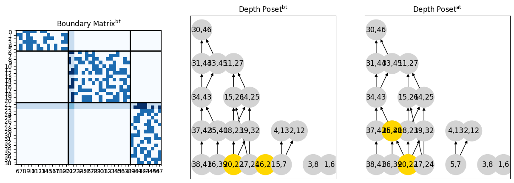

### Birth Death Pairs
|                          |                                                                                                                                                                                                                |
|:-------------------------|:---------------------------------------------------------------------------------------------------------------------------------------------------------------------------------------------------------------|
| Before the transposition | $\{(18, 23), (30, 46), (33, 45), (5, 7), (38, 41), (14, 25), (31, 44), (1, 6), (17, 24), (37, 42), (34, 43), (15, 26), (20, 22), (36, 39), (19, 32), (16, 21), (35, 40), (3, 8), (4, 13), (2, 12), (11, 27)\}$ |
| After the transposition  | $\{(18, 23), (30, 46), (33, 45), (5, 7), (38, 41), (14, 25), (31, 44), (1, 6), (17, 24), (37, 42), (34, 43), (15, 26), (20, 22), (36, 39), (19, 32), (16, 21), (35, 40), (3, 8), (4, 13), (2, 12), (11, 27)\}$ |

### Relations
|                          | Algorithm 1                                                                                                                                                                                                                                                                                                                                                                                                 | Algorithm 2                                                                                                                                                                                                                                                                                                                                                                                                                   |
|:-------------------------|:------------------------------------------------------------------------------------------------------------------------------------------------------------------------------------------------------------------------------------------------------------------------------------------------------------------------------------------------------------------------------------------------------------|:------------------------------------------------------------------------------------------------------------------------------------------------------------------------------------------------------------------------------------------------------------------------------------------------------------------------------------------------------------------------------------------------------------------------------|
| Before the transposition | $\{(42, 45), (24, 27), (41, 46), (26, 27), (22, 26), (22, 32), (23, 25), (8, 9), (7, 10), (24, 26), (41, 42), (7, 13), (42, 47), (42, 44), (44, 47), (43, 45), (22, 25), (39, 44), (23, 27), (40, 43), (39, 47), (7, 9), (24, 25), (7, 12), (6, 10), (41, 44), (25, 27), (42, 43), (26, 28), (43, 44), (43, 47), (44, 46), (22, 27), (23, 26), (39, 40), (23, 29), (40, 45), (39, 43), (8, 10), (45, 47)\}$ | $\{(20, 11), (4, 0), (35, 33), (20, 14), (38, 29), (5, 4), (14, 10), (31, 29), (34, 28), (34, 31), (37, 30), (36, 31), (15, 11), (18, 10), (3, 0), (18, 11), (20, 19), (38, 37), (34, 33), (36, 30), (11, 10), (37, 29), (36, 33), (16, 9), (15, 10), (33, 28), (35, 28), (20, 9), (35, 31), (38, 30), (20, 18), (35, 34), (20, 15), (5, 2), (38, 33), (31, 30), (11, 9), (37, 28), (37, 31), (15, 9), (33, 30), (18, 14)\}$  |
| After the transposition  | $\{(42, 45), (24, 27), (41, 46), (26, 27), (8, 9), (22, 26), (23, 25), (22, 32), (7, 10), (24, 26), (41, 42), (7, 13), (42, 47), (42, 44), (44, 47), (43, 45), (22, 25), (39, 44), (23, 27), (40, 43), (39, 47), (7, 9), (24, 25), (7, 12), (6, 10), (41, 44), (25, 27), (42, 43), (26, 28), (43, 44), (43, 47), (44, 46), (22, 27), (23, 26), (39, 40), (23, 29), (40, 45), (39, 43), (8, 10), (45, 47)\}$ | $\{(20, 11), (4, 0), (35, 33), (20, 14), (38, 29), (5, 4), (14, 10), (33, 30), (31, 29), (34, 28), (34, 31), (37, 30), (36, 31), (15, 11), (18, 10), (3, 0), (20, 16), (20, 19), (38, 37), (34, 33), (36, 30), (11, 10), (37, 29), (36, 33), (16, 9), (15, 10), (33, 28), (35, 28), (35, 31), (38, 30), (20, 18), (35, 34), (20, 15), (5, 2), (38, 33), (31, 30), (11, 9), (37, 28), (37, 31), (15, 9), (18, 11), (18, 14)\}$ |

### Successors and Predecessers
No such node in the Depth Poset

### Temp Sets
|                                                               | Before the Transposition                                                                                                     | After the Transposition                                                                                                      |
|:--------------------------------------------------------------|:-----------------------------------------------------------------------------------------------------------------------------|:-----------------------------------------------------------------------------------------------------------------------------|
| $\mathcal{B} = \{(s, t)\in \text{BD}:\; f(s) > f(x)\}$        | $\{(37, 42), (34, 43), (18, 23), (30, 46), (36, 39), (33, 45), (31, 44), (38, 41), (19, 32), (20, 22), (17, 24), (35, 40)\}$ | $\{(37, 42), (34, 43), (18, 23), (30, 46), (36, 39), (33, 45), (31, 44), (38, 41), (19, 32), (20, 22), (17, 24), (35, 40)\}$ |
| $\mathcal{N} = \{(s, t)\in \text{BD}:\; f(x) > f(s) > f(a)\}$ | $\emptyset$                                                                                                                  | $\emptyset$                                                                                                                  |

### Equations
There are 2 equations are wrong.

| eq   | left (formula)                  | left (paramatrized)               | left (value)   | right (formula)                                                                        | right (paramatrized)                                                                         | right (value)                                                    | correct   |
|:-----|:--------------------------------|:----------------------------------|:---------------|:---------------------------------------------------------------------------------------|:---------------------------------------------------------------------------------------------|:-----------------------------------------------------------------|:----------|
| Eq36 | $\text{Succ}_2^\text{at}(x, y)$ | $\text{Succ}_2^\text{at}(16, 21)$ | $\emptyset$    | $\text{Succ}_2^\text{bt}(x, y) \oplus \{(a, b)\} \oplus \text{Succ}_2^\text{bt}(a, b)$ | $\text{Succ}_2^\text{bt}(16, 21) \oplus \{(20, 22)\} \oplus \text{Succ}_2^\text{bt}(20, 22)$ | $\{(18, 23), (15, 26), (19, 32), (14, 25), (20, 22), (11, 27)\}$ | ✘         |
| Eq37 | $\text{Pred}_2^\text{at}(a, b)$ | $\text{Pred}_2^\text{at}(20, 22)$ | $\emptyset$    | $\text{Pred}_2^\text{bt}(a, b) \oplus \{(x, y)\}$                                      | $\text{Pred}_2^\text{bt}(20, 22) \oplus \{(16, 21)\}$                                        | $\{(16, 21)\}$                                                   | ✘         |

## Transposition <32, 33> in complex 22
Here is a __birth-death__ __switch forward__ transposition <32, 33>.

$$
a = 19, \; b = 32, \; x = 33, \; y = 45
$$

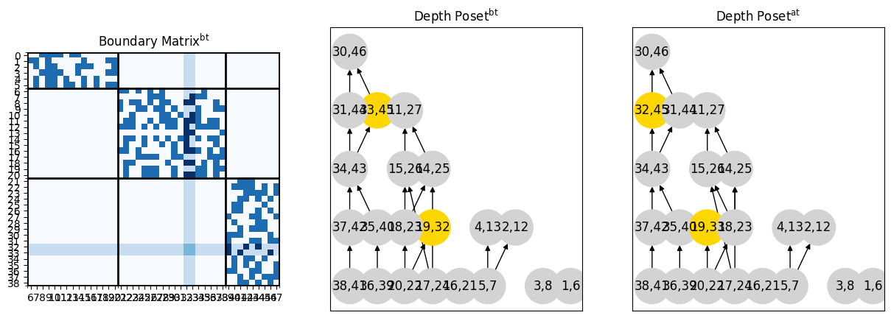

### Birth Death Pairs
|                          |                                                                                                                                                                                                                |
|:-------------------------|:---------------------------------------------------------------------------------------------------------------------------------------------------------------------------------------------------------------|
| Before the transposition | $\{(18, 23), (30, 46), (33, 45), (5, 7), (38, 41), (14, 25), (31, 44), (1, 6), (17, 24), (37, 42), (34, 43), (15, 26), (20, 22), (36, 39), (19, 32), (16, 21), (35, 40), (3, 8), (4, 13), (2, 12), (11, 27)\}$ |
| After the transposition  | $\{(18, 23), (30, 46), (5, 7), (38, 41), (14, 25), (31, 44), (1, 6), (17, 24), (37, 42), (34, 43), (19, 33), (15, 26), (32, 45), (20, 22), (36, 39), (16, 21), (35, 40), (3, 8), (4, 13), (2, 12), (11, 27)\}$ |

### Relations
|                          | Algorithm 1                                                                                                                                                                                                                                                                                                                                                                                                 | Algorithm 2                                                                                                                                                                                                                                                                                                                                                                                                                  |
|:-------------------------|:------------------------------------------------------------------------------------------------------------------------------------------------------------------------------------------------------------------------------------------------------------------------------------------------------------------------------------------------------------------------------------------------------------|:-----------------------------------------------------------------------------------------------------------------------------------------------------------------------------------------------------------------------------------------------------------------------------------------------------------------------------------------------------------------------------------------------------------------------------|
| Before the transposition | $\{(42, 45), (24, 27), (41, 46), (26, 27), (22, 26), (22, 32), (23, 25), (8, 9), (7, 10), (24, 26), (41, 42), (7, 13), (42, 47), (42, 44), (44, 47), (43, 45), (22, 25), (39, 44), (23, 27), (40, 43), (39, 47), (7, 9), (24, 25), (7, 12), (6, 10), (41, 44), (25, 27), (42, 43), (26, 28), (43, 44), (43, 47), (44, 46), (22, 27), (23, 26), (39, 40), (23, 29), (40, 45), (39, 43), (8, 10), (45, 47)\}$ | $\{(20, 11), (4, 0), (35, 33), (20, 14), (38, 29), (5, 4), (14, 10), (31, 29), (34, 28), (34, 31), (37, 30), (36, 31), (15, 11), (18, 10), (3, 0), (18, 11), (20, 19), (38, 37), (34, 33), (36, 30), (11, 10), (37, 29), (36, 33), (16, 9), (15, 10), (33, 28), (35, 28), (20, 9), (35, 31), (38, 30), (20, 18), (35, 34), (20, 15), (5, 2), (38, 33), (31, 30), (11, 9), (37, 28), (37, 31), (15, 9), (33, 30), (18, 14)\}$ |
| After the transposition  | $\{(42, 45), (24, 27), (41, 46), (26, 27), (22, 26), (8, 9), (23, 25), (7, 10), (24, 26), (41, 42), (7, 13), (42, 47), (42, 44), (44, 47), (43, 45), (22, 25), (39, 44), (23, 27), (40, 43), (39, 47), (7, 9), (24, 25), (7, 12), (6, 10), (41, 44), (25, 27), (42, 43), (26, 28), (43, 44), (43, 47), (44, 46), (22, 27), (23, 26), (39, 40), (23, 29), (40, 45), (22, 33), (39, 43), (8, 10), (45, 47)\}$ | $\{(20, 11), (4, 0), (20, 14), (38, 29), (5, 4), (14, 10), (31, 29), (34, 28), (34, 31), (37, 30), (36, 31), (15, 11), (32, 30), (18, 10), (35, 32), (3, 0), (20, 19), (38, 37), (36, 30), (11, 10), (37, 29), (16, 9), (15, 10), (35, 28), (20, 9), (35, 31), (38, 30), (20, 18), (35, 34), (20, 15), (5, 2), (31, 30), (11, 9), (37, 28), (36, 32), (34, 32), (37, 31), (15, 9), (18, 11), (32, 28), (18, 14)\}$           |

### Successors and Predecessers
|                 | $\text{Set}^\text{bt}(19, 32)$                   | $\text{Set}^\text{bt}(33, 45)$                                                 | $\text{Set}^\text{at}(19, 33)$                   | $\text{Set}^\text{at}(32, 45)$                                       |
|:----------------|:-------------------------------------------------|:-------------------------------------------------------------------------------|:-------------------------------------------------|:---------------------------------------------------------------------|
| $\text{Succ}_1$ | $\text{Succ}_1^\text{bt}(19, 32) = \emptyset$    | $\text{Succ}_1^\text{bt}(33, 45) = \emptyset$                                  | $\text{Succ}_1^\text{at}(19, 33) = \emptyset$    | $\text{Succ}_1^\text{at}(32, 45) = \emptyset$                        |
| $\text{Pred}_1$ | $\text{Pred}_1^\text{bt}(19, 32) = \{(20, 22)\}$ | $\text{Pred}_1^\text{bt}(33, 45) = \{(37, 42), (34, 43), (35, 40)\}$           | $\text{Pred}_1^\text{at}(19, 33) = \{(20, 22)\}$ | $\text{Pred}_1^\text{at}(32, 45) = \{(37, 42), (34, 43), (35, 40)\}$ |
| $\text{Succ}_2$ | $\text{Succ}_2^\text{bt}(19, 32) = \emptyset$    | $\text{Succ}_2^\text{bt}(33, 45) = \{(30, 46)\}$                               | $\text{Succ}_2^\text{at}(19, 33) = \emptyset$    | $\text{Succ}_2^\text{at}(32, 45) = \{(30, 46)\}$                     |
| $\text{Pred}_2$ | $\text{Pred}_2^\text{bt}(19, 32) = \{(20, 22)\}$ | $\text{Pred}_2^\text{bt}(33, 45) = \{(36, 39), (38, 41), (34, 43), (35, 40)\}$ | $\text{Pred}_2^\text{at}(19, 33) = \{(20, 22)\}$ | $\text{Pred}_2^\text{at}(32, 45) = \{(36, 39), (34, 43), (35, 40)\}$ |

### Temp Sets
|                                                              | Before the Transposition                               | After the Transposition                                |
|:-------------------------------------------------------------|:-------------------------------------------------------|:-------------------------------------------------------|
| $A_1 = \{(s, t)\in \text{BD}:\; f(a) < f(s) < f(t) < f(x)\}$ | $\{(20, 22)\}$                                         | $\{(20, 22)\}$                                         |
| $B_1 = \{(s, t)\in \text{BD}:\; U_1[t, x] = 1\}$             | $\emptyset$                                            | $\{(20, 22)\}$                                         |
| $A_2 = \{(s, t)\in \text{BD}:\; f(b) < f(s) < f(t) < f(y)\}$ | $\{(37, 42), (34, 43), (36, 39), (38, 41), (35, 40)\}$ | $\{(37, 42), (34, 43), (36, 39), (38, 41), (35, 40)\}$ |
| $B_2 = \{(s, t)\in \text{BD}:\; U_2[b, s] = 1\}$             | $\emptyset$                                            | $\{(36, 39), (34, 43), (35, 40)\}$                     |

### Equations
There are 4 equations are wrong.

| eq    | left (formula)                  | left (paramatrized)               | left (value)                       | right (formula)                                      | right (paramatrized)                                  | right (value)                      | correct   |
|:------|:--------------------------------|:----------------------------------|:-----------------------------------|:-----------------------------------------------------|:------------------------------------------------------|:-----------------------------------|:----------|
| Eq48  | $\text{Succ}_1^\text{at}(a, x)$ | $\text{Succ}_1^\text{at}(19, 33)$ | $\emptyset$                        | $\text{Succ}_1^\text{bt}(a, b)$                      | $\text{Succ}_1^\text{bt}(19, 32)$                     | $\emptyset$                        | ✔         |
| Eq49  | $\text{Succ}_1^\text{at}(b, y)$ | $\text{Succ}_1^\text{at}(32, 45)$ | $\emptyset$                        | $\text{Succ}_1^\text{bt}(x, y)$                      | $\text{Succ}_1^\text{bt}(33, 45)$                     | $\emptyset$                        | ✔         |
| Eq50  | $\text{Pred}_1^\text{at}(a, x)$ | $\text{Pred}_1^\text{at}(19, 33)$ | $\{(20, 22)\}$                     | $\{(s, t)\in \text{BD}:\; U_1^\text{bt}[t, x] = 1\}$ | $\{(s, t)\in \text{BD}:\; U_1^\text{bt}[t, 33] = 1\}$ | $\emptyset$                        | ✘         |
| Eq50a | $\text{Pred}_1^\text{at}(a, x)$ | $\text{Pred}_1^\text{at}(19, 33)$ | $\{(20, 22)\}$                     | $A_1^\text{bt} \cap B_1^\text{bt}$                   | $A_1^\text{bt} \cap B_1^\text{bt}$                    | $\emptyset$                        | ✘         |
| Eq50b | $\text{Pred}_1^\text{at}(a, x)$ | $\text{Pred}_1^\text{at}(19, 33)$ | $\{(20, 22)\}$                     | $A_1^\text{bt} \cap B_1^\text{at}$                   | $A_1^\text{bt} \cap B_1^\text{at}$                    | $\{(20, 22)\}$                     | ✔         |
| Eq51  | $\text{Pred}_1^\text{at}(b, y)$ | $\text{Pred}_1^\text{at}(32, 45)$ | $\{(37, 42), (34, 43), (35, 40)\}$ | $\text{Pred}_1^\text{bt}(x, y)$                      | $\text{Pred}_1^\text{bt}(33, 45)$                     | $\{(37, 42), (34, 43), (35, 40)\}$ | ✔         |
| Eq52  | $\text{Succ}_2^\text{at}(a, x)$ | $\text{Succ}_2^\text{at}(19, 33)$ | $\emptyset$                        | $\text{Succ}_2^\text{bt}(a, b)$                      | $\text{Succ}_2^\text{bt}(19, 32)$                     | $\emptyset$                        | ✔         |
| Eq53  | $\text{Succ}_2^\text{at}(b, y)$ | $\text{Succ}_2^\text{at}(32, 45)$ | $\{(30, 46)\}$                     | $\text{Succ}_2^\text{bt}(x, y)$                      | $\text{Succ}_2^\text{bt}(33, 45)$                     | $\{(30, 46)\}$                     | ✔         |
| Eq54  | $\text{Pred}_2^\text{at}(a, x)$ | $\text{Pred}_2^\text{at}(19, 33)$ | $\{(20, 22)\}$                     | $\text{Pred}_2^\text{bt}(a, b)$                      | $\text{Pred}_2^\text{bt}(19, 32)$                     | $\{(20, 22)\}$                     | ✔         |
| Eq55  | $\text{Pred}_2^\text{at}(b, y)$ | $\text{Pred}_2^\text{at}(32, 45)$ | $\{(36, 39), (34, 43), (35, 40)\}$ | $\{(s, t)\in \text{BD}:\; U_2^\text{bt}[b, s] = 1\}$ | $\{(s, t)\in \text{BD}:\; U_2^\text{bt}[32, s] = 1\}$ | $\emptyset$                        | ✘         |
| Eq55a | $\text{Pred}_2^\text{at}(b, y)$ | $\text{Pred}_2^\text{at}(32, 45)$ | $\{(36, 39), (34, 43), (35, 40)\}$ | $A_2^\text{bt} \cap B_2^\text{bt}$                   | $A_2^\text{bt} \cap B_2^\text{bt}$                    | $\emptyset$                        | ✘         |
| Eq55b | $\text{Pred}_2^\text{at}(b, y)$ | $\text{Pred}_2^\text{at}(32, 45)$ | $\{(36, 39), (34, 43), (35, 40)\}$ | $A_2^\text{bt} \cap B_2^\text{at}$                   | $A_2^\text{bt} \cap B_2^\text{at}$                    | $\{(36, 39), (34, 43), (35, 40)\}$ | ✔         |

## Transposition <39, 40> in complex 22
Here is a __death-death__ __switch forward__ transposition <39, 40>.

$$
a = 35, \; b = 40, \; x = 36, \; y = 39
$$

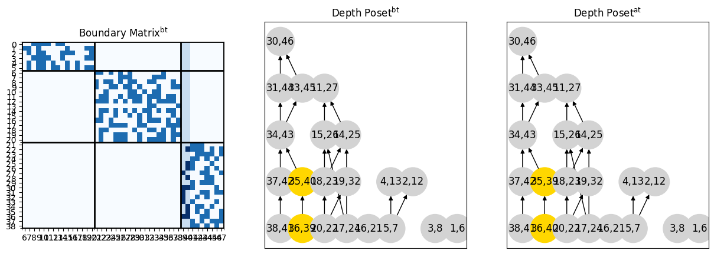

### Birth Death Pairs
|                          |                                                                                                                                                                                                                |
|:-------------------------|:---------------------------------------------------------------------------------------------------------------------------------------------------------------------------------------------------------------|
| Before the transposition | $\{(18, 23), (30, 46), (33, 45), (5, 7), (38, 41), (14, 25), (31, 44), (1, 6), (17, 24), (37, 42), (34, 43), (15, 26), (20, 22), (36, 39), (19, 32), (16, 21), (35, 40), (3, 8), (4, 13), (2, 12), (11, 27)\}$ |
| After the transposition  | $\{(18, 23), (30, 46), (33, 45), (35, 39), (5, 7), (38, 41), (14, 25), (31, 44), (1, 6), (17, 24), (37, 42), (34, 43), (36, 40), (15, 26), (20, 22), (19, 32), (16, 21), (3, 8), (4, 13), (2, 12), (11, 27)\}$ |

### Relations
|                          | Algorithm 1                                                                                                                                                                                                                                                                                                                                                                                                           | Algorithm 2                                                                                                                                                                                                                                                                                                                                                                                                                            |
|:-------------------------|:----------------------------------------------------------------------------------------------------------------------------------------------------------------------------------------------------------------------------------------------------------------------------------------------------------------------------------------------------------------------------------------------------------------------|:---------------------------------------------------------------------------------------------------------------------------------------------------------------------------------------------------------------------------------------------------------------------------------------------------------------------------------------------------------------------------------------------------------------------------------------|
| Before the transposition | $\{(42, 45), (24, 27), (41, 46), (26, 27), (22, 26), (22, 32), (23, 25), (8, 9), (7, 10), (24, 26), (41, 42), (7, 13), (42, 47), (42, 44), (44, 47), (43, 45), (22, 25), (39, 44), (23, 27), (40, 43), (39, 47), (7, 9), (24, 25), (7, 12), (6, 10), (41, 44), (25, 27), (42, 43), (26, 28), (43, 44), (43, 47), (44, 46), (22, 27), (23, 26), (39, 40), (23, 29), (40, 45), (39, 43), (8, 10), (45, 47)\}$           | $\{(20, 11), (4, 0), (35, 33), (20, 14), (38, 29), (5, 4), (14, 10), (31, 29), (34, 28), (34, 31), (37, 30), (36, 31), (15, 11), (18, 10), (3, 0), (18, 11), (20, 19), (38, 37), (34, 33), (36, 30), (11, 10), (37, 29), (36, 33), (16, 9), (15, 10), (33, 28), (35, 28), (20, 9), (35, 31), (38, 30), (20, 18), (35, 34), (20, 15), (5, 2), (38, 33), (31, 30), (11, 9), (37, 28), (37, 31), (15, 9), (33, 30), (18, 14)\}$           |
| After the transposition  | $\{(42, 45), (24, 27), (41, 46), (26, 27), (22, 26), (22, 32), (23, 25), (8, 9), (40, 44), (40, 47), (39, 45), (7, 10), (24, 26), (41, 42), (7, 13), (42, 47), (42, 44), (44, 47), (43, 45), (22, 25), (39, 44), (23, 27), (40, 43), (39, 47), (7, 9), (24, 25), (7, 12), (6, 10), (41, 44), (25, 27), (42, 43), (26, 28), (43, 44), (43, 47), (44, 46), (22, 27), (23, 26), (40, 39), (23, 29), (8, 10), (45, 47)\}$ | $\{(20, 11), (4, 0), (35, 33), (20, 14), (38, 29), (5, 4), (14, 10), (33, 30), (31, 29), (34, 28), (34, 31), (36, 28), (37, 30), (36, 34), (15, 11), (18, 10), (3, 0), (20, 19), (38, 37), (34, 33), (36, 30), (11, 10), (37, 29), (16, 9), (15, 10), (33, 28), (35, 28), (20, 9), (35, 31), (38, 30), (20, 18), (35, 34), (20, 15), (5, 2), (38, 33), (31, 30), (11, 9), (37, 28), (37, 31), (36, 35), (15, 9), (18, 11), (18, 14)\}$ |

### Successors and Predecessers
|                 | $\text{Set}^\text{bt}(35, 40)$                                       | $\text{Set}^\text{bt}(36, 39)$                                       | $\text{Set}^\text{at}(36, 40)$                                       | $\text{Set}^\text{at}(35, 39)$                                       |
|:----------------|:---------------------------------------------------------------------|:---------------------------------------------------------------------|:---------------------------------------------------------------------|:---------------------------------------------------------------------|
| $\text{Succ}_1$ | $\text{Succ}_1^\text{bt}(35, 40) = \{(34, 43), (33, 45)\}$           | $\text{Succ}_1^\text{bt}(36, 39) = \{(34, 43), (31, 44), (35, 40)\}$ | $\text{Succ}_1^\text{at}(36, 40) = \{(34, 43), (35, 39), (31, 44)\}$ | $\text{Succ}_1^\text{at}(35, 39) = \{(33, 45), (31, 44)\}$           |
| $\text{Pred}_1$ | $\text{Pred}_1^\text{bt}(35, 40) = \{(36, 39)\}$                     | $\text{Pred}_1^\text{bt}(36, 39) = \emptyset$                        | $\text{Pred}_1^\text{at}(36, 40) = \emptyset$                        | $\text{Pred}_1^\text{at}(35, 39) = \{(36, 40)\}$                     |
| $\text{Succ}_2$ | $\text{Succ}_2^\text{bt}(35, 40) = \{(34, 43), (33, 45), (31, 44)\}$ | $\text{Succ}_2^\text{bt}(36, 39) = \{(33, 45), (31, 44), (30, 46)\}$ | $\text{Succ}_2^\text{at}(36, 40) = \{(34, 43), (35, 39), (30, 46)\}$ | $\text{Succ}_2^\text{at}(35, 39) = \{(34, 43), (33, 45), (31, 44)\}$ |
| $\text{Pred}_2$ | $\text{Pred}_2^\text{bt}(35, 40) = \emptyset$                        | $\text{Pred}_2^\text{bt}(36, 39) = \emptyset$                        | $\text{Pred}_2^\text{at}(36, 40) = \emptyset$                        | $\text{Pred}_2^\text{at}(35, 39) = \{(36, 40)\}$                     |

### Temp Sets
|                                                               | Before the Transposition   | After the Transposition   |
|:--------------------------------------------------------------|:---------------------------|:--------------------------|
| $\mathcal{B} = \{(s, t)\in \text{BD}:\; f(s) > f(x)\}$        | $\{(37, 42), (38, 41)\}$   | $\{(37, 42), (38, 41)\}$  |
| $\mathcal{N} = \{(s, t)\in \text{BD}:\; f(x) > f(s) > f(a)\}$ | $\emptyset$                | $\emptyset$               |

### Equations
There are 1 equations are wrong.

| eq   | left (formula)                  | left (paramatrized)               | left (value)                       | right (formula)                                                                                          | right (paramatrized)                                                                                           | right (value)                      | correct   |
|:-----|:--------------------------------|:----------------------------------|:-----------------------------------|:---------------------------------------------------------------------------------------------------------|:---------------------------------------------------------------------------------------------------------------|:-----------------------------------|:----------|
| Eq28 | $\text{Succ}_1^\text{at}(x, b)$ | $\text{Succ}_1^\text{at}(36, 40)$ | $\{(34, 43), (35, 39), (31, 44)\}$ | $\text{Succ}_1^\text{bt}(x, y) \oplus \{(a, y), (a, b)\}$                                                | $\text{Succ}_1^\text{bt}(36, 39) \oplus \{(35, 39), (35, 40)\}$                                                | $\{(34, 43), (35, 39), (31, 44)\}$ | ✔         |
| Eq29 | $\text{Succ}_1^\text{at}(a, y)$ | $\text{Succ}_1^\text{at}(35, 39)$ | $\{(33, 45), (31, 44)\}$           | $\text{Succ}_1^\text{bt}(a, b)$                                                                          | $\text{Succ}_1^\text{bt}(35, 40)$                                                                              | $\{(34, 43), (33, 45)\}$           | ✘         |
| Eq30 | $\text{Pred}_1^\text{at}(x, b)$ | $\text{Pred}_1^\text{at}(36, 40)$ | $\emptyset$                        | $[\text{Pred}_1^\text{bt}(a, b) \cap \mathcal{B}]$                                                       | $[\text{Pred}_1^\text{bt}(35, 40) \cap \mathcal{B}]$                                                           | $\emptyset$                        | ✔         |
| Eq31 | $\text{Pred}_1^\text{at}(a, y)$ | $\text{Pred}_1^\text{at}(35, 39)$ | $\{(36, 40)\}$                     | $\text{Pred}_1^\text{bt}(x, y) \oplus \{(x, b)\} \oplus[\text{Pred}_1^\text{bt}(a, b) \cap \mathcal{N}]$ | $\text{Pred}_1^\text{bt}(36, 39) \oplus \{(36, 40)\} \oplus[\text{Pred}_1^\text{bt}(35, 40) \cap \mathcal{N}]$ | $\{(36, 40)\}$                     | ✔         |
| Eq32 | $\text{Succ}_2^\text{at}(x, b)$ | $\text{Succ}_2^\text{at}(36, 40)$ | $\{(34, 43), (35, 39), (30, 46)\}$ | $\text{Succ}_2^\text{bt}(x, y) \oplus \{(a, y)\} \oplus \text{Succ}_2^\text{bt}(a, b)$                   | $\text{Succ}_2^\text{bt}(36, 39) \oplus \{(35, 39)\} \oplus \text{Succ}_2^\text{bt}(35, 40)$                   | $\{(34, 43), (35, 39), (30, 46)\}$ | ✔         |
| Eq33 | $\text{Succ}_2^\text{at}(a, y)$ | $\text{Succ}_2^\text{at}(35, 39)$ | $\{(34, 43), (33, 45), (31, 44)\}$ | $\text{Succ}_2^\text{bt}(a, b)$                                                                          | $\text{Succ}_2^\text{bt}(35, 40)$                                                                              | $\{(34, 43), (33, 45), (31, 44)\}$ | ✔         |
| Eq34 | $\text{Pred}_2^\text{at}(x, b)$ | $\text{Pred}_2^\text{at}(36, 40)$ | $\emptyset$                        | $\text{Pred}_2^\text{bt}(x, y)$                                                                          | $\text{Pred}_2^\text{bt}(36, 39)$                                                                              | $\emptyset$                        | ✔         |
| Eq35 | $\text{Pred}_2^\text{at}(a, y)$ | $\text{Pred}_2^\text{at}(35, 39)$ | $\{(36, 40)\}$                     | $\text{Pred}_2^\text{bt}(a, b) \oplus \{(x, b)\}$                                                        | $\text{Pred}_2^\text{bt}(35, 40) \oplus \{(36, 40)\}$                                                          | $\{(36, 40)\}$                     | ✔         |

## Transposition <42, 43> in complex 22
Here is a __death-death__ __switch forward__ transposition <42, 43>.

$$
a = 34, \; b = 43, \; x = 37, \; y = 42
$$

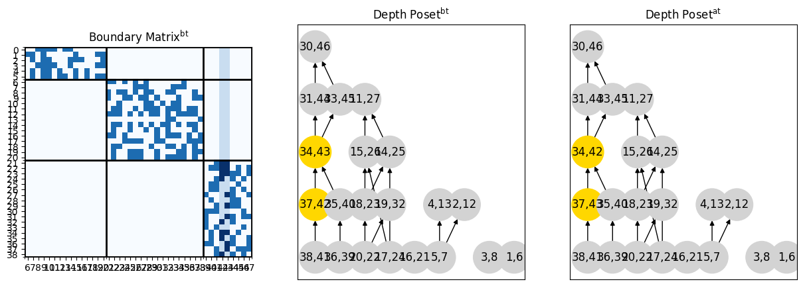

### Birth Death Pairs
|                          |                                                                                                                                                                                                                |
|:-------------------------|:---------------------------------------------------------------------------------------------------------------------------------------------------------------------------------------------------------------|
| Before the transposition | $\{(18, 23), (30, 46), (33, 45), (5, 7), (38, 41), (14, 25), (31, 44), (1, 6), (17, 24), (37, 42), (34, 43), (15, 26), (20, 22), (36, 39), (19, 32), (16, 21), (35, 40), (3, 8), (4, 13), (2, 12), (11, 27)\}$ |
| After the transposition  | $\{(18, 23), (30, 46), (33, 45), (5, 7), (38, 41), (14, 25), (31, 44), (1, 6), (17, 24), (15, 26), (20, 22), (34, 42), (36, 39), (19, 32), (16, 21), (35, 40), (3, 8), (4, 13), (2, 12), (37, 43), (11, 27)\}$ |

### Relations
|                          | Algorithm 1                                                                                                                                                                                                                                                                                                                                                                                                 | Algorithm 2                                                                                                                                                                                                                                                                                                                                                                                                                  |
|:-------------------------|:------------------------------------------------------------------------------------------------------------------------------------------------------------------------------------------------------------------------------------------------------------------------------------------------------------------------------------------------------------------------------------------------------------|:-----------------------------------------------------------------------------------------------------------------------------------------------------------------------------------------------------------------------------------------------------------------------------------------------------------------------------------------------------------------------------------------------------------------------------|
| Before the transposition | $\{(42, 45), (24, 27), (41, 46), (26, 27), (22, 26), (22, 32), (23, 25), (8, 9), (7, 10), (24, 26), (41, 42), (7, 13), (42, 47), (42, 44), (44, 47), (43, 45), (22, 25), (39, 44), (23, 27), (40, 43), (39, 47), (7, 9), (24, 25), (7, 12), (6, 10), (41, 44), (25, 27), (42, 43), (26, 28), (43, 44), (43, 47), (44, 46), (22, 27), (23, 26), (39, 40), (23, 29), (40, 45), (39, 43), (8, 10), (45, 47)\}$ | $\{(20, 11), (4, 0), (35, 33), (20, 14), (38, 29), (5, 4), (14, 10), (31, 29), (34, 28), (34, 31), (37, 30), (36, 31), (15, 11), (18, 10), (3, 0), (18, 11), (20, 19), (38, 37), (34, 33), (36, 30), (11, 10), (37, 29), (36, 33), (16, 9), (15, 10), (33, 28), (35, 28), (20, 9), (35, 31), (38, 30), (20, 18), (35, 34), (20, 15), (5, 2), (38, 33), (31, 30), (11, 9), (37, 28), (37, 31), (15, 9), (33, 30), (18, 14)\}$ |
| After the transposition  | $\{(24, 27), (41, 46), (26, 27), (40, 44), (22, 26), (22, 32), (23, 25), (40, 47), (39, 45), (8, 9), (39, 42), (7, 10), (24, 26), (41, 42), (7, 13), (43, 42), (44, 47), (43, 45), (22, 25), (23, 27), (7, 9), (24, 25), (7, 12), (6, 10), (41, 44), (25, 27), (26, 28), (43, 44), (43, 47), (44, 46), (22, 27), (23, 26), (40, 42), (39, 40), (23, 29), (8, 10), (45, 47)\}$                               | $\{(20, 11), (4, 0), (35, 33), (20, 14), (38, 29), (5, 4), (14, 10), (33, 30), (31, 29), (34, 28), (34, 31), (37, 30), (37, 33), (36, 31), (15, 11), (18, 10), (3, 0), (20, 19), (38, 37), (34, 33), (36, 30), (11, 10), (37, 29), (36, 33), (16, 9), (15, 10), (33, 28), (35, 28), (20, 9), (35, 31), (38, 30), (20, 18), (35, 34), (20, 15), (5, 2), (38, 33), (31, 30), (11, 9), (37, 34), (15, 9), (18, 11), (18, 14)\}$ |

### Successors and Predecessers
|                 | $\text{Set}^\text{bt}(34, 43)$                                       | $\text{Set}^\text{bt}(37, 42)$                                       | $\text{Set}^\text{at}(37, 43)$                                       | $\text{Set}^\text{at}(34, 42)$                                                 |
|:----------------|:---------------------------------------------------------------------|:---------------------------------------------------------------------|:---------------------------------------------------------------------|:-------------------------------------------------------------------------------|
| $\text{Succ}_1$ | $\text{Succ}_1^\text{bt}(34, 43) = \{(33, 45), (31, 44)\}$           | $\text{Succ}_1^\text{bt}(37, 42) = \{(34, 43), (33, 45), (31, 44)\}$ | $\text{Succ}_1^\text{at}(37, 43) = \{(33, 45), (31, 44), (34, 42)\}$ | $\text{Succ}_1^\text{at}(34, 42) = \emptyset$                                  |
| $\text{Pred}_1$ | $\text{Pred}_1^\text{bt}(34, 43) = \{(37, 42), (35, 40), (36, 39)\}$ | $\text{Pred}_1^\text{bt}(37, 42) = \{(38, 41)\}$                     | $\text{Pred}_1^\text{at}(37, 43) = \emptyset$                        | $\text{Pred}_1^\text{at}(34, 42) = \{(36, 39), (38, 41), (37, 43), (35, 40)\}$ |
| $\text{Succ}_2$ | $\text{Succ}_2^\text{bt}(34, 43) = \{(33, 45), (31, 44)\}$           | $\text{Succ}_2^\text{bt}(37, 42) = \{(31, 44), (30, 46)\}$           | $\text{Succ}_2^\text{at}(37, 43) = \{(33, 45), (34, 42), (30, 46)\}$ | $\text{Succ}_2^\text{at}(34, 42) = \{(33, 45), (31, 44)\}$                     |
| $\text{Pred}_2$ | $\text{Pred}_2^\text{bt}(34, 43) = \{(35, 40)\}$                     | $\text{Pred}_2^\text{bt}(37, 42) = \{(38, 41)\}$                     | $\text{Pred}_2^\text{at}(37, 43) = \{(38, 41)\}$                     | $\text{Pred}_2^\text{at}(34, 42) = \{(37, 43), (35, 40)\}$                     |

### Temp Sets
|                                                               | Before the Transposition   | After the Transposition   |
|:--------------------------------------------------------------|:---------------------------|:--------------------------|
| $\mathcal{B} = \{(s, t)\in \text{BD}:\; f(s) > f(x)\}$        | $\{(38, 41)\}$             | $\{(38, 41)\}$            |
| $\mathcal{N} = \{(s, t)\in \text{BD}:\; f(x) > f(s) > f(a)\}$ | $\{(36, 39), (35, 40)\}$   | $\{(36, 39), (35, 40)\}$  |

### Equations
There are 1 equations are wrong.

| eq   | left (formula)                  | left (paramatrized)               | left (value)                                 | right (formula)                                                                                          | right (paramatrized)                                                                                           | right (value)                                | correct   |
|:-----|:--------------------------------|:----------------------------------|:---------------------------------------------|:---------------------------------------------------------------------------------------------------------|:---------------------------------------------------------------------------------------------------------------|:---------------------------------------------|:----------|
| Eq28 | $\text{Succ}_1^\text{at}(x, b)$ | $\text{Succ}_1^\text{at}(37, 43)$ | $\{(33, 45), (31, 44), (34, 42)\}$           | $\text{Succ}_1^\text{bt}(x, y) \oplus \{(a, y), (a, b)\}$                                                | $\text{Succ}_1^\text{bt}(37, 42) \oplus \{(34, 42), (34, 43)\}$                                                | $\{(33, 45), (31, 44), (34, 42)\}$           | ✔         |
| Eq29 | $\text{Succ}_1^\text{at}(a, y)$ | $\text{Succ}_1^\text{at}(34, 42)$ | $\emptyset$                                  | $\text{Succ}_1^\text{bt}(a, b)$                                                                          | $\text{Succ}_1^\text{bt}(34, 43)$                                                                              | $\{(33, 45), (31, 44)\}$                     | ✘         |
| Eq30 | $\text{Pred}_1^\text{at}(x, b)$ | $\text{Pred}_1^\text{at}(37, 43)$ | $\emptyset$                                  | $[\text{Pred}_1^\text{bt}(a, b) \cap \mathcal{B}]$                                                       | $[\text{Pred}_1^\text{bt}(34, 43) \cap \mathcal{B}]$                                                           | $\emptyset$                                  | ✔         |
| Eq31 | $\text{Pred}_1^\text{at}(a, y)$ | $\text{Pred}_1^\text{at}(34, 42)$ | $\{(36, 39), (38, 41), (37, 43), (35, 40)\}$ | $\text{Pred}_1^\text{bt}(x, y) \oplus \{(x, b)\} \oplus[\text{Pred}_1^\text{bt}(a, b) \cap \mathcal{N}]$ | $\text{Pred}_1^\text{bt}(37, 42) \oplus \{(37, 43)\} \oplus[\text{Pred}_1^\text{bt}(34, 43) \cap \mathcal{N}]$ | $\{(36, 39), (37, 43), (38, 41), (35, 40)\}$ | ✔         |
| Eq32 | $\text{Succ}_2^\text{at}(x, b)$ | $\text{Succ}_2^\text{at}(37, 43)$ | $\{(33, 45), (34, 42), (30, 46)\}$           | $\text{Succ}_2^\text{bt}(x, y) \oplus \{(a, y)\} \oplus \text{Succ}_2^\text{bt}(a, b)$                   | $\text{Succ}_2^\text{bt}(37, 42) \oplus \{(34, 42)\} \oplus \text{Succ}_2^\text{bt}(34, 43)$                   | $\{(33, 45), (30, 46), (34, 42)\}$           | ✔         |
| Eq33 | $\text{Succ}_2^\text{at}(a, y)$ | $\text{Succ}_2^\text{at}(34, 42)$ | $\{(33, 45), (31, 44)\}$                     | $\text{Succ}_2^\text{bt}(a, b)$                                                                          | $\text{Succ}_2^\text{bt}(34, 43)$                                                                              | $\{(33, 45), (31, 44)\}$                     | ✔         |
| Eq34 | $\text{Pred}_2^\text{at}(x, b)$ | $\text{Pred}_2^\text{at}(37, 43)$ | $\{(38, 41)\}$                               | $\text{Pred}_2^\text{bt}(x, y)$                                                                          | $\text{Pred}_2^\text{bt}(37, 42)$                                                                              | $\{(38, 41)\}$                               | ✔         |
| Eq35 | $\text{Pred}_2^\text{at}(a, y)$ | $\text{Pred}_2^\text{at}(34, 42)$ | $\{(37, 43), (35, 40)\}$                     | $\text{Pred}_2^\text{bt}(a, b) \oplus \{(x, b)\}$                                                        | $\text{Pred}_2^\text{bt}(34, 43) \oplus \{(37, 43)\}$                                                          | $\{(37, 43), (35, 40)\}$                     | ✔         |

## Transposition <8, 9> in complex 23
Here is a __death-death__ __no switch__ transposition <8, 9>.

$$
a = 2, \; b = 9, \; x = 0, \; y = 8
$$

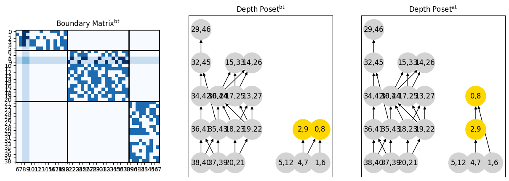

### Birth Death Pairs
|                          |                                                                                                                                                                                                               |
|:-------------------------|:--------------------------------------------------------------------------------------------------------------------------------------------------------------------------------------------------------------|
| Before the transposition | $\{(13, 27), (18, 23), (15, 33), (1, 6), (0, 8), (37, 39), (32, 45), (38, 40), (5, 12), (29, 46), (34, 42), (30, 44), (16, 24), (4, 7), (20, 21), (35, 43), (14, 26), (2, 9), (17, 25), (19, 22), (36, 41)\}$ |
| After the transposition  | $\{(13, 27), (18, 23), (15, 33), (1, 6), (0, 8), (37, 39), (32, 45), (38, 40), (5, 12), (29, 46), (34, 42), (30, 44), (16, 24), (4, 7), (20, 21), (35, 43), (14, 26), (2, 9), (17, 25), (19, 22), (36, 41)\}$ |

### Relations
|                          | Algorithm 1                                                                                                                                                                                                                                                                                                                                                                                                | Algorithm 2                                                                                                                                                                                                                                                                                                                                                                      |
|:-------------------------|:-----------------------------------------------------------------------------------------------------------------------------------------------------------------------------------------------------------------------------------------------------------------------------------------------------------------------------------------------------------------------------------------------------------|:---------------------------------------------------------------------------------------------------------------------------------------------------------------------------------------------------------------------------------------------------------------------------------------------------------------------------------------------------------------------------------|
| Before the transposition | $\{(43, 46), (41, 46), (21, 22), (21, 28), (40, 44), (39, 42), (40, 41), (40, 47), (9, 11), (7, 10), (24, 26), (41, 42), (6, 8), (25, 31), (42, 47), (44, 47), (43, 45), (22, 25), (21, 27), (21, 33), (22, 28), (8, 11), (23, 27), (40, 43), (22, 31), (9, 10), (24, 28), (24, 31), (41, 47), (43, 44), (26, 28), (23, 26), (22, 24), (39, 46), (8, 10), (39, 43), (22, 33), (45, 47), (7, 11), (7, 8)\}$ | $\{(35, 30), (20, 11), (20, 14), (4, 3), (20, 17), (38, 35), (14, 10), (34, 28), (17, 15), (37, 30), (37, 36), (18, 10), (18, 16), (35, 32), (4, 2), (35, 29), (20, 19), (29, 28), (38, 34), (17, 14), (19, 14), (37, 29), (37, 35), (15, 10), (16, 15), (35, 28), (32, 29), (20, 18), (19, 10), (19, 16), (19, 13), (34, 32), (37, 34), (18, 11), (32, 28), (18, 14)\}$         |
| After the transposition  | $\{(43, 46), (41, 46), (21, 22), (21, 28), (40, 44), (39, 42), (40, 41), (40, 47), (9, 11), (7, 10), (24, 26), (41, 42), (6, 8), (25, 31), (42, 47), (44, 47), (43, 45), (22, 25), (21, 27), (21, 33), (8, 11), (22, 28), (23, 27), (40, 43), (22, 31), (9, 10), (24, 28), (24, 31), (41, 47), (43, 44), (26, 28), (23, 26), (22, 24), (39, 46), (8, 10), (39, 43), (22, 33), (45, 47), (7, 11), (7, 8)\}$ | $\{(35, 30), (20, 11), (20, 14), (4, 3), (20, 17), (38, 35), (14, 10), (34, 28), (17, 15), (37, 30), (37, 36), (18, 10), (18, 16), (35, 32), (4, 2), (35, 29), (20, 19), (29, 28), (38, 34), (17, 14), (19, 14), (37, 29), (37, 35), (15, 10), (16, 15), (35, 28), (32, 29), (20, 18), (2, 0), (19, 10), (19, 16), (19, 13), (34, 32), (37, 34), (18, 11), (32, 28), (18, 14)\}$ |

### Successors and Predecessers
No such node in the Depth Poset

### Temp Sets
|                                                               | Before the Transposition                                                                                                                                                                              | After the Transposition                                                                                                                                                                               |
|:--------------------------------------------------------------|:------------------------------------------------------------------------------------------------------------------------------------------------------------------------------------------------------|:------------------------------------------------------------------------------------------------------------------------------------------------------------------------------------------------------|
| $\mathcal{B} = \{(s, t)\in \text{BD}:\; f(s) > f(x)\}$        | $\{(13, 27), (18, 23), (15, 33), (1, 6), (37, 39), (32, 45), (38, 40), (5, 12), (29, 46), (34, 42), (30, 44), (16, 24), (4, 7), (20, 21), (35, 43), (14, 26), (2, 9), (17, 25), (19, 22), (36, 41)\}$ | $\{(13, 27), (18, 23), (15, 33), (1, 6), (37, 39), (32, 45), (38, 40), (5, 12), (29, 46), (34, 42), (30, 44), (16, 24), (4, 7), (20, 21), (35, 43), (14, 26), (2, 9), (17, 25), (19, 22), (36, 41)\}$ |
| $\mathcal{N} = \{(s, t)\in \text{BD}:\; f(x) > f(s) > f(a)\}$ | $\emptyset$                                                                                                                                                                                           | $\emptyset$                                                                                                                                                                                           |

### Equations
There are 2 equations are wrong.

| eq   | left (formula)                  | left (paramatrized)             | left (value)   | right (formula)                                                                        | right (paramatrized)                                                                   | right (value)        | correct   |
|:-----|:--------------------------------|:--------------------------------|:---------------|:---------------------------------------------------------------------------------------|:---------------------------------------------------------------------------------------|:---------------------|:----------|
| Eq36 | $\text{Succ}_2^\text{at}(x, y)$ | $\text{Succ}_2^\text{at}(0, 8)$ | $\emptyset$    | $\text{Succ}_2^\text{bt}(x, y) \oplus \{(a, b)\} \oplus \text{Succ}_2^\text{bt}(a, b)$ | $\text{Succ}_2^\text{bt}(0, 8) \oplus \{(2, 9)\} \oplus \text{Succ}_2^\text{bt}(2, 9)$ | $\{(2, 9)\}$         | ✘         |
| Eq37 | $\text{Pred}_2^\text{at}(a, b)$ | $\text{Pred}_2^\text{at}(2, 9)$ | $\{(4, 7)\}$   | $\text{Pred}_2^\text{bt}(a, b) \oplus \{(x, y)\}$                                      | $\text{Pred}_2^\text{bt}(2, 9) \oplus \{(0, 8)\}$                                      | $\{(0, 8), (4, 7)\}$ | ✘         |

## Transposition <12, 13> in complex 23
Here is a __birth-death__ __switch forward__ transposition <12, 13>.

$$
a = 5, \; b = 12, \; x = 13, \; y = 27
$$

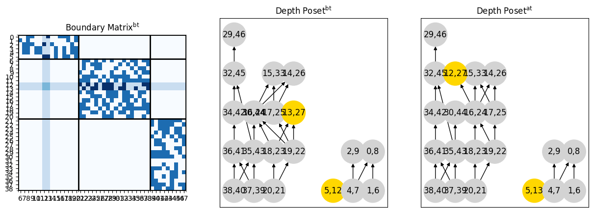

### Birth Death Pairs
|                          |                                                                                                                                                                                                               |
|:-------------------------|:--------------------------------------------------------------------------------------------------------------------------------------------------------------------------------------------------------------|
| Before the transposition | $\{(13, 27), (18, 23), (15, 33), (1, 6), (0, 8), (37, 39), (32, 45), (38, 40), (5, 12), (29, 46), (34, 42), (30, 44), (16, 24), (4, 7), (20, 21), (35, 43), (14, 26), (2, 9), (17, 25), (19, 22), (36, 41)\}$ |
| After the transposition  | $\{(18, 23), (15, 33), (5, 13), (1, 6), (0, 8), (37, 39), (32, 45), (38, 40), (12, 27), (29, 46), (34, 42), (30, 44), (16, 24), (4, 7), (20, 21), (35, 43), (14, 26), (2, 9), (17, 25), (19, 22), (36, 41)\}$ |

### Relations
|                          | Algorithm 1                                                                                                                                                                                                                                                                                                                                                                                                | Algorithm 2                                                                                                                                                                                                                                                                                                                                                                                            |
|:-------------------------|:-----------------------------------------------------------------------------------------------------------------------------------------------------------------------------------------------------------------------------------------------------------------------------------------------------------------------------------------------------------------------------------------------------------|:-------------------------------------------------------------------------------------------------------------------------------------------------------------------------------------------------------------------------------------------------------------------------------------------------------------------------------------------------------------------------------------------------------|
| Before the transposition | $\{(43, 46), (41, 46), (21, 22), (21, 28), (40, 44), (39, 42), (40, 41), (40, 47), (9, 11), (7, 10), (24, 26), (41, 42), (6, 8), (25, 31), (42, 47), (44, 47), (43, 45), (22, 25), (21, 27), (21, 33), (22, 28), (8, 11), (23, 27), (40, 43), (22, 31), (9, 10), (24, 28), (24, 31), (41, 47), (43, 44), (26, 28), (23, 26), (22, 24), (39, 46), (8, 10), (39, 43), (22, 33), (45, 47), (7, 11), (7, 8)\}$ | $\{(35, 30), (20, 11), (20, 14), (4, 3), (20, 17), (38, 35), (14, 10), (34, 28), (17, 15), (37, 30), (37, 36), (18, 10), (18, 16), (35, 32), (4, 2), (35, 29), (20, 19), (29, 28), (38, 34), (17, 14), (19, 14), (37, 29), (37, 35), (15, 10), (16, 15), (35, 28), (32, 29), (20, 18), (19, 10), (19, 16), (19, 13), (34, 32), (37, 34), (18, 11), (32, 28), (18, 14)\}$                               |
| After the transposition  | $\{(43, 46), (41, 46), (21, 22), (21, 28), (40, 44), (39, 42), (40, 41), (40, 47), (9, 11), (7, 10), (24, 26), (41, 42), (6, 8), (25, 31), (42, 47), (44, 47), (43, 45), (22, 25), (21, 27), (21, 33), (22, 28), (8, 11), (23, 27), (40, 43), (22, 31), (9, 10), (24, 28), (24, 31), (41, 47), (43, 44), (26, 28), (23, 26), (22, 24), (39, 46), (8, 10), (39, 43), (22, 33), (45, 47), (7, 11), (7, 8)\}$ | $\{(35, 30), (20, 11), (20, 14), (4, 3), (20, 17), (38, 35), (14, 10), (34, 28), (17, 15), (37, 30), (19, 12), (37, 36), (18, 10), (18, 16), (35, 32), (4, 2), (35, 29), (20, 19), (29, 28), (38, 34), (17, 14), (19, 14), (37, 29), (37, 35), (16, 12), (15, 10), (16, 15), (18, 12), (35, 28), (32, 29), (20, 12), (20, 18), (19, 10), (19, 16), (34, 32), (37, 34), (18, 11), (32, 28), (18, 14)\}$ |

### Successors and Predecessers
|                 | $\text{Set}^\text{bt}(5, 12)$                | $\text{Set}^\text{bt}(13, 27)$                             | $\text{Set}^\text{at}(5, 13)$                | $\text{Set}^\text{at}(12, 27)$                                                 |
|:----------------|:---------------------------------------------|:-----------------------------------------------------------|:---------------------------------------------|:-------------------------------------------------------------------------------|
| $\text{Succ}_1$ | $\text{Succ}_1^\text{bt}(5, 12) = \emptyset$ | $\text{Succ}_1^\text{bt}(13, 27) = \emptyset$              | $\text{Succ}_1^\text{at}(5, 13) = \emptyset$ | $\text{Succ}_1^\text{at}(12, 27) = \emptyset$                                  |
| $\text{Pred}_1$ | $\text{Pred}_1^\text{bt}(5, 12) = \emptyset$ | $\text{Pred}_1^\text{bt}(13, 27) = \{(18, 23), (20, 21)\}$ | $\text{Pred}_1^\text{at}(5, 13) = \emptyset$ | $\text{Pred}_1^\text{at}(12, 27) = \{(18, 23), (20, 21)\}$                     |
| $\text{Succ}_2$ | $\text{Succ}_2^\text{bt}(5, 12) = \emptyset$ | $\text{Succ}_2^\text{bt}(13, 27) = \emptyset$              | $\text{Succ}_2^\text{at}(5, 13) = \emptyset$ | $\text{Succ}_2^\text{at}(12, 27) = \emptyset$                                  |
| $\text{Pred}_2$ | $\text{Pred}_2^\text{bt}(5, 12) = \emptyset$ | $\text{Pred}_2^\text{bt}(13, 27) = \{(19, 22)\}$           | $\text{Pred}_2^\text{at}(5, 13) = \emptyset$ | $\text{Pred}_2^\text{at}(12, 27) = \{(16, 24), (18, 23), (19, 22), (20, 21)\}$ |

### Temp Sets
|                                                              | Before the Transposition                                         | After the Transposition                                          |
|:-------------------------------------------------------------|:-----------------------------------------------------------------|:-----------------------------------------------------------------|
| $A_1 = \{(s, t)\in \text{BD}:\; f(a) < f(s) < f(t) < f(x)\}$ | $\emptyset$                                                      | $\emptyset$                                                      |
| $B_1 = \{(s, t)\in \text{BD}:\; U_1[t, x] = 1\}$             | $\emptyset$                                                      | $\emptyset$                                                      |
| $A_2 = \{(s, t)\in \text{BD}:\; f(b) < f(s) < f(t) < f(y)\}$ | $\{(18, 23), (14, 26), (17, 25), (19, 22), (16, 24), (20, 21)\}$ | $\{(18, 23), (14, 26), (17, 25), (19, 22), (16, 24), (20, 21)\}$ |
| $B_2 = \{(s, t)\in \text{BD}:\; U_2[b, s] = 1\}$             | $\emptyset$                                                      | $\{(16, 24), (18, 23), (19, 22), (20, 21)\}$                     |

### Equations
There are 2 equations are wrong.

| eq    | left (formula)                  | left (paramatrized)               | left (value)                                 | right (formula)                                      | right (paramatrized)                                  | right (value)                                | correct   |
|:------|:--------------------------------|:----------------------------------|:---------------------------------------------|:-----------------------------------------------------|:------------------------------------------------------|:---------------------------------------------|:----------|
| Eq48  | $\text{Succ}_1^\text{at}(a, x)$ | $\text{Succ}_1^\text{at}(5, 13)$  | $\emptyset$                                  | $\text{Succ}_1^\text{bt}(a, b)$                      | $\text{Succ}_1^\text{bt}(5, 12)$                      | $\emptyset$                                  | ✔         |
| Eq49  | $\text{Succ}_1^\text{at}(b, y)$ | $\text{Succ}_1^\text{at}(12, 27)$ | $\emptyset$                                  | $\text{Succ}_1^\text{bt}(x, y)$                      | $\text{Succ}_1^\text{bt}(13, 27)$                     | $\emptyset$                                  | ✔         |
| Eq50  | $\text{Pred}_1^\text{at}(a, x)$ | $\text{Pred}_1^\text{at}(5, 13)$  | $\emptyset$                                  | $\{(s, t)\in \text{BD}:\; U_1^\text{bt}[t, x] = 1\}$ | $\{(s, t)\in \text{BD}:\; U_1^\text{bt}[t, 13] = 1\}$ | $\emptyset$                                  | ✔         |
| Eq50a | $\text{Pred}_1^\text{at}(a, x)$ | $\text{Pred}_1^\text{at}(5, 13)$  | $\emptyset$                                  | $A_1^\text{bt} \cap B_1^\text{bt}$                   | $A_1^\text{bt} \cap B_1^\text{bt}$                    | $\emptyset$                                  | ✔         |
| Eq50b | $\text{Pred}_1^\text{at}(a, x)$ | $\text{Pred}_1^\text{at}(5, 13)$  | $\emptyset$                                  | $A_1^\text{bt} \cap B_1^\text{at}$                   | $A_1^\text{bt} \cap B_1^\text{at}$                    | $\emptyset$                                  | ✔         |
| Eq51  | $\text{Pred}_1^\text{at}(b, y)$ | $\text{Pred}_1^\text{at}(12, 27)$ | $\{(18, 23), (20, 21)\}$                     | $\text{Pred}_1^\text{bt}(x, y)$                      | $\text{Pred}_1^\text{bt}(13, 27)$                     | $\{(18, 23), (20, 21)\}$                     | ✔         |
| Eq52  | $\text{Succ}_2^\text{at}(a, x)$ | $\text{Succ}_2^\text{at}(5, 13)$  | $\emptyset$                                  | $\text{Succ}_2^\text{bt}(a, b)$                      | $\text{Succ}_2^\text{bt}(5, 12)$                      | $\emptyset$                                  | ✔         |
| Eq53  | $\text{Succ}_2^\text{at}(b, y)$ | $\text{Succ}_2^\text{at}(12, 27)$ | $\emptyset$                                  | $\text{Succ}_2^\text{bt}(x, y)$                      | $\text{Succ}_2^\text{bt}(13, 27)$                     | $\emptyset$                                  | ✔         |
| Eq54  | $\text{Pred}_2^\text{at}(a, x)$ | $\text{Pred}_2^\text{at}(5, 13)$  | $\emptyset$                                  | $\text{Pred}_2^\text{bt}(a, b)$                      | $\text{Pred}_2^\text{bt}(5, 12)$                      | $\emptyset$                                  | ✔         |
| Eq55  | $\text{Pred}_2^\text{at}(b, y)$ | $\text{Pred}_2^\text{at}(12, 27)$ | $\{(16, 24), (18, 23), (19, 22), (20, 21)\}$ | $\{(s, t)\in \text{BD}:\; U_2^\text{bt}[b, s] = 1\}$ | $\{(s, t)\in \text{BD}:\; U_2^\text{bt}[12, s] = 1\}$ | $\emptyset$                                  | ✘         |
| Eq55a | $\text{Pred}_2^\text{at}(b, y)$ | $\text{Pred}_2^\text{at}(12, 27)$ | $\{(16, 24), (18, 23), (19, 22), (20, 21)\}$ | $A_2^\text{bt} \cap B_2^\text{bt}$                   | $A_2^\text{bt} \cap B_2^\text{bt}$                    | $\emptyset$                                  | ✘         |
| Eq55b | $\text{Pred}_2^\text{at}(b, y)$ | $\text{Pred}_2^\text{at}(12, 27)$ | $\{(16, 24), (18, 23), (19, 22), (20, 21)\}$ | $A_2^\text{bt} \cap B_2^\text{at}$                   | $A_2^\text{bt} \cap B_2^\text{at}$                    | $\{(16, 24), (18, 23), (19, 22), (20, 21)\}$ | ✔         |

## Transposition <14, 15> in complex 23
Here is a __birth-birth__ __no switch__ transposition <14, 15>.

$$
a = 14, \; b = 26, \; x = 15, \; y = 33
$$

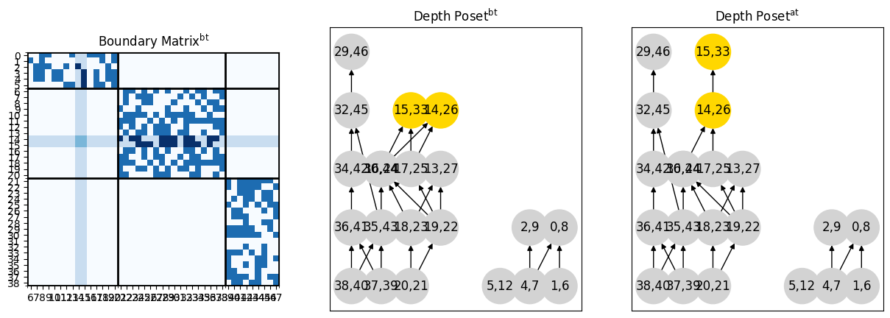

### Birth Death Pairs
|                          |                                                                                                                                                                                                               |
|:-------------------------|:--------------------------------------------------------------------------------------------------------------------------------------------------------------------------------------------------------------|
| Before the transposition | $\{(13, 27), (18, 23), (15, 33), (1, 6), (0, 8), (37, 39), (32, 45), (38, 40), (5, 12), (29, 46), (34, 42), (30, 44), (16, 24), (4, 7), (20, 21), (35, 43), (14, 26), (2, 9), (17, 25), (19, 22), (36, 41)\}$ |
| After the transposition  | $\{(13, 27), (18, 23), (15, 33), (1, 6), (0, 8), (37, 39), (32, 45), (38, 40), (5, 12), (29, 46), (34, 42), (30, 44), (16, 24), (4, 7), (20, 21), (35, 43), (14, 26), (2, 9), (17, 25), (19, 22), (36, 41)\}$ |

### Relations
|                          | Algorithm 1                                                                                                                                                                                                                                                                                                                                                                                                          | Algorithm 2                                                                                                                                                                                                                                                                                                                                                              |
|:-------------------------|:---------------------------------------------------------------------------------------------------------------------------------------------------------------------------------------------------------------------------------------------------------------------------------------------------------------------------------------------------------------------------------------------------------------------|:-------------------------------------------------------------------------------------------------------------------------------------------------------------------------------------------------------------------------------------------------------------------------------------------------------------------------------------------------------------------------|
| Before the transposition | $\{(43, 46), (41, 46), (21, 22), (21, 28), (40, 44), (39, 42), (40, 41), (40, 47), (9, 11), (7, 10), (24, 26), (41, 42), (6, 8), (25, 31), (42, 47), (44, 47), (43, 45), (22, 25), (21, 27), (21, 33), (22, 28), (8, 11), (23, 27), (40, 43), (22, 31), (9, 10), (24, 28), (24, 31), (41, 47), (43, 44), (26, 28), (23, 26), (22, 24), (39, 46), (8, 10), (39, 43), (22, 33), (45, 47), (7, 11), (7, 8)\}$           | $\{(35, 30), (20, 11), (20, 14), (4, 3), (20, 17), (38, 35), (14, 10), (34, 28), (17, 15), (37, 30), (37, 36), (18, 10), (18, 16), (35, 32), (4, 2), (35, 29), (20, 19), (29, 28), (38, 34), (17, 14), (19, 14), (37, 29), (37, 35), (15, 10), (16, 15), (35, 28), (32, 29), (20, 18), (19, 10), (19, 16), (19, 13), (34, 32), (37, 34), (18, 11), (32, 28), (18, 14)\}$ |
| After the transposition  | $\{(43, 46), (41, 46), (26, 33), (21, 22), (21, 28), (40, 44), (39, 42), (40, 41), (40, 47), (9, 11), (7, 10), (24, 26), (41, 42), (6, 8), (25, 31), (42, 47), (44, 47), (43, 45), (22, 25), (21, 27), (21, 33), (22, 28), (8, 11), (23, 27), (40, 43), (22, 31), (9, 10), (24, 28), (24, 31), (41, 47), (43, 44), (26, 28), (23, 26), (22, 24), (39, 46), (8, 10), (39, 43), (22, 33), (45, 47), (7, 11), (7, 8)\}$ | $\{(35, 30), (20, 11), (20, 14), (4, 3), (20, 17), (38, 35), (14, 10), (34, 28), (17, 15), (37, 30), (37, 36), (18, 10), (18, 16), (35, 32), (4, 2), (35, 29), (20, 19), (29, 28), (38, 34), (17, 14), (19, 14), (37, 29), (37, 35), (15, 10), (16, 15), (35, 28), (32, 29), (20, 18), (19, 10), (19, 16), (19, 13), (34, 32), (37, 34), (18, 11), (32, 28), (18, 14)\}$ |

### Successors and Predecessers
No such node in the Depth Poset

### Temp Sets
|                                                               | Before the Transposition                                                                                            | After the Transposition                                                                                             |
|:--------------------------------------------------------------|:--------------------------------------------------------------------------------------------------------------------|:--------------------------------------------------------------------------------------------------------------------|
| $\mathcal{L} = \{(s, t)\in \text{BD}:\; f(t) < f(y)\}$        | $\{(13, 27), (18, 23), (5, 12), (14, 26), (2, 9), (17, 25), (19, 22), (16, 24), (1, 6), (0, 8), (4, 7), (20, 21)\}$ | $\{(13, 27), (18, 23), (5, 12), (14, 26), (2, 9), (17, 25), (19, 22), (16, 24), (1, 6), (0, 8), (4, 7), (20, 21)\}$ |
| $\mathcal{M} = \{(s, t)\in \text{BD}:\; f(y) < f(t) < f(b)\}$ | $\emptyset$                                                                                                         | $\emptyset$                                                                                                         |

### Equations
There are 2 equations are wrong.

| eq   | left (formula)                  | left (paramatrized)               | left (value)             | right (formula)                                                                        | right (paramatrized)                                                                         | right (value)                      | correct   |
|:-----|:--------------------------------|:----------------------------------|:-------------------------|:---------------------------------------------------------------------------------------|:---------------------------------------------------------------------------------------------|:-----------------------------------|:----------|
| Eq16 | $\text{Succ}_1^\text{at}(x, y)$ | $\text{Succ}_1^\text{at}(15, 33)$ | $\emptyset$              | $\text{Succ}_1^\text{bt}(x, y) \oplus \{(a, b)\} \oplus \text{Succ}_1^\text{bt}(a, b)$ | $\text{Succ}_1^\text{bt}(15, 33) \oplus \{(14, 26)\} \oplus \text{Succ}_1^\text{bt}(14, 26)$ | $\{(14, 26)\}$                     | ✘         |
| Eq17 | $\text{Pred}_1^\text{at}(a, b)$ | $\text{Pred}_1^\text{at}(14, 26)$ | $\{(16, 24), (18, 23)\}$ | $\text{Pred}_1^\text{bt}(a, b) \oplus \{(x, y)\}$                                      | $\text{Pred}_1^\text{bt}(14, 26) \oplus \{(15, 33)\}$                                        | $\{(16, 24), (15, 33), (18, 23)\}$ | ✘         |

## Transposition <33, 34> in complex 23
Here is a __birth-death__ __switch forward__ transposition <33, 34>.

$$
a = 15, \; b = 33, \; x = 34, \; y = 42
$$

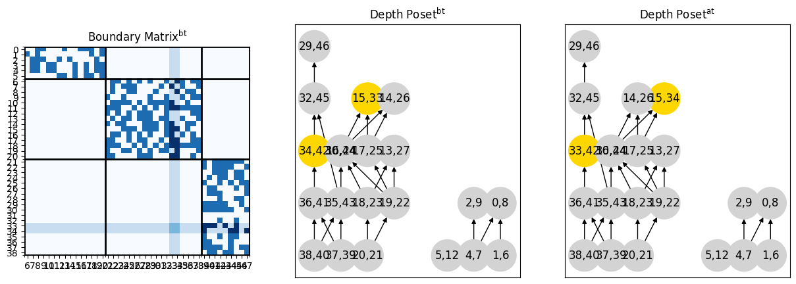

### Birth Death Pairs
|                          |                                                                                                                                                                                                               |
|:-------------------------|:--------------------------------------------------------------------------------------------------------------------------------------------------------------------------------------------------------------|
| Before the transposition | $\{(13, 27), (18, 23), (15, 33), (1, 6), (0, 8), (37, 39), (32, 45), (38, 40), (5, 12), (29, 46), (34, 42), (30, 44), (16, 24), (4, 7), (20, 21), (35, 43), (14, 26), (2, 9), (17, 25), (19, 22), (36, 41)\}$ |
| After the transposition  | $\{(13, 27), (33, 42), (18, 23), (1, 6), (0, 8), (37, 39), (32, 45), (38, 40), (5, 12), (29, 46), (30, 44), (16, 24), (4, 7), (20, 21), (35, 43), (15, 34), (14, 26), (2, 9), (17, 25), (19, 22), (36, 41)\}$ |

### Relations
|                          | Algorithm 1                                                                                                                                                                                                                                                                                                                                                                                                | Algorithm 2                                                                                                                                                                                                                                                                                                                                                              |
|:-------------------------|:-----------------------------------------------------------------------------------------------------------------------------------------------------------------------------------------------------------------------------------------------------------------------------------------------------------------------------------------------------------------------------------------------------------|:-------------------------------------------------------------------------------------------------------------------------------------------------------------------------------------------------------------------------------------------------------------------------------------------------------------------------------------------------------------------------|
| Before the transposition | $\{(43, 46), (41, 46), (21, 22), (21, 28), (40, 44), (39, 42), (40, 41), (40, 47), (9, 11), (7, 10), (24, 26), (41, 42), (6, 8), (25, 31), (42, 47), (44, 47), (43, 45), (22, 25), (21, 27), (21, 33), (22, 28), (8, 11), (23, 27), (40, 43), (22, 31), (9, 10), (24, 28), (24, 31), (41, 47), (43, 44), (26, 28), (23, 26), (22, 24), (39, 46), (8, 10), (39, 43), (22, 33), (45, 47), (7, 11), (7, 8)\}$ | $\{(35, 30), (20, 11), (20, 14), (4, 3), (20, 17), (38, 35), (14, 10), (34, 28), (17, 15), (37, 30), (37, 36), (18, 10), (18, 16), (35, 32), (4, 2), (35, 29), (20, 19), (29, 28), (38, 34), (17, 14), (19, 14), (37, 29), (37, 35), (15, 10), (16, 15), (35, 28), (32, 29), (20, 18), (19, 10), (19, 16), (19, 13), (34, 32), (37, 34), (18, 11), (32, 28), (18, 14)\}$ |
| After the transposition  | $\{(43, 46), (41, 46), (21, 22), (21, 28), (40, 44), (39, 42), (21, 34), (40, 41), (40, 47), (9, 11), (7, 10), (24, 26), (41, 42), (6, 8), (25, 31), (42, 47), (44, 47), (43, 45), (22, 25), (21, 27), (22, 28), (8, 11), (23, 27), (40, 43), (22, 31), (9, 10), (24, 28), (24, 31), (41, 47), (43, 44), (26, 28), (23, 26), (22, 24), (39, 46), (8, 10), (39, 43), (45, 47), (7, 11), (7, 8)\}$           | $\{(35, 30), (20, 11), (20, 14), (4, 3), (20, 17), (38, 35), (14, 10), (17, 15), (37, 30), (37, 33), (37, 36), (18, 10), (18, 16), (35, 32), (33, 32), (4, 2), (35, 29), (20, 19), (29, 28), (17, 14), (19, 14), (37, 29), (37, 35), (33, 28), (15, 10), (16, 15), (35, 28), (32, 29), (20, 18), (19, 10), (19, 16), (19, 13), (18, 11), (32, 28), (18, 14)\}$           |

### Successors and Predecessers
|                 | $\text{Set}^\text{bt}(15, 33)$                             | $\text{Set}^\text{bt}(34, 42)$                             | $\text{Set}^\text{at}(15, 34)$                             | $\text{Set}^\text{at}(33, 42)$                             |
|:----------------|:-----------------------------------------------------------|:-----------------------------------------------------------|:-----------------------------------------------------------|:-----------------------------------------------------------|
| $\text{Succ}_1$ | $\text{Succ}_1^\text{bt}(15, 33) = \emptyset$              | $\text{Succ}_1^\text{bt}(34, 42) = \emptyset$              | $\text{Succ}_1^\text{at}(15, 34) = \emptyset$              | $\text{Succ}_1^\text{at}(33, 42) = \emptyset$              |
| $\text{Pred}_1$ | $\text{Pred}_1^\text{bt}(15, 33) = \{(19, 22), (20, 21)\}$ | $\text{Pred}_1^\text{bt}(34, 42) = \{(36, 41), (37, 39)\}$ | $\text{Pred}_1^\text{at}(15, 34) = \{(20, 21)\}$           | $\text{Pred}_1^\text{at}(33, 42) = \{(36, 41), (37, 39)\}$ |
| $\text{Succ}_2$ | $\text{Succ}_2^\text{bt}(15, 33) = \emptyset$              | $\text{Succ}_2^\text{bt}(34, 42) = \{(32, 45)\}$           | $\text{Succ}_2^\text{at}(15, 34) = \emptyset$              | $\text{Succ}_2^\text{at}(33, 42) = \{(32, 45)\}$           |
| $\text{Pred}_2$ | $\text{Pred}_2^\text{bt}(15, 33) = \{(16, 24), (17, 25)\}$ | $\text{Pred}_2^\text{bt}(34, 42) = \{(38, 40), (37, 39)\}$ | $\text{Pred}_2^\text{at}(15, 34) = \{(16, 24), (17, 25)\}$ | $\text{Pred}_2^\text{at}(33, 42) = \{(37, 39)\}$           |

### Temp Sets
|                                                              | Before the Transposition                               | After the Transposition                                |
|:-------------------------------------------------------------|:-------------------------------------------------------|:-------------------------------------------------------|
| $A_1 = \{(s, t)\in \text{BD}:\; f(a) < f(s) < f(t) < f(x)\}$ | $\{(18, 23), (17, 25), (19, 22), (16, 24), (20, 21)\}$ | $\{(18, 23), (17, 25), (19, 22), (16, 24), (20, 21)\}$ |
| $B_1 = \{(s, t)\in \text{BD}:\; U_1[t, x] = 1\}$             | $\emptyset$                                            | $\{(20, 21)\}$                                         |
| $A_2 = \{(s, t)\in \text{BD}:\; f(b) < f(s) < f(t) < f(y)\}$ | $\{(38, 40), (36, 41), (37, 39)\}$                     | $\{(38, 40), (36, 41), (37, 39)\}$                     |
| $B_2 = \{(s, t)\in \text{BD}:\; U_2[b, s] = 1\}$             | $\emptyset$                                            | $\{(37, 39)\}$                                         |

### Equations
There are 4 equations are wrong.

| eq    | left (formula)                  | left (paramatrized)               | left (value)             | right (formula)                                      | right (paramatrized)                                  | right (value)            | correct   |
|:------|:--------------------------------|:----------------------------------|:-------------------------|:-----------------------------------------------------|:------------------------------------------------------|:-------------------------|:----------|
| Eq48  | $\text{Succ}_1^\text{at}(a, x)$ | $\text{Succ}_1^\text{at}(15, 34)$ | $\emptyset$              | $\text{Succ}_1^\text{bt}(a, b)$                      | $\text{Succ}_1^\text{bt}(15, 33)$                     | $\emptyset$              | ✔         |
| Eq49  | $\text{Succ}_1^\text{at}(b, y)$ | $\text{Succ}_1^\text{at}(33, 42)$ | $\emptyset$              | $\text{Succ}_1^\text{bt}(x, y)$                      | $\text{Succ}_1^\text{bt}(34, 42)$                     | $\emptyset$              | ✔         |
| Eq50  | $\text{Pred}_1^\text{at}(a, x)$ | $\text{Pred}_1^\text{at}(15, 34)$ | $\{(20, 21)\}$           | $\{(s, t)\in \text{BD}:\; U_1^\text{bt}[t, x] = 1\}$ | $\{(s, t)\in \text{BD}:\; U_1^\text{bt}[t, 34] = 1\}$ | $\emptyset$              | ✘         |
| Eq50a | $\text{Pred}_1^\text{at}(a, x)$ | $\text{Pred}_1^\text{at}(15, 34)$ | $\{(20, 21)\}$           | $A_1^\text{bt} \cap B_1^\text{bt}$                   | $A_1^\text{bt} \cap B_1^\text{bt}$                    | $\emptyset$              | ✘         |
| Eq50b | $\text{Pred}_1^\text{at}(a, x)$ | $\text{Pred}_1^\text{at}(15, 34)$ | $\{(20, 21)\}$           | $A_1^\text{bt} \cap B_1^\text{at}$                   | $A_1^\text{bt} \cap B_1^\text{at}$                    | $\{(20, 21)\}$           | ✔         |
| Eq51  | $\text{Pred}_1^\text{at}(b, y)$ | $\text{Pred}_1^\text{at}(33, 42)$ | $\{(36, 41), (37, 39)\}$ | $\text{Pred}_1^\text{bt}(x, y)$                      | $\text{Pred}_1^\text{bt}(34, 42)$                     | $\{(36, 41), (37, 39)\}$ | ✔         |
| Eq52  | $\text{Succ}_2^\text{at}(a, x)$ | $\text{Succ}_2^\text{at}(15, 34)$ | $\emptyset$              | $\text{Succ}_2^\text{bt}(a, b)$                      | $\text{Succ}_2^\text{bt}(15, 33)$                     | $\emptyset$              | ✔         |
| Eq53  | $\text{Succ}_2^\text{at}(b, y)$ | $\text{Succ}_2^\text{at}(33, 42)$ | $\{(32, 45)\}$           | $\text{Succ}_2^\text{bt}(x, y)$                      | $\text{Succ}_2^\text{bt}(34, 42)$                     | $\{(32, 45)\}$           | ✔         |
| Eq54  | $\text{Pred}_2^\text{at}(a, x)$ | $\text{Pred}_2^\text{at}(15, 34)$ | $\{(16, 24), (17, 25)\}$ | $\text{Pred}_2^\text{bt}(a, b)$                      | $\text{Pred}_2^\text{bt}(15, 33)$                     | $\{(16, 24), (17, 25)\}$ | ✔         |
| Eq55  | $\text{Pred}_2^\text{at}(b, y)$ | $\text{Pred}_2^\text{at}(33, 42)$ | $\{(37, 39)\}$           | $\{(s, t)\in \text{BD}:\; U_2^\text{bt}[b, s] = 1\}$ | $\{(s, t)\in \text{BD}:\; U_2^\text{bt}[33, s] = 1\}$ | $\emptyset$              | ✘         |
| Eq55a | $\text{Pred}_2^\text{at}(b, y)$ | $\text{Pred}_2^\text{at}(33, 42)$ | $\{(37, 39)\}$           | $A_2^\text{bt} \cap B_2^\text{bt}$                   | $A_2^\text{bt} \cap B_2^\text{bt}$                    | $\emptyset$              | ✘         |
| Eq55b | $\text{Pred}_2^\text{at}(b, y)$ | $\text{Pred}_2^\text{at}(33, 42)$ | $\{(37, 39)\}$           | $A_2^\text{bt} \cap B_2^\text{at}$                   | $A_2^\text{bt} \cap B_2^\text{at}$                    | $\{(37, 39)\}$           | ✔         |

## Transposition <34, 35> in complex 23
Here is a __birth-birth__ __no switch__ transposition <34, 35>.

$$
a = 34, \; b = 42, \; x = 35, \; y = 43
$$

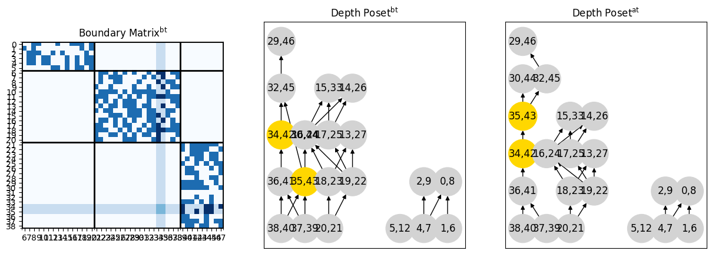

### Birth Death Pairs
|                          |                                                                                                                                                                                                               |
|:-------------------------|:--------------------------------------------------------------------------------------------------------------------------------------------------------------------------------------------------------------|
| Before the transposition | $\{(13, 27), (18, 23), (15, 33), (1, 6), (0, 8), (37, 39), (32, 45), (38, 40), (5, 12), (29, 46), (34, 42), (30, 44), (16, 24), (4, 7), (20, 21), (35, 43), (14, 26), (2, 9), (17, 25), (19, 22), (36, 41)\}$ |
| After the transposition  | $\{(13, 27), (18, 23), (15, 33), (1, 6), (0, 8), (37, 39), (32, 45), (38, 40), (5, 12), (29, 46), (34, 42), (30, 44), (16, 24), (4, 7), (20, 21), (35, 43), (14, 26), (2, 9), (17, 25), (19, 22), (36, 41)\}$ |

### Relations
|                          | Algorithm 1                                                                                                                                                                                                                                                                                                                                                                                                                                        | Algorithm 2                                                                                                                                                                                                                                                                                                                                                              |
|:-------------------------|:---------------------------------------------------------------------------------------------------------------------------------------------------------------------------------------------------------------------------------------------------------------------------------------------------------------------------------------------------------------------------------------------------------------------------------------------------|:-------------------------------------------------------------------------------------------------------------------------------------------------------------------------------------------------------------------------------------------------------------------------------------------------------------------------------------------------------------------------|
| Before the transposition | $\{(43, 46), (41, 46), (21, 22), (21, 28), (40, 44), (39, 42), (40, 41), (40, 47), (9, 11), (7, 10), (24, 26), (41, 42), (6, 8), (25, 31), (42, 47), (44, 47), (43, 45), (22, 25), (21, 27), (21, 33), (22, 28), (8, 11), (23, 27), (40, 43), (22, 31), (9, 10), (24, 28), (24, 31), (41, 47), (43, 44), (26, 28), (23, 26), (22, 24), (39, 46), (8, 10), (39, 43), (22, 33), (45, 47), (7, 11), (7, 8)\}$                                         | $\{(35, 30), (20, 11), (20, 14), (4, 3), (20, 17), (38, 35), (14, 10), (34, 28), (17, 15), (37, 30), (37, 36), (18, 10), (18, 16), (35, 32), (4, 2), (35, 29), (20, 19), (29, 28), (38, 34), (17, 14), (19, 14), (37, 29), (37, 35), (15, 10), (16, 15), (35, 28), (32, 29), (20, 18), (19, 10), (19, 16), (19, 13), (34, 32), (37, 34), (18, 11), (32, 28), (18, 14)\}$ |
| After the transposition  | $\{(42, 45), (43, 46), (41, 46), (21, 22), (21, 28), (40, 44), (39, 42), (40, 41), (40, 47), (9, 11), (7, 10), (24, 26), (41, 42), (6, 8), (25, 31), (42, 47), (42, 44), (44, 47), (43, 45), (22, 25), (21, 27), (21, 33), (22, 28), (8, 11), (23, 27), (40, 43), (22, 31), (9, 10), (24, 28), (42, 43), (24, 31), (41, 47), (43, 44), (42, 46), (26, 28), (23, 26), (22, 24), (39, 46), (8, 10), (39, 43), (22, 33), (45, 47), (7, 11), (7, 8)\}$ | $\{(35, 30), (20, 11), (20, 14), (4, 3), (20, 17), (38, 35), (14, 10), (34, 28), (17, 15), (37, 30), (37, 36), (18, 10), (18, 16), (35, 32), (4, 2), (35, 29), (20, 19), (29, 28), (38, 34), (17, 14), (19, 14), (37, 29), (37, 35), (15, 10), (16, 15), (35, 28), (32, 29), (20, 18), (19, 10), (19, 16), (34, 32), (19, 13), (37, 34), (18, 11), (32, 28), (18, 14)\}$ |

### Successors and Predecessers
No such node in the Depth Poset

### Temp Sets
|                                                               | Before the Transposition                                                                                                                                              | After the Transposition                                                                                                                                               |
|:--------------------------------------------------------------|:----------------------------------------------------------------------------------------------------------------------------------------------------------------------|:----------------------------------------------------------------------------------------------------------------------------------------------------------------------|
| $\mathcal{L} = \{(s, t)\in \text{BD}:\; f(t) < f(y)\}$        | $\{(13, 27), (37, 39), (18, 23), (5, 12), (34, 42), (15, 33), (14, 26), (2, 9), (38, 40), (20, 21), (17, 25), (19, 22), (16, 24), (1, 6), (36, 41), (4, 7), (0, 8)\}$ | $\{(13, 27), (37, 39), (18, 23), (5, 12), (34, 42), (15, 33), (14, 26), (2, 9), (38, 40), (20, 21), (17, 25), (19, 22), (16, 24), (1, 6), (36, 41), (4, 7), (0, 8)\}$ |
| $\mathcal{M} = \{(s, t)\in \text{BD}:\; f(y) < f(t) < f(b)\}$ | $\emptyset$                                                                                                                                                           | $\emptyset$                                                                                                                                                           |

### Equations
There are 2 equations are wrong.

| eq   | left (formula)                  | left (paramatrized)               | left (value)                       | right (formula)                                                                        | right (paramatrized)                                                                         | right (value)                                | correct   |
|:-----|:--------------------------------|:----------------------------------|:-----------------------------------|:---------------------------------------------------------------------------------------|:---------------------------------------------------------------------------------------------|:---------------------------------------------|:----------|
| Eq16 | $\text{Succ}_1^\text{at}(x, y)$ | $\text{Succ}_1^\text{at}(35, 43)$ | $\{(30, 44), (32, 45), (29, 46)\}$ | $\text{Succ}_1^\text{bt}(x, y) \oplus \{(a, b)\} \oplus \text{Succ}_1^\text{bt}(a, b)$ | $\text{Succ}_1^\text{bt}(35, 43) \oplus \{(34, 42)\} \oplus \text{Succ}_1^\text{bt}(34, 42)$ | $\{(30, 44), (32, 45), (29, 46), (34, 42)\}$ | ✘         |
| Eq17 | $\text{Pred}_1^\text{at}(a, b)$ | $\text{Pred}_1^\text{at}(34, 42)$ | $\{(36, 41), (37, 39)\}$           | $\text{Pred}_1^\text{bt}(a, b) \oplus \{(x, y)\}$                                      | $\text{Pred}_1^\text{bt}(34, 42) \oplus \{(35, 43)\}$                                        | $\{(35, 43), (37, 39), (36, 41)\}$           | ✘         |

## Transposition <36, 37> in complex 23
Here is a __birth-birth__ __switch forward__ transposition <36, 37>.

$$
a = 36, \; b = 41, \; x = 37, \; y = 39
$$

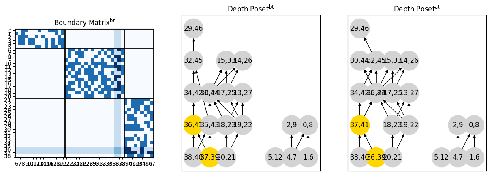

### Birth Death Pairs
|                          |                                                                                                                                                                                                               |
|:-------------------------|:--------------------------------------------------------------------------------------------------------------------------------------------------------------------------------------------------------------|
| Before the transposition | $\{(13, 27), (18, 23), (15, 33), (1, 6), (0, 8), (37, 39), (32, 45), (38, 40), (5, 12), (29, 46), (34, 42), (30, 44), (16, 24), (4, 7), (20, 21), (35, 43), (14, 26), (2, 9), (17, 25), (19, 22), (36, 41)\}$ |
| After the transposition  | $\{(13, 27), (18, 23), (15, 33), (1, 6), (0, 8), (32, 45), (38, 40), (5, 12), (29, 46), (34, 42), (36, 39), (37, 41), (30, 44), (16, 24), (4, 7), (20, 21), (35, 43), (14, 26), (2, 9), (17, 25), (19, 22)\}$ |

### Relations
|                          | Algorithm 1                                                                                                                                                                                                                                                                                                                                                                                                | Algorithm 2                                                                                                                                                                                                                                                                                                                                                                                                      |
|:-------------------------|:-----------------------------------------------------------------------------------------------------------------------------------------------------------------------------------------------------------------------------------------------------------------------------------------------------------------------------------------------------------------------------------------------------------|:-----------------------------------------------------------------------------------------------------------------------------------------------------------------------------------------------------------------------------------------------------------------------------------------------------------------------------------------------------------------------------------------------------------------|
| Before the transposition | $\{(43, 46), (41, 46), (21, 22), (21, 28), (40, 44), (39, 42), (40, 41), (40, 47), (9, 11), (7, 10), (24, 26), (41, 42), (6, 8), (25, 31), (42, 47), (44, 47), (43, 45), (22, 25), (21, 27), (21, 33), (22, 28), (8, 11), (23, 27), (40, 43), (22, 31), (9, 10), (24, 28), (24, 31), (41, 47), (43, 44), (26, 28), (23, 26), (22, 24), (39, 46), (8, 10), (39, 43), (22, 33), (45, 47), (7, 11), (7, 8)\}$ | $\{(35, 30), (20, 11), (20, 14), (4, 3), (20, 17), (38, 35), (14, 10), (34, 28), (17, 15), (37, 30), (37, 36), (18, 10), (18, 16), (35, 32), (4, 2), (35, 29), (20, 19), (29, 28), (38, 34), (17, 14), (19, 14), (37, 29), (37, 35), (15, 10), (16, 15), (35, 28), (32, 29), (20, 18), (19, 10), (19, 16), (19, 13), (34, 32), (37, 34), (18, 11), (32, 28), (18, 14)\}$                                         |
| After the transposition  | $\{(43, 46), (41, 46), (21, 22), (21, 28), (40, 44), (40, 41), (40, 47), (9, 11), (7, 10), (24, 26), (41, 42), (6, 8), (25, 31), (42, 47), (44, 47), (43, 45), (22, 25), (21, 27), (39, 41), (21, 33), (22, 28), (8, 11), (23, 27), (40, 43), (22, 31), (39, 47), (9, 10), (24, 28), (24, 31), (41, 47), (43, 44), (26, 28), (23, 26), (22, 24), (8, 10), (39, 43), (22, 33), (45, 47), (7, 11), (7, 8)\}$ | $\{(35, 30), (20, 11), (20, 14), (4, 3), (20, 17), (38, 35), (14, 10), (34, 28), (17, 15), (37, 30), (36, 37), (36, 34), (18, 10), (18, 16), (35, 32), (4, 2), (35, 29), (20, 19), (29, 28), (38, 34), (17, 14), (19, 14), (36, 30), (37, 29), (37, 35), (15, 10), (16, 15), (35, 28), (32, 29), (20, 18), (19, 10), (19, 16), (19, 13), (36, 29), (36, 35), (34, 32), (37, 34), (18, 11), (32, 28), (18, 14)\}$ |

### Successors and Predecessers
|                 | $\text{Set}^\text{bt}(36, 41)$                             | $\text{Set}^\text{bt}(37, 39)$                                                           | $\text{Set}^\text{at}(36, 39)$                                                           | $\text{Set}^\text{at}(37, 41)$                                                 |
|:----------------|:-----------------------------------------------------------|:-----------------------------------------------------------------------------------------|:-----------------------------------------------------------------------------------------|:-------------------------------------------------------------------------------|
| $\text{Succ}_1$ | $\text{Succ}_1^\text{bt}(36, 41) = \{(29, 46), (34, 42)\}$ | $\text{Succ}_1^\text{bt}(37, 39) = \{(35, 43), (29, 46), (34, 42)\}$                     | $\text{Succ}_1^\text{at}(36, 39) = \{(35, 43), (37, 41)\}$                               | $\text{Succ}_1^\text{at}(37, 41) = \{(29, 46), (34, 42)\}$                     |
| $\text{Pred}_1$ | $\text{Pred}_1^\text{bt}(36, 41) = \{(38, 40)\}$           | $\text{Pred}_1^\text{bt}(37, 39) = \emptyset$                                            | $\text{Pred}_1^\text{at}(36, 39) = \emptyset$                                            | $\text{Pred}_1^\text{at}(37, 41) = \{(38, 40), (36, 39)\}$                     |
| $\text{Succ}_2$ | $\text{Succ}_2^\text{bt}(36, 41) = \emptyset$              | $\text{Succ}_2^\text{bt}(37, 39) = \{(35, 43), (29, 46), (34, 42), (30, 44), (36, 41)\}$ | $\text{Succ}_2^\text{at}(36, 39) = \{(35, 43), (29, 46), (34, 42), (37, 41), (30, 44)\}$ | $\text{Succ}_2^\text{at}(37, 41) = \{(35, 43), (30, 44), (29, 46), (34, 42)\}$ |
| $\text{Pred}_2$ | $\text{Pred}_2^\text{bt}(36, 41) = \{(37, 39)\}$           | $\text{Pred}_2^\text{bt}(37, 39) = \emptyset$                                            | $\text{Pred}_2^\text{at}(36, 39) = \emptyset$                                            | $\text{Pred}_2^\text{at}(37, 41) = \{(36, 39)\}$                               |

### Temp Sets
|                                                               | Before the Transposition                                                                                                      | After the Transposition                                                                                                       |
|:--------------------------------------------------------------|:------------------------------------------------------------------------------------------------------------------------------|:------------------------------------------------------------------------------------------------------------------------------|
| $\mathcal{L} = \{(s, t)\in \text{BD}:\; f(t) < f(y)\}$        | $\{(13, 27), (18, 23), (5, 12), (15, 33), (14, 26), (2, 9), (17, 25), (19, 22), (16, 24), (1, 6), (0, 8), (4, 7), (20, 21)\}$ | $\{(13, 27), (18, 23), (5, 12), (15, 33), (14, 26), (2, 9), (17, 25), (19, 22), (16, 24), (1, 6), (0, 8), (4, 7), (20, 21)\}$ |
| $\mathcal{M} = \{(s, t)\in \text{BD}:\; f(y) < f(t) < f(b)\}$ | $\{(38, 40)\}$                                                                                                                | $\{(38, 40)\}$                                                                                                                |

### Equations
There are 1 equations are wrong.

| eq   | left (formula)                  | left (paramatrized)               | left (value)                                           | right (formula)                                                                                           | right (paramatrized)                                                                                            | right (value)                                          | correct   |
|:-----|:--------------------------------|:----------------------------------|:-------------------------------------------------------|:----------------------------------------------------------------------------------------------------------|:----------------------------------------------------------------------------------------------------------------|:-------------------------------------------------------|:----------|
| Eq08 | $\text{Succ}_1^\text{at}(a, y)$ | $\text{Succ}_1^\text{at}(36, 39)$ | $\{(35, 43), (37, 41)\}$                               | $\text{Succ}_1^\text{bt}(x, y) \oplus \{(x, b)\} \oplus \text{Succ}_1^\text{bt}(a, b)$                    | $\text{Succ}_1^\text{bt}(37, 39) \oplus \{(37, 41)\} \oplus \text{Succ}_1^\text{bt}(36, 41)$                    | $\{(35, 43), (37, 41)\}$                               | ✔         |
| Eq09 | $\text{Succ}_1^\text{at}(x, b)$ | $\text{Succ}_1^\text{at}(37, 41)$ | $\{(29, 46), (34, 42)\}$                               | $\text{Succ}_1^\text{bt}(a, b)$                                                                           | $\text{Succ}_1^\text{bt}(36, 41)$                                                                               | $\{(29, 46), (34, 42)\}$                               | ✔         |
| Eq10 | $\text{Pred}_1^\text{at}(a, y)$ | $\text{Pred}_1^\text{at}(36, 39)$ | $\emptyset$                                            | $\text{Pred}_1^\text{bt}(x, y)$                                                                           | $\text{Pred}_1^\text{bt}(37, 39)$                                                                               | $\emptyset$                                            | ✔         |
| Eq11 | $\text{Pred}_1^\text{at}(x, b)$ | $\text{Pred}_1^\text{at}(37, 41)$ | $\{(38, 40), (36, 39)\}$                               | $\text{Pred}_1^\text{bt}(a, b) \oplus \{(a, y)\}$                                                         | $\text{Pred}_1^\text{bt}(36, 41) \oplus \{(36, 39)\}$                                                           | $\{(36, 39), (38, 40)\}$                               | ✔         |
| Eq12 | $\text{Succ}_2^\text{at}(a, y)$ | $\text{Succ}_2^\text{at}(36, 39)$ | $\{(35, 43), (29, 46), (34, 42), (37, 41), (30, 44)\}$ | $\text{Succ}_2^\text{bt}(x, y) \oplus \{(x, b), (a, b)\}$                                                 | $\text{Succ}_2^\text{bt}(37, 39) \oplus \{(37, 41), (36, 41)\}$                                                 | $\{(35, 43), (29, 46), (34, 42), (37, 41), (30, 44)\}$ | ✔         |
| Eq13 | $\text{Succ}_2^\text{at}(x, b)$ | $\text{Succ}_2^\text{at}(37, 41)$ | $\{(35, 43), (30, 44), (29, 46), (34, 42)\}$           | $\text{Succ}_2^\text{bt}(a, b)$                                                                           | $\text{Succ}_2^\text{bt}(36, 41)$                                                                               | $\emptyset$                                            | ✘         |
| Eq14 | $\text{Pred}_2^\text{at}(a, y)$ | $\text{Pred}_2^\text{at}(36, 39)$ | $\emptyset$                                            | $[\text{Pred}_2^\text{bt}(a, b) \cap \mathcal{L}]$                                                        | $[\text{Pred}_2^\text{bt}(36, 41) \cap \mathcal{L}]$                                                            | $\emptyset$                                            | ✔         |
| Eq15 | $\text{Pred}_2^\text{at}(x, b)$ | $\text{Pred}_2^\text{at}(37, 41)$ | $\{(36, 39)\}$                                         | $\text{Pred}_2^\text{bt}(x, y) \oplus \{(a, y)\} \oplus [\text{Pred}_2^\text{bt}(a, b) \cap \mathcal{M}]$ | $\text{Pred}_2^\text{bt}(37, 39) \oplus \{(36, 39)\} \oplus [\text{Pred}_2^\text{bt}(36, 41) \cap \mathcal{M}]$ | $\{(36, 39)\}$                                         | ✔         |

## Transposition <37, 38> in complex 23
Here is a __birth-birth__ __no switch__ transposition <37, 38>.

$$
a = 37, \; b = 39, \; x = 38, \; y = 40
$$

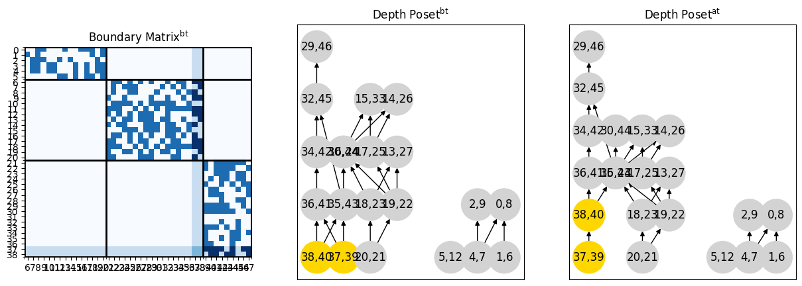

### Birth Death Pairs
|                          |                                                                                                                                                                                                               |
|:-------------------------|:--------------------------------------------------------------------------------------------------------------------------------------------------------------------------------------------------------------|
| Before the transposition | $\{(13, 27), (18, 23), (15, 33), (1, 6), (0, 8), (37, 39), (32, 45), (38, 40), (5, 12), (29, 46), (34, 42), (30, 44), (16, 24), (4, 7), (20, 21), (35, 43), (14, 26), (2, 9), (17, 25), (19, 22), (36, 41)\}$ |
| After the transposition  | $\{(13, 27), (18, 23), (15, 33), (1, 6), (0, 8), (37, 39), (32, 45), (38, 40), (5, 12), (29, 46), (34, 42), (30, 44), (16, 24), (4, 7), (20, 21), (35, 43), (14, 26), (2, 9), (17, 25), (19, 22), (36, 41)\}$ |

### Relations
|                          | Algorithm 1                                                                                                                                                                                                                                                                                                                                                                                                                              | Algorithm 2                                                                                                                                                                                                                                                                                                                                                              |
|:-------------------------|:-----------------------------------------------------------------------------------------------------------------------------------------------------------------------------------------------------------------------------------------------------------------------------------------------------------------------------------------------------------------------------------------------------------------------------------------|:-------------------------------------------------------------------------------------------------------------------------------------------------------------------------------------------------------------------------------------------------------------------------------------------------------------------------------------------------------------------------|
| Before the transposition | $\{(43, 46), (41, 46), (21, 22), (21, 28), (40, 44), (39, 42), (40, 41), (40, 47), (9, 11), (7, 10), (24, 26), (41, 42), (6, 8), (25, 31), (42, 47), (44, 47), (43, 45), (22, 25), (21, 27), (21, 33), (22, 28), (8, 11), (23, 27), (40, 43), (22, 31), (9, 10), (24, 28), (24, 31), (41, 47), (43, 44), (26, 28), (23, 26), (22, 24), (39, 46), (8, 10), (39, 43), (22, 33), (45, 47), (7, 11), (7, 8)\}$                               | $\{(35, 30), (20, 11), (20, 14), (4, 3), (20, 17), (38, 35), (14, 10), (34, 28), (17, 15), (37, 30), (37, 36), (18, 10), (18, 16), (35, 32), (4, 2), (35, 29), (20, 19), (29, 28), (38, 34), (17, 14), (19, 14), (37, 29), (37, 35), (15, 10), (16, 15), (35, 28), (32, 29), (20, 18), (19, 10), (19, 16), (19, 13), (34, 32), (37, 34), (18, 11), (32, 28), (18, 14)\}$ |
| After the transposition  | $\{(43, 46), (41, 46), (21, 22), (21, 28), (40, 44), (39, 42), (40, 41), (40, 47), (9, 11), (7, 10), (24, 26), (41, 42), (6, 8), (25, 31), (42, 47), (44, 47), (43, 45), (22, 25), (39, 41), (21, 27), (21, 33), (22, 28), (39, 44), (23, 27), (40, 43), (22, 31), (39, 47), (9, 10), (8, 11), (24, 28), (24, 31), (41, 47), (43, 44), (26, 28), (23, 26), (22, 24), (39, 40), (39, 46), (8, 10), (22, 33), (45, 47), (7, 11), (7, 8)\}$ | $\{(35, 30), (20, 11), (20, 14), (4, 3), (20, 17), (38, 35), (14, 10), (34, 28), (17, 15), (37, 30), (37, 36), (18, 10), (18, 16), (35, 32), (4, 2), (35, 29), (20, 19), (29, 28), (38, 34), (17, 14), (19, 14), (37, 29), (37, 35), (15, 10), (16, 15), (35, 28), (32, 29), (20, 18), (19, 10), (19, 16), (19, 13), (34, 32), (37, 34), (18, 11), (32, 28), (18, 14)\}$ |

### Successors and Predecessers
No such node in the Depth Poset

### Temp Sets
|                                                               | Before the Transposition                                                                                                                | After the Transposition                                                                                                                 |
|:--------------------------------------------------------------|:----------------------------------------------------------------------------------------------------------------------------------------|:----------------------------------------------------------------------------------------------------------------------------------------|
| $\mathcal{L} = \{(s, t)\in \text{BD}:\; f(t) < f(y)\}$        | $\{(13, 27), (37, 39), (18, 23), (5, 12), (15, 33), (14, 26), (2, 9), (17, 25), (19, 22), (16, 24), (1, 6), (0, 8), (4, 7), (20, 21)\}$ | $\{(13, 27), (37, 39), (18, 23), (5, 12), (15, 33), (14, 26), (2, 9), (17, 25), (19, 22), (16, 24), (1, 6), (0, 8), (4, 7), (20, 21)\}$ |
| $\mathcal{M} = \{(s, t)\in \text{BD}:\; f(y) < f(t) < f(b)\}$ | $\emptyset$                                                                                                                             | $\emptyset$                                                                                                                             |

### Equations
There are 2 equations are wrong.

| eq   | left (formula)                  | left (paramatrized)               | left (value)                       | right (formula)                                                                        | right (paramatrized)                                                                         | right (value)                                          | correct   |
|:-----|:--------------------------------|:----------------------------------|:-----------------------------------|:---------------------------------------------------------------------------------------|:---------------------------------------------------------------------------------------------|:-------------------------------------------------------|:----------|
| Eq16 | $\text{Succ}_1^\text{at}(x, y)$ | $\text{Succ}_1^\text{at}(38, 40)$ | $\{(36, 41), (30, 44), (35, 43)\}$ | $\text{Succ}_1^\text{bt}(x, y) \oplus \{(a, b)\} \oplus \text{Succ}_1^\text{bt}(a, b)$ | $\text{Succ}_1^\text{bt}(38, 40) \oplus \{(37, 39)\} \oplus \text{Succ}_1^\text{bt}(37, 39)$ | $\{(37, 39), (29, 46), (34, 42), (30, 44), (36, 41)\}$ | ✘         |
| Eq17 | $\text{Pred}_1^\text{at}(a, b)$ | $\text{Pred}_1^\text{at}(37, 39)$ | $\emptyset$                        | $\text{Pred}_1^\text{bt}(a, b) \oplus \{(x, y)\}$                                      | $\text{Pred}_1^\text{bt}(37, 39) \oplus \{(38, 40)\}$                                        | $\{(38, 40)\}$                                         | ✘         |

## Transposition <39, 40> in complex 23
Here is a __death-death__ __no switch__ transposition <39, 40>.

$$
a = 38, \; b = 40, \; x = 37, \; y = 39
$$

### Birth Death Pairs
|                          |                                                                                                                                                                                                               |
|:-------------------------|:--------------------------------------------------------------------------------------------------------------------------------------------------------------------------------------------------------------|
| Before the transposition | $\{(13, 27), (18, 23), (15, 33), (1, 6), (0, 8), (37, 39), (32, 45), (38, 40), (5, 12), (29, 46), (34, 42), (30, 44), (16, 24), (4, 7), (20, 21), (35, 43), (14, 26), (2, 9), (17, 25), (19, 22), (36, 41)\}$ |
| After the transposition  | $\{(13, 27), (18, 23), (15, 33), (1, 6), (0, 8), (37, 39), (32, 45), (38, 40), (5, 12), (29, 46), (34, 42), (30, 44), (16, 24), (4, 7), (20, 21), (35, 43), (14, 26), (2, 9), (17, 25), (19, 22), (36, 41)\}$ |

### Relations
|                          | Algorithm 1                                                                                                                                                                                                                                                                                                                                                                                                | Algorithm 2                                                                                                                                                                                                                                                                                                                                                                                  |
|:-------------------------|:-----------------------------------------------------------------------------------------------------------------------------------------------------------------------------------------------------------------------------------------------------------------------------------------------------------------------------------------------------------------------------------------------------------|:---------------------------------------------------------------------------------------------------------------------------------------------------------------------------------------------------------------------------------------------------------------------------------------------------------------------------------------------------------------------------------------------|
| Before the transposition | $\{(43, 46), (41, 46), (21, 22), (21, 28), (40, 44), (39, 42), (40, 41), (40, 47), (9, 11), (7, 10), (24, 26), (41, 42), (6, 8), (25, 31), (42, 47), (44, 47), (43, 45), (22, 25), (21, 27), (21, 33), (22, 28), (8, 11), (23, 27), (40, 43), (22, 31), (9, 10), (24, 28), (24, 31), (41, 47), (43, 44), (26, 28), (23, 26), (22, 24), (39, 46), (8, 10), (39, 43), (22, 33), (45, 47), (7, 11), (7, 8)\}$ | $\{(35, 30), (20, 11), (20, 14), (4, 3), (20, 17), (38, 35), (14, 10), (34, 28), (17, 15), (37, 30), (37, 36), (18, 10), (18, 16), (35, 32), (4, 2), (35, 29), (20, 19), (29, 28), (38, 34), (17, 14), (19, 14), (37, 29), (37, 35), (15, 10), (16, 15), (35, 28), (32, 29), (20, 18), (19, 10), (19, 16), (19, 13), (34, 32), (37, 34), (18, 11), (32, 28), (18, 14)\}$                     |
| After the transposition  | $\{(43, 46), (41, 46), (21, 22), (21, 28), (40, 44), (39, 42), (40, 41), (40, 47), (9, 11), (7, 10), (24, 26), (41, 42), (6, 8), (25, 31), (42, 47), (44, 47), (43, 45), (22, 25), (21, 27), (21, 33), (22, 28), (8, 11), (23, 27), (9, 10), (22, 31), (40, 43), (24, 28), (24, 31), (41, 47), (43, 44), (26, 28), (23, 26), (22, 24), (39, 46), (8, 10), (39, 43), (22, 33), (45, 47), (7, 11), (7, 8)\}$ | $\{(35, 30), (20, 11), (20, 14), (4, 3), (38, 29), (20, 17), (14, 10), (34, 28), (17, 15), (37, 30), (37, 36), (18, 10), (18, 16), (35, 32), (4, 2), (35, 29), (20, 19), (38, 37), (29, 28), (17, 14), (19, 14), (37, 29), (37, 35), (15, 10), (16, 15), (35, 28), (32, 29), (38, 30), (20, 18), (38, 36), (19, 10), (19, 16), (19, 13), (34, 32), (37, 34), (18, 11), (32, 28), (18, 14)\}$ |

### Successors and Predecessers
No such node in the Depth Poset

### Temp Sets
|                                                               | Before the Transposition   | After the Transposition   |
|:--------------------------------------------------------------|:---------------------------|:--------------------------|
| $\mathcal{B} = \{(s, t)\in \text{BD}:\; f(s) > f(x)\}$        | $\{(38, 40)\}$             | $\{(38, 40)\}$            |
| $\mathcal{N} = \{(s, t)\in \text{BD}:\; f(x) > f(s) > f(a)\}$ | $\emptyset$                | $\emptyset$               |

### Equations
There are 2 equations are wrong.

| eq   | left (formula)                  | left (paramatrized)               | left (value)                                           | right (formula)                                                                        | right (paramatrized)                                                                         | right (value)                                | correct   |
|:-----|:--------------------------------|:----------------------------------|:-------------------------------------------------------|:---------------------------------------------------------------------------------------|:---------------------------------------------------------------------------------------------|:---------------------------------------------|:----------|
| Eq36 | $\text{Succ}_2^\text{at}(x, y)$ | $\text{Succ}_2^\text{at}(37, 39)$ | $\{(35, 43), (29, 46), (34, 42), (30, 44), (36, 41)\}$ | $\text{Succ}_2^\text{bt}(x, y) \oplus \{(a, b)\} \oplus \text{Succ}_2^\text{bt}(a, b)$ | $\text{Succ}_2^\text{bt}(37, 39) \oplus \{(38, 40)\} \oplus \text{Succ}_2^\text{bt}(38, 40)$ | $\{(29, 46), (38, 40), (30, 44), (36, 41)\}$ | ✘         |
| Eq37 | $\text{Pred}_2^\text{at}(a, b)$ | $\text{Pred}_2^\text{at}(38, 40)$ | $\emptyset$                                            | $\text{Pred}_2^\text{bt}(a, b) \oplus \{(x, y)\}$                                      | $\text{Pred}_2^\text{bt}(38, 40) \oplus \{(37, 39)\}$                                        | $\{(37, 39)\}$                               | ✘         |

## Transposition <40, 41> in complex 23
Here is a __death-death__ __switch forward__ transposition <40, 41>.

$$
a = 36, \; b = 41, \; x = 38, \; y = 40
$$

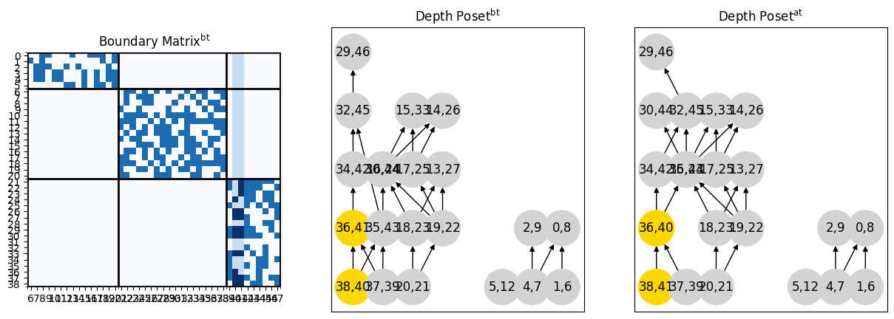

### Birth Death Pairs
|                          |                                                                                                                                                                                                               |
|:-------------------------|:--------------------------------------------------------------------------------------------------------------------------------------------------------------------------------------------------------------|
| Before the transposition | $\{(13, 27), (18, 23), (15, 33), (1, 6), (0, 8), (37, 39), (32, 45), (38, 40), (5, 12), (29, 46), (34, 42), (30, 44), (16, 24), (4, 7), (20, 21), (35, 43), (14, 26), (2, 9), (17, 25), (19, 22), (36, 41)\}$ |
| After the transposition  | $\{(13, 27), (18, 23), (15, 33), (38, 41), (1, 6), (0, 8), (36, 40), (37, 39), (32, 45), (5, 12), (29, 46), (34, 42), (30, 44), (16, 24), (4, 7), (20, 21), (35, 43), (14, 26), (2, 9), (17, 25), (19, 22)\}$ |

### Relations
|                          | Algorithm 1                                                                                                                                                                                                                                                                                                                                                                                                          | Algorithm 2                                                                                                                                                                                                                                                                                                                                                                        |
|:-------------------------|:---------------------------------------------------------------------------------------------------------------------------------------------------------------------------------------------------------------------------------------------------------------------------------------------------------------------------------------------------------------------------------------------------------------------|:-----------------------------------------------------------------------------------------------------------------------------------------------------------------------------------------------------------------------------------------------------------------------------------------------------------------------------------------------------------------------------------|
| Before the transposition | $\{(43, 46), (41, 46), (21, 22), (21, 28), (40, 44), (39, 42), (40, 41), (40, 47), (9, 11), (7, 10), (24, 26), (41, 42), (6, 8), (25, 31), (42, 47), (44, 47), (43, 45), (22, 25), (21, 27), (21, 33), (22, 28), (8, 11), (23, 27), (40, 43), (22, 31), (9, 10), (24, 28), (24, 31), (41, 47), (43, 44), (26, 28), (23, 26), (22, 24), (39, 46), (8, 10), (39, 43), (22, 33), (45, 47), (7, 11), (7, 8)\}$           | $\{(35, 30), (20, 11), (20, 14), (4, 3), (20, 17), (38, 35), (14, 10), (34, 28), (17, 15), (37, 30), (37, 36), (18, 10), (18, 16), (35, 32), (4, 2), (35, 29), (20, 19), (29, 28), (38, 34), (17, 14), (19, 14), (37, 29), (37, 35), (15, 10), (16, 15), (35, 28), (32, 29), (20, 18), (19, 10), (19, 16), (19, 13), (34, 32), (37, 34), (18, 11), (32, 28), (18, 14)\}$           |
| After the transposition  | $\{(41, 40), (41, 43), (43, 46), (21, 22), (21, 28), (40, 44), (39, 42), (9, 11), (7, 10), (24, 26), (6, 8), (25, 31), (42, 47), (44, 47), (43, 45), (22, 25), (21, 27), (21, 33), (22, 28), (8, 11), (23, 27), (40, 43), (22, 31), (9, 10), (40, 46), (24, 28), (41, 44), (24, 31), (41, 47), (26, 28), (43, 44), (23, 26), (40, 42), (22, 24), (39, 46), (8, 10), (39, 43), (22, 33), (45, 47), (7, 11), (7, 8)\}$ | $\{(35, 30), (20, 11), (20, 14), (4, 3), (20, 17), (38, 35), (14, 10), (34, 28), (17, 15), (37, 30), (37, 36), (18, 10), (18, 16), (35, 32), (4, 2), (35, 29), (20, 19), (29, 28), (38, 34), (17, 14), (19, 14), (37, 29), (37, 35), (15, 10), (16, 15), (35, 28), (32, 29), (20, 18), (38, 36), (19, 10), (19, 16), (19, 13), (34, 32), (37, 34), (18, 11), (32, 28), (18, 14)\}$ |

### Successors and Predecessers
|                 | $\text{Set}^\text{bt}(36, 41)$                             | $\text{Set}^\text{bt}(38, 40)$                                       | $\text{Set}^\text{at}(38, 41)$                                       | $\text{Set}^\text{at}(36, 40)$                                                 |
|:----------------|:-----------------------------------------------------------|:---------------------------------------------------------------------|:---------------------------------------------------------------------|:-------------------------------------------------------------------------------|
| $\text{Succ}_1$ | $\text{Succ}_1^\text{bt}(36, 41) = \{(29, 46), (34, 42)\}$ | $\text{Succ}_1^\text{bt}(38, 40) = \{(36, 41), (30, 44), (35, 43)\}$ | $\text{Succ}_1^\text{at}(38, 41) = \{(36, 40), (35, 43), (30, 44)\}$ | $\text{Succ}_1^\text{at}(36, 40) = \{(35, 43), (30, 44), (29, 46), (34, 42)\}$ |
| $\text{Pred}_1$ | $\text{Pred}_1^\text{bt}(36, 41) = \{(38, 40)\}$           | $\text{Pred}_1^\text{bt}(38, 40) = \emptyset$                        | $\text{Pred}_1^\text{at}(38, 41) = \emptyset$                        | $\text{Pred}_1^\text{at}(36, 40) = \{(38, 41)\}$                               |
| $\text{Succ}_2$ | $\text{Succ}_2^\text{bt}(36, 41) = \emptyset$              | $\text{Succ}_2^\text{bt}(38, 40) = \{(35, 43), (34, 42)\}$           | $\text{Succ}_2^\text{at}(38, 41) = \{(36, 40), (35, 43), (34, 42)\}$ | $\text{Succ}_2^\text{at}(36, 40) = \emptyset$                                  |
| $\text{Pred}_2$ | $\text{Pred}_2^\text{bt}(36, 41) = \{(37, 39)\}$           | $\text{Pred}_2^\text{bt}(38, 40) = \emptyset$                        | $\text{Pred}_2^\text{at}(38, 41) = \emptyset$                        | $\text{Pred}_2^\text{at}(36, 40) = \{(38, 41), (37, 39)\}$                     |

### Temp Sets
|                                                               | Before the Transposition   | After the Transposition   |
|:--------------------------------------------------------------|:---------------------------|:--------------------------|
| $\mathcal{B} = \{(s, t)\in \text{BD}:\; f(s) > f(x)\}$        | $\emptyset$                | $\emptyset$               |
| $\mathcal{N} = \{(s, t)\in \text{BD}:\; f(x) > f(s) > f(a)\}$ | $\{(37, 39)\}$             | $\{(37, 39)\}$            |

### Equations
There are 1 equations are wrong.

| eq   | left (formula)                  | left (paramatrized)               | left (value)                                 | right (formula)                                                                                          | right (paramatrized)                                                                                           | right (value)                      | correct   |
|:-----|:--------------------------------|:----------------------------------|:---------------------------------------------|:---------------------------------------------------------------------------------------------------------|:---------------------------------------------------------------------------------------------------------------|:-----------------------------------|:----------|
| Eq28 | $\text{Succ}_1^\text{at}(x, b)$ | $\text{Succ}_1^\text{at}(38, 41)$ | $\{(36, 40), (35, 43), (30, 44)\}$           | $\text{Succ}_1^\text{bt}(x, y) \oplus \{(a, y), (a, b)\}$                                                | $\text{Succ}_1^\text{bt}(38, 40) \oplus \{(36, 40), (36, 41)\}$                                                | $\{(36, 40), (35, 43), (30, 44)\}$ | ✔         |
| Eq29 | $\text{Succ}_1^\text{at}(a, y)$ | $\text{Succ}_1^\text{at}(36, 40)$ | $\{(35, 43), (30, 44), (29, 46), (34, 42)\}$ | $\text{Succ}_1^\text{bt}(a, b)$                                                                          | $\text{Succ}_1^\text{bt}(36, 41)$                                                                              | $\{(29, 46), (34, 42)\}$           | ✘         |
| Eq30 | $\text{Pred}_1^\text{at}(x, b)$ | $\text{Pred}_1^\text{at}(38, 41)$ | $\emptyset$                                  | $[\text{Pred}_1^\text{bt}(a, b) \cap \mathcal{B}]$                                                       | $[\text{Pred}_1^\text{bt}(36, 41) \cap \mathcal{B}]$                                                           | $\emptyset$                        | ✔         |
| Eq31 | $\text{Pred}_1^\text{at}(a, y)$ | $\text{Pred}_1^\text{at}(36, 40)$ | $\{(38, 41)\}$                               | $\text{Pred}_1^\text{bt}(x, y) \oplus \{(x, b)\} \oplus[\text{Pred}_1^\text{bt}(a, b) \cap \mathcal{N}]$ | $\text{Pred}_1^\text{bt}(38, 40) \oplus \{(38, 41)\} \oplus[\text{Pred}_1^\text{bt}(36, 41) \cap \mathcal{N}]$ | $\{(38, 41)\}$                     | ✔         |
| Eq32 | $\text{Succ}_2^\text{at}(x, b)$ | $\text{Succ}_2^\text{at}(38, 41)$ | $\{(36, 40), (35, 43), (34, 42)\}$           | $\text{Succ}_2^\text{bt}(x, y) \oplus \{(a, y)\} \oplus \text{Succ}_2^\text{bt}(a, b)$                   | $\text{Succ}_2^\text{bt}(38, 40) \oplus \{(36, 40)\} \oplus \text{Succ}_2^\text{bt}(36, 41)$                   | $\{(36, 40), (35, 43), (34, 42)\}$ | ✔         |
| Eq33 | $\text{Succ}_2^\text{at}(a, y)$ | $\text{Succ}_2^\text{at}(36, 40)$ | $\emptyset$                                  | $\text{Succ}_2^\text{bt}(a, b)$                                                                          | $\text{Succ}_2^\text{bt}(36, 41)$                                                                              | $\emptyset$                        | ✔         |
| Eq34 | $\text{Pred}_2^\text{at}(x, b)$ | $\text{Pred}_2^\text{at}(38, 41)$ | $\emptyset$                                  | $\text{Pred}_2^\text{bt}(x, y)$                                                                          | $\text{Pred}_2^\text{bt}(38, 40)$                                                                              | $\emptyset$                        | ✔         |
| Eq35 | $\text{Pred}_2^\text{at}(a, y)$ | $\text{Pred}_2^\text{at}(36, 40)$ | $\{(38, 41), (37, 39)\}$                     | $\text{Pred}_2^\text{bt}(a, b) \oplus \{(x, b)\}$                                                        | $\text{Pred}_2^\text{bt}(36, 41) \oplus \{(38, 41)\}$                                                          | $\{(38, 41), (37, 39)\}$           | ✔         |

## Transposition <41, 42> in complex 23
Here is a __death-death__ __switch forward__ transposition <41, 42>.

$$
a = 34, \; b = 42, \; x = 36, \; y = 41
$$

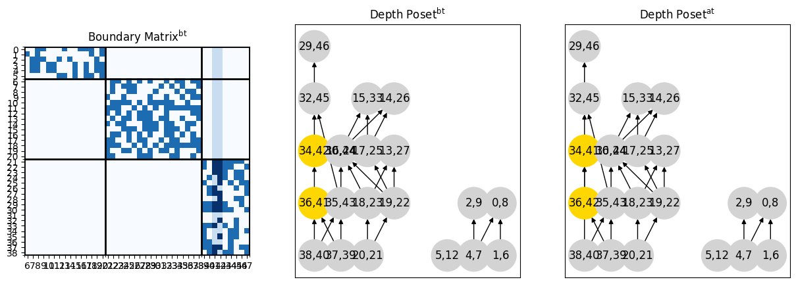

### Birth Death Pairs
|                          |                                                                                                                                                                                                               |
|:-------------------------|:--------------------------------------------------------------------------------------------------------------------------------------------------------------------------------------------------------------|
| Before the transposition | $\{(13, 27), (18, 23), (15, 33), (1, 6), (0, 8), (37, 39), (32, 45), (38, 40), (5, 12), (29, 46), (34, 42), (30, 44), (16, 24), (4, 7), (20, 21), (35, 43), (14, 26), (2, 9), (17, 25), (19, 22), (36, 41)\}$ |
| After the transposition  | $\{(13, 27), (18, 23), (15, 33), (1, 6), (0, 8), (37, 39), (32, 45), (38, 40), (5, 12), (29, 46), (36, 42), (30, 44), (16, 24), (4, 7), (20, 21), (35, 43), (14, 26), (2, 9), (17, 25), (34, 41), (19, 22)\}$ |

### Relations
|                          | Algorithm 1                                                                                                                                                                                                                                                                                                                                                                                                | Algorithm 2                                                                                                                                                                                                                                                                                                                                                                                            |
|:-------------------------|:-----------------------------------------------------------------------------------------------------------------------------------------------------------------------------------------------------------------------------------------------------------------------------------------------------------------------------------------------------------------------------------------------------------|:-------------------------------------------------------------------------------------------------------------------------------------------------------------------------------------------------------------------------------------------------------------------------------------------------------------------------------------------------------------------------------------------------------|
| Before the transposition | $\{(43, 46), (41, 46), (21, 22), (21, 28), (40, 44), (39, 42), (40, 41), (40, 47), (9, 11), (7, 10), (24, 26), (41, 42), (6, 8), (25, 31), (42, 47), (44, 47), (43, 45), (22, 25), (21, 27), (21, 33), (22, 28), (8, 11), (23, 27), (40, 43), (22, 31), (9, 10), (24, 28), (24, 31), (41, 47), (43, 44), (26, 28), (23, 26), (22, 24), (39, 46), (8, 10), (39, 43), (22, 33), (45, 47), (7, 11), (7, 8)\}$ | $\{(35, 30), (20, 11), (20, 14), (4, 3), (20, 17), (38, 35), (14, 10), (34, 28), (17, 15), (37, 30), (37, 36), (18, 10), (18, 16), (35, 32), (4, 2), (35, 29), (20, 19), (29, 28), (38, 34), (17, 14), (19, 14), (37, 29), (37, 35), (15, 10), (16, 15), (35, 28), (32, 29), (20, 18), (19, 10), (19, 16), (19, 13), (34, 32), (37, 34), (18, 11), (32, 28), (18, 14)\}$                               |
| After the transposition  | $\{(43, 46), (41, 46), (21, 22), (21, 28), (40, 44), (39, 42), (40, 41), (40, 47), (9, 11), (7, 10), (24, 26), (6, 8), (42, 41), (25, 31), (42, 47), (44, 47), (43, 45), (22, 25), (21, 27), (21, 33), (22, 28), (8, 11), (23, 27), (40, 43), (22, 31), (9, 10), (24, 28), (24, 31), (26, 28), (43, 44), (42, 46), (23, 26), (22, 24), (39, 46), (8, 10), (39, 43), (22, 33), (45, 47), (7, 11), (7, 8)\}$ | $\{(35, 30), (20, 11), (20, 14), (4, 3), (20, 17), (38, 35), (14, 10), (34, 28), (17, 15), (37, 30), (36, 28), (37, 36), (36, 34), (18, 10), (18, 16), (35, 32), (4, 2), (35, 29), (20, 19), (29, 28), (38, 34), (17, 14), (19, 14), (37, 29), (37, 35), (15, 10), (16, 15), (35, 28), (32, 29), (20, 18), (19, 10), (19, 16), (36, 32), (19, 13), (34, 32), (37, 34), (18, 11), (32, 28), (18, 14)\}$ |

### Successors and Predecessers
|                 | $\text{Set}^\text{bt}(34, 42)$                             | $\text{Set}^\text{bt}(36, 41)$                             | $\text{Set}^\text{at}(36, 42)$                             | $\text{Set}^\text{at}(34, 41)$                                       |
|:----------------|:-----------------------------------------------------------|:-----------------------------------------------------------|:-----------------------------------------------------------|:---------------------------------------------------------------------|
| $\text{Succ}_1$ | $\text{Succ}_1^\text{bt}(34, 42) = \emptyset$              | $\text{Succ}_1^\text{bt}(36, 41) = \{(29, 46), (34, 42)\}$ | $\text{Succ}_1^\text{at}(36, 42) = \{(34, 41), (29, 46)\}$ | $\text{Succ}_1^\text{at}(34, 41) = \{(29, 46)\}$                     |
| $\text{Pred}_1$ | $\text{Pred}_1^\text{bt}(34, 42) = \{(36, 41), (37, 39)\}$ | $\text{Pred}_1^\text{bt}(36, 41) = \{(38, 40)\}$           | $\text{Pred}_1^\text{at}(36, 42) = \{(37, 39)\}$           | $\text{Pred}_1^\text{at}(34, 41) = \{(38, 40), (36, 42)\}$           |
| $\text{Succ}_2$ | $\text{Succ}_2^\text{bt}(34, 42) = \{(32, 45)\}$           | $\text{Succ}_2^\text{bt}(36, 41) = \emptyset$              | $\text{Succ}_2^\text{at}(36, 42) = \{(32, 45), (34, 41)\}$ | $\text{Succ}_2^\text{at}(34, 41) = \{(32, 45)\}$                     |
| $\text{Pred}_2$ | $\text{Pred}_2^\text{bt}(34, 42) = \{(38, 40), (37, 39)\}$ | $\text{Pred}_2^\text{bt}(36, 41) = \{(37, 39)\}$           | $\text{Pred}_2^\text{at}(36, 42) = \{(37, 39)\}$           | $\text{Pred}_2^\text{at}(34, 41) = \{(38, 40), (37, 39), (36, 42)\}$ |

### Temp Sets
|                                                               | Before the Transposition   | After the Transposition   |
|:--------------------------------------------------------------|:---------------------------|:--------------------------|
| $\mathcal{B} = \{(s, t)\in \text{BD}:\; f(s) > f(x)\}$        | $\{(38, 40), (37, 39)\}$   | $\{(38, 40), (37, 39)\}$  |
| $\mathcal{N} = \{(s, t)\in \text{BD}:\; f(x) > f(s) > f(a)\}$ | $\{(35, 43)\}$             | $\{(35, 43)\}$            |

### Equations
There are 1 equations are wrong.

| eq   | left (formula)                  | left (paramatrized)               | left (value)                       | right (formula)                                                                                          | right (paramatrized)                                                                                           | right (value)                      | correct   |
|:-----|:--------------------------------|:----------------------------------|:-----------------------------------|:---------------------------------------------------------------------------------------------------------|:---------------------------------------------------------------------------------------------------------------|:-----------------------------------|:----------|
| Eq28 | $\text{Succ}_1^\text{at}(x, b)$ | $\text{Succ}_1^\text{at}(36, 42)$ | $\{(34, 41), (29, 46)\}$           | $\text{Succ}_1^\text{bt}(x, y) \oplus \{(a, y), (a, b)\}$                                                | $\text{Succ}_1^\text{bt}(36, 41) \oplus \{(34, 41), (34, 42)\}$                                                | $\{(34, 41), (29, 46)\}$           | ✔         |
| Eq29 | $\text{Succ}_1^\text{at}(a, y)$ | $\text{Succ}_1^\text{at}(34, 41)$ | $\{(29, 46)\}$                     | $\text{Succ}_1^\text{bt}(a, b)$                                                                          | $\text{Succ}_1^\text{bt}(34, 42)$                                                                              | $\emptyset$                        | ✘         |
| Eq30 | $\text{Pred}_1^\text{at}(x, b)$ | $\text{Pred}_1^\text{at}(36, 42)$ | $\{(37, 39)\}$                     | $[\text{Pred}_1^\text{bt}(a, b) \cap \mathcal{B}]$                                                       | $[\text{Pred}_1^\text{bt}(34, 42) \cap \mathcal{B}]$                                                           | $\{(37, 39)\}$                     | ✔         |
| Eq31 | $\text{Pred}_1^\text{at}(a, y)$ | $\text{Pred}_1^\text{at}(34, 41)$ | $\{(38, 40), (36, 42)\}$           | $\text{Pred}_1^\text{bt}(x, y) \oplus \{(x, b)\} \oplus[\text{Pred}_1^\text{bt}(a, b) \cap \mathcal{N}]$ | $\text{Pred}_1^\text{bt}(36, 41) \oplus \{(36, 42)\} \oplus[\text{Pred}_1^\text{bt}(34, 42) \cap \mathcal{N}]$ | $\{(38, 40), (36, 42)\}$           | ✔         |
| Eq32 | $\text{Succ}_2^\text{at}(x, b)$ | $\text{Succ}_2^\text{at}(36, 42)$ | $\{(32, 45), (34, 41)\}$           | $\text{Succ}_2^\text{bt}(x, y) \oplus \{(a, y)\} \oplus \text{Succ}_2^\text{bt}(a, b)$                   | $\text{Succ}_2^\text{bt}(36, 41) \oplus \{(34, 41)\} \oplus \text{Succ}_2^\text{bt}(34, 42)$                   | $\{(32, 45), (34, 41)\}$           | ✔         |
| Eq33 | $\text{Succ}_2^\text{at}(a, y)$ | $\text{Succ}_2^\text{at}(34, 41)$ | $\{(32, 45)\}$                     | $\text{Succ}_2^\text{bt}(a, b)$                                                                          | $\text{Succ}_2^\text{bt}(34, 42)$                                                                              | $\{(32, 45)\}$                     | ✔         |
| Eq34 | $\text{Pred}_2^\text{at}(x, b)$ | $\text{Pred}_2^\text{at}(36, 42)$ | $\{(37, 39)\}$                     | $\text{Pred}_2^\text{bt}(x, y)$                                                                          | $\text{Pred}_2^\text{bt}(36, 41)$                                                                              | $\{(37, 39)\}$                     | ✔         |
| Eq35 | $\text{Pred}_2^\text{at}(a, y)$ | $\text{Pred}_2^\text{at}(34, 41)$ | $\{(38, 40), (37, 39), (36, 42)\}$ | $\text{Pred}_2^\text{bt}(a, b) \oplus \{(x, b)\}$                                                        | $\text{Pred}_2^\text{bt}(34, 42) \oplus \{(36, 42)\}$                                                          | $\{(38, 40), (37, 39), (36, 42)\}$ | ✔         |

## Transposition <42, 43> in complex 23
Here is a __death-death__ __no switch__ transposition <42, 43>.

$$
a = 35, \; b = 43, \; x = 34, \; y = 42
$$

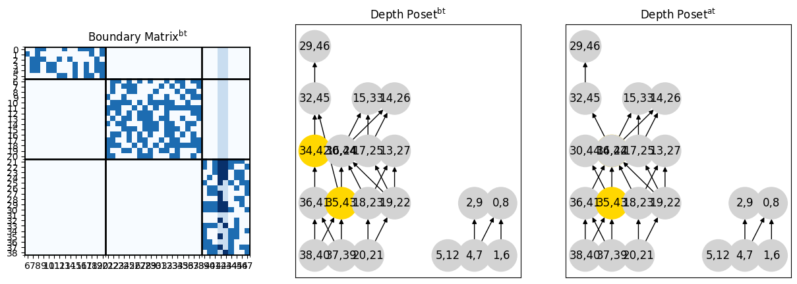

### Birth Death Pairs
|                          |                                                                                                                                                                                                               |
|:-------------------------|:--------------------------------------------------------------------------------------------------------------------------------------------------------------------------------------------------------------|
| Before the transposition | $\{(13, 27), (18, 23), (15, 33), (1, 6), (0, 8), (37, 39), (32, 45), (38, 40), (5, 12), (29, 46), (34, 42), (30, 44), (16, 24), (4, 7), (20, 21), (35, 43), (14, 26), (2, 9), (17, 25), (19, 22), (36, 41)\}$ |
| After the transposition  | $\{(13, 27), (18, 23), (15, 33), (1, 6), (0, 8), (37, 39), (32, 45), (38, 40), (5, 12), (29, 46), (34, 42), (30, 44), (16, 24), (4, 7), (20, 21), (35, 43), (14, 26), (2, 9), (17, 25), (19, 22), (36, 41)\}$ |

### Relations
|                          | Algorithm 1                                                                                                                                                                                                                                                                                                                                                                                                | Algorithm 2                                                                                                                                                                                                                                                                                                                                                              |
|:-------------------------|:-----------------------------------------------------------------------------------------------------------------------------------------------------------------------------------------------------------------------------------------------------------------------------------------------------------------------------------------------------------------------------------------------------------|:-------------------------------------------------------------------------------------------------------------------------------------------------------------------------------------------------------------------------------------------------------------------------------------------------------------------------------------------------------------------------|
| Before the transposition | $\{(43, 46), (41, 46), (21, 22), (21, 28), (40, 44), (39, 42), (40, 41), (40, 47), (9, 11), (7, 10), (24, 26), (41, 42), (6, 8), (25, 31), (42, 47), (44, 47), (43, 45), (22, 25), (21, 27), (21, 33), (22, 28), (8, 11), (23, 27), (40, 43), (22, 31), (9, 10), (24, 28), (24, 31), (41, 47), (43, 44), (26, 28), (23, 26), (22, 24), (39, 46), (8, 10), (39, 43), (22, 33), (45, 47), (7, 11), (7, 8)\}$ | $\{(35, 30), (20, 11), (20, 14), (4, 3), (20, 17), (38, 35), (14, 10), (34, 28), (17, 15), (37, 30), (37, 36), (18, 10), (18, 16), (35, 32), (4, 2), (35, 29), (20, 19), (29, 28), (38, 34), (17, 14), (19, 14), (37, 29), (37, 35), (15, 10), (16, 15), (35, 28), (32, 29), (20, 18), (19, 10), (19, 16), (19, 13), (34, 32), (37, 34), (18, 11), (32, 28), (18, 14)\}$ |
| After the transposition  | $\{(43, 46), (41, 46), (21, 22), (21, 28), (40, 44), (39, 42), (40, 41), (40, 47), (9, 11), (7, 10), (24, 26), (41, 42), (6, 8), (25, 31), (42, 47), (44, 47), (43, 45), (22, 25), (21, 27), (21, 33), (22, 28), (8, 11), (23, 27), (9, 10), (22, 31), (40, 43), (24, 28), (24, 31), (41, 47), (43, 44), (26, 28), (23, 26), (22, 24), (39, 46), (8, 10), (39, 43), (22, 33), (45, 47), (7, 11), (7, 8)\}$ | $\{(35, 30), (20, 11), (20, 14), (4, 3), (20, 17), (38, 35), (14, 10), (34, 28), (17, 15), (37, 30), (37, 36), (18, 10), (18, 16), (4, 2), (35, 29), (20, 19), (29, 28), (38, 34), (17, 14), (19, 14), (37, 29), (37, 35), (15, 10), (16, 15), (32, 29), (20, 18), (35, 34), (19, 10), (19, 16), (19, 13), (34, 32), (37, 34), (18, 11), (32, 28), (18, 14)\}$           |

### Successors and Predecessers
No such node in the Depth Poset

### Temp Sets
|                                                               | Before the Transposition                     | After the Transposition                      |
|:--------------------------------------------------------------|:---------------------------------------------|:---------------------------------------------|
| $\mathcal{B} = \{(s, t)\in \text{BD}:\; f(s) > f(x)\}$        | $\{(38, 40), (36, 41), (37, 39), (35, 43)\}$ | $\{(38, 40), (36, 41), (37, 39), (35, 43)\}$ |
| $\mathcal{N} = \{(s, t)\in \text{BD}:\; f(x) > f(s) > f(a)\}$ | $\emptyset$                                  | $\emptyset$                                  |

### Equations
There are 2 equations are wrong.

| eq   | left (formula)                  | left (paramatrized)               | left (value)             | right (formula)                                                                        | right (paramatrized)                                                                         | right (value)                      | correct   |
|:-----|:--------------------------------|:----------------------------------|:-------------------------|:---------------------------------------------------------------------------------------|:---------------------------------------------------------------------------------------------|:-----------------------------------|:----------|
| Eq36 | $\text{Succ}_2^\text{at}(x, y)$ | $\text{Succ}_2^\text{at}(34, 42)$ | $\{(32, 45)\}$           | $\text{Succ}_2^\text{bt}(x, y) \oplus \{(a, b)\} \oplus \text{Succ}_2^\text{bt}(a, b)$ | $\text{Succ}_2^\text{bt}(34, 42) \oplus \{(35, 43)\} \oplus \text{Succ}_2^\text{bt}(35, 43)$ | $\{(35, 43), (30, 44), (29, 46)\}$ | ✘         |
| Eq37 | $\text{Pred}_2^\text{at}(a, b)$ | $\text{Pred}_2^\text{at}(35, 43)$ | $\{(38, 40), (37, 39)\}$ | $\text{Pred}_2^\text{bt}(a, b) \oplus \{(x, y)\}$                                      | $\text{Pred}_2^\text{bt}(35, 43) \oplus \{(34, 42)\}$                                        | $\{(38, 40), (37, 39), (34, 42)\}$ | ✘         |

## Transposition <44, 45> in complex 23
Here is a __death-death__ __no switch__ transposition <44, 45>.

$$
a = 32, \; b = 45, \; x = 30, \; y = 44
$$

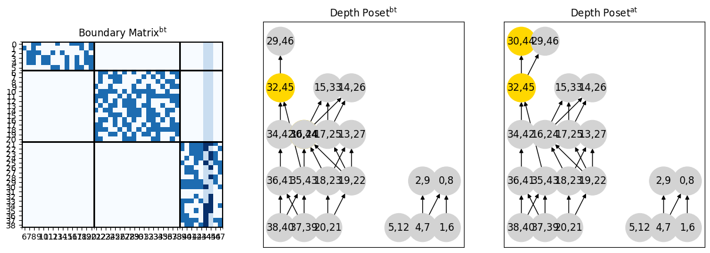

### Birth Death Pairs
|                          |                                                                                                                                                                                                               |
|:-------------------------|:--------------------------------------------------------------------------------------------------------------------------------------------------------------------------------------------------------------|
| Before the transposition | $\{(13, 27), (18, 23), (15, 33), (1, 6), (0, 8), (37, 39), (32, 45), (38, 40), (5, 12), (29, 46), (34, 42), (30, 44), (16, 24), (4, 7), (20, 21), (35, 43), (14, 26), (2, 9), (17, 25), (19, 22), (36, 41)\}$ |
| After the transposition  | $\{(13, 27), (18, 23), (15, 33), (1, 6), (0, 8), (37, 39), (32, 45), (38, 40), (5, 12), (29, 46), (34, 42), (30, 44), (16, 24), (4, 7), (20, 21), (35, 43), (14, 26), (2, 9), (17, 25), (19, 22), (36, 41)\}$ |

### Relations
|                          | Algorithm 1                                                                                                                                                                                                                                                                                                                                                                                                | Algorithm 2                                                                                                                                                                                                                                                                                                                                                                        |
|:-------------------------|:-----------------------------------------------------------------------------------------------------------------------------------------------------------------------------------------------------------------------------------------------------------------------------------------------------------------------------------------------------------------------------------------------------------|:-----------------------------------------------------------------------------------------------------------------------------------------------------------------------------------------------------------------------------------------------------------------------------------------------------------------------------------------------------------------------------------|
| Before the transposition | $\{(43, 46), (41, 46), (21, 22), (21, 28), (40, 44), (39, 42), (40, 41), (40, 47), (9, 11), (7, 10), (24, 26), (41, 42), (6, 8), (25, 31), (42, 47), (44, 47), (43, 45), (22, 25), (21, 27), (21, 33), (22, 28), (8, 11), (23, 27), (40, 43), (22, 31), (9, 10), (24, 28), (24, 31), (41, 47), (43, 44), (26, 28), (23, 26), (22, 24), (39, 46), (8, 10), (39, 43), (22, 33), (45, 47), (7, 11), (7, 8)\}$ | $\{(35, 30), (20, 11), (20, 14), (4, 3), (20, 17), (38, 35), (14, 10), (34, 28), (17, 15), (37, 30), (37, 36), (18, 10), (18, 16), (35, 32), (4, 2), (35, 29), (20, 19), (29, 28), (38, 34), (17, 14), (19, 14), (37, 29), (37, 35), (15, 10), (16, 15), (35, 28), (32, 29), (20, 18), (19, 10), (19, 16), (19, 13), (34, 32), (37, 34), (18, 11), (32, 28), (18, 14)\}$           |
| After the transposition  | $\{(43, 46), (41, 46), (21, 22), (21, 28), (40, 44), (39, 42), (40, 41), (40, 47), (9, 11), (7, 10), (24, 26), (41, 42), (6, 8), (25, 31), (42, 47), (44, 47), (43, 45), (22, 25), (21, 27), (21, 33), (22, 28), (8, 11), (23, 27), (40, 43), (22, 31), (9, 10), (24, 28), (24, 31), (41, 47), (43, 44), (26, 28), (23, 26), (22, 24), (39, 46), (8, 10), (39, 43), (22, 33), (45, 47), (7, 11), (7, 8)\}$ | $\{(35, 30), (20, 11), (20, 14), (4, 3), (20, 17), (38, 35), (14, 10), (34, 28), (17, 15), (37, 30), (37, 36), (32, 30), (18, 10), (18, 16), (35, 32), (4, 2), (35, 29), (20, 19), (29, 28), (38, 34), (17, 14), (19, 14), (37, 29), (37, 35), (15, 10), (16, 15), (35, 28), (32, 29), (20, 18), (19, 10), (19, 16), (19, 13), (34, 32), (37, 34), (18, 11), (32, 28), (18, 14)\}$ |

### Successors and Predecessers
No such node in the Depth Poset

### Temp Sets
|                                                               | Before the Transposition                                         | After the Transposition                                          |
|:--------------------------------------------------------------|:-----------------------------------------------------------------|:-----------------------------------------------------------------|
| $\mathcal{B} = \{(s, t)\in \text{BD}:\; f(s) > f(x)\}$        | $\{(35, 43), (37, 39), (34, 42), (32, 45), (38, 40), (36, 41)\}$ | $\{(35, 43), (37, 39), (34, 42), (32, 45), (38, 40), (36, 41)\}$ |
| $\mathcal{N} = \{(s, t)\in \text{BD}:\; f(x) > f(s) > f(a)\}$ | $\emptyset$                                                      | $\emptyset$                                                      |

### Equations
There are 2 equations are wrong.

| eq   | left (formula)                  | left (paramatrized)               | left (value)             | right (formula)                                                                        | right (paramatrized)                                                                         | right (value)                      | correct   |
|:-----|:--------------------------------|:----------------------------------|:-------------------------|:---------------------------------------------------------------------------------------|:---------------------------------------------------------------------------------------------|:-----------------------------------|:----------|
| Eq36 | $\text{Succ}_2^\text{at}(x, y)$ | $\text{Succ}_2^\text{at}(30, 44)$ | $\emptyset$              | $\text{Succ}_2^\text{bt}(x, y) \oplus \{(a, b)\} \oplus \text{Succ}_2^\text{bt}(a, b)$ | $\text{Succ}_2^\text{bt}(30, 44) \oplus \{(32, 45)\} \oplus \text{Succ}_2^\text{bt}(32, 45)$ | $\{(32, 45), (29, 46)\}$           | ✘         |
| Eq37 | $\text{Pred}_2^\text{at}(a, b)$ | $\text{Pred}_2^\text{at}(32, 45)$ | $\{(35, 43), (34, 42)\}$ | $\text{Pred}_2^\text{bt}(a, b) \oplus \{(x, y)\}$                                      | $\text{Pred}_2^\text{bt}(32, 45) \oplus \{(30, 44)\}$                                        | $\{(35, 43), (30, 44), (34, 42)\}$ | ✘         |

## Transposition <0, 1> in complex 24
Here is a __birth-birth__ __no switch__ transposition <0, 1>.

$$
a = 0, \; b = 8, \; x = 1, \; y = 10
$$

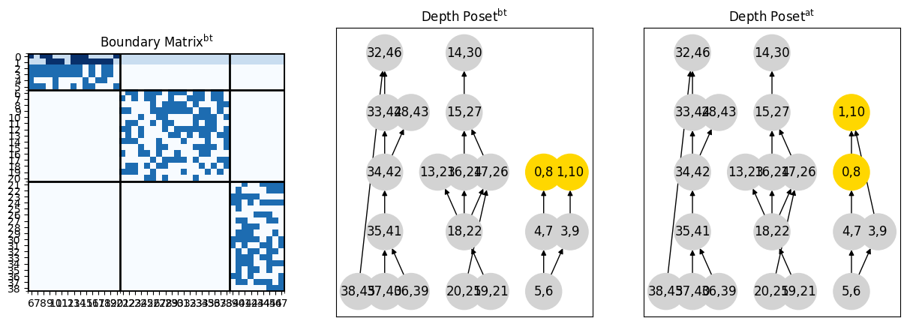

### Birth Death Pairs
|                          |                                                                                                                                                                                                               |
|:-------------------------|:--------------------------------------------------------------------------------------------------------------------------------------------------------------------------------------------------------------|
| Before the transposition | $\{(32, 46), (15, 27), (0, 8), (19, 21), (13, 23), (33, 44), (18, 22), (3, 9), (20, 25), (5, 6), (35, 41), (14, 30), (17, 26), (34, 42), (36, 39), (16, 24), (4, 7), (38, 45), (37, 40), (1, 10), (28, 43)\}$ |
| After the transposition  | $\{(32, 46), (15, 27), (0, 8), (19, 21), (13, 23), (33, 44), (18, 22), (3, 9), (20, 25), (5, 6), (35, 41), (14, 30), (17, 26), (34, 42), (36, 39), (16, 24), (4, 7), (38, 45), (37, 40), (1, 10), (28, 43)\}$ |

### Relations
|                          | Algorithm 1                                                                                                                                                                                                                                                                                                                                                                                                                                                | Algorithm 2                                                                                                                                                                                                                                                                                                                                                              |
|:-------------------------|:-----------------------------------------------------------------------------------------------------------------------------------------------------------------------------------------------------------------------------------------------------------------------------------------------------------------------------------------------------------------------------------------------------------------------------------------------------------|:-------------------------------------------------------------------------------------------------------------------------------------------------------------------------------------------------------------------------------------------------------------------------------------------------------------------------------------------------------------------------|
| Before the transposition | $\{(26, 30), (21, 22), (22, 23), (21, 31), (40, 44), (39, 42), (22, 26), (40, 41), (23, 31), (9, 11), (10, 12), (25, 26), (45, 46), (6, 8), (41, 42), (24, 29), (42, 44), (44, 47), (26, 29), (39, 41), (8, 11), (39, 44), (40, 43), (39, 47), (40, 46), (6, 7), (6, 10), (41, 44), (42, 43), (41, 47), (42, 46), (21, 23), (26, 31), (44, 46), (21, 26), (22, 27), (39, 46), (9, 12), (39, 43), (45, 47), (27, 29), (30, 31), (7, 8)\}$                   | $\{(20, 11), (4, 0), (3, 1), (38, 29), (5, 4), (17, 15), (34, 31), (19, 12), (37, 33), (36, 31), (15, 11), (15, 14), (18, 16), (35, 32), (18, 13), (18, 11), (5, 0), (5, 3), (17, 14), (19, 14), (34, 33), (37, 29), (37, 35), (37, 32), (16, 15), (33, 31), (35, 28), (32, 29), (20, 12), (3, 2), (5, 2), (34, 29), (19, 16), (37, 31), (37, 34), (13, 12), (15, 12)\}$ |
| After the transposition  | $\{(26, 30), (21, 22), (22, 23), (21, 31), (40, 44), (39, 42), (22, 26), (40, 41), (8, 12), (23, 31), (9, 11), (10, 12), (45, 46), (6, 8), (41, 42), (24, 29), (42, 44), (44, 47), (26, 29), (39, 41), (8, 11), (39, 44), (40, 43), (39, 47), (40, 46), (6, 7), (6, 10), (41, 44), (42, 43), (41, 47), (42, 46), (21, 23), (26, 31), (44, 46), (21, 26), (22, 27), (39, 46), (9, 12), (8, 10), (39, 43), (45, 47), (27, 29), (7, 8), (30, 31), (25, 26)\}$ | $\{(20, 11), (4, 0), (38, 29), (3, 1), (5, 4), (17, 15), (19, 12), (34, 31), (37, 33), (36, 31), (15, 11), (15, 14), (18, 16), (35, 32), (18, 13), (5, 0), (5, 3), (17, 14), (19, 14), (34, 33), (37, 29), (37, 35), (37, 32), (16, 15), (33, 31), (35, 28), (32, 29), (20, 12), (3, 2), (5, 2), (15, 12), (34, 29), (19, 16), (37, 31), (37, 34), (13, 12), (18, 11)\}$ |

### Successors and Predecessers
No such node in the Depth Poset

### Temp Sets
|                                                               | Before the Transposition             | After the Transposition              |
|:--------------------------------------------------------------|:-------------------------------------|:-------------------------------------|
| $\mathcal{L} = \{(s, t)\in \text{BD}:\; f(t) < f(y)\}$        | $\{(0, 8), (5, 6), (3, 9), (4, 7)\}$ | $\{(0, 8), (5, 6), (3, 9), (4, 7)\}$ |
| $\mathcal{M} = \{(s, t)\in \text{BD}:\; f(y) < f(t) < f(b)\}$ | $\emptyset$                          | $\emptyset$                          |

### Equations
There are 2 equations are wrong.

| eq   | left (formula)                  | left (paramatrized)              | left (value)         | right (formula)                                                                        | right (paramatrized)                                                                    | right (value)                 | correct   |
|:-----|:--------------------------------|:---------------------------------|:---------------------|:---------------------------------------------------------------------------------------|:----------------------------------------------------------------------------------------|:------------------------------|:----------|
| Eq16 | $\text{Succ}_1^\text{at}(x, y)$ | $\text{Succ}_1^\text{at}(1, 10)$ | $\emptyset$          | $\text{Succ}_1^\text{bt}(x, y) \oplus \{(a, b)\} \oplus \text{Succ}_1^\text{bt}(a, b)$ | $\text{Succ}_1^\text{bt}(1, 10) \oplus \{(0, 8)\} \oplus \text{Succ}_1^\text{bt}(0, 8)$ | $\{(0, 8)\}$                  | ✘         |
| Eq17 | $\text{Pred}_1^\text{at}(a, b)$ | $\text{Pred}_1^\text{at}(0, 8)$  | $\{(5, 6), (4, 7)\}$ | $\text{Pred}_1^\text{bt}(a, b) \oplus \{(x, y)\}$                                      | $\text{Pred}_1^\text{bt}(0, 8) \oplus \{(1, 10)\}$                                      | $\{(4, 7), (5, 6), (1, 10)\}$ | ✘         |

## Transposition <8, 9> in complex 24
Here is a __death-death__ __no switch__ transposition <8, 9>.

$$
a = 3, \; b = 9, \; x = 0, \; y = 8
$$

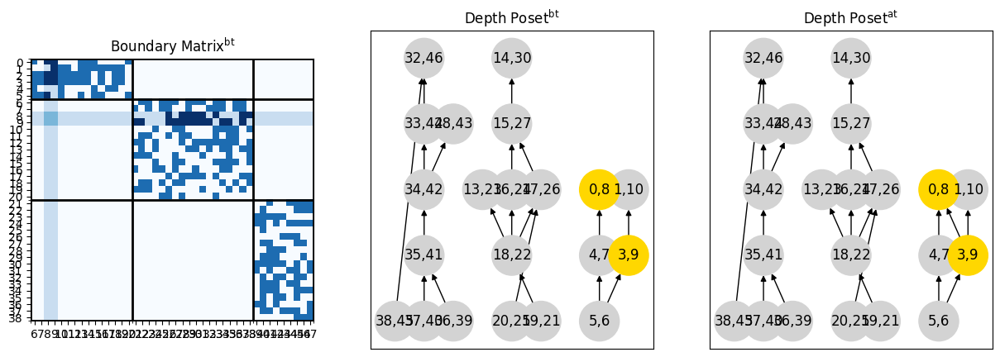

### Birth Death Pairs
|                          |                                                                                                                                                                                                               |
|:-------------------------|:--------------------------------------------------------------------------------------------------------------------------------------------------------------------------------------------------------------|
| Before the transposition | $\{(32, 46), (15, 27), (0, 8), (19, 21), (13, 23), (33, 44), (18, 22), (3, 9), (20, 25), (5, 6), (35, 41), (14, 30), (17, 26), (34, 42), (36, 39), (16, 24), (4, 7), (38, 45), (37, 40), (1, 10), (28, 43)\}$ |
| After the transposition  | $\{(32, 46), (15, 27), (0, 8), (19, 21), (13, 23), (33, 44), (18, 22), (3, 9), (20, 25), (5, 6), (35, 41), (14, 30), (17, 26), (34, 42), (36, 39), (16, 24), (4, 7), (38, 45), (37, 40), (1, 10), (28, 43)\}$ |

### Relations
|                          | Algorithm 1                                                                                                                                                                                                                                                                                                                                                                                                                              | Algorithm 2                                                                                                                                                                                                                                                                                                                                                                      |
|:-------------------------|:-----------------------------------------------------------------------------------------------------------------------------------------------------------------------------------------------------------------------------------------------------------------------------------------------------------------------------------------------------------------------------------------------------------------------------------------|:---------------------------------------------------------------------------------------------------------------------------------------------------------------------------------------------------------------------------------------------------------------------------------------------------------------------------------------------------------------------------------|
| Before the transposition | $\{(26, 30), (21, 22), (22, 23), (21, 31), (40, 44), (39, 42), (22, 26), (40, 41), (23, 31), (9, 11), (10, 12), (25, 26), (45, 46), (6, 8), (41, 42), (24, 29), (42, 44), (44, 47), (26, 29), (39, 41), (8, 11), (39, 44), (40, 43), (39, 47), (40, 46), (6, 7), (6, 10), (41, 44), (42, 43), (41, 47), (42, 46), (21, 23), (26, 31), (44, 46), (21, 26), (22, 27), (39, 46), (9, 12), (39, 43), (45, 47), (27, 29), (30, 31), (7, 8)\}$ | $\{(20, 11), (4, 0), (3, 1), (38, 29), (5, 4), (17, 15), (34, 31), (19, 12), (37, 33), (36, 31), (15, 11), (15, 14), (18, 16), (35, 32), (18, 13), (18, 11), (5, 0), (5, 3), (17, 14), (19, 14), (34, 33), (37, 29), (37, 35), (37, 32), (16, 15), (33, 31), (35, 28), (32, 29), (20, 12), (3, 2), (5, 2), (34, 29), (19, 16), (37, 31), (37, 34), (13, 12), (15, 12)\}$         |
| After the transposition  | $\{(26, 30), (21, 22), (22, 23), (21, 31), (40, 44), (39, 42), (22, 26), (40, 41), (23, 31), (9, 11), (10, 12), (25, 26), (45, 46), (6, 8), (41, 42), (24, 29), (42, 44), (44, 47), (26, 29), (39, 41), (8, 11), (39, 44), (40, 43), (39, 47), (40, 46), (6, 7), (6, 10), (41, 44), (42, 43), (41, 47), (42, 46), (21, 23), (26, 31), (44, 46), (21, 26), (22, 27), (39, 46), (9, 12), (39, 43), (45, 47), (27, 29), (30, 31), (7, 8)\}$ | $\{(20, 11), (4, 0), (3, 1), (38, 29), (5, 4), (17, 15), (19, 12), (34, 31), (37, 33), (36, 31), (15, 11), (15, 14), (18, 16), (35, 32), (18, 13), (3, 0), (5, 0), (5, 3), (17, 14), (19, 14), (34, 33), (37, 29), (37, 35), (37, 32), (16, 15), (33, 31), (35, 28), (32, 29), (20, 12), (3, 2), (5, 2), (15, 12), (34, 29), (19, 16), (37, 31), (37, 34), (13, 12), (18, 11)\}$ |

### Successors and Predecessers
No such node in the Depth Poset

### Temp Sets
|                                                               | Before the Transposition                                                                                                                                                                              | After the Transposition                                                                                                                                                                               |
|:--------------------------------------------------------------|:------------------------------------------------------------------------------------------------------------------------------------------------------------------------------------------------------|:------------------------------------------------------------------------------------------------------------------------------------------------------------------------------------------------------|
| $\mathcal{B} = \{(s, t)\in \text{BD}:\; f(s) > f(x)\}$        | $\{(32, 46), (15, 27), (19, 21), (13, 23), (33, 44), (18, 22), (3, 9), (20, 25), (5, 6), (35, 41), (14, 30), (17, 26), (34, 42), (36, 39), (16, 24), (4, 7), (38, 45), (37, 40), (1, 10), (28, 43)\}$ | $\{(32, 46), (15, 27), (19, 21), (13, 23), (33, 44), (18, 22), (3, 9), (20, 25), (5, 6), (35, 41), (14, 30), (17, 26), (34, 42), (36, 39), (16, 24), (4, 7), (38, 45), (37, 40), (1, 10), (28, 43)\}$ |
| $\mathcal{N} = \{(s, t)\in \text{BD}:\; f(x) > f(s) > f(a)\}$ | $\emptyset$                                                                                                                                                                                           | $\emptyset$                                                                                                                                                                                           |

### Equations
There are 2 equations are wrong.

| eq   | left (formula)                  | left (paramatrized)             | left (value)   | right (formula)                                                                        | right (paramatrized)                                                                   | right (value)         | correct   |
|:-----|:--------------------------------|:--------------------------------|:---------------|:---------------------------------------------------------------------------------------|:---------------------------------------------------------------------------------------|:----------------------|:----------|
| Eq36 | $\text{Succ}_2^\text{at}(x, y)$ | $\text{Succ}_2^\text{at}(0, 8)$ | $\emptyset$    | $\text{Succ}_2^\text{bt}(x, y) \oplus \{(a, b)\} \oplus \text{Succ}_2^\text{bt}(a, b)$ | $\text{Succ}_2^\text{bt}(0, 8) \oplus \{(3, 9)\} \oplus \text{Succ}_2^\text{bt}(3, 9)$ | $\{(3, 9), (1, 10)\}$ | ✘         |
| Eq37 | $\text{Pred}_2^\text{at}(a, b)$ | $\text{Pred}_2^\text{at}(3, 9)$ | $\{(5, 6)\}$   | $\text{Pred}_2^\text{bt}(a, b) \oplus \{(x, y)\}$                                      | $\text{Pred}_2^\text{bt}(3, 9) \oplus \{(0, 8)\}$                                      | $\{(0, 8), (5, 6)\}$  | ✘         |

## Transposition <16, 17> in complex 24
Here is a __birth-birth__ __no switch__ transposition <16, 17>.

$$
a = 16, \; b = 24, \; x = 17, \; y = 26
$$

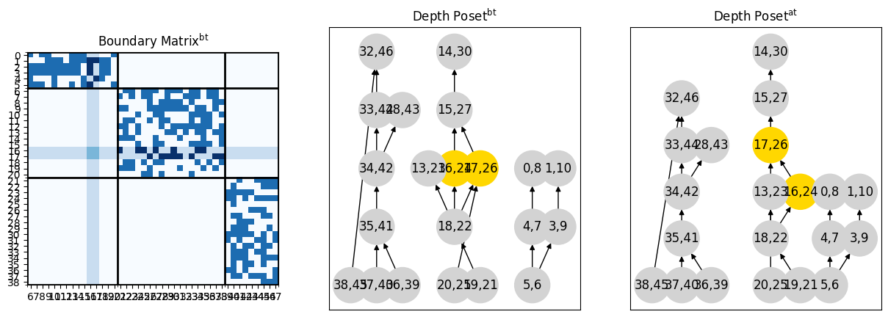

### Birth Death Pairs
|                          |                                                                                                                                                                                                               |
|:-------------------------|:--------------------------------------------------------------------------------------------------------------------------------------------------------------------------------------------------------------|
| Before the transposition | $\{(32, 46), (15, 27), (0, 8), (19, 21), (13, 23), (33, 44), (18, 22), (3, 9), (20, 25), (5, 6), (35, 41), (14, 30), (17, 26), (34, 42), (36, 39), (16, 24), (4, 7), (38, 45), (37, 40), (1, 10), (28, 43)\}$ |
| After the transposition  | $\{(32, 46), (15, 27), (0, 8), (19, 21), (13, 23), (33, 44), (18, 22), (3, 9), (20, 25), (5, 6), (35, 41), (14, 30), (17, 26), (34, 42), (36, 39), (16, 24), (4, 7), (38, 45), (37, 40), (1, 10), (28, 43)\}$ |

### Relations
|                          | Algorithm 1                                                                                                                                                                                                                                                                                                                                                                                                                                                  | Algorithm 2                                                                                                                                                                                                                                                                                                                                                              |
|:-------------------------|:-------------------------------------------------------------------------------------------------------------------------------------------------------------------------------------------------------------------------------------------------------------------------------------------------------------------------------------------------------------------------------------------------------------------------------------------------------------|:-------------------------------------------------------------------------------------------------------------------------------------------------------------------------------------------------------------------------------------------------------------------------------------------------------------------------------------------------------------------------|
| Before the transposition | $\{(26, 30), (21, 22), (22, 23), (21, 31), (40, 44), (39, 42), (22, 26), (40, 41), (23, 31), (9, 11), (10, 12), (25, 26), (45, 46), (6, 8), (41, 42), (24, 29), (42, 44), (44, 47), (26, 29), (39, 41), (8, 11), (39, 44), (40, 43), (39, 47), (40, 46), (6, 7), (6, 10), (41, 44), (42, 43), (41, 47), (42, 46), (21, 23), (26, 31), (44, 46), (21, 26), (22, 27), (39, 46), (9, 12), (39, 43), (45, 47), (27, 29), (30, 31), (7, 8)\}$                     | $\{(20, 11), (4, 0), (3, 1), (38, 29), (5, 4), (17, 15), (34, 31), (19, 12), (37, 33), (36, 31), (15, 11), (15, 14), (18, 16), (35, 32), (18, 13), (18, 11), (5, 0), (5, 3), (17, 14), (19, 14), (34, 33), (37, 29), (37, 35), (37, 32), (16, 15), (33, 31), (35, 28), (32, 29), (20, 12), (3, 2), (5, 2), (34, 29), (19, 16), (37, 31), (37, 34), (13, 12), (15, 12)\}$ |
| After the transposition  | $\{(24, 30), (26, 30), (21, 22), (22, 23), (21, 31), (40, 44), (39, 42), (22, 26), (40, 41), (23, 31), (9, 11), (10, 12), (45, 46), (24, 26), (41, 42), (6, 8), (42, 44), (44, 47), (26, 29), (39, 41), (8, 11), (39, 44), (40, 43), (39, 47), (40, 46), (6, 7), (6, 10), (41, 44), (42, 43), (24, 31), (41, 47), (42, 46), (21, 23), (26, 31), (44, 46), (21, 26), (22, 27), (39, 46), (9, 12), (39, 43), (45, 47), (27, 29), (7, 8), (30, 31), (25, 26)\}$ | $\{(20, 11), (4, 0), (38, 29), (3, 1), (5, 4), (17, 15), (19, 12), (34, 31), (37, 33), (36, 31), (15, 11), (15, 14), (18, 16), (35, 32), (18, 13), (5, 0), (5, 3), (17, 14), (19, 14), (34, 33), (37, 29), (37, 35), (37, 32), (16, 15), (33, 31), (35, 28), (32, 29), (20, 12), (3, 2), (5, 2), (15, 12), (34, 29), (19, 16), (37, 31), (37, 34), (13, 12), (18, 11)\}$ |

### Successors and Predecessers
No such node in the Depth Poset

### Temp Sets
|                                                               | Before the Transposition                                                                        | After the Transposition                                                                         |
|:--------------------------------------------------------------|:------------------------------------------------------------------------------------------------|:------------------------------------------------------------------------------------------------|
| $\mathcal{L} = \{(s, t)\in \text{BD}:\; f(t) < f(y)\}$        | $\{(13, 23), (18, 22), (3, 9), (5, 6), (20, 25), (1, 10), (16, 24), (0, 8), (19, 21), (4, 7)\}$ | $\{(13, 23), (18, 22), (3, 9), (5, 6), (20, 25), (1, 10), (16, 24), (0, 8), (19, 21), (4, 7)\}$ |
| $\mathcal{M} = \{(s, t)\in \text{BD}:\; f(y) < f(t) < f(b)\}$ | $\emptyset$                                                                                     | $\emptyset$                                                                                     |

### Equations
There are 2 equations are wrong.

| eq   | left (formula)                  | left (paramatrized)               | left (value)   | right (formula)                                                                        | right (paramatrized)                                                                         | right (value)            | correct   |
|:-----|:--------------------------------|:----------------------------------|:---------------|:---------------------------------------------------------------------------------------|:---------------------------------------------------------------------------------------------|:-------------------------|:----------|
| Eq16 | $\text{Succ}_1^\text{at}(x, y)$ | $\text{Succ}_1^\text{at}(17, 26)$ | $\{(14, 30)\}$ | $\text{Succ}_1^\text{bt}(x, y) \oplus \{(a, b)\} \oplus \text{Succ}_1^\text{bt}(a, b)$ | $\text{Succ}_1^\text{bt}(17, 26) \oplus \{(16, 24)\} \oplus \text{Succ}_1^\text{bt}(16, 24)$ | $\{(16, 24), (14, 30)\}$ | ✘         |
| Eq17 | $\text{Pred}_1^\text{at}(a, b)$ | $\text{Pred}_1^\text{at}(16, 24)$ | $\emptyset$    | $\text{Pred}_1^\text{bt}(a, b) \oplus \{(x, y)\}$                                      | $\text{Pred}_1^\text{bt}(16, 24) \oplus \{(17, 26)\}$                                        | $\{(17, 26)\}$           | ✘         |

## Transposition <21, 22> in complex 24
Here is a __death-death__ __switch forward__ transposition <21, 22>.

$$
a = 18, \; b = 22, \; x = 19, \; y = 21
$$

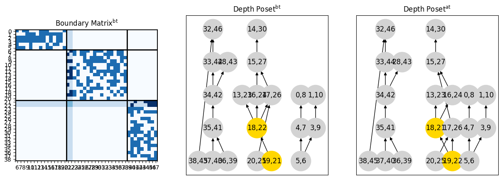

### Birth Death Pairs
|                          |                                                                                                                                                                                                               |
|:-------------------------|:--------------------------------------------------------------------------------------------------------------------------------------------------------------------------------------------------------------|
| Before the transposition | $\{(32, 46), (15, 27), (0, 8), (19, 21), (13, 23), (33, 44), (18, 22), (3, 9), (20, 25), (5, 6), (35, 41), (14, 30), (17, 26), (34, 42), (36, 39), (16, 24), (4, 7), (38, 45), (37, 40), (1, 10), (28, 43)\}$ |
| After the transposition  | $\{(32, 46), (15, 27), (0, 8), (13, 23), (33, 44), (3, 9), (20, 25), (5, 6), (35, 41), (14, 30), (17, 26), (34, 42), (36, 39), (16, 24), (18, 21), (4, 7), (38, 45), (37, 40), (19, 22), (1, 10), (28, 43)\}$ |

### Relations
|                          | Algorithm 1                                                                                                                                                                                                                                                                                                                                                                                                                              | Algorithm 2                                                                                                                                                                                                                                                                                                                                                                                  |
|:-------------------------|:-----------------------------------------------------------------------------------------------------------------------------------------------------------------------------------------------------------------------------------------------------------------------------------------------------------------------------------------------------------------------------------------------------------------------------------------|:---------------------------------------------------------------------------------------------------------------------------------------------------------------------------------------------------------------------------------------------------------------------------------------------------------------------------------------------------------------------------------------------|
| Before the transposition | $\{(26, 30), (21, 22), (22, 23), (21, 31), (40, 44), (39, 42), (22, 26), (40, 41), (23, 31), (9, 11), (10, 12), (25, 26), (45, 46), (6, 8), (41, 42), (24, 29), (42, 44), (44, 47), (26, 29), (39, 41), (8, 11), (39, 44), (40, 43), (39, 47), (40, 46), (6, 7), (6, 10), (41, 44), (42, 43), (41, 47), (42, 46), (21, 23), (26, 31), (44, 46), (21, 26), (22, 27), (39, 46), (9, 12), (39, 43), (45, 47), (27, 29), (30, 31), (7, 8)\}$ | $\{(20, 11), (4, 0), (3, 1), (38, 29), (5, 4), (17, 15), (34, 31), (19, 12), (37, 33), (36, 31), (15, 11), (15, 14), (18, 16), (35, 32), (18, 13), (18, 11), (5, 0), (5, 3), (17, 14), (19, 14), (34, 33), (37, 29), (37, 35), (37, 32), (16, 15), (33, 31), (35, 28), (32, 29), (20, 12), (3, 2), (5, 2), (34, 29), (19, 16), (37, 31), (37, 34), (13, 12), (15, 12)\}$                     |
| After the transposition  | $\{(26, 30), (22, 23), (21, 31), (40, 44), (39, 42), (22, 26), (40, 41), (23, 31), (9, 11), (10, 12), (45, 46), (6, 8), (41, 42), (24, 29), (42, 44), (44, 47), (26, 29), (39, 41), (21, 27), (8, 11), (39, 44), (40, 43), (22, 31), (39, 47), (40, 46), (6, 7), (6, 10), (41, 44), (42, 43), (41, 47), (42, 46), (26, 31), (44, 46), (22, 21), (39, 46), (9, 12), (39, 43), (45, 47), (27, 29), (7, 8), (30, 31), (25, 26)\}$           | $\{(20, 11), (4, 0), (3, 1), (38, 29), (5, 4), (17, 15), (19, 12), (34, 31), (19, 18), (37, 33), (36, 31), (15, 11), (15, 14), (18, 16), (35, 32), (18, 13), (5, 0), (5, 3), (17, 14), (19, 11), (19, 14), (34, 33), (37, 29), (37, 35), (37, 32), (16, 15), (33, 31), (35, 28), (32, 29), (20, 12), (3, 2), (5, 2), (15, 12), (34, 29), (19, 13), (37, 31), (37, 34), (13, 12), (18, 11)\}$ |

### Successors and Predecessers
|                 | $\text{Set}^\text{bt}(18, 22)$                                       | $\text{Set}^\text{bt}(19, 21)$                                       | $\text{Set}^\text{at}(19, 22)$                                       | $\text{Set}^\text{at}(18, 21)$                             |
|:----------------|:---------------------------------------------------------------------|:---------------------------------------------------------------------|:---------------------------------------------------------------------|:-----------------------------------------------------------|
| $\text{Succ}_1$ | $\text{Succ}_1^\text{bt}(18, 22) = \{(15, 27), (17, 26), (13, 23)\}$ | $\text{Succ}_1^\text{bt}(19, 21) = \{(18, 22), (17, 26), (13, 23)\}$ | $\text{Succ}_1^\text{at}(19, 22) = \{(18, 21), (17, 26), (13, 23)\}$ | $\text{Succ}_1^\text{at}(18, 21) = \{(15, 27)\}$           |
| $\text{Pred}_1$ | $\text{Pred}_1^\text{bt}(18, 22) = \{(19, 21)\}$                     | $\text{Pred}_1^\text{bt}(19, 21) = \emptyset$                        | $\text{Pred}_1^\text{at}(19, 22) = \emptyset$                        | $\text{Pred}_1^\text{at}(18, 21) = \{(19, 22)\}$           |
| $\text{Succ}_2$ | $\text{Succ}_2^\text{bt}(18, 22) = \{(16, 24), (13, 23)\}$           | $\text{Succ}_2^\text{bt}(19, 21) = \{(16, 24), (14, 30)\}$           | $\text{Succ}_2^\text{at}(19, 22) = \{(18, 21), (14, 30), (13, 23)\}$ | $\text{Succ}_2^\text{at}(18, 21) = \{(16, 24), (13, 23)\}$ |
| $\text{Pred}_2$ | $\text{Pred}_2^\text{bt}(18, 22) = \emptyset$                        | $\text{Pred}_2^\text{bt}(19, 21) = \emptyset$                        | $\text{Pred}_2^\text{at}(19, 22) = \emptyset$                        | $\text{Pred}_2^\text{at}(18, 21) = \{(19, 22)\}$           |

### Temp Sets
|                                                               | Before the Transposition                                                                       | After the Transposition                                                                        |
|:--------------------------------------------------------------|:-----------------------------------------------------------------------------------------------|:-----------------------------------------------------------------------------------------------|
| $\mathcal{B} = \{(s, t)\in \text{BD}:\; f(s) > f(x)\}$        | $\{(32, 46), (38, 45), (36, 39), (34, 42), (33, 44), (37, 40), (20, 25), (35, 41), (28, 43)\}$ | $\{(32, 46), (38, 45), (36, 39), (34, 42), (33, 44), (37, 40), (20, 25), (35, 41), (28, 43)\}$ |
| $\mathcal{N} = \{(s, t)\in \text{BD}:\; f(x) > f(s) > f(a)\}$ | $\emptyset$                                                                                    | $\emptyset$                                                                                    |

### Equations
There are 1 equations are wrong.

| eq   | left (formula)                  | left (paramatrized)               | left (value)                       | right (formula)                                                                                          | right (paramatrized)                                                                                           | right (value)                      | correct   |
|:-----|:--------------------------------|:----------------------------------|:-----------------------------------|:---------------------------------------------------------------------------------------------------------|:---------------------------------------------------------------------------------------------------------------|:-----------------------------------|:----------|
| Eq28 | $\text{Succ}_1^\text{at}(x, b)$ | $\text{Succ}_1^\text{at}(19, 22)$ | $\{(18, 21), (17, 26), (13, 23)\}$ | $\text{Succ}_1^\text{bt}(x, y) \oplus \{(a, y), (a, b)\}$                                                | $\text{Succ}_1^\text{bt}(19, 21) \oplus \{(18, 21), (18, 22)\}$                                                | $\{(18, 21), (13, 23), (17, 26)\}$ | ✔         |
| Eq29 | $\text{Succ}_1^\text{at}(a, y)$ | $\text{Succ}_1^\text{at}(18, 21)$ | $\{(15, 27)\}$                     | $\text{Succ}_1^\text{bt}(a, b)$                                                                          | $\text{Succ}_1^\text{bt}(18, 22)$                                                                              | $\{(15, 27), (17, 26), (13, 23)\}$ | ✘         |
| Eq30 | $\text{Pred}_1^\text{at}(x, b)$ | $\text{Pred}_1^\text{at}(19, 22)$ | $\emptyset$                        | $[\text{Pred}_1^\text{bt}(a, b) \cap \mathcal{B}]$                                                       | $[\text{Pred}_1^\text{bt}(18, 22) \cap \mathcal{B}]$                                                           | $\emptyset$                        | ✔         |
| Eq31 | $\text{Pred}_1^\text{at}(a, y)$ | $\text{Pred}_1^\text{at}(18, 21)$ | $\{(19, 22)\}$                     | $\text{Pred}_1^\text{bt}(x, y) \oplus \{(x, b)\} \oplus[\text{Pred}_1^\text{bt}(a, b) \cap \mathcal{N}]$ | $\text{Pred}_1^\text{bt}(19, 21) \oplus \{(19, 22)\} \oplus[\text{Pred}_1^\text{bt}(18, 22) \cap \mathcal{N}]$ | $\{(19, 22)\}$                     | ✔         |
| Eq32 | $\text{Succ}_2^\text{at}(x, b)$ | $\text{Succ}_2^\text{at}(19, 22)$ | $\{(18, 21), (14, 30), (13, 23)\}$ | $\text{Succ}_2^\text{bt}(x, y) \oplus \{(a, y)\} \oplus \text{Succ}_2^\text{bt}(a, b)$                   | $\text{Succ}_2^\text{bt}(19, 21) \oplus \{(18, 21)\} \oplus \text{Succ}_2^\text{bt}(18, 22)$                   | $\{(18, 21), (14, 30), (13, 23)\}$ | ✔         |
| Eq33 | $\text{Succ}_2^\text{at}(a, y)$ | $\text{Succ}_2^\text{at}(18, 21)$ | $\{(16, 24), (13, 23)\}$           | $\text{Succ}_2^\text{bt}(a, b)$                                                                          | $\text{Succ}_2^\text{bt}(18, 22)$                                                                              | $\{(16, 24), (13, 23)\}$           | ✔         |
| Eq34 | $\text{Pred}_2^\text{at}(x, b)$ | $\text{Pred}_2^\text{at}(19, 22)$ | $\emptyset$                        | $\text{Pred}_2^\text{bt}(x, y)$                                                                          | $\text{Pred}_2^\text{bt}(19, 21)$                                                                              | $\emptyset$                        | ✔         |
| Eq35 | $\text{Pred}_2^\text{at}(a, y)$ | $\text{Pred}_2^\text{at}(18, 21)$ | $\{(19, 22)\}$                     | $\text{Pred}_2^\text{bt}(a, b) \oplus \{(x, b)\}$                                                        | $\text{Pred}_2^\text{bt}(18, 22) \oplus \{(19, 22)\}$                                                          | $\{(19, 22)\}$                     | ✔         |

## Transposition <23, 24> in complex 24
Here is a __death-death__ __no switch__ transposition <23, 24>.

$$
a = 16, \; b = 24, \; x = 13, \; y = 23
$$

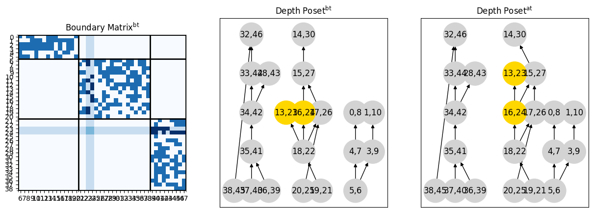

### Birth Death Pairs
|                          |                                                                                                                                                                                                               |
|:-------------------------|:--------------------------------------------------------------------------------------------------------------------------------------------------------------------------------------------------------------|
| Before the transposition | $\{(32, 46), (15, 27), (0, 8), (19, 21), (13, 23), (33, 44), (18, 22), (3, 9), (20, 25), (5, 6), (35, 41), (14, 30), (17, 26), (34, 42), (36, 39), (16, 24), (4, 7), (38, 45), (37, 40), (1, 10), (28, 43)\}$ |
| After the transposition  | $\{(32, 46), (15, 27), (0, 8), (19, 21), (13, 23), (33, 44), (18, 22), (3, 9), (20, 25), (5, 6), (35, 41), (14, 30), (17, 26), (34, 42), (36, 39), (16, 24), (4, 7), (38, 45), (37, 40), (1, 10), (28, 43)\}$ |

### Relations
|                          | Algorithm 1                                                                                                                                                                                                                                                                                                                                                                                                                              | Algorithm 2                                                                                                                                                                                                                                                                                                                                                                                  |
|:-------------------------|:-----------------------------------------------------------------------------------------------------------------------------------------------------------------------------------------------------------------------------------------------------------------------------------------------------------------------------------------------------------------------------------------------------------------------------------------|:---------------------------------------------------------------------------------------------------------------------------------------------------------------------------------------------------------------------------------------------------------------------------------------------------------------------------------------------------------------------------------------------|
| Before the transposition | $\{(26, 30), (21, 22), (22, 23), (21, 31), (40, 44), (39, 42), (22, 26), (40, 41), (23, 31), (9, 11), (10, 12), (25, 26), (45, 46), (6, 8), (41, 42), (24, 29), (42, 44), (44, 47), (26, 29), (39, 41), (8, 11), (39, 44), (40, 43), (39, 47), (40, 46), (6, 7), (6, 10), (41, 44), (42, 43), (41, 47), (42, 46), (21, 23), (26, 31), (44, 46), (21, 26), (22, 27), (39, 46), (9, 12), (39, 43), (45, 47), (27, 29), (30, 31), (7, 8)\}$ | $\{(20, 11), (4, 0), (3, 1), (38, 29), (5, 4), (17, 15), (34, 31), (19, 12), (37, 33), (36, 31), (15, 11), (15, 14), (18, 16), (35, 32), (18, 13), (18, 11), (5, 0), (5, 3), (17, 14), (19, 14), (34, 33), (37, 29), (37, 35), (37, 32), (16, 15), (33, 31), (35, 28), (32, 29), (20, 12), (3, 2), (5, 2), (34, 29), (19, 16), (37, 31), (37, 34), (13, 12), (15, 12)\}$                     |
| After the transposition  | $\{(26, 30), (21, 22), (22, 23), (21, 31), (40, 44), (39, 42), (22, 26), (40, 41), (23, 31), (9, 11), (10, 12), (45, 46), (6, 8), (41, 42), (24, 29), (42, 44), (44, 47), (26, 29), (39, 41), (8, 11), (39, 44), (40, 43), (39, 47), (40, 46), (6, 7), (6, 10), (41, 44), (42, 43), (41, 47), (42, 46), (21, 23), (26, 31), (44, 46), (21, 26), (22, 27), (39, 46), (9, 12), (39, 43), (45, 47), (27, 29), (7, 8), (30, 31), (25, 26)\}$ | $\{(20, 11), (4, 0), (3, 1), (38, 29), (5, 4), (17, 15), (19, 12), (34, 31), (37, 33), (36, 31), (15, 11), (15, 14), (16, 13), (18, 16), (35, 32), (18, 13), (5, 0), (5, 3), (17, 14), (19, 14), (34, 33), (37, 29), (37, 35), (37, 32), (16, 12), (16, 15), (33, 31), (35, 28), (32, 29), (20, 12), (3, 2), (5, 2), (15, 12), (34, 29), (19, 16), (37, 31), (37, 34), (13, 12), (18, 11)\}$ |

### Successors and Predecessers
No such node in the Depth Poset

### Temp Sets
|                                                               | Before the Transposition                                                                                                                                   | After the Transposition                                                                                                                                    |
|:--------------------------------------------------------------|:-----------------------------------------------------------------------------------------------------------------------------------------------------------|:-----------------------------------------------------------------------------------------------------------------------------------------------------------|
| $\mathcal{B} = \{(s, t)\in \text{BD}:\; f(s) > f(x)\}$        | $\{(14, 30), (32, 46), (38, 45), (36, 39), (34, 42), (17, 26), (15, 27), (33, 44), (18, 22), (37, 40), (20, 25), (35, 41), (16, 24), (19, 21), (28, 43)\}$ | $\{(14, 30), (32, 46), (38, 45), (36, 39), (34, 42), (17, 26), (15, 27), (33, 44), (18, 22), (37, 40), (20, 25), (35, 41), (16, 24), (19, 21), (28, 43)\}$ |
| $\mathcal{N} = \{(s, t)\in \text{BD}:\; f(x) > f(s) > f(a)\}$ | $\emptyset$                                                                                                                                                | $\emptyset$                                                                                                                                                |

### Equations
There are 2 equations are wrong.

| eq   | left (formula)                  | left (paramatrized)               | left (value)             | right (formula)                                                                        | right (paramatrized)                                                                         | right (value)                      | correct   |
|:-----|:--------------------------------|:----------------------------------|:-------------------------|:---------------------------------------------------------------------------------------|:---------------------------------------------------------------------------------------------|:-----------------------------------|:----------|
| Eq36 | $\text{Succ}_2^\text{at}(x, y)$ | $\text{Succ}_2^\text{at}(13, 23)$ | $\emptyset$              | $\text{Succ}_2^\text{bt}(x, y) \oplus \{(a, b)\} \oplus \text{Succ}_2^\text{bt}(a, b)$ | $\text{Succ}_2^\text{bt}(13, 23) \oplus \{(16, 24)\} \oplus \text{Succ}_2^\text{bt}(16, 24)$ | $\{(15, 27), (16, 24)\}$           | ✘         |
| Eq37 | $\text{Pred}_2^\text{at}(a, b)$ | $\text{Pred}_2^\text{at}(16, 24)$ | $\{(18, 22), (19, 21)\}$ | $\text{Pred}_2^\text{bt}(a, b) \oplus \{(x, y)\}$                                      | $\text{Pred}_2^\text{bt}(16, 24) \oplus \{(13, 23)\}$                                        | $\{(18, 22), (19, 21), (13, 23)\}$ | ✘         |

## Transposition <27, 28> in complex 24
Here is a __birth-death__ __switch forward__ transposition <27, 28>.

$$
a = 15, \; b = 27, \; x = 28, \; y = 43
$$

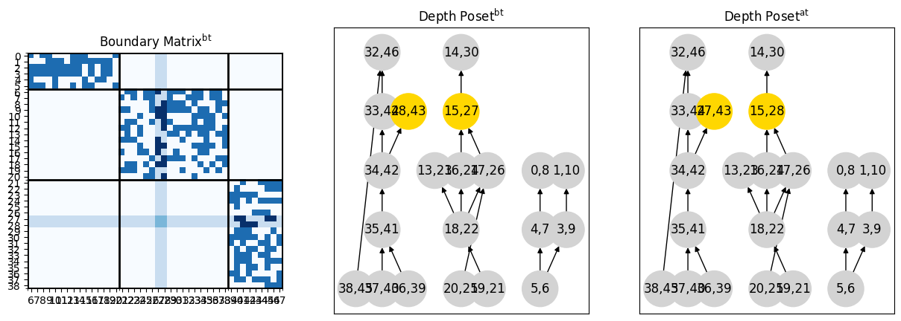

### Birth Death Pairs
|                          |                                                                                                                                                                                                               |
|:-------------------------|:--------------------------------------------------------------------------------------------------------------------------------------------------------------------------------------------------------------|
| Before the transposition | $\{(32, 46), (15, 27), (0, 8), (19, 21), (13, 23), (33, 44), (18, 22), (3, 9), (20, 25), (5, 6), (35, 41), (14, 30), (17, 26), (34, 42), (36, 39), (16, 24), (4, 7), (38, 45), (37, 40), (1, 10), (28, 43)\}$ |
| After the transposition  | $\{(32, 46), (0, 8), (19, 21), (13, 23), (27, 43), (33, 44), (18, 22), (3, 9), (20, 25), (5, 6), (35, 41), (14, 30), (17, 26), (34, 42), (36, 39), (16, 24), (15, 28), (4, 7), (38, 45), (37, 40), (1, 10)\}$ |

### Relations
|                          | Algorithm 1                                                                                                                                                                                                                                                                                                                                                                                                                                        | Algorithm 2                                                                                                                                                                                                                                                                                                                                                              |
|:-------------------------|:---------------------------------------------------------------------------------------------------------------------------------------------------------------------------------------------------------------------------------------------------------------------------------------------------------------------------------------------------------------------------------------------------------------------------------------------------|:-------------------------------------------------------------------------------------------------------------------------------------------------------------------------------------------------------------------------------------------------------------------------------------------------------------------------------------------------------------------------|
| Before the transposition | $\{(26, 30), (21, 22), (22, 23), (21, 31), (40, 44), (39, 42), (22, 26), (40, 41), (23, 31), (9, 11), (10, 12), (25, 26), (45, 46), (6, 8), (41, 42), (24, 29), (42, 44), (44, 47), (26, 29), (39, 41), (8, 11), (39, 44), (40, 43), (39, 47), (40, 46), (6, 7), (6, 10), (41, 44), (42, 43), (41, 47), (42, 46), (21, 23), (26, 31), (44, 46), (21, 26), (22, 27), (39, 46), (9, 12), (39, 43), (45, 47), (27, 29), (30, 31), (7, 8)\}$           | $\{(20, 11), (4, 0), (3, 1), (38, 29), (5, 4), (17, 15), (34, 31), (19, 12), (37, 33), (36, 31), (15, 11), (15, 14), (18, 16), (35, 32), (18, 13), (18, 11), (5, 0), (5, 3), (17, 14), (19, 14), (34, 33), (37, 29), (37, 35), (37, 32), (16, 15), (33, 31), (35, 28), (32, 29), (20, 12), (3, 2), (5, 2), (34, 29), (19, 16), (37, 31), (37, 34), (13, 12), (15, 12)\}$ |
| After the transposition  | $\{(26, 30), (21, 22), (22, 23), (21, 31), (40, 44), (39, 42), (22, 26), (40, 41), (23, 31), (9, 11), (10, 12), (45, 46), (25, 28), (6, 8), (41, 42), (24, 29), (42, 44), (44, 47), (26, 29), (39, 41), (8, 11), (39, 44), (40, 43), (39, 47), (40, 46), (28, 29), (6, 7), (6, 10), (41, 44), (42, 43), (26, 28), (41, 47), (42, 46), (21, 23), (26, 31), (44, 46), (21, 26), (39, 46), (9, 12), (39, 43), (45, 47), (7, 8), (30, 31), (25, 26)\}$ | $\{(20, 11), (4, 0), (3, 1), (38, 29), (5, 4), (17, 15), (19, 12), (34, 31), (37, 27), (37, 33), (36, 31), (15, 11), (15, 14), (18, 16), (35, 32), (18, 13), (5, 0), (5, 3), (17, 14), (19, 14), (34, 33), (37, 29), (37, 35), (37, 32), (16, 15), (33, 31), (32, 29), (20, 12), (3, 2), (5, 2), (15, 12), (34, 29), (19, 16), (37, 31), (37, 34), (13, 12), (18, 11)\}$ |

### Successors and Predecessers
|                 | $\text{Set}^\text{bt}(15, 27)$                             | $\text{Set}^\text{bt}(28, 43)$                                       | $\text{Set}^\text{at}(15, 28)$                             | $\text{Set}^\text{at}(27, 43)$                                       |
|:----------------|:-----------------------------------------------------------|:---------------------------------------------------------------------|:-----------------------------------------------------------|:---------------------------------------------------------------------|
| $\text{Succ}_1$ | $\text{Succ}_1^\text{bt}(15, 27) = \emptyset$              | $\text{Succ}_1^\text{bt}(28, 43) = \emptyset$                        | $\text{Succ}_1^\text{at}(15, 28) = \emptyset$              | $\text{Succ}_1^\text{at}(27, 43) = \emptyset$                        |
| $\text{Pred}_1$ | $\text{Pred}_1^\text{bt}(15, 27) = \{(18, 22)\}$           | $\text{Pred}_1^\text{bt}(28, 43) = \{(36, 39), (37, 40), (34, 42)\}$ | $\text{Pred}_1^\text{at}(15, 28) = \{(20, 25), (17, 26)\}$ | $\text{Pred}_1^\text{at}(27, 43) = \{(36, 39), (37, 40), (34, 42)\}$ |
| $\text{Succ}_2$ | $\text{Succ}_2^\text{bt}(15, 27) = \{(14, 30)\}$           | $\text{Succ}_2^\text{bt}(28, 43) = \emptyset$                        | $\text{Succ}_2^\text{at}(15, 28) = \{(14, 30)\}$           | $\text{Succ}_2^\text{at}(27, 43) = \emptyset$                        |
| $\text{Pred}_2$ | $\text{Pred}_2^\text{bt}(15, 27) = \{(16, 24), (17, 26)\}$ | $\text{Pred}_2^\text{bt}(28, 43) = \{(35, 41)\}$                     | $\text{Pred}_2^\text{at}(15, 28) = \{(16, 24), (17, 26)\}$ | $\text{Pred}_2^\text{at}(27, 43) = \{(37, 40)\}$                     |

### Temp Sets
|                                                              | Before the Transposition                               | After the Transposition                                |
|:-------------------------------------------------------------|:-------------------------------------------------------|:-------------------------------------------------------|
| $A_1 = \{(s, t)\in \text{BD}:\; f(a) < f(s) < f(t) < f(x)\}$ | $\{(17, 26), (18, 22), (20, 25), (16, 24), (19, 21)\}$ | $\{(17, 26), (18, 22), (20, 25), (16, 24), (19, 21)\}$ |
| $B_1 = \{(s, t)\in \text{BD}:\; U_1[t, x] = 1\}$             | $\emptyset$                                            | $\{(20, 25), (17, 26)\}$                               |
| $A_2 = \{(s, t)\in \text{BD}:\; f(b) < f(s) < f(t) < f(y)\}$ | $\{(36, 39), (35, 41), (37, 40), (34, 42)\}$           | $\{(36, 39), (35, 41), (37, 40), (34, 42)\}$           |
| $B_2 = \{(s, t)\in \text{BD}:\; U_2[b, s] = 1\}$             | $\emptyset$                                            | $\{(37, 40)\}$                                         |

### Equations
There are 4 equations are wrong.

| eq    | left (formula)                  | left (paramatrized)               | left (value)                       | right (formula)                                      | right (paramatrized)                                  | right (value)                      | correct   |
|:------|:--------------------------------|:----------------------------------|:-----------------------------------|:-----------------------------------------------------|:------------------------------------------------------|:-----------------------------------|:----------|
| Eq48  | $\text{Succ}_1^\text{at}(a, x)$ | $\text{Succ}_1^\text{at}(15, 28)$ | $\emptyset$                        | $\text{Succ}_1^\text{bt}(a, b)$                      | $\text{Succ}_1^\text{bt}(15, 27)$                     | $\emptyset$                        | ✔         |
| Eq49  | $\text{Succ}_1^\text{at}(b, y)$ | $\text{Succ}_1^\text{at}(27, 43)$ | $\emptyset$                        | $\text{Succ}_1^\text{bt}(x, y)$                      | $\text{Succ}_1^\text{bt}(28, 43)$                     | $\emptyset$                        | ✔         |
| Eq50  | $\text{Pred}_1^\text{at}(a, x)$ | $\text{Pred}_1^\text{at}(15, 28)$ | $\{(20, 25), (17, 26)\}$           | $\{(s, t)\in \text{BD}:\; U_1^\text{bt}[t, x] = 1\}$ | $\{(s, t)\in \text{BD}:\; U_1^\text{bt}[t, 28] = 1\}$ | $\emptyset$                        | ✘         |
| Eq50a | $\text{Pred}_1^\text{at}(a, x)$ | $\text{Pred}_1^\text{at}(15, 28)$ | $\{(20, 25), (17, 26)\}$           | $A_1^\text{bt} \cap B_1^\text{bt}$                   | $A_1^\text{bt} \cap B_1^\text{bt}$                    | $\emptyset$                        | ✘         |
| Eq50b | $\text{Pred}_1^\text{at}(a, x)$ | $\text{Pred}_1^\text{at}(15, 28)$ | $\{(20, 25), (17, 26)\}$           | $A_1^\text{bt} \cap B_1^\text{at}$                   | $A_1^\text{bt} \cap B_1^\text{at}$                    | $\{(20, 25), (17, 26)\}$           | ✔         |
| Eq51  | $\text{Pred}_1^\text{at}(b, y)$ | $\text{Pred}_1^\text{at}(27, 43)$ | $\{(36, 39), (37, 40), (34, 42)\}$ | $\text{Pred}_1^\text{bt}(x, y)$                      | $\text{Pred}_1^\text{bt}(28, 43)$                     | $\{(36, 39), (37, 40), (34, 42)\}$ | ✔         |
| Eq52  | $\text{Succ}_2^\text{at}(a, x)$ | $\text{Succ}_2^\text{at}(15, 28)$ | $\{(14, 30)\}$                     | $\text{Succ}_2^\text{bt}(a, b)$                      | $\text{Succ}_2^\text{bt}(15, 27)$                     | $\{(14, 30)\}$                     | ✔         |
| Eq53  | $\text{Succ}_2^\text{at}(b, y)$ | $\text{Succ}_2^\text{at}(27, 43)$ | $\emptyset$                        | $\text{Succ}_2^\text{bt}(x, y)$                      | $\text{Succ}_2^\text{bt}(28, 43)$                     | $\emptyset$                        | ✔         |
| Eq54  | $\text{Pred}_2^\text{at}(a, x)$ | $\text{Pred}_2^\text{at}(15, 28)$ | $\{(16, 24), (17, 26)\}$           | $\text{Pred}_2^\text{bt}(a, b)$                      | $\text{Pred}_2^\text{bt}(15, 27)$                     | $\{(16, 24), (17, 26)\}$           | ✔         |
| Eq55  | $\text{Pred}_2^\text{at}(b, y)$ | $\text{Pred}_2^\text{at}(27, 43)$ | $\{(37, 40)\}$                     | $\{(s, t)\in \text{BD}:\; U_2^\text{bt}[b, s] = 1\}$ | $\{(s, t)\in \text{BD}:\; U_2^\text{bt}[27, s] = 1\}$ | $\emptyset$                        | ✘         |
| Eq55a | $\text{Pred}_2^\text{at}(b, y)$ | $\text{Pred}_2^\text{at}(27, 43)$ | $\{(37, 40)\}$                     | $A_2^\text{bt} \cap B_2^\text{bt}$                   | $A_2^\text{bt} \cap B_2^\text{bt}$                    | $\emptyset$                        | ✘         |
| Eq55b | $\text{Pred}_2^\text{at}(b, y)$ | $\text{Pred}_2^\text{at}(27, 43)$ | $\{(37, 40)\}$                     | $A_2^\text{bt} \cap B_2^\text{at}$                   | $A_2^\text{bt} \cap B_2^\text{at}$                    | $\{(37, 40)\}$                     | ✔         |

## Transposition <36, 37> in complex 24
Here is a __birth-birth__ __no switch__ transposition <36, 37>.

$$
a = 36, \; b = 39, \; x = 37, \; y = 40
$$

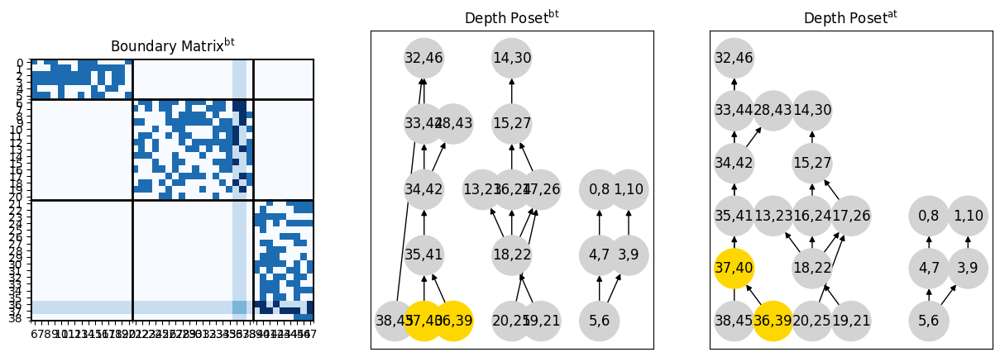

### Birth Death Pairs
|                          |                                                                                                                                                                                                               |
|:-------------------------|:--------------------------------------------------------------------------------------------------------------------------------------------------------------------------------------------------------------|
| Before the transposition | $\{(32, 46), (15, 27), (0, 8), (19, 21), (13, 23), (33, 44), (18, 22), (3, 9), (20, 25), (5, 6), (35, 41), (14, 30), (17, 26), (34, 42), (36, 39), (16, 24), (4, 7), (38, 45), (37, 40), (1, 10), (28, 43)\}$ |
| After the transposition  | $\{(32, 46), (15, 27), (0, 8), (19, 21), (13, 23), (33, 44), (18, 22), (3, 9), (20, 25), (5, 6), (35, 41), (14, 30), (17, 26), (34, 42), (36, 39), (16, 24), (4, 7), (38, 45), (37, 40), (1, 10), (28, 43)\}$ |

### Relations
|                          | Algorithm 1                                                                                                                                                                                                                                                                                                                                                                                                                              | Algorithm 2                                                                                                                                                                                                                                                                                                                                                              |
|:-------------------------|:-----------------------------------------------------------------------------------------------------------------------------------------------------------------------------------------------------------------------------------------------------------------------------------------------------------------------------------------------------------------------------------------------------------------------------------------|:-------------------------------------------------------------------------------------------------------------------------------------------------------------------------------------------------------------------------------------------------------------------------------------------------------------------------------------------------------------------------|
| Before the transposition | $\{(26, 30), (21, 22), (22, 23), (21, 31), (40, 44), (39, 42), (22, 26), (40, 41), (23, 31), (9, 11), (10, 12), (25, 26), (45, 46), (6, 8), (41, 42), (24, 29), (42, 44), (44, 47), (26, 29), (39, 41), (8, 11), (39, 44), (40, 43), (39, 47), (40, 46), (6, 7), (6, 10), (41, 44), (42, 43), (41, 47), (42, 46), (21, 23), (26, 31), (44, 46), (21, 26), (22, 27), (39, 46), (9, 12), (39, 43), (45, 47), (27, 29), (30, 31), (7, 8)\}$ | $\{(20, 11), (4, 0), (3, 1), (38, 29), (5, 4), (17, 15), (34, 31), (19, 12), (37, 33), (36, 31), (15, 11), (15, 14), (18, 16), (35, 32), (18, 13), (18, 11), (5, 0), (5, 3), (17, 14), (19, 14), (34, 33), (37, 29), (37, 35), (37, 32), (16, 15), (33, 31), (35, 28), (32, 29), (20, 12), (3, 2), (5, 2), (34, 29), (19, 16), (37, 31), (37, 34), (13, 12), (15, 12)\}$ |
| After the transposition  | $\{(26, 30), (21, 22), (22, 23), (21, 31), (40, 44), (39, 42), (22, 26), (40, 41), (23, 31), (9, 11), (10, 12), (45, 46), (6, 8), (41, 42), (24, 29), (42, 44), (44, 47), (26, 29), (8, 11), (40, 43), (39, 47), (40, 46), (6, 7), (6, 10), (41, 44), (42, 43), (41, 47), (42, 46), (21, 23), (26, 31), (44, 46), (21, 26), (22, 27), (39, 40), (9, 12), (45, 47), (27, 29), (7, 8), (30, 31), (25, 26)\}$                               | $\{(20, 11), (4, 0), (3, 1), (38, 29), (5, 4), (17, 15), (19, 12), (34, 31), (37, 33), (36, 31), (15, 11), (15, 14), (18, 16), (35, 32), (18, 13), (5, 0), (5, 3), (17, 14), (19, 14), (34, 33), (37, 29), (37, 35), (37, 32), (16, 15), (33, 31), (35, 28), (32, 29), (20, 12), (3, 2), (5, 2), (15, 12), (34, 29), (19, 16), (37, 31), (37, 34), (13, 12), (18, 11)\}$ |

### Successors and Predecessers
No such node in the Depth Poset

### Temp Sets
|                                                               | Before the Transposition                                                                                                                | After the Transposition                                                                                                                 |
|:--------------------------------------------------------------|:----------------------------------------------------------------------------------------------------------------------------------------|:----------------------------------------------------------------------------------------------------------------------------------------|
| $\mathcal{L} = \{(s, t)\in \text{BD}:\; f(t) < f(y)\}$        | $\{(14, 30), (13, 23), (17, 26), (36, 39), (15, 27), (18, 22), (3, 9), (20, 25), (5, 6), (1, 10), (16, 24), (0, 8), (19, 21), (4, 7)\}$ | $\{(14, 30), (13, 23), (17, 26), (36, 39), (15, 27), (18, 22), (3, 9), (20, 25), (5, 6), (1, 10), (16, 24), (0, 8), (19, 21), (4, 7)\}$ |
| $\mathcal{M} = \{(s, t)\in \text{BD}:\; f(y) < f(t) < f(b)\}$ | $\emptyset$                                                                                                                             | $\emptyset$                                                                                                                             |

### Equations
There are 2 equations are wrong.

| eq   | left (formula)                  | left (paramatrized)               | left (value)                                 | right (formula)                                                                        | right (paramatrized)                                                                         | right (value)            | correct   |
|:-----|:--------------------------------|:----------------------------------|:---------------------------------------------|:---------------------------------------------------------------------------------------|:---------------------------------------------------------------------------------------------|:-------------------------|:----------|
| Eq16 | $\text{Succ}_1^\text{at}(x, y)$ | $\text{Succ}_1^\text{at}(37, 40)$ | $\{(32, 46), (35, 41), (28, 43), (33, 44)\}$ | $\text{Succ}_1^\text{bt}(x, y) \oplus \{(a, b)\} \oplus \text{Succ}_1^\text{bt}(a, b)$ | $\text{Succ}_1^\text{bt}(37, 40) \oplus \{(36, 39)\} \oplus \text{Succ}_1^\text{bt}(36, 39)$ | $\{(36, 39), (34, 42)\}$ | ✘         |
| Eq17 | $\text{Pred}_1^\text{at}(a, b)$ | $\text{Pred}_1^\text{at}(36, 39)$ | $\emptyset$                                  | $\text{Pred}_1^\text{bt}(a, b) \oplus \{(x, y)\}$                                      | $\text{Pred}_1^\text{bt}(36, 39) \oplus \{(37, 40)\}$                                        | $\{(37, 40)\}$           | ✘         |

## Transposition <37, 38> in complex 24
Here is a __birth-birth__ __no switch__ transposition <37, 38>.

$$
a = 37, \; b = 40, \; x = 38, \; y = 45
$$

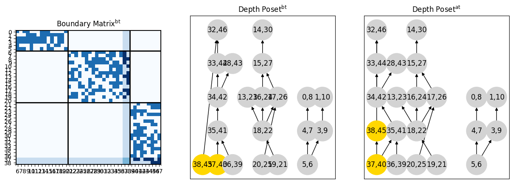

### Birth Death Pairs
|                          |                                                                                                                                                                                                               |
|:-------------------------|:--------------------------------------------------------------------------------------------------------------------------------------------------------------------------------------------------------------|
| Before the transposition | $\{(32, 46), (15, 27), (0, 8), (19, 21), (13, 23), (33, 44), (18, 22), (3, 9), (20, 25), (5, 6), (35, 41), (14, 30), (17, 26), (34, 42), (36, 39), (16, 24), (4, 7), (38, 45), (37, 40), (1, 10), (28, 43)\}$ |
| After the transposition  | $\{(32, 46), (15, 27), (0, 8), (19, 21), (13, 23), (33, 44), (18, 22), (3, 9), (20, 25), (5, 6), (35, 41), (14, 30), (17, 26), (34, 42), (36, 39), (16, 24), (4, 7), (38, 45), (37, 40), (1, 10), (28, 43)\}$ |

### Relations
|                          | Algorithm 1                                                                                                                                                                                                                                                                                                                                                                                                                                        | Algorithm 2                                                                                                                                                                                                                                                                                                                                                              |
|:-------------------------|:---------------------------------------------------------------------------------------------------------------------------------------------------------------------------------------------------------------------------------------------------------------------------------------------------------------------------------------------------------------------------------------------------------------------------------------------------|:-------------------------------------------------------------------------------------------------------------------------------------------------------------------------------------------------------------------------------------------------------------------------------------------------------------------------------------------------------------------------|
| Before the transposition | $\{(26, 30), (21, 22), (22, 23), (21, 31), (40, 44), (39, 42), (22, 26), (40, 41), (23, 31), (9, 11), (10, 12), (25, 26), (45, 46), (6, 8), (41, 42), (24, 29), (42, 44), (44, 47), (26, 29), (39, 41), (8, 11), (39, 44), (40, 43), (39, 47), (40, 46), (6, 7), (6, 10), (41, 44), (42, 43), (41, 47), (42, 46), (21, 23), (26, 31), (44, 46), (21, 26), (22, 27), (39, 46), (9, 12), (39, 43), (45, 47), (27, 29), (30, 31), (7, 8)\}$           | $\{(20, 11), (4, 0), (3, 1), (38, 29), (5, 4), (17, 15), (34, 31), (19, 12), (37, 33), (36, 31), (15, 11), (15, 14), (18, 16), (35, 32), (18, 13), (18, 11), (5, 0), (5, 3), (17, 14), (19, 14), (34, 33), (37, 29), (37, 35), (37, 32), (16, 15), (33, 31), (35, 28), (32, 29), (20, 12), (3, 2), (5, 2), (34, 29), (19, 16), (37, 31), (37, 34), (13, 12), (15, 12)\}$ |
| After the transposition  | $\{(26, 30), (21, 22), (22, 23), (21, 31), (40, 44), (39, 42), (22, 26), (40, 41), (40, 47), (23, 31), (9, 11), (10, 12), (45, 46), (6, 8), (41, 42), (24, 29), (42, 44), (44, 47), (26, 29), (39, 41), (8, 11), (39, 44), (40, 43), (39, 47), (6, 7), (6, 10), (41, 44), (42, 43), (41, 47), (42, 46), (21, 23), (26, 31), (44, 46), (21, 26), (22, 27), (39, 46), (9, 12), (40, 45), (39, 43), (45, 47), (27, 29), (7, 8), (30, 31), (25, 26)\}$ | $\{(20, 11), (4, 0), (3, 1), (38, 29), (5, 4), (17, 15), (19, 12), (34, 31), (37, 33), (36, 31), (15, 11), (15, 14), (18, 16), (35, 32), (18, 13), (5, 0), (5, 3), (17, 14), (19, 14), (34, 33), (37, 29), (37, 35), (37, 32), (16, 15), (33, 31), (35, 28), (32, 29), (20, 12), (3, 2), (5, 2), (15, 12), (34, 29), (19, 16), (37, 31), (37, 34), (13, 12), (18, 11)\}$ |

### Successors and Predecessers
No such node in the Depth Poset

### Temp Sets
|                                                               | Before the Transposition                                                                                                                                                                  | After the Transposition                                                                                                                                                                   |
|:--------------------------------------------------------------|:------------------------------------------------------------------------------------------------------------------------------------------------------------------------------------------|:------------------------------------------------------------------------------------------------------------------------------------------------------------------------------------------|
| $\mathcal{L} = \{(s, t)\in \text{BD}:\; f(t) < f(y)\}$        | $\{(15, 27), (0, 8), (19, 21), (13, 23), (33, 44), (18, 22), (3, 9), (20, 25), (5, 6), (35, 41), (14, 30), (17, 26), (34, 42), (36, 39), (16, 24), (4, 7), (37, 40), (1, 10), (28, 43)\}$ | $\{(15, 27), (0, 8), (19, 21), (13, 23), (33, 44), (18, 22), (3, 9), (20, 25), (5, 6), (35, 41), (14, 30), (17, 26), (34, 42), (36, 39), (16, 24), (4, 7), (37, 40), (1, 10), (28, 43)\}$ |
| $\mathcal{M} = \{(s, t)\in \text{BD}:\; f(y) < f(t) < f(b)\}$ | $\emptyset$                                                                                                                                                                               | $\emptyset$                                                                                                                                                                               |

### Equations
There are 2 equations are wrong.

| eq   | left (formula)                  | left (paramatrized)               | left (value)   | right (formula)                                                                        | right (paramatrized)                                                                         | right (value)                                | correct   |
|:-----|:--------------------------------|:----------------------------------|:---------------|:---------------------------------------------------------------------------------------|:---------------------------------------------------------------------------------------------|:---------------------------------------------|:----------|
| Eq16 | $\text{Succ}_1^\text{at}(x, y)$ | $\text{Succ}_1^\text{at}(38, 45)$ | $\{(32, 46)\}$ | $\text{Succ}_1^\text{bt}(x, y) \oplus \{(a, b)\} \oplus \text{Succ}_1^\text{bt}(a, b)$ | $\text{Succ}_1^\text{bt}(38, 45) \oplus \{(37, 40)\} \oplus \text{Succ}_1^\text{bt}(37, 40)$ | $\{(35, 41), (37, 40), (28, 43), (33, 44)\}$ | ✘         |
| Eq17 | $\text{Pred}_1^\text{at}(a, b)$ | $\text{Pred}_1^\text{at}(37, 40)$ | $\emptyset$    | $\text{Pred}_1^\text{bt}(a, b) \oplus \{(x, y)\}$                                      | $\text{Pred}_1^\text{bt}(37, 40) \oplus \{(38, 45)\}$                                        | $\{(38, 45)\}$                               | ✘         |

## Transposition <39, 40> in complex 24
Here is a __death-death__ __no switch__ transposition <39, 40>.

$$
a = 37, \; b = 40, \; x = 36, \; y = 39
$$

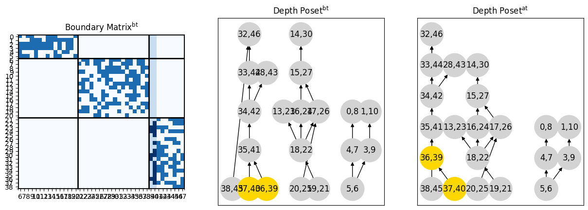

### Birth Death Pairs
|                          |                                                                                                                                                                                                               |
|:-------------------------|:--------------------------------------------------------------------------------------------------------------------------------------------------------------------------------------------------------------|
| Before the transposition | $\{(32, 46), (15, 27), (0, 8), (19, 21), (13, 23), (33, 44), (18, 22), (3, 9), (20, 25), (5, 6), (35, 41), (14, 30), (17, 26), (34, 42), (36, 39), (16, 24), (4, 7), (38, 45), (37, 40), (1, 10), (28, 43)\}$ |
| After the transposition  | $\{(32, 46), (15, 27), (0, 8), (19, 21), (13, 23), (33, 44), (18, 22), (3, 9), (20, 25), (5, 6), (35, 41), (14, 30), (17, 26), (34, 42), (36, 39), (16, 24), (4, 7), (38, 45), (37, 40), (1, 10), (28, 43)\}$ |

### Relations
|                          | Algorithm 1                                                                                                                                                                                                                                                                                                                                                                                                                              | Algorithm 2                                                                                                                                                                                                                                                                                                                                                              |
|:-------------------------|:-----------------------------------------------------------------------------------------------------------------------------------------------------------------------------------------------------------------------------------------------------------------------------------------------------------------------------------------------------------------------------------------------------------------------------------------|:-------------------------------------------------------------------------------------------------------------------------------------------------------------------------------------------------------------------------------------------------------------------------------------------------------------------------------------------------------------------------|
| Before the transposition | $\{(26, 30), (21, 22), (22, 23), (21, 31), (40, 44), (39, 42), (22, 26), (40, 41), (23, 31), (9, 11), (10, 12), (25, 26), (45, 46), (6, 8), (41, 42), (24, 29), (42, 44), (44, 47), (26, 29), (39, 41), (8, 11), (39, 44), (40, 43), (39, 47), (40, 46), (6, 7), (6, 10), (41, 44), (42, 43), (41, 47), (42, 46), (21, 23), (26, 31), (44, 46), (21, 26), (22, 27), (39, 46), (9, 12), (39, 43), (45, 47), (27, 29), (30, 31), (7, 8)\}$ | $\{(20, 11), (4, 0), (3, 1), (38, 29), (5, 4), (17, 15), (34, 31), (19, 12), (37, 33), (36, 31), (15, 11), (15, 14), (18, 16), (35, 32), (18, 13), (18, 11), (5, 0), (5, 3), (17, 14), (19, 14), (34, 33), (37, 29), (37, 35), (37, 32), (16, 15), (33, 31), (35, 28), (32, 29), (20, 12), (3, 2), (5, 2), (34, 29), (19, 16), (37, 31), (37, 34), (13, 12), (15, 12)\}$ |
| After the transposition  | $\{(26, 30), (21, 22), (22, 23), (21, 31), (22, 26), (40, 44), (39, 42), (23, 31), (40, 41), (9, 11), (10, 12), (45, 46), (6, 8), (41, 42), (24, 29), (42, 44), (44, 47), (26, 29), (39, 41), (8, 11), (39, 44), (40, 43), (39, 47), (40, 46), (6, 7), (6, 10), (41, 44), (42, 43), (41, 47), (42, 46), (21, 23), (26, 31), (44, 46), (21, 26), (22, 27), (39, 46), (9, 12), (39, 43), (45, 47), (27, 29), (7, 8), (30, 31), (25, 26)\}$ | $\{(20, 11), (4, 0), (3, 1), (38, 29), (5, 4), (17, 15), (19, 12), (34, 31), (37, 33), (36, 31), (37, 36), (15, 11), (15, 14), (18, 16), (35, 32), (18, 13), (5, 0), (5, 3), (17, 14), (19, 14), (34, 33), (37, 29), (37, 35), (37, 32), (16, 15), (33, 31), (35, 28), (32, 29), (20, 12), (3, 2), (5, 2), (15, 12), (34, 29), (19, 16), (37, 34), (13, 12), (18, 11)\}$ |

### Successors and Predecessers
No such node in the Depth Poset

### Temp Sets
|                                                               | Before the Transposition   | After the Transposition   |
|:--------------------------------------------------------------|:---------------------------|:--------------------------|
| $\mathcal{B} = \{(s, t)\in \text{BD}:\; f(s) > f(x)\}$        | $\{(37, 40), (38, 45)\}$   | $\{(37, 40), (38, 45)\}$  |
| $\mathcal{N} = \{(s, t)\in \text{BD}:\; f(x) > f(s) > f(a)\}$ | $\emptyset$                | $\emptyset$               |

### Equations
There are 2 equations are wrong.

| eq   | left (formula)                  | left (paramatrized)               | left (value)   | right (formula)                                                                        | right (paramatrized)                                                                         | right (value)                                          | correct   |
|:-----|:--------------------------------|:----------------------------------|:---------------|:---------------------------------------------------------------------------------------|:---------------------------------------------------------------------------------------------|:-------------------------------------------------------|:----------|
| Eq36 | $\text{Succ}_2^\text{at}(x, y)$ | $\text{Succ}_2^\text{at}(36, 39)$ | $\emptyset$    | $\text{Succ}_2^\text{bt}(x, y) \oplus \{(a, b)\} \oplus \text{Succ}_2^\text{bt}(a, b)$ | $\text{Succ}_2^\text{bt}(36, 39) \oplus \{(37, 40)\} \oplus \text{Succ}_2^\text{bt}(37, 40)$ | $\{(32, 46), (34, 42), (33, 44), (37, 40), (35, 41)\}$ | ✘         |
| Eq37 | $\text{Pred}_2^\text{at}(a, b)$ | $\text{Pred}_2^\text{at}(37, 40)$ | $\emptyset$    | $\text{Pred}_2^\text{bt}(a, b) \oplus \{(x, y)\}$                                      | $\text{Pred}_2^\text{bt}(37, 40) \oplus \{(36, 39)\}$                                        | $\{(36, 39)\}$                                         | ✘         |

## Transposition <41, 42> in complex 24
Here is a __death-death__ __switch forward__ transposition <41, 42>.

$$
a = 34, \; b = 42, \; x = 35, \; y = 41
$$

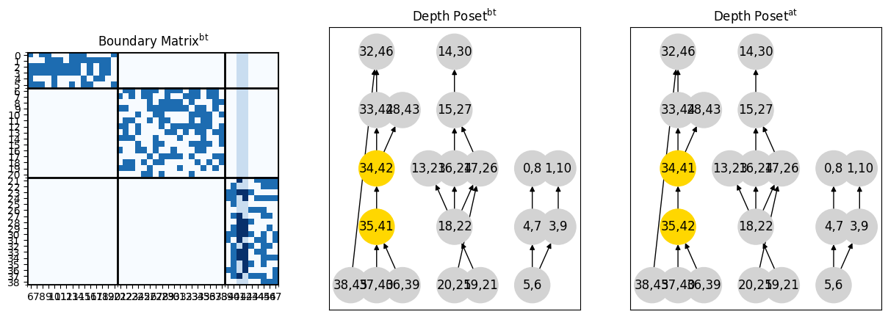

### Birth Death Pairs
|                          |                                                                                                                                                                                                               |
|:-------------------------|:--------------------------------------------------------------------------------------------------------------------------------------------------------------------------------------------------------------|
| Before the transposition | $\{(32, 46), (15, 27), (0, 8), (19, 21), (13, 23), (33, 44), (18, 22), (3, 9), (20, 25), (5, 6), (35, 41), (14, 30), (17, 26), (34, 42), (36, 39), (16, 24), (4, 7), (38, 45), (37, 40), (1, 10), (28, 43)\}$ |
| After the transposition  | $\{(32, 46), (15, 27), (35, 42), (0, 8), (19, 21), (13, 23), (33, 44), (18, 22), (3, 9), (20, 25), (5, 6), (14, 30), (17, 26), (36, 39), (16, 24), (4, 7), (38, 45), (34, 41), (37, 40), (1, 10), (28, 43)\}$ |

### Relations
|                          | Algorithm 1                                                                                                                                                                                                                                                                                                                                                                                                                              | Algorithm 2                                                                                                                                                                                                                                                                                                                                                                                                      |
|:-------------------------|:-----------------------------------------------------------------------------------------------------------------------------------------------------------------------------------------------------------------------------------------------------------------------------------------------------------------------------------------------------------------------------------------------------------------------------------------|:-----------------------------------------------------------------------------------------------------------------------------------------------------------------------------------------------------------------------------------------------------------------------------------------------------------------------------------------------------------------------------------------------------------------|
| Before the transposition | $\{(26, 30), (21, 22), (22, 23), (21, 31), (40, 44), (39, 42), (22, 26), (40, 41), (23, 31), (9, 11), (10, 12), (25, 26), (45, 46), (6, 8), (41, 42), (24, 29), (42, 44), (44, 47), (26, 29), (39, 41), (8, 11), (39, 44), (40, 43), (39, 47), (40, 46), (6, 7), (6, 10), (41, 44), (42, 43), (41, 47), (42, 46), (21, 23), (26, 31), (44, 46), (21, 26), (22, 27), (39, 46), (9, 12), (39, 43), (45, 47), (27, 29), (30, 31), (7, 8)\}$ | $\{(20, 11), (4, 0), (3, 1), (38, 29), (5, 4), (17, 15), (34, 31), (19, 12), (37, 33), (36, 31), (15, 11), (15, 14), (18, 16), (35, 32), (18, 13), (18, 11), (5, 0), (5, 3), (17, 14), (19, 14), (34, 33), (37, 29), (37, 35), (37, 32), (16, 15), (33, 31), (35, 28), (32, 29), (20, 12), (3, 2), (5, 2), (34, 29), (19, 16), (37, 31), (37, 34), (13, 12), (15, 12)\}$                                         |
| After the transposition  | $\{(41, 43), (26, 30), (41, 46), (21, 22), (22, 23), (21, 31), (40, 44), (22, 26), (39, 42), (23, 31), (40, 41), (9, 11), (10, 12), (45, 46), (6, 8), (42, 41), (24, 29), (42, 47), (42, 44), (44, 47), (26, 29), (39, 41), (8, 11), (39, 44), (40, 43), (39, 47), (40, 46), (6, 7), (6, 10), (41, 47), (21, 23), (26, 31), (44, 46), (21, 26), (22, 27), (39, 46), (9, 12), (39, 43), (45, 47), (27, 29), (7, 8), (30, 31), (25, 26)\}$ | $\{(20, 11), (4, 0), (35, 33), (3, 1), (38, 29), (5, 4), (17, 15), (19, 12), (34, 31), (37, 33), (36, 31), (15, 11), (15, 14), (18, 16), (35, 32), (18, 13), (35, 29), (5, 0), (5, 3), (17, 14), (19, 14), (34, 33), (37, 29), (37, 35), (37, 32), (16, 15), (33, 31), (35, 28), (32, 29), (35, 31), (20, 12), (3, 2), (35, 34), (5, 2), (15, 12), (34, 29), (19, 16), (37, 31), (37, 34), (13, 12), (18, 11)\}$ |

### Successors and Predecessers
|                 | $\text{Set}^\text{bt}(34, 42)$                                       | $\text{Set}^\text{bt}(35, 41)$                             | $\text{Set}^\text{at}(35, 42)$                                                 | $\text{Set}^\text{at}(34, 41)$                                       |
|:----------------|:---------------------------------------------------------------------|:-----------------------------------------------------------|:-------------------------------------------------------------------------------|:---------------------------------------------------------------------|
| $\text{Succ}_1$ | $\text{Succ}_1^\text{bt}(34, 42) = \{(33, 44), (28, 43), (32, 46)\}$ | $\text{Succ}_1^\text{bt}(35, 41) = \{(34, 42), (33, 44)\}$ | $\text{Succ}_1^\text{at}(35, 42) = \{(34, 41), (33, 44)\}$                     | $\text{Succ}_1^\text{at}(34, 41) = \{(28, 43), (32, 46)\}$           |
| $\text{Pred}_1$ | $\text{Pred}_1^\text{bt}(34, 42) = \{(36, 39), (35, 41)\}$           | $\text{Pred}_1^\text{bt}(35, 41) = \{(36, 39), (37, 40)\}$ | $\text{Pred}_1^\text{at}(35, 42) = \{(36, 39)\}$                               | $\text{Pred}_1^\text{at}(34, 41) = \{(36, 39), (35, 42), (37, 40)\}$ |
| $\text{Succ}_2$ | $\text{Succ}_2^\text{bt}(34, 42) = \{(33, 44)\}$                     | $\text{Succ}_2^\text{bt}(35, 41) = \{(28, 43), (32, 46)\}$ | $\text{Succ}_2^\text{at}(35, 42) = \{(33, 44), (34, 41), (28, 43), (32, 46)\}$ | $\text{Succ}_2^\text{at}(34, 41) = \{(33, 44)\}$                     |
| $\text{Pred}_2$ | $\text{Pred}_2^\text{bt}(34, 42) = \{(37, 40)\}$                     | $\text{Pred}_2^\text{bt}(35, 41) = \{(37, 40)\}$           | $\text{Pred}_2^\text{at}(35, 42) = \{(37, 40)\}$                               | $\text{Pred}_2^\text{at}(34, 41) = \{(35, 42), (37, 40)\}$           |

### Temp Sets
|                                                               | Before the Transposition           | After the Transposition            |
|:--------------------------------------------------------------|:-----------------------------------|:-----------------------------------|
| $\mathcal{B} = \{(s, t)\in \text{BD}:\; f(s) > f(x)\}$        | $\{(36, 39), (37, 40), (38, 45)\}$ | $\{(36, 39), (37, 40), (38, 45)\}$ |
| $\mathcal{N} = \{(s, t)\in \text{BD}:\; f(x) > f(s) > f(a)\}$ | $\emptyset$                        | $\emptyset$                        |

### Equations
There are 1 equations are wrong.

| eq   | left (formula)                  | left (paramatrized)               | left (value)                                 | right (formula)                                                                                          | right (paramatrized)                                                                                           | right (value)                                | correct   |
|:-----|:--------------------------------|:----------------------------------|:---------------------------------------------|:---------------------------------------------------------------------------------------------------------|:---------------------------------------------------------------------------------------------------------------|:---------------------------------------------|:----------|
| Eq28 | $\text{Succ}_1^\text{at}(x, b)$ | $\text{Succ}_1^\text{at}(35, 42)$ | $\{(34, 41), (33, 44)\}$                     | $\text{Succ}_1^\text{bt}(x, y) \oplus \{(a, y), (a, b)\}$                                                | $\text{Succ}_1^\text{bt}(35, 41) \oplus \{(34, 41), (34, 42)\}$                                                | $\{(34, 41), (33, 44)\}$                     | ✔         |
| Eq29 | $\text{Succ}_1^\text{at}(a, y)$ | $\text{Succ}_1^\text{at}(34, 41)$ | $\{(28, 43), (32, 46)\}$                     | $\text{Succ}_1^\text{bt}(a, b)$                                                                          | $\text{Succ}_1^\text{bt}(34, 42)$                                                                              | $\{(33, 44), (28, 43), (32, 46)\}$           | ✘         |
| Eq30 | $\text{Pred}_1^\text{at}(x, b)$ | $\text{Pred}_1^\text{at}(35, 42)$ | $\{(36, 39)\}$                               | $[\text{Pred}_1^\text{bt}(a, b) \cap \mathcal{B}]$                                                       | $[\text{Pred}_1^\text{bt}(34, 42) \cap \mathcal{B}]$                                                           | $\{(36, 39)\}$                               | ✔         |
| Eq31 | $\text{Pred}_1^\text{at}(a, y)$ | $\text{Pred}_1^\text{at}(34, 41)$ | $\{(36, 39), (35, 42), (37, 40)\}$           | $\text{Pred}_1^\text{bt}(x, y) \oplus \{(x, b)\} \oplus[\text{Pred}_1^\text{bt}(a, b) \cap \mathcal{N}]$ | $\text{Pred}_1^\text{bt}(35, 41) \oplus \{(35, 42)\} \oplus[\text{Pred}_1^\text{bt}(34, 42) \cap \mathcal{N}]$ | $\{(36, 39), (35, 42), (37, 40)\}$           | ✔         |
| Eq32 | $\text{Succ}_2^\text{at}(x, b)$ | $\text{Succ}_2^\text{at}(35, 42)$ | $\{(33, 44), (34, 41), (28, 43), (32, 46)\}$ | $\text{Succ}_2^\text{bt}(x, y) \oplus \{(a, y)\} \oplus \text{Succ}_2^\text{bt}(a, b)$                   | $\text{Succ}_2^\text{bt}(35, 41) \oplus \{(34, 41)\} \oplus \text{Succ}_2^\text{bt}(34, 42)$                   | $\{(28, 43), (34, 41), (32, 46), (33, 44)\}$ | ✔         |
| Eq33 | $\text{Succ}_2^\text{at}(a, y)$ | $\text{Succ}_2^\text{at}(34, 41)$ | $\{(33, 44)\}$                               | $\text{Succ}_2^\text{bt}(a, b)$                                                                          | $\text{Succ}_2^\text{bt}(34, 42)$                                                                              | $\{(33, 44)\}$                               | ✔         |
| Eq34 | $\text{Pred}_2^\text{at}(x, b)$ | $\text{Pred}_2^\text{at}(35, 42)$ | $\{(37, 40)\}$                               | $\text{Pred}_2^\text{bt}(x, y)$                                                                          | $\text{Pred}_2^\text{bt}(35, 41)$                                                                              | $\{(37, 40)\}$                               | ✔         |
| Eq35 | $\text{Pred}_2^\text{at}(a, y)$ | $\text{Pred}_2^\text{at}(34, 41)$ | $\{(35, 42), (37, 40)\}$                     | $\text{Pred}_2^\text{bt}(a, b) \oplus \{(x, b)\}$                                                        | $\text{Pred}_2^\text{bt}(34, 42) \oplus \{(35, 42)\}$                                                          | $\{(35, 42), (37, 40)\}$                     | ✔         |

## Transposition <43, 44> in complex 24
Here is a __death-death__ __no switch__ transposition <43, 44>.

$$
a = 33, \; b = 44, \; x = 28, \; y = 43
$$

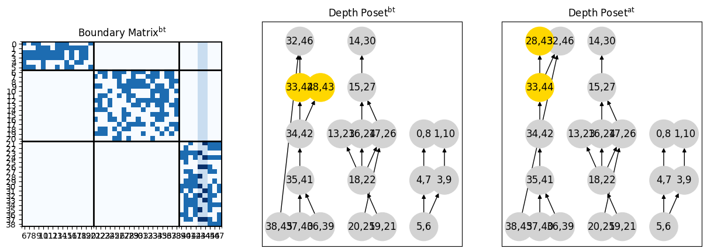

### Birth Death Pairs
|                          |                                                                                                                                                                                                               |
|:-------------------------|:--------------------------------------------------------------------------------------------------------------------------------------------------------------------------------------------------------------|
| Before the transposition | $\{(32, 46), (15, 27), (0, 8), (19, 21), (13, 23), (33, 44), (18, 22), (3, 9), (20, 25), (5, 6), (35, 41), (14, 30), (17, 26), (34, 42), (36, 39), (16, 24), (4, 7), (38, 45), (37, 40), (1, 10), (28, 43)\}$ |
| After the transposition  | $\{(32, 46), (15, 27), (0, 8), (19, 21), (13, 23), (33, 44), (18, 22), (3, 9), (20, 25), (5, 6), (35, 41), (14, 30), (17, 26), (34, 42), (36, 39), (16, 24), (4, 7), (38, 45), (37, 40), (1, 10), (28, 43)\}$ |

### Relations
|                          | Algorithm 1                                                                                                                                                                                                                                                                                                                                                                                                                              | Algorithm 2                                                                                                                                                                                                                                                                                                                                                                        |
|:-------------------------|:-----------------------------------------------------------------------------------------------------------------------------------------------------------------------------------------------------------------------------------------------------------------------------------------------------------------------------------------------------------------------------------------------------------------------------------------|:-----------------------------------------------------------------------------------------------------------------------------------------------------------------------------------------------------------------------------------------------------------------------------------------------------------------------------------------------------------------------------------|
| Before the transposition | $\{(26, 30), (21, 22), (22, 23), (21, 31), (40, 44), (39, 42), (22, 26), (40, 41), (23, 31), (9, 11), (10, 12), (25, 26), (45, 46), (6, 8), (41, 42), (24, 29), (42, 44), (44, 47), (26, 29), (39, 41), (8, 11), (39, 44), (40, 43), (39, 47), (40, 46), (6, 7), (6, 10), (41, 44), (42, 43), (41, 47), (42, 46), (21, 23), (26, 31), (44, 46), (21, 26), (22, 27), (39, 46), (9, 12), (39, 43), (45, 47), (27, 29), (30, 31), (7, 8)\}$ | $\{(20, 11), (4, 0), (3, 1), (38, 29), (5, 4), (17, 15), (34, 31), (19, 12), (37, 33), (36, 31), (15, 11), (15, 14), (18, 16), (35, 32), (18, 13), (18, 11), (5, 0), (5, 3), (17, 14), (19, 14), (34, 33), (37, 29), (37, 35), (37, 32), (16, 15), (33, 31), (35, 28), (32, 29), (20, 12), (3, 2), (5, 2), (34, 29), (19, 16), (37, 31), (37, 34), (13, 12), (15, 12)\}$           |
| After the transposition  | $\{(26, 30), (21, 22), (22, 23), (21, 31), (22, 26), (39, 42), (40, 44), (40, 41), (23, 31), (9, 11), (10, 12), (45, 46), (6, 8), (41, 42), (24, 29), (42, 44), (26, 29), (44, 47), (39, 41), (8, 11), (39, 44), (40, 43), (39, 47), (40, 46), (6, 7), (6, 10), (41, 44), (42, 43), (41, 47), (42, 46), (21, 23), (26, 31), (44, 46), (21, 26), (22, 27), (39, 46), (9, 12), (39, 43), (45, 47), (27, 29), (7, 8), (30, 31), (25, 26)\}$ | $\{(20, 11), (4, 0), (3, 1), (38, 29), (5, 4), (17, 15), (19, 12), (34, 31), (37, 33), (36, 31), (15, 11), (15, 14), (18, 16), (35, 32), (18, 13), (5, 0), (5, 3), (17, 14), (19, 14), (34, 33), (37, 29), (37, 35), (37, 32), (33, 28), (16, 15), (33, 31), (35, 28), (32, 29), (20, 12), (3, 2), (5, 2), (15, 12), (34, 29), (19, 16), (37, 31), (37, 34), (13, 12), (18, 11)\}$ |

### Successors and Predecessers
No such node in the Depth Poset

### Temp Sets
|                                                               | Before the Transposition                                                   | After the Transposition                                                    |
|:--------------------------------------------------------------|:---------------------------------------------------------------------------|:---------------------------------------------------------------------------|
| $\mathcal{B} = \{(s, t)\in \text{BD}:\; f(s) > f(x)\}$        | $\{(32, 46), (38, 45), (36, 39), (34, 42), (33, 44), (37, 40), (35, 41)\}$ | $\{(32, 46), (38, 45), (36, 39), (34, 42), (33, 44), (37, 40), (35, 41)\}$ |
| $\mathcal{N} = \{(s, t)\in \text{BD}:\; f(x) > f(s) > f(a)\}$ | $\emptyset$                                                                | $\emptyset$                                                                |

### Equations
There are 2 equations are wrong.

| eq   | left (formula)                  | left (paramatrized)               | left (value)             | right (formula)                                                                        | right (paramatrized)                                                                         | right (value)                      | correct   |
|:-----|:--------------------------------|:----------------------------------|:-------------------------|:---------------------------------------------------------------------------------------|:---------------------------------------------------------------------------------------------|:-----------------------------------|:----------|
| Eq36 | $\text{Succ}_2^\text{at}(x, y)$ | $\text{Succ}_2^\text{at}(28, 43)$ | $\emptyset$              | $\text{Succ}_2^\text{bt}(x, y) \oplus \{(a, b)\} \oplus \text{Succ}_2^\text{bt}(a, b)$ | $\text{Succ}_2^\text{bt}(28, 43) \oplus \{(33, 44)\} \oplus \text{Succ}_2^\text{bt}(33, 44)$ | $\{(33, 44)\}$                     | ✘         |
| Eq37 | $\text{Pred}_2^\text{at}(a, b)$ | $\text{Pred}_2^\text{at}(33, 44)$ | $\{(37, 40), (34, 42)\}$ | $\text{Pred}_2^\text{bt}(a, b) \oplus \{(x, y)\}$                                      | $\text{Pred}_2^\text{bt}(33, 44) \oplus \{(28, 43)\}$                                        | $\{(37, 40), (28, 43), (34, 42)\}$ | ✘         |