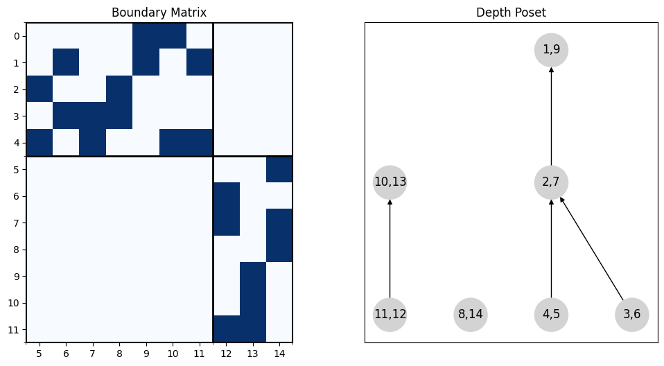
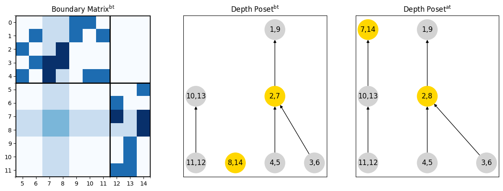
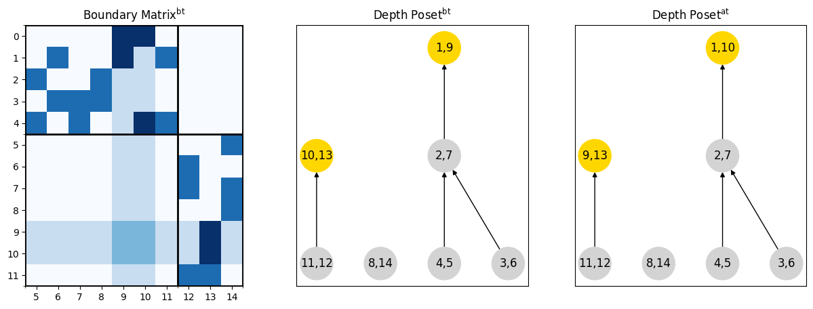

# Data 
We have 1 complex.

## Complex 0
The complex dimendion 2 with 15 cells:

|   Dimension |   Number of Cells |   Betti Number |
|------------:|------------------:|---------------:|
|           0 |                 5 |              1 |
|           1 |                 7 |              0 |
|           2 |                 3 |              0 |

Its Depth Poset has 7 nodes.

# Transpositions
In this data we got 11 by transposing consecutive pairs. The distribution of the transposition types is given in the table:

| transposition_type   |   no switch (nested) |   no switch (not nested) |   switch forward |
|:---------------------|---------------------:|-------------------------:|-----------------:|
| birth-birth          |                    2 |                        1 |                1 |
| birth-death          |                    0 |                        1 |                2 |
| death-death          |                    0 |                        2 |                2 |

# Equations
We checked 38 equations. And we can see the distribution of transposiions, satysfying these equations in the tables:

## Birth-Birth Transpositions
| Name      | Formula                                                                                                                                   | Transposition Type   | Switch Type            | Correct   |
|:----------|:------------------------------------------------------------------------------------------------------------------------------------------|:---------------------|:-----------------------|:----------|
| Eq08      | $\text{Succ}_1^\text{at}(a, y) = \text{Succ}_1^\text{bt}(x, y) \oplus \{(x, b)\} \oplus \text{Succ}_1^\text{bt}(a, b)$                    | birth-birth          | switch forward         | 100%      |
| Eq09      | $\text{Succ}_1^\text{at}(x, b) = \text{Succ}_1^\text{bt}(a, b)$                                                                           | birth-birth          | switch forward         | 100%      |
| Eq10      | $\text{Pred}_1^\text{at}(a, y) = \text{Pred}_1^\text{bt}(x, y)$                                                                           | birth-birth          | switch forward         | 100%      |
| Eq11      | $\text{Pred}_1^\text{at}(x, b) = \text{Pred}_1^\text{bt}(a, b) \oplus \{(a, y)\}$                                                         | birth-birth          | switch forward         | 100%      |
| Eq12      | $\text{Succ}_2^\text{at}(a, y) = \text{Succ}_2^\text{bt}(x, y) \oplus \{(x, b), (a, b)\}$                                                 | birth-birth          | switch forward         | 100%      |
| Eq13      | $\text{Succ}_2^\text{at}(x, b) = \text{Succ}_2^\text{bt}(a, b)$                                                                           | birth-birth          | switch forward         | 100%      |
| Eq14      | $\text{Pred}_2^\text{at}(a, y) = [\text{Pred}_2^\text{bt}(a, b) \cap \mathcal{L}]$                                                        | birth-birth          | switch forward         | 100%      |
| Eq15      | $\text{Pred}_2^\text{at}(x, b) = \text{Pred}_2^\text{bt}(x, y) \oplus \{(a, y)\} \oplus [\text{Pred}_2^\text{bt}(a, b) \cap \mathcal{M}]$ | birth-birth          | switch forward         | 100%      |
| Eq16      | $\text{Succ}_1^\text{at}(x, y) = \text{Succ}_1^\text{bt}(x, y) \oplus \{(a, b)\} \oplus \text{Succ}_1^\text{bt}(a, b)$                    | birth-birth          | no switch (nested)     | 100%      |
| Eq17      | $\text{Pred}_1^\text{at}(a, b) = \text{Pred}_1^\text{bt}(a, b) \oplus \{(x, y)\}$                                                         | birth-birth          | no switch (nested)     | 100%      |
| EqPred1ab | $\text{Pred}_1^\text{at}(a, b) = \text{Pred}_1^\text{bt}(a, b)$                                                                           | birth-birth          | no switch (not nested) | 100%      |
| EqPred1xy | $\text{Pred}_1^\text{at}(x, y) = \text{Pred}_1^\text{bt}(x, y)$                                                                           | birth-birth          | no switch (not nested) | 100%      |
| EqPred2ab | $\text{Pred}_2^\text{at}(a, b) = \text{Pred}_2^\text{bt}(a, b)$                                                                           | birth-birth          | no switch (not nested) | 100%      |
| EqPred2xy | $\text{Pred}_2^\text{at}(x, y) = \text{Pred}_2^\text{bt}(x, y)$                                                                           | birth-birth          | no switch (not nested) | 100%      |
| EqSucc1ab | $\text{Succ}_1^\text{at}(a, b) = \text{Succ}_1^\text{bt}(a, b)$                                                                           | birth-birth          | no switch (not nested) | 100%      |
| EqSucc1xy | $\text{Succ}_1^\text{at}(x, y) = \text{Succ}_1^\text{bt}(x, y)$                                                                           | birth-birth          | no switch (not nested) | 100%      |
| EqSucc2ab | $\text{Succ}_2^\text{at}(a, b) = \text{Succ}_2^\text{bt}(a, b)$                                                                           | birth-birth          | no switch (not nested) | 100%      |
| EqSucc2xy | $\text{Succ}_2^\text{at}(x, y) = \text{Succ}_2^\text{bt}(x, y)$                                                                           | birth-birth          | no switch (not nested) | 100%      |

## Death-Death Transpositions
| Name      | Formula                                                                                                                                  | Transposition Type   | Switch Type            | Correct   |
|:----------|:-----------------------------------------------------------------------------------------------------------------------------------------|:---------------------|:-----------------------|:----------|
| Eq28      | $\text{Succ}_1^\text{at}(x, b) = \text{Succ}_1^\text{bt}(x, y) \oplus \{(a, y), (a, b)\}$                                                | death-death          | switch forward         | 100%      |
| Eq29      | $\text{Succ}_1^\text{at}(a, y) = \text{Succ}_1^\text{bt}(a, b)$                                                                          | death-death          | switch forward         | 100%      |
| Eq30      | $\text{Pred}_1^\text{at}(x, b) = [\text{Pred}_1^\text{bt}(a, b) \cap \mathcal{B}]$                                                       | death-death          | switch forward         | 100%      |
| Eq31      | $\text{Pred}_1^\text{at}(a, y) = \text{Pred}_1^\text{bt}(x, y) \oplus \{(x, b)\} \oplus[\text{Pred}_1^\text{bt}(a, b) \cap \mathcal{N}]$ | death-death          | switch forward         | 100%      |
| Eq32      | $\text{Succ}_2^\text{at}(x, b) = \text{Succ}_2^\text{bt}(x, y) \oplus \{(a, y)\} \oplus \text{Succ}_2^\text{bt}(a, b)$                   | death-death          | switch forward         | 100%      |
| Eq33      | $\text{Succ}_2^\text{at}(a, y) = \text{Succ}_2^\text{bt}(a, b)$                                                                          | death-death          | switch forward         | 100%      |
| Eq34      | $\text{Pred}_2^\text{at}(x, b) = \text{Pred}_2^\text{bt}(x, y)$                                                                          | death-death          | switch forward         | 100%      |
| Eq35      | $\text{Pred}_2^\text{at}(a, y) = \text{Pred}_2^\text{bt}(a, b) \oplus \{(x, b)\}$                                                        | death-death          | switch forward         | 100%      |
| EqPred1ab | $\text{Pred}_1^\text{at}(a, b) = \text{Pred}_1^\text{bt}(a, b)$                                                                          | death-death          | no switch (not nested) | 100%      |
| EqPred1xy | $\text{Pred}_1^\text{at}(x, y) = \text{Pred}_1^\text{bt}(x, y)$                                                                          | death-death          | no switch (not nested) | 100%      |
| EqPred2ab | $\text{Pred}_2^\text{at}(a, b) = \text{Pred}_2^\text{bt}(a, b)$                                                                          | death-death          | no switch (not nested) | 100%      |
| EqPred2xy | $\text{Pred}_2^\text{at}(x, y) = \text{Pred}_2^\text{bt}(x, y)$                                                                          | death-death          | no switch (not nested) | 100%      |
| EqSucc1ab | $\text{Succ}_1^\text{at}(a, b) = \text{Succ}_1^\text{bt}(a, b)$                                                                          | death-death          | no switch (not nested) | 100%      |
| EqSucc1xy | $\text{Succ}_1^\text{at}(x, y) = \text{Succ}_1^\text{bt}(x, y)$                                                                          | death-death          | no switch (not nested) | 100%      |
| EqSucc2ab | $\text{Succ}_2^\text{at}(a, b) = \text{Succ}_2^\text{bt}(a, b)$                                                                          | death-death          | no switch (not nested) | 100%      |
| EqSucc2xy | $\text{Succ}_2^\text{at}(x, y) = \text{Succ}_2^\text{bt}(x, y)$                                                                          | death-death          | no switch (not nested) | 100%      |

## Birth-Death Transpositions
| Name      | Formula                                                                              | Transposition Type   | Switch Type            | Correct   |
|:----------|:-------------------------------------------------------------------------------------|:---------------------|:-----------------------|:----------|
| Eq48      | $\text{Succ}_1^\text{at}(a, x) = \text{Succ}_1^\text{bt}(a, b)$                      | birth-death          | switch forward         | 100%      |
| Eq49      | $\text{Succ}_1^\text{at}(b, y) = \text{Succ}_1^\text{bt}(x, y)$                      | birth-death          | switch forward         | 100%      |
| Eq50      | $\text{Pred}_1^\text{at}(a, x) = \{(s, t)\in \text{BD}:\; U_1^\text{bt}[t, x] = 1\}$ | birth-death          | switch forward         | 0%        |
| Eq50a     | $\text{Pred}_1^\text{at}(a, x) = A_1^\text{bt} \cap B_1^\text{bt}$                   | birth-death          | switch forward         | 0%        |
| Eq50b     | $\text{Pred}_1^\text{at}(a, x) = A_1^\text{bt} \cap B_1^\text{at}$                   | birth-death          | switch forward         | 100%      |
| Eq51      | $\text{Pred}_1^\text{at}(b, y) = \text{Pred}_1^\text{bt}(x, y)$                      | birth-death          | switch forward         | 100%      |
| Eq52      | $\text{Succ}_2^\text{at}(a, x) = \text{Succ}_2^\text{bt}(a, b)$                      | birth-death          | switch forward         | 100%      |
| Eq53      | $\text{Succ}_2^\text{at}(b, y) = \text{Succ}_2^\text{bt}(x, y)$                      | birth-death          | switch forward         | 100%      |
| Eq54      | $\text{Pred}_2^\text{at}(a, x) = \text{Pred}_2^\text{bt}(a, b)$                      | birth-death          | switch forward         | 100%      |
| Eq55      | $\text{Pred}_2^\text{at}(b, y) = \{(s, t)\in \text{BD}:\; U_2^\text{bt}[b, s] = 1\}$ | birth-death          | switch forward         | 50%       |
| Eq55a     | $\text{Pred}_2^\text{at}(b, y) = A_2^\text{bt} \cap B_2^\text{bt}$                   | birth-death          | switch forward         | 50%       |
| Eq55b     | $\text{Pred}_2^\text{at}(b, y) = A_2^\text{bt} \cap B_2^\text{at}$                   | birth-death          | switch forward         | 100%      |
| EqPred1ab | $\text{Pred}_1^\text{at}(a, b) = \text{Pred}_1^\text{bt}(a, b)$                      | birth-death          | no switch (not nested) | 100%      |
| EqPred1xy | $\text{Pred}_1^\text{at}(x, y) = \text{Pred}_1^\text{bt}(x, y)$                      | birth-death          | no switch (not nested) | 100%      |
| EqPred2ab | $\text{Pred}_2^\text{at}(a, b) = \text{Pred}_2^\text{bt}(a, b)$                      | birth-death          | no switch (not nested) | 100%      |
| EqPred2xy | $\text{Pred}_2^\text{at}(x, y) = \text{Pred}_2^\text{bt}(x, y)$                      | birth-death          | no switch (not nested) | 100%      |
| EqSucc1ab | $\text{Succ}_1^\text{at}(a, b) = \text{Succ}_1^\text{bt}(a, b)$                      | birth-death          | no switch (not nested) | 100%      |
| EqSucc1xy | $\text{Succ}_1^\text{at}(x, y) = \text{Succ}_1^\text{bt}(x, y)$                      | birth-death          | no switch (not nested) | 100%      |
| EqSucc2ab | $\text{Succ}_2^\text{at}(a, b) = \text{Succ}_2^\text{bt}(a, b)$                      | birth-death          | no switch (not nested) | 100%      |
| EqSucc2xy | $\text{Succ}_2^\text{at}(x, y) = \text{Succ}_2^\text{bt}(x, y)$                      | birth-death          | no switch (not nested) | 100%      |

# Incorrect Equations
We have 2 transpositions, such that some equations are incorrect.

## Transposition <7, 8> in complex 0
Here is a __birth-death__ __switch forward__ transposition <7, 8>.

$$
a = 2, \; b = 7, \; x = 8, \; y = 14
$$

### Birth Death Pairs
|                          |                                                                   |
|:-------------------------|:------------------------------------------------------------------|
| Before the transposition | $\{(8, 14), (2, 7), (10, 13), (11, 12), (4, 5), (3, 6), (1, 9)\}$ |
| After the transposition  | $\{(2, 8), (10, 13), (11, 12), (4, 5), (3, 6), (1, 9), (7, 14)\}$ |

### Relations
|                          | Algorithm 1                    | Algorithm 2                                            |
|:-------------------------|:-------------------------------|:-------------------------------------------------------|
| Before the transposition | $\{(6, 7), (12, 13), (5, 7)\}$ | $\{(3, 1), (1, 0), (2, 1), (4, 2)\}$                   |
| After the transposition  | $\{(6, 8), (12, 13)\}$         | $\{(11, 7), (2, 1), (3, 1), (10, 7), (4, 2), (1, 0)\}$ |

### Successors and Predecessers
|                 | $\text{Set}^\text{bt}(2, 7)$                         | $\text{Set}^\text{bt}(8, 14)$                | $\text{Set}^\text{at}(2, 8)$                 | $\text{Set}^\text{at}(7, 14)$                             |
|:----------------|:-----------------------------------------------------|:---------------------------------------------|:---------------------------------------------|:----------------------------------------------------------|
| $\text{Succ}_1$ | $\text{Succ}_1^\text{bt}(2, 7) = \emptyset$          | $\text{Succ}_1^\text{bt}(8, 14) = \emptyset$ | $\text{Succ}_1^\text{at}(2, 8) = \emptyset$  | $\text{Succ}_1^\text{at}(7, 14) = \emptyset$              |
| $\text{Pred}_1$ | $\text{Pred}_1^\text{bt}(2, 7) = \{(4, 5), (3, 6)\}$ | $\text{Pred}_1^\text{bt}(8, 14) = \emptyset$ | $\text{Pred}_1^\text{at}(2, 8) = \{(3, 6)\}$ | $\text{Pred}_1^\text{at}(7, 14) = \emptyset$              |
| $\text{Succ}_2$ | $\text{Succ}_2^\text{bt}(2, 7) = \{(1, 9)\}$         | $\text{Succ}_2^\text{bt}(8, 14) = \emptyset$ | $\text{Succ}_2^\text{at}(2, 8) = \{(1, 9)\}$ | $\text{Succ}_2^\text{at}(7, 14) = \emptyset$              |
| $\text{Pred}_2$ | $\text{Pred}_2^\text{bt}(2, 7) = \{(4, 5)\}$         | $\text{Pred}_2^\text{bt}(8, 14) = \emptyset$ | $\text{Pred}_2^\text{at}(2, 8) = \{(4, 5)\}$ | $\text{Pred}_2^\text{at}(7, 14) = \{(11, 12), (10, 13)\}$ |

### Temp Sets
|                                                              | Before the Transposition   | After the Transposition   |
|:-------------------------------------------------------------|:---------------------------|:--------------------------|
| $A_1 = \{(s, t)\in \text{BD}:\; f(a) < f(s) < f(t) < f(x)\}$ | $\{(4, 5), (3, 6)\}$       | $\{(4, 5), (3, 6)\}$      |
| $B_1 = \{(s, t)\in \text{BD}:\; U_1[t, x] = 1\}$             | $\emptyset$                | $\{(3, 6)\}$              |
| $A_2 = \{(s, t)\in \text{BD}:\; f(b) < f(s) < f(t) < f(y)\}$ | $\{(11, 12), (10, 13)\}$   | $\{(11, 12), (10, 13)\}$  |
| $B_2 = \{(s, t)\in \text{BD}:\; U_2[b, s] = 1\}$             | $\emptyset$                | $\{(11, 12), (10, 13)\}$  |

### Equations
There are 4 equations are wrong.

| eq    | left (formula)                  | left (paramatrized)              | left (value)             | right (formula)                                      | right (paramatrized)                                 | right (value)            | correct   |
|:------|:--------------------------------|:---------------------------------|:-------------------------|:-----------------------------------------------------|:-----------------------------------------------------|:-------------------------|:----------|
| Eq48  | $\text{Succ}_1^\text{at}(a, x)$ | $\text{Succ}_1^\text{at}(2, 8)$  | $\emptyset$              | $\text{Succ}_1^\text{bt}(a, b)$                      | $\text{Succ}_1^\text{bt}(2, 7)$                      | $\emptyset$              | ✔         |
| Eq49  | $\text{Succ}_1^\text{at}(b, y)$ | $\text{Succ}_1^\text{at}(7, 14)$ | $\emptyset$              | $\text{Succ}_1^\text{bt}(x, y)$                      | $\text{Succ}_1^\text{bt}(8, 14)$                     | $\emptyset$              | ✔         |
| Eq50  | $\text{Pred}_1^\text{at}(a, x)$ | $\text{Pred}_1^\text{at}(2, 8)$  | $\{(3, 6)\}$             | $\{(s, t)\in \text{BD}:\; U_1^\text{bt}[t, x] = 1\}$ | $\{(s, t)\in \text{BD}:\; U_1^\text{bt}[t, 8] = 1\}$ | $\emptyset$              | ✘         |
| Eq50a | $\text{Pred}_1^\text{at}(a, x)$ | $\text{Pred}_1^\text{at}(2, 8)$  | $\{(3, 6)\}$             | $A_1^\text{bt} \cap B_1^\text{bt}$                   | $A_1^\text{bt} \cap B_1^\text{bt}$                   | $\emptyset$              | ✘         |
| Eq50b | $\text{Pred}_1^\text{at}(a, x)$ | $\text{Pred}_1^\text{at}(2, 8)$  | $\{(3, 6)\}$             | $A_1^\text{bt} \cap B_1^\text{at}$                   | $A_1^\text{bt} \cap B_1^\text{at}$                   | $\{(3, 6)\}$             | ✔         |
| Eq51  | $\text{Pred}_1^\text{at}(b, y)$ | $\text{Pred}_1^\text{at}(7, 14)$ | $\emptyset$              | $\text{Pred}_1^\text{bt}(x, y)$                      | $\text{Pred}_1^\text{bt}(8, 14)$                     | $\emptyset$              | ✔         |
| Eq52  | $\text{Succ}_2^\text{at}(a, x)$ | $\text{Succ}_2^\text{at}(2, 8)$  | $\{(1, 9)\}$             | $\text{Succ}_2^\text{bt}(a, b)$                      | $\text{Succ}_2^\text{bt}(2, 7)$                      | $\{(1, 9)\}$             | ✔         |
| Eq53  | $\text{Succ}_2^\text{at}(b, y)$ | $\text{Succ}_2^\text{at}(7, 14)$ | $\emptyset$              | $\text{Succ}_2^\text{bt}(x, y)$                      | $\text{Succ}_2^\text{bt}(8, 14)$                     | $\emptyset$              | ✔         |
| Eq54  | $\text{Pred}_2^\text{at}(a, x)$ | $\text{Pred}_2^\text{at}(2, 8)$  | $\{(4, 5)\}$             | $\text{Pred}_2^\text{bt}(a, b)$                      | $\text{Pred}_2^\text{bt}(2, 7)$                      | $\{(4, 5)\}$             | ✔         |
| Eq55  | $\text{Pred}_2^\text{at}(b, y)$ | $\text{Pred}_2^\text{at}(7, 14)$ | $\{(11, 12), (10, 13)\}$ | $\{(s, t)\in \text{BD}:\; U_2^\text{bt}[b, s] = 1\}$ | $\{(s, t)\in \text{BD}:\; U_2^\text{bt}[7, s] = 1\}$ | $\emptyset$              | ✘         |
| Eq55a | $\text{Pred}_2^\text{at}(b, y)$ | $\text{Pred}_2^\text{at}(7, 14)$ | $\{(11, 12), (10, 13)\}$ | $A_2^\text{bt} \cap B_2^\text{bt}$                   | $A_2^\text{bt} \cap B_2^\text{bt}$                   | $\emptyset$              | ✘         |
| Eq55b | $\text{Pred}_2^\text{at}(b, y)$ | $\text{Pred}_2^\text{at}(7, 14)$ | $\{(11, 12), (10, 13)\}$ | $A_2^\text{bt} \cap B_2^\text{at}$                   | $A_2^\text{bt} \cap B_2^\text{at}$                   | $\{(11, 12), (10, 13)\}$ | ✔         |

## Transposition <9, 10> in complex 0
Here is a __birth-death__ __switch forward__ transposition <9, 10>.

$$
a = 1, \; b = 9, \; x = 10, \; y = 13
$$

### Birth Death Pairs
|                          |                                                                   |
|:-------------------------|:------------------------------------------------------------------|
| Before the transposition | $\{(8, 14), (2, 7), (10, 13), (11, 12), (4, 5), (3, 6), (1, 9)\}$ |
| After the transposition  | $\{(8, 14), (9, 13), (2, 7), (11, 12), (4, 5), (1, 10), (3, 6)\}$ |

### Relations
|                          | Algorithm 1                                      | Algorithm 2                          |
|:-------------------------|:-------------------------------------------------|:-------------------------------------|
| Before the transposition | $\{(6, 7), (12, 13), (5, 7)\}$                   | $\{(3, 1), (1, 0), (2, 1), (4, 2)\}$ |
| After the transposition  | $\{(7, 10), (12, 13), (5, 7), (6, 7), (5, 10)\}$ | $\{(3, 1), (1, 0), (2, 1), (4, 2)\}$ |

### Successors and Predecessers
|                 | $\text{Set}^\text{bt}(1, 9)$                         | $\text{Set}^\text{bt}(10, 13)$                   | $\text{Set}^\text{at}(1, 10)$                         | $\text{Set}^\text{at}(9, 13)$                   |
|:----------------|:-----------------------------------------------------|:-------------------------------------------------|:------------------------------------------------------|:------------------------------------------------|
| $\text{Succ}_1$ | $\text{Succ}_1^\text{bt}(1, 9) = \emptyset$          | $\text{Succ}_1^\text{bt}(10, 13) = \emptyset$    | $\text{Succ}_1^\text{at}(1, 10) = \emptyset$          | $\text{Succ}_1^\text{at}(9, 13) = \emptyset$    |
| $\text{Pred}_1$ | $\text{Pred}_1^\text{bt}(1, 9) = \emptyset$          | $\text{Pred}_1^\text{bt}(10, 13) = \{(11, 12)\}$ | $\text{Pred}_1^\text{at}(1, 10) = \{(4, 5), (2, 7)\}$ | $\text{Pred}_1^\text{at}(9, 13) = \{(11, 12)\}$ |
| $\text{Succ}_2$ | $\text{Succ}_2^\text{bt}(1, 9) = \emptyset$          | $\text{Succ}_2^\text{bt}(10, 13) = \emptyset$    | $\text{Succ}_2^\text{at}(1, 10) = \emptyset$          | $\text{Succ}_2^\text{at}(9, 13) = \emptyset$    |
| $\text{Pred}_2$ | $\text{Pred}_2^\text{bt}(1, 9) = \{(2, 7), (3, 6)\}$ | $\text{Pred}_2^\text{bt}(10, 13) = \emptyset$    | $\text{Pred}_2^\text{at}(1, 10) = \{(2, 7), (3, 6)\}$ | $\text{Pred}_2^\text{at}(9, 13) = \emptyset$    |

### Temp Sets
|                                                              | Before the Transposition     | After the Transposition      |
|:-------------------------------------------------------------|:-----------------------------|:-----------------------------|
| $A_1 = \{(s, t)\in \text{BD}:\; f(a) < f(s) < f(t) < f(x)\}$ | $\{(4, 5), (2, 7), (3, 6)\}$ | $\{(4, 5), (2, 7), (3, 6)\}$ |
| $B_1 = \{(s, t)\in \text{BD}:\; U_1[t, x] = 1\}$             | $\emptyset$                  | $\{(4, 5), (2, 7)\}$         |
| $A_2 = \{(s, t)\in \text{BD}:\; f(b) < f(s) < f(t) < f(y)\}$ | $\{(11, 12)\}$               | $\{(11, 12)\}$               |
| $B_2 = \{(s, t)\in \text{BD}:\; U_2[b, s] = 1\}$             | $\emptyset$                  | $\emptyset$                  |

### Equations
There are 2 equations are wrong.

| eq    | left (formula)                  | left (paramatrized)              | left (value)         | right (formula)                                      | right (paramatrized)                                  | right (value)        | correct   |
|:------|:--------------------------------|:---------------------------------|:---------------------|:-----------------------------------------------------|:------------------------------------------------------|:---------------------|:----------|
| Eq48  | $\text{Succ}_1^\text{at}(a, x)$ | $\text{Succ}_1^\text{at}(1, 10)$ | $\emptyset$          | $\text{Succ}_1^\text{bt}(a, b)$                      | $\text{Succ}_1^\text{bt}(1, 9)$                       | $\emptyset$          | ✔         |
| Eq49  | $\text{Succ}_1^\text{at}(b, y)$ | $\text{Succ}_1^\text{at}(9, 13)$ | $\emptyset$          | $\text{Succ}_1^\text{bt}(x, y)$                      | $\text{Succ}_1^\text{bt}(10, 13)$                     | $\emptyset$          | ✔         |
| Eq50  | $\text{Pred}_1^\text{at}(a, x)$ | $\text{Pred}_1^\text{at}(1, 10)$ | $\{(4, 5), (2, 7)\}$ | $\{(s, t)\in \text{BD}:\; U_1^\text{bt}[t, x] = 1\}$ | $\{(s, t)\in \text{BD}:\; U_1^\text{bt}[t, 10] = 1\}$ | $\emptyset$          | ✘         |
| Eq50a | $\text{Pred}_1^\text{at}(a, x)$ | $\text{Pred}_1^\text{at}(1, 10)$ | $\{(4, 5), (2, 7)\}$ | $A_1^\text{bt} \cap B_1^\text{bt}$                   | $A_1^\text{bt} \cap B_1^\text{bt}$                    | $\emptyset$          | ✘         |
| Eq50b | $\text{Pred}_1^\text{at}(a, x)$ | $\text{Pred}_1^\text{at}(1, 10)$ | $\{(4, 5), (2, 7)\}$ | $A_1^\text{bt} \cap B_1^\text{at}$                   | $A_1^\text{bt} \cap B_1^\text{at}$                    | $\{(4, 5), (2, 7)\}$ | ✔         |
| Eq51  | $\text{Pred}_1^\text{at}(b, y)$ | $\text{Pred}_1^\text{at}(9, 13)$ | $\{(11, 12)\}$       | $\text{Pred}_1^\text{bt}(x, y)$                      | $\text{Pred}_1^\text{bt}(10, 13)$                     | $\{(11, 12)\}$       | ✔         |
| Eq52  | $\text{Succ}_2^\text{at}(a, x)$ | $\text{Succ}_2^\text{at}(1, 10)$ | $\emptyset$          | $\text{Succ}_2^\text{bt}(a, b)$                      | $\text{Succ}_2^\text{bt}(1, 9)$                       | $\emptyset$          | ✔         |
| Eq53  | $\text{Succ}_2^\text{at}(b, y)$ | $\text{Succ}_2^\text{at}(9, 13)$ | $\emptyset$          | $\text{Succ}_2^\text{bt}(x, y)$                      | $\text{Succ}_2^\text{bt}(10, 13)$                     | $\emptyset$          | ✔         |
| Eq54  | $\text{Pred}_2^\text{at}(a, x)$ | $\text{Pred}_2^\text{at}(1, 10)$ | $\{(2, 7), (3, 6)\}$ | $\text{Pred}_2^\text{bt}(a, b)$                      | $\text{Pred}_2^\text{bt}(1, 9)$                       | $\{(2, 7), (3, 6)\}$ | ✔         |
| Eq55  | $\text{Pred}_2^\text{at}(b, y)$ | $\text{Pred}_2^\text{at}(9, 13)$ | $\emptyset$          | $\{(s, t)\in \text{BD}:\; U_2^\text{bt}[b, s] = 1\}$ | $\{(s, t)\in \text{BD}:\; U_2^\text{bt}[9, s] = 1\}$  | $\emptyset$          | ✔         |
| Eq55a | $\text{Pred}_2^\text{at}(b, y)$ | $\text{Pred}_2^\text{at}(9, 13)$ | $\emptyset$          | $A_2^\text{bt} \cap B_2^\text{bt}$                   | $A_2^\text{bt} \cap B_2^\text{bt}$                    | $\emptyset$          | ✔         |
| Eq55b | $\text{Pred}_2^\text{at}(b, y)$ | $\text{Pred}_2^\text{at}(9, 13)$ | $\emptyset$          | $A_2^\text{bt} \cap B_2^\text{at}$                   | $A_2^\text{bt} \cap B_2^\text{at}$                    | $\emptyset$          | ✔         |